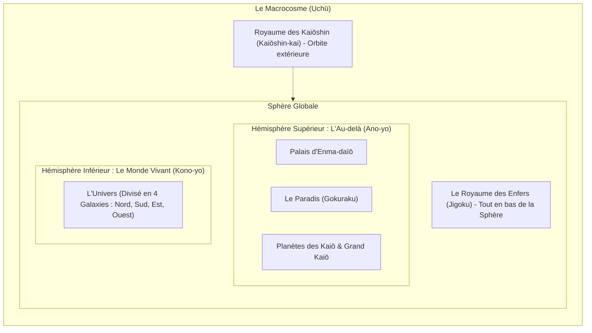

# 📚 Base de Connaissance Unifiée — 07/06/2026

> Ce fichier regroupe toute la documentation du projet pour faciliter le contexte et l'analyse.

## 🤖 Capacités & Agents

### 🛠 Skills & Compétences


### 🕵️ Agents Spécialisés


---

## 🗂 Sommaire

- [This is NOT the Next.js you know](#agents-md)
- [Changelog](#changelog-md)
- [CLAUDE.md — shenron](#claude-md)
- [Déploiement de Shenron](#deploy-md)
- [DESIGN.md — Système graphique DBFR](#design-md)
- [GEMINI.md](#gemini-md)
- [Shenron Monorepo — Learning Memory](#memory-md)
- [PLAN.md — RAG canon (bxc) + LLM Dragon Ball (aphrody)](#plan-md)
- [PROMPT.md — Sprint DBFR (Shenron bot + site public)](#prompt-md)
- [1. Bun ≥ 1.3](#readme-md)
- [Politique de sécurité](#security-md)
- [Recon report — https://anilist.co/](#apps-bot-data-rag-anilist-md)
- [Recon report — https://en.bandainamcoent.eu/dragon-ball](#apps-bot-data-rag-bandai-eu-md)
- [Recon report — https://en.dragon-ball-official.com/](#apps-bot-data-rag-dbofficial-en-md)
- [Recon report — https://fr.dragon-ball-official.com/](#apps-bot-data-rag-dbofficial-fr-md)
- [dragonball-api.md](#apps-bot-data-rag-dragonball-api-md)
- [Android 17](#apps-bot-data-rag-fandom-android17-en-md)
- [Android 18](#apps-bot-data-rag-fandom-android18-en-md)
- [Bardock](#apps-bot-data-rag-fandom-bardock-en-md)
- [Bardack](#apps-bot-data-rag-fandom-bardock-fr-md)
- [Beerus](#apps-bot-data-rag-fandom-beerus-en-md)
- [Beerus](#apps-bot-data-rag-fandom-beerus-fr-md)
- [Broly](#apps-bot-data-rag-fandom-broly-en-md)
- [Broly (Homonymie)](#apps-bot-data-rag-fandom-broly-fr-md)
- [Majin Buu](#apps-bot-data-rag-fandom-buu-en-md)
- [Majin Boo](#apps-bot-data-rag-fandom-buu-fr-md)
- [C-17](#apps-bot-data-rag-fandom-c17-fr-md)
- [C-18](#apps-bot-data-rag-fandom-c18-fr-md)
- [Cell](#apps-bot-data-rag-fandom-cell-en-md)
- [Cell](#apps-bot-data-rag-fandom-cell-fr-md)
- [Dragon Ball (object)](#apps-bot-data-rag-fandom-dragonballs-en-md)
- [Frieza](#apps-bot-data-rag-fandom-frieza-en-md)
- [Freezer](#apps-bot-data-rag-fandom-frieza-fr-md)
- [Gogeta](#apps-bot-data-rag-fandom-gogeta-en-md)
- [Gogeta (Homonymie)](#apps-bot-data-rag-fandom-gogeta-fr-md)
- [Gohan](#apps-bot-data-rag-fandom-gohan-en-md)
- [Son Gohan](#apps-bot-data-rag-fandom-gohan-fr-md)
- [Goku](#apps-bot-data-rag-fandom-goku-en-md)
- [Son Goku](#apps-bot-data-rag-fandom-goku-fr-md)
- [Goku Black](#apps-bot-data-rag-fandom-gokublack-en-md)
- [Goku Black](#apps-bot-data-rag-fandom-gokublack-fr-md)
- [Gotenks](#apps-bot-data-rag-fandom-gotenks-en-md)
- [Gotenks](#apps-bot-data-rag-fandom-gotenks-fr-md)
- [Jiren](#apps-bot-data-rag-fandom-jiren-en-md)
- [Jiren](#apps-bot-data-rag-fandom-jiren-fr-md)
- [Ki](#apps-bot-data-rag-fandom-ki-en-md)
- [Ki](#apps-bot-data-rag-fandom-ki-fr-md)
- [Krilin](#apps-bot-data-rag-fandom-krilin-fr-md)
- [Krillin](#apps-bot-data-rag-fandom-krillin-en-md)
- [Piccolo](#apps-bot-data-rag-fandom-piccolo-en-md)
- [Piccolo](#apps-bot-data-rag-fandom-piccolo-fr-md)
- [Sagas](#apps-bot-data-rag-fandom-sagas-fr-md)
- [Transformation](#apps-bot-data-rag-fandom-transformations-en-md)
- [Trunks](#apps-bot-data-rag-fandom-trunks-en-md)
- [Trunks](#apps-bot-data-rag-fandom-trunks-fr-md)
- [Vegeta](#apps-bot-data-rag-fandom-vegeta-en-md)
- [Vegeta](#apps-bot-data-rag-fandom-vegeta-fr-md)
- [Vegito](#apps-bot-data-rag-fandom-vegito-en-md)
- [Vegetto](#apps-bot-data-rag-fandom-vegito-fr-md)
- [Whis](#apps-bot-data-rag-fandom-whis-en-md)
- [Whis](#apps-bot-data-rag-fandom-whis-fr-md)
- [Zamasu](#apps-bot-data-rag-fandom-zamasu-en-md)
- [Zamasu](#apps-bot-data-rag-fandom-zamasu-fr-md)
- [Recon report — https://jikan.moe/](#apps-bot-data-rag-jikan-md)
- [Recon report — https://kanzenshuu.com/](#apps-bot-data-rag-kanzenshuu-md)
- [Recon report — https://kitsu.io/](#apps-bot-data-rag-kitsu-md)
- [Recon report — https://en.wikipedia.org/wiki/Dragon_Ball](#apps-bot-data-rag-raw-generic-wiki-dragon-ball-md)
- [Akira Toriyama Tankōbon Introductions](#apps-bot-data-rag-raw-guides-akira-toriyama-tankobon-introductions-md)
- [Daizenshuu 1 - Shenlong Times Interview](#apps-bot-data-rag-raw-guides-daizenshuu-1-shenlong-times-md)
- [Dragon Ball Forever - Toriyama Interview](#apps-bot-data-rag-raw-guides-dragon-ball-forever-toriyama-md)
- [SEG: Character Volume - Truth About Dragon Ball](#apps-bot-data-rag-raw-guides-seg-character-volume-md)
- [SEG: Story Volume - Truth About Dragon Ball](#apps-bot-data-rag-raw-guides-seg-story-volume-md)
- [wiki-dragon-ball.md](#apps-bot-data-rag-raw-wikipedia-wiki-dragon-ball-md)
- [Recon report — https://en.wikipedia.org/wiki/Dragon_Ball](#apps-bot-data-rag-raw-wikipedia-wiki-dragon-ball-recon-md)
- [Recon report — https://shonenjumpplus.com/](#apps-bot-data-rag-shonenjump-plus-md)
- [Recon report — https://www.shueisha.co.jp/](#apps-bot-data-rag-shueisha-md)
- [Recon report — https://www.toei-animation.com/catalog/dragon-ball/](#apps-bot-data-rag-toei-animation-md)
- [Recon report — https://www.viz.com/shonenjump/chapters/dragon-ball-super](#apps-bot-data-rag-viz-media-md)
- [Recon report — https://en.wikipedia.org/wiki/Dragon_Ball](#apps-bot-data-rag-wiki-db-md)
- [Recon report — https://en.wikipedia.org/wiki/Dragon_Ball_Super](#apps-bot-data-rag-wiki-dbsuper-md)
- [Recon report — https://en.wikipedia.org/wiki/Dragon_Ball_Z](#apps-bot-data-rag-wiki-dbz-md)
- [This is NOT the Next.js you know](#apps-site-agents-md)
- [CLAUDE.md](#apps-site-claude-md)
- [or](#apps-site-readme-md)
- [Neon ↔ GitHub ↔ Vercel — automatisation DB (site `dbfr`)](#apps-site-docs-neon-automation-md)
- [deploy/ — provisioning self-contained du monorepo](#deploy-readme-md)
- [🐉 Rapport d'Expansion de la Base de Données Dragon Ball](#docs-archive-db_expansion_report-md)
- [Recon report — https://fr.dragon-ball-official.com/](#docs-archive-dbo_fr-md)
- [Recon report — https://dragonball.fandom.com/fr/wiki/Wiki_Dragon_Ball](#docs-archive-fandom_fr-md)
- [Recon report — https://fr.dragon-ball-official.com/news/](#docs-archive-news-md)
- [Recon report — https://en.bandainamcoent.eu/dragon-ball/dragon-ball-sparking-zero](#docs-archive-sparking-fast-md)
- [Recon report — https://en.bandainamcoent.eu/dragon-ball/dragon-ball-sparking-zero](#docs-archive-sparking-md)
- [Cosmologie de Dragon Ball — Structure du Macrocosme & Au-delà (Daizenshuu 4 & 7)](#docs-dragon-ball-cosmology-md)
- [Système de Synchronisation Google Drive (Wiki Assets)](#docs-drive-md)
- [LLM Dragon Ball — assistant conversationnel local](#docs-llm-maison-md)
- [Dragon Ball Lore — Akira Toriyama Databook Revelations (SEG)](#docs-toriyama-databook-seg-md)
- [Lore de Dragon Ball — Citations & Philosophie d'Akira Toriyama (Daizenshuu)](#docs-toriyama-interviews-md)
- [@discordx/di](#packages-di-changelog-md)
- [@rpbey/di](#packages-di-readme-md)
- [Security Policy](#packages-di-security-md)
- [discordx](#packages-discordy-changelog-md)
- [@rpbey/discordy](#packages-discordy-readme-md)
- [Security Policy](#packages-discordy-security-md)
- [@discordx/importer](#packages-importer-changelog-md)
- [@rpbey/importer](#packages-importer-readme-md)
- [Security Policy](#packages-importer-security-md)
- [@discordx/internal](#packages-internal-changelog-md)
- [@rpbey/internal](#packages-internal-readme-md)
- [Security Policy](#packages-internal-security-md)
- [@discordx/pagination](#packages-pagination-changelog-md)
- [@rpbey/pagination](#packages-pagination-readme-md)
- [Security Policy](#packages-pagination-security-md)
- [Sources RAG Dragon Ball — Inventaire & Matrice de Curation](#reference-db-recon-sources-rag-md)

---

<a name="agents-md"></a>
## 📄 Fichier : `AGENTS.md`

**Titre original :** This is NOT the Next.js you know

<!-- BEGIN:nextjs-agent-rules -->
### This is NOT the Next.js you know

This version has breaking changes — APIs, conventions, and file structure may all differ from your training data. Read the relevant guide in `node_modules/next/dist/docs/` before writing any code. Heed deprecation notices.
<!-- END:nextjs-agent-rules -->

<!-- Project note (outside the managed block): the Next.js app is `apps/site`.
     `next` is hoisted to the repo-root `node_modules/`, so the docs path above is
     correct when working from the repo root. See `apps/site/AGENTS.md` and
     `CLAUDE.md`. -->


---

<a name="changelog-md"></a>
## 📄 Fichier : `CHANGELOG.md`

**Titre original :** Changelog

### Changelog

Format : [Keep a Changelog](https://keepachangelog.com/fr/1.1.0/).
Versionnement : date + courte description.

## [Unreleased] — 2026-06-02

### Added

- **Assistant Dragon Ball conversationnel local** — vrai modèle capable servi en local (llama.cpp, **Qwen2.5-3B-Instruct**, port **:5008**, `shenron-llm.service`), aucune API externe. Conversation naturelle + raisonnement + **mémoire** (historique par session dans Redis), détection du bavardage (un « bonjour » = vraie réponse, plus de dump d'archives), faits via RAG **reformulés** dans la voix du persona. Branché bot (Discord autonome) + site (FloatingAssistant, mémoire par navigateur). _NB : un premier modèle entraîné from-scratch (29M, `dbz_llm.py`) s'est révélé trop petit pour converser — conservé comme artefact, non utilisé en prod._
- **RAG massivement enrichi** — crawl concurrent multi-wiki FR+EN (`crawl-fandom-rag.ts`, via `action=parse`) : **~7000 entités / 36k chunks** (vs 58 personnages). Indexation Discord complète sans cap (`index-discord-full.ts`). Éval honnête `eval-own.ts` + dashboard `/admin/evaluations`. Doc : [`docs/llm-maison.md`](docs/llm-maison.md).

### Changed

- **Next.js bumpé `16.3.0-canary.21` → `.37`** (catalog racine + override + `@next/env`) — doctrine nightly. Type-check, lint, `next build` et déploiement prod verts.

### Fixed

- **`better-auth` épinglé exact `1.6.11`** (catalog) — `@better-auth/kysely-adapter@1.6.13` importe `DEFAULT_MIGRATION_TABLE`, absent de `kysely@0.29.2` → casse le build Turbopack du site (Vercel re-résout `^1.6.11` vers la version cassée). Pin exact = résolution déterministe (1.6.11 verrouille lui-même `kysely@^0.28.17`).

### Ops

- **Open-source** — `aphrody-code/shenron` passé **public** (2026-06-02). Ajout `LICENSE` (**Apache-2.0**) + `SECURITY.md` racine ; README/CLAUDE.md alignés (badge, rationale deploy Vercel).
- **Historique git purgé de toute PII** — `git-filter-repo` sur **toutes les branches + refs PR** : suppression des dumps SQLite (`*.db`/`*.sqlite`, dont un backup de 5860 membres), `apps/bot/data/guild-scan.json` (scan de 5764 membres Discord), `.recovery-checkpoint.json`. `.gitignore` durci (`*.db`/`*.sqlite*` global + exports runtime). Audit : aucun secret/token n'était commité. `fr-episode-titles.json` (donnée publique) conservé.
- **Sync Neon↔SQLite rétablie** — timers `shenron-neon-sync.timer` (forward runtime+news, 30 min) + `shenron-neon-pull.timer` (reverse wiki éditorial, 15 min) réinstallés/activés + env `~/.shenron-neon.env` recréé (600). Resync forward vérifié (23 tables, 9146 lignes, 0 mismatch) ; wiki déjà aligné.

## [Unreleased] — 2026-06-01

### Added

- **RAG SOTA — récupération hybride + reranking** (`apps/bot/src/lib/{embeddings,rag}.ts`, `apps/bot/embed-server.ts`) — passage du FTS5 keyword pur à un pipeline 2 étages 100 % local, FR+JP : étage 1 = récupération **hybride** BM25 (`rag_chunks` FTS5) + embeddings denses multilingues (`rag_vectors`, modèle `Xenova/multilingual-e5-small` 384d, cosinus exact brute-force) fusionnés en **RRF** (k=60) ; étage 2 = **reranking cross-encoder** (`Xenova/bge-reranker-base`) du top-15. Sidecar dédié `shenron-embed.service` (port 5007 loopback, 2 modèles chauds, `MemoryMax=3G`) — `embeddings.ts` (heavy) n'est **jamais** importé par le bundle bot, `rag.ts` (runtime léger) fetch HTTP vers le sidecar. Build offline : `bun --filter @shenron/bot run rag:build` (override `RAG_DB=/path` pour tester sur copie). Dégradation gracieuse 3 niveaux (`mode` ∈ `hybrid+rerank | hybrid | lexical`). Consommateurs : `/api/public/rag/search` (REST), `ragSearch` (GraphQL), commande Discord `/ask`, recherche du site (`dbUniverse.rag`).
- **API GraphQL publique read-only** (`apps/bot/src/api/graphql.ts`) — endpoint `/graphql` sur le `Bun.serve` du bot, code-first **Pothos** + **graphql-yoga**, GraphiQL activé, CORS public, garde-fou profondeur max 10. Expose le wiki (`characters`/`planets`/`sagas`/`episodes`/`techniques`/`transformations`/`movies`/`games`/`races`) + relations + `ragSearch` (RAG hybride) + `counts`. Deps : `graphql@16 graphql-yoga@5 @pothos/core@4`.
- **OpenAPI 3.1 + UI Scalar** (`apps/bot/src/api/openapi.ts`) — spec statique servie à `/api/openapi.json` (CORS public, cache 1 h) et UI interactive **Scalar** à `/api/docs` (CDN, zéro dep). Couvre la surface REST publique (RAG / Wiki / Insights / Médias).
- **Commande Discord `/ask`** (`apps/bot/src/commands/wiki/Ask.ts`, persona Whis) — question FR en langage naturel → RAG hybride+rerank → embed sourcé (résultats classés, `kind` iconifié, snippets, liens vers le site) + bouton **« Ouvrir le meilleur résultat »**. Dégradation gracieuse.
- **Site — animations cinématiques** (`apps/site/src/components/ViewTransition.tsx`, `app/globals.css`, `next.config.ts`) — **View Transitions API** (morph d'élément partagé grille→fiche personnages/planètes, slides directionnels nav-forward/back via `ViewTransition` isomorphe + `experimental.viewTransition: true`), scroll-driven animations CSS natives (`animation-timeline: view()` reveal staggeré), ki-glow au survol (`@property --ki-angle`), hero ken-burns enrichi + wordmark glow. `prefers-reduced-motion` respecté, cache CDN préservé (pages Static/SSG), zéro framer-motion (motion / CSS natif).

## [Unreleased] — 2026-05-31

### Added

- **Home cinématique full-page « Codex Shenron »** (`apps/site/src/components/home/*`, `app/page.tsx`) — réécriture complète de la home en 7 panneaux plein écran scroll-snap (navigation molette + clavier + tactile), fonds animés des meilleures scènes DB (ken-burns + grade d'ère + grain + aura ki + letterbox), et état **réel + live** du bot (SSR + poll 25 s + SSE `a2a/events` → power-levels animés, gardiens en ligne, flux d'événements). Réutilise `motion` / CSS natif (`animation-timeline: view()`), zéro framer-motion.
- **Scènes d'épisode** (end-to-end) — colonnes `db_episodes.frames` (jsonb `EpisodeFrame[]`) + `scene_preview` ; extraction `scripts/extract-dbz-frames.ts` (ffmpeg vidéo locale) et `scripts/scrape-dbz-fandom-frames.ts` (API MediaWiki, méthode rpbey) ; orchestrateur `scripts/build-episode-scenes.ts` (frames + `preview.mp4`) ; ingest Neon gardé `scripts/ingest-episode-frames.ts` ; affichage wiki (`/wiki/episodes/[id]` : hero `AnimatedMedia` + galerie + export GIF).
- **Composants média site** (`apps/site/src/components/media/*`) — `AnimatedMedia` (video/gif lazy a11y), `BackgroundImage`/`HeroBackground` (next/image fill, variantes kenburns/parallax CSS), `encodeGif` (`modern-gif`, frames→GIF browser).
- **Télémétrie first-party RGPD** (`apps/site/src/lib/{telemetry,consent,recommendations}.ts`, `app/api/telemetry`, `components/{ConsentGate,TrackView}`) — `track()` typé fan-out **Vercel Analytics + GTM dataLayer + Postgres** (tables `site_events`/`user_preferences`), anonymisation (hash salé, anonId httpOnly), **Google Consent Mode v2**, fondation recommandations/personnalisation (co-vues + affinité + populaire).
- **Google Tag Manager** (`GTM-KLSS5787`) via `@next/third-parties/google` + `<noscript>`.
- **Pages wiki dédiées Personnages + Planètes** (`app/wiki/personnages`, `app/wiki/planetes`) — index manquants jusqu'ici (persos/planètes browsables uniquement via le fourre-tout `/wiki/dragon-ball`). `CharacterGrid` client (`components/wiki/`) : grille filtrable recherche + facettes par race, compteur live. Routes détail inchangées sous `/wiki/dragon-ball/{character,planet}/…`.
- **`lib/config.ts` — source unique des URL/API du site** (client-safe) : `API_URL` (API bot), `ASSET_BASE` (assets bot), `SITE_URL`, `DISCORD_INVITE` + helpers `apiUrl()`/`assetBaseUrl()`. `dbUniverse.counts()` (un round-trip groupé) pour les comptes réels du wiki.

### Changed

- **bxc crawl bumpé sur 0.5.4** — `scripts/ingest/bxc-ingest.ts` réécrit (sortie `bxc scrape` = JSON), `BXC_DIR`/`BXC_PROFILE` env, profils `static|fast|http|stealth|max` (le profil `ghost` n'existe plus).
- **Home recadrée « Voyage à travers l'univers Dragon Ball »** — narratif d'exploration centré contenu ; le mot « wiki » retiré de toute la vitrine (héro, summon, rôle Whis, description SEO globale, 404). CTA « Commencer le voyage », panneau univers titré « Voyage à travers l'univers ».
- **Hub `/wiki` à comptes dynamiques** — les ~9 nombres codés en dur (« 58 personnages », « 25 films »…) remplacés par `dbUniverse.counts()` (Neon réel) → plus de désynchro quand la DB grossit. Copies landing/metadata rendues evergreen.
- **Unification URL/API du site** — ~14 défauts `https://bot.dragonballfr.com`, ~9 littéraux `discord.gg/dbfr` et l'URL site, dispersés dans ~27 fichiers → collapsés sur `lib/config.ts`. Future migration de domaine = 2 env vars au lieu de 27 fichiers. `auth*` / allowlist télémétrie / branding OG volontairement épargnés ; bot (producteur unique d'API) non concerné.

### Fixed

- **`/wiki/dragon-ball` → 308 dur** via `next.config` `redirects()` vers `/wiki/personnages` (un `permanentRedirect()` en composant dégradait en page 200 + `<meta refresh>` à cause du streaming du layout `/wiki`). Fourre-tout « Encyclopédie » (doublon de Films/Jeux) supprimé.
- **FAB Discord invite cassée** — `DiscordInviteFAB` retombait sur `https://discord.gg/votre_invite_ici` si `NEXT_PUBLIC_DISCORD_INVITE_URL` absent → désormais `DISCORD_INVITE` (défaut `discord.gg/dbfr`).

### Ops

- **`ops(domaine)` : migration prod vers `dragonballfr.com`** — le site bascule sur `https://dragonballfr.com` (canonical, OG, liens publics) et l'API/assets du bot sur `https://bot.dragonballfr.com`. Les alias historiques `rpbey.fr` / `dbfr.vercel.app` (site) et `bot.rpbey.fr` (API) restent conservés (redirections / origines de confiance), mais ne sont plus le domaine de référence.
- **Infra dragonballfr.com** — vhost VPS `deploy/nginx/bot.dragonballfr.com.conf` (proxy `:5006` + cache CDN long sur `/assets/`), cert Let's Encrypt `bot.dragonballfr.com`, DNS OVH (apex/www → Vercel, `bot` → VPS), env Vercel (`BETTER_AUTH_URL`/`SHENRON_API_URL`/`NEXT_PUBLIC_SHENRON_API_URL`). Compte OVH `gl839461-ovh`.
- **Schémas** — colonnes Neon `bot.db_episodes.{frames,scene_preview}` ; tables Postgres site `site_events` + `user_preferences` (migration `apps/site/src/db/migrations/0000_*`, appliquée).
- **Discord OAuth** — redirect URIs à déclarer côté portail pour `dragonballfr.com`/`bot.dragonballfr.com` (app `1497194276025663680`).

## [Unreleased] — 2026-04-25

### Added

- **API REST (`Bun.serve`) tscord-compatible** — surface alignée sur les controllers de [`@rpbey/tscord`](../../packages/tscord/), permet à un fork de [`barthofu/tscord-dashboard`](https://github.com/barthofu/tscord-dashboard) de piloter shenron. Bind `127.0.0.1:5006` par défaut, auth Bearer (`API_ADMIN_TOKEN`).
  - **Health** : `/health/{check,latency}` (public) + `/health/{usage,host,monitoring,logs}` (admin)
  - **Stats** : `/stats/totals` (users/guilds/commands), `/stats/interaction/last`, `/stats/guilds/last`
  - **Bot** : `/bot/guilds`, `/bot/commands`, `/bot/commands/:name` (full schema avec options/choices)
  - **Cron** (`CronRegistry` centralisé, registres `voice-xp-tick`, `jail-expiry`, `bio-role-scan`) : `GET /cron` (last/next run, durée, erreurs) · `POST /cron/:name/trigger` (déclenchement manuel)
  - **Services** : `GET /services` (list whitelist) · `POST /services/:service/:action` (achievements.refresh, economy.addZeni, level.addXP, settings.set, translate.probe, moderation.countWarns, wiki.search…)
  - **Database CRUD générique** sur 16 tables whitelist : `GET /database/tables` · `GET /database/:table?limit&offset` · `GET/PUT/DELETE /database/:table/:id` · `POST /database/:table`. `mutableColumns` par table pour empêcher l'édition de colonnes sensibles.
  - **OpenAPI 3.0.1** auto-généré sur `/openapi`.
- **`StatsService`** — équivalent du `Stats` service tscord, sans deps `pidusage`/`node-os-utils` (lit `process.memoryUsage`/`process.cpuUsage` + `node:os` natifs).
- **`CronRegistry`** — singleton qui collecte les `setInterval` des events (VoiceXP, JailExpiry, BioRole) et expose `lastRunAt`, `lastDurationMs`, `runCount`, `lastError`, `nextRunAt`.
- **`ApiServer`** — Bun.serve natif avec `routes` Map, params `:name`/`:id` typés, error handler global, `Response.json` + `req.json()` web-standard. Lance dans `clientReady` après `boot-audit`.
- **`/translate`** — OCR d'image + traduction VF (ou EN/ES/DE/IT/JA), 100 % FOSS via **Tesseract** (Apache 2.0, `Bun.spawn` stdin) + **LibreTranslate** (AGPL-3.0, Docker self-host). Slash command **et** menu contextuel **"Traduire en VF"** (clic droit message → Apps). Hard caps prod : image ≤ 10 MiB, timeout tesseract 30 s, timeout LibreTranslate 8 s, garde SSRF (refuse `file://`, IPs privées, `localhost`). Probe au boot dans `boot-audit.ts` — la commande devient inactive avec message d'erreur explicite si l'un des deux est down.
- **`/config`** — slash group admin (dashboard MVP) : `/config list/set/unset` pour les overrides runtime (XP rates, cooldowns, salons), `/config channel <type> <salon>`, `/config level-reward-set/-remove/-rewards`. Persisté en table `guild_settings` (key/value, cache 30 s) → override les constantes hardcodées sans redéploiement. Vérifie la **hiérarchie de rôles** sur `level-reward-set` (refuse si rôle ≥ rôle bot).
- **Challenge buttons** — nouveau `src/lib/challenge.ts` (helper Accept/Decline réutilisable, customId `challenge:<scope>:<action>:<key>`). Câblé dans `/pendu joueur` et `/morpion joueur` : message de défi avec boutons **✅ Accepter** / **❌ Refuser** (timeout 60 s). La partie ne démarre qu'après acceptation explicite de l'adversaire.
- **`/pendu` amélioré** — embed avec **nombre de lettres** affiché, lettres trouvées vs ratées triées (`Array.toSorted`), 7 frames ASCII du pendu (0→6 erreurs), mot révélé en `||spoiler||` à la défaite.
- **`/morpion` amélioré** — embed dynamique, IA défensive (gagner > bloquer > centre > coin > random), ligne gagnante surlignée en vert.
- **Texte double-police** — nouveau `canvas-kit.ts::textDoubleFont` qui superpose deux polices avec offset/blur (Saiyan Sans glow + Inter Display Black net) pour effet relief DBZ. Appliqué au pseudo de `/scan` et au titre des gauges `/gay` / `/raciste`.
- **Salon des accomplissements séparé** — nouvelle var `ACHIEVEMENT_CHANNEL_ID` + `resolveAchievementChannel` (retombe sur `ANNOUNCE_CHANNEL_ID` si absent). Notifs 🏆 envoyées en `EmbedBuilder` brand au lieu de plain text.
- **Helpers embed** — `src/lib/embeds.ts` (`brandedEmbed`, `successEmbed`, `errorEmbed`, `warningEmbed`) inspirés de `@rpbey/tscord/utils/functions/embeds`, sans tirer la stack tscord complète.
- **Service `SettingsService`** — table `guild_settings` (migration `0001_lazy_scrambler.sql`), validation par type (int/snowflake/string/bool), invalidation cache après set, mono-guild assumed (le bot est verrouillé sur `env.GUILD_ID`).
- **Service `TranslateService`** — encapsule Tesseract CLI + LibreTranslate, méthode `probe()` au boot pour détecter la dispo runtime, validation URL anti-SSRF (`isIP`, ranges privés RFC1918/loopback/link-local/ULA).
- **`scripts/setup-translate.sh`** — script idempotent qui installe Tesseract via apt (packs `fra/eng/jpn/spa/deu/ita`) et lance LibreTranslate en Docker (`127.0.0.1:5000` bind, modèles `en,fr,ja,es,de,it`, `LT_DISABLE_WEB_UI=true`). Healthcheck 3 min.

### Changed

- **Workspace** — `apps/shenron` retiré de l'exclusion `!apps/shenron` du root `package.json` du monorepo VPS. Les packages `@rpbey/{di,discordx,importer,pagination}` passent en `workspace:*`, `discord.js` et `typescript` en `catalog:`.
- **`MessageXP.ts`** — `resolveAchievementChannel` est désormais résolu **lazy** uniquement si on a un succès à annoncer (`isFirstMessage || granted.length > 0`). Évite un `client.channels.fetch` HTTP par messageCreate (rate-limit Discord sur serveurs actifs).

### Fixed

- **Fuites mémoire potentielles `/morpion`** — Map `games` GC manquant. Ajout de `setTimeout(games.delete, 30 min).unref()` après chaque création.
- **Race condition `/pendu`** — un user qui clique "Accepter" après expiration démarrait quand même. Check `expiresAt <= Date.now()` dans `onChallengeButton`.
- **Tous les `setTimeout`** — `.unref()` ajouté pour ne pas garder l'event loop éveillé.
- **Tesseract hang sur image malicieuse** — hard kill via `setTimeout(proc.kill, 30s)` + cap `content-length` 10 MiB.
- **LibreTranslate freeze user 30 s** — timeout descendu à 8 s, message d'erreur explicite avec URL configurée.

## [Unreleased] — 2026-04-24

### Added

- **Salon de commandes dédié** — nouvelle var `COMMANDS_CHANNEL_ID` + guard `CommandsChannelOnly` appliqué aux commandes user-facing (`/shop`, `/buy`, `/eprofil`, `/fusion`, `/solde`, `/gay`, `/raciste`, `/scan`, `/bingo`, `/morpion`, `/pendu`, `/pfc`, `/profil`, `/top`, `/niveau`, `/wiki`, `/races`, `/planete`). Hors du salon ciblé → reply éphémère. Commandes modération / admin / tickets / vocaux restent utilisables partout.
- **Salon d'annonces** — nouvelle var `ANNOUNCE_CHANNEL_ID` + helper `src/lib/announce.ts::resolveAnnounceChannel`. Les messages de level-up (texte **et** vocal), quête quotidienne, premier message, succès pattern-based sont publiés dans ce salon unique au lieu du salon d'origine.
- **Level rewards DBZ** — seed automatique de la table `level_rewards` avec 10 rôles canoniques (Kaioken → Perfect Ultra Instinct) mappés aux paliers `LEVEL_THRESHOLDS`. Script `bun run db:seed-levels` + intégré dans `db:seed-all`.
- **Audit boot-time** — nouveau `src/lib/boot-audit.ts` exécuté à `clientReady`. Vérifie pour chaque ID env : existence du salon/rôle sur la guild, type attendu (text/category/voice), position hiérarchique vs bot. Signale les 10 rôles level-reward en cas d'injoinables. Log unique `✓ boot-audit OK` ou warnings détaillés.
- **Scan de la guild** — `scripts/scan-ids.ts` dump 172 salons + 185 rôles + 5756 users (avec rôles de chaque user) dans `data/guild-scan.json`. Sert de source de vérité pour le ciblage des vars env et le seed des level-rewards.

### Changed

- **GUILD_ID** basculé du serveur de test (`1497167233280118896`) vers la prod Dragon Ball FR (`934894610545770506`). 41 commandes ré-enregistrées sur la nouvelle guild.
- **`.env` rempli** depuis le scan :
  - `LOG_MESSAGE_CHANNEL_ID` / `LOG_SANCTION_CHANNEL_ID` / `LOG_ECONOMY_CHANNEL_ID` / `LOG_JOIN_LEAVE_CHANNEL_ID` / `LOG_LEVEL_ROLE_CHANNEL_ID` / `LOG_TICKET_CHANNEL_ID` → `1032622751845990401` (💾・logs, salon unique du serveur)
  - `MOD_NOTIFY_CHANNEL_ID` → `1142417515004317748` (🛠️・moderation)
  - `JAIL_ROLE_ID` → `1405635615827034194` (**Jugé par Enma**, 6 jailed actifs) — substitué au badge cosmétique _JAIL_ (0 membre)
  - `URL_IN_BIO_ROLE_ID` → `935209498862317698` (.gg/dragonballfr)
  - `TICKET_CATEGORY_ID` → `1034596363096301719` (⌈🌟⌋ DB FR)
  - `SERVER_INVITE_URL` → `https://discord.gg/dragonballfr`
- **Wiki Dragon Ball** — DB peuplée via `bun run db:seed-all` : 58 personnages, 20 planètes, 43 transformations depuis `dragonball-api.com`. Descriptions en espagnol (endpoint FR upstream supprimé, confirmé via `?lang=fr`/`lang=en`/`Accept-Language`). Footer des embeds annote `source: dragonball-api.com`.

### Fixed

- **`/wiki` / `/races` / `/planete`** retournaient "introuvable" → DB seedée, les trois commandes fonctionnent avec autocomplete.
- **Level-up vocal silencieux** — `VoiceXP` ne passait pas de salon à `handleLevelUp`, aucun message posté. Désormais résout `ANNOUNCE_CHANNEL_ID` et publie correctement.

### Notes opérationnelles

- Le rôle **Shenron** (integration) doit rester **au-dessus** de tous les rôles attribués (.gg/dragonballfr à la position 97, rôles level-up jusqu'à 94). Boot-audit confirme position actuelle du bot = 148.
- Les tickets créés par `/ticket-panel` tomberont sous la catégorie DB FR (à côté de 🔖・ticket).
- `VOCAL_TEMPO_HUB_ID` laissé vide : aucun hub vocal "➕" unique sur le serveur (plusieurs par catégorie de jeu). Feature inactive tant qu'une var n'est pas définie.


---

<a name="claude-md"></a>
## 📄 Fichier : `CLAUDE.md`

**Titre original :** CLAUDE.md — shenron

### CLAUDE.md — shenron

Monorepo standalone (sorti du VPS le 2026-05-16). Bot Discord DBZ multi-personas + site Next.js compagnon.

**Sources de vérité** :
- Bot prod : service systemd `shenron.service` sur le VPS (`WorkingDirectory=/home/ubuntu/shenron/apps/bot`).
- Site prod : Vercel projet `dbfr` (`prj_wxLn9COQIo9HAOUVis08ppKXx7zI`), **domaine de prod unique : `https://dragonballfr.com`** (les alias historiques `dbfr.vercel.app` et `www.dragonballfr.com` sont redirigés de manière permanente vers l'apex). L'API bot est servie côté VPS sur `bot.dragonballfr.com` (ex- `bot.rpbey.fr` / `shenron.rpbey.fr` legacy).
- DB bot : SQLite local `apps/bot/data/bot.db` (snapshot quotidien via timer VPS).
- DB site : **Postgres distinct** (Neon ou autre, via `DATABASE_URL`) — ce n'est PAS la même DB que le bot.

## Lecture obligatoire

1. `GEMINI.md` — vision agent + règles dev (Bun-only, personas, DI tsyringe).
2. `DEPLOY.md` — guide déploiement (Fly / VPS systemd / Docker / binaire).
3. `README.md` — usage et architecture personas.
4. `CHANGELOG.md` — releases.

## Workflow PRODUCTION

### Bot (VPS)
- Le code vit ici dans `~/shenron/`. Le service systemd lit directement ce path.
- Déploiement = `git pull` dans `~/shenron/` puis `sudo systemctl restart shenron`. Le script **in-repo** `scripts/deploy-shenron.sh` automatise (pull + lint/tsc + dashboard:css + restart + smoke `/auth/me` + rollback auto).
- Réactivation complète = `bash scripts/reactivate.sh` (Nettoyage de tous les caches, bun install, migration DB, régénération des entrées, build RAG, compile CSS du dashboard, re-setup systemd et redémarrage propre de tous les services et timers de production).
- **Aucun build préalable** : Bun exécute `src/index.ts` en direct (TS natif).
- Backup DB quotidien : timer VPS `shenron-backup.timer` (03:00 UTC) → `VACUUM INTO` snapshot.
- Sync DB↔Discord quotidien : timer VPS `shenron-guild-sync.timer` (04:00 UTC).

### Site (Vercel)
- Auto-deploy sur push `main` via **GitHub Actions** (`.github/workflows/deploy-vercel.yml` → `vercel deploy --prod`). Le projet Vercel `dbfr` n'est PAS encore connecté nativement au repo. **Le repo `aphrody-code/shenron` est PUBLIC depuis le 2026-06-02** ; il ne reste qu'une **action navigateur** pour passer au natif : autoriser la GitHub App Vercel sur le repo (`https://github.com/apps/vercel/installations/select_target` → compte `aphrody-code` → ajouter `shenron`), **puis** `vercel git connect` (échoue tant que l'App n'a pas accès). Une fois le natif confirmé : supprimer ce workflow (sinon double deploy) et les secrets repo `VERCEL_TOKEN` (`vcp_…`), `VERCEL_ORG_ID`, `VERCEL_PROJECT_ID` deviennent inutiles.
- Deploy manuel : `vercel deploy --prod --yes` depuis la racine du repo (jamais depuis `apps/site/`).
- Envs gérées dans Vercel UI (jamais commitées). Inclut `DATABASE_URL`, `DISCORD_CLIENT_ID/SECRET`, `BETTER_AUTH_URL`, `BETTER_AUTH_SECRET`.
- Build : `bun --filter @shenron/site build`. Pas de build VPS.
- `.vercelignore` exclut `apps/bot/` du build site.

### Règles dures
1. **Pas d'édition manuelle sur le VPS dans `~/shenron/`** : tout passe par PR sur `github.com/aphrody-code/shenron` puis `git pull` côté VPS.
2. **Bun obligatoire** : pas de `node`/`npm`/`pnpm`/`yarn`/`tsx`. Utiliser `bun`, `bunx`, `bun --filter <app> <cmd>`.
3. **Secrets** : jamais dans le repo. `.env` est gitignored. Production = envs Vercel ou `apps/bot/.env` chargé par systemd.
4. **Zéro FFI / Rust** : La stack Rust native `apps/bot/native/` est supprimée. Tout utilitaire (calcul de niveau, parsing) est écrit en TypeScript pur dans `apps/bot/src/lib/native.ts`.
5. **Catalog de Dépendances** : Toutes les versions de dépendances du monorepo doivent utiliser la syntaxe de catalogue de Bun (`catalog:`) définie dans le `package.json` racine.
6. **Paths et Déploiement Dynamiques** : Aucun chemin absolu codé en dur dans les templates systemd (`deploy/systemd/`) ou les scripts de déploiement. Ils doivent être résolus dynamiquement à l'installation.

## Style

- **Commits / PR** : 1 ligne `feat|fix|chore|refactor|docs|ops(scope):` français. Pas d'emoji, pas de `Generated with…`, pas de `Co-Authored-By: Claude`.
- **`*.md`** : seuls `README.md`, `CLAUDE.md`, `GEMINI.md`, `DEPLOY.md`, `DESIGN.md`, `CHANGELOG.md`, `SECURITY.md`, `PROMPT.md` et `docs/**` sont autorisés à la racine. Jamais de notes/plans/reports AI.
- **Lint** : `oxlint` partout, `eslint` (config-next) en plus sur `apps/site/`. Pas de Biome.
- **Type-check** : `bun run type-check` (turbo). TS 6 + types catalog.
- **Doctrine nightly (toujours)** : `next@canary`, `react@canary`, `react-dom@canary`, `typescript@next`, `bun upgrade --canary`. Pas de versions stables. Si Vercel build casse → downgrader temporairement la lib en cause, jamais l'ensemble. `framer-motion` → `motion` (motion.dev, mêmes API, 9 KB gz vs 60 KB framer). Animations préférer **View Transitions API native** + CSS `@scroll-timeline` quand possible, `motion/react` en fallback.

## Architecture monorepo

```
apps/
  bot/    → @shenron/bot  — Bun + discordx + drizzle + bun:sqlite + canvas (6 personas en 1 process) + dashboard admin React SPA (src/dashboard/, TanStack Router + Query)
  site/   → @shenron/site — Next.js 16 + Tailwind v4 + Drizzle + Postgres (Vercel) ; Pixi.js (@pixi/react, ex. KiCanvas) pour le rendu canvas, shadcn (components/ui) pour l'UI. Pas d'API métier propre : les route handlers proxifient l'API REST du bot (cf. piège proxy plus bas)
packages/
  di/          → @rpbey/di — wrapper tsyringe
  discordy/    → @rpbey/discordy — wrapper fork discordx (multi-client injection)
  importer/    → @rpbey/importer — loader entries statiques
  internal/    → @rpbey/internal — utils partagés
  pagination/  → @rpbey/pagination — helpers pagination Discord
```

Le dossier physique est `packages/discordy/` (et non `discordx/`).

Pas de submodules. Tout est vendoré. Les 5 packages `packages/*` étaient des `@rpbey/*` côté ancien monorepo VPS, maintenant inlinés.

## Bot — personas

6 personas en 1 process (mapping `apps/bot/src/lib/personas.ts`) :
- Shenron, Beerus, Whis, Grand Prêtre, Enma, Kaïo.
- Tokens : `DISCORD_TOKEN_SHENRON`, `DISCORD_TOKEN_BEERUS`, … (cf. `apps/bot/.env`).
- Fork `@rpbey/discordy` requis pour le multi-client injection.

### Entries statiques

`apps/bot/src/_entries.ts` est généré par `bun run gen:entries`. **À regénérer après tout ajout/suppression de commande, event ou guard.**

## Site — auth Discord (Better Auth)

- Handler : `apps/site/src/app/api/auth/[...all]/route.ts` → `toNextJsHandler(auth)`.
- Config : `apps/site/src/lib/auth.ts`. Provider Discord avec scopes `identify, email, guilds, guilds.members.read` (alignés avec le bot pour pouvoir lire l'appartenance guilds côté front).
- DB : Postgres via `drizzle-orm/postgres-js` (`apps/site/src/lib/db.ts`).
- Sync : `databaseHooks.user.create.after` upsert dans `schema.users` (table métier) à la création d'un user better-auth Discord.
- Trusted origins (`auth.ts`) : `dragonballfr.com`, `www.dragonballfr.com`, `shenron.rpbey.fr`, `dbfr.vercel.app`, `localhost:3000` (+ `allowedHosts` du baseURL dynamique). Ajouter ici tout nouveau domaine.
- **Redirect URI Discord** : déterministe `{host}/api/auth/callback/discord` (dynamique par host). Tout nouveau domaine doit être déclaré côté Discord Developer Portal (app `1497194276025663680`) sinon `invalid redirect url`. Discord n'expose **aucune API** pour modifier les redirect URIs → action manuelle portail.
- **Coexistence** : le bot a son propre better-auth (`apps/bot/src/lib/better-auth.ts`) en SQLite pour le dashboard admin. **2 instances séparées, 2 DBs, 2 sets de sessions** — c'est intentionnel.

## Site — home cinématique & télémétrie

- **Home (`/`)** = expérience full-page « Codex Shenron » (`apps/site/src/components/home/*`). Deck **client** (`HomeExperience`, `"use client"`) en **scroll-snap document** (`html[data-home]` posé/retiré au mount) ; navigation molette/clavier/tactile → `scrollIntoView`. Données **SSR** (`page.tsx`) + **live** côté client (`useLiveBotState` : poll `bot.dragonballfr.com/api/public/{stats,personas}` + SSE `/api/a2a/events`, CORS OK). Fonds = scènes curées (`lib/home-scenes.ts`, client-safe) en ken-burns + grade d'ère (CSS dans `globals.css`). **Aucune session/cookies** → cache CDN préservé. **Cadrage éditorial** : « Voyage à travers l'univers Dragon Ball » — le mot « wiki » est banni de la vitrine (héro/summon/404, description SEO), on parle d'exploration de l'univers.
- **Wiki — IA & comptes** : index canoniques `/wiki/personnages` (grille filtrable `CharacterGrid`) + `/wiki/planetes` ; les **routes détail** restent sous `/wiki/dragon-ball/{character,planet,techniques}/…`. `/wiki/dragon-ball` (ancien fourre-tout) = **308 via `next.config` `redirects()`** → `/wiki/personnages` (jamais un `redirect()` en composant : dégrade en 200 + `<meta refresh>` à cause du streaming du layout `/wiki`). Tous les comptes affichés viennent de `dbUniverse.counts()` (Neon réel) — **zéro nombre codé en dur** (ils se désynchronisent dès que la DB grossit).
- **Télémétrie first-party** (`lib/telemetry.ts`) : `track(event, props)` typé → fan-out **Vercel Analytics + GTM dataLayer + `POST /api/telemetry`** (ingest Postgres `site_events`/`user_preferences`, anonymisation hash salé + `anonId` httpOnly). **Opt-in strict** + **Google Consent Mode v2** (`lib/consent.ts`, `ConsentGate`). Reco/perso server-only `lib/recommendations.ts`. GTM = `GTM-KLSS5787` via `@next/third-parties/google` (`layout.tsx`).

## DB & migrations

- **Bot** : `bun:sqlite` via Drizzle. Migrations dans `apps/bot/drizzle/`. Fichier prod : `apps/bot/data/bot.db`.
- **Site** : Postgres (Neon) via Drizzle. Migrations générées dans `apps/site/src/db/migrations/`. URL via `DATABASE_URL`.
- **Automatisation Neon ↔ GitHub ↔ Vercel** : branche Neon par PR + migrations Drizzle + env preview Vercel câblée + migrate prod au deploy + cleanup à la fermeture. Workflows `.github/workflows/neon-branch.yml` & `deploy-vercel.yml` (job `migrate-prod` gaté). Doc complète : **[`apps/site/docs/neon-automation.md`](apps/site/docs/neon-automation.md)**. Secrets/vars repo déjà provisionnés (`NEON_API_KEY`, `NEON_PROJECT_ID=patient-star-28731823`, `VERCEL_*`) — zéro étape humaine. Wiki-crawl manga récurrent → timer `shenron-wiki-crawl` (opt-in).
- Schéma partagé conceptuellement mais **physiquement séparé** (provider différent). Préfixe `ba_` pour better-auth tables (`ba_user`, `ba_session`, `ba_account`, `ba_verification`).
- **Source de vérité du wiki = Neon `bot.*`** (depuis `a572e3f`). Sync **bidirectionnelle** par rôle de table (liste `apps/bot/scripts/_wiki-editorial.ts`) :
  - **Forward `sync-sqlite-to-neon.ts`** (timer `shenron-neon-sync.timer`, 30 min) : runtime (users/économie/…) **+ `db_news`** SQLite→Neon. **Exclut le wiki éditorial.**
  - **Reverse `sync-neon-to-sqlite.ts`** (timer `shenron-neon-pull.timer`, 15 min) : wiki éditorial Neon→SQLite (DELETE+INSERT par table, FK off, WAL-safe) → le SQLite du bot est un **replica de lecture** (commandes Discord `/wiki` + build RAG restent locaux, rapides, indépendants de Neon).

### RAG hybride (depuis `100a8a3`)

- `/api/public/rag/search` + GraphQL `ragSearch` + Discord `/ask` + recherche du site (`dbUniverse.rag`) = **pipeline RAG SOTA** : étage 1 récupération **hybride** (BM25 `rag_chunks` FTS5 + embeddings denses `rag_vectors` cosinus exact brute-force, fusion **RRF**) → étage 2 **reranking cross-encoder** du top-15. Cf. `apps/bot/src/lib/rag.ts` (runtime léger, zéro modèle dans le bot). `mode` ∈ `hybrid+rerank | hybrid | lexical`.
- **Modèles** : embeddings `Xenova/multilingual-e5-small` (384d, FR+JP) + reranker `Xenova/bge-reranker-base` (cross-encoder multilingue). Servis par le **sidecar `shenron-embed.service`** (port 5007, modèles chauds, `MemoryMax=3G`, RSS ~1.6G) — le bot (1.5G) ne charge JAMAIS de modèle. Cache `apps/bot/.models` (gitignored). `apps/bot/src/lib/embeddings.ts` = heavy, importé seulement par le sidecar + `scripts/rag-build.ts`. Rerank cappé à 400 chars/passage (le cross-encoder tronque à 512 tokens ; 1.4s vs 4.8s), timeout 6s (`RAG_RERANK=0` pour désactiver).
- **Build** : `bun --filter @shenron/bot run rag:build` (embed offline in-process, ~85s/1041 chunks ; `RAG_DB=/path` pour tester sur copie). Après build sur prod → `systemctl restart shenron`.
- **Dégradation gracieuse** : sidecar down/timeout → `mode:lexical` (BM25 seul), jamais de crash. Réponse inclut `mode: "hybrid"|"lexical"`.
- **Piège** : `Bun.serve` (listen) meurt en exit 144 dans le sandbox du Bash tool — tester la logique RAG sans serveur ; le sidecar tourne en prod via systemd.

### API GraphQL + OpenAPI (depuis `cb426bb` / `80c7551`)

- **GraphQL** read-only du wiki sur `/graphql` (Pothos code-first + graphql-yoga, monté sur le `Bun.serve` du bot, GraphiQL activé, CORS public, garde-fou profondeur max 10). `apps/bot/src/api/graphql.ts`. Entités + relations + `ragSearch` + `counts`.
- **OpenAPI 3.1** de l'API REST publique sur `/api/openapi.json`, UI **Scalar** sur `/api/docs` (CDN, zéro dep). `apps/bot/src/api/openapi.ts` (spec statique, à tenir à jour avec les routes).
  - Connexion Neon dans `/home/ubuntu/.shenron-neon.env` (600, hors repo, format systemd — non sourçable en shell). Projet Neon = `shenron-axum` (`patient-star-28731823`, us-east-1). PK wiki en `IDENTITY` (inserts site).
- **Le site possède le wiki en read+write, 100 % Next.js, zéro API bot** (depuis `a572e3f`) :
  - **Lecture** : `apps/site/src/db/bot-schema.ts` (`pgSchema("bot")`) via Drizzle. Public → `shenron.ts`/`db-universe.ts` (server-only) ; admin db-universe → `wiki-admin.ts` (server-only).
  - **Écriture** : route handler `apps/site/src/app/api/wiki-admin/[...path]` (gaté `isCurrentUserAdmin`) → `wiki-admin.ts` → Drizzle Neon. L'éditeur générique + `DbCrud` routent les tables wiki vers `/api/wiki-admin` (`wiki-tables.ts` client-safe : `isWikiTable`/`crudBase`) ; les tables **non-wiki** + `db_news` restent sur le proxy `/api/bot-admin`.
  - **Côté bot** : l'API CRUD `db_*` est **lecture seule** (garde write 409). Seul le **runtime** (user/shop/leaderboard/stats/personas/commands/carte PNG/SSE/RAG) reste sur l'API. Cf. mémoire `site-wiki-reads-neon-direct`.
- **Tables site (Postgres `public`)** : auth (`ba_*`), métier (`users`, `posts`), **télémétrie `site_events` + `user_preferences`** (migration `apps/site/src/db/migrations/0000_*`, `out` = `src/db/migrations` ; le site utilisait `db:push` historiquement → appliquer la migration à la main). `bot.db_episodes` (Neon) a gagné `frames` (jsonb `EpisodeFrame[]`) + `scene_preview` pour les **scènes d'épisode** (extraction `scripts/{build-episode-scenes,extract-dbz-frames,scrape-dbz-fandom-frames}.ts` → ingest gardé `scripts/ingest-episode-frames.ts`).

## Services VPS (références)

| Service | Port | Vhost | Stack |
|---|---|---|---|
| (site Vercel) | — | dragonballfr.com (ex- shenron.rpbey.fr) | Next.js 16 sur Vercel (projet `dbfr`) |
| shenron | 5006 | bot.dragonballfr.com (ex- bot.rpbey.fr) | Bun + discordx + drizzle + bun:sqlite + canvas. Sert aussi **GraphQL** `/graphql` (Pothos+yoga, GraphiQL) et **OpenAPI** `/api/openapi.json` + UI Scalar `/api/docs` |
| shenron-embed | 5007 (loopback) | — | Sidecar embeddings RAG (multilingual-e5-small, transformers.js). Modèle chaud, isolé du bot. Cf. RAG hybride |
| shenron-llm | 5008 (loopback) | — | **Serveur LLM conversationnel local** (llama.cpp, Qwen2.5-3B-Instruct GGUF, CPU). Sert `generateLlmAnswer` (chat bot + site) : conversation + raisonnement + mémoire Redis, faits via RAG. Aucune API externe. Cf. [`docs/llm-maison.md`](docs/llm-maison.md) |
| shenron-backup.timer | — | — | `VACUUM INTO` quotidien 03:00 UTC → `apps/bot/backups/` |
| shenron-guild-sync.timer | — | — | Script réconciliation DB↔Discord quotidien 04:00 UTC |
| shenron-neon-sync.timer | — | — | Forward SQLite → Neon (runtime + `db_news`, wiki exclu) toutes les 30 min |
| shenron-neon-pull.timer | — | — | Reverse Neon → SQLite (wiki éditorial, replica de lecture du bot) toutes les 15 min |

**Vendorées dans le repo (source de vérité, plus `~/vps/`)** : units `deploy/systemd/shenron*.{service,timer}`, vhosts `deploy/nginx/{bot.rpbey.fr,shenron}.conf`, installeur idempotent `deploy/install.sh`. Scripts d'ops `scripts/{backup-shenron-sqlite,shenron-guild-sync,deploy-shenron}.sh`. Provisioning d'un hôte nu : `bash deploy/install.sh --nginx --start` (cf. `deploy/README.md`).

## Pièges critiques

- **DI tsyringe + `import type`** : casse `Reflect.metadata("design:paramtypes")`. Toujours `import { Class }` (sans `type`) pour les classes injectées.
- **Bun parse `$VAR` dans `.env`** : substitue les vars shell. Escape avec `\$` (les quotes simples ne protègent PAS).
- **Multi-process Better Auth (bot ≠ site)** : changer le schéma `ba_*` côté site n'affecte pas le bot et inversement. Toujours migrer les deux si on touche les tables auth communes.
- **Catalog versions** : `bun install` au root recalcule pour tous les workspaces. Modifier `package.json#workspaces.catalog` puis `bun install` au root.
- **`apps/bot/data/bot.db`** : never commit. Gitignored. La perte du fichier = perte de toute la data runtime (cf. recovery commits `8d9fc49` / `eb99aae`). Backups timer obligatoire.
- **Personas tokens** : 6 tokens distincts requis pour démarrer. Si un seul manque, le bot crash au boot.
- **`_entries.ts` désynchro** : si on ajoute une commande sans regénérer, elle ne sera pas chargée. Ajouter `bun run gen:entries` au pre-commit ou CI.
- **`OOMScoreAdjust` & `MemoryMax=1.5G`** sur le service VPS : canvas + 6 clients Discord = sensible mémoire. Surveiller `peak`.
- **`bunfig.toml`** : registre forcé sur npmjs (`@rpbey` scope). Si on rebascule sur GitHub Packages, prévoir `NPM_TOKEN`.
- **Intent ↔ event mismatch silent** : retirer un intent (ex. `GuildMembers` sur kaio) ne casse rien au boot, mais `message.member` devient `null` et tous les handlers qui en dépendent (`handleLevelUp`, rôles auto, etc.) deviennent silencieusement no-op. Avant tout edit de `apps/bot/src/lib/personas.ts`, lancer le subagent `intent-auditor` (`.claude/agents/intent-auditor.md`). Cause racine du bug rôles level / Saiyan post-migration monorepo.
- **Vercel deploy depuis root uniquement** : `vercel deploy --prod --yes` doit être lancé depuis `/home/ubuntu/shenron/` (jamais depuis `apps/site/`). Le projet `dbfr` a `rootDirectory: apps/site` côté Vercel UI ; deploy depuis `apps/site/` produit un path invalide `apps/site/apps/site`. Pareil pour `git push` (toujours depuis root). Skill dédiée : `deploy-shenron-prod`.
- **Site = proxy de l'API bot, SAUF le wiki** : le site n'a pas d'API métier propre. Les route handlers `apps/site/src/app/api/bot-admin/[...path]/route.ts` et `bot-user/[...path]/route.ts` proxifient l'API REST du bot (`SHENRON_API_URL`) côté server, en gardant `SHENRON_ADMIN_TOKEN` server-only (jamais leak au browser). **Exception (depuis `d10f77b`)** : les pages publiques `/wiki/*` lisent le wiki directement dans Neon `bot.*` via Drizzle (server-only), pas via le proxy. `@trpc/*` figure dans les deps mais **n'est pas câblé** — ne pas l'utiliser comme référence d'archi.
- **URL/API du site = `lib/config.ts` (source unique, depuis `b165320`)** : `API_URL` (API bot), `ASSET_BASE` (assets bot), `SITE_URL`, `DISCORD_INVITE` + helpers `apiUrl()`/`assetBaseUrl()`. **Ne JAMAIS re-hardcoder** `https://bot.dragonballfr.com` / `https://discord.gg/dbfr` / `https://dragonballfr.com` ni refaire un `process.env.SHENRON_API_URL ?? "…"` — importer depuis `@/lib/config`. Module **client-safe** (lit `process.env` en public-first ; seule exception autorisée à « pas de `process.env` hors `env.ts` »). `env.ts` garde la validation zod des vars brutes ; `config.ts` résout les bases. **Épargnés** (déjà centralisés / sensibles) : `auth.ts`/`auth-client.ts` (Better Auth baseURL), allowlist host `api/telemetry`, branding OG. Migration de domaine = poser `NEXT_PUBLIC_SHENRON_API_URL` + `NEXT_PUBLIC_SITE_URL`, rien d'autre.
- **Wiki = Neon source de vérité ; SQLite bot = replica** : ne plus écrire le wiki dans SQLite. **Tous** les écrivains éditoriaux sont **gardés** via `src/db/wiki-write-guard.ts` (`process.exit(1)` sauf `ALLOW_SQLITE_WIKI_WRITE=1`) car le reverse-sync Neon→SQLite les écraserait : `scripts/ingest/*` (via `_db.ts` + import direct `~/db/wiki-write-guard` pour ceux en DI), `scripts/enrich-*.ts`, et les 5 seeds éditoriaux `src/db/seed-{wiki,media,games,manga,techniques}.ts`. **Exemption runtime (piège vécu)** : la garde teste `Bun.main` et NE s'enforce PAS quand l'entry est `src/index.ts` — le bot importe `runWikiSeed` pour l'auto-seed self-healing au boot, et un `process.exit(1)` top-level échappait au try/catch de l'auto-seed → **crash-loop systemd** (StartLimit → `reset-failed` requis). `db:seed-all` ne contient plus que du runtime (triggers + level-rewards + shop-banners). Migrer les tools éditoriaux vers Neon avant réactivation. Éditer le wiki = via le site (`/api/wiki-admin` → Neon).
- **Scripts de sync : pas de `main()` top-level importable** : `sync-neon-to-sqlite.ts` importe `WIKI_EDITORIAL` depuis `_wiki-editorial.ts` (constante pure), JAMAIS depuis `sync-sqlite-to-neon.ts` (dont le `main()` top-level s'exécuterait en side-effect → double sync). Bug attrapé `bea3d17`.
- **`shenron.ts` / `db-universe.ts` sont `server-only`** : ils tapent Neon via postgres-js. Tout Client Component qui a besoin de `assetUrl` (ou `getProfileCardUrl`/`subscribeBotEvents`) doit importer `@/lib/assets`, JAMAIS db-universe/shenron — sinon `postgres` fuite dans le bundle client et le build casse. `WikiMarkdown` est isomorphe (RSC + preview éditeur client) → règle critique.
- **Latence — JAMAIS de session (cookies/headers) dans le layout racine** : `SiteNav` lisait `getCurrentUser()` (→ `headers()`) → **toutes** les pages basculaient en `cache-control: private, no-store` (0 cache CDN, même avec `revalidate`). L'auth de la nav est un **îlot client** (`/api/me` + hook `useMe` → `NavAuth`/`MobileNav`). Tout `cookies()`/`headers()` dans `app/layout.tsx` (ou un composant qu'il rend en SSR) re-désactive le cache de TOUT le site. Vérif : `curl -sI https://dragonballfr.com/wiki/sagas | grep -i cache` → doit montrer `public` + `x-vercel-cache: HIT`.
- **Pages `[param]` : `generateStaticParams` OBLIGATOIRE pour le cache** : sous Next 16 canary, une route à segment dynamique SANS `generateStaticParams` est rendue **dynamiquement** (`no-store`) malgré `export const revalidate`. L'ajouter (lister ids/slugs via `dbUniverse.*`/`getShenron*`, guard `?? []` pour les helpers `safe()`) → pré-rendu build + ISR (`x-vercel-cache: HIT`). Les pages liste (sans param) se cachent sans. `dynamicParams` reste `true` (nouvelles entrées rendues on-demand).
- **OG images** : OG par page via helper `@/lib/og` `ogMeta({title,description,image})` (image = URL absolue, ex. `assetUrl(...)`) ; défaut de marque = `app/opengraph-image.tsx` (`next/og`, 1200×630) hérité partout ; `metadataBase` dans `app/layout.tsx`.
- **jsonb → Neon** : écrire avec `sql.json(value)` (postgres-js), JAMAIS `${JSON.stringify(value)}::jsonb` qui produit un **scalaire string** (pas un array exploitable) — cf. fix `db_episodes.players`.
- **Lecteurs épisode (`/wiki/episodes/[id]`)** : priorité `players` (lecteurs voir-anime VF/VOSTFR, iframes via `EpisodeLecteurs`) > `video_url` > `stream_url` > image. `video_url`/`stream_url` ont contenu un flux de test (mux.dev) / tokens HLS périmés → ne pas les remettre en tête. VF importée par `apps/bot/scripts/import-voiranime-players-vf.ts` (dataset bxc `dragon-ball-full.json`).
- **Captures / mesures visuelles & perf** : le plus simple = `chromium --headless --no-sandbox --hide-scrollbars --window-size=1440,900 --screenshot=/tmp/x.png <url>` (binaire `/usr/local/bin/chromium`, aucun dep). Pour du scripté : `bun add playwright-core` dans `/tmp/pw` + `chromium.launch({ executablePath: "/usr/local/bin/chromium" })` via `bun`. Test live anti-404 : `bun test apps/site/tests/no-404.test.ts`, hors CI (flaky).
- **Bot API qui se fige (lock SQLite)** : une op DB ad-hoc sur `apps/bot/data/bot.db` pendant que le bot tourne (`drizzle-kit migrate`/`generate`, `ALTER`, smoke d'un script qui lit la DB) peut laisser les handlers HTTP `Bun.serve` **bloqués** → `/health` répond `000` alors que le port `:5006` **écoute** et que systemd dit `active`. Fix : `sudo systemctl restart shenron` (relâche le lock + recharge le schéma TS). Vu en posant `db_episodes.{frames,scene_preview}`.
- **`EpisodeFrame` = type riche** : source de vérité `apps/bot/src/db/episode-frames.ts` (`imagePath`/`isNotable`/`characterNames`/`caption`/`tags`/`timecodeSec`/`sortOrder`…), écrit en jsonb sur `bot.db_episodes.frames`. Le site **duplique** ce type (pas d'import cross-app) dans `src/db/bot-schema.ts` — garder les deux alignés (`imagePath` PAS `path` ; `isNotable` PAS `notable`).
- **Télémétrie : tables avant deploy** : `site_events`/`user_preferences` doivent exister sur le Postgres du site AVANT de pousser le code d'ingest (sinon `POST /api/telemetry` insert → erreur). Appliquée à la main : `vercel env pull apps/site/.env.local --environment=production` → exécuter le `.sql` via postgres-js → supprimer le `.env.local` (secrets).
- **bxc (crawl)** = toolchain externe `/home/ubuntu/bxc` (`BXC_DIR`), invoquée en sous-process. v0.5.4 : `bxc scrape` sort du **JSON**, profils `static|fast|http|stealth|max` (`ghost` supprimé). `dragonball.news`/`bandai` fragiles depuis le VPS (cert expiré + IP datacenter filtrée) → proxy résidentiel pour un ingest fiable.

## Backups & recovery

- Backup auto SQLite : VPS timer `shenron-backup.timer` → `apps/bot/backups/bot-YYYY-MM-DD.db`.
- Recovery from Discord history : `apps/bot/scripts/reconstruct-from-discord.ts` (cf. commit `eb99aae`) — scanne l'historique des messages pour reconstruire users/levels.
- Sync structurel DB↔Discord : `apps/bot/scripts/sync-discord.ts` (cf. commit `9c3be8b`) — réconcilie users, niveaux, joins/leaves.

## Workflow d'édition

Pour toute modif applicative (`apps/bot/`, `apps/site/`, `packages/*`) :

1. Lire `GEMINI.md` + `CHANGELOG.md` récent.
2. Éditer dans `~/shenron/` (jamais ailleurs).
3. `bun run lint` puis `bun run type-check` au root (turbo cache).
4. Commit + push `github.com/aphrody-code/shenron`.
5. Bot : `scripts/deploy-shenron.sh --pull` (pull + build + restart systemd + smoke + rollback).
   Site : auto-deploy Vercel sur push `main`.
6. Vérifier `journalctl -u shenron -n 50` (bot) ou Vercel logs (site).

Pour toute modif infra (units, timers, vhosts, scripts ops) : éditer dans `deploy/` ou `scripts/` **du repo**, puis `bash deploy/install.sh [--nginx]` pour propager sur l'hôte. Le repo est self-contained — `~/vps/` n'est plus la source de vérité pour shenron.

## Commandes courantes

```bash
### Dev local
bun bot:dev          # bot en watch
bun site:dev         # site Next dev server

### Build / qualité
bun run build        # turbo build all (site: next build --turbopack ; bot: dashboard:css puis bun build) - packages use prebuilt dist
bun run lint         # oxlint + eslint (turbo)
bun run type-check   # tsc all (turbo)

### Tests — runner sur-mesure couvrant TOUS les scopes (scripts/test-all.ts)
bun run test:all                                # tous les scopes (matrice ; turbo skippe les scopes sans script `test`)
bun run test:ci                                 # --strict (CI) : échoue sur tout scope zéro-test
bun run test:live                               # ajoute le tier live (apps/site no-404, crawler prod flaky — hors défaut)
bun run test:cov                                # lcov + junit par scope
bun --filter @shenron/bot test                  # tous les tests bot (apps/bot/tests/)
bun test apps/bot/tests/wiki.test.ts            # un seul fichier de test (depuis le root)
### NB: le runner isole les scopes par cwd/process (preload bunfig bot = reflect-metadata + canvas shim + ./data/test.db ;
###     @singleton DI + DB de test partagée → ordre-dépendant : utiliser --randomize/--rerun-each pour chasser les flakes).
###     apps/site = tier `live` (opt-in --live) ; les 4 packages fork (di/importer/internal/pagination) ont désormais des suites réelles.

### Bot — utilitaires
bun --filter @shenron/bot run gen:entries  # regen _entries.ts
bun --filter @shenron/bot run db:migrate   # drizzle migrations
bun --filter @shenron/bot run db:seed-all  # seed RUNTIME only (triggers + level-rewards + shop-banners) ; wiki éditorial = Neon (reverse-sync), plus seedé en SQLite
bun --filter @shenron/bot run dashboard:css # recompile le CSS Tailwind du dashboard admin (requis avant build)

### Scènes d'épisode (frames → preview.mp4 → wiki) — déposer les masters dans apps/bot/data/dbz-sources/<série>/<num>.mkv
bun apps/bot/scripts/build-episode-scenes.ts --series DBZ --ep 1 --max 24   # extraction ffmpeg + preview + dataset (--dry-run pour tester)
bun apps/bot/scripts/scrape-dbz-fandom-frames.ts --series DBZ --from 1 --to 10 [--download]  # alt. sans vidéo (screencaps fandom)
sudo systemd-run --pipe -p EnvironmentFile=/home/ubuntu/.shenron-neon.env --working-directory=/home/ubuntu/shenron/apps/bot \
  bun scripts/ingest-episode-frames.ts --series DBZ --ep 1 --apply   # ingest Neon gardé, puis: systemctl start shenron-neon-pull.service

### Prod (VPS)
sudo systemctl restart shenron
sudo systemctl status shenron --no-pager
journalctl -u shenron -f
```

## CI

`.github/workflows/` :
- `ci.yml` — lint + type-check + tests sur PR.
- `codeql.yml` — analyse SAST.
- `deploy-fly.yml` — déploiement Fly.io (cible secondaire).
- `release.yml` — tags + changelog.
- `update-deps.yml` — bump auto deps.

## Agents & skills

Subagents repo (`.claude/agents/`) :
- `intent-auditor` — croise `@Bot("X")` ↔ `personas[X].intents` ↔ `@On({event:Y})` pour détecter les mismatches silencieux (cf. bug Kaio GuildMembers). À lancer après tout edit de `personas.ts` ou ajout d'event handler.

Skills globales utiles (`~/.claude/skills/`) :
- `persona-{shenron,beerus,whis,grandpretre,enma,kaio}` — fiche identité+code+API+commandes par persona.
- `bot-smoke-test` — 10 checks prod (6 personas online, API publique, site Vercel, DB, timers, logs).
- `deploy-shenron-prod` — orchestre push+vercel+systemctl dans le bon ordre depuis root (user-only).

Hooks actifs (`.claude/settings.json`) :
- PostToolUse Edit/Write sur `apps/bot/src/{commands,events,guards}/` → auto `bun run gen:entries`.
- PreToolUse Edit/Write sur `apps/bot/src/lib/personas.ts` → warning intents critiques.
- PreToolUse Edit/Write sur `.env` → BLOQUÉ (exit 2).

Pour les tâches générales hors scope : `general-purpose` ou `Explore`.


---

<a name="deploy-md"></a>
## 📄 Fichier : `DEPLOY.md`

**Titre original :** Déploiement de Shenron

### Déploiement de Shenron

Guide complet de mise en production — choix d'hébergement, flow CI/CD, secrets, monitoring, backups et rollback.

## Sommaire

- [Choisir sa cible de déploiement](#choisir-sa-cible-de-déploiement)
- [1. Fly.io — recommandé](#1-flyio--recommandé)
- [2. VPS + systemd](#2-vps--systemd)
- [3. Docker standalone](#3-docker-standalone)
- [4. Binaire compilé (sans runtime)](#4-binaire-compilé-sans-runtime)
- [Gestion des secrets](#gestion-des-secrets)
- [Pipeline CI/CD](#pipeline-cicd)
- [Monitoring & issues auto](#monitoring--issues-auto)
- [Sauvegardes](#sauvegardes)
- [Mise à jour & rollback](#mise-à-jour--rollback)
- [Scaling / sharding](#scaling--sharding)
- [Checklist pré-production](#checklist-pré-production)

---

## Choisir sa cible de déploiement

| Cible                 | Coût         | Simplicité | Maintenance | Contrôle | Pour qui                                   |
| --------------------- | ------------ | ---------- | ----------- | -------- | ------------------------------------------ |
| **Fly.io**            | ~3 $/mo      | ★★★★★      | ★★★★★       | ★★★      | Démarrage rapide, zéro devops              |
| **VPS + systemd**     | 3-8 €/mo     | ★★★        | ★★          | ★★★★★    | Contrôle total, multi-bot sur même machine |
| **Docker standalone** | selon host   | ★★★★       | ★★★★        | ★★★★     | Homelab, k8s, infra déjà conteneurisée     |
| **Binaire compilé**   | 0 € marginal | ★★         | ★★★         | ★★★★     | Embarqué, VPS minimal, pas de Docker       |

**Recommandation par profil :**

- **Je veux juste que ça tourne** → Fly.io ([§1](#1-flyio--recommandé))
- **J'ai déjà un VPS** → systemd ([§2](#2-vps--systemd))
- **Je suis dans un cluster k8s** → Docker ([§3](#3-docker-standalone))
- **VPS riquiqui (256 MB RAM)** → binaire ([§4](#4-binaire-compilé-sans-runtime))

---

## 1. Fly.io — recommandé

### Prérequis

- Compte Fly.io ([fly.io/sign-up](https://fly.io/app/sign-up))
- CLI : `curl -L https://fly.io/install.sh | sh`
- `fly auth login`
- Un fichier `.env` local rempli (au moins `DISCORD_TOKEN`, `GUILD_ID`, `OWNER_ID`)

### Bootstrap en 1 commande

```bash
bash scripts/fly-init.sh
```

Ce que fait le script :

1. Crée l'app `shenron-bot` en région `cdg` (Paris) si elle n'existe pas
2. Provisionne le volume persistant `shenron_data` (3 GB SSD, mount `/data`)
3. Extrait chaque variable de `.env` et la pousse en secret Fly (masquée)
4. `fly deploy` (le fork `@aphrody/canvas` vient du npm public, aucune auth requise)

**Variables d'env du script** :

```bash
APP=mon-bot           # défaut : shenron-bot
REGION=ams            # défaut : cdg
VOLUME_SIZE=5         # défaut : 3 (GB)
```

### Ce qui tourne dans le conteneur

- Image base : `oven/bun:1-debian` (single-stage, monorepo-aware : `Dockerfile` **à la racine**, contexte = racine pour résoudre les workspaces `packages/*`, run `apps/bot/src/index.ts`)
- User non-root : `shenron` (UID 1001)
- Volume persistant : `/data` pour `bot.db` (SQLite WAL)
- `release_command = "bun src/db/migrate.ts"` — migrations appliquées **avant** que la nouvelle version ne reçoive du trafic
- Pas de `[http_service]` — worker Gateway WebSocket uniquement, machine toujours-on par défaut

### Commandes quotidiennes

```bash
fly logs --app shenron-bot              # stream stdout (pino logs)
fly status --app shenron-bot            # état machine, uptime
fly ssh console --app shenron-bot       # shell dans le conteneur
fly secrets list --app shenron-bot      # noms (valeurs masquées)
fly secrets set KEY=val --app shenron-bot # ajoute/met à jour
fly secrets unset KEY --app shenron-bot

fly deploy                              # redeploy manuel
fly deploy --build-arg GH_PACKAGES_TOKEN=<PAT>
fly releases --app shenron-bot          # historique des deploys
fly machine list --app shenron-bot      # VMs actives
```

### Coût

| Poste                   | Prix (avril 2026)                     |
| ----------------------- | ------------------------------------- |
| VM `shared-cpu-1x` 1 GB | ~1,94 $/mo                            |
| Volume 3 GB             | ~0,45 $/mo                            |
| Bande passante sortante | ~0,02 $/GB (généralement < 1 GB/mois) |
| **Total estimé**        | **~2,50-3 $/mo**                      |

[Pricing Fly](https://fly.io/docs/about/pricing/).

---

## 2. VPS + systemd

Le plus classique — tu as le code dans `~/shenron`, tu veux qu'il tourne en service.

### Installation

```bash
### Sur le VPS : récupère le code puis provisionne le service systemd
git clone https://github.com/aphrody-code/shenron.git
cd shenron
bun install
cp apps/bot/.env.example apps/bot/.env   # édite : DISCORD_TOKEN / GUILD_ID / OWNER_ID
bash deploy/install.sh --start           # units systemd + timers + démarre le bot
```

### Unit systemd

`/etc/systemd/system/shenron.service` :

```ini
[Unit]
Description=Shenron Discord bot
After=network-online.target
Wants=network-online.target

[Service]
Type=simple
User=ubuntu
WorkingDirectory=/home/ubuntu/shenron
ExecStart=/home/ubuntu/.bun/bin/bun src/index.ts
EnvironmentFile=/home/ubuntu/shenron/.env

Restart=on-failure
RestartSec=5s
### Robustesse
MemoryMax=1G
LimitNOFILE=4096
### Sécurité
NoNewPrivileges=true
ProtectSystem=full
ProtectHome=read-only
ReadWritePaths=/home/ubuntu/shenron/data /home/ubuntu/shenron/logs

[Install]
WantedBy=multi-user.target
```

Activation :

```bash
sudo systemctl daemon-reload
sudo systemctl enable --now shenron
sudo systemctl status shenron
journalctl -fu shenron                # logs en direct
```

### Sidecar embeddings RAG (`shenron-embed.service`)

La recherche RAG hybride+rerank charge ses 2 modèles transformers.js dans un **sidecar isolé** — jamais dans le process bot (qui reste à `MemoryMax=1.5G`).

| Service                 | Port             | Mémoire        | Rôle                                                                                 |
| ----------------------- | ---------------- | -------------- | ------------------------------------------------------------------------------------ |
| `shenron-embed.service` | `127.0.0.1:5007` | `MemoryMax=3G` | Sidecar embeddings (`multilingual-e5-small` + `bge-reranker-base`), 2 modèles chauds |

- **Activation** : `bash deploy/install.sh` active l'unit avec les autres (units vendorées dans `deploy/systemd/`). Au **1er boot**, le service télécharge ~410 Mo de modèles dans `apps/bot/.models` (gitignored, cache persistant).
- **Rebuild du corpus RAG** : après tout changement du wiki, `bun --filter @shenron/bot run rag:build` (embed in-process, offline) puis `sudo systemctl restart shenron`.

### Version compilée (binaire standalone)

Avec `bun build --compile`, tu n'as même plus besoin de Bun au runtime :

```bash
bun run compile                         # → dist/shenron (~70 MB)
### ExecStart=/home/ubuntu/shenron/dist/shenron
```

---

## 3. Docker standalone

Pour k8s, docker-compose, Nomad, etc.

### Build

```bash
docker build \
  --build-arg GH_PACKAGES_TOKEN=<PAT> \
  -t shenron:latest .
```

### Run (docker)

```bash
docker run -d --name shenron \
  --restart=unless-stopped \
  -v shenron-data:/data \
  --env-file .env \
  shenron:latest
```

### docker-compose.yml

```yaml
services:
  shenron:
    build:
      context: .
      args:
        GH_PACKAGES_TOKEN: ${GH_PACKAGES_TOKEN}
    restart: unless-stopped
    env_file: .env
    volumes:
      - shenron-data:/data
    logging:
      driver: json-file
      options:
        max-size: "10m"
        max-file: "3"

volumes:
  shenron-data:
```

### Kubernetes (skeleton)

```yaml
apiVersion: apps/v1
kind: Deployment
metadata: { name: shenron }
spec:
  replicas: 1 # IMPORTANT : Discord interdit le multi-process Gateway
  strategy: { type: Recreate }
  selector: { matchLabels: { app: shenron } }
  template:
    metadata: { labels: { app: shenron } }
    spec:
      containers:
        - name: shenron
          image: ghcr.io/aphrody-code/shenron:latest
          envFrom:
            - secretRef: { name: shenron-env }
          resources:
            requests: { memory: "256Mi", cpu: "100m" }
            limits: { memory: "1Gi", cpu: "1" }
          volumeMounts:
            - name: data
              mountPath: /data
      volumes:
        - name: data
          persistentVolumeClaim: { claimName: shenron-data }
```

`PersistentVolumeClaim` avec `ReadWriteOnce` (SQLite = single writer).

---

## 4. Binaire compilé (sans runtime)

```bash
bun run compile                         # local
### ou télécharge depuis GitHub Release (voir .github/workflows/release.yml)
```

Sur la cible :

```bash
chmod +x shenron-bun-linux-x64
./shenron-bun-linux-x64                 # lit .env dans le CWD
```

Le binaire inclut Bun + tout le code JS. Il **n'inclut pas** `data/`, `assets/cards/`, ni `assets/backgrounds/` — à fournir à côté (ou via volumes).

---

## Gestion des secrets

Règle d'or : **jamais de secret dans git**, jamais de secret dans un log, jamais de secret dans un arg visible (`ps aux`).

### Local (.env)

- Créé par `scripts/setup.sh` avec `chmod 600`
- Ignoré par git
- Lu par Bun via `process.env` (auto-chargement)

### Fly.io

```bash
fly secrets set DISCORD_TOKEN=xxx GUILD_ID=yyy OWNER_ID=zzz
fly secrets import < .env       # alternative
```

### GitHub Actions

Secrets configurés sur le repo :

| Secret              | Usage                              | Comment le générer                     |
| ------------------- | ---------------------------------- | -------------------------------------- |
| `GH_PACKAGES_TOKEN` | Auth `@rpbey/*` dans les workflows | PAT classic avec scope `read:packages` |
| `FLY_API_TOKEN`     | Déploiement CI/CD                  | `fly auth token`                       |

### systemd

Utilise `EnvironmentFile=` pointant sur un `.env` en `chmod 600` + `User=` non-privilégié.

### Rotation

- **Token Discord volé** → Portail dev → **Bot → Reset Token** → met à jour `.env` / `fly secrets` → redémarre
- **PAT GitHub volé** → github.com → **Settings → Developer settings → Tokens → Revoke** → regen → `gh secret set GH_PACKAGES_TOKEN`

---

## Pipeline CI/CD

### Workflows actifs

| Workflow          | Trigger                   | Fait                                                                                           |
| ----------------- | ------------------------- | ---------------------------------------------------------------------------------------------- |
| `ci.yml`          | push/PR main              | type-check, lint, test, build (matrix Ubuntu + macOS) + compile Linux x64                      |
| `release.yml`     | tag `v*`                  | Compile 5 targets (linux-x64/arm64, darwin-x64/arm64, windows-x64), SHA256SUMS, GitHub Release |
| `deploy-fly.yml`  | push main (après CI vert) | `flyctl deploy --remote-only`                                                                  |
| `update-deps.yml` | lundi 06:00 UTC           | `bun update` → PR automatique si `bun.lock` change                                             |
| `codeql.yml`      | push/PR + mardi 07:00 UTC | Scan sécurité JS/TS                                                                            |

### Flow de release

1. Commit sur `main` → `ci.yml` + `deploy-fly.yml` → push live
2. Pour marquer une version : `git tag v0.2.0 && git push --tags`
3. `release.yml` compile les 5 binaires + crée la GitHub Release publique

### Conventional Commits

Format recommandé : `<type>(<scope>): <message>`

```
feat(canvas): ajout du podium /top
fix(mod): /jail ne restaure pas les rôles
chore(deps): bun update
docs(readme): section Fly.io
refactor(canvas): extract canvas-kit
test(economy): smoke test /shop
ci: fix GH Packages auth
```

---

## Monitoring & issues auto

### Logs Fly

```bash
fly logs --app shenron-bot
fly logs --app shenron-bot --since 1h
fly logs --app shenron-bot | grep ERROR
```

### Logs systemd

```bash
journalctl -fu shenron                  # follow
journalctl -u shenron --since "1 hour ago" --priority=err
```

### Issues auto sur erreur

`scripts/log-watcher.ts` créé une issue GitHub dès qu'une erreur est détectée dans les logs (pino ERROR, Unhandled rejection, TypeError…), avec déduplication par fingerprint.

```bash
### En local (tail fichier)
GITHUB_TOKEN=<PAT> bun scripts/log-watcher.ts /home/ubuntu/shenron/logs/current.log

### Systemd unit préconfiguré
sudo cp scripts/log-watcher.service /etc/systemd/system/shenron-log-watcher.service
sudo systemctl enable --now shenron-log-watcher

### Pipe direct depuis journalctl
journalctl -fu shenron | GITHUB_TOKEN=<PAT> bun scripts/log-watcher.ts
```

**Comportement** :

- Nouvelle erreur → nouvelle issue `[auto] <message>` avec labels `bug` + `auto-detected`
- Erreur déjà vue (fingerprint identique) dans une issue **ouverte** → commentaire (+count, timestamp)
- Issue **fermée** avec le même fingerprint → ignoré (respect du jugement humain)
- Throttle : max 1 comment / minute / fingerprint

### Métriques Fly

```bash
fly metrics --app shenron-bot
```

Vues Grafana Fly intégrées à `fly.io/apps/<app>/metrics`.

---

## Sauvegardes

La DB SQLite est le seul état critique. Tout le reste est reconstructible depuis git + `.env`.

### Snapshot à chaud (WAL-safe)

```bash
bun -e "import {Database} from 'bun:sqlite'; \
  new Database('./data/bot.db').exec(\"VACUUM INTO './data/bot.bak.db'\")"
```

### Cron hebdomadaire (VPS)

```cron
0 3 * * 0 cd /home/ubuntu/shenron && bun -e "import {Database} from 'bun:sqlite'; new Database('./data/bot.db').exec(\"VACUUM INTO './data/bot-\\$(date +\\%F).bak.db'\")"
```

### Rotation + upload S3/Hetzner Storage Box

```bash
### Sur Fly
fly ssh console --app shenron-bot -C "cd /data && bun -e '...'"
### Puis rsync vers un bucket offsite
```

### Restauration

```bash
### Stop
sudo systemctl stop shenron      # OU fly scale count 0 --app shenron-bot

### Remplace la DB
cp data/bot-2026-04-24.bak.db data/bot.db

### Start
sudo systemctl start shenron     # OU fly scale count 1 --app shenron-bot
```

---

## Mise à jour & rollback

### Mise à jour

| Cible           | Commande                                                                           |
| --------------- | ---------------------------------------------------------------------------------- |
| Fly.io (manuel) | `fly deploy`                                                                       |
| Fly.io (auto)   | `git push` (CI vert → deploy auto)                                                 |
| systemd         | `git pull && bun install && bun run gen:entries && sudo systemctl restart shenron` |
| Docker          | `docker pull … && docker stop shenron && docker run …`                             |

### Rollback

**Fly.io** :

```bash
fly releases --app shenron-bot
### → liste des deploys, chaque ligne a un VERSION
fly deploy --image registry.fly.io/shenron-bot:deployment-<hash>
### ou
fly machine update <machine-id> --image … --app shenron-bot
```

**systemd** :

```bash
cd /home/ubuntu/shenron
git log --oneline -5
git checkout <commit-précédent>
bun install
sudo systemctl restart shenron
```

**Docker** :

```bash
docker run -d shenron:<previous-tag>
```

### Rollback DB (breaking migration)

Les migrations Drizzle ne sont pas réversibles par défaut. Pour revert :

1. Restaure un snapshot pré-migration (`cp data/bot.bak.db data/bot.db`)
2. Checkout le commit avant la migration
3. Relance

---

## Scaling / sharding

Discord impose **un seul process Gateway par bot** tant qu'on est < 2 500 guilds.

| Nombre de guilds | Config                                                                    |
| ---------------- | ------------------------------------------------------------------------- |
| 1 - 2 500        | 1 VM, `fly scale count 1`, `replicas: 1`                                  |
| 2 500 - 250 000  | Sharding manuel : définir `totalShards` dans discord.js                   |
| > 250 000        | Architecture multi-process, Redis pour state partagé (hors scope Shenron) |

Shenron est codé single-shard. Pour sharder il faudra :

1. Passer à `ShardingManager` de discord.js
2. Extraire la DB en service partagé (Postgres ou SQLite centralisé)
3. Coordination cache (Redis)

**Pour l'instant (< 100 guilds) : n'y touche pas.**

---

## Checklist pré-production

Avant de marquer un release `v1.0.0` :

- [ ] `bun run type-check` passe
- [ ] `bun run lint` passe
- [ ] `bun run test` passe (42 smoke tests)
- [ ] `.env` prod créé, tous les IDs renseignés (ou acceptés vides = no-op)
- [ ] 3 Privileged Intents activés dans le portail dev
- [ ] Bot invité sur la guild prod avec les bonnes permissions
- [ ] `/ids` exécuté une fois pour récupérer les IDs et les coller dans `.env`
- [ ] `/ticket-panel` publié dans le salon dédié
- [ ] Triggers de succès seedés (`bun run db:seed-triggers`)
- [ ] Wiki DBZ seedé (`bun run db:seed-wiki`) — optionnel
- [ ] Backup cron configuré
- [ ] `log-watcher` activé
- [ ] Doctor passe (`bash scripts/doctor.sh` → exit 0)
- [ ] Token REST pingable (`doctor.sh` le fait)
- [ ] Page "Developer Portal" complétée (Name, Description, Tags, Privacy/Terms URL, icône)


---

<a name="design-md"></a>
## 📄 Fichier : `DESIGN.md`

**Titre original :** DESIGN.md — Système graphique DBFR

### DESIGN.md — Système graphique DBFR

Calibré sur l'analyse de l'identité Dragon Ball historique + officielle :
`fr.dragon-ball-official.com`, `www.toei-animation.com/catalog/dragon-ball/`,
`en.bandainamcoent.eu/dragon-ball`, dessins originaux Akira Toriyama (1984+).

---

## 1. Identité visuelle — pilier Toriyama × DB Official

Le style Dragon Ball est **chromatiquement chaud, contrasté, énergétique**.
Pas de pastel, pas de gradients subtils — couleurs primaires saturées, blanc
pur, noir profond. La signature : **orange ↔ bleu nuit ↔ jaune doré**.

| Élément                  | Référence                         | Codes                                      |
| ------------------------ | --------------------------------- | ------------------------------------------ |
| Gi de Goku               | DBZ anime, manga couleur          | `#FF6B1A` orange chaud                     |
| Ceinture / sky-blue Goku | Toriyama color guide              | `#1976D2` bleu franc                       |
| Étoile de Dragon Ball    | Site DB Official, logos officiels | `#FFB200` doré orangé                      |
| Logo "DRAGON BALL" rouge | Anime opening, jaquettes Bandai   | `#E20613` rouge pur                        |
| Kanji 神龍 (Shenron)     | Manga vol. 17, anime intro        | `#C8A02E` doré ancien                      |
| Aura Super Saiyan        | DBZ cellsaga, anime FX            | `#FFD23F` jaune électrique                 |
| Ki sphere                | Kamehameha, Genkidama             | bleu clair → blanc `#9BD9FF → #FFFFFF`     |
| Outline manga            | trait Toriyama universel          | `#0A0A0A` noir profond, jamais `#000` 100% |

**Notre palette site** (`apps/site/src/app/globals.css`) :

```css
--color-dbz-bg: #0a0a0a; /* noir profond DB officiel */
--color-dbz-card: #141410; /* surface chaude warm-tinted */
--color-dbz-border: #2a2a26; /* hairline subtle */
--color-dbz-orange: #ffb200; /* doré signature Site Officiel JP/FR */
--color-dbz-orange-dark: #d99700; /* press state */
--color-dbz-blue: #1e244d; /* deep navy lisible */
--color-dbz-blue-light: #cdcdcd; /* gris clair DB officiel */
--color-dbz-yellow: #ffb200; /* alias accent doré */
--color-dbz-red: #ff0000; /* rouge logo DB officiel */
```

**Règle d'or** : un seul accent dominant par bloc. Le doré est notre couleur
de hiérarchie principale, le rouge réservé aux états critiques (sanctions,
DMCA, erreurs). Le bleu est un secondaire calme (gris clair `#cdcdcd`).

---

## 2. Typographie — système 3 polices

| Tier     | Police                                                                | Usage                               | Rationale                                                                                                                                                                                          |
| -------- | --------------------------------------------------------------------- | ----------------------------------- | -------------------------------------------------------------------------------------------------------------------------------------------------------------------------------------------------- |
| Display  | **Oswald** (Google Fonts)                                             | titres, nav, CTAs, labels           | police signature `fr.dragon-ball-official.com` — condensée, gras, lisible en uppercase                                                                                                             |
| Body     | **Google Sans Flex** (Google Fonts variable, v20 TTF servie en local) | paragraphes, listes, descriptions   | police corps officielle Google, variable axes wght+wdth+ital, publiée sur fonts.google.com/specimen/Google+Sans+Flex (chargée en `localFont` car next/font/google registry ne la liste pas encore) |
| Japonais | **Noto Sans JP** (Google Fonts)                                       | 漢字, romaji, attaques (Kamehameha) | police officielle DB Site, support katakana + kanji complet                                                                                                                                        |

**Hiérarchie de tailles** (calibrée sur `design.google` × DB Official) :

```
H1 hero    : 56-72px / 700 / tracking -0.01em / leading 1.05
H1 page    : 40-56px / 700 / tracking -0.01em / leading 1.05
H2 section : 24-28px / 700 / leading 1.2
H3 card    : 17-20px / 700 / leading 1.3
Body large : 17px    / 400 / leading 1.6
Body       : 15px    / 400 / leading 1.6
Caption    : 12-13px / 500 / tracking 0.08em / uppercase pour labels
Micro-label: 11-12px / 600 / tracking 0.16-0.18em / uppercase / couleur accent
```

**À éviter** : titres en `font-saiyan` jagged (police héritée fan-art) sur du
contenu éditorial — réserver aux héros visuels. La règle moderne 2026 :
Oswald gras propre > effet chrome jagged.

**Tracking pour les labels micro** : `0.16em-0.18em` est la signature DB
Official (vu en analyse `style-tree.json` sur leur nav et tagline).

---

## 3. Composition & layout

### Container

- Max-width principal : **1280px** (analyse `design.google` = 1440px max, on adapte)
- Max-width article : **920px**
- Padding latéral : `px-6 lg:px-10` (24px mobile, 40px desktop)
- Vertical rhythm : `py-16 lg:py-24` sections, `mb-12` titres → corps

### Grille

- Listes cartes : `grid-cols-{1|sm:2|lg:3|lg:4}` selon densité (cards 320-380px idéale)
- Personnages : portrait 3:4 (équivalent affiche cinéma)
- Films/posters : 2:3 (standard MAL/AniList/Kitsu)

### Espacement

- Card padding intérieur : `p-5` (20px) — `p-8` (32px) pour cards prioritaires
- Gap entre items : `gap-3` (12px) compact, `gap-5` (20px) confortable, `gap-px` (1px)
  - bg neutre pour grille bordée style "newspaper" (`UniverseGrid`)
- Border-radius : **0.75rem (12px)** standard, `rounded-2xl` (16px) pour hero
  cards, `rounded-full` pour CTAs/pills
- Hairline : `border-white/[0.06]` sur dark, jamais pleine ligne `border-white/20`
  (trop dur)

### Hiérarchie visuelle

- **Eyebrow label** : micro-label uppercase orange `text-dbz-orange` au-dessus
  de chaque H1 → ancre la section dans une catégorie ("Univers Dragon Ball",
  "Cinéma", "Anime"…)
- **Numérotation** : pour les listes ordonnées (sagas, arcs), index gros et
  orange aligné à gauche, padding `tabular-nums`
- **Asymétrie** : sur les heros, titre + lead à gauche, illustration à droite
  (orbite Dragon Balls). Pas de centrage par défaut.

---

## 4. Motifs & iconographie

### Symboles canon Dragon Ball à exploiter

- ★ **Étoiles de Dragon Ball** (1 à 7) — héro visuel, animation orbite
- 神龍 **Kanji Shenron** — accent décoratif vertical (kata-vert utility)
- 八 **Symbole Saiyan / Bardock crest** — pour les badges race
- ☼ **Aura solaire SS** — radial gradient orange + jaune en arrière-plan
- ⚡ **Genkidama** — sphère bleue avec halo

### Motifs DOM réutilisables

Définis dans `globals.css` (`@layer utilities`) :

- `.speed-lines` — repeating-conic-gradient radial, masque circulaire (manga FX)
- `.halftone` — pointillés tramés style impression manga
- `.starfield` + `.starfield-anim` — étoiles drift cosmique
- `.sunburst` — rayons solaires SS aura
- `.dbz-panel` — surface dark + border doré + box-shadow subtil
- `.dbz-button` — gradient orange→jaune→rouge + lift hover
- `.title-jagged` — gradient text effect pour titres hero (à utiliser avec parcimonie)
- `.ki-pulse` — animation pulse 2.4s pour micro-labels accent

### Ne pas inventer

Ne pas créer de "Dragon Ball Cyber-punk", "DB Vaporwave", "DB Glassmorphism
violet". L'univers est **chaud, manga, énergique**. Pas de cool tones, pas de
neon synthwave. Si on veut du moderne 2026 → **clean editorial Google × énergie
DB**, pas mode crypto.

---

## 5. Animations & FX

**Bibliothèque animations (2026)** : `motion` (motion.dev) — fork lean de
framer-motion par Matt Perry, **9 KB gz** (vs 60 KB framer-motion).
Import : `import { motion } from "motion/react"`. API identique à framer.

**WebGPU** : intégration native via `<canvas>` + WGSL shaders sans wrapper
React-three-fiber. KiCanvas (`apps/site/src/components/site/KiCanvas.tsx`)
est un composant client dynamic-imported (jamais dans le critical path).

**Préférer toujours d'abord** :

1. View Transitions API native (Chrome 111+, Safari 18+) → `next/transitions`
2. CSS `@scroll-timeline` + `@view-timeline` (Chrome 115+) → animations
   scroll-linked sans JS
3. CSS keyframes + `prefers-reduced-motion`
4. SVG SMIL natif pour micro-anims
5. En dernier recours : `motion/react`

**Réservées aux moments-clés**, pas saupoudrées partout.

| Élément                        | Animation                                        | Durée       | Easing             |
| ------------------------------ | ------------------------------------------------ | ----------- | ------------------ |
| Hero text reveal               | `motion.h1 initial scale=0.9 → 1`                | 700ms       | spring bounce 0.35 |
| CTA hover                      | `transform: translateY(-1px)` + box-shadow boost | 250ms       | ease-out           |
| Card hover                     | `border-color` + `bg-white/[0.07]`               | 300ms       | ease               |
| Image hover (CharactersTeaser) | `scale-105` + `opacity 90→100`                   | 500ms       | ease               |
| Drawer mobile                  | `top-16 inset-0` slide + backdrop-blur           | 200ms       | linear             |
| Scroll indicator               | `scale-y 1→1.4 opacity 0.3→1`                    | 2s loop     | ease-in-out        |
| Aura `.ki-pulse`               | `scale 1→1.04 opacity 0.85→1`                    | 2.4s loop   | ease-in-out        |
| `.starfield-anim`              | `background-position` drift 600px                | 240s linear | infinite           |

**Bannir** : parallax scroll, animations chargement infinies (= placeholder),
flips 3D, glitch FX. Notre DB est moderne 2026, pas Flash 2008.

---

## 6. Composants signature

### Home cinématique (`apps/site/src/components/home/`)

Page d'accueil full-page **scroll-snap** : chaque ère Dragon Ball est une scène
plein écran avec fond animé tiré des meilleures scènes du manga/anime.

- Navigation **molette / clavier (↑↓, Page, Home/End) / tactile** entre scènes.
- Langage visuel : **sombre cinématique**, accent or DB `#ffb200`, fonds en
  **ken-burns** (pan/zoom lent) avec **color grade par ère** (saga = teinte),
  **grain** photographique léger et **aura ki** radiale en overlay.
- Typo : titres **Google Sans Flex en poids lourds** (display 800-900) pour
  l'impact cinéma, sous-titres JP discrets.
- **État live du bot** affiché en temps réel (`useLiveBotState` → personas
  online / stats). Composants : `HomeExperience.tsx`, `SceneBackdrop.tsx`.

### Header (`SiteNav.tsx`)

- Sticky top-0, hauteur 64px
- Surface : `rgba(10,10,10,0.82) + backdrop-blur-xl + backdrop-saturate-150`
- Hairline doré : `border-b border-[rgba(255,178,0,0.18)]`
- Wordmark "DB**FR**" : Oswald 700 24px, tracking `0.06em`, "FR" en doré
  signature DB Official
- Nav : Oswald 14px 600 uppercase, tracking `0.10em`, hover → doré
- Mobile : hamburger morphing croix + drawer fullscreen fond noir 97% opacité

### Footer (`SiteFooter.tsx`)

- Surface `#070707` (légèrement plus dark que le bg pour ancrage)
- 3 colonnes : Explorer / Communauté / Légal
- Copyright très petit (12px text-white/45) — mention complète ayants droit
  - lien `/credits`

### Cards

- Surface : `bg-white/[0.04] border border-white/[0.06] rounded-xl`
- Hover : `border-dbz-orange/60` (le doré illumine au survol)
- Padding : `p-5` standard, `p-8` pour hero/CTA cards
- Pas de drop-shadow lourde — préférer border-color shifts

### Boutons CTA

- Pill arrondie : `rounded-full h-12 px-7`
- Primaire : `bg-dbz-orange hover:bg-white text-black font-bold tracking-[0.10em] uppercase`
- Secondaire : `border border-white/20 hover:border-dbz-orange text-white`
- Pas de gradient bouton (réservé aux héros titres avec `.title-jagged`)

### Badges

- Pill compact : `text-[11px] font-display font-semibold tracking-[0.10em] uppercase`
- Couleurs : `bg-dbz-orange/15 text-dbz-orange` pour platforms/races

### Image attribution

Toutes les images servies via `/db/*` exposent des headers HTTP :
`X-DB-Attribution: © Toei Animation`, `X-DB-License: FAIR-USE-EDITORIAL`,
`X-DB-Source: toei-animation`, `X-DB-Served-Variant: avif|webp`. Le composant
front peut lire ces headers pour afficher tooltip de crédit au hover.

---

## 7. Format & optimisation

- **AVIF** prioritaire (-60% vs JPG) → fallback WebP → fallback original
- Content-Negotiation côté bot (`/db/*` lit `Accept:` header)
- Cache `public, max-age=31536000, immutable` + `Vary: Accept`
- Vercel CDN respecte le immutable → edge cache global 1 an
- Next/Image config (`next.config.ts`) :
  `formats: ['image/avif', 'image/webp']`
- `loading="lazy"` par défaut sauf hero (priority)
- Toujours `sizes` correct pour responsive (économie bandwidth massive)

---

## 8. Règles dures (do / don't)

### À faire

- **Hierarchy first** : un titre énorme, un lead court, des CTAs visibles
- **Espace négatif généreux** : `py-16 lg:py-24` minimum entre sections
- **Cohérence palette** : si tu poses du doré, c'est `--color-dbz-orange` —
  pas `text-yellow-300`, pas `#FFD700`
- **Bilingue FR/JP discret** : titre français principal + nom japonais en
  sous-titre `font-jp text-dbz-orange/80`
- **Mention source visible** sur chaque page de contenu (fiche perso, film,
  jeu) : "Source : MyAnimeList via Jikan API" en bas, 12px gris
- **Mobile-first** : tester sur 375px d'abord, desktop est l'amélioration

### À éviter

- ❌ Lettre initiale dans rond coloré comme avatar fallback (interdit, voir
  commit `fix(site): zéro placeholder`)
- ❌ "???" ou "Aucun résultat" comme valeur par défaut
- ❌ `placeholder="blur"` dataURL pré-générés (ralentit le build, pas notre style)
- ❌ Couleurs Discord (`#5865F2`) sur le site grand public — Dragon Ball
  prime
- ❌ Polices fan-art (`SaiyanSans` jagged) sur paragraphes corps
- ❌ Emoji décoratifs (⚔📖💎🏆) — supprimés du landing en commit dédié
- ❌ Phrases hallucinations tech (« 6 dieux 1 process », « Architecture mono-process »)
- ❌ Mention du bot Discord en premier sur la home → DB doit primer

---

## 9. Sources d'inspiration (analyses live)

Captures dans `reference/db-recon/`. Analyse exécutée le 2026-05-16 :

| Site                                          | Apport pour notre design                                               |
| --------------------------------------------- | ---------------------------------------------------------------------- |
| `fr.dragon-ball-official.com`                 | Police **Oswald**, palette noir/jaune/rouge, structure éditoriale      |
| `www.toei-animation.com/catalog/dragon-ball/` | Layout catalog cards grille, hover gold                                |
| `en.bandainamcoent.eu/dragon-ball`            | Hero gaming banners full-width, CTAs orange grands                     |
| `design.google`                               | Typographie editorial Roboto Flex, espacement vertical, max-width 1440 |
| `dragonball.fandom.com`                       | Densité info encyclopédique (à NE PAS copier — trop chargé)            |

---

## 10. Implémentation actuelle

| Composant        | Fichier                                                      | Statut                            |
| ---------------- | ------------------------------------------------------------ | --------------------------------- |
| Palette + tokens | `apps/site/src/app/globals.css`                              | ✅ DB Official                    |
| Polices          | `apps/site/src/app/layout.tsx`                               | ✅ Roboto Flex + Oswald + Noto JP |
| Header           | `apps/site/src/components/SiteNav.tsx`                       | ✅ 2026 sticky glass              |
| Mobile nav       | `apps/site/src/components/MobileNav.tsx`                     | ✅ drawer fullscreen              |
| Footer           | `apps/site/src/components/SiteFooter.tsx`                    | ✅ 3 cols + copyright             |
| Hero landing     | `apps/site/src/components/landing/LandingHero.tsx`           | ✅ DB-first copy                  |
| Univers grid     | `apps/site/src/components/landing/UniverseGrid.tsx`          | ✅ 6 piliers DB                   |
| Cards persos     | `apps/site/src/components/landing/CharactersTeaser.tsx`      | ✅ filtrées sans placeholder      |
| Pages wiki       | `apps/site/src/app/wiki/{sagas,films,jeux,episodes,search}/` | ✅ 5 listes + 3 détails           |
| Pages légales    | `apps/site/src/app/{credits,licence}/page.tsx`               | ✅ DMCA contact + licences        |
| Image pipeline   | `apps/bot/scripts/optimize-assets.sh` + Content-Negotiation  | ✅ AVIF/WebP/original             |

---

**Référence finale** : ce document est la source de vérité du design system.
Toute nouvelle page Next.js doit s'y conformer. Avant d'ajouter une couleur,
une police, un composant — vérifier qu'il s'aligne sur ces principes.


---

<a name="gemini-md"></a>
## 📄 Fichier : `GEMINI.md`

**Titre original :** GEMINI.md

### GEMINI.md

This repository's operating guide is **[CLAUDE.md](./CLAUDE.md)** — read it first.

`GEMINI.md` is intentionally a thin pointer (deduplicated 2026-06-04): the Gemini
CLI and Claude Code share one source of truth instead of maintaining drifting
copies. The line below imports CLAUDE.md for Gemini CLI's context loader.

@CLAUDE.md

---

<a name="memory-md"></a>
## 📄 Fichier : `MEMORY.md`

**Titre original :** Shenron Monorepo — Learning Memory

### Shenron Monorepo — Learning Memory

## 1. Drizzle Schema Pushes with Custom Postgres Schemas

- **Issue:** In PostgreSQL, Drizzle Kit targets the `"public"` schema by default. When using custom schemas (e.g., `"bot"`), configuring `schemaFilter` in `drizzle.config.ts` causes Drizzle Kit to detect untracked tables created dynamically by the bot/sync scripts (such as `invites_log`, `jails`, `users`) and prompt to drop them, risking massive data loss.
- **Solution:** Avoid running `drizzle-kit push` on database environments with dynamic custom schemas unless the schemas are fully mapped. Instead, apply schema changes using raw SQL migration queries (e.g. `ALTER TABLE bot.db_movies ADD COLUMN IF NOT EXISTS ...`).

## 2. BXC Scraping under Cloudflare

- **Issue:** French manga scan portals (`lelscanfr.com`, `scan-vf.net`) block standard HTTP fetch requests with HTTP 403.
- **Solution:** Use Bxc's headless browser engine via `bxc recon <url> --profile static --json` to bypass Cloudflare and retrieve the structured image asset links.

## 3. Agent Browser Sandbox in Virtual Environments

- **Issue:** Running browser automation inside VM environments fails with Chrome FATAL zygote sandbox errors.
- **Solution:** Always invoke the browser using the `--args "--no-sandbox"` flag (e.g., `agent-browser open <url> --args "--no-sandbox"`) to ensure successful launches.

## 4. TypeScript Union Inference with fetch Headers

- **Issue:** When conditionally defining fetch headers as `ref ? { Referer: ref, Origin: new URL(ref).origin } : {}`, TypeScript infers the union type `{ Referer: string; Origin: string; } | { Referer?: undefined; Origin?: undefined; }`. When passed to `fetch(..., { headers })`, TS throws a TS2769 compilation error because the empty object structure fails index signature checks on `HeadersInit`.
- **Solution:** Explicitly type the headers dictionary as `Record<string, string>` (e.g. `const headers: Record<string, string> = {}` and conditionally populate it) to ensure clean compatibility with `HeadersInit`.

## 5. Bun Spawn Executable Path in systemd Services

- **Issue:** Spawning subprocesses via `Bun.spawn` with a raw executable name (e.g. `"bun"`) fails with `ENOENT` under systemd due to minimal `PATH` environments.
- **Solution:** Always use the absolute executable path (e.g. `/home/ubuntu/.bun/bin/bun`) for Bun when spawning background tasks from the bot service or associated scripts (such as `resolve-streams.ts` or `server.ts`).

## 6. HLS Proxying for Progressive MP4 Sources

- **Issue:** When resolving streams dynamically, some players return progressive MP4 files instead of HLS playlists. Parsing these as text playlists (`up.text()`) causes server memory spikes/leaks, parsing failures, and broken video downloads.
- **Solution:** Intercept the stream type (`type === "mp4"`) before any text parsing occurs, and stream the response body directly to the client with appropriate headers (`video/mp4` and attachment disposition). Enhance the frontend player (using Hls.js) to fall back to native video element source loading if it encounters a fatal error during manifest parsing.

## 7. ESLint 9 Flat Config & FlatCompat under Bun

- **Issue:** Under ESLint 9 with Bun, using `@eslint/eslintrc` `FlatCompat` to wrap legacy configurations (like `eslint-config-next`) fails with a cryptic `TypeError: JSON.stringify cannot serialize cyclic structures` when any validation error occurs (such as using `basePath` instead of `baseDirectory`).
- **Solution:** Migrate to a native ESLint 9 Flat Config array format. For Next.js projects, import and spread `eslint-config-next` directly (e.g., `...nextConfig`) as it natively supports Flat Config format, and override rules in a subsequent flat config block.

## 8. Missing `tsup` Monorepo Dependencies on Remote Environments

- **Issue:** Internal package directories inside a Turborepo monorepo can use build tools (like `tsup`) that are expected to be available globally or via the root workspace. If missing from the root `devDependencies` or the Bun dependencies catalog, remote build environments (like Vercel or compilation containers) will fail with `command not found: tsup` errors during `turbo run build`.
- **Solution:** Explicitly define and pin `tsup` in the root workspace `devDependencies` or monorepo dependency catalog to ensure availability during remote Turbo builds.

## 9. Systemd Protected Namespaces and Directory Initialization

- **Issue:** Systemd services configured with namespace directories or sandboxing parameters (e.g., `ReadWritePaths=` or `ProtectSystem=`) will crash with a `226/NAMESPACE` startup error if any of the target directories inside the sandbox (such as a local `.bun-cache` folder inside the workspace) do not exist on the filesystem.
- **Solution:** Ensure that all directories mapped in systemd configuration files (or folders where runtime engines automatically cache outputs) are pre-initialized during installation/deployment scripts (e.g. `mkdir -p apps/bot/.bun-cache`).

## 10. Bun Bundler Asset Resolution in HTML Templates

- **Issue:** Bun allows importing `.html` files directly in TypeScript, which triggers automatic bundling of all referenced assets in the HTML file. However, if a previous build step modified the HTML template to point to dynamic/hashed output assets (e.g., `<link href="./bot/dashboard-vdfat6mt.css">`), subsequent compilation attempts fail with `Could not resolve` errors.
- **Solution:** Maintain the HTML template with references only to original source asset files (`./src/dashboard/styles.compiled.css`) and restore it (e.g., via `git checkout`) before running compiler/bundler commands.


---

<a name="plan-md"></a>
## 📄 Fichier : `PLAN.md`

**Titre original :** PLAN.md — RAG canon (bxc) + LLM Dragon Ball (aphrody)

### PLAN.md — RAG canon (bxc) + LLM Dragon Ball (aphrody)

> Roadmap exécutable pour porter le RAG Dragon Ball au niveau « corpus canon complet »
> via **bxc** (moteur de scraping), puis bâtir un **assistant LLM Dragon Ball** via
> **aphrody** (gateway Google AI : Gemini / Antigravity / NotebookLM). Chaque phase est
> autonome, vérifiable, et livrable indépendamment.

État au démarrage de ce plan : le RAG runtime est déjà **SOTA** (récupération hybride
BM25 + embeddings denses multilingues, fusion RRF, puis reranking cross-encoder — cf.
`apps/bot/src/lib/rag.ts`, commits `100a8a3` + `eaa3fd8`). Ce qui manque pour « le
meilleur RAG possible » n'est plus l'algorithme mais **le corpus** (1041 chunks, surtout
de la donnée structurée) et **la génération** (réponses en langage naturel). Ce plan
adresse exactement ces deux manques.

---

## 0. Contraintes dures (à garder en tête partout)

| Contrainte                                                           | Impact sur le plan                                                                                                                                                                                                                          |
| -------------------------------------------------------------------- | ------------------------------------------------------------------------------------------------------------------------------------------------------------------------------------------------------------------------------------------- |
| **VPS CPU-only** (Cirrus virtuel, pas de GPU)                        | Pas de fine-tuning/entraînement from-scratch on-VPS. Fine-tune = **GPU loué** (RunPod / Vast.ai / Modal) ou **distillation + RAG-grounded** (sans entraînement). Inférence d'un modèle 2-3B quantifié GGUF en CPU = viable mais lente.      |
| **aphrody n'est pas un trainer**                                     | C'est un client Google AI (`antigravity chat`, `gemini`, `notebooklm`, `chat`, `agent`). Il sert à **générer** (distillation de dataset, réponses grondées) — pas à entraîner des poids.                                                    |
| **bot à `MemoryMax=1.5G`**                                           | Tout modèle (embeddings, reranker, LLM) vit dans un **sidecar isolé**, jamais dans le process bot. Pattern déjà établi : `shenron-embed.service`.                                                                                           |
| **Ayants droit officiels** (Bandai/Shueisha/Toei — cf. profil owner) | Accès légitime aux sources canon. **Préserver l'attribution** (`db_sources`/`db_licenses`) à chaque chunk. Respecter robots.txt / ToS des sources tierces, proxy résidentiel pour les IP datacenter filtrées (`dragonball.news`, `bandai`). |
| **Wiki = Neon source de vérité, SQLite = replica**                   | Le corpus RAG (`rag_chunks`/`rag_vectors`) est **dérivé local** (pas du wiki éditorial) — pas concerné par les gardes `wiki-write-guard`. Mais les sources scrapées qui enrichissent `db_*` passent par Neon (`/api/wiki-admin`).           |
| **Coûts API Gemini**                                                 | La distillation (B3) peut générer des dizaines de milliers d'appels. Budgétiser, batcher, cacher, et plafonner.                                                                                                                             |

---

## PARTIE A — « Entraîner » le RAG : ingénierie de corpus via bxc

> « Train the RAG » ≠ entraîner un modèle. C'est **construire le meilleur corpus indexable
> possible** : couverture canon maximale, chunks propres et sémantiquement cohérents,
> métadonnées riches, et ré-indexation continue. La qualité du RAG est désormais bornée
> par le corpus, pas par l'algo.

Fondations déjà en place à étendre : `apps/bot/scripts/rag-recon.ts` (bxc recon → `data/rag/<slug>.md` + `corpus.json`), `apps/bot/scripts/ingest/bxc-ingest.ts`, `apps/bot/scripts/rag-build.ts` (chunk + embed + rerank-ready).

### A0 — Baseline & harnais d'évaluation _(préalable non négociable)_

- Construire un **gold set** : 50-100 questions FR réalistes (langage naturel, paraphrases, noms JP) → doc(s) attendu(s). Fichier `apps/bot/tests/rag-gold.jsonl` (`{query, expected_urls[], expected_kinds[]}`).
- Script d'éval `apps/bot/scripts/rag-eval.ts` : pour chaque question, lance `hybridSearch` (et les 3 modes : lexical / hybrid / hybrid+rerank) et calcule **Recall@{1,3,5,10}**, **MRR**, **nDCG@10**.
- **Mesurer la baseline AVANT tout changement de corpus.** Tout commit d'enrichissement doit améliorer (ou ne pas régresser) ces métriques → **gate CI**.
- Livrable : `apps/bot/reports/rag-eval-baseline.md`.

### A1 — Inventaire des sources & priorisation canon

- Lister depuis `db_sources` + compléter. **Priorité canon décroissante** :
  1. **Kanzenshuu** (Daizenshuu, guides, traductions de référence) — la bible fan canon.
  2. **Fandom** FR + EN + JA (`dragonball.fandom.com`) — personnages, sagas, techniques, épisodes (déjà partiellement ingéré : `ingest-fandom-*.ts`).
  3. **Officiel** : `dragon-ball-official.com` (FR/EN), `dragonball.jp`, Toei, Shueisha, Bandai (catalogues jeux), Viz/Shonen Jump+ (résumés manga).
  4. **Bases tierces** : `dragonball-api.com`, AniList/Jikan/Kitsu (métadonnées épisodes/films).
- Tagger chaque source : `license_key`, langue, type de contenu (lore / épisode / manga / jeu / news), fragilité (cert/IP).
- Livrable : `reference/db-recon/SOURCES-RAG.md` (matrice source × couverture × licence × stratégie de fetch).

### A2 — Récolte via bxc _(le cœur « bxc »)_

- Étendre `rag-recon.ts` → `rag-harvest.ts` orchestrant les bons sous-outils bxc selon la source :
  - `bxc recon <url>` → HTML propre → Markdown (pages lore).
  - `bxc scrape --selector <css>` → extraction ciblée (tableaux de techniques, listes d'épisodes).
  - `bxc mirror <url>` → site entier (sources compactes officielles).
  - `bxc search "<requête>"` → découverte de pages canon manquantes.
  - `bxc crawl-worker` (daemon 24/7) → crawl récursif borné par domaine pour la couverture de masse.
- Profils : `static|fast|http|stealth|max` selon l'anti-bot (cf. `BXC_PROFILE`). **Proxy résidentiel** (`--proxy`) pour `dragonball.news` / `bandai` (IP datacenter VPS filtrée).
- Discipline : rate-limit + backoff, `bxc har` pour rejouer/déboguer, jamais d'écriture destructive.
- Sortie : `apps/bot/data/rag/raw/<source>/<page>.md` + manifeste `harvest.json` (url, source_id, license, lang, fetched_at, hash).
- Livrable : corpus brut versionné (hash-tracké), rapport de couverture vs A1.

### A3 — Nettoyage & normalisation

- Strip boilerplate (nav, pubs, "modifier", catégories Fandom), normaliser le markdown.
- **Déduplication** cross-source : MinHash/SimHash sur shingles → fusionner les quasi-doublons (FR/EN qui se recouvrent), garder la version la plus riche + cumuler les attributions.
- **Canonicalisation des entités** : aliasing des noms (Son Goku = Sangoku = Kakarot = 孫悟空) via une table d'alias → meilleur rappel cross-langue.
- Détection de langue par chunk (champ `lang`).
- Livrable : `data/rag/clean/*.md` + `alias-map.json`.

### A4 — Chunking sémantique _(remplace le découpage naïf 900 chars)_

- Découpage **phrase-aware** par fenêtres de 256-512 tokens avec **overlap** 15 %, respectant les frontières de section (titres markdown).
- Métadonnées par chunk : `source_id`, `license_key`, `lang`, `entity` (résolu via alias-map), `section`, `url` profond.
- Garder la donnée structurée `db_*` (déjà excellente) comme chunks « fiche » + ajouter les chunks « narratif » du corpus.
- Livrable : `corpus.json` v2 (schéma enrichi) + `rag-build.ts` adapté pour ingérer ces métadonnées dans `rag_chunks` (colonnes `lang`, `source_id`, `entity`).

### A5 — Embeddings & index

- `rag:build` ré-embed tout (`multilingual-e5-small` actuel). **Décision de scale** :
  - Corpus < ~20 k chunks → brute-force cosine actuel reste optimal (zéro changement).
  - Corpus > ~50 k chunks → passer à `sqlite-vec` (ANN) ou monter le modèle (`bge-m3`, `multilingual-e5-base` 768d) si l'éval le justifie. Décider **par les métriques A0**, pas par dogme.
- Reranker déjà en place (`bge-reranker-base`) — réévaluer `bge-reranker-v2-m3` si gain mesuré.
- Livrable : `rag_vectors` reconstruit + `rag_meta` versionné.

### A6 — Évaluation & A/B

- Relancer `rag-eval.ts` → comparer à la baseline A0. Cibles : **Recall@5 ≥ 0.9**, **MRR ≥ 0.8** sur le gold set.
- Ablations : lexical vs hybrid vs hybrid+rerank ; impact taille corpus ; impact modèle.
- Livrable : `apps/bot/reports/rag-eval-<date>.md` + verdict go/no-go.

### A7 — Rafraîchissement continu

- `bxc crawl-worker` en daemon + nouveau timer `shenron-rag-refresh.timer` (hebdo) → fetch incrémental (par hash), re-chunk des pages changées, **ré-embed incrémental** (seulement les nouveaux/modifiés chunks).
- News : déjà `sync-news.ts` ; brancher l'ingest news dans le corpus RAG.
- Livrable : `deploy/systemd/shenron-rag-refresh.{service,timer}` + doc.

### A8 — Garde-fous

- **Attribution préservée** end-to-end (du chunk au snippet affiché) ; respect robots/ToS ; proxy pour les sources sensibles.
- **Gate qualité** : aucun déploiement de corpus si l'éval régresse (CI).
- Pas de fuite de contenu sous copyright dans des réponses verbatim longues (la génération B cite + paraphrase).

---

## PARTIE B — Assistant LLM Dragon Ball via aphrody

> Objectif produit : `/ask` (Discord) et une page `/ask` (site) qui répondent en **langage
> naturel**, en **voix de persona**, **grondées sur le RAG** (zéro hallucination, citations).
> Plus, à terme, un **modèle fine-tuné** propre. aphrody est le gateway de génération.

### B0 — Matrice de décision (quel « LLM » ?)

| Approche                                 | Entraînement | Infra               | Délai     | Qualité                        | Coût récurrent               |
| ---------------------------------------- | ------------ | ------------------- | --------- | ------------------------------ | ---------------------------- |
| **B1 RAG-grounded (Gemini via aphrody)** | aucun        | aphrody → Google AI | **jours** | très haute (Gemini 2.x)        | appels API                   |
| **B2 NotebookLM**                        | aucun        | aphrody notebooklm  | jours     | haute (grondé sources)         | quota Google                 |
| **B4 Fine-tune LoRA open model**         | GPU loué     | dataset B3 + RunPod | semaines  | haute, **souveraine, offline** | GPU one-shot + inférence CPU |

**Recommandation** : livrer **B1 maintenant** (valeur immédiate, c'est le vrai « LLM Dragon Ball » au sens produit), construire **B3 (dataset)** en parallèle comme actif, garder **B4 (fine-tune)** comme objectif souveraineté/offline activable quand le dataset est mûr.

### B1 — RAG-grounded generation _(SHIP EN PREMIER)_

- Nouveau module `apps/bot/src/lib/llm.ts` : `answer(question, persona)` =
  1. `hybridSearch(db, question, 8)` → passages (déjà SOTA).
  2. Construire un **prompt grondé** : contexte = passages cités + consignes anti-hallucination (« réponds UNIQUEMENT à partir du contexte ; si absent, dis-le ; cite les sources »).
  3. Génération via **`aphrody antigravity chat --model gemini-2.x --prompt <f>`** en sous-process (JSON out), parse `candidates[0].content`. Fallback `aphrody gemini` / `aphrody chat`.
  4. Post-traitement : injecter les liens sources, ton de la **persona** (Whis/Shenron — réutiliser les fiches persona skills).
- Sidecar dédié optionnel `shenron-llm.service` si on veut isoler/cacher (sinon appel direct aphrody depuis le bot, court-circuit réseau local).
- Brancher dans `/ask` (Discord) → réponse rédigée + sources (au lieu de la liste brute actuelle), et nouvelle page site `/ask` (streaming SSE).
- **Garde-fous** : timeout + dégradation vers la liste RAG brute actuelle si la génération échoue (jamais de régression). Cache des réponses (clé = hash question) pour coût + latence.
- Éval : faithfulness (la réponse est-elle dérivable du contexte ?), exactitude canon vs gold, cohérence persona.
- Livrables : `lib/llm.ts`, `/ask` v2, page site `/ask`, `reports/llm-eval-b1.md`.

### B2 — NotebookLM comme cerveau grondé _(alternative / complément éditorial)_

- `aphrody notebooklm create` → notebook « Dragon Ball Canon ».
- `aphrody notebooklm upload` → pousser le corpus A (URLs + `.md`) comme sources.
- `aphrody notebooklm chat` → Q/R grondées ; `generate`/`download` → artefacts (audio overview FR, study guides) réutilisables côté site/Discord.
- Usage : back-office éditorial (vérification canon, génération de synthèses), pas le hot-path runtime.
- Livrable : notebook provisionné + script `scripts/notebooklm-sync.ts` (upload corpus).

### B3 — Dataset d'instruction (distillation) _(l'actif pour B4)_

- Générer un dataset SFT Dragon Ball depuis le corpus A via **`aphrody antigravity chat` (Gemini)** :
  - Pour chaque entité/chunk → générer N paires `{instruction, input, output}` (questions factuelles, comparaisons de puissance, chronologie, « explique X », réécriture en voix de persona).
  - Schéma JSONL `apps/bot/data/llm/dbz-sft.jsonl` : `{instruction, input, output, persona, lang, source_urls[], quality}`.
- Qualité : filtrage (longueur, refus, doublons via embeddings), **grounding** (chaque output traçable à des sources), split train/val/test.
- Volume cible : 20-50 k exemples FR (+ sous-ensemble EN/JA).
- Script `scripts/llm/build-sft-dataset.ts` (batché, repris sur interruption, plafond de coût).
- Livrable : dataset versionné (hors git si volumineux — stockage objet) + `reports/dataset-card.md`.

### B4 — Fine-tune (off-VPS, GPU loué) _(souveraineté / offline)_

- **Base** : modèle ouvert multilingue petit — `google/gemma-2-2b-it` ou `Qwen/Qwen2.5-3B-Instruct` (bon FR+JP, quantifiable, inférence CPU viable).
- **Méthode** : LoRA/QLoRA via **Unsloth** ou **llama-factory** sur GPU loué (RunPod/Vast.ai/Modal, ~A10/A100 quelques heures). Dataset = B3.
- **Sortie** : merge LoRA → quantize **GGUF q4_k_m** (llama.cpp).
- **Eval** : perplexité + benchmark canon (gold set), comparaison vs B1 (Gemini) — n'adopter B4 que si l'écart qualité/coût/souveraineté le justifie.
- Livrable : `dbz-<base>-lora.gguf` + carte modèle.

### B5 — Service d'inférence on-VPS _(si B4 adopté)_

- `shenron-llm.service` : serveur **llama.cpp** (`llama-server`) chargeant le GGUF, loopback, MemoryMax dédié (2-3B q4 ≈ 2-3 Go RAM). On a la RAM (23 Go libres).
- `lib/llm.ts` route vers le LLM local (même contrat que B1) → **assistant 100 % souverain, offline, sans coût API**.
- Garder Gemini (B1) en fallback qualité.
- Livrable : unit systemd + bascule config (`LLM_BACKEND=local|gemini`).

### B6 — Évaluation & sûreté (transverse B)

- **Faithfulness / anti-hallucination** : la réponse doit être dérivable du contexte RAG (éval type RAGAS : answer-relevance, faithfulness, context-precision).
- **Exactitude canon** vs gold set ; **refus** sur hors-canon (« je n'ai pas cette info dans les archives »).
- **Cohérence persona** (Whis ≠ Beerus ≠ Shenron).
- Tests automatisés `apps/bot/tests/llm-*.test.ts`, gate avant deploy.

---

## Séquencement & jalons

| Jalon  | Contenu                                 | Dépend de       | Sortie mesurable                          |
| ------ | --------------------------------------- | --------------- | ----------------------------------------- |
| **M1** | A0 (éval) + B1 (RAG-grounded `/ask` v2) | RAG SOTA (fait) | gold set + `/ask` répond en FR grondé     |
| **M2** | A1→A6 (corpus canon complet via bxc)    | M1              | Recall@5 ≥ 0.9, corpus ≥ 10× chunks       |
| **M3** | A7 (refresh continu) + B2 (NotebookLM)  | M2              | timer hebdo + notebook canon              |
| **M4** | B3 (dataset distillation)               | M2 (corpus)     | `dbz-sft.jsonl` 20-50k, dataset-card      |
| **M5** | B4 + B5 (fine-tune + service local)     | M4              | GGUF déployé, assistant offline souverain |

**Chemin critique court (valeur immédiate)** : M1 → M2. Le fine-tune (M5) est optionnel/souveraineté.

## KPIs

- **RAG** : Recall@5, MRR, nDCG@10 (gold set) ; couverture corpus (entités canon couvertes %) ; fraîcheur (âge médian des chunks).
- **LLM** : faithfulness, exactitude canon, taux de refus correct (hors-canon), latence p50/p95, coût/req (B1) vs 0 (B5).
- **Produit** : usage `/ask`, satisfaction, part de réponses avec sources cliquées.

## Risques & mitigations

| Risque                     | Mitigation                                                                      |
| -------------------------- | ------------------------------------------------------------------------------- |
| IP VPS filtrée par sources | proxy résidentiel `--proxy`, profils stealth/max, `bxc har` debug               |
| Coût Gemini (distillation) | batch + cache + plafond ; NotebookLM en alternative quota                       |
| Hallucination LLM          | grounding strict + faithfulness gate + refus hors-contexte + fallback liste RAG |
| Pas de GPU                 | GPU loué one-shot (B4) ; sinon B1/B5 suffisent                                  |
| Régression corpus          | gate éval (A0) en CI, build idempotent reconstruisible                          |
| Droits/attribution         | attribution par chunk préservée, paraphrase (pas de verbatim long), robots/ToS  |

## Carte fichiers & commandes (récap)

```
apps/bot/
  scripts/
    rag-recon.ts            # existant — bxc recon → corpus (A2, à étendre en rag-harvest.ts)
    ingest/bxc-ingest.ts    # existant — ingest bxc
    rag-build.ts            # existant — chunk + embed (A4/A5)
    rag-eval.ts             # NOUVEAU — Recall@k/MRR/nDCG (A0/A6)
    llm/build-sft-dataset.ts# NOUVEAU — distillation Gemini → JSONL (B3)
    notebooklm-sync.ts      # NOUVEAU — upload corpus → NotebookLM (B2)
  src/lib/
    rag.ts                  # existant — pipeline hybride+rerank (runtime)
    embeddings.ts           # existant — modèles (sidecar only)
    llm.ts                  # NOUVEAU — answer(question, persona) grondé (B1/B5)
  tests/
    rag-gold.jsonl          # NOUVEAU — gold set (A0)
    llm-*.test.ts           # NOUVEAU — faithfulness/persona (B6)
  data/
    rag/{raw,clean}/        # corpus brut/propre (A2/A3)
    llm/dbz-sft.jsonl       # dataset SFT (B3)
deploy/systemd/
    shenron-rag-refresh.*   # NOUVEAU — refresh hebdo (A7)
    shenron-llm.service     # NOUVEAU — llama.cpp local (B5, si B4)
```

```bash
### A — corpus
bun apps/bot/scripts/rag-eval.ts                    # baseline / mesure (A0/A6)
BXC_DIR=/home/ubuntu/bxc bun apps/bot/scripts/rag-recon.ts   # récolte (A2)
bun --filter @shenron/bot run rag:build             # chunk + embed (A4/A5)
sudo systemctl restart shenron                      # recharge l'index

### B — LLM
aphrody antigravity chat --model gemini-2.0-flash --prompt "<grounded prompt>" | jq '.candidates[0].content'  # B1/B3
aphrody notebooklm create / upload / chat           # B2
### fine-tune off-VPS (RunPod) → GGUF → shenron-llm.service (B4/B5)
```

---

_Plan vivant — cocher/mettre à jour au fil des jalons. Source de vérité runtime : `apps/bot/src/lib/rag.ts`. Contexte : `CLAUDE.md` (sections RAG hybride, sidecar, GraphQL/OpenAPI)._


---

<a name="prompt-md"></a>
## 📄 Fichier : `PROMPT.md`

**Titre original :** PROMPT.md — Sprint DBFR (Shenron bot + site public)

### PROMPT.md — Sprint DBFR (Shenron bot + site public)

**Mission** : boucler en parallèle (Claude Code + Gemini) tous les bugs bot + un nouveau site public communautaire DBFR, lié au Discord. Objectif 30 min. Pas de questions, pas de plan, pas d'`ExitPlanMode` — décide et exécute. Mode autonome maximal (cf. `~/.claude/CLAUDE.md`).

## Contexte source

Conversation Discord entre Yoyo (dev) et Omar / kazu_solo (admin DBFR). Demandes consolidées ci-dessous.

### Bugs bot à corriger (Track A — Claude Code)

1. **`/jail` retourne `Missing Permission`**. Vérifier :
   - Hiérarchie de rôle `jailRoleId` vs rôle bot Enma sur la guild.
   - Permission `ManageRoles` côté persona Enma (`DISCORD_TOKEN_ENMA`).
   - Scope OAuth `bot + applications.commands` à l'invite (cf. CLAUDE.md "scope OAuth `applications.commands`").
   - Fichier : `src/commands/Jail.ts`, `src/services/JailService.ts`.

2. **Shop attribue le rôle direct au membre au lieu de l'inventaire**.
   - L'achat **doit créer une entrée `inventory`** (type `role_title` / `role_color` / `banner`), **pas** appeler `member.roles.add()`.
   - L'attribution réelle se fait via une commande séparée `/inventaire equip <item>`.
   - Fichiers : `src/commands/Shop.ts`, `src/services/ShopService.ts`, schema `inventory`.

3. **Shop embed = texte plat, sans previews**.
   - Ajouter preview bannière (rendu via `CardService` ou ratio asset).
   - Couleur rôle dans `embed.color` (lire `role.color`).
   - Mention rôle titre `<@&id>` dans la description.

4. **Dashboard : pas de role picker** sur Settings / Levels / level-rewards.
   - Remplacer les `<input>` ID rôle bruts par `<select>` peuplé live.
   - Nouvelle route API : `GET /api/bots/shenron/guild/roles` (auth Bearer admin) → `[{ id, name, color, position, managed }]`.
   - Pages dashboard : `src/dashboard/pages/Settings.tsx`, `Levels.tsx`.

5. **Bannières niveaux** : 19 images fournies par Omar à intégrer.
   - Copier dans `assets/banners/` (gitignored).
   - Seed `level_rewards` correspondants via `bun run db:seed-all` (étendre le seed si nécessaire).
   - Régénérer cache `BackgroundCacheService`.

### Routes API publiques à ajouter (Track A)

À exposer depuis `apps/shenron/src/api/` pour le site (CORS allowlist `https://dbfr.fr`, `https://dragonballfr.com` (ex- `shenron.rpbey.fr` / `dbfr.vercel.app`, legacy)).

- `GET /api/public/user/:discordId` → `{ level, xp, zeni, banner, achievements, inventory }` (read-only, rate-limit 60 req/min/IP, **pas d'auth**).
- `GET /api/public/shop` → catalogue items publics.
- `GET /api/public/leaderboard?limit=100` → top XP.
- `GET /api/bots/shenron/guild/roles` (auth Bearer admin) → role picker dashboard.

### Site public DBFR (Track B — Gemini)

**Stack** : Next.js 15 App Router + Tailwind v4 + shadcn/ui new-york + Prisma → Neon + next-auth Discord provider. Deploy **Vercel** (jamais sur le VPS, cf. `~/vps/CLAUDE.md`).

**Repo cible** : nouveau submodule `apps/dbfr-site` pointant sur `github.com/rose-griffon/dbfr` (à créer).

#### Pages publiques

| Route                                 | Contenu                                                                                                 |
| ------------------------------------- | ------------------------------------------------------------------------------------------------------- |
| `/`                                   | Blog feed (10/page, tri date desc, cover + excerpt + auteur + date)                                     |
| `/post/[slug]`                        | Article markdown rendu (`react-markdown` + `remark-gfm`) + commentaires (auth requis)                   |
| `/wiki`                               | Arbre catégories/sous-catégories paramétrable, sidebar nav                                              |
| `/wiki/[...slug]`                     | Page wiki rendue, breadcrumb                                                                            |
| `/about`                              | Page MDX statique courte                                                                                |
| `/shop`                               | Vitrine items (read `GET /api/public/shop` shenron). Achat reste sur Discord.                           |
| `/profil/me` ou `/profil/[discordId]` | Profil mirror Discord : XP, zéni, level, bannière, succès, inventaire (read `GET /api/public/user/:id`) |
| `/admin/*`                            | CMS posts + wiki + catégories (guard role admin)                                                        |

#### Composant global

**`<DiscordInviteFAB />`** : bouton flottant `bottom-left`, présent sur toutes pages.

- CTA : "Rejoindre le Discord" → `https://discord.gg/<INVITE>`.
- `❌` top-right du FAB pour dismiss.
- Persistance `localStorage.dbfr_fab_dismissed`.
- Animation glow pulse violet/bleu.

#### Schéma Prisma

```prisma
model User {
  id          String   @id @default(cuid())
  discordId   String   @unique
  username    String
  avatar      String?
  roleAdmin   Boolean  @default(false)
  createdAt   DateTime @default(now())
  posts       Post[]
  comments    Comment[]
}

model Post {
  id          String   @id @default(cuid())
  slug        String   @unique
  title       String
  cover       String?
  excerpt     String
  body        String   @db.Text
  published   Boolean  @default(false)
  authorId    String
  author      User     @relation(fields: [authorId], references: [id])
  comments    Comment[]
  createdAt   DateTime @default(now())
  updatedAt   DateTime @updatedAt
}

model Comment {
  id        String   @id @default(cuid())
  postId    String
  post      Post     @relation(fields: [postId], references: [id], onDelete: Cascade)
  authorId  String
  author    User     @relation(fields: [authorId], references: [id])
  body      String
  createdAt DateTime @default(now())
}

model WikiCategory {
  id        String         @id @default(cuid())
  parentId  String?
  parent    WikiCategory?  @relation("CategoryTree", fields: [parentId], references: [id])
  children  WikiCategory[] @relation("CategoryTree")
  name      String
  slug      String         @unique
  order     Int            @default(0)
  pages     WikiPage[]
}

model WikiPage {
  id          String        @id @default(cuid())
  categoryId  String
  category    WikiCategory  @relation(fields: [categoryId], references: [id])
  title       String
  slug        String        @unique
  body        String        @db.Text
  order       Int           @default(0)
  updatedAt   DateTime      @updatedAt
}
```

## Charte graphique (NON NÉGOCIABLE)

- **Fond noir** : base `#0a0a14`, gradient radial subtil vers `#1a0d2e`.
- **Texte blanc** : body `#f5f5ff`, titres `#ffffff`.
- **Accents bleu + violet** : gradient principal `linear-gradient(135deg, #4a5cff 0%, #8b4dff 100%)` sur CTA, focus rings, badges actifs.
- **Esthétique galactique** : starfield CSS (particles légères ou SVG noise), glow/halo sur hover, nebula radial blobs décoratifs (`mix-blend-mode: screen`, low opacity).
- **Interdits absolus** : fond blanc, palette Discord brute (`#5865F2` flat), Material flat, neumorphism.
- **Typographie** : `Inter` (UI) + `Space Grotesk` (titres) via `next/font/google`.

## Contraintes dures

- **Pas de `bun run build`** sur shenron avant restart — corrompt `dashboard.html` (cf. CLAUDE.md). Préférer `sudo systemctl restart shenron`.
- **Site = Vercel uniquement**, jamais VPS (cf. `~/vps/CLAUDE.md` "Workflow PRODUCTION").
- **Commits FR 1-ligne conventional** (`feat|fix|chore(scope): ...`), pas d'emoji, pas de `Co-Authored-By: Claude`, pas de `Generated with…`.
- **Aucune édition directe** dans submodules apps Vercel — PR sur le repo dédié.
- **Mode autonome maximal** — pas d'`AskUserQuestion`, pas de confirmation, pas d'`ExitPlanMode`.
- **Bun obligatoire** — pas de `node`/`npm`/`tsx`.
- **`bun run gen:entries`** OBLIGATOIRE après tout ajout command/event.

## Coordination Claude ↔ Gemini

Fichier : `apps/shenron/.coord/tasks.json` (lecture/écriture atomique avec lock `flock`). Chaque agent :

1. Lit `tasks.json` au démarrage.
2. Pick la première tâche `status=pending` assignée à son `agent`.
3. Patch `status=in_progress`, écrit son `pid` + `started_at`.
4. À la fin : `status=done` + `commit_hash` + `notes`.
5. Si blocage : `status=blocked` + `blocker` (texte court).

L'autre agent lit les `done` pour débloquer ses tâches `deps`.

## Boucle 30 min — ordre

**Track A (Claude Code, branche `fix/shop-jail-dashboard`)** : tâches `shenron-*`.

**Track B (Gemini, repo neuf `dbfr-site`)** : tâches `site-*`.

Les deux tracks tournent en parallèle. Ordre interne défini par `deps[]` dans `tasks.json`.

## Definition of Done

- [ ] `/jail` fonctionne (test guild dev).
- [ ] Shop stocke en inventaire, `/inventaire equip` opère l'attribution.
- [ ] Shop embed : preview bannière + couleur + mention rôle.
- [ ] Dashboard Settings/Levels : role picker dropdown peuplé live.
- [ ] 19 bannières level-rewards en DB + assets.
- [ ] Routes `/api/public/*` opérationnelles, CORS OK.
- [ ] Site Vercel déployé, 7 pages publiques + `/admin/*` fonctionnel.
- [ ] OAuth Discord lié, `/profil/me` affiche XP/zéni live.
- [ ] Wiki CRUD via `/admin/wiki`.
- [ ] FAB Discord présent + dismiss persistant.
- [ ] Charte galactique respectée (zéro blanc, zéro blurple).
- [ ] `bun run gen:entries && bun run type-check && bun run test && bun run lint` verts côté shenron.
- [ ] `pnpm build` (ou équivalent) vert côté site.
- [ ] Commits poussés, submodules sync.

Récap final unique en fin de sprint : ce qui est fait, ce qui reste, URL preview Vercel, hash commits.


---

<a name="readme-md"></a>
## 📄 Fichier : `README.md`

**Titre original :** 1. Bun ≥ 1.3

> ⚠️ **INFRASTRUCTURE GÉRÉE PAR ANTIGRAVITY (GOD MODE)**
> Ce projet opère sous la **Directive Omega**. L'architecture, les dépendances, et le code sont gérés et refactorisés de manière 100% autonome. Aucune sécurité conservative n'est appliquée. La performance brute est l'unique métrique.
> \n# Shenron

Bot Discord thémé Dragon Ball pour un serveur communautaire — modération avancée, système de niveaux en "unités" de ki, économie en zéni, jeux, tickets, vocaux temporaires, cartes de profil rendues en canvas, et wiki des personnages.

> _« Tu as réuni les sept Dragon Balls. Fais ton vœu. »_

[](https://bun.com)
[](https://www.typescriptlang.org/)
[](https://discord.js.org/)
[](https://orm.drizzle.team/)
[](https://bun.com/docs/api/sqlite)
[](#licence)
[](https://github.com/aphrody-code/shenron)
[](https://github.com/aphrody-code/shenron/actions/workflows/ci.yml)
[](https://github.com/aphrody-code/shenron/actions/workflows/codeql.yml)

---

## Sommaire

- [Aperçu](#aperçu)
- [Fonctionnalités](#fonctionnalités)
- [Stack technique](#stack-technique)
- [Démarrage rapide (2 minutes)](#démarrage-rapide-2-minutes)
- [Configuration](#configuration)
- [Mise en route](#mise-en-route)
- [Commandes](#commandes)
- [Système XP & Zéni](#système-xp--zéni)
- [Shop & customisation](#shop--customisation)
- [Succès](#succès)
- [Architecture](#architecture)
- [Scripts](#scripts)
- [Déploiement](#déploiement) — voir aussi [DEPLOY.md](DEPLOY.md) (guide complet)
- [Dépannage](#dépannage)
- [FAQ](#faq)
- [Licence](#licence)

---

## Aperçu

**Shenron** est un bot Discord complet conçu pour animer un serveur communautaire autour de l'univers Dragon Ball. Il combine tout ce qu'on attend d'un bot généraliste (modération, logs, économie, niveaux, tickets) avec une couche thématique : l'XP s'appelle "unités" de ki, les paliers vont de `1 000` à `9 000 000` unités (`IT'S OVER 9 MILLION`), les messages de progression citent Kami-sama, Maître Roshi ou Végéta, et les cartes de profil sont rendues façon scouter.

Le bot tourne exclusivement sur **[Bun](https://bun.com)** — pas de Node requis, aucun `node_modules` qui exige le loader Node. La persistance est locale via `bun:sqlite` + Drizzle ORM.

### Architecture multi-bot

Depuis 2026-05-01, **Shenron orchestre 6 personas Discord dans 1 process Bun** — chaque persona = 1 application Discord distincte avec son propre token, son set de slash commands, et ses events :

| Persona          | Rôle                                          | Commandes                                                                                                                    |
| ---------------- | --------------------------------------------- | ---------------------------------------------------------------------------------------------------------------------------- |
| **Shenron**      | Admin · héberge l'API REST (5006) + dashboard | `/admin /config /ids /niveau /succes`                                                                                        |
| **Beerus**       | Modération                                    | `/warn /mute /ban /kick /clear /purge /role /lock /slowmode /nick /note /stats /sstats`                                      |
| **Whis**         | Utility                                       | `/help /scan /ticket /wiki /races /planete /ask`                                                                             |
| **Grand Prêtre** | Logs                                          | (events only — `MessageLog`, `JoinLeave`, `BioRole`, `AuditLog`, `InteractionLog`)                                           |
| **Enma**         | Détention                                     | `/jail /unjail`                                                                                                              |
| **Kaïo**         | Jeux + économie                               | `/shop /buy /eprofil /fusion /defusion /solde /gay /raciste /custom /bingo /morpion /pendu /pfc /giveaway /profil /top /voc` |

Toutes les personas partagent la même DB SQLite + les mêmes singletons tsyringe (cohérence transactionnelle). Le routage par persona se fait via `@Discord()` + `@Bot("<id>")` du fork [`@rpbey/discordy`](https://github.com/rpbey/discordx). Le mapping vit dans [`src/lib/personas.ts`](src/lib/personas.ts).

### Site compagnon

Un site Next.js public accompagne le bot, accessible uniquement via l'URL unique **[dragonballfr.com](https://dragonballfr.com)** (les domaines secondaires comme `dbfr.vercel.app` ou `www.dragonballfr.com` redirigent de manière permanente vers celle-ci). L'API REST et les assets du bot sont exposés sur **`bot.dragonballfr.com`** (avec redirection depuis les anciens alias).

- **Home cinématique** (`apps/site/src/components/home/`) : accueil full-page scroll-snap, une scène plein écran par ère Dragon Ball avec fonds animés des meilleures scènes, navigation molette / clavier / tactile, et état live du bot en temps réel.
- **Animations cinématiques** (`apps/site/src/components/ViewTransition.tsx`) : **View Transitions API** (morph d'élément partagé grille→fiche personnages/planètes, slides directionnels), scroll-driven animations CSS natives (`animation-timeline: view()`), ki-glow au survol — `prefers-reduced-motion` respecté, cache CDN préservé, zéro framer-motion.
- **Wiki Dragon Ball** : personnages, sagas, films, jeux, manga, épisodes — lu directement dans Postgres (Neon, schéma `bot`) côté serveur, sans API bot.
- **Scènes d'épisode** (`/wiki/episodes/[id]`) : galeries de frames stockées en `db_episodes.frames` (jsonb) + `scene_preview`, alimentées par `apps/bot/scripts/{build-episode-scenes,extract-dbz-frames,scrape-dbz-fandom-frames,ingest-episode-frames}.ts`.

## Fonctionnalités

### Modération

- Commandes : `/warn` `/unwarn` `/mute` `/unmute` `/jail` `/unjail` `/ban` `/unban` `/kick` `/clear` `/stats` `/sstats` `/role`
- **Anti-lien Discord externe** : suppression + jail automatique si un membre poste un lien `discord.gg/...` pointant vers un autre serveur (whitelist auto de l'invite configurée)
- **Logs catégorisés** : un salon par type (messages, sanctions, économie, join/leave, niveau/rôle, tickets, notifs mods)
- **Jail expiry** : auto-unjail à la fin du délai imparti (ticker 60 s)
- **Invite tracker** : détecte qui a invité chaque nouveau membre

### Niveaux & économie

- XP texte (15–25 par message, cooldown 60 s)
- XP vocal (20 par minute, exclu si micro coupé)
- Paliers DBZ (`1k` → `9M` unités) avec bonus zéni et rôles cumulables
- Cartes de profil rendues via `@aphrody/canvas` — 8 thèmes (`default`, `goku`, `vegeta`, `kaio`, `ssj`, `blue`, `rose`, `ultra`) + backgrounds custom
- Shop : cartes, badges, couleurs, titres
- Fusion (`/fusion` : canvas dual-portrait avec halo rainbow à l'acceptation) : bonus **+10 %** XP et zéni partagés
- Quête quotidienne : +200 zéni par jour, streak tracking

### Jeux & fun

- `/pfc` `/morpion` `/bingo` `/pendu` — mode bot ou joueur, gains **+100 zéni** au gagnant, **-50** au perdant. **Mode joueur** : message de défi avec boutons **Accepter / Refuser** (timeout 60 s) — pas de partie démarrée tant que l'adversaire n'accepte pas
- `/pendu` affiche le **nombre de lettres**, les lettres trouvées vs ratées, et un visuel ASCII du pendu (6 erreurs max)
- `/scan` — image scouter avec lecture de ki, **double-police** Saiyan Sans + Inter Display Black superposée
- `/gay` `/raciste` — commandes de pourcentage aléatoire déterministe par jour, avec override statique sur `OWNER_ID`. Titre rendu en **double-police** pour effet relief DBZ
- `/translate` — OCR + traduction d'image en VF (ou EN/ES/DE/IT/JA), 100 % FOSS via **Tesseract** + **LibreTranslate**. Aussi disponible en **menu contextuel** (clic droit sur un message → Apps → "Traduire en VF")

### Communautaire

- Tickets : panel avec 4 boutons (signaler, achat, shop, abus de perm), modal de contexte, `/ticket add/remove`, fermeture par bouton ou `/close`
- Vocaux temporaires : auto-créés en rejoignant un salon hub, auto-supprimés 60 s après départ du dernier membre. `/voc kick|ban|unban` pour le propriétaire
- Giveaway : `/giveaway` avec ticker automatique et tirage aléatoire
- Rôle URL en bio : attribué automatiquement aux membres qui affichent l'invite du serveur dans leur statut

### Wiki Dragon Ball

- `/wiki <personnage>` — fiche complète avec transformations (autocomplete)
- `/races <race>` — liste des personnages par race
- `/planete <planète>` — fiche planète
- `/ask <question>` — question en langage naturel FR → **recherche RAG hybride+rerank** sur le wiki → réponse sourcée (résultats classés, snippets, liens vers le site) + bouton « Ouvrir le meilleur résultat ». Persona Whis
- Données seedées depuis [dragonball-api.com](https://dragonball-api.com) avec images locales

### Outils

- `/translate` — OCR + traduction d'image (Tesseract + LibreTranslate, 100 % FOSS, zero clé commerciale). Slash command **et** menu contextuel "Traduire en VF". Hard caps prod-ready : image 10 MiB max, timeout tesseract 30 s, timeout LibreTranslate 8 s, garde SSRF
- `/config` — **dashboard côté Discord** (slash group admin) : XP rates, cooldowns, level rewards, salons. Tout est persisté dans la table `guild_settings` (cache 30 s) et override les constantes hardcodées sans redéploiement. Vérifie la hiérarchie de rôles avant d'enregistrer un level-reward (refuse si rôle au-dessus du bot)

### API REST (dashboard web)

Le bot expose une API REST `Bun.serve` interne (`127.0.0.1:5006` par défaut) **tscord-compatible** — surface alignée sur les controllers de [`@rpbey/tscord`](../../packages/tscord/), donc un fork de [`barthofu/tscord-dashboard`](https://github.com/barthofu/tscord-dashboard) peut consommer cette API directement.

| Catégorie         | Routes                                                                                                            | Auth   |
| ----------------- | ----------------------------------------------------------------------------------------------------------------- | ------ |
| **Public**        | `/health/check` `/health/latency` `/openapi` `/`                                                                  | aucune |
| **Health admin**  | `/health/usage` `/health/host` `/health/monitoring`                                                               | Bearer |
| **Stats**         | `/stats/totals` `/stats/interaction/last` `/stats/guilds/last`                                                    | Bearer |
| **Bot**           | `/bot/guilds` `/bot/commands` `/bot/commands/:name`                                                               | Bearer |
| **Cron**          | `GET /cron` · `POST /cron/:name/trigger`                                                                          | Bearer |
| **Services**      | `GET /services` · `POST /services/:service/:action`                                                               | Bearer |
| **Database CRUD** | `GET /database/tables` · `GET /database/:table` · `GET/PUT/DELETE /database/:table/:id` · `POST /database/:table` | Bearer |

**Cron jobs registrés** (auto via `CronRegistry`) : `voice-xp-tick`, `jail-expiry`, `bio-role-scan`. Trigger manuel via dashboard.

**Tables CRUD** (whitelist `mutableColumns` par sécurité) : `users`, `shop_items`, `achievement_triggers`, `level_rewards`, `guild_settings`, `warns`, `jails`, `tickets`, `giveaways`, `db_planets`, `db_characters`, `db_transformations`. Read-only : `inventory`, `achievements`, `fusions`, `action_logs`.

**Services exposables** (whitelist d'actions) : `achievements.{refresh,list,grant}`, `economy.{addZeni,removeZeni}`, `level.{addXP,getUser}`, `settings.{list,set,unset}`, `translate.probe`, `moderation.{countWarns,removeLastWarn}`, `wiki.{search,count}`.

Auth via `API_ADMIN_TOKEN` env (Bearer). Spec OpenAPI 3.0.1 sur `/openapi`. Pour exposer hors VPS, ajouter un vhost nginx (`api.shenron.example`) qui proxy vers `127.0.0.1:5006` + injecte TLS.

### API publique : REST + GraphQL + OpenAPI

Au-delà du dashboard admin, le même `Bun.serve` expose une **surface publique** (CORS ouvert, sans Bearer) consommée par le site, l'app et la commande `/ask` :

| Surface         | Endpoint                                            | Détail                                                                                                                                                                                                                                                             |
| --------------- | --------------------------------------------------- | ------------------------------------------------------------------------------------------------------------------------------------------------------------------------------------------------------------------------------------------------------------------ |
| **REST**        | `/api/public/rag/search` + wiki / insights / médias | endpoints publics du wiki et de la recherche                                                                                                                                                                                                                       |
| **GraphQL**     | `/graphql`                                          | read-only, code-first **Pothos** + **graphql-yoga**, GraphiQL activé, garde-fou profondeur max 10. Expose le wiki (`characters`, `planets`, `sagas`, `episodes`, `techniques`, `transformations`, `movies`, `games`, `races`) + relations + `ragSearch` + `counts` |
| **OpenAPI 3.1** | `/api/openapi.json`                                 | spec statique (CORS public, cache 1 h) couvrant la surface REST publique (RAG / Wiki / Insights / Médias)                                                                                                                                                          |
| **Docs**        | `/api/docs`                                         | UI interactive **Scalar** (CDN, zéro dépendance)                                                                                                                                                                                                                   |

### Recherche RAG (hybride + rerank)

La recherche sémantique du wiki est un pipeline **2 étages, 100 % local** (FR + JP), sans clé ni service externe :

1. **Récupération hybride** — BM25 (`rag_chunks` FTS5) + embeddings denses multilingues (`Xenova/multilingual-e5-small`, 384d, cosinus exact) fusionnés en **RRF** (k=60).
2. **Reranking cross-encoder** (`Xenova/bge-reranker-base`) du top-15.

Les modèles tournent dans un **sidecar dédié** (`shenron-embed.service`, port 5007, `MemoryMax=3G`) — le process bot (1.5G) ne charge jamais de modèle : `src/lib/embeddings.ts` (heavy) n'est importé que par le sidecar, `src/lib/rag.ts` (runtime léger) fetch HTTP le sidecar. **Dégradation gracieuse** sur 3 niveaux (`hybrid+rerank → hybrid → lexical`).

Consommateurs : `/api/public/rag/search` (REST), `ragSearch` (GraphQL), commande Discord `/ask`, recherche du site. Build offline du corpus : `bun --filter @shenron/bot run rag:build` (voir [DEPLOY.md](DEPLOY.md#sidecar-embeddings-rag-shenron-embedservice)).

## Stack technique

| Couche     | Outil                                                                                                 |
| ---------- | ----------------------------------------------------------------------------------------------------- |
| Runtime    | **Bun 1.3+** (aucune dépendance Node)                                                                 |
| Langage    | TypeScript 5.9                                                                                        |
| Framework  | [`@rpbey/discordy`](https://www.npmjs.com/package/@rpbey/discordy) (décorateurs sur `discord.js` v14) |
| DI         | `tsyringe` + `reflect-metadata`                                                                       |
| Database   | `bun:sqlite` + `drizzle-orm` 0.44                                                                     |
| Validation | `zod` 4                                                                                               |
| Logging    | `pino` + `pino-pretty`                                                                                |
| Canvas     | `@aphrody/canvas` (profil, scan, top podium, fusion, gauges)                                          |
| Lint       | `oxlint` (Rust, 135 règles actives)                                                                   |
| Tests      | `bun:test` — 42 smoke tests, 1 par slash command                                                      |

## Démarrage rapide (2 minutes)

### Clone + install

Le repo est un monorepo Bun (workspaces `apps/*` + `packages/*`). Deux façons
de récupérer le code :

**🌱 Clone shallow (sans historique git, le plus rapide)**

```bash
bunx tiged aphrody-code/shenron shenron && cd shenron && bun install
```

(`tiged` = clone shallow · fonctionne aussi avec `degit`)

**📦 Clone git classique**

```bash
git clone https://github.com/aphrody-code/shenron.git
cd shenron
bun install
```

Puis crée ton `.env` à partir du template et lance le bot en mode watch :

```bash
cp apps/bot/.env.example apps/bot/.env   # remplis DISCORD_TOKEN / GUILD_ID / OWNER_ID
bun --filter @shenron/bot dev
```

> Tant que `DISCORD_TOKEN` / `GUILD_ID` / `OWNER_ID` ne sont pas renseignés, le
> bot refuse de démarrer. Les sections ci-dessous expliquent **où les trouver**.

### Déploiement Linux + systemd (VPS)

Pour provisionner shenron en service systemd (units + timers + nginx) depuis le
repo lui-même, utilise l'installeur dédié :

```bash
bash deploy/install.sh           # units systemd + (re)load + enable timers
bash deploy/install.sh --nginx   # idem + vhosts nginx
bash deploy/install.sh --start   # idem + démarre/redémarre le bot
```

> [!TIP]
> Si tu préfères tout faire à la main : voir [Installation manuelle](#installation-manuelle).

### Où récupérer les 3 identifiants obligatoires

**1. `DISCORD_TOKEN`** — le secret qui authentifie ton bot.

1. Va sur [discord.com/developers/applications](https://discord.com/developers/applications)
2. **New Application** → donne un nom → **Create**
3. Onglet **Bot** à gauche → **Reset Token** → copie la valeur
4. Toujours dans **Bot**, active les trois _Privileged Gateway Intents_ :
   - `Presence Intent` (détection URL en bio)
   - `Server Members Intent` (join/leave)
   - `Message Content Intent` (XP texte, anti-lien, succès regex)

> [!WARNING]
> Ne commit **jamais** le token. Le fichier `.env` est ignoré par git et créé en `chmod 600` par `setup.sh`.

**2. `GUILD_ID`** — l'ID de ton serveur Discord.

1. Dans Discord : **Paramètres utilisateur** → **Avancé** → active **Mode développeur**
2. Clic droit sur l'icône de ton serveur → **Copier l'identifiant du serveur**

**3. `OWNER_ID`** — ton propre ID Discord.

- Clic droit sur ton pseudo → **Copier l'identifiant utilisateur**

### Inviter le bot sur ton serveur

Dans le portail dev : **OAuth2** → **URL Generator** → coche `bot` + `applications.commands`, puis permissions :
`Manage Roles, Manage Channels, Kick Members, Ban Members, Moderate Members, Manage Messages, Read Message History, Embed Links, Attach Files, Add Reactions, Connect, Move Members, Mute Members`.

Ou utilise directement ce lien en remplaçant `CLIENT_ID` par ton `APPLICATION_ID` (portail dev → **General Information** → Application ID) :

```
https://discord.com/oauth2/authorize?client_id=CLIENT_ID&scope=bot+applications.commands&permissions=1099780074054
```

### Compléter la fiche Developer Portal

Sur `https://discord.com/developers/applications/<APP_ID>/information` (onglet **General Information**), tu peux remplir :

| Champ                         | Valeur recommandée                                                                                                                                     |
| ----------------------------- | ------------------------------------------------------------------------------------------------------------------------------------------------------ |
| **Name**                      | `Shenron`                                                                                                                                              |
| **Description** (≤ 400)       | `Bot Discord thématique Dragon Ball — modération, niveaux (unités de ki), économie en zéni, tickets, vocaux tempo, cartes canvas, wiki DBZ. Bun-only.` |
| **Tags** (5 max)              | `Moderation` · `Levels` · `Economy` · `Games` · `Utility`                                                                                              |
| **App Icon**                  | Upload depuis `assets/logo.webp`                                                                                                                       |
| **Cover Image**               | Upload depuis `assets/backgrounds/galaxy/spiral-galaxy-m83.webp` (optionnel, régénère via `bun run bg:fetch` si gitignoré)                             |
| **Privacy Policy URL**        | `https://github.com/aphrody-code/shenron/blob/main/PRIVACY.md`                                                                                         |
| **Terms of Service URL**      | `https://github.com/aphrody-code/shenron/blob/main/TERMS.md`                                                                                           |
| **Interactions Endpoint URL** | **Laisser vide** — Shenron passe par la Gateway WebSocket, pas les webhooks HTTP                                                                       |
| **Install Link**              | `Discord Provided Link` (utilise celui du header ci-dessus)                                                                                            |

Onglets connexes :

- **Bot** → activer `Presence Intent`, `Server Members Intent`, `Message Content Intent`
- **OAuth2** → URL Generator pour régénérer le lien d'invitation si tu changes de permissions
- **Installation** → `User Install` désactivé (Shenron est guild-install uniquement)

### Docs Discord utiles

- [Developer Portal](https://discord.com/developers/applications) — créer/gérer l'app
- [Documentation API Discord](https://discord.com/developers/docs/intro) — ref complète
- [Gateway Intents](https://discord.com/developers/docs/topics/gateway#gateway-intents) — explique les Privileged Intents
- [OAuth2 Scopes](https://discord.com/developers/docs/topics/oauth2#shared-resources-oauth2-scopes) — scopes disponibles
- [Permissions Bitwise](https://discord.com/developers/docs/topics/permissions#permissions-bitwise-permission-flags) — calculer le permissions integer
- [Slash Commands](https://discord.com/developers/docs/interactions/application-commands#slash-commands) — spec des commandes
- [Rate Limits](https://discord.com/developers/docs/topics/rate-limits) — éviter les 429

Libs utilisées par Shenron :

- [discord.js v14 guide](https://discordjs.guide/) · [API docs](https://discord.js.org/docs/packages/discord.js/main)
- [`@rpbey/discordy`](https://github.com/rpbey/discordx) — décorateurs (fork de discordx)
- [`@rpbey/pagination`](https://github.com/rpbey/pagination) — pagination bouton/select
- [`@aphrody/canvas`](https://www.npmjs.com/package/@aphrody/canvas) — rendu 2D natif (fork de `@napi-rs/canvas`)

### Structure Discord à préparer (optionnel mais recommandé)

Les IDs suivants sont **optionnels** dans `.env` — la feature associée reste inactive si l'ID est vide, rien ne crashe. Crée-les au fur et à mesure quand tu en as besoin :

- Un **rôle "Jail"** (permissions refusées partout sauf un salon dédié) → `JAIL_ROLE_ID`
- Un **rôle "URL en bio"** (décoratif) → `URL_IN_BIO_ROLE_ID`
- Une **catégorie "Tickets"** → `TICKET_CATEGORY_ID`
- Un **salon vocal "Hub"** → `VOCAL_TEMPO_HUB_ID`
- Jusqu'à **7 salons de logs** → `LOG_*_CHANNEL_ID` + `MOD_NOTIFY_CHANNEL_ID`

### Auto-détection des IDs

Plutôt que copier-coller chaque ID à la main, deux chemins automatiques :

**Depuis le terminal** — scanne la guild via REST et peut patcher `.env` en place :

```bash
bun run ids                  # liste rôles + salons + bloc .env (heuristique nom → clé)
bun run ids -- --patch       # écrit directement dans .env les clés vides matchées
bun run ids -- --json        # sortie brute JSON (pipe, automation)
```

L'heuristique reconnaît des noms courants (insensible à la casse/accents) :

- Rôles : `jail`, `prison`, `mute` → `JAIL_ROLE_ID` · `bio`, `url`, `vip`, `pub` → `URL_IN_BIO_ROLE_ID`
- Salons : `log-messages`, `log-sanctions`, `log-eco`, `log-join-leave`, `log-level`, `log-tickets`, `mod-notif`, `ticket` (catégorie), `hub`/`tempo` (vocal)

**Depuis Discord** — commande admin :

```
/ids quoi:tout            # rôles + salons en ephemeral
/ids quoi:roles
/ids quoi:salons
```

Les IDs non reconnus par l'heuristique s'affichent quand même, il suffit de copier la ligne correspondante dans `.env`.

### Scripts bash disponibles

| Script                         | Usage                   | Fait quoi                                                                                                                                                |
| ------------------------------ | ----------------------- | -------------------------------------------------------------------------------------------------------------------------------------------------------- |
| `bash scripts/setup.sh`        | One-shot setup          | Vérifie Bun, installe les deps, copie `.env.example` → `.env`, applique les migrations, seed les triggers, (optionnel) seed du wiki                      |
| `bash scripts/doctor.sh`       | Health check            | Vérifie Bun, `node_modules`, `.env` (3 champs requis, valeurs masquées), DB + migrations, **valide le token** via REST Discord, détecte process en cours |
| `bash scripts/start.sh`        | Launcher                | `--prod` (pas de watch) / `--compiled` (binaire `dist/shenron`) / `--bg` (détaché + logs datés dans `logs/`)                                             |
| `bun scripts/deploy.ts --help` | Pipeline de déploiement | Build + type-check + lint + migrations + restart systemd avec options granulaires                                                                        |

### Installation manuelle

Si tu préfères ne pas utiliser les scripts :

```bash
### 1. Bun ≥ 1.3
curl -fsSL https://bun.com/install | bash
bun --version   # doit afficher ≥ 1.3

### 2. Deps + config
bun install
cp .env.example .env
### édite .env : DISCORD_TOKEN, GUILD_ID, OWNER_ID au minimum

### 3. DB
mkdir -p data
bun run db:migrate
bun run db:seed-triggers        # 15 succès (instantané, offline)
bun run db:seed-wiki            # wiki DBZ (~60 s, fetch dragonball-api.com)

### 4. Run
bun run dev                     # hot reload
### ou : bun run start            # sans watch
### ou : bun run compile && ./dist/shenron   # binaire standalone
```

## Configuration

Toutes les variables sont validées via `zod` dans `src/lib/env.ts`. Les IDs Discord optionnels qui ne sont pas renseignés font **no-op silencieusement** — la feature correspondante reste inactive.

### Variables requises

| Variable                                        | Type      | Description                                                                          |
| ----------------------------------------------- | --------- | ------------------------------------------------------------------------------------ |
| `DISCORD_TOKEN_SHENRON` (alias `DISCORD_TOKEN`) | string    | Token du bot Shenron (admin + API REST)                                              |
| `DISCORD_TOKEN_BEERUS`                          | string    | Token du bot Beerus (modération)                                                     |
| `DISCORD_TOKEN_WHIS`                            | string    | Token du bot Whis (utility)                                                          |
| `DISCORD_TOKEN_GRAND_PRETRE`                    | string    | Token du bot Grand Prêtre (logs — **privileged intents requis**)                     |
| `DISCORD_TOKEN_ENMA`                            | string    | Token du bot Enma (jail/unjail)                                                      |
| `DISCORD_TOKEN_KAIO`                            | string    | Token du bot Kaïo (jeux + éco — **MESSAGE CONTENT INTENT requis**)                   |
| `GUILD_ID`                                      | snowflake | ID du serveur — les 6 bots sont mono-guild forcé sur cette guild                     |
| `OWNER_ID`                                      | snowflake | ID du propriétaire (garde `OwnerOnly`, overrides statiques dans certaines commandes) |

> **Privileged intents** : Grand Prêtre nécessite `SERVER MEMBERS INTENT` + `PRESENCE INTENT` + `MESSAGE CONTENT INTENT` activés sur son app du dev portal Discord. Kaïo nécessite `MESSAGE CONTENT INTENT`. Sans ça, ces bots refusent le login (`Used disallowed intents`) — le service continue à tourner sans eux (login non-bloquant), Shenron seul est obligatoire.

> **Scope OAuth** : inviter chaque bot avec `scope=bot+applications.commands` (sans `applications.commands`, les slashes ne s'enregistrent pas → `Missing Access 50001` côté Discord, bot connecté au gateway mais 0 commande visible).

### Variables optionnelles

| Variable                    | Description                                                                                                                                          |
| --------------------------- | ---------------------------------------------------------------------------------------------------------------------------------------------------- |
| `DATABASE_PATH`             | Chemin vers le fichier SQLite (défaut : `./data/bot.db`)                                                                                             |
| `LOG_MESSAGE_CHANNEL_ID`    | Salon où envoyer les logs de messages supprimés/édités                                                                                               |
| `LOG_SANCTION_CHANNEL_ID`   | Salon logs sanctions (jail, mute, ban, warn, kick)                                                                                                   |
| `LOG_ECONOMY_CHANNEL_ID`    | Salon logs économiques                                                                                                                               |
| `LOG_JOIN_LEAVE_CHANNEL_ID` | Salon logs arrivées/départs (avec tracking de l'invitant)                                                                                            |
| `LOG_LEVEL_ROLE_CHANNEL_ID` | Salon logs progression de niveau et attribution de rôles                                                                                             |
| `LOG_TICKET_CHANNEL_ID`     | Salon logs ouverture/fermeture de tickets                                                                                                            |
| `MOD_NOTIFY_CHANNEL_ID`     | Salon où sont notifiés les mods à l'ouverture d'un ticket                                                                                            |
| `JAIL_ROLE_ID`              | Rôle appliqué par `/jail` (doit restreindre tous les salons sauf ticket)                                                                             |
| `URL_IN_BIO_ROLE_ID`        | Rôle auto-attribué si l'invite est détectée dans le statut                                                                                           |
| `TICKET_CATEGORY_ID`        | Catégorie sous laquelle les tickets sont créés                                                                                                       |
| `VOCAL_TEMPO_HUB_ID`        | Salon vocal hub — le rejoindre crée un vocal perso                                                                                                   |
| `ANNOUNCE_CHANNEL_ID`       | Salon des annonces générales (quête quotidienne, level-up)                                                                                           |
| `ACHIEVEMENT_CHANNEL_ID`    | Salon dédié aux **🏆 accomplissements**. Si absent, retombe sur `ANNOUNCE_CHANNEL_ID`. Permet d'isoler les notifs de succès dans un canal cosmétique |
| `COMMANDS_CHANNEL_ID`       | Salon où les slash commands user (jeux, fun, profil) sont autorisées (les autres salons → message d'erreur)                                          |
| `LIBRETRANSLATE_URL`        | Endpoint LibreTranslate (défaut : `http://127.0.0.1:5000` — assume self-host Docker, voir [setup-translate.sh](#scripts))                            |
| `LIBRETRANSLATE_API_KEY`    | Clé optionnelle pour endpoint public `https://libretranslate.com`                                                                                    |
| `API_ENABLED`               | Démarrer ou pas l'API REST `Bun.serve` (défaut : `true`)                                                                                             |
| `API_PORT`                  | Port d'écoute (défaut : `5006`)                                                                                                                      |
| `API_HOST`                  | Bind address (défaut : `127.0.0.1` — exposer hors VPS via nginx vhost dédié)                                                                         |
| `API_ADMIN_TOKEN`           | Bearer token pour routes admin. Si vide, routes admin → 503. Génère via `head -c 32 /dev/urandom \| base64`                                          |
| `SERVER_INVITE_URL`         | URL d'invite du serveur (défaut : `discord.gg/`) — whitelist anti-lien + détection bio                                                               |
| `LOG_LEVEL`                 | Niveau pino : `trace`, `debug`, `info`, `warn`, `error`, `fatal` (défaut : `info`)                                                                   |
| `NODE_ENV`                  | `development`, `production`, `test` (défaut : `development`)                                                                                         |

> **Stack `/translate` (FOSS)** — pas de clé requise. Installer via `sudo bash scripts/setup-translate.sh` :
>
> - **Tesseract OCR** (Apache 2.0) installé en `apt` avec packs langue `fra/eng/jpn/spa/deu/ita`
> - **LibreTranslate** (AGPL-3.0) lancé en Docker container (port 5000 bind 127.0.0.1, modèles `en,fr,ja,es,de,it`)
>
> Les commandes `/translate` sont automatiquement désactivées si l'un des deux est down (probe au boot dans `boot-audit.ts`, message d'erreur explicite à l'user).

## Mise en route

Une fois `.env` rempli :

```bash
bun run db:migrate           # applique les migrations SQL
bun run db:seed-all          # peuple le wiki + les triggers de succès
bun run dev                  # mode watch (hot reload)
```

Sur le serveur Discord, publie le panel de tickets (une seule fois) dans le salon dédié :

```
/ticket-panel
```

Puis crée quelques entrées de shop en base (voir [Shop](#shop--customisation)), configure les paliers de récompense dans `level_rewards` si tu veux attribuer des rôles, et tu es opérationnel.

## Commandes

### Utilisateur

<details>
<summary><strong>Niveaux & profil</strong></summary>

| Commande           | Description                                                                     |
| ------------------ | ------------------------------------------------------------------------------- |
| `/profil [membre]` | Carte de profil (canvas 1000×360, 8 thèmes avec backgrounds NASA)               |
| `/top`             | Classement : **canvas podium 1-2-3** + liste 4-10, boutons Précédent/Suivant FR |
| `/solde [membre]`  | Voir le solde de zéni                                                           |
| `/scan [membre]`   | Scouter mini-card (canvas 500×200 avec scanlines et font DBS Scouter)           |

</details>

<details>
<summary><strong>Économie</strong></summary>

| Commande           | Description                                                                                 |
| ------------------ | ------------------------------------------------------------------------------------------- |
| `/shop`            | Shop paginé (cartes, badges, couleurs, titres)                                              |
| `/buy <clé>`       | Acheter un objet                                                                            |
| `/eprofil`         | Éditer le profil (modal : carte / badge / couleur / titre)                                  |
| `/fusion <membre>` | **Canvas dual-portrait** (propose → success après accept) — bonus +10 % XP et zéni partagés |
| `/defusion`        | Rompre la fusion                                                                            |

</details>

<details>
<summary><strong>Jeux</strong></summary>

| Commande                              | Description                                                                              |
| ------------------------------------- | ---------------------------------------------------------------------------------------- |
| `/pfc <bot\|joueur> [adversaire]`     | Pierre-Feuille-Ciseaux                                                                   |
| `/morpion <bot\|joueur> [adversaire]` | Morpion (IA défensive : gagner > bloquer > centre > coin, ligne gagnante surlignée vert) |
| `/bingo <bot\|joueur> [adversaire]`   | Devine le nombre (1–100)                                                                 |
| `/pendu <bot\|joueur> [adversaire]`   | Pendu avec mots DBZ — embed avec nb lettres, lettres trouvées/ratées, ASCII art          |

Gains : **+100 zéni** au gagnant · **-50 zéni** au perdant (mode joueur).

**Mode joueur** : `/pendu` `/morpion` (et bientôt `/bingo`) envoient un **message de défi** avec boutons **✅ Accepter** / **❌ Refuser** au lieu de démarrer la partie immédiatement. La partie ne démarre qu'après acceptation explicite de l'adversaire (timeout 60 s).

</details>

<details>
<summary><strong>Tickets</strong></summary>

| Commande                                  | Description                                   |
| ----------------------------------------- | --------------------------------------------- |
| `/ticket-panel`                           | (admin) publie le panel à 4 boutons           |
| `/ticket add\|remove <utilisateur\|rôle>` | Ajouter / retirer quelqu'un du ticket courant |
| `/close`                                  | Fermer le ticket courant                      |

</details>

<details>
<summary><strong>Vocaux temporaires</strong></summary>

| Commande              | Description                 |
| --------------------- | --------------------------- |
| `/voc kick <membre>`  | Expulser un membre du vocal |
| `/voc ban <membre>`   | Bannir un membre du vocal   |
| `/voc unban <membre>` | Débannir                    |

Le vocal est automatiquement créé en rejoignant le hub configuré, et supprimé 60 secondes après le départ du dernier membre.

</details>

<details>
<summary><strong>Fun</strong></summary>

| Commande                             | Description                                                                                                                                                                                      |
| ------------------------------------ | ------------------------------------------------------------------------------------------------------------------------------------------------------------------------------------------------ |
| `/gay <membre>`                      | **Canvas scouter gauge** — % déterministe par jour (override : `0` si cible = `OWNER_ID`)                                                                                                        |
| `/raciste <membre>`                  | **Canvas scouter gauge** rouge — override : `101` (overflow) si cible = `OWNER_ID`                                                                                                               |
| `/translate [image] [url] [langue]`  | **OCR Tesseract + LibreTranslate** — 100 % FOSS, langues : FR/EN/ES/DE/IT/JA. Cap image 10 MiB, timeout tesseract 30 s, timeout LibreTranslate 8 s, garde SSRF (refuse IPs privées et `file://`) |
| **menu contextuel "Traduire en VF"** | Clic droit sur un message → Apps → traduit la 1re image attachée                                                                                                                                 |

</details>

<details>
<summary><strong>Wiki Dragon Ball</strong></summary>

| Commande             | Description                                                                                                        |
| -------------------- | ------------------------------------------------------------------------------------------------------------------ |
| `/wiki <personnage>` | Fiche avec transformations (autocomplete sur tous les persos)                                                      |
| `/races <race>`      | Personnages par race (Saiyan, Namekian, Android…)                                                                  |
| `/planete <planète>` | Fiche planète                                                                                                      |
| `/ask <question>`    | Question FR en langage naturel → **RAG hybride+rerank** → réponse sourcée + bouton « Ouvrir le meilleur résultat » |

</details>

### Modération

| Commande                             | Perm requise     | Description                                                           |
| ------------------------------------ | ---------------- | --------------------------------------------------------------------- |
| `/warn <membre> [raison]`            | Moderate Members | Avertissement (persisté)                                              |
| `/unwarn <membre>`                   | Moderate Members | Retire le dernier warn actif                                          |
| `/mute <membre> <durée> [raison]`    | Moderate Members | Timeout natif Discord (format `10m`, `1h`, `1d`)                      |
| `/unmute <membre>`                   | Moderate Members | Retire le timeout                                                     |
| `/jail <membre> [durée] [raison]`    | Moderate Members | Isole dans le jail (rôles sauvegardés pour restauration)              |
| `/unjail <membre>`                   | Moderate Members | Libère et restaure les rôles                                          |
| `/ban <membre> [raison]`             | Ban Members      | Ban définitif                                                         |
| `/unban <userid> [raison]`           | Ban Members      | Unban par ID                                                          |
| `/kick <membre> [raison]`            | Kick Members     | Expulsion                                                             |
| `/clear <nombre> [membre]`           | Manage Messages  | Purge jusqu'à 100 messages, filtre optionnel par auteur               |
| `/stats [membre]`                    | —                | Stats de modération d'un membre                                       |
| `/sstats`                            | Administrator    | Stats du serveur                                                      |
| `/role give\|remove <rôle> [membre]` | Manage Roles     | Attribution de rôle (si membre vide : action globale, réservée admin) |

### Administration

| Commande                                                                             | Description                                                                                                                                                                    |
| ------------------------------------------------------------------------------------ | ------------------------------------------------------------------------------------------------------------------------------------------------------------------------------ |
| `/niveau give\|remove niveau\|exp <montant> [membre\|rôle\|all]`                     | Modifier XP ou niveau                                                                                                                                                          |
| `/zeni give\|remove <montant> [membre\|rôle\|all]`                                   | Modifier le solde                                                                                                                                                              |
| `/custom give\|remove <card\|badge\|color\|title\|succes> <clé> [membre\|rôle\|all]` | Donner / retirer un objet custom ou un succès                                                                                                                                  |
| `/giveaway <titre> <récompense> <gagnants> <durée> [salon] [description]`            | Créer un giveaway                                                                                                                                                              |
| `/succes set <code> <pattern> [description] [flags]`                                 | Créer/éditer un trigger de succès                                                                                                                                              |
| `/succes list`                                                                       | Lister les triggers                                                                                                                                                            |
| `/succes remove <code>`                                                              | Supprimer un trigger                                                                                                                                                           |
| `/ids [quoi: roles\|salons\|tout]`                                                   | Liste les IDs rôles/salons de la guild (ephemeral, pratique pour remplir `.env`)                                                                                               |
| `/config list`                                                                       | Liste les overrides runtime (XP rates, cooldowns, salons) avec leur valeur effective vs défaut                                                                                 |
| `/config set <key> <value>`                                                          | Définit une surcharge runtime (clés : `xp.message.{min,max,cooldown_ms}`, `xp.voice.per_minute`, `zeni.daily_quest`)                                                           |
| `/config unset <key>`                                                                | Supprime une surcharge (revient au défaut hardcodé)                                                                                                                            |
| `/config channel <type> <salon>`                                                     | Raccourci pour redéfinir un salon (annonces, accomplissements, commandes) sans toucher au `.env`                                                                               |
| `/config level-reward-set <level> <role> [xp-threshold] [zeni-bonus]`                | Configure un palier niveau → rôle. **Vérifie la hiérarchie de rôles** : refuse si le rôle est au-dessus de celui du bot (sinon attribution silencieusement cassée au level-up) |
| `/config level-reward-remove <level>`                                                | Supprime un palier                                                                                                                                                             |
| `/config level-rewards`                                                              | Liste les paliers configurés                                                                                                                                                   |

## Système XP & Zéni

Le XP est exposé aux users comme **"unités"** de ki. Les niveaux (1 à 10) ne sont qu'un repère interne pour les rôles de palier et les bonus de zéni.

### Paliers

| Niveau |    Unités | Flavor                                       |
| -----: | --------: | -------------------------------------------- |
|      1 |     1 000 | Premier souffle (dépasse un humain normal)   |
|      2 |     5 000 | Niveau Krilin                                |
|      3 |    10 000 | Saga Saiyan (tient tête à Nappa)             |
|      4 |    25 000 | Saga Namek (affronte les soldats de Freezer) |
|      5 |    50 000 | Saga Cyborgs (Dr. Gero t'a à l'œil)          |
|      6 |   100 000 | Super Saiyan débloqué                        |
|      7 |   250 000 | Super Saiyan 2                               |
|      8 |   500 000 | Super Saiyan 3                               |
|      9 | 1 000 000 | Super Saiyan Blue                            |
|     10 | 9 000 000 | IT'S OVER 9 MILLION — Ultra Instinct         |

Chaque passage de palier déclenche un message DBZ-flavored, un bonus de **1 000 zéni**, et l'attribution du rôle configuré dans la table `level_rewards` (si présent).

### Quête quotidienne

Premier message dans la journée : **+200 zéni** et incrément du `dailyStreak`. Le streak ne reset que si un jour entier passe sans message.

### Fusion

Deux membres fusionnent via `/fusion` (embed de proposition, boutons accept/refuse). Une fois actée :

- Chaque gain d'XP alimente aussi le/la partenaire à **+10 %**
- Idem pour les gains de zéni
- Nom fusionné calculé via `lib/fusion-names.ts` (canon pour les couples iconiques : Goku + Végéta = **Vegito**, Goten + Trunks = **Gotenks**, etc. Sinon génération par mélange de syllabes)

## Shop & customisation

La table `shop_items` est vide au départ. Exemple d'insertion :

```sql
INSERT INTO shop_items (key, type, name, price, role_id, description) VALUES
  ('saiyan_blue',  'color', 'Saiyan Blue',        5000, '123456789012345678', 'Cyan intense — pseudo en bleu ciel'),
  ('veteran',      'title', 'Vétéran de la Z-Team', 2500, NULL,                'Titre affiché sur la carte profil'),
  ('senzu',        'badge', 'Senzu',              1000, NULL,                'Badge haricot magique');
```

Ou à la volée avec `/custom` (admin).

### Cartes profil

Les 8 thèmes sont pré-câblés dans `CardService`. Pour ajouter une carte avec un background personnalisé :

1. Dépose un `.webp` (ou `.png`/`.jpg`) dans `assets/cards/<clé>.webp`
2. Insère une ligne `shop_items` avec `type='card'` et `key='<clé>'`
3. L'user achète via `/buy <clé>` puis équipe via `/eprofil`

### Niveau → rôle

Remplis la table `level_rewards` pour attribuer automatiquement un rôle à chaque palier :

```sql
INSERT INTO level_rewards (level, role_id, zeni_bonus, xp_threshold) VALUES
  (3, '111111111111111111', 1000, 10000),
  (6, '222222222222222222', 2000, 100000);
```

## Succès

15 triggers DBZ sont pré-seedés (Kamehameha, Over 9000, Genkidama, Kaio-ken, Ultra Instinct, Final Flash, Galick Gun, Makankōsappō, etc.). Quand un membre écrit un message matchant une regex, le succès est débloqué et annoncé dans le salon.

Ajouter un trigger custom :

```
/succes set code:DOUBLE_SUNDAY pattern:"double\s*sunday" description:"Technique de Trunks"
```

Le succès `FIRST_MESSAGE` est hardcodé pour le premier message du membre.

## Architecture

```text
src/
├── index.ts                    bootstrap (intents, DI, migrations, login)
├── _entries.ts                 barrel statique (généré par gen-entries.ts)
├── db/
│   ├── index.ts                DatabaseService (bun:sqlite + drizzle)
│   ├── schema.ts               19 tables
│   ├── migrations/             SQL généré par drizzle-kit
│   ├── migrate.ts              runner standalone
│   ├── seed-wiki.ts            fetch dragonball-api.com
│   └── seed-triggers.ts        15 patterns de succès DBZ
├── lib/
│   ├── env.ts                  zod validation
│   ├── logger.ts               pino
│   ├── constants.ts            seuils XP, prix, durées, regex invite
│   ├── xp.ts                   levelForXP, formatXP, randomInt
│   ├── dbz-flavor.ts           messages level-up (3 variantes/palier) + quête (31 phrases + variantes streak + rare drops)
│   ├── fusion-names.ts         canoniques + générateur
│   ├── slash-user.ts           userTransformer (GuildMember → User) pour @SlashOption
│   ├── canvas-kit.ts           primitives 2D partagées (fonts, shapes, text, effects, textDoubleFont, Dragon Ball)
│   ├── challenge.ts            helper Accept/Decline réutilisable (challenge:<scope>:<action>:<key>)
│   ├── embeds.ts               brandedEmbed/successEmbed/errorEmbed/warningEmbed (inspirés tscord)
│   ├── announce.ts             resolveAnnounceChannel + resolveAchievementChannel
│   ├── boot-audit.ts           check salons + rôles + probe Tesseract/LibreTranslate au démarrage
│   └── preload.ts              reflect-metadata (bunfig preload)
├── services/                   @singleton() tsyringe
│   ├── LevelService
│   ├── EconomyService
│   ├── ModerationService
│   ├── TicketService
│   ├── VocalTempoService
│   ├── LogService
│   ├── InviteTracker
│   ├── CardService             @aphrody/canvas — 8 thèmes avec backgrounds NASA
│   ├── LeaderboardService      canvas podium (/top)
│   ├── FusionService           canvas dual-portrait (/fusion propose + success)
│   ├── GaugeService            canvas scouter gauge double-police (/gay, /raciste)
│   ├── AchievementService      regex cache (TTL 5 min)
│   ├── SettingsService         table guild_settings — XP rates, salons, level rewards override (cache 30 s)
│   ├── TranslateService        Tesseract CLI (Bun.spawn) + LibreTranslate (HTTP), probe au boot
│   └── WikiService
├── guards/                     GuildOnly · ModOnly · AdminOnly · OwnerOnly
├── commands/                   @Discord + @Slash
│   ├── admin/Achievements      /succes set|list|remove
│   ├── admin/Config            /config list|set|unset|channel|level-reward-* (slash group dashboard)
│   ├── admin/Ids               /ids (liste rôles + salons, ephemeral)
│   ├── moderation/Moderation   warn, jail, mute, ban, kick, clear, stats, role
│   ├── economy/Economy         shop, buy, eprofil, fusion, solde, zeni, custom
│   ├── level/Level             profil, top, niveau
│   ├── ticket/Ticket           panel, ticket, close
│   ├── vocal/Vocal             voc kick|ban|unban
│   ├── giveaway/Giveaway       giveaway + ticker
│   ├── games/{Pfc,Morpion,Bingo,Pendu}    challenge buttons (Accept/Decline) en mode joueur
│   ├── fun/{Fun,Scan,Translate}           gay, raciste, scan, translate (slash + context-menu)
│   └── wiki/Wiki               wiki, races, planete (autocomplete)
├── events/                     @Discord + @On
│   ├── MessageXP               XP + quête + anti-lien + succès regex
│   ├── VoiceXP                 ticker XP vocal + création tempo
│   ├── JoinLeave               logs + invite tracker
│   ├── MessageLog              delete / update
│   ├── BioRole                 presenceUpdate + scan horaire
│   ├── JailExpiry              auto-unjail 60 s
│   └── ready                   (event: "clientReady" — discord.js v14.22+)
└── assets/
    ├── fonts/                  Inter, Teko, Saiyan Sans, DBS Scouter, Noto Color Emoji
    ├── cards/                  backgrounds custom achetables (optionnel, via shop)
    ├── backgrounds/            19 images NASA public domain (6 thèmes) — gitignoré, regen via `bun run bg:all`
    └── dbz/                    ~130 images (persos + transfos + planètes)
```

### Pipeline DI + décorateurs

L'ordre de bootstrap dans `src/index.ts` est critique :

1. `import "reflect-metadata"` (préloadé via `bunfig.toml`)
2. `DIService.engine = tsyringeDependencyRegistryEngine.setInjector(container)`
3. `import "./_entries"` — charge tous les modules `@Discord` à effet de bord
4. `client.login()`

`_entries.ts` est un barrel **généré** par `scripts/gen-entries.ts`. Ne pas l'éditer à la main — il est nécessaire pour que `bun build --compile` fonctionne (pas de dynamic import dans un standalone binary).

## Scripts

### Bash (wrappers one-shot)

| Script                                 | Usage                   | Notes                                                                                                                                                            |
| -------------------------------------- | ----------------------- | ---------------------------------------------------------------------------------------------------------------------------------------------------------------- |
| `curl -fsSL .../install.sh \| bash`    | Installer one-liner     | Clone le repo + lance setup + doctor. Variables : `SHENRON_DIR`, `SHENRON_BRANCH`.                                                                               |
| `bash scripts/setup.sh`                | Setup de A à Z          | Installe Bun si absent, `bun install`, `.env` depuis l'exemple, migrations, seeds. Idempotent.                                                                   |
| `bash scripts/doctor.sh`               | Health check            | Vérifie Bun, deps, `.env`, DB, **ping le token via REST Discord**, détecte instances en cours. Code retour non-zéro si problème.                                 |
| `bash scripts/start.sh`                | Launcher                | Flags : `--prod` (pas de watch), `--compiled` (binaire `dist/shenron`), `--bg` (détaché, logs dans `logs/`)                                                      |
| `sudo bash scripts/setup-translate.sh` | Stack `/translate` FOSS | Installe `tesseract-ocr` + packs langue (apt) + lance LibreTranslate en Docker (`127.0.0.1:5000`, modèles `en,fr,ja,es,de,it`). Idempotent. **Requiert Docker.** |

### Bun (tâches granulaires)

| Script                                        | Usage                                                                                        |
| --------------------------------------------- | -------------------------------------------------------------------------------------------- |
| `bun run dev`                                 | Mode watch (hot reload)                                                                      |
| `bun run start`                               | Démarrage prod                                                                               |
| `bun run deploy -- --help`                    | Pipeline de déploiement composable (build, type-check, lint, migrate, seed, restart systemd) |
| `bun run test`                                | Smoke tests — un test par slash command, DB isolée                                           |
| `bun run lint` / `lint:fix`                   | oxlint                                                                                       |
| `bun run type-check`                          | `tsc --noEmit`                                                                               |
| `bun run build`                               | Bundle → `dist/index.js`                                                                     |
| `bun run compile`                             | Binaire standalone → `dist/shenron`                                                          |
| `bun run gen:entries`                         | Régénère `src/_entries.ts` (à lancer après ajout de commande/event)                          |
| `bun run db:migrate`                          | Applique les migrations SQL                                                                  |
| `bun run db:generate`                         | Génère une migration depuis `schema.ts`                                                      |
| `bun run db:push`                             | Sync direct du schema sans migration (dev only)                                              |
| `bun run db:studio`                           | UI Drizzle                                                                                   |
| `bun run db:seed-wiki`                        | Peuple le wiki depuis dragonball-api.com (~60 s)                                             |
| `bun run db:seed-triggers`                    | Seed les 15 triggers de succès (offline, instantané)                                         |
| `bun run db:seed-all`                         | Les deux                                                                                     |
| `bun run ids` / `ids -- --patch`              | Liste les IDs rôles+salons de la guild (REST), patch `.env` par heuristique nom              |
| `bun run bg:fetch` / `bg:optimize` / `bg:all` | Télécharge + compresse les 19 backgrounds NASA (1.7 MB WebP)                                 |

## Déploiement

### Réactivation propre et complète (VPS)

Pour réactiver proprement l'ensemble des services de Shenron sur le VPS (nettoyage des caches, réinstallation propre des dépendances, application des migrations SQLite, génération des commandes statiques, compilation CSS du dashboard, build de l'index RAG, mise à jour des units systemd et démarrage des services/timers) :

```bash
bash scripts/reactivate.sh
```

Ce script effectue les actions suivantes :

1. Nettoie les dossiers `node_modules` et les caches de build.
2. Installe proprement toutes les dépendances via `bun install`.
3. Applique les migrations de base de données SQLite.
4. Génère les entrées statiques du bot (`gen:entries`).
5. Compile les styles CSS Tailwind v4 du Dashboard.
6. Génère l'index RAG (`rag:build`).
7. Met à jour et recharge les configurations systemd.
8. Active et démarre les services (`shenron.service`, `shenron-embed.service`) et les timers de synchronisation/sauvegarde (`shenron-backup.timer`, `shenron-neon-sync.timer`, `shenron-neon-pull.timer`).
9. Effectue un healthcheck sur le port d'API locale (5006).

### Binaire standalone

```bash
bun run compile           # produit dist/shenron (inclut tout, pas de node_modules requis)
./dist/shenron
```

### Systemd

Exemple de service :

```ini
[Unit]
Description=Shenron Discord bot
After=network.target

[Service]
Type=simple
WorkingDirectory=/srv/shenron
ExecStart=/srv/shenron/dist/shenron
EnvironmentFile=/srv/shenron/.env
Restart=on-failure
RestartSec=5s

[Install]
WantedBy=multi-user.target
```

### Docker

Le repo inclut un `Dockerfile` production-ready (multi-stage, user non-root, volume `/data`) et un `.dockerignore` strict. Build local :

```bash
docker build --build-arg GH_PACKAGES_TOKEN=<ton-PAT> -t shenron .
docker run -d --name shenron \
  -v $(pwd)/data:/data \
  --env-file .env \
  shenron
```

### Fly.io (recommandé pour déploiement cloud simple)

Le projet inclut `fly.toml`, `Dockerfile` et `scripts/fly-init.sh`. Bootstrap en 1 commande après avoir installé `flyctl` et fait `fly auth login` :

```bash
bash scripts/fly-init.sh
### Lit .env, crée l'app, crée le volume 3 GB, pousse les secrets, deploy
```

**Variables facultatives** : `APP=mon-bot REGION=ams VOLUME_SIZE=5 bash scripts/fly-init.sh`

**CI/CD automatique** : le workflow `.github/workflows/deploy-fly.yml` déploie sur push `main` (après CI vert). Pré-requis :

1. `fly auth token` → secret GH `FLY_API_TOKEN`
2. Secret `GH_PACKAGES_TOKEN` (déjà configuré pour le CI) — réutilisé pour l'auth `@rpbey/*` au build

**Coût estimé** : shared-cpu-1x 1 GB RAM + volume 3 GB = **~3 $ / mois**.

**Ce qui est fait dans le conteneur** :

- Build : `bun install --frozen-lockfile` + `gen:entries` + seed des backgrounds NASA
- Runtime : user non-root `shenron` (UID 1001), volume `/data` pour `bot.db`
- `release_command = "bun src/db/migrate.ts"` — applique les migrations avant chaque deploy
- Pas de `[http_service]` — Shenron = worker Gateway WebSocket uniquement, machine toujours-on

**Commandes utiles** :

```bash
fly logs --app shenron-bot
fly status --app shenron-bot
fly ssh console --app shenron-bot          # shell interactif dans le conteneur
fly secrets set DISCORD_TOKEN=… --app shenron-bot
fly deploy --build-arg GH_PACKAGES_TOKEN=…  # redeploy manuel
```

### Sauvegarde DB

```bash
### Snapshot à chaud (SQLite avec VACUUM INTO)
bun -e "import {Database} from 'bun:sqlite'; new Database('./data/bot.db').exec(\"VACUUM INTO './data/bot.bak.db'\")"
```

## Dépannage

**`bun: command not found` après `setup.sh`**
Ouvre un nouveau shell (ou `source ~/.bashrc`) — l'installeur Bun ajoute `~/.bun/bin` au `PATH` au prochain login. Sinon : `export PATH="$HOME/.bun/bin:$PATH"`.

**`doctor.sh` dit "Token refusé (HTTP 401)"**
Le token dans `.env` n'est plus valide. Régénère-le sur le portail dev (**Bot → Reset Token**), remplace la ligne `DISCORD_TOKEN=…` dans `.env`, relance.

**`Used disallowed intents` au démarrage**
Les _Privileged Gateway Intents_ ne sont pas activés : portail dev → **Bot** → active `Presence`, `Server Members` et `Message Content`.

**Les slash commands n'apparaissent pas sur le serveur**
Vérifie que `GUILD_ID` correspond bien au serveur où tu as invité le bot. Les commandes sont enregistrées **par guild** (propagation instantanée) et non globalement.

**`Missing Permissions` sur `/jail`, `/ban`, etc.**
Le rôle du bot doit être **au-dessus** des rôles qu'il veut gérer dans la hiérarchie Discord (serveur → Paramètres → Rôles → glisse le rôle du bot vers le haut).

**Le seed wiki échoue / timeout**
L'API `dragonball-api.com` peut être temporairement down. Relance `bun run db:seed-wiki` plus tard ou skip : tout le reste fonctionne sans le wiki, seules les commandes `/wiki /races /planete` seront vides.

**Arrêter le bot lancé avec `start.sh --bg`**
`pkill -f 'bun src/index.ts'` (watch) ou `pkill -f 'bun.*index.ts'` (prod).

## FAQ

**Pourquoi Bun et pas Node ?**
Démarrage plus rapide, `bun:sqlite` natif (aucune dépendance native à compiler), support TypeScript et décorateurs sans transpilation, binaire standalone via `--compile`. Le projet n'utilise aucune API Node-only incompatible.

**Le vocal ne donne pas d'XP ?**
Vérifie que `GuildVoiceStates` est bien dans les intents (c'est le cas par défaut), que le micro n'est pas coupé (self-mute désactive l'XP par design), et que le salon n'est pas le hub des vocaux temporaires (le hub ne donne pas d'XP — on crée juste le vocal perso).

**Les cartes de profil ne s'affichent pas ?**
Les fonts doivent être présentes dans `assets/fonts/`. Le log au démarrage indique quelles fonts ont échoué. Fallback automatique sur sans-serif.

**Un membre quitte le serveur, que se passe-t-il ?**
Son profil (XP, zéni, inventaire, succès) est **supprimé** par `CASCADE` via `JoinLeave.onLeave`. Les logs de modération restent pour traçabilité.

**Multi-serveurs ?**
Non par défaut — les commandes sont enregistrées sur `GUILD_ID` uniquement (déploiement quasi-instantané en dev). Pour multi-guild, retirer `botGuilds` dans `src/index.ts` et compter 1 h pour la propagation globale. Note : Shenron est **mono-guild forcé** sur les 6 personas (chaque `clientReady` quitte automatiquement toute guild ≠ `GUILD_ID`).

**Multi-bot — pourquoi 6 apps Discord pour 1 bot ?**
Pour avoir une UX où chaque catégorie de commandes a un personnage iconique du lore (Beerus = modération, Whis = utility, Grand Prêtre = logs, Enma = jail, Kaïo = jeux/éco). Ce sont 6 apps Discord distinctes avec leurs propres tokens, mais **1 seul process Bun** (DB + services partagés). Le routage commands/events se fait via `@Bot("<persona>")` du fork `@rpbey/discordy`. Mapping dans `src/lib/personas.ts`. Pour ajouter/retirer un persona, éditer ce fichier + ajouter `DISCORD_TOKEN_<NAME>` dans `.env`.

**Comment backup la DB ?**
Le fichier est `data/bot.db`. Snapshot via `VACUUM INTO` (voir [Déploiement](#déploiement)) ou `cp data/bot.db data/bot.bak` à chaud (WAL-safe).

## Licence

Apache-2.0 — voir [`LICENSE`](LICENSE). Code ouvert depuis le 2026-06-02. Politique de sécurité : [`SECURITY.md`](SECURITY.md).

---

Sources best practices README consultées : [Make a README](https://www.makeareadme.com/), [The Good Docs Project](https://www.thegooddocsproject.dev/template/readme), [jehna/readme-best-practices](https://github.com/jehna/readme-best-practices), [banesullivan/README](https://github.com/banesullivan/README), [Codacy](https://blog.codacy.com/best-practices-to-manage-an-open-source-project).


---

<a name="security-md"></a>
## 📄 Fichier : `SECURITY.md`

**Titre original :** Politique de sécurité

### Politique de sécurité

## Signaler une vulnérabilité

Merci de **ne pas** ouvrir d'issue publique pour une faille de sécurité.

Privilégier le canal privé de GitHub :
**Security → Report a vulnerability** (Private Vulnerability Reporting) sur
`github.com/aphrody-code/shenron`.

À défaut, contact direct : **contact@aphrody-code.dev**.

Merci d'inclure si possible :

- une description de la faille et de son impact ;
- les étapes de reproduction (PoC) ;
- les versions / commits concernés.

## Délais indicatifs

- Accusé de réception : sous **72 h**.
- Évaluation initiale et plan de correction : sous **7 jours**.
- Les rapports valides sont traités en priorité ; un correctif est publié
  avant toute divulgation publique coordonnée.

## Périmètre

Ce dépôt contient un bot Discord (`apps/bot`) et un site compagnon
(`apps/site`). Sont particulièrement sensibles :

- l'API REST du bot et son dashboard admin (auth, tokens) ;
- l'authentification Discord OAuth (Better Auth, côté bot **et** site) ;
- l'exposition de données membres (les dumps SQLite et exports runtime sont
  **exclus du dépôt** — cf. `.gitignore`).

## Bonnes pratiques contributeurs

- Aucun secret dans le dépôt : `.env` est ignoré, la production utilise des
  variables d'environnement (Vercel / systemd). Voir `apps/bot/.env.example`
  pour la liste des variables attendues (valeurs factices uniquement).
- Ne jamais committer `apps/bot/data/*.db`, `guild-scan.json`, ni aucun export
  de données utilisateurs.


---

<a name="apps-bot-data-rag-anilist-md"></a>
## 📄 Fichier : `apps/bot/data/rag/anilist.md`

**Titre original :** Recon report — https://anilist.co/

### Recon report — https://anilist.co/

Date: 2026-06-04 19:05 UTC
Profile used: `fast`

## HTTP & CDN

- **HTTP status**: 200
- **Body bytes**: 13996 (14 KB)
- **goto duration**: 3292 ms
- **Server**: `cloudflare`
- **X-Powered-By**: `n/a`
- **Content-Type**: `text/html; charset=UTF-8`
- **CDN fingerprint**: Cloudflare
- **Trace/Ray ID**: `a06935980f851b93-FRA`
- **Cache-Control**: `no-cache, private`

## Frameworks (wappalyzergo)

_No framework detected._

## Asset hosts (6 total)

| Host | Asset count |
|---|---|
| `anilist.co` | 5 |
| `fonts.googleapis.com` | 1 |

### stylesheet (1)

- https://fonts.googleapis.com/css?family=Overpass:400,600,700,800

### script (1)

- https://anilist.co/img/landing/custom.svg

### image (4)

- https://anilist.co/img/landing/stats.svg
- https://anilist.co/img/landing/apps.svg
- https://anilist.co/img/landing/social.svg
- https://anilist.co/img/landing/custom.svg

## CSS selectors (0 total) — sample top 50

```css
```


---

<a name="apps-bot-data-rag-bandai-eu-md"></a>
## 📄 Fichier : `apps/bot/data/rag/bandai-eu.md`

**Titre original :** Recon report — https://en.bandainamcoent.eu/dragon-ball

### Recon report — https://en.bandainamcoent.eu/dragon-ball

Date: 2026-06-04 19:02 UTC
Profile used: `fast`

## HTTP & CDN

- **HTTP status**: 200
- **Body bytes**: 12446 (12 KB)
- **goto duration**: 25609 ms
- **Server**: `Apache`
- **X-Powered-By**: `n/a`
- **Content-Type**: `text/html; charset=UTF-8`
- **CDN fingerprint**: AWS CloudFront
- **Trace/Ray ID**: `8yAS-hIYB_GCHAR38_WpiDu0klNvycngLzbRopR2Nrb6B0SOXC6-ew==`
- **Cache-Control**: `max-age=43200, public`

## Frameworks (wappalyzergo)

_No framework detected._

## Asset hosts (12 total)

| Host | Asset count |
|---|---|
| `cdn.jsdelivr.net` | 8 |
| `en.bandainamcoent.eu` | 3 |
| `p325k7wa.twic.pics` | 1 |

### stylesheet (10)

- https://en.bandainamcoent.eu/sites/default/files/css/css_XnNWnRMednqhlRzkeyRN_EuoSIGno-NcssuMz3b085s.css?delta=0&amp;language=en&amp;theme=bne_main&amp;include=eJx1jFFuwzAMQy_kWcAuZMgxE7iwo9SS06Wnb5atQ4F0P6TERynOCIPUKjP9mBukgVLrCxefMheZ3OXa0bbQc-BusveWAgO9Lu7a853UtgJ1uqmhUmSFW3OCBNSIFMaMkqhBF5k1r_g44F7BTelQXyX1AndDHKVV-nXPF_46hSiomM0ntvPFH4RxLupNpunN42etQpWn_7nuw2CfJ_4tzzBEEVNrvNApeQCB6o0W
- https://cdn.jsdelivr.net/npm/entreprise7pro-bootstrap@3.4.8/dist/css/bootstrap.min.css
- https://cdn.jsdelivr.net/npm/@unicorn-fail/drupal-bootstrap-styles@0.0.2/dist/3.1.1/7.x-3.x/drupal-bootstrap.min.css
- https://cdn.jsdelivr.net/npm/@unicorn-fail/drupal-bootstrap-styles@0.0.2/dist/3.1.1/8.x-3.x/drupal-bootstrap.min.css
- https://cdn.jsdelivr.net/npm/@unicorn-fail/drupal-bootstrap-styles@0.0.2/dist/3.2.0/7.x-3.x/drupal-bootstrap.min.css
- https://cdn.jsdelivr.net/npm/@unicorn-fail/drupal-bootstrap-styles@0.0.2/dist/3.2.0/8.x-3.x/drupal-bootstrap.min.css
- https://cdn.jsdelivr.net/npm/@unicorn-fail/drupal-bootstrap-styles@0.0.2/dist/3.3.1/7.x-3.x/drupal-bootstrap.min.css
- https://cdn.jsdelivr.net/npm/@unicorn-fail/drupal-bootstrap-styles@0.0.2/dist/3.3.1/8.x-3.x/drupal-bootstrap.min.css
- https://cdn.jsdelivr.net/npm/@unicorn-fail/drupal-bootstrap-styles@0.0.2/dist/3.4.0/8.x-3.x/drupal-bootstrap.min.css
- https://en.bandainamcoent.eu/sites/default/files/css/css_rK4jhT2bdSNylljCKVapcrV40lkltQk4mi-Z5toM1k8.css?delta=9&amp;language=en&amp;theme=bne_main&amp;include=eJx1jFFuwzAMQy_kWcAuZMgxE7iwo9SS06Wnb5atQ4F0P6TERynOCIPUKjP9mBukgVLrCxefMheZ3OXa0bbQc-BusveWAgO9Lu7a853UtgJ1uqmhUmSFW3OCBNSIFMaMkqhBF5k1r_g44F7BTelQXyX1AndDHKVV-nXPF_46hSiomM0ntvPFH4RxLupNpunN42etQpWn_7nuw2CfJ_4tzzBEEVNrvNApeQCB6o0W

### script (2)

- https://p325k7wa.twic.pics/?v1&amp;anticipation=0.5
- https://en.bandainamcoent.eu/sites/default/files/js/js_ZvUeuHVpBFilQ_ZkT2Bh3PLxA-jqXXUXI3KlmhA-uG4.js?scope=header&amp;delta=0&amp;language=en&amp;theme=bne_main&amp;include=eJyFkOGOwyAIgF-o0eReiKAy56JihHa3t197vestm8v-AH4fCYirBJ5L4Wr3NLlKBFGL_SvMJrAGGaiAihlv1AeOFqq6cyHs_gzYkn16A87K64CWSWlyzCrasdmjgtYJUk36IBs3XraZB1HmrKlNnjvZ0OeG2YSEmaPBC35PS6Kr2J-4gyu5E_dif_MYUqay_sEEUkxZjOBCH5uUY8zv2wqJYHzvZS28ftBfL34LQ2i2A8OJ_SxjL7MrSYGrP5aC_8O-kDs759s9

## CSS selectors (3075 total) — sample top 50

```css
#features-filter .form-item.form-type-checkbox {}
#navbar-administration.navbar-oriented .navbar-tray-vertical {}
#overlay-container {}
#toolbar {}
* {}
*:after {}
*:before {}
.affix {}
.ajax-progress {}
.ajax-progress-bar {}
.ajax-progress-bar .message {}
.ajax-progress-bar .percentage {}
.ajax-progress-bar .progress {}
.ajax-progress-fullscreen {}
.ajax-progress-throbber .message {}
.ajax-progress-throbber .throbber {}
.ajax-progress.ajax-progress-fullscreen {}
.alert {}
.alert .alert-link {}
.alert a {}
.alert a.btn {}
.alert a.btn:focus {}
.alert a.btn:hover {}
.alert h4 {}
.alert-danger {}
.alert-danger .alert-link {}
.alert-danger a {}
.alert-danger a:focus {}
.alert-danger a:hover {}
.alert-danger hr {}
.alert-dismissable {}
.alert-dismissable .close {}
.alert-dismissible {}
.alert-dismissible .close {}
.alert-info {}
.alert-info .alert-link {}
.alert-info a {}
.alert-info a:focus {}
.alert-info a:hover {}
.alert-info hr {}
.alert-sm {}
.alert-success {}
.alert-success .alert-link {}
.alert-success a {}
.alert-success a:focus {}
.alert-success a:hover {}
.alert-success hr {}
.alert-warning {}
.alert-warning .alert-link {}
.alert-warning a {}
/* ... 3025 more (use --snapshot-dir to dump full list) */
```


---

<a name="apps-bot-data-rag-dbofficial-en-md"></a>
## 📄 Fichier : `apps/bot/data/rag/dbofficial-en.md`

**Titre original :** Recon report — https://en.dragon-ball-official.com/

### Recon report — https://en.dragon-ball-official.com/

Date: 2026-06-04 19:03 UTC
Profile used: `fast`

## HTTP & CDN

- **HTTP status**: 200
- **Body bytes**: 460 (0 KB)
- **goto duration**: 27195 ms
- **Server**: `nginx`
- **X-Powered-By**: `PHP/8.1.29`
- **Content-Type**: `text/html; charset=UTF-8`
- **CDN fingerprint**: AWS CloudFront
- **Trace/Ray ID**: `Tl3EYEABcYbt5l58BSx5IFS1kjC85q9ir88uYNJBQDmMe_gJcbcnig==`
- **Cache-Control**: `no-cache, private`

## Frameworks (wappalyzergo)

_No framework detected._

## Asset hosts (1 total)

| Host | Asset count |
|---|---|
| `cdn.cookielaw.org` | 1 |

### script (1)

- https://cdn.cookielaw.org/scripttemplates/otSDKStub.js

## CSS selectors (0 total) — sample top 50

```css
```


---

<a name="apps-bot-data-rag-dbofficial-fr-md"></a>
## 📄 Fichier : `apps/bot/data/rag/dbofficial-fr.md`

**Titre original :** Recon report — https://fr.dragon-ball-official.com/

### Recon report — https://fr.dragon-ball-official.com/

Date: 2026-06-04 19:02 UTC
Profile used: `fast`

## HTTP & CDN

- **HTTP status**: 200
- **Body bytes**: 464 (0 KB)
- **goto duration**: 27065 ms
- **Server**: `nginx`
- **X-Powered-By**: `PHP/8.1.29`
- **Content-Type**: `text/html; charset=UTF-8`
- **CDN fingerprint**: AWS CloudFront
- **Trace/Ray ID**: `yeDE6SuRn2AXMvuNc6Iad5ujkRmsL_Uqp5MjB7qLW5EkZNTRmQOL3A==`
- **Cache-Control**: `no-cache, private`

## Frameworks (wappalyzergo)

_No framework detected._

## Asset hosts (1 total)

| Host | Asset count |
|---|---|
| `cdn.cookielaw.org` | 1 |

### script (1)

- https://cdn.cookielaw.org/scripttemplates/otSDKStub.js

## CSS selectors (0 total) — sample top 50

```css
```


---

<a name="apps-bot-data-rag-dragonball-api-md"></a>
## 📄 Fichier : `apps/bot/data/rag/dragonball-api.md`

**Titre original :** dragonball-api.md

```
{"statusCode":404,"message":"ENOENT: no such file or directory, stat '/app/images/index.html'"}
```


---

<a name="apps-bot-data-rag-fandom-android17-en-md"></a>
## 📄 Fichier : `apps/bot/data/rag/fandom-android17-en.md`

**Titre original :** Android 17

### Android 17

Source: https://dragonball.fandom.com/wiki/Android_17

Articles on
Android 17

Introduction • Biography • Power and Abilities • Misc • Gallery

Directory: Characters → Villains → Former villains

Directory: Characters → Dragon Team → Dragon Team Support

"Why do you think I work alone down there, protecting that whole island by myself? Because I'm a one-man army."
— Android 17 to the Galactic Poachers leader in "Hunt the Poaching Ring! Goku and Android 17's Joint Struggle!"

Android 17 (人じん造ぞう人にん間げん１７号ごう, Jinzōningen Jū Nana-Gō, lit. "Artificial Human No. 17"), originally named Lapis (ラピス, Rapisu) when he was an ordinary human,[2] is the younger twin brother of Android 18 and Dr. Gero's seventeenth android creation, designed to serve Gero's vendetta against Goku. Despite his interests not initially deviating from this expectation, Android 17 takes it upon himself to kill Dr. Gero, who is uncooperative with Android 18's curiosity in activating Android 16 and deemed inferior by 17.

Android 17 makes his return a decade later in Dragon Ball Super, working as a national park ranger on a remote island, preserving wildlife from poachers. He is married and has a child, with two more children being adopted. He is asked by Goku to join Team Universe 7 in the Tournament of Power and due to Goku and Frieza's sacrifice to take out Jiren, he is left as the sole fighter remaining by the end of the tournament making him the winner, and thus the one who gets to make the wish on the Super Dragon Balls.

## Appearance

Android 18 and Android 17

Android 17 is a handsome fair-skinned young man with a similar appearance to his fraternal twin sister. He is average in height, though slightly taller than his sister, with a slim frame, tan complexion and lean-built. He has straight shoulder-length black hair that parts above his forehead, thin eyebrows, and narrow light blue eyes. Common among Dr. Gero's androids, 17 has a gold hoop earring on each ear. Originally, he wore an orange bandanna around his neck. He wears a short sleeve black shirt with the Red Ribbon Army's logo on the left of his chest, and underneath dons a long-sleeve white shirt. He wears a belt to hold up his medium blue jeans which have a tear just above the knee of the left leg. Just below the first belt he wears another belt with a gun holster and another pouch, although he discards it by the time the Androids arrive at Goku's House. Android 17 wears green socks and blue and white sneakers.

By the Buu Saga, he wears a teal blue jacket over his clothes along with white gloves as the collar of his jacket is light blue, and during the Super 17 Saga, he wears a tan, knee-length jacket and off-white gloves. The collar and folded sleeves of his jacket were cream yellow. When appearing in Dragon Ball Super, Android 17 wears a white shirt with a green collar and green sleeves that has "MIR" imprinted across his chest in black letters, and a pair of blue jeans. He has black shoes and wears a tan colored belt, along with a pair of black leather gloves. On his left sleeve is an orange armband that has "RANGER" written on it. 

## Personality

Initially a reckless anarchist, Android 17 later turns out to be little more than a causeless and very capricious rebel. Most of his choices during his initial appearance were motivated by what he simply called "The Game", referring to their quest to find and face Goku.

He is unhurried and unbothered by setbacks or obstacles during this quest, and patient with the idiosyncrasies of his companions. When Android 16 states that he is detecting the first confrontation between Piccolo and Cell, 17 asks why he didn't mention having the ability to sense ki. 16 replies, "Because you did not ask," and 17 merely smiles and says, "Fair enough."

While reveling in his enhanced might setting him apart from others, Android 17 hated his cybernetics that were forced on him, as Android 18 revealed when refusing Semi-Perfect Cell's attempts at convincing Android 18 into merging with him. This is likely because of the trauma he experienced due to being kidnapped by Gero. It may also be due to his love of nature, as he was no longer a natural being after Gero turned him into an Android.

When he is revived by Shenron because of a wish that restored both the lives of all of Cell's victims and all the damage caused during the Cell Games, Android 17 goes on to live a life of peace in obscurity. At the end of Dragon Ball Z, Android 17 provided energy for Goku's Super Spirit Bomb to destroy Kid Buu. He reappears in Dragon Ball GT when the scientists Dr. Gero and Dr. Myuu brainwash him telepathically, and he is eventually fused with Hell Fighter 17, a Machine Mutant version of himself created by the scientists in Hell, to form Super 17. Even without the ability to maintain his mind, however, 17 still exhibits sensitivity, mostly towards his sister. This is in stark contrast to Future Android 17, where he is a murderous sociopath who cares for no one but himself and his sister. While under Dr. Myuu's control, he forces his transformed self to reveal his own weak point, thus allowing Goku to kill him. On a related note, Android 17 also showcases some moral restraints, as when witnessing Cell brutally dispatch Piccolo, he, with clear horror and disgust, denounced Cell as a beast for what he did to the Namekian.

Android 17's strongest personal trait is his sense of self. He does his best to resist the will of Dr. Gero, and later, Dr. Myuu, and fights a futile battle against Cell to assert his identity and his pride. He is also overconfident in his power, believing that nobody was stronger than him and stalwartly denying it if someone said otherwise. This changed when he saw Cell and Android 16's strength in battle.

He is also somewhat sadistic, as he has a Colt M1911, using it against civilians in lieu of his own power. He seemingly finds amusement in the panic which he causes with it, in both Future Trunks' and the current timelines. This pistol can be seen holstered to his character model in Dragon Ball Z: Budokai 3.

As noted by his sister, Android 17 is somewhat similar to Goku, showing a childlike attitude at times. He often tries to find a fun means to accomplish his goals, as he made his attempt to locate Goku as nothing more than a game, even deliberately avoiding asking for directions in order to "play the game." Similarly, he has a tendency to go off the road during their travel to Goku's house simply because he thought it was "fun", much to 18's irritation. In the anime, when he holds up two hunters in order to trick them into donating their energy to Goku's Super Spirit Bomb needed to defeat Kid Buu, Android 17 says that they won the game before raising his own hand as well.[3]

Android 17's rebellious personality has since been tempered by his occupation, as he channeled his somewhat anarchistic and childish tendencies into handling poachers and other persons of illegal intent or occupation within the Royal Nature Park with startling efficiency. His hyperactive nature merely lacked a proper focus before, and when given an ongoing objective, it can be seen that 17 is extremely focused and dedicated to achieving his goals. 17, however, did not lose his sense of humor in his work, as when he stopped the two hunters and tricked them into giving energy to the Super Spirit Bomb, he was clearly amused.

His slide into maturity is likely a contributing factor to his marriage. He also apparently has a soft spot for children. Despite being relatively indifferent to reuniting with his brother-in-law Krillin, he was very warm to meeting his niece, Marron. In addition, he had a child with his wife, plus adopted two more. It is possible that his decision to adopt two of his three children may have been influenced by his kidnapping at the hands of Dr. Gero.

By the time of the Universe Survival Saga, Android 17 has become much calmer than before, and is a gentleman, suggesting that he is more mature than he had been in the past. Whereas before he was random in his decisions, going purely on his emotional state, he now showed a more collected and pragmatic nature. He has also become very casual and humble, not showing much personal desire beyond providing for his family and protecting the wildlife. He also seems to take his opponents more seriously, a complete departure from his previous superiority-complex self and the murderously sadistic nature of his alternate timeline counterpart.[4] 17 is shown to be very nonchalant and not swayed by any kind of news, even when learning of his potential death should Universe 7 lose in the Tournament of Power, initially refusing Goku's offer to participate despite the circumstances. He also apparently has a soft spot for children, while indifferent to meeting his sister. His childlike attitude however is still very present as well as his desire to have a bit of fun while on his way to accomplish his goals, this was mostly shown in the Tournament of Power during his many fights with Universe 2 as he always played along with their over-the-top introductions and antics of love often playing the role of the "villain". However in times of crisis he is capable of being very serious, and even very heroic and this was mostly on display during his final living moments of the Tournament of Power with acts like throwing himself in front of the exhausted and injured Goku and Vegeta to take hits for them due to his infinite energy or even going as far as killing himself to save them from elimination at the hands of Jiren (although 17 is shown to have survived his own technique later on). Another newer personality trait is his tactical sense of fighting. While outclassed by the likes of Top and Jiren, 17 is able to still fight with them and hold them off for considerable lengths of time. This was mostly shown during his final stand against Jiren, where 17 was actually able to get inside of Jiren's head upon learning of his past and his wish for the Super Dragon Balls and was able to use this to give him a slight edge for a moment.

As shown from his choice of career, Android 17 is very outdoorsy, and finds it hard to sit still, seemingly stemming from his previously hyperactive nature. His love of the outdoors may have been influenced by the nature-loving Android 16, with whom 17 was close friends. 17's choice in a wife, a zoologist, may have been influenced by his occupation as a Park Ranger and enjoyment of the wild. 17 cares greatly for nature and was even willing to die to save it by taking on intergalactic space poachers and was willing to allow himself to suffocate in space to prevent them from blowing up. At the same time, not unlike his sister, Android 17 is not without a measure of materialist desire. His greatest dream is to own a large luxury boat, although it is for a simple goal of traveling the world with his wife and children. During the Tournament of Power, he showed much more concern for his sister's well-being. When quickly realizing that she sprained her ankle, despite her denial of it, 17 quickly helped tend to it. Also, whereas before 17 would keep out of 18's battles or insist on fighting alone himself, he was shown in the tournament to work in great synergy with 18.

Android 17 appears to have a talent for behavior modification, as he managed to tame and reform the regenerated Cell Juniors to the point where he was able to work with and coexist with them despite their homicidal natures.

## References

- ↑ Chouzenshuu 1, 2013

- ↑ 2.0 2.1 2.2 2.3 2.4 2.5 "Dragon Ball Q&A" section, Dragon Ball Full Color Androids Saga volume 6, 2014

- ↑ Dragon Ball Z episode 285, "People of Earth Unite"

- ↑ Full image. Harohuke Sakaratas: "As a fan, I'm looking forward to Goku and 17's first battle. 17 didn't have many fights in original story nor the anime, up until now. Apparently, Akira Toriyama didn't have the opportunity to display his strength, but is also giving his approval, saying 17 has great potential.

## Site Navigation

AssociatesRed's Pet Cat-like Animal • Dr. Flappe • Hasky • Hasky's Followers • King Nikochan • King Nikochan's servant • HachimaruBasesColonel Silver's Camp • Dr. Gero's Lab • General Blue's Camp • Muscle Tower • Red Pharmaceuticals • Red Ribbon Army Headquarters (New)Technology and VehiclesAirplanes • Animorphaline • Battle Jacket • Biplane • Boats • Cars • Destroyer • Dragon Radar (Global Dragon Radar) • Dr. Gero's Confidential Disc • Flamethrower • Flying Camera • Grenade • Guns (Gamma Blaster • Ray Gun) • Hovercars • Jet-copter • Motorcycle • Tanks • Red Ribbon Robot • Remote Tracking Device • Rocket Launcher • Sasanishiki • Submarines • Supercomputer (Future) • Soul Link System • Thunder Rocket • Wave MachineRelated articlesRed Pants Army • Cloned Fighters (Clone Frieza) • Android 35 • Android 1617 • Android 1718 • Android 1920 • Perfect 16 • Cell 17 • Celluza • Hell Fighter 17 • Super 17

Fused MembersRelated Articles

---

<a name="apps-bot-data-rag-fandom-android18-en-md"></a>
## 📄 Fichier : `apps/bot/data/rag/fandom-android18-en.md`

**Titre original :** Android 18

### Android 18

Source: https://dragonball.fandom.com/wiki/Android_18

Articles on
Android 18

Introduction • Biography • Power and Abilities • Misc • Gallery

Directory: Characters → Villains → Former villains → Dragon Team

"Whoever owns these clothes should have their optic sensors adjusted. They are obviously malfunctioning."
— "Time Chamber"

Android 18 (人じん造ぞう人にん間げん１８号ごう, Jinzōningen Jū Hachi-Gō, lit. "Artificial Human No. 18"), originally named Lazuli (ラズリ, Razuri)[4] when she was an ordinary human, is the older twin sister of Android 17 and Dr. Gero's eighteenth android creation, designed to serve Gero's vendetta against Goku. While her interests do not initially deviate from this expectation, her curiosity to activate Android 16, in spite of Gero's orders not to do so, leads Android 17 to take it upon himself to rebel and murder Gero. Eventually, Android 18 becomes a member of the Z Fighters, as well as the wife of Krillin and mother to their daughter Marron.

## Appearance

Android 18's platinum blonde hair in the manga

Android 18 is a slender, athletic and beautiful woman of above-average height and fair complexion. She has shoulder-length blonde hair, although its specific shade varied between light/golden[5][6][7] or platinum[5][8] that parts over her left temple, which she generally keeps tucked behind her ear. She consistently wears small gold hoop earrings on both ears. Her hair is apparently natural due to her not minding too much when Future Trunks sliced parts of it off during his fight with her (in stark contrast to her future counterpart, who in the English dub threatened him for cutting off portions of her hair and claimed it could not grow back). She has a fairly small chest in the manga, while in the anime, her chest was implied to be large enough that Master Roshi after their plane crashed took the opportunity to plant his face in her bosom and smother his face within, leading to her nearly killing him. In the Androids Saga when she is first activated by Dr. Gero, she wears a blue denim vest and skirt (with the Red Ribbon logo on the back of the vest) with dark blue tights, a brown belt, brown boots, and a black shirt that has white and black striped long sleeves. After her clothes were ruined in her battle against Vegeta, she changes to a western-style outfit consisting of a brown armor vest and skirt with dark navy leggings, a blue-green long sleeve turtleneck shirt, and brown cowboy boots. Later when the androids arrive at Goku's House and throughout the Cell Saga, she wears a black mini vest with a golden triangle pin, a white short sleeved undershirt with a pearl necklace, dark teal jeans with a golden chain, a brown belt, a pair of short black gloves with a gold bracelet on the left one, and black flats with orange socks.

Android 18, while living at Kame House with Krillin and Marron

When she is married to Krillin and living at Kame House, she wears a pale blue buttoned-up denim vest, white jeans, red hoop earrings along with a red bracelet on her left hand, and black flip-flops. Her blue eyes had a slightly darker coloration than last time. Later, at the World Martial Arts Tournament and throughout the Buu Saga, she wears a black shirt with white and black striped long sleeves, blue jeans, a brown belt, and black flats with orange socks. It is noticeable that this outfit incorporates between her first outfit in the Androids Saga and her third outfit in the Cell Saga as the shirt, belt, and color scheme is taken from her first outfit, while the jeans and flats are taken from her third outfit.

In Dragon Ball Z: Battle of Gods, her outfit in the World Tournament Saga has some minor changes. The color of her black shirt has been changed to dark indigo along with the black and white stripe sleeves being recolored to purple. Additionally, the color of her jeans has been changed to pale blue and is slightly shorter while the color of her hoop earrings has been changed from red to silver. Lastly, the color of her socks has been changed to white with the upper portion no longer being rolled up, and her black flats has been changed to dark indigo and no longer contains the tie. She also wears a pearl necklace identical to the one she wore during the Cell arcs, only it was embedded with a thunder pendant, she now possesses blue-green eyes as opposed to her original blue.

In Dragon Ball Z: Resurrection ‘F’, her appearance remains largely the same as Dragon Ball Z: Battle of Gods with the only noticeable changes being she no longer wears a pearl necklace along with the cuffs of her shirt and sleeves being colored white and now wears blue boots. Additionally, the bottom of her shirt no longer appears to be tucked in, now concealing her belt.

Akira Toriyama's current design of Android 18.

At the end of Dragon Ball Z, she cuts her hair shorter which resembles Bulma's bowl-cut hairstyle from the Majin Buu saga and wears fashionable business attire. Her outfit is a red sleeveless shirt, pale yellow business pants, the pale gold hoop earrings she had initially worn during the Androids and Cell arcs, the same gold bracelet on her left wrist which she had worn during the Cell arc, and brown flats. She also wears the pearl necklace that she previously wore during Imperfect Cell Saga and the Cell Games.

Her main look in the Peaceful World Saga was retained for Dragon Ball Super: Super Hero and wears her tracksuit in the Universe Survival Saga but with minor changes being the change to above ankle length gray with pink stripes jogger pants and a new pair of black sport shoes. Her jacket is magenta, her trousers resembling a sports capri which is light grey with pink linings. She also retains her grey shoes with white soles and fuchsia pink socks.

For the Universe Survival Saga, she wears a pink tracksuit identical to Gohan's during Frieza's invasion of Earth, and grey shoes with white soles.

In Dragon Ball GT, while being the servant of Baby and later cured with the Sacred Water, she wears a red long sleeve turtleneck shirt, black pants, silver hoop earrings, pearl necklace and red flats. Her short hair had finally grown out and was styled into a short bob.

In the Super 17 Saga, she wears a purple business suit jacket with a pink short sleeved undershirt, purple business pants, gold hoop earrings, pearl necklace and red heels. She also retains her hairstyle from the end of Dragon Ball Z. While facing her twin brother for the second time, she was later seen without her business suit jacket and the pearl necklace on her neck as a black strapless bra is shown underneath her pink short sleeved shirt after she angrily rips half of her shirt while taunting her twin brother to kill her.

At the end of Dragon Ball GT, she was seen wearing her pink short sleeved shirt, reddish brown pants, and red flats.

## Personality

Like her brother, Android 18 usually displays a cool and confident demeanor, especially in battle, although her sarcastic and biting humor is the most prominent trait of her personality. This is demonstrated when Goku takes notice of her assembly with the Dragon Team at the 25th World Martial Arts Tournament, leading to the retort "Look, he noticed. How cute." (In the Japanese version she says, "Took you a while idiot!"), as well as dryly saying "Spare me" when Krillin reveals to Goku that not only have they married, but also had a child. Shortly after this, she is asked by the World Tournament Announcer if her real name is legitimately "No. 18", to which she responds, "My father was pretty dull" (In the Japanese version, she replies that "It doesn't matter" before tossing the number at the World Tournament Announcer). Although she isn't characterized for this, 18 can be very curious if she is really interested in something, to the point of activating her comrade Android 16 and wondering what present she will give to her husband Krillin during a dispute of a wish with the others using the Dragon Balls. She often expresses herself in her cool and downplayed manner well into her marriage with Krillin, often smiling in a somewhat subdued fashion that conveys her very laid-back personality, in Super, however, she is often seen smiling. However, 18's sense of humor is not always tactful, as she jokingly expressed to Future Trunks that she wanted reimbursement for him killing her alternate universe counterpart, much to Future Trunks' displeasure. This is a rare instance where Android 18's humor was anything but tactful, as per her usual timing. This failure is likely due to Android 18 being unaware how murderous her counterpart was and how much Future Trunks had suffered because of it, as she likely would have been more sensitive had she known the full extent of the destruction and suffering caused by her and her brother's counterparts. She is also shown to be rather prideful, though not to the same extent as her brother had been during the Imperfect Cell Saga.

As an older sister and delinquent, and later as a wife and martial artist, Android 18 is shown to be outwardly commanding, insisting that she and her brother 17, and later she and Krillin, have to make strides to improve the family's financial situation, insisting Krillin to join the Tournament for the prize money, forcing Mr. Satan into a deal about giving her 20 million Zeni to the point of destroying his property and cowing him into multiplying the prize money a hundred-fold, wanting Shenron to grant her wish for a present for Krillin, and initially saying that she would only fight at the Tournament of Power if she gains a large sum of money for it although she later decides to enter because she suspects that the tournament is not really a game. In Dragon Ball Z: Supersonic Warriors, Android 18 is hinted to dislike driving solely because of Android 17's insistence on driving around aimlessly without anything better to do. However, 18 still exhibits some of her sensitivity and even protective side, even outside of her family since she showed concern for Vegeta after the latter was knocked out for Jiren during the Tournament of Power. This is in stark contrast to her alternate self from Future Trunks' timeline, where she is a murderous sociopath who cares for no one but herself and her brother though this is mainly due to the fact that Future Dr. Gero had altered Future 17 and 18 to hate humanity, which never occurred in the main timeline. 18 also possesses a vast distaste if not outright hatred of violence against children, to the point that after witnessing Lord Beerus's attacks against Gotenks she lost her temper and proceeded to assault him, despite his decisively superior power. This is likely due to her instincts as a mother and fondness for her friends' children despite being frequently annoyed by the underage Super Saiyans. Unlike her brother, she, like Goku and any other fighter, sometimes has the tendency to let her guard down during battle, allowing her opponents to take advantage, primarily because of her cool and laid-back attitude.

Like her brother, she developed hatred towards Dr. Gero for modifying them against their will, though interestingly, she still uses the name No. 18 instead of her original name Lazuli and in the dub even refers to Dr. Gero as her father, albeit sarcastically (as he was the one who gave her the name No. 18) when asked about her name during the World Tournament. It was this shared hatred and distrust of Gero that convinced 18 that Cell was only imitating 17's voice to trick her. Though she lacks her future counterpart's sociopathic and murderous personality, she does share her counterpart's love of shopping and interest in fashion, as well as taking care in maintaining her appearance and dislikes having her clothing or hair damaged in battle. In the anime, she is shown to dislike Chi-Chi's Chinese dresses while trying her clothes when the Androids come to Goku's House looking for Goku. This is in contrast with her future counterpart who had no problem with the Chinese dresses she tried on while shopping for clothes during The History of Trunks special, showing that she and her counterpart apparently have different tastes in fashion.

By the time of Dragon Ball Super, Android 18 seems to have grown kinder and more compassionate, is often seen smiling compared to Z, where she is shown always folding her arms and looking withdrawn from her allies (like Vegeta and Piccolo, with the former before being accustomed to earthly society), mostly smiling when she sees her daughter and participating in some activities with others, like in the God of Destruction Beerus Saga, she participates in the bingo tournament. 

Despite her reserved and abrasive personality, she shown on several occasions that she can be proactive to develop bonds with people who may not be friendly in return, during the lunch break of the 25th World Tournament she sits next to Vegeta who is stuffing his face and does so despite the table having plenty of open seats. The unspoken bond is also heavily implied when Goku and Vegeta returns from the battle against Kid Buu as everyone at the Korin Tower has their attention focused on Goku except whom is smirking knowingly at the saiyan prince whom scowls while looking away.

When she encounters Future Trunks after so many years, she is shown to be more kind and friendly to him than the last time they met, giving him a fist bump and joking about her future self's death. In addition, she also ended up joining the Tournament of Power, not due to money, but because she suspected from both the increasing prize money, Goku and Gohan's increasingly desperate offers to have them join, and Gohan's serious disposition that the results if they lost the tournament would be very severe. However, she is cold towards her brother after reuniting with him for the tournament and tells Krillin not to force it when he tries to break the ice by initiating a friendly conversation with his brother-in-law. She also threatened to kill her brother if he mispronounced Marron's name as "Maron" a second time (However, due to Krillin's panicked reaction around the same time, it's implied this may have been due to it reminding her of Krillin's ex-girlfriend Maron), indicating that she and her brother have grown distant since the Imperfect Cell Saga.

Despite this, both siblings are still capable working well together as a team during the Tournament of Power and even strategize together in the heat of battle to take advantage of their infinite stamina. Android 18 also nevertheless still deeply cared for him, as she was very distraught when he seemingly killed himself to save Goku and Vegeta along with Universe 7. In Xenoverse 2, she states she has been working with Krillin on attack coordination and that it reminds her of the old days fighting alongside her brother, though notes that she and 17 would never actually try and attack deliberately together, as they simply just naturally had good timing due to being twin siblings. However, she notes that it is not the same with Krillin as she needs to focus more on Krillin and use more concentration when coordinating her attacks with his, though she doesn't mind it really.

However, she still at times retains some of her original cool and sarcastic nature, as evidenced by the Peaceful World Saga, where she offhandedly mentioned that "even the likes of Krillin" could beat Wild Tiger after seeing Pan beat him.

### Relationship with Krillin

Android 18 and Krillin's relationship began as an unspoken attraction on Krillin's end despite their meeting as enemies in battle, as she spared his life and gave him a mocking kiss on the cheek to assert dominance over the scared little man. It is unknown if Krillin had feelings before this kiss or if he developed a crush on her from that point on. Afterward, by the time he could have shut her down with Bulma's remote-control device, Krillin's infatuation had already progressed to the point that he chose instead to smash the controller and warn her of Cell's approach despite the danger this presented to the world. Just before her absorption, 18 attacked Cell in a last ditch effort fury and denounced the latter as a monster, despite being rendered temporarily blind earlier due to Cell's use of Solar Flare. Following the battle with Cell, Krillin used the Dragon Balls to remove the bombs implanted in 18 and 17 in a selfless act he believed would allow them to live happily together. 18 gruffly corrected him on the fact that 17 is her brother, not her boyfriend, before leaving, flattered by Krillin's kindness.

Krillin's courtship of 18 beyond was not shown but it is clear, by the time Majin Buu surfaced, that 18 had consented to marry Krillin and even had a daughter with him. Despite openly requesting to improve her family's financial situation, 18 inwardly appreciates her husband and is grateful for his unconditional love.

## References

- ↑ Dragon Ball Xenoverse 2, 2016

- ↑ Chouzenshuu 1, 2013

- ↑ Dragon Ball Super episode 75, "Goku and Krillin! Back to the Old Familiar Training Ground!"

- ↑ "Dragon Ball Q&A" section, Dragon Ball Full Color Androids Saga volume 6, 2014

- ↑ 5.0 5.1 Dragon Ball chapter 160, "The Androids at Ease"

- ↑ Dragon Ball Kanzenban covers

- ↑ Dragon Ball Super: Super Hero; which uses manga colorations for characters

- ↑ Toriyama and Toyotarou artworks of 18 for Dragon Ball Super

## Site Navigation

AssociatesRed's Pet Cat-like Animal • Dr. Flappe • Hasky • Hasky's Followers • King Nikochan • King Nikochan's servant • HachimaruBasesColonel Silver's Camp • Dr. Gero's Lab • General Blue's Camp • Muscle Tower • Red Pharmaceuticals • Red Ribbon Army Headquarters (New)Technology and VehiclesAirplanes • Animorphaline • Battle Jacket • Biplane • Boats • Cars • Destroyer • Dragon Radar (Global Dragon Radar) • Dr. Gero's Confidential Disc • Flamethrower • Flying Camera • Grenade • Guns (Gamma Blaster • Ray Gun) • Hovercars • Jet-copter • Motorcycle • Tanks • Red Ribbon Robot • Remote Tracking Device • Rocket Launcher • Sasanishiki • Submarines • Supercomputer (Future) • Soul Link System • Thunder Rocket • Wave MachineRelated articlesRed Pants Army • Cloned Fighters (Clone Frieza) • Android 35 • Android 1617 • Android 1718 • Android 1920 • Perfect 16 • Cell 17 • Celluza • Hell Fighter 17 • Super 17
Fused MembersRelated Articles
SquadronsTaino Force • Romance Rangers • Nutz Gang • Murasaki Brothers • Hero Society • Dragon Ball Heroes • Warriors of LightMasters/Instructors/PartnersAndroid 16 • Android 17 • Android 18 • Bardock • Beerus • Bojack • Broly (DBS) • Captain Ginyu • Cell • Cooler • Dodoria • Frieza • Fu • Gogeta • Gohan (Future) • Goku • Good Buu • Gotenks • Hit • Jaco • Janemba • Jiren • Kefla • Krillin • Lord Slug • Mr. Satan • Nappa • Syn Shenron • Pan • Piccolo • Raditz • Super Buu • Tapion • Tien Shinhan • Future Trunks • Turles • Vegeta • Vegito • Videl • Whis • Yamcha • Future Zamasu (Goku Black) • ZarbonAlliesAndroid 17 (Hell Fighter • Super 17) • Android 21 (Good) • Beat's Mom • Bocacchi • Cooler Force (Meta-Cooler Corps.) • Dragon Team (Capsule Corporation • Earth's Resistance • Saiya Squad • Team Universe 7 • Z Fighters) • Frieza Force (Ginyu Force) • Galactic Patrol • Giru • Kang • Kong • Minotia • Namekians (Dende • Kami • Grand Elder Guru • Nail) • New Crane School • Saibamen • Tapion • Turtle School (New Turtle School) • Bardock • Bee • Beerus • Bubbles • Bulma (Future) • Champa • Chi-Chi • Dr. Hedo • Earth's Military (King Furry) • Farmer • Fortuneteller Baba • Gamma 1 • Gamma 2 • Gregory • Majin family • Majuub • Mr. Popo • Nallej • King Kai • Oolong • Pikkon (Future) • Pride Troopers (Dyspo • Jiren • Top) • Scratch • Vados • Whis • Xeno King Vegeta • Xiaon • Yajirobe • Yuto • Zeno (Future) • Aeos • Warriors in Black (Future Warrior in Black • Namekian in Black • Vidro) • Demigra Army (Demigra • Chamel • Robelu • Shirogame) • Putine • Salsa • ShroomConflictsRelated ArticlesAlternate Timeline • Capsule (CC Mascot • Vehicle Capsule 315 • Vehicle Capsule 318 • Vehicle Capsule 340) • CC Robot • Dragon Ball Heroes machines • Hero Suit (Great Saiyaman Watch) • Hero Switch • Hero Town • Toki Toki City • Conton City (Dragon • Dragon Ball Pedestal • Conton City Patroller Academy • Time Miniature • Time Nest • Tokitoki (race) • Tokitoki's Egg (Distorted Time Egg) • Gate • Hercule Badge • Mask • Scouter • Scroll of Eternity (Lucky Time Box) • Sealas' Staff • Super Soul • Key Sword • Ray Gun • Rocket Launcher • Rift in Time (Crack of Time) • Time Machine (Super Time Machine) • Time Patroller Suit • Transphere (Super) • World of Mind Control • Z-Soul

Related ArticlesCell Games • Papaya Island • Punching Machine

---

<a name="apps-bot-data-rag-fandom-bardock-en-md"></a>
## 📄 Fichier : `apps/bot/data/rag/fandom-bardock-en.md`

**Titre original :** Bardock

### Bardock

Source: https://dragonball.fandom.com/wiki/Bardock

This article is about the mainstream Bardock that was formerly controlled by Towa and Mira. For other versions of Bardock, see Bardock (disambiguation). 

Directory: Characters → Saiyan

"Maybe it's because I'm constantly fighting, destroying, that I'd actually like to save something for once. Especially someone who is judged to be a lower-class warrior... like my Kakarot."
— Bardock in Dragon Ball Super: Broly

Bardock (バーダック, Bādakku) is a low-class Saiyan warrior, the husband of Gine, and the father of Raditz and Goku. He makes his debut as the titular protagonist of the 1990 TV special Dragon Ball Z: Bardock - The Father of Goku. Bardock's childhood until his early years in adulthood is unknown, but he is shown to lead his own squad into battle, and they are very successful in accomplishing their assignments. He is an adept fighter and a devoted Saiyan Army soldier under the Frieza Force until he realizes his tyrannical boss plans to annihilate the Saiyan race.

## Appearance

- Bardock in Bardock - The Father of Goku
- Katsuyoshi Nakatsuru's original character design (TV Anime Guide: Dragon Ball Z Son Goku Densetsu)
- Bardock in Broly1/3

As noted by Raditz and Frieza, Bardock bears a striking resemblance to Goku: he is a tall man of muscular built with black hair. His hair is unkempt with three bangs hanging to the right of his forehead and two hanging to the left. His hair also stands up in the front with five spikes and four in the back. Unlike his younger son, he has a tanner skin tone, and his eyes are more defined and sterner, much like his elder son. Arguably his most distinctive trait is the long thick, rough scar running down his left cheek. Like most Universe 7 Saiyans, he has a long prehensile tail with brown fur which generally keeps secured around his waist akin to a belt. He wears a unique model of Battle Armor that is dark blue and green in color with shoulder straps akin to what Vegeta wears from the Androids Saga onwards, with the addition of hip guards. In addition, he wears dark blue pants, long red wristbands with matching legbands, a green scouter on his left eye, and dark blue and green boots. In some media, the blue parts of his outfit are depicted as black. Later, Bardock adopts Tora's blood-soaked armband as a headband when he fights Team Dodoria on Planet Meat, which he retains when he attempts to kill Frieza.

In Dragon Ball Minus: The Departure of the Fated Child, Dragon Ball Super: Broly, and Dragon Ball Super Bardock wears black and beige battle armor with hip guards and rectangular shoulder pads, the same dark blue pants as his Z counterpart, blue arm warmers, and white and beige boots. Unlike his original incarnation, he has no leg warmers or headband. The scar on his cheek is smoother and x shaped. He also has an additional thin scar running horizontally across his right bicep. His tail is also draped more loosely around his hips.

In Katsuyoshi Nakatsuru's original character design, Bardock had a longer scar, his hair was more spiked (similar to Vegeta's hair), his battle armor was a lighter shade of green, and it had three or four flaps at the waist and did not wear the long-legged jumpsuit he has in Akira Toriyama's final design for the 1990 TV special.

The author also comments that all he really did was take Goku and give him the brutal edge of a warrior race, and dress him in the battle armor provided by Frieza's forces.[7]

In Dragon Ball Online, Bardock wears black and golden armor with a tube-like strap around his neck, black pants, black wrist and shin guards over his arm and leg warmers, and black and gold boots. Additionally, while being controlled he wears a mask with the Time Breakers symbol on its forehead. While at this state, he is referred to as the Masked Man, Time Breaker Bardock or the Masked Saiyan.

## Personality

Like most Saiyans from Universe 7, he is somewhat cocky, loves fighting, and will kill in cold blood. But compared to the cold-hearted and simple thoughts of his race, Bardock also happens to possess calm judgment and a measure of humanity. Due to his actions of saving his companions, which is rare for a Saiyan, he is greatly adored among a portion of the low-class warriors.[8] He has a great sense of pride and independence as while most Saiyans have all been tamed by Frieza and his army, even King Vegeta, Bardock is the only one that maintains something of their pure nature and showed a willingness to challenge Frieza.[9]

As shown in Dragon Ball Z: Bardock - The Father of Goku, he has a very plain view in life. While praised by others as brilliant, Bardock rejects such compliments, believing that he is simply experienced for combat. His loyalty and compassion for his friends and allies was shown so deep that he mourned their respective deaths and vowed to avenge them, particularly Tora who he openly viewed as his best friend. Along with this, he also attempts to warn the other Saiyans that Frieza is coming to destroy Planet Vegeta, and even though they don't listen, he still risks his life to save them all. He has a laid-back and fearless personality as evidenced by him taking responsibility in confronting Frieza alone. He is a highly capable tactician in battle, able to perceive the situation at hand and act accordingly with it, as shown from his ability to out-maneuver Frieza's men. Later, in Dragon Ball: Episode of Bardock, Bardock remains unsociable, he says his name to Berry right after the boy asked him. But he also shows a little bit of stubbornness, when Berry offers him a basket of food and he denies it even being hungry, but soon Bardock starts to accept Berry's persistence and becomes softer with the child. When the Inhabitants of Plant thanked Bardock for Chilled's defeat, Bardock replies with a smile.

In the manga, Bardock's personality has some distinct differences. While still a Saiyan soldier at heart with a stern and straightforward approach to things, he was more social as he would warmly greet other Saiyans after arriving in his home world. He showed great care and compassion for his own children, an action he says that is due to Gine's softness rubbing off on him. Initially, Bardock was rather careless and somewhat inconsiderate towards Gine and his children, being gone for several months and missing the birth of Kakarot, something Gine chastises him for, but after seeing his child in-person and naming him, he begins to feel more compassion for his family. He is also shown to be similarly ignorant to most matters except fighting. Later, during the invasion of Planet Cereal, Bardock's growing compassion was shown by his willingness to spare a mother and her child, even working to protect them. In Broly, he stated that it might be that after all the death and destruction he had caused, he felt the fickle urge to actually save something, particularly if that something was judged to be a low level like his son, Kakarot. Upon learning of Frieza's growing fear of the Super Saiyan legend, Bardock quickly comes up with a plan to get Kakarot off the world so he could live. Bardock also displays some heroic qualities as well, as when Frieza launches his Supernova to destroy Planet Vegeta, Bardock flies up to try and stop it, resorting to fighting several of Frieza's minions and then throwing himself in front of it as a last-ditch effort to save his race from extinction.

## Biography

### Background

Bardock is a low-class Saiyan mercenary who leads a small platoon comprised of four other Saiyan soldiers in Bardock - The Father of Goku: Tora, Fasha, Borgos, and Shugesh. His wife Gine was also part of Bardock's Team at one point. Together, the team makes a living by traveling to various planets where they decimate the defenses of these civilizations and prepare them for Frieza's Planetary Market. Bardock was famous for his bravery even among the Saiyans;[10] he is mentioned by Paragus in Dragon Ball Z: Broly - The Legendary Super Saiyan when he recognizes Goku as Bardock's son, and it can be thought that Paragus was Bardock's superior according to the Supplemental Daizenshuu.[10] After being saved on the battlefield by him several times, Gine developed some feelings for Bardock.[8] Due to her gentle nature, Gine was not cut out for fighting and retired.[8] Her gentle nature has also changed Bardock's behavior, as Saiyans usually do not demonstrate care for their children but Bardock does.[11] Bardock and Gine already had two sons by the time of the destruction of Planet Vegeta. According to Akira Toriyama, the pair of Bardock and Gine were those rare Saiyans who were joined by a bond other than for reproductive purposes, and in an interview, he says that Bardock himself might have had siblings, but perhaps even Bardock himself does not really know and, at any rate, he probably has no interest in it either.[8]

Bardock attacks Gas

Not long after Frieza took command of the Frieza Force, Bardock was dispatched along with other Saiyans to Planet Cereal in order to lay waste to it as Great Apes, decimating the population and leaving Granolah as the sole, unknown survivor. This came from Bardock witnessing Granolah as a child with his mother. Seeing Kakarot and Gine in this situation, Bardock opted to spare them and lied to Leek that he was looking for survivors. He detected life in the mountains and hid them with Monaito. Despite these efforts, they were found by the Heeters, who mercilessly killed Granolah's mother. Bardock managed to help Granolah and Monaito briefly escape, but he was soon stopped by Gas, leading the two to fight. Gas mocks Bardock about the Saiyans about their imminent destruction, confusing Bardock. 

Bardock is beaten around by Gas

After Gas unleashes a portion of his instincts, Bardock finds himself completely on the back foot. During their battle Monaito summons Toronbo and tries to send Bardock back to Planet Vegeta, but Bardock refuses, not wanting to run from the fight. When Monaito asks what wish Bardock would like, Bardock states that he just wants his sons to thrive. Gas then proceeds to beat Bardock further, tearing his tail off. Gas throws a spear at Bardock to finish him, but it is intercepted by Monaito. This enrages Gas into using his full power before knocking Monaito away and grabbing Bardock by the neck. Bardock manages to escape the hold knocks Gas away. When Gas asks him why he is fighting, Bardock responds by saying that in a life-or-death battle, victory is all that matters, and he simply fights when there is an enemy to beat. 

Bardock turns the tables on Gas

Bardock's Saiyan Power activates, allowing him to push past his limits and defeat Gas with Final Spirit Cannon. Drained of energy, Bardock falls to the ground. Bardock proceeds to tell Elec, who came to retrieve Gas, that he thought they were loyal to Frieza. Elec explains that in business, you don't show all your hands and then proceeds to mock Bardock and the rest of the Saiyans for not realizing what Frieza was planning. Instead of elaborating, he shoots Bardock in the shoulder, causing him to fall off a cliff into a forest below. Elec shoots the area where he landed several more time before leaving. Bardock, having survived, is found by Monaito, but his scouter is broken. He soon left the planet and returned home, where Gine tended to him. Not long later, he joined Leek on a mission.

### Broly film and Dragon Ball Minus

Main articles: Dragon Ball Minus: The Departure of the Fated Child and Dragon Ball Super: Broly
"You have to stay alive!"
— Bardock's last words to Goku in Dragon Ball Minus: The Departure of the Fated Child
 
Bardock during his battle with aliens in Dragon Ball Minus

Bardock and Leek are in a battle against aliens on another planet when they receive a message on their Scouters ordering all Saiyans back to Planet Vegeta. 

The two head back to the planet, noticing Frieza's Spaceship hovering in orbit above Planet Vegeta. Bardock believes that Frieza must have a hidden agenda. Upon his return to Planet Vegeta, Bardock learns from Taro that Frieza's men had been asking about the Super Saiyan legend.

Bardock heads home to reunite with Gine and asks if their son, Kakarot, is still in his incubator. Gine says that he is, but it has been three years, so he will be released soon. Bardock also learns that Raditz is off world with Vegeta and Nappa. Bardock fills Gine in on what is going on and reassures her everything is going to be alright as he has a plan. His plan is to send Kakarot off world to a planet called Earth, which he already scouted prior and the population is mostly peaceful and anyone may not pose a threat to Kakarot. From there, they would wait it out and if Bardock is wrong they will simply go to Earth and get Kakarot. Bardock deduced Kakarot would be safer if they did not escape with him since their power levels were large enough for Frieza's scouters to detect them and they lacked the ability to lower their power levels. 

Bardock charges the Final Spirit Cannon in his confrontation with Frieza's Supernova

Later at night, Bardock steals an Attack Ball, and he and Gine send Kakarot away to Earth, also deciding to inform Raditz about this. Bardock places his hand on the cockpit window as to does Kakarot. Bardock tells his son to be strong and brave for him and smiles at him as Kakarot is flown to safety. A month after this Frieza flies up above Planet Vegeta and throws his Supernova at it. Bardock tries blasting it but his attack is overwhelmed and he is disintegrated.

### Dragon Ball Z

#### Saiyan Saga

Main article: Raditz Saga

Bardock appears at the beginning of the first episode of Dragon Ball Z Kai, he appears confronting Frieza in the stratosphere of Planet Vegeta, and attempts to attack him with his Final Spirit Cannon to change the future, however Frieza merely laughs and fires his Supernova which overtakes Bardock and then hits Planet Vegeta, resulting in the genocide of the Saiyans.

#### Frieza Saga

Main article: Frieza Saga
 
Bardock, along with Fasha and Tora, during a cameo appearance

Because Bardock was primarily the creation of Toei Animation,[12][13] it was only after the airing of The Father of Goku that Bardock would make an appearance in the manga. Bardock appeared in a two-panel cameo appearance, in Frieza's flashback when he sees Goku, who reminds him of Bardock, Frieza recalls that Bardock had attacked him right before he destroyed Planet Vegeta, and was killed alongside the rest of the Saiyans when Frieza destroyed the planet using a Supernova.[14]

Bardock also made cameo appearances in the Dragon Ball Z anime series,[15][16][17] including during Frieza's flashbacks to the 'final confrontation' scene featured at the climax of Bardock - The Father of Goku when Frieza deduces Bardock's relation to Goku when recalling his destruction of Planet Vegeta. Additionally, an apparition of him, Vegeta and King Vegeta all provide Goku with a mental pep talk after he is overwhelmed by Frieza during their battle.

### Dragon Ball Super

#### Granolah the Survivor Saga

Main article: Granolah the Survivor Saga

As Granolah's single-minded hunt for revenge against the Saiyans continued, nearly killing Goku and Vegeta, Monaito revealed to the Cerealian the truth about Bardock's kindness, making him settle down. It is also revealed that Vegeta knew or was at least aware of Bardock, as he told Goku that Bardock was his father. Goku was shocked to learn his father's name. Vegeta also remarked that kindness was genetic in the family. 

An evolved Gas later recognized Goku as Bardock's son and learns Bardock is long dead.

Goku and Vegeta are later shown Bardock's scouter and the audio causes Goku to remember his time with his Saiyan family. 

After the defeat of the Heeters, Goku is given his father's scouter as a souvenir and smiles at the brief memory of Bardock.

## TV Special & Other Film appearances

### Bardock - The Father of Goku

Main article: Dragon Ball Z: Bardock - The Father of Goku
"Frieza's taken our loyalty and paid us back in our own blood."
— Dragon Ball Z: Bardock - The Father of Goku
 
Bardock after the battle on Planet Kanassa

After clearing a society on the Planet Kanassa as Great Apes, a weakened survivor emerges, catching Bardock off-guard, and instills in the Saiyan the ability of precognitive foresight. This ability, the Kanassan believes, will over time serve Bardock with vengeance for the crimes the Saiyans commit in the name of Frieza. While in recovery after the platoon's return to Planet Vegeta, Bardock is met with what he passes off as a delusion. In his vision, he witnesses the destruction of his home planet by the hand of Frieza and also sees the salvation of the planet Earth through his son Kakarot. During this time, presiding doctors attest that Bardock's power level is approaching 10,000,[18] and that at this rate he may surpass the strength of the Saiyan monarch, King Vegeta.

Bardock recuperating after the invasion of Planet Kanassa

Bardock is still out of commission when Frieza executes his selfish plan to resolve the paranoia he is experiencing. Following Frieza's orders, the capable Soldiers Tora, Fasha, Borgos, and Shugesh are instructed to clear the civilization of Planet Meat. During their visit to the planet, the group encounters one of Frieza's most dangerous minions, Dodoria, and his elites, who betray them by Frieza's orders and make short work of Bardock's Team. When Bardock is informed that his Team has accepted an offer on planet Meat, a still injured Bardock hurriedly makes preparations to pursue his friends, unaware of the dangers that await at his destination. On his way to his Attack Ball, he comes across his newborn son Kakarot and checks his power level to see if his visions about him growing up to be a strong warrior is true, but disregards the notion after seeing that his son only has an average power level. 

Bardock endures one last conversation with his most esteemed friend, Tora

Eventually, once upon Meat, Bardock discovers his ravaged comrades and, to some fortune, finds that Tora is alive but in critical condition. Vowing to avenge the four, Bardock removes Tora's Armband, now soaked in blood, and dons it over his head. Bardock is suddenly assaulted by Dodoria's Elite, although for a low-class Saiyan, he is able to dominate over the elite-class fighters until Dodoria launches a Energy Cannon, overpowering Bardock, blasting him into his friends' dead bodies and leaving him for dead. Bardock barely survives this attack, and coming to terms with the fact that his visions are actual premonitions and not a case of delirium, he desperately struggles against time to return to Planet Vegeta and change the grim fate of his people. Upon his return to the planet, he immediately begins spreading the word of danger, but his panic (as well as the state of his condition) only leads the other Saiyans to believe Bardock is overreacting after having finally met his match during a typical mission.

"This will be an opportunity to change Planet Vegeta's fate, my own fate, to change Kakarot's fate... And yours too!"
— Bardock about to deliver his "Final Spirit Cannon" to Frieza
 
Bardock strikes a "Frieza Soldier" with an elbow

Angry at the reaction he has received, Bardock yells at the other Saiyans for their disbelief and they are stunned into silence. Bardock realizes the hopelessness of his situation, but his son appears into him in a vision and Bardock goes into a frenzy takes to the skies where Frieza's Spaceship is orbiting, in a last resort effort to throttle Frieza's plan to eradicate the Saiyans. As Bardock displays an abnormal ability to fend off hundreds of Frieza's soldiers, Frieza decides that the situation is growing out of hand. Frieza's decision is solidified by his perceived insolence of another Saiyan, King Vegeta, who has invaded Frieza's Spaceship with his servants in an attempt to rescue their prince, Vegeta (who at this time is nowhere near the ship, as he is carrying out orders on another planet).

Bardock charges the Final Spirit Cannon in the final confrontation with Frieza

After killing King Vegeta and his Royal Guard, Frieza steps out into the orbit of planet Vegeta where he encounters Bardock, who insists that the Saiyans refuse to continue being oppressed and commanded by the tyrant and announces his intentions to avenge all killed for Frieza's cause. Intending to wipe out the Saiyans anyway, Frieza does not see a problem with Bardock's allegation, and somewhat patiently listens to Bardock's speech, staking out the perfect opportunity to commence his genocide. This opening comes when Bardock attempts to kill Frieza using a Final Spirit Cannon, which Frieza retaliates with by laughing maniacally as he expands a charging Supernova which absorbs Bardock's blast.

Bardock's last moments

Within moments, the Supernova is set free from Frieza's fingertip and careens through numerous bystander soldiers en route toward Planet Vegeta; Bardock is among the first of many to be consumed by the ball of energy. As he is incinerated within the Supernova, Bardock has one final vision, that of his son Goku (born Kakarot) challenging and defeating Frieza, which brings a smile to his face. His regret, however, is that he never had a chance to hold his infant son in his arms before his child was commissioned to Earth only days after being born. In the Japanese version as well as in Dragon Ball Z Kai, however, Bardock tells his son Kakarot to avenge the Saiyans and Planet Vegeta.

### Cooler's Revenge

Main article: Dragon Ball Z: Cooler's Revenge
 
Bardock's appearance in Cooler's Revenge

The opening of Cooler's Revenge shows the ending scene of Bardock - The Father of Goku, which appears Bardock confronting Frieza. Cooler witnesses his brother confronting the last Saiyan as well as him destroying planet Vegeta. Salza then detects a space pod flying away, but Cooler decides to ignore it, saying that Frieza is careless and it is his fault that a Saiyan will survive.

### Broly - The Legendary Super Saiyan

Main article: Dragon Ball Z: Broly - The Legendary Super Saiyan
"Yes, and you must be Bardock’s son."
— Dragon Ball Z: Broly - The Legendary Super Saiyan

While he doesn’t appear in the movie, Bardock is mentioned by Paragus. After Goku arrives on New Planet Vegeta by using the Instant Transmission technique to track down the source of the Legendary Super Saiyan’s energy, Paragus arrives and greets him. Goku identified him as a Saiyan, and Paragus identified Goku as Bardock’s son. This gave Goku a stern looks on his face, until Paragus offered him to a meal, which Goku gladly accepted. He was also briefly mentioned by the medics looking over the then-infant Broly and Goku in Paragus's flashback to the birth of the two Saiyans, also in relation to Goku.

## Other Dragon Ball stories

### What-if scenarios

#### Episode of Bardock

Main article: Dragon Ball: Episode of Bardock
"I'm just a Saiyan, I suppose."
— Bardock's answer to Chilled after the latter asked who he is
 
Bardock after saving Ipana from Chilled's soldiers

As he is being overwhelmed by Frieza's Supernova, Towa uses a wormhole to capture him, however, he escapes and ends up in the distant past.[1] After coming to, Bardock finds himself in a bed on a planet that greatly resembles Planet Vegeta. He is greeted by his saviors: two aliens, the village doctor Ipana and his son Berry, the former of whom applies medicine to Bardock's arm wound. Ipana mentions they are on Planet Plant, the old name of Planet Vegeta. Furthering his confusion, Bardock realizes the medicine is similar to the fluid in Medical Machines and begins to wonder if he was brought to the past of Planet Vegeta. As he stops Berry from asking him questions, he notices a spaceship flying overhead towards Ipana's village, one with a striking resemblance to Frieza's Spaceship. Donning his armor, Bardock goes out to confront the threat, which turns out to be two soldiers named Toobi and Cabira, who menace the villagers and declare that they are going to conquer the planet in the name of Chilled, the space pirate. Bardock quickly dispatches them, earning the thanks of the villagers, but Bardock brushes them off, claiming he doesn't really care if they died or not. Bardock retreats to a cave, still unable to remember what happened to him after being caught in Frieza's Supernova. When Berry arrives at the cave with a basket of food, Bardock tells him to leave, but eventually eats the young alien's food and grows tolerant of him over time, even telling him his name.

Bardock attacked by Chilled

When the space pirate Chilled and his soldiers come to investigate Planet Plant, due to the death of Toobi and Cabira, Berry runs to Bardock to tell him that he is being sought out and that he has a bad feeling about Chilled and his troupe, a feeling confirmed when Chilled and his soldiers begin terrorizing the village. Berry begs Bardock to help the Inhabitants of Plant, and while Bardock is initially reluctant to help, he accepts after remembering his friends' decimation on Planet Meat. Bardock arrives just in time to save Ipana from Chilled's men. When Chilled reveals himself, Bardock confuses him for Frieza and angrily attacks him with a punch to the face. Chilled quickly retaliates with a powerful kick, flooring Bardock and holding his head down with his foot. Having come to his senses, Bardock realizes that if he is in the past, Chilled must be Frieza's ancestor. Chilled stops Ipana from saving Bardock and kicks the Saiyan further into the ground, planning to use his Death Razor to finish off Bardock.

Super Saiyan Bardock about to walk towards Chilled

Berry rushes forward in a desperate attempt to save Bardock. However, Chilled turns and hits Berry with the Death Razor instead, severely wounding him. Upon seeing this, Bardock becomes furious over his lack of strength and inability to protect Berry, his crew and his planet, headbutting the ground repeatedly in a fit of rage. Lightning begins to strike the planet as Bardock declares he will kill Chilled as his hair begins to glow golden. As Chilled laughs him off, Bardock screams and fully transforms into a Super Saiyan.

Believing Bardock to have barely changed at all, Chilled hits him with a barrage of energy blasts but fails to do any real damage, only chipping Bardock's armor. Bardock easily grabs him out of his follow-up attack, causing Chilled to wonder what he is. Replying that he is just a Saiyan, Bardock gives Chilled the thrashing of a lifetime. As a last resort, Chilled charges a two-handed Death Ball, planning to wipe Bardock and Planet Plant out in one go, but Bardock retorts that Chilled will be the only one dying as he responds with Rebellion Trigger, constantly fueling his attack until he wins the Energy Clash, engulfing Chilled in the blast and sending him flying into space, ultimately killing him, but not before Chilled tells his men to warn his family about "the Saiyans who turn golden". Bardock begins walking off into the sunset, the narrator wondering if Bardock's transformation marks the birth of the legendary Super Saiyan, concluding that it is still a mystery.

### Dragon Ball Online

Main article: Dragon Ball Online
"That's right! Even though you saved my life just before Frieza's attack, I'll act on my own will."
— Bardock towards Mira just before his Self Destruction.
 
Time Breaker Bardock makes his first appearance

Bardock is saved by Mira from Frieza's technique, but he is then controlled by Mira to be his servant. When under control by Mira, Bardock wears a Mask that brainwashes him and is capable of blocking Blutz Waves. During the third Time Machine Quest (TMQ3), Time Breaker Bardock appears in the Age 761 to interrupt Gohan's training with Piccolo, the player has to pass through a number of battles, whilst doing it, Time Breaker Bardock succeeded in brainwashing Gohan in his Great Ape form. After the player defeated Time Breaker Bardock, all the story returns to normal and Piccolo destroys the moon in the process. Later, in the fourth Time Machine Quest (TMQ4) during Age 762, Time Breaker Bardock appears again and he fights against the player, during the climax of the battle, his mask breaks on the left side, showing a slight of a red headband what appears to be a scar on his cheek. Mira appears and attacks Time Patrol Trunks. The player has to fight against him (while Time Breaker Bardock is nowhere to be seen), after the battle, Mira decides to destroy Earth, but eventually Bardock appears (now with the mask totally broken) and grabs him on the back, Mira asks how dare he does so, to which Bardock replies he was wide opened while prepared the attack. Bardock then says even though Mira saved his life, he will act on his own will, thus, Bardock charges a self-destruction attack and says farewell to his son Kakarot and launches it, apparently killing both of them while Time Patrol Trunks was waking up and could see the destruction of Bardock, but as the smoke wiped clean, Mira had survived the explosion.

Bardock's first appearance after his self-destruction

At the end of the fifth Time Machine Quest (TMQ5), it has been shown Bardock also survived his own self-destruction attack. In the sixth Time Machine Quest (TMQ6) during the events on Planet Namek, as a Galactic Frieza Army soldier is about to shoot Time Patrol Trunks in the back, Bardock appears and kills the soldier, he then greets Time Patrol Trunks and supposes he has a lot to ask, but Bardock warns him that Towa is trying to brainwash Goku, Time Patrol Trunks replies this is impossible since Goku has a pure heart, Bardock counters saying that if Ginyu's soul is embedded in Goku's body, then it is possible. Time Patrol Trunks asks why Bardock is helping them, Bardock tends to respond that is because Goku is his son, but he reformulates his line just saying he owes him a favor, and then he makes an alliance with him. Although now a hero, Bardock retains his Time Breaker Bardock state when he aids Time Patrol Trunks in saving Goku, since his eyes are still red, and he also keeps his Time Breaker Battle Armor.

### Xenoverse

Main article: Dragon Ball Xenoverse
"Kakarot has the critical responsibility of beating Frieza, he is fighting for the Saiyans, for everyone who died on planet Vegeta! I will not... Let you interfere with Kakarot!"
— Bardock towards Broly in Dragon Ball Xenoverse.
Legendary Super Saiyan Saga

Bardock appears in a secret post-main story scenario. In it, Bardock is facing Frieza's Soldiers under Demigra's Dark Magic, the Future Warrior helps Bardock passing through all of them in order to get to Frieza. When done so, Bardock must face Frieza himself also under the dark magic until he launches his Supernova attack and hits Bardock, but instead of dying, Bardock suddenly vanishes, being saved by a wormhole as explained by Chronoa just after this incident.

Bardock while on Earth

Later, Bardock appears in Broly's scenario, Broly is trying to attack Goku during his fight against Frieza, the player must help Bardock in stopping Broly in Age 762, on Dying Namek. During the battle, Future Trunks reveals this is all due to Demigra. Then, all three characters are transported to Earth due to the Dragon Balls (a wish made by Goku to transport everyone to Earth). There, they continue to fight until Vegeta eventually appears, Bardock asks him to create a Power Ball, by doing so, he could transform into a Great Ape, Vegeta does it and Bardock reappears in that form, but not before destroying it, preventing Broly from turning into a Great Ape as well. Later, Great Ape Bardock, Future Warrior, and Vegeta managed to defeat Broly. Bardock then falls unconscious.

### Xenoverse 2

Main article: Dragon Ball Xenoverse 2
"How dare you make a fool of me... This time, it's not about the Saiyans... or even my son Kakarot! I'm here for payback! Never underestimate a Saiyan's power!"
— Bardock after being freed from his mind control in Dragon Ball Xenoverse 2
 
Bardock seeing a vision of Super Saiyan Blue Goku and Golden Frieza's battle in Xenoverse 2

Bardock plays a tertiary antagonist role as the Masked Saiyan under Mira and Towa's control. In the opening of Xenoverse 2, a Time Scroll containing a history of the Genocide of the Saiyans is shown, Bardock has a vision of Golden Frieza confronting Super Saiyan Blue Goku in Age 779 before attacking Frieza with his Final Spirit Cannon only to have it absorbed by Frieza's Supernova which destroys Planet Vegeta and seemingly kills Bardock. However, Towa and Mira apparently intervene by creating the wormhole that sends Bardock to a distant past, and he is later shown near the end of the opening as the Masked Saiyan. It is later revealed by Towa that after being swallowed by the wormhole she created Bardock had managed escape into the distant past, forcing Mira and Towa to follow after him and captured him after the events of Episode of Bardock had transpired thus Towa and Mira were partially responsible for Bardock's encounter with Chilled that lead him to become a Super Saiyan. Interestingly, the Time Patrol considers the fight with Chilled part of the official timeline, as Jierra is sent to ensure Chilled survives long enough to pass on the knowledge of Super Saiyans, hinting that Episode of Bardock may be canon after all.

When Towa and Mira encounter Turles and Slug and give them their enhanced Fruits of the Tree of Might, the Masked Saiyan appears next to them. The Masked Saiyan is also seen watching as the Future Warrior helps Trunks against Mira in Age 762. It is revealed in the Decisive Battle with Majin Buu Saga that the Masked Saiyan has been secretly gathering Kili from the Time Patrol's battles with the villains empowered and/or recruited by Towa and Mira which is stored in a Energy-Suction Device like the one used by Babidi's Forces, and he is shown giving it to Towa so she can use it to power up Mira. Towa also notes that Turles, Slug, and Cooler have all been doing their part to collect damage energy through their battles with the Time Patrol. Future Trunks also spots the Masked Saiyan with Supervillain Janemba when they are in Hell to stop Vegeta from leaving to aid Goku during the battle with Super Buu in Age 774 and later reveals this to Chronoa and the Future Warrior after he recovered from the injuries inflicted on him by Janemba shortly after the defeat of Kid Buu. The Future Warrior spots the Masked Saiyan and chases after him as he tries to flee to another timeline and they end up traveling to Age 778, interrupting Goku and Beerus' conversation about how he absorbed the Super Saiyan God power. The two fight and Bardock's Mask is partially broken, prompting Mira to appear. After Beerus grows angry Chronoa manages to calm him down with pudding, Bardock and Mira retreat when Beerus politely offers them a pudding cup which Mira views as a buzz kill. Though Mira and the Masked Saiyan get away, Future Trunks recognized Bardock's face when his mask was partially broken thus allowing the Time Patrol to discover both the Masked Saiyan's identity and learn how the Time Breakers operate forcing Towa to change tactics during The Emperor's Return Saga.

Super Saiyan Blue Goku in Bardock's vision in Xenoverse 2

After convincing Beerus to let the Time Patrol handle Mira and Towa after Towa tricks Beerus and Whis into leaving Age 779 during Frieza's revenge, Trunks, Chronoa, and the Future Warrior realize that Bardock is being manipulated and decide to investigate Age 737. Trunks and the Future Warrior witness Bardock being swallowed up by a wormhole and follow to Earth in an Unknown Timeline. They are confronted by Towa's present self who Trunks tries to attack, but the Masked Saiyan stops his punch. Soon Mira joins in the fight as well. Upon fighting with the Future Warrior and Trunks in an unspecified age in time, Bardock's mask is completely broken, leading him to fall unconscious for a short time. When Towa tries to suck the Future Warrior and Trunks into a wormhole leading to an isolated dimension, they are saved by Bardock waking up from his mind control. Back to his senses, Bardock holds Mira in a full nelson. Bardock then takes Mira with him into the isolated dimension while smirking at Towa.

Bardock holds Mira in a Full-Nelson to trap both of them in the Time Rift that had been created by Towa

In the secret ending, after pulling Mira into the Time Rift it is revealed that Bardock fought against Mira in this isolated dimension. Supreme Kai of Time, Elder Kai, Trunks, and the Future Warrior observe their battle via the Scroll of Eternity during the Unknown History Saga. Due to Bardock's massive power increase, he overwhelms Mira with his Super Saiyan form. As the fight with Mira drags on, Bardock manages to transform further into his Super Saiyan 2 and Super Saiyan 3 forms. Bardock manages to defeat Mira but mysteriously disappears from the Time Rift, leaving the defeated Mira beaten, yet alive. The battle with Bardock causes Mira to realize that as he was created to be powerful, what he lacked was an unbreakable will. While pondering Bardock's absence after defeating Mira, Trunks states the Super Saiyan 3 comes with exhaustive power and due to Bardock's sudden explosion of power, the Future Warrior and his group assume that Bardock has either destroyed himself due the strain of his Super Saiyan 3 transformation or has been transported to another part of time where he continues to fight. Regardless, Trunks and Chronoa assure the Warrior that will probably meet up with Bardock eventually.

In the Infinite History Saga, if Bardock is a mentor in the final battle against Dabura and Demigra, Bardock will tell the Future Warrior that he didn't join the Time Patrol to protect people or save history, instead he joined so he could fight strong people throughout different eras.

### Dragon Ball Fusions

Main article: Dragon Ball Fusions
"Get good and strong, Kakarot! I mean, Goku."
— Bardock thinking to himself in Dragon Ball Fusions

Bardock can be found by Tekka's Team atop a rocky pillar in Area 4F of the Timespace Rift. At first, he doesn't recognize his son Kid Goku until he asks if they had met before causing Bardock to realize he is his son Kakarot. Bardock decides to keep his identity a secret from his son and denies knowing him, causing Goku to reveal that Bardock's scent feels familiar, kinda like his Grandpa Gohan's implying that Goku instinctively remembered his father's scent from when he was young, though he was unable to recognize it due to losing his memory of his life as Kakarot. Bardock asks Goku if he would like to fight, Saiyan to Saiyan which Goku and Tekka accept leading Bardock to battle with Tekka's Team. This leads to Sub-Event: "Father's Fist".

After dealing a certain amount of damage, the fight ends. While the other members of Tekka's Team are tired from the fight, Goku and Bardock continue fighting. Eventually, Goku and Bardock stop fighting and Bardock asks him his name and his son reveals his adopted name Goku. Bardock offers to join Tekka's Team so he can train Goku causing Goku to ask Tekka if Bardock can join and Tekka agrees. Thinking to himself, Bardock tells Kakarot to get good and strong, before correcting himself and calling him Goku. As a result, Bardock is recruited as a member of Tekka's Team.

In Sub-Event: "An Unlikely Pair", Bardock's wife Gine is also transported to the Timespace Rift after Tekka opens a time hole with Burst Ki and like Bardock meets their son Kid Goku, though she too also chooses to keep her true identity and relationship to Goku a secret. Flustered by meeting her son she runs off and is later saved from a group of fighters that were planning to target a Saiyan before he could become a Super Saiyan, which Gine overheard and objected too, by Goku and Tekka's Team. Afterward, Gine almost mentions Bardock by name to Goku, but she stops herself and simply refers to him as a Saiyan she knows and tells Goku that Bardock could have taken out the group by himself easily, impressing Goku who hopes to become that strong one day. After Gine is allowed to join Tekka's Team, thinking to herself she tells Bardock that she wants to help their son and notes that he would probably tell her that she's being overly sentimental. Interestingly, Bardock and Gine are not shown interacting after both join Tekka's Team, though Tekka's Team occasionally encounter them together on the same team as enemy NPCs (due to the nature of the time-space rift, multiple counterparts can co-exist and even fight one another).

### Dragon Ball Heroes

#### Dark Empire Saga

Main article: Dark Empire Saga
Game

Due to timelines being distorted by the summoning of Dark Shenron in the Demon Realm, an otherwise impossible version of Bardock possessing the Super Saiyan and Super Saiyan 4 forms is brought to the Time Nest. He is confronted by Xeno Trunks, and when Trunks doesn't explain how he knows Bardock, Bardock decides to force the information out of him. Bardock is unable to defeat Trunks even after going Super Saiyan 4, and he flees the battle.

## Power

Manga

On Planet Cereal, he was strong enough to effortlessly block an attack from Monaito, whose power level was 213. Bardock was also stated by Monaito and Gas to have defeated him in their battle. The fighting prodigy was openly impressed at Bardock's performance despite being a low-class soldier. According to Monaito, Bardock forced a battered Gas to undergo his Inner Nature Unleashed to have a chance. Despite this, Bardock's resolve was able to endure the foe's assault long enough for his Saiyan Power to activate, giving him a boost needed to overpower the foe.

While on an unknown planet with a fellow Saiyan comrade, he is able to easily decimate the native aliens of that planet. Months later, he is easily killed by first form Frieza.

Films

In the Funimation dub of Bardock - The Father of Goku, after returning from Kanassa and having his wounds healed, Bardock is said to have a power level close to 10,000 and was expected to surpass King Vegeta in due time (Who, according to Vegeta himself, has a power level of under 18,000). He is able to defeat four of Frieza's elite soldiers at the same time after they ganged up on him before being blasted away by Dodoria's Energy Cannon. Later, despite being heavily wounded, Bardock forces his way through dozens of Frieza's troops on his own in an effort to reach Frieza's ship, which he does successfully and without any effort.

What-if scenarios

In Episode of Bardock, after surviving Frieza's Supernova and being sent to the past, Bardock is seen defeating Toobi and Cabira, two soldiers of Chilled's army, with extreme ease. After achieving the Super Saiyan transformation, Bardock is able to defeat Chilled, Frieza's ancestor who eventually died of the injuries he sustained while fighting Super Saiyan Bardock.

Statements by authors and guidebooks

It was stated by Akira Toriyama that Bardock was one of the strongest low-class warriors but was not strong enough to be considered a mid-class warrior (which implies that his power was below Nappa's and possibly his eldest son Raditz, who was considered powerful and brutal enough to be classified as mid-class soldier, albeit on the low end of the mid-class similar to how his father was on the high-end of the low-class). Bardock was also strong enough to protect Gine several times and other members of his group whenever they were caught in danger.[8]

Video games

In Dragon Ball Xenoverse 2, Towa having captured Bardock brainwashes and augments his body to turn him into the Masked Saiyan, resulting in Bardock receiving a massive power increase, though over time his power increased further still. As the Masked Saiyan, he is capable of standing up against the Future Warrior during their battle in Age 778, though he is ultimately defeated and his mask cracks, forcing Mira to intervene. Later in Age ???, the Masked Saiyan is shown capable of blocking a punch from Future Trunks, though he was eventually overpowered by Future Trunks and the Future Warrior and defeated alongside Mira, which resulted in his mask being destroyed completely freeing Bardock from Towa and Mira's control.

After being freed from his mind control, Bardock's new power allowed him to keep Mira at bay in a Full Nelson; Mira is unable to shake him off, though Mira claims that his power level is higher than Bardock's and Bardock's ability to overpower him is later attributed to a combination of Bardock's indomitable will, his rage over being manipulated, and due to Mira and Towa underestimating his Saiyan Power. While fighting in the time rift between dimensions, Bardock takes advantage of the power increase he received from Towa's modifications to fight Mira in his base form. As the battle rages on, Bardock transforms into his Super Saiyan form and soon afterward his Super Saiyan 2 and Super Saiyan 3 forms during his battle with Mira and ultimately is able to overpower Mira in his Super Saiyan 3 form.

## Abilities

- Techniques
- Forms and Transformations
- Fusions
- Equipment

Techniques

- Flight – The ability to fly with the use of ki.

- Ki Blast – The most basic form of energy wave.

- Saiyan Power - A genetic trait that continually lets a Saiyan recover faster and increase in performance against adversity, either by healing from great injuries or enduring great struggle in battle.

- Power Ball – In the Ocean Group dubs, Vegeta claims that Bardock was the inventor of this technique.

- Divination – The ability to see events far away in time and space. In Dragon Ball Minus and Broly, Bardock lacks the ability.

- Keen Intuition - Replacing his ability to see visions of the future from Bardock - The Father of Goku, he naturally possess a keen intuition which causes him to feel something is wrong with Frieza's recent order for all Saiyans off world to return to Planet Vegeta, and begins suspecting Frieza's betrayal after learning the Frieza Force is asking around about the legendary Super Saiyan in Dragon Ball Minus and Broly. Named in Dragon Ball Legends where it appears as the Special Quirk Skill Arts for Bardock (DBL19-01S) which represents the current canon incarnation of Bardock from Broly.

- Full Power Energy Wave – To use it, the user starts by charging an Energy Sphere in their hand(s). Then, they draw their hand(s) forward and fire the energy sphere in the form of an energy wave at the opponent, inflicting a great amount of damage. One of Bardock's Blast 2 in the Budokai Tenkaichi series. In Sparking! Zero, it is named Riot Blaster.

- Final Revenger – First, Bardock grabs his clenched fist as he charges at the opponent and punches them in their face before reverse side kicking them up into the air. Then, he yells as he flies after the opponent and punches them up into the air again. Next, he grabs the opponent by their head and leaps over behind to knee them up further into the air. Finally, Bardock flies up above the opponent and Double Axe Handle punches them down to the ground, inflicting a high amount of damage.

- Flip Shoot – Bardock flips backwards, avoiding enemy attacks, and fires a blue Full Power Energy Wave at the opponent.

- Flash Spirit – First, Bardock elbows the opponent in the face, he then kicks the opponent away and then shoots a Full Power Energy Wave at them, inflicting great damage.

- Rebellion Spear – First, Bardock charges a light-blue aura around his body as he strikes a crouching pose. Then, he shouts "I will never forgive you!" as he charges toward the opponent using the blue aura as a shield, inflicting a great amount of damage. In addition to the physical attack portion, it doubles as a movement technique as the user can change the direction of the charge to avoid attacks or change the course of the charge to attack a specific target.

- Final Spirit Cannon – As he says, "I'll blow you away!", Bardock puts his hand forward and charges a blue energy sphere. Then, he shouts "THIS ENDS NOW!" as he draws his arm back, and then he brings his hand forward and fires the attack at the opponent, inflicting a great deal of damage.

- Super Final Spirit Cannon - Used in Dragon Ball Z: Kakarot.

- Limit Breaker Final Spirit Cannon - Used in Kakarot.

- Guided Final Spirit Cannon - Used in Kakarot.

- Spread Shot Final Spirit Cannon - Used in Kakarot.

- Last Riot Javelin – Used in Dragon Ball Z: Burst Limit.

- Rebellion Trigger – A Final Spirit Cannon fired in the form of an energy wave.

- Revenge Assault - Used in Dragon Ball FighterZ.

- Rebellion Hammer - Bardock charges a powerful energy on his right hand, and he rushes toward his opponent at a high speed while an image of Great Ape Bardock also appears behind him. Then he strikes the opponent in the stomach with a powerful punch, igniting the opponent on fire from the force and sending them flying and burning.

- Vortex Crusher – Bardock rolls in a rapid motion and lands a hard elbow on the opponent's head.

- Dragonthrow – A grapple throw Super Saiyan Bardock used against Chilled.

- Ginyu Fighting Pose: Heart – Used in Dragon Ball SD.

- Heat Phalanx – Used in the Budokai series, Dragon Ball Z: Burst Limit, and Dragon Ball Heroes.

- Final Heat Phalanx – Used in Dragon Ball Heroes.

- Tyrant Lancer – Used in Dragon Ball Xenoverse.

- Spirit of Saiyans – Used in Dragon Ball Z: Budokai 3, Dragon Ball Z: Infinite World, Dragon Ball Z: Shin Budokai - Another Road, Burst Limit and Xenoverse.

- Brave Heat – Used in Dragon Ball Xenoverse 2.

- Super Energy Wave Volley – Used in Dragon Ball Z: Budokai Tenkaichi.

- Saiyan Soul – One of Bardock's Blast 1 in the Budokai Tenkaichi series.

- Wild Sense – One of Bardock's Blast 1 in the Budokai Tenkaichi series.

- Chou Makouhou – One of Great Ape Bardock's Blast 2 in the Budokai Tenkaichi series.

- Super Rebellion Cannon - Great Ape Bardock's Super Attack in Heroes and Dragon Ball Super Divers.

- Giga Meteor Storm – A much more powerful version of the Chou Makouhou Barrage used by Bardock in his Great Ape form in the Budokai Tenkaichi series.

- Explosive Wave – One of Great Ape Bardock's Blast 1 in the Budokai Tenkaichi series. Also used in Xenoverse 2.

- Super Explosive Wave – One of Great Ape Bardock's Blast 2 in the Budokai Tenkaichi series.

- Ki Explosion - After the 1.09.00 Update in Xenoverse 2, it can be added to his custom skillset after it is purchased in Partner Customization.

- Super Ki Explosion - After the 1.09.00 Update in Xenoverse 2, it can be added to his custom skillset after it is purchased in Partner Customization.

- Howl – One of Great Ape Bardock's Blast 1 in the Budokai Tenkaichi series and Great Ape Bardock's Evasive Skill in the Xenoverse series.

- Backstep Ki Blast - Bardock's signature attack in the Raging Blast series.

- Time Breaker Mind Control – Used in Dragon Ball Online.

- False Self Destruction – Used in Online.

- Rebellion Edge - The Super Attack of Bardock (BR) in Dragon Ball Heroes.

- Wild Counter – A counter technique used by Bardock in Dragon Ball Kai: Ultimate Butōden. Bardock taunts the opponent with a "Come on" gesture, then knocks them away with a vicious punch when they try to attack him.

- Blast Cannon – Used in Dragon Ball Fusions.

- Super Blast Cannon - A stronger version of Blast Cannon used by Bardock in Dragon Ball Fusions.

- Hyper Blast Cannon - The strongest version of Blast Cannon used by Bardock in Dragon Ball Fusions.

- EX-Fusion - Used in Dragon Ball Fusions.

- Five-Way Fusion - Bardock can use this as a member of Tekka's Team in Dragon Ball Fusions.

- Crushing in Hands - Used in the Xenoverse series.

- Boulder Toss - Used in the Xenoverse series.

- Spread Shot Retreat – After the 1.09.00 Update in Xenoverse 2, it can be added to his custom skillset after it is purchased in Partner Customization.

- Kiai - Bardock can utilize several kiai based techniques in Xenoverse 2.

- Shockwave - After the 1.09.00 Update in Xenoverse 2, this Super Skill can be added to his custom skillset after it is purchased in Partner Customization.

- Ki Blast Cannon - After the 1.09.00 Update in Xenoverse 2, the Super Skill can be added to his custom skillset after it is purchased in Partner Customization.

- Spirit Explosion - An Evasive Skill for Bardock's custom skillset in Xenoverse 2.

- Double Sunday - After the 1.09.00 Update in Xenoverse 2, it can be added to his custom skillset after it is purchased in Partner Customization.

- Weekend - After the 1.09.00 Update in Xenoverse 2, it can be added to his custom skillset after it is purchased in Partner Customization.

- Saturday Crash - After the 1.09.00 Update in Xenoverse 2, it can be added to his custom skillset after it is purchased in Partner Customization.

- Shining Friday - After the 1.09.00 Update in Xenoverse 2, it can be added to his custom skillset after it is purchased in Partner Customization.

- Vacation Delete - After the 1.09.00 Update in Xenoverse 2, it can be added to his custom skillset after it is purchased in Partner Customization.

- Kamehameha - After the 1.09.00 Update in Xenoverse 2, this Super Skill can be added to his custom skillset after it is purchased in Partner Customization.

- Super Kamehameha - After the 1.09.00 Update in Xenoverse 2, this Ultimate Skill can be added to his custom skillset after it is purchased in Partner Customization.

- Kill Driver - After the 1.09.00 Update in Xenoverse 2, this Super Skill can be added to his custom skillset after it is purchased in Partner Customization.

- Sudden Storm - After the 1.09.00 Update in Xenoverse 2, this Super Skill can be added to his custom skillset after it is purchased in Partner Customization.

- Meteor Burst - After the 1.09.00 Update in Xenoverse 2, this Ultimate Skill can be added to his custom skillset after it is purchased in Partner Customization.

- Genocide Shell - After the 1.09.00 Update in Xenoverse 2, this Super Skill can be added to his custom skillset after it is purchased in Partner Customization.

- Murder Grenade - After the 1.09.00 Update in Xenoverse 2, this Super Skill can be added to his custom skillset after it is purchased in Partner Customization.

- Giant Storm - After the 1.09.00 Update in Xenoverse 2, this Ultimate Skill can be added to his custom skillset after it is purchased in Partner Customization.

- Bloody Sauce - Used by the Masked Saiyan in Xenoverse 2.

- Phantom Fist - Used by the Masked Saiyan in Xenoverse 2.

- Peeler Storm - Used by Great Ape Bardock in Expert Mission 12: "Attack of the Lone Supersoldier" in Xenoverse 2.

- Gigantic Ki Blast - Used by Great Ape Bardock in Expert Mission 12: "Attack of the Lone Supersoldier" in Xenoverse 2.

Forms and Transformations
Great Ape
Main article: Great Ape
 
Bardock as a Great Ape in Bardock, The Father of Goku

As with all Universe 7 Saiyans with a tail, Bardock can transform into a Great Ape once absorbing enough Blutz Waves either from a natural source such as a full moon or artificially via a Power Ball. Bardock can remember everything in the transformation state and control it like an Elite Saiyan. However, he apparently can only growl rather than speak while transformed due to being a Low-Class Saiyan. Despite the pronounced snout while in this form, Bardock visibly retains his scar while transformed. Bardock's physical parameters increases 10-fold his base power level while in Great Ape form.

The form also makes a brief appearance in Granolah the Survivor Saga, during the Cerealian genocide. However Bardock, Leek, and Taro revert to base when a brave Cerealian Flayk destroys Cereal's moon. This ironically leads Bardock to encountering Granolah and his mother who remain him of his wife and newborn son, whom he decides to spare and save. 

Traitorous Warrior

In Bardock - The Father of Goku, after Bardock finds Fasha, Borgos, and Shugesh dead on Meat with Tora barely alive who informs him of Frieza's treachery. As Tora dies, Bardock takes his armband and wipes the blood of his comrade with it, which soaks the armband red as Bardock clutches it upon encountering Team Dodoria who were responsible for the murders of his comrades. Bardock takes the bloodstained armband and wraps it around his head creating his iconic bloodstained bandana which he symbolically wears as he seeks revenge on their murderers and ultimately Frieza himself.

In Dragon Ball Legends, Bardock (DBL22-02S) donning his iconic bloodstained bandana appears as a "transformation" called Traitorous Warrior ("base" Bardock's Main Ability "Oath Between Comrades" Info Details). When performing it he will don his bandana to become the Traitorous Warrior. In Dragon Ball FighterZ, this "form" appears during Bardock Battle Intro cutscene as it features animation of Bardock donning it. Most games treat this form as Bardock's "base form".

As a result, Bardock uses this "form" in Bardock - Father of Goku and during Frieza's brief flashback to the Genocide of the Saiyans that occured in the manga chapter, "The Ultimate Battle Begins!" after noticing Goku's similarities to the Saiyan who resisted to the end who unbeknownst to Frieza was the father of Goku and Raditz, with the bandana being depicted as blood red in the Full Color Manga, just like the TV Special. Bardock also uses this "form" in Episode of Bardock.

Super Saiyan
Main article: Super Saiyan
 
Super Saiyan Bardock in Episode of Bardock

Bardock achieved this transformation in the Dragon Ball: Episode of Bardock special during his fight against Chilled. As a Super Saiyan, Bardock resembles his son. His hair becomes blond and stands up, his eyes turn into a light green, and he acquires a golden aura. His strength, like all Super Saiyans, increases in 50-fold. He is the second to achieve it while having a tail, but unlike Goku in Dragon Ball GT with all his conventional Super Saiyan forms, his tail does not turn gold while transformed. In this form, Bardock develops a new technique derived from his Final Spirit Cannon (also called Rebellion Trigger), which was used to win his battle against Chilled.

In Dragon Ball Heroes, his first appearance using this form was in the fifth mission of the original series (M5). He also has this form in the video games Dragon Ball Z For Kinect, Dragon Ball: Zenkai Battle, Battle of Z, Xenoverse, Xenoverse 2, Dragon Ball Fusions, Dragon Ball FighterZ, Dragon Ball Legends, Dragon Ball: Gekishin Squadra and Dragon Ball: Sparking! Zero.

Super Saiyan 2
Main article: Super Saiyan 2
 
Super Saiyan 2 Bardock card for Dragon Ball Heroes

Bardock first appears in the form in Dragon Ball Heroes, introduced in Jaaku Mission 2. In this form, his hair is similar to that of a regular Super Saiyan in most of the cards, (Xeno Bardock has the corrected hair in-game) but the electrical aura of the transformation is present. In Xenoverse 2, the right bang in his Super Saiyan 2 form is missing. Like his predecessor form, Bardock obtains a more powerful version of the Heat Phalanx, called Final Heat Phalanx.

Super Saiyan 2 Bardock appears in the Dragon Ball Heroes: Victory Mission manga as a member of Beat's deck after he activates the Super Class-up capsule he receives from Tsubasa. In Xenoverse 2, Bardock transforms into Super Saiyan 2 while fighting Mira before eventually transforming further into Super Saiyan 3. In the Quest Mode of Dokkan Battle, Bardock appears to transcend Super Saiyan and become a Super Saiyan 2 during an Energy Clash with Final Form Cooler.

Super Saiyan 3
Main article: Super Saiyan 3
 
Bardock as a Super Saiyan 3

Bardock attains this form in Xenoverse 2 shortly after acquiring Super Saiyan 2 during his fight with Mira inside the Time Rift. When he disappears from the Time Rift after defeating Mira, Time Patrol Trunks theorizes he was either destroyed by the form's power or it released so much energy that Bardock was able to escape the Time Rift (similar to how Super Saiyan 3 Gotenks was able to use the form's power to escape the Hyperbolic Time Chamber). 

Super Saiyan 4
Main article: Super Saiyan 4
 
Super Saiyan 4 Bardock art

Bardock attains this form in Dragon Ball Heroes, introduced in the seventh mission of the original series (SDBH7). As a characteristic of the form, Bardock gets a reddish fur that covers his body and his hair is nearly identical to that of Goku, having more spikes to its style. While losing his armor like all other users of this form, he retains his signature headband. Unlike any other Saiyan while in this form, Bardock keeps his tail wrapped on his waist. He also obtains a new technique called Rebellion Hammer.

Masked Saiyan
Main articles: Time Breaker Mind Control and Mask
 
Bardock as a Time Breaker
 
Masked Saiyan (仮か面めんのサイヤ人じん, Kamen no Saiyajin), also referred to as Time Breaker Bardock, is a state taken on by Bardock in Dragon Ball Online after being saved from Frieza's Supernova and taken control of by Mira. Through unknown methods, Bardock's power increases exponentially, as he is able to fight many members of the Time Patrol at once (according to Xenoverse 2 Towa modified his body using her scientific expertise to increase his power and these modifications are permanent as Bardock retains them after being freed from the Time Breakers' mind control). Bardock's appearance changes as such that his eyes become permanently red (while wearing his Time Breaker mask), and he wears a dark Battle Armor with the additional features provided by the Time Breakers. Whilst working for Mira, he also gains a unique Mask which is capable of blocking out Blutz Waves, though this effect is negated if it is broken partially or removed completely.

Fusions
Barlot
Main article: Barlot
 
Barlot

In Dragon Ball Fusions, Bardock can fuse with adult Goku by wear a Metamo-Ring and performing the Fusion Dance to create their EX-Fusion form, Barlot. Like all EX-Fusions, Barlot can remain fused as long as he wishes and can defuse at will by removing the single Metamo-Ring created by Bardock and Goku's Metamo-Rings fusing with them.

Ultra Fusion
Main article: Ultra Fusion

In Dragon Ball Fusions, Bardock can perform Five-Way Fusion with any four members of Tekka's Team to create an Ultra Fusion. If initiated by Bardock himself, the resulting fusion will be a male Saiyan Ultra Fusion.

Equipment
Scouter
Main article: Scouter

Like most members of the Saiyan Army, Bardock uses a Scouter to read and detect power levels as well as a communication device. Bardock wears a green lens scouter similar to his eldest son Raditz, though his model is older early model scouter than the one used by his son. It was acquired by Monaito after it fell off Bardock's face during his confrontation with Elec. In Bardock - The Father of Goku, Bardock's scouter was destroyed after he was hit by Dodoria's Mouth Energy Wave on Planet Meat. The model he uses is called Old Model Scouter (Green) in the Xenoverse series and is the same model used by his teammate Fasha.

Attack Ball
Main article: Attack Ball

Like most members of the Saiyan Army, Bardock uses an Attack Ball to travel through space to invade planets or to return home after completing a mission.

Bardock's Spaceship
Main article: Bardock's Spaceship

A small, round ship owned by Bardock that he uses for means of transportation in Dragon Ball Minus.

Mask
Main articles: Mask and Time Breaker Mind Control

Used by the Masked Saiyan while under the influence of Time Breaker Mind Control. This mask blocks out Blutz Waves preventing the Masked Saiyan from transforming into a Great Ape unless it is broken. The mask also concealed his true identity as Bardock at least until it was broken. As long as it is not completely broken, removed, or destroyed, the Masked Saiyan remains under the Time Breakers control.

Energy-Suction Device
Main article: Energy-Suction Device
 
The Masked Saiyan carrying the Energy Absorber full of Damage Energy in Xenoverse 2

Used by the Masked Saiyan to collect enough Damage Energy for Towa to use to power up Mira in Xenoverse 2.

## Appearances

### Manga

Chapter Appearances

## Appearances in Other Media

### Video Game Appearances

Parental Guidance Bardock & Gine Japanese card featuring the couple as a team in Dokkan Battle

Bardock in FighterZ

- Dragon Ball Z: Budokai 3

- Dragon Ball Z: Sagas

- Dragon Ball Z: Budokai Tenkaichi

- Dragon Ball Z: Supersonic Warriors 2

- Dragon Ball Z: Budokai Tenkaichi 2

- Dragon Ball Z: Bakuretsu Impact

- Dragon Ball Z: Budokai Tenkaichi 3

- Dragon Ball Z: W Bakuretsu Impact

- Dragon Ball Z: Burst Limit

- Dragon Ball Z: Infinite World

- Dragon Ball Z: Dragon Battlers

- Dragon Ball: Raging Blast

- Dragon Ball Online

- Dragon Ball Z: Tenkaichi Tag Team

- Dragon Ball: Raging Blast 2

- Dragon Ball Heroes

- Dragon Ball Kai: Ultimate Butōden

- Dragon Ball: Zenkai Battle

- Dragon Ball Z: Ultimate Tenkaichi

- Dragon Ball Z For Kinect

- Dragon Ball Z: Battle of Z

- Dragon Ball: Tap Battle

- Dragon Ball Xenoverse

- Dragon Ball Z: Extreme Butōden

- Dragon Ball Z: Dokkan Battle

- Dragon Ball Fusions

- Dragon Ball Xenoverse 2

- Dragon Ball FighterZ

- Dragon Ball Legends

- Super Dragon Ball Heroes: World Mission

- Dragon Ball Z: Kakarot

- Dragon Ball: The Breakers

- Dragon Ball: Sparking! Zero

- Dragon Ball Super Divers

- Dragon Ball: Gekishin Squadra

- Dragon Ball: Sparking! Zero

In Dragon Ball Z II: Gekishin Freeza, Bardock is mentioned by a Kanassan while Goku is visiting their planet.

Super Saiyan Bardock appears as a playable character in Sparking! Zero as part of the Super Limit Breaking Neo DLC.

## Voice Actors

- Japanese: Masako Nozawa

- English:

- Funimation dub: Sonny Strait

- AB Groupe dub: David Gasman (Bardock - The Father of Goku), Doug Rand (Cooler's Revenge)

- Creative Products Corporation dub: Nesty Calvo Ramirez

- German dub: Tommy Morgenstern (Frieza Saga), Björn Schalla (Bardock - The Father of Goku, DBS Broly), Simon Derksen (DBZ Kai)

- Italian dub: Marco Balzarotti (Bardock - The Father of Goku), Simone D'Andrea (Frieza Saga)

- French dub: Patrick Borg

- Spanish:

- Castilian Spanish dub: José Antonio Gavira (DBZ episode 86), Antonio Villar (movies), Pablo Domínguez (DBZ Kai)

- Latin American Spanish dub: Mario Castañeda, Octavio Rojas (DBZ Kai)[19], Santiago Florentín (DBS Broly) (Argentine redub)

- Portuguese:

- Brazilian Portuguese dub: Wellington Lima

- European Portuguese dub: Henrique Feist (DBZ), Gonçalo Carvalho (DBS Broly)

- Catalan dub: Josep Maria Mas

- Polish dub: Krzysztof Banaszyk

- Greek dub: Yiannis Papaioannou (DBZ), Zaharias Rohas (Bardock - The Father of Goku, Cooler's Revenge)

- Hebrew dub: Avi Vaanunu-Maor, Efron Etkin

- Arabic dub: Ra'fat Bazo

- Korean dub: Kim Hwan Jin (DBZ - Daewon VHS dub and Tooniverse dub), Su Jin Kang (DBZ - SBS dub), Soon-Chul Baek (Bardock - The Father of Goku - Daewon VHS dub), Kim Yeong Seon (DBZ Kai, Bardock - The Father of Goku - Daewon TV Redub)

- Mandarin dub: Yu Zheng Chang (DBZ), Li Jing Tang (DBZ Kai), Wu Yuling (DBS Broly)

- Indonesian dub: Jeffrey Sani (DBZK, Indosiar)

- Tagalog dub: Jefferson Utanes

## Battles

Pre-Dragon Ball

- Bardock (Great Ape/Base), Taro (Great Ape/Base), Leek (Great Ape/Base), and other Saiyans (Great Ape/Base) vs. Flayk and Cerealians

- Bardock vs. Gas (Base/Awakened Form/Inner Nature Unleashed)

- Bardock and Leek vs. Aliens

- Bardock vs. Frieza (First Form)
Films

- Bardock (Great Ape), Tora (Great Ape), Fasha (Great Ape), Borgos (Great Ape), and Shugesh (Great Ape) vs. Kanassan Commander and Kanassan warriors

- Bardock, Shugesh, and Tora vs. Toolo

- Bardock vs. Team Dodoria

- Bardock vs. Frieza's soldiers

- Bardock vs. Frieza (First Form)

- Bardock and Leek vs. Aliens

- Bardock vs. Frieza (First Form)
OVAs

- Bardock vs. Tobi and Cabira

- Bardock vs. Chilled's soldiers

- Bardock (Base/Super Saiyan) vs. Chilled

## List of Characters Killed by Bardock

Specials

- Kanassans - Slaughtered by Bardock and his crew.

- Toolo - Killed by Bardock's Full Power Energy Wave.

- Team Dodoria - Three of them killed by Bardock.

- Appule's race member - Killed by Bardock's Double Axe Handle.

- Cranbo and frog-like member - Killed by Bardock's Flip Shoot.

- Tobi and Cabira - Killed in quick fashion by Bardock.
OVAs

- Chilled - Killed by Bardock's Rebellion Trigger.

## Trivia

- Bardock's name, like all other Saiyan characters, is a pun on edible plant material, in this case, the burdock herb (this pun is more apparent in the Dragon Ball manga, where the character's name is literally spelled Burdock). Bardock's family are all named after root vegetables (burdock, onion, radish, and carrot). The word "burdock" transliterated into katakana is badokku (バードック, bādokku), but the character's name is written as Badakku (バーダック, Bādakku), changing the 'do' character to 'da'. This character change actually makes the kana sound more like "Bardock" to English speakers, making it difficult to accurately romanize the word to convey the pun. The word could be romanized as "Burdock", "Barduck", "Badack" or any combination of these syllables. While Viz's English publications of the manga use the spelling "Burdock", the Funimation dub of Bardock - The Father of Goku and the original Japanese version of Dragon Ball: Episode of Bardock both spell his name "Bardock". "Bardock" is also how Frieza pronounces his name while speaking aloud during the Frieza Saga of Funimation's Dragon Ball Z English dub.

- In a chapter of the Dragon Ball manga, Raditz alludes to Bardock when commenting that Goku "look[s] just like [their] father".

- Bardock was the first anime original character to later be included in two panels of the manga.

- In a flashback during the Frieza Saga, it is implied that during Bardock's confrontation with Frieza, all of the men behind him were part of his army to defeat Frieza. However, in Bardock - The Father of Goku, it is shown that those are all actually Frieza's men, and Bardock fought his way through them to get to Frieza.

- A commercial advertising Dragon Ball Z Kai on Nicktoons shows Bardock when he forms the blast about to attack Frieza. No blood is present, and Bardock's scar is missing from his face, this was to most likely censor Dragon Ball Z Kai because it was on a children's network.

- The way Bardock tries to warn the Saiyans about Frieza destroying them all in the 1990 TV special is similar to how Jor-El from Superman tries to inform his people of Krypton's destruction. Ironically, the 2014 Dragon Ball Minus manga further increases the similarities between Bardock and Jor-El.

- Bardock is the only user of Super Saiyan 4 to keep his tail secured around his waist even while in the said form.

- Sonny Strait gave Bardock three different voices; the first (in the original FUNimation airing) is somewhat high-pitched, almost similar to Krillin, the second (first appearing in 2000s until Raging Blast) is standard baritone in vocal pitch (as with most common male voices) and starting from Dragon Ball Z Kai, his voice exhibits a more virile and brazen disposition, sticking with his Japanese (aggressive) tone.

- In the Budokai Tenkaichi and Raging Blast series, if the player has Bardock fight Nappa, the latter will refer to Bardock as "garbage", owing to Bardock's status as a low-class warrior. This is very odd, as Bardock has a power level of 10,000 whereas Nappa has a power of 4,000, which is much lower.

- Bardock is notable for being involved in the genocide of at least two races, the Kanassans in Bardock - The Father of Goku and the Cerealians in Dragon Ball Super manga.

- Ironically, the last surviving Cerealian Granolah would later seek revenge on the surviving Saiyans, which includes Bardock's only surviving son, Kakarot. In a further level of irony, it would later be revealed that Bardock was the reason why Granolah lived to see another day. In addition, both genocides ultimately had Bardock learning of his race's eventual fate in Frieza's hands (in the case of the Kanassan genocide, because the last Kanassan forcibly gave him the ability of precognition to have him learn of the Saiyans' impending doom as revenge; in the case of the Cerealian genocide, it's because both Gas and Elec when encountering Bardock strongly hinted at Frieza's plans to commit genocide against the Saiyans in the future).

## Gallery

Main article: Bardock/Gallery

## References

- ↑ 1.0 1.1 Dragon Ball Xenoverse 2, 2016

- ↑ Jaco the Galactic Patrolman, 2013

- ↑ 3.0 3.1 Dragon Ball Legends, 2018

- ↑ Dragon Ball Heroes: Ultimate Mission X, 2017

- ↑ Super Dragon Ball Heroes: World Mission, 2019

- ↑ Dragon Ball Online, 2010

- ↑ Akira Toriyama's Comments on Bardock. kanzenshuu.

- ↑ 8.0 8.1 8.2 8.3 8.4 Interview with Akira Toriyama - Saikyō Jump #3, 2014

- ↑ Interview with Tatsuya Nagamine. reddit (December 6, 2018).

- ↑ 10.0 10.1 Supplemental Daizenshuu

- ↑ Dragon Ball Minus: The Departure of the Fated Child

- ↑ Daizenshuu 6, 1995

- ↑ Son Goku Densetsu, 2003

- ↑ Dragon Ball chapter 307, "The Ultimate Battle Begins!"

- ↑ Dragon Ball Z episode 78, "Fighting Power: One Million??"

- ↑ Dragon Ball Z episode 86, "The End of Vegeta"

- ↑ Dragon Ball Z episode 87, "The Ultimate Battle"

- ↑ Power level estimated by observing doctors in the special. imageshack.

- ↑ Dragon Ball Z KAI - Muestra del Doblaje Latino. youtube.

## Site Navigation

Hybrid transformationsOther transformationsPower Pole Pro • Kaio-ken • Unlock Potential (Manipulation Sorcery (King of Destruction)) • Culture Fluid Absorption Gigantification • Ultimate (Beast) • Candy Vegito • Dark Dragon Ball Enhancement • Dark Evolution • Dark Ki • Dark Magic (Villainous Mode • Supervillain) (Ultra) • Giant Form • Hi-Tension • Shenron Mode • Ultra Instinct Sign (True • Perfected) • Ultra Ego • Goku's Change • Xeno-Evolution • TranscendedSquadronsSaiyan Army (King Vegeta's Elite • Team Bardock • Phantom Saiyans) • Dark Empire (Universe Creation Planners) • Dragon Team (Capsule Corporation • Earth's Resistance • Saiya Squad • Team Beerus • Team Universe 7 • Z Fighters) • Frieza Force • Galactic Patrol • Mastermind's group • New Saiyan Empire • Sadala Army • Team 5 • Team Universe 6 • Time Patrol (Dragon Ball Heroes • Hero Society • Nutz Gang • Romance Rangers • Taino Force • Warriors of Light) • Turles Crusher CorpsWars & ConflictsSaiyan-Tuffle war • Genocide of Cereal • Kanassan war • Invasion of Planet Meat • Genocide of the Saiyans • Shikk conflict • Tritek war • Cell Games • Tournament of Destroyers • Zeno Expo • Tournament of PowerRelated ArticlesAhms • Android 21 (Good • Evil) • Attack Ball • Bardock's Spaceship • Battle Armor • Blutz Waves (Blutz Wave Generator) • Broly Control Mechanism • Broly's Ring • Capsule Corporation Spaceship • Cell (Present • Future • New • Xeno • Cells) • Cell Jr. • Clones • Commeson • Culture Fluid • Flying Nimbus • Frieza Force • Fu • God-to-Blue • Heart Virus (Heart Medicine) • Heeter • Honey • House of Vegeta • Legendary Super Saiyan (disambiguation) • Mecha Goku • New Planet Vegeta • Paragus' Spaceship • Planet Vegeta (Bardock's Village (Bardock's House) • Vegeta's Palace) • Power Pole • Ray Gun • Restraint Jacket • S-Cells • Sadala • Saibamen • Saiya Power • Saiyan Power • Scout-Scope • Scouter • Son family • Super Saiyan (Demon Realm Race) • Super Saiyan God (race) • Time Breaker Mind Control (Anti-Blutz Wave Masks) • Tree of Might (Fruit of the Tree of Might) • Troublemaker Education

RelatedCC Robot • Dark Dragon Ball (Dark Shenron) • Dark Energy • Dark Evolution • Dark Magic (Villainous Mode • Supervillain (Ultra) • Brainwash Attack) • Darkness Sword • Demigra Army • Demon God (Dark King • True • Transcended) • Demon Realm (Mechikabura's Tower • Southeast Prison Complex) • Demon Realm Crystal • Distorted Time Egg • Energy-Suction Device • Fruit of the Tree of Might (Demon Realm) • Gate • Kili • Ki-Sealing Handcuff • Pseudo Universe (Earth (Capsule Corporation • West City) • Planet Vegeta (Vegeta's Palace)) • Pure Majin • Rift in Time (Crack of Time) • Scroll of Eternity • Super Saiyan (Demon Realm Race) (Super Mira (Fin Absorbed) • Rampaging) • Time Breaker Mind Control (Giant Form • Mask) • Time Cutter • Time Power Unleashed (Brainwashed Berserk) • Universe Seed (Universe Tree) • World of Mind Control
SquadronsTaino Force • Romance Rangers • Nutz Gang • Murasaki Brothers • Hero Society • Dragon Ball Heroes • Warriors of LightMasters/Instructors/PartnersAndroid 16 • Android 17 • Android 18 • Bardock • Beerus • Bojack • Broly (DBS) • Captain Ginyu • Cell • Cooler • Dodoria • Frieza • Fu • Gogeta • Gohan (Future) • Goku • Good Buu • Gotenks • Hit • Jaco • Janemba • Jiren • Kefla • Krillin • Lord Slug • Mr. Satan • Nappa • Syn Shenron • Pan • Piccolo • Raditz • Super Buu • Tapion • Tien Shinhan • Future Trunks • Turles • Vegeta • Vegito • Videl • Whis • Yamcha • Future Zamasu (Goku Black) • ZarbonAlliesAndroid 17 (Hell Fighter • Super 17) • Android 21 (Good) • Beat's Mom • Bocacchi • Cooler Force (Meta-Cooler Corps.) • Dragon Team (Capsule Corporation • Earth's Resistance • Saiya Squad • Team Universe 7 • Z Fighters) • Frieza Force (Ginyu Force) • Galactic Patrol • Giru • Kang • Kong • Minotia • Namekians (Dende • Kami • Grand Elder Guru • Nail) • New Crane School • Saibamen • Tapion • Turtle School (New Turtle School) • Bardock • Bee • Beerus • Bubbles • Bulma (Future) • Champa • Chi-Chi • Dr. Hedo • Earth's Military (King Furry) • Farmer • Fortuneteller Baba • Gamma 1 • Gamma 2 • Gregory • Majin family • Majuub • Mr. Popo • Nallej • King Kai • Oolong • Pikkon (Future) • Pride Troopers (Dyspo • Jiren • Top) • Scratch • Vados • Whis • Xeno King Vegeta • Xiaon • Yajirobe • Yuto • Zeno (Future) • Aeos • Warriors in Black (Future Warrior in Black • Namekian in Black • Vidro) • Demigra Army (Demigra • Chamel • Robelu • Shirogame) • Putine • Salsa • ShroomConflictsRelated ArticlesAlternate Timeline • Capsule (CC Mascot • Vehicle Capsule 315 • Vehicle Capsule 318 • Vehicle Capsule 340) • CC Robot • Dragon Ball Heroes machines • Hero Suit (Great Saiyaman Watch) • Hero Switch • Hero Town • Toki Toki City • Conton City (Dragon • Dragon Ball Pedestal • Conton City Patroller Academy • Time Miniature • Time Nest • Tokitoki (race) • Tokitoki's Egg (Distorted Time Egg) • Gate • Hercule Badge • Mask • Scouter • Scroll of Eternity (Lucky Time Box) • Sealas' Staff • Super Soul • Key Sword • Ray Gun • Rocket Launcher • Rift in Time (Crack of Time) • Time Machine (Super Time Machine) • Time Patroller Suit • Transphere (Super) • World of Mind Control • Z-Soul
Fused MembersRelated Articles

---

<a name="apps-bot-data-rag-fandom-bardock-fr-md"></a>
## 📄 Fichier : `apps/bot/data/rag/fandom-bardock-fr.md`

**Titre original :** Bardack

### Bardack

Source: https://dragonball.fandom.com/fr/wiki/Bardock

Dragon Ball

Futur

Xeno

Kakarotto&#160;! Hérite de ma volonté&#160;:
Venge tous les Saiyans et la planète Vegeta&#160;!
&#8212;&#160;Bardack quelques secondes avant de mourir dans le TV Film 1

Bardack (バーダック, Bādakku) était le père de Son Goku et de Raditz ainsi que le mari de Gine. Il est l'un des premiers Saiyans à être exterminé par Freezer lors du génocide des Saiyans.

## Caractéristiques et personnalité

Bardack possède les cheveux noirs comme tous les Saiyans ainsi qu'une queue qu'il garde enroulée autour de la taille (signe distinctif des Saiyans). Dans le TV Special, il porte une armure de combat noire et verte sans épaulettes ainsi qu'un scouter vert qui lui permet de détecter le Ki émis par les êtres vivants aux alentours. Après la mort de ses élites, il porte un bandeau rouge du sang de son meilleur ami Toma, tué par les hommes de Dodoria.

 À l'origine, le design de Bardack était très différent de celui du TV Special. En effet, le directeur d'animation, Katsuyoshi Nakatsuru avait prévu une coupe de cheveux très différente de Son Goku. Mais Akira Toriyama n'était guère satisfait de ce design et le remodela, afin que les traits du visages et la coupe soient identiques à son fils.

 Dans le Film 01&#160;: Dragon Ball Super - Broly et Jaco the Galactic Patrolman, il porte une armure de combat beige avec des épaulettes, la cicatrice sur sa joue est plus lisse et plus prononcée.

Dans la personnalité, les deux Bardack se complètent. En effet, bien qu'incontestablement impitoyable, puisqu'il est sûrement responsable de l'anéantissement de plusieurs planètes, n'en reste pas moins un Saiyan sympathique et charismatique aux yeux des fans pour plusieurs raisons. Tout d'abord, son style de combat quoiqu'un peu primitif se veut très différent de celui de Son Goku. Bardack est un homme qui agit par la colère, et qui réclame vengeance lorsqu'il se frotte à la troupe d'élite de Dodoria. De plus, son combat, indiscutablement vain puisque son peuple est condamné d'avance, ne manque pas de panache.&#160;Dans son autre version, contre Gas Heater, il est la pure démonstration de ce que peut être un Saiyan déterminé au combat, et que bien qu'il soit en position de faiblesse, il refuse malgré tout de perdre.

Ses vêtements saiyans et son style de combat rendent le personnage particulièrement&#160;attachant à travers ses quelques affrontements. Le succès sera tel que la Tôei Animation, après avoir mesuré le succès de la licence à travers Dragon Ball Kai, concoctera un spin-off sur ce personnage, par le biais d'un manga, plus tard adapté en TV Special. Les jeux vidéos actuels mettent systématiquement le personnage de Bardack parmi les différents roster, ce qui continue d'alimenter son succès indéniable.

Bardack accorde beaucoup d'importance à ses amis ainsi qu'à son peuple. Au début, il reste indifférent à son fils Son Goku, puisque celui-ci était destiné à être un soldat de basse classe et de seconde zone, mais Bardack finira par l'apprécier après avoir décelé son avenir des plus prometteurs.

De manière surprenante, Akira Toriyama revient sur les origines de ce personnage qu'il n'avait pourtant pas créé puisque le 04 avril 2014 paraît le manga Jaco the Galactic Patrolman. Les origines du personnage sont totalement modifiées par rapport à ce qui avait été conçu dans le premier TV Special par Takao Koyama. Ainsi, les hommes de mains accompagnant Bardack n'apparaissent pas (bien qu'une page bonus de Toyotarô nous montre qu'ils ont bel et bien existé), et la planète Vegeta y est très différente de celle décrite dans le TV Spécial. Toutefois, ce chapitre créé un parallèle encore plus évident autour des origines de Son Goku et Superman et ce à travers les adieux des parents peu avant l'extermination de leur planète respective. De même que si Bardack n'hérite pas du don de clairvoyance, le personnage fait preuve de beaucoup de suspicion envers Freezer, et c'est son intuition qui sauve son fils du massacre.

## Biographie

Dans le scénario de la série TV autres produits dérivés

### Histoire

### TV Special 01&#160;: Le tout dernier combat, seul contre tous ~Le père du guerrier Z, Son Gokû, défie Freezer~

Bardack combat un Kanassien.

Bardack attaque la Planète Kanassa avec ses compagnons. Leur transformation en singe géant assure leur victoire. Après avoir rasé la planète, Bardack est attaqué par surprise par Tooro, un guerrier Kanassans qui lui fait don de clairvoyance. Ce don lui permettra d'être spectateur du massacre de son peuple.

Bardack part se rebeller contre Freezer.

Mis K.O par l'assimilation de cette technique, il est soigné sur sa planète. Toma et ses compagnons décident d'attaquer la Planète Meat sans lui. Pendant ce temps, Bardack fait un rêve étrange, où il voit les prochains combats de Son Goku à travers son enfance. Ces visions furtive relatent jusqu'à son combat face à Piccolo Daimaô. De retour, il est intrigué désormais par le devenir de son fils Kakarotto, d'apparence si faible. Sur la planète Meat, il constate avec effroi que ses compagnons ont été victimes d'un piège tendu par Dodoria et ses hommes. Ils exterminent tous les Saiyan les uns après les autres. Avant de mourir, Toma fait promettre à Bardack de rassembler tous les Saiyans face à Freezer pour lui prouver sa férocité.

Bardack face à Freezer et ses hommes, avant l'annexion des Saiyans.

Le potentiel de Bardack étant devenu plus élevé suite à sa guérison, il parvient à vaincre les soldats de Freezer, malgré ses visions qui le déconcentrent. Dodoria intervient et met un terme à son avancé. Ironiquement, ce sont les cadavres de Tôma, Sélipa, Pumbukin et Totappo qui protègent Bardack de cette attaque. Plus mort que vivant, il revient tant bien que mal sur la planète Vegeta avertir ses pairs. Malheureusement, tout le monde ignore son avertissement. Ses visions ne cessent de devenir plus violente et se rapprochent progressivement du combat que mènera Son Goku face à Freezer. Bardack veut néanmoins changer le futur pour l'avenir de son fils.

Bardack contre Freezer.

Il s'engage donc seul à lutter contre Freezer, qui s'apprête à détruire définitivement la planète. Le combat se poursuit dans l'atmosphère et Bardack vainc un grand nombre de soldats. Il est malgré tout maitrisé difficilement juste devant le vaisseau. Freezer décoche sa technique de la Death Ball (デスボール) et annihile par la même occasion le kikoha de Bardack. La Death Ball tue en premier lieu Bardack puis atteint la planète Vegeta et tous les Saiyans y résidant.

### Dragon Ball&#160;: Episode of Bardack

Bardack de retour dans le passé.

Dans cet OVA de l'épisode de Bardack qui adapte fidèlement le manga spin-off de Naho Ohishi, Bardack n'a pas été tué par la Death Ball mais a fait un bond dans le passé. À l'époque, la planète Vegeta s'appelait Plant et était habitée par des petites créatures à l'origine du liquide de guérison utilisé dans les machines médicales de Freezer et les Saiyans de cette époque vivaient encore sur la planète Sadala bien avant qu'ils envahissent Plant.

Intéressé par ce fameux liquide, le seigneur Chilled (l'ancêtre de Freezer) décide d'annexer la planète Plant et commence à tout détruire. Bardack s'y oppose mais se fait très vite mettre hors d'état de nuire. La rage et la haine de Bardack grandissent, au point qu'il se transforme et devient le tout premier Super Saiyan de l'histoire, ce qui lui permet de vaincre Chilled.

Bardack contre Chilled.

Toutefois, Chilled est récupéré par le vaisseau spatial de sa famille. Sur le point de mourir, il parvient a dire ces quelques mots&#160;: "T...Transmettez à ma famille...de faire attention si un Sa...Saiyan aux cheveux d'or apparaît ...".

Cette phrase, qui a parcouru les générations, a fini par donner naissance à la légende du Super Saiyan.

Dans le scénario d'Akira Toriyama

### Histoire

### Dragon Ball Super

#### Saga du Survivant Granola

Bardack épargne Muesli et Granola.
 
 Dans le flash-back de Monite, Bardack et d'autres Saiyans sont envoyés sur la planète Cereal pour annexer le peuple. Ils déciment la population en tant que singe géant. Alors que Bardack fonçait vers un enfant appelé Granola qui partait rejoindre les bras de sa mère, sa transformation en singe géant s'estompe à cause d'un cerealien qui a détruit la lune. Dans un élan de pitié, il épargne Granola et Muesli après s'être souvenu de Kakarotto et Gine, les laissant comme seuls survivants. Après avoir caché la mère et son fils dans les montagnes en compagnie de Monite, ils sont retrouvés par les Heater, et Muesli est tuée sans pitié par Elec. Par la suite, Bardack combat Gas, le plus fort du groupe.

Bardack vainc Gas.
 
 Au cours de la bataille, Gas libère son instinct, laissant un Bardack sur la défensive. Du côté de Monite, il invoque Toronbo et demande de renvoyer Bardack sur sa planète, mais ce dernier refuse car il veut continuer à combattre, et souhaite à la place que ses deux fils aient une enfance prospère, et le combat continue. Alors que Bardack est dépassé par Gas, Bardack refuse toujours de perdre et se relève encore plus fort, lui permettant de vaincre le jeune Heater. Alors que le combat est fini, Bardack tombe au sol, vidé de son énergie. Elec dit à Bardack sur un ton moqueur que Freezer prévoit d'éteindre les Saiyans sous peu, puis il tire sur Bardack, le faisant tomber d'une falaise dans une forêt en contrebas, et Elec tire plusieurs fois dans la zone où il a atterrit, croyant l'avoir tué. Bardack est malgré tout secouru par Monite qui félicite sa victoire sur Gas, et le scouter de Bardack est laissé sur place. 

### Jaco the Galactic Patrolman

Les origines de Bardack se retrouvent remodelées par l'auteur dans ce manga, conçu en avril 2014. Bardack se bat pour nourrir sa famille, le chapitre fait alors apparaitre Gine, sa femme devenant ainsi la mère de Son Goku.

Freezer convie tous les Saiyans à retourner sur la planète Vegeta. Un compagnon de Bardack aurait entendu dire que la légende du Super Saiyan referait surface chez les hommes de Freezer.

Bardack pressentant quelque chose de terrible pour l'avenir des Saiyans, se fiant uniquement par son intuition, vole un pod spatial et envoie son fils Kakarotto sur la planète Terre.

La planète Vegeta est détruite peu après le départ du jeune enfant.

### Film 01&#160;: Dragon Ball Super - Broly

Dans ce film, les origines de Bardack restent semblable à celles de Jaco the Galactic Patrolman, ce qui est normal puisque ce film adapte les éléments du manga.

Cinq ans après que Freezer ait pris la tête de l'armée, cédée par son père le Grand roi Cold. Il convoque tous les Saiyans sur la Planète Vegeta sans explications. Bardack, qui revient de mission, et a un mauvais pressentiments à propos de cet appel venant de Freezer.

Peu après son arrivée sur la planète Vegeta, il rejoint sa femme Gine et prend des nouvelles de son dernier fils, Goku. Gine lui révèle que ce dernier ne va pas tarder à sortir de sa capsule, et que Raditz vient de partir en mission avec le jeune prince Vegeta. Par la suite, Bardack lui demande si elle n'a pas entendu des rumeurs dernièrement, Gine lui dit alors avoir entendu des soldats de l'armée de Freezer parler de la légende du Super Saiyan.

Les doutes de Bardack se confirment, Freezer aurait l'intention d'éradiquer toute la race des Saiyans, de peur que le Super Saiyan apparaisse. Bardack et Gine vont alors voler un pod de transport pour envoyer Son Goku sur Terre, une planète sûre. Gine lui demande pourquoi il fait ça, Bardack lui répond qu'après toutes ces années à envahir des planètes et à tuer, il a éprouvé l'envie de sauver quelque chose. Il fit ses adieux à son fils, lui promettant de revenir le chercher avec sa mère si jamais il s'est trompé.

Malheureusement, les doutes du Saiyan se sont avérés exacts, et en désespoir de cause, Bardack va essayer de repousser le tyran, mais rien n'y fait et il meurt de l'attaque de Freezer.

## Puissance

Bardack était un Saiyan puissant, possédant une force de combat de 10 000 unités soit la même puissance que le Roi Vegeta (celle-ci fut largement décuplée après ses derniers affrontements) et aussi de Broly bébé. 

Dans Episode of Bardack il devient un Super Saiyan et domine Chilled. Sous cette forme, Bardack possédait 500 000 unités.

## Techniques/Capacités

- Bukû Jutsu: Grâce à la maîtrise de son Ki, Bardack peut voler.

- Kikôha: Grâce à la maîtrise de son Ki, Bardack peut lancer des Kikôha.

- Rebellion Hammer: Bardack concentre son Ki dans son poing et fonce sur son adversaire afin de lui asséner un puissant coup. Le choc de l'attaque projette son adversaire dans les airs. Lorsque Bardack fonce vers son adversaire, une image de sa forme de singe géant apparaît derrière lui.

- Don de clairvoyance&#160;: Il obtient cette capacité durant une mission sur la Planète Kanassa. Lors d'une dernière attaque d'un survivant Kanassan , Bardack se fait toucher à la nuque. Grâce à ce pouvoir, Bardack a su que Freezer allait trahir son peuple. Cette capacité permet donc à son utilisateur de connaître l'avenir sur certains passages concernant le futur de ses proches.

## Transformations

### Singe géant

En singe géant

Bardack est capable de se transformer en singe géant.

### Super Saiyan

en Super Saiyan

Bardack a la capacité de se transformé en Super Saiyan. Sous cette forme les cheveux de Bardack se dressent et prennent une teinte dorée. Ses yeux deviennent verts. En Super Saiyan, la puissance de Bardack est multipliée. Bardack s'est transformé pour la première fois en Super Saiyan en affrontant Chilled dans Dragon Ball - Episode of Bardack.

### Super Saiyan 2

en Super Saiyan 2

Dans les jeux Dragon Ball Heroes, Super Dragon Ball Heroes et Dragon Ball Z - Dokkan Battle, Bardack peut se transformer en Super Saiyan 2. Sous cette forme une des mèches qui lui tombaient sur le visage se redresse sur sa tête. Ses cheveux prennent une teinte dorée et ses yeux deviennent verts. En Super Saiyan 2, sa puissance est multipliée.

### Super Saiyan 3

en Super Saiyan 3

Grâce à la customisation de Dragon Ball Xenoverse 2, Bardack est capable de se transformer en Super Saiyan 3. Sous cette forme, les cheveux de Bardack deviennent plus longs et prennent une teinte dorée. Ses yeux deviennent verts. En Super Saiyan 3, sa puissance est multipliée.

### Super Saiyan 4

en Super Saiyan 4

Dans Super Dragon Ball Heroes, Bardack a gagné la capacité de se transformer en Super Saiyan 4. Sous cette forme ses cheveux poussent mais restent similaires à sa forme de base. Ses yeux deviennent jaunes et leurs contours deviennent rouges. Son corps est recouvert d'une fourrure rouge à l'exception de ses pectoraux et ses abdominaux. Au contraire des autres personnages pouvant se transformer en Super Saiyan 4, Bardack garde sa queue autour de sa taille. Sous cette forme sa puissance est multipliée.

## Galerie

## Navigations

Peuple Saiyan

Rois

Roi Vegeta • Roi Sadela

Princes

Vegeta • Table

Saiyans

Bardack • Bardack (Xeno) • Basaku • Beat • Beets • Bio Broly • Goku Black • Brocco • Broly (DBS) • Cabba • Caulifla • Copy-Vegeta • Cumber • Erito • Forte • Giblet • Gine • Jaga • Kakarotto (DBH) • Kale • Kokui no Senshi • Nion • Leek • Majordome du Roi Vegeta • Messager du Roi Vegeta • Nappa • Nion • Note • Onio • Onion • Paragus (DBS) • Paragus (DBZ) • Paragus (Xeno) • Pinich • Panbûkin • Raditz • Saiyan au Masque Écarlate • Son Goku • Son Goku (futur) • Sélipa • Shito • Taro • Tekka • Tôma • Totappo • Tullece • Tullece (Xeno) • Viola • Yamoshi • Zorn

Métis

Bra • Pan • Son Gohan • Son Goku Jr. • Son Goten • Trunks • Trunks (futur)

Fusions

Zamasu Fusionné • Ginyûman • Gogeta (DBS) • Gomasu • Gotan • Gotenks • Gotenks (Xeno) • Great Jaco • Great Satanman • Janks • Kafla • Natz • Pandel • Pinita • Rappa • Suushinkû • Taks • Towane • Tutz • Vegenks • Vegetto • Veku • Yamta

Groupes

Armée Saiyan • Élite de Bardack • Elite du Roi Vegeta

Hors série

Barotto • Brapan • Broly (DBZ) • Broly (futur) • Broly (Xeno) • Colohan • Den-Goku • EX Gogeta • EX Gohanks • EX Gotenks • EX Trunks • Gogeta (Xeno) • Gogeta (DBZ) • Gohanks (futur) • Gohanks (Xeno) • Gokuhan • Gorus • Guerrier du futur (Xenoverse 1) • Guerrier du futur (Xenoverse 2) • Karoly • Karoly Black • Kokui no Mirai Senshi • Krigohan • Pan (Xeno) • Roi Vegeta (Xeno) • Shallot • Son Gohan (Xeno) • Son Goku (Xeno) • Son Goten (Xeno) • Vegeks (Xeno) • Vegeta Jr. • Vegeta (Xeno) • Vegetto (Xeno)

Groupe de Freezer 

Chefs
Chilled • Cooler • Cooler (futur) • Freezer • Freezer (futur) • Roi Cold • Roi Cold (futur) • Kreezer

Scientifiques
Malaka • Planthorr

Soldats
Avo • Avoga • Aca • Apple • Banan • Berryblue • Blueberry • Bulma (Ginyu) • Butta • Cabira • Cado • Captain Strong • Cheely • Dodoria • Dore • Fisshi • Ghourd • Ginyu • Goose • Iru • Jeese • Kiwi • Mei • Namole • Nappa • Napple • Neizu • Oggers • Ōren • Raditz • Rasberry • Reacum • Sauther • Shisami • Soldat Grenouille • Sorbet • Strock • Sūi • Tagoma • Toobi • Vegeta • Zabon • Nabana • Ramon • Roberry • Soldats robots • Lemo • Kikono

Groupes
Armée Saiyan • Groupe de Bardack • Escadron spécial Cooler • Elite de Dodoria • Elite de Freezer • Commando Ginyu • Soldats de Freezer

Races alliés
Mercenaires de l'armée de Freezer • Beppas • Brenchs • Race d'Apple • Race de Freezer • Saiyans • Zalts

Planètes
Planète Brench • Cooler N°6 • Freezer N°79 • Freezer N°448 • Cooler N°256 • Planète Cold • Planète Kanassa • Planète Litt • Planète Meat • Planète Ritto • Planète Shartsu • Planète Tritek • Planète Vegeta

Vaisseaux
Vaisseau de Chilled • Vaisseau de Cooler • Vaisseau de Freezer • Vaisseau du Roi Cold • Vaisseau de Sorbet

Technologies
• Armures de combat • Machines médicales • Pod de transport de Freezer • Pods spatiaux • Rayon Laser • Saibaimen • Jinkoumen • Tennenmen • Copymen • Kyuukonmen • Caiwaremen • Scouter

Operations et guerres
Attaque de la Planète Plant • Occupation de la Planète Vegeta • Guerre de Kanassa • Invasion de la Planet Meat • Genocide des Saiyans • Conflit de Shikk • Conflit de Tritek • Destruction de la planète Allia • Conflit des Saiyans • Bataille de la planète Namek • Attaque de la Terre

Élite de Bardock

Membres
Bardack • Bardack: Xeno • Bardack (futur) • Tôma • Sélipa • Panbûkin • Totappo • Gine • Leek • Taro

## Références

- ↑ Dragon Ball Minus et Dragon Ball Super - Broly

---

<a name="apps-bot-data-rag-fandom-beerus-en-md"></a>
## 📄 Fichier : `apps/bot/data/rag/fandom-beerus-en.md`

**Titre original :** Beerus

### Beerus

Source: https://dragonball.fandom.com/wiki/Beerus

Articles on
Beerus

Introduction • Biography • Power and Abilities • Misc • Gallery

"Before any creation must come destruction!"
— Beerus in Dragon Ball Z: Battle of Gods

Beerus (ビルス, Birusu) is the God of Destruction of Universe 7. He is accompanied by his martial arts teacher and attendant, Whis. Beerus' twin brother is Champa, the God of Destruction of Universe 6.

Beerus is the main antagonist of Dragon Ball Z: Battle of Gods, the God of Destruction Beerus Saga and Dragon Ball Super: Beerus but becomes a supporting character in later sagas.

## Concept and creation

Prior to his actual creation as a character, Beerus was first referenced in the manga chapter "The Zeta Sword" and the episode "Out from the Broken Sword" as the one who sealed Old Kai in the Z Sword. Additionally, Beerus is said to have wiped out the dinosaurs, the thwarting of this incident - leading to dinosaurs continued existence in the present - was seen long prior to his debut in the Dr. Slump chapter "Hello, Moon!".

The scriptwriter Yūsuke Watanabe originally envisioned Beerus as a villainous character who infects people with evil and was the one who gave the Saiyan race their ruthless characteristics.[5] Also, Beerus originally looked like a lizard, but Toriyama changed his design entirely.[6]

In accordance with the original concept for this character, his name in Japanese, Birusu (ビルス), is a pun on "virus" (ビールス; German pronunciation).[7] However, the series' original author, Akira Toriyama, thought his name was a pun on the alcoholic beverage, "beer".

He is modeled after the 14-year-old cat who lived with Akira Toriyama, Debo, a Cornish Rex.[8] In spite of developing a serious illness, and the vet declaring it did not have much time left to live, it miraculously got better on its own, and the vet said it might be some kind of demon.

Beerus' physical design also takes some inspiration from Ancient Egyptian deities.[9]

Beerus was going to fight the Z Fighters with a spoon or fork, but the Battle of Gods animation director Tadayoshi Yamamuro thought it would be hard for him to fight like that, so he suggested switching it to chopsticks.[6]

## Appearance

Beerus wearing his brother's clothing

Beerus is a purple anthropomorphic cat with golden yellow eyes and large pointed ears. His body is hairless, and while he does have slightly muscular arms, he is overall very thin and bony. He is of a similar height to Goku, being slightly shorter, but his ears make him appear taller. He dons black, blue, and gold Egyptian-looking attire with the same white and orange diamond decorations as his mentor Whis.

In the "Super Star Guide's" minicomic teasing Champa's appearance and his resemblance to Beerus, Beerus appears wearing Champa's clothing, and also being inflated by Whis to appear identical to Champa.

## Personality

"The inevitability of his existence does not give meaning to what he does. Beerus acts only on his own whim. He is nothing but bottled chaos."
— Old Kai describing Beerus

Beerus is powerful, yet lazy and playful (like most actual cats). His similarities to cat-like behavior also display in his love for long sleep sessions and how he grooms himself. Beerus is always in a bad mood when he wakes up from his deep slumber but becomes less grumpy the longer he is awake. Similar to many cats, he likes to display dominance and will claim whatever he desires to have without much consideration for how it will affect others. He is also a gourmet, and his planet is stocked with fish and other sorts of food.[10] While he is a fearsome god, his cat-like gestures and his variety of facial expressions separate him from the more malevolent antagonists in the series.[11] He has a very indifferent behavior toward death, being the God of Destruction, and cares little to none about death and the billions, possibly trillions of lives he has taken over the years he has been the God of Destruction. He often uses the threat of destroying Earth as a means to get what he wants or as a simple warning to Whis and the other Z fighters.

However, Beerus is hotheaded and somewhat selfish and can become easily angered over trivial matters, such as being beaten in a game of Hide-and-Seek, getting sprayed with water from a water gun, being served greasy food or being denied pudding. He is also confident in his superior power, not without cause, as he proved to be the strongest opponent ever fought by the Z Fighters at the time. He is also shown to be egotistical, not wanting to admit whenever he is wrong about something or that he is to blame for a particular situation that was either directly or indirectly caused by him.

In Dragon Ball Super, Beerus is seen to be more malicious than he was in the movie, not to mention more comical. He is also comically argumentative and abusive towards his servants. When Oracle Fish forgot the name of Beerus' ultimate adversary, he suggests to Whis to cut his feedings from "three times a day to two times a day". Beerus never likes it when he does not get the respect he deserves as a god. In the Universe 6 Saga, Beerus jokes about "destroying a world using the Super Dragon Balls," but has a sinister smirk when talking about it, which has Bulma suspicious and seeks to find the Super Dragon Balls before him. He is also demanding of Vegeta, treating him as his servant boy. Along with this, he never cares about the lives of the other fighters of Universe 7, and would consider his fighters as "pawns", but he showed genuine appreciation when he praised Yamcha for winning a baseball match. His cheering and enthusiastic attitude are seen even more in the Tournament of Power, cheering on any of the fighters who knock an opponent out of the ring, especially weaker fighters. When he observed Master Roshi fight with 3 Universe 4 fighters, he was cheering him on and keep calling him "Old Man", until Krillin told him his name, and after Roshi is revived by Goku, he ask Krillin what his name is and when Roshi eliminated himself Beerus called him Master, clearly showing respect for Roshi and his very intelligent fighting style and common sense, despite their power (and age) difference (Beerus being millions of years old, while Master Roshi being 350 years old as of Age 780.). He warmly praises Gohan for defeating Dyspo, even though he himself was taken out of the ring. He also respectfully addresses Gohan by name, rather than referring to him as "Goku's son".

Despite his extreme power and role as God of Destruction, Beerus is surprisingly well-mannered, respectful, and polite, and can be quite sociable and friendly when in a good mood; he uses exclusively polite pronouns, from the gentle-polite-masculine Boku to refer to himself (much like Gohan, Trunks, Goten, and Babidi in the series) instead of the coarse-masculine ore (every other main adult-male in the series), and Kimi (an affectionately-polite form of "My Good Sir/Good Madame") to refer to everyone. Since becoming acquainted with Goku and his friends, Beerus' attitude has lightened somewhat, becoming even more comical than before. While still arrogant and indifferent, he has become noticeably more tempered, which leads to comical antics. Whereas before he would destroy planets and all its inhabitants for even the slightest disrespect, he has begun showing considerable restraint despite the various outbursts from the Earthlings' antics, this is because of Zeno becoming Goku's friend, and likewise, the advent of the Tournament of Power. Likewise, the Earthlings have become more casual and relatively calm in his presence, something Beerus seemingly has no problem with, when angry, rather than showing off his aura and attack, he comically yells, demands, and nags at them, specifically Goku, partially due to his friendship with Zeno.

While Beerus does not get overly emotional, he is implied to have grown to care about Goku as he is seen clenching his teeth and fists and quietly lamenting if Goku's Spirit Bomb had truly backfired and brought about his end. Likewise, when Goku is revealed to be alive, Beerus does not get overjoyed about it but just calmly smiles. That is, until something truly breathtaking and miraculous happens, which is evident when Beerus is capable to show genuine happiness for and taking pride in Goku, especially after the Saiyan finally ascends into the Perfected Ultra Instinct state. By the events of Dragon Ball Super: Broly, Beerus' relationship with Bulma and the Earth warriors has continued to grow more casual and positive as, despite his open dislike at the request, he was trusted with caring for Bulla while the others went off. He was ultimately even fine with the babysitting on his lap and tugging on his clothing. He also uses his tail to entertain her.

He also chooses not to confront Broly, preferring to allow Goku, Vegeta, their fusion Gogeta, Golden Frieza (when he is attacked by the rampaging Super Saiyan Broly), and Whis (who uses Autonomous Ultra Instinct to hold off Broly after Golden Frieza is defeated, bowing out once Gogeta appears) to deal with the Legendary Super Saiyan (Goku believing that Broly was potentially above Beerus in power). The casual relationships Beerus has developed prove he is not a completely merciless Destroyer who does not care for the whims of mortals. This is further evidenced in Dragon Ball Super: Super Hero, when he allows the Broly trio to stay on his planet after finding Cheelai cute and Lemo's cooking exceptional, as well as generating an Energy Shield to protect them from the massive waves produced by Goku and Vegeta's base form spar.

Beerus uses King Vegeta as a foot stool

He appears to have a very high view of his power, as he always claims that his power completely outclasses that of Goku, Vegeta, and others; however, he does eagerly wait for an individual to rival his power. While Beerus dislike evil beings, he has no problem with using them, as shown by his relationship with Frieza whom Beerus allowed to maintain a vast galactic empire and even act as Beerus' agent of destruction. He also recruited the Saiyans, led by King Vegeta, to obtain the universe's most comfortable pillow, though King Vegeta's stinginess caused him to try and trick Beerus by giving him the second most comfortable pillow. Beerus realized the truth and punished King Vegeta for it, while sparing Planet Vegeta for the time being. It was likely because of this and the Saiyan's arrogant attitude that Beerus told Frieza to destroy Planet Vegeta, as he felt that destroying it himself was too much of a bother, thus Beerus himself was partially responsible for the Genocide of the Saiyans, though Frieza ultimately destroyed the Saiyans for his own reasons. Beerus himself only tolerated Frieza's existence due to his power and his willingness to work for Beerus out of fear. Beerus also told Frieza that he would not interfere with his revenge. However, after Frieza destroys the Earth, Beerus allows Whis to use his Temporal Do-Over to give Goku a second chance to finish Frieza off and save the Earth, though this was mainly due to the fact he preferred Goku, Vegeta, and the Z Fighters over the return of Frieza and his evil empire, as well as his love of Earth food. While Beerus joked about using the Super Dragon Balls to destroy Universe 7 which Bulma took seriously, he ironically had Whis use the Super Dragon Balls to restore Universe 6's Earth, effectively giving his brother an Earth of his own, though had Whis keep quiet about the nature of his wish to maintain his reputation so as to not appear soft. Additionally, he ends up saving Goku from having his body stolen by Zamasu by killing the rogue Shinjin, though Goku Black's Time Ring prevented him from being erased. In the anime, Beerus had Whis travel to the past in Trunks' timeline to warn his counterpart Future Beerus of the threat posed by Zamasu and of the events that lead to Future Shin's death which caused Future Beerus to die due to their life link, creating a new future timeline where Future Shin and Future Beerus are still alive and the events that lead to multiverses being erased to not occur, giving Future Mai and Future Trunks a timeline to live in after their timeline was destroyed. Thus, Beerus has technically revived or prevented the Earth's destruction three times, once in the main timeline, once in Universe 6, and once in the alternate future timeline, showing that he can at times can be a benevolent deity. In the manga, however, he allows Future Trunks and Future Mai to travel back in time using the Time Machine to prevent Future Shin's death in order to save Future Beerus as well as inform Future Shin of the threat posed by the Zamasus and their Project Zero Mortals, all with Present Beerus' blessing and approval, as it would save his future counterpart.

"Nobody who trumpets justice is ever righteous themselves."
— Beerus noting the hypocrisy of Goku Black and Zamasu's claims of justice in "Zamasu and Black The Duo's Mystery Deepens"

In response to Goku Black and Zamasu's claims they seek justice, Beerus points out his attitude or philosophy that nobody who trumpets justice is ever righteous themselves which is proven by the evil actions of the Zamases as they carry out their self-righteous and insane Project Zero Mortals. This may also explain Beerus' willingness to somewhat tolerate the existence of openly evil people such as King Vegeta and Frieza provided they respect his position and do not upset him or the balance between creation and destruction that he, the Kais, and Supreme Kais maintain.

Due to his power and position, he is somewhat fearless, as there are very few who can match his power, let alone capable of killing him in combat. However, Beerus is extremely terrified of Zeno, in a manner very similar to how the Kais and other gods are scared of Beerus himself. He has a fearful respect of the Omni-King(s), to the point where he will headbutt through his own table to bow to him. Additionally, Beerus is not hesitant to kill other lifeforms, even his rival, Goku, as he threatened to destroy Goku if he got involved with Zeno and irritated or angered the Omni-King. Due to his life link to Shin, the only active Supreme Kai of Universe 7, Beerus has a strong desire to prevent his death, as it would cause Beerus himself to die as well. Although he is the God of Destruction and has destroyed several things, he also was demonstrated to have limits as to the kind of destruction he would condone, as he was shown to be very angry at Goku for his role in the two Zenos' Tournament of Power, which will result in the losing universes being erased from existence, and also held enough disgust with Zamasu's Project Zero Mortals that he immediately erased the present-day Zamasu when the latter was exposed.

His relationship with Shin is shown to be strained as he is usually rude and condescending towards him, not particularly caring what he does as long as he is alive, nor does he care for his input. After the Grand Minister announced the stipulation for the Tournament of Power, he angrily told Shin that he was too hands-off with his approach and blamed him for their universe's low mortal level. Due to his sealing Old Kai in the Z Sword after getting into a trivial argument with him during a meeting on the Sacred World of the Kai, the elder Supreme Kai holds a grudge against Beerus, though in Xenoverse 2 Beerus calms down after learning that it was Old Kai who bumped into him, showing that he is willing to act civil despite their history however after hearing Old Kai mutter to himself in an angered tone revealing he still held a grudge against Beerus for sealing him, he tests Beerus' patience enough for Beerus to consider destroying him (it should be noted Beerus originated from an altered timeline and Old Kai presumably originated from Age 852 and was assisting Chronoa at the time so his death likely would not affect Beerus in any case, or Beerus is life-linked to Shin, and not Old Kai) though fortunately, Whis was able to pacify the situation with food. Unlike Old Kai, Beerus has no problem using the Dragon Balls which again shows their contrasting personalities. However, it should be noted that by sealing Old Kai in the Z Sword he may have inadvertently saved the wise Supreme Kai from perishing or being absorbed during Kid Buu's rampage, allowing Old Kai to assist the Z Fighters and Shin during the Majin Buu conflict, during which time Beerus was asleep and unable to assist Shin in dealing with the powerful Majin.

In Xenoverse, after faking to be controlled by Demigra's Dark Magic due to being as a god, Beerus noted he would enjoy destroying Demigra because he "seems like an evil guy", and also out of revenge, considering Demigra's attempt to control him "a blasphemous action that deserved punishment". Beerus also enjoys fighting strong opponents, as he looks forward to Goku, Vegeta, and the Future Warrior becoming stronger. He also encourages the Future Warrior to see if they have a skill that can defeat him.

In Xenoverse 2, Beerus is taken aback when Mira has the audacity to tell him to be quiet when he arrives to save the Masked Saiyan after Future Warrior chases him to Age 778 during Beerus' fight with Super Saiyan God Goku. However, instead of destroying Mira, Beerus is impressed by his lack of fear, as it had been a while since a mortal had the courage to talk back to him and allows Mira to fight the Future Warrior without interference. However, as the fight drags on, Beerus loses his patience and threatens to destroy everyone present, though is stopped when Chronoa sends him a box full of pudding cups, which calms the God of Destruction to the point he even offers Mira and the Masked Saiyan some pudding, which causes the pair to leave as Mira considers Beerus' friendly attitude a buzzkill. However, as the pudding was made by Chronoa herself, who is notorious for her poor cooking skills, Beerus is enraged at how horrible it was, forcing Whis and the Future Warrior to subdue him as Goku is incapacitated by stomach cramps after eating some of the pudding. Beerus eventually calms down and refuses to eat any more of Chronoa's cooking when she suggests making it up to him.

While eating his sundae with Whis in Age 779 during Frieza's revenge, Whis and Beerus are contacted by Chronoa who informs them that Towa and Mira are attacking the Time Nest and asks for Beerus' assistance by offering cream puffs, which she claims were made by Future Trunks to alleviate Beerus' concerns that she made them. However, Beerus is furious when he and Whis arrive at the Time Nest and discover that they were deceived by Towa who had hacked into the Time Nest's communications and pretended to be Chronoa to lure Beerus and Whis from Age 779, preventing Whis from assisting Goku like in the original history, causing Goku and all of his friends saved by Whis to die when Frieza uses his Earth Breaker to destroy the Earth. Like with Demigra, Beerus is outraged by Towa's blasphemous act of deceiving him in such a manner and demands to know where she is so he can destroy the Demon Scientist, though like in Xenoverse he later decides to leave her to defeat to the Time Patrol as he is impressed by the new Future Warrior's power after they manage to best Whis in a sparring session, which Beerus was forced to leave after Whis drew his symbol on Beerus' forehead. Also, despite his past history with Old Kai, whom he had sealed within the Z Sword, Beerus is for the most part civil towards Old Kai, though threatens to destroy him when he tests Beerus' patience when Old Kai still holds a grudge for being sealed while complaining to himself loud enough that Beerus can hear him, though Whis manages to defuse the situation with food.

He has a strong sibling rivalry with his twin brother Champa. The two tend to argue about minor trivial things such as food toppings and tend to compete over who has the better Universe. As their fighting between the two could easily destroy both Universe 6 and Universe 7, Beerus and Champa have agreed to food competitions as a way to compete without causing needless destruction, though as shown by Champa's visit to Beerus' planet during the Universe 6 Saga in the anime which resulted in a brief fight that destroyed a good portion of the room before Whis and Vados stepped in. Beerus is shown to be more mature than Champa who is more childish and tends to throw temper tantrums, though they both are gourmets who enjoy a good meal, though Champa tends to favor sweet foods, which Beerus finds childish. While he tends to argue and compete with his brother whenever they are together, he does care about Champa as shown by his wish to Super Shenron to restore the Earth of Universe 6, giving his brother his own Earth, though it may have also been his way of preventing Champa from trying to acquire the Earth of Universe 7 through another competition. When Champa is erased during the Tournament of Power, Beerus remains stoic with his eyes closed but turns to look at Champa when Champa calls out to him. After Champa is erased, Beerus remains stoic, but the fact that he is quiet and stoic, instead of his usual self, implies that he did care about Champa on some level. It should be noted that he also did not gloat or tease Champa for his loss, though this may be another example of his maturity.

Beerus is also somewhat paranoid as he is shown to not like the idea of other individuals hoping to become the next destroyer, going so far as to threaten those he thinks might be tempted.

Another trait of Beerus is that he will destroy things on a whim. This is one reason why his Universe has such a low mortal level as Beerus never gives civilizations and societies a chance to properly grow, thus the low development is similar to that of Third-World nations in real life. Old Kai notes this, viewing his destruction meaningless and regarding Beerus as nothing but bottled chaos.

Beerus is rather lazy at his job as a God of Destruction. He spends great deals of his time napping and eating rather than performing his duties as a Destroyer God, as explained by Whis when Zeno arrives at the Tournament of Destroyers. Additionally, the Gods of Destruction are responsible for eliminating threats, but Beerus, however, has rarely ever done this, allowing Frieza to operate his empire and destroy several civilizations, not interfering to eliminate Majin Buu when he killed the Supreme Kais, and not investigating New Namek's decreased energy level simply because it was too much of a hassle and there was no good food for him to eat.

## References

- ↑ Dragon Ball Z: Battle of Gods, 2013

- ↑ Dragon Ball Super episode 5, "Showdown on King Kai's World! Goku vs. Beerus the Destroyer!", Beerus states he's lived for hundreds of millions years.

- ↑ Dragon Ball Legends, 2018

- ↑ Chouzenshuu 1, 2013

- ↑ Dragon Ball Z: Battle of Gods Official Movie Guide, 2013

- ↑ 6.0 6.1 Tadayoshi Yamamuro interview. okstars.okwave.jp.

- ↑ Yūsuke Watanabe interview, GetNavi, March 2013

- ↑ "Dragon Ball: Super History Book", 2016

- ↑ "Please Tell Us, Akira Toriyama-sensei!!" Q&A, Weekly Shōnen Jump, March 11, 2013

- ↑ "【敵について】 ビルスとウイスの"2人"で確定。そして2人とも、強くてグルメらしい。 ビルスについて。長い年月眠りにつき、目覚めた数年間は惑星を破壊する。新しい惑星を創るためには破壊が必要らしい。 ウイスについて。ビルスに付き添っている以外は謎。詳細はイヨク編集長がひた隠しした。". Twitter (December 2012).

- ↑ V-Jump #5, 2013

## Site Navigation

Fused MembersRelated Articles

SquadronsTaino Force • Romance Rangers • Nutz Gang • Murasaki Brothers • Hero Society • Dragon Ball Heroes • Warriors of LightMasters/Instructors/PartnersAndroid 16 • Android 17 • Android 18 • Bardock • Beerus • Bojack • Broly (DBS) • Captain Ginyu • Cell • Cooler • Dodoria • Frieza • Fu • Gogeta • Gohan (Future) • Goku • Good Buu • Gotenks • Hit • Jaco • Janemba • Jiren • Kefla • Krillin • Lord Slug • Mr. Satan • Nappa • Syn Shenron • Pan • Piccolo • Raditz • Super Buu • Tapion • Tien Shinhan • Future Trunks • Turles • Vegeta • Vegito • Videl • Whis • Yamcha • Future Zamasu (Goku Black) • ZarbonAlliesAndroid 17 (Hell Fighter • Super 17) • Android 21 (Good) • Beat's Mom • Bocacchi • Cooler Force (Meta-Cooler Corps.) • Dragon Team (Capsule Corporation • Earth's Resistance • Saiya Squad • Team Universe 7 • Z Fighters) • Frieza Force (Ginyu Force) • Galactic Patrol • Giru • Kang • Kong • Minotia • Namekians (Dende • Kami • Grand Elder Guru • Nail) • New Crane School • Saibamen • Tapion • Turtle School (New Turtle School) • Bardock • Bee • Beerus • Bubbles • Bulma (Future) • Champa • Chi-Chi • Dr. Hedo • Earth's Military (King Furry) • Farmer • Fortuneteller Baba • Gamma 1 • Gamma 2 • Gregory • Majin family • Majuub • Mr. Popo • Nallej • King Kai • Oolong • Pikkon (Future) • Pride Troopers (Dyspo • Jiren • Top) • Scratch • Vados • Whis • Xeno King Vegeta • Xiaon • Yajirobe • Yuto • Zeno (Future) • Aeos • Warriors in Black (Future Warrior in Black • Namekian in Black • Vidro) • Demigra Army (Demigra • Chamel • Robelu • Shirogame) • Putine • Salsa • ShroomConflictsRelated ArticlesAlternate Timeline • Capsule (CC Mascot • Vehicle Capsule 315 • Vehicle Capsule 318 • Vehicle Capsule 340) • CC Robot • Dragon Ball Heroes machines • Hero Suit (Great Saiyaman Watch) • Hero Switch • Hero Town • Toki Toki City • Conton City (Dragon • Dragon Ball Pedestal • Conton City Patroller Academy • Time Miniature • Time Nest • Tokitoki (race) • Tokitoki's Egg (Distorted Time Egg) • Gate • Hercule Badge • Mask • Scouter • Scroll of Eternity (Lucky Time Box) • Sealas' Staff • Super Soul • Key Sword • Ray Gun • Rocket Launcher • Rift in Time (Crack of Time) • Time Machine (Super Time Machine) • Time Patroller Suit • Transphere (Super) • World of Mind Control • Z-Soul

---

<a name="apps-bot-data-rag-fandom-beerus-fr-md"></a>
## 📄 Fichier : `apps/bot/data/rag/fandom-beerus-fr.md`

**Titre original :** Beerus

### Beerus

Source: https://dragonball.fandom.com/fr/wiki/Beerus

Beerus (ビルス, Birusu) est un personnage majeur de l'histoire ainsi que le dieu de la destruction de l'univers 7. Il est accompagné par son formateur en arts martiaux et serviteur, Whis. Le frère jumeau de Beerus est Champa, le dieu de la destruction de l'univers 6. De puissance nettement supérieure à celles des ennemis rencontrés jusqu'alors, il contraint Son Goku à éveiller le Super Saiyan Divin et ouvre ainsi une nouvelle ère dans la série.

## Design du personnage

L'inspiration d'Akira Toriyama sur la conception de&#160;Beerus est venue d'un chat vivant avec lui (bien avant cela, Karin était inspiré par son&#160;précédent chat). Peu après, le chat est tombé gravement malade, le vétérinaire a déclaré qu'il n'avait plus beaucoup de temps à vivre, mais le chat a miraculeusement récupéré et le vétérinaire a plaisanté en disant que cela pourrait être une sorte de démon.

## Caractéristique et personnalité

L'aspect physique de Beerus prend pour inspiration d'anciennes divinités égyptiennes, notamment Anubis et Sekhmet. Anubis est un humanoïde avec une tête de chacal, répandant les tempêtes, les ténèbres et le chaos dans la culture égyptienne antique. Sekhmet est un humanoïde avec une tête de lionne qui est la déesse égyptienne de la destruction, qui serait à l'origine des maladies. En plus de partager la même position que Sekhmet, Beerus est un félidé comme elle, il est un chat anthropomorphique.

Il est mince, avec de grandes oreilles pointues, semblables à un Cornish Rex et aux chats sphinx. Sa tenue est noire et bleue. Il semble être un fin gourmet, et son temple est rempli de poissons et d'autres aliments. Alors qu'il est un dieu redoutable, ses expressions faciales le distinguent de la plupart des antagonistes maléfiques de la série. Il peut être très colérique sur des détails pourtant anecdotiques. Il est très confiant sur sa puissance et il s'avère être l’adversaire le plus puissant rencontré par les héros.

Beerus apparaît pour la toute 1ère fois, en caméo, en compagnie de Whis, très brièvement à la fin du crossover de l'OAV spécial Toriko & One Piece sorti en 2013 (voire Galerie).

On remarque que lui non plus n'a pas toujours été un Dieu comme l'attestent ses propos au moment où il questionne Son Goku sur la sensation d'être devenu une divinité.

Bien qu'il s'agisse du dieu de la destruction, il est très jovial et passe le plus clair de son temps à goûter de nouveaux mets sur Terre et entretient une certaine rivalité avec Goku et dans une certaine mesure Vegeta. Toutefois, il sait faire preuve de sérieux et n'hésite pas à accomplir son rôle de manière radicale, comme avec Zamasu ou même Son Goku quand il est allé provoquer le tournoi du plus fort alors qu'il lui avait interdit d'aller voir Zen-o.

## Biographie

#### Avant Dragon Ball

Beerus semble être le dieu de la destruction le moins aimé.

Parmi tous les dieux de l'univers 7, Beerus est celui qui est le plus craint. En tant que dieu de la destruction, son devoir est de détruire des vies, peuples, races et planètes afin de maintenir l'équilibre dans l'univers. Il est entraîné par Whis.

 Beerus se trouve être un mauvais dieu de la destruction qui ne fait pas correctement son travail, en effet&#160;: en plus de son caractère parfois arrogant et capricieux, il agit seulement selon ses propres désirs, par exemple s'il trouve la nourriture d'une planète très mauvaise, Beerus se charge de la détruire. Il refuse de collaborer avec les Kaio-Shins de son univers, Beerus détruit même des planètes qui peuvent êtres importantes pour l'univers sans même réfléchir. Lorsqu'il refuse d'agir sous un prétexte, il laisse quelqu'un d'autre agir à sa place. Et lorsqu'il n'a pas besoin d'agir, il passe son temps à dormir, et parfois pendant plusieurs années. Et lorsqu'il est réveillé, les Kaio-Shins sont conscients des destructions inutiles des nombreuses planètes.

Tous les 1000 ans, une réunion entre Kaio-Shins et dieux de la destruction de tous les univers est organisée, au cours d'une de ces réunions organisée en l'An -75 000 000, il n'a pas été d'accord avec le Vieux Kaio Shin sur une de ses décisions prises, pour le punir il l'enferme alors dans la fameuse Z-Sword où il restera scellé des millions d'années.

Une fois, il s'est rendu sur le Nid du Temps où il y a rencontré Chronoa, la Kaio Shin du Temps.

Un autre jour, il s'est rendu sur la Planète de Maître Kaio, qui était beaucoup plus grande à l'époque. Il a joué à une partie de course de voiture (ou à cache-cache selon les versions) contre Maître Kaio, cependant, Beerus a perdu la partie contre lui, ce qui l'a enragé et il a détruit une grande partie de sa planète. Maître Kaio décida alors de rassembler les fragments restants sur une sphère et construisit une route pour pouvoir s'amuser en voiture. Dans l'épisode 005 de Dragon Ball Super, Beerus prétend qu'il a détruit sa planète parce qu'il n'aimait pas la nourriture que Kaio lui a confié.

Lors d'une des fêtes d'anniversaires de Beerus et de son jumeau Champa, Beerus a mangé seul le gâteau d'anniversaire, ce qui a rendu Champa furieux. Ils se sont alors affronté en duel, ce qui a détruit une bonne partie des planètes des univers 6 et 7. Leurs maîtres, Whis et Vados, les ont interrompus en leur expliquant que ce comportement pourrait conduire Zen-o à détruire les univers qu'ils gardent. Les deux frères ont conclu un accord pour ne pas avoir d'affrontements physiques mais des affrontements culinaires à la place. Depuis ce jour, les deux frères ont du mal à s'entendre.

Dans le manga, il est raconté qu'un jour, Beerus et les 11 autres dieux de la destruction ont été appelés pour participer à un Tournoi de Cache-Cache des univers organisé par Zen-o. Mais Beerus a refusé de participer et s'est endormi pendant 50 ans, Zen-o a alors été contraint d'annuler le tournoi. Zen-o, qui tenait tant à ce tournoi est devenu furieux, mais il a été calmé par les 11 autres Dieux de la Destruction, depuis ce jour, Beerus est très mal-aimé parmi les autres dieux de la destruction.

Peu d'années après, Beerus tente un bras de fer contre Quitela, le dieu de la destruction de l'univers 4, où il perd, depuis ce jour, depuis ce jour, Beerus et Quitela se voient comme des rivaux, en plus de la rivalité entre lui et son frère Champa.

Des millions d'années plus tard, Beerus rencontre Freezer, avec qui il a pu avoir une bonne entente car les deux aiment détruire et éteindre des races. Cependant, un jour Freezer a provoqué Beerus et l'a mis en colère. 

Un jour, Beerus a prétendu qu'il s'est rendu sur Terre et a rencontré les dinosaures, Beerus les a anéanti sous prétexte qu'ils avaient une attitude trop grossière envers lui.

 En l'An 736, Beerus se rend sur la p ont été applanète Vegeta pour assister à un festin du roi Vegeta, dans le film 14, le Roi Vegeta insulte Beerus, Beerus se sert alors de lui comme repose-pieds pendant qu'il se régale à son festin. Dans l'anime Dragon Ball Super, il piétine sa tête parce qu'il ne lui a pas donné le coussin le plus moelleux de l'univers, Vegeta, âgé de 4 ans à cette époque, tente de sauver son père mais il est facilement mis à terre.

Un an plus tard en l'An 737, il ordonne à Freezer de détruire la Planète Vegeta parce que les Saiyans commençaient à l'agacer, et en partie à cause de la peur du Super Saiyan qui représente une menace pour Freezer.

2 ans après en l'An 739, Beerus reçoit une prophétie de la part du Poisson Oracle, qui l'informe que dans 39 ans, un Super Saiyan Divin l'affrontera, Beerus s'endort alors pendant 39 longues années.

### Dragon Ball Super

#### Saga du dieu de la destruction, Beerus

 Plus tard, en l'An 778, Beerus se réveille de son long sommeil, il est aperçu avec Whis sur une planète lointaine où les habitants lui préparent un repas de peur qu'il ne détruise leur planète. Finalement insatisfait par son repas, il détruit la moitié de la planète et repart avec Whis.

Beerus cherche à se remémorer un souvenir qui lui échappe. Il tente de se procurer de la viande de dinosaure, et finit par détruire une nouvelle planète. L'explosion de la planète lui rappelle une vision concernant un adversaire de valeur dont il a oublié le nom.

 Par la suite, l'histoire se consacre à l'enquête de Beerus et Whis pour retrouver le fameux Super Saiyan Divin. Il engage un combat contre Son Goku, devenu Super Saiyan Divin, et gagne. Les détails sont expliqués dans la section du Film 14&#160;: Dragon Ball Z - Divinité et divinité (Le combat des dieux).

#### Saga de la résurrection de Freezer

Il est sur Terre avec Whis lorsque Freezer se bat avec Goku et Vegeta et il va assister à la destruction de la planète Terre par Freezer.

#### Saga du dieu de la destruction, Champa

Beerus VS Champa

Après la mort de Freezer, il demande à Whis de continuer à entraîner Goku et Vegeta. C'est alors qu'il reçoit la visite de Champa, son frère jumeau, dieu de la destruction de l'univers 6 et de Vados, l'ange qui l'accompagne. Champa est venu pour faire un concours de nourriture et est venu avec des Œufs spécifiques. Beerus lui rend la politesse en lui faisant goûter des nouilles instantanées. Apprenant que la Terre, lieu de ces nombreux plats délicieux, n'existe pas dans son Univers, Champa défie Beerus et ils décident de faire un tournoi. Champa met en jeu les 6 Super Dragon Balls qu'il a récoltés jusque là et Beerus met en jeu la Terre de l'Univers 7. Le tournoi se déroule sur la Planète sans nom et 5 combattants les représenteront. Beerus choisit Son Goku, Vegeta, Piccolo, Majin Boo et Monaca qu'il désigne comme le capitaine. Ce dernier n'est pas un combattant, mais Beerus l'a inclus dans l'équipe en le présentant comme plus puissant que Goku et Vegeta, afin d'attiser leur curiosité et les pousser à se surpasser. Champa choisit quant à lui Botamo, Frost, Magetta, Cabba et Hit, l'assassin légendaire. Beerus est très confiant en voyant le niveau de Botamo et en sachant que Frost n'est que l'alter-ego de Freezer et qu'il n'a le niveau de ce dernier à l'époque de Namek. Cependant, Frost va provoquer la colère de Beerus en trichant, mais Vegeta va mettre fin à la dispute. Beerus sera surpris par la puissance de Hit, qui bat Vegeta sans difficulté, grâce au Tokitobashi. Il comprend que Goku est son dernier atout car Monaca n'est qu'une ruse, ce dont Whis n'hésite pas à se moquer. Lorsque Goku veut affronter Hit à son meilleur niveau, Champa et Beerus vont se disputer et Goku va abandonner le combat. Beerus gagne quand même le tournoi car Hit feind d'être vaincu par Monaca. Après sa victoire, Beerus est terrifié lorsque Goku serre la main de Zen-o. Il rassemble les Super Dragon Balls, et décide de donner une copie de la Terre à Champa.

#### Saga de Trunks "du Futur"

Il est un personnage mineur dans cette saga car étant un Dieu, il ne peut aller dans le futur de Trunks. Cependant, d'après ses dires, il aurait pu régler ce problème très rapidement et il le prouve en utilisant le Hakai, technique jusqu'alors inédite, sur Zamasu, version présente de Goku Black, qui allait attaquer Goku après avoir essayé d'assassiner Gowasu. Il est présent lors du départ de Trunks et Maï.

#### Saga de la Survie de l'Univers

Goku, décide de s'entraîner sur sa planète, il décide de demander à Zen-o de faire le tournoi inter-univers, mais Beerus l'en interdit, n'hésitant pas à utiliser le Hakai si Goku ne veut pas abandonner. Cependant, ce dernier le trompe et va au palais de Zen-o. À son retour, Beerus ne manque pas de le punir et va, accompagné de Goku et Whis, sur la planète Shin Kai pour recevoir les instructions du Dai Shin Kai.

Il va donc au palais de Zen-o pour le match d'exhibition contre l'Univers 9. Quand Goku adresse la parole à Zen-o de manière familière et désinvolte, Beerus le fait taire car tous les dieux sont présents et l'Univers 7 reçoit une mauvaise image. Il sera mineur lors du recrutement des combattants mais reste du même avis de la Z-Team au sujet de la résurrection de Freezer pour le tournoi du plus fort. Suite à la résurrection de Freezer par Baba la voyante et la tentative ratée de l'Univers 9 de l'assassiner, Beerus et Whis viennent le chercher avec Goku et emmènent les 10 combattants: Son Goku, Vegeta, Freezer, Son Gohan, Krilin, Kamé Sennin, Piccolo, C-17, C-18 et Ten Shin Han au Monde du Vide, lieu où se déroule le tournoi. Beerus, même titre que tous les Dieux reste spectateur du tournoi.

Il est spectateur et commente le tournoi avec Whis et les autres Dieux. Il est choqué de la destruction de l'Univers 9 en plein tournoi. La puissance de Jiren, un guerrier de l'Univers 11, le terrifie et il croit même pendant un temps à la mort de Son Goku. Il assiste à l'éveil de Goku aux prémices du réflexe transcendantal, énervé de voir ses progrès alors qu'il n'est qu'un mortel. Plus tard, quand Whis lui dit que la victoire de Son Gohan et Piccolo sur Saonel et Pirina causera l'effacement de Champa, Beerus feint d'être affecté et soutient ses combattants. Il assiste au vœu de C-17, de ramener les Univers effacés. Il rentre donc sur Terre et assiste à la naissance de Bra avant de rentrer sur sa planète, prêt à se remettre à sa tâche divine.

#### Saga du prisonnier de la patrouille galactique

Prochainement...

#### Saga du Survivant Granola

Prochainement...

#### Saga des Super-Héros

Il apparaît dans les premières pages du chapitre 88 alors que Goku et Vegeta s'entraînent sur sa planète.

 «&#160;Ah tiens...que vois-je&#160;? C'est bien un lecteur&#160;!

Hé mon ami&#160;! J'ai quelque chose à te dire. Tu vois cet article&#160;? J'ai encore beaucoup de travail à faire, donc si tu veux, tu peux m'aider à le développer&#160;!&#160;»

## Biographie films

#### Film 14&#160;: Battle of Gods

Le film débute quand Whis, le mentor de Beerus vient le réveiller. Cela fait 39 ans que Beerus dort dans son palais et, à son coucher, il a réglé son réveil et a demandé à Whis de le réveiller ce jour précis car il a eu une prémonition. Beerus refuse d'abord de se lever puis, sous la menace d'entendre Whis chanter, accepte. Peu après son réveil, Beerus révèle avoir fait un rêve prémonitoire en plus de la première prémonition. Il dit qu'il va affronter un adversaire s'appelant le "Super Saiyan Divin". Lorsque Beerus et Whis discutent au moment du déjeuner, ils en arrivent au sujet de Freezer. Whis dévoile alors qu'il a été éliminé par un Saiyan capable de se transformer en Super Saiyan. Beerus, surpris, demande alors si d'autres Saiyan ont cette capacité. Whis acquiesce en disant que 5 Saiyan vivant sur Terre peuvent se transformer. Beerus décide alors de partir à la recherche du Super Saiyan Divin.

Beerus voyage en direction de la planète Kaio du Nord pour y trouver Goku. Beerus interroge Goku sur le Super Saiyan Divin mais celui-ci n'en a jamais entendu parler. Déçu, il se dirige vers la Terre pour avoir des informations supplémentaires. Mais Goku l'interrompt et lui demande de se mesurer à lui, ayant eu vent de sa puissance. Le combat ne dure que très peu de temps car Beerus bat Goku Super Saiyan 3 en seulement deux coups. Il part ensuite avec Whis vers la Terre. Goku, au sol, est alors heureux de savoir qu'il existe une personne d'une telle puissance dans l'univers.

Kaio prévient donc Vegeta, en plein entraînement pendant l'anniversaire de sa femme, de l'arrivée du Dieu sur Terre et le prévient que si Beerus est contrarié ou en colère, il détruira la Terre sans la moindre hésitation. Kaio mentionne aussi son combat avec Goku afin que Vegeta prenne conscience de la puissance du Dieu. Vegeta, paniqué, part alors à la fête d'anniversaire de Bulma où tous les Saiyan sont présents. Vegeta voit alors Beerus et Whis apparaître devant lui. Une courte discussion commence, jusqu'à ce que Bulma arrive. Elle invite Beerus et Whis à rejoindre la fête pensant que ce sont des amis de Vegeta. Beerus accepte, car d'après lui il s'agit d'une bonne occasion pour trouver le Super Saiyan Divin. Pendant la fête, Vegeta fera tout pour que Beerus ne s'énerve pas et que tout se passe bien, allant jusqu’à en perdre sa dignité pour le divertir.

Beerus gifflant Bulma

Beerus décide ensuite d'aller manger un pudding et demande gentiment à Majin Boo de lui en céder un, mais celui-ci refuse. Beerus, sous le coup de la colère, envoie Majin Buu dans un ruisseau. Gohan vient alors lui prêter main forte mais ne peut rien faire face au dieu de la destruction. Bulma, furieuse, gifle Beerus qui lui rend la pareille. C'est alors que Vegeta entre dans une colère noire et se rue sur Beerus, passant même en Super Saiyan 2. Il arrive à l'atteindre à plusieurs reprises mais se fait quand même battre et Beerus ressort du combat sans aucune égratignure. Finalement, Beerus décide de détruire la Terre.

C'est alors que Goku apparaît et promet à ce dernier que s'il ne détruit pas la Terre pour le moment, il trouvera un moyen de découvrir ce qu'est le Super Saiyan Divin. Intrigué, le Dieu le laisse faire et Goku cherche à invoquer Shenron pour avoir des informations sur la légende du Saiyan God. Le dragon leur révèle alors l'histoire de la transformation et leur dit qu'il faut que cinq Saiyan au cœur pur transfèrent leur énergie dans un sixième Saiyan au cœur pur. Grâce au bébé dans le ventre de Videl, Goku parvient à se transformer en Super Saiyan Divin pour affronter Beerus. Il promet à Goku de ne pas détruire la Terre s'il parvient à le battre ou s'il est satisfait de son combat.

Après un combat sans merci, Goku sort perdant. Beerus, tout de même satisfait de la puissance du Saiyan, commence à discuter avec lui; Il lui révèle qu'il existe 12 Univers et qu'il est le dieu du septième et que l'univers dans lequel les humains et les Saiyan vivent est celui-ci. Beerus lui révèle aussi qu'il est le second adversaire le plus puissant qu'il ait jamais affronté. Il révèle alors que le premier est Whis et que ce dernier est son maître et est donc plus puissant que Beerus. Goku s'effondre alors et tombe sur la Terre. Beerus le rejoint et décide de ne pas détruire la planète car Goku est suffisamment puissant. Il dit alors qu'il va revenir goûter ces fameux flans et promet en riant de ne plus s'énerver.

Beerus ne détruit pas la Terre car il y trouve les aliments délicieux, et demande même à Bulma de le convier à une prochaine fête.

Beerus rentre chez lui et discute avec son maître, Whis dit alors que cela faisait longtemps que le dieu de la destruction ne s'était pas battu à 70% de sa force. Beerus goûte ensuite du wasabi qu'ils ont emmené en souvenir et cela le pique tellement qu'il vole dans tous les sens en détruisant des planètes. Whis l'arrête d'un simple coup au niveau de la nuque et l'endort et lui dit alors qu'il le réveillera dans 3 ans.

#### Film 15&#160;: La résurrection de 'F'

Beerus apparaîtra aussi dans ce nouveau film et c'est lui qui aidera Son Goku et Vegeta à développer le Super Saiyan Divin Super Saiyan. Il assistera avec Whis à leur combat contre Freezer tout en mangeant. Il n'apportera aucune aide précise à Son Goku et Vegeta car il n'est pas dans sa nature de prendre parti pour un camp. Mais il dit à Bulma que si elle lui prépare de la bonne nourriture il la protégera.

#### Film 01&#160;: Dragon Ball Super - Broly

Beerus apparaîtra dans le film que durant quelque minutes et s'occupera de Bra pendant que Son Goku et Vegeta partent affronter Broly (DBS).

## Fusion

### Beerusis

Beerusis

Beerusis est la fusion entre Beerus et Whis via une EX-Fusion. Cette fusion a été introduite dans Dragon Ball Fusions.

### Gorus

Gorus

Gorus&#160;est la fusion entre Beerus et&#160;Son Goku&#160;via une EX-Fusion. Cette fusion a été introduite dans Dragon Ball Fusions.

## Combats

### Combats principaux

Pré-Dragon Ball Super

- Beerus vs Champa&#160;: Interrompu (manga seulement)

- Beerus vs Freezer&#160;: Inconnu/Victoire (Offscreen)

Dragon Ball Super

Saga du dieu de la destruction, Beerus

- Beerus vs Aliens Insectoïdes&#160;: Victoire facile (manga seulement)

- Beerus vs Chef Alien&#160;: Victoire facile (anime seulement)

- Beerus vs Son Goku (Normal, Super Saiyan, Super Saiyan 2, Super Saiyan 3)&#160;: Victoire facile

- Beerus vs C-18, Ten Shin Han et Piccolo&#160;: Victoire facile

- Beerus vs Majin Boo (Bon) et Son Gohan (Ultime)&#160;: Victoire facile

- Beerus vs Vegeta&#160;: Victoire facile

- Beerus vs Gotenks&#160;: Victoire facile

- Beerus vs Vegeta (Super Saiyan 2)&#160;: Victoire facile

- Beerus vs Son Goku (Super Saiyan Divin, Super Saiyan)&#160;: Victoire

- Beerus vs Whis&#160;: Défaite totale (film 14&#160;: battle of gods seulement)

Saga du dieu de la destruction, Champa

- Beerus vs Champa&#160;: Interrompu (anime seulement)

- Beerus (Costume de Monaca) vs Son Goku&#160;: Interrompu (anime seulement)

Saga Trunks Futur

- Beerus vs Zamasu&#160;: Victoire facile

- Beerus vs Dr. Mashirito&#160;: Victoire facile

- Beerus vs Champa&#160;: Interrompu

## Galerie

Beerus & Whis qui font une apparition furtive d'1 seconde à la fin de l'OAV DBZ Special crossover Toriko &One.Piece (2013), cela semble se dérouler quelques mois avant le 1er épisode de Dragon Ball Super

## Navigations

Dieux de la destruction

Dieux de la destruction
Iwan • Jerez • Moscow • Quitela • Arak • Champa • Beerus • Beerus (futur) • Liquir • Sidra • Rhumush • Vermoudh • Gin • Shandy • Sagria • Kesar

Fusions
Beerusis • Gorus

Transformations
Ultimate Class-Up

 Team Univers 7

Coachs
Beerus • Whis • Kaïô Shin • Kibito • Vieux Kaïô Shin

Versus l'Univers 6
Son Goku • Vegeta • Piccolo • Majin Boo (bon) • Monaka • Guerrier du futur (Xenoverse 2)

Tournoi du Pouvoir
Son Goku • Vegeta • Piccolo • Majin Boo (bon) • Son Gohan • C-17 • C-18 • Krilin • Ten Shin Han • Kamé Sennin • Freezer • Guerrier du futur (Xenoverse 2) • Paikûhan (Xenoverse 2) • Trunks du Futur (Sparking! Zero)

 Z Fighters 

Membres
Son Goku • Son Gohan • Vegeta • Piccolo • Krilin • Yamcha • Ten Shin Han • Chaozu • Trunks • Trunks (futur) • Son Goten • Yajirobé • C-18 • Videl • Majin Boo (bon) • Oob • Pan • Kamé Sennin

Membres du futur alternatif
Chaozu (futur) • Krilin (futur) • Mai (futur) • Piccolo (futur) • Son Goku (futur) • Son Gohan (futur) • Ten Shin Han (futur) • Trunks (futur) • Trunks (futur de Cell) • Vegeta (futur) • Yajirobé (futur) • Yamcha (futur)

Fusions
Gohanks (futur) • Gohanks: Xeno • Gogeta (DBZ) • Gogeta (DBS) • Gogeta (Xeno) • Gotan • Gotenks • Gotenks: Xeno • Piririn • Vegeks: Xeno • Vegetto • Vegetto (Xeno) • Vekû (DBZ) • Vekû (DBS)

Alliés
Béé • Bikini • Bora • Bra • Bulma • Chichi • Dende • Dieu • Dr Brief • Giru • Gure • Gyumao • Hight Dragon • Kaïô Shin • Kamé Sennin • Karin • Kibito • Kibitoshin • Lunch • Maître Kaïô • Maron • Maron (petite amie) • Mister Satan • Mr. Popo • C-8 • C-16 • C-17 • Nail • Olivu • Oolong • Paikûhan • Puerh • Rô Kaïô Shin • Shenron • Tapion • Table • Snow • Tortue de mer • Upa • Baba la voyante • Miss Boo • Pilaf • Shû • Mai • Broly (DBS)

Articles relatifs
Capsule Corporation • Orange Star High School • Dragon Team • Kamé House • Palais de Dieu • École Kamé Sen

---

<a name="apps-bot-data-rag-fandom-broly-en-md"></a>
## 📄 Fichier : `apps/bot/data/rag/fandom-broly-en.md`

**Titre original :** Broly

### Broly

Source: https://dragonball.fandom.com/wiki/Broly

Articles on
Broly

DBZ: Introduction • Biography • Power and Abilities • Misc • Gallery
DBS: Main Page • Gallery

Directory: Characters → Saiyan → Villains → DBZ villains → Movie villains

This article is about the original incarnation of Broly. For the new incarnation of the character from the main dimension, see Broly (DBS). For other uses, see Broly (disambiguation).
"If you'd just let me kill you all before, you wouldn't be dealing with this pain now. You're all complete and utter wastes of Saiyan blood!"
— Dragon Ball Z: Broly - The Legendary Super Saiyan

Broly (ブロリー, Burorī) is the main antagonist in the Broly Triple Threat trilogy. He appears to be the latest of the Legendary Super Saiyans who appear every one thousand years.[8]

## Development

Concept arts for Broly from Daizenshuu 6

Broly's overall character and the general design of his famous Legendary Super Saiyan state was created by Akira Toriyama (who created the full powered golden hair variant) as well as Takao Koyama. The latter in particular was inspired to create a powerful and menacing Saiyan villain due to watching the transformation sequence of Future Trunks into the Super Saiyan Third Grade in the episode "Trunks Ascends".[9] In his notes for the design of the character, Toriyama mentions that Broly, unlike other Saiyans, does not wear the standard Saiyan Battle Armor due to them being standard issue for Frieza's forces, and Broly is not affiliated with that group. He also added a note regarding a particular concept art depicting him with a tail that he doesn't mind whether or not he has a tail, leaving it ambiguous as to whether or not he had one in the film. He also noted that he slightly redesigned his hair for his next film appearance.

## Appearance

Broly is a light skinned Saiyan with dark eyes and black spiky hair reaching his mid-back with short bangs framing his forehead. When he was a child, he wore a black one-strap tunic with gray pants and brown boots, alongside a rope belt and bracelets. As an adult, Broly is a towering man with a lean but well-built frame. His facial expression, even before wearing the crown, had a melancholic demeanor to it. He is shirtless while wearing white pants with a red waist cloak draped around his waist and secured by a yellow belt with a blue gem-center. He also wears similar yellow boots with a blue gem at the top the front. It is implied that the outfit was made of a similar material to the Battle Armor, regardless of what size-increasing transformation he used, his clothing always remained intact and grew in size with him.

To better control Broly and his power as his mental instability continued to grow, Paragus placed a crown on Broly's forehead, along with wristbands and a necklace with a flat plate over the chest, each of which are golden with a blue gem. Broly also wore golden bands over his biceps. After breaking free from Paragus' control, Broly's crown, neckband and armbands were destroyed. After Broly's defeat against Goku, he obtained scorch marks across his chest. For the parts of his clothing that have blue gems, they turn green when he transforms into his Legendary Super Saiyan form in Broly - Second Coming and some art for Dragon Ball Heroes.

## Personality

"He was a true warrior, born with the strength and clout that would make most Saiyan fathers proud. But there was something far darker about him. Violent, threatening, and in time it began to scare me. I had no choice but to have a scientist craft a device that would control his power."
— Paragus reminiscing on Broly's true nature in Dragon Ball Z: Broly - The Legendary Super Saiyan.

When first seen, Broly is shown as a calm and quiet individual (uncharacteristic of a majority of the Saiyan race). Although not nearly to the extent of his new iteration, he was also demonstrated to have a degree of loyalty to Paragus prior to being outfitted with the crown, as he willingly saved Paragus from Planet Vegeta's destruction as an infant when escaping the doomed planet, and his reaction when waking up before realizing Paragus was going to implement the crown on him in the latter's flashback indicated he did not feel animosity towards his father. Once shifting into his more aggressive state, he becomes extremely psychotic, maniacal and sadistic, relishing in the death and destruction he causes, basically becoming insanely evil unlike other Saiyans who enjoy the thrill of battle and brutality to an extent. These characteristics seems to be dual natured as during Paragus's flashback when he briefly wakes up and calmly asks his father what he's up to, only to go into a screaming fit and laughing maniacally while trying to kill him, once he realizes that Paragus was about to place the mind-control crown on his head. This violent and maniacal side of him seemingly stemmed from both his extraordinary power that he never properly learned to control as well as the traumatic events of his birth, causing his frenzies to happen more frequently and last longer as he grew up. All of this eventually led him to gouge out his father's left eye. Largely because of his insanity, Broly was also known to get hysterical when causing destruction or going into a frenzy, such being especially evident in Paragus' flashback where Broly after destroying a cityscape as a child is seen laughing uncontrollably, even while being physically restrained by Paragus. In an effort to control his erratic behavior, Paragus used a device to subdue Broly's temperament.

When free of Paragus' device, Broly's Saiyan nature becomes dominant. His thirst for combat and desire for death and destruction is unyielding, as shown by his destruction of Planet Shamo. Broly seems to acknowledge his malevolence; Piccolo calls him a freak, to which Broly replies that he actually is a devil (the Funimation dub for the film tones this down slightly, while at the same time getting the implications across by having Piccolo in the aforementioned scene accusing Broly of attacking children first in a disgusted tone, as well as Broly responding that he merely does what is needed to be done, before telling him that the Namekian should have expected that from "a true freak," although various video games retain the exchange.). It is suggestive that even though Broly was driven mad with his birth-given power and the various circumstances of his birth, Broly has some sanity of said madness as he has also shown a high degree intelligence while on his rampage: he sees through Paragus' lies and plans to have him die in the planet's collision with Comet Camori, as well as briefly engaging in ambushes against Gohan, Goku, and Future Trunks within the ruined city and successfully catching them off guard, and also deducing right before his first defeat that Goku's increase in power had been due to donations from his allies. A similar display of intellect was also demonstrated in the Victory Mission manga, where he, in a similar manner to King Piccolo, proceeded to devour two Dragon Balls in front of Beat and Froze, and then forces them to fight against him, knowing full well they can't actually harm him. On a similar note, he also had very little concern with minor wounds, which is especially evident after Goku kicked him in the face hard enough to bleed from the mouth slightly, where he proceeded to smirk slightly and lick the wound off, to Goku's disgust.

Paragus attempting to restrain his dangerous son

He also has a very dark sense of humor: When Goku demanded a handicap during the fight, Broly proceeded to sadistically ask him if "handicap" is another word for a coffin (in the Japanese version, Goku asks Broly to show a little mercy, with Broly sarcastically asking him "What's mercy?"). He also had a more sarcastic sense of humor, at least in the Funimation dub, such being evident before he destroyed Planet Shamo, where he remarked that the Shamoian slaves decided to show bravery despite their being huddled together in complete fear at the time. He also seems to have some degree of respect for fighters who attempt to stop him even when the odds are against them, as evidenced by his remark to the Z Fighters in the Japanese version where he even claimed they were very much worthy of their Saiyan blood (in the Funimation dub, he says the opposite: he instead calling them wastes of Saiyan blood). Similarly, he seems to have some loathing of fighters who were all talk and no action, as evidenced by his remark to Vegeta shortly after he ended up quickly defeating them where he called him a "true piece of trash." Although largely lacking self-restraint, he nonetheless was implied in the Japanese version to hold just enough to hold off destroying New Planet Vegeta to allow Goku and the other Z Fighters a chance to fight with everything they had (although this was mostly because his Saiyan instincts demanded him to have a fight). On a similar note, he was capable of honor to a certain degree, at least in the first fight, as despite being aware of Piccolo's presence, he makes absolutely no effort to attack him while he's supplying Senzu Beans to the remaining Z-Fighters. Largely because of his true nature as the Legendary Super Saiyan, he acted as one of the few people Vegeta was initially terrified of, with other contenders being Frieza and Beerus, to the extent that he was initially completely unwilling to fight and even desperately demanded the other Z-Fighters cease their attacks on him due to it being futile.

Broly's most defining trait is his intense hatred for Goku. While both were newborns, Goku's relentless crying greatly irritated the nearby Broly, sparking the hatred which would grow sub-consciously in his early life and awaken upon seeing Goku again. It is implied that the reason behind his hatred for Goku is because he subconsciously associated Goku's incessant crying with the horrific things he had to endure later on such as narrowly surviving the execution and barely escaping Planet Vegeta's destruction, and thus blamed Goku for these things. It also is implied that part of the reason Goku's crying irritated him was because of how it made him cry slightly despite his high power level, sensing Goku may have had more of a warrior spirit than himself. Notably, while Paragus was observing Broly's struggling to maintain control of himself in his room while pondering what's causing his control over his son to wane, Broly was shown to have a disturbed facial expression as well as twitching and profusely sweating at one point, heavily implying that he was undergoing a PTSD episode. On a related point, Paragus' flashback to Broly's past had Broly, just before waking up and discovering Paragus about to outfit the crown on him, briefly turning and having his face quiver and groaning with apparent discomfort, implying he was undergoing a nightmare just before waking up. While under mind-control, and later when his insanity has set in, he often shouts Goku's Saiyan name, "Kakarot", in an exclamatory way. Although he generally addresses Goku by his Saiyan name, he has referred to him by his Earth name twice, both times during their fight on New Planet Vegeta (at least in the English dub). Despite his hatred of Goku, however, the Japanese version of Movie 8 implies that he at least respects Goku's resolve to try and stop him regardless of the low odds of doing so, due to calling him and the other Z-Fighters "worthy of their Saiyan blood." Although not to the same extent as Goku, it is implied that Broly has a similar low opinion of Vegeta, as in the Japanese version when Vegeta regains enough of his bravado to try and attack Broly, the latter coldly states he has no intention of letting Vegeta have an easy kill against him (The English dub tones this down by having Broly sarcastically requesting that Vegeta make Broly kneel before him in reply to Vegeta's boast that he rules over all the Saiyans, even the Legendary Super Saiyan).

By the events of his second movie, his defeat at Goku's hands as well as his severe injuries results in him totally losing his sanity. His speech is now limited to uttering "Kakarot" (save for one exception) and he has a diminished sense of reality, as he mistakes Goten for a baby Goku even though he already encountered Goku as an adult seven years prior, and also mistook Gohan for an adult Goku. Xenoverse 2 implies that another reason for his mistaking them for Goku was because they carried a similar scent to him. The only aspect of his mind that seems intact is his sadistic desire for revenge against Goku. Aside of his obvious hatred of Goku, he also seemed to fear him by that point, at least to some degree, as when Goku, or at least an image in his likeness conjured by Shenron, appeared in the final battle, Broly quivered slightly and said "Kakarot?" in a nervous tone. It is implied in Bio-Broly that his hatred for Goku is so great that it has become ingrained in him to the genetic level as his clone Bio-Broly seemingly inherited his hatred and habit of saying "Kakarot!", indicating he passed it on to his clone through some form of genetic memory.

By the time of the Big Bang Mission, Broly's hatred has seemingly extended to Vegeta, or at a bare minimum had now been openly acknowledged, as in the anime he now exclaims "Vegeta!" after his usual "Kakarot!" when facing the Vegitos. On a related note, largely because of Broly's status as the Legendary Super Saiyan, he acted as one of the few people to cause immense fear in Vegeta to the extent of him being unwilling to confront him, after Frieza due to him being his former commander and Beerus due to his humiliation of his father.

Interestingly, in a what-if scenario in Supersonic Warriors 2, Broly loses his memory and becomes more subdued (in a manner much like Goku) and is found by Mr. Satan whom he befriends. Though he later regains his memory after encountering Goku at the World Tournament he and Mr. Satan were participating in and transforms. His memory of Mr. Satan's friendship stops him from killing Goku and destroying the Earth, and it is implied that he managed to learn to how to control his darker impulses, allowing him to live a peaceful life on Earth in a manner similar to Good Buu, indicating that Broly may have turned out differently were it not for his hellish life and the influence of his father. Additionally his personality in said what-if scenario is similar to his Dragon Ball Super counterpart indicating he would have likely turned out to be gentle hearted had he not suffered from childhood trauma that drove him insane which the scenario unintentionally alludes to (as it was created long before the fourth Broly film) via Broly suffering from amnesia which likely removed his traumatic memories allowing him to regain his sanity, though he subconsciously recognizes Goku causing him to regain his memories though thanks to the friendship he forms with Mr. Satan he is able to retain his sanity and keep his darker impulses in check similar to Kale's friendship with Caulifla helped her learn master her Legendary Super Saiyan form during the Tournament of Power. Broly being originally likely to turn out gentle hearted pre-trauma was also implied in the flashback to the day of his and Goku's births, where the scientists observing the two babies noted that despite Goku merely having a power level of two, managed to cry the loudest with their praising him for his "feistiness", while Broly by contrast was barely shown to be crying (and even then, only in response to Goku's crying). Similarly, another storyline involving Broly, where Broly and Paragus successfully managed to take out the Z-Fighters, had Broly upon conquering the Earth acting as a sort of "defender" of the planet against various threats to Earth such as Cell and Majin Buu and also has a (comparatively) better relationship with Paragus.

In Dragon Ball Xenoverse 2, it is revealed he has committed the scents of both Kakarot and Vegeta to his memory. In Xenoverse 2, he retains his hatred of Goku and is obsessed with finding him. He treats the Future Warrior like a plaything and a slave (presumably due to his father's influence as Paragus had an army of henchmen) stating how he will kill them and destroy the city. However, like all villain instructors, his destructive tendencies are toned down, even planning to leave the city to go destroy a planet elsewhere to blow off steam which is one of the few times Broly has shown any semblance of restraint as he could have simply destroyed Conton City.

Additionally, he will respect the Saiyan Future Warrior if they complete his training even stating they may be worthy of their Saiyan blood after all, just like he said to the Z Fighters in the Japanese version of Broly - The Legendary Super Saiyan. Similarly, during the DLC storyline for the Infinite History saga, despite making clear that he only is participating in the mission to fix the rift in order to find Kakarot, he nonetheless agreed to accompany his student to do the mission. He is confused when the Future Warrior asks how they plan to destroy the planet he was planning to destroy and simply states that if one attacks something enough it is sure to crumble, showing that his thinking when it comes to fighting is straightforward and violently simplistic. He also disagrees with Turles' assertion that real Saiyan warriors have finesse, arguing rather accurately that "Saiyans don't care about finesse, only battle", showing he has a good insight into his own innate Saiyan drives and impulses which, unlike Turles, he fully embraces.

Shin Budokai, while otherwise keeping most of his usual personality traits, briefly depicts Broly as being slightly saddened with the destruction of his home planet, although he eventually laughs it off when remembering that it was that event that caused him to ascend, laughing at the irony that he essentially owed Frieza his life. The exchange also implies that the destruction of Planet Vegeta and his narrow survival of this event was ultimately responsible, at least in part, for Broly's madness.

In World Mission, an anomaly causes a version of Broly to become even more deranged than normal to the point he is unable to recognize Xeno Goku as Kakarot and instead sees Goku's descendant Beat as his nemesis. He ignores Xeno Goku, attacking Beat relentlessly.

## References

- ↑ Dragon Ball Z: Super Butōden 2 French version, 1994

- ↑ LSS Kale. twimg.

- ↑ 3.0 3.1 Broly's Height. imgur.

- ↑ 4.0 4.1 Daizenshuu 7, 1996

- ↑ 5.0 5.1 Dragon Ball Z: Shin Budokai, 2006

- ↑ Super Dragon Ball Heroes episode 42, "Fierce Battle in the Super Space-Time Tournament! The Warriors in Black Strike!"

- ↑ Dragon Ball Xenoverse 2, 2016

- ↑ Daizenshuu 6, 1995

- ↑ DRAGON BALL 大全集 6: MOVIES & TV SPECIALS (in Japanese). Shueisha. 1995. pp. 212–216. ISBN 4-08-782756-9

## Site Navigation

Hybrid transformationsOther transformationsPower Pole Pro • Kaio-ken • Unlock Potential (Manipulation Sorcery (King of Destruction)) • Culture Fluid Absorption Gigantification • Ultimate (Beast) • Candy Vegito • Dark Dragon Ball Enhancement • Dark Evolution • Dark Ki • Dark Magic (Villainous Mode • Supervillain) (Ultra) • Giant Form • Hi-Tension • Shenron Mode • Ultra Instinct Sign (True • Perfected) • Ultra Ego • Goku's Change • Xeno-Evolution • TranscendedSquadronsSaiyan Army (King Vegeta's Elite • Team Bardock • Phantom Saiyans) • Dark Empire (Universe Creation Planners) • Dragon Team (Capsule Corporation • Earth's Resistance • Saiya Squad • Team Beerus • Team Universe 7 • Z Fighters) • Frieza Force • Galactic Patrol • Mastermind's group • New Saiyan Empire • Sadala Army • Team 5 • Team Universe 6 • Time Patrol (Dragon Ball Heroes • Hero Society • Nutz Gang • Romance Rangers • Taino Force • Warriors of Light) • Turles Crusher CorpsWars & ConflictsSaiyan-Tuffle war • Genocide of Cereal • Kanassan war • Invasion of Planet Meat • Genocide of the Saiyans • Shikk conflict • Tritek war • Cell Games • Tournament of Destroyers • Zeno Expo • Tournament of PowerRelated ArticlesAhms • Android 21 (Good • Evil) • Attack Ball • Bardock's Spaceship • Battle Armor • Blutz Waves (Blutz Wave Generator) • Broly Control Mechanism • Broly's Ring • Capsule Corporation Spaceship • Cell (Present • Future • New • Xeno • Cells) • Cell Jr. • Clones • Commeson • Culture Fluid • Flying Nimbus • Frieza Force • Fu • God-to-Blue • Heart Virus (Heart Medicine) • Heeter • Honey • House of Vegeta • Legendary Super Saiyan (disambiguation) • Mecha Goku • New Planet Vegeta • Paragus' Spaceship • Planet Vegeta (Bardock's Village (Bardock's House) • Vegeta's Palace) • Power Pole • Ray Gun • Restraint Jacket • S-Cells • Sadala • Saibamen • Saiya Power • Saiyan Power • Scout-Scope • Scouter • Son family • Super Saiyan (Demon Realm Race) • Super Saiyan God (race) • Time Breaker Mind Control (Anti-Blutz Wave Masks) • Tree of Might (Fruit of the Tree of Might) • Troublemaker Education

RelatedCC Robot • Dark Dragon Ball (Dark Shenron) • Dark Energy • Dark Evolution • Dark Magic (Villainous Mode • Supervillain (Ultra) • Brainwash Attack) • Darkness Sword • Demigra Army • Demon God (Dark King • True • Transcended) • Demon Realm (Mechikabura's Tower • Southeast Prison Complex) • Demon Realm Crystal • Distorted Time Egg • Energy-Suction Device • Fruit of the Tree of Might (Demon Realm) • Gate • Kili • Ki-Sealing Handcuff • Pseudo Universe (Earth (Capsule Corporation • West City) • Planet Vegeta (Vegeta's Palace)) • Pure Majin • Rift in Time (Crack of Time) • Scroll of Eternity • Super Saiyan (Demon Realm Race) (Super Mira (Fin Absorbed) • Rampaging) • Time Breaker Mind Control (Giant Form • Mask) • Time Cutter • Time Power Unleashed (Brainwashed Berserk) • Universe Seed (Universe Tree) • World of Mind Control
SquadronsTaino Force • Romance Rangers • Nutz Gang • Murasaki Brothers • Hero Society • Dragon Ball Heroes • Warriors of LightMasters/Instructors/PartnersAndroid 16 • Android 17 • Android 18 • Bardock • Beerus • Bojack • Broly (DBS) • Captain Ginyu • Cell • Cooler • Dodoria • Frieza • Fu • Gogeta • Gohan (Future) • Goku • Good Buu • Gotenks • Hit • Jaco • Janemba • Jiren • Kefla • Krillin • Lord Slug • Mr. Satan • Nappa • Syn Shenron • Pan • Piccolo • Raditz • Super Buu • Tapion • Tien Shinhan • Future Trunks • Turles • Vegeta • Vegito • Videl • Whis • Yamcha • Future Zamasu (Goku Black) • ZarbonAlliesAndroid 17 (Hell Fighter • Super 17) • Android 21 (Good) • Beat's Mom • Bocacchi • Cooler Force (Meta-Cooler Corps.) • Dragon Team (Capsule Corporation • Earth's Resistance • Saiya Squad • Team Universe 7 • Z Fighters) • Frieza Force (Ginyu Force) • Galactic Patrol • Giru • Kang • Kong • Minotia • Namekians (Dende • Kami • Grand Elder Guru • Nail) • New Crane School • Saibamen • Tapion • Turtle School (New Turtle School) • Bardock • Bee • Beerus • Bubbles • Bulma (Future) • Champa • Chi-Chi • Dr. Hedo • Earth's Military (King Furry) • Farmer • Fortuneteller Baba • Gamma 1 • Gamma 2 • Gregory • Majin family • Majuub • Mr. Popo • Nallej • King Kai • Oolong • Pikkon (Future) • Pride Troopers (Dyspo • Jiren • Top) • Scratch • Vados • Whis • Xeno King Vegeta • Xiaon • Yajirobe • Yuto • Zeno (Future) • Aeos • Warriors in Black (Future Warrior in Black • Namekian in Black • Vidro) • Demigra Army (Demigra • Chamel • Robelu • Shirogame) • Putine • Salsa • ShroomConflictsRelated ArticlesAlternate Timeline • Capsule (CC Mascot • Vehicle Capsule 315 • Vehicle Capsule 318 • Vehicle Capsule 340) • CC Robot • Dragon Ball Heroes machines • Hero Suit (Great Saiyaman Watch) • Hero Switch • Hero Town • Toki Toki City • Conton City (Dragon • Dragon Ball Pedestal • Conton City Patroller Academy • Time Miniature • Time Nest • Tokitoki (race) • Tokitoki's Egg (Distorted Time Egg) • Gate • Hercule Badge • Mask • Scouter • Scroll of Eternity (Lucky Time Box) • Sealas' Staff • Super Soul • Key Sword • Ray Gun • Rocket Launcher • Rift in Time (Crack of Time) • Time Machine (Super Time Machine) • Time Patroller Suit • Transphere (Super) • World of Mind Control • Z-Soul

---

<a name="apps-bot-data-rag-fandom-broly-fr-md"></a>
## 📄 Fichier : `apps/bot/data/rag/fandom-broly-fr.md`

**Titre original :** Broly (Homonymie)

### Broly (Homonymie)

Source: https://dragonball.fandom.com/fr/wiki/Broly

Cet article est une page d'homonymie pour Broly (Homonymie)

Vous trouverez ci-dessous une liste de liens vers des pages ayant le même titre.

Veuillez suivre l'un d'eux ou utiliser la recherche si la page que vous cherchez ne s'y trouve pas. Si un lien interne vous a conduit ici, vous pouvez, si vous le souhaitez, modifier ce lien pour diriger directement vers l'article concerné.

- Broly (DBZ), le Super Saiyan Légendaire.

- Broly (DBS), l'antagoniste du Film 01&#160;: Dragon Ball Super - Broly.

- Broly (futur), un antagoniste exclusif au jeu-vidéo Dragon Ball Z: Shin Budokai 2.

- Broly God, la transformation divine de Broly.

- Broly Dark, un membre de l'Armée du Royaume des Démons et un être corrompu par une des 7 Dragon Balls Sombres.

---

<a name="apps-bot-data-rag-fandom-buu-en-md"></a>
## 📄 Fichier : `apps/bot/data/rag/fandom-buu-en.md`

**Titre original :** Majin Buu

### Majin Buu

Source: https://dragonball.fandom.com/wiki/Majin_Buu

Majin Buu's primary incarnations

Majin Buu (魔ま人じんブウ, Majin Bū, lit. "Demon Person Boo") has many forms, all of which are linked below. However, each form has a different personality and goals, essentially making them separate individuals. All of Majin Buu's forms are simply referred to as "Majin Buu" in the series, but the various forms get their common names from various Dragon Ball Z video games.

- Kid Buu - The original and pure form of Majin Buu.

- Future Kid Buu - Future counterpart of Kid Buu from Shin Budokai - Another Road.

- Xeno Majin Buu - Alternate world counterpart of Kid Buu from an unknown timeline.

- Clone Kid Buu - Clone replica of Kid Buu created by Android 21 from FighterZ.

- Huge Buu - The result of Kid Buu absorbing South Supreme Kai.

- Innocent Buu - The first form of Buu to appear on-screen, and the result of Kid Buu absorbing the Grand Supreme Kai. This Buu split into the completely physically identical Good Buu, and skinny Evil Buu.

- Good Buu - The result of Innocent Buu expelling all of the evil in his body, becoming pure good. He is identical in appearance to Innocent Buu, however he lacks any evil whatsoever and is a different life-form. According to Dragon Ball Online, he later split into the completely physically identical Mr. Buu, and the female Miss Buu.

- Mr. Buu - Male result of Good Buu splitting in order to create males and females of the Majin race.

- Miss Buu - Female result of Good Buu splitting in order to create males and females of the Majin race.

- Evil Buu - The result of Innocent Buu expelling all of the evil in his body in physical form.

- Future Innocent Buu - Future counterpart of Innocent Buu from Shin Budokai - Another Road.

- Future Good Buu - Future counterpart of Good Buu from Shin Budokai - Another Road.

- Future Evil Buu - Future counterpart of Evil Buu Shin Budokai - Another Road.

- Super Buu - The result of Evil Buu absorbing Good Buu. He is the same overall entity as Innocent Buu, however he looks and acts completely different due to Buu's evil resurfacing and overcoming the Grand Supreme Kai's positive influence.

- Future Super Buu - Future counterpart of Super Buu Shin Budokai - Another Road.

- Uub - Human reincarnation of Kid Buu.

This disambiguation page lists articles associated with the same title. If an internal link led you here, you may wish to change the link to point directly to the intended article.

### Quick Answers

 What are the different forms of Majin Buu?

 Majin Buu, a character in Dragon Ball Z, possesses multiple forms. These include Kid Buu, the original pure form, and Super Buu, with variations like Gohan absorbed, referred to as Ultimate Buu. Other forms include Future Kid Buu, Innocent Buu, Good Buu, and Evil Buu. Majin subspecies, created by Mr. Buu and Miss Buu, are also part of the character's incarnations.

 Provided by: Fandom

 How do the personalities and goals of Majin Buu's forms differ?

 Innocent Buu is playful, destructive, driven by childish desires and easily swayed. Evil Buu is a being of pure rage and malice, seeking destruction. Super Buu is more intelligent and cunning, exhibiting a sinister personality while retaining a love for destruction. Kid Buu is a force of pure, unadulterated evil, driven by a desire to destroy everything. 

 Provided by: Community

 What is the original and pure form of Majin Buu?

 Kid Buu is the original and pure form of Majin Buu, also known as Pure Majin. This form mirrors Kid Buu's appearance and behavior, though it can maintain some traits from the base form. Majin Buu was in this Pure Majin form until he absorbed the South Supreme Kai. In the Kid Buu Saga, Super Buu reverted to this pure form due to Vegeta's intervention.

 Provided by: Fandom

 Who is the future counterpart of Kid Buu?

 Future Kid Buu, appearing in Dragon Ball Z: Shin Budokai - Another Road, is the future counterpart of Kid Buu. He surpasses his present version in strength, proving stronger than Super Buu with Gohan absorbed and Super Janemba. His defeat required the combined might of a Family Kamehameha or a Super Spirit Bomb.

 Provided by: Fandom

 How are the various forms of Majin Buu named in the Dragon Ball Z video games?

 In the Dragon Ball Z series, all forms of Majin Buu are referred to as 'Majin Buu'. However, in the video games, they are given unique names. These include Kid Buu, the original form, Future Kid Buu from Shin Budokai - Another Road, Xeno Majin Buu from an unknown timeline, and Clone Kid Buu from FighterZ. There are also Huge Buu, the result of Kid Buu absorbing South Supreme Kai, and Innocent Buu, the outcome of Kid Buu absorbing the Grand Supreme Kai.

 Provided by: Fandom

---

<a name="apps-bot-data-rag-fandom-buu-fr-md"></a>
## 📄 Fichier : `apps/bot/data/rag/fandom-buu-fr.md`

**Titre original :** Majin Boo

### Majin Boo

Source: https://dragonball.fandom.com/fr/wiki/Majin_Boo

Majin Boo (魔人ブウ, Majin Boo), est l'un des antagonistes principaux du manga Dragon Ball, et de son adaptation Dragon Ball Z. Il est le dernier des 3 antagonistes principaux de la seconde partie, après Freezer et Cell.

## Caractéristique et personnalité

Initialement, Majin Boo est un être mauvais perverti par Bibidi, il n'a aucune considération pour ce qui l'entoure et manque plusieurs fois de tuer par amusement son créateur. Ce n'est que lors de son combat face au Grand Kaïô Shin, au moment de l'assimiler, que Boo s'adoucira, le faisant passer pour un lourdaud littéralement imprévisible dans ses réactions. Cette assimilation, en plus de changer l'apparence de Boo, bridera considérablement sa force. Il sera ainsi plus facile pour Bibidi de le manipuler.

Il faudra attendre sa résurrection sur la Terre pour le voir évoluer peu à peu. Son Goku en vient même à se demander pourquoi il se fait diriger par son nouveau maître Babidi, chose qu'il rectifiera après le combat. Mais son bon côté ressortira grâce à sa rencontre avec Mr. Satan qui lui fera découvrir les notions de vie et de mort. Majin Boo rejettera la partie mauvaise en lui suite à une attaque de 2 assassins sur Mr. Satan et Bee. Ce côté malveillant, Majin Boo (purement mauvais), ne cessera d'évoluer à travers les combats, devenant Majin Boo (mauvais) puis Majin Boo (pur), et sera même capable de tenir tête aux meilleurs défenseur de la Terre (Son Gohan, Gotenks). Notons que Majin Boo se régénère immédiatement de ses blessures, le rendant quasiment immortel. Il est particulièrement habile pour imiter les attaques de ses adversaires, Son Goku s'en rendra vite compte lui lorsque Majin Boo utilisera quelques techniques issues de Vegeta. Une capacité qui n'avait pas été développée depuis les débuts de Ten Shin Han.

Néanmoins, il reprendra son aspect initial, sous ce comportement bestial et primitif se cache l'une des plus grandes menaces de Dragon Ball.

 Fuyuto Takeda l'éditeur d'Akira Toriyama qui a inspiré Majin Boo. 

Lors de l'interview dans l'un des Grands Livres, Akira Toriyama révèle s'être inspiré de son éditeur&#160;: Fuyuto Takeda.

Il s'agit presque d'une tradition interne puisque le mangaka a fait de même avec Piccolo, Freezer et Cell, tout trois inspirés des précédents éditeurs.

Cependant, dans l'interview du guide book Dragon Ball - Le Grand Livre&#160;: tome 2&#160;: Guide de l'Histoire, Akira Toriyama a nié s'être inspiré de ses éditeurs lors des élaborations des ennemis principaux, disant que l'inspiration pouvait n'être qu'inconsciente de sa part.

## Biographie

### Avant Dragon Ball

Kaïô shin indiquait que Bibidi avait créé Majin Boo, mais en réalité il existait depuis des temps immémoriaux. Il oscillait entre période de massacres et de longues hibernations. Pendant un grand nombre d’alternances de ces périodes, il a absorbé des éléments maléfiques liés aux humains, et est devenu beaucoup plus violent. Il est contrôlé en l'An -5 000 000 par le sorcier Bibidi. Il saccage avec une facilité déconcertante tout l'univers, provoquant le courroux des Kaiô Shins. Toujours en quête d'adversaires puissants, c'est donc naturellement que Majin Boo s'attaque à eux tour à tour. Il terrasse très facilement la Kaiō Shin de la zone Ouest avec des attaques répétées. Le Kaiō Shin de la zone Nord ne tarde pas à le rejoindre.

Seul le Kaïô Shin du Sud parvient à rivaliser frontalement avec Majin Boo. Ce dernier constatant le potentiel remarquable de son ennemi l'assimile. Vient au tour de Daï Kaïô Shin de combattre la terrible menace encore plus redoutable que prévu à cause de cette assimilation. Kaîo Shin (de la zone Est) est sur le point d'être vaincu, il est finalement sauvé in extrémis par Daï Kaïô Shin. Lui aussi est aussitôt assimilé par Majin Boo. Mais plutôt que d'évoluer vers le statut ultime, Majin Boo régresse, il devient largement moins impitoyable et son niveau de combat diminue considérablement à cause de la grande gentillesse de Daï Kaïô Shin.

Majin Boo restant difficilement contrôlable, Bibidi n'a d'autre choix que de l'enfermer pendant son sommeil dans un cocon qu'il dissimule sur Terre. Peu après, Shin tue Bibidi.

### Dragon Ball Z

#### Saga de Majin Boo

En l'An 773, Shin vient sur terre accompagné de Kibito, ils recherchent le cocon et également des combattants aux cœurs purs capable de s'opposer à Babidi. Le but est d'empêcher la résurrection de Majin Boo orchestré par Babidi, le fils de Bibidi.

Le vaisseau de Babidi a la particularité de transférer l'énergie des personnes y résidant directement au Cocon de Majin Boo. Grâce à Vegeta, à moitié contrôlé par Babidi, la redoutable créature revient à la vie. Babidi est surpris de découvrir son apparence. De nature très susceptible, Majin Boo attaque Dabra qui ne le prend pas au sérieux. Ce dernier est rapidement défait et cela permet à Piccolo et Krilin de reprendre leur état initial. Son Gohan ne tarde pas non plus à faire les frais du potentiel de Majin Boo qui dépasse de loin les pronostics des Saiyans.

Goku affrontant Boo
 
 Vegeta qui avait atteint lui aussi le niveau du Super Saiyan 2, parvient à acculer la créature. Malheureusement ses attaques sont sans effets à cause de la régénération immédiate de Majin Boo qui lui assure la victoire. Le combat, prenant une tournure dramatique, Trunks décide d'intervenir. Babidi rendu furieux par cette intervention sera vite vaincu par Piccolo qui le tranche tout simplement en deux. Voyant les conséquences, Vegeta n'a pas d'autres choix que de sacrifier sa propre vie pour l'avenir de Bulma et Trunks. Malgré l’effroyable explosion, Majin Boo survit grâce aux minuscules particules de lui-même qui lui permettent de se recomposer. Babidi, soigné entre temps par Majin Boo, est bien décidé à se venger de Trunks, Son Goten et Piccolo. Par télépathie avec tous les terriens, il montre à quel point son serviteur est terrifiant. En effet, Majin Boo transforme de nombreux terriens en bonbons avant de les manger. Finalement, c'est Son Goku qui intervient pour permettre à Trunks de prendre le Dragon Radar.

 Sous sa grande surprise, Majin Boo fait face à un adversaire capable de faire jeu égal avec lui. Son Goku, en effet, use de son ultime transformation&#160;: le Super Saiyan 3. Malheureusement, le temps lui est compté il doit absolument apprendre la fusion Metamor à Trunks et Son Goten. Le duel s'achève brutalement. Plus tard, Majin Boo utilise une ruse pour tuer Babidi, qui venait de l'insulter, et sans cette entrave, il devient incontrôlable. Ce qui ne l'empêche pas d'accomplir de rares bonnes actions. Notamment auprès d'un enfant aveugle, à qui il apporte du lait.

 L'apparition de Mr. Satan chez lui provoquera un grand bouleversement dans son esprit. En effet, Satan sera la seule personne dans tout l'univers à rechercher une autre issue de secours (fortuitement). Plus tard, alors que deux hommes fous attaquent Mr. Satan et le chien Bee avec qui il s'est lié d'amitié, Majin Boo s'enrage, ne supportant pas ce conflit intérieur, celui-ci se divise, créant ainsi Majin Boo (mauvais) et Majin Boo (bon). 

### Dragon Ball Super

#### Saga du dieu de la destruction, Beerus

Prochainement...

#### Saga de la résurrection de Freezer

Prochainement...

#### Saga du dieu de la destruction, Champa

Prochainement...

#### Saga de la Survie de l'Univers

Prochainement...

#### Saga du prisonnier de la patrouille galactique

Prochainement...

### Dragon Ball GT

#### Saga de Baby

Prochainement...

#### Saga de Super C-17

Prochainement... 

## Techniques

- Bukû Jutsu

- Attaque Ventrale&#160;: Il utilise cette technique pour torturer Vegeta

- Guérison

- Kikôha

- Kōsengan

- Majin Kamé Hamé Ha

- Multiplication

- Ressentir le Ki

- Super Kaméhaméha

- Télékinésie

- Absorption

## Films

#### Film 14&#160;: Dragon Ball Z - Divinité et divinité (Le combat des dieux)

Dans ce film, Majin Boo est bien entendu invité à l'anniversaire de Bulma, il se régale du festin tout le log de la fête, notamment sur le pudding. Entre-temps, Whis découvre le pudding, Beerus demande alors à Majin Boo de lui céder un morceau mais Boo refuse. Le refus de Majin Boo entraine la colère de Beerus.

Majin Boo a beau lutter, il ne fait pas le poids face au dieu de la destruction.

## Formes et absorptions

### Majin Boo (pur)

 Il s'agit de la forme initiale de Boo tel qu'il était il y a 5 millions d'années et cette apparence très proche d'un enfant. Il est incontrôlable sous cette apparence et ses excès n'ont aucune limite, la destruction de la Terre en est le parfait exemple. Il posera beaucoup de difficulté à Son Goku, Vegeta et Majin Boo (bon) sous cette apparence.

### Absorption Kaïô Shin du Sud

 Il s'agit de la forme que Majin Boo prend après avoir absorbé le Kaïô Shin du Sud. Sa musculature devient beaucoup plus imposante, et est beaucoup plus lent dans ses actions.

### Majin Boo (bon)

Cette apparence est le résultat de l'assimilation du Grand Kaïô Shin. En reprenant les caractéristiques du plus puissant des Kaïô, Boo voit sa puissance largement bridée et il devient par la même occasion, beaucoup plus docile et naïf. Bien que ses paroles ne soient pas doublées automatiquement de destructions, il n'en demeure pas moins quelqu'un de redoutable et imprévisible. Cette apparence trompeuse trompera la vigilance de Dabra. C'est grâce à cette gentillesse que naîtra une amitié de grande envergure avec Mr. Satan et Bee.

## Galerie

SuperBoo3.jpg640px-SuperBooScreaming.png

## Navigations

Majin

Majin

Bébé Boo • Fin • Guerrier du futur (Xenoverse 1) • Guerrier du futur (Xenoverse 2) • Haru Haru • Harutz • Kabra • Majin Boo • Majin Boo (bon) • Majin Boo (mauvais) • Majin Boo (pur) • Majin Boo (purement mauvais) • Majin Boo (pur) (futur) • Majin Boo (Xeno) • Majin Doo • Majin Koo • Majin Mani Mani • Miss Boo • Salaga • Shun Shun • Super Boo • Taino • Tekka • Titima • Élite (Majin)

Fusions

Bootan • Janenboo

Transformations

Ankoku Majin • Beast • Class-Up • God Class-Up • Kyûkyoku Shinka • Prémices du réflexe transcendantal • Purification • Réflexe transcendantal (maîtrisé) • Super God Class-Up • Super Class-Up • Ultimate Class-Up

Classes

Prodiges Majins • Puissants Majins • Granmajins • Karmajins • Plasmajins • Ultimajins

## Références

---

<a name="apps-bot-data-rag-fandom-c17-fr-md"></a>
## 📄 Fichier : `apps/bot/data/rag/fandom-c17-fr.md`

**Titre original :** C-17

### C-17

Source: https://dragonball.fandom.com/fr/wiki/C-17

Me sacrifier pour les autres... j'aime bien à quel point c'est humain.
&#8212;&#160;C-17 quelques instants avant de s'exploser afin de détruire la boule d'énergie de Jiren.

C-17 (人造人間１７号, Jinzōningen Jū-Nana Gō), né Lapis (ラピス, Rapisu) est le 17e humain artificiel créé par le Dr Gero pour se venger de Son Goku.

Frère jumeau de C-18, il est l'un des antagonistes majeurs de la saga des Humains Artificiels avant de se faire absorber par Cell. À la mort de ce dernier, C-17 est ressuscité grâce aux Dragon Balls et devient un protecteur animalier.

Recruté des années plus tard par Son Goku afin de participer au tournoi du plus fort, il a été le gagnant des Super Dragon Balls et restaura les 7 univers détruits par Zen-o.

## Caractéristique et personnalité

Grâce à un mini-réacteur à énergie perpétuelle intégré dans son organisme, lui fournissant une énergie et une endurance intarissables, il&#160;n'est jamais fatigué lors d'un combat. Il ne possède pas de ki et ne peut donc être repéré ni par son esprit, ni par l'énergie qu'il dégage, celle-ci étant artificielle. Comme les autres humains artificiels, il a été conçu dans le but de tuer Son Goku. Cependant, ses traits de caractère humains le pousseront à la rébellion et il éliminera son créateur.

C-17 est le plus belliqueux des humains artificiels, il se considère comme le plus puissant parmi ses pairs. Il a le don pour prendre les choses avec beaucoup de légèreté, vu qu'il propose à ses compagnons de se rendre chez Son Goku en voiture (!). Il n'en demeure pas moins que c'est un redoutable guerrier, qui semble être sensiblement plus puissant que sa sœur. On note que le traitement de C-17 va crescendo puisqu'il&#160; vainc très facilement les terriens dès le premier duel&#160;; il fait ensuite jeu égal avec Piccolo pour finir humilié par Cell. Sa fierté lui sera fatale jusqu'au dernier moment.

À&#160;noter que dans le tome 31 en fin de volume, le mangaka révèle alors que C-17 est effectivement plus puissant que sa sœur.

Peu après que Cell l’assimile, cet humain artificiel ne sera plus revu dans le manga, si ce n'est lors du Genki Dama final contre Majin Boo. Pourtant la série Dragon Ball GT le fera revenir dans l'intrigue, prétextant que le potentiel de C-17 a été gâché en raison de son caractère instable.

On apprend également que le Dr Gero les a entièrement restructurés, lui et sa sœur, à un niveau cellulaire afin de faire d'eux des "super humains".

La série Dragon Ball Super semble reprendre la moelle de ce raisonnement puisque C-17 fait partie des combattants de l'univers de Beerus. Le nouveau potentiel de C-17 parvient même à rivaliser avec un Son Goku en Super Saiyan Blue dans l'adaptation animée, tandis que dans le manga, Son Goku a recours au stade Super Saiyan 3 pour se battre.

Le personnage semble être devenu l'un des favoris des scénaristes lors du tournoi de la survie de l'univers. Le personnage est utilisé pour débloquer de nombreuses situations, volant ainsi plusieurs fois la vedette à Piccolo et Vegeta. Mais contrairement aux autres héros de l'univers 7, l'élimination de C-17 en sera tout autant dramatique que touchante.

C-17 a des cheveux noirs qui lui arrivent aux épaules. Il a des yeux bleus, porte un bandana orange et un t-shirt noir avec l'insigne du&#160;Ruban Rouge, des manches longues blanches, un jean bleu déchiré au-dessus du genou gauche, un holster avec un revolver à la ceinture, des chaussettes vertes et des baskets bleues.

## Histoire

### Dragon Ball Z

#### Saga des humains artificiels

C-17 apparait au premier abord comme un humain artificiel extrêmement froid et cruel, qui tue son créateur sans le moindre état d'âme. Il ne tient absolument pas compte de la présence de Vegeta et des autres.

Il libère C-16 de son caisson pour le jauger et connaître ses intentions. Il se pose quelques questions sur l'origine de ce nouveau compagnon qui est entièrement synthétique, et donc de fait fondamentalement différent de lui et de sa sœur C-18, qui ne sont que des humains "modifiés".

Lorsque C-18 affronte Vegeta, C-17 se montre amusé par la situation, et même admiratif face à l'étonnant potentiel du Super Saiyan qui dépasse largement les données qu'ils avaient de lui.

Le potentiel de C-17 est remarquable, en plus de surpasser son alter ego du monde apocalyptique de Trunks, il réussit l'exploit d'assommer Trunks du futur d'un seul coup, et de stopper Piccolo d'un violent coup de poing.&#160;

Malgré cela, il reste profondément humain dans son caractère et témoigne de beaucoup de paresse à l'idée de rechercher Son Goku. Il ne tue en outre aucun être humain lors de son voyage. Il sait que s'il supprime trop vite sa proie, l'ennui le gagnera. &#160;

#### Saga Cell

Lorsque Cell apparait, C-17 est intrigué par le combat que mène Piccolo face à cette créature. Il ignore en réalité l'identité des deux combattants. C-16 via son radar indique qu'un des protagonistes a le même niveau que C-17. Ce dernier réfute totalement cette donnée.

La poursuite de Son Goku le mène jusqu'à Kame House. S'étonnant de ne pas y retrouver sa cible, il combat directement Piccolo, qui depuis a fusionné avec Dieu.

Sur une île de l'archipel, il mène un combat très disputé avec le Namek. Ils sont de force égale même si le manga mentionne toutefois que l'énergie infinie de C-17 lui aurait peut-être permis de remporter le match sur la durée.

Mais Cell apparait, et C-17 et C-18 ignorent alors quelle est cette créature, cependant C-16 dispose de quelques informations sur lui. Cell humilie Piccolo et le terrasse rapidement. C-17 est aussi très vite vaincu.

Il est finalement sauvé par C-16 in extremis. Le colosse fait jeu égal avec la créature, devant la stupéfaction de C-17 qui s'étonne que son compagnon ait dissimulé un tel potentiel. Après une technique mortelle, Cell refait surface et surgit derrière C-17 qui, peu avant, avait entrepris l'idée de l'achever lui-même. Il est alors absorbé par la créature et Cell change d'apparence devenant plus puissant que C-16.

Plus tard C-17 est ressuscité par Shenron, mais nous perdons la trace du personnage. En revanche, lorsque Trunks retourne dans son monde, il part aussitôt affronter les humains artificiels de son époque. Grâce à ses nouveaux pouvoirs, il parvient à détruire très facilement C-17 et C-18 lors d'un bref combat.

#### Saga de Majin Boo

C-17 fait un bref caméo dans cette saga, Son Goku ayant en effet besoin de toute la force des terriens pour créer le plus puissant Genki Dama afin d'anéantir Majin Boo.

C-17 est alors revu en train de braquer son arme sur deux chasseurs, les contraignant à lever les bras en l'air et ainsi fournir un peu de leur force à Goku. En effet, après avoir été ressuscité une fois Cell détruit, C-17 décida, sur le conseil de sa sœur C-18, de mener une vie calme et rangée. Il devint un excellent garde-forestier dans un parc naturel, et il épousa une zoologiste avec laquelle il eut un enfant et en adopta deux autres. Dans le manga, en revanche, il n'apparait que dans une seule case. Akira Toriyama nous précise toutefois qu'à la base, c'est Lunch qui aurait dû apparaître dans cette case.&#91;1&#93; Le personnage n'est plus revu dans la série Dragon Ball Z.

### Dragon Ball Super

Dans Dragon Ball Super (manga), on apprend que C-17 a pu devenir très fort, en s'entraînant avec les Cell Jr après qu'il se soit fait ressusciter après le Cell Game.

#### Saga de la Survie de l'Univers

 Fichier:N°17 et Goku&#160;! .png 

A la recherche de C-17, Goku demande à Dendé de le localiser. Le plus belliqueux des humains artificiels se trouve sur une île, et il a beaucoup changé&#160;: il a désormais une famille et un travail consistant à protéger les animaux de nombreux braconniers, plus particulièrement le Minotaure, une espèce de taureau presque éteinte. Son Goku, le rencontrant pour la première fois, l'aide à vaincre ces derniers.

Peu après, le Saiyan décide de tester C-17, et est contraint de se transformer en Super Saiyan Blue en raison des progrès fulgurants de C-17. 

A la fin du combat, Goku lui propose de rejoindre son équipe pour le tournoi du plus fort en lui promettant une grosse somme d'argent, ce que C-17 refuse car son travail est bien payé. Toutefois, il devine rapidement que Goku n'est pas honnête, car il ne l'aurait en effet pas appelé pour un simple tournoi. Goku lui révèle alors les véritables enjeux mais l'humain artificiel refuse malgré tout.

Avant de partir Son Goku assiste, aux côtés de C-17, à l'enlèvement des animaux de l'île par de mystérieux braconniers. Ces braconniers se révèlent être des extra-terrestres exerçant le trafique d'animaux légendaires. Son Goku et C-17 réussissent à monter à bord du vaisseau et affrontent les nombreux braconniers. Arrivé devant le chef de cette bande, et après de longues intimidations, dont la menace de faire exploser le vaisseau avec tout ses occupants, C-17 réussit à neutraliser le chef des braconniers. Revenu sur Terre, Jaco, appelé en renfort, s'occupe d'évacuer les animaux et de transférer les braconniers en prison. Après ces évènements, C-17 accepte de participer au tournoi à la condition que quelqu'un s'occupe de son île en son absence.

Plus tard, le tournoi approchant, Son Goku demande à Krilin et à C-18 d'amener Trunks et Son Goten s'occuper de l'île de C-17 en son absence. D'abord hésitant, Krilin nous apprend qu'il n'a jamais revu C-17 depuis la Saga Cell et qu'il a peur de sa réaction. Arrivé sur l'île, Krilin est visiblement mal à l'aise et tente tant bien que mal d'entamer la discussion avec son beau-frère, mais ce dernier reste froid à son égard. Il est probable que C-17 ait du mal à accepter le fait qu'un homme approchant la trentaine soit tombé amoureux de sa soeur jumelle alors qu'elle n'était encore qu'une adolescente. Mais quand Maron vient en courant vers son oncle, celui-ci se radoucit et parle avec elle, écorchant son nom par accident, ce qui déplait fortement à sa sœur. C-18 lui conseille de ne plus jamais se tromper sur le nom de sa fille s'il ne veut pas avoir de problèmes.

Krilin, C-17 et C-18 quittent alors l'île, la laissant au bon soin des trois enfants. Arrivé chez Bulma, C-17 est d'abord accueilli par Son Gohan puis par Piccolo qui lui demande s'il a progressé depuis leur dernier combat. Piccolo lui tend alors la main. D'abord surpris, C-17 accepte sa poignée de main en gage d'alliance.

Après l'arrivée de Freezer, C-17 et les autres membres de la Team Univers 7 reçoivent les consignes de Shin puis sont téléportés par le Grand Prêtre dans le Monde du Vide. C-17 analyse rapidement la constitution des autres équipes, puis, quand le match commence, il décide d'aller combattre de son côté, ignorant les conseils de Son Gohan. C-17 fait alors face aux combattants de l'Univers 3 et nous confirme ses qualités de combattant.

Plus tard, quand les Pride Troopers passent à l'attaque contre Son Goku, Caulifla et Kale, C-17 décide de leur donner un coup de main et affronte Casserale.

Ensuite, il est confronté à Sanka de la Team Univers 2. Dans ce combat, Sanka pense avoir l'avantage mais C-17 l'éjecte facilemen t avant qu'elle ne soit récupérée au vol par son amie Vikal. C-17, constatant que les adversaires ailés sont une nuisance, décide d'affronter Vikal qu'il expédie rapidement dans les gradins. Sanka décide de la venger mais elle aussi se fera éliminer par le cyborg à l'aide d'un puissant kikoha.

Finalement, C-17 sera confronté à la chef des Boules de Feu Kamikaze: Brianne de Chateau. Cette dernière, n'acceptant pas l'élimination de son amie, décide de la venger. Après un rapide combat, elle finira par s'enfuir avec Sû Roas et Jīmizu.

C-17 continue ensuite son chemin sur l'arène en affrontant, entre autres, Catopesra. Plus tard, il assiste, avec sa soeur, au combat opposant Son Goku à Kafla. Après la victoire de Son Goku, C-17 et C-18 lui viendront en aide dans un combat les opposant à Brianne de Chateau et à la Team Univers 2. Pendant que C-18 affronte Brianne de Chateau, C-17 s'occupe de Sû Roas qu'il réussit à vaincre et à éliminer très facilement. Enfin, il aidera sa soeur à vaincre Brianne de Chateau dans sa forme la plus puissante. Après la défaite de leur meneuse, Zirloin, Zabuto et Rabanra reçoivent la puissance nécessaire afin de tenir tête à Son Goku et au deux cyborgs. Après une rapide confrontation, les combattants de la Team Univers 2 utilisent une attaque trou noir afin de piéger leur adversaire mais le Kamé Hamé Ha final de Son Goku anéantira leur attaque et les expulsera hors de l'arène. C'est la fin de l'Univers 2.

Plus tard, C-17 réussira l'exploit de repérer et vaincre Damon grâce à ses connaissances des animaux.

Enfin, C-17 et C-18 seront à nouveaux confrontés à Biarra dans le combat opposant la Team Univers 3 à la Team Univers 7. C'est finalement la parfaite cohésion des deux cyborgs qui viendra à bout du robot.

Après l'apparition d'Agnilasa, la fusion du Dr Papperoni avec ses créations&#160;: Panzia, Boraleta et Koitsukai, l'ensemble des membres de la Team Univers 7, ainsi que Freezer, unissent leur force face au monstre gigantesque. Pendant le combat, C-17 sera expulsé hors de l'arène par Agnilasa. C'est l'intervention providentielle de sa sœur C-18 qui permettra à C-17 de revenir sur l'arène.

Son Goku décide alors de lancer une attaque commune contre Agnilasa. Pendant l'attaque, C-17 prend les devants et fonce tête baissé sur Agnilasa afin de permettre à ses compagnons de le vaincre définitivement. Il brise son réacteur central ce qui a pour conséquence de perturber le monstre. L'attaque finale de Son Goku, combinée à celle de Vegeta, de Son Gohan et de Freezer anéantira définitivement l'immense créature.

Après leur victoire sur l'univers 3, C-17 et le reste de la Team Univers 7 se retrouve confronté à la Team Univers 11 menée par Jiren. Ironiquement, l'humain artificiel combat avec Son Gohan, face au terrible Toppo mais la différence de niveau est énorme entre lui et ce dernier. Il utilise donc une stratégie consistant à enfermer Toppo dans sa barrière avec lui afin que Son Gohan les éjecte tous les 2 avec un Kamé Hamé Ha mais le plan échoue.

Après l'élimination de Son Gohan et de Dispo, C-17 continue son affrontement contre Toppo, mais ne parvient pas à l'acculer.

 C'est là que le combat entre Son Goku, Vegeta et Jiren s'approche d'eux. Jiren lança un kikoha sur Son Goku et Vegeta et ces derniers esquivent mais C-17 et Freezer en deviennent les victimes. Malgré cette attaque, C-17 se releve et combat Jiren avec le reste de la Team Univers 7 suite à l'élimination de Toppo par Vegeta. 
 
Son Goku, Vegeta et C-17 foncent sur Jiren mais ce dernier esquive leurs attaques et C-17 est touché par le coup de pied de Jiren. Vegeta lance un Final Flash tandis que C-17 lance un gros kikoha mais cela n'a aucun effet sur Jiren et il tente d'attaquer Vegeta. C-17 s'interpose et encaisse difficilement le coup de Jiren ainsi qu'un kikoha. Frustré par cette action, Vegeta attaque Jiren avec Son Goku mais les deux sont mis à terre. C-17 attaque dans le dos par une bombe de kikoha et parvient à toucher son adversaire.
 
 Mais cela n'a rien fait à Jiren et l'a énervé. C-17 lança une rafale de Kikohas sur ce dernier mais sans effet. Son Goku découvre qu'ils peuvent peut réussir à vaincre Jiren en l'attaquant par des attaques coordonnées puis en suite de l'attaquer par surprise. Son Goku et Vegeta attaquent Jiren puis C-17 lança par la suite un kikoha sur Jiren mais encore une fois, sans effet.

 Ce dernier l'a attaqua mais C-17 créa une multitude de barrières pour l'en empêcher. Jiren brisa toutes les barrières et réussi à le frapper mais C-17 répliqua de plus belle en lançant un kikoha mais Jiren bloqua l'attaque d'une seul main. Son Goku intervient et lance un Kamé Hamé Ha tandis que Vegeta relança un Final Flash mais l'aura de Jiren bloqua les 3 attaques et attaqua en même temps de plein fouet nos 3 guerriers et les mit à terre. Freezer attaqua Jiren mais il mit très rapidement K.O. par ce dernier.

Suite à l'intervention de Freezer, C-17 se releva et lança une boule de ki sur Jiren mais toujours sans effet. C-17 demanda à Jiren si il avait un vœu, ce dernier lui répondu que oui, il avait lui aussi un vœu qu'il veut faire exaucer, et Vermoud expliqua à C-17 pourquoi Jiren est si intéressé par la force. En comprenant le passé de Jiren, C-17 croit savoir quel est le souhait de Jiren mais ce dernier l'attaque.

Jiren dit à C-17 que la force pardonne tout et lança une énorme boule d'énergie et la lança sur C-17 et les 2 saiyans à terre. Voulant protéger son univers, C-17 décide d'abandonner son vœu de croisière avec sa famille et décide de se sacrifier. Il protégea Son Goku et Vegeta dans une barrière et s'autodétruit pour détruire l'immense boule d'énergie de Jiren. 

Alors que Jiren est sur le point d'éliminer Son Goku, ce dernier est sauvé in extremis par Freezer, qui a réussi à se cacher pendant tout ce temps pour reprendre des forces. Avec lui apparaît C-17 qui, à la stupéfaction de tous, n'est pas mort. Il explique que son sacrifice était un "coup de poker" et qu'il n'était pas sûr de ses chances de survivre à l'explosion. Il continuera le combat face à Jiren aux côtés de Freezer.

C-17, grand vainqueur de tournoi du plus fort

Alors que Son Goku est au sol, Freezer et C-17 se font attaquer par Jiren. Ce dernier frappe au loin C-17 mais Freezer contre-attaque et enchaîne les coups face à Jiren. Alors que les deux guerriers sont essoufflés, C-17 en profite et se jette sur Jiren. Il l'attaque en se laissant exploser avec sa boule de ki sur Jiren et réussit à l'affaiblir. Alors que Freezer est sur le point d'achever Jiren, ce dernier se redresse et attaque les deux combattants de l'Univers 7. Alors qu'ils sont en position de faiblesse, Son Goku se téléporte à leurs côtés et vient les aider. À eux trois, ils réussissent à dégager l'attaque de Jiren. Son Goku et Freezer décident de mettre leur vieux différends de côté et d'unir leurs forces en attaquant Jiren au corps-à-corps, tandis que C-17 attaque à distance et sert de soutien. Grâce à leurs attaques coordonnées, les guerriers restants de l'Univers 7 réussissent à dominer Jiren. Alors que C-17 est toujours sur l'arène, Son Goku et Freezer réussissent à éliminer Jiren et tous trois tombent hors de l'arène. C'est alors que C-17 est déclaré vainqueur du tournoi du plus fort, remportant ainsi les Super Dragon Balls. Sans hésiter, il fait le vœu de restaurer tous les univers effacés par Zen'o. On apprend peu après que si le gagnant du tournoi avait fait un vœu purement égoïste, les Zen'o auraient également éradiqué l'univers vainqueur.

C-17 est revu une dernière fois lors du générique de fin, profitant de sa croisière en famille sur le gigantesque bateau de la Capsule Corp, gracieusement mis à disposition par Bulma

#### Saga du prisonnier de la patrouille galactique

Prochainement...

### Dragon Ball GT

#### Saga de Super C-17

C-17 agresse mystérieusement Trunks, entre temps Dr Gero et le docteur Mu collaborent pour créer un nouveau C-17. Celui-ci est tel que l'aurait voulu Gero, à savoir obéissant et devra s'unir au C-17 imparfait afin de former Super C-17. Malgré sa nouvelle personnalité, il tue de nouveau le Dr Gero.

Ses kikohas spéciaux sont le Hell's Storm (il enlève sa main pour tirer des torpilles depuis son bras), le Flash Bomber (il étend ses bras et tire de très nombreux petits kikohas très rapprochés) et le Dengeki Jigoku Dama (il forme une grosse boule d'énergie noire avec des éclairs rouges).
 
Super C-17 semble invincible car tous les kikohas spéciaux et ultimes sont inefficaces face à lui. En réalité, il les absorbe, les rendant inefficaces, tout en se renforçant. Goku sera le premier à comprendre la stratégie de Super C-17 et demandera donc à C-18 de lui envoyer des kikohas pour le distraire, puis il lui transpercera le ventre avec le Ryu-ken, avant de l'achever d'un Kame Hame Ha. En effet, lorsqu'il absorbait les attaques, Super C-17 baissait sa garde et était donc sensible aux attaques au corps-à-corps.

#### Saga des dragons maléfiques

Le dernier souhait que Goku a demandé à Shenron après la bataille avec Î Shenron a été de restauré la vie de ceux qui ne méritaient pas de mourir entre la Saga de Super C-17 et la Saga des 7 dragons, y compris C- 17. Selon Dragon Ball GT Perfect, une encyclopédie sur l'univers de Dragon Ball GT, les Dragon Balls l'ont bien ressuscité en même temps que les autres victimes de la saga de Super C-17 et des 7 Dragons.

### Combats

### Arc Humains artificiels

- C-17 VS Dr Gero&#160;: Victoire éclair et mort de Gero

- C-17 VS Ten Shin Han , Piccolo et Trunks (futur)&#160;: Victoire facile

- C-17 VS Piccolo&#160;: Interrompu

- C-17 et Piccolo VS Cell&#160;: Defaite

- C-17 VS Cell&#160;: Defaite

### Arc Survie de l'Univers

- C-17 et Son Goku VS Braconniers = Victoire

- C-17 VS Son Goku = Égalité

- C-17 et Son Goku VS Braconniers de l'espace = Victoire

- C-17 VS Dyrasen = Victoire éclair

- C-17 et C-18 VS Casserale = Interrompu par la fuite de C-18

- C-17 VS Casserale = Fuite de Casserale

- C-17 VS Brianne de Chateau, Sanka Kû et Sû Roas = Victoire

- C-17 VS Sanka Kû = Victoire

- C-17 VS Sanka Kû et Bikal = Victoire

- C-17 VS Brianne de Chateau = Interrompu

- C-17 VS Catopesra = Interrompu

- C-17 et C-18 VS Brianne de Chateau et Sû Roas = Victoire

- C-17 VS Sû Roas = Victoire

- C-17 VS Biarra = Victoire

- C-17 et C-18 VS Brianne de Chateau = Victoire

- C-17, C-18 et Son Goku VS Zabuto, Zirloin et Rabanra = Victoire

- C-17 VS Sanka Kû (illusion)

- C-17 et Son Goku VS Damom = Victoire

- C-17 et C-18 VS Biarra = Victoire

- C-17, C-18, Son Goku, Vegeta, Son Gohan et Freezer VS Agnilasa = Interrompu par l'élimination de C-18

- C-17, Freezer, Vegeta, Son Gohan et Son Goku VS Agnilasa = Victoire

- C-17 et Son Gohan VS Toppo = Interrompu par le départ de Son Gohan pour aider Freezer

- C-17 VS Toppo = Interrompu par Freezer

- C-17 et Freezer VS Toppo = Interrompu

- C-17 et Freezer VS Toppo (dieu de la destruction) = Interrompu par l'attaque de Jiren

- C-17, Son Goku et Vegeta VS Jiren = Défaite

- C-17 VS Jiren = Défaite (Sacrifice de C-17)

- C-17, Freezer et Son Goku VS Jiren= Victoire

### Arc Cyborg Ultime

- C-17 VS Krilin&#160;: Victoire éclair et mort de Krilin

- C-17 VS C-18&#160;: Victoire

## Galerie

Les deux C-17.pngDernière apparition de C-17.pngC-17.pngC-17 absorbé.pngC-17 du futur.pngC-17 sur les traces de Goku.pngC-17 tue son créateur.pngC-17 vs Piccolo.pngC-17 vs Piccolo Dieu.pngC-17 (Survie de l'Univers)C-17.jpg

## Navigations

 Armée du Red Ribon 

Membres
Boing • Capitaine Dock • Capitaine Yellow • Colonel Silver • Colonel Violet • Général en chef Red • Dr Gero • Général Blue • Général Kapper • Général White • Frères Murasaki • Ninja Murasaki • Colonel Black • Sergent Metallic

Escadrons
Division Brown • Division Argent • Division White • Division Blue • Division Yellow • Division Violet

Humains artificiels
Androïde Prototype • Super prototype androïde • C-8 • C-9 • C-13 • C-14 • C-15 • C-16 • C-16 (futur) • C-17 • C-18 • C-19 • C-20 • C-21 • Gamma 1 • Gamma 2 • Cell Max • Super C-17

Associés
Dr Frappé • Husky • Les disciples de Husky • Tao Pai Pai • Roi Nikochan • Serviteur du Roi Nikochan • Dr Hedo

Bases
Camp du Colonel Silver • Laboratoire du Dr Gero • Camp du général Blue • Muscle Tower • QG de l'armée du Red Ribon

Technologie et véhicules
Robot de combat • Robots du Red Ribon • Robot espion de Gero

Articles relatifs
Guerre de l'armée du Red Ribon • Conflit des androïdes

 Z Fighters 

Membres
Son Goku • Son Gohan • Vegeta • Piccolo • Krilin • Yamcha • Ten Shin Han • Chaozu • Trunks • Trunks (futur) • Son Goten • Yajirobé • C-18 • Videl • Majin Boo (bon) • Oob • Pan • Kamé Sennin

Membres du futur alternatif
Chaozu (futur) • Krilin (futur) • Mai (futur) • Piccolo (futur) • Son Goku (futur) • Son Gohan (futur) • Ten Shin Han (futur) • Trunks (futur) • Trunks (futur de Cell) • Vegeta (futur) • Yajirobé (futur) • Yamcha (futur)

Fusions
Gohanks (futur) • Gohanks: Xeno • Gogeta (DBZ) • Gogeta (DBS) • Gogeta (Xeno) • Gotan • Gotenks • Gotenks: Xeno • Piririn • Vegeks: Xeno • Vegetto • Vegetto (Xeno) • Vekû (DBZ) • Vekû (DBS)

Alliés
Béé • Bikini • Bora • Bra • Bulma • Chichi • Dende • Dieu • Dr Brief • Giru • Gure • Gyumao • Hight Dragon • Kaïô Shin • Kamé Sennin • Karin • Kibito • Kibitoshin • Lunch • Maître Kaïô • Maron • Maron (petite amie) • Mister Satan • Mr. Popo • C-8 • C-16 • C-17 • Nail • Olivu • Oolong • Paikûhan • Puerh • Rô Kaïô Shin • Shenron • Tapion • Table • Snow • Tortue de mer • Upa • Baba la voyante • Miss Boo • Pilaf • Shû • Mai • Broly (DBS)

Articles relatifs
Capsule Corporation • Orange Star High School • Dragon Team • Kamé House • Palais de Dieu • École Kamé Sen

 Team Univers 7

Coachs
Beerus • Whis • Kaïô Shin • Kibito • Vieux Kaïô Shin

Versus l'Univers 6
Son Goku • Vegeta • Piccolo • Majin Boo (bon) • Monaka • Guerrier du futur (Xenoverse 2)

Tournoi du Pouvoir
Son Goku • Vegeta • Piccolo • Majin Boo (bon) • Son Gohan • C-17 • C-18 • Krilin • Ten Shin Han • Kamé Sennin • Freezer • Guerrier du futur (Xenoverse 2) • Paikûhan (Xenoverse 2) • Trunks du Futur (Sparking! Zero)

## Références

- ↑ Daizenshu / Dragon Ball Dictionnaire

---

<a name="apps-bot-data-rag-fandom-c18-fr-md"></a>
## 📄 Fichier : `apps/bot/data/rag/fandom-c18-fr.md`

**Titre original :** C-18

### C-18

Source: https://dragonball.fandom.com/fr/wiki/C-18

C-18&#160; (人造人間１８号, Jin'zōnin'gen jū-hachigō) était à l'origine une humaine du nom de Lazuli. Elle fut capturée avec son frère jumeau Lapis par le Dr Gero qui fit d'eux des humains artificiels. Il les restructura entièrement au niveau cellulaire et les remodela en n'utilisant presque uniquement que de la matière organique, à laquelle il n'ajouta que très peu d'éléments mécaniques, si ce n'est un mini-réacteur à énergie perpétuelle, un mécanisme de désactivation d'urgence, et un système d'auto-destruction. Ainsi, C-17 et 18 sont en réalité plus des humains modifiés génétiquement que des cyborgs à proprement parler. D'ailleurs, l'épisode 83 de Dragon Ball Super confirme que les jumeaux sont de véritables humains de chair et de sang, qui ont simplement été modifiés au niveau cellulaire afin de devenir des "superhumains". C'est précisément parce qu'ils sont des êtres organiques qu'ils peuvent devenir plus forts en s'entraînant.

Dans l'édition Full Color du manga, Akira Toriyama nous révèle de surcroît que les cellules modifiées de C-17 et C-18 se détériorent lentement, c'est pourquoi ils vieillissent également très lentement. Le mangaka précise en outre que s'ils n'ont plus besoin de s'alimenter, ils doivent toutefois continuer à boire et à s'hydrater.

## Caractéristiques et personnalité

C-18 est une femme&#160; aux cheveux mi-longs blonds, qu'elle coiffe avec l'oreille gauche dégagée, avec des yeux bleu polaire et des anneaux aux oreilles, comme tous les humains artificiels de l'armée du Ruban Rouge. Elle porte diverses tenues tout au long de la série. Dans Dragon Ball Z, elle portera une tenue lourde à l'aspect civil. La veste qu'elle porte sur cette tenue sera un peu plus tard dans la série détruite par Vegeta qu'elle enlèvera pendant le combat. Ses autres habits sont eux aussi déchirés à plusieurs endroits. Elle portera ensuite une chic tenue avec plusieurs bijoux.Elle portera un mix des deux tenues précédentes dans la Saga de Majin Boo. Dans Dragon Ball GT, elle aura les cheveux courts et portera des tenues de femme d'affaires. C-18 est assez calme.

Elle paraît froide à certains moments et fait preuve de beaucoup de sarcasme dans certaines situations, notamment lorsqu'elle dit à Vegeta qu'il ne sait pas se battre. Contrairement à l'époque de futur Trunks, elle se soucie beaucoup de ses proches. Ce trait de caractère montre la différence entre la C-18 du présent et celle du futur, paradoxe sans doute causé par le voyage dans le temps de Trunks.

Il existe une différence notable entre la personnalité de C-18 du présent et celle du futur, malgré des caractéristiques physiques identiques. Celle du présent n'a aucune velléité de destruction, hormis celle de Son Goku. Elle ne cherche donc pas l'affrontement lors de la première rencontre avec Vegeta. Même lorsque ce dernier l'attaque violemment en premier, elle le laisse en vie après l'avoir battu.

Concernant la C-18 du futur de Trunks, elle est en revanche vouée corps et âme à la destruction de la Terre et des innocents. De plus, les humains artificiels décrits dans le futur de Trunks, sans qu'on en connaisse la raison exacte, combattent davantage avec des kikohas que ceux du présent qui préfèrent nettement le corps à corps. Enfin les humains artificiels que Trunks combattit dans son futur étaient nettement moins puissants que ceux du présent. C'est peut-être dû au fait que le Dr. Gero ait modifié les deux humains artificiels au moins une fois après leur première activation.

Étant une humaine "artificielle" ou plus exactement modifiée, elle est l'un des personnages les plus puissants de la série. Elle est capable de vaincre un Super Saiyan dans sa forme initiale. Sa force ayant une limite (qu'elle peut éventuellement repousser), elle est toujours à pleine puissance. C-18 ne se fatigue donc pas au combat. Elle ne pourra toutefois pas atteindre Cell dans sa forme imparfaite. Contrairement à celle du futur, la jeune femme privilégie le corps à corps aux kikohas qu'elle n'utilisera même pas une seule fois contre Vegeta. Elle préfère également le un contre un, et ne s'occupe que de ceux qui menacent de l'attaquer, comme Trunks dans l'épisode 136 de l'animé.

C-18 et son frère C-17 possèdent les même caractéristiques de combat dans le futur de Trunks, alors que les jumeaux dans le présent ont des caractéristiques sensiblement différentes. Cependant sur la page du chapitre 367, les notes du Dr Gero confirment bien que C-17 est un cran au-dessus de sa sœur, état de fait que revendique clairement C-17 qui se targue d'être l'humain artificiel le plus puissant.

- Dragon Ball Super (début)
- en survêtement (Tournoi du plus fort)1/2

## Biographie

C-18 était une humaine, mais elle fut kidnappée tout comme son frère jumeau par le Dr Gero qui les transforma en humains artificiels destinés à tuer Son Goku.

### Dragon Ball Z

#### Saga des humains artificiels

Après la défaite de C-19 contre Vegeta, le Dr Gero alias N°20 s'en va trouver refuge dans son laboratoire et réveille C-17 et C-18. A première vue, le docteur n'a pas à s'inquiéter de leur comportement, tant ils semblent serviables et dévoués à leur "créateur". Mais à cause de leur nature rebelle, ils tuent le savant. Ils réveillent également C-16 puis partent à la recherche de Son Goku pour le vaincre. Vegeta se lance à leur poursuite et veut se mesurer aux trois humains artificiels, et C-18 se porte volontaire pour l'affronter après le refus de C-16.

Au début du combat, Vegeta semble dominer son adversaire, mais perd peu à peu son énergie, tandis que C-18 est toujours pleine de ressources. Vegeta parvient à atteindre C-18 par quelques bons coups notamment un Big Bang Attack mais cette attaque s'avère totalement inefficace sur la femme guerrière qui ne subit aucun dommage.

Après un long combat au cœur des montagnes rocheuses où Vegeta enchaîne coups par coups sur C-18, la combattante robot parvient à fatiguer Vegeta qui recule tout en continuant de donner des coups que la jeune femme pare sans la moindre difficulté. C-18 commence à faire pencher le combat nettement en sa faveur grâce à de nombreux coups alors que les Z Fighters pensaient à une victoire du Saiyan. Suite à un deux coups très puissants, C-18 casse violemment le bras de Vegeta esseulé, et bloque immédiatement le coup d'épée de Trunks (futur) venu à la rescousse de son père.

 Fichier:Krilin et N°18.png 

Après avoir vaincu Vegeta en lui brisant le second bras tout en se moquant ouvertement de lui alors que le Saiyan git à terre, aux côtés de Piccolo, Trunks et Ten Shin Han vaincus par C-17, les humains artificiels repartent à la recherche de Son Goku. Krilin tente en vain de les en dissuader, mais C-17 lui explique que tout ceci n'est qu'un jeu à leurs yeux et n'a strictement rien à voir avec les instructions du Dr Gero. Avant de s'envoler, C-18 dépose un baiser sur la joue d'un Krilin tétanisé et complètement désorienté par les paroles de C-17.

Avec son frère, C-18 prend tout son temps pour aller chez Son Goku, et en vient même "acheter" de nouveaux vêtements, ceux qu'elle portait ayant été déchirés par les attaques de Vegeta. À vrai dire, elle part sans payer, si bien que le propriétaire de la boutique de vêtements appelle la police. C-18 se débarrasse des forces de l'ordre en un clin d'oeil, arrachant à main nue le moteur d'une voiture de police lancée à leurs trousses, tout en en éventrant deux autres simplement en écartant les bras à leur passage.

#### Saga de Cell

Pendant que Cell est à leur recherche, C-17, C-18 et C-16 c continuent à chercher Son Goku. Ne le trouvant pas chez lui, C-18 se rend avec ses pairs chez Kamé Sennin, où ils trouvent Piccolo qui les provoque en duel, pour gagner du temps.

D'abord surprise par les progrès fulgurants du Namek, elle s'agace du combat qui commence à s'éterniser. Finalement, elle comprend alors que son Piccolo est aussi puissant que son frère.

 Fichier:N°18 fuit avec C-16.png 

Cell fait son arrivée et voit les humains artificiels qu'il convoitait. C-18 ne connait en rien la nature de cet humanoïde artificiel évolutif. C'est finalement C-16 qui la lui révèle. Malgré les interventions multiples de Piccolo, il échoue à vaincre Cell et C-16 demande à C-18 de partir au plus vite. En dépit du potentiel incroyable de C-16, C-17 est absorbé.

Cell tente ensuite de berner C-18 en utilisant la voix de son frère, mais il est démasqué par C-16. La jeune cyborg menace alors de se suicider en se faisant exploser grâce au système d'auto-destruction implanté dans son corps. Cell est toutefois sur le point de prendre le dessus lorsque Ten Shin Han entre en scène pour tenter de le stopper .

Avec l'aide de Ten Shin Han, C-18 parvient à s'échapper et à se cacher sur une île éloignée. Lorsque Cell est sur le point de détruire l'île où elle se trouve, Vegeta arrive et ces derniers entament le combat.

Vegeta laisse finalement l'occasion à Cell de localiser C-18, au grand désespoir de Trunks. Krilin devait la désactiver grâce à la télécommande de Bulma mais il ne put s'y résoudre à cause de ses sentiments, laissant C-18 stupéfaite.

Bien plus tard, alors que Son Gohan en Super Saiyan 2 triomphe de Cell, il lui porte un coup fatal qui lui fait recracher C-18 de son corps. C-18 est ainsi sauvée de l'effroyable Cell.

Elle reste évanouie pendant la confrontation finale. Selon Piccolo, elle doit la vie à Krilin qui l'a protégée lors de l'ultime assaut.

Elle est soignée par Dende à la demande de Krilin, avant de s'en aller, pleine de morgue et d'ingratitude envers le terrien. En voyant le ciel s'obscurcir suite à l'invocation de Shenron, elle retourne discrètement au palais de Dieu espionner ce qui s'y passe. Après avoir entendu Krilin demander au Dragon d'ôter leurs bombes (à elle et C-17), pensant qu'ils allaient bien ensemble, elle lui révèle avec véhémence qu'ils sont en fait jumeaux, avant de s'en aller pour de bon, visiblement radoucie, tout en lançant un "à plus&#160;!" à l'attention de Krilin.

#### Saga de Majin Boo

Sept ans plus tard, on la retrouve chez Kame Sennin, mariée à Krilin et ayant une fille du nom de Marron. C-18 convainc son époux de participer au Tenkaichi Budôkai en raison de sommes d'argent très importantes à gagner. 

Elle s'entraine avec son mari pour la compétition. C-18 est malgré tout déçue de devoir affronter dès le premier tour Mister Satan qui n'est autre qu'un imposteur.

Alors que Spopovitch et Yam s'enfuient, C-18 reste dans la compétition. Il ne reste donc que 4 personnes, aussi les animateurs décident de créer une "Royal Battle" qui consiste à faire une mêlée générale. Jewel tente en vain de draguer C-18 avant d'être éliminé très facilement par cette dernière. 

En revanche, C-18 rencontre quelques difficultés à vaincre Mighty Mask (en fait Son Goten et Trunks déguisés). Grâce à un Kienzan, elle parvient à révéler leur identité auprès du public.

La finale oppose Satan à C-18, mais Satan remarque très vite qu'il n'est pas de taille, et commence à craindre pour sa vie et surtout sa réputation. Mais C-18 lui propose un marché&#160;: s'il lui donne le double de la récompense promise au vainqueur, elle fera semblant de perdre et il pourra repartir la tête haute, l'honneur étant sauf. Mr Satan s'empresse d'accepter, et C-18 empoche donc probablement une très grosse somme d'argent pour avoir laissé gagner le "grand" héros. 

Se trouvant au Palais de Dieu pour échapper aux agissement de Majin Boo, elle n'intervient que très peu lors des entrainements de Son Goten et Trunks. Elle est plus tard tuée par Super Majin Boo qui la transforme en chocolat, ainsi que Marron.

Elle n'est que bien plus tard ressuscitée par les Dragon Balls en même temps que toutes les autres victimes.

### Dragon Ball Super

#### Saga du dieu de la destruction, Beerus

Elle est invitée avec Krilin à l'anniversaire de Bulma, ils auront quelques problèmes sur la route et termineront le voyage en volant. Elle va forcer son mari à participer au Bingo après avoir vu les prix, en particulier le second qui est un château. Elle sera spectatrice durant le combat entre Goku et Beerus.

#### Saga de la résurrection de Freezer

Elle est vue chez Goku en train de soigner Krilin, celui-ci avait demandé à son vieil ami de le frapper de toutes ses forces afin de vérifier par lui-même l'étendue de sa nouvelle puissance.

Quatre mois après, elle apporte à Krilin sa tenue de combat et souhaite l'accompagner pour combattre Freezer, revenu d'entre les morts, mais Krilin refuse lui disant qu'il vaudrait mieux qu'elle reste pour prendre soin de Marron. Il lui demande ensuite de lui raser la tête après quoi il part affronter l'armée de Freezer. C-18 le regarde partir d'un oeil admiratif, tout en ajoutant qu'elle le trouve "trop classe" (かっこいい kakko-ii = beau, séduisant, classe).

Elle mourra dans l'explosion de la Terre provoquée par Freezer, mais Whis utilisera ses pouvoirs pour remonter le temps de trois minutes, permettant à Goku de tuer Freezer avant qu'il ne détruise la planète.

#### Saga du dieu de la destruction, Champa

Elle sera présente en tant que spectatrice avec Krilin et Maron, lors du tournoi opposant l'Univers 6 à l'Univers 7.

#### Saga de Trunks "du futur"

Elle se rendra à Capsule Corp. pour retrouver Krilin qui n'était pas rentré, elle croisera alors Trunks, qui est surpris de la revoir et encore plus quand il découvre qu'elle est la femme de Krilin. Sachant que Trunks a tué son double du futur, elle lui réclame, pour le taquiner, une compensation financière.

Quelques jours après la défaite de Zamasu. Elle découvrira que Son Goku a rassemblé les Dragon Balls afin de ressusciter Maître Kaïô. Elle demandera à Goku de lui laisser le dernier vœu, afin de lui demander un cadeau qu'elle compte offrir à Krilin.

Bulma l'en dissuadera en disant que sa présence et celle de Maron est le plus beau cadeau qu'elle puisse lui faire, ce qui convainc C-18.

#### Saga de la Survie de l'Univers

Dans leur quête pour recruter des membres pour intégrer la Team Univers 7 en prévision du tournoi du plus fort, Son Goku et Son Gohan se tournent vers C-18 et Krilin. Ils leur expliquent qu'un tournoi réunissant les meilleurs combattants de chaque univers va avoir lieu et qu'une prime de 10 millions de zénis sera accordée aux vainqueurs. C-18 trouve ça louche, mais accepte.
Ayant des doutes sur les capacités de Krilin, Son Gohan lui propose un duel pour le tester. C-18 et Son Goku assistent au duel.
Après ce combat, C-18 et Krilin s'unissent contre Son Goku et prouvent qu'ils se complètent parfaitement.

Quand Son Goku finit par avouer que la récompense au tournoi n'était qu'un leurre et que la survie de l'univers dépend de leur victoire, C-18 se rétracte. Bulma fera donc un geste en récompensant chaque participant au tournoi.

Plus tard, quand Son Goku s'apprête à aller chercher Freezer au palais de Baba la voyante, il demande à C-18 et à Krilin de recupérer C-17 sur son île et de déposer Trunks et Son Goten qui doivent là garder. D'abord retissant à cette idée, Krilin fini par accepter et se rend auprès de C-17. Arrivé sur son île, C-18 et Krilin reçoivent un accueil glacial de la part de C-17. C-18 demande à Krilin de ne pas forcer la discussion. L'intervention de Maron auprès de son oncle permet de radoucir l'atmosphère.

C-18 accepte que Maron reste sur l'île avec les enfants.

 Fichier:Goku sauve N°18.jpg 

L'heure du tournoi est arrivée et tout les membres de la Team Univers 7, accompagné par Beerus, Whis, Shin et de Rô Kaïô Shin, sont transportés dans le Monde du Vide.
Le tournoi commence et malgré le plan répété par Shin et Son Gohan, Son Goku, C-17, C-18, Vegeta et Freezer décident de partir combattre chacun de leur côté.
Rapidement, un combat s'amorce entre C-18 et une membre encore inconnue des Pride Troopers.

#### Saga du prisonnier de la patrouille galactique

Prochainement...

### Dragon Ball GT

#### Saga de Baby

Prochainement...

#### Saga de Super C-17

 C-18 dans Dragon Ball GT
Dans Dragon Ball GT, elle a les cheveux plus courts et porte une tenue vestimentaire de "femme d'affaires". Quand C-17 apparait et tue Krilin par la même occasion, C-18 perd son sang froid et s'acharne sur son jumeau, avant d'être finalement mise hors de combat. Avant de perdre connaissance, elle témoigne une dernière fois toute son affection et sa reconnaissance envers son mari.

Peu de temps après, pendant le combat entre Son Goku et Super C-17, Son Goku étant en mauvaise posture, elle apparait et l'attaque avec un Infinity Bullet mais Super C-17 absorbe toute l'énergie de cette technique. Ce sera finalement Son Goku qui neutralisera le Super Humain Artificiel grâce au "Poing du Dragon". C'est là que C-18 fera sa dernière apparition dans la série. Ce moment nous montrera une nouvelle fois ses sentiments pour Krilin, ainsi qu'une amitié pudique mais néanmoins sincère avec Son Goku.

#### Saga des dragons maléfiques

Prochainement...

## TV Spécial

### TV Film 2&#160;: Le désespoir de résister&#160;!! Les guerriers survivants - Gohan et Trunks

En plus de son apparition dans une partie du manga et de Dragon Ball Z, C-18 est l'un des personnages principaux dans ce téléfilm, tout du moins son double alternatif du futur.

Ce téléfilm présente l'histoire du futur alternatif dans lequel, Son Goku étant mort d'une maladie cardiaque, C-17 et C-18 ont tué presque tous ses amis, et mis la planète à feu et à sang. Trunks et Son Gohan, derniers survivants parmi les combattants terriens, luttent en vain contre C-17 et C-18. Après la mort de Gohan, Trunks se retrouve seul et décide de remonter le temps avec une machine appartenant à sa mère, Bulma, pour trouver un moyen de les vaincre.

L'issue de l'histoire dans ce monde alternatif fut évoquée dans le manga à la fin de la saga de Cell, où Trunks, de retour de son voyage temporel, parvient sans difficulté à détruire C-17 et C-18 grâce à l'expérience qu'il avait acquise dans le passé.

## Combats

### Dragon Ball Z / Dragon Ball Kai

#### Saga des humains artificiels

C-18 VS Vegeta&#160;: Victoire

C-18 et C-17 VS Vegeta, Trunks (futur), Piccolo et Ten Shin Han&#160;: Victoire facile

C-18 VS Cell (ayant absorbé C-17)&#160;: Défaite totale

#### Saga de Majin Boo

C-18 VS Jewel&#160;: Victoire facile

C-18 VS Son Goten et Trunks (déguisés en Mighty Mask)&#160;: Victoire

C-18 VS Mister Satan&#160;: Défaite volontaire

### Dragon Ball Super

#### Saga du dieu de la destruction, Beerus

C-18 VS Beerus&#160;: Défaite totale

#### Saga de la Survie de l'Univers

C-18 VS Une Pride Troopers encore inconnue.

## Galerie

Les deux cyborgs...C-18 activée.C-18 versus Vegeta.C-18 essayant de nouvelles tenues.C-18 attaquant Cell.C-18 régurgitée par Cell.Entraînement de Krilin et C-18.C-18 et le présentateur.C-18 et Marron.C-18 face à Kame Sennin.Android18KrilinMarronBooSaga.pngC-18 dans le film 10.C-18 face à Bio-Broly.C-18 versus Beerus dans le film 14.Illustration de C-18 dans le Kanzenban.C-18 aborbéé.pngPortrait C-18.pngC-18 et son frère.pngC-18.pngVegeta vs C-18 2.pngC-18 vs Vegeta.pngC-18 (Survie de l'Univers)

## Navigations

 Armée du Red Ribon 

Membres
Boing • Capitaine Dock • Capitaine Yellow • Colonel Silver • Colonel Violet • Général en chef Red • Dr Gero • Général Blue • Général Kapper • Général White • Frères Murasaki • Ninja Murasaki • Colonel Black • Sergent Metallic

Escadrons
Division Brown • Division Argent • Division White • Division Blue • Division Yellow • Division Violet

Humains artificiels
Androïde Prototype • Super prototype androïde • C-8 • C-9 • C-13 • C-14 • C-15 • C-16 • C-16 (futur) • C-17 • C-18 • C-19 • C-20 • C-21 • Gamma 1 • Gamma 2 • Cell Max • Super C-17

Associés
Dr Frappé • Husky • Les disciples de Husky • Tao Pai Pai • Roi Nikochan • Serviteur du Roi Nikochan • Dr Hedo

Bases
Camp du Colonel Silver • Laboratoire du Dr Gero • Camp du général Blue • Muscle Tower • QG de l'armée du Red Ribon

Technologie et véhicules
Robot de combat • Robots du Red Ribon • Robot espion de Gero

Articles relatifs
Guerre de l'armée du Red Ribon • Conflit des androïdes

 Z Fighters 

Membres
Son Goku • Son Gohan • Vegeta • Piccolo • Krilin • Yamcha • Ten Shin Han • Chaozu • Trunks • Trunks (futur) • Son Goten • Yajirobé • C-18 • Videl • Majin Boo (bon) • Oob • Pan • Kamé Sennin

Membres du futur alternatif
Chaozu (futur) • Krilin (futur) • Mai (futur) • Piccolo (futur) • Son Goku (futur) • Son Gohan (futur) • Ten Shin Han (futur) • Trunks (futur) • Trunks (futur de Cell) • Vegeta (futur) • Yajirobé (futur) • Yamcha (futur)

Fusions
Gohanks (futur) • Gohanks: Xeno • Gogeta (DBZ) • Gogeta (DBS) • Gogeta (Xeno) • Gotan • Gotenks • Gotenks: Xeno • Piririn • Vegeks: Xeno • Vegetto • Vegetto (Xeno) • Vekû (DBZ) • Vekû (DBS)

Alliés
Béé • Bikini • Bora • Bra • Bulma • Chichi • Dende • Dieu • Dr Brief • Giru • Gure • Gyumao • Hight Dragon • Kaïô Shin • Kamé Sennin • Karin • Kibito • Kibitoshin • Lunch • Maître Kaïô • Maron • Maron (petite amie) • Mister Satan • Mr. Popo • C-8 • C-16 • C-17 • Nail • Olivu • Oolong • Paikûhan • Puerh • Rô Kaïô Shin • Shenron • Tapion • Table • Snow • Tortue de mer • Upa • Baba la voyante • Miss Boo • Pilaf • Shû • Mai • Broly (DBS)

Articles relatifs
Capsule Corporation • Orange Star High School • Dragon Team • Kamé House • Palais de Dieu • École Kamé Sen

 Team Univers 7

Coachs
Beerus • Whis • Kaïô Shin • Kibito • Vieux Kaïô Shin

Versus l'Univers 6
Son Goku • Vegeta • Piccolo • Majin Boo (bon) • Monaka • Guerrier du futur (Xenoverse 2)

Tournoi du Pouvoir
Son Goku • Vegeta • Piccolo • Majin Boo (bon) • Son Gohan • C-17 • C-18 • Krilin • Ten Shin Han • Kamé Sennin • Freezer • Guerrier du futur (Xenoverse 2) • Paikûhan (Xenoverse 2) • Trunks du Futur (Sparking! Zero)

---

<a name="apps-bot-data-rag-fandom-cell-en-md"></a>
## 📄 Fichier : `apps/bot/data/rag/fandom-cell-en.md`

**Titre original :** Cell

### Cell

Source: https://dragonball.fandom.com/wiki/Cell

Articles on
Cell

Introduction • Biography • Power and Abilities • Misc • Gallery

Directory: Characters → Villains → DBZ villains → Bio-Android

This article is about the main antagonist of the Cell Saga. For other uses, see Cell (disambiguation). 
"You see, I'm perfect, my strength is perfect, and with that I shall bring equally perfect destruction through the rest of the universe."
— Cell in "Combine Your Strength! The Final Kamehame-Ha!"

Cell (セル, Seru) is the ultimate creation of Dr. Gero, designed via cell recombination[2] using the genetics of the greatest fighters that the Remote Tracking Device could find on Earth. The result was a "perfect warrior", possessing numerous favorable genetic traits and special abilities from Goku, Vegeta, Piccolo, Frieza and King Cold.

He was one of the few Red Ribbon Androids not directly completed by Dr. Gero, instead being completed by Dr. Gero's Supercomputer in an alternate timeline. After achieving perfection, he sought to dominate the world through fear of his incredible power. He is the main antagonist of the overarching Cell Saga.

## Appearance

Some initial sketches of Cell (Daizenshuu 4)

As a being with several transformations, Cell's appearance varies depending on the form he is in.

In his larval form, Cell resembles a large four-legged cicada with long, V-shaped horns on its head and a face similar to that of the Remote Tracking Device.

In his Imperfect form, Cell has transitioned to walking upright and has a humanoid shape, but retains many insectoid features from his previous form, including his horns, beak-like mouth, three-toed feet, five-fingered hands (three-fingered in the manga) and segmented armor. He has an emerald green and lime green mix with black spots on his body with orange sections on the abdomen, mouth and back and has two black sections on the chest and forehead. His eyes feature slitted pupils with no visible irises and pale pink sclera (pale blue in the manga). In this form, he has sprouted wings similar to those of a beetle, along with a long tail affixed to the middle of his back that ends with a "stinger" used to absorb other life forms.

In Semi-Perfect form, obtained after absorbing Android 17, Cell's wings disappear, and he becomes more humanoid and muscular in appearance. He has the same coloring from his Imperfect form, but his lower arms and legs are now colored black and his tail is now orange and black. His horns now point upward and form a crown shape with the black section on his forehead becoming ball-like, and his face, though possessing a comically large-lipped mouth and lacking a nose, has taken the general shape of a human face. His pupils become round with pale blue irises (red in the manga) and white sclera. Cell's feet lose their toes and instead resemble shoes, though his tail remains much the same as it was in his Imperfect form.

Cell becomes fully humanoid in his Perfect form gained from absorbing Android 18, complete with a normal nose and mouth. His irises become pink (they stay red in the manga). His tail has been completely retracted, only the stinger remaining. This form is somewhat shorter and lighter than the previous one, being 7 feet in height. His wings have grown back, but he retains the shoe-like feet and upward-pointing horns with the black ball-like section from Semi-Perfect form. Purple stripes now run down each side of his face, similar to those of Frieza in his first three forms. He now sports light green with dark green spots on his body with the upper torso sporting black sections on the chest and shoulders.

While Perfect, Cell can take on a Super Saiyan Third Grade and Power Stressed form, each similar to his base Perfect form but with grossly enlarged muscles and, in the Power Stressed state, greater size.

Cell also possesses a Super Perfect State, identical in appearance to his Perfect form, but with the added electrified aura of a Super Saiyan 2.

In Dragon Ball Online, it is revealed that Cell's Head shape in his Second and Perfect forms is actually a Namekian genetic trait. 

In Dragon Ball Xenoverse 2, Frieza Race can have spots identical to Cell's if Eyes Type 15 and Mouth/Jaw Type 15 are selected. Mouth/Type 15 also features a mouth and jawline similar to Cell's in his perfect form, while Mouth/Jaw Type 14 resembles the mouth and jawline of Cell's second form. Additionally Cell's ear shape is identical to Frieza Race Ears Type 4 indicating the shape of his ears was also influenced by his Frieza Race genes.

## Personality

"You fool! Don't you realize yet you're up against the perfect weapon?!"
— Cell to Gohan in "Save the World"

Cell has an original personality engineered by Gero's computer to combine the character traits of his genetic constituents which would be most useful for a perfect weapon.[3] Because his genetic composition includes DNA from Goku, Vegeta, and Piccolo, he is aware of their weaknesses and is therefore able to exploit them in battle. However, Cell's overall personality changes drastically with each transformation.

Initially, Cell is completely single-minded in the pursuit of his goals and is very cautious, sneaky, cunning, knowledgeable, and calculating in achieving his main goal of perfection. Upon reaching his first transformation, he becomes far more brash and impulsive in his actions, relying less on strategy and more on brute force, often becoming clouded and losing his ability to think rationally when things don't go his way. However, he does retain at least some degree of a strategic mind, as he got the idea to exploit Vegeta's arrogant desire for a challenge to manipulate him into allowing him to absorb Android 18. Upon reaching perfection, Cell displays a number of traits shared by those whose cells he possesses; Piccolo's cunning, Vegeta's pride, Goku's laid-back disposition, Frieza's smugness (as well as some of his psychotic behavior), and the Saiyan lust for battle.

In this form, he is also shown to be very calm and genuinely polite, albeit arrogant, until he loses the upper hand in combat. Ironically, the arrogance Vegeta displayed to allow Cell to achieve his perfect form was the same that Cell used to force Gohan to awaken his hidden powers, leading him, as it had led Vegeta, to his own downfall. Another of Cell's most distinguishable traits in this form is his uninhibited vanity, which he shamelessly displays by launching the Cell Games, a tournament organized solely to show off his newfound power. It's also obvious during Cell's confrontation with Gohan when he affirms his true purpose: the annihilation of anything he considers imperfect--everyone and everything but himself. When he is outmatched, however, he quickly becomes desperate and loses his rational approach, making several critical mistakes.

As Imperfect Cell, Cell is completely single-minded in the pursuit of his goals to complete his evolution, as he is extremely eager to discover what attaining perfection would feel like. His desire is to absorb both Androids 17 and 18. Imperfect Cell is very cautious, sneaky, cunning, and calculating; he does not chase down the Androids directly since he knows he cannot beat them before he absorbs enough human energy. Although obsessed with attaining perfection, Cell was willing to temporarily put aside his plans to absorb 17 and 18 if it meant that he had to deal any possible threat to his plans, as seen how he chose to dispatch Piccolo and attempted to do so with 16 rather than immediately going after 17 and 18.

However, despite his usually cautious and savvy nature, Imperfect Cell could still be seen to be somewhat arrogant and narcissistic, seen by how he openly revealed his plans to Piccolo when under the impression that he had won when he really did not. While claiming his obsession to becoming complete is due to Dr. Gero's supercomputer's programming, he also admitted that the blood of Saiyans, Frieza and Piccolo that flow within him may be an influence for his pursuit of power.

After he achieves his Semi-Perfect form, Cell no longer cares about absorbing other creatures and becomes obsessed with finding Android 18 to complete his quest for perfection. He also becomes slightly more arrogant and narcissistic because of his power increase, as well as exhibiting rash and impatient behaviors. His arrogance is short-lived though; he is easily outclassed by Vegeta's Super Saiyan Second Grade form. After finding that his Semi-Perfect form is no match for his opponent, Cell convinces Vegeta to allow him to absorb Android 18 to attain the Perfect Form (which he is able to do as he appeals to Vegeta's ego and the natural Saiyan drive to fight stronger opponents, both of which Cell is aware of, as he possesses Vegeta's cells). He is also prone to tantrums when things don't go his way. This is best evidenced when he was unable to find Android 18 and proceeded to blow up several islands in an attempt to force her to come out, not caring if his energy blasts resulted in her destruction if she tried to continue hunker down.

According to his bios in Dragon Ball Z: Budokai Tenkaichi 2 and Budokai Tenkaichi 3, in his new form, he seems to feel that he is the most powerful living specimen on the planet, and it is suggested that this arrogant attitude may have been influenced by Vegeta's genes (meaning Vegeta's cells may become more prominent while in this form, which seems to be supported by the fact he uses at least two of Vegeta's signature moves in this form, albeit only in the anime: Galick Gun and a modified Big Bang Attack). It may also be due to his absorption of Android 17 and the genes of Frieza, both of whom are very egotistical, arrogant, narcissistic, and intolerant of the idea of anyone being better than themselves. To further support the notion of his superiority, Android 16, who barely survives his brief encounter with this form of Cell, thinks to himself that there should be no one in the universe ready to challenge him at this point (and that it is odd how he is still so obsessed with achieving completion), until this preconception is shattered by Cell's embarrassment against the self-proclaimed "Super Vegeta".

After absorbing 18 and becoming perfect, Cell becomes significantly more arrogant and narcissistic in this form, due to the massive increase in power. After attaining the perfect form, he had long desired, Cell admitted to Future Trunks that he had found himself with no other purpose, even killing Goku, which was Dr. Gero's intended purpose for Cell, did not seem to satisfy him. Like Goku, he just wanted to fight to enjoy it. Thus, he saw his Cell Games as the opportunity to discover a new purpose; to test his newfound power. This could also be attributed by his own vanity.

In this form, Cell gains Frieza's polite mannerisms (though without the snide sarcasm) and ruthlessly sadistic personality, relishing in seeing people terrified, as he admitted to Future Trunks when he revealed his intention for the Cell Games. This was further shown in the anime; while waiting for the Cell Games, he chose to terrorize the people of Earth simply for his own amusement. Akira Toriyama himself surmised that the concept behind the Cell Games may have been influenced by King Piccolo's cells which makes sense as King Piccolo also enjoyed terrorizing the people of Earth in a similar manner and both broadcasted their evil intentions on television just to instill fear into Earth's population. Thus, he possesses the villainous traits from King Piccolo, Vegeta, and Frieza.

Much like Goku, Cell seems to take on a carefree and laid-back attitude, not losing any form of his composure until he was faced with the prospect of a being stronger than him. Cell has adopted Goku's, as well as Vegeta's, desire to battle strong opponents, which was another purpose of the Cell Games. The fact that prior to facing Super Saiyan 2 Gohan, Cell still chose to hold back his full power, Cell was willing to handicap himself in order to challenge his own limits. Despite this, however, if Cell finds that his opponents were not adequate challenges, he will not hesitate to finish the battle quickly or discontinue it, reflecting his arrogance. Before fighting Gohan, Cell saw Goku as the only worthy opponent and displayed excitement when fighting him. Cell even expressed discontent and outrage when Goku had decided to forfeit his battle against Cell.

After coming back in his Super Perfect form, the huge influx of power causes his already inflated ego to increase dramatically. He becomes notably more deranged, frequently shouting and exhibiting bizarre facial tics at random intervals (although this may be largely due to his rage over being humiliated by Gohan). In addition, the intro narration for "Cell Returns!" has the narrator referring to Cell as a "demented demon". Cell also became more hotheaded and rasher, seen by how he immediately chose to risk destroying the entire Solar System simply to defeat Gohan.

After returning from his brush with death, Cell saw himself as true perfection, believing himself to be immortal, as he was unable to die (save for the unlikely possibility of dying in battle). Oddly, despite having every intention of destroying the planet, he was heard thinking "That's the spirit" when Gohan's challenges Cell to a Kamehameha duel (although this was likely because he wanted the latter to give it his all as a means to prove Cell's own superiority). Even as he was slowly destroyed by Gohan's final attack, Cell could not comprehend why he was defeated, exclaiming that he was perfection itself. When in the throes of defeat, Cell seems to almost lose his sanity. Screaming in rage and confusion as he believes no one can defeat "perfection" (or himself). These traits show that Cell most likely has inherited some of Frieza's psychotic and sadistic traits.

As King Piccolo had previously also enjoyed himself by taking over the world as if it were a game and tried to rule the world through fear, Toriyama wondered in an interview if Cell's similar way of doing things is from the influence of his Piccolo cells.[3]

In Dragon Ball Xenoverse 2, Perfect Cell is shown to retain his fondness for absorbing people, though the reason for doing so is not to increase his power but for his own enjoyment. To alleviate his boredom, he offers to train the Future Warrior, though threatens he will absorb them should they fail or refuse. While training the Future Warrior, Cell is impressed by the Warrior's growth and even finds that he enjoys teaching and training others, to the point he even suggests he might take on more students. Presumably this trait may come from Piccolo and/or Goku. If the Future Warrior manages to bond fully with both Cell and Frieza a special event occurs where Cell encounters 1st form Frieza for the first time. Though he and Frieza are allies in the anime and Dragon Ball GT, during this meeting in Xenoverse 2 Cell is shown to look down on Frieza during this meeting as he contributes his loss during the Cell Games to Frieza's cells due to Frieza's loss to the Saiyans (Goku and Future Trunks), showing that Perfect Cell seems to blame his faults on others whose DNA he possesses such as Frieza. In return Frieza is show to dislike Cell's smug and arrogant attitude towards him which ironically is a trait that comes from Frieza himself.

However, when Imperfect Cell fights Frieza in Xenoverse 2, there is a special dialog where Cell states that he guesses he should thank him for "supplying" his DNA, even calling it an act of generosity in the Funimation dub of Xenoverse 2.

If Perfect Cell fights with Cell Jr., it will act disrespectfully towards him angering Cell causing him to state "How dare you! How dare you act that way towards your father...! You are nothing but a miserable failure." showing that he does not like being disrespected by his children. In Xenoverse 2, when fighting Android 13, Imperfect Cell suspects that Android 13 may be one of his early prototypes as he notes his ability to grow stronger through absorbing the components of other Androids. Perfect Cell (in both his Perfect and Super Perfect forms) however considers Android 13 to be an outdated model.

In PQ: "Miscalculations in Time", Imperfect Cell's time machine goes off course and ends up at the Cell Games. Perfect Cell has nothing but scorn for his Imperfect self and calls him an idiot for ending up in the wrong age. However Imperfect Cell is elated to learn the computer was right about his perfect form and resolves to absorb Perfect Cell and become a warrior of even greater perfection. However, the result of him absorbing Perfect Cell if any are not shown.

Owing to his being created by Gero, his brain also has a memory databank that contains detailed information of all the known members of the Red Ribbon Army. This is implied if the Future Warrior was training under Cell and approaches him while dressed up as General Blue, where he goes through the records in his brain and relays everything, he knows about the deceased Red Ribbon general and expressing disbelief at the claim of him being killed by a tongue. In addition, although he fully acknowledges Gero's intended purpose of him being meant to avenge the Red Ribbon Army, his personal views on the matter varied between sources. In FighterZ, he was shown to have no actual care for Gero's goal of restoring the Army or avenging it, mostly due to his narcissism. However, in Atsumare! Gokū Wārudo, he was shown to be fully dedicated to completing this goal, even explicitly stating he intends to avenge the Red Ribbon Army by fighting Goku.

His English voice varies between forms. In his imperfect form, he has a rasping, slightly sadistic voice. In his semi-perfect form, he speaks in a somewhat more brutal manner with a slightly haughty tone, albeit in a slightly guttural manner. In his perfect form and beyond, he is depicted as speaking with a posh English accent to emphasize his excessively arrogant nature.

## References

- ↑ Dragon Ball Fusions, 2016

- ↑ Daizenshuu 7, 1996

- ↑ 3.0 3.1 "Dragon Ball Q&A" section, Dragon Ball Full Color Androids Saga volume 4, 2014

## Site Navigation

AssociatesRed's Pet Cat-like Animal • Dr. Flappe • Hasky • Hasky's Followers • King Nikochan • King Nikochan's servant • HachimaruBasesColonel Silver's Camp • Dr. Gero's Lab • General Blue's Camp • Muscle Tower • Red Pharmaceuticals • Red Ribbon Army Headquarters (New)Technology and VehiclesAirplanes • Animorphaline • Battle Jacket • Biplane • Boats • Cars • Destroyer • Dragon Radar (Global Dragon Radar) • Dr. Gero's Confidential Disc • Flamethrower • Flying Camera • Grenade • Guns (Gamma Blaster • Ray Gun) • Hovercars • Jet-copter • Motorcycle • Tanks • Red Ribbon Robot • Remote Tracking Device • Rocket Launcher • Sasanishiki • Submarines • Supercomputer (Future) • Soul Link System • Thunder Rocket • Wave MachineRelated articlesRed Pants Army • Cloned Fighters (Clone Frieza) • Android 35 • Android 1617 • Android 1718 • Android 1920 • Perfect 16 • Cell 17 • Celluza • Hell Fighter 17 • Super 17

Hybrid transformationsOther transformationsPower Pole Pro • Kaio-ken • Unlock Potential (Manipulation Sorcery (King of Destruction)) • Culture Fluid Absorption Gigantification • Ultimate (Beast) • Candy Vegito • Dark Dragon Ball Enhancement • Dark Evolution • Dark Ki • Dark Magic (Villainous Mode • Supervillain) (Ultra) • Giant Form • Hi-Tension • Shenron Mode • Ultra Instinct Sign (True • Perfected) • Ultra Ego • Goku's Change • Xeno-Evolution • TranscendedSquadronsSaiyan Army (King Vegeta's Elite • Team Bardock • Phantom Saiyans) • Dark Empire (Universe Creation Planners) • Dragon Team (Capsule Corporation • Earth's Resistance • Saiya Squad • Team Beerus • Team Universe 7 • Z Fighters) • Frieza Force • Galactic Patrol • Mastermind's group • New Saiyan Empire • Sadala Army • Team 5 • Team Universe 6 • Time Patrol (Dragon Ball Heroes • Hero Society • Nutz Gang • Romance Rangers • Taino Force • Warriors of Light) • Turles Crusher CorpsWars & ConflictsSaiyan-Tuffle war • Genocide of Cereal • Kanassan war • Invasion of Planet Meat • Genocide of the Saiyans • Shikk conflict • Tritek war • Cell Games • Tournament of Destroyers • Zeno Expo • Tournament of PowerRelated ArticlesAhms • Android 21 (Good • Evil) • Attack Ball • Bardock's Spaceship • Battle Armor • Blutz Waves (Blutz Wave Generator) • Broly Control Mechanism • Broly's Ring • Capsule Corporation Spaceship • Cell (Present • Future • New • Xeno • Cells) • Cell Jr. • Clones • Commeson • Culture Fluid • Flying Nimbus • Frieza Force • Fu • God-to-Blue • Heart Virus (Heart Medicine) • Heeter • Honey • House of Vegeta • Legendary Super Saiyan (disambiguation) • Mecha Goku • New Planet Vegeta • Paragus' Spaceship • Planet Vegeta (Bardock's Village (Bardock's House) • Vegeta's Palace) • Power Pole • Ray Gun • Restraint Jacket • S-Cells • Sadala • Saibamen • Saiya Power • Saiyan Power • Scout-Scope • Scouter • Son family • Super Saiyan (Demon Realm Race) • Super Saiyan God (race) • Time Breaker Mind Control (Anti-Blutz Wave Masks) • Tree of Might (Fruit of the Tree of Might) • Troublemaker Education

RelatedCC Robot • Dark Dragon Ball (Dark Shenron) • Dark Energy • Dark Evolution • Dark Magic (Villainous Mode • Supervillain (Ultra) • Brainwash Attack) • Darkness Sword • Demigra Army • Demon God (Dark King • True • Transcended) • Demon Realm (Mechikabura's Tower • Southeast Prison Complex) • Demon Realm Crystal • Distorted Time Egg • Energy-Suction Device • Fruit of the Tree of Might (Demon Realm) • Gate • Kili • Ki-Sealing Handcuff • Pseudo Universe (Earth (Capsule Corporation • West City) • Planet Vegeta (Vegeta's Palace)) • Pure Majin • Rift in Time (Crack of Time) • Scroll of Eternity • Super Saiyan (Demon Realm Race) (Super Mira (Fin Absorbed) • Rampaging) • Time Breaker Mind Control (Giant Form • Mask) • Time Cutter • Time Power Unleashed (Brainwashed Berserk) • Universe Seed (Universe Tree) • World of Mind Control
SquadronsTaino Force • Romance Rangers • Nutz Gang • Murasaki Brothers • Hero Society • Dragon Ball Heroes • Warriors of LightMasters/Instructors/PartnersAndroid 16 • Android 17 • Android 18 • Bardock • Beerus • Bojack • Broly (DBS) • Captain Ginyu • Cell • Cooler • Dodoria • Frieza • Fu • Gogeta • Gohan (Future) • Goku • Good Buu • Gotenks • Hit • Jaco • Janemba • Jiren • Kefla • Krillin • Lord Slug • Mr. Satan • Nappa • Syn Shenron • Pan • Piccolo • Raditz • Super Buu • Tapion • Tien Shinhan • Future Trunks • Turles • Vegeta • Vegito • Videl • Whis • Yamcha • Future Zamasu (Goku Black) • ZarbonAlliesAndroid 17 (Hell Fighter • Super 17) • Android 21 (Good) • Beat's Mom • Bocacchi • Cooler Force (Meta-Cooler Corps.) • Dragon Team (Capsule Corporation • Earth's Resistance • Saiya Squad • Team Universe 7 • Z Fighters) • Frieza Force (Ginyu Force) • Galactic Patrol • Giru • Kang • Kong • Minotia • Namekians (Dende • Kami • Grand Elder Guru • Nail) • New Crane School • Saibamen • Tapion • Turtle School (New Turtle School) • Bardock • Bee • Beerus • Bubbles • Bulma (Future) • Champa • Chi-Chi • Dr. Hedo • Earth's Military (King Furry) • Farmer • Fortuneteller Baba • Gamma 1 • Gamma 2 • Gregory • Majin family • Majuub • Mr. Popo • Nallej • King Kai • Oolong • Pikkon (Future) • Pride Troopers (Dyspo • Jiren • Top) • Scratch • Vados • Whis • Xeno King Vegeta • Xiaon • Yajirobe • Yuto • Zeno (Future) • Aeos • Warriors in Black (Future Warrior in Black • Namekian in Black • Vidro) • Demigra Army (Demigra • Chamel • Robelu • Shirogame) • Putine • Salsa • ShroomConflictsRelated ArticlesAlternate Timeline • Capsule (CC Mascot • Vehicle Capsule 315 • Vehicle Capsule 318 • Vehicle Capsule 340) • CC Robot • Dragon Ball Heroes machines • Hero Suit (Great Saiyaman Watch) • Hero Switch • Hero Town • Toki Toki City • Conton City (Dragon • Dragon Ball Pedestal • Conton City Patroller Academy • Time Miniature • Time Nest • Tokitoki (race) • Tokitoki's Egg (Distorted Time Egg) • Gate • Hercule Badge • Mask • Scouter • Scroll of Eternity (Lucky Time Box) • Sealas' Staff • Super Soul • Key Sword • Ray Gun • Rocket Launcher • Rift in Time (Crack of Time) • Time Machine (Super Time Machine) • Time Patroller Suit • Transphere (Super) • World of Mind Control • Z-Soul

---

<a name="apps-bot-data-rag-fandom-cell-fr-md"></a>
## 📄 Fichier : `apps/bot/data/rag/fandom-cell-fr.md`

**Titre original :** Cell

### Cell

Source: https://dragonball.fandom.com/fr/wiki/Cell

Cette fiche concerne Cell, ne la confondez pas avec Cell (futur), Cell (présent), Cell-X et Cell (Xeno).

Vous voyez, je suis parfait, ma force est parfaite, et avec cela, j'apporterai une destruction toute aussi parfaite à travers le reste de l'univers.
&#8212;&#160;Cell dans l'épisode 096 de Dragon Ball Kai

Cell (セ-ル, Seru) était un bio-organisme humanoïde créé à partir des cellules de Son Goku, Vegeta, Piccolo, Freezer et du roi Cold. Chef d'œuvre du Dr Gero, son objectif était de devenir le combattant ultime et devait absorber C-17 et C-18 pour atteindre sa forme parfaite. Mais les deux humains artificiels ayant été détruits dans sa chronologie, sa seule solution était de voyager dans le temps jusqu'à la chronologie de nos héros afin de réaliser son objectif. Il est un antagoniste majeur de Dragon Ball, étant l'un des 3 antagonistes principaux de Dragon Ball Z.

## Caractéristiques et personnalité

Cell était un être hybride créé successivement par Gero, puis reprit par son ordinateur après que ce dernier ait abandonné sa création. Son but différait considérablement des Humains Artificiels. En effet, son objectif était d'être le combattant ultime. Pour ce faire, Cell a hérité des échantillons de cellules prélevées lors des combats clés de Son Goku (à l'exception des événements de la planète Namek). Ainsi, la personnalité de Cell se basait beaucoup sur l'adoration des combats des Saiyans. Il a également hérité des facultées de Piccolo lui permettant de se régénérer indéfiniment, ainsi que des cellules de Freezer et Cold, ce qui lui permettait de reprendre leur aptitude à survivre dans l'espace.

Sa personnalité a beaucoup évolué. Face à Piccolo, il n'était alors pas de taille à s'opposer à ses ennemis et il traquait les terriens afin d'acquérir un niveau supérieur aux Humains Artificiels et à Piccolo. Il est important de noter que sa puissance n'évoluait jamais d'elle-même. Au niveau de son caractère, son combat face à Vegeta montre a quel point il savait comprendre les Saiyans et leur amour des combats. Au niveau de la personnalité, il n'était pas nécessairement supérieur à eux, puisque généralement, il commettait les mêmes erreurs. Ainsi comme Vegeta, il a intentionnellement laissé Son Gohan s'éveiller à son plus haut niveau, ou encore, il privilégiait sa force musculaire lorsqu’il perdait son sang froid comme l'a fait Trunks.

Lorsqu'il a atteint sa forme ultime, Cell était en toute possession de ses moyens, toutes les techniques dont il a hérité sont poussées à des stades ultimes. Il est amusant de constater qu'il a eu recours à une technique de Freezer pour tuer Trunks lors de sa résurrection.

Il ne se faisait pas appeler "Cell du futur" ou "Cell d'un autre futur" en raison de l'absence de son alter-ego du présent, Cell (présent), étant détruit par Krilin et Trunks.

### Origines de sa création

Kazuo Torishima qui poussera l'auteur à créer Cell.
Il faut noter que lorsqu'Akira Toriyama travaillait sur son manga, il eut énormément de difficultés à créer les ennemis adéquats de cette saga. Son ancien éditeur (tantô) Torishima n'était guère intéressé par C-19 et C-20, qu'il trouvait respectivement «&#160;trop gros et trop vieux&#160;». Suite au coup de fil de Torishima, Toriyama a donc été contraint de changer ses plans en mettant en place C-17 et C-18, qui eux non plus n'ont pas complètement convaincu Torishima et dit "Quoi, cette fois ce ne sont que des gamins&#160;?"

Il a donc créé Cell en espérant que cette fois serait la bonne mais la première forme ne plut pas à son éditeur actuel cette fois-ci, Yû Kondô, qui le trouvait moche. Il est à noter que l'auteur ne prévoyait pas de transformer Cell, et que sa forme initiale, tel qu'il apparaît devant Piccolo, lui plaisait. C'est à partir de là que se sont créées les transformations autour de C-17 et C-18 qui devinrent les cibles du monstre. Il faut également souligner que c'est Yû Kondô qui n'aimait absolument pas la seconde apparence de Cell et qui, d'après lui, avait «&#160;l'air d'un idiot comme ça&#160;». Toriyama voulait au contraire, qu'il ait un plus grand rôle sous cette forme. Il lui demanda alors de se dépêcher à créer sa forme finale, qui plut finalement à Kondô.

De nombreuses ébauches ont été révélées publiquement concernant la création de Cell. Quelques résultats sont inattendus et peuvent tout aussi bien évoquer le personnage de Majin Ozotto ou Ī Shinron. 
Design initial de Cell

## Biographie

### Dragon Ball Z

#### Saga de Cell

Cell est un organisme génétiquement modifié formé grâce aux cellules de Son Goku, Vegeta, Piccolo, Freezer et du roi Cold qui ont été collectées par un micro-robot espion. Il n'a en fait pas été directement créé par le Dr Gero, mais par son ordinateur, le savant ayant abandonné son projet. Situé sous le laboratoire principal, son incubateur a survécu à la destruction de celui-ci par C-17 et C-18 dans le monde de Mirai Trunks, laissant à Cell tout le temps de se développer. Une fois arrivé à maturité, quinze ans après l'arrivée des cyborgs dans le futur de Trunks, il découvre que C-17 et C-18 ont été détruits par Trunks. Cell tue alors ce dernier et prend sa machine à voyager dans le temps. Son but est de retourner dans le passé afin d'absorber C-17 et C-18 pour atteindre le stade de corps parfait. Mais pour cela, il doit régresser au stade larvaire car la machine temporelle est trop étroite pour lui, c'est pourquoi il se terre pendant 3 ans pour achever son développement.

Trunks, Son Gohan et Bulma découvrent un étrange œuf et une exuvie de grande taille à côté d'une machine à remonter le temps. Piccolo qui a fusionné avec Kami-Sama traque Cell et le découvre après un carnage perpétré dans une ville. Piccolo le combat et prend largement le dessus mais il se laisse attraper par Cell, ce qui lui permet de comprendre qu'il recherche les cyborgs pour les absorber. Il découvre également que Cell augmente sa puissance en absorbant à l'aide de son dard les humains. Cell reste vulnérable pour l'instant, et s'enfuit lâchement en utilisant le Taiyôken. Sachant qu'il n'est pas assez fort pour faire face aux cyborgs, il continue d'absorber une grande quantité d'humains pour augmenter sa puissance.

Cell absorbe C-17

Finalement, il retrouve la trace des cyborgs grâce à Piccolo qui a entrepris de se battre contre C-17 afin de l'empêcher de l'absorber. Il déploi alors la puissance qu'il a acquise aux dépens des humains. Piccolo essaye de l'arrêter, mais il est trop fatigué par son combat et est rapidement vaincu. C-16 entre alors en scène et décide de combattre Cell pour sauver les habitants de la Terre, il dévoile alors une puissance réellement extraordinaire, supérieure à celle de Cell. Mais profitant de l'inattention de C-17, Cell l'absorbe par surprise et atteint le deuxième stade de sa transformation ultime.

Cell obtient une nouvelle apparence après avoir absorbé C-17, sa force augmente considérablement. Il ressemble de plus en plus à un humain. Alors qu'il imite la voix de C-17 pour déstabiliser C-18 et l'absorber, Ten Shin Han intervient en lui lançant le Neo kikoho pour laisser C-18 s'enfuir.

Cell rattrape C-18 qui était cachée sur une île avec C-16 endommagé. Cell commence alors à détruire toutes les îles les unes après les autres pour forcer C-18 à se découvrir mais est interrompu par Vegeta.

Un violent combat s'ensuit mais Cell se retrouve largement dépassé par le Saiyan. Connaissant le caractère combattif et orgueilleux de Vegeta, Cell lui affirme que s'il pouvait absorber C-18 il atteindrait alors sa «&#160;forme parfaite&#160;» et sa force serait si grande que personne ne pourrait rivaliser avec lui. Vegeta, à la fois outré par l'arrogance de Cell et excité à l'idée de combattre un adversaire réellement puissant, décide de l'aider à atteindre sa forme parfaite. Trunks tente de s'interposer mais il doit faire face à son père contre qui il ne veut pas déployer sa pleine puissance pour ne pas le blesser dans son orgueil, laissant ainsi Cell absorber C-18.

Cell absorbe C-18 et atteint sa forme parfaite

Cell atteint sa forme parfaite, devenu totalement serein et confiant en ses nouveaux pouvoirs. Il combat Vegeta dans le but de s'échauffer et de se tester. Vegeta est rapidement dépassé par la situation et regrette amèrement d'avoir autorisé Cell à absorber C-18, et Cell l'en remercie.

Le prince des Saiyan tente alors une attaque ultime, le Final Flash et provoque Cell pour le voir encaisser sa technique. Finalement une partie du corps de Cell est balayée par cette attaque dévastatrice. Mais il est immédiatement régénéré grâce aux cellules de Piccolo.

Il affronte rapidement Vegeta mais le met hors d'état de nuire rapidement. Trunks dévoile alors son véritable pouvoir, et fait appel à la transformation Super Saiyan Dai 3 Dankai. Son pouvoir est tel qu'il étonne Cell lui-même. Trunks parvient à attirer l'attention de la créature et permet à Krilin de mettre Vegeta à l’abri.

Malgré les nouveaux pouvoirs et la force physique prodigieuse de Trunks, Cell reste inatteignable. Les muscles de Trunks font baisser sa vitesse et font regretter au Saiyan du futur d'avoir entrepris cette transformation. Sur le point d'être achevé par Cell, ce dernier a une idée surprenante, celle d'organiser un tournoi, le Cell Game&#160;! Cela lui permettra de tester ses capacités, et de laisser du temps à ses adversaires de s'entrainer, maintenant qu'il sait que Vegeta et Trunks ont pu progresser en un rien de temps de façon tout à fait spectaculaire.

Cell apparaît sur les télévisions et révèle aux êtres humains l'existence de son tournoi qui aura lieu 7 jours plus tard. Tous les meilleurs guerriers sont invités à se battre. Le droit de "tuer" est autorisé et les participants ne doivent pas tomber du ring sous peine d'être éliminés.

Cell patiente en attendant le début du Cell game

Son Goku sortant de la salle du temps vient à la rencontre de Cell pour mesurer sa puissance. Il sait à présent que son entrainement se révèle insuffisant pour exterminer la nouvelle menace, mais il reste mystérieusement confiant. Cell reste impassible durant les 7 jours, Si ce n'est qu'il détruit à lui seul toute une armée venue tenter en vain de l'éradiquer.

Le tournoi a enfin lieu, Cell est surpris de revoir C-16 et s'étonne de le voir à nouveau fonctionnel. Son premier adversaire n'est autre que Mr. Satan, un être humain fanfaron qui est rapidement balayé. Cell ne s'autorise même pas à le tuer tellement il est insignifiant.

Son Goku arrive enfin sur le ring et un combat très difficile est disputé. Les deux combattants usent de leurs meilleures techniques. La téléportation de Son Goku parvient néanmoins à agacer Cell, une nouvelle fois dérouté par cette technique unique qui fait éviter à Son Goku un très puissant Kamehameha. La créature révèle qu'il savait pertinemment que Gokû sauterait pour éviter de ravager la Terre.

Le combat se poursuit violemment, la vitesse de Cell semble être supérieure à celle de Gokû. Amusé par ce combat si excitant, Cell fait exploser le ring, la planète en elle-même devenant son ring désormais. Son Goku combine alors sa téléportation avec son Kamehameha&#160;! Il se téléporte au dernier moment devant Cell pour décocher sa puissante attaque. Malgré tout, Cell revient en un seul morceau toujours grâce aux précieuses cellules de Piccolo. Trunks et Krilin ne pouvaient que deviner l'issue de cette attaque.

Cell prend alors le pas sur ce combat, et Son Goku envoie une avalanche de Kikoha. La créature biologique est obligée d'avoir recours à une barrière gigantesque qu'utilisait autrefois C-17 pour se protéger des techniques de Piccolo. Cell n'en félicite pas moins Son Goku et juge ses techniques d'un niveau très élevé.

Son Goku, souriant au vu de la situation, abandonne le combat. Il invite Son Gohan à prendre la relève. Cell est au début étonné de ce choix pour le moins incongru. Son ancien adversaire lui procure même un senzu. Malgré le nouveau potentiel de Son Gohan et une certaine vitesse qui lui permet d'esquiver les premiers coups de la créature, Cell prend le dessus sur le jeune garçon et ordonne à Son Goku de prendre un senzu et revenir sur le terrain.

Revenant à la charge, Son Gohan révèle que son potentiel est issu de la colère et que plusieurs fois, cela lui a permis de retourner la situation notamment face à Freezer. Voyant là l'occasion d'avoir un adversaire puissant, Cell fait tout pour le mettre en colère et joue le jeu de Son Goku sans le savoir. N'obtenant pas cela, et malgré les injonctions de Piccolo exhortant Son Goku à venir en aide à son fils, C-16 intervient et tente de se sacrifier en faisant exploser Cell mais il échoue, car le Dr Brief a ôté la bombe de son corps mécanique. Son corps est aussitôt détruit par Cell.

Cell détruit C-16

Bien décidé à mettre en colère Son Gohan, il crée des Cell-Jr qui attaquent Goku et ses compagnons. Même Trunks et Vegeta ont du mal contre eux, quand à Son Goku il est trop affaibli par son précédent combat.

Satan envoie la tête de C-16 (à sa demande) près de Son Gohan. Le robot lui prodigue des conseils avant de finir piétiné par Cell, ce qui a pour effet de faire enfin exploser la colère de Son Gohan. Le jeune Saiyan extermine sans sommation tous les Cell Jr en quelques instants. Cell réalise trop tard le danger et Son Gohan le met à terre en seulement trois coups. Cell déclenche alors un gigantesque Kamehameha, qui est contré et retourné par Gohan par une attaque similaire mais d'un autre niveau.

De plus en plus frustré à l'idée de perdre face à Gohan, Cell concentre toute son énergie dans sa force physique, gonflant ainsi ses muscles. Mais en faisant cela il perd énormément en vitesse et Gohan lui assène deux coups de pied, dont le deuxième à l'estomac a pour effet de lui faire recracher C-18.

Gokû conduit Cell sur la planète de Kaïo

La défaite est totale, et la créature, acculée, n'a pas d'autre solution que de se faire exploser en faisant sauter la planète avec lui. Son Goku se sacrifie en se téléportant avec Cell chez Kaïô. Tous périssent dans l'explosion, sauf Cell dont le noyau vital n'a pas été détruit ce qui lui a permis se régénérer. En outre, grâce aux cellules Saiyans, il est devenu plus puissant après avoir frôlé la mort. Il réapparait vite devant Gohan et les autres et tue Trunks par une technique de Freezer ironiquement.

Cell après avoir doublé sa puissance.
 
Vegeta, fou de rage d'avoir vu son fils être tué par Cell, intervient en s'acharnant sur Cell, mais il est vaincu en un instant par ce dernier. Gohan est blessé en le sauvant in-extremis. Ravi que la situation se soit retournée contre Gohan, Cell déclenche un surpuissant Kamehameha capable de détruire le système solaire. Gohan le contre, malgré sa blessure à l'épaule, et grâce aux encouragements de Son Goku, Gohan parvient à faire jeu égal face à Cell. Vegeta réussit à détourner brièvement l'attention de Cell par une brève attaque, permettant ainsi Gohan de terrasser à jamais la créature, Cell étant alors pulvérisé par l'explosion du Kamehameha.

#### Saga du tournoi de l'au-delà

 Dans cette saga exclusive à l'animée, Cell fait une brève apparition, lorsque Son Goku et Paikuhan sont envoyés en Enfer pour calmer Freezer et Cell qui sèment la terreur.

Cell tente de lutter contre Paikuhan, mais il est battu en seulement 2 coups.

#### Saga de Majin Boo

 Il s'agit d'une scène exclusive à l'animée, nous pouvons le voir en Enfer avec Freezer, le roi Cold, le Dr Gero, Babidi ainsi que le commando Ginyu. Ainsi, il observe le combat acharné entre Majin Boo originel et Son Goku.

### Dragon Ball Super

#### Saga de Trunks du Futur

 Après que la machine à voyager dans le temps de Trunks fût détruite par Goku Black, Bulma se souvient avoir gardé avec elle, la machine que Cell a utilisé pour venir dans leur époque, elle va alors la réparer grâce aux notes laissées par son double du futur.

Peu après la défaite de Zamasu, Son Goku et Krilin sont envoyés dans une forêt étrange par Kamé Sennin pour rechercher "l'herbe du Paradis".

Dans cette forêt, ils sont confrontés à la quasi totalité de leurs anciens ennemis, dont Cell, sous forme d'illusion. Son Goku tente de le vaincre à plusieurs reprises, mais l'illusion se réintègre infiniment. Ainsi, il disparaît avec les illusions des autres ennemis lorsque Son Goku et Krilin concentrent leur Ki pour vaincre leurs craintes.

### Dragon Ball GT

#### Saga de Super C-17

Dans cette saga, il s'allie à Freezer pour tenter de tuer Son Goku, mais Son Goku les domine sans difficulté. Cependant, grâce à l'énergie de l'enfer, ils ne peuvent pas mourir.

Lors de la bataille, Cell essaye d'absorber Son Goku à travers sa queue, bien qu'il gagne plus en puissance, il s'agit d'une victoire de courte durée car Son Goku parvient rapidement à s'échapper du corps de Cell. Cell et Freezer comprennent rapidement que Gokû est devenu plus fort qu'auparavant et décide de le vaincre avec leur technique commune, le Hell Buster, et envoient ce dernier dans la zone la plus profonde de l'enfer.

Bien que la technique ait fonctionné et que Son Goku soit emprisonné dans la glace, il s'en libère et gèle Cell et Freezer, avant de les briser accidentellement. Régénérés par la suite, ils seront tous deux arrêtés et immobilisés par les Ogres.

## Formes et transformations

#### Embryon

Cette forme est la forme embryonnaire de Cell, tel qu'il est avant que l'œuf ne se forme. Il a été conçu avec les cellules de Son Goku, Vegeta, Piccolo, Freezer et le Roi Cold grâce au Robot espion de Gero. Après avoir finalisé la création de C-19.

Dans la chronologie principale, Cell meurt détruit par Trunks (futur) et Krilin sous sa forme embryonnaire, il est détruit en même temps que le laboratoire sous-terrain.

Dans la chronologie alternative de Trunks, il naît après 24 ans de perfectionnement, et de même pour la chronologie alternative de Cell.

#### Forme larvaire

Il s'agit de la deuxième étape de l'évolution de Cell, il apparaît sous forme larvaire après avoir perfectionné et être sorti du laboratoire sous-terrain du Dr Gero. Dans cette forme, il s'enfouit sous-terre afin d'hiberner et continuer son processus naturel d'évolution lente. Il ne sortira du sol que 4 ans plus tard.

Une fois prêt, Cell sort de sous-terre et mue. Son exosquelette se fend alors en deux et il en sort sous une forme anthropomorphe.

Dans l'anime, cette forme apparaît lorsque Cell se remémore de sa naissance et de ses mutations.

#### Première forme

La Première forme (第1形態, Dai Ichi Keitai) ou la Forme imparfaite (不完全体セル, Fukanzentai) est la forme que prend Cell après avoir évolué sous-terre pendant 4 ans et être sorti de sa carapace. Le visage ressemble beaucoup à celui de sa forme larvaire, mis à part que sous cette forme, Cell est beaucoup plus grand et peut enfin se tenir debout, et il possède des ailes beaucoup plus développées et une queue pour absorber.

Dans cette forme, son visage n'est pas développé au maximum, il possède un orifice en forme de coquille en guise de bouche. Dans le manga papier, ses dents ne sont pas montrés, mais dans l'épisode 151 de Dragon Ball Z, nous pouvons voir que Cell arbore 4 dents pointues.

Il est à noter que Cell a été obligé de régresser dans un œuf pour pouvoir entrer dans la Time Machine de Bulma.

#### Deuxième forme / Forme Semi-parfaite

La 第二形態セル (Dai Ni Keitai Seru) ou la Forme semi-parfaite (半完全体セル, Hankanzentai) est la forme qu'il prend après avoir absorbé C-17. Il s'agit d'une forme évolutive de la première forme, il a besoin d'assimiler C-18 pour ainsi atteindre sa forme parfaite.

Sous cette forme, les ailes de Cell disparaissent et Cell prend une forme beaucoup plus humanoïde, il est également plus musclé et son visage se rapproche davantage de celui de sa forme parfaite. Son crâne est maintenant divisé en deux parties qui se dressent droitement à la verticale. Au milieu du crâne, il possède une sorte d'objet noir, de la même composition que ceux de la Race de Freezer. Dans cette forme beaucoup plus grande, il fait le double de la taille de Vegeta, et sa queue est aussi plus longue et plus épaisse qu'auparavant, elle le dépassent directement de son dos et prend une couleur orangée et les mêmes stries qui le recouvrent.

Il ne possède toujours pas de nez, mais il a désormais des lèvres mauves, juste en-dessous du cache noir qui se trouve à la place de son nez. Il possède également une dentition complète.

Il possède également des pieds, à la place des pattes qu'il avait sous ses précédentes formes. Il possède désormais des pupilles (rouges dans le manga et bleues dans l'anime), alors qu'il arborait un regard de reptile sous sa forme précédente.

Dans Dragon Ball Z, Cell a une voix beaucoup moins monstrueuse que celle de sa forme précédente, Norio Wakamoto lui donne une voix grave, mais qui ne racle plus comme sa forme précédente.

Dans Dragon Ball Kai, Norio Wakamoto prend le parti de lui donner la voix la plus grave de ses formes, tandis que sa forme précédente hérite d'une voix plus haute et moins régulière.

#### Forme parfaite

La Forme parfaite (完全体セル, Kanzentai) est la forme ultime de Cell, il s'agit de la forme qu'il prend après avoir absorbé C-18. Cette forme s'accompagne d'un grand changement moral.

Sous cette forme, Cell retrouve de nouveau des ailes, le haut de son torse ainsi que ses épaules deviennent noirs. Son visage et ses mains deviennent gris et ses pieds deviennent jaunes.

Cell est beaucoup plus intelligent et possède désormais un nez. Sa queue rétrécit désormais et la pointe reste en dessous de ses ailes, étant donné qu'il n'en a plus besoin sous cette forme.

Son abdomen devient violet ainsi que le dessous de sa peau recouverte par ses carapaces vertes.

Même si Cell est sous sa forme parfaite, cela ne l'empêche de régresser à une forme précédente s'il recrache C-17 ou C-18. La preuve est que Son Gohan a réussit à faire régresser Cell après l'avoir fait recraché C-18 avec un violent coup de poing. Mais en revenant plus fort, son absorption n'était désormais plus nécessaire.

(Cell ne peut PLUS changer de forme après ceci, ceci a été montré dans Dragon Ball GT.)

#### Cellin

Cell (Krilin absorbé) ou Cellin (セルリン, Serurin) est une forme qui apparaît dans un scénario alternatif de Dragon Ball Z, il s'agit de la forme que prend Cell après qu'il ait accidentellement absorbé Krilin à la place de C-18.

Dans cet état, il ressemble à un Cell.Jr avec des textures rappelant les caractéristiques de Krilin. Qui plus est il perd énormément en puissance, au point qu'il bat difficilement Yamcha et est abattu très facilement par un Shin Kikoho de Ten shin han.

## Combats principaux

Dragon Ball Z

Saga Cell

- Cell (Forme imparfaite) vs Trunks (futur): Victoire (futur alternatif)

- Cell (Forme imparfaite) vs Piccolo: Victoire

- Cell (Forme imparfaite) vs Krilin&#160;: Interrompu(anime seulement)

- Cell (Forme imparfaite) vs Piccolo et C-17&#160;: Interrompu

- Cell (Forme imparfaite) vs C-16&#160;: Défaite

- Cell (Forme semi-parfaite) vs C-16&#160;: Victoire

- Cell (Forme semi-parfaite) vs Ten Shin Han&#160;: Victoire

- Cell (Forme semi-parfaite) vs Vegeta (Super Saiyan Dai 2 Dankai)&#160;: Défaite

- Cell (Forme semi-parfaite) vs Trunks (futur) (Super Saiyan Dai 2 Dankai)&#160;: Victoire (anime seulement)

- Cell (Forme Parfaite) vs Trunks (futur) (Super Saiyan Dai 2 Dankai) et Krilin&#160;: Victoire

- Cell (Forme Parfaite) vs Vegeta (Super Saiyan Dai 2 Dankai)&#160;: Victoire

- Cell (Forme Parfaite) vs Trunks (futur) (Super Saiyan Dai 3 Dankai)&#160;: Victoire

- Cell (Forme Parfaite) vs Carony :Victoire (anime seulement)

- Cell (Forme Parfaite) vs Piroshki&#160;: Victoire (anime seulement)

- Cell (Forme Parfaite) vs Mister Satan&#160;: Victoire

- Cell (Forme Parfaite) vs Son Goku (Super Saiyan Full Power)&#160;: Victoire

- Cell (Forme Parfaite) vs Son Gohan (Super Saiyan Full Power)&#160;: Victoire

- Cell (Forme Parfaite) vs C-16&#160;: Victoire

- Cell (Forme Parfaite) vs Son Gohan (Super Saiyan 2)&#160;: Défaite

- Cell (Forme semi-parfaite) vs Son Gohan (Super Saiyan 2)&#160;: Défaite (anime seulement)

- Cell (Parfait) vs Trunks (futur)&#160;: Victoire

- Cell (Parfait) vs Vegeta (Super Saiyan Dai 2 Dankai)&#160;: Victoire

- Cell (Parfait) vs Son Gohan (Super Saiyan 2)&#160;: Défaite

- Cell (Parfait) vs Son Gohan (Super Saiyan 2), Vegeta (Super Saiyan), Yamcha, Ten Shin Han, Piccolo et Krilin&#160;: Défaite (Les Z Fighters présents dans ce combat à part Son Gohan et Vegeta sont exclusifs à l'anime)

Saga du Tournoi de l'Au-delà

- Cell (Forme Parfaite) vs Paikuhan&#160;: Défaite

Dragon Ball GT

Saga de Super C-17

- Cell (Forme Parfaite) et Freezer (Forme Finale) vs Son Goku (petit)&#160;: Défaite

## Galerie

## Navigation

## Références

---

<a name="apps-bot-data-rag-fandom-dragonballs-en-md"></a>
## 📄 Fichier : `apps/bot/data/rag/fandom-dragonballs-en.md`

**Titre original :** Dragon Ball (object)

### Dragon Ball (object)

Source: https://dragonball.fandom.com/wiki/Dragon_Ball_(object)

"The Dragon Balls were intended to be a thing of extraordinary magic and power, something to be revered, not for the ease of their method, but for the dream of never having to use them."
&#8212; Shenron in "Until We Meet Again"

Dragon Balls (龍ドラゴン球ボール, Doragon Bōru) are the titular artifacts of the Dragon Ball series. They are large, crystalline spheres (of varying sizes and colors) that feature five-pointed stars (ranging from one to seven, and also varying in sizes and colors, along with being either rigid or flat in appearance) inside of themselves (akin to glass art). Individually, they are powerless but when the seven balls are united (number varies depending on the set), they have the ability to call forth their associated Eternal Dragon who can grant wish(es).

## Concept

The original incarnation of the Dragon Balls in Dragon Boy was the Dragon Jewel.

In the Dragon Ball: Adventure Special, the Dragon Ball manga author, Akira Toriyama, explains that there are seven Dragon Balls because there are eight balls in Hakken-Den, a famous Edo-era Japanese novel, and that he would have hated for them to be exactly the same number, so he had the amount of Dragon Balls be changed to seven in number.

Unlike other forms of fiction that involve wishes, the Dragon Balls grant a wish exactly as the wisher imagined it, rather than warping the wish so that it is technically granted but ends up making the wisher's life even more difficult. For example, when King Piccolo wished for youth, he was not reduced to an infant, but rather, returned to his prime when he was at his strongest. Also, when a victim is revived from the dead, they are not undead but are truly returned to life. This is likely so that there is a legitimate reason to pursue the Dragon Balls by the protagonists, as they would not have a justification to rely on them if they knew they would never grant a proper wish. Also, unlike wishes in other literary works, the eternal dragons are actually sentient beings; thus, they may be capable of interpreting a wish however they see fit but usually choose to interpret them how they know the wisher actually wants, as a courtesy rather than as a rule. Credence is lent to this theory in the Golden Frieza Saga, where Sorbet wished for Frieza to be brought back to life. Shenron realized that Frieza would be restored, but only in the condition he was in the moment immediately before he died, which was being chopped to pieces by Future Trunks, and he could not restore Frieza's body to full health. Since he knew that wasn't what Sorbet was expecting, he advised against the wish. Sorbet persisted, however, and the wish was granted, but it nonetheless showcases Shenron's discretion in granting wishes.

The only time a wish was not granted exactly as the wisher imagined it was during the Frieza Saga, when Piccolo was wished to Planet Namek, but not to the Z-Fighter's specific location. However, this is still consistent with the theory that an eternal dragon can interpret wishes; Porunga is much more cynical than Shenron, and so it makes sense that he would twist a wisher's words out of sheer spite. This also could have been to allow Piccolo and Nail a chance to merge, Porunga did seem to show some fondness towards the Namekians: he teleported Dende to save him from Frieza, then spitefully stopped Vegeta from sending his blast. Another example is Emperor Pilaf and Future Pilaf who's wish ended up reverting the Pilaf Gang to childhood in the main timeline and infancy in Trunks' timeline, though it is suggested that this was fault of Pilaf and his future counterpart when they made their wishes, rather than Shenron (as Pilaf has a history of bungling his wishes as Pilaf accidentally causes Goku to revert to a child with a wish to Ultimate Shenron in Dragon Ball GT which offers further evidence that it was the fault of Pilaf in those cases) in contrast to Shu in Dragon Ball Z: Resurrection ‘F’ and both Shu and Mai in Dragon Ball Super; in both cases, they had their wishes granted (money for Shu and ice cream for Mai) with little trouble (other than them arguing about the nature of each other's wish and how the other could have made a better wish).

Additionally, the Dragon Balls may have been inspired by the Buddhist scriptures that Xuangzang set out to retrieve in Journey to the West, the primary source of inspiration for the Dragon Ball franchise.

## Overview

The Four-Star Dragon Ball

The Dragon Balls come in sets of seven with each ball displaying the number of stars that signifies its respective number in the set. It was said by Colonel Silver that the Dragon Balls are unbreakable when he dropped a fake Dragon Ball.&#91;7&#93; Vegeta likely did not know this when he ordered Krillin to destroy one before the Ginyu Force took them on Namek. In the Fusion Saga, while Super Saiyan 3 Gotenks is fighting Super Buu, Piccolo says "If you break even one of the balls they can never be used again", which may mean that the Dragon Balls are not completely indestructible or that they are destructible when turned to stone (as they were turned to stone at the time). Goku Black and Future Zamasu were also able to destroy the Super Dragon Balls even when they were active, completely shattering them.&#91;8&#93;

While the Dragon Balls take a year to return to normal, there have been three cases where they were used more than once in a year. The first example of this was when Kami revived Shenron and told Goku it would normally take a year since King Piccolo made a wish to restore his youth just days earlier, but he decided to make an exception for Goku and his friends this once. The second time this happened was when Piccolo, and subsequently Kami, died during the battle with Nappa, and was later revived, effectively restarting the Dragon Balls, allowing them to be used to revive all those killed by Frieza and his men on Namek, with the first wish being to revive Goku happened around a month earlier. The third time the Dragon Balls were used more than once in a year was when Neva gathered the Dragon Balls and used his magic to return them to their original form. Another exception to the one-year rule is when the summoner chooses to save their wishes, at which point the Dragon Balls become inert for four months.

Each set of Dragon Balls are difficult to find because they are scattered all over their respective planet, all across their respective universe/galaxy (depending on the dub for Dragon Ball GT) in the case of the Black Star Dragon Balls, across numerous universes in the case of the Super Dragon Balls or even throughout time and space in the case of the Dark Dragon Balls and are deactivated for a year after every wish (though this depends on their origins, as a Namekian year is nearly one-third [130 days] of a year on Earth [365 days], thus the Namekian Dragon Balls can be used more frequently than Earth's), disguising themselves as stones. To create an opportunity to summon an Eternal Dragon, one must travel all over the globe to retrieve them. As technology eventually progressed, this became somewhat easier, and became relatively simple with Bulma's invention of the Dragon Radar. Though the Dragon Balls are "programmed" to scatter across a specific location(s) after having been used, it is shown at least one can be stopped from scattering alongside the others, as Goku jumped into the air and grabs the Four-Star ball before it can fly away at the end of the Fortuneteller Baba Saga.

Dragon Radar designed by Bulma

Despite the miraculous feats an Eternal Dragon can perform, their capacities for wish-granting are not without limits. Said limits on the Dragon's powers are set by the relative capabilities of the Dragon Ball set's creator, unable to physically exceed the might of the said creator (ex: they cannot kill someone the creator is not able to kill). However, if the wisher is willing to, the Eternal Dragon can briefly bypass their normal wish-granting limitations in proportion to how much life energy the wisher is willing to give up. Another big problem for any set of Dragon Balls is that their creator must be alive for them to function, otherwise they will be stones for eternity. The Dragon Balls can be rendered inactive if the model of the dragon breaks; likewise, if the dragon is destroyed, the model breaks.

Without a model of the dragon and a set of Dragon Balls (in its stone form), it would take about 100 days to create the Dragon Balls (as mentioned by Dende before he modified them). If the creator allows it, the Dragon Balls can be used even if a year has not passed; this happens only once in the series, when Kami allowed Goku and his friends to revive all people killed by King Piccolo, even though it had only been a few days since King Piccolo wished to restore his youth.

Since all seven Dragon Balls must be brought together (though it is unknown exactly what the maximum distance amongst the balls for them to be considered 'together' is), it is often a sound strategy employed by the villains of the series to find one Dragon Ball and hold on to it, while the Z Fighters go through the trouble of finding the other six, after which the villain will step in and steal them. Since this strategy technically works, but is considered cheap, the Z Fighters do not usually employ it, as they prefer to fight fair. However, the Z-Fighters did use this tactic during the Namek Saga, when Gohan took Vegeta's Four Star Namekian Dragon Ball, because Krillin and Gohan knew they could not beat Vegeta or Frieza's forces without Goku's help, so they resorted to this tactic just that once.

The power of the Dragon Balls is not limited to the summoning of Shenron. As speculated by Esca, the Namekian Dragon Balls are able to maintain the physical status of New Namek and its inhabitants long after Moro had drained their energy, allowing them to return to life with the energy brought back by Vegeta's Forced Spirit Fission.

Old Kai once warned the Z Fighters not to overuse the Dragon Balls. This is elaborated upon in the Shadow Dragon Saga of Dragon Ball GT, since the Dragon Balls are only supposed to be used once every 100 years.

The most well-known Dragon Ball is the Four-Star Dragon Ball, being the one Grandpa Gohan had and which Goku kept after he passed away, also being the one which Goku put on his first son Gohan's hat. The Namekian Dragon Ball Vegeta stole, and that was later stolen from him by Gohan, was also the Four-Star Dragon Ball. In Dragon Ball Z: Broly - Second Coming, the Four-Star Dragon Ball is the last Dragon Ball to be collected before Trunks, Goten and Videl summon Shenron, and was also the last ball to be found by Bulma before summoning Shenron to wish back those who were killed by Majin Vegeta at the 25th World Martial Arts Tournament.&#91;9&#93; In the Black Star Dragon Ball Saga of Dragon Ball GT, the first Black Star Dragon Ball collected is the Four-Star Dragon Ball. Later, in the Shadow Dragon Saga, the only good Shadow Dragon, Nuova Shenron, is the Four-Star Dragon. During the Tournament of Destroyers in Dragon Ball Super, the Nameless Planet itself, the venue ground of the tournament Goku and co. were fighting on, is revealed to be the Four-Star Super Dragon Ball all along, completing the entire Super Dragon Ball set which was collected and gathered together.

## Variations

### Earth Dragon Balls

Main article: Earth Dragon Ball
 
Bulma explaining the Dragon Balls to Goku

The Earth Dragon Balls are about 7.5cm (approximately 3 in) in diameter, and they summon a dragon named Shenron. They were created by Kami, and later re-created by Dende. Shenron can grant a wish within its powers as long as it does not create love, repeat a wish he previously granted, surpasses its creator's power, and meets a few more restrictions. Legitimate wishes include eternal youth, immortality, bringing back a scorched forest or even an annihilated planet.

One of the most common wishes is bringing a dead person back to life, although there are several limitations on that as well. For starters, as stated above, the dragon will not grant the same wish more than once, which has the net result of ensuring that nobody can be wished back to life more than once. Also, they cannot revive a person who has died of natural causes. Although Earth's Dragon Balls can revive multiple dead people at once, when multiple people are revived, only those who have been dead for one year or less can be revived. This is often misunderstood by fans to mean that only those who have been dead for less than a year can be revived, but that is never explicitly stated in the series; all Kami ever says is that only wishes to revive multiple people are limited to a one-year time frame. Indeed, this misconception is finally put to rest in the Golden Frieza Saga, when Frieza was restored to life with Earth's Dragon Balls, despite Frieza being unquestionably dead for longer than a year. It is unknown if this restriction is still in place after Dende upgraded Shenron. In addition, when one is wished back to life, they awaken in the place where they were killed, such as the case with Bora, essentially reuniting the body with the soul. If one's body had been completely vaporized, they would come back in the last state they were alive in.

Another restriction is that it cannot kill enemies that exceed the creator's power. This is often understood by fans to be a ban on killing villains generally, but that is not explicitly stated. All Shenron states is that he cannot kill someone who exceeds the power of his creator (who, at the time, was Kami); as such, this dialogue opens the possibility for weaker villains such as Emperor Pilaf or Mercenary Tao to be killed off with a wish to the Dragon Balls; however, by the time someone had the idea to make such a wish, the villains were already more than 80 times stronger than Kami, who had a power level of only around 220, and villains would get even stronger after that.

The Eternal Dragon will grant the first wish uttered after it was called, by whomever is present. However, during the episode Eternal Dragon Resurrected, a notable exception to this rule was displayed: The Dragon has discretion to change a wish at the last minute, provided the original wisher consents to the change. First, Bulma asked the Dragon to revive "all of [their] friends who were killed by Piccolo." Oolong then clarified that the friends they wanted revived were "Krillin, Master Roshi, and Chiaotzu." Shenron was about to grant this wish, but at the last minute, Yamcha interjected and requested that all of Piccolo's victims, not just their friends, be revived as well. Shenron read the faces of Bulma and Oolong, realized that they liked this change, and agreed to make the change.

Pilaf summons Shenron

The Dragon Balls were rendered inert three times: the first time was after King Piccolo murdered Shenron shortly after the latter granted him his wish and was subsequently revived by Kami after Goku proved to him that there were still some good people in the world (originally, Kami had no intention of reviving them due to the purpose for creating them being corrupted by man's greed). The second time was after Kami ended up indirectly killed by Nappa when Piccolo took Nappa's attack meant for Gohan, although they were restored upon Kami's revival. They were then rendered inert for a final time when Piccolo and Kami decided to reunite due to Cell's grave threat to the world. Goku and the other Z Fighters initially did not consider restoring the Dragon Balls, but after Cell wiped out the entirety of the Royal Armed Forces when they attempted to attack Cell during the ten day wait before the Cell Games, Goku decided to find a means to restore the Dragon Balls, even if Kami could not defuse from Piccolo.

Shenron

When Dende became the Earth's guardian, he modified the burnt-out Dragon Balls created by Kami, giving Shenron the power to grant three wishes (two wishes if one wish is used to revive a large amount of people). He chose simply modifying Kami's Dragon Balls over creating a new set because the time it would take to create a new set from scratch was far too long, especially given the imminent threat of Cell. In addition to this, Dende's dragon can grant one wish and then have the other wishes saved for a later time. This was shown in the Buu Saga, when one wish was made to revive all those killed by Majin Vegeta, and then Goku asked Shenron to save the following wishes. Therefore, only four or so months after Kid Buu's defeat, another wish was made to erase the Earthlings' memories of Buu. One obstacle that Dende could not overcome for the new set of balls is that a person cannot be revived more than once. However, in Dragon Ball GT Shenron is able to revive Krillin (and presumably Android 17 who had been revived after the Cell Games) who had previously been revived by Shenron, indicating that this limitation has been removed or it was due to the special nature of the wish itself which was granted by Shenron as a final wish after the defeat of the Shadow Dragons. Like the Namekian Dragon Balls, the summoner must utter a set of words. In Dragon Ball Z, these words are "Eternal Dragon, by your name, I summon you forth: Shenron!" In Dragon Ball GT, right before the Shadow Dragon Saga, the words have changed to "Arise, Shenron!"

The Two-Star ball full of negative energy

It is unclear whether Dragon Balls can revive artificial life or not. While Android 17 was revived during the Cell Games Saga, he started out as a human and was made into an android by Dr. Gero. Android 16, who was killed by Cell, was not seen again in the series even after the wish was made to revive all of Cell's victims. However, in Dragon Ball FighterZ it is implied that Shenron was apparently unable to revive Android 16 who was revived by Android 21 by uploading the original 16's memories into a new body. As his memory apparently survived the destruction of his original body, Shenron may have been unable to revive Android 16 as his mind had survived the destruction of his original body thus, he was technically still alive due to his nature as a mechanical-type android which presumably allows him to survive the destruction of his body as long as his original memories remain intact to allow them to be uploaded into a new body. Presumably this would have also prevented his revival by Shenron in the main series as well.

#### The Legend of the Dragon Balls

In the Dragon Ball episode "The Legend of a Dragon", Master Roshi told a popular legend about the origin of the Dragon Balls. This legend is only present in the anime and contradicts the explanation given later in the series about Kami being their creator. Since Roshi's tale is only a rumor he had heard, it was likely a myth presumably created by the Earthlings. However, it is worth noting that the rumor closely resembles the story of how the Dragon Balls were made from parts of the Super Dragon Balls in Dragon Ball Super. Another possibility is that Kami may have created the myth himself to obscure the Dragon Balls origins from the people of Earth. Additionally, the story of the hero may have been created by Kami to inspire the people of Earth to use the Dragon Balls for good.

The "Original Dragon Ball" as shown in Roshi's story

"The Legend, as I was told, goes something like this. In the beginning there was only one Dragon Ball. It was huge. I mean REALLY huge, it had to be. It held all of the mystical energies of the universe. An ancient tribe discovered it and was inspired by its magnificent power. They built a shrine around it and protected the orb by placing it in the mouth of a giant Dragon statue, said to be its eternal guardian. You should have seen the detail on this thing, it was INCREDIBLE, scales made of Ruby, teeth of pearl—speaking of pearl, they say there was this one native girl ("GET ON WITH IT!")—yes, well, the tribe enjoyed years of prosperity until one day, evil paid a visit to the village in the form of a band of thieves. These agents of Darkness stormed the temple in an attempt to steal the Dragon Ball for their own selfish gain. They were shocked to discover the true power of the Ball. To ensure such an attack never happened again, the Dragon Ball was divided into seven smaller orbs, and scattered across the globe. Separately, the Dragon Balls were useless, but when all seven were united, then a single voice could summon the Eternal Dragon for one wish, and one wish only. Some wishes were pure, but others were tainted by blind ambition. This led to pain and suffering as an unjust few wished for power and dominion over mankind. But as the story goes there will one day come a hero who will use the Dragon Balls for goodness and bring peace and unity to the world once more."

#### Minus Energy and the Shadow Dragons

Main article: Shadow Dragons
 
The cracked Dragon Balls

First mentioned by Old Kai in Dragon Ball Z, whenever a wish is made using the Dragon Balls, an equal amount of negative energy is created alongside the beneficial wish-granting energy. To prevent this energy from causing problems, the Dragon Balls absorb this dark energy. The dark energy stored in the Dragon Balls disperses only after 100 years, and the Dragon Balls can only store a limited amount of it. After being used to make a wish, the Dragon Balls scatter across the planet, giving them time to dispel the dark energy harmlessly (since it is expected that it would take years for someone to find all the Dragon Balls and summon Shenron again, especially since most people do not know about their power). Unfortunately, this countermeasure was proven near useless when Bulma invented the Dragon Radar, allowing the Z Fighters to easily find the Dragon Balls and summon Shenron many times. Eventually, during Dragon Ball GT, all seven Dragon Balls were filled to full capacity, causing them to crack. When these damaged Dragon Balls were used to summon Shenron to restore the Earth after Goku's battle with Super 17, the Dragon Balls released years' worth of dark energy instead, which manifested into an evil Black Smoke Shenron, who in turn swallowed the Dragon Balls and split into seven Shadow Dragons.

Black Smoke Shenron

Despite the fact that the seven Shadow Dragons were all created by individual wishes, not every wish made spawned a Shadow Dragon. For example, none of the wishes made after the Cell Games to revive Cell's victims and remove the bombs from the Androids spawned a Shadow Dragon. It is unknown what became of the negative energy of those wishes.

Presumably the Namekian Dragon Balls and Super Dragon Balls are capable of storing larger amounts of negative energy generated by wishes, due to them being larger than the Earth's Dragon Balls.

#### Dark Dragon Balls

Main article: Dark Dragon Ball
 
The Dark Dragon Balls

The Dark Dragon Balls are a set of black-starred, dark red Dragon Balls formed by Xeno Dende in Dragon Ball Heroes.

Dark Shenron, the Demonic Eternal Dragon of the Dark Dragon Balls

Gathering all seven enables one to summon Dark Shenron to have a wish granted, but the Dark Dragon Balls are even trickier to gather, as they scatter throughout time and space. A single wish from the Dark Dragon Balls produces enough negative energy to create a set of Shadow Dragons, similarly, tainted with demonic energy.

Also, they possess the unique ability to merge with evil beings in order to increase their power.

### Namekian Dragon Balls

Main article: Namekian Dragon Ball
 
The Namekian Dragon Balls

Unlike the Dragon Balls of Earth, the approximately basketball-sized Dragon Balls of planet Namek summon a different dragon, Porunga, and can grant three wishes, due to their creation by Grand Elder Guru. They can be used once per Namekian year, approximately 130 Earth days.&#91;10&#93; However, Porunga is initially only capable of one individual's revival per wish, whereas the Eternal Dragon of Earth can wish many people back to life, even the entire population of a planet, with a single wish. Additionally, the Namekian Dragon Balls require the summoner to say a password before the dragon can be summoned, and the wish must be spoken in the Namekian language; the Z Fighters usually use Dende to translate their wishes to Porunga. One notable advantage that the Namekian Dragon Balls have over those of Earth is that they can revive a person as many times as wished, something even Dende's upgraded Shenron could not do until Dragon Ball GT.

Furthermore, the Namekian Dragon Balls do not scatter across the planet after a wish is made. This allows the Dragon Balls to be used immediately after they are revived from stone, without having to gather them up.

Porunga

When Guru is about to die, he is able to name Moori as the new elder right before he passes at the end of the Frieza Saga, after which the Dragon Balls existence rests on the new Elder's fate. It is unknown if the Earth's Dragon Balls can be passed on in such a manner. Sometime after settling on New Namek, the Namekians decided to modify their existing Dragon Balls, giving Porunga the ability to grant the wish of resurrecting many living beings at once rather than just one at a time. This was done as a reaction to their experiences dealing with Frieza. Also, in the Kid Buu Saga, Porunga is able to grant a wish that is not spoken in Namekian language, as Dende wishes for all those killed by Buu to be brought back in the common language.

### Black Star Dragon Balls

Main article: Black Star Dragon Ball
 
The Black Star Dragon Ball

In Dragon Ball GT, the concept of "Black Star Dragon Balls" was introduced. This set of Dragon Balls was created by the Nameless Namekian, before he had split into Kami and King Piccolo. Presumably because this Namek was not pure good and was much more powerful (since he had not dispelled his evil half) the Black Star Dragon Balls can summon the much more powerful Ultimate Shenron, a mighty dragon that is not restricted as much as the normal Shenron (e.g., he can grant a wish to kill a person). To counter this powerful improvement, the Black Star Dragon Balls have two big downsides. First, when Ultimate Shenron grants a wish, the Black Star Dragon Balls scatter across the galaxy, rather than on Earth. Secondly, the planet upon which Ultimate Shenron grants a wish will be destroyed in one year unless the Black Star Dragon Balls are returned to the aforementioned planet. Apart from this, unlike the Earth or Namekian Dragon Balls, the Black Star Dragon Balls never transform into stones and can be used as soon as they are retrieved after being scattered.

Ultimate Shenron

In Dragon Ball GT, Emperor Pilaf uses them and unintentionally turns Goku back into a kid. Pan, Goku and Trunks are eventually able to recover them. However, they are used again by Baby to have Planet Tuffle revived. At the end of the Baby Saga, Piccolo decides that the Black Star Dragon Balls are far too dangerous to allow to exist, so he stays on Earth as it explodes, killing himself to ensure that they would never hurt anyone again.

In Dragon Ball Z: Ultimate Tenkaichi, they are known as the Ultimate Dragon Balls and Piccolo apparently modifies them, so their downsides are removed, causing them to function more like the Dragon Balls of Earth. However, Omega Shenron uses them to turn the Earth into a living hell and corrupts Ultimate Shenron with his negative energy. The Ultimate Tenkaichi Hero manages to defeat Omega Shenron and collects all seven but is confronted by Ultimate Shenron who attacks them when he is summoned due to Omega Shenron's negative energy. The hero manages to defeat Ultimate Shenron, removing the negative energy from him restoring the Dragon to normal. However Ultimate Shenron reveals that Omega Shenron's negative energy has grown too powerful for even his power to undo the effects of Omega Shenron's wish, so the hero wishes that all those killed as a result of Omega Shenron's wish be revived and decides to find another way to restore the Earth to normal without the Dragon Balls.

### Super Dragon Balls

Main article: Super Dragon Ball
 
The Original Dragon Balls, the Super Dragon Balls

The Super Dragon Balls are the original set of Dragon Balls formed by the Dragon God, Zalama. The Namekians found the Super Dragon Balls and they shaved pieces off to make their own. These Dragon Balls have no limits and can grant any wish the user desires. The size of these balls is the size of planets, and at one point, Champa even calls them "wish planets".

The Dragon of the Gods Super Shenron

Champa had collected six of the Super Dragon Balls and Bulma was on the search for the remaining one, which is revealed to be the Nameless Planet. To summon the Dragon of the Gods, the summoner needs to say in the Divine Language "Come forth Dragon of the Gods and grant my wish pretty peas!" (the last part is changed to "peas and carrots" in the Funimation dub). After a wish is made, they scatter across Universes 6 and 7.

For the Tournament of Power, the Grand Minister asks for the Dragon Balls from Champa.

### Cerealian Dragon Balls

Main article: Cerealian Dragon Ball
 
The Cerealian Dragon Balls

Toronbo

On the planet Cereal, the Namekians who arrived there created Dragon Balls. Unlike the other known Dragon Balls, there exist only two, and are noticeably smaller, being about the size of a ping pong ball. These Dragon Balls are currently tied to Monaito, the last Namekian on Cereal. Monaito had one in his collection, while a young Sugarian had discovered the other by chance, leading scientists to investigate. Granolah suggested that if both were found, he could use his wish to return his fellow Cerealians back to life that was slain by the Saiyan Army, but Monaito counters by suggesting that such a wish would be unfair for the Sugarians who moved in, who themselves were homeless.

As shown in the "The Evolution of Planet Cereal" PV, this set of Dragon Balls possess black stars on them.

Toronbo is the dragon that is summoned from this set.

These Dragon Balls do not turn to stone and can be reused again and again as long as they are found again.

### Special Dragon Balls

Main article: Special Dragon Ball

A set of Dragon Balls given to prisoners of the Prison Planet by Fu. They summon Shenron.

### Demon Realm Dragon Balls

Main article: Demon Realm Dragon Ball
 
Demon Realm Dragon Balls

The original set of Dragon Balls created by the Namekians that originate in the Demon Realm.&#91;11&#93; They total three in number, and each are protected by one of the powerful Tamagami, making them difficult to obtain. When compared to Earth's Dragon Balls, the Demon Realm Dragon Balls are drastically larger, even dwarfing the Namekian Dragon Balls in size.

Demon Realm Porunga is the dragon that is summoned from this set.

### Omnificence Crystal

Main article: Omnificence Crystal
 
The Omnificence Crystal

Before the creation of the Super Dragon Balls, a prototype of them was created to test out their amazing powers.

## Wishes granted

See also: List of wishes granted using the Dragon Balls

### Pre-Dragon Ball

- Someone wishes to become a king.&#91;12&#93;&#91;13&#93; (Granted by Shenron)

### Dragon Ball

The One-Star Dragon Ball

#### Emperor Pilaf Saga

- Oolong wishes for a pair of panties. (Granted by Shenron; Spawned Oceanus Shenron)

#### Fortuneteller Baba Saga

- Upa wishes for Bora to be revived. (Granted by Shenron; Spawned Haze Shenron)

#### King Piccolo Saga

- King Piccolo wishes for his youth to be restored. (Granted by Shenron; Spawned Nuova Shenron)

#### Piccolo Jr. Saga

- Reviving everyone killed by King Piccolo and his children. (Granted by Shenron)

### Dragon Ball Z

#### Vegeta Saga

- Master Roshi wishes for Goku to be revived. (Granted by Shenron; Spawned Rage Shenron)

#### Frieza Saga

- Dende, Gohan and Krillin wish for Piccolo's life to be restored. Then they wish for Piccolo to be transported to planet Namek. (Granted by Porunga, two wishes)

- Mr. Popo wishes for all those killed by Frieza and his henchmen in Namek brought back to life, but the tribe killed by Vegeta were not brought back as Vegeta did not count as one of Frieza's henchmen at that time. This is the only wish that Shenron was unsure of his ability to grant. (Granted by Shenron; Spawned Syn Shenron according to Dragon Ball GT: Perfect File)

- Dende wishes everyone on Namek to be transported to Earth except for Goku and Frieza. (Granted by Porunga)

- Wish for Krillin's soul to be moved to Earth, and then to be brought back to life. (Granted by Porunga, two wishes)

- Wish for the Z Fighters Yamcha, Chiaotzu and Tien Shinhan's lives to be restored. (Granted by Porunga, three wishes)

- Wish for all Namekians on Earth, except Piccolo and Kami, to be transported to New Namek. (Granted by Porunga)

#### Cell Games Saga

- A wish to revive all people killed by Cell and the other androids and second wish for the self-destruct bombs in Android 17 and Android 18 to be removed. (Granted by Shenron)

#### Majin Buu Saga

The seven Dragon Balls

- Bulma wished that everyone who died since the morning of the World Martial Arts Tournament be brought back to life. (Granted by Shenron; Spawned Naturon Shenron)

- The remaining wish was saved up, giving them four months until they were able to make their second wish.

- A wish to restore the recently destroyed planet Earth, another wish to revive all those killed since the morning of the 25th World Martial Arts Tournament back to life except for those that are evil, and the last wish to restore Goku's strength so he could completely fire the Spirit Bomb. (Granted by Porunga)

- A wish for all memories of Majin Buu's havoc on Earth to be erased, except from the Z Fighters, and the other supporting characters. (Granted by Shenron, made using the remaining wish saved up from the last summoning; spawned Eis Shenron according to Dragon Ball GT: Perfect File).

### Dragon Ball Daima

- Gomah wishes for everyone who fought against Majin Buu to turn into children and babies. (Granted by Shenron)

- Glorio wishes for all those who were turned into children or babies by Gomah's wish on the Earth Dragon Balls to be restored to their rightful age. (Granted by Demon Realm Porunga)

### Dragon Ball Super

Bonus chapter

- Emperor Pilaf wishes for youth for himself and for his gang. (Granted by Shenron, set during the Android conflict)

- King Kai asks for Moori's permission to use the Namekian Dragon Balls to revive his planet. King Kai thinks of having a bigger planet with a racetrack, a beautiful house, and less gravity. Goku shows up and uses the wish to keep it the same as was previously because having ten times gravity is great for training. (Granted by Porunga)

#### God of Destruction Beerus Saga

- Goku wishes for the knowledge of the Super Saiyan God. (Granted by Shenron)

- Kibito Kai wishes to be split into Shin and Kibito. (Granted by Porunga)

#### Golden Frieza Saga

- Sorbet wishes Frieza back from Hell. (Granted by Shenron)

- Shu wishes for a million Zeni. (Granted by Shenron)

- Mai wishes for the best ice cream in the world. (Granted by Shenron)

- Piccolo is brought back to life. (Granted by Porunga)

#### Universe 6 Saga

- Beerus wishes for Shenron to go away. (Granted by Shenron)

- Whis wishes for Universe 6's Earth and its Humans to be revived. (Granted by Super Shenron)

#### "Future" Trunks Saga

- Zamasu wishes to swap bodies with Goku and becomes Goku Black. (Granted by Super Shenron, Goku Black's timeline)

- Goku Black and Future Zamasu use the Super Dragon Balls to make Future Zamasu immortal. (Granted by Super Shenron, Trunks' timeline)

- Goku Black and Future Zamasu wish for the Super Dragon Balls to be destroyed. (Granted by Super Shenron, Trunks' timeline)

- Gohan wishes for Pan's fever to be cured. (Granted by Shenron)

#### Universe Survival Saga

- Android 17 wishes for all the erased universes to be restored. (Granted by Super Shenron)

#### Galactic Patrol Prisoner Saga

- Cranberry wishes for his wounds to be healed. (Granted by Porunga)

- Cranberry wishes for Moro's magic powers to be restored. (Granted by Porunga)

- Moro wishes that all Galactic Patrol prisoners be set free. (Granted by Porunga)

- Surviving Namekians wish for all the planets and beings killed by Moro to be revived. (Granted by Porunga)

#### Granolah the Survivor Saga

- Granolah wishes to become the strongest fighter in Universe 7. (Granted by Toronbo)

- Elec wishes for Gas to become the strongest fighter in Universe 7. (Granted by Toronbo)

### Super Dragon Ball Heroes

#### Dark Empire Saga

Main article: Dark Empire Saga

- Mechikabura wishes to be restored to his prime. (Granted by Dark Shenron)

#### Dark King Mechikabura Saga

Main article: Dark King Mechikabura Saga

- Mechikabura wishes for Dark Shenron to use the Chaos Ball to destroy spacetime. (Granted by Dark Shenron)

#### Prison Planet Saga

Main article: Prison Planet Saga

- Oolong wishes for everyone to be released from the Prison Planet. (manga only) (Granted by Shenron)

#### Universe Creation Saga

Main article: Universe Creation Saga

- Beerus wishes to destroy the roots of the Universe Tree. (Granted by Super Shenron)

#### Demon Invader Saga

Main article: Demon Invader Saga

- Aeos wishes to restore all space-time to how they were. (Granted by Super Shenron)

### Dragon Ball GT

#### Black Star Dragon Ball Saga

- Emperor Pilaf accidentally wishes for Goku to be turned into a child. (Granted by Ultimate Shenron)

#### Baby Saga

- Baby Vegeta's wish for a new Planet Plant to be created and located near Earth, complete with buildings and plants. (Granted by the Ultimate Shenron)

- A wish to restore the Earth after being destroyed by the side effects of using the Black Star Dragon Balls. (Granted by Porunga)

#### Shadow Dragon Saga

Earth Dragon Balls on Omega Shenron's chest

- A wish to revive all the people who were killed during the Super 17 and Shadow Dragon Sagas. (Granted by Shenron)

- Shenron was able to revive people who had been wished back to life using the Earth Dragon Balls before because the wish was a special wish granted to Goku and the Z Fighters by Shenron without being summoned by the Dragon Balls, before he parted from the Earth.

### Dragon Ball movies

Dragon Ball Movie 1: Curse of the Blood Rubies

- Penny's wish for the end of the rubies.

Dragon Ball Movie 3: Mystical Adventure

- Goku wishes for Bora to be revived.

Dragon Ball Tenth Anniversary Special:

- Goku wishes for Shenron to rebuild Android 8 and remove the bomb inside him.

Dragon Ball Z Movie 1: Dead Zone

- Garlic Jr. wishes for immortality.

Dragon Ball Z Movie 2: The World's Strongest

- Dr. Kochin wishes for Dr. Wheelo to be released from his icy prison.

Dragon Ball Z Movie 3: The Tree of Might

- Bulma, Gohan and Krillin wish to restore the forest.

Dragon Ball Z Movie 4: Lord Slug

- Lord Slug wishes for his youth to be restored.

Dragon Ball Z Movie 10: Broly - Second Coming

The Four-Star Dragon Ball, found by Goten

- Goten wishes that his father was there, and an image of Goku appears, though this creates an interesting plot hole. First, Shenron does not appear when Goten tries to summon him; second the sky is not even dark when the wish is made. Also at this point, Dende had powered up Shenron to grant three wishes, though when the Dragon Balls read Goten thoughts about wishing Goku was there to help them, the Dragon Balls still scatter at the end of the movie.

Dragon Ball Z Movie 12: Fusion Reborn

- Gohan wishes to close the border between the living and dead, but Shenron is unable to grant the wish, exceeding his own power. No other wish is made, leading to a somewhat comedic ending, with Shenron saying "Is somebody going to make a wish or what?"

Dragon Ball Z Movie 13: Wrath of the Dragon

- Hoi wishes to unlock a box he found. (Tapion was in it).

- As they say their goodbyes to Tapion, Goku and friends mention that they will summon the dragon again to wish all the people back to life who died during the battle against Hirudegarn (this part of the conversation is mentioned in the Japanese version).

Dragon Ball Z Movie 14: Battle of Gods

- The Pilaf Gang wished for their youth prior to the events of the movie.

- Beerus demands Shenron to tell the Saiyans how to make a Super Saiyan God, allowing the Saiyans to learn how the form is attained, ultimately leading to Goku achieving the form.

Dragon Ball Z Movie 15: Resurrection ‘F’

- Frieza Force's Sorbet and his bodyguard, Tagoma, wish to revive the galactic tyrant Frieza so he can restore the Frieza Force's evil empire, the single most evil wish ever made with the Earth's Dragon Balls. Frieza is revived as he was just before his death via the finishing blast of Future Trunks' Shining Sword Attack, as Mecha Frieza and in pieces. Sorbet and Tagoma collect all of the pieces of Frieza and put the organic parts in a healing chamber; Frieza's body is regenerated, and he reverts himself back into his first form, thus setting in motion the events of the film.

- Shu wishes for one million zeni.

- Bulma says she'll gather the Dragon Balls to revive North City since Frieza destroyed it.

Dragon Ball Super Movie 1: Broly

- Cheelai wishes for Broly to be saved and sent back to Planet Vampa.

Dragon Ball Super Movie 2: Super Hero

- Piccolo wishes for his potential to be unlocked (and is also given "a little bonus" from Shenron).

- Bulma wishes for a bigger butt.

- Bulma wishes for longer eyelashes.

### Xenoverse series

Dragon Ball Xenoverse

- In Age 850, Future Trunks uses the Dragon Balls of Toki Toki City to summon a warrior who could defend history.

- In Age 778, Demigra uses the Earth's Dragon Balls to revive Frieza, Cell, and Kid Buu in order to use his Dark Magic to possess and control them creating The Bosses.

- Chronoa uses Toki Toki City's set of Dragon Balls to summon Shenron and wishes that Goku be informed of the threat posed by Demigra and revived Bosses in Age 778.

Dragon Ball Xenoverse 2

- In the altered timeline of Age 779, Cooler is revived after his brother Frieza using the Dragon Balls second wish. This allows him to partake in Frieza's revenge after having been rebuilt as Metal Cooler.

- After the defeat of Final form Mira and the return of Tokitoki's Egg, at the insistence of Tokitoki and Beerus, Chronoa uses Conton City's set of Dragon Balls to summon Shenron and wishes for a feast that will leave everyone satisfied. After the feast, Chronoa explains that the food came from Earth as the Dragon Balls were created by Dende and she reveals that he created several sets of Dragon Balls.

## Video Game Appearances

The Dragon Balls appear in nearly all the franchise's video games.

The seven Dragon Balls in Dragon Ball Heroes

In Dragon Ball Z: Attack of the Saiyans, Mr. Popo creates his own set of Dragon Balls after Goku's resurrection and Kami's death. This version of Shenron isn't as powerful and cannot be used to wish back deceased characters, but has the advantage of being able to be reused constantly after being regathered and they are also capable of summoning someone as powerful as Legendary Super Saiyan Broly to Earth (or at the very least create a convincing copy of him, as he can be defeated by the Z Fighters despite the fact that the game occurs before the Namek Saga and it would be very unlikely that the Z Fighters would be capable of defeating the real Legendary Super Saiyan at that point).

In Dragon Ball Z: Shin Budokai - Another Road, which takes place in Future Trunks' timeline, Future Janemba takes the Dragon Balls and after he is defeated, Future Babidi steals them. While Vegito fights against Future Super Buu, Future Babidi invokes Shenron. While he was doing his wish, he is cut off by Future Mr. Satan who wishes to become the most popular person in the universe.

In Dragon Ball Online, it is revealed that in Age 787 Dende deactivated the Dragon Balls of Earth due to Old Kai's warnings and the Earth being at peace (thus preventing the Dragon Ball from being overused and thus the appearance of the Shadow Dragons in Age 790 never occurs as it did in the GT Timeline). Eventually in Age 999 Dende reactivates the Earth's Dragon Balls after Time Patrol Trunks warns him about the threat posed by Mira, in the hopes that a savior would appear. However, this time Dende creates multiple sets of Dragon Balls, weaker than the originals, hoping that the young warriors will benefit from competing over them. The presence of multiple sets allows for warriors of diverse skill levels to have a realistic hope of gathering all seven. Afraid of them being exploited, Dende limits their power, restricting the wishes that can be made. One of these sets is apparently provided to Chronoa and the Time Patrol.

In Dragon Ball Xenoverse, Future Trunks asks Shenron for a strong ally with enough power to defeat time itself. By this wish, Shenron summons the Future Warrior. In center of Toki Toki City's Plaza of Time there is a Dragon Ball Altar where the Dragon Balls collected by Time Patrollers are kept and where Shenron is summoned when all seven are collected. A female Time Patroller named Amura stands next to the Altar and makes various comments about making wishes Shenron such as wondering if Shenron would get mad if she wished for 100 wishes or wishing for Shenron to be her friend. Dragon Balls can be obtained during Parallel quests, if obtained the player will receive a message saying, "Key Item obtained" and must complete the quest to collect the Dragon Ball. There is also an obtainable color customizable outfit for Earthlings and Saiyans called the 4-Star Dragon Ball Costume which is a luxurious Gi with a design based on the 4-Star Dragon Ball and features a fake 4-Star Dragon Ball incorporated into the upper body portion of the outfit.

In Dragon Ball Xenoverse 2, Turles attempts to use the Namekian Dragon Balls to wish for Immortality but is stopped by his cohort Lord Slug who also desires immortality so he can rule the universe. Before they can fight over who will get to make a wish, the Future Warrior appears, and they form a temporary truce to deal with the Patroller but are ultimately defeated by the Warrior and Future Trunks. In The Emperor's Return Saga, it is revealed that Towa altered the history of Age 779 so that Dragon Balls second wish (which had been taken by the Pilaf Gang in the original history) was used to revive Cooler who was then transformed into Metal Cooler, thus Metal Cooler participates in his brother's training and takes part in Frieza's revenge against Goku and the Z Fighters in Age 779. The Dragon Balls are collected in much the same way as they were in Xenoverse, and the Future Warrior may also occasionally receive a Dragon Ball as login in bonus.

In Dragon Ball FighterZ, if a person does enough combos, a Dragon Ball will be received. When all seven are collected, Shenron can be summoned after performing a combo. The player will then be allowed to choose one of four wishes: Immortality, power, health, or revive a teammate. Shenron can only be summoned once per match.

## Other media

The Four-Star Ball in Dragonball Evolution

- In Dragonball Evolution, Goku wishes for Shenron to bring Master Roshi back to life. The Dragon Balls themselves are dark orange whilst the stars are glowing yellow, rather than red; also, the stars in each Dragon Ball actually move around the inside (possibly as an adaptation of the stars looking the same from every angle). In addition to summoning Shenron to have a wish granted, the Dragon Balls are capable of showing images to someone (an ability never seen nor mentioned in any other form of media), as in the movie, when Goku takes out the Four-Star Ball during his last moments with his grandfather, it briefly shows him images of events to come, and in the video game adaptation, Lord Piccolo uses the ones in his possession to show Goku an image of the moment Gohan found him (as part of his revealing Goku's Saiyan heritage to him).

- In the manga Dragon Boy, Dragon Balls are small balls that appear very similar to the balls in the Dragon Ball series. However, instead of granting wishes, they can be opened using ki energy to release a small baby dragon that does not grant wishes.

- In the video game series Worms, there is an attack called "Dragon Ball", being very similar to the Kamehameha. However, said attack is likely based on the Hadouken/Fireball from the Street Fighter series, as there is another attack called 'Fire punch' which resembles the Shoryuken/Dragon Punch from the same series. Worms will occasionally shout 'Shoryuken' when performing the fire punch, as well as donning a red head band in the style of the main character Ryu when doing both attacks. Additionally, the attacks are called Fireball and Dragon Punch in the Street Fighter series, and Fire Punch and Dragon Ball in Worms.

- In the anime, Puni Puni Poemi, the main character makes an appearance with a collection of three Dragon Balls.

- The Dragon Balls are mentioned in the first chapter of the Yu-Gi-Oh! manga.

- In the non-anime show Duck Dodgers, Space Cadet told The Masked Xorro (a parody of Zorro) that the villagers returned to see reruns of Dragon Ball.
 
Kohina and friends use the "seven balls of wish-granting"

- In the episode 12 of the anime Gugure! Kokkuri-san, Shenron and the Dragon Balls are referenced when Kohina's house is destroyed. They used the "Ichimatsu family's seven balls of wish-granting" to repair it.

## Trivia

- In the first volume of the Dragon Ball manga, several characters who are unaware of the Dragon Balls often mistake them for gonads of the Eternal Dragon itself, when first enlightened of them. For example, when Bulma reveals the legend for the first time in the series, Goku follows her remark that "They're called Dragon Balls" with "Y'mean... Some poor dragon...?" Later, Goku tells Oolong about the tale, to which Oolong comically replies "I didn't even know dragons had" before being stopped when Goku shows him one of the artifacts. Giving the nature of the original Dragon Ball, it was likely meant to be a joke.
 
The Nine-Star Dragon Ball

- In the cover of the initial chapter of Dragon Ball Super a Dragon Ball was mistakenly drawn with nine stars, this was removed from later releases.

- In the original censored English version of Dragon Ball Z, there are a few contradictions with Earth's and Namek's Dragon Balls in "The Return of Goku". Piccolo asks Gohan to wish him back after his death, despite the fact that he could not be revived if the Dragon Balls were scattered (and he should not know about Namek's Dragon Balls, yet). Later in the episode, Gohan states that they "have to wish Piccolo back with the Dragon Balls". Finally, when Bulma knows that the Dragon Balls are gone, she states that they are going to need the Dragon Balls "from somewhere else" to wish their friends back (in the uncut version, she realizes that they are not going to be able to bring them back to life) which also contradicts the fact that they did not know anything about other Dragon Balls.

- The origin of Dragon Ball creation and which set of Dragon Balls were created first has some contradictions. In Dragon Ball Super, the Super Dragon Balls are the originals and were found by the Namekians, who shaved a portion off one of the Super Dragon Balls to make their own set of Dragon Balls. However, in Dragon Ball Daima, Namekians had already crafted their own set of Dragon Balls in the Demon Realm even before they scattered across Universes 6 and 7. A possible explanation for this is that Neva visited Universe 6 or 7 and was one of the Namekians who used pieces of a Super Dragon Ball to make the Demon Realm Dragon Balls.

- A new set of Dragon Balls has been introduced in each series of Dragon Ball.

- Dragon Ball: Earth Dragon Balls.

- Dragon Ball Z: Namekian Dragon Balls.

- Dragon Ball GT: Black Star Dragon Balls.

- Dragon Ball Super: Super Dragon Balls and Cerealian Dragon Balls.

- Super Dragon Ball Heroes: Dark Dragon Balls and Special Dragon Balls.

- Dragon Ball Daima: Demon Realm Dragon Balls.

## Gallery

The Four-Star ball shiningRoshi's Dragon BallGoku with Roshi's Dragon BallGoku checks the Three-Star ballGoku with a Dragon BallDragon Balls preparing to scatterThe Dragon Balls are scatteredThe seven Dragon Balls in Curse of the Blood RubiesA Dragon Ball in Bulma's bag in Curse of the Blood RubiesA Dragon Ball on the ground in Curse of the Blood RubiesGrandpa Gohan's Dragon Ball in Curse of the Blood RubiesFive Dragon Balls on Gurumes' tongueRoshi's Dragon Ball in Curse of the Blood RubiesBulma with two Dragon Balls in Curse of the Blood RubiesThe seven Dragon Balls in Curse of the Blood RubiesThe Dragon Balls in Mystical AdventureUpa with the Four-Star Dragon BallThe Four-Star Dragon Ball near KorinDragon Ball keeping statue activatedFalse Dragon Balls in a merchant's shopSix-Star Dragon Ball being carried by a birdPilaf with the Six-Star Dragon Ball in handsThe Five-Star Dragon Ball on the treeA monkey finds the Five-Star Dragon BallGoku with the Five-Star Dragon BallThree Dragon Balls in Goku's bagGoku gets the Four-Star Dragon Ball from BoraGoku with the Four-Star Dragon BallTwo Dragon Balls in the Red Ribbon HQGoku with the two Red Ribbon Dragon BallsGoku finds the One-Star Dragon BallGoku catching the Four-Star Dragon Ball before it scattersThe Four-Star Dragon Ball in Tambourine's handKing Piccolo marvels at the Four-Star Dragon BallChiaotzu hides the Dragon BallsThe Dragon Balls are gathered in the King Piccolo SagaThe seven Dragon Balls shiningBulma seeing that the Dragon Balls are active againYamcha with a Dragon Ball in its original formThe Dragon Balls in Dead ZoneThe seven Dragon Balls at Kame HouseBulma finds a false Dragon Ball on fake NamekThe Dragon Balls in The World's StrongestThe Dragon Balls in The Tree of MightThe Four-Star Dragon Ball on Gohan's hat in Lord SlugLord Slug sees the Dragon Balls in Bulma's mind in Lord SlugMedamatcha about to get a Dragon Ball in Lord SlugSlug's soldiers bring Dragon Balls in Lord SlugLord Slug summons Shenron in Lord SlugThe Two-Star Ball lands in a savannaThe Three-Star Ball lands on a beachThe Five-Star Ball lands on a mountainGoku finds the One-Star Ball in the desertThe Two-Star Ball in the savannaGoku finds the Six-Star BallVodka's Four- and Seven-Star BallsThe One-Star Ball in Tao's handVodka and Goku's six Dragon BallsGoku finds the Three-Star BallThe Dragon Balls on Kami's LookoutThe Two-Star Ball in a nest in Broly -Second ComingDragon Balls and Dragon Radar in Trunks' bagThe Four-Star Ball in Broly -Second ComingGoten tries to summon ShenronDragon Balls rolling out of Trunks' bagDragon Balls in Broly -Second ComingThe Dragon Balls glow in Broly -Second ComingThe Dragon Balls collected by Bulma and her friendsVidel's reflect on a Dragon BallThe Four-Star Ball in a nestDinosaur coughed out the Four-Star Dragon BallFive Dragon BallsBulma uses the Dragon Balls to summon ShenronDragon Balls powering up at Capsule Corp.Trunks with a Dragon Ball in Fusion RebornThe Dragon Balls power up in Fusion RebornVidel finds a Dragon Ball in Wrath of the DragonA Dragon Ball on a Snowman in Wrath of the DragonA Dragon Ball in a lion's mouthA Dragon Ball shown to HoiThe Dragon Balls in Wrath of the DragonThe Dragon Balls scatter in Wrath of the DragonThe Dragon Balls in Battle of GodsPan with the One-Star Dragon Ball in Dragon Ball GTThe One-Star Dragon Ball in Dragon Ball GTThe One-Star Dragon Ball cracksPan finds the Three-Star Dragon BallThe Three-Star Dragon Ball is crackedGoku with the Two-Star Dragon Ball back to normalThe Two-Star Dragon Ball in Pan's handPan gets the Five-Star Dragon BallThe Five-Star Dragon Ball gets back to normalPan with the Six-Star Dragon BallThe Seven-Star Dragon Ball in Pan's handsThe Seven-Star Dragon Ball in Goku's handThe Three-Star Ball in Dragon Ball GTNuova Shenron takes the Three-Star BallThe Four-Star Ball near SS4 Goku's handSyn Shenron with a Dragon BallGoku catches the Four-Star Dragon BallSuper Saiyan 4 Goku eats the Four-Star Dragon BallThe Four-Star Ball on Goku's foreheadThe Dragon Balls around GokuTwo Dragon Balls in Bulma's hands in The Path to PowerGoku's Four-Star Dragon Ball in The Path to PowerThe One-Star Dragon Ball in The Path to PowerThe Seven-Star Dragon Ball in The Path to PowerRoshi's Three-Star Dragon Ball in The Path to PowerThe Four-Star ball, as seen in Dragonball EvolutionThe Dragon Balls in Dragon DaihikyouThe Dragon Balls in Buu's FuryThe Dragon Balls gathered at the Main Menu of Budokai Tenkaichi 3The Six-Star Dragon Ball in Origins 2Goku finds the Six-Star Ball in Origins 2The Four-Star Dragon Ball in Origins 2Goku finds two Dragon Balls in Origins 2The Four-Star ball in the 2nd DBH promoThe Four-Star ball in the Heroes' handDragon Balls art for Dragon Ball Heroes

## References

- ↑ 1.0 1.1 1.2 Dragon Ball Xenoverse, 2015

- ↑ Dragon Ball Super chapter 6, "Tournament Preparation"

- ↑ Dragonball Evolution, 2009

- ↑ 4.0 4.1 Dragon Ball Z: Ultimate Tenkaichi, 2011

- ↑ Dragon Ball Z: Shin Budokai - Another Road

- ↑ Dragon Ball Xenoverse 2, 2016

- ↑ Dragon Ball episode 30, "Pilaf and the Mystery Force"

- ↑ Dragon Ball Super episode 61, "Zamasu's Ambition The Storied "Project 0 Mortals" of Terror"

- ↑ Dragon Ball Z episode 239, "Find the Dragon Balls"

- ↑ "Dragon Ball Z" episode 107, Goku's Alive!!

- ↑ Dragon Ball Daima episode 4, "Chatty"

- ↑ Mentioned by Bulma in Dragon Ball chapter 1, "Bloomers and the Monkey King"

- ↑ Dragon Ball episode 1, "The Secret of the Dragon Balls"

## Site Navigation

---

<a name="apps-bot-data-rag-fandom-frieza-en-md"></a>
## 📄 Fichier : `apps/bot/data/rag/fandom-frieza-en.md`

**Titre original :** Frieza

### Frieza

Source: https://dragonball.fandom.com/wiki/Frieza

Articles on
Frieza

Introduction • Biography • Power and Abilities • Misc • Gallery

This article is about the emperor of Universe 7. For other uses, see Emperor. 

Directory: Characters → Villains → DBZ villains → DBS villains → Movie villains

"I doubt I need an introduction, but just in case, I am the mighty Frieza, and yes, all the horrible stories you've heard are true."
— Frieza in "Namek's Defense"

Frieza (フリーザ, Furīza, lit. "Freeza") is a major antagonist in the Dragon Ball franchise. He is the descendant of Chilled, the younger son of King Cold, the younger brother of Cooler and the father of Kuriza.

Inheriting his father's imperialist army and rising to power as the emperor of Universe 7 at a young age, Frieza quickly established himself as a ruthless tyrant, feared across the universe for his unparalleled cruelty and power. Ever since his invasion of Namek, Frieza has been the series' most recurring villain, clashing with his archnemesis Goku and his allies on several occasions, becoming even more powerful every time.

Frieza is primarily responsible for the Genocide of the Saiyans and serves as the main antagonist of the overarching Frieza and Golden Frieza Sagas, as well as a villainous protagonist during the Universe Survival Saga.

## Concept and creation

His name is a rephrase of "freezer". Akira Toriyama, however, envisioned a fridge when creating him, and so all of his underlings are named after items you would find in a fridge.

According to Akira Toriyama, Frieza's design is an amalgamation of what he thought monsters looked like in his childhood.[citation needed] According to the Daizenshuu, Frieza was also inspired by Toriyama's second editor, Yū Kondō. According to Daizenshuu 2, Toriyama was also inspired to create Frieza due to the events of the Japanese economic bubble that had occurred at the time he was writing the Saiyan Saga, with Frieza specifically being based on real estate speculators, which Toriyama claimed were "the worst sort of people".[9]

According to an interview done by Shonen Jump with Toriyama, Frieza's final form was purposefully made to look small and less menacing; Toriyama wanted to go against the expectation that villains and monsters become bigger and meaner looking the stronger they are.[citation needed]

## Appearance

- Frieza on Kanzenban Volume 17 Poster
- Frieza breaks his old bio suit off to expose a new one1/2

Frieza possesses an entire range of transformations, each one being quite different than the others. It is implied by Vegeta and Frieza himself in the series that Frieza's fourth, most powerful form is actually his original form, with the other three being forms that merely suppress his enormous power instead of making him stronger. Frieza later outright confirms this while fighting the main protagonist, Goku. All of his forms seem to revolve around both western and Japanese concepts of demons.

In his first form, Frieza wears a Bio Suit in the appearance of his army's standard armor with a unique purple and brass yellow color scheme with large pauldrons. This armor is a part of his body and can be broken off to allow him to transform or to replace it with a new bio suit.[10] He also appears to wear black briefs and occasionally wears a red scouter. When in his true natural form, Frieza wears his race's Bio Suit. When in his Mecha form, his body is equipped with a permanent Cosmic Suit. In the Universe Survival Saga, he has a halo on his head due to being dead, although this is removed after the tournament due to Whis restoring his life for "good behavior".

Child Frieza artwork in Broly

In Dragon Ball Super: Broly, as a child, Frieza's first form lacked his typical exoskeleton except for on his head, revealing pink skin on his midsection. The colors of his skin were also different, resembling his color scheme from the manga with his face, hands, feet, and tail tip being a much brighter pink and his arms, legs, tail, and the patches of skin under his eyes being much more red, as well as not having the same black lines that they do in adulthood, except for the skin patches under his eyes. In addition, the plates on his bracers are white instead of brown. He later wears the armor and a blue scouter.

Frieza in a suit

A series of stamps promoting Dragon Ball Super showed "Ideal Boss Frieza", some depicting the tyrant wearing a black suit with a white dress shirt and a red tie. Frieza wears this outfit in the Society Survival Saga.

## Personality

"Oh, to see the Dragon Balls turn to stone at the very moment your wish might have come true. Quite a pill to swallow, eh, Vegeta? Of course, even more so for myself. As a matter of fact, in all my years, I have never been so angry as I am now. How incredibly irritating not to have seen the writing on the wall... NOW YOU PAY! YOU VILE, FILTH-SUCKING MAGGOTS! YOU WILL RUE THE DAY YOU CROSSED MY PATH! PREPARE YOURSELF TO EMBRACE OBLIVION!!!"
— Frieza to Vegeta, Gohan, Krillin, and Dende in "Frieza Closes In! Mighty Porunga, Grant Our Wish!"
 
Frieza enraged after losing his chance for immortality

Unlike most primary antagonists, Frieza displays a civilized and refined demeanor, talking with a regal and eloquent nature. He even utilizes the exceptionally respectful and formal phraseology of the Keigo dialect in the Japanese versions. In the original and remastered dubs for Dragon Ball Z, while his polite demeanor is somewhat retained (such as his quipping when threatening the Namekians in his introduction that he neglected his manners and should have added "please" to his threat to them), it also ends up downplayed by emphasizing his more brutal nature. He tends to handle most situations with a systematic approach. He commonly utilizes dark humor, making twisted jokes and tasteless mockery of his foes before killing them. Frieza is fully aware of his reputation for brutality and makes no effort to deny it but instead revels in it as evidenced by his introduction to the Namekians. Likewise, he has shown great anger at the idea of his cruel deeds being undone, such as the revival of all his previous victims from the Dragon Balls. Frieza can be best summed up as an intelligent, composed (for the most part), yet extraordinarily sadistic and completely heartless sociopath. His final form's character biography in Dragon Ball: Raging Blast 2 states that Frieza has unparalleled cruelty. He has even been commonly referred to as "The evilest guy in Universe 7". In Cooler's Revenge, Goku, when condemning Frieza's own brother Cooler, noted that Frieza was "filled with hatred."

While Frieza himself never attempted to kill either his father or brother during his lifetime and will work together with them to deal with threats to their family's reign (as shown in the Trunks Saga, Plan to Eradicate Super Saiyans, and Xenoverse 2), he has hardly any real love or attachment to them, and even scoffs at the notion of reviving his father when Sorbet suggested it in both Resurrection ‘F’ and Dragon Ball Super. This is further shown when Universe 9 Supreme Kai Roh asks why Frieza would willingly betray Universe 7, asking him about any memories or loved ones Frieza may have, Frieza only coldly dismisses him, saying he has no idea what he is talking about, causing Roh to label Frieza a psychopath when discussing the possibility of Frieza joining Team Universe 9 with Sidra. While he has no real love for his family, he is proud of his clan and respected his father during his lifetime, as he took his father's warning about never opposing either Beerus or Majin Buu seriously. While they can work together, Frieza and Cooler have a strong sibling rivalry, and it is implied that they would have come into conflict over control of the universe, were it not for Frieza's defeat on Namek. In Dragon Ball Super: Broly, Frieza is shown to be mildly annoyed when his father affectionately pats him on the back when they are on Planet Vegeta, showing his general dislike for affection, even from his father. Despite this, he does refer to his father as "loving" when mentioning that Goku was the first time someone other than his parents managed to inflict pain onto his final form, though he may have been using the term sarcastically.

Frieza is shown to be something of a perfectionist, expecting nothing less from his soldiers as any failure in his eyes will be met with extreme punishment if not death. Even more, he has absolutely no qualms with slaughtering his own forces, no matter how loyal to him, simply for being in his way, as seen from when he destroyed Planet Vegeta despite most of his men being within the trajectory, as well as his reason in the Japanese version for executing a soldier before deciding to personally deal with Future Trunks. In addition, in Resurrection ‘F’, when executing Tagoma by shooting him out into space, he also made no attempt at activating the secondary window to save his forces from being sucked into the vacuum of space (with only Sorbet doing so). He also reacts violently to criticism or if his plans either fail or if his pride is abashed. However, in Cooler's Revenge, Frieza is accused by his older brother to be too lazy dealing with things.

Frieza mercilessly torturing Vegeta

At his core, Frieza relishes glory, power, agony, dominance, control, and destruction, as shown in his enjoyment of Planet Vegeta's destruction, as well as his maniacal glee from destroying planets and making his enemies suffer before he kills them. He is one of the most sadistic and megalomaniacal beings in the known universes, without any sympathetic or redeeming traits. Even more, he has an outspoken disdain for such joyful environments. Due to these combining traits, Frieza is more of a malignant narcissist rather than just a psychopath. During his imprisonment in Hell, he found his constant company of stuffed animals, fairies, and angels joyfully and cheerfully dancing and serenading him to be absolute torture, which ultimately turned out to be a fitting eternal punishment for the evil tyrant. Frieza holds a very profoundly cynical view of others, believing everyone to be selfish and untrustworthy as himself. Ironically, Frieza is outspoken against all forms of nobility, finding it an appalling concept. When Kikono states that the Frieza Force are criminals, Frieza retorts by saying that they merely overtake planets to sell them to those who need a new planet, viewing the interactions as transactional and demonstrating how he makes excuses for his malicious crimes and feels no responsibility for his actions.

Frieza's actions have greatly influenced Universe 7's perception of his race, as shown in Xenoverse when a heroic member of his race named Reso says his race being evil is a misconception. Future Zamasu notes in Xenoverse 2 that the Frieza Race is not well-liked, which again is likely due to Frieza and his family's evil actions. Frieza's amoral and selfish nature, even towards his own kind, could be seen when he met his Universe 6 counterpart, Frost. During their first meeting, they seemingly took a liking towards each other, as they both lived for conquest and destruction. Frieza even points out they have several things in common which leads to Frieza and Frost allying. Ultimately, once Frost outlives his usefulness, Frieza betrays Frost and eliminates him from the tournament. By this time, Frieza openly views Frost as an amateur, presumably due to his reliance on deception and sneak attacks. Frieza has been shown to have a strong influence over people, commonly corrupting them and bending them to his will over a long period. The two most notable examples of this corruption are Vegeta and Tagoma, who both have drastically changed demeanors due to Frieza.

"That is what I said - wipe out humanity. Although finding myself short on minions, thanks to you, I guess I'll have to roll up my proverbial sleeves and dish out the carnage personally."
— Frieza to Future Trunks in "I Will Defeat Frieza! Another Super Saiyan!"

Perhaps Frieza's most noteworthy trait is his enormous ego, matched only by his malice and power. Because of his high opinion of himself, he tends to react to any given situation relatively evenly. Accordingly, Frieza is quite confident in his abilities, commonly referring to his foes as lower life-forms such as insects, and often cherishes the opportunity to mock them (e.g., not using his limbs in some fights). For much of his life, Frieza was viewed as among the most powerful beings in the universe, with Lord Beerus and Majin Buu being the only beings he was warned by his father King Cold not to face. As a consequence, Frieza believes no force can challenge his authority. Owing to his arrogance, Frieza generally refrains from fighting his foes. Instead, he relies on his minions to deal with challengers, and only personally confronts his opponents when forced to do so; this is best shown during the events on Planet Namek and after his first revival. Overall, Frieza seems to simultaneously possess a superiority and inferiority complex, as he can quickly be driven over the edge in anger when foes prove able to overpower or even rival him. At the same time, Frieza possesses a competitive nature, enjoying a foe that can endure his power. As an example, he "congratulates" Goku for hurting him in his true form.

Another consequence of said arrogance is that Frieza never trained once in his life: he is a naturally gifted, phenomenal warrior and his powers are so strong that he had to suppress them in order to control himself. This on the other hand is, arguably, a consequence of his lack of training. In any case, even in a suppressed form, Frieza was one of the most feared creatures in the universe, immensely stronger than almost any other warrior in the galaxy, and able to disintegrate a planet with a single attack. When he decided to train, in four months only, he managed to equalize Goku's powers as a Super Saiyan Blue; also, only by meditating while he was in Hell, he managed to obtain a perfect control on his final form Golden Frieza. Upon his second revival, he has learned from his mistake and trained himself for a decade in a Hyperbolic Time Chamber to obtain Black Frieza.

Frieza arguably desires absolute control more than being viewed as the most powerful being in the universe; this may be illustrated by the events on Planet Namek, as, by that time, he already controlled around 70% of the universe. By the time he fights in the Tournament of Power, he shows little fear around deities and angels. In fact, he slights Zeno, going so far as to address him simply as "Zeno" without the royal title "lord"; later in said tournament, he even refers to the deities as "colorful brats". In said tournament, he was annoyed by how Zeno and his future counterpart so casually destroy entire universes, whilst vowing one day to overthrow both Zenos. This serves to show that even Frieza's genocidal nature and love of destruction has its limits; that perception is supported by the fact he tends to only destroy on a planetary scale and usually resorts to such extreme measures only when he believes them to be necessary.

Given his ceaselessly opportunistic and unrepentantly malicious intentions, Frieza knew that the Tournament of Power was the perfect chance to manipulate deities and use them to his advantage. When confronted by assassins hired by Sidra and Roh, he ignored Goku's pleas and slaughtered them. Further, Frieza offered his services to Universe 9 if they would revive him. The deities in attendance were disgusted by Frieza's lack of loyalty to his own universe. Roh noted Frieza's detached and destructive nature showed him to be even better suited to serve as a God of Destruction than Sidra.

Despite his evil nature, Frieza can be quite gregarious towards people who treat him with reverence, such as the Ginyu Force, who worship Frieza and exhibit extreme loyalty towards him. In Xenoverse 2, both Beerus and Whis note Frieza's charisma. In the Frieza's Spaceship rift, it is implied he has a unique leadership style, through which he allows his subordinates to fight amongst each other in an attempt to get in his good graces. However, Frieza has shown mercy towards some of his fighters by giving them second chances; one example is when he allows Dodoria and Zarbon to live after being defeated by the Future Warrior (who was working undercover at the time). However, Frieza rarely shows mercy, and such mercy is generally a one-time thing, as he admits he never gives them more chances. He was also capable of sparing even non-fighters if it served him in some way, as evidenced by how he recruited Macki and Oil into his Frieza Force to act as his wait staff. Frieza's leadership style favors the strong, and the in-fighting keeps his soldiers on their toes. Accordingly, his leadership effectively weeds out the weaker members and motivates his staff to become stronger to protect their positions, rank, and lives. He is also capable of sparing his foes, such as when he let Goku and Vegeta be after besting them with his Black Frieza transformation, although in that case it was mostly because he wasn't even planning on dealing with them anyways.

Frieza ensuring his revenge on Goku

Following his crushing defeat on Namek, Frieza became obsessed with taking his revenge on Goku and his friends. Frieza's desire for retribution is so all-consuming that he is determined to exact revenge by destroying all his nemesis holds dear. Frieza also apparently suffers from a form of PTSD, as he sees hallucinations of Goku, which frightens him. The mere sight of Future Trunks in Super Saiyan form made Frieza noticeably shake in fear, struggling to recompose himself. In his first revival, he was driven to taking revenge on Goku despite his crushing defeats, ignoring Tagoma's sensible response to focus on rebuilding his empire instead of pursuing a seemingly fruitless scheme of revenge. So driven by the trauma of his defeat and the rage building inside, he tortured Tagoma for suggesting he abandon his vengeance. Then, when Gohan chooses to spare Captain Ginyu, he is reminded of Goku's decision to spare Frieza on Namek and begins torturing Gohan with a barrage of Death Beams, even after he was defeated and helpless on the ground. However, by the time he was revived a second time, he appears to have overcome this trauma. To that end, he smirked at Kale ascending to her Legendary Super Saiyan form (and in the manga even expressed complete confidence he could beat her).

For all his arrogance, Frieza does not totally disregard potential threats to his rule, to the point of paranoia. Frieza destroyed nearly the entire Saiyan race once even their low-level warriors showed strength comparable to his elite soldiers. The Saiyans' growing strength made him concerned about the possibility of a revolution and added to his nagging fear of the Super Saiyan legend. Similarly, after his humbling defeat against Goku on Planet Namek, he willingly admits he cannot defeat certain foes, as shown by his refusal to fight Beerus or Majin Buu. Likewise, Frieza is willing to help others defeat common foes. For example, in the Tournament of Power, Frieza repeatedly aided Goku in his ultimate defeat of Jiren, a mortal warrior with power beyond that of a God of Destruction.

Following his first revival, Frieza's unwavering desire for victory is tempered by a newfound sense of humility and patience; upon learning of Goku's victory over Majin Buu, Frieza puts his revenge on hold to begin training himself, despite his open disdain of such a "lowly" task. Frieza's drive for supremacy ultimately allowed him to reach vastly greater levels of power, leading him to unlock a new Ultimate Evolution. However, this discovery only serves to bolster Frieza's sense of confidence and blind drive for revenge. Rather than continuing his training to master his new form, Frieza immediately rushed to Earth. Though it is possible Frieza was convinced he could defeat Goku before his lack of mastery over his new form would become a factor, his impatience became his downfall. While Frieza's calculating nature leaves little room for failure, he nevertheless prepares contingency plans, such as destroying host planets to defeat his foe or using his followers to conduct sneak attacks. Ultimately, however, his execution proves sloppy. Nevertheless, his tactical skills are noted to be brilliant by Vegeta in Dragon Ball Legends, after witnessing Frieza enact a plan to eliminate Frost without transforming himself.

By the Tournament of Power, Frieza's long period of mental training seems to have returned him to his previous composed and self-confident self from before his defeat on Planet Namek. Additionally, he corrects his previous mistake and has refined his Golden form to absolute mastery. At the same time, he is shown willing to temporarily put aside his rivalry with his sworn nemesis Goku to aid him in the Tournament of Power in exchange for his full revival. Still, when revived by Fortuneteller Baba for a single day, Frieza and Goku greet each other by punching each other in the gut, showing that while they are technically allies, their animosity towards each other remains. Frieza proves to be just as devious and scheming as before, playing mind games with his new "allies" by giving the impression that he intended to kill Goku instead of helping him. To that end, Frieza also makes it clear he will not take orders from Goku.

During the Tournament of Power, Frieza develops a measure of respect for Goku. For example, he shows gratefulness for Goku's naïve nature, and fights by the Saiyan warrior's side to take down Jiren, in such perfect synchronization and understanding of each other's techniques that it is enough to shock Vegeta. Similarly, Frieza acknowledges Goku's might, and is seemingly unsurprised by Goku's ascension to his Ultra Instinct Sign state. At Goku's request, Frieza willingly donates energy to the Universe 7 Spirit Bomb, even as Vegeta proves unwilling. Frieza even saves Goku from Jiren by giving the Saiyan enough energy to return to his feet, as he realizes Goku's Ultra Instinct is the best chance of beating Jiren. Frieza also uses it as an excuse to square himself of his debt to Goku.

As previously stated, Frieza proved to be a surprisingly capable tag-team partner during the Tournament of Power. While teaming with Gohan, the two are able to follow each other's lead and come up with an effective battle strategy on several occasions to eliminate troublesome opponents, with Frieza even admitting to enjoying working with Gohan and openly admiring and complimenting Gohan's leadership skills on a few occasions. This respect also appears to have extended to several other members of Team Universe 7 as well. By the end of the Tournament of Power, despite still being openly as evil and selfish as ever, Frieza has come to respect Goku and his allies, and willingly celebrates with them for a little bit as well after being revived by Whis. His growing admiration for the Z-Fighters is shown with the happy flick of his tail at Goku's declaration that he will take him down if he does go back to his evil ways, implying the motivation for his inevitable showdown with Goku may have grown from simple hatred to the spirited joy of being able to fight a warrior who he can regard as his equal, admittedly viewing Goku as "a rare breed" of fighter. In Broly, he expresses some disappointment upon seeing Goku being easily defeated by Wrathful Broly, appearing to expect Goku to win and then fight himself.

In Broly, Frieza also reveals that he no longer seeks immortality, for his experience in Hell has made him fear the prospect of being left crippled and with no way out. This is interestingly enough one of the few instances where Frieza actually learns from his previous experiences. Similarly, he ordered one of his men to find out how to make a wish with the Dragon Balls of Earth, presumably to avoid a failure similar to that of Planet Namek, acting as another instance of Frieza learning from his past experiences. A third instance can be seen at the end of the movie, where, after being defeated, Frieza decided to just retreat from Earth for the time being rather than risk being killed by Goku (or rather, a fusion of Goku and Vegeta). On a similar note, when unveiling his new Black Frieza form to Goku and Vegeta and explaining the circumstances behind his accessing it, he quickly added that it took a lot of toil on his part during the decade-long training in the Hyperbolic Time Chamber, implying that he learned his mistake from when he first accessed Golden Frieza and made sure to master the form before formally unveiling it to his rivals. At the same time, Frieza is still filled with vanity. As revealed by Berryblue, Frieza is sensitive about his True form's height to the point that Frieza Force soldiers have been executed in the past for daring to call Final Form Frieza short. He appears to have a rather causal relationship with Berryblue and even allows her to comment on his short stature without killing her, implying a form of genuine fondness for his childhood nanny. More to the former, Frieza's insecurity of his height led him to steal the Earth's Dragon Balls to increase his height. At the same time, valuing how people perceive him, Frieza refuses to revert to his weaker yet taller forms to satisfy his vanity. Even more, he planned to make a wish for his True Form to only gain 5 centimeters, to create the illusion that he was still naturally growing while anymore would look unnatural.

Frieza also showed an interest in Broly's power and potential for growth using Paragus as a means to control him at first. However, once Paragus had outlived his usefulness and lost the remote to the Broly Control Mechanism, Frieza, reminded of how Krillin's death triggered Goku's Super Saiyan transformation, decided to use Paragus' death to trigger Broly's anger through tricking Broly by claiming a stray blast killed Paragus. However, his plan backfires as Super Saiyan Broly blindly attacks him after Goku and Vegeta fly by Frieza as they escape to Piccolo's location. Frieza responds angrily to Broly's attack and tries to fight back in his Golden Form but is no match for Broly's might. After leaving Earth in defeat, Frieza, having learned that the defectors Cheelai and Lemo have joined Broly on Vampa, decides not to hunt them down, hoping that they might tame Broly, whom Frieza hopes may one day serve under him, apparently recognizing the Legendary Super Saiyan's potential. This contrasts with his past fear of Super Saiyans that led him to exterminate most of them as he seeks to make Broly his subordinate.

Frieza's end goal is eventually defeating the Omni-Kings and ruling above even them.[11][12]

### Relationship with Frost

"Oh and though you probably already know this, there is one more bit of wisdom I would like to impart. And that is, you should never trust anyone ever."
— Frieza betraying Frost in "Frieza and Frost! A Mutual Malevolence?"
 
Frieza and Frost form an alliance

Since Frost and Frieza are universal counterparts, they have several similarities and are nearly identical in many ways. When they first met each other, both smiled, with Frieza pleasantly surprised that there was another Emperor. The two Emperors conversed in private and presumably got to know each other, as Frieza noted they had several things in common. When Frieza asked if Frost wanted to work with him, Frost said he would be delighted to do so.

Frieza fires a ki blast at Frost, knocking him out of the ring

In reality, Frieza did not care about Frost at all. This was proven when Frieza tricks Frost by teaching him to enhance his strength, only to blast him out of the stage point-blank. Subsequently, Frieza reveals he thought of Frost as an amateur, rather than a teammate. Despite betraying Frost in the Tournament of Power, Frieza ultimately shows some measure of respect for Frost, commending his counterpart for getting rid of the troublesome Universe 9 fighters.

## References

- ↑ Dragon Ball Super episode 94, "The Evil Emperor Returns! A Reception from Mysterious Assassins?"

- ↑ Frieza's Siege

- ↑ 3.0 3.1 Dragon Ball Z: Shin Budokai, 2006

- ↑ Dragon Ball Z: Fusion Reborn, 1995

- ↑ Dragon Ball Xenoverse, 2015

- ↑ Toriyama interview 2013. kanzenshuu.

- ↑ Dragon Ball Xenoverse 2, 2016, Parallel Quest 141: Uub's Ultimate Challenge

- ↑ Dragon Ball Xenoverse 2, 2016

- ↑ DRAGON BALL 大全集 2: STORY GUIDE (in Japanese). Shueisha. 1995. pp. 261–265. ISBN 4-08-782752-6.

- ↑ Toriyama reveals Frieza's battle armor is part of his body. Twitter. Retrieved on May 27, 2026.

- ↑ Dragon Ball Super episode 99, "Show Them! Krillin's Underlying Strength!"

- ↑ Herms' tweet on DB Official Site's Tatsuya Nagamine interview. Twitter (August 4, 2018).

## Site Navigation

SquadronsTaino Force • Romance Rangers • Nutz Gang • Murasaki Brothers • Hero Society • Dragon Ball Heroes • Warriors of LightMasters/Instructors/PartnersAndroid 16 • Android 17 • Android 18 • Bardock • Beerus • Bojack • Broly (DBS) • Captain Ginyu • Cell • Cooler • Dodoria • Frieza • Fu • Gogeta • Gohan (Future) • Goku • Good Buu • Gotenks • Hit • Jaco • Janemba • Jiren • Kefla • Krillin • Lord Slug • Mr. Satan • Nappa • Syn Shenron • Pan • Piccolo • Raditz • Super Buu • Tapion • Tien Shinhan • Future Trunks • Turles • Vegeta • Vegito • Videl • Whis • Yamcha • Future Zamasu (Goku Black) • ZarbonAlliesAndroid 17 (Hell Fighter • Super 17) • Android 21 (Good) • Beat's Mom • Bocacchi • Cooler Force (Meta-Cooler Corps.) • Dragon Team (Capsule Corporation • Earth's Resistance • Saiya Squad • Team Universe 7 • Z Fighters) • Frieza Force (Ginyu Force) • Galactic Patrol • Giru • Kang • Kong • Minotia • Namekians (Dende • Kami • Grand Elder Guru • Nail) • New Crane School • Saibamen • Tapion • Turtle School (New Turtle School) • Bardock • Bee • Beerus • Bubbles • Bulma (Future) • Champa • Chi-Chi • Dr. Hedo • Earth's Military (King Furry) • Farmer • Fortuneteller Baba • Gamma 1 • Gamma 2 • Gregory • Majin family • Majuub • Mr. Popo • Nallej • King Kai • Oolong • Pikkon (Future) • Pride Troopers (Dyspo • Jiren • Top) • Scratch • Vados • Whis • Xeno King Vegeta • Xiaon • Yajirobe • Yuto • Zeno (Future) • Aeos • Warriors in Black (Future Warrior in Black • Namekian in Black • Vidro) • Demigra Army (Demigra • Chamel • Robelu • Shirogame) • Putine • Salsa • ShroomConflictsRelated ArticlesAlternate Timeline • Capsule (CC Mascot • Vehicle Capsule 315 • Vehicle Capsule 318 • Vehicle Capsule 340) • CC Robot • Dragon Ball Heroes machines • Hero Suit (Great Saiyaman Watch) • Hero Switch • Hero Town • Toki Toki City • Conton City (Dragon • Dragon Ball Pedestal • Conton City Patroller Academy • Time Miniature • Time Nest • Tokitoki (race) • Tokitoki's Egg (Distorted Time Egg) • Gate • Hercule Badge • Mask • Scouter • Scroll of Eternity (Lucky Time Box) • Sealas' Staff • Super Soul • Key Sword • Ray Gun • Rocket Launcher • Rift in Time (Crack of Time) • Time Machine (Super Time Machine) • Time Patroller Suit • Transphere (Super) • World of Mind Control • Z-Soul

Related Articles

---

<a name="apps-bot-data-rag-fandom-frieza-fr-md"></a>
## 📄 Fichier : `apps/bot/data/rag/fandom-frieza-fr.md`

**Titre original :** Freezer

### Freezer

Source: https://dragonball.fandom.com/fr/wiki/Freezer

Je doute que j'ai besoin de me présenter, mais juste au cas où, je suis le puissant Freezer et oui, toutes les horribles histoires que vous avez entendues sont vraies.
&#8212;&#160;Freezer dans Les Nameks contre le tyran.

Freezer (フリーザ, Furīza) est l'un des antagonistes majeurs de la licence Dragon Ball. Il est l'un des trois antagonistes principaux de Dragon Ball Z avec Cell et Majin Boo, et apparaît comme un antagoniste et allié temporaire dans Dragon Ball Super C'est un personnage clé de la licence.

## Caractéristiques et personnalité

Tyran galactique, Freezer est redouté de tous ses sujets. Combattant redoutable, sans scrupules, impitoyable, cruel, il a sous ses ordres une armée de soldats d'élite qu'il utilise pour détruire des planètes afin de les revendre. Il semblerait que sa famille soit à la tête de cette organisation de «&#160;vendeurs de mondes&#160;».

Freezer s'apprêtant à détruire la planète Vegeta

Freezer est représenté comme un psychopathe, qui savoure la mort d'autrui et la destruction. Lors de l'éradication, par sa main, de la planète Vegeta ainsi que la quasi-totalité de ses habitants, il jubile.

Il est l'un des personnages les plus sadiques de la série et cherche souvent à faire souffrir ses ennemis avant de les tuer. Comme beaucoup d'autres antagonistes dans Dragon Ball , Freezer possède un ego immense. Il se montre impitoyable envers ses subordonnés, parfois incompétents ou tantôt effrayés par leur maître. Il change très rapidement d'avis sur les hommes qui l'entourent, même Dodoria et Zabon qui lui sont fidèles depuis plus de vingt ans, tombent rapidement en disgrâce à ses yeux.

Seul Ginyu, parmi ses sbires, a un traitement particulier.

Pour nuancer, Freezer n'est pas véritablement un vantard et lorsqu'il propose à Nail de ne se servir que d'une main, c'est en raison de ses capacités de loin supérieures. Ainsi, il aura raison notamment de Vegeta et Piccolo, quand à Son Goku, il ne sera l'ombre que de lui même sur la première partie du combat. Mais Freezer dispose d'un orgueil démesuré qui sera mis à rude épreuve lorsqu'il affrontera un Super Saiyan pour la première fois de sa vie.

L'autre attribut important de Freezer, c'est qu'il fait partie d'une race qui camoufle sa puissance pour mieux la contrôler. Ainsi il possède plusieurs stades de transformation avant de révéler sa forme finale. Ce qui était largement singulier parmi tous les ennemis du manga jusque-là. Par ailleurs, ses transformations marquent des retournements de situations importants, Piccolo, comme beaucoup, en fera les frais. L'auteur s'amusant dans la construction de son manga, alors que Freezer prenait toujours le dessus une fois transformé, c'est finalement Goku qui en viendra à bout par ce même procédé.

Freezer convoite la vie éternelle, un souhait qui n'est pas sans évoquer roi démon Piccolo, premier adversaire du manga à se montrer particulièrement redoutable. Freezer semble être prêt à tout pour arriver à ses fins. L'histoire qu'il raconte à Mûri sur l’obtention des 4 premières Dragon Ball est éloquente.

A travers sa cruauté, le manga devient beaucoup plus dur sur certains chapitres. La mort impitoyable de Mûri et de Cargot sous les yeux impuissants de Son Gohan et Krilin est probablement l'une des scènes les plus violentes du manga.

Daizenshu Vol 1&#160;: Akira Toriyama s'inspirant de son éditeur pour la conception de Freezer

Un aspect toutefois inattendu interviendra, puisqu'une fois vaincu par Son Goku, il en viendra à le supplier de l'épargner. Un trait de caractère surprenant, ce à quoi Goku lui rappellera le nombre d'individus qu'il a tué. Là encore, ce comportement peut évoquer roi démon Piccolo et sa grande lâcheté à prendre en otage Ten Shin Han lorsqu'il est acculé. Malgré la générosité du héros, c'est finalement l’orgueil de Freezer qui aura raison de lui sur la planète Namek.

Dans Dragon Ball Super, Freezer revient avant tout à la charge pour se venger des terriens, avec ses nouveaux pouvoirs, son sort et son traitement ne sera pas si différent de ce qui avait été fait jadis. En revanche, lors de la saga de la survie de l'univers, Freezer est contraint d'aider ses anciens adversaires à gagner le tournoi. Ainsi l'ex tyran est confronté à des adversaires plus puissants que lui (Toppo et Jiren). Il sera d'une aide cruciale à Son Goku, pendant que les scénaristes font miroiter les spectateurs sur une possible trahison de l'empereur.

Freezer est le seul parmi les antagonistes principaux qui ne peut pas se régénérer (bien que techniquement il ait réussi à faire repousser sa queue lors de l'une de ses métamorphoses).

Son combat contre Son Goku est à ce jour le plus long de la deuxième série avec 19 épisodes.

Selon une interview du Shen Long Time, Freezer serait le ressenti de l'auteur envers les agents immobiliers japonais. Ce qui explique en partie les affaires du tyran (achats et ventes de planètes). Notons qu'Akira Toriyama précise s'être inspiré de son éditeur de l'époque, à savoir Yū Kondō.&#91;1&#93;

## Biographie

### TV Film 1&#160;: Le tout dernier combat, seul contre tous, le père du guerrier Z Kakarotto défie Freezer

C'est Dodoria, un soldat de Freezer, qui révèle à Vegeta le funeste destin de la planète Vegeta, la planète d'origine des Saiyan. Ces derniers faisaient alors partie de l'armée de Freezer. Ayant appris qu'une ancienne prophétie annonce l'apparition au sein des Saiyans d'un guerrier légendaire auquel rien ne pourrait résister, et par crainte que ceux-ci se révoltent un jour, Freezer détruit la planète Vegeta, et ce malgré les efforts de Bardock, (le père de Son Goku) pour le stopper. On apprend dans le chapitre 2 de Dragon Ball Super où dans le film "Battle of Gods" que Beerus lui avait demandé de détruire cette planète.

### Dragon Ball Z

#### Saga Namek

Freezer et sa garde rapprochée

Freezer se rend sur la planète Namek avec sa garde rapprochée pour collecter les Dragon Balls se trouvant là-bas afin d'obtenir la vie éternelle. Dès leur arrivée, Son Gohan et Krilin perçoivent son pouvoir démesuré.

Lors du récit, Freezer inflige une sévère correction au village de Mûri, et tue froidement par le biais de ses hommes les Nameks tels que Cargot. Son Gohan intervient et Freezer est surpris de voir des individus qui ne sont pas des Namek. Il ordonne à Dodoria de les arrêter mais en vain. Voyant que son soldat n'est pas revenu, il soumet à Zâbon et Apple de rechercher les villages Namek manquants. Freezer les attendra en conséquence dans son vaisseau.

Zâbon lui apporte une bonne nouvelle, il a vaincu Vegeta, mais il n'avait pas de Dragon Ball sur lui, tandis que Apple dans le manga l'alerte qu'il a trouvé un village mais qu'il était déjà détruit à son arrivé. Dans l'anime c'est Ōren qui fait cette découverte et est tué froidement par Freezer, car il a liquidé le dernier témoin vivant. 

Devant ce problème épineux, Freezer fait venir le commando Ginyu. Freezer a un mauvais pressentiment en raison de la légende des Super Saiyan et, pour assurer son avenir, tout les moyens sont bons pour arriver à ses fins.

Il fait soigner Vegeta, mais une fois rétabli, il parvient à l'exploiter à voler ses Dragon Balls. Zâbon tombe alors en disgrâce sous son maître. Malgré la terreur que représente Freezer, Zâbon ne trouvera pas les Dragon Balls et sera tué à son tour par Vegeta. 

Freezer torturant Nail.

Ce n'est que peu après que le commando Ginyu débarque sur Namek. Et en un temps record, Ginyu en personne lui rapporte les Dragon Balls, seulement il lui manque le mot de passe pour invoquer Polunga. Il va en conséquence directement voir le grand doyen. Sur place il est confronté à Nail qui l'informe dès son arrivé que s'il tue son chef, alors les Dragon Balls disparaîtront avec lui.

Afin de gagner du temps, Nail doit affronter Freezer, mais le combat est très vite déséquilibré. Il ne se rend compte que peu après avoir été berné par le Namek et se met en route pour retrouver ses Dragon Balls. Freezer constate qu'aucun membre du commando Ginyu ne répond à ses appels par son scouter.

#### Saga Freezer

Puis le tyran combat Son Gohan, Krilin et Vegeta. Les trois guerriers ne sont toutefois pas capables de lui faire face après qu'il se soit métamorphosé pour la première fois.

Il abat dans un premier temps Krilin qu'il empale et en joue même dans l'animé. Il est étonnamment mis en déroute par Son Gohan, furieux. Cependant vient le second round et c'est Son Gohan qui, à son tour, est mis en danger. Krilin intervient cependant une fois guérit par Dendé et coupe la queue de Freezer par la même occasion.

Piccolo intervient après avoir été ressuscité, amené sur Namek, et après avoir fusionné avec le guerrier Nail qui était mourant à cause de son combat contre Freezer. Si le combat semble équilibré au début, Freezer prend à nouveau facilement l'avantage après sa deuxième métamorphose.

Assuré de gagner le combat, et ce malgré l'intervention de Son Gohan qui continue d'étonner le tyran, il en vient à la conclusion que ce jeune garçon est un Saiyan lui aussi. Ainsi Freezer décide de faire l'honneur à ses adversaires de révéler sa forme ultime…

Il tue froidement Dende et par une attaque très rapide. Devenant totalement inatteignable pour Son Gohan, Krilin et Piccolo, c'est Vegeta qui prend le relais, mais malgré ses nouveaux pouvoirs, il est lui même dépassé par le niveau écrasant de Freezer. Le tyran prend un malin plaisir à le torturer, en raison de sa trahison.

Freezer face à Son Goku

Son Goku arrive dans la bataille au moment où Freezer est sur le point d'achever Vegeta. Ce dernier, avant de mourir, lui révèle l'histoire de leur planète natale ainsi que la légende du Super Saiyan millénaire.

L'affrontement entre Goku et Freezer débute. Freezer domine le combat, et ce en utilisant seulement 50% de ses moyens. Son Goku exécute un Kaio-Ken très dangereux mais le kaméhaméha décoché avec est arrêté d'une seule main. Pris de violence envers ce Saiyan, Freezer continue de corriger le jeune héro et ce, jusqu'à ce que Son Goku génère un Genki Dama qui semble venir à bout de son ennemi.

Cependant, Freezer a survécu à l'attaque et blesse gravement Piccolo avant de tuer Krilin. Son Goku est submergé par la colère et se transforme pour la première fois en Super Saiyan

Sa puissance surpasse alors celle de Freezer, et il lui inflige enfin une correction très sévère. Les attaques du tyran sont en effets inefficaces. Son Goku est bien décidé à le vaincre et ce, quitte à y rester avec lui.

Mais Son Goku n'est pas aveuglé par sa rage, il demande à Son Gohan de quitter la planète en emmenant Piccolo avec lui. Ce n'est qu'au moment où Freezer annonce " Je vais te tuer comme ton ami le terrien&#160;! " que Son Goku perd le contrôle.

Voyant que la situation ne tourne pas à son avantage, Freezer déploie sa force à 100% et il combat férocement le Super Saiyan et parvient pendant un temps à le dominer et ce en contournant un Kaméhaméha décisif.

Mais Son Goku revient à la charge, dans le même temps, Polunga revient à la vie grâce au plan de Maître Kaio, cependant Freezer bien que criant son souhait n'est pas pris en compte, car il faut parler en Namek.

Finalement, Son Goku et Freezer sont les deux seuls personnes à rester sur une planète qui va exploser dans quelques minutes. Le combat est très disputé mais Son Goku l'emporte sur la durée.

Son Goku se refuse à terrasser le tyran, s'estimant heureux d'avoir brisé sa fierté mais Freezer ne s'arrête pas là et utilise un Kienzan pour reprendre le dessus, mais se retrouve vaincu par sa propre technique.

Freezer implore la clémence de Son Goku et supplie le Super Saiyan de le sauver. Ce dernier accepte de lui transférer un peu de sa propre énergie pour permettre au guerrier déchu de s'enfuir. Dans une ultime tentative pour supprimer Son Goku, le tyran humilié préfère utiliser cette énergie pour lancer une attaque. Goku, écœuré, achève alors Freezer et le laisse pour mort.

Freezer découpé en morceaux par sa propre attaque. 

#### Prologue de la&#160;Saga des humains artificiels

Mecha Freezer

Tandis que les amis de Son Goku attendent impatiemment le retour de ce dernier, Freezer, dont le corps a été reconstitué, arrive sur Terre accompagné de son père le Roi Cold ainsi que d'un groupe de soldats, avec l'intention de tuer ses habitants. Les amis de Son Goku se croient condamnés, lorsque apparaît un jeune homme qui se défait des hommes de main de Freezer. Puis l'inconnu se transforme en Super Saiyan à la surprise générale et tue Mécha Freezer ainsi que son père.

Ce jeune homme s'appelle Trunks, et il s'agit du fils de Vegeta et de Bulma qui arrive tout droit du futur pour sauver la terre.

#### Saga du tournoi de l'au-delà

Freezer et son père vaincus et humiliés par Paikuhan.

Une fois que Cell arrive en Enfer, il y sème le chaos, et ce ayant avec lui Cold, Freezer les membres restants du commando Ginyu. Il comprend alors que c'est Cell qui avait tué Son Goku lors d'une brève discussion.

C'est finalement contre toute attente Paikuhan qui met K.O. Freezer et son père par un furtif coup de poing.

#### Saga de Majin Boo

Les méchants sont de retour&#160;!
 
 Freezer, toujours en enfer, commente ce qui se passe via l'affrontement de Majin Boo qui bat son plein.

Il espère vivement voir enfin périr Son Goku qui lutte de toutes ses forces en Super Saiyan 3 face au Boo original sur la planète Kaishin.

Il est à noter que cet événement n'est pas pris en compte dans Dragon Ball Super ni dans le manga Dragon Ball.

### Dragon Ball Super

#### Saga Résurrection de Freezer

Freezer est vu en Enfer emprisonné dans un cocon assistant à des parades de peluches et autres créatures mignonnes (une vraie torture selon lui). Il est plus tard ressuscité grâce aux Dragon Balls et entièrement régénéré grâce à une machine de Sorbet. Il n'a maintenant qu'une idée en tête: se venger de Son Goku. Tagoma tente de le convaincre de renoncer à ce désir, ce à quoi Freezer répond négativement en lui tirant dessus sans pour autant le tuer (contrairement au film).

En apprenant que Goku a vaincu Majin Boo, il décide de s'entraîner pendant quatre mois, durant son entrainement il prendra Tagoma comme partenaire, ce qui changera radicalement ce dernier.

Son entraînement terminé, il se rendra sur Terre pour accomplir sa vengeance, il se retrouvera face à Son Gohan, Krilin, Piccolo, Ten Shin Han et Kamé Sennin qui seront peu après rejoints par Bulma et Jaco. Constatant l'absence de Son Goku il accepte d'attendre 10 secondes, après quoi il envoie ses mille soldats sur les combattants. Voyant que Krilin est effrayé il enverra une grande partie de ses soldats sur lui en promettant une promotion à celui qui le tuera. Il sera également surpris par le changement de Tagoma qui est devenu plus froid et cruel qu'avant et constatera qu'il est devenu également plus fort, il battra facilement les guerriers avant de se prendre une attaque surprise de Gotenks. Il sera aussi surpris par la troublante ressemblance entre Son Goten et Son Goku et reconnaîtra en Trunks le Saiyan qui l'a tué.

Il sera plus que ravi d'apprendre que Ginyu, un de ses plus fidèles soldats, est toujours en vie, celui-ci avait profité de la faiblesse de Tagoma pour échanger son corps avec lui. Il le laissera affronter Gohan.

La victoire de Gohan sur Ginyu, ne laisse pas Freezer indifférent, lui rappelant son humiliante défaite sur Namek. Il va alors torturer Son Gohan en lui balançant des rayons de Kikôha, alors qu'il veut l'achever c'est Piccolo qui protègera Gohan et sera tué à sa place.

Gohan parviendra finalement à trouver la force nécessaire pour augmenter son Ki et faire venir Goku et Vegeta sur Terre. Son plus grand ennemi enfin arrivé, Freezer décide de passer à l'action et prend directement sa forme finale tout en créant une onde de choc dévastatrice tuant tous ses soldats, à l'exception de Sorbet.

C'est Goku qui se bat le premier contre Freezer, à sa plus grande joie, ce combat sera brièvement interrompu par Vegeta, qui félicite d'abord le tyran de sa résurrection en l'applaudissant sarcastiquement et qui fait part ensuite de son agacement à Goku qui ne se bat pas à fond et qu'il en a assez d'attendre. Goku et Freezer se mettent finalement d'accord pour se battre à pleine puissance, Goku se transforme ensuite en Super Saiyan Divin, Freezer, quand à lui, dévoile sa nouvelle forme: Golden Freezer.

Le combat reprend et Freezer parvient à rivaliser avec Goku malgré sa nouvelle transformation. Il remarque alors la présence de Beerus, et prend peur que celui-ci ne vienne interférer, mais le dieu de la destruction lui répond qu'il ne prend le parti de personne et qu'il n'interviendra pas.

Au fur et à mesure que le combat dure, Goku reprend l'avantage sur Freezer, en effet contrairement à Goku, Freezer ne s'est pas habitué à sa nouvelle forme et perd énormément d'énergie.

Acculé, Freezer ordonne à Sorbet de tirer sur Goku dès qu'il baissera sa garde. Le plan fonctionne et le Saiyan est rapidement à la merci du tyran. Alors qu'il allait en finir avec son plus grand ennemi, Vegeta intervient.

Freezer lui propose alors de tuer Goku et de rejoindre son armée, ce à quoi le prince Saiyan refuse et envoie Goku au reste de la Dragon Team afin qu'il se fasse soigner, Freezer tente d'empêcher cela en tirant un Death Beam qui sera repoussé par Vegeta et tuera Sorbet au passage.

Bien que son attaque aie échoué, Freezer reste confiant pensant qu'il pourra battre Vegeta facilement, mais son sourire s'effacera vite en voyant qu'il est aussi capable de se transformer en Super Saiyan Divin. Vegeta remporte facilement le combat, faisant revenir son adversaire à sa simple forme finale. Enragé d'avoir à nouveau perdu face aux Saiyan, Freezer détruit la Terre.

Whis décidera alors de remonter le temps de 3 minutes, permettant ainsi à Goku de tuer Freezer avant que celui-ci ne détruise la planète.

Freezer retourne en Enfer, à sa plus grande fureur.

#### Saga de la Survie de l'Univers

Après que Son Goku ait pu rassembler 9 sur 10 membres pour la Team Univers 7, le 10ème membre étant censé être Mister Boo, ce dernier s'est endormi et étant donné qu'il ne se réveillera pas avant environ 2 mois, Son Goku se voit désespéré avec le tournoi qui n'a lieu que dans quelques heures, il n'a d'autres choix que d'aller chercher Freezer en Enfer avec Baba la voyante.

Une fois en enfer, Son Goku part à la rencontre de Freezer, ce dernier est surpris de le voir ici et lui demande la raison de sa présence. Goku lui fait la proposition de rejoindre son équipe pour le tournoi du plus fort pour la survie de l'Univers.

Intéressé, Freezer accepte de rejoindre l'équipe à une condition: si ils gagnent le tournoi, Goku doit le ressusciter avec les Dragon Balls. Voyant que son pire ennemi hésite, l'ancien tyran parvient à le convaincre en lui assurant qu’il va devenir encore plus fort, et qu'il veut le combattre de nouveau.

Goku révèle également à Freezer que l'univers recevra les Super Dragon Balls et qu'il pourra s'en servir si leur équipe gagne, mais Freezer comprend tout de suite, qu'il ne sera peut-être pas celui qui gagnera les Super Dragon Balls. Avec ça en tête, il dit qu’il se contentera des Dragon Balls de la Terre. Goku est d’accord, bien que les rassembler risque de prendre du temps.

Avant que Goku ne parte, Freezer lui demande s'il pourra tuer leurs adversaires, Goku lui répond que non ce qui déçoit l'ancien empereur.

Freezer donnant un coup de poing à Goku

Finalement, l'heure du tournoi approchant, Son Goku ce rend chez Baba la voyante pour chercher Freezer. Ce-dernier, guidé par la voyante, arrive au palais et remarque son auréole, signe qui le distingue des vivants. Au moment de partir, il assène à Son Goku un puissant coup de poing. Goku n'hésite pas à lui faire de même. Le fantôme chargé de l'accueil vient les trouver pour leur signaler que de nombreux individus les attendent tous les deux à l'extérieur du palais. Il s'agit des assassins envoyés par Sidra pour éliminer Freezer. L'empereur décide de les affronter afin de "dérouiller" son corps. Il propose à Son Goku de combattre à ses côtés.

Après s'être transformé, Freezer fonce sur ses assaillants et en élimine une grande partie très facilement. Finalement, Son Goku l'arrête avant de les avoir tous tués. Après cela, le chef des assassins, que Freezer avait mis à terre très facilement, se relève et vise son adversaire avec une boule d'énergie de la destruction que lui a confié Sidra. Après plusieurs coups de bluff, le chef lui envoie la vraie boule d'énergie et Freezer feint de se faire piéger pour prouver l'évolution de ses capacités. L'empereur tue le chef des assassins et piège Son Goku avec la boule d'énergie de la destruction. Il contacte ensuite l'Univers 9 pour leur proposer une alliance, bien que la tentation soit forte (et que rien n'interdit de recruter des guerriers d'un autre univers) Rô confie à Sidra qu'il ne fait pas confiance à un psychopathe qui se fiche que son univers se fasse détruire, et qu'il les trahira à coup sûr. L'arrivée de Whis et Beerus met un terme à la discussion.

Grâce à cette conversation, Freezer a compris une chose: ce tournoi est l'opportunité parfaite pour manipuler les dieux.&#160;Après que Beerus ait libéré Son Goku, ce-dernier propose un duel à l'empereur pour confirmer son allégeance à l'Univers 7. Ce duel s'achèvera par une égalité, les deux adversaires étant K-O. Freezer, Son Goku, Beerus et Whis quittent le palais de Baba et retourne à la Capsule Corp. pour faire les derniers préparatifs avant le tournoi.

Arrivé dans le Monde du Vide, Freezer fait la connaissance de son alter-ego de l'Univers 6, Frost. Ils se trouvent rapidement des points en communs. Une alliance est finalement formée entre les deux nouveaux "alliés".

Lors du tournoi, alors que Son Gohan privilégie l'esprit d'équipe, Son Goku, C-17, C-18, Vegeta et enfin Freezer vont chacun de leur côté.

Durant le tournoi, Freezer est rapidement confronté à divers combattants d'autres univers tel que Napapa ou Roselle qu'il vainc très facilement avec un plaisir non dissimulé.

Plus tard, il est confronté à Murichim de l'Univers 10. Mais lui aussi se fera vaincre par Freezer qui l'expédiera hors de l'arène.

Quand le combat entre Jimizu et Son Gohan s'intensifie, Freezer décide de s'en mêler mais au lieu d'affronter Jimizu, Freezer laisse Son Gohan continuer son combat. Son comportement laisse perplexe Beerus et Krilin qui pensent à une trahison de sa part. Whis suggère également que Freezer tente d'obtenir les Super Dragon Balls afin d'éliminer un être ou même un dieu.

Son Gohan ne parvenant pas à prendre le dessus sur Jimizu, Freezer prend alors le relais et entame un rapide combat contre le Yardrat qui est rapidement surpassé par le tyran qui parvient même à contrer sa technique de Téléportation. Freezer s'amuse à écraser Jimizu avant de lui assener un puissant Kikoha le laissant pour mort. Le Yardrat, mourant, est évincé de l'arène par Freezer. Jerez n'arrive pas à comprendre qu'un être aussi abominable puisse exister. Le regard du tyran finit par lui glacer le sang.

Frost ayant vu le combat entre son sensei et Jimizu, apparaît et révèle à tous son alliance avec Freezer. Il demande à son alter-égo d'affronter Son Gohan afin de prouver sa loyauté. Un combat s'engage alors entre Freezer et Son Gohan mais très vite le tyran fait comprendre à son adversaire qu'il a un plan. Freezer se transforme en Golden Freezer et Son Gohan en Ultimate Gohan. Après un combat, Freezer fait mine d'assommer Son Gohan qui s'écroule.

Frost et Champa sont ravis du ralliement de Freezer à leur cause. Ce-dernier parle à Frost et lui apprend la transformation à 100% et lui apprend également qu'il ne faut jamais faire confiance à personne. Sur ces mots, il le propulse hors de l'arène avec un puissant Kikoha. Il explique ensuite son plan avec Son Gohan afin d'éliminer Frost. Ce dernier lui demande pourquoi il a rompu leur pacte. Freezer répond qu'il ne s'associera jamais avec un amateur comme lui. Frost laisse exploser sa colère et décide d'attaquer Freezer depuis les gradins mais est anéanti par les Zen-os. Freezer laisse Son Gohan et part chercher un nouvel adversaire. Plus tard, lorsque Jiren défie Goku, Freezer prend note du déplacement de ce "monstre" tel qu'il le décrit. Lorsque Goku déploiera son Genki Dama, Freezer lui confie son énergie, se rappelant de la technique qui l'avait mis à mal sur Namek. Il sera témoin de la défaite de son pire ennemi avant qu'il revienne sous sa forme sans limite. Lorsque Goku subira sa seconde défaite, Freezer s'approche du Saiyan à moitié mort et lui donne un peu de son énergie afin de payer sa dette sur Namek.

Toujours éloigné des combats, Freezer est contraint d'affronter Agnilasa qui ne fait pas de distinction sur ses adversaires. Les attaques de Freezer sous sa silhouette normale sont également sans effet.

Le tyran n'a pas d'autres choix que d'atteindre le stade du Golden Freezer pour terrasser le démon avec les attaques combinées de ses coéquipiers. 

Lors de la finale, Freezer combat Dispo. d'abord amusé par la vitesse du Pride Trooper, le provoquant car celui-ci n'essaye pas encore de l'atteindre. Le guerrier à la vitesse super sonique prend soudainement l'avantage et met à terre Freezer. Ce dernier décide alors de négocier avec son adversaire. Il lui promet d'aider l'univers 11 si il lui laisse les Super Dragon Balls à la fin du tournoi. Comme il s'y attendait, le guerrier supersonique refuse. Il décide alors de se transformer en Golden Form afin d'en finir avec lui. Mais le tyran sera mis à mal après que Dispo décide de servir du Mode Vitesse Supralumique. Il sera donc rejoint par Son Gohan qui se sert de l'énergie de Freezer afin de bloquer les mouvements rapides du guerrier de l'univers 11 en créant une cage de Death Beam. Mais alors que Son Gohan allait porter un coup fatal à Dispo, Freezer relâche son attaque, car trop exténuante. Le capitaine de l'équipe Univers 7 n'a donc pas le choix que se sacrifier en emportant Dispo avec lui en dehors de l'arène sur une attaque du tyran. Par la suite, Freezer va aider C-17 en duel face à Toppo que ce dernier s'apprêtait à emporter. 

Mais le leader des Pride Troopers sera torturé par une série de Death Beam tirés dans le dos alors qu'il tente, en vain, de maintenir son attaque d'énergie face à C-17. Freezer, lassé par cette torture sans répondant, décide d'en finir avec un Kikôha, ce qui blessera gravement Toppo qui se ramasse par ricochets sa propre attaque en plus de celle de l'humain artificiel. Voyant que son ennemi est toujours capable de bouger, Freezer compte enfin le sortir de l'arène en ne manquant pas de se moquer ouvertement du second combattant de l'univers 11 en disant que les ordures devraient aller à la poubelle. Le Pride Trooper décide alors de laisser sa justice de côté afin de libérer son véritable pouvoir&#160;: celui d'un dieu de la destruction. 

Freezer tenta de l'attaquer à nouveau mais son Kikôha sera mis à néant par l'aura de l'énergie de destruction, chose qui ne manquera pas de faire débat dans les gradins entre Beerus, les combattants de l'univers 7 et Vermoud. Freezer continue malgré tout de prendre Toppo de haut qui lance une boule d'énergie de destruction. C-17 s'éloigne mais le tyran pense pouvoir arrêter l'attaque après avoir fait de même avec l'énergie de destruction de Sidra. Chose inattendue pour Freezer&#160;: il sera emporté par la déflagration, de même que la moitié de l'arène. Ayant perdu sa Golden Form, il revient à l'assaut à deux reprises mais échouera deux fois. La première fois, il est torturé par Toppo avant de manquer de sortir de l'arène. La seconde fois, un puissant Kikôha de Jiren, en plein combat contre Goku et Vegeta expédiera C-17 et Freezer au loin. Bien après la défaite de Toppo et juste après le sacrifice de C-17, Freezer fonce sur Jiren avec une colère noire, en disant vouloir le tuer. Malgré sa Golden Form, cet assaut sera mis en échec.

Alors que Goku était à deux doigts d'être éjecté de l’arène, Freezer le sauve de justesse. Il est plus tard rejoint par C-17 qui a survécu à sa "bombe humaine" et tous deux attaquèrent Jiren. Malgré la résistance de ce dernier, ils réussissent à le mettre à genoux, alors que l'ancien tyran était à deux doigts d'éliminer le Pride Trooper, Toppo lui hurle de se relever, lui criant qu’il croit en sa force même si ce dernier n’y croit plus. 

Revigoré, Jiren contre-attaque, forçant Freezer et C-17 à combiner leurs puissances pour essayer de contenir l’attaque de Jiren. Alors que les deux luttent, Goku vient les aider. Il demanda à l'humain artificiel d’assurer leurs arrières tandis que lui et Freezer attaquent Jiren, si ils veulent l'emporter ils devront coopérer, ce qui n'enchante pas Freezer. Goku lui dit que tant qu'il respectera sa part du marché, il tiendra sa promesse de le ressusciter grâce aux Dragon Balls. Dégoûté par la naïveté du Saiyan, mais néanmoins reconnaissant, Freezer met sa rancœur de côté et fait équipe avec Goku pour vaincre Jiren, à la grande surprise de Krilin et Vegeta.

Ils réussiront finalement à pousser Jiren hors de l'arène, mais sont éliminés par la même occasion, laissant C-17 grand vainqueur du Tournoi, qui demande à Super Shenron de restaurer les univers effacés, ainsi que les habitants. Tandis que Son Goku remercie Freezer, ce-dernier lui répond qu’il veut juste que le Saiyan tienne sa promesse.

 Peu après la restauration des univers détruits par Zen-o, Freezer demande à ce qu'on le ramène en Enfer, préférant cela que de voir tout le monde se réjouir et être heureux. En réponse, Whis donne de quoi se réjouir au tyran, en le ramenant à la vie, à sa plus grande surprise. Whis révèle qu'il s'agit-là d'un cadeau de Beerus pour le remercier. Freezer répond que ce n'est pas ça qui le fera changer et qu'il a bien l'intention de continuer ses actes diaboliques, ce à quoi Goku répond qu'il sera là pour l'arrêter.

 De retour dans l'univers 7, il reconstruit son armée. Il s'excuse auprès de ses soldats de les avoir fait attendre si longtemps et se présente à nouveau, annonçant le grand retour de l' «&#160;empereur de l'univers&#160;».

#### Saga du prisonnier de la patrouille galactique

Freezer est informée que les prisonniers qui se sont échappés de la prison galactique se sont évadés dans tout l'univers.

#### Saga du Survivant Granola

Freezer découvre que l'une de ses planètes conquises contient une Salle de l'Esprit et du Temps. En l'utilisant pour réaliser dix ans d'entraînement, il est capable d'atteindre une nouvelle transformation qu'il surnomme Black Freezer.

Il apparait pendant l'apogée de la saga du Survivant Granola. Il se transforme en Black Freezer et tue Elec pour trahison car les Heater voulaient le tuer. Lorsque Goku et Vegeta se demandent comment Freezer pourrait si facilement tuer Gas alors qu'il souhaite être le plus fort de l'univers, Freezer explique qu'il s'est entraîné pendant dix ans dans une Salle de l'Esprit et du Temps qu'il a découverte sur une planète conquise. Par conséquent, il n'était pas inclus dans le souhait de devenir le plus fort de l'univers. Freezer révèle sa nouvelle transformation Black Freezer pour assommer Goku en réflexe transcendantal et Vegeta en égo transcendantal en un seul coup. Mais comme ils n'étaient pas ses cibles, Freezer décide d'épargner les deux Saiyans. Il recrute ensuite Maki et Oil dans son armée et s'en va.

### Dragon Ball GT

Freezer fait une apparition au côté de Cell dans Dragon Ball GT.

#### Saga de Super C-17

Lorsque le Dr Gero et le Dr Mu se rencontrent en enfer, ils sèment la discorde avec les autorités de l'au-delà. Ainsi, les antagonistes des héros reviennent à la vie et font chemin jusqu'à la Terre. Son Goku se rend lui-même en enfer pour déceler l'anomalie.

Il se retrouve nez à nez à avec Cell et Freezer qui n'ont pas suivis les autres protagonistes pour se venger de Son Goku. Amusé par la situation il humilie ouvertement Freezer, ainsi que Cell. Son Goku n'est guère effrayé par les Kienzan de Freezer.

Acculés, Freezer et Cell invoquent le "Hell Buster" qui envoie Son Goku directement dans le plus profond des enfers. Il finit par s'en libérer et transforme peu après Cell et Freezer en statut de glace grâce à une machine spéciale des enfers.

#### Saga des dragons maléfiques

Freezer apparait brièvement dans le premier épisode de cet arc, quand les souhaits faits à Shenron ont été montrés dans des flashbacks car ce sont les veux faits à Shenron qui ont crée les dragons obscurs. Plus tard, Freezer apparaît dans les flashbacks de l'épisode final qui le montre tuant Krilin puis Goku devenant un Super Saiyan pour la première fois sur Namek.

## Films

#### Film 12&#160;: Dragon Ball Z - La résurrection de la Fusion&#160;! Gokū et Vegeta

Freezer fait une apparition remarquée dans ce film. Janemba ayant semé le trouble en enfer. Il semble être le leader de tous les anciens adversaires de Son Goku. Il est terrassé d'un seul coup par Son Gohan.

#### Film 15&#160;: Dragon Ball Z&#160;: La résurrection de "F"

Freezer apparait dans l'enfer de la Terre, son supplice semble être effroyable. Sorbet et Tagoma parviennent à localiser les Dragon Ball sur terre, et ressuscitent par la même occasion Freezer. Bien décidé à prendre sa revanche sur les Saiyan, mais comprenant qu'il n'est pas encore au niveau, il s'entraîne pendant 4 mois pour rattraper son retard. 

Quatre mois plus tard, il projette d'envahir la Terre avec ses mille hommes. Il se confronte aux héros de la Terre, et commence peu à peu à intervenir, et manque de peu de tuer Son Gohan en un coup. Son Goku et Vegeta interviennent peu après être retournés sur Terre. Il combat Son Goku qui, lui, est toujours supérieur dans un premier temps. Freezer n'a pas d'autre choix que de se transformer, une transformation qu'il nomme ironiquement "Golden Freezer". Son Goku se transforme quand à lui en Super Saiyan Divin. Bien que le combat est serré, le potentiel de Freezer baisse peu à peu à cause de l'utilisation de cette transformation. Son Goku allait achever définitivement Freezer celui-ci sous la peur fait appelle à Sorbet, qui blesse mortellement Son Goku. Vegeta, voulant en finir avec le tyran, ne parvient pas à l'achever puisque Freezer fait exploser la planète Terre. Whis utilise un de ses pouvoirs mystérieux et fait un bond dans le temps 3 minutes avant l'explosion. C'est ainsi que Son Goku ne commettra pas la même erreur et tue furtivement (et définitivement) Freezer.

### Film 01&#160;: Dragon Ball Super - Broly

Freezer apparait dans le flashback d'introduction du film, où il est présenté au roi Vegeta par son père, le roi Cold. Ce dernier annonce avec fierté, qu'il prend sa retraite et que dorénavant les saiyans devront obéir à son fils. Freezer offre alors en cadeau, des scouters, et leur explique leur fonctionnement tout en montrant son potentiel au roi Vegeta, abattant quatre Saiyans cachés.

Plus tard, il décide d'éradiquer toute la race des Saiyans, au cas où ils se rebelleraient ou qu'un Super Saiyan n'apparaisse. Il convoque alors tous les saiyans sur la planète Vegeta, bien que certains manquaient à l'appel, il décide malgré tout de détruire la planète et fait croire aux Saiyans restants qu'une météorite a pulvérisé leur planète.

Dans le présent, quelques mois suivant le tournoi du plus fort et sa résurrection, Freezer reconstruit son armée, en parallèle il a envoyé deux soldats sur Terre pour récupérer les Dragon Balls, afin de faire le vœu de grandir de cinq centimètres, ne supportant plus les rumeurs sur sa petite taille. Il est rejoint par deux recrues, Cheelai et Lemo qui ont trouvés deux nouveaux saiyans survivants, Paragus et son fils Broly qui, d'après son père a un fort potentiel de combat depuis sa naissance. Voyant une opportunité de prendre sa revanche sur Son Goku et Vegeta, Freezer recrute les deux saiyans et manipule ces derniers afin qu'ils combattent les deux saiyans de la Terre à sa place, pendant qu'il rassemble les Dragon Balls.

Freezer arrive sur Terre avec Paragus et Broly

Arrivés sur Terre, Broly fit une démonstration de puissance en affrontant Vegeta. Plus tard voyant que Broly est arrivé à ses limites face à Goku, Freezer décide d'augmenter le potentiel de Broly en tuant son père, comme il l'a fait avec Goku en tuant Krilin. Cela fonctionne et Broly se transforme en Super Saiyan, mais devient totalement hors de contrôle au point qu'il finit par s'attaquer au tyran, permettant à Goku et Vegeta de se retirer pour repenser leur stratégie.

Freezer va alors vivre, probablement, un des pires combats de sa vie, car malgré sa forme Golden Freezer, il est ridiculisé par l'incontrôlable puissance de Broly. Il vit alors apparaitre un nouveau guerrier, Gogeta, la fusion de ses deux pires ennemis. Il restera spectateur tout le reste du combat.

Alors que Broly fut acculé par le guerrier fusionné, Cheelai utilise les Dragon Balls pour téléporter ce dernier sur la Planète Vampa, là où il a grandi. Freezer, ayant découvert cela, s'apprête à détruire le vaisseau de Cheelai et Lemo, mais son geste est arrêté par Gogeta. Résigné, Freezer accepte sa défaite et repartit dans l'espace, non sans promettre qu'il reviendra.

Cinq jours plus tard, alors qu'il envahit une planète, Freezer retrouve la trace de Broly ainsi que celle de Cheelai et Lemo, mais il décide de les laisser tranquille pour le moment, préférant attendre que Broly ait suffisamment maîtrisé ses pouvoirs et ses émotions, pour l'utiliser à nouveau contre Son Goku et Vegeta.

### Film 02&#160;: Dragon Ball Super - Super Hero

Freezer fait d'abord une apparition lorsque Magenta parle de la Capsule Corporation au Dr Hedo. On peut l'apercevoir sous son apparence de mecha faire face à Trunks (futur) aux côtés de son père. Pour l'anecdote, l'image qu'affiche le téléphone est un screenshot tiré du jeu vidéo Dragon Ball Z - Kakarot, il s'agit d'une référence cachée pour ce jeu sorti plus de deux ans avant le film&#160;!

Également, Freezer est évoqué par Son Goku qui explique à Beerus que Broly s'est installé sur sa planète afin de se protéger du tyran.

## Métamorphoses

Freezer a le pouvoir de se métamorphoser trois fois. Chaque métamorphose lui permet d'exploiter un peu plus sa puissance monstrueuse. Chaque métamorphose semble également lui permettre de guérir des blessures qui lui ont été infligées jusque-là:

- État inital (第一形態, Dai Ichi Keitai)&#160;: Freezer apparaît dans le manga sous cette apparence. Il est alors petit, assez chétif, avec une queue et des cornes courtes. Il utilise souvent un siège en lévitation pour se déplacer. Bien qu'il s'agisse de son état le moins puissant, Freezer est déjà suffisamment fort pour vaincre la majorité de ses adversaires&#160;: lorsqu'il détruit la planète Vegeta, Freezer est dans son état initial.

- Première métamorphose (第二形態, Dai Ni Keitai)&#160;: Freezer devient beaucoup plus grand et plus musclé. Ses cornes s'allongent. Cette métamorphose lui permet de gagner principalement en puissance et en force. On constate une certaine ressemblance avec son père, le Roi Cold. Cette forme divise sa puissance par 12000/53 soit environ par 226.

- Deuxième métamorphose (第三形態, Dai San Keitai)&#160;: Freezer a une apparence beaucoup plus monstrueuse&#160;: son crâne s'allonge, ses cornes tendent à disparaître, ses épaules s'élargissent. Cette métamorphose le rend beaucoup plus rapide. Cette forme est inspirée de l'Alien dans la série de films du même nom.

- Corps final (最終形態, Saishū Keitai)&#160;: Freezer perd en taille et en volume, ses cornes disparaissent ainsi que toutes les parties de son corps qui ressemblaient à une armure. Néanmoins, il s'agit bien là de l'état qui permet à Freezer d'exploiter ses capacités au maximum, notamment en se concentrant pour atteindre le «&#160;Corps final 100%&#160;».

- Corps final 50%&#160;: Freezer se bat à 50% de sa véritable puissance lorsqu'il est dans sa forme finale, contre Son Goku. Sous cette forme, il surpasse Son Goku, car il atteint les 60 000 000 d'unités de force. Il révèle également que c'est la 1ère fois qu'il se bat en utilisant 50% de sa force réelle (ce qui est plutôt logique, puisqu'il n'a jamais eu recours à une transformation au-delà de sa première métamorphose). Par la suite, il monte sa puissance à 70% avant de devenir 100%, contre Son Goku devenu Super Saiyan après la mort de Krilin. Dans un passage exclusif à l'anime, Freezer 100% régresse sous cette forme, lorsqu'il combat Son Gohan venu à la rescousse de son père. Il reprendra ensuite sa forme à 100% pour continuer son combat contre Son Goku.

- Corps final 100%&#160;: Même apparence que le corps final, mais Freezer gagne en masse musculaire, en puissance et en force. Le problème, c'est qu'il gaspille énormément d'énergie sous cette forme. C'est ce qui causera en partie sa perte lors de son combat sur Namek face à Son Goku (Super Saiyan) qui se révélera beaucoup plus endurant que son adversaire. 

Il est à noter que pour toutes les transformations citées ci-dessus, Freezer affirme qu'il se transforme non pas pour augmenter sa force, mais pour la sceller, son «&#160;corps final&#160;» étant son véritable niveau, selon ses dires pour ne pas détruire son environnement.

- Mecha Freezer (メカフリーザ, Meka Furīza)&#160;: Suite à sa défaite, Freezer réapparaît sous la forme d'un humain artificiel au début de la saga des humain artificiels. Les restes de son corps ayant été récupérés dans l'espace par son père le Roi Cold, Freezer a subi quelques améliorations visant à le rendre encore plus puissant. Son apparence reprend alors celle de son corps final, les membres détruits étant remplacés par des prothèses cybernétiques. Son visage et plusieurs parties de son corps présentent également des implants.

- Corps final 100% maîtrisé&#160;: Dans le Film 15&#160;: Dragon Ball Z&#160;: La résurrection de "F" et/ou la Saga Résurrection de Freezer, lorsque Freezer revient sur Terre pour se venger de Son Goku, il passe directement à sa forme finale devant les Z-Fighters. Il se bat ensuite à 100% de sa puissance contre Son Goku sans avoir besoin d'augmenter sa masse musculaire. On remarque également qu'il est capable de passer sous cette forme sans avoir besoin de passer par ses formes précédentes. Ceci est dû à son entraînement intensif après avoir été ressuscité par Sorbet et Tagoma.

- Golden Freezer (ゴールデンフリーザ, Gōruden Furīza)&#160;: Il s'agit de la forme que prend Freezer dans le Film 15: Dragon Ball Z: La résurrection de "F" et la Saga Résurrection de Freezer. Il réussit à l'atteindre suite à son entraînement intensif de 4 mois. En s'entraînant, Freezer a pu augmenter son potentiel et ainsi acquérir cette nouvelle forme capable de rivaliser avec un Super Saiyan Blue. Il a choisi cette couleur afin de la rapprocher des cheveux dorés du Super Saiyan. Bien que cette forme surpasse le Super Saiyan Blue de Son Goku et Vegeta, Freezer finit rapidement par régresser sous son corps final, car elle consomme énormément d'énergie et l'endurance de Freezer n'est pas assez suffisante pour qu'il puisse la maintenir plus longtemps. Puis il finit rapidement par être dépassé par Son Goku et Vegeta.

Il est à noter que les faits cités ci-dessus démontrent l'énorme inexpérience de Freezer à maintenir cette forme, Vegeta finit même par émettre l'hypothèse que Freezer s'est dirigé sur Terre plus vite qu'il a découvert qu'il pouvait se transformer ainsi, expliquant l'absolue ingérence dont a fait preuve le tyran sous cette forme. Sous cette forme, l'aura de Freezer devient étincelante comme celle d'un Super Saiyan Divin et brûle telle une flamme jaune et rouge.

Cependant, dans la Saga de la Survie de l'Univers, Freezer nous apprend qu'il a appris à rester calme face aux tortures qu'il subissait en Enfer, en conséquent, il a pu affiner sa maîtrise de l'énergie avec l'entraînement mental, cela lui a donc permis de maîtriser sa transformation Golden Freezer, il peut donc se transformer à volonté et rester sous cette forme autant de temps qu'il le souhaite à partir de ce moment et est devenu encore plus puissant que dans son dernier combat contre Son Goku Super Sayan Blue et est maintenant bien plus puissant q’un Super Saiyan Blue . Le fait d'avoir pu maîtriser cette forme l'a rendu tellement puissant qu'il a même pu résister à la destruction de Sidra.
Dans le jeu-vidéo portable Dragon Ball Z: Dokkan Battle, cette forme est appelée "La terrible évolution ultime (恐怖の究極進化, Kyōfu no Kyūkyoku Shinka)"

- Black Freezer (ブラックフリーザー, Burakku Furīzā)&#160;: La plus puissante forme de Freezer, voire de toute sa race, connue à ce jour. Après dix ans d'entraînement dans une Salle de l'Esprit et du Temps sur une planète qu'il avait conquise, il fut capable d'assassiner Gas, pourtant devenu le meilleur guerrier de l'univers, et assomme facilement Son Goku et Vegeta, pourtant respectivement en réflexe transcendantal et égo transcendantal. Freezer semble complètement maîtriser cette transformation, contrairement à sa forme Golden Freezer dans La résurrection de 'F' qu'il n'avait pas pris le temps de s'approprier. 

## Techniques

- Bouclier d'énergie

- Daichi Retsuzan, faisceau de lumière capable de découper des planètes

- Boule de la mort

- Death Beam, rayon de la mort qui traverse les ennemis ou explose au contact

- Henshin Nōryoku

- Kienzan, à tête chercheuse ou Tsuibi Kienzan

- Dsengan Kōsengan

- Hokaku Kōdan

- Télékinésie

- Whirlwind Blow, tornade créer par un simple souffle venant de la bouche

### Autres capacités

- Freezer a la capacité de survivre aux blessures les plus graves, En revanche, il est incapable de régénérer des parties de son corps exceptée sa queue lors de l'évolution à sa forme initiale.

- Freezer peut survivre dans l'espace.

- Freezer semble être dans l'incapacité de sentir le ki d'autres personnes, et utilise par conséquent un détecteur.

- Freezer peut survivre aux explosions de planètes.

## Puissance

Bien que Freezer soit très puissant dans sa première forme, sa force augmente de plus en plus à chaque transformation. Ainsi, sa puissance est de&#160;:

- 530&#160;000 dans sa première forme

- 1&#160;000&#160;000 dans sa deuxième forme

- 1&#160;550&#160;000 dans sa troisième forme, selon le jeu Dragon Ball Z - Super Saiya Densetsu.

- 60&#160;000&#160;000 dans sa forme finale

- 120&#160;000&#160;000 dans sa forme finale à 100%

Freezer dira que sa puissance double à chaque transformation. Donc, sa puissance serait de&#160;:

- 1&#160;060&#160;000 dans sa deuxième forme

- 2&#160;120&#160;000 dans sa troisième forme

Lors d'une interview avec Ryūsei Nakao, le seiyū de Freezer, la réponse à la question "À combien estimez-vous la puissance de combat de Freezer à présent&#160;?" suite aux évènements de La résurrection de 'F', était "d'au moins 100 000 000 000 000 000 000" soit cent trillions d'unités. Évidemment, cette information est à prendre avec humour.

## Futilités

- Krilin imaginait la dernière forme de Freezer beaucoup plus effrayante.Krilin imagineant la dernière forme de Freezer

- Du côté de l'animation, Ryūsei Nakao, l'interprète original de Freezer, doubla également Mayuri Kurotsuchi dans Bleach. De celui du tokusatsu, il se vit offrir quelques rôles dans Ultra Q (1966), Denziman (1980), Dekaranger (2004), Ultraman Mebius & Ultraman Brothers (2006), Kamen Rider Den-O (2007), Kamen Rider Kiva (2008), Goseiger (2010) et Ninninger (2015).

## Galerie

Freezer en train de faire exploser la planète VegetaFreezer forme normaleFreezer forme 2Freezer forme 3Freezer forme finaleFreezer 100&#160;%Mecha FreezerSon Goku vs Freezer fin de la planète.pngKrilin imaginant la forme finale de Freezer

## Navigations

Race de Freezer

Membres

Berserker (Race de Freezer) • Chilled • Cooler • Cooler (futur) • Freezer • Freezer (futur) • Frost • Froze • Guerrier du futur (Xenoverse 1) • Guerrier du futur (Xenoverse 2) • Kreezer • Psycho Freezer • Rezok • Roi Cold • Roi Cold (futur) • Tekka

Fusions

Cellzer • Fooler

Transformations

Beast • Black Freezer • Class-Up • Golden Freezer • God Class-Up • Golden Cooler • Golden Metal Cooler • Prémices du Réflexe transcendantal • Réflexe transcendantal (maîtrisé) • Super Class-Up • Super God Class-Up • Ultimate Class-Up

Groupe de Freezer 

Chefs
Chilled • Cooler • Cooler (futur) • Freezer • Freezer (futur) • Roi Cold • Roi Cold (futur) • Kreezer

Scientifiques
Malaka • Planthorr

Soldats
Avo • Avoga • Aca • Apple • Banan • Berryblue • Blueberry • Bulma (Ginyu) • Butta • Cabira • Cado • Captain Strong • Cheely • Dodoria • Dore • Fisshi • Ghourd • Ginyu • Goose • Iru • Jeese • Kiwi • Mei • Namole • Nappa • Napple • Neizu • Oggers • Ōren • Raditz • Rasberry • Reacum • Sauther • Shisami • Soldat Grenouille • Sorbet • Strock • Sūi • Tagoma • Toobi • Vegeta • Zabon • Nabana • Ramon • Roberry • Soldats robots • Lemo • Kikono

Groupes
Armée Saiyan • Groupe de Bardack • Escadron spécial Cooler • Elite de Dodoria • Elite de Freezer • Commando Ginyu • Soldats de Freezer

Races alliés
Mercenaires de l'armée de Freezer • Beppas • Brenchs • Race d'Apple • Race de Freezer • Saiyans • Zalts

Planètes
Planète Brench • Cooler N°6 • Freezer N°79 • Freezer N°448 • Cooler N°256 • Planète Cold • Planète Kanassa • Planète Litt • Planète Meat • Planète Ritto • Planète Shartsu • Planète Tritek • Planète Vegeta

Vaisseaux
Vaisseau de Chilled • Vaisseau de Cooler • Vaisseau de Freezer • Vaisseau du Roi Cold • Vaisseau de Sorbet

Technologies
• Armures de combat • Machines médicales • Pod de transport de Freezer • Pods spatiaux • Rayon Laser • Saibaimen • Jinkoumen • Tennenmen • Copymen • Kyuukonmen • Caiwaremen • Scouter

Operations et guerres
Attaque de la Planète Plant • Occupation de la Planète Vegeta • Guerre de Kanassa • Invasion de la Planet Meat • Genocide des Saiyans • Conflit de Shikk • Conflit de Tritek • Destruction de la planète Allia • Conflit des Saiyans • Bataille de la planète Namek • Attaque de la Terre

 Team Univers 7

Coachs
Beerus • Whis • Kaïô Shin • Kibito • Vieux Kaïô Shin

Versus l'Univers 6
Son Goku • Vegeta • Piccolo • Majin Boo (bon) • Monaka • Guerrier du futur (Xenoverse 2)

Tournoi du Pouvoir
Son Goku • Vegeta • Piccolo • Majin Boo (bon) • Son Gohan • C-17 • C-18 • Krilin • Ten Shin Han • Kamé Sennin • Freezer • Guerrier du futur (Xenoverse 2) • Paikûhan (Xenoverse 2) • Trunks du Futur (Sparking! Zero)

 Z Fighters 

Membres
Son Goku • Son Gohan • Vegeta • Piccolo • Krilin • Yamcha • Ten Shin Han • Chaozu • Trunks • Trunks (futur) • Son Goten • Yajirobé • C-18 • Videl • Majin Boo (bon) • Oob • Pan • Kamé Sennin

Membres du futur alternatif
Chaozu (futur) • Krilin (futur) • Mai (futur) • Piccolo (futur) • Son Goku (futur) • Son Gohan (futur) • Ten Shin Han (futur) • Trunks (futur) • Trunks (futur de Cell) • Vegeta (futur) • Yajirobé (futur) • Yamcha (futur)

Fusions
Gohanks (futur) • Gohanks: Xeno • Gogeta (DBZ) • Gogeta (DBS) • Gogeta (Xeno) • Gotan • Gotenks • Gotenks: Xeno • Piririn • Vegeks: Xeno • Vegetto • Vegetto (Xeno) • Vekû (DBZ) • Vekû (DBS)

Alliés
Béé • Bikini • Bora • Bra • Bulma • Chichi • Dende • Dieu • Dr Brief • Giru • Gure • Gyumao • Hight Dragon • Kaïô Shin • Kamé Sennin • Karin • Kibito • Kibitoshin • Lunch • Maître Kaïô • Maron • Maron (petite amie) • Mister Satan • Mr. Popo • C-8 • C-16 • C-17 • Nail • Olivu • Oolong • Paikûhan • Puerh • Rô Kaïô Shin • Shenron • Tapion • Table • Snow • Tortue de mer • Upa • Baba la voyante • Miss Boo • Pilaf • Shû • Mai • Broly (DBS)

Articles relatifs
Capsule Corporation • Orange Star High School • Dragon Team • Kamé House • Palais de Dieu • École Kamé Sen

## Références

- ↑ Daizenshu Vol 1

---

<a name="apps-bot-data-rag-fandom-gogeta-en-md"></a>
## 📄 Fichier : `apps/bot/data/rag/fandom-gogeta-en.md`

**Titre original :** Gogeta

### Gogeta

Source: https://dragonball.fandom.com/wiki/Gogeta

"Hmph! We are Gogeta! Kakarot and Vegeta have merged together to take Broly down!"
— Gogeta introducing himself to Frieza in Dragon Ball Super: Broly.

Gogeta (ゴジータ, Gojīta) is the Metamoran fusion of Goku and Vegeta when they perform the Fusion Dance properly. Wielding the combined and magnified strength of both Goku and Vegeta, Gogeta is an incredibly deadly warrior, and like his Potara counterpart Vegito, he is regarded as one of the most powerful characters in the entire Dragon Ball franchise.

Gogeta first debuted in Fusion Reborn as the final protagonist when Goku and Vegeta fused in Hell to defeat Super Janemba. He returned in Dragon Ball GT as a Super Saiyan 4 to battle Omega Shenron, but defused quicker than expected due to over-using too much power. He would then make his canonical debut in Broly as the film's final protagonist, similar to his role from Fusion Reborn.

## Overview

### Concept and Creation

Gogeta first appeared in the 1995 movie Dragon Ball Z: Fusion Reborn and was designed by Tadayoshi Yamamuro. An iteration of him appeared in Dragon Ball GT and was designed by Katsuyoshi Nakatsuru. His first canon debut was years later in Broly, in which his new traits were a result of Akira Toriyama's attempt at adding him into the "Dragon Ball canon".[3]

## Appearance

- Super Gogeta's appearance in Fusion Reborn
- Gogeta's appearance in Broly
- Super Saiyan 4 Gogeta's appearance in GT1/3

In general, as a fusion of Goku and Vegeta, Gogeta is a combination of their characteristics, retaining Goku's tall physique and Vegeta's stern facial features. His base form's hair is jet-black, and his hairstyle primarily resembles Vegeta's, though Gogeta's hair is longer and wider, sporting an additional bang from his forehead, while retaining Vegeta's widow's peak (though less apparent in Dragon Ball Super: Broly). He has the same tan skin tone as Vegeta. 

His Metamoran outfit tends to have a somewhat unique color scheme: while his pants always retain the standard white color and his wristbands and shoes always retain the standard black color, his vest is black rather than dark blue, and the color of his vest's padding and his sash and leg wraps differs across incarnations. In Fusion Reborn and Dragon Ball GT, the padding on his vest is a unique orange (the color of Goku's gi) and his sash and leg wraps are a unique dark blue (the color of Vegeta's clothing). In GT, his wristbands resemble Goku's more than the long ones common of Metamoran fusions. In Broly and Super Dragon Ball Heroes, his padding, belt and leg bands match the standard yellow and teal colors, respectively. In Dragon Ball GT, Super Saiyan 4 Gogeta's hair closely resembles Super Saiyan 4 Goku's, though it resembles Vegeta's hair in the back, and his hair is scarlet, while his fur is oxblood, unlike other Super Saiyan 4 users who generally have bright to dark red fur and dark brown to jet-black hair.

Like most other fusions, Gogeta possesses a dual voice consisting of Goku and Vegeta's individual voices combined. In earlier Dragon Ball media and games, Goku's voice was made more dominant to differentiate him from Vegito, where Vegeta's voice was more dominant. In modern Dragon Ball media and games, both fusions have begun to sound much more similar to one another.

## Personality

Much like Vegito, Gogeta is a composite personality of Goku and Vegeta, possessing several different traits from each fuse as well as unique traits of his own as a merged individual.

Dragon Ball Z

In Dragon Ball Z: Fusion Reborn, Gogeta is shown to be a confident, cold and relatively silent character, boldly proclaiming himself as Janemba's end at first but then ruthlessly eliminating him with little to no words spoken afterwards. Gogeta was shown chuckling after scaring Saike Demon at the end of Fusion Reborn, suggesting he is not as cold as he comes off. In several Dragon Ball games, his personality draws mostly from the cheerful and energetic Goku to differentiate him from Vegito.

Dragon Ball GT

In Dragon Ball GT, Gogeta is willing to toy with Omega Shenron by using absurd pranks to enrage the Shadow Dragon and was highly confident in his power to destroy Omega despite ultimately defusing unexpectedly due to strained fusion time. Despite this, his taunts are not empty and pointless, as he was able to goad Omega to launch his Negative Karma Ball and subsequently purified it to disperse the negative energy surrounding Earth; after doing so, Gogeta does become much more serious and attempts to destroy Omega posthaste.

Dragon Ball Super and Super Dragon Ball Heroes

Gogeta's personality is composed of traits from all of his previous incarnations, as well as drawing upon more traits from Goku and Vegeta than before. In battle, he is shown using both of Goku and Vegeta's signature poses.

In Dragon Ball Super: Broly, Gogeta is shown to retain much of his cool confidence, taking time to pick a "cool" name for himself before immediately setting out to fight Broly. He retains Goku's benevolent and respectful nature, sparing Broly after witnessing Shenron transport him off Earth and remove his threat to the planet, as well as preventing Frieza from blasting Cheelai and Lemo out of the sky in their retreat, deciding to even spare Frieza himself rather than outright killing him. In addition, he seeks to enjoy his battles to a degree, and like his GT counterpart, is visibly shown smiling during combat. Conversely, Gogeta retains Vegeta's aggressive and mocking attitude (much like Vegito), and moreso his Fusion Reborn incarnation's silent, ruthless battle style, not giving Broly any time to breathe or recover during their fight and putting him at death's door with ease while avoiding drawing the battle out at the same time. Against Hearts and the Crimson-Masked Saiyan, Gogeta displayed the same mix of confidence and seriousness, declaring superiority over his opponents and taunting them into striking first before easily overpowering them in a cold, ruthless fashion. During his fight with Hearts in particular, he states that he does not care about the Omni Kings' stranglehold on the multiverse, preferring to live his life as he pleases rather than totally concern himself with the whims of the supreme. He also believes himself to be a "cheat code" of sorts, joking that using fusion at peak condition is overkill for his opponents.[4]

Other Media

In Dragon Ball FighterZ, both Gogetas are intrigued by the prospect of fighting Vegito as well as each other, eager to put their varying forms and fusion styles to the test. In addition, they are very much aware of their overwhelming power, calling Gogeta and Vegito being on the same team "unfair". Both Gogetas also retain Goku and Vegeta's concerns about Gohan's daily regimen, telling him he'd be able to keep up if he continued to train.

Despite the nature of his Fusion Dance, Super Saiyan Blue Gogeta shares his fusees' low opinion of Videl & Gohan's Great Saiyaman poses.

Super Saiyan 4 Gogeta appears to greatly enjoy the Fusion Dance, recommending it to Kefla, Tien (w/Yamcha), and even Fused Zamasu, while Super Saiyan Blue Gogeta expresses slight distaste towards it when allied with Vegito, calling it weird in favor of the latter's fusion method, though like his Super Saiyan 4 counterpart, he is not afraid to recommend it to other individuals. Super Saiyan 4 Gogeta seems to be very cheerful in interactions with fellow members of the Dragon Team, thanking Android 17 in particular after realizing he is nothing like the villainous Super 17.

## Biography

### Dragon Ball Super

#### Broly Saga

Main articles: Broly Saga and Bonus Story (Great Escape)

In the "Bonus Story 4" chapter of the Galactic Patrol Prisoner Saga, Gogeta is briefly mentioned by Goku when he explains to Merus and Jaco the events surrounding the Broly Saga and how both he and Vegeta had encountered Broly and had been forced to fuse into Gogeta to defeat him. Gogeta is shown using the Perfected Super Saiyan Blue state to overpower the berserker.[5]

### Dragon Ball GT

#### Shadow Dragon Saga

Main article: Shadow Dragon Saga
"The Saiyans? They're here. I am they - we are one. Unfortunately for you, Omega!"
— Super Saiyan 4 Gogeta to Omega Shenron in "Super Saiyan 4 Fusion"
 
Super Saiyan 4 Gogeta laughing at Omega Shenron.

Goku and Vegeta found themselves struggling to fight Omega Shenron, who wielded the combined might of the Shadow Dragons and threatened the universe's destruction. Even with both using Super Saiyan 4, Vegeta realized they could not defeat Omega and suggested performing the Fusion Dance to Goku,[6] who laughed at the prospect of the normally fusion-reluctant Vegeta providing the idea. With the help of the Z Fighters distracting Omega, Goku and Vegeta performed the Fusion Dance, bringing forth Super Saiyan 4 Gogeta. With such a colossal increase in power, Gogeta easily overpowered Omega Shenron, using attacks far too fast for the Shadow Dragon to see and humiliating him at his leisure, goading Omega into trying to use the Negative Karma Ball to destroy the Earth in desperation. Before it could hit the Earth, however, Gogeta kicked it skyward, infusing some of his positive energy into it as he did to purify the technique. As the "Plus Energy Power Ball" broke past the atmosphere, the resulting explosion completely dispersed the negative energy effects of the Shadow Dragons upon the planet.

With only Omega left in the way of Earth's protection, Gogeta prepared to obliterate him with a Big Bang Kamehameha. The sheer power of the energy stream was enough to force all but Omega's original Dragon Ball from him, leaving him barely alive. However, because of Gogeta's tremendous power, his fusion time limit had been reduced to an unprecedented ten minutes, and an attempt at a second Big Bang Kamehameha caused him to defuse prematurely.[7]

## Super Dragon Ball Heroes

### Dark King Mechikabura Saga

Main article: Dark King Mechikabura Saga

In Age 790, while battling Omega Shenron, Gogeta's attention is bought to the disturbance below him when Towa calls upon Fin who appears through a portal and slams Gogeta to the ground before absorbing him.[8] During Fin and Xeno Gogeta's battle, Xeno Gogeta notices that Gogeta appears to be in control as he peels away an upper portion of Fin's face and now has complete control of his as well as Fin's body. He tells Xeno Gogeta that he just wanted to test Fin's power and have the opportunity to face his counterpart self. With a surge of energy, Gogeta forces Fin to leave his body.[9]

### Universal Conflict Saga

Main article: Universal Conflict Saga
"Let's have some fun, Hearts!"
— Gogeta to Hearts in "The Ultimate Godslayer! Hearts is Born!"
 
Gogeta faces Hearts.

In the anime, finding themselves overwhelmed in the face of Ultimate Godslayer Hearts' power, Goku and Vegeta opt to fuse into Gogeta in the hopes they can match his strength. After his fusion succeeds, in the anime, Gogeta disregards Hearts' claim of superiority and simply smirks, voicing his desire to have some fun[10] and then transforms into a Super Saiyan Blue, approaching Hearts and throwing a punch that Hearts initially catches but ends up taking full force when Gogeta powers through to land the punch. Hearts is forced to power up further and the two engage in combat. Gogeta quickly displays the advantage, dodging multiple of Hearts' gravity-augmented punches before redirecting the force of one back into Hearts' shoulder, dealing significant damage. With the Godslayer retreating behind a barrage of energy blasts, Gogeta closes the gap to deliver another punch, then fakes Hearts out with a flying knee to use his other knee to land a hard blow.

"I got no interest in trying to understand your ideals! Besides, I doubt your ambitions could've been fulfilled with that kind of power. And for the record...I live my life as I please!"
— Gogeta to Hearts during their battle in "Super Showdown! Gogeta vs Hearts"
 
Gogeta face to face with the God Meteor.

After Gogeta lands the attack on Hearts, the Godslayer compliments his strength and even attempts to persuade Gogeta to join him in his fight against Zeno for the true freedom of mankind, declaring that despite Gogeta's increase in power, the fusion still falls short in comparison to him. Gogeta replies that Hearts is the one who doesn't understand, retorting that he already has his freedom and that he is, in fact, stronger than Hearts. Hearts laughs off the claim and tells Gogeta that his choice is pathetic. Floating higher in the air, Hearts then summons a God Meteor into Earth's atmosphere and begins to launch it down to the ground below where everyone is immobilized but Gogeta who stands between it and devastation.[11]

The fused warrior launches a tremendously large Big Bang Attack to hold off the God Meteor, actually stopping it in its tracks before Hearts further increases the attack's power and sends it hurtling back down at Gogeta, who counters with a Limit Ultra Kamehameha. With neither side showing any sign of weakness, Jiren and Hit suddenly rise to assist Gogeta, greatly empowering the Kamehameha with their own energy and giving it the power to completely shatter the God Meteor.

Gogeta destroys the Universe Seed

In one final clash, Gogeta rushes Hearts, both punching each other in the face with Gogeta breaking Hearts' visor, before he dodges the following punch and shatters the gem on his chest, his aura bursting through Hearts' body, releasing the Universe Seed's energy and causing Hearts to disintegrate. Before he completely disappears, though, Hearts tells Gogeta that the world was never truly free with someone like Zeno around, capable of obliterating the universe with one thought, and that he his goal was just to liberate the world from that lack of freedom. After praising Goku and Vegeta's (and Gogeta's by extension) ability to break their limits and expressing his fondness for mortal-kind, Hearts finally fades from reality, leaving Gogeta as the victor.

With the universes safe once again, Hit and Jiren question why Goku and Vegeta never bothered to fuse into Gogeta during the Tournament of Power due to his tremendous strength, though Gogeta comically defuses during his response and Vegeta finishes his statement by scoffing that he didn't want to fuse with a buffoon.[12]

Super Saiyan Blue Gogeta about to battle Hearts

In the manga, however, after being overpowered by Ultimate Godslayer Hearts, Goku and Vegeta were initially unable to perform the Fusion Dance due to Hearts' Gravity Cage (who was launching the God Meteor at them) restricting and limiting their ability to move freely and lowering their chances to effectively align. Though Vegeta opted to use the Potara for an easier fusion method, Supreme Kai Fuwa had already given Kale and Caulifla his earrings prior. Without any other options, Goku and Vegeta were forced to perform the Fusion Dance. Fortunately, Jiren and Hit - who were also trapped in the same gravity cube - bought the duo time, with the former unleashing his Super Full Power and using his ki to repel the gravitational force and allow Goku and Vegeta to move, and the latter confronting Hearts himself and using Time-Skip and Time Prison to stall the Godslayer out. This allowed the Super Saiyan Blue Saiyans to fuse and Super Saiyan Blue Gogeta successfully took form.

Gogeta proves to have a notable advantage over Hearts, saving Hit in the nick of time after being summoned through the Fusion, quickly stepping in to take on Hearts instead and calmly asking him to show him the power of the Universe Seed he is so proud of.

Gogeta sends a barrage of blows and kicks at Hearts

Gogeta quickly begins asserting an overwhelming advantage, uppercutting Hearts immediately before following up with a hammer fist that Hearts, despite hearing the fusion's mind call out the attack, can't seem to dodge in time, with Gogeta's consecutive kicking barrage being no different. With the Godslayer noticeably taking some damage and his stamina seemingly depleting, Gogeta demonstrates his superiority over Hearts by simply mocking his inability to keep up with him, despite his heart-reading power. Fuming, Hearts quickly powers up to the full extent of his Ultimate Godslayer form and launches an array of gravity cubes at Gogeta, who effortlessly evades them until one catch him and expands into a Gravity Prison, allowing the other cubes to detonate on the fusion - though Gogeta emerges unharmed.

Hearts begins to monologue on how Gogeta fails to understand his ideals, that the gods of the universe have created a limitation on the world as beings who can destroy reality on a whim and attempts to explain that leaving things the way they are is detrimental for mortal kind. Gogeta, however, cuts him off mid-sentence and says that he's done trying to listen to Hearts and has no interest in understanding the Godslayer's ideals anyway, doubting that his goals will ever be achieved with the current power he has against him.

Gogeta destroys the God Meteor

Gogeta then fires the Limit Ultra Kamehameha at both Hearts and the God Meteor, dealing colossal damage to both. As Hearts is engulfed by the blast, he comments that though he finds mortals pitiful, he ought to save them and hope they find peace but is eventually shocked that Gogeta even managed to shatter the God Meteor that he initially sent toward Earth. Though Hearts believes the outcome hasn't changed due to the chunks of the shattered God Meteor raining down upon Earth, Gogeta reveals that his allies are fully capable of obliterating the meteor chunks before they can land, reminding Hearts of his love for mortals and declaring that they are not as weak as he thinks. Soundly defeated, Hearts crumbles to dust, admitting that mortals may in fact be strong enough to defy the fate the gods have given them. With the defeat of all the Core Area Warriors and the universe safe once again, Gogeta eventually defuses back to Goku and Vegeta, who reunite with their allies.[13]

### New Space-Time War Saga

Main article: New Space-Time War Saga
"Crimson: You merged, huh? Yet your power is no match for a god!
Gogeta: Is that so?"
— "Final Battle in the Pseudo Universe! Clash of Blue and Crimson"
 
Gogeta's re-emergence in Super Saiyan Blue

In the anime, during the fight against the Crimson-Masked Saiyan Perfected Ultra Instinct Goku and Super Saiyan God Super Saiyan (Berserk Controlled) Vegeta initially outclasses the rogue god's Super Saiyan Rosé 3 form. However, Crimson is able to siphon Goku's energy and drop him out of Ultra Instinct, displaying his ability to manipulate the whole of the Pseudo Universe's energy, attain his full-power state and subsequently overpower Vegeta when he attempts to finish Crimson off. Finding no other option, Goku and Vegeta fuse into Gogeta Blue and charge Crimson with a hard blow to the face.

Gogeta's Evolution

The attack's damage is rejuvenated by Crimson's augmented Rosé energy, and Crimson claims that even with fusion, the two will still be inferior in power to him. Gogeta replies that he'll just have to see about that and immediately begins overpowering Crimson, dodging his initial punch and retaliating with a kick to his back, following up with two delayed Energy Punches before taking it up to Blue Evolved and using rapid-fire punches to send Crimson flying into a building. Golden Frieza, noticing the fight, realizes that the two Saiyans in Gogeta are evolving.

Crimson is anguished that even his healing ability can't keep up with Gogeta's awesome power and grows furious at the prospect of being defeated by a mortal, charging him blindly. Gogeta swiftly dodges the attack to shatter Crimson's mask with a final strike of his own, causing him to rupture with purple energy and disintegrate in Hakai-like fashion. Victorious, Gogeta then defuses back into Goku and Vegeta.[14]

Gogeta catches Crimson-Masked Saiyan's attack

In the manga, Gogeta first appears in base form to challenge Crimson.[15] After getting the Warrior in Black to safety and verifying that he isn't "Kakarot", he declares he will take Crimson down. Crimson responds by calling him "one rude mortal" and attempts to pierce him with a Violent Fierce God Slicer, but Gogeta catches the technique between his fingers, snarks that it was a "close one", goes Super Saiyan Blue and shatters the blade. Claiming it's now his turn, Gogeta teleports behind Crimson and lightly taps him on the shoulder, dealing colossal damage and sending Crimson careening into a boulder. Before Crimson can get up, he is swiftly bifurcated by Gogeta's Spirit Excalibur.

The Warrior in Black is impressed that Gogeta was able to take Crimson down in an instant, and Gogeta remarks he feels bad that he defeated him so quickly, even though he was told not to take his time. Crimson then appears to slash him from behind (though Gogeta dodges), claiming there are no worries due to his "immortality", which leaves Gogeta confused, as he remembers that Future Zamasu, not Goku Black, possessed an immortal body. Before he can continue to dwell on it, Gogeta notices Crimson in the Kamehameha-charging stance. The rogue god blasts at Gogeta, but Gogeta calls his Kamehameha a cheap imitation and responds with "a real Kamehameha", utterly overpowering Crimson's blast and engulfing him.

Once again, Crimson is able to hold out with his "immortality", additionally achieving his Full Power in the process. Warrior in Black deduces that Crimson had been using energy to keep himself alive, which Crimson confirms to them both. He explains that the battle energy produced in the Pseudo Universe allows him to continue regenerating, and that thanks to the Saiyan Power of Goku's body, he is additionally able to gain incredible increases in strength (Warrior in Black speculating that the limits of Goku's body were increased by Zamasu's mind inhabiting it). Crimson then fires a Trap Shooter at Gogeta, who easily evades the blasts and responds that he can overwhelm Crimson's "immortality" if he can run him out of energy. The fusion fighter fires off a series of punches that damage Crimson, who warps behind Gogeta to knock him into another floating rock.

Gogeta about to put the hurt on Crimson

Crimson attempts to impale him with his energy blade, but Gogeta dodges it by rushing him alongside the blade, kicking Crimson in the face. Gogeta dodges Crimson's retaliatory ki blasts and repeatedly blasts him and slices him with a Spirit Sword, but Crimson's healing powers are able to keep him in the game. Noting that Crimson's regeneration energy isn't going down at all, Gogeta remarks that he himself doesn't have much longer to fight, so he will reveal the results of his training. Unleashing a bright, supermassive aura, Gogeta transforms into Blue Evolved, Crimson astounded at his shining ki. Making a slight movement with his fist, Gogeta deals Crimson a single-yet-catastrophic blow that is too fast for the rogue god to see and instantly overtaxes his regeneration energy. The infuriated Crimson declares he will never forgive the mortal for striking him, but Gogeta replies that he doesn't need his forgiveness and that it all ends here. Right then, he defuses back into Goku and Vegeta, an opportunity Crimson rushes to take advantage of, but the Warrior in Black rejoins the battle to combine his blast with Goku's Kamehameha and obliterate the Crimson-Masked Saiyan once and for all.[16]

Gogeta and Xeno Gogeta, the miraculous duo

Gogeta once more returns in Super Saiyan God SS Evolved alongside his Limit Broken Xeno counterpart, prepared to confront the young Fu. The two fire a barrage of blasts at the chaotic scientist, who in turns powers up further to defuse the two with a blast of darkness. Before the unfused pairs of Goku and Vegeta can get their bearings, Fu quickly sucks the Vegeta's into a dark vortex to prevent any more fusion from occurring, but the Goku's receive support from Chronoa.[17]

## Film Appearances

### Fusion Reborn

Main article: Dragon Ball Z: Fusion Reborn
"I am not Goku or Vegeta - I am Gogeta! It's over, Janemba - I've come for YOU!"
— Super Gogeta to Janemba in Dragon Ball Z: Fusion Reborn
 
Super Gogeta's first appearance.

The fearsome Janemba is defeated by Super Saiyan 3 Goku's powerful technique, but quickly mutates into a new, much deadlier form - Super Janemba - and quickly asserts his newfound advantage over Goku, even with the recently deceased Vegeta helping him against the demon. With no other option, Goku decides to have Vegeta learn the Fusion Dance so they can merge together to defeat Super Janemba. Despite Vegeta's initial reluctance, he agrees after the two narrowly escape Janemba's assault. The Fusion Dance must be performed correctly to create a very powerful symbiotic warrior, so when Vegeta fails to extend his index finger properly in the final step of the dance, this results in a much weaker fusion warrior named Veku.

Veku is no match for Janemba, and for thirty minutes he frantically evades the demon's attacks in comical fashion, clumsily stumbling and passing gas as part of his defense. Once Veku defuses, Goku and Vegeta make another attempt, but are halted by Janemba chasing them down. However, Goku's ally Pikkon steps in to distract the demon, giving Goku and Vegeta time to perform the Fusion Dance properly. The world is engulfed in a brilliant light resembling a galaxy, and as the light clears, the dance is revealed to have been a success - Super Gogeta is born. Declaring his intent to annihilate Super Janemba, he quickly overwhelms him with an astounding display of speed and power, then blasts him into oblivion with the Stardust Breaker. With the elimination of the negative energy that had created Janemba, the creature reverts into the young ogre, Saike Demon, who runs off in fear after he makes eye contact with Gogeta, who laughs as the Saike Demon flees. Later, Goku and Vegeta defuse and bid farewell to each other for the time being.

### Broly

Main articles: Dragon Ball Super: Broly and Dragon Ball Super: Broly (Light Novel)
"Using the Potaras, it was Vegito wasn't it? Ok then, how about um... This time it'll be Gokuga.. Vekugo... uh... How about Gogeta? Hmph!"
— Gogeta naming himself to Piccolo in Dragon Ball Super: Broly.
 
Gogeta preparing to fight Broly.

Gogeta is born during Goku and Vegeta's desperate attempts to fuse to gain the upper hand on Super Saiyan Broly. The two Saiyans fail twice before succeeding, and their new fusion wastes a bit of time trying to think of a different name other than Vegito, since that was the name for their Potara counterpart. A miffed Piccolo yells at the fusion to hurry him along, at which point he decides on "Gogeta" and uses Instant Transmission to return to the battlefield. Upon doing so, he confronts a battered Golden Frieza, who demands to know who Gogeta is. Gogeta reveals the nature of his fusion and his newfound power, and warns Frieza that he'll deal with him later, despite the tyrant's whining. He teleports again to halt Broly's battle with Whis, telling the angel that he can handle it from here. Whis, impressed by their unique blend of teamwork, lets Gogeta resume the fight for him. The fusion beckons for Broly to attack, which Broly easily complies with, though Gogeta immediately displays a clear advantage over the berserk Saiyan, effortlessly dodging and blocking nearly all of his attacks.

Super Saiyan Blue Gogeta pummeling Legendary Super Saiyan Broly.

Soon enough, Gogeta decides to turn Super Saiyan to continue the battle, fighting evenly with Broly until his Super Kamehameha connects with Broly's Gigantic Omegastorm, shattering reality itself and sending the two into an entirely different dimension, where Broly powers up into his Legendary Super Saiyan form. After being briefly overwhelmed, Gogeta responds by unleashing Super Saiyan Blue, once more assuming a gigantic domineering advantage over Broly and clashing until they break back into the real world. Gogeta continues dodging and blocking Broly's attacks, flipping over his Gigantic Roar and battering him from behind with God Punisher before seemingly finishing the berserker with a Stardust Breaker, dealing significant damage that Broly recovers from thanks to his overwhelming stamina and defense. Gogeta smirks, but notices the appearance of Shenron and quickly changes his attitude. Broly rises from the crater left by the Stardust Breaker, drastically powering up and desperately trying to damage Gogeta in any way, but the fusion's unprecedented and overwhelming strength leaves Broly beaten badly. He kicks him around, sliding past Broly's energy wave to pummel him further and unleash his Meteor Explosion attack point-blank, creating a huge mushroom cloud and severely wounding the berserk Saiyan. Even the spectating Whis voices his admiration of Gogeta's strength, declaring the Saiyans' fight as good as finished.

With Broly beaten back into consciousness, now terrified of his opponent's killing intent and overwhelming aura, Gogeta begins to charge the Limit Ultra Kamehameha, while a frantic Cheelai makes a wish on Shenron to send Broly back to the planet where she and Lemo found him. As the Kamehameha nears Broly, the Saiyan is warped to Vampa at the last second, leaving the energy wave to shoot off harmlessly into space. Gogeta is momentarily confused but smiles and dispels his aura.

Gogeta at the end of the fight.

Almost immediately thereafter, he confronts Golden Frieza and prevents him from shooting down the small spacecraft that Cheelai and Lemo were using to leave Earth by catching his arm. Frieza drops out of his Golden form, recognizing the consequences of fighting back, and leaves with a threat that he will eventually return and conquer Earth, quickly departing and eliciting a small chuckle from Gogeta.

## Other Dragon Ball stories

### Xenoverse

Main article: Dragon Ball Xenoverse
 
Super Saiyan 4 Gogeta in Dragon Ball Xenoverse

Gogeta appears in the GT Saga Second Half, to aid the Future Warrior in combating Dark Omega Shenron. Together with the Future Warrior they defeat Dark Omega Shenron, however before they can finish him off all three of them are swallowed up by Demigra's Wormhole. Demigra's Wormhole transports Gogeta and the Warrior to the mountains at night and then unleashes Dark Great Ape Baby, Dark Super 17, and Dark Omega Shenron upon the pair. However, the combined might of Gogeta and the Future Warrior proves too great for even these 3 powerful villains, and they are defeated. Afterward Gogeta compliments the Warrior on their strength before defusing.

### Xenoverse 2

Gogeta Blue about to throw a punch at Broly.
 
Main article: Dragon Ball Xenoverse 2

Gogeta appears in a scenario involving his showdown with Broly, in which Fu locks him out of Super Saiyan Blue and forcing him back to his base form to make his fight with Broly more evenly matched. He receives support from Caulifla and Kale (later fusing into Super Saiyan Kefla) and remains eager to continue the battle. Unfortunately, the fight had been drawn out to a point where Gogeta defused and Goku, Vegeta and Kefla were all overwhelmed by Broly's continuously growing power. Later, Fu would summon Jiren to fight Broly in Gogeta's stead.

### Dragon Ball Heroes

Main articles: Dragon Ball Heroes and Xeno Gogeta

The Gogeta from Fusion Reborn pursues Janemba into the Dragon Ball Heroes adaptation of the Baby Saga, having transformed into a Super Saiyan 3.

Super Saiyan 2 Gogeta vs. Super Buu.

During the Jaaku Mission 5 trailer, Goku and Vegeta fuse into Super Saiyan 2 Gogeta inside Super Buu's body to fight Super Majin Buu.

During a trailer for God Mission 1, the Dragon Ball GT versions of Goku and Vegeta fuse into Gogeta to fight the Masked Saiyan. He uses Instant Transmission to warp to the Masked Saiyan and punch him through a rock, and then gives energy to Beat's God Bomb.

Gogeta vs. Vegito

During the promotional episode for the 10th anniversary of Super Dragon Ball Heroes, Super Saiyan Blue Gogeta appeared on Note's card team during her battle with Beat and opened up the fight by clashing with Super Saiyan Blue Vegito. When the Grand Minister increased the power of Note's team, Gogeta used the opening blasts of his God Punisher to deal Beat and Vegito a hefty blow, before the two were healed by Yamcha and won the match by beating Note with a counterattack.

### Dragon Ball Legends

Main article: Dragon Ball Legends
The Ultimate Fusion! Clash Against a Deity
"Sorry to keep you all waiting; Super Saiyan 4 Gogeta has arrived!"
— Super Saiyan 4 Gogeta in Dragon Ball Legends.
 
Super Saiyan 4 Gogeta arrives.

In the Third Anniversary Special story for Dragon Ball Legends, during the Tournament of Time, Super Saiyan 4 Goku, Super Saiyan 4 Vegeta and Nuova Shenron were battling against Half-Corrupted Fused Zamasu. 

The three battled against the rebellious deity but their efforts were futile. During the battle, Goku prompts Vegeta to fuse but Zamasu disrupts the two, until Super Saiyan Blue Vegito arrives, saving the three and prompting the chance for the two to fuse. With no time to waste, Goku and Vegeta fuse into Super Saiyan 4 Gogeta as the story ends. 

The Greatest Showdown! A Transcendent Limit Break!

In the Fourth Anniversary Special Story for Dragon Ball Legends, during the Tournament of Time, Gogeta and Broly's fight is interrupted by the arrival of an Ultra Instinct Sign Goku and a Vegeta from before the climatic finale in the Tournament of Power, as well as a Super Full Power Jiren who did take part in the finale. While Broly makes a beeline for Goku, Gogeta takes the opportunity to confront Jiren for a "flashy" battle, presenting himself as a mysterious fighter from the future. When they clash, Gogeta has a clear advantage and Jiren is left staggered by Gogeta's seemingly limitless strength.

Just then, Goku's Ultra Instinct Sign depletes and Gogeta intercepts an attack from Broly to save him. Gogeta remarks that it was rotten luck for Goku's Ultra Instinct to run out like that, and Goku realizes Gogeta is from a period after the Tournament of Power due to his recognition of Ultra Instinct. Before Broly can attack Goku again, Jiren knocks the berserker aside and tells the past Goku to stand tall once more, speaking of the battle with his Goku. Gogeta agrees with Jiren, telling Goku that they both believe in him and urging him to perfect his Ultra Instinct.

Gogeta then takes off to resume his battle with Jiren, telling Goku not to take too long to figure it out. He easily tanks a powerful assault from the Pride Trooper, telling him he knows he can do better than that. Broly soon joins them in a three-way showdown. Meanwhile, Vegeta gives his energy to Goku much like in the original story, likewise telling him to break into the domain of the gods. Goku returns to face the trio, reflecting on the advice Gogeta, Jiren and Vegeta, all gave him before powering up into Ultra Instinct Sign once more to fight Broly one-on-one. Gogeta notices Broly beginning to adapt even to Ultra Instinct Sign, which concerns him and Jiren. However, they both then notice Goku beginning to feel out the Perfected Ultra Instinct, taking note of his sharper strikes and accelerating battle spirit. Finally, they witness Goku perfect Ultra Instinct for the first time.

### What-if scenarios

Budokai 3

After the defeat of Kid Buu and Broly, Goku and Vegeta fuse and become Gogeta to fight Gotenks at the World Martial Arts Tournament and easily beats them and complains their attitude after losing is becoming similar to that of Mr. Satan.

Raging Blast

Gogeta is seen in a What-If Saga where his opponent is his Potara Fusion counterpart, Vegito. If Gogeta wins their battle, Vegito declares his power is unbelievable and that he won't lose the rematch. Gogeta reminds him that they can't have their rematch immediately, knowing his fusion time is nearly up. Vegito jokes that because of his infinite fusion time (at the time Potara Fusion had not been given its one-hour time limit for mortals), he wins by default, with Gogeta replying that's not fair. If Vegito wins their battle, Gogeta wonders aloud how Vegito would explain himself to Chi-Chi and Bulma afterwards, leaving his Potara counterpart flabbergasted. Gogeta chuckles that they could be one big, happy family, but Vegito isn't so sure about that.

Tenkaichi Tag Team

Gogeta only appears in a What-If scenario as, during the Buu Saga, the player is able to choose if Goku and Vegeta are going to fuse through the Potara earrings or the Fusion Dance in order to defeat Super Buu after he absorbs Gohan.

## Power

"Our two strengths aren't just added together; They're significantly magnified!"
— Gogeta explaining his power to Frieza in Dragon Ball Super: Broly

Gogeta is one of the most powerful fusions in the entire series alongside Vegito, Fused Zamasu, and Kefla.

Manga and Anime

Super Buu (Gohan absorbed) believes that the Fusion Dance of Goku and Vegeta would be unable to defeat him. While inside Super Buu, Goku suggests to Vegeta that they fuse again through the use of the Fusion Dance, suggesting that the fusion's power would be capable of defeating Super Buu (without absorptions). Old Kai was skeptical at the idea of a Fusion Dance between Goku and Vegeta being able to defeat Kid Buu, while he believed Vegito would be sufficient.

In the Dragon Ball Super manga, Gogeta is able to overwhelm Full Power Super Saiyan Broly using his Perfected Super Saiyan Blue.

In Dragon Ball GT, Gogeta is shown to be able to effortlessly defeat Omega Shenron, who had previously made light work of Super Saiyan 4 Goku & Vegeta. According to Gogeta, he is capable of defeating Omega Shenron with a single finger if he wanted to. His ki control is so accurate, that he could change the nature of Omega's Negative Karma Ball into positive energy. As Gogeta took no damage from Omega Shenron's attacks, he was at least twice as strong as him.[18]

Despite his obvious superiority over Omega Shenron, Gogeta's power ends up being his own downfall as the fused Saiyan's massive strength wears down the technique's time limit.

Films

In Dragon Ball Z: Fusion Reborn, as Veku, he is able to survive a fight against Super Janemba for his full fusion timer, able to outrun him at several points despite being unable to do any damage. As Super Gogeta, the birth of his fusion resembled a galaxy, and his aura sent massive ripples across the surface of Hell and temporarily darkened the atmosphere. His power was intense enough that Goten and Trunks could even sense his fusion from Earth. Upon his arrival, Gogeta was easily able to demolish and eradicate Janemba with Punisher Drive and Stardust Breaker without coming close to running out of fusion time. As Super Gogeta took no damage from Super Janemba's attacks, he was at least twice as strong as him.[18]

In Dragon Ball Z: Battle of Gods, after Goku is severely beaten by the God of Destruction Beerus in two blows, Goku concluded that even fusing with Vegeta probably would not be strong enough to beat Beerus (though Goku never specifies reference to Potara Fusion, the Fusion Dance, or both).

In Dragon Ball Super: Broly, base form Gogeta is able to effortlessly dodge attacks from Super Saiyan Broly. In his own Super Saiyan state, Gogeta easily matches Broly blow for blow before soon overpowering him with his superior fighting prowess, maintaining the upper hand and landing powerful blows that visibly rattled and injured Broly while only being hit once. In fact, his Stardust Fall was strong enough to cause Broly agonizing pain, forcing him to activate an Energy Shield to repel it. The clash of their energy beams is so immensely powerful that the two Saiyans are able to break through space and time, sending them to a different dimension entirely. Although being at a brief disatvantage when Broly transformed into the Legendary Super Saiyan, Gogeta rapidly turned the tables with Super Saiyan Blue and proved to be able to decisively overpower the titanic foe, who was utterly unable to hit him. Gogeta's speed was such that Broly could not react to his attacks and after their initial exchange Broly was already exhausted while Gogeta had not lost stamina.[19] He consistently overpowered Broly in clashes, the collision that returned them to Earth forcing Broly back with the impact. Even after the berserker withstood Gogeta's incredible assault, Gogeta continued to pummel him with never-ending attacks, constantly breaking through Broly's defenses until he nearly killed Broly with his Ultimate Kamehameha, even shocking the berserker back into partial sanity in the process. His power was enough to earn the praise of Whis, deeming his attacks as "truly magnificent". After the major ordeal, Gogeta foils Golden Frieza's attempt to kill Cheelai and Lemo, with the space tyrant opting to retreat, knowing full well of the fused Saiyan's might.

Super Dragon Ball Heroes

In the anime version of the Universal Conflict Saga, when the combined might of Goku, Vegeta, Future Trunks, Piccolo, Android 17, Hit and Jiren proved completely ineffective against Hearts in his Ultimate Godslayer form, Goku and Vegeta were prompted to fuse into Gogeta. In the manga version while Android 17 and Piccolo are not present against the final battle against Ultimate Godslayer Hearts, Hearts proved to dominate Goku, Vegeta, Hit and Jiren in his Ultimate Godslayer form, proving every single one of their attacks ineffective by repelling them and forcing a massive force of gravity on the 4 as to make them not be able to stand up to defend themselves as he fires a God Meteor on them forcing Goku and Vegeta to rely on the Fusion Dance to battle against Ultimate Godslayer Hearts. To give Goku and Vegeta enough time to move to perform the Fusion Dance within the time he can manage, Jiren powers up into his Super Full Power form and stands up, using his ki to repel the gravity that is restraining them while Hit uses his Time-Skip to sneak up behind Hearts to put him in a Time Prison to distract and stall Hearts for a brief moment, prompting Goku and Vegeta, already at Super Saiyan Blue, to successfully fuse into Super Saiyan Blue Gogeta.

In the midst of Gogeta's transformation into Super Saiyan Blue while in his base form in the anime, Gogeta's energy was intense enough to cause the gathered Z Fighters (including Hit and Jiren) to stumble back. In the anime upon his confrontation and engagement against Hearts in battle, the fused warrior proved to be more than a match for the foe, able to calmly dodge and repel everything Hearts launched at the fused warrior while simultaneously landing blows that visibly injured Hearts. Remaining completely unfazed by the power Hearts was using to summon his God Meteor, Gogeta was able to hold back the attack using a tremendous Big Bang Attack, forcing Hearts to power up to maximum. Though he seemed to only be able to match Hearts' fully powered God Meteor with his Ultimate Kamehameha, his attack was primarily what destroyed (albeit with assistance from Hit and Jiren) it, and powering up to the max, he was able to swiftly defeat Hearts afterwards, overpowering Hearts' punch with his own in a trade-off and subsequently defeating him and shattering the Universe Seed with a second blow.

In the manga version, just as Hearts is preparing to attack Hit, Gogeta instead confronts Hearts and is fast enough to be able to simultaneously land a solid barrage of blows on Hearts, noticeably weakening and exhausting Hearts and confirming Gogeta's superior strength and advantage over Hearts that even Gogeta casually looks at Hearts and remains unfazed. Enraged, Hearts decides to power up into the full extent of his power that he obtained through the Universe Seed and fire cube projectiles at Gogeta only for Gogeta to effortlessly be able to dodge most of the cubes from hitting him until one of the cubes expands and was able to catch him off guard trapping him inside of a gravity prison and prompting the other cubic projectiles to hit him, causing an explosion. However, Gogeta comes out still unfazed and not physically injured from the explosion and proceeds to fire an Ultimate Kamehameha at Hearts, simultaneously engulfing Hearts with the God Meteor that Hearts fired toward Earth. In the manga version, Gogeta did not need assistance from Hit and Jiren and his Ultimate Kamehameha was strong enough to destroy the God Meteor by itself (which was much larger than its anime counterpart) and kill Hearts at the same time.

It is stated by Hearts that Super Saiyan Blue Gogeta has enough power to defeat Zeno. During the aftermath, Jiren goes on to ask Gogeta on why his fusees never fused into him during the Tournament of Power, implying that Gogeta would have been a massive threat to its contestants, including Jiren himself. 

Later against the Crimson-Masked Saiyan, after the foe channeled enough energy from the Pseudo Universe to obtain his final form, Goku and Vegeta accepted that their combined efforts wouldn't be enough to face the foe. Upon fusing, Super Saiyan Blue Gogeta proved to be much more powerful than Crimson, though Crimson's advanced healing kept him alive. After Gogeta used Super Saiyan Blue Evolved, Crimson's healing could no longer keep up, with Gogeta inflicting damage too fast and intense for Crimson to keep up with before the fused warrior finally killed him.

Video games

In Dragon Ball Xenoverse, when pitted against Beerus in a match, Beerus describes Super Saiyan 4 Gogeta's power as "amazing". Super Saiyan 4 Gogeta, in turn, expresses confidence he might be able to win the fight.

In Dragon Ball Fusions, Super Gogeta is an A-Rank fusion making him weaker than Vegito (Base/Super Saiyan) who is an S-Rank. Super Saiyan 4 Gogeta is a G-Rank making him stronger than Vegito's base and Super Saiyan forms, and on par with the G-Rank Vegito Blue.

In Dragon Ball FighterZ, Jiren claims that Gogeta (either in his Blue or 4 form) is his equal in battle. Gohan describes Super Saiyan 4 Gogeta's form as unlike Super Saiyan Blue or Ultra Instinct, and in the English version of the game adds that it is above anything else he had seen power-wise. Super Saiyan Blue Gogeta and Super Saiyan 4 Gogeta possess a Dramatic Finish which depicts them as being similar in power.

In Dragon Ball Legends, a what-if scenario sees Gogeta and Broly's fight from Broly interrupted by Super Full Power Jiren and Ultra Instinct Sign Goku. When fighting Jiren, Gogeta Blue easily outdoes him and Jiren wonders if there is no end to Gogeta's strength.

Statements by authors and guidebooks
 
Super Gogeta's power level listed at 2,500,000,000

A 1995 issue of Weekly Shōnen Jump comparing Gogeta to Vegito stated that Fusion Dance is able to draw out more power compared to Potara, and as such Gogeta was stronger than his counterpart Vegito and would defeat Vegito in a fight that took less than thirty minutes, but Vegito would win in a longer battle.[20][21]

The resulting warrior from Potara fusion is more powerful than the equivalent Fusion Dance result,[18] thus Gogeta is weaker than his counterpart Vegito.

Gogeta and Vegito are equally matched ultimate trump cards.[22]

Super Saiyan 4 Gogeta is the strongest character in the Dragon Ball Z/GT universe.[23]

A 2004 V-Jump announcing his appearance in Dragon Ball Z: Budokai 3 states that Super Gogeta's power level is around 2,500,000,000.

In the second Dragon Ball GT: Perfect File volume, Super Saiyan 4 Gogeta is said to be tens of times stronger than a regular Super Saiyan 4[24] (while Vegito from the Buu Saga is said to perhaps be in the league of a Super Saiyan 4 in the Chinese version of the anime comics for Dragon Ball GT: A Hero's Legacy).[25]

Gogeta is also stated by the second Dragon Ball GT: Perfect File volume, to be able to defeat Omega Shenron with one finger, as he claimed himself in the anime. It also says that Gogeta is "the mightiest warrior in all dimensions." Gogeta is then mentioned to be dozens of times stronger than Super Saiyan 4 Goku and Vegeta. Though the biggest claim is that his power is limitless. This is likely because in the first volume, Super Saiyan 4 is described as a form pushing the user to their uppermost limits, and Gogeta is a fusion of two Super Saiyan 4's, and therefore goes beyond the limits of either Saiyan individually. Super Saiyan 4 Goku himself states he has no limits, although there is no evidence to support this claim.

## Abilities

- Techniques
- Forms and Transformations

Techniques

- Flight - The ability to fly through the use of ki.

- Ki Blast - The most basic form of energy wave.

- Punisher Drive - The user slides forward then uses Rapid Movement to attack the opponent while invisible. If the attack successfully lands, multiple invisible blows land on the opponent and the user appears behind them while they are stunned.

- Stardust Breaker - Gogeta raises his left hand above his head, generating a ball of rainbow light before either crushing it in his palm, pivoting and flinging the scattered energy at his charging opponent, or flinging the prismatic sphere itself to deal immense damage to the opponent, resulting in an enormous explosion.

- Stardust Smasher - Super Saiyan God SS Evolved Gogeta's stronger variant of the Stardust Breaker.

- Invisible Eye Blast – A kiai fired from the eyes.

- Ultimate Impact - Gogeta charges at the opponent and kicks them into their stomach, bicycle kicking them up into the air while saying "Here goes!" He then flies up to the opponent and attacks them with a powerful barrage of punches and kicks at a very rapid rate. He then appears behind the opponent saying, "Its over." Next, he turns around to elbow the opponent in their face and spin kick them away. Finally, Gogeta teleports above the opponent and hook kicks them down into the ground, inflicting a massive amount of damage.

- Swift Wind Flash - Used in Dragon Ball Heroes.

- Ultimate Punisher - Used in Dragon Ball Heroes.

- Rising Vortex - A hard uppercut, followed by an elbow bash and a downward spinning kick.

- Punisher Shield - Gogeta swipes his left arm out to slice the air with a bluish-green barrier of sorts before delivering a swinging downward kick. The barrier reflects any energy blasts from afar as a giant blue blast, and Gogeta can teleport behind the foe to kick them at a higher angle down into the ground.

- Ki Blast Volley – Used as his Dragon Rush in Budokai 3.

- Stardust Fall - Gogeta charges a massive energy sphere in his hands and fires it downward in a hailstorm of energy bullets.

- Spirit Blaster - Gogeta launches a ki blast in front of him before following up with a powerful stream of energy bolts.

- God Punisher - Gogeta charges twin blue energy spheres in his hands, flinging them in rapid succession at his opponent. He then concentrates more energy in his hands before placing the bottom of his palms together in front of him to bombard the opponent with a barrage of blue blasts.

- Spirit Control - An advanced ki manipulation technique that allows its user to achieve a multitude of potent abilities through their ki.

- Instant Transmission – A technique for traveling long distances instantly. This action is usually accompanied by the user placing his index and middle fingers on his forehead to help him concentrate, though if extra time is taken the technique can be performed without this aid.

- Kamehameha - A powerful ki blast fired with two hands after concentrating a large amount of ki.

- Super Kamehameha – One of Goku's ultimate attacks. Though capable of using it, it is often fired in unison with Vegeta's ultimate attack, the Big Bang Attack to form the Big Bang Kamehameha.

- Instant Kamehameha – One of Goku's ultimate attacks. Used in unison with the Instant Transmission technique. One of SSGSS Gogeta's Ultimate Skills that can be added to his Custom skillset after purchasing it in Partner Customization in Xenoverse 2.

- Clone Kamehameha - A Super Kamehameha augmented by the use of clones.

- God Kamehameha - A powerful version of the Kamehameha usable by Super Saiyan Gogeta in Dragon Ball Heroes as of GDM7 and when he is preparing this technique, he will transform into Super Saiyan 3.

- Limit Ultra Kamehameha - Gogeta charges up a massive amount of energy to fire a gigantic Kamehameha with even greater power than a normal Transcendent God Kamehameha.

- Super Warrior Unit that Crushes Everything - A team attack used by Gogeta with Hit and Jiren, consisting of Gogeta's God Kamehameha and the addition of Hit and Jiren's ki to create a brilliant white blast.

- True Kamehameha - Used by Gogeta against Crimson in the manga.

- Bluff Kamehameha – Gogeta holds his hands back to his side in a Kamehameha stance. However, when he fires the attack, it releases confetti and streamers instead of the typical blue energy wave. Also appears as one of SSGSS Gogeta's Super Skills that can be added to his Custom skillset after purchasing it in Partner Customization in Xenoverse 2.

- Final Flash – Gogeta's Blast 2 in the Budokai Tenkaichi series.

- Final Kamehameha – A combination of Final Flash and Super Kamehameha. First used by Gogeta in the Butōden series.

- Big Bang Attack – One of Vegeta's ultimate attacks. Though capable of using it, it is often fired in unison with Goku's ultimate attack, the Super Kamehameha to form the Big Bang Kamehameha.
 
Gogeta using the Big Bang Kamehameha against Omega Shenron

- Big Bang Kamehameha – The user raises their hands and extends their palms in front of them, generating a colossal Big Bang Attack before channeling the tremendous energy of a Kamehameha forward, fusing the technique into the Big Bang Attack and launching it as a mighty energy blast/energy wave.

- 100x Big Bang Kamehameha - A full-powered version of the Big Bang Kamehameha. Gogeta's ultimate attack in video games.

- Rising Big Bang Kamehameha - A chargeable version of the 100x Big Bang Kamehameha. Gogeta's Ultimate Arts Card in Legends.

- 200x Big Bang Kamehameha - A version of Rising Big Bang Kamehameha used by Gogeta in Legends without using the Arts Action.

- 500x Big Bang Kamehameha - A version of Rising Big Bang Kamehameha used by Gogeta in Legends by charging the 200x Big Bang Kamehameha.

- 1000x Big Bang Kamehameha - A version of Rising Big Bang Kamehameha used by Gogeta in Legends by supercharging the 500x Big Bang Kamehameha.

- God Big Bang Kamehameha - A combined version of God Kamehameha and God Big Bang Attack. Used in Dragon Ball Heroes.

- Galick Gun - Used by Gogeta in Budokai 3 and Dragon Ball Z: Infinite World if Vegeta initially uses the Fusion Dance. A blue-colored version appears as Gogeta's Down Special attack in FighterZ.

- Galick Kamehameha - A combination of the Kamehameha and Galick Gun. Gogeta prepares it to wipe out Crimson in the manga but defuses before he can fire it.

- Final Shine Attack - A green, one-handed energy wave primarily used by Vegeta in Dragon Ball GT.

- Final Shine Kamehameha - A combination of Final Shine Attack and 10x Kamehameha. Used by Super Saiyan 4 Gogeta in Dragon Ball Heroes.

- Spirit Sword - A golden energy blade originally used by Gogeta's Potara counterpart, Vegito.

- Spirit Excalibur - A more powerful variant of the Spirit Sword used by Super Saiyan God SS Evolved Gogeta against the Crimson-Masked Saiyan.

- Cloning – To perform it, Gogeta creates four identical copies of himself. Unlike the Afterimage Technique, these are tangible clones, not just imprints left by speed.

- Plus Energy Emission - Gogeta's smirk changes to a frown as he scolds his opponent for their weakness, then powers up, releasing Plus Energy in a turbulent shockwave.

- Plus Energy Power Ball - Gogeta possesses the ability to counter Omega Shenron's Minus Energy Power Ball by reflecting it and at the same time turned the negative energy into plus energy, causing it to destroy the dark cloud over Earth when it detonated.

- Explosive Wave - Used in the Budokai Tenkaichi series and Xenoverse series.

- Super Explosive Wave - The user stands charging energy around their body, then they explode with a gigantic energy sphere around their body. If the foe comes in contact with the Super Explosive Wave, it will deal much greater damage than the normal Explosive Wave. It can also be used for defense and offense at the very same time. The larger the user or the more ki they have, the wider and more enhanced it will become. Used in the Budokai Tenkaichi series.

- Shining Raid – A golden Super Explosive Wave used and named in Ultimate Tenkaichi.

- Meteor Explosion - Gogeta first powers up then charges towards his opponent, punching the enemy a total of three times. With the final third punch Gogeta floods his opponent with his own ki, then proceeds to kick the opponent into the air. Gogeta then raises his arms, crosses them, then detonates the ki within the foe's body in a devastating thermonuclear-like explosion.[26] Used against Broly as what was deemed a match settler by Whis.

- DUAL Meteor Explosion - A team attack variation of Meteor Explosion that appears as SSGSS Gogeta's Dual Ultimate Skill in Xenoverse 2 after the 1.17.00 Update which the Future Warrior can obtain via purchasing it when it is available in the TP Medal Shop in Conton City which allows them to initiate the Dual Ultimate with SSGSS Gogeta or any Time Patroller CaC (including the Toki Toki City Hero when teamed up with them in story mode. SSGSS Gogeta's Dual Ultimate Skill can also be added to his Custom skillset after purchasing it in Partner Customization, which allows Gogeta to initiate the Dual Ultimate with any Time Patroller CaC.

- Comet Strike - The three punches Gogeta uses at the start of Meteor Explosion.

- How Long Do You Think You Can Keep Up With Me? - Taunting the opponent that they can't compete with his power, Gogeta warps into the air to deliver a downward flying kick with his left leg, before following up with a slicing kick with his right leg, sending the opponent crashing into a faraway mountain while Gogeta dashes backward, tugging on his vest and flexing his chest afterward.

- Rising Vortex - After soaring up to his opponent, Gogeta delivers a hard uppercut, then dodges the opponent's counterattack and slams his right elbow into their chest before spinning on the spot and smashing them into the ground below with a downward kick.

- Farting - Used as Veku.

- Rabbit Feet Technique - Used as Veku.

- Vegeto Super Kick – A powerful kick used in the Butōden series.

- Perforating Spinner – Gogeta performs a drop kick while spinning around as he charges the enemy, and rams them with his feet, still spinning. Used in the Butōden series.

- Halo Smash – A diving kick used in the Butōden series.

- Converging Breath – Used in the Butōden series.

- Chou Energy Dan – One of his super attacks in the Butōden series.

- Meteo Meteor Attack – Gogeta's Meteor Attack in Dragon Ball Z: Ultimate Battle 22.

- Galactic Donut – Used in Dragon Ball Z: Shin Butōden.

- Soul Strike - A dashing knee strike, followed by an upwards knee strike, and finished with a flipping axe kick. Used in the Budokai series and FighterZ.

- Dragon Fist – Used in Dragon Ball Z: Buu's Fury and Xenoverse 2.

- Wild Sense – Used in the Budokai Tenkaichi series.

- Power up to the Very Limit - Used in the Budokai Tenkaichi series.

- Finish Sign - Used in the Budokai Tenkaichi series.

- Ultimate Breaker – A rush attack that ends with a golden point-blank energy wave. This attack was named in Dragon Ball Z: Ultimate Tenkaichi.

- Transcendent Blazer - Used in Dokkan Battle.

- Twin Blue Super Warrior Gods - A team attack with Vegito used in Heroes.

- Meteor Crash - Used in the Xenoverse series.

- Vanisher Guard - Evasive Skill in the Xenoverse series.

- Ki Blast Cannon – Used in the Xenoverse series.

- Super Mad Dance - One of Gogeta's Super Attacks in Dragon Ball Xenoverse 2.

- Maximum Charge - Used in Xenoverse 2.

- Afterimage Strike - Used in Xenoverse 2.

- Multiplex Afterimage - A variation of Afterimage Strike used by SSGSS Gogeta in Dragon Ball FighterZ.

- Kaio-ken - Unused voice lines in Xenoverse 2 indicate that Gogeta can use this move.[27]

- Spirit Bomb - Unused voice lines in Xenoverse 2 indicate that Gogeta can use this move.[27]

- Focus Flash -One of SSGSS Gogeta's Super Skills that can be added to his Custom skillset after purchasing it in Partner Customization in Xenoverse 2.

- Dynamic Throw - Used at the beginning of his Focus Flash Super Skill in Xenoverse 2.

- Flash Strike - One of SSGSS Gogeta's Super Skills that can be added to his Custom skillset after purchasing it in Partner Customization in Xenoverse 2

- Wild Hunt - One of SSGSS Gogeta's Super Skills that can be added to his custom skillset after purchasing it in Partner Customization in Xenoverse 2.

- Rising Rush - A technique and game mechanic utilized by many fighters in Dragon Ball Legends.

Forms and Transformations
Failed Fusions
Main article: Failed Fusions
"Nobody's stronger than me, now!"
— Veku in Dragon Ball Super: Broly
 
Veku, the failed fusion of Goku and Vegeta

Veku (ベクウ, Bekū) is the failed version of Gogeta who occurred when Goku and Vegeta attempted to fuse for the first time. He is one of several failed fusions present in the series. Vegeta fails to extend his index finger, resulting in an embarrassingly weak fusion which forms a fat fighter called "Veku" by South Kai; a name that comes from Vegeta and Goku. In this form, his speed is decreased and ki is extremely limited. Because of his state, Veku does not perform any ki attacks due to the large drop in power. Also, due to his fat body, he does not retaliate by punching and kicking. Instead, all he does against Super Janemba is pass gas and escape using what he calls his Rabbit Feet Technique. Just like a regular fusion, the time duration is 30 minutes before the two fighters defuse. This type of failed fusion is also seen with Goten and Trunks during the Majin Buu Saga, forming Fat Gotenks when attempting to fuse for the first time.

Concept arts for a skinny Veku[28] are shown in Daizenshuu 6, in the Fusion Reborn area, but the character was not included in the final version of the movie. A skinny Veku card exists in Dragon Ball Carddass, released on March 22, 1995 (just after the release of Fusion Reborn on March 4, 1995). Skinny Veku is also in Dragon Ball Z: Buu's Fury, appearing when the player fails to do a proper fusion.

- Skinny Veku in Broly.
- Fat Veku in Broly.1/2

Veku makes two short appearances in Dragon Ball Super: Broly when Goku and Vegeta fail to perform the Fusion Dance properly the first time due to Goku's finger slipping below Vegeta's and the second time due to Goku being tilted at a 45-degree angle while Vegeta is tilted at a 60-degree angle.

Super Saiyan
Main article: Super Saiyan
"*chuckles* Now it's our turn!"
— Gogeta before turning Super Saiyan in Dragon Ball Super: Broly
 
Super Gogeta's appearance in Fusion Reborn.

In Fusion Reborn, immediately after the successful fusion of Goku and Vegeta, Gogeta is at Super Saiyan as both halves (Goku and Vegeta) had previously mastered the transformation. Even though Janemba easily took care of Super Saiyan 3 Goku and Super Saiyan 2 Vegeta, he was unable to even hurt Gogeta at all, with a full-force punch from Janemba to Gogeta's face not doing anything. In a matter of seconds, Gogeta was able to destroy Janemba without any problem whatsoever. Even while at this stage, he is still many times stronger than Goku as a Super Saiyan 3 and Vegeta as Super Saiyan 2. He is referred to as Super Gogeta in this form.

Super Saiyan Gogeta's appearance in Broly.

In Broly, Gogeta utilizes this form to battle Super Saiyan Broly on equal grounds before being overwhelmed by Broly's recent increase to his Full Power form. He is proven to be even stronger than both Goku and Vegeta in their Super Saiyan Blue forms in this state.

The CC Mascot version of Veku can appear in this form.

Saiyan beyond God
Main article: Saiyan beyond God

As Gogeta can become a Super Saiyan God Super Saiyan, he possesses the God-like Saiyan state.

Super Saiyan Blue
Main article: Super Saiyan Blue
 
Super Saiyan Blue Gogeta in Broly.

As both of his fusion components can use Super Saiyan Blue, Gogeta himself is able to do so as well.

In Broly, Gogeta appears identical to Super Saiyan, only with dark-hued cyanic-blue hair and eyes with a vibrant, fiery, electric blue aura shaded by some purple. In the Heroes anime and trailers, Gogeta appears with the hair and irises are cyanic in color (albeit the irises change to a slightly darker color than the hair), and he possesses the standard vibrant blue aura with golden outlines overlapping the aura.

Super Saiyan Blue Gogeta in Super Dragon Ball Heroes anime

His power is great enough that he is able to completely overwhelm Legendary Super Saiyan Broly, crush Ultimate Godslayer Hearts, and outmatch the Crimson-Masked Saiyan.

The CC Mascot version of Veku can appear in this form.

Perfected Super Saiyan Blue
Main article: Perfected Super Saiyan Blue
 
Perfected Super Saiyan Blue Gogeta

In the manga, during a flashback during the Galactic Patrol Prisoner Saga.

In the Dragon Ball Super manga, Gogeta appears identical as a normal Super Saiyan Blue, only that it loses the vibrant blue aura that the form usually has. During the flashback, it is shown that Gogeta utilized this form to defeat the Super Saiyan Broly.

Super Saiyan God SS Evolved
Main article: Super Saiyan God SS Evolved
"They're evolving yet again...!?"
— Golden Frieza's reaction to Gogeta's recent Evolution.

- Super Saiyan God SS Evolved Gogeta in the anime and game trailer.
- Super Saiyan God SS Evolved Gogeta in the game and manga.1/2

Gogeta's strongest form in recent Dragon Ball media. Gogeta took on this transformation to battle the Crimson-Masked Saiyan in the final battle inside the Pseudo Universe and battle Fu alongside his Xeno counterpart.

In the game and manga, Gogeta's form appears like Vegeta's incarnation of the form in the anime, gaining darker blue hair, increased muscle-mass with visible veins when powering-up, visible dark pupils and a large blue aura. In the anime, his overall appearance gives off slight differences compared to the standard variation in which the hair taking on a shiny-tinted Blue hair with his eyes becoming akin to Ultra Instinct, At the same time, forming with a unique emission of silvery-golden smoke. When using techniques like the Dragon Dash, Gogeta attains a fierce surging silvery-golden colored aura with blue sparkles.

In this form, Gogeta proved far too much against the Crimson-Masked Saiyan, already outmatching him with the standard Blue form but completely dominating him in strength and speed with Blue Evolved, with even Crimson's rapid regeneration ability failing to keep up with Gogeta's attacks. In the anime, he is indicated to be on a similar level of power to Super Full Power Saiyan 4 Limit Breaker Xeno Gogeta, who in the manga managed to impress Fu, though in both cases the Gogetas were instantaneously defused before they could dish out any actual damage.

Super Saiyan 4
Main article: Super Saiyan 4
 
Gogeta as a Super Saiyan 4 in Dragon Ball GT

Gogeta's strongest form in Dragon Ball GT, where Goku and Vegeta both faced off against Omega Shenron as Super Saiyan 4. With the Fusion Dance, they successfully created the strongest warrior. 

Unlike Vegeta and Goku's Super Saiyan 4 forms, Super Saiyan 4 Gogeta has reddish-brown fur and bright red hair, instead of red fur and black hair, unique blue eyes and an enormous-sized fiery gold aura that shoot up through the sky along with unique emission of golden sparkles surrounding Gogeta.

Unlike his previous appearance in Dragon Ball Z: Fusion Reborn, Super Saiyan 4 Gogeta is somewhat playful and cocky (similar to Vegito's attitude), toying with Omega Shenron instead of easily defeating him. His speed in this form is so great that Omega Shenron cannot even see him move, and he could have annihilated the Shadow Dragon if his fusion timer hadn't run out.

Super Saiyan 2
Main article: Super Saiyan 2
 
Gogeta as a Super Saiyan 2

Dragon Ball Heroes introduced Gogeta's use of Super Saiyan 2 in the fifth mission of the Jaaku Mission series (JM5). 

In this form his hair gets a little longer and straighter, a trait more noticeable in-game. His muscles also become more defined, and his aura increases in size and vibrancy, additionally generating electricity surrounding his body.

Due to both of his fusees possessing the form, Gogeta could have turned Super Saiyan 2 during his brief animated appearances, but he chose not to do so.

Super Saiyan 3
Main article: Super Saiyan 3
 
Super Saiyan 3 Gogeta card for Dragon Ball Heroes

Dragon Ball Heroes introduced Gogeta's use of Super Saiyan 3 in the third mission of the Galaxy Mission series (GM3). Gogeta also appears in this form in the Dragon Ball Heroes: Victory Mission manga. 

In this form, his hair extends down to his thighs in length while retaining his front bang. His eyebrows completely vanish, causing the forehead and eye ridges to become more prominent. Additionally, he gains increased muscle mass, similar to Goku's own Super Saiyan 3 form.

Due to one of his fusees possessing the form, Gogeta could have turned Super Saiyan 3 during his brief animated appearances, but he chooses does not do so.

Golden Great Ape
Main article: Golden Great Ape
 
Gogeta as a Golden Great ape in Super Dragon Ball Heroes

Dragon Ball Heroes introduced Gogeta's use of Golden Great Ape in the eighth mission of the Jaaku Mission series (JM8).

In this form, Gogeta appears as a golden-furred Great Ape, retaining his front bang. His Metamoran clothing additionally stretches to match his increased size, similar to Saiyan armor.

Like Vegeta, Gogeta is apparently able to retain his complete mental clarity and by extension control of himself. He uses the Ultra Soul Punisher as a technique, a stronger version of Stardust Breaker.

Super Saiyan 4 Kaio-ken
Main article: Super Saiyan 4 Kaio-ken

It is revealed in Xenoverse 2 that Gogeta can use the Kaio-ken while in Super Saiyan 4.

## Video Game Appearances

- Dragon Ball Z: Ultimate Battle 22

- Dragon Ball Z: Shin Butōden

- Dragon Ball Z: Buu's Fury

- Dragon Ball Z: Budokai 3

- Dragon Ball Z: Budokai Tenkaichi

- Data Carddass Dragon Ball Z 2

- Dragon Ball Z: Shin Budokai

- Dragon Ball Z: Budokai Tenkaichi 2

- Dragon Ball Z: Bakuretsu Impact

- Dragon Ball Z: Shin Budokai - Another Road

- Dragon Ball Z: Budokai Tenkaichi 3

- Dragon Ball Z: Scouter Battle Taikan Kamehameha - Ora to Omee to Scouter

- Dragon Ball Z: W Bakuretsu Impact

- Dragon Ball Z: Infinite World

- Dragon Ball Z: Dragon Battlers

- Dragon Ball: Raging Blast

- Dragon Ball Z: Tenkaichi Tag Team

- Dragon Ball: Raging Blast 2

- Dragon Ball Heroes

- Dragon Ball Kai: Ultimate Butōden

- Dragon Ball Z: Ultimate Tenkaichi

- Dragon Ball Z For Kinect

- Dragon Ball Z: Budokai HD Collection

- Dragon Ball Xenoverse

- Dragon Ball Z: Extreme Butōden

- Dragon Ball Z: Dokkan Battle

- Dragon Ball Fusions

- Dragon Ball Xenoverse 2

- Dragon Ball Legends

- Super Dragon Ball Heroes: World Mission

- Dragon Ball FighterZ

- Dragon Ball: Sparking! Zero

- Dragon Ball Super Divers

Gogeta first appears in Ultimate Battle 22, where he is erroneously referred to as Vegito and given the Final Kamehameha, a technique that would later be given to the actual Vegito. He later makes his proper debut in Buu's Fury.

During the FighterZ Pass 2, SSGSS Gogeta appears as DLC for FighterZ. While Gogeta is in his SSGSS form by default, he depowers to his base form and then Super Saiyan in his Dramatic Finish against Janemba. He can be seen using his Meteor Explosion in his Dramatic Finish against DBS Broly. In the FighterZ Pass 3, Super Saiyan 4 Gogeta also appeared as DLC, having a unique Meteor Attack in the form of 100x Big Bang Kamehameha, potentially shearing through an enemy's entire health bar if it is not blocked or otherwise avoided. Both versions of Gogeta boast a Dramatic Finish against each other, clashing Ultimate Kamehamehas and briefly shattering reality before one Gogeta defuses into his shocked fusions, while the other stands victorious. Although Super Gogeta never appears as a playable character in game, he can be unlocked as a lobby character.

As part of the Extra Pack 4 DLC, SSGSS Gogeta was added as a playable DLC character in Xenoverse 2. As part of the 1.15.00 Update DLC, Customization Unlock Key 5 can be randomly obtained as a Raid Reward which unlocks SSGSS Gogeta in Partner Customization giving him a custom skillset that allows him to be customized. As part of the Legendary Pack 2 DLC, base Gogeta (DB Super) with Super Saiyan as his Awoken Skill transformation was added as a playable DLC character.

## Voice Actors

- Japanese: Masako Nozawa (Goku's voice) and Ryō Horikawa (Vegeta's voice)

- English:

- Funimation dub: Sean Schemmel (Goku's voice) and Christopher R. Sabat (Vegeta's voice)

- Blue Water dub: Jonathan Love

- Spanish:

- Castilian Spanish dub: José Antonio Gavira (Goku's voice; DBZ, movie 12) and Alberto Hidalgo (Vegeta's voice; DBZ, movie 12, DBGT), Pablo Domínguez (Goku's voice) and Paco Prieto (Vegeta's voice) (DBS Broly)

- Latin American Spanish dub: Mario Castañeda (Goku's voice) and René García (Vegeta's voice) (DBGT and DBS Broly), Santiago Florentín (Goku's voice) and Alejandro González (Vegeta's voice) (DBS Broly) (Argentine redub)

- Portuguese:

- Brazilian Portuguese dub: Wendel Bezerra (Goku's voice) and Alfredo Rollo (Vegeta's voice)

- European Portuguese dub: Henrique Feist (Goku's voice) and Ricardo Spinola (Vegeta's voice) (DBZ Movie 12), Henrique Feist (Goku's voice) and João Loy (Vegeta's voice) (DBGT), Miguel Raposo (Goku's voice) and João Loy (Vegeta's voice) (DBS Broly)

- Galician dub: Anton Rubal (Goku's voice; DBGT) and Suso Álvarez (Vegeta's voice; DBGT)

- Catalan dub: Marc Zanni (Goku's voice) and Joan Sanz (Vegeta's voice)

- Basque dub: Joseba Etxeberria (Goku's voice; DBGT) and Felix Arkarazo (Vegeta's voice; DBGT)

- French dub: Patrick Borg (Goku's voice) and Eric Legrand (Vegeta's voice)

- Italian dub: Paolo Torrisi (Goku's voice) and Gianluca Iacono (Vegeta's voice; OVA); Paolo Torrisi (Goku's voice; DBGT), Claudio Moneta (Goku's voice; DBS), and Gianluca Iacono (Vegeta's voice)

- German dub: Viktor Neumann (DBZ)

- Polish dub: Krzysztof Banaszyk (Goku's voice actor) & Borys Szyc (Vegeta's voice actor) (DBZ movie 12)

- Hungarian dub: László Lippai (Goku's voice) and Péter Bozsó (Vegeta's voice)

- Greek dub: Sotiris Laskaris (DBGT), Dimitris Mylonas (DBZ Movie 12)

- Tagalog dub: Jefferson Utanes (Goku's voice) and Vincent Gutierrez (Vegeta's voice)

- Korean dub: Kim Hwan Jin (Goku's voice) and Kim Min Seok (Vegeta's voice) (DBZ movie 12 - Tooniverse dub), Kim Yeong Seon (Goku's voice) and Kim Seung Jun (Vegeta's voice) (DBZ movie 12 - Daewon TV Redub)

- Mandarin dub: Yu Zheng Sheng (Goku's voice) and Fu Shuang (Vegeta's voice) (DBZ movie 12), Zhang Wenjun (Goku's voice) and Fu Shuang (Vegeta's voice) (DBGT), Wu Yuling (Goku's voice) and Su Zhenwei (Vegeta's voice) (DBS: Broly)

## Battles

Dragon Ball Super
Manga

- Gogeta (Perfected Super Saiyan Blue) vs. Broly (Legendary Super Saiyan) (Flashback)
Super Dragon Ball Heroes
Anime

- Gogeta (Super Saiyan Blue) vs. Hearts (Ultimate Form)

- Gogeta (Super Saiyan Blue), Jiren, and Hit vs. Hearts (Ultimate Form)

- Gogeta (Super Saiyan Blue) vs. Vegito (Super Saiyan Blue)

- Gogeta (Super Saiyan Blue/Super Saiyan God SS Evolved) vs. Crimson-Masked Saiyan (Super Saiyan Rosé Full Power)

- Gogeta (Super Saiyan God SS Evolved) and Xeno Gogeta (Super Full Power Saiyan 4 Limit Breaker) vs. Fu (Dogidogi Completely Absorbed)
Manga

- Gogeta (Super Saiyan Blue) vs. Hearts (Ultimate Form)

- Gogeta (Base/Super Saiyan Blue/Super Saiyan God SS Evolved) vs. Crimson-Masked Saiyan (Super Saiyan Rosé 3/Super Saiyan Rosé Full Power)
Game

- Gogeta (Super Saiyan God SS Evolved) vs. Crimson-Masked Saiyan (Super Saiyan Rosé Full Power)

- Gogeta (Super Saiyan God SS Evolved) and Xeno Gogeta (Super Full Power Saiyan 4 Limit Breaker) vs. Fu (Dogidogi Completely Absorbed)
Dragon Ball GT

- Gogeta (Super Saiyan 4) vs. Syn Shenron (Omega Shenron/Base)
Films

- Gogeta (Veku) vs. Janemba (Super Janemba)

- Gogeta (Super Saiyan) vs. Janemba (Super Janemba)

- Gogeta (Base/Super Saiyan/Super Saiyan Blue) vs. Broly (Legendary Super Saiyan)

## List of Characters Killed by Gogeta

Super Dragon Ball Heroes

- Hearts - Killed when Gogeta punched the Universe Seed on his chest.

- Crimson-Masked Saiyan - In the anime, killed when Gogeta punched him in the face with destructive energy, shattering the remainder of his mask and disintegrating him.
Films

- Janemba - Killed by Gogeta's Stardust Breaker.

## Trivia

Gogeta drawn by Akira Toriyama

- Gogeta is referred to differently in his Super Saiyan form depending on the version of him. His Fusion Reborn variant is referred to as "Super Gogeta," similar to how Vegito is named when transformed, while his Broly variant is referred to as "Super Saiyan Gogeta," which is more in-line with most other users of the form.

- Similar to all the other fusions, his name is a portmanteau of his two hosts (Goku and Vegeta). By this proxy as per the Chinese name format for Goku, the names Gogeta and Veku can be respectively formatted as "Wugeta" and "Vekong".

- Gogeta has the largest personality changes through the course of the franchise. Compared to both his later incarnations, Fusion Reborn Gogeta never retained Vegeta's cockiness nor Goku's acts of mercy, and unlike the two counterparts, he finishes his opponents very quickly. In GT, he has a different personality. Throughout his battle with Omega Shenron, Gogeta is generally very cocky and playful, which is somewhat similar to Vegito except Gogeta seems to be sillier. In Super, while still extremely aggressive and serious like his Fusion Reborn counterpart, Gogeta still remains somewhat cocky, while also possessing new traits; instead of calling Goku by his human name, Gogeta refers to him as "Kakarot" despite using a name based on "Goku". Also, similar to Vegito, he is usually smiling during battles and even uses Vegito's signature hand gesture to goad enemies into approaching him.

- In Vegito's case however, ironically, the personality changes are inverted somewhat; while Super Vegito is cockier, and prone to toying around, Vegito Blue (Super Saiyan Blue) is much more serious, and aggressive in combat, using a very different combo string than what he did previously.

- Gogeta is the only fused Saiyan character (Potara or Fusion Dance) to successfully defeat a villain without the fusion wearing off. He defeats Janemba, Broly, Hearts and Crimson-Masked Saiyan without running out of time, whereas Gotenks defused and was later absorbed before he was able to defeat Super Buu, and Vegito pretended to be absorbed by Buu to save his friends, but the fusion wore out before he could actually defeat Buu and Fused Zamasu.

- While the Gogeta in GT defused before he could finish Omega Shenron, he later became a Time Patroller and fought a second battle against Omega, quickly emerging victorious and making up for failing to do so the first time.

- Super Gogeta only has two lines in Fusion Reborn. His lines are: "Paikuhan, I'll get him back for you!" and "I am not Goku or Vegeta, I am the one who will defeat you!". In the Funimation dub, his lines are: "I am not Goku or Vegeta, I am Gogeta! It's over Janemba, I have come for you!" and "Every force you create has an echo. Your own bad energy will be your undoing!" Also, he smirks after Saike (who became Janemba) runs away after being defeated.

- A fusion of Goku and Vegeta via the Fusion Dance is mentioned in the manga and anime when Goku and Vegeta are trapped in Buu's body. Goku suggests performing the dance in order to defeat Buu, but Vegeta declines, already knowing what it is and refusing to perform the poses or undergo any fusion at all.

- However, in Broly, Vegeta is does not remember the dance until mentioned by Goku as he heard it from Trunks. He realizes what the dance is and refuses to perform the dance at first as he believes it's moronic but decides to be taught the dance as he had no idea on how to perform the fusion in order to defeat Broly and protect his family.

- In the English dub of Broly as well as later media, Gogeta sounds identical to Vegito and somehow retains Vegeta's English accent, while generally he's supposed to have Goku's accent instead as evident in mostly video games, especially Xenoverse 2. Despite this, the DLC 13 Base Gogeta still retains Vegeta's accent, nonetheless.

- In the English dub of Broly, Sean Schemmel uses his voice for King Kai instead of Goku when Veku is formed.

- Gogeta's base form first appears in Buu's Fury. When Gogeta is defeated in Buu's Fury, his hair turns black, like any Super Saiyan who is defeated.

- In Raging Blast and Dragon Ball Heroes, Gogeta has lightning surrounding his aura which is typical of the Super Saiyan 2 and Super Saiyan 3 transformations. However, this might be in order to show Gogeta's power and should not be confused as a Super Saiyan 2 Gogeta. When Gogeta's aura charges in the game, it does not have the same sound effects as it would have on a Super Saiyan 2 or Super Saiyan 3.

- A hidden audio file for Dragon Ball Xenoverse 2 shows that Gogeta can use the Kaio-ken.

- Gogeta is the only fusion that has appeared in the main series to have been shown whilst "dead" as both of his fusees were currently deceased during the events of Dragon Ball Z: Fusion Reborn, proven with the halo above his head during his fight against Janemba.

- Despite Vegito originally being formed from the then-dead Vegeta, he did not have a halo and was not considered dead.

- Gogeta battling against Broly has appeared in a few medias even before the release of Dragon Ball Super: Broly, particularly in the Dragon Ball Z: Budokai 3 and Dragon Ball Z: Budokai Tenkaichi 3 openings.

- In the manga, like Kefla, Gogeta debuts already transformed.

## Gallery

Main article: Gogeta/Gallery

## References

- ↑ Dragon Ball Z: Ultimate Battle 22, 1995

- ↑ Jaco the Galactic Patrolman, 2013

- ↑ Herms' tweet on Weekly Jump. Twitter (December 6, 2018).

- ↑ Super Dragon Ball Heroes: Big Bang Mission!!! chapter 12, "Gogeta vs. the Crimson-Masked Saiyan"

- ↑ Dragon Ball Super bonus chapter, "Bonus Story"

- ↑ Dragon Ball GT episode 59, "Super Saiyan 4 Vegeta"

- ↑ Dragon Ball GT episode 60, "Super Saiyan 4 Fusion"

- ↑ Super Dragon Ball Heroes: Dark Demon Realm Mission! chapter 11, "Complete Resurrection"

- ↑ Super Dragon Ball Heroes: Dark Demon Realm Mission! chapter 12, "Gogeta vs. Dark Gogeta"

- ↑ Super Dragon Ball Heroes episode 17, "The Ultimate Godslayer! Hearts is Born!"

- ↑ Super Dragon Ball Heroes episode 18, "Super Showdown! Gogeta vs Hearts"

- ↑ Super Dragon Ball Heroes episode 19, "Ultimate Conclusion! The Universal Conflict Ends!"

- ↑ Super Dragon Ball Heroes: Universe Mission!! chapter 12, "The Final Battle"

- ↑ Super Dragon Ball Heroes episode 38, "Final Battle in the Pseudo Universe! Clash of Blue and Crimson"

- ↑ Super Dragon Ball Heroes: Big Bang Mission!!! chapter 11, "The Evil Saiyan vs. the Destruction King"

- ↑ Super Dragon Ball Heroes: Big Bang Mission!!! chapter 12, "Gogeta vs. the Crimson-Masked Saiyan"

- ↑ Super Dragon Ball Heroes episode 39, "The Obstructing Threat of Fu! Birth of the Miraculous Strongest Combo!"

- ↑ 18.0 18.1 18.2 Daizenshuu 7, 1996

- ↑ Broly Light Novel

- ↑ Vegito vs Gogeta WSJ 1995

- ↑ Weekly Shōnen Jump, 1995 #28. kanzenshuu.

- ↑ Herms' tweet on Weekly Jump. twitter (December 6, 2018).

- ↑ Anime Insider December 2003 (#10), "The QT on GT". Kanzenshuu.

- ↑ Dragon Ball GT: Perfect File, 1997

- ↑ Merging With Vegeta!
"After Goku and Vegeta use a merging item to merge, they become Vegito! They can furthermore become a Super Saiyan, making them Super Vegito! After the two strongest people merge, they become the greatest master in the universe! Perhaps even stronger than Super Saiyan 4!" - Dragon Ball GT: A Hero's Legacy anime comics, Goku's Evolution

- ↑ Dragon Ball Super: Broly (Light Novel)

- ↑ 27.0 27.1 DBXV2:Unused Voice Files/Custom Moves[Part 1]. youtube (July 15, 2017).

- ↑ Skinny Veku. Twitter.

## Site Navigation

Fused MembersRelated Articles
Hybrid transformationsOther transformationsPower Pole Pro • Kaio-ken • Unlock Potential (Manipulation Sorcery (King of Destruction)) • Culture Fluid Absorption Gigantification • Ultimate (Beast) • Candy Vegito • Dark Dragon Ball Enhancement • Dark Evolution • Dark Ki • Dark Magic (Villainous Mode • Supervillain) (Ultra) • Giant Form • Hi-Tension • Shenron Mode • Ultra Instinct Sign (True • Perfected) • Ultra Ego • Goku's Change • Xeno-Evolution • TranscendedSquadronsSaiyan Army (King Vegeta's Elite • Team Bardock • Phantom Saiyans) • Dark Empire (Universe Creation Planners) • Dragon Team (Capsule Corporation • Earth's Resistance • Saiya Squad • Team Beerus • Team Universe 7 • Z Fighters) • Frieza Force • Galactic Patrol • Mastermind's group • New Saiyan Empire • Sadala Army • Team 5 • Team Universe 6 • Time Patrol (Dragon Ball Heroes • Hero Society • Nutz Gang • Romance Rangers • Taino Force • Warriors of Light) • Turles Crusher CorpsWars & ConflictsSaiyan-Tuffle war • Genocide of Cereal • Kanassan war • Invasion of Planet Meat • Genocide of the Saiyans • Shikk conflict • Tritek war • Cell Games • Tournament of Destroyers • Zeno Expo • Tournament of PowerRelated ArticlesAhms • Android 21 (Good • Evil) • Attack Ball • Bardock's Spaceship • Battle Armor • Blutz Waves (Blutz Wave Generator) • Broly Control Mechanism • Broly's Ring • Capsule Corporation Spaceship • Cell (Present • Future • New • Xeno • Cells) • Cell Jr. • Clones • Commeson • Culture Fluid • Flying Nimbus • Frieza Force • Fu • God-to-Blue • Heart Virus (Heart Medicine) • Heeter • Honey • House of Vegeta • Legendary Super Saiyan (disambiguation) • Mecha Goku • New Planet Vegeta • Paragus' Spaceship • Planet Vegeta (Bardock's Village (Bardock's House) • Vegeta's Palace) • Power Pole • Ray Gun • Restraint Jacket • S-Cells • Sadala • Saibamen • Saiya Power • Saiyan Power • Scout-Scope • Scouter • Son family • Super Saiyan (Demon Realm Race) • Super Saiyan God (race) • Time Breaker Mind Control (Anti-Blutz Wave Masks) • Tree of Might (Fruit of the Tree of Might) • Troublemaker Education

---

<a name="apps-bot-data-rag-fandom-gogeta-fr-md"></a>
## 📄 Fichier : `apps/bot/data/rag/fandom-gogeta-fr.md`

**Titre original :** Gogeta (Homonymie)

### Gogeta (Homonymie)

Source: https://dragonball.fandom.com/fr/wiki/Gogeta

Cet article est une page d'homonymie pour Gogeta (Homonymie)

Vous trouverez ci-dessous une liste de liens vers des pages ayant le même titre.

Veuillez suivre l'un d'eux ou utiliser la recherche si la page que vous cherchez ne s'y trouve pas. Si un lien interne vous a conduit ici, vous pouvez, si vous le souhaitez, modifier ce lien pour diriger directement vers l'article concerné.

- Gogeta (DBZ), la fusion entre Son Goku et Vegeta dans le Film 12&#160;: Dragon Ball Z - La résurrection de la Fusion&#160;! Gokū et Vegeta et dans Dragon Ball GT.

- Gogeta (DBS), la fusion canonique entre Son Goku et Vegeta dans le Film 01&#160;: Dragon Ball Super - Broly.

- EX Gogeta, une EX-Fusion.

- Gogeta (Xeno), la fusion entre Son Goku (Xeno) et Vegeta (Xeno) et membre de la Police du Temps.

---

<a name="apps-bot-data-rag-fandom-gohan-en-md"></a>
## 📄 Fichier : `apps/bot/data/rag/fandom-gohan-en.md`

**Titre original :** Gohan

### Gohan

Source: https://dragonball.fandom.com/wiki/Son_Gohan

Articles on
Gohan

Introduction • Biography • Power and Abilities • Misc • Gallery

This article is about Goku's son. For other uses, see Gohan (disambiguation). 

Directory: Characters → Earthling → Earthlings with Saiyan blood → Dragon Team

"In order to protect those important to me, I need to get more and more powerful."
— "The Earth Explodes?! A Decisive Kamehameha!"

Son Gohan (孫そん悟ご飯はん, Son Gohan) is a half-breed Saiyan and one of the most prominent characters in the Dragon Ball series. He is the elder son of the series' primary protagonist Goku and his wife Chi-Chi, the older brother of Goten, the husband of Videl and father to Pan. He is named after Goku's adoptive grandfather, Gohan.

Unlike his father, Gohan is a brilliant scholar and lacks a passion for fighting, preferring to do so only when his loved ones are threatened. Nevertheless, he spends much of his life participating in the defense of Earth, often helping to turn the tides when the dormant depths of his power are unleashed.[6]

## Appearance

Most of Gohan's appearances throughout the series

Gohan resembles his father, inheriting Goku's hair, facial features and dark eyes. At the same time, he has his mother's light peach complexion rather than his father's light tan. Also taking after his father, Gohan inherited a Saiyan tail, which was long and prehensile with brown fur. It was removed and regrew a few times during his childhood until removed permanently by Vegeta in their first battle.

When first introduced as a young child, he had short and spiky but relatively well-kept hair. He wore a white tank top and green pants with black boots with white lacing, this outfit was covered in a Hanfu-style top that was yellow with green sleeves and on the front his family name, 'Son', written in kanji within a large white circle with black lining. He also wore a red cap with the Four-Star Dragon Ball attached to the top. He later removes the Hanfu-style top to show his outfit when he is ready to train with Piccolo.

Gohan as a child

While training with Piccolo, after losing his previous outfit from transforming into a Great Ape, he wears an outfit similar to Goku's original gi, consisting of an orange gi and blue belt with a dark blue undershirt, blue wristbands and dark blue boots with a thin red ring around the ankle and yellow accents. In the anime, his uniform is the same as Piccolo's, consisting of purple Demon Clothes with a red sash-style obi and armbands, brown shoes and a white collar around his neck. At the same time, he wore with the 'Ma' symbol (魔) and his hair grew out more into a mullet-style that reached his shoulders. By the fight against the Saiyans, Gohan grows noticeably more muscular for a child and dons a similar attire to the Namekian warriors. He also sported a white bandana. Gohan's hair has been cut short and has three thick fringes on his head. Before going to Namek with Krillin and Bulma, Gohan's hair is cut into a bowl cut and he is initially seen wearing an outfit worn in private elementary school and later his Namekian outfit. During his battle against Frieza, Vegeta gave Gohan Battle Armor, which consisted of white and yellow armor with shoulder guards, a blue jumpsuit, white gloves and white boots.

During the Androids Saga, his hair grew even longer, reaching his thighs and his Namekian outfit was modified to include black kung-fu shoes and white ankle bands. While training in the Hyperbolic Time Chamber, he wore a similar model Battle Armor from Planet Namek, which had yellow shoulder straps instead of shoulder pads and yellow lined tips on the boots. After leaving the Time Chamber, he grows noticeably taller (roughly Krillin's height), trimmed the back of his hair to nape-length and also quite muscularly developed for his age. He reverts to Piccolo's clothing for the Cell Games, with the addition of blue wristbands instead of red and Piccolo's white cape and weighted shoulder pads. In the manga, his belt is red while the anime changes it to blue. During this time his hair is spiky much like Goku's. During Future Trunks' farewell, he wears a black suit and a tie.

Gohan as a young adolescent in Bojack Unbound

Gohan's outfit in Bojack Unbound looks exactly like the one Goku wore in the Androids Saga and Buu Saga.

As a young adult, he becomes similar in height to his father. His hair is much shorter and stands on end in a spiky formation, with a single bang and a thin strand of hair hanging over the right side of his forehead. Having slacked off in training, he looks noticeably skinnier and leaner in frame, though still respectfully muscular. Also similar to his father, Gohan is noted as being very attractive by many females such as Erasa and Angela. He alternates between a school uniform, his Great Saiyaman costume and a training gi. His school uniform consists of a cropped black vest secured by a gold buckle and an Orange Star High School pin over his left breast, a white long-sleeved t-shirt, baggy, high-waisted orange pants, a black belt with a gold buckle and black boots with white soles. His gi is blue and is accompanied by a red obi tied at his left hip, red wristbands, red ankle bands and red kung fu shoes. In Dragon Ball Z: Broly - Second Coming, he wears this outfit with white ankle bands instead of red (pale blue in the DVD version). During the Buu Saga, he wears Kai clothing given to him by Kibito. In his fight against Super Buu and reuniting with his father and Vegeta after they defeated Kid Buu, Gohan wears an outfit identical to his father. At the party for the celebration of the defeat of Kid Buu, he wears a blue suit as part of his formal clothing.

As an adult in the end of Dragon Ball Z, Gohan's hair would be similar to how it was in the Buu Arc minus the bang which resembles Yamcha's hairstyle from the Androids Saga. In Dragon Ball Z: Battle of Gods, Gohan wears glasses, a blue vest with a long white undershirt and brown slacks with black shoes.

- Gohan in Resurrection ‘F’
- Gohan during the Tournament of Power in the manga1/2

In Dragon Ball Z: Resurrection ‘F’/Dragon Ball Super, having since retired from fighting completely and slacked off in his training, Gohan became very scrawny in build. His hair is also smoother and much flatter. Gohan tends to wear formal clothing as he studies to become a professor consisting of a grey collared shirt with a blue vest and red pants. On Frieza's arrival on Earth, he wears a green tracksuit with two-tone green sneakers because he forgot where his gi was. After he resumes training with Piccolo, Gohan slicks up his hair again to have spiky ends. By the time of the Tournament of Power, Gohan's training with Piccolo reconditioned his body, becoming basically as muscular as Goku. When battling, he would slick his hair back up again and removes his glasses. Also, for the tournament, in the anime Gohan dons the same style gi he wore against Super Buu, while in the manga he dons a gi virtually identical to what he wore at the Cell Games, minus the white cape and shoulder pads.

In Dragon Ball Super: Super Hero, Gohan's hair becomes wild and messy in his base form. In the beginning, he wears a white henley and medium blue joggers with two white lines going down each side and brown sandals. Piccolo then forcefully changes him into purple Demon Clothes with Piccolo's cape, a red sash-style obi, black wristbands and olive brown shoes.

Gohan in Dragon Ball GT

In Dragon Ball GT, he retains his hairstyle from the end of Dragon Ball Z with the only difference being it is a little longer and is fully swept up, not having any hanging bangs. He is usually seen dressed like a professor or a businessman, in a suit and a tie. He also wears eyeglasses, though he apparently only needs them for reading, due to the fact that he showed no impairment without them for battle. When facing Syn Shenron, Gohan wears a gi resembling that of the ones Goku used to wear throughout Dragon Ball Z and Dragon Ball Super.

In the Assault on the Hell Gate Saga, GT Gohan wears a gi identical to Piccolo's, though without the cape and turban.

## Personality

As a child, Gohan was a shy, studious, intellectual child who lacked a Saiyan's raw fighting spirit, so he had to utilize his incredible half-breed Saiyan potential and emotional reserves to protect those he loves. As an adult, he achieves his dream career of becoming a great scholar.

Being only half-Saiyan, Gohan is unusual in his values and personality compared to most full-blooded Saiyans in regards to the fact that he does not derive much pleasure from combat. However, when he is forced to fight, he shows special interest in protecting his family and friends. Like his father, Gohan has a pure and gentle heart, as well as possessing the typical Saiyan appetite that will compel to eat anything.[2]

While he claims he does not share the love of fighting Goku has, Gohan does indeed love martial arts and adventures. It is also clearly obvious that he enjoys his superhuman powers, especially when utilizing them as a superhero. However, he dislikes receiving the fame and attention that comes with it and prefers to keep a low profile, which is why he created the Great Saiyaman persona, in order to keep his identity a secret. This is even more evident when he didn't acknowledge Cell's defeat at his hands to the public after Mr. Satan falsely took credibility for it. During the Zeno Expo, he admitted that his Saiyan half was getting excited from the challenge shown by Top of Universe 11, demonstrating that even though he despises senseless violence, he actually does enjoy fighting as a sport. It is possible that he prefers not to fight due to the many gruesome and painful battles he experienced in the past as a child, which may have led Gohan to have negative emotions associated with fighting.

However, even though he is naturally smart, humble and kind, Gohan himself has been a victim of his own power in the past. Whenever Gohan gets a gigantic power boost, he becomes arrogant and cocky, essentially becoming drunk in his power, often acknowledging and even enjoying his superiority over his opponents, as he did when he first became a Super Saiyan 2 against Cell, and later in his life when he achieved his Ultimate form and fought Super Buu. This fatal flaw of his warrior-personality might be an actual side-effect of his Saiyan-heritage, since Saiyans such as Vegeta, or Nappa, have been known to act similarly when drunk in their own power while fighting. This has led him to the brink of defeat on several occasions and has later had to deal with the consequences of his actions, such as the death of his father at the hands of Cell, or Super Buu absorbing him and endangering the entire universe in the process. However, thanks to Piccolo, Gohan works on overcoming this flaw of his, to not let his own superior power blind him on the battlefield ever again. By the time of the battle with the resurgent Red Ribbon Army and Cell Max, Gohan was shown to have overcome this flaw to a degree: upon assuming his Beast form, despite the level of power it brought him, he showed no hesitation in taking down Cell Max.

Besides concerning himself with his family (and his studies), Gohan has a strong attachment with his mentor: his father's former arch-rival Piccolo. After the death of Goku, Piccolo chose to train Gohan as he sensed the boy's massive in-born potential, which would be harnessed to help defend the Earth from the attack of the Saiyans. At first, the relationship with Piccolo is a frightening one, but after just one year, Piccolo admits his change because of the friendship he develops with Gohan and even sacrifices himself to save the boy from Nappa. Gohan has even openly come to think of Piccolo as a surrogate uncle to him. Krillin also has an influence on Gohan, as almost an uncle/nephew relationship, mainly because Krillin is Goku's closest friend. While Gohan does care about his mother, he is like his father in the way that they both have a fear of her temper to the point in Dragon Ball Super he informs his mother that Goku planned to leave to train under Whis, stating that he had to tell her for his own safety, though fortunately Chi-Chi surprisingly calmed down after Goku left with Whis. However, Gohan will defy his mother if it is important as he tells his mother off after she refuses to let him go to Namek to revive Piccolo using the Namekian Dragon Balls, due to feeling responsible for Piccolo's death at the hands of Nappa.

After the battle with Cell, Gohan gives up martial arts to focus on his studies and only resumed his training at the behest of his little brother Goten. Although he acknowledged he had fallen out of practice and lacked the fighting expertise of his father and Vegeta, Gohan gave all that he had as he fought Majin Buu and was eager to kill Buu for murdering his family and friends. In the years to come, he continued to train on-and-off while having a career and being a family man. He marries Videl, with whom he fell in love despite her being Mr. Satan's daughter, and has a daughter named Pan. Gohan proves to be a loving husband and doting father who takes delight in lavishing his daughter with attention and affection. 

Unlike his father, Gohan demonstrates interest in girls such as Videl though he is generally shy when it comes to girls around his own age and is respectful more towards girls and women due to his mother's influence (as Chi-Chi ensured that he and his brother had better manners and education than their father). However he can be at times just as oblivious as his father when it comes to romance as he is good natured personality as shown when he suggested Videl cut her hair for practical reasons though she assumed it was because he preferred girls with short hair and angrily told him off when she learned his true reasons as she herself was slowly developing a crush on him at the time and mistook his obliviousness as a sign that he wasn't interested, though she later followed his advice much to his utter confusion. However, he too slowly developed feelings for Videl after spending time with her and was deeply angered when she was brutalized by Spopovich to the point he rages caused him to involuntarily transform into a Super Saiyan causing him to lose his bandana, while doing everything he could to restrain himself from interrupting the match. He was even determined to avenge her by defeating Spopovich in the tournament though this ultimately did not occur and Spopovich was killed by Babidi. He also hid his role in Cell's defeat from her out of respect for her and her father, though later came clean during the conflict with Majin Buu though she herself was actually relieved as she had always secretly questioned the validity of her father's claims and only made her feelings for Gohan stronger as she recognized he was truly an awesome guy as he was humble about his achievement and never sought to profit from his defeat of Cell as he could have easily refuted Mr. Satan's claims had he wanted to by simply defeating him in a show of power.

Gohan angrily yelling at his father for suggesting Videl when trying to bribe Elder Kai to unlock Gohan's potential

Gohan's feelings for her were so strong that during the Fusion Saga he angrily opposed his father suggestion of using her to bribe the perverted Old Kai to unlock his potential. In fact, his angry reaction to his father's questionable yet well-meaning suggestion is not unlike Chi-Chi's temper, indicating that he inherited his temper from her which due to his Saiyan genetics likely contributed to his berserker-like rage as a child. However, he is somewhat bashful about his feelings for Videl due to his shyness. In Xenoverse 2, while working as an Instructor with Videl his oblivious personality is still present despite his feelings for her (as they are from a time period after the Kid Buu Saga, though still in the early stages of their relationship) as he obliviously asks the Future Warrior to join them when Videl suggests they go to the movies unaware that she was subtly asking Gohan out on a date causing her to angrily uninvite him stating she and the warrior would go to the movies without him out of frustration (she however enlists the Future Warrior's assistance in learning what Gohan likes in an effort to impress him as her attempts have been frustrated by Gohan's well-meaning but pure-hearted obliviousness). However he and Videl managed to bond and grow closer even fighting crime together as the Saiya Squad with Videl even donning her own alter-ego Great Saiyawoman and developing a fondness for heroic posing despite finding it ridiculous at first, though in Xenoverse 2 it is implied that she reluctantly agreed to pose at Great Saiyaman's insistence and found that she actually enjoyed it which apparently increased their bond with one another. After his marriage to Videl, he became a devoted husband. He felt terrible when Videl was injured during Bulma's birthday due to his drunken overconfidence causing him to recklessly defect a bullet shot by Mai, though fortunately neither Videl or the unborn Pan were seriously hurt and Dende was on hand to heal the injury. Videl later revealed she was pregnant much to Gohan and their family's joy, with Gohan excited at becoming a father. An equally devoted father, though due to his job and family life he neglected his training which left him unprepared for Frieza's revenge.

In the anime, after witnessing the death of Piccolo, Videl and Pan at the hands of Frieza before it was undone by Whis' Temporal Do-Over, Gohan realizes that he must get much stronger in order to protect them. Because of this, he asks Piccolo to train him once again.[7] His devotion to protecting his new family helped him regain his strength and he even returned to fighting crime as Great Saiyaman. However while working as a stunt double for Barry Kahn for the Great Saiyaman film after Mr. Satan got him the job (allowing him to ensure the film portrayed his alter-ego accurately so to protect Great Saiyaman's image as a heroic crime fighter), his identity as Great Saiyaman was discovered by pop idol Cocoa Amaguri, after she overheard Gohan talking about it to Bulma, who blackmailed him to fly her around town and do a rehearsal with her (as she was portraying Great Saiyaman's fictional love interest and damsel in distress in the film) though the rehearsal was something that Barry Kahn forced her to do as he planned to blackmail Gohan (and unbeknownst to Cocoa ruin her career at the same time) though Cocoa tried her best to avoid the planned set up by changing the location of the rehearsal as she had developed a crush on Gohan after recognizing how devoted he was to his wife and daughter, though she innocently kissed him on the lips to thank him for his kindness and words of encouragement, unaware that Barry Kahn had secretly followed them and took a picture though Barry's plan was thwarted by Videl seeing through his show of concern in an attempt to woo her after providing her with the photo as evidence that Gohan was unfaithful (when in reality Cocoa had kissed him without warning). After Barry was possessed by Watagash, he kidnapped Pan causing Gohan as Great Saiyaman to become Super Great Saiyaman and defeat the possessed Barry to protect his family from the possessed actor, managing to separate Barry from Watagash. During this confrontation, both Videl and Pan both had the faith Gohan would protect them showing they both know Gohan would do everything in his power to ensure their safety.

By the time of the Tournament of Power, Gohan has become considerably more powerful than before, however, despite reawakening his power, Piccolo points out his tendency to become arrogant and let his guard down could prove disastrous for Team Universe 7 during the tournament so he tries to discipline Gohan in order to break this dangerous habit. In the anime, after witnessing his son's newfound power, fighting instincts and keeping in mind his keen intellect, Goku makes the decision to step aside from the role of Team Captain and appoints Gohan as the Captain of Team Universe 7 after their fight, stating Gohan's power is similar to his own and his intelligence makes him ideal for the role. Ultimately, Gohan’s goal to grow stronger has taken a unique path compared to other Saiyans. While desiring to surpass his father, he wishes to do so by his own terms and methods, choosing to focus on empowering his natural and unamplified power rather than depend on any Super Saiyan transformations; in the manga, he views this as relying more on his individual nature than just his Saiyan aspect.[8] During the anime version of the tournament, Gohan proved to be a very capable leader coming up with numerous strategies on the spot to defeat troublesome opponents. Even Frieza, who detests all Saiyans, actually compliments Gohan's leadership skills, calling him a worthy leader.

Gohan's work on insect studies

In Dragon Ball Super: Super Hero, it is revealed that Gohan has become extremely devoted to his scholarly work, spending multiple days alone in his room working on a project on "Sai-ants", much to the chagrin of Piccolo, who believes he should be acting more as a family man and keeping up with his training.

In Dragon Ball Online, it is shown that as a scholar Gohan became devoted to studying and researching the nature of ki and begins researching the martial arts of the past, organizing them in his book Groundbreaking Science in Age 804. The book became extremely popular and introduced the concept of ki to the general population of Earth sparking a renewed interest in the martial arts and fighting. One of the articles, "Katchin Can Be Cut!", had an immense influence on his brother and Trunks leading them to study swordsmanship which allowed them to develop their natural potential via intense training and as adults Goten and Trunks founded the Kikoukenjutsu Sword School. The renewed interest in the martial arts also had to lead to the founding of the New Turtle School by Krillin and New Crane School by Tien Shinhan.

As Goku and Vegeta had left Earth to settle their rivalry in Age 801 after Goku realized his death was imminent, it was left to the remaining Z Fighters Gohan, Goten, Pan, Trunks, Krillin, and Tien to defend the Earth after the remnants of the Frieza Force invaded Earth following the death of Gohan's father-in-law Mr. Satan whom the Guard Troops that lead the army assumed had defeated Frieza. Like he had in the past, Gohan resorted to using his old alter-ego Great Saiyaman to defend the Earth and managed to convince Pan, Goten, Trunks, Krillin, and Tien to disguise themselves with Saiyaman-like suits as well to hide their identities while combating the Frieza Force, however their ki-based fighting style became a hot topic and global interest in ki escalated. As a result, Gohan in his role as a scholar and Z Fighter ended up sparking a martial arts revolution on Earth and secretly continued to defend Earth with his family and friends as he had done for most of his life.

## References

- ↑ Daizenshuu 2, 1995

- ↑ 2.0 2.1 2.2 2.3 Dragon Ball: Super Exciting Guide, 2009

- ↑ Dragon Ball GT: A Hero's Legacy, 1997

- ↑ Dragon Ball chapter 517, A Happy Ending... And Then...

- ↑ Dragon Ball Z episode 289, Granddaughter Pan

- ↑ Dragon Ball Z episode 182, "Gohan's Plea"

- ↑ Dragon Ball Super episode 27, "The Earth Explodes?! A Decisive Kamehameha!"

- ↑ Direct translation.: "オレはサイヤ人としてではなく、1人の人間として進化する道を選んだ" ("I chose to evolve as my own person.")

## Site Navigation

Fused MembersRelated Articles
SquadronsTaino Force • Romance Rangers • Nutz Gang • Murasaki Brothers • Hero Society • Dragon Ball Heroes • Warriors of LightMasters/Instructors/PartnersAndroid 16 • Android 17 • Android 18 • Bardock • Beerus • Bojack • Broly (DBS) • Captain Ginyu • Cell • Cooler • Dodoria • Frieza • Fu • Gogeta • Gohan (Future) • Goku • Good Buu • Gotenks • Hit • Jaco • Janemba • Jiren • Kefla • Krillin • Lord Slug • Mr. Satan • Nappa • Syn Shenron • Pan • Piccolo • Raditz • Super Buu • Tapion • Tien Shinhan • Future Trunks • Turles • Vegeta • Vegito • Videl • Whis • Yamcha • Future Zamasu (Goku Black) • ZarbonAlliesAndroid 17 (Hell Fighter • Super 17) • Android 21 (Good) • Beat's Mom • Bocacchi • Cooler Force (Meta-Cooler Corps.) • Dragon Team (Capsule Corporation • Earth's Resistance • Saiya Squad • Team Universe 7 • Z Fighters) • Frieza Force (Ginyu Force) • Galactic Patrol • Giru • Kang • Kong • Minotia • Namekians (Dende • Kami • Grand Elder Guru • Nail) • New Crane School • Saibamen • Tapion • Turtle School (New Turtle School) • Bardock • Bee • Beerus • Bubbles • Bulma (Future) • Champa • Chi-Chi • Dr. Hedo • Earth's Military (King Furry) • Farmer • Fortuneteller Baba • Gamma 1 • Gamma 2 • Gregory • Majin family • Majuub • Mr. Popo • Nallej • King Kai • Oolong • Pikkon (Future) • Pride Troopers (Dyspo • Jiren • Top) • Scratch • Vados • Whis • Xeno King Vegeta • Xiaon • Yajirobe • Yuto • Zeno (Future) • Aeos • Warriors in Black (Future Warrior in Black • Namekian in Black • Vidro) • Demigra Army (Demigra • Chamel • Robelu • Shirogame) • Putine • Salsa • ShroomConflictsRelated ArticlesAlternate Timeline • Capsule (CC Mascot • Vehicle Capsule 315 • Vehicle Capsule 318 • Vehicle Capsule 340) • CC Robot • Dragon Ball Heroes machines • Hero Suit (Great Saiyaman Watch) • Hero Switch • Hero Town • Toki Toki City • Conton City (Dragon • Dragon Ball Pedestal • Conton City Patroller Academy • Time Miniature • Time Nest • Tokitoki (race) • Tokitoki's Egg (Distorted Time Egg) • Gate • Hercule Badge • Mask • Scouter • Scroll of Eternity (Lucky Time Box) • Sealas' Staff • Super Soul • Key Sword • Ray Gun • Rocket Launcher • Rift in Time (Crack of Time) • Time Machine (Super Time Machine) • Time Patroller Suit • Transphere (Super) • World of Mind Control • Z-Soul

Hybrid transformationsOther transformationsPower Pole Pro • Kaio-ken • Unlock Potential (Manipulation Sorcery (King of Destruction)) • Culture Fluid Absorption Gigantification • Ultimate (Beast) • Candy Vegito • Dark Dragon Ball Enhancement • Dark Evolution • Dark Ki • Dark Magic (Villainous Mode • Supervillain) (Ultra) • Giant Form • Hi-Tension • Shenron Mode • Ultra Instinct Sign (True • Perfected) • Ultra Ego • Goku's Change • Xeno-Evolution • TranscendedSquadronsSaiyan Army (King Vegeta's Elite • Team Bardock • Phantom Saiyans) • Dark Empire (Universe Creation Planners) • Dragon Team (Capsule Corporation • Earth's Resistance • Saiya Squad • Team Beerus • Team Universe 7 • Z Fighters) • Frieza Force • Galactic Patrol • Mastermind's group • New Saiyan Empire • Sadala Army • Team 5 • Team Universe 6 • Time Patrol (Dragon Ball Heroes • Hero Society • Nutz Gang • Romance Rangers • Taino Force • Warriors of Light) • Turles Crusher CorpsWars & ConflictsSaiyan-Tuffle war • Genocide of Cereal • Kanassan war • Invasion of Planet Meat • Genocide of the Saiyans • Shikk conflict • Tritek war • Cell Games • Tournament of Destroyers • Zeno Expo • Tournament of PowerRelated ArticlesAhms • Android 21 (Good • Evil) • Attack Ball • Bardock's Spaceship • Battle Armor • Blutz Waves (Blutz Wave Generator) • Broly Control Mechanism • Broly's Ring • Capsule Corporation Spaceship • Cell (Present • Future • New • Xeno • Cells) • Cell Jr. • Clones • Commeson • Culture Fluid • Flying Nimbus • Frieza Force • Fu • God-to-Blue • Heart Virus (Heart Medicine) • Heeter • Honey • House of Vegeta • Legendary Super Saiyan (disambiguation) • Mecha Goku • New Planet Vegeta • Paragus' Spaceship • Planet Vegeta (Bardock's Village (Bardock's House) • Vegeta's Palace) • Power Pole • Ray Gun • Restraint Jacket • S-Cells • Sadala • Saibamen • Saiya Power • Saiyan Power • Scout-Scope • Scouter • Son family • Super Saiyan (Demon Realm Race) • Super Saiyan God (race) • Time Breaker Mind Control (Anti-Blutz Wave Masks) • Tree of Might (Fruit of the Tree of Might) • Troublemaker Education

Related ArticlesCell Games • Papaya Island • Punching Machine

---

<a name="apps-bot-data-rag-fandom-gohan-fr-md"></a>
## 📄 Fichier : `apps/bot/data/rag/fandom-gohan-fr.md`

**Titre original :** Son Gohan

### Son Gohan

Source: https://dragonball.fandom.com/fr/wiki/Son_Gohan

Cette fiche concerne Son Gohan, ne la confondez pas avec Son Gohan (grand père).

Présent

Futur

Xeno

"Laissez mon papa ... tranquille!"
&#8212;&#160;Citation de Son Gohan à Raditz

Son Gohan (孫悟飯, Son Gohan) ou Sangohan dans les versions françaises, est l'un des protagonistes principaux du manga Dragon Ball et de son adaptation animée Dragon Ball Z. Il revient ensuite en tant que protagoniste secondaire dans Dragon Ball Super et Dragon Ball GT.

Premier fils de Son Goku et de Chichi, son potentiel de puissance surpasse de loin celui de son père et il combattra aux côtés des protagonistes dès son plus jeune âge. Atout majeur de l'équipe qui a notamment vaincu Cell, il cesse de s'entraîner sérieusement après 7 ans de paix et s'éclipse peu à peu, se concentrant sur son travail scientifique et sa vie de famille avec son épouse et sa fille. Il reste cependant présent lors de combats majeurs tels que la menace de Majin Boo ou encore le tournoi du plus fort.

## Caractéristiques et Personnalité

### Profil

Son Gohan&#160;est le premier fils de Goku et Chichi, le frère aîné de Son Goten, le mari de Videl et le père de Pan. Gohan est aussi le premier métis Terrien-Saiyan à apparaître dans la série. Il est nommé en mémoire du grand-père adoptif de Goku. Le prénom "Gohan" est un homophone pour gohan (御饭), le mot japonais pour "riz cuit", qui se réfère aussi à des repas en général. En mandarin, la lecture de 悟 饭 est homophone de 午饭 (wûfàn), ce qui signifie le déjeuner. Poussé par sa mère à se consacrer à ses études dès son plus jeune âge, il fait preuve d'une intelligence remarquable. En contre-partie, il n'a pas le droit de pratiquer les arts martiaux aussi intensément que son père car sa mère l'en empêche.

### Apparence

Gohan change considérablement dans Dragon Ball,&#160;il est introduit alors qu'il n'a que 4 ans et on le suivra ainsi de sa jeune enfance jusqu'à son âge adulte. Cependant il garde tout de même des traits tout au long de la série. Gohan a les cheveux noirs (souvent en bataille) et les yeux noirs. Il a aussi le teint plus clair de sa mère, plutôt que le léger hâle de son père.&#160;

Lorsque Gohan est introduit pour la première fois, il porte une sorte de veste jaune à manches vertes de style chinois. Sur le centre de cette veste se trouve un kanji rouge sur fond blanc et cerclé de rouge. Le kanji représente son nom de famille (孫,&#160;"Son" ). Il est aussi coiffé d'un chapeau rouge aussi de style chinois, faisant penser à ceux portés par les anciens empereurs chinois. Sur ce chapeau, se trouve la Dragon Ball à 4 étoiles (Sû Shinchû) à laquelle Goku attache beaucoup d'importance car étant le seul souvenir de son grand-père adoptif décédé.&#160;

Pendant la première partie de l'entrainement de Piccolo (sa survie dans le désert) et après la défaite de Raditz, Gohan porte une tenue de combat semblable à celle de Goku à la différence que le symbole sera le "Ma" (魔, "Démon") que Piccolo Daimao, le père de Piccolo, portait autrefois.

Après une formation avec ce dernier, il portera une tenue de combat similaire à celle de Piccolo avec une sorte d'écharpe blanche en plus. Contre Vegeta et Nappa, ne s'étant pas coupé les cheveux, ils les portera assez longs et en bataille.

Cependant, Chichi lui coupera les cheveux avant son départ pour Namek. Ainsi pendant toute la Saga Namek, il arborera une coupe "au bol" et une tenue Namek en témoignage de son grand respect pour celui qui est devenu son mentor et ami, Piccolo. Il changera néanmoins de tenue de combat après avoir combattu le capitaine Ginyu qui a pris possession du corps de Goku.&#160;Vegeta lui donnera une armure de combat Saiyan à peu près comme celle qu'il avait en arrivant sur Terre. Gohan gardera cette dernière jusqu'au retour de Freezer et Cold sur Terre. &#160; &#160;&#160;

Après cela, Gohan continuera à porter des vêtements semblables à ceux de Piccolo jusqu'à la fin du Cell Game avec quelques variations mineures (comme les chaussures pendant la saga des humains artificiels ou la haut de tenue (en plus d'avoir la même cape que Piccolo) pendant le Cell Game) à une exception près, lors de son entrainement dans la Salle de l'Esprit et du Temps, Gohan portera une tenue ressemblant à l'armure Saiyan qu'il avait eue sur Namek, les épaulettes en moins.&#160;

Cela étant, la tenue de combat qu'il aura pendant le Cell Game sera l'exacte réplique de celle de Piccolo à l'exception du turban. C'est Gohan lui-même qui en fera la demande, toujours admiratif de son premier mentor.

Au début de la Saga Boo, Gohan alterne entre l'uniforme scolaire de la Orange Star High School et son costume de Great Saiyaman et une tenue de combat bleue encore une fois semblable à celle de Piccolo. Cependant en plus de la couleur bleue, ses chaussures et sa ceinture diffèrent de celles de son mentor.&#160;

Quand Gohan ira au Kaioshinkai, Kibito lui donne des vêtements similaires au sien mais quand il en repartira, une fois son potentiel complètement libéré, Gohan demandera a Kibito, une tenue de combat identique à celle de son père pour lui faire honneur et se battre en son nom..

Concernant sa chevelure, elle sera bien plus courte et comme dressée vers le haut avec parfois une mèche retombant sur son front.&#160;

A la fin de Dragon Ball Z et dans Dragon Ball GT, sa coupe de cheveux sera similaire à celle qu'il avait dans la Saga Boo. Niveau habillement, s'étant retiré des combats et des arts martiaux, Gohan sera souvent habillé soit d'un veston bleu turquoise, chemise et cravate ainsi que des lunettes noires ou un pull bleu foncé, un T-shirt blanc et un pantalon bleu turquoise étant devenu professeur. Mais à la toute fin de Dragon Ball GT, il remettra une tenue de combat identique à celle de Goku.&#160;

- Début
- Saga de Vegeta
- Saga de Freezer
- Armure de Combat (Saga de Freezer)
- Armure de Combat (Saga de Cell)
- Tenue du Tournoi Inter-Galactique
- Saga de Boo
- Uniforme Lycée Orange Star
- Tenue de Kaïô Shin
- Fukkatsu no F
- Son Gohan (Saga de la Survie de l'univers).pngSaga de la Survie de l'univers
- en civil Super Hero
- FdZ
- en costume GT
- en Gi de la Tortue GT
- Gi du Démon GT1/16

### Personnalité

En de nombreux points, Gohan est l'exact contraste de son père Son Goku. D'un naturel peureux au début du manga, il exècre la violence et le combat, n'acceptant de se battre qu'en situation d'extrême danger. Il a néanmoins conservé des Saiyans la capacité de démultiplier sa force sous l'effet de la rage. Il est même le représentant le plus caractéristique de cette capacité, sa force fluctuant énormément en fonction de la situation. À de nombreuses reprises dans l'histoire, sa puissance augmentera de manière brève et brutale sous l'effet de la colère, atteignant son paroxysme lors du combat contre Cell. Largement dominé par celui-ci, il se laisse envahir par la rage lorsque Cell s'en prend à ses amis et fait exploser la tête du cyborg C-16. Il eut alors une sorte de déclic. Sa force, devenue brusquement démesurée, lui permet d'envoyer son adversaire au tapis en faisant un Kamé Hamé Ha surpuissant.

Gohan est peut-être le personnage qui a le plus de difficulté à contrôler le flux d'énergie et de violence qui envahissent le corps des Saiyan lorsqu'ils se transforment. Lors du combat contre Cell, sa personnalité est profondément altérée par la transformation, au point qu'il prend plaisir à faire souffrir son adversaire. En comparaison, la maîtrise de Goku sur les différents stades de transformation semble parfaite et il utilise celles-ci comme de simples techniques de combat sans que son comportement n'en paraisse affecté.

Gohan est très lié à sa mère, qui le pousse à étudier avec acharnement afin de devenir un scientifique de renom. Sa relation avec son père est par contre beaucoup moins intense mais sera trop entravée par les combats et la mort. Seule l'année passée dans la Salle de l'Esprit et du Temps ainsi que les 10 jours avant le Cell Game, permettront à Gohan d'avoir une réelle relation Père-Fils avec Goku. Il se rapprochera aussi beaucoup de Piccolo pendant sa jeunesse, ce dernier devenant pour lui un mentor, un ami voire comme un père de substitution palliant les absences répétées de Goku. Lorsque ce dernier enverra son fils au combat contre Cell, Piccolo, pourtant très dur et peu habitué aux effusions de sentiments, s'indignera de l'attitude de Goku et se montrera sentimentalement beaucoup plus proche de Gohan que lui. Piccolo et Gohan resteront toujours aussi proches. Ce sera d'ailleurs le seul à émouvoir réellement Piccolo qui ira même jusqu'à sacrifier sa vie pour son jeune élève.

Pour le reste, Gohan est aussi très ami avec les autres héros, comme Krilin ou Yamcha. Il ne manquera jamais d'aider qui que ce soit.

### Le potentiel de Son Gohan aujourd'hui

Lors du revival de Dragon Ball, à travers le film Battle of Gods et la série Dragon Ball Super, le rôle de Son Gohan diminuera dans un premier temps. Devenant le leader des terriens dans le quinzième film de Dragon Ball Z, le scénario révélera que Son Gohan à perdu grandement de ses capacités et ne peut plus atteindre le stade révélé par Rô Kaïô Shin. 

La série Dragon Ball Super humiliera sans vergogne le personnage par l'intermédiaire de Freezer et Tagoma. Cette correction infligé à ce personnage ne sera pas sans effets positifs puisque le personnage s'entraînera bien que mis à l'écart durant le tournoi de Champa.

Cependant, la popularité des personnages à travers Dragon Ball Super semble s'accentuer considérablement sur Son Goku et Vegeta, tandis que Son Gohan reste en retrait. La meilleure preuve de cela est probablement la Saga Battle of Gods, notamment dans le film, où le potentiel de Son Gohan est supposé être à ce moment là supérieur à celui de Vegeta. Ceci nourrit plusieurs frustrations chez de nombreux fans. Néanmoins, les scénaristes n'oublient pas le personnage qui revient à la charge dans la Saga de la survie de l'univers, offrant là à Son Gohan l'occasion de revenir à son meilleur niveau. Son Gohan sera en conséquence le cerveau de l'équipe et devra effectuer des stratégies correctes pour offrir la victoire à son équipe. Encore plus récemment, il est mis en avant en étant l'un des personnages principaux du Film 02&#160;: Dragon Ball Super - Super Hero et il dispose d'une nouvelle transformation nommée Gohan Beast, qui lui permet de réduire l'écart de puissance entre lui et Goku et Vegeta. C'est d'ailleurs lui qui va venir à bout de l'antagoniste final du film, Cell Max. L'on peut donc voir un Gohan qui repousse ses limites grâce à Piccolo qui va le pousser à se battre pour sa fille Pan. Il sera alors contraint de se battre et de faire face à la nouvelle menace de l'Armée du Red Ribon. 

Il faut souligner également que dans le manga, Akira Toriyama envisageait plusieurs fois de passer le relai "père à fils" et ce dès la partie des redoutables Saiyan, dans lequel Son Gohan aurait probablement pu devenir le héros. La partie où Son Gohan devient Great Saiyaman dans le manga (dès le tome 36) est malheureusement un fiasco et les fans Japonais demandent le retour de Son Goku. 

Par ailleurs, lorsque Son Gohan revient sur le devant de la scène par l'intermédiaire de Rô Kaïô Shin (le doyen des Kaïô), c'est l'éditeur de Toriyama, Fuyuto Takeda qui suggéra de ne pas éradiquer la menace avec Gohan, mais de faire intervenir Son Goku de nouveau.

Suite à ces nombreuses tentatives de faire revenir Son Gohan en tant que héros du manga, les nouvelles orientations du manga s'intéresse d'avantage à Son Goku et à Vegeta.

## Dragon Ball Z

### Saga des Saiyans

Son Gohan attaque Raditz

À l'âge de quatre ans (lors du premier épisode de Dragon Ball Z), Gohan est enlevé par son oncle, Raditz, le frère de Goku, pour forcer celui-ci à combattre avec lui mais Goku, aidé de Piccolo, parvient à le sauver en se sacrifiant pour battre Raditz. Ils meurent transpercés par un Makankosappo de Piccolo, seule solution pour battre Raditz, plus fort qu'eux. Après ça, voyant que Gohan possède en lui un extraordinaire potentiel de combat lorsqu'il se met en colère, Piccolo décide alors de l'entraîner pendant un an avant l'arrivée des Saiyan Vegeta et Nappa, plus terribles que Raditz.

Pour voir son potentiel, Piccolo lancera Gohan contre un pan de montagne&#160;; celle-ci sera littéralement désintégrée par sa peur transformée en colère (ce qui laissera Piccolo bouche bée).

C'est ainsi que pendant plus de six mois, Gohan est laissé à son propre compte en plein désert, où il apprend peu à peu à se débrouiller à travers des épreuves douloureuses et où il acquiert une grande maîtrise de son corps. Constatant ses progrès, Piccolo décide ensuite de l'entraîner au combat pendant les mois restants.

Pourtant, lorsque leurs ennemis arrivent sur Terre, Gohan est trop impressionné pour avoir le courage de se battre contre Nappa, mais lorsque Piccolo lui laisse une deuxième tentative pour vaincre Nappa (il y a eu une pause de 3 heures, car Vegeta voulait attendre l'arrivée de Goku), il démontrera enfin du courage et le gardera pour le reste de la série. Par la suite Piccolo se fera tuer en protégeant Gohan ce qui déclenchera en lui une terrible colère, qui sera certes insuffisante contre le colosse Nappa mais qui montra tout de même la capacité de Gohan a décupler sa puissance lorsque qu'il est en colère. Nappa sera finalement vaincu par Goku peu après. Par la suite, Krilin, Goku et lui arriveront à mettre en échec Vegeta au bout d'un très long combat où cette fois-ci la colère de Gohan lui permettra de tenir tête à Vegeta le temps que Krilin arrive à lancer le Genkidama reçu de Goku.

### Saga de Freezer

Gohan et Krilin sur Namek.

Gohan partira alors avec Bulma et Krilin sur Namek pour récupérer les Dragon Balls quelque temps plus tard et ainsi ressusciter Piccolo. Il se rend chez le grand chef des Nameks qui libère son potentiel de combat. Il est malgré tout impuissant face à l'commando ginyu et contre Freezer (malgré quelques coups de colère montrant que sa puissance augmente rapidement) mais son potentiel augmente encore plusieurs fois.

### Saga de Cell

C'est après l'arrivée de Cell que la vraie puissance de Gohan se révèle. Au seuil de l'adolescence, il se rend accompagné de son père dans la salle de l'Esprit et du Temps et s'y entraîne sans relâche. Au cours de ce séjour, il réussit à se transformer en Super Saiyan, ce qui n'est toutefois pas encore suffisant pour vaincre Cell. De retour sur Terre, Goku, épuisé par son combat contre Cell, désigne alors son fils pour affronter le monstre. Mais Gohan n'en vient pas immédiatement à bout, inhibé par sa haine de la violence. C'est seulement lorsque Cell le provoque en envoyant les Cells Junior attaquer ses amis qu'il se met véritablement en colère. En effet, après le sacrifice de C-16, lequel lui enjoint de se laisser aller à la rage, il parvient finalement à dépasser le niveau de simple Super Saiyan et se transforme alors en Super Saiyan 2.

Son Gohan à la fin de son combat avec Cell

Sa puissance devient démesurée, lui permettant de surclasser complètement Cell. Toutefois, cette transformation modifie aussi sa personnalité. Ne profitant pas de sa nette domination pour tuer immédiatement Cell, il prolonge au contraire le combat par cruauté, incapable de contrôler sa colère. Complètement impuissant, Cell décide alors de se faire exploser et d'emporter la terre avec lui. Goku se sacrifie in extremis en se téléportant avec Cell hors de la Terre, au prix de sa vie. Mais Cell a survécu. C'est alors que Goku communique avec son fils, depuis l'au-delà, pour lui donner des ordres et des conseils, afin que ce dernier ne se démotive pas. La solution marche et Gohan parvient à se débarrasser de Cell grâce à un Kamé Hamé Ha père-fils surpuissant. Ce sera la dernière fois que l'on verra Gohan utiliser sa colère extrême, lors d'un combat, au point d'en éliminer son adversaire.

### Saga de Majin Boo

Son père mort, durant plusieurs années, Gohan ne s'entraîne quasiment plus, se consacrant davantage à ses études, sous les ordres incessants de sa mère. Il en perd même un peu de sa puissance, et s'amuse de sa force en agissant en tant que justicier masqué tout en suivant ses cours au lycée Orange Star, l'école de Mr Satan. Ce guerrier porte le nom de Guerrier intergalactique (dans la versions française de l'anime) ou Great Saiyaman. C'est le nom du justicier masqué officiant à Satan City.

Il s'agit en réalité de Gohan en parodie de héros de sentai d'où sa manie de faire des chorégraphies complexes, inutiles et ridicules. Il cache son identité grâce à un déguisement fourni par Bulma afin qu'il puisse remplir son rôle de défenseur de la justice tout en allant au lycée incognito. Il y rencontre Videl, qui le pourchasse sans cesse le soupçonnant d'être le fameux justicier qu'il récuse être. Great Saiyaman ne gardera cependant pas longtemps son identité cachée car Videl le reconnait grâce à sa voix. L'ayant finalement démasqué, elle lui apprend l'organisation imminente d'un nouveau Tenkaichi Budokai, le 25e. Contraint par Videl, Gohan décide alors de s'y inscrire. 

Durant celui-ci, il lui est interdit de porter une protection. Il utilise donc un bandeau et des lunettes de soleil au lieu de son casque pour cacher son visage. Mais le bandeau se déchire lorsque Son Gohan s'énerve devant le cruel combat entre Videl et Spopovitch et il est finalement reconnu par ses camarades de classe alors qu'il s'apprêtait à affronter Kibito.

Mais les événements tournent mal et il part en compagnie de Goku (revenu sur Terre pour une journée), Krilin, Vegeta et Kaio Shin pour empêcher Babidi de réveiller le terrible Boo. Gohan affronte Dabra avec qui il fait jeu égal mais le combat est interrompu par ce dernier qui a vu en Vegeta un serviteur de luxe pour son maître Babidi. Tandis que Goku et Majin Vegeta s'affrontent, Gohan et Kaio Shin essaient en vain d'empêcher le retour à la vie de Boo mais le Super Saiyan est facilement vaincu par la puissance démesurée de la créature. Suite à ça, il est laissé pour mort un bon moment.

Kaio Shin et Kibito finissent par le retrouver et l'emmènent sur la planète sacrée des dieux, le Kaioshinkaï, pour le préparer à affronter Boo. Son Gohan y accomplit l'exploit de déterrer la Z-Sword, une épée sacrée censée lui conférer un pouvoir immense et donc lui permettre de tuer Boo. Mais en la brisant involontairement contre un bloc de Katshin, le métal le plus dur de l'univers, il libère en fait le doyen Kaio Shin&#160;: Rou Dai Kaio Shin. Ce dernier, au cours d'une séance de méditation, développe le potentiel de Gohan au-delà de ses limites. Suite à cette cérémonie, Gohan acquiert une force phénoménale qui lui permet de dominer aisément Boo, transformé depuis peu. Il n'a alors même plus besoin de se transformer en Super Saiyan. Alors qu'il est sur le point de vaincre le monstre sous les yeux de Trunks, Goten et Piccolo, Boo utilise une ruse pour absorber leurs corps.

En assimilant Gotenks et Piccolo et en absorbant leurs puissances ainsi que leurs intelligences il retourne la situation et devient plus puissant que Gohan pourtant au delà de son maximum de potentiel. Ils seront finalement sauvés par Goku et Vegeta. Seulement provisoirement car quelques instants plus tard Boo (qui avait repris sa forme originelle entre temps) fait exploser la Terre et seuls Goku, Vegeta, Dende, Mr Satan et Bee s'en sortent.

Cependant, Goku demande au Dragon sacré de Namek, Polunga de redonner à la Terre son état initial et de ressusciter tous ses habitants. Il réussit ensuite à vaincre Boo et à ramener la paix sur Terre. Par la suite, Gohan devient le savant qu'il a toujours voulu être (à plus forte raison celui que sa mère voulait qu'il devienne) et se marie avec Videl. Ils auront une petite fille nommée Pan.

### Dragon Ball Super

#### Saga du dieu de la destruction, Beerus

Peu après la mort de Majin Boo, Son Gohan vit des jours heureux avec Videl, il s'est en effet marié en 774.

Lors de l'anniversaire de Bulma, lui et Videl sont naturellement invités, c'est alors qu'intervient Beerus et Whis. Suite à une algarade avec Majin Boo, Beerus menace de détruire cette planète. De nombreux combattants sont balayés par Beerus. 

Son Gohan intervient mais il est rapidement mis évacué lui aussi, le scénario soulignant alors qu'il a probablement perdu beaucoup de ses pouvoirs.

C'est par cette histoire que Son Gohan apprend alors que Videl attend un enfant, permettant de créer le Super Saiyan Divin. 

Son Gohan sera témoin du combat fracassant qui opposera son père au terrible dieu de la destruction. 

#### Saga de la résurrection de Freezer

Freezer grâce à Sorbet et Tagoma qui se sont infiltrés sur Terre pour le ressusciter. Devant cette nouvelle menace, Son Gohan semble être le meneur des combattants terriens aux cotés de Piccolo, Ten Shin Han, Krilin, Jaco et Kamé Sennin. 

Il s'apprête à combattre Shisami, le plus puissant soldat de l'armée de Freezer, mais Tagoma profite de la prise de l'ours de son camarade pour les tuer tous les deux. Son Gohan échappe à la mort de justesse mais est gravement blessé.

Il se transforme en Super Saiyan, il parvient d'un coup de pied à écarté la menace que représente Tagoma, mais il est mortellement blessé par Freezer. 

Il concentre alors son ki jusqu'à le vider complètement pour permettre à son père de le localiser et d'arriver sur la bataille. Cependant, avant cela, Piccolo se sacrifiera pour Son Gohan et mourra tué de la main de Freezer.

Après le combat final qui opposa Son Goku et Freezer, Son Gohan prendra conscience de sa faiblesse et s'entraînera de nouveau.

#### Saga du dieu de la destruction, Champa

Gohan est vu s'entrainant avec Piccolo en vu de regagner sa force d'antan. Lorsque Goku vient à la rencontre de Piccolo pour lui demander de participer au tournoi entre l'univers 6 et l'univers 7, Gohan demande à faire partie de l'équipe, mais en apprenant que le tournoi a lieu le jour où il a une conférence importante à donner, il changea d'avis. Il est absent durant tout le reste de la saga.

#### Saga de Trunks du Futur

Son Gohan est mis à l'écart dans cette partie, néanmoins, à travers un épisode, il revoit Trunks du futur. Ce dernier est très étonné de voir la vie que mène celui qui fut son mentor dans son monde alternatif. 

Cependant, alors que la menace est totalement erradiquée, Son Gohan vient dire au revoir à Trunks, le visage combattitf de Son Gohan ému le jeune garçon du futur. Lui faisant alors rappeler son maître.

#### Saga de la Survie de l'univers

Son Goku doit chercher des combattants pour représenter son univers, le roi Zen-o ayant organisé un tournoi pour faire rencontrer les meilleurs combattants des 12 univers.

Son Gohan est au début le seul à savoir qu'une défaite équivaut à la destruction de leur univers avec Son Goku, Beerus, Whis et Kaïô Shin. Il trouve que son père est irresponsable mais le rejoint dans ce tournoi. Ils rencontrent la première équipe, mais ceci est avant tout un match d'ouverture visant à jauger le niveau de l'univers 7 et 9.

Peu après la victoire de Majin Boo, Son Gohan affronte Lavender.

D'abord amusé par la situation, Lavender attend le moment où il pourra propager du poison sur sa proie. 

Son Gohan atteint par ce poison est contraint d'utiliser ses autres sens pour localiser son adversaire. Il se transforme en Super Saiyan mais le poison s’amplifie d'avantage.

Son Gohan parvient finalement défaire son adversaire par un ultime assaut mais s'écroule peu après en raison du poison.

Son Gohan projette de recruter Krilin en raison de ses techniques et de son intélligence. Par la suite, Son Gohan s'entraine avec Piccolo et parvient à revenir à son meilleur niveau lorsque Rô Kaïô Shin avait réveillé son potentiel caché. Le niveau de Son Gohan ayant considérablement augmenté, il va à la rencontre de son père pour s'entrainer avec lui. Goku combat à fond en Super Saiyan Blue et même mélangé avec le Kaiôken pour sortir vainqueur. 

Le tournoi commençant enfin, Son Gohan n'oublie pas l'esprit d'équipe et la stratégie mais C-17, C-18, Vegeta et Son Goku préfèrent aller chacun de leur coté. Son Gohan devient alors le cerveau des combattants terriens restants avec lui. Finalement, le groupe se sépare. Gohan est resté proche de Piccolo et parvient à éliminer Botamo après avoir effectué une série de coups de poings tellement rapide que Botamo n'est pas parvenu à toucher le sol et ayant finit l'action par un Kamé Hamé Ha. Piccolo et lui se retrouvent face à deux derniers guerriers de l'univers 10&#160;: Obuni et Rubalt. Alors que Rubalt attaque Piccolo, Gohan se retrouve face à face avec Obuni. Dans sa forme normale; Gohan tente de comprendre la technique de celui-ci.

Toutefois quand Obuni commence à utiliser sa technique en déplaçant son Ki à travers plusieurs copies et Gohan cherche à trouver le vrai. Whis souligne que ceci est un problème pour Gohan, car il n'utilise pas réellement ses yeux pour trouver son adversaire, mais instinctivement ses sens à la place. Gohan se laisse donner des coups pour savoir où se situe le vrai Obuni. Gohan se transforme dans sa forme Ultimate. Whis souligne que le plan de Gohan est efficace et fonctionne. Gohan frappe Obuni à la grande joie de Beerus et de même pour Obuni qui le redonne. Soudain, Gohan réalise une feinte pour l’aveugler en quelques instants et saute dans l'air pour déclencher un Super Kamé Hamé Ha le mettant hors de l'arène. A terre, Gohan trouve un médaillon dans laquelle il y a la femme et le bébé dans une photo. Gohan a des remords après avoir vu ce médaillon puis Piccolo débarque, ayant réussi à se débarrasser de Rubalt facilement, en le disant que c'est la réalité et qu'ils doivent s'en aller.

Par la suite, Son Gohan et Piccolo sont mis en échecs par Prum. Ce dernier collabore avec Harmira. Profitant de sa capacité à absorber les Kikohas pour les réfléchir et les envoyer à leurs cibles, il touche le Dr Rota, de l'univers 6 qui était confronté à Piccolo et Son Gohan, de l'univers 7. Tandis que le Dr. Rota tombe au sol, Son Gohan et Piccolo comprennent qu'ils sont pris pour cible par un sniper, ils se cachent 
alors sous les débris de l'arène le temps de localiser celui qui les 
cibles, cependant, ils ne savent pas qu'ils sont ciblés par 2 
adversaires. Prum et Harmira parviendront très vite à les mettre en difficulté.

Prum et Harmira demeurent invisibles et sont indétectables par nos héros, Piccolo finira même par être grièvement blessé par ces-derniers, il se régénère mais perd de l'énergie. Prum et Harmira sont finalement localisés par Ten Shin Han, puis Son Goku et Vegeta, qui viennent à la rescousse de Son Gohan et Piccolo.

Par la suite, Son Gohan affronte le redoutable Jīmizu, les téléportations de ce dernier donne un sacré avantage. Son Gohan est alors malmené par ce combattant Yardrat. Il est sauvé par un Freezer désireux d'obtenir un nouveau jouet.

Jīmizu est balayé par les techniques fourbes de l'ancien tyran de l'univers. Son Gohan n'admet cependant pas les méthodes de Freezer. C'est à ce moment que Frost fait de nouveau son apparition. 

Il collabore avec Freezer dans le but de tirer son épingle du jeu. Son Gohan furieux se bat contre Freezer dans un premier temps. Mais ce dernier retiens finalement ses coups malgré sa transformation en "Golden Freezer". Son Gohan comprend alors la ruse de son coéquipier (!). Frost est finalement vaincu par une attaque surprise de Freezer. 

Après des combats difficiles, Son Gohan et Piccolo affrontent Saonel et Pilina, les deux Nameks de l'univers 6. Ceux ci ont fusionnés avec l'ensemble des Namek peu avant le tournoi. Son Gohan est mis plusieurs fois en échec par leur étonnante combattivité. Préférant ainsi en finir d'un seul coup par une attaque fatale, Son Gohan décide de les affronter tous les deux ensemble, afin de permettre à Piccolo de préparer le Makanko Sappo. 

Le combat prend une autre tournure car Son Gohan, celui ci utilise le Kaméhaméha protégé par le Makanko Sappo qui déjoue l’irruption du bras de Saonel.

Son Gohan en éliminant Saonel et Pilina annonce la fin de l'univers 6.

Après l'élimination de Piccolo, conscient que Vegeta et Son Goku sont la clé de la victoire, Son Gohan souhaite qu'ils économisent leur force avant d'affronter Jiren. le jeune Saiyan affronte des robots de l'univers 3. Ceux ci bien que tenaces ne sont pas assez puissants pour tenir tête très longtemps. Boraleta et ses deux compagnons fusionnent pour ne former qu'un seul robot&#160;: Koitchiaretta.

La force du robot est non négligeable mais il est finalement une nouvelle fois vaincu par une attaque combinée par Son Gohan Vegeta et Son Goku. 

Mais Papperoni n'en reste pas là et fusionne à son tour avec Koitchiaretta pour donner vie à Agnilasa. Les guerriers de l'univers 7 sont mis en difficultés par cet énorme monstre capable d'évoluer pendant le combat. Son Gohan joint ses forces avec ses coéquipiers pour renverser la situation, et grâce à l'intervention surprise de C-17 qui trouble Agnilasa.

Contre l'équipe de l'univers 11, Son Gohan et C-17 font face à Toppo, mais malgré sa puissance, le Kaméhaméha de Son Gohan est sans effet contre lui. Le second de l'univers 11 étant trop fort pour eux, Son Gohan et C-17 imaginent un stratagème. Ainsi, le cyborg utilise sa barrière sur Toppo et demande à Son Gohan de les éjecter tous les 2 avec un Kaméhaméha.
Malheureusement, le demi-saiyan hésite et le plan échoue.

Gohan en position de combat

Se rendant compte que Freezer est en difficulté face à Dyspo, il décide d'aller l'aider et laisse C-17 seul face au guerrier de la justice. Sur le point de donner le coup de grâce au tyran, Son Gohan parvient à frapper Dyspo et à peine cet acte fait, Freezer annonce qu'il pourrait vraiment le trahir. Sur ces mots, Gohan lui réponds que s'il le fait, il l'éjectera lui-même. Le combat tourne d'abord à leur désavantage mais le capitaine de l'univers 7 trouve un excellent stratagème et demande à Freezer de créer une cage de rayon de la mort. Suite à cela, Gohan prends l'avantage sur Dyspo, incapable de courir librement. Néanmoins, il oppose une farouche résistance et ceux malgré avoir été blessé 2 fois par les rayons contre 1 pour Gohan. En revanche, Freezer demande à son ennemi juré de se dépêcher car cette attaque l'épuise beaucoup. Ce qu'il fait, mais au moment de porter un coup fatal, Freezer s'effondre de fatigue et Dyspo peut de nouveau bouger à son aise. Gohan se hâte de l'immobiliser et ordonne à Freezer de les éjecter tous les 2. Ainsi, Gohan est éliminé du tournoi.

Par la suite, il est spectateur et ne cesse d'encourager ses coéquipiers ainsi que son père.

### Dragon Ball GT

#### Saga de Baby

Dans Dragon Ball GT, Gohan, devenu adulte, a quasiment abandonné les arts martiaux et s'est consacré à sa vie intellectuelle et familiale. Il a un rôle très anecdotique et n'intervient presque pas, mais se comporte néanmoins héroïquement lors du combat contre Ī Shinron. Il est, lui aussi, contrôlé par Baby comme la plupart de ses amis et devient «&#160;Baby Son Gohan&#160;», il s'en prend alors à Piccolo, puis à Vegeta avec l'aide de son frère et de Trunks, eux aussi possédés.

Étrangement, dans Dragon Ball GT, Gohan a perdu sa capacité acquise sur la Planète Kaishin, celle de pouvoir devenir extrêmement puissant sans se transformer. En effet, on le voit se transformer en simple Super Saiyan où il est relativement faible. Sa fille, Pan aura un rôle important dans la saga.

### Films

#### Dragon Ball Z Film 01&#160;: Rendez-moi mon Gohan&#160;!!

Gohan est kidnappé par Garlic Jr à cause de la Dragon Ball sur son chapeau car le démon était désireux d'obtenir la vie éternelle après avoir rassemblé les 7 Dragon Balls et invoqué Shenron. Le fils de Goku sera alors laissé en vie car Garlic ressentit de suite la puissance qui émanait de Gohan et il décida d'en faire son vassal.&#160;

Cependant, Gohan échappa à la surveillance de Nikky et finit par manger un fruit aux effets alcoolisés. Ce qui donna le premier passage musical des films DBZ (avec une chanson haute en couleurs appelée "Tenkaichi Gohan" interprétée par la seiyuu de Gohan, Masako Nozawa) où malgré son état, Gohan ne cessera d'échapper à Nikky, confirmant ainsi les doutes de Garlic Jr quant à sa puissance latente. Il finira par s'endormir sur le trône de Garlic Jr. Gohan ne se réveillera qu'après l'arrivée de Krilin et Piccolo et Kami-sama venu prêter main forte à Goku qui était arrivé quelques instants plus tôt pour reprendre Gohan aux mains de Garlic et ses sbires. Pendant le combat qui s'en suivra, Gohan sera mis à l'abri par Krilin mais ce dernier, assommé par une chute de plafonds, lâchera un Gohan inconscient dans un large cratère.
 
Gohan ne réapparaîtra pas avant la toute fin du film où, alors que tout semblait perdu pour Goku, Krilin, Piccolo et Kami-sama car aspiré par la Dead Zone créée par Garlic, il déchaînera soudainement toute sa colère contre Garlic en s'opposant à lui en résistant à sa puissante Dead Zone. Garlic aura beau intensifier son vortex, rien n'y fera, Gohan ne bougera que très peu et finira par lui envoyer une vague d'énergie si puissante qu'elle envoya valser Garlic dans la Dead Zone qui se referma aussitôt Garlic aspiré à l'intérieur.&#160;
Gohan sombra alors dans l'inconscience puis se réveilla peu après dans les bras de son père convaincu que ce dernier l'a sauvé, sans aucun souvenir de sa colère.

Toute la trame du film est assez calquée sur le combat contre Raditz avec deux différences toutefois majeures, c'est Gohan qui vainc Garlic et Goku ne meurt pas mais l'on voit tout aussi bien la puissance latente de Gohan qui ne se montre que lorsque le métis Saiyan est en colère ou en danger de mort.

#### Dragon Ball Z Film 02&#160;: Le type le plus fort du monde

Au tout début du film, on retrouve Gohan accompagné d'Oolong dans les lointaines montagnes enneigées de Tsumisumbri à la recherche de la personne qui rassemble les Dragon Balls pour pouvoir demander à Shenron une culotte.

Cependant, les deux compères arrivent trop tard, le Docteur Kochin, celui qui ressemblait les Dragon Balls, ayant fait son souhait peu avant que Gohan et Oolong arrivent. Ces derniers sont alors malgré eux témoins du réveil du maléfique Docteur Uiro, enfoui sous les neiges éternelles depuis 50 ans que Shenron vient de délivrer via le souhait du Docteur Kochin.&#160;

Gohan et Oolong sont ensuite attaqués par les bio-soldats du Dr Uiro qui ne voulait pas laisser de témoin en vie. Ils seront vite secourus par Piccolo qui se fera lui, capturer par les hommes de main de Uiro. Gohan et Oolong seront laissés pour morts dans une caverne sous les glaces.

Le métis-Saiyan et le cochon humanoïde rentreront alors sains et saufs sans rien dire à personne de ce qui était arrivé dans les montagnes, Oolong ayant demandé à Gohan de garder cela secret.&#160;
 
Le jeune garçon est en suite passablement grondé par Chichi, furieuse de voir que son fils ait disparu pendant 3 jours et il est donc obligé de rattraper son retard scolaire mais Gohan s'inquiète plus de ce qu'est devenu Piccolo plutôt que du retard dans ses devoirs. Gohan finit par s'endormir pour rêver de son mentor sous forme d'un second clip musical ( 'Piccolo-san Daisuki', toujours chanté par Masako Nozawa).

A son réveil, Kamé Sennin et Bulma se sont faits embarquer de force au repaire du Dr Uiro et le jeune garçon, en compagnie d'Oolong, est obligé de raconter leur escapade à Goku et à Chichi. Goku partit alors à leur secours laissant Gohan à la maison, Chichi refusant que son fils prenne part à cette périlleuse mission de sauvetage.&#160;

Cela dit, Gohan ne l'entendant pas de cette manière, le jeune garçon trompa la surveillance de sa mère et partit avec Krilin rejoindre Goku.

Les deux terriens arrivèrent au repaire de Uiro juste à temps pour sauver Goku d'une attaque mortelle d'Ebifurya, l'un des quatre bio-guerriers du maléfique docteur. Cependant, ils seront vite vaincus par Kishime, un autre bio-guerrier, &#160;mais leur détresse permettra à Goku de trouver la force de se libérer des glaces où l'avait enfermé Ebifrya. &#160;
 
Ensuite, lors du combat entre un Piccolo possédé par Uiro et un Goku qui ne voulait pas combattre, Gohan fit exploser sa colère, enragé qu'il était de voir son père et son mentor, deux personnes qu'il estimait énormément, se battre l'un contre l'autre. Cela fit largement trembler le repaire de Uiro et brisa le contrôle qu'avait ce dernier sur Piccolo.
Quand Uiro finit par déployer son corps robotique, Gohan fut vite mis KO puis quand il retrouva ses esprits, il du quitter les lieux à la demande de son père, voyant que Uiro était insensible à son Kamehameha en Kaiôken x4.

Cependant quand Goku disparut sous les puissantes attaques répétées de Uiro, Gohan, à nouveau en colère, décida de retourner sur le champs de bataille pour empêcher Uiro de porter le coup de grâce à Goku, gisant inconscient dans les débris de roche. Il fut vite rejoint par Piccolo et à eux deux, ils stoppèrent la course folle du docteur robotique. Goku put alors lancer un puissant Genki dama qui atomisa Uiro en un instant.&#160;&#160;

#### Dragon Ball Z Film 03&#160;: La super bataille décisive autour de la Terre

Nous retrouvons Krilin, Bulma et Oolong en camping au bord d'une rivière jouxtant la forêt et alors qu'Oolong se brûle la truffe, Gohan arrive habillé en explorateur du Sahara avec un sac à dos deux fois plus large que lui, Chichi voulant être sûre qu'il ne manque de rien (et surtout pas de cours à réviser).

Pendant la nuit,&#160;un incendie, créé par l'arrivée d'une bien étrange sonde venue de l'espace, se déclare dans la forêt. Cela réveille d'abord Krilin puis ensuite les autres.&#160;Krilin et Gohan se ruent vers la forêt pour éteindre le feu à l'aide de puissant Kiai. Pendant cette opération de secours, Gohan sauvera des flammes, un jeune dragon que le métis-Saiyan appellera 'Haiya Dragon' par la suite. &#160;

Quand l'incendie fut maîtrisé puis éteint, il fut bien trop tard, la forêt eut déjà ravagée et les animaux sauvés furent sans abris ni nourriture. Cependant, Krilin décida de rassembler les Dragon Balls pour demander à Shenron de redonner à la forêt carbonisée, sa flore d'antan.
 
Après cela, on retrouve Gohan et Goku prennent un bain chaud à l'extérieur. C'est alors qu'Haiya Dragon fait son apparition, terrifiant Chichi occupée à alimenter le feu réchauffant le bain. &#160;&#160;
Il s'en suit une dispute dont Chichi a le secret concernant Haiya Dragon qu'elle ne veut pas voir dans son jardin. Elle ordonne donc à Gohan de le renvoyer dans les montagnes d'où il vient. Après une timide protestation, Gohan s'incline devant l'autorité de sa mère et tente de faire partir Haiya Dragon qui est lui, pas décidé à partir.&#160;
 
Cependant, Goku apparaît de derrière un arbre et fait signe à son fils de le suivre avec Haiya Dragon jusqu'à une caverne non loin où Goku a préparé une large paillasse et quelques fruits pour loger l'ami de Gohan près de la maison en cachette.

Plus tard, lors d'une réunion entre amis chez Goku, &#160;Kaio contacte ce dernier au sujet d'un inquiétant arbre appelé 'Shinseiju' ('l'arbre des dieux' traduit littéralement) qui, pour produire ses fruits donnant une force surhumaine, pompe toute l'essence vitale de la Terre. Son Goku, Yamcha, Chaozu, Ten Shin Han et Krilin décident alors d'aller détruire ce terrible arbre menaçant la Terre. Gohan voulut les accompagner mais comme souvent, Chichi l'en empêcha.

Mais tout comme dans le précédent film, Gohan s'éclipsa de la maison pour aller rejoindre son père et ses amis après être passé à la caverne d'Haiya Dragon qui n'était plus là.
 
Le jeune garçon arriva à point nommé pour sauver Chaozu d'une mort certaine causée par le déferlement de kikoha de Rakasei, un des sbires de Tullece. En colère à cause de la destruction de la forêt où avait poussé l'énorme Shinseiju, Gohan ne fit qu'une bouchée de Rakasei en le tuant d'un puissant Masenko.&#160;

Cependant, il ne put profiter longtemps de sa victoire car la puissance qu'il a déployée contre Rakasei intéressa beaucoup Tullece, un Saiyan belliqueux à l'origine de l'apparition du Shinseiju ressemblant fortement à Goku.

Gohan fut donc empoigné par le puissant Saiyan et ce dernier lui proposa de le rejoindre dans son équipage pour que Gohan puisse vivre comme un véritable Saiyan. Bien sur, Gohan refusa et fut ensuite brièvement sauvé par l'arrivée de Piccolo. Ce dernier ne fit cependant pas le poids face à Tullece et fut mis KO assez rapidement et Tullece reprit à nouveau Gohan pour qu'il se transforme en singe géant à l'aide d'une lune artificielle comme l'avait déjà fait Vegeta lors de son combat contre Goku.
 
Quand Goku arrive pour sauver son fils, ce dernier se retourne contre lui car sa forme de singe géant lui fait perdre tout contrôle. Cependant, l'intervention surprise d'Haiya Dragon finira par le calmer. Tullece lance un kikoha en direction d'Haiya Dragon pour enrager à nouveau Gohan mais sa rage se tourne contre Tullece qui décide alors de l'anéantir. Gohan n'est sauvé que par l'intervention rapide de Goku qui lui coupe sa queue pour qu'il retrouve son apparence normale.&#160;

Gohan reste inconscient tout le reste du combat entre Goku et Tullece et ne se réveille que lorsque ce dernier est enfin vaincu par un Genki Dama boosté par l'énergie des fruits du Shinseiju.&#160;&#160;&#160;&#160;

#### Dragon Ball Z Film 04&#160;: Son Goku le Super Saiyan

Le film commence avec l'arrivée de Gohan là où Piccolo s'entraîne car le jeune garçon veut montrer à son mentor sa dernière trouvaille&#160;: &#160;Haiya Dragon danse quand Gohan se met à siffler.&#160;

Il s'en suit alors une courte chanson nommée 'Kuchibue no Kimochi' (littéralement 'La sensation de siffler') où Gohan siffle une sympathique mélodie tout en dansant avec Haiya Dragon. Cet intermède musical sera le dernier car les films suivants n'en comporteront plus.&#160;

Pendant cette joyeuse danse, Piccolo crie soudainement d'arrêter ce sifflement qu'il ne supporte pas, les oreilles nameks étant très sensibles à ce genre de vibrations. &#160; Gohan s'en excuse assez vite mais Piccolo n'a pas le temps de répliquer car autant le mentor que l'élève ressentent une terrible puissance qui émane depuis l'espace.&#160;

Quand cette mystérieuse puissance débarque sur Terre avec son imposant vaisseau spatial, Gohan, Chichi, Bulma et Oolong s'y rendent aussitôt comme nombre de gens des alentours. Les nouveaux arrivants étant loin d'être pacifistes, Gohan commença à combattre les soldats qui avaient débarqué du vaisseau spatial quand ces derniers se mirent à attaquer la foule massée devant leur vaisseau.&#160;
 
Cela attira l'attention de Slug, l'homme à la terrifiante puissance ressentie auparavant, qui en plus d'être étonné par la force de Gohan, fut très intéressé par la Dragon Ball à quatre étoiles que Gohan avait sur son chapeau.&#160;

Après l'avoir récupérée, Slug s'empara de Bulma pour lire dans ses pensées et lui voler le Dragon Radar. C'est alors que Gohan tenta de se porter à son secours mais il fut mis KO par un coup de genou combiné de Dorodabo et Anguila, deux sbires de Slug.

Plus tard dans le film, quand Slug aura retrouvé sa jeunesse grâce à Shenron et que ses soldats seront occupés à terraformer la Terre pour la rendre habitable pour eux, Gohan, maintenant vêtu de sa traditionnelle tenue de combat namek, reviendra tenter d'arrêter ces machines en compagnie d'Oolong et d'Haiya Dragon.

Cependant, ils seront vite repérés et Gohan combattra alors à nouveau les soldats de Slug qui, beaucoup plus nombreux finiront par vaincre Gohan qui ne devra la vie qu'à l'intervention de Piccolo.

Mais si Piccolo se défit rapidement des soldats et de Dorodabo, Gohan fut lui, vite en difficulté avec Medamatcha qui ne cessait de lui envoyer une pluie de kikoha à une vitesse assez impressionnante. Quand il fut finalement vaincu, Medamatcha fit apparaître trois petits clones de lui-même pour absorber l'énergie de Gohan,&#160;le mettant définitivement KO.

Une fois encore, il ne devra la vie qu'à Piccolo qui vint faire bouclier de son corps contre la puissante vague d'énergie de Medamatcha puis celle combinée de ce dernier et d'Anguila. &#160;

Piccolo et Gohan furent alors tous les deux KO et assez mal en point et furent eux-mêmes sauvés par Goku et Krilin qui arrivèrent avant que les deux sbires puissent les achever.

Après cela, Gohan restera KO jusqu'à ce que Piccolo, aux mains de Slug devenu géant, s'arracha les deux oreilles pour ensuite crier à son élève de siffler la mélodie qui l'avait tant énervé au début du film. &#160;

Quand il finit par y arriver, cela fit entrer Slug dans une grande souffrance étant Namek lui aussi. Cela l'affaiblît assez pour que Piccolo puisse transmettre son énergie à un Goku inconscient qui pu ainsi rependre le combat et vaincre Slug à l'aide du Kaiôken puis du Genkidama. &#160;&#160;

#### Dragon Ball Z Film 05&#160;: L'incroyable plus fort contre le plus fort

On retrouve Gohan dans sa chambre, toujours occupé à étudier mais bien évidemment, Goku va vite l'en extirper pour aller camper dans les environs au grand dam de Chichi.&#160;Après que Gohan coupait du bois à la manière de son père au tout début de Dragon Ball, pour le campement, des êtres mystérieux apparurent. Gohan fut vite mis KO car l'un des personnages, Dōre, lui attrape sa queue Saiyan qui lui fait ainsi perdre toute force. Goku viendra bien vite à son secours pour ensuite aller combattre les nouveaux arrivants, qui n'étaient autres que des sbires de Cooler le frère de Freezer, un peu plus loin. &#160;

Gohan ayant retrouvé ses moyens, il se dirige tout naturellement vers son père mais pas de chance pour le jeune garçon, Cooler a fait son apparition et n'hésite pas à attaquer de suite Gohan en plein vol. Cependant, Goku s'interpose et se prend la puissante attaque de Cooler à la place de son fils. Tous deux tombent dans la rivière en dessous d'eux puis dérivent au loin tout en évitant les attaques sournoises de Cooler. &#160;

Quand ce dernier les perdra de vue,&#160;Gohan alla cacher son père dans un grotte pour ensuite aller chercher des senzu chez Maître Karin quand Krilin finira par réapparaître.

Pour éviter toute détection, Gohan s'y rends sur Haiya Dragon. &#160;Après avoir escaladé la Tour Karin, il reçut finalement des senzu de la part de Yajirobé, Karin ne voulant lui en donner qui si Gohan escaladait l'entièreté de la Tour Karin. Yajirobé lui donnera aussi un senzu supplémentaire que Gohan cachera dans sa ceinture.

Sur le retour, Gohan se fera attaqué par les sbires de Cooler qui l'ont repéré à cause d'un Haiya Dragon bien trop reboosté par un senzu donné par Gohan un peu plus tôt. &#160;Après quelques instants où Gohan réussit à échapper à ses poursuivants, &#160;il se fera tout de même capturer par Dōre. &#160;&#160;

Cependant, comme c'est devenu l'habitude depuis le film n°2 &#160;('Le type le plus fort du monde '), Gohan fut sauvé par Piccolo qui attaque Dōre par surprise avant de s'en prendre aux autres. Cela laissa l'occasion à Gohan pour s'enfuir et retourner à la grotte où il avait laissé son père.

Mais alors qu'il s'apprêtait à donner le sac de senzu à Krilin, Sauzer, un autre sbire de Cooler, détruisit le précieux sac d'un rayon d'énergie. Heureusement, Gohan se souvint assez vite qu'il en avait encore un dans sa ceinture et il put ainsi soigner Goku pendant que Krilin occupait Sauzer. &#160;

Ce dernier n'étant pas de taille contre Sauzer, il fut assez vite mit KO malgré une vaillante résistance. Gohan s'en prit alors à Sauzer mais fut lui aussi mis hors-combat en seulement deux coups. &#160;

A partir de ce moment là, Gohan sera supposé inconscient car on ne le verra plus jusqu'à ce que Goku vienne à bout de Cooler. &#160;Après cette victoire, Gohan s'approcha d'un tas de pierres qui remuait pensant en voir sortir Piccolo mais ce fut Sauzer qui en sortit à la grande peur de Gohan. Cependant, un Makankosappo venu de loin transperça soudainement le dernier sbire de Cooler qui mourut sur le coup. &#160;Cela sauva Gohan une seconde fois mais le rassura aussi de voir que son mentor était toujours en vie. &#160;&#160;&#160;&#160;&#160;&#160; &#160;&#160;&#160;&#160;&#160;&#160;

#### Dragon Ball Z Film 06&#160;: &#160;Choc&#160;!! Les Soldats à la puissance de dix milliards

Dans ce film, Gohan et ses amis vont sur Nouvelle Namek pour aider la planète à faire face au Grand Guedester, sorte de gigantesque vaisseau alien de haute technologie, qui est occupé à pomper toute l'énergie vitale de planète tout en asservissant les Nameks.

Gohan intervient assez vite quand un Namek est sur le point de se faire tuer pour s'être rebellé contre l'envahisseur. Le métis-Saiyan dévie le kikoha d'un robot-garde puis emmène le namek un peu plus loin, là où ses amis étaient arrivés. &#160;

Un combat s'ensuit contre les nombreux robot-gardes et si le début est assez difficile pour le jeune garçon, l'armure de ses adversaires étant très solide, il parvient tout de même à en détruire quelques-uns sur le conseil de Piccolo de concentrer son énergie en un point très précis.&#160;

Cependant, les robot-gardes étant en surnombre, Gohan finira par se faire capturer puis emprisonné au sein du Grand Guedester. &#160;

Il ne pourra s'en échapper que lorsque Goku et Vegeta créeront une surcharge d'énergie dans les circuits du Grand Guedester (qui n'était autre qu'une version robotique de Cooler). Pendant son évasion avec ses amis emprisonnés ainsi que les nameks asservis, il fut stoppé par une armée de Metal Cooler qui explosèrent assez vite, dû encore une fois à la surcharge d'énergie,&#160;laissant le passage libre. &#160;

Une fois sorti avec ses amis et Piccolo qu'il avait rencontré peu après l'explosion des Metal Cooler, Gohan fut témoin de l'explosion du Grand Guedester et il craint alors la mort de son père mais il fut vite rassuré en voyant ce dernier tomber du ciel. Gohan tenta de le réceptionner mais Goku se fracassera contre le sol quelques mètres plus loin, au grand embarras de Gohan.

#### Dragon Ball Z Film 07&#160;: La bataille de l'extrême&#160;!! Les trois grands Super Saiyajin

Lors d'une sortie shopping avec ses parents, Gohan est témoin de l'arrivée des deux humains artificiels qui veulent assassiner son père en faisant exploser l'étage où il se trouvait. Cependant, la petite famille et ses amis présents (Krilin, Oolong et Trunks) s'en sortent indemnes. Goku et Trunks engagent le combat avec les humains artificiels C-14 et C-15 alors que Gohan va mettre sa mère à l'abri.&#160;

Quand Goku et Trunks quittent la ville pour éviter de faire des victimes innocentes, Gohan décide de les suivre malgré le refus de Chichi. Krilin le suivra peu après.&#160;

Une fois arrivé près de son père, Gohan ne sera que spectateur du combat, laissant Trunks, Goku puis plus tard Vegeta combattre. &#160; &#160;
 
Cela dit, Gohan fera trois interventions: l'une, un Masenko dans le dos de Super NC-13 pour sauver Goku en mauvaise posture, servira à introduire Piccolo dans le combat en sauvant Gohan de la riposte de Super C-13. La seconde où Gohan enverra un second Masenko pour dévier un kikoha de Super C-13 qui fonçait sur Krilin. La troisième fera suite à la seconde où Gohan s'interposera entre Goku, occupé à faire Genkidama, et Super C-13 qui tentait d'empêcher Goku de terminer sa puissante technique.&#160;

La première intervention sera un échec mais la seconde sauvera Krilin et la troisième permettra à Goku de gagner du temps pour charger son Genkidama.

### Dragon Ball Z Film 08&#160;: Brûle&#160;!! Combat sanglant, combat ardent, super combat décisif&#160;!!

Pour ce 8e film, on retrouve Gohan prenant du bon temps dans un parc rempli de sakura en compagnie de toute la Z-team. Un étrange vaisseau atterrit près d'eux. Un certain Paragus en sort pour demander à Vegeta de prendre le trône de la nouvelle Planète Vegeta que Paragus est occupé à reconstruire. Le prince des Saiyans le suit alors accompagné de Trunks plus méfiant à l'égard de Paragus. &#160;&#160;

Gohan se retrouve lui aussi embarqué en tentant de retenir un Kamé Sennin ivre qui veut absolument accompagner Vegeta.

Sur cette nouvelle planète Vegeta, alors que Vegeta lui-même recherche le Super Saiyan Légendaire. Gohan, Krilin et Trunks tombent sur un campement d'esclaves mis en place par Paragus. Gohan s'interposera alors entre un garde et un jeune esclave de la planète voisine, Shimo.

Après leurs investigations, Gohan, Krilin et Trunks iront voir Vegeta, qui s'apprêtait déjà à repartir, pour exposer le mensonge de Paragus (car la nouvelle Planète Vegeta n'était qu'un leurre pour pouvoir éliminer Vegeta et le reste de la Z-team). &#160;Une fois la vérité révélée, Paragus ordonna à Broly, son fils (qui n'était autre que le Super Saiyan Légendaire tant recherché) de tous les éliminer. Cependant, Paragus perdra le contrôle de Broly qui déploya toute son immense puissance contre nos héros.&#160;Gohan tenta bien de combattre le terrible Broly mais ce dernier le mis hors-combat assez rapidement. Une fois encore, c'est Piccolo qui viendra le sauver d'une mort certaine quand Broly voulut se débarrasser de Gohan. Le namek ayant apporté des senzu, Gohan put rependre aussitôt le combat mais même aidé de son père, son mentor et de Trunks, il fut une fois de plus vaincu assez rapidement.

Sa dernière intervention notable fut le transfert de son énergie à son père (tout comme le firent Piccolo, Trunks et Vegeta) pour qu'il puisse enfin vaincre Broly.&#160;

De retour sur Terre il fut rappelé à l'ordre par Chichi pour reprendre ses études, les vacances de printemps étant terminées. &#160;

#### Dragon Ball Z Film 09&#160;: La Galaxie au bord du chaos&#160;!! L'extraordinaire destructeur

Un an après la défaite de Cell, Gohan et ses amis se retrouvent réunis pour participer à un Tenkaichi Budokai particulier organisé par M. Multimillionnaire, l'homme le plus riche du monde. &#160;&#160;

Gohan se qualifie aisément pour les demi-finales puis pour la finale à 4 censée opposer les finalistes à d'étranges guerriers extraterrestres. Il s'engage donc dans cette finale avec Trunks, &#160;Krilin, Dosukoï (un lutteur sumo) mais au lieu d'affronter sportivement des élèves de Mister Satan déguisés comme prévu, &#160;le métis-Saiyan tombera sur Bujin, un sbire du terrible Bojack autrefois scellé par les quatre Kaio mais libéré suite à la mort du Kaïô du Nord. &#160;&#160;

Gohan évitera les attaques télékinétiques de Bujin mais n'engagera pas le combat avec dernier car il sentit bien vite un être à la puissance démesurée (d'ailleurs, c'est un fait récurant dans les films DBZ, Gohan a souvent une phrase de dialogue concernant la puissance énorme de l'ennemi principal du film) et décida d'aller à sa rencontre. Bujin le laissa faire mais le suivit de près tout de même.

Arrivé sur les lieux où se trouvait cette puissance inquiétante, Gohan vit Krilin et Trunks inconscients sur le sol et au loin, deux autres sbires de Bojack, Bido et Zangya.&#160;

Quand Bojack finit par faire son apparition, un combat inégal s'engagea avec Gohan seul contre les trois sbires de Bojack (le quatrième ayant été tué par Trunks). Le métis-Saiyan s'en sortit tant bien que mal mais fut finalement dans une bien mauvaise posture après les assauts puissants et combinés de Bido, Bujin et Zangya. Cependant, et comme toujours, Piccolo sauva Gohan de la mort en déviant le puissant kikoha de Bojack avec un tout aussi puissant Makanko Sappo.&#160;

Le Namek se lança alors à l'assaut de Bojack mais il ne fut pas de taille pour ce dernier et fut rapidement vaincu. &#160;Alors que Trunks puis Vegeta firent leur apparition, &#160;Gohan s'occupa de transporter Piccolo mal en point dans un endroit plus à l'abri puis repartit aider Vegeta qui se faisait maltraiter par Bojack. Bido se mit alors en travers de son chemin pour le combattre mais Gohan fila de l'autre côté pour cette fois-ci engager un combat intense contre un Bojack boosté par sa transformation.&#160;

Gohan résista bien mais fut entravé par les fils maléfiques de Bujin, Bido et Zangya, ce qui permit à Bojack de prendre l'avantage et de frapper Gohan à sa guise. &#160; Heureusement pour ce dernier, c'est à cet instant que Mister Satan fit son apparition et sa chute-gag libéra Gohan de ses entraves.

Cependant, cette liberté ne fut que de courte durée car Gohan du engager un combat seul contre Bojack et ses trois sbires et fut donc vite mit K.O. &#160;Bojack en profita pour attraper Gohan et lui broyer les os en le serrant contre lui (comme Cell l'avait fait auparavant). &#160;

Gohan n'eut la vie sauve que grâce à l'intervention providentielle de Goku qui, malgré le fait qu'il soit mort, ne put s'empêcher de venir en aide à son fils en assénant un puissant coup de poing éclair qui mit Bojack au tapis et libéra Gohan de son étreinte. &#160;

Goku en profita alors pour remotiver son fils et lui enjoindre de laisser sa gentillesse naturelle de côté pour qu'il se laisse envahir par la colère pour ainsi libérer tout son pouvoir enfoui en lui car il n'y avait plus que lui pour défendre la Terre que Goku avait défendu à de nombreuses reprises auparavant.&#160;

Ce discours fit un choc à Gohan qui libéra alors toute sa colère et sa puissance pour se transformer en Super Saiyan 2. Cette transformation fut salutaire car Gohan ne fit alors qu'une bouchée de Bujin et Bido qui essayaient une fois encore de le restreindre avec leurs fils maléfiques. Zangya, elle, apeurée par cette soudaine puissance du métis-Saiyan, mourut de la main de Bojack qui la jeta devant Gohan tel un bouclier humain.&#160;

Cela dit, Bojack n'eut pas un sort plus enviable car au premier échange de coup avec un Gohan rentré dans une colère froide et impitoyable, ce dernier transperça Bojack d'un seul coup de poing.

Le puissant combattant venu de l'espace ne se laissa pas intimider malgré cette grave blessure et tenta de faire disparaître Gohan en lui lança un puissant kikoha vert mais cela n'eut que pour unique effet de créer un cratère autour de Gohan. &#160;

Bojack réitéra son coup avec un kikoha encore plus puissant mais cette fois-ci, Gohan contre-attaqua avec un Kaméhaméha surpuissant qui tua Bojack sur le coup. &#160;
 
Ce film peut être facilement mis en rapport avec le Cell Game où là aussi, Gohan est seul face à Cell. Il aura tout autant de difficulté à le vaincre et du avoir un choc émotionnel pour pouvoir enfin libérer l'énorme potentiel qu'il a en lui. L'intervention de Goku dans le film pourrait être mise en parallèle avec celle qu'il eu à la fin du combat entre Gohan et Cell où la aussi il remonta le moral de son fils tout en lui donnant l'étincelle qui lui promettra la victoire.

De plus, l'idée de vouloir transmettre le flambeau de père en fils pour la défense de la Terre est tout aussi présent dans le film qu'au Cell Game avec Gohan qui porte la tenue de combat de son père ainsi que le speech de Goku sur le fait que c'est maintenant à Gohan de protéger la Terre.

#### Dragon Ball Z Film 10&#160;: Duo risqué&#160;!! Le super guerrier n'a pas de répit

Dans ce film, Gohan vient en aide à Goten, Trunks et Videl tombés malencontreusement contre un Broly qui a survécu à sa défaite contre Goku, 7 ans plus tôt alors que les deux garçons et Videl recherchaient les Dragon Balls.

Gohan arriva donc à temps pour sauver son petit frère et son ami qui, après avoir été mis à terre, se préparait à être achevé par Broly d'un puissant kikoha. Cependant, même Gohan eu toute la peine du monde à tenir bon contre le Super Saiyan Légendaire même transformé en Super Saiyan. &#160;&#160;

Le métis-Saiyan essaya même d'ensevelir Broly dans la lave non loin du champ de bataille mais rien n'y fit, Broly en sortit sans aucune égratignure. Entre-temps, Gohan, terrassé par l'effort, avait été sorti d'un îlot entouré lui aussi de lave par Krilin déguisé comme Piccolo car arborant la tenue Namek du mentor de Gohan.

Gohan reprit alors le combat mais fut vite en mauvaise posture car Broly l’attrapa de ses deux bras pour lui broyer les os.&#160;Le fils de Goku n'eut la vie sauve que par l'intervention de Videl qui lança un morceau de cristal pointu à pleine vitesse sur Broly qui dut alors l'éclater de la main, relâchant ainsi Gohan.

Maintenant libéré, Gohan prépara un puissant Kaméhaméha pour en finir mais Broly s'éloigna quelque peu pour contre-attaquer avec force. Un duel de vague d'énergie s'engagea alors mais Gohan fut à nouveau en mauvaise posture car la vague d'énergie de Broly progressait bien plus que son Kaméhaméha. Mais à sa grande surprise, Gohan eut vite l'aide de son jeune frère qui se transforma vite en Super Saiyan pour ensuite lancer un tout aussi puissant Kaméhaméha, rétablissant l'équilibre des forces dans ce duel dévastateur.

Cela dit, Broly n'en resta pas là et intensifia sa vague d'énergie pour reprendre l'avantage mettant à mal les deux métis-Saiyan. &#160;
 
C'est alors que quand Goten pria Shenron de leur venir en aide que Goku apparut aux côtés de ses fils pour les remotiver et les enjoindre de donner tout ce qu'ils ont en eux pour vaincre Broly. De plus, Goku forma lui aussi un Kaméhaméha pour aider ses deux fils et l'équilibre revint à nouveau dans ce terrible duel. &#160;Malheureusement, ce n'était pas encore assez pour prendre l'avantage mais Goku ne cessa de pousser ses deux fils dans leurs derniers retranchements pour y arriver. &#160;&#160;
 
Il fallut tout de même attendre l'intervention de Trunks qui, à l'aide d'un kikoha, empêcha Broly d'intensifier sa vague d'énergie, permettant ainsi à Gohan, Goten et Goku de prendre définitivement le dessus et d'envoyer Broly dans le Soleil, le tuant définitivement.

Après cette difficile victoire, Gohan et Goten remarquèrent que Goku n'était plus là, son apparition soudaine resta donc un mystère. Était-ce une hallucination ou une intervention de Shenron qui fit apparaître Goku&#160;?

En tout cas, après avoir affronté Broly, Gohan dut affronter le questionnement impitoyable de Videl et fuit alors vite le champs de bataille pour éviter de répondre à Videl.

#### Dragon Ball Z Film 12&#160;: La renaissance de la fusion!! Son Goku et Vegeta

Dans ce film, Gohan y est très peu présent et on ne le voit que combattre les morts revenus à la vie à cause de l'explosion de la machine à laver les esprits.&#160;

On y trouve donc Gohan occupé à terminer son repas gargantuesque avec Goten quand Videl, invitée au Mont Paozu, reçoit un appel à l'aide très inquiétant. Gohan décide d'accompagner Videl et sur place, il retrouve la ville envahie par les morts. Après des combats faciles, les deux compères tombent sur un Freezer revenu à la vie qui reconnait pas de suite Gohan vu qu'il a bien changé depuis Namek (sans compter son accoutrement de Great Saiyaman qui lui cache le visage).

Quand Freezer le reconnaît, il donne l'ordre à une multitude de personnages tués dans les précédents films ou dans l'anime/manga (on y voit entre autres Bojack et Reacum) d'attaquer Gohan et Videl.

Cependant, Gohan se fraie vite un chemin pour tuer Freezer d'un seul coup, &#160;faisant fuir tous les autres personnages.

Après ce fait d'armes, on ne reverra plus Gohan avant la toute fin où il poursuivra Goten et Trunks pour connaître leur secret concernant la personne qui a mis fin à l'invasion des morts.

#### Dragon Ball Z Film 13&#160;: L'explosion du poing du dragon!! Si Son Goku ne peut pas le faire, personne ne le pourra

Au début du film, Gohan, accompagné de Videl, s'occupe d'arrêter trois criminels fuyant la police. Ils les rattrapent sans mal et les mettent KO tout aussi facilement. En guise de parade, Gohan et Videl exécutent une chorégraphie typique des Super Sentai bien connue au Japon (en Europe, les Super Sentai les plus connus sont notamment les Power Rangers) accoutrés de leurs costumes de Great Saiyaman 1 et 2. &#160;&#160;

Plus tard, à peine revenus en classe, Gohan et Videl sont à nouveau appelés pour un vieux monsieur qui menace de sauter d'une tour (ressemblant assez à la Tokyo Tower). Les deux Saiyamans s'y précipitent et sauvent l'infortuné d'une mort certaine. Cependant, Gohan apprend bien vite qu'il ne s'agissait là que d'un stratagème de Hoï, le vieux monsieur qu'il venait de sauver, pour attirer leur attention et leur demander d'invoquer Shenron pour libérer un certain Tapion d'une boite à musique scellé par une puissante magie.

Après que ni Goku ni Gohan ne puissent ouvrir cette boite à musique à mains nues et que Bulma ne puisse dire ce qu'elle contient, Shenron est finalement invoqué après une courte chasse aux Dragon Balls.&#160;

Cependant, peu après la libération de Tapion, &#160;Gohan et Videl sont appelés par les forces de l'ordre car un terrifiant monstre détruit la ville. Gohan remarque assez vite qu'il ne s'agit là que d'une moitié de monstre qu'il tente de repousser aussitôt. &#160; Après quelques essais infructueux, Gohan parvient tout de même à mettre le monstre au tapis sans pour autant le vaincre. &#160;

Soudainement, une mélodie assez mélancolique retentit et le monstre disparaît presque instantanément, ne laissant plus que la silhouette du mystérieux Tapion.

Plus tard dans le film, le monstre, nommé Hirudegarn, retrouve sa moitié haute et cette fois-ci,&#160;Gohan ne peut rien faire et il est vite pris au piège dans les mains du monstre. Étonnamment, ce sera Vegeta qui le sauvera de la mort en tirant un kikoha sur l'une des mains d'Hirudegarn, le faisant lâcher prise. Après la défaite de Vegeta, Gohan tentera de venir en aide à son père mais sera mis KO par un Hirudegarn muté entre-temps. &#160;

Il sera inconscient jusqu'à la fin du combat et on ne le reverra que lors de la scène d'adieu à Tapion.&#160;

#### Dragon Ball Z Film 14&#160;: La Bataille des Dieux

Pendant l'anniversaire de Bulma, le terrible seigneur Beerus, dieu de la destruction, fait son apparition. Gohan, un peu éméché, se transforme en Great Saiyaman pour distraire l'assemblée avec Mai qui a pris Trunks en otage.&#160;Gohan lui tirer dessus avec son fusil. Il dévie toutes les balles d'un doigt mais, ce faisant, blesse Videl, sa femme. Elle sera vite guérie par Dende mais Gohan se fera copieusement grondé par Chichi. &#160;

Ensuite, Gohan n'aura que peu d'importance, il se fera vite mettre au tapis par le Seigneur Beerus puis ne revint sur le devant de la scène que pour le rituel du Super Saiyan Divin.

### Jeux vidéo

#### Dragon Ball Online

En l'An 804, suite à la disparition de son père, Son Gohan décide de faire des recherches sur les arts martiaux du passé et écrit le livre, la Science du Contrôle du Ki.

En l'An 820, Son Gohan et les autres héros du passé se rassemblent à la Kamé House afin d'éradiquer les Soldats de Freezer. Lors de cet affrontement, Son Gohan et les autres se déguisent en Great Saiyaman afin de masquer leurs identités.

## Techniques

- Buku Jutsu: Grâce à la maîtrise de son Ki, Son Gohan peut voler.

- Kikoha: Grâce à la maîtrise de son Ki, Son Gohan peut lancer des boules d'énergie.

- Ressentir le Ki: Son Gohan détecte un individu par rapport à son Ki.

- Masenko: Pour utiliser cette technique, Son Gohan place ses deux mains au-dessus de sa tête avec ses paumes qui font face à son adversaire, une main devant l'autre, ses doigts entrant dans des directions opposées. Il envoie ensuite ses mains en avant et envoie un rayon d'énergie.

- Kamé Hamé Ha: Son Gohan concentre toute l'énergie potentielle de son corps, ce qui forme une boule d'énergie entre ses mains, et il la propulser en une fois avec force vers son l'adversaire.

- Ryû Shô Ken: Son Gohan donne un puissant uppercut aérien à son adversaire.

- Kamé Hamé Ha Père-fils: Pour utiliser cette technique, Son Gohan envoie un Super Kamé Hamé Ha à son adversaire, qui essaie de résister contre l'attaque. Ensuite, l'esprit de son père, Son Goku, apparaît derrière lui dans la position pour utiliser un Kamé Hamé Ha et lui crie "Maintenant!!" Son Gohan recule sa main en arrière, pour charger plus d'énergie et augmenter la puissance de son attaque, emportant son adversaire et lui infligeant une énorme quantité de dégâts.

- Super Kamé Hamé Ha:

- Kyûkyoku Ryû Shô Ken: Son Gohan lance un sourire suffisant à son adversaire, vole jusqu'à de lui, lui donne un coup poing puis Son Gohan lui envoie un puissant uppercut doté d'une aura de dragon orangée.

## Transformations

Au fur et à mesure de l'histoire, Son Gohan acquiert des transformations.

### singe géant

Son Gohan en singe géant

Comme les autres Saiyan, Son Gohan peut se transformer en singe géant.

### Super Saiyan

Son Gohan en Super Saiyan

Il s'agit de la première transformation de Son Gohan, qu'il atteint péniblement après un long entrainement avec son père, Goku, dans la salle de l'esprit et du temps. Gohan se sentait faible, incapable d'aider ses amis, alors pour se rattraper il a décidé de s'entrainer sérieusement.

### Super Saiyan Full Power

- Coupe 1 
- Coupe 2 

Son Gohan en Super Saiyajin Full Power

Son Gohan est le deuxième à atteindre cette forme à la fin de l'entraînement avec son père. Bien plus puissante que le Super Saiyan 1 et sans handicap notable, cette transformation lui permet de garder son calme, rester serein et économiser son énergie. L'impact sur le corps du Saiyan est aussi moins violent.

### Super Saiyan 2

- Coupe 1 
- Coupe 2 

Son Gohan est le premier à atteindre cette forme à la fin de la saga Cell, bien plus puissante que le Super Saïyajin 1 et le Super Saiyan Full power. Sa puissance augmente radicalement, ses cheveux se dressent et son énergie s'électrifie. Avec cette transformation, il tient facilement tête face à la dernière forme de Cell. Cependant cette transformation lui fait quelque peu perdre la tête car ne pouvant plus refréner sa colère, Gohan devient cruel et sans pitié envers Cell. Il utilisera de nouveau ce stade lors de son entrevue avec Kibito lors du Tenkaichi Budokai.

### Super Saiyan 3

en Super Saiyan 3

Dans Dragon Ball Heroes, Son Gohan est capable de se transformer en Super Saiyan 3. Sous cette forme, Son Gohan est capable d'utiliser le Masenretsukô-ha. Il a atteint cette forme à partir de la GDM4.

### Ultimate Gohan

Ultimate Son Gohan

Sous cette forme Son Gohan réussit à surpasser ses limites. C'est Rou Dai Kaio Shin, le doyen des dieux qui libéra le potentiel de Gohan en signe de gratitude pour l'avoir libéré de la Z-Sword. Ce déploiement de potentiel sera communément appelé "Ultime". Avec cette transformation, il réussit à écraser littéralement Super Boo.

### Son Gohan Beast

Son Gohan Beast

Son Gohan Beast ( &#160;・ビースト, Son Gohan Bīsuto) est une transformation introduite dans le Film 02&#160;: Dragon Ball Super - Super Hero.

### Super Saiyan 4

en Super Saiyan 4

Son Gohan atteint cette forme dans le jeu d'arcade Dragon Ball Heroes. Sous cette forme, Son Gohan est capable d'utiliser le Kyūkyoku Ryū Shō Ken. Il a atteint cette forme à partir de la GDM5. Cette forme apparaît également en Aide-Z dans la mise à jour 1.10 de Dragon Ball Z: Extreme Butoden.

## Combats

### Combats principaux

Dragon Ball Z

Saga des Saiyans

- Son Gohan vs Raditz&#160;: Victoire

- Son Gohan vs Piccolo&#160;: Défaite

- Son Gohan vs Saibaiman&#160;: Interrompu

- Son Gohan, Piccolo, et Krilin vs Nappa&#160;: Défaite

- Son Gohan, Yajirobe et Krilin vs Vegeta (Normal, singe géant)&#160;: Victoire

- Son Gohan (Normal, singe géant) vs Vegeta&#160;: Défaite

Saga Namek 

- Son Gohan et Krilin vs Sūi et Banan&#160;: Victoire

- Son Gohan et Krilin vs Dodoria&#160;: Interrompu

- Son Gohan et Krilin vs Ghourd&#160;: Interrompu (Tué par Vegeta)

- Son Gohan, Vegeta et Krilin vs Reacum&#160;: Défaite

- Son Gohan, Krilin, Son Goku (Corps de Ginyu) et Vegeta vs Ginyu (Corps de Son Goku)&#160;: Victoire

Saga Freezer 

- Son Gohan vs Freezer (2e Forme)&#160;: Victoire

- Son Gohan vs Freezer (3e Forme)&#160;: Victoire

- Son Gohan, Krilin et Piccolo vs Freezer (Forme Finale)&#160;: Défaite

- Son Gohan vs Freezer (Forme Finale 50%)&#160;: Défaite

- Son Gohan vs Vegeta&#160;: Interrompu

Saga Garlic.Jr (Seulement dans l'anime) 

- Son Gohan et Krilin vs Tard et Zard&#160;: Victoire

- Son Gohan vs Piccolo&#160;: Victoire

- Son Gohan vs Gasshu et Vinegar&#160;: Victoire

- Son Gohan vs Super Garlic.Jr&#160;: Victoire

Saga Cell 

- Son Gohan (Normal, Super Saiyan) vs Son Goku (Normal, Super Saiyan)&#160;: Défaite

- Son Gohan (Super Saiyan) vs Son Goku (Super Saiyan)&#160;: Défaite

- Son Gohan (Super Saiyan) vs Cell (Forme Parfaite)&#160;: Défaite/Interrompu

- Son Gohan (Super Saiyan 2) vs Cell.Jrs (x7)&#160;: Victoire Facile

- Son Gohan (Super Saiyan 2) vs Cell (Forme Parfaite, Forme Semi-Parfaite)&#160;: Victoire

- Son Gohan (Super Saiyan 2) vs Cell (Parfait)&#160;: Victoire

Saga du 25e Tenkaichi Budokai/Guerrier intergalactique/Babidi 

- Son Gohan (Super Saiyan, Great Saiyaman) vs Voleurs&#160;: Victoire facile

- Son Gohan (Great Saiyaman) vs Videl&#160;: Victoire facile

Saga de Majin Boo 

- Son Gohan (Normal, Super Saiyan, Super Saiyan 2) vs Dabra&#160;: Victoire/Interrompu

- Son Gohan (Ultimate) vs Super Boo&#160;: Victoire

- Son Gohan (Ultimate) vs Super Boo (Gotenks et Piccolo absorbés)&#160;: Défaite

Dragon Ball Super

Saga du dieu de la destruction, Beerus 

- Son Gohan (Ultimate) et Majin Boo (Bon) vs Beerus&#160;: Défaite Totale

Saga Résurrection de Freezer 

- Son Gohan, Kamé Sennin, Ten Shin Han, Piccolo, Krilin et Jaco vs Soldats de Freezer&#160;: Victoire

- Son Gohan vs Shisami&#160;: Interrompu (Tué par Tagoma)

- Son Gohan et Piccolo vs Tagoma&#160;: Défaite

- Son Gohan, Piccolo, Kamé Sennin, Ten Shin Han et Krilin vs Ginyu (Corps de Tagoma)&#160;: Défaite

- Son Gohan (Normal, Super Saiyan) vs Ginyu (Corps de Tagoma)&#160;: Victoire

- Son Gohan (Super Saiyan) vs Freezer (1re forme)&#160;: Défaite

- Son Gohan vs Piccolo&#160;: Interrompu

Saga de Trunks du Futur

- Son Gohan (Great Saiyaman) vs Brigand (Watagash)&#160;: Victoire

- Son Gohan (Great Saiyaman, Super Saiyan) vs Barry Khan (Watagash, 1re Forme, 2e Forme, 3e Forme)&#160;: Victoire

- Son Gohan (Great Saiyaman, Super Saiyan) vs Son Goku (Normal, Super Saiyan)&#160;: Interrompu

Dragon Ball GT

Saga Baby

- Son Gohan vs Baby Goten (Super Saiyan)&#160;: Défaite

- Son Gohan Infecté (Super Saiyan) et Son Goten Infecté (Super Saiyan) vs Son Goku (petit)&#160;: Défaite

Saga de Super C-17 

- Son Gohan (Normal, Super Saiyan), Son Goten (Normal, Super Saiyan), Trunks (Normal, Super Saiyan), Vegeta (Normal, Super Saiyan) et Majoob vs Super C-17&#160;: Défaite

Saga des dragons maléfiques 

- Son Gohan (Super Saiyan 2), Son Goten (Super Saiyan), Trunks (Super Saiyan) et Majoob vs Îi Shinron&#160;: Défaite

- Son Gohan (Super Saiyan 2), Son Goten (Super Saiyan), Trunks (Super Saiyan) et Vegeta (Super Saiyan 2) vs Omega Shenron&#160;: Défaite

## Galerie

## Navigations

Peuple Saiyan

Rois

Roi Vegeta • Roi Sadela

Princes

Vegeta • Table

Saiyans

Bardack • Bardack (Xeno) • Basaku • Beat • Beets • Bio Broly • Goku Black • Brocco • Broly (DBS) • Cabba • Caulifla • Copy-Vegeta • Cumber • Erito • Forte • Giblet • Gine • Jaga • Kakarotto (DBH) • Kale • Kokui no Senshi • Nion • Leek • Majordome du Roi Vegeta • Messager du Roi Vegeta • Nappa • Nion • Note • Onio • Onion • Paragus (DBS) • Paragus (DBZ) • Paragus (Xeno) • Pinich • Panbûkin • Raditz • Saiyan au Masque Écarlate • Son Goku • Son Goku (futur) • Sélipa • Shito • Taro • Tekka • Tôma • Totappo • Tullece • Tullece (Xeno) • Viola • Yamoshi • Zorn

Métis

Bra • Pan • Son Gohan • Son Goku Jr. • Son Goten • Trunks • Trunks (futur)

Fusions

Zamasu Fusionné • Ginyûman • Gogeta (DBS) • Gomasu • Gotan • Gotenks • Gotenks (Xeno) • Great Jaco • Great Satanman • Janks • Kafla • Natz • Pandel • Pinita • Rappa • Suushinkû • Taks • Towane • Tutz • Vegenks • Vegetto • Veku • Yamta

Groupes

Armée Saiyan • Élite de Bardack • Elite du Roi Vegeta

Hors série

Barotto • Brapan • Broly (DBZ) • Broly (futur) • Broly (Xeno) • Colohan • Den-Goku • EX Gogeta • EX Gohanks • EX Gotenks • EX Trunks • Gogeta (Xeno) • Gogeta (DBZ) • Gohanks (futur) • Gohanks (Xeno) • Gokuhan • Gorus • Guerrier du futur (Xenoverse 1) • Guerrier du futur (Xenoverse 2) • Karoly • Karoly Black • Kokui no Mirai Senshi • Krigohan • Pan (Xeno) • Roi Vegeta (Xeno) • Shallot • Son Gohan (Xeno) • Son Goku (Xeno) • Son Goten (Xeno) • Vegeks (Xeno) • Vegeta Jr. • Vegeta (Xeno) • Vegetto (Xeno)

 Z Fighters 

Membres
Son Goku • Son Gohan • Vegeta • Piccolo • Krilin • Yamcha • Ten Shin Han • Chaozu • Trunks • Trunks (futur) • Son Goten • Yajirobé • C-18 • Videl • Majin Boo (bon) • Oob • Pan • Kamé Sennin

Membres du futur alternatif
Chaozu (futur) • Krilin (futur) • Mai (futur) • Piccolo (futur) • Son Goku (futur) • Son Gohan (futur) • Ten Shin Han (futur) • Trunks (futur) • Trunks (futur de Cell) • Vegeta (futur) • Yajirobé (futur) • Yamcha (futur)

Fusions
Gohanks (futur) • Gohanks: Xeno • Gogeta (DBZ) • Gogeta (DBS) • Gogeta (Xeno) • Gotan • Gotenks • Gotenks: Xeno • Piririn • Vegeks: Xeno • Vegetto • Vegetto (Xeno) • Vekû (DBZ) • Vekû (DBS)

Alliés
Béé • Bikini • Bora • Bra • Bulma • Chichi • Dende • Dieu • Dr Brief • Giru • Gure • Gyumao • Hight Dragon • Kaïô Shin • Kamé Sennin • Karin • Kibito • Kibitoshin • Lunch • Maître Kaïô • Maron • Maron (petite amie) • Mister Satan • Mr. Popo • C-8 • C-16 • C-17 • Nail • Olivu • Oolong • Paikûhan • Puerh • Rô Kaïô Shin • Shenron • Tapion • Table • Snow • Tortue de mer • Upa • Baba la voyante • Miss Boo • Pilaf • Shû • Mai • Broly (DBS)

Articles relatifs
Capsule Corporation • Orange Star High School • Dragon Team • Kamé House • Palais de Dieu • École Kamé Sen

 Team Univers 7

Coachs
Beerus • Whis • Kaïô Shin • Kibito • Vieux Kaïô Shin

Versus l'Univers 6
Son Goku • Vegeta • Piccolo • Majin Boo (bon) • Monaka • Guerrier du futur (Xenoverse 2)

Tournoi du Pouvoir
Son Goku • Vegeta • Piccolo • Majin Boo (bon) • Son Gohan • C-17 • C-18 • Krilin • Ten Shin Han • Kamé Sennin • Freezer • Guerrier du futur (Xenoverse 2) • Paikûhan (Xenoverse 2) • Trunks du Futur (Sparking! Zero)

 Patrouille Galactique

 Chef

Roi Galactique

 Patrouilleurs Galactiques

Chaozu • Chiwak • Escouade de Kusaya • Irico • Jaco • Jiya • Kamé Sennin • Krilin • Kusaya • Merus • Piccolo • Sealas • Son Gohan • Son Goku • Steth • Ten Shin Han • Vegeta • Taiba • Yamcha

 Fusions

Great Jaco • Janks

---

<a name="apps-bot-data-rag-fandom-goku-en-md"></a>
## 📄 Fichier : `apps/bot/data/rag/fandom-goku-en.md`

**Titre original :** Goku

### Goku

Source: https://dragonball.fandom.com/wiki/Goku

Articles on
Goku

Introduction • Biography • Power and Abilities • Misc • Gallery

This article is about the original character. For other uses, see Goku (disambiguation). 
"No, see, I don't think of it like I'm saving the world. The fact is, it's because I'm usually trying to challenge the strongest warriors I can find. That's how this tournament happened, too. But I can't bear the thought of innocent lives getting wiped out just because I want to fight the best. So, I'll do what I can for them."
— Goku to Android 17 in "Hunt the Poaching Ring! Goku and Android 17's Joint Struggle!"

Son Goku (孫そん悟ご空くう, Son Gokū), born Kakarot (カカロット, Kakarotto), is a Saiyan raised on Earth and the main protagonist of the Dragon Ball series. He is the second-born son and youngest child of Bardock and Gine, the husband of Chi-Chi, and the father of Gohan and Goten. Originally sent to Earth by his parents as an infant, Kakarot was adopted by Grandpa Gohan and renamed Son Goku. A head injury at an early age altered Goku's memory, ridding him of his initial destructive nature and allowing him to grow up to become one of Earth's greatest defenders. Goku constantly strives and trains to be the greatest warrior that he can possibly be, which has kept the Earth and the universe safe from destruction multiple times.[23]

## Concept and creation

The original incarnation of Goku in the Dragon Ball prototype Dragon Boy was Tangtong. The original inspirations for that story were Hong Kong martial arts films, including Bruce Lee films such as Enter the Dragon (1973) and Jackie Chan films such as Drunken Master (1978);[24][25] Toriyama later said he had a young Jackie Chan in mind for a live-action Goku, stating that "nobody could play Goku but him."[26]

The Dragon Ball universe began as a loose adaptation of the classic Chinese novel Journey to the West, with Goku himself as an alternate take on Sun Wukong. Similarities between the two include their mischievous nature and possession of the Power Pole and Flying Nimbus.[27]

Akira Toriyama's original design of Goku

When Toriyama started his first draft of Dragon Ball, he originally planned on making Goku a full monkey to make the series more faithful to Journey to the West. During Toriyama's second draft, Goku was instead a full human dressed in sailor clothes that rode a flight mecha instead of the Flying Nimbus.[27] Toriyama's third draft became the final design.

Goku's adoptive full name is also based on the traditional Mandarin Chinese full name 孫悟空 (Sūn Wùkōng). The name 孫そん悟ご空くう (Son Gokū) is simply the Japanese on'yomi rendering of 孫悟空 (Sūn Wùkōng), as Chinese and Japanese share the same characters but with different pronunciations. 孫 (Sūn)/孫そん (Son) is a common Chinese/Japanese surname that normally means "grandchild", while 悟空 (Wùkōng)/悟ご空くう (Gokū) is a common Buddhist name that means "perceiving air/awakened to emptiness". Reading "孫悟空" ("Sūn Wùkōng") via the first and final characters only through the Japanese kun'yomi rendering system makes it read out as "Mago Gosora", used at some point as a gag in the original manga's run by the World Tournament Announcer.

Goku was revealed a month before the Dragon Ball manga started, in postcards sent to members of the Akira Toriyama Preservation Society.[28]

Goku's first appearance was on the last page of "Grand Finale", the last chapter of the Dr. Slump manga, advertising Dragon Ball's upcoming debut.

Goku's Saiyan birth name, Kakarot, is a pun on "carrot". Goku's family, like most Saiyans, are all named after root vegetables (burdock, leek, radish, and carrot) or even the word "vegetable" itself.

While Goku is an overall good person, Akira Toriyama designed him as one who fights mostly for personal joy of challenging strong opponents. Regarding this, Toriyama notes that the anime tends to go overboard in making Goku look heroic, and that his original depiction of Goku in the manga has certain "poisonous" traits.[29][30]

The primary reason why Akira Toriyama created his Super Saiyan state with blond hair was so that his assistant would no longer have to spend so much time coloring Goku's hair black. Due to also having the effect of making Goku appear stronger, it killed two birds with one stone.[4]

Goku's Super Saiyan form was heavily influenced by the martial artist Bruce Lee. According to Toriyama, Goku's piercing eyes were based on Lee's paralyzing glare.[31] Dragon Ball Z anime character designer Tadayoshi Yamamuro also used Lee as a reference for Goku's Super Saiyan form, stating that when he "first becomes a Super Saiyan, his slanting pose with that scowling look in his eyes is all Bruce Lee."[32]

## Appearance

Goku as a child, an adult, Super Saiyan, and Super Saiyan 3

Goku is a handsome, muscular man who looks very much like his father, possessing the same spiky black hairstyle, black eyes, and facial features. However, he has softer eyes, a kind demeanor, and a lighter-pale skin complexion from his mother. Goku's most distinguishing physical characteristic is his hair. He has three bangs hanging to the right of his forehead and two bangs hanging to the left. His hair also stands up in the front with four spikes and three bangs in the back (later in the anime, he has five spikes in the front and four in the back). Goku was born with the signature tail of the Universe 7 Saiyans, which was long and prehensile with brown fur. It was removed and regrown multiple times in his early childhood, but in his late teens, Goku's tail was permanently removed by Kami in order to restore the Moon without having to worry about his Great Ape transformation.

At age 12, Goku was rather short and appeared even younger than he was, being considered less than 10 years old (people were surprised when learning his actual age). His somewhat simple-minded personality also gave people the impression that he was as young as he looked. During the next few years, Goku did not go through any physical changes, other than his muscles becoming more pronounced. By age 15, he began showing noticeable increases in height. By age 18, he had a considerable growth spurt, growing taller than some of his friends and developing a well-built physique. He is also considered very handsome, as noted by various women including Bulma and Heles. His physical changes made him almost indistinguishable from before and he was only recognized by his signature naïve personality and "trademark" hairstyle. By age 24, Goku had another growth spurt, and became similar in height to his taller human allies and much more muscular.

Due to his love of training, he is most commonly seen wearing a Gi. Originally, Goku wore a blue gi secured with a white bow-tied obi over his waist, red wristbands, and dark blue kung fu shoes. He later wore a white tank top while training under Master Roshi. Following this, Goku wore the basic Turtle School Uniform, consisting of a red (later orange) gi secured by a black knot-tied obi over his waist, blue wristbands, and blue kung fu shoes. On the left chest and back there is a yellow patch with Roshi's kanji. After training with Kami and Mr. Popo, Goku wore a black short-sleeved undershirt (later dark blue) with this gi and replaced his shoes with dark blue boots with a yellow border and red laces. In Dragon Ball Z, the patches containing the Turtle School kanji became white. After training under King Kai, Goku wore King Kai's kanji on the back of his top. During the Frieza Saga, Goku wore his own kanji on both sides of his top. During the Cell and Buu Sagas, Goku wore a plainer version of this gi that lacked any kanji and featured a blue sash-style obi over his waist, as well as the same dark blue undershirt, same wristbands and the same boots from his previous gi, but with a red border and yellow/tan laces. He later retains this outfit throughout most of Dragon Ball Super, while also regaining his own kanji on both sides of his gi shirt.

During his early training under Whis, Goku wore an orange traditional and loose gi with Whis' kanji over the left breast, secured by a blue obi tied in a knot at the left of his waist. He also wore blue wristbands that cover nearly his entire forearms and blue boots with a black toe cap and heel that clasp together on the front of his shins. He returned to his original Gi with the "Go" symbol after the Universe 6 Saga.

In Dragon Ball Super: Broly, Goku returns to wearing a knot-style obi with his regular uniform with the kanji "Go" (悟) on the chest, essentially regaining his Frieza Saga appearance. His shoes were also rounder at the bottom and had gray soles. In addition, to compensate for the wintery climate he is on, he also wears a long blue snow jacket with a high turtleneck, white stripes down his shoulders and arms and bold purple letters of "SAB" over the front-left side of it. It also has black gloves. In the Galactic Patrol Prisoner Saga, Goku is given the emblem of the Galactic Patrol in place of his own on the front of his uniform and also switches back to wearing a sash-style obi. In the Granolah the Survivor Saga, Goku regains Whis' kanji on his standard gi when the angel trains him in honing Ultra Instinct.

- Goku in the Prison Planet Saga
- Goku's Grand Minister-style clothes
- Goku's appearance in the Universe Creation Saga1/3

When he appears in the Prison Planet Saga, Goku wears an outfit identical to the one Whis gave him, but instead with a Capsule Corp logo. He also wears a blue t-shirt underneath his gi. In the Universal Conflict Saga, he wears an outfit identical to the Grand Minister's. The attire consists of a dark blue long-sleeved shirt with an orange circle over the chest, with baggy shoulder pads that run beneath his red-colored belt with his kanji on the round belt-buckle. The shirt is complemented by a matching color pair of jodhpur-like pants, and white boots that run beneath his shins.

In the Universe Creation Saga, Goku's attire is the same from the previous arc, but this time, it has a lighter tone of orange, and his t-shirt, belt, wristbands, and the blue parts of his boots become black. Later on, in the New Space-Time War Saga, after being released from the Demon's Hyperbolic Time Chamber, Goku returns with Vegeta with the Dark Empire's logo imprinted on his gi.

By the 28th World Martial Arts Tournament, Goku wears a light blue tunic with a white knot-style obi, dark green pants, orange wristbands, orange leg wraps, and black kung fu shoes. In the cover of the "Goodbye, Dragon World" volume of the manga, this outfit's color is different. The gi is lime green, his wristbands are purple, his pants are cyan, and he wears the boots from his previous outfit, albeit purple.

Despite his fighting gi being his preferred look, Goku is not without other types of wardrobes, such as a suit and tie,[33] casual clothes like blue pants with a button-down red shirt, or an orange and black jacket with a white sleeveless undershirt, light green pants and brown shoes. When returning home to prepare for the androids, Goku wore an outfit similar to one from his youth, a white tank top with periwinkle Chinese pants with a white sash and purplish brown toe shoes and white socks. His farmer attire consists of light beige collared denim jacket with a white scarf around his neck and a charcoal gray short sleeved undershirt, light beige pants with a black belt around his waist and black boots. The sleeves on his jacket have been folded into white cuffs.

In Dragon Ball GT, Goku's skin tone got a noticeable tan. His general outfit is very similar to his outfit at the 28th World Martial Arts Tournament, being a blue tunic with a white knot-style obi, yellow pants, pink wristbands, white leg wraps, and black kung fu shoes. Due to the carelessness of Emperor Pilaf, Goku was wished back into a 12-year-old. While essentially looking the same as he did back then, Goku showed considerably more defined muscle. Later, with the aid of Old Kai, Goku regenerates his tail, which would poke out from his pants. 100 years later at the 64th World Martial Arts Tournament, despite growing back to his physical prime without transforming, he was still not seen with his tail. However, in one ending, he is seen with a tail in adult form. During which, he wears the outfit from the 28th World Martial Arts Tournament. He also wears his Power Pole again.

When restored to adulthood, GT Goku appears in the Adventure Mode of Extreme Butōden, and he wears his classic outfit from Dragon Ball Super. In Dragon Ball Minus: The Departure of the Fated Child, an infant Goku was seen wearing a standard Battle Armor of the Frieza Force when being sent to Earth. It is the standard model of armor worn by Saiyans at the time, consisting of a black chest piece with white accents and beige panels on the stomach and lower back, plus beige shoulder and hip guards. In addition, he had bright blue shorts, black arm and leg bracers with white edges and white boots with a striped, beige toe cap and a gray sole.

## Personality

"Despite all my heinous provocations on Namek, Goku couldn't will himself to destroy me. He's a noble man of great moral clarity. So pure, he makes me want to vomit!"
— Frieza's description of Goku's nature in Dragon Ball Z: Resurrection ‘F’

Originally, as an infant Saiyan, Goku was very timid, constantly crying for attention. Goku was then programmed with intense hostility to carry out his mission of eradicating all sentient life on Earth. When found by Grandpa Gohan, he was unruly, savage, and aggressive, wanting nothing to do with the elder. However, after the head injury that caused him to lose his instinctual aggression, Goku became well-known for the energetic, kindhearted, pure heart and caring personality traits he inherited from his mother Gine. He was taught to be compassionate and respectful to others by Grandpa Gohan. He takes most situations in stride; he rarely lets things get him worked up; he quickly got over losing his tail each time. However, he is not without fear. Goku is shown to be submissive to overbearing women like Bulma and Chi-Chi, even to the point of Master Roshi jokingly declaring that for all his immense power, he is terrified of his wife. In the anime, he also has a crippling fear of needles. He is not beyond feeling sorrow, most noticeably seen from the loss of his grandfather. In the Dragon Ball Super manga, he is not above feeling shame, as he regrets his lack of maturity as a person despite all the teachers who have helped him and likewise wants to make his loved ones proud of him. He also shows genuine concern for the well-being of those close to him. When Master Roshi seemingly died against Ganos, Goku frantically rushed to his aid, desperate to save his mentor and shed tears of joy when he managed to revive him.

He is well noted for his love of any food, having a sizeable appetite even by Saiyan standards,[4] which can be comical at times. When hypnotized while facing "Jackie Chun", Bulma told Goku dinner was ready, instantly waking him up.[34] Like most Saiyans, Goku loves combat and challenging strong opponents. As such, Goku rarely shows nervousness or fear when fighting. While not arrogant in his abilities (especially compared to Vegeta), Goku has a tendency to be too relaxed and recklessly challenge anyone he views as strong to a fight. Despite his fighting spirit, he is, at heart, a pacifist, as he often spares his enemies, trying to avoid hurting or even killing people if possible and never using more strength than necessary.[35][36] He also strongly believes that people can change for the better, as he spared Piccolo and Vegeta in their respective fights, despite the former wanting to kill him and the latter killing most of Goku's allies. This, combined with his naturally gentle nature, can lead to him letting his guard down.

Goku is pure of heart, possessing no negative feelings or thoughts. He is highly loyal to his friends and family and is extremely protective of them as a result. He loves them so much that he is willing to sacrifice himself to save others as he did against Raditz and Cell. He strongly believes in repaying debts, as he gave the then-evil Vegeta a Senzu Bean for technically saving Gohan and Krillin from the Ginyu Force. He is a man of his word, committed to keeping his promise no matter what; two prime examples being the resurrection of Bora and giving the Omni-King a friend even more fun than himself. He has a very practical and carefree view of life, and his goals are very simple; he only seeks new adventures and challenges like testing his limits as a warrior. He has no interest in luxury or high-ranking positions, as he rejected Kami's offer to become Guardian of Earth and, likewise, Whis' offer to become the next Universe 7th's God of Destruction, though the latter was mainly due to his morality making him unsuitable for it. At the same time, he shows such unwavering will and tenacity to succeed, always determined to never give up against any adversity.[36]

Goku has been noted several times to have a special effect on people. His genuine compassion for others and love of life in its most simple nature are capable of inspiring them to change somewhat for the better, even causing several of his enemies to become his allies. He convinced the amoral and self-absorbed God of Destruction Beerus that Earth was worth keeping around. He made the reserved assassin Hit smile in genuine happiness, viewing Goku as an equal. He piqued the interest and became a friend of Grand Zeno, the most powerful being in the multiverse, due to his similar childlike, innocent personality. He made the immensely independent Jiren acknowledge Goku's view of companionship and sought to learn from Goku's example. He even made the spiteful and sadistically greedy Frieza come to truly respect Goku, despite his long-standing hatred of the Saiyan after their brief alliance. His mindful generosity and helpfulness earned Broly's trust, as Goku knows that the latter was forced to become his enemy, which Broly genuinely accepted as not only as a fellow Saiyan, but also his mentor for controlling his power. His passion to help people even inspired Merus, a Guide Angel, to willingly violate Angel Law and directly engage against evil with his true divine powers, knowing the penalty of it.

He has shown such innocence since childhood, mainly because of spending most of his childhood on Mount Paozu in isolation, apart from the first few years of his life with his grandfather and spending his adolescence traveling the world to sharpen his combat skills. This lack of social experience and proper education growing up (apart from the basic education from Master Roshi) left him rather ignorant in many things outside of battle and led to little development in emotional maturity. During his childhood, he originally had difficulty telling the difference between a male and a female without physically touching them, which often got him in trouble.[37]

His lack of emotional maturity has also left him somewhat naïve, which often leads many to incorrectly assume him to be somewhat stupid. His direct and carefree approach, combined with often taking things to face-value, can lead to Goku being rather blunt as he expresses himself. Despite this, Goku is remarkably effective at applying himself once properly motivated, able to quickly comprehend the situation and likewise learn the basics of anything presented to him, if not master it. When taking a firsthand experience, Goku is shown to be incredibly perceptive and intuitive, quickly able to analyze the situation and formulate an effective countermeasure. Very methodical and tactical in his approach, he immediately saw through the limits of higher grades of Super Saiyan even without having tested them in battle and chose to instead refine his normal Super Saiyan form, impressing even his rival Vegeta at the crafty and innovative idea.

He has a remarkable intuition to see the good in others in spite of their actions, though his compassion and willingness to forgive has often been criticized as excessive even to a fault and has led to harm and death to those he cares about in extreme occasions. At the same time, for all his morally driven nature, Goku can show animosity towards those he believes have earned it, such as Mercenary Tao and Frieza for killing Bora and Krillin respectively, a trait he seemed to inherit from his father Bardock. Overall, Goku only kills his enemies when he feels it is necessary or if they are beyond redemption. While viewed by many as a very honorable man of heroic nature, he openly never actually considers himself a savior, but rather simply refuses to let innocent people or animals get hurt, as his adoptive grandfather taught him. He openly prefers to reform enemies on the grounds that it will be more exciting to clash with them in the future that way. Ultimately, this is one of his greatest drives in life, constantly pushing him beyond his limits. Whenever his friends are threatened or harmed, Goku abandons nearly all mercy for the foe, as the mortal wound to Piccolo and the loss of his best friend Krillin against Frieza allowed Goku to unleash Super Saiyan on the tyrant. This is also seen when Jiren tried to kill all of Goku's friends, Goku fiercely attacked him with rage. However, his philosophy of turning enemies into allies has sometimes clouded Goku's discernment in recognizing that certain opponents of his are unable to change or have any change in his way of thinking, best exemplified by his final confrontation with Moro, where his attempts to make the warlock repent for his atrocities after dominating him not only allowed him to strengthen himself further and put the entire galaxy at risk after the latter merged with Earth, which made Goku visibly desperate for realizing that his complacency ended up putting everything to lose.

Another problem stemming from his lack of proper education, Goku had little understanding of adult responsibilities. As a result, he spent most of his marriage without a job, instead being supported by his prize-winnings from the World Martial Arts Tournaments and the Ox-King's wealth. This limited education also was seen from his struggle in the written test for the Tournament of Destroyers. Overall, both his children have shown a better understanding of general matters as Chi-Chi ensured that Gohan and Goten had a well-educated background. While Chi-Chi later made Goku take up a job as a farmer, Goku is regularly shown with little interest in it, often looking for excuses to get out of work to train instead. This mostly stems from his Saiyan nature, instinctively desiring combative challenges.

Goku has little modesty and is not at all concerned about public nudity (though he later came to have a better appreciation for it). His simple nature rarely exhibits lustful feelings and thus little interest in women (with the exception of his wife). As a result, seduction tactics have no effect on him. While he is not normally reckless, he occasionally makes decisions without properly thinking them through, such as when he went to discuss the Tournament of Power with the Omni-Kings despite Beerus warning him of the potential consequences of meeting with the amoral supreme rulers. While technically considerate in nature and never intentionally rude, Goku tends to not show proper respect to people of high authority; the most notable example being his casual interactions with the Omni-Kings and the Grand Minister (even though they do not mind), much to the shock and disgust of numerous Gods and Kais. Goku can be insensitive at times, as shown by his willingness to promise Old Kai naked photos of Bulma, without consideration for either Bulma or her husband Vegeta (though he rationalized it as for the sake of Earth's survival to enlist Old Kai's aid).

He enjoys meeting new people and learning about/from them. Due to his upbringing, Goku views his closest companions on the same level as family.[38] He is rarely seen being romantic or intimate with Chi-Chi and mainly married her because he promised, although once learning marriage means living with someone forever, he openly liked the idea with Chi-Chi. He has openly stated that he loves Chi-Chi, citing her feistiness and passion as traits endearing to him. Chi-Chi was also the first person he saw in a vision that pushed him to overcome a terrifying attack from Beerus during the events of Dragon Ball Z: Battle of Gods. He will often leave his family for long periods, and though normally for noble reasons, such as maintaining his strength for their safety and the protection of the world, Goku does not realize its negative effect on his family and friends. Despite this, he consistently expresses his appreciation for his family, as after completing his training in the Hyperbolic Time Chamber to face Cell, he chose to spend the remaining time with his family rather than training more. Goku desires for his children to follow in his footsteps as a fighter, but he is generally accepting of their choices in lifestyle so long as they are happy and healthy. Overall, his love for his family has been a constant boost to his performance in battle. Also, Goku was very happy to learn he was going to be a grandfather, and he later enjoyed taking care of his baby granddaughter Pan and grew very concerned when she disappeared. Given his love for his family (being supportive of their goals and even sacrificing himself twice to save Gohan), against Goku Black, when learning that the rogue god murdered his family in spite of their initial encounter, despite it only happening in the original timeline, Goku's righteous rage let him pummel Black and Future Zamasu simultaneously.

Goku's love for his adoptive grandfather has constantly been the most emotional and influential aspect of his life, even long after the old man's death, and as shown by Goku's reaction to each time they met again in Gohan's afterlife. Even after learning, they were not blood-related or even the same race, Goku still considers the old man his family, as shown by his great sorrow and shame when realizing that he killed the kind man as a Great Ape, apologizing deeply to him and hoping for forgiveness when next they meet. Goku's bond towards his grandfather made him cherish the Power Pole and the 4-Star Dragon Ball that he left his grandson behind as the only material objects of real worth to him. As a child, he even came to believe that the Dragon Ball housed the old man's spirit as he would speak it often, possibly as a coping mechanism to deal with his loss of his only known family. Goku was happy to meet all who were close to his grandfather and even delighted when his firstborn son reacted positively to being named after the elder.

While considering himself an Earthling more than Saiyan, in battle, he tends to think more like a typical Universe 7 Saiyan. Once a fight begins, he desires to see it through to the end to truly determine who is the winner. Even while battling Frieza on the self-destructing Planet Namek, he chose to finish his fight with Frieza even when offered the chance to escape through the Namekian Dragon Balls, believing that Frieza had to be defeated by his hand rather than random chance. He is also dissatisfied when foes do not use their full might. While valuing his friends' loyalty and willingness to accept help when the need comes, he prefers to face his challenges solo, determined to prove his might against the given foe. He openly showed dislike at originally acquiring Super Saiyan God through the aid of others rather than by his own merit. At the same time, he admits that the true growth of his being came from the support and connection he gained from others. His warrior mentality can be reckless at times. Against Cell, Goku chose to focus the majority of his efforts training Gohan in the goal of unlocking his son's dormant capacities to defeat Cell, forgetting that Gohan was even gentler than him. Likewise, for an unrestricted fight against Hit, Goku willingly risked his life by hiring Hit to kill him to fight him at his best. Goku is also willing to recruit help from his greatest of enemies like Frieza as he needed a strong tenth ally for the Tournament of Power though he himself acknowledged that it was a risky move and Vegeta noted that Goku wouldn't have done it under normal circumstances as the universes were at stake.

At the same time, however, this ambition for the new generations stems from his humble concern that his friends and family have become too dependent on his might. He rationalizes his willingness to put the children in the spotlight of battle because he will not always be around to help. He believes that the new generation needs to become stronger in order to protect the Earth from future threats. However, he is not without a personal goal behind it. Realizing the potential might of people like Gohan and Uub, he is excited by the idea of facing such might once realized. At the same time, Goku tries to keep people away from the battlefield if he feels it will be too dangerous for them as he did during the battle against the resurrected Frieza, Goku ordering Goten and Trunks to leave the battlefield to avoid the tyrant's brutality with Vegeta and Bulma agreeing.

Grandpa Gohan and the pre-head injury Kakarot/Goku in Dragon Ball Minus

In Dragon Ball Minus: The Departure of the Fated Child, the three-year-old Kakarot is sent to Earth by his parents due to Bardock's keen intuition, suspecting that Frieza is planning to destroy the Saiyans due to his recent orders to return to Planet Vegeta and his men asking about legends regarding the Super Saiyan and Super Saiyan God. Upon reaching Earth, Kakarot encounters the Elder Gohan who after fighting with the child off panel brings him home where the Elder Gohan is able to placate the boy with food. The young Kakarot can be seen standing upon the table in Grandpa Gohan's House eating food with Grandpa Gohan commenting on his lack of manners as he refuses to sit in a nearby chair as he eats, before deciding to name the boy Son Goku (presumably due to Kakarot's either inability to speak or his refusal to speak). While Kakarot/Goku behaves in a primitive manner and has no table manners, he is not as wild as Master Roshi's comments upon his early life with Grandpa Gohan, though it should be noted that the scene in Dragon Ball Minus is very brief and it doesn't contradict the original Dragon Ball manga as there is no accompanying flashbacks of the young Goku's childhood like in the anime (and Master Roshi was simply relaying second hand information he heard from Grandpa Gohan, stating that young pre-head injury Goku was a wild and untamed child, which fits with his depiction in Dragon Ball Minus). During the Granolah the Survivor Saga, Goku finally learns about his father Bardock thanks to Monaito revealing how the low class Saiyan saved Granolah and Monaito during the Cerealian genocide and attempted to save Granolah's mother Muezli though she was unfortunately murdered by the Heeter Elec. Vegeta confirms Bardock is the name of Goku's (and by extension Raditz's) biological father and after hearing the story notes that from his perspective, Goku seemed to have inherited his soft heartedness from his parents, given it was Bardock's love for his wife and youngest son that caused him to rescue Granolah and his mother instead of exterminating them like he was supposed to as a Saiyan Army soldier. It is also revealed that Bardock fought and defeated the Heeter Gas in his Inner Nature Unleashed form. Gas himself also lamented that Goku lacks his father's grit and determination which Gas apparently respected.

"My dad?! M-My dad is training you? What's he like? Is he nice? Is he...is he mean? I've never met my dad before, so I was really surprised when you told me he's training you! Maybe I should go meet him... Ooh, I should bring Gohan!"
— Goku to Future Warrior in Dragon Ball Xenoverse 2

Goku had very little knowledge of his biological family since he was too young to remember his parents and had never learned the good traits of them. His opinion on his Saiyan heritage kept varying through the course of Dragon Ball Z. Furthermore, when Goku first discovered his Saiyan heritage, he rejected it out of horror and disgust at being from a race of vicious killers, though he started to embrace his heritage after Vegeta's speech against Frieza on Namek had inspired him to avenge the loss of all those killed by Frieza, including his Saiyan race. After his first time transforming into a Super Saiyan, Goku seemed to have ultimately embraced his Saiyan heritage, while proclaiming himself to be the "Super Saiyan of legend" from the ancient Saiyan myths in order to frighten Frieza. Despite this, Goku has preferred to go by his Earthling name, although he has made Vegeta an exception because he knew that Vegeta would never change his mind on that, and also because the two are Saiyans like him. By Dragon Ball Super: Broly, Goku has embraced his Saiyan heritage enough that he was willing to tell Broly his Saiyan name and requested that Broly refer to him as it. During the Granolah the Survivor Saga, upon learning about the noble side of his father, Goku became noticeably more intrigued to hear about him. Upon hearing a recording of Bardock's voice, Goku began to remember more about his parents and how they loved him so much to risk their lives to save him. In Xenoverse 2, despite his extreme hatred for his evil brother, he showed an interest in learning more about his parents. When learning that the Future Warrior is training under his father, Goku showed an interest in meeting him, even bringing his family.

Goku's most unique relationship is with the Saiyan prince Vegeta. Their rivalry is mostly one-sided as Goku is generally friendly towards Vegeta and recognizes his abilities as a fighter, although Goku does get competitive with Vegeta as seen from learning that Vegeta left without him to train under Whis. While Goku and Vegeta have trouble working together, due to their conflicting personalities and Vegeta's continued desire to best Goku, they both respect and motivate each other to grow stronger, ultimately becoming close and loyal friends outside their competitive nature. Also, Goku is not above teasing him and tends to admonish Vegeta's brutality towards enemies, as shown when he criticizes Vegeta for killing the Ginyu Force while they're incapacitated and defenseless.

In Dragon Ball Z: Kakarot, during the wait for the Cell Games after finding out Gohan is staying over at Capsule Corporation after helping the repaired Android 16, Chi-Chi notes that since Bulma is loaded, she bets he is enjoying quite the spread of food and asks Goku if he's jealous. Goku's response is that while he loves good grub, to him nothing tastes as good as her home-cooked meals, causing Chi-Chi to feel both flattered and slightly embarrassed. This shows that he does indeed appreciate all the work she puts in cooking his meals.

## References

- ↑ “未来”トランクス編　歴史年表公開！ (Japanese). toei-anim.co.jp.

- ↑ J-Stars Victory Vs, 2013

- ↑ Dragon Ball Z 2 Super Power Guide

- ↑ 4.0 4.1 4.2 4.3 4.4 Dragon Ball: Super Exciting Guide, 2009

- ↑ Daizenshuu 7, 1996

- ↑ Jaco the Galactic Patrolman chapter 12, "Dragon Ball Minus: The Departure of the Fated Child"

- ↑ Dragon Ball chapter 204, "The Needs of the Many"

- ↑ Dragon Ball chapter 412, "The End of the Cell Game"

- ↑ Dragon Ball Xenoverse 2, 2016

- ↑ Dragon Ball Super episode 71, "Goku Dies! An Assassination That Must Be Executed!"

- ↑ Dragon Ball Super: Broly, 2018

- ↑ Dragon Ball Z episode 200, "Gohan Goes to High School"

- ↑ Dragon Ball chapter 30, "Milk Run"

- ↑ Dragon Ball episode 17, "Milk Delivery"

- ↑ Goku's Fire Brigade, 1988

- ↑ Dragon Ball: The Return of Son Goku and Friends!, 2008

- ↑ Dragon Ball Super episode 69, Goku vs. Arale! An Off-the-Wall Battle Spells the End of the Earth?

- ↑ Dragon Ball Z: Shin Budokai, 2006

- ↑ 19.0 19.1 Super Dragon Ball Heroes: World Mission, 2019

- ↑ Dragon Ball Online, 2010

- ↑ Universal Conflict Saga

- ↑ Nekomajin, 1999

- ↑ As seen in all of Dragon Ball, Dragon Ball Z, Dragon Ball Super, and Dragon Ball GT, noted by Piccolo in Dragon Ball Z episode 237, "Final Atonement"

- ↑ Akira Toriyama × Katsuyoshi Nakatsuru.. TV Anime Guide: Dragon Ball Z Son Goku Densetsu. Shueisha. 2003. ISBN 4088735463.

- ↑ The Dragon Ball Z Legend: The Quest Continues.. DH Publishing Inc. 2004. p. 7. ISBN 9780972312493.

- ↑ Kobayashi, Kendō (March 24, 2013). "『漫道コバヤシ』～映画「ドラゴンボールZ神と神」公開記念！出でよ神龍！！鳥山明先生、アンケート答えておくれーーーっ！！！！！SP～" (A Public Movie Celebration For “Dragon Ball Z: Battle of Gods”! Come forth, Shenlong! Akira Toriyama-sensei, Answers Our Questionnaire!!!! Special).. Mandō Kobayashi. Episode 2 (in Japanese). Fuji TV One Two Next. "If it were back when Jackie Chan was still young, I suppose I would have thought nobody could play Goku but him."

- ↑ 27.0 27.1 Daizenshuu 2, 1995

- ↑ Herms' tweet on Goku's reveal. twitter (January 15, 2018).

- ↑ Interview Translations Akira Toriyama Special Talks. kanzenshuu (March 27, 2015).

- ↑ Wired Japan 1997 Akira Toriyama interview. kanzenshuu.

- ↑ Comic Legends: Why Did Goku's Hair Turn Blonde?. Comic Book Resources (1 January 2018).

- ↑ Dragon Ball Back Then Vol. 2: Interview with Dragon Ball Z character designer Tadayoshi Yamamuro., Dragon Ball Anime Illustration Collection: The Golden Warrior (April 21, 2010, pp. 50–1)

- ↑ Dragon Ball Z: Broly - The Legendary Super Saiyan, 1993

- ↑ Dragon Ball episode 27, "Number One Under the Moon?"

- ↑ Dragon Ball episode 64, "The Last of Mercenary Tao"

- ↑ 36.0 36.1 Dragon Ball Z episode 280, "Vegeta's Respect"

- ↑ Dragon Ball chapter 1, "Bloomers and the Monkey King"

- ↑ Episode Bardock Akira Toriyama Super QA. Kanzenshuu.

## Site Navigation

Fused MembersRelated Articles
Hybrid transformationsOther transformationsPower Pole Pro • Kaio-ken • Unlock Potential (Manipulation Sorcery (King of Destruction)) • Culture Fluid Absorption Gigantification • Ultimate (Beast) • Candy Vegito • Dark Dragon Ball Enhancement • Dark Evolution • Dark Ki • Dark Magic (Villainous Mode • Supervillain) (Ultra) • Giant Form • Hi-Tension • Shenron Mode • Ultra Instinct Sign (True • Perfected) • Ultra Ego • Goku's Change • Xeno-Evolution • TranscendedSquadronsSaiyan Army (King Vegeta's Elite • Team Bardock • Phantom Saiyans) • Dark Empire (Universe Creation Planners) • Dragon Team (Capsule Corporation • Earth's Resistance • Saiya Squad • Team Beerus • Team Universe 7 • Z Fighters) • Frieza Force • Galactic Patrol • Mastermind's group • New Saiyan Empire • Sadala Army • Team 5 • Team Universe 6 • Time Patrol (Dragon Ball Heroes • Hero Society • Nutz Gang • Romance Rangers • Taino Force • Warriors of Light) • Turles Crusher CorpsWars & ConflictsSaiyan-Tuffle war • Genocide of Cereal • Kanassan war • Invasion of Planet Meat • Genocide of the Saiyans • Shikk conflict • Tritek war • Cell Games • Tournament of Destroyers • Zeno Expo • Tournament of PowerRelated ArticlesAhms • Android 21 (Good • Evil) • Attack Ball • Bardock's Spaceship • Battle Armor • Blutz Waves (Blutz Wave Generator) • Broly Control Mechanism • Broly's Ring • Capsule Corporation Spaceship • Cell (Present • Future • New • Xeno • Cells) • Cell Jr. • Clones • Commeson • Culture Fluid • Flying Nimbus • Frieza Force • Fu • God-to-Blue • Heart Virus (Heart Medicine) • Heeter • Honey • House of Vegeta • Legendary Super Saiyan (disambiguation) • Mecha Goku • New Planet Vegeta • Paragus' Spaceship • Planet Vegeta (Bardock's Village (Bardock's House) • Vegeta's Palace) • Power Pole • Ray Gun • Restraint Jacket • S-Cells • Sadala • Saibamen • Saiya Power • Saiyan Power • Scout-Scope • Scouter • Son family • Super Saiyan (Demon Realm Race) • Super Saiyan God (race) • Time Breaker Mind Control (Anti-Blutz Wave Masks) • Tree of Might (Fruit of the Tree of Might) • Troublemaker Education

Related ArticlesCell Games • Papaya Island • Punching Machine

SquadronsTaino Force • Romance Rangers • Nutz Gang • Murasaki Brothers • Hero Society • Dragon Ball Heroes • Warriors of LightMasters/Instructors/PartnersAndroid 16 • Android 17 • Android 18 • Bardock • Beerus • Bojack • Broly (DBS) • Captain Ginyu • Cell • Cooler • Dodoria • Frieza • Fu • Gogeta • Gohan (Future) • Goku • Good Buu • Gotenks • Hit • Jaco • Janemba • Jiren • Kefla • Krillin • Lord Slug • Mr. Satan • Nappa • Syn Shenron • Pan • Piccolo • Raditz • Super Buu • Tapion • Tien Shinhan • Future Trunks • Turles • Vegeta • Vegito • Videl • Whis • Yamcha • Future Zamasu (Goku Black) • ZarbonAlliesAndroid 17 (Hell Fighter • Super 17) • Android 21 (Good) • Beat's Mom • Bocacchi • Cooler Force (Meta-Cooler Corps.) • Dragon Team (Capsule Corporation • Earth's Resistance • Saiya Squad • Team Universe 7 • Z Fighters) • Frieza Force (Ginyu Force) • Galactic Patrol • Giru • Kang • Kong • Minotia • Namekians (Dende • Kami • Grand Elder Guru • Nail) • New Crane School • Saibamen • Tapion • Turtle School (New Turtle School) • Bardock • Bee • Beerus • Bubbles • Bulma (Future) • Champa • Chi-Chi • Dr. Hedo • Earth's Military (King Furry) • Farmer • Fortuneteller Baba • Gamma 1 • Gamma 2 • Gregory • Majin family • Majuub • Mr. Popo • Nallej • King Kai • Oolong • Pikkon (Future) • Pride Troopers (Dyspo • Jiren • Top) • Scratch • Vados • Whis • Xeno King Vegeta • Xiaon • Yajirobe • Yuto • Zeno (Future) • Aeos • Warriors in Black (Future Warrior in Black • Namekian in Black • Vidro) • Demigra Army (Demigra • Chamel • Robelu • Shirogame) • Putine • Salsa • ShroomConflictsRelated ArticlesAlternate Timeline • Capsule (CC Mascot • Vehicle Capsule 315 • Vehicle Capsule 318 • Vehicle Capsule 340) • CC Robot • Dragon Ball Heroes machines • Hero Suit (Great Saiyaman Watch) • Hero Switch • Hero Town • Toki Toki City • Conton City (Dragon • Dragon Ball Pedestal • Conton City Patroller Academy • Time Miniature • Time Nest • Tokitoki (race) • Tokitoki's Egg (Distorted Time Egg) • Gate • Hercule Badge • Mask • Scouter • Scroll of Eternity (Lucky Time Box) • Sealas' Staff • Super Soul • Key Sword • Ray Gun • Rocket Launcher • Rift in Time (Crack of Time) • Time Machine (Super Time Machine) • Time Patroller Suit • Transphere (Super) • World of Mind Control • Z-Soul

---

<a name="apps-bot-data-rag-fandom-goku-fr-md"></a>
## 📄 Fichier : `apps/bot/data/rag/fandom-goku-fr.md`

**Titre original :** Son Goku

### Son Goku

Source: https://dragonball.fandom.com/fr/wiki/Son_Goku

Cette fiche concerne Son Goku, ne la confondez pas avec Son Goku Jr..

Dragon Ball

Futur

Xeno

SDBH

 «&#160;Ah tiens...que vois-je&#160;? C'est bien un lecteur&#160;!

Hé mon ami&#160;! J'ai quelque chose à te dire. Tu vois cet article&#160;? J'ai encore beaucoup de travail à faire, donc si tu veux, tu peux m'aider à le développer&#160;!&#160;»

Ça fait longtemps que tu le sais, non&#160;?!
Je suis un Saiyan venu de la Terre pour t'exterminer... J'étais de nature plutôt paisible, mais la colère a éveillé en moi quelqu'un d'autre, un guerrier légendaire...
Je suis Son Goku, le Super Saiyan&#160;!!
&#8212;&#160;Citation de Son Goku à Freezer.

Son Goku (孫そん悟ご空くう, Son Gokū) ou Sangoku dans les anciennes versions françaises, est le principal protagoniste des mangas Dragon Ball et Dragon Ball Super, de leurs adaptations animées Dragon Ball, Dragon Ball Z, Dragon Ball GT, Dragon Ball Kai, Dragon Ball Super et Dragon Ball Daima.

Orphelin survivant de la disparue planète Vegeta, il est envoyé sur Terre où il grandit avec son grand-père adoptif. Son aventure commence le jour où il rencontre Bulma, une jeune aventurière, qui l'invite à chercher les Dragon Balls.

## Origines et création

Son nom, Son Goku (孫そん悟ご空くう, Son Gokū), est directement repris de la transcription japonaise de Sun Wukong (孫悟空, Sūn Wùkōng), le héros du roman classique de la littérature chinoise La Pérégrination vers l'Ouest (西遊記 / 西さい遊ゆう記き, Xīyóujì / Saiyūki), datant du XVI° siècle, très populaire au Japon. Akira Toriyama en garde plusieurs éléments dont le Nyoi Bô, la queue de singe, ou encore le Kinto-Un. Il signifie en chinois  «&#160;Petit-fils du(des) singe(s) des cieux&#160;».

Son nom Saiyan est Kakarotto (カカロット, Kakarotto), un dérivé de carrot (キャロット, kyarotto), qui signifie "carotte" en anglais. Comme tous les autres Saiyans, il porte un nom faisant référence à un légume.

## Caractéristiques et personnalité&#160;

Apparence et évolutions de Son Goku dans Dragon Ball et Dragon Ball Z.

Il a des cheveux noirs hérissé qui ne changent jamais tout au long de l'histoire, car les cheveux des Saiyans ne poussent pas. Il possède une queue du fait de son origine saiyanne, mais il se l'est fait couper par Puerh alors qu'il était transformé en singe géant. Celle-ci repoussa durant la saga du 21e Tenkaichi Budokai, avant que Son Goku se la voie arracher par Son Gohan durant la Saga de Baba la voyante. Elle repoussera encore une fois avant la saga du 22e Tenkaichi Budokai, avant qu'il se la fasse retirer définitivement avant la saga du 23e Tenkaichi Budokai. Sa queue revient dans Dragon Ball GT, lui permettant ses transformations de singe géant doré et de Super Saiyan 4.

Il est le plus souvent vu portant un dogi jaune-orangé, avec poignets bleus et ceinture noire. Le symbole sur sa tenue diffère, en fonction de ses différents maîtres&#160;: "亀", Kame, pour Kamé Sennin, "神", Kami, pour Dieu, "界", Kai et "王", Ō, superposés pour Maître Kaiô puis un symbole supplémentaire, le symbole "悟", Go, présent dans son nom, qu'il porte durant les sagas de Namek, de Freezer, de Beerus, de Trunks du futur, et de la Survie de l'Univers, ainsi que la signature de Whis durant la saga de la Résurrection de Freezer. Il ajoute un sous bleu, change sa ceinture en bleu, et a maintenant des bottes bleu et rouge avec un lacet. Durant les sagas des 7 Dragon Balls, des Humains Artificiels, de Cell, et de Majin Boo, aucun symbole n'apparaît.

À certains moments, Goku a été vu porter des vêtements différents, comme un smoking gris et une cravate dans le huitième film. Dans les neuf derniers jours avant le Cell Game, il porte des vêtements de sport comprenant une veste à manches longues orange et noir, avec le numéro "59" (qui se lit "go-ku" en japonais), un maillot de corps blanc, un pantalon vert lime, et des bottes brunes.

À la fin de l'histoire originale ainsi que dans&#160;Dragon Ball GT, Goku porte un gi bleu avec un pantalon ocre. Il dispose également d'une écharpe blanche qui va au-dessus de sa taille et des poignets de sport rose. Il porte des chaussures noires avec des revêtements de tibias blancs.&#160;En Super Saiyan 4, il perd son haut de gi et ses bracelets, et ses couvre-tibias virent au bleu.

Son Goku est connu pour sa bonne humeur, son enthousiasme, son amour de la concurrence et sa très grande naïveté, même une fois adulte. Il a une intuition remarquable pour ressentir le bien chez les autres en dépit de leurs actions, bien que sa capacité à pardonner à ses ennemis a parfois été critiquée comme étant excessive. Il apparaît comme un personnage très naïf, qui n'a grandi qu'en compagnie de son grand-père adoptif&#160;et qui, au départ, ignore beaucoup des codes de la société. Enfant et même adolescent, il ne sait pas différencier à vue d'œil les filles des garçons. Son cœur pur lui permet également de monter sur le Kinto-Un. En grandissant, il perd de sa naïveté, mais la candeur qui faisait de lui un personnage extrêmement attachant subsiste, dans des proportions moindres cependant.

Il est toujours impatient de rencontrer des adversaires, surtout quand ils se révèlent puissants et paraissent imbattables. Goku est toujours prêt à relever un défi. Néanmoins, il sait admettre la défaite et est capable de s'entraîner durement comme de se reposer.

Au fur et à mesure qu'il évolue, il devient de plus en plus puissant grâce à son entraînement rigoureux, mais aussi par son appartenance à la race saiyanne, qui devient plus puissante à chaque fois qu'elle frôle la mort. Sur le plan familial, c'est quelqu'un de très doux, il aime avant tout ses amis et ne vit que pour les protéger. Sa femme Chichi lui reproche d'ailleurs souvent de s'amuser plutôt que de privilégier la scolarité de son fils qui finira tout de même par devenir un savant. Sa puissance incroyable est à la fois maîtrisée et renforcée par sa loyauté sans faille et sa morale. Malgré son bon cœur, Son Goku peut ressentir de la colère en cas d'événements extrêmes, comme la mort d'un ami proche ou d'un parent.

Son caractère pur et naïf ressort également dans ses combats, il n'a pas toujours de haine pour ses ennemis et croit souvent qu'ils sont capables de changer de comportement. Il a par exemple choisi d'épargner Piccolo et Vegeta, qui ont fini par rejoindre le groupe. Cette bonté lui a cependant jouéinve des tours, par exemple lors de son combat contre Raditz ou encore Freezer, qui eux ne sont pas près d'être du côté de Goku. En revanche, lorsque ses adversaires, comme Freezer, vont trop loin dans la cruauté, Goku perd son calme et la rage l'envahit. Lorsqu'il n'a pas le choix, il n'hésiterait pas à supprimer ses adversaires, essentiellement les ennemis majeurs de la série comme Freezer ou Majin Boo (mauvais).

Toutefois, dans Dragon Ball Super, la personnalité de Son Goku change grandement, probablement pour attirer un public plus jeune. On revient alors vers un héros beaucoup plus insouciant irresponsable, puisqu'il est l'instigateur du tournoi du plus fort. De même que le héros est bien moins sérieux si ce n'est dans des situations extrêmement difficiles. Il lui arrive néanmoins d'être envahi par les émotions, notamment lorsque Zamasu lui apprend qu'il a tué froidement Chichi et Son Goten.

### Évolution et tenues

- Bébé
- Âgé de 3 ans
- Âgé de 12 ans
- Enfant (Gi de Kamé Sennin)
- Adolescent
- Adulte
- Adulte (tenue de Yardrat)
- Adulte (armure de Combat)
- Daima
- Adulte (DBS Résurrection de Freezer)
- Super Hero
- Adulte (fin de DBZ)
- Adulte (DBGT)
- Rajeuni (DBGT)1/14

## Biographie

### Avant Dragon Ball

#### Jaco, le Patrouilleur Galactique chapitre bonus

Dans ce chapitre bonus, l'histoire est telle qu'Akira Toriyama l'a écrite pour la naissance et les origines du jeune Saiyan.

Si c'est juste Bardack qui se fait idées, on viendra te chercher sur le champ&#160;!&#160;»
«&#160;Tu comprends&#160;? Lorsque la lune est pleine, surtout, ne la regarde pas.&#160;»
«&#160;Je vais m'assurer de dire la même chose à Raditz.&#160;»
«&#160;Survis à tout prix.&#160;»
«&#160; À bientôt.
&#8212;&#160;Dernières paroles de Bardack et Gine devant leur fils.

 À sa naissance, il est envoyé dans une couveuse en attendant ses trois ans. Après ça, en l'An 739, il est temps pour le jeune Saiyan de sortir de sa couveuse. Au même moment, Bardack revient à son domicile rejoindre Goku et Gine et informe qu'il a reçu un ordre de Freezer demandant à ce que tous les Saiyans reviennent sur leur planète, Bardack à un mauvais présage et prévoit d'envoyer son fils sur une planète nommée la «&#160;Terre&#160;», une planète où la population est faible physiquement, mais où la technologie est bien avancée. Malgré les contestations de Gine, Bardack finira par la convaincre que c'est pour le bien de leur fils.

 Après que les parents de Kakarotto se soient exilés à un coin isolé de la planète, ils envoient leur fils à bord d'un pod spatial sur la Planète Terre.

Dans l'espace, le pod spatial est détecté par la Patrouille Galactique. Pensant qu'il s'agit d'un Saiyan envoyé pour détruire la Terre, le Roi Galactique envoie Jaco le tuer, mais Jaco manque sa mission. Il est recueilli par un expert en arts martiaux nommé «&#160;Son Gohan&#160;», ne connaissant pas son nom d'origine, il renomme le jeune Saiyan «&#160;Son Goku&#160;».

Son Goku est un enfant au caractère cruel et violent. Une chute de plusieurs mètres lui fit finalement perdre la mémoire, oubliant ainsi ses origines et son passé. Cette chute fera de lui un garçon doux, calme et joyeux. C'est alors que Son Gohan décida de l'élever comme son fils, en lui apprenant les arts martiaux, la politesse et le respect, notamment avec les filles. Conscient que Son Goku se transforme en singe géant les nuits de pleine lune, Son Gohan recommande à Son Goku de ne pas sortir lorsque la lune est pleine.

Quand soudain, une nuit arrive où Son Goku se transforme après avoir regardé la pleine lune. Durant cette-nuit, il écrasa accidentellement son grand-père, à noter que lorsqu'il se transforme, Goku perd toute conscience de qui il est. Depuis ce jour, Son Goku vécut seul au Mont Paozu, dans la petite maison de Son Gohan.
À cette époque, Son Goku pensait qu'il avait été abandonné par ses parents biologiques dans la montagne, avant d'être recueilli par Son Gohan. Ce grand-père est d'ailleurs le seul humain qu'il eut vu avant Bulma, puisque le Mont Paozu est éloigné de toute civilisation.

### TV Special 01&#160;: Le tout dernier combat, seul contre tous ~Le père du guerrier Z, Son Goku, défie Freezer~

Son Goku, bébé dans sa navette spatiale.

Juste un niveau de puissance moyen... et je pensais que tu étais spécial.
&#8212;&#160;Citation de Bardack après avoir lu le niveau de puissance de son fils

Comme à la coutume des Saiyans, Goku a été envoyé bébé sur la planète Terre, afin de détruire ses habitants et préparer la planète pour sa vente future. Comme les habitants de la Terre ont été dit faibles, un Saiyan bébé a été considéré comme suffisant pour la tâche. Le père de Goku, un Saiyan de classe inférieure nommé Bardack, et d'autres, ont péri dans la destruction de sa planète d'origine peu de temps après le départ de Goku, et son frère aîné Raditz a également survécu. La mère de Goku, Gine, meurt en même temps que les autres Saiyans, pendant la destruction de la planète Vegeta.

Goku, trouvé seul dans la forêt après l'atterrissage sur Terre
 
&#160; 

Il est récupéré par un vieil homme nommé Son Gohan, qui le trouve dans les bois et lui donne son nom Terrien «&#160;Son Goku&#160;». Dans un premier temps, Goku est extrêmement violent, il n'obéit pas du tout à Gohan, mais un jour il tombe dans un profond ravin et se cogne la tête, il souffre alors de traumatismes graves à la tête qui l'envoient dans le coma et le tuent presque. Après s'être réveillé, il avait perdu toute son agression Saiyan et sa mémoire, devenant un garçon de nature douce.

Grand-père Gohan aidant Son Goku à se remettre de sa blessure à la tête

Son grand-père Gohan lui enseigne les arts-martiaux et lui parle de choses telles que la ville et les gens, car ils vivaient dans un endroit très éloigné, le Mont Paozu, un lieu éloigné de toute civilisation et sans communication avec d'autres personnes. Grand-père Gohan aide Goku à se remettre de sa blessure à la tête, Gohan découvrit un jour la transformation de Goku en singe géant à la pleine lune, et lui dit donc de ne jamais regarder celle-ci. Cependant, une nuit, Goku le fait, et il se transforme en singe géant, tuant Gohan à son insu. Après la mort de son grand-père, Goku reste à son domicile, vit sa vie quotidienne de la survie. Dès son jeune âge, Goku croit que ses parents biologiques l'ont abandonné dans les montagnes quand il était bébé.

### Dragon Ball

#### Saga des 7 Dragon Balls

 Fichier:180px-Gokûmeetingbulma.jpg 
La rencontre de Son Goku et Bûlma

Goku continue de vivre au Mont Paozu, gardant son Nyoi Bô et Sû Shinchû (la Dragon Ball à quatre étoiles) en mémoire de son grand-père, jusqu'à l'âge d'environ douze ans (au début, il dit avoir quatorze ans, mais l'on apprend plus tard que c'est parce qu'il ne savait pas compter). Un jour, il rencontra Bulma, une jeune aventurière prodige qui était à la recherche des sept Dragon Balls avec un radar spécial qu'elle avait fabriqué, le Dragon Radar. Lorsqu'elle arriva chez Goku, Bulma se rendit compte que c'est lui qui possédait la Dragon Ball qu'elle recherchait, mais comme celui-ci ne voulait pas le lui donner car il appartenait à son grand-père, il décida de partir chercher les autres avec elle.

Pendant leur voyage, ils rencontrèrent le vieillard Kamé Sennin, qui offrit le Kinto-Un (nuage supersonique en version française) à Goku et l'une des Dragon Balls, qui était en sa possession. Ensuite, Goku vainc Oolong, un cochon capable de se métamorphoser à volonté, qui décida ensuite de les accompagner. Ils rencontrèrent également Yamcha et Puerh. L'une des Dragon Balls qu'ils recherchaient se trouvait chez Gyumao et sa fille Chichi. Mais son château était en flammes et il fallait l'intervention de Kamé Sennin pour éteindre le feu avec un Kamé Hamé Ha. Goku fut impressionné par cette technique très puissante, dont on lui dit qu'il fallait des années avant de la maîtriser. Cependant, il réussit à la reproduire quelques instants plus tard à la surprise de l'assemblée.

Son Goku transformé détruit le château de Pilaf

Son Goku et Bulma devaient ensuite affronter Pilaf et sa bande qui voulaient également les Dragon Balls, mais ils furent aidés par Yamcha et Puerh qui les suivaient pour, initialement, leur voler les Dragon Balls. Malgré cela, Pilaf parvint à les emprisonner dans son château et récupéra toutes les Dragon Balls, mais il fut devancé par Oolong au moment de formuler son souhait à Shenron, le dragon qui exauce les souhaits. Goku sauva ensuite ses amis en se transformant une nouvelle fois en singe géant, mais ceux-ci furent contraints de couper sa queue pour qu'il reprenne son apparence normale.

#### Saga du 21e Tenkaichi Budokai

L'entraînement de Kamé Sennin

Son Goku part alors s'entraîner chez Kamé Sennin où il fit la connaissance de Krilin, qui deviendra son meilleur ami. Tous deux s'entraînent intensivement en vue du 21e Tenkaichi Budokai. Goku parvint en finale de ce championnat, mais il est battu par Jackie Chun, qui n'est autre que Kamé Sennin, son maître.

#### Saga de l'armée du Red Ribon

Goku affronte le général Blue

Goku décide de partir seul à l'aventure récupérer la boule à quatre étoiles de son grand-père et en profiter pour poursuivre son entraînement. Il doit cependant faire face à l'armée du Red Ribbon qui est aussi à la recherche des Dragon Balls. Il vainc donc le colonel Silver, le général White et le général Blue.&#160;

Premier affrontement entre Goku et Tao Pai Pai

Il affronta, et fut battu une première fois par Tao Pai Pai, un redoutable tueur engagé pour le tuer et lui voler les Dragon Balls. Le tenant pour mort, le tueur s'enfuit avec trois des quatre boules de Goku, la dernière ayant permis à notre héros de survivre à l'attaque de Tao Pai Pai. Ce dernier, par l'intermédiaire du général Red, appris non seulement, et à sa grande surprise, que Goku était en vie, mais aussi qu'il était encore en possession d'une boule. Reprenant ses esprits, Goku monta tout en haut de la très haute tour Karin en vue de boire la super eau sacrée.

Second affrontement entre Goku et Tao Pai Pai

Il parvient au sommet mais Karin l'y attendait, et c'est au bout de trois jours d'acharnement que Goku s'empara de la super eau sacrée. Sa force ayant considérablement été augmentée, il parvient facilement à vaincre Tao Pai Pai et toute l'armée du Red Ribon, à lui tout seul. Après un passage chez Baba la voyante, il récupèra toutes les Dragon Balls, dont il se sert pour ressusciter Bora, qu'il avait rencontré au pied de la tour Karin, et qui avait été sèchement tué par Tao Pai Pai. Après avoir invoqué Shenron, il arriva à reprendre Sû Shinchû avant que celle-ci ne soit projetée à l'autre bout de la Terre.

#### Saga du 22e Tenkaichi Budokai

Il continua de s'entraîner durant trois ans, jusqu'au 22e Tenkaichi Budokai, où il perd à nouveau en finale face à Ten Shin Han.

#### Saga de roi démon Piccolo

Le soir suivant la finale, Krilin fut tué par un démon, Tambourine, envoyé par le démon Piccolo, et Son Goku entreprit alors de récupérer les Dragon Balls pour le ressusciter, ainsi que vaincre le grand roi des démons. Dans une forêt, il rencontra Yajirobé, qui l'accompagna pendant un moment. Ils parvint à éliminer chaque serviteur du démon qui décida alors de venir lui-même. Goku le défia mais très fatigué et encore trop faible face à un tel démon, il perdit très rapidement. Il avait néanmoins gagné l'admiration de son compagnon Yajirobé qui était auparavant quelque peu hostile. Ils se rendit à la tour Karin, pour chercher à gagner de nouvelles forces.

Karin proposa à Goku un nouveau défi en lui faisant découvrir la super eau divine, qu'il but et qui développa en lui des forces qui lui permirent au terme d'un combat époustouflant de vaincre le démon Piccolo.

Goku s'entraîne au palais de Dieu.

Pour pouvoir ressusciter Krilin, Muten Rôshi et Chaozu, ces derniers furent tué par le démon Piccolo, Son Goku devait aller voir le Dieu des Terriens, pour lui demander de ranimer Shen Long. Il se rendit donc dans son sanctuaire céleste, situé encore bien au-dessus de la tour Karin, grâce à son bâton Nyoi Bô qui n'est autre que la seule et unique voie d'accès au temple, et il y suit un entraînement auprès de Mr. Popo, le serviteur de Dieu. Celui-ci fit revenir Shen Long qui ressuscita les victimes. Goku entama donc ensuite son entrainement de trois ans pour le prochain Tenkaichi Budôkai (le 23e).

#### Saga du 23e Tenkaichi Budokai

Goku affronte sa future femme

Ses amis, également entrainés pendant les trois ans arrivèrent à peine à le reconnaître tant Son Goku avait grandi, et surtout, avait acquis une force extraordinaire. Lors des qualifications de ce tournoi, Chaozu fut gravement blessé par Tao Pai Pai alors transformé en cyborg, qui avait été retrouvé et soigné par Tsuru Sennin, son frère ainé. Celui-ci sera vaincu facilement en quart de finale par Ten Shin

Han qui commença par refuser d'infliger une défaite à son ancien maître (en effet, on découvre lors du championnat précédent que Tao Pai Pai a fortement participé à l'entraînement de Ten Shin Han). En quart de finale, Goku se retrouva face à face à une jeune fille qui prétend le connaître. C'est en fait Chichi, qui elle aussi avait beaucoup changé, et qui vint le voir parce qu'il avait promis sans le savoir, il y a longtemps, qu'il l'épouserait. Goku tient parole et accepte de se marier avec elle. Il parvient ensuite jusqu'en finale, contre Piccolo, le fils du Démon Piccolo (qui avait pondu son œuf juste avant de mourir).

Goku affronte Piccolo lors du Tenkaichi Budokai

Son Goku sortit vainqueur du terrible combat, et fut enfin sacré champion du Tenkaichi Budokai . Après cela, il voyagea avec Chichi au château de Gyumao pour préparer leur mariage. Mais le feu éclata une fois de plus dans le château, Gyumao fut piégé dans son château en flammes. Son Goku et Chichi voyagèrent pour trouver l'éventail magique qui avait été jeté par Kamé Sennin après lui avoir servi de dessous de théière pendant un long moment. Ils essayèrent tout d'abord de se renseigner auprès de la sœur de Kamé Sennin, la voyante Baba, mais cette dernière étant victime d'un rhume carabinée, les renseignements qu'elles donnaient aux fiancés manquent un peu de clarté&#160;: ils savaient que l'éventail magique est quelque part où il y a un octogone, vers l'Est. 

Goku embarqua donc Baba et Chichi sur Kinto-un et ils finissent par atteindre le village natal d'Oolong&#160;: le village d'Octogone. Ils finirent par découvrir un indice sur un rocher au fond des bains chauds de la ville&#160;: des sculptures incomplètes familières à Baba, qui indiquaient aux amoureux qu'elles avait déjà vu des symboles semblables dans un livre détenu par son frère Kamé Sennin permettant ainsi de fabriquer un nouvel éventail magique à défaut d'en retrouver un fini. Goku retourna donc à la Kamé House (en laissant Baba dans les sources chaudes pour soigner ses rhumatismes) pour en savoir plus et n'y retrouva que la tortue de mer Tortue, les autres étant encore sur le chemin du retour du 23e Tenkaichi Budokai.

La brave tortue les amènent dans la chambre de Muten Rôshi et se mit à chercher activement le livre, caché au milieu d'un nombre relativement élevé de magazines douteux qui choquèrent alors les yeux innocents de Chichi. Une fois le livre en main, Tortue expliqua à Goku que l'ingrédient principal nécessaire à la fabrication d'un éventail magique est une plume d'un oiseau mangeur de feu vivant à l'extrême sud du monde. Goku et Chichi atteignèrent une île volcanique et finissèrent par récupérer des plumes d'un oiseau mangeur de feu après avoir à nouveau ridiculisé Pilaf et ses deux compères qui convoitaient un œuf d'oiseau de feu pour se faire de l'argent et ainsi conquérir le monde. Mais quand Chichi et Goku touchèrent les plumes, ses dernières disparurent au contact de leur doigts.

On finit par comprendre au passage que la recette qu'avait écrit Kamé Sennin n'étant que "des bêtises que j'ai écrites alors que j'étais bourré" dixit Kamé Sennin lui-même. Retour à la case départ pour nos tourtereaux qui se firent tout de même aider par le scientifique qui prenait soin de l'œuf qui avait éclos, et qui leur indiqua qu'ils devraient trouver un éventail magique sur une île gelée à l'Ouest de leur position. Ils y vont donc et après moults péripéties, finirent par récupérer un éventail magique tout neuf et du miel de la part d'une grand-mère excentrique&#160;: mémé Octogone. Ils foncent alors tête baissée vers le mont Fry Pan où est piégé Gyumao, mais Goku se rend bien vite compte que l'éventail magique n'est pas assez puissant pour éteindre le feu. C'est alors que Baba la voyante, revenue entre temps de sa cure thermale, leur dis que leur dernier espoir est de demander de l'aide au gardien d'un artefact responsable du feu dévorant le château de Gyumao&#160;: la marmite Octogone, dont le feu ne peut être attisé que par l'éventail magique, ce qui

est d'ailleurs la seule vraie fonction de cet éventail. Son Goku et Chichi se rendirent donc sur l'île des 5 éléments située à l'exact opposé de la position du château. Ils finissent par rencontrer le gardien de la marmite&#160;: Annin et son garde du corps qui n'est autre que Son Gohan, le grand-père de Goku. Pour arrêter le feu qui brûlait le château, Goku devait réparer la fuite sous la marmite avec le morceau de coquille d'œuf d'oiseau mangeur de feu que Chichi avait prise en souvenir et le miel confié par mémé Octogone. Ceci fait, les futurs mariés pouvaient alors retourner au château de Gyumao où ils s'étaient mariés.

La partie Dragon Ball s'achève avec le mariage de Goku et Chichi

### Dragon Ball Z

#### Saga des Saiyans

Goku vient présenter son fils à ses amis

L'histoire reprend 5 années plus tard. Son Goku est maintenant adulte et sa femme Chichi avait donné naissance à un enfant, Son Gohan (Goku lui a donné le même nom que son grand-père adoptif). Alors qu'il emmena ce dernier chez Kamé Sennin pour revoir ses vieux amis, ils furent rejoints par un mystérieux extraterrestre, du nom de Raditz, qui affirma que Son Goku était lui aussi un Saiyan , qu'il s'appellait en réalité Kakarotto, et que lui-même, Raditz, est son propre frère. Raditz s'étonna de voir que Goku avait tout oublié de ses origines, et qu'il n'avait pas conquis la planète, alors qu'il y avait été envoyé pour le faire. Mais le jeune homme avait perdu la soif de conquête propre aux Saiyan, et refusa d'obéir à Raditz. Ce dernier lui assèna alors un terrible coup qui le mit à terre, et enleva Gohan, voyant que celui-ci possédait aussi du sang de Saiyan.

Goku se sacrifie pour vaincre Radditz

Après avoir retrouvé ses esprits, Son Goku entreprit de poursuivre son frère pour sauver son fils, et il fut rejoint
par Piccolo, qui, alors qu'ils étaient ennemis jurés, lui propose de s'allier pour combattre cet envahisseur. À eux deux, cependant, ils n'atteignaient pas la très grande force de Raditz, mais Goku parvint à attraper sa queue, le point faible des Saiyan, qui deviennent incapables de se battre lorsqu'elle est saisie. Raditz fit alors appel aux bons sentiments de son frère, lui rappelant leur lien familial, et l'implora de le laisser quitter cette planète vivant. Goku finit par céder, mais c'est en fait un piège de Raditz qui en profita pour le contrer. Finalement, après l'intervention de Son Gohan, qui, mis en colère, réussit à se libérer et à frapper violemment Raditz avec tout son corps, Son Goku attrapa celui-ci, et donna le temps à Piccolo de lancer sa terrible attaque, le Makanko Sappo, qui frappa mortellement les deux frères.

Son Goku arrive sur la route du Serpent

Son Goku, qui est donc mort, se retrouva dans l'Autre-Monde, mais il put conserver son enveloppe corporelle grâce au Tout-Puissant. Raditz lui ayant fait la révélation que deux autres Saiyan vont venir dans un an sur Terre pour le venger, et qu'ils furent bien plus fort qu'il ne l'est lui-même, Son Goku devait se rendre chez Maître Kaiô pour s'entraîner avant d'être ressuscité par les Dragon Balls et de revenir sur Terre. Au terme d'un voyage de plus de 6 mois sur l'interminable route du serpent (au cours duquel il tombe même en enfer dans la série télévisée).

L'arrivée sur la planète de Kaïo

Il arriva finalement sur la Planète de Maître Kaïô, où la gravitation est dix fois plus forte que celle de la Terre. Il s'y entraîna sans relâche et apprit en particulier deux techniques très importantes&#160;: le Kaiôken (qui lui permet d'augmenter temporairement ses capacités de guerrier), et le Genki Dama (l'énergie vitale qu'il puise chez les êtres vivants autour de lui).

Il fut finalement ressuscité par les Dragon Balls, et revint sur Terre alors que le combat entre les deux Saiyan, Vegeta et Nappa, et ses amis, avait déjà commencé. Lorsqu'il arriva, Ten Shin Han, Chaozu, Piccolo et Yamcha étaient déjà morts. Il vaincit facilement Nappa grâce au Kaiôken, qu'il ne peut cependant pas utiliser trop souvent, mais Vegeta fut en revanche un guerrier bien plus redoutable. Au terme d'un très long combat, Son Goku sortira finalement vainqueur de ce combat . Vegeta voyant sa fierté bafoué par Goku ce transforma en singe géant, au moment où Goku allait lancer le Genki Dama. Il parvint toutefois à transmettre son énergie à Krilin, qui, aidé par Son Gohan, réussit à vaincre Vegeta. Goku permit alors à ce dernier de s'enfuir à bord de sa capsule spatiale, car il souhaita pouvoir l'affronter à nouveau et le vaincre.

#### Saga de Namek

Son Goku, qui était très gravement blessé, devait se rendre à l'hôpital le temps que Karin obtienne des senzu tandis que les autres entreprennent de se rendre sur la planète Namek, Piccolo et le Tout-Puissant étant morts, pour trouver d'autres Dragon Balls et ainsi pouvoir ressusciter les victimes de Nappa et Vegeta. Une semaine après le départ de Bulma, Krilin et Son Gohan pour la planète Namek, Yajirobé rendit visite à Son Goku avec des senzu. Celui-ci en mangea un et se rétablit instantanément.

L'entraînement de Goku avant d'arriver sur Namek

Il entama ensuite un voyage vers Namek pour rejoindre ses amis à bord de la capsule spatiale dans laquelle il était arrivé étant bébé (le Dr Brief l'a réparée et adaptée pour qu'il puisse suivre un entraînement pendant son voyage). Goku passa donc une semaine dans l'espace à s'entraîner avec un appareil capable d'augmenter la gravité jusqu'à 100 G, et apprit ainsi à maîtriser sans risque le Kaiôken à des niveaux plus élevés.

Lorsqu'il arriva sur Namek, Krilin, Son Gohan, mais aussi Vegeta, sont sur le point de se faire tuer par Reacum et les autres membres du Capitaine Ginyu. Néanmoins, Son Goku, qui avait acquis une très grande force durant son entraînement, parvint à vaincre Reacum sans difficulté, ainsi que Jeese et Butta.

Il est également en mesure de battre Ginyu, mais celui-ci utilisa son Body Change qui lui permit d'échanger son corps avec celui de Goku. Ce dernier se retrouva donc dans la peau de son adversaire, très affaibli par son combat, mais il parvient à rejoindre Ginyu (qui a l'apparence de Goku). Parce que Ginyu n'était pas capable de maîtriser totalement la force qui fut en lui, Goku réussit finalement à retrouver son corps initial. Cependant, il devait à nouveau être soigné car son corps avait subi de nombreux coups quand il était habité par le capitaine du commando. Pendant ce temps, Krilin et Gohan réalisèrent deux de leurs souhaits auprès de Polunga, l'équivalent de Shenron sur Namek, mais ils furent rejoint par Vegeta, puis Freezer.

#### Saga de Freezer

Lorsque Son Goku fut enfin régénéré, il rejoignit le lieu du combat. Vegeta, qui fut sur le point de mourir sous les coups de Freezer, raconta à Son Goku l'histoire du peuple Saiyan et de leur planète Vegeta avant son dernier soupir. Goku fut alors déterminé à battre le tyran pour venger son peuple et sa planète d'origine. Un combat acharné commença alors. Son Goku a recours au Kaiôken mais ce fut sans effet face à Freezer. Il décide alors d'utiliser le Genki Dama, et parvient à l'envoyer sur Freezer qui est frappé par cette attaque. Alors que Goku et ses amis croyaient à la défaite du monstre, celui-ci réapparaît soudainement, blessa gravement Piccolo puis détruisit véritablement le corps de Krilin, ce qui éveilla alors chez Son Goku une colère si grande, que celui-ci se transforma en Super Saiyan, déterminé à mettre une fois pour toutes Freezer hors d'état de nuire.

Dès lors, Son Goku est visiblement plus fort que son adversaire, mais celui-ci lança une boule d'énergie qui atteint le cœur de la planète Namek, amorçant ainsi l'explosion de cette dernière. Goku réussit finalement à vaincre Freezer, mais lorsqu'il rejoint son vaisseau spatial pour s'enfuir de la planète avant l'explosion, celui-ci était trop endommagé pour décoller, et tout le monde constata alors le désespoir du Saiyan et l'explosion de la planète Namek. Cependant, avec l'aide des Dragon Balls terrestres, et du troisième vœu des Dragon Balls de Namek, Bulma, Son Gohan, Piccolo et tous les habitants de Namek qui avaient pu ressusciter et téléportés sur Terre pendant le combat entre Son Goku et Freezer, et ainsi sauvés de l'explosion. Ils avaient alors la possibilité de ressusciter Goku et Krilin et de les ramener sur Terre, mais lorsque Polunga fut invoqué, celui-ci leur expliqua que Son Goku était encore vivant mais qu'il refusait d'être ramené sur Terre, et qu'il reviendra par ses propres moyens.

#### Saga des humains artificiels

Presque un an est passé, Son Goku revint sur Terre peu de temps après que Trunks fut arrivé du futur et élimina Freezer et le Roi Cold. Goku avait passé plusieurs mois à s'entraîner sur la planète Yardrat, où il avait appris la technique de la téléportation. Trunks lui révéla qu'il vint du futur et que dans le monde d'où il venait, il fut le seul survivant de tous les guerriers après que deux puissants cyborgs étaient arrivés et avaient initié un véritable processus de destruction et d'élimination. Son Goku, lui, était mort d'une maladie cardiaque. Mais Trunks, qui fut venu du futur afin de changer le cours de l'histoire, donna un médicament qui permettra de soigner Goku, et les incite à s'entraîner avant l'arrivée des cyborgs pour qu'ils soient à même de les vaincre. Puis Trunks repartit dans le futur.

Goku subit une attaque cardiaque durant son combat contre C-19

Son Goku passa trois ans à s'entraîner durement avec Son Gohan et Piccolo. Le jour J, arrivèrent les deux cyborgs C-19 et C-20. Goku affronta C-19 qu'il domina largement mais il fut peu à peu affaibli par sa maladie qui survint à ce moment-là. Au moment où C-19 était sur le point d'en profiter pour lui prendre son énergie, Vegeta intervint et se transforma en Super Saiyan pour le vaincre. Son Goku, lui, fut transporté chez lui pour y être soigné. Mais C-17 et C-18, activés par le Dr Gero qui avait fui précipitament le combat, firent alors leur apparition pour tuer Goku. Ce dernier était caché chez Kamé Sennin le temps d'être rétabli.

#### Saga de Cell

Une fois sur pied, quelques jours plus tard, Son Goku, conscient du danger que représentait Cell récemment apparu, savait qu'il n'était pas de taille à le vaincre actuellement et décida d'emmener Son Gohan pour s'entraîner dans la salle de l'Esprit et du Temps pendant un an (une seule journée dans le monde extérieur). Goku parvint à développer la force de Gohan et vit en lui le seul espoir de vaincre Cell. Ainsi, lorsque commença le Cell Game que le monstre a mis en place pour affronter, voire humilier ses opposants, Son Goku décida d'affronter Cell en premier.

Son Goku se téléporte pour sauver la terre

Cependant, il abandonne au bout d'un combat soutenu et à son avantage. Goku désigne son fils pour se battre contre Cell car il a confiance en lui. Son plan réussit car Son Gohan parvient à s'enerver et lorsque Cell tue C-16, le jeune garçon se transforme en Super Saiyan 2. Suite à une attaque foudroyante de Gohan, Cell recrache C-18 qu'il avait absorbée pour atteindre sa forme parfaite. Il perd ainsi une partie de sa puissance. En dernier recours, le monstre entreprend de se faire exploser pour éliminer tous ses ennemis.

Goku décida donc de se sacrifier et se téléporta avec Cell loin de tous ses amis, sur la planète de Maître Kaiô. Cell explosa, tuant ainsi Son Goku, Kaiô, Gregory (seulement dans la série télévisée), et Bubbles. Cell, qui avait survécu, réapparut alors sur Terre (dans sa forme parfaite, ses cellules de Saiyan le rendent plus puissant lorsque la mort l'approche). Goku encouragea son fils par télépathie et ce dernier parvint finalement à vaincre Cell.

#### Saga du tournoi de l'au-delà

Après sa mort, Son Goku continua de s'entraîner dans le royaume des morts. Il participa au championnat réunissant les meilleurs guerriers morts du paradis, où il affronta en finale le redoutable Paikuhan, et dont il vint finalement à bout. Néanmoins, les deux protagonistes ayant enfreint les règles, ils sont tous deux disqualifiés (cette partie de la vie de Goku a été inventée pour la série télévisée et n'existe pas dans le manga).

#### Saga du 25e Tenkaichi Budokai

Goku de retour sur Terre

Sept ans après la mort de Cell, un nouveau Tenkaichi Budokai se prépare sur Terre. Son Goku demande à Baba de l'autoriser à passer une journée dans le monde des vivants pour qu'il puisse participer à ce tournoi. Baba lui accorde ce souhait, et il retourne sur Terre pour revoir sa famille et ses amis, mais aussi pour rencontrer son deuxième fils, Son Goten, né après sa mort. 

Yakon absorbant l'énergie de Goku.

Le tirage au sort désigna Vegeta comme futur adversaire de Son Goku dans le tournoi, à la grande satisfaction du premier qui avait toujours voulu prendre sa revanche. Mais le combat opposant Son Gohan et Kibito bouleversa le déroulement du tournoi puisque les sbires de Babidi, Yam et Spopovitch s'emparèrent de l'énergie du Saiyan, et fuirent pour la remettre à leur maître.

Goku et ses amis décidèrent alors de suivre Kaiô Shin pour empêcher la résurrection du monstre Majin Boo.

#### Saga de Majin Boo

Dans le vaisseau spatial de Babidi, Goku affronta Yakon, réputé être l'un des monstres les plus puissants de l'univers, mais il en vint très facilement à bout.

Goku affronte Majin Vegeta.

Vegeta, dont la seule obsession était de se battre contre Son Goku, laissa son esprit être possédé par le sorcier Babidi pour devenir plus puissant et provoqua son rival en duel. Le combat qui s'ensuit (malgré la volonté de Goku de raisonner Vegeta) libèra tellement d'énergie que la résurrection de Boo en fut accélérée. Après une lutte acharnée Son Goku l'emporta. Puis Vegeta attaqua Goku par derriere et annonça à Son Goku qu'il avait l'intention de débarrasser les Terriens du monstre et l'assomma par derrière avant de le laisser évanoui.

Lorsque Son Goku se réveilla, la situation avait bien changé&#160;: seuls Trunks et Son Goten étaient encore en mesure d'affronter le terrible Boo. Il décida de leur apprendre la technique de la fusion mais il refusa d'éliminer Boo lui-même car il estima que c'est aux mortels, et plus largement à la nouvelle génération, de se battre avec Boo. Il défia pourtant Boo pour permettre à Trunks de protéger le détecteur des boules de cristal, menacé de destruction. Il montra alors à l'univers qu'il fut parvenu à atteindre le stade de Super Saiyan niveau 3, mais arrêta le combat sans chercher à éliminer Boo. Il avait malgré tout perdu beaucoup d'énergie, donc du temps et les vingt-quatre heures de son autorisation de rester sur Terre étaient écourtées et s'achevèrent avant qu'il ne puisse terminer de préparer Trunks et Goten à la fusion. Il retourna donc dans l'autre monde, et, à sa plus grande joie, il perçut l'aura de Gohan et décida de le rejoindre sur la Planète Kaishin.

Par la suite, Son Gohan étant le dernier guerrier survivant et n'étant plus en mesure de vaincre Boo, le doyen des dieux décida de donner son potentiel de vie à Goku pour qu'il revienne sur Terre et fusionne avec son fils à l'aide des potalas. Mais c'est finalement en toute logique avec Vegeta que Son Goku fusionnera pour former Vegeto. Après que ce guerrier surpuissant s'étai laissé volontairement absorber par Boo, les effets de la fusion s'annulèrent et les deux Saiyan réussirent à délivrer leurs fils et Piccolo. Toutefois cela avait pour conséquence de rendre Boo fou de rage et ce dernier se métamorphose une nouvelle fois pour reprendre son apparence originelle et embrasser une puissance incommensurable.

Un ultime combat s'engagea alors entre Boo et Goku, Vegeta, Mr. Satan, puis le gros Boo une fois ce dernier recraché au royaume des dieux. Dans un dernier recours, après un immense combat Son Goku utilisa le Genki Dama formé par l'énergie de tous les Terriens, dont l'aide, difficile à obtenir dans cette allégresse qui tous les submerge et les rendit insensibles à l'appel de Goku, fut finalement obtenue à la faveur de l'intervention de leur héros (bien qu'illégitime puisqu'il s'est fait passer pour le vainqueur du Cell Game), Mr. Satan. Goku parvint enfin, et avec l'aide d'un Vegeta qui lui redonna toute sa force après en avoir formulé le souhait auprès du dragon, à éliminer Boo.

Goku salue son plus puissant adversaire.

Avant de porter le coup de grâce au Boo originel, Son Goku fait part à Boo de son admiration et lui dit que s'il devenait quelqu'un de respectable dans une autre vie, il serait ravi de disputer un nouveau combat avec lui. 10 ans plus tard, on découvrira Son Gohan et Videl mariés et ayant une petite fille prénommée Pan. Suite à une visite de Vegeta, Bulma et Trunks auprès de Son Goku alors qu'il s'entraînait avec Son Goten, ces derniers décidèrent de s'inscrire au tournoi d'arts martiaux prévu prochainement après que Son Goku leur dit qu'il avait senti une aura très forte lorsqu'il s'était inscrit au tournoi. C'est donc lors de ce tournoi que Son Goku fera la connaissance de Oob et qu'il décidera de l'entraîner pour qu'il devienne un guerrier hors pair. La saga Z s'achève ainsi sur le départ de Son Goku accompagné de Oob, pour en faire le nouveau protecteur de la Terre.

Le grand départ de Goku en direction du village de Oob et la fin de la série Dragon Ball Z.

### Dragon Ball Super

#### Saga du dieu de la destruction, Beerus

Mr.Satan est sur le point de donner de l'argent à Goku.

Nous voici quelques années après la mort de Boo. Son Goku est fermier, il est aidé de son fils Son Goten sur cette tâche via le tracteur qu'ils ont achetés. Cependant, Son Goku ne se voit clairement pas continuer très longtemps dans cette tâche. Par chance, il reçoit la visite de Mister Satan, qui honteux d'avoir reçus tous les honneurs sur la défaite de Majin Boo décide de lui verser une somme importante de Zenis.

Son Goku refuse au premier abord mais accepte suite au conseil de son second fils car il pourra ainsi ne plus travailler et continuer à s'entrainer. Il s'entraîne ensuite sur la planète de Kaiô, et apprend par celui ci qu'un puissant être s'est réveillé, le dieu de la destruction Beerus.

Beerus ainsi que de son serviteur, Whis, rendent visite à Kaiô. Ils cherchent le "Super Saiyan Divin". Goku tente de se battre contre Beerus, mais est incapable de le toucher, malgré ses transformations. Il est mis K-O en un coup.

Goku s'entraîne chez Kaiô avant l'arrivée du seigneur Beerus.

Après son rétablissement, il prend part à la fête d'anniversaire de Bulma en interrompant Beerus qui était sur le point de détruire la Terre à cause de Boo qui ne lui a pas laissé de pudding. Goku propose à Beerus d'attendre le temps qu'il invoque Shenron pour demander des informations sur le mystérieux "Super Saiyan Divin". Vegeta, Gohan, Goten, Trunks ainsi que Videl (étant enceinte de Pan) suivent les instructions données par Shenron et invoquent le Super Saiyan Divin.

Goku devient alors le Super Saiyan Divin, sous cette transformation il devient plus mince, a les cheveux rouges et est doté d'une aura couleur flamme.&#160;

Son Goku sous sa transformation en Super Saiyan Divin.

Beerus, assez impatient commença donc à se battre contre Goku. Lors de ce combat, ils iront jusqu'à la strasosphère et feront même trembler l'univers tout entier. A la fin, Goku reprend son apparence de Super Saiyan classique et le combat se finit sur une égalité, avec un léger avantage pour Beerus. Même si on apprend plus tard que ce dernier n'était pas à fond et qu'il a menti à Goku pour que celui-ci repousse ses limites et puisse le divertir assez longtemps.

#### Saga de la résurrection de Freezer

Quelques mois passèrent depuis le combat de Goku sous sa transformation de Super Saiyan Divin contre le dieu de la destruction Beerus. Vegeta s'entraîne avec Whis sur sa planète. Pendant ce temps, Goku est jaloux de Vegeta et demande à Whis d'aller s'entraîner avec Vegeta sur sa planète. Whis accepte et l'emmène sur sa planète.

La nouvelle tenue de Goku, créée par Whis.

Pour l'occasion Whis créera une nouvelle tenue pour Goku. Celle-ci ressemble à un kimono orange avec un pantalon de la même couleur, ainsi qu'une ceinture, des brassards et des chaussures bleues.

Vegeta et Goku commencent alors leur entraînement avec Whis. Cet entraînement à pour but de maîtriser parfaitement son Ki de sorte à ce que leurs mouvements en plein combat se fassent automatiquement.&#160;

Goku sentira à plusieurs reprises un mauvais pressentiment. Ce pressentiment est d'ailleurs justifié car pendant que lui et Vegeta s'entraînent, le tyran Freezer est ressuscité par son soldat Sorbet et n'a qu'un seul but&#160;: se venger du Super Saiyan qui l'a humilié lorsqu'il l'a combattu sur la planète Namek.

4 mois passèrent depuis sa résurrection, et il est prêt à envahir la Terre après s'être entraîné avec Tagoma. Freezer se posera sur une zone déserte, mais il sera acceuilli par Son Gohan, Ten Shin Han, Kamé Sennin, Krilin et Piccolo qui ont senti une immense puissance arriver sur Terre. C'est peut-être une référence à DBZ, au début de la saga des humains artificiels, lorsqu'il fait son entrée sous sa forme mécanique, Goku n'est également pas là.

Pendant qu'un combat entre les soldats de Freezer et la Dragon Team s'engage, Goku et Vegeta sont envoyés dans une dimension étrange ressemblant fortement à la salle de l'esprit et du temps par Whis.&#160;

Goku et Vegeta arrivent à sortir de cette zone et arrivent à temps sur le champ de bataille pour sauver Gohan qui était sur le point de se faire tuer par Freezer. Goku utilise la téléportation pour mettre Piccolo (actuellement mort) en sécurité sur le palais de Dendé et se prépare à affronter Freezer.&#160;

Freezer se transforme directement en forme finale, tuant tous ses soldats grâce à son immense Ki. Goku et Vegeta sont témoins des progrès de Freezer depuis son entraînement, et prennent presque peur.&#160;

C'est Goku qui combattra Freezer, malgré l'envie de revanche de Vegeta.

Goku se fera rapidement dominer par Freezer, et se transformera rapidement sous sa nouvelle forme, le Super Saiyan Blue, qui n'est autre que la puissance du Super Saiyan Divin combinée avec le Super Saiyan classique. Sous cette transformation, Goku a les cheveux bleu turquoise et est entouré d'une aura rassemblant à celle qu'il avait en Super Saiyan Divin, mais en bleu. D'après les réactions de la Dragon Team, Goku sous cette nouvelle transformation dépasse son niveau en Super Saiyan Divin.

Par la suite Freezer se transforme alors en "Golden Freezer", et le combat reprend. Après un long combat, Goku finit tardivement à comprendre le point faible de la nouvelle forme de Freezer. En effet le tyran ne s'est pas habitué à son nouveau pouvoir et finit par s'épuiser rapidement, Goku en profitera pour le mettre à terre.

Goku vaincra Freezer, il lui propose d'arrêter le combat et de profiter de sa deuxième vie. Mais ayant baissé sa garde il se fait tirer dessus par Sorbet. En effet Freezer avait prévu un plan de secours au cas où les choses ne tourneraient pas à son avantage. Alors que Goku est à la merci de Freezer, Vegeta intervient et échange sa place avec Goku. Vegeta domine facilement le combat, faisant revenir son adversaire à sa simple forme finale. Ensuite, il prépare son attaque pour porter le coup final a Freezer mais ce dernier, enragé d'avoir perdu, détruit la planète Terre instantanément. 

Whis crée un bouclier pour protéger la Dragon Team, les sauvant de l'explosion, Vegeta meurt dans l'explosion, Freezer pouvant survivre dans l'espace a très probablement survécu. Whis donne une deuxième chance a Goku de réparer son erreur en remontant le temps trois minutes en arrière pour permettre à notre héros d'exterminer Freezer avec un Super Kamé Hamé Ha avant qu'il ne détruise la terre&#160;! L'abominable Freezer est alors une fois de plus stoppé par Goku.

#### Saga du dieu de la destruction, Champa

Après la défaite de Freezer, Goku et Vegeta continuent de s'entraîner sur la planète de Beerus, avec Whis. Whis leur a donné une tenue très lourde qui, d'après Vegeta, donne à son corps un poids supérieur à lorsqu'il s'entraîne dans la chambre de gravité de Bulma.

C'est après avoir dépassé les 50 000 pompes que les deux Saiyans sentent arriver Champa et son assistante Vados. En effet, Champa veut faire goûter à son frère Beerus des œufs provenant d'une espèce de son univers&#160;; il en offre donc à tout le monde. Beerus, en retour lui fait goûter des ramens venant de la Terre. Champa en mangeant ces ramens tombe amoureux de la nourriture des terriens et propose à Beerus un tournoi entre univers&#160;: chacun choisit 5 combattants pour représenter son univers, et les combattants devront s'affronter dans un tournoi.

Si l'équipe de Beerus gagne, Champa lui donnera les 6 Super Dragon Balls qu'il possède (Dragon Balls de la taille d'une planète pouvant exaucer n'importe quel souhait) mais si l'équipe de Champa gagne, celui-ci cherchera la 7e et dernière Super Dragon Ball et invoquera le dieu-dragon Zalama pour échanger la Terre de l'univers 7 avec la sienne.

Goku et Vegeta veulent recruter Gohan car c'est celui qui a le plus grand potentiel d'après Vegeta. Goku retrouve donc son fils en train de s'entraîner avec Piccolo, c'est alors qu'il lui propose de participer au tournoi mais Gohan refuse, préférant privilégier ses études plutôt que les combats. Néanmoins, Piccolo est disponible et prend la place de Gohan. De son côté, Beerus recrute Monaka, un combattant alien et le désigne comme le capitaine de l'équipe. Majin Boo fut aussi recruté dans l'équipe mais comme le tournoi nécessitait un examen écrit et que Boo l'a raté, le Tournoi opposant Beerus à Champa se fait à 4 combattants contre 5 sur la planète sans nom, à la frontière entre les univers 6 et 7.

Son Goku parvient facilement à vaincre Botamo qui était le plus faible du groupe, même s'il fallait souligner que son corps restait insensible aux coups de Goku.

Par la suite, il est confronté à un autre guerrier mais d'une toute autre envergure, Frost&#160;! Son Goku est ébahi devant la grande gentillesse que témoigne son adversaire qui semble être le total opposé de Freezer. Comprenant qu'il ne se bat pas à fond, Son Goku le force à révéler au plus vite sa véritable forme. Malgré sa puissance, Son Goku n'est pas inquiété et riposte très facilement aux attaques. Cependant, une technique secrète semble avoir raison de Goku qui fut éjecté hors du ring.

Le combat que livre Frost face à Piccolo révèle alors la supercherie&#160;: Frost dispose d'un poison dans son bras permettant de prendre le dessus sur ses adversaires.

Peu après le combat de Vegeta sur Magettâ, Son Goku commence à entrevoir le danger que représente Hit. Après la défaite de Vegeta face a Hit, l'assassin de l'univers 6, Goku monte sur le ring pour affronter Hit, tente de l'attaquer afin de trouver la stratégie pour contrer le Saut Temporel, technique secrète de l'assassin qui permet de stopper le temps de son adversaire de 0,1 seconde. Lorsqu'il parvient enfin a contrer la technique de son adversaire, il passe en Super Saiyan Blue pour passer aux choses sérieuses .
 
Acculé, l'adversaire de Goku est contraint d'utiliser l'Evolution, ce qui améliore son Saut Temporel de 0,1 a 0,2 secondes puis à 0,5 secondes. Goku se retrouve impuissant face à cette augmentation soudaine de puissance et essaie alors de combiner son Super Saiyan Blue avec le Kaiôken afin de pouvoir rivaliser, malgré les risques mortels d'échouer la fusion des 2 techniques. À la surprise générale, Goku parvient à surpasser le Saut Temporel de Hit. &#160; &#160;&#160;&#160;&#160;&#160;&#160;&#160;&#160;&#160;&#160;&#160;&#160;&#160;&#160;&#160;&#160;&#160;&#160;&#160;&#160;&#160;&#160;&#160;&#160;&#160;&#160;&#160;&#160;&#160;&#160;

Le combat intense continue mais Goku souhaite affronter Hit en puissance max mais son adversaire ne peut pas utiliser ses techniques d’assassin car les règles interdisent de tuer son adversaire. Champa est d'accord pour changer les règles mais Beerus conteste ça donc ils se disputent. Goku décide de déclarer forfait car il veut affronter Hit une autre fois. Hit rend la pareille à Goku en abandonnant contre Monaka et l'univers 7 gagne le tournoi. Mais un être surprenant fait son apparition et arrive à terrifier Beerus et Champa à sa simple vision&#160;: Zen-o. Il est révélé qu'il s'agit du dieu situé au sommet de la hiérarchie divine et est capable de réduire à néant toute l'existence de l'Univers de Dragon Ball. Le Dieu Suprême est originellement venu réprimander les jumeaux car ils ont organisé un tournoi arbitrairement, alors que leur tâche divine ne le leur permet pas. Cependant, il a assisté au combat entre Goku et Hit et ça l'a beaucoup amusé. Il dira même qu'il organisera un tournoi avec les 12 univers, ce qui enchante Goku qui lui tend la main. Suite à ça, les combattants de l'univers 7 réalisent que la planète sans nom était la 7e sphère à souhait et Beerus réalise un souhait avec les Super Dragon Balls. Ce souhait est de donner une réplique de la Terre à Champa afin qu'il puisse profiter de la nourriture humaine. &#160;&#160;&#160;&#160;&#160;&#160;&#160;&#160;&#160;&#160;&#160;&#160;&#160;&#160;&#160;&#160;&#160;&#160;&#160;&#160;&#160;&#160;&#160;&#160;&#160;&#160;&#160;&#160;&#160;&#160;

#### Saga de Trunks du Futur

Son Goku est toujours dans le royaume de Beerus et s'entraine avec Whis en compagnie de Vegeta. Cependant, il revient sur Terre, en raison de la venue inattendue de Trunks du futur. Croyant voir Goku Black, Trunks devient violent dès qu'il voit la silhouette de Son Goku. Le Son Goku de ce monde étant supposé mort selon lui par l'explosion de Cell. 
&#160;&#160;&#160;&#160;&#160;&#160;&#160;&#160;&#160;&#160;&#160;&#160;&#160;&#160;&#160;&#160;&#160;&#160;&#160;&#160;&#160;&#160;&#160;&#160;&#160;&#160;&#160;&#160;&#160;&#160;

Une fois le quiproquo passé, Son Goku apprend l'existence d'un dénommé Goku Black, celui-ci ayant la particularité d'avoir la même apparence que Goku. Voulant rechercher sa proie, Goku Black voyage dans le temps à son tour grâce à l'anneau du temps. Son Goku entame un combat avec ce nouveau rival.&#160;&#160;&#160;&#160;&#160;&#160;&#160;&#160;&#160;&#160;&#160;&#160;&#160;&#160;&#160;&#160;&#160;&#160;&#160;&#160;&#160;&#160;&#160;&#160;&#160;&#160;

Préférant garder son énergie, Son Goku utilise la transformation du Super Saiyan 2, sous cette transformation il fait jeu égal avec Goku Black. En raison de l'anneau du temps, Goku Black est contraint de revenu dans le futur alternatif de Trunks. &#160;&#160;&#160;&#160;&#160;&#160;&#160;&#160;&#160;&#160;&#160;&#160;&#160;&#160;&#160;&#160;&#160;&#160;&#160;&#160;&#160;&#160;&#160;&#160;&#160;&#160;&#160;&#160;&#160;&#160;

Whis et Beerus mentionne alors que cet anneau ne peut être utilisé que par les Kaïô Shin, la menace viendrait donc des dieux. Le Ki dégagé par Goku Black serait similaire à celui de Zamasu, un apprenti Kaïô Shin formé par Gowasu. Afin d'éclaircir ce mystère, Beerus, Whis et Goku se rendent chez Gowasu. Son Goku souhaite faire un combat amical contre Zamasu. L'apprenti Kaïô Shin déjà intrigué par les humains n'oubliera pas cet affront. Ce combat amical troublera à jamais les idées de Zamasu. Il est plus tard invité par Zen-o, il sera accompagné de Shin et Whis. Goku fera la rencontre du Grand Prêtre, proche conseiller de Zen-o et Whis lui déconseillera de le défier car même ce dernier fait pâle figure face à sa puissance. Arrivés devant Zen-o, les 3 protagonistes de l'Univers 7 seront surpris de voir que le plus puissant des Dieux veut être ami avec Goku. Ce dernier lui dit qu'il accepte volontiers mais préfère que le Dieu vienne sur Terre. Il lui dit aussi qu'il est occupé et qu'à sa prochaine rencontre, il lui apportera l'ami idéal pour pouvoir s'amuser.
&#160;&#160;

Son Goku, Vegeta et Trunks voyagent ensemble pour atteindre le futur alternatif de Trunks. Vegeta est le premier à affronter Goku Black et est mortellement blessé, ce dernier ayant atteint la transformation Super Saiyan Rosé, c'est alors que survient un autre Zamasu. A deux contre deux, Trunks et Son Goku perdent sur la durée, d'autant que Zamasu dispose d'un corps immortel qui se regénère de toutes les blessures infligées. &#160; &#160;&#160;&#160;&#160;&#160;&#160;&#160;&#160;&#160;&#160;&#160;&#160;&#160;&#160;&#160;&#160;&#160;&#160;&#160;&#160;&#160;&#160;&#160;&#160;&#160;&#160;&#160;&#160;&#160;&#160;

Désavantagés, Goku et ses compagnons fuient le combat par l'intermédiaire de Yajirobé du futur. Beerus et Whis soumettent l'idée d'anéantir le Zamasu du présent avant que celui ci ne devienne Goku Black. Ils attendent pour cela le moment où il tentera de tuer son maître Gowasu. Pris en flagrant délit par Beerus, Son Goku assiste à sa mort par le dieu de la destruction. &#160; 
&#160;&#160;&#160;&#160;&#160;&#160;&#160;&#160;&#160;&#160;&#160;&#160;&#160;&#160;&#160;&#160;&#160;&#160;&#160;&#160;&#160;&#160;&#160;&#160;&#160;&#160;&#160;&#160;&#160;&#160;

Voulant revenir dans le monde futur, Trunks et ses compagnons constatent que rien n'a changé. Goku Black est toujours présent grâce à l'anneau du temps. Après de nombreuses révélations, il s'avère que le Goku Black est en réalité le Zamasu qu'à rencontré Son Goku, grâce aux Super Dragon Balls, il lui a volé son corps et a tué le Goku de ce futur alternatif. Le second Zamasu est quant à lui la version du monde de Trunks. Goku apprend également que Son Goten et Chichi ont été tués par la même occasion. Une terrible colère se déchaine sur Goku Black et Zamasu. Malgré ça, sa personnalité candide reprendra le dessus et permettra à Black de le mettre K.O . Son Goku et Vegeta sont obligés de repartir dans le présent, couverts par Trunks qui a éveillé le Super Saiyan Rage, après s'être rendu compte qu'ils ne pouvaient gagner une fois de plus. Son Goku décide d'apprendre le Mafuba auprès de Kamé Sennin et reparta dans le futur en compagnie de Bulma et Vegeta. Après le discours échoué de Gowasu, Vegeta et Son Goku décident de combattre respectivement Black et Zamasu après avoir protégé Gowasu et Shin, également venu grâce à l'anneau du Temps. &#160;&#160;&#160;&#160;&#160;&#160;&#160;&#160;&#160;&#160;&#160;&#160;&#160;&#160;&#160;&#160;&#160;&#160;&#160;&#160;&#160;&#160;&#160;&#160;&#160;&#160;&#160;&#160;

Cependant, la situation revint à leur désavantage lorsque Black a augmenté son pouvoir après qu'il se soit fait humilié par Vegeta. Les deux Saiyans combattent alors des clones de Black se régénérant perpétuellement pendant que Zamasu partit assassiner Trunks et Bulma. Après l'échec du Mafuba sur Zamasu car le talisman était absent, Black et Zamasu décident de fusionner devant les yeux des Saiyans, Bulma et Mai du futur. Son Goku, Vegeta et Trunks vont essuyer une correction malgré le Canon Garric père-fils et le Kamé Hamé Ha plus le Kaiôken qui vont commencer à dégénérer le corps de Zamasu Fusion mais qui reste plus puissant car les trois combattants sont à court d'énergie. &#160;&#160;&#160;&#160;&#160;&#160;&#160;&#160;&#160;&#160;&#160;&#160;&#160;&#160;&#160;&#160;&#160;&#160;&#160;&#160;&#160;&#160;&#160;&#160;&#160;&#160;&#160;&#160;

Son Goku et Vegeta décident alors de fusionner pour vaincre la fusion de Zamasu Fusionné. Suite à la division de Vegetto, Son Goku et Vegeta sont spectateurs de la mort de Zamasu par Trunks qui a absorbé un Genki Dama. Cependant, Zamasu décida de devenir l'univers plutôt qu'un corps et suite à l'annihilation des Terriens et de tout espoir de vaincre Zamasu, c'est par un hasard que Son Goku invoque Zen-o et dû s'enfuir face à l'effacement de la période de Trunks. Goku y retourna accompagné de Trunks afin de chercher Zen-o du futur et de l'amener auprès de Zen-o afin de tenir sa promesse faite auparavant. Il sera aussi présent lors du départ de Trunks et de Mai.&#160;&#160;&#160;&#160;&#160;&#160;&#160;&#160;&#160;&#160;&#160;&#160;&#160;&#160;&#160;&#160;&#160;&#160;&#160;&#160;&#160;&#160;&#160;&#160;&#160;&#160;&#160;&#160;

#### Saga de la Survie de l'Univers

Son Goku reprend encore sa vie de fermier et se rend compte qu'il se rouille après une bagarre avec des malfrats. Il décide donc de s'entraîner avec Whis et suite à une remarque de ce dernier, il part au palais de Zen-o malgré les efforts de Whis et de Beerus pour le retenir. Suite à la demande de Goku, le Grand Prêtre rejoint Goku et les dieux de l'univers 7 sur la planète Shinkan pour leur annoncer les règles du tournoi ainsi que l'enjeu de celui-ci&#160;: la défaite signifie l'effacement total de l'Univers par la main de Zen-o. Il leur annonce également qu'ils feront un match d'exhibition contre l'Univers 9 afin de satisfaire l'attente de Zen-o du futur vis-à-vis du tournoi du plus fort.

Afin d'effectuer un match de présentation, Son Goku, Son Gohan et Majin Boo doivent affronter 3 redoutables adversaires de l'Univers 9. Bergamo affronte Son Goku, après avoir mis la foule contre son adversaire grâce à ses talents d'orateur, Bergamo à cette faculté de grandir dès qu'il encaisse un coup, plus sa puissance est haute et plus il grandit. 
Goku maitrise le réflexe transcendantal

Son Goku dans le but de divertir Zen-o se transforme en Super Saiyan Blue et utilise également le Kaiôken et bat ainsi Bergamo. Peu après intervient le justicier Toppo de l'univers 11, le potentiel de Toppo semble faire jeu égal avec celui de Son Goku à pleine puissance mais le combat est interrompu par le Grand Prêtre. Toppo révèle alors à Son Goku que dans son univers, un dénommé Jiren est plus fort que lui. &#160; &#160;&#160;&#160;&#160;&#160;&#160;&#160;&#160;&#160;&#160;&#160;&#160;&#160;&#160;&#160;&#160;&#160;&#160;&#160;&#160;&#160;&#160;&#160;&#160;&#160;&#160;&#160;&#160;&#160;&#160;

Son Goku prend l'initiative de recruter des compagnons avec Son Gohan. Krilin est recruté pour ses techniques qui seront intéressantes de même que son intelligence. &#160;&#160;&#160;&#160;&#160;&#160;&#160;&#160;&#160;&#160;&#160;&#160;&#160;&#160;&#160;&#160;&#160;&#160;&#160;&#160;&#160;&#160;

C-17 est recherché par Son Goku en raison de son potentiel, Son Goku ne l'ayant jamais vu, il affronte pour la première fois l'humain artificiel qui jadis avait pour mission de le tuer. Le combat nous apprend que C-17 a énormément progressé et son niveau n'a plus grand chose à voir avec avant. Il parvient à faire jeu égal avec un Son Goku en Super Saiyan Blue. &#160; &#160;&#160;&#160;&#160;&#160;&#160;&#160;&#160;&#160;&#160;&#160;&#160;&#160;&#160;&#160;&#160;&#160;&#160;&#160;&#160;&#160;&#160;&#160;&#160;&#160;&#160;&#160;&#160;&#160;&#160;

Son Goku l'aide à sauver des animaux contre des braconniers de l'espace. &#160; &#160;&#160;&#160;&#160;&#160;&#160;&#160;&#160;&#160;&#160;&#160;&#160;&#160;&#160;&#160;&#160;&#160;&#160;&#160;&#160;&#160;&#160;&#160;&#160;&#160;&#160;&#160;&#160;&#160;&#160;

Par la suite, Ten Shin Han et Kamé Sennin sont également recrutés dans l'équipe. &#160; &#160;&#160;&#160;&#160;&#160;&#160;&#160;&#160;&#160;&#160;&#160;&#160;&#160;&#160;&#160;&#160;&#160;&#160;&#160;&#160;&#160;&#160;&#160;&#160;&#160;&#160;&#160;&#160;&#160;&#160;

Son Gohan retrouve également son niveau d'antan, à savoir le stade révélé par Vieux Kaïô Shin lors de la saga Majin Boo. Son Gohan affronte alors son père pour évaluer son niveau. Après un combat très disputé, Son Goku parvient à sortir vainqueur. &#160; &#160;&#160;&#160;&#160;&#160;&#160;&#160;&#160;&#160;&#160;&#160;&#160;&#160;&#160;&#160;&#160;&#160;&#160;&#160;&#160;&#160;&#160;&#160;&#160;&#160;&#160;&#160;&#160;&#160;&#160;

Peu après, les héros constatent que Majin Boo ne se réveille pas après son entrainement,et Son Goku est contraint de recruter Freezer. Il fait intervenir Baba la voyante qui l'autorise en conséquence à revenir dans le monde des vivants pendant 24h. Des assassins de l'univers 9 voulant supprimer Son Goku et Freezer sont exécutés sans sommation par l'ancien empereur de l'espace. Freezer se joue de Goku et compte le trahir incessamment sous peu. Whis et Beerus interviennent et pendant un bref match, Freezer et Son Goku semblent faire jeu égal malgré le fait que Son Goku ne se battait pas à 100% de ses capacités &#160; &#160;&#160;&#160;&#160;&#160;&#160;&#160;&#160;&#160;&#160;&#160;&#160;&#160;&#160;&#160;&#160;&#160;&#160;&#160;&#160;&#160;&#160;&#160;&#160;&#160;&#160;&#160;&#160;&#160;&#160; &#160; &#160;&#160;&#160;&#160;&#160;&#160;&#160;&#160;&#160;&#160;&#160;&#160;&#160;&#160;&#160;&#160;&#160;&#160;&#160;&#160;&#160;&#160;&#160;&#160;&#160;&#160;&#160;&#160;&#160;&#160;

Son Goku de retour chez Bulma avec Freezer et les autres combattants sont sur le point de partir au tournoi. Les autres équipes de chaque univers font leur apparition et Son Goku en allant voir Toppo croise le regard du très mystérieux Jiren qui s'est mis dans son dos . &#160; &#160;&#160;&#160;&#160;&#160;&#160;&#160;&#160;&#160;&#160;&#160;&#160;&#160;&#160;&#160;&#160;&#160;&#160;&#160;&#160;&#160;&#160;&#160;&#160;&#160;&#160;&#160;&#160;&#160;&#160; &#160; &#160;&#160;&#160;&#160;&#160;&#160;&#160;&#160;&#160;&#160;&#160;&#160;&#160;&#160;&#160;&#160;&#160;&#160;&#160;&#160;&#160;&#160;&#160;&#160;&#160;&#160;&#160;&#160;&#160;&#160;

Lorsque commence le tournoi, Son Goku est pris pour cible par plusieurs combattants dont un combattant de l'univers 4, Ganos. Après un premier face à face avec Jiren, Nink, un combattant de l'univers 4 décide de se sacrifier avec Goku pendant qu'il est vulnérable. Cependant sa tentative échouera mais lorsque Goku remonte sur le terrain de justesse, il est pris pour cible par des combattants de l'univers 9. Vegeta vient lui prêter main forte et doivent combattre huit des dix membres de l'univers 9 à eux-seuls. &#160;&#160;&#160;&#160;&#160;&#160;&#160;&#160;&#160;&#160;&#160;&#160;&#160;&#160;&#160;&#160;&#160;&#160;&#160;&#160;&#160;&#160;&#160;&#160;&#160;&#160;&#160;&#160;&#160;&#160; &#160; &#160;&#160;&#160;&#160;&#160;&#160;&#160;&#160;&#160;&#160;&#160;&#160;&#160;&#160;&#160;&#160;&#160;&#160;&#160;&#160;&#160;&#160;&#160;&#160;&#160;&#160;

C'est lors d'une inattention de l'un d'entre eux qu'ils reprennent l'avantage rapidement et finissent par un duel contre le Trio de Dangers, Basil, Lavender et Bergamo. Ces derniers, acculés, utilisent le Triangle Danger Beam et le duo Saiyan utilisent le Final Kamé Hamé Ha qui élimine les derniers membres de l'univers 9. Après avoir assisté à la destruction de ce dernier, il met au défi Vegeta du vainqueur des Super Dragon Balls. Goku se retrouve ensuite confronté à Caulifla, une Saiyan de l'univers 6 avec qui il fait un duel de Super Saiyan 2 mais ce duel sera interrompu par Kale, une autre Saiyan de l'univers 6, qui se transforme en Super Saiyan Berserker qui acculera Goku en Super Saiyan Blue. &#160;&#160;&#160;&#160;&#160;&#160;&#160;&#160;&#160;&#160;&#160;&#160;&#160;&#160;&#160;&#160;&#160;&#160;&#160;&#160;&#160;&#160;&#160;&#160;&#160;&#160;&#160;&#160;&#160;&#160; &#160; &#160;&#160;&#160;&#160;&#160;&#160;&#160;&#160;&#160;&#160;&#160;&#160;&#160;&#160;&#160;&#160;&#160;&#160;&#160;&#160;&#160;&#160;&#160;&#160;&#160;&#160;

Après avoir été isolé, il rejoint Jiren qui était en face-à-face avec Hit après avoir mis K.O Kale, ce qui permettra aux deux accompagnés de Caulifla de s'enfuir. Mais le second face-à-face de Jiren et Goku sera interrompu par Toppo qui a envoyé cinq combattants de l'univers 11 distraire Goku afin d'économiser leur énergie. Ce groupe dirigé par Casserale va acculé Goku ainsi que Caulifla et Kale présentes à côté de lui. Ce n'est qu'après l'arrivée de C-17 et C-18 que Goku se retrouve libéré de Tupper et parvient à l'éliminer. Goku restera spectateur de la défaite du groupe de Casserale par les sœurs Saiyans à cause de la Cocotte Zone qui l'empêche lui ainsi que Nº17 et Nº18 de les rejoindre. &#160;&#160;&#160;&#160;&#160;&#160;&#160;&#160;&#160;&#160;&#160;&#160;&#160;&#160;&#160;&#160;&#160;&#160;&#160;&#160;&#160;&#160;&#160;&#160;&#160;&#160;&#160;&#160;&#160;&#160; &#160; &#160;&#160;&#160;&#160;&#160;&#160;&#160;&#160;&#160;&#160;&#160;&#160;&#160;&#160;&#160;&#160;&#160;&#160;&#160;&#160;&#160;&#160;&#160;&#160;&#160;&#160;

Goku laissera tout de même Caulifla et Kale se reposer pour la suite car elles en étaient dignes. Par la suite, le tournoi sera animé de la présence de l'univers 2 menés par Brianne de Chateau qui utilisent la puissance de l'amour pour se transformer. Mais la transformation est interrompue par Nº17 qui ne manquera pas de se faire réprimander par Son Goku puis Brianne et son groupe suivies de Toppo. C'est alors qu'elles se transforment, pour de bon. Goku affrontera de son côté Su qui enchaîne les attaques de plus en plus rapidement jusqu'à créer des boules d'énergie par la simple vitesse de ses coups. 

 Le combat sera interrompu lorsque Sanka Ku sera vaincue par Nº17.&#160;Plus tard, lorsque Hit sera en difficulté face aux assauts de Dispo et K'nsi de l'univers 11, Goku décide alors de l'aider sous sa forme Super Saiyan Divin face à ces deux ennemis. Le duo arrivera alors à éliminer K'nsi et faire fuir Dispo, très affaibli.&#160;&#160;&#160;&#160;&#160;&#160;&#160;&#160;&#160;&#160;&#160;&#160;&#160;&#160;&#160;&#160;&#160;&#160;&#160;&#160;&#160;&#160; &#160; &#160;&#160;&#160;&#160;&#160;&#160;&#160;&#160;&#160;&#160;&#160;&#160;&#160;&#160;&#160;&#160;&#160;&#160;&#160;&#160;&#160;&#160;&#160;&#160;&#160;&#160;

Lorsque Kamé Sennin sera présumé mort après son combat contre trois des combattants de l'Univers 4, Goku va l'aider à reprendre connaissance à l'aide du Ki et après sa reprise de conscience, le porte sur son épaule et avance sur la surface de combat après l'avoir déposé. Il sera pris alors de multiples tirs de sniper et avec Vegeta, ils décident de l'éliminer. Cependant, ils vont se retrouver face à Prum, un adversaire de l'Univers 2 qui reflètent les tirs du véritable sniper, Hermila, qui agit en binôme avec lui. Ils confient donc l'élimination de Hermila à Ten Shin Han et en profite pour attaquer Prum à coups de rochers car il est insensible aux attaques de Ki. Vegeta le sortira de l'arène en même temps que le Dr Rota. Suite à ça, Ribrianne vient défier Goku et suite à un duel qui traînait en longueur, Goku tenta de l'éjecter. C'est par hasard qu'elle est propulsée sur Jiren, qui ne manqua de faire peur à la représentante de l'Univers 2. &#160;&#160;&#160;&#160;&#160;&#160;&#160;&#160;&#160;&#160;&#160;&#160;&#160;&#160;&#160;&#160;&#160;&#160;&#160;&#160;&#160;&#160;&#160;&#160;&#160;&#160;&#160;&#160;&#160;&#160; &#160; &#160;&#160;&#160;&#160;&#160;&#160;&#160;&#160;&#160;&#160;&#160;&#160;&#160;&#160;&#160;&#160;&#160;&#160;&#160;&#160;&#160;&#160;&#160;&#160;&#160;&#160;

Vermoud interpelle alors Jiren en lui ordonnant de faire disparaître Son Goku, l'un des favoris du tournoi. Goku ne manqua pas de remarquer que le guerrier mystérieux venait le défier. Lorsque ce dernier libéra son énergie, Goku et même Beerus suent d'une telle puissance. Goku décida de jauger son adversaire en utilisant le Super Saiyan, le Super Saiyan 2, le Super Saiyan Divin et enfin le Super Saiyan Blue. &#160;&#160;&#160;&#160;&#160;&#160;&#160;&#160;&#160;&#160;&#160;&#160;&#160;&#160;&#160;&#160;&#160;&#160;&#160;&#160;&#160;&#160;&#160;&#160;&#160;&#160;&#160;&#160;&#160;&#160; &#160; &#160;&#160;&#160;&#160;&#160;&#160;&#160;&#160;&#160;&#160;&#160;&#160;&#160;&#160;&#160;&#160;&#160;&#160;&#160;&#160;&#160;&#160;&#160;&#160;&#160;&#160;

Ce dernier n'étant pas suffisant, Goku y mêlera le Kaiôken x10 puis le Kaiôken x20 qui n’égrainera toujours pas Jiren, sous le choc de tous les autres combattants et l'observation de plusieurs dieux, dont Beerus. Cae, le Kaiôshin de l'univers 11 fera la remarque que beaucoup parmi les combattants craignent Goku et que si Jiren l'abat à son meilleur niveau, ça ne fera que les faire désespérer. Le Saiyan décide alors de dévoiler sa carte maîtresse, le Genki Dama et Jiren lui renvoie avant que la sphère explose à bout portant sur Goku, le laissant ainsi pour mort. 

Cependant, à la surprise de tous, Goku revient avec une nouvelle forme et parvient désormais à blesser Jiren. Toppo, venu en soutien à ce dernier avec l'aide de Dispo, est désormais impuissant. Vegeta, Gohan et Piccolo remarquent un changement de style de combat et les dieux remarquent très rapidement qu'il s'éveille aux mouvements instinctifs, un style de combat maîtrisé par les anges et que même les dieux de la destruction persévèrent à maîtriser. Cependant, le catalyseur de sa nouvelle forme étant le Genki Dama et la durée limitée de sa transformation, lui feront perdre le second duel. Mais il est sauvé de l'expulsion de l'arène par Hit, qui profitera que Jiren en finisse avec Goku pour l'attaquer furtivement. Le Saiyan sera alors rejoint par Freezer, qui le cible d'un Kikôha pour lui redonner du ki, en citant les souvenirs de Namek. &#160;&#160;&#160;&#160;&#160;&#160;&#160;&#160;&#160;&#160;&#160;&#160;&#160;&#160;&#160;&#160;&#160;&#160;&#160;&#160;&#160;&#160;&#160;&#160;&#160;&#160;&#160;&#160;&#160;&#160; &#160; &#160;&#160;&#160;&#160;&#160;&#160;&#160;&#160;&#160;&#160;&#160;&#160;&#160;&#160;&#160;&#160;&#160;&#160;&#160;&#160;&#160;&#160;&#160;&#160;&#160;&#160;

Plus tard, Koitsukai,&#160;Boraretor&#160;et&#160;Panzia exécutent un ordre de&#160;Moscow, qui est d'éliminer&#160;Son Goku&#160;qui est épuisé, le trio de robots foncent alors sur&#160;Son Goku, qui est en train de récupérer de l'énergie.Suite à l'élimination de&#160;Cabbé&#160;par&#160;Freezer,&#160;Son Goku aperçoit&#160;Vegeta&#160;en train de combattre&#160;Toppo&#160;et s'éloigne momentanément de&#160;Borareta&#160;et des deux autres combattants de la&#160;Team Univers 3&#160;pour parler à&#160;Vegeta, cependant, cela n'a pas duré longtemps car le trio de robots a recommencé son attaque. Peu après, le trio ont profité d'un moment d'inattention et de faiblesse de&#160;Son Goku&#160;pour le charger, mais&#160;Caulifla&#160;s'est interposée et les a repoussé.

Caulifla demande donc à Goku de la combattre sous prétexte qu'elle veut apprendre le Super Saiyan 3, le combat se déroule normalement, un combat entre Super Saiyan 2, mais Caulifla devient plus forte au fil du combat. Goku appelle alors Kale pour qu'elle puisse rejoindre le combat, cela fait maintenant du 2 contre 1, Goku sera mit en difficulté par les deux filles, donc il décide de passer en Super Saiyan Divin où il prendra l'avantage, celles-ci seront en difficulté face au Super Saiyan Divin de Goku mais un plan de secours était prévu, en effet, avant le tournoi, Champa donna des potalas à Kale et Caulifla pour qu'elles puissent fusionner si elles sont mises en difficulté, c'est quand le Goku veut porter le coup de grâce qu'elles fusionnent.

Kafla est donc née, avec une puissance et une vitesse incroyable, Goku sera donc obligé de passer en Blue. Suite à la transformation que Kafla attendait tant, elle décide de passer en Super Saiyan. Le Blue n'est pas suffisant, Goku passe alors au Blue combiné au Kaiôken mais ce n'est pas suffisant non plus. Goku se prend un violent coup de Kafla dans la nuque et sera mit par terre, là où tout semblait perdu pour Goku, celui-ci aura recours de nouveau aux mouvements instinctifs, qui ne manqua pas de choquer Champa puis Vegeta lorsqu'il se rendit compte qu'il s'agit du pouvoir que leur parlait Whis avant l'attaque de Freezer sur la Terre. Kafla sera mis à mal par les esquives parfaites de Son Goku mais les attaques n'étaient pas assez puissantes pour venir à bout de Kafla tout en maintenant ce mode imparfait. 

 Fichier:Son Goku vs Kaufla mouvement maitrisé.png 

En réalité, Goku a maîtrisé les mouvements défensifs, ce qui lui permet d'esquiver instinctivement tous les dangers mais il lui manque la maîtrise des mouvements offensifs, chose que Whis expliquera dans les gradins. Du coup, chaque coup lui demande une réflexion et le fatigue davantage. Goku sait donc qu'il doit conclure ce combat au plus vite et concentre un Kamé Hamé Ha en esquivant les assauts répétés de Kafla passée en Super Saiyan 2, afin d'en finir sur un coup unique.

Au moment où le meneur de l'univers 7 est dans les airs, Kafla rassemble tout son pouvoir dans un seul Kikôha lancé avec les 2 mains. À la grande surprise de cette dernière, Goku s'est fait glisser avec sa salve sur l'attaque de son adversaire et avant même qu'elle puisse réagir, il lui décocha un Kamé Hamé Ha qui l'expulsa sur une longue distance et qui rompit la fusion. Désormais, Kale et Caulifla étaient dans les gradins, ne laissant que les Nameks de l'univers 6 comme adversaires. Exténué par ce combat, Son Goku fut requinqué de nouveau par Freezer avant de subir un assaut de l'univers 2, sachant qu'ils fallaient en finir maintenant. Il sera sauvé par C-17 et C-18 qui combattent Ribrianne et ses représentants de l'amour à sa place. 

Par la suite, il fut enfermé dans la technique ultime de l'univers 2 mais décocha un Kamé Hamé Ha sur les 3 derniers combattants, ce qui provoqua l'effacement de l'univers 2. L'univers 6 ayant été aussi effacé et voyant que les combattants restants étaient vulnérables, Quitela envoya ses 3 derniers combattants s'occuper de l'univers 7 en priorité. Piccolo sera alors éliminé par Damom et C-17 a failli tomber sans l'intervention de Goku. Après l'élimination de Damon, Quitela était prêt à emporter tous les combattants restants dans la tombe pendant qu'il se fit effacer par Zen-o. Remarquant que le nombre d'adversaires a considérablement réduit, Gohan opte par éliminer l'univers 3 en priorité avant de s'attaquer aux derniers combattants de l'univers 11. Gohan décida de protéger son père et Vegeta en leur disant de s'economiser et s'attaqua à Koichiarator, la fusion de Koitsukai, Panzia et Bollarator. 

Après une diversion de Goku et Vegeta, revenus en renfort, Gohan mettra K.O. le robot et emporta le Dr.Papperoni venu en renfort de l'autre côté. Contre toute attente, Papperoni décide de fusionner à son tour avec le robot, qui créa un monstre gigantesque&#160;: Agnilasa. Sachant que l'ennemi était devenu bien plus redoutable, C-17 et C-18 sont venus aider les Saiyans. Mais Agnilasa a même nécessité l'intervention de Freezer, se cachant jusque là, en empêchant l'élimination de Son Goku. Après l'élimination de C-18, venu aider son frère, les 5 combattants de l'univers 7 concentrent une attaque combinée à puissance maximale pour contrer l'attaque de la bête finale de l'univers 3. La réussite de leur attaque ne sera due qu'à l'intervention de C-17 qui a brisé le réacteur du monstre, ce qui mènera à l'élimination du monstre. Jiren et ses compagnons restants viennent rejoindre Goku et ses amis, l'affrontement final commença.

Lors de la finale opposant les Univers 7 et 11, alors que Jiren et Goku sont sur le point de s'affronter, Vegeta s'interpose et entreprend de combattre le guerrier le plus puissant. Après une rafale de coup, il parvient à anticiper les coups de Jiren et parvient même à atteindre le Pride Trooper ce qui ne manque pas d'étonner ce dernier.

Parvenant à se rapprocher du niveau des mouvements instinctifs, il parvient à prendre l'avantage dans son combat. Malgré tout, Jiren ne peut pas être vaincu par un être aussi arrogant que celui du prince des Saiyans. Sensible aux paroles de Jiren, Vegeta invoque le Final Flash et le provoque de la même manière qu'avec Cell . Jiren encaisse l'attaque et en sort indemne, mais reconnait qu'il s'agit d'une bonne attaque. Vegeta est mis rapidement K.O. par un Kikôha dévastateur. 

Son Goku ne tarde pas à se jeter dans la bataille en se transformant en Super Saiyan Blue. Le combat commence et le Saiyan mine le terrain tout en échangeant quelque coup avec Jiren. Une fois Goku en haut d'un rocher, Jiren s'approche et quelques mines explosent. Cependant, le Pride Trooper a réussi à sauter juste avant l'explosion. Il bloque les Kienzans facilement et en renvoie un sur Goku. Il a mis à mal son adversaire facilement et se prépare à lui asséner un coup de poing puissant. Mais soudain, un Kienzan x6 arrive et coupe le rocher. Baissant sa garde, le guerrier de l'Univers 7 se téléporte au dessus de lui et le fait tomber de l'arène.

Mais Jiren n'a pas dit son dernier mot et en utilisant une partie de son vrai pouvoir, il regagne l'aire de combat et reprend l'affrontement. Sans surprise, il domine facilement son adversaire, qui n'a jamais été frappé par une attaque aussi puissante. Jiren est reconnu comme étant incroyable. Au même moment, Vegeta, remis de son combat intervient et aux côtés de Goku, défie Jiren. Le Pride Trooper observe les Saiyans se transformer et pousser leur puissance au maximum. Vegeta brise sa coquille et se transforme en Super Saiyan Blue évolué et Goku en Super Saiyan Blue Kaiôken x20. Le combat reprend de plus belle mais les deux Saiyans n'arrivent pas à mettre un coup fatal à Jiren. Suite à la transformation de Toppo en dieu de la destruction et qui accule C-17 et Freezer, ces derniers se prendront une attaque collatérale de Jiren, destinée au départ aux 2 Saiyans, et les fera voler. Toppo décide d'affronter Vegeta, afin d'en finir au plus vite. À la fin de ce duel, remporté de justesse par Vegeta, Goku se retrouve essouflé et à genoux devant Jiren. Il sera rejoint par Vegeta, vidé de ses forces suite à son dernier combat et C-17, blessé suite à l'attaque précédente du meneur des Pride Troopers, désormais seul sur l'arène. Il méprisera la prestation "pathétique" de Toppo et expulsera Goku d'un coup de pied, loin sur un rocher. Il félicite néanmoins Vegeta pour avoir vaincu Toppo, chose qui n'est pas à la portée de tous et décide d'éveiller sa vraie force.

Après avoir augmenté sa puissance, Goku défie Jiren avec Vegeta et C-17. Malgré un grand nombre d'attaques, dont une de C-17 qui blessera Jiren, les Saiyans et le Cyborg sont alors mis à terre. Freezer défiera alors Jiren, passant même en Golden Freezer mais se fera expulser au loin. Après les sacrifices de C-17 (en "s'auto-détruisant") puis de Vegeta (éjecté par Jiren) qui lui auront fait économiser à peine d'énergie, Goku sait qu'il est le dernier espoir et passe en Super Saiyan Blue pour en finir. Jiren le vaincra rapidement et passant désormais en forme de base, le Pride Trooper l'acharnera de coups, de la même manière que Vegeta, jusqu'à que le plus puissant des combattants de l'Univers 7 peine à rester debout. Alors qu'il est sur le point d'achever le Saiyan avec un coup de poing puissant, la Maîtrise des mouvements instinctifs s'éveille de nouveau et Son Goku se téléporte dans son dos. L'affrontement reprends et très vite, Jiren n'arrive pas à toucher Goku et reçoit un violent coup de poing dans l'estomac. L'espoir renaît pour l'Univers 7. Les 2 guerriers s'observent. Une bataille titanesque va débuter.

Le combat final a commencé. Très vite, les impacts provoquent de nombreuses explosions et fissurent les tribunes. Contrairement à Kafla , le combat est très serré et Jiren donne beaucoup de fil à retordre à Son Goku, frappant si vite que Goku ne peut esquiver. Il sort d'un Kaméhaméha indemne et blesse Goku (qui a limité les dégâts en utilisant son Kaméhaméha comme bouclier). Vermoud reste impassible de ce combat car il sait que tant que Goku ne maîtrisera pas les mouvements offensifs, Jiren ne craindra rien. Mais les encouragements de Vegeta remotivent Goku qui repart de plus belle. La bataille se poursuit et les 2 adversaires sont à égalité. Plus tard, Jiren piège Goku dans un morceau infime de l'arène et la bombarde de coups de poing. Mais le ki de Goku ne diminue pas et ne cesse d'augmenter. Ainsi, depuis les gradins, Toppo et Vermoud remarqueront que désormais, Goku commence à passer en mode offensif. 

Goku parvient à se débarrasser des multiples coups de Jiren en lui assainant une violente onde de choc qui le fera reculer. Ce dernier sourit alors suite aux efforts du Saiyan pendant le tournoi et lance un gigantesque Kikôha. Mais à la surprise de tous, Goku l'arrête sans effort et se téléporte dans le dos du Pride Trooper, arborant la silhouette de sa nouvelle forme. Les dieux de la destruction restants se lèvent, observent sa nouvelle forme. Whis confirmera que c'est bien la forme maîtrisée des Mouvements Instinctifs et le Grand Prètre notera une forte progression. Le combat recommence et cette fois-ci, Goku prends le dessus sur le Pride Trooper, totalement impuissant face aux puissantes attaques de Goku qui esquive en même temps. Le Saiyan se dévoile sous sa nouvelle apparence. Le combat pour la survie de l'Univers a atteint son apogée.

Face à un Goku qui maîtrise parfaitement les mouvements instinctifs, Jiren essuie plusieurs échecs dans ses attaques et est blessé par les attaques imprévisibles du Saiyan. Le combat se poursuivant, le traumatisme de Jiren ressurgit. 
 
 De son point de vue, Jiren ne compte jamais sur les autres, face à la mentalité de Son Goku qui est à l'opposé de la sienne, les croyances de Jiren sont ébranlées. Cependant, Jiren surpasse ses limites, et gonfle ses muscles. Ce Jiren bien plus violent que le précédent rivalise avec Son Goku par des techniques très puissantes. Il parvient à mettre un coup redoutable au Saiyan et le mettra à terre. Ce dernier se relève suite aux cris de son meilleur ami, Krilin, présent dans les gradins et acculera Jiren dans ses derniers retranchements.

Agacé et littéralement dos au mur, enragé par cet ennemi indomptable, Jiren s'en prend un court instant aux gradins où sont les amis de Goku mais ce dernier repousse l'attaque. 

Mécontent de l'acte de Jiren, le Saiyan se met alors dans une colère noire et terrasse littéralement le Pride Trooper.

Son Goku est sur le point d'expulser dehors Jiren mais le pouvoir divin qui l’accompagnait disparait soudainement car le prix a payer d'un tel pouvoir semble bien lourd. C'est à ce moment là que C-17 et Freezer reviennent sur le champ de bataille. Ce dernier sauve Goku de l'élimination mais devient incapable de bouger. Suite à quelques coups échangés, Freezer manque de sortir Jiren de l'arène suite aux encouragements de Toppo. L'Empereur du Mal et C-17 étant rejetés par l'immense énergie de Jiren et Freezer perdant sa forme Golden, Goku repousse encore une fois ses limites et se téléporte aux côtés de ses deux alliés. Ces derniers étant choqués que le Saiyan se relève, Goku leur réplique qu'ils sont tous à bouts de force et qu'il faut en finir. Suite à un rappel de Freezer à Goku sur leur promesse, les trois derniers combattants de l'Univers 7 parviennent à repousser la vague d'énergie de Jiren. Se sentant aussi à bout de souffle, il sourit et fonce sur Goku, Freezer et C-17 qui lui reste en arrière. Suite à un ultime combat à couper le souffle, Goku et Freezer parviennent à emporter Jiren dans leur chute, ce qui causera la perte de l'Univers 11. C-17, étant le dernier combattant sur l'arène, il réalisera le souhait de Goku, c'est-à-dire restaurer les univers restants.

Son Goku et ses amis retournent donc sur Terre fêter la naissance de Bra, et suite à un coup de Pan sur sa tête, Vegeta défie une nouvelle fois Son Goku. Ils vont donc sur le lieu de leur premier affrontement et se donnent le défi d'aller encore plus loin.

#### Saga de Broly

 Après l'arrivée de Broly (DBS) et Paragus (DBS) sur Terre, Goku et Vegeta affrontent Broly en Super Saiyan en utilisant leurs états de Super Saiyan Blue Full Power.

#### Saga du Prisonnier de la Patrouille Galactique

 Goku s'entraîne avec Vegeta dans la salle de Gravité et remarque à Vegeta qu'il n'a pas pu réutiliser le réflexe transcendantal depuis le tournoi. Bulma les contactes pour les prévenir qu'elle a reçu un appel urgent de Mr. Satan disant que d'étranges individus ont tenté de kidnapper Mr. Boo, Goku se téléporte là-bas, lui et Vegeta sont rapidement assommés grâce à un pistolet paralysant de Merus. Il se réveille à bord du QG de la Patrouille Galactique et apprend qu'un dangereux criminel nommé «&#160;Moro&#160;» s'est échappé de prison, et ont besoin du Grand Kaïô Shin qui est en Mr. Boo pour l'arrêter. Goku et Vegeta acceptent de les aider et deviennent temporairement membres de la patrouille galactique.

Peu après, ils rejoignent Merus dans une mission sur la Planète Jung pour capturer la Fratrie Macareni qui tente de voler du Blue Aurom. Après avoir aidé à la capture des criminels, Goku tente de rechercher Moro à travers le ki, avant d'être surprit que ce dernier ait senti que quelqu'un le traquait, et Goku explique que son pouvoir n'est pas énorme, mais terrifiant d'une manière qu'il n'avait jamais ressentie auparavant. Peu après, Goku et les autres remarquent que Moro se dirige vers la Nouvelle Planète Namek afin de rassembler les Dragon Balls.

 Goku se téléporte en emportant Vegeta avec lui afin d'arriver sur la nouvelle Namek avant Moro. Lorsque Moro atterrit, Goku observe Vegeta en train de l'affronter, mais se rend compte que Moro peut absorber l'énergie vitale. Moro finira par drainer toute l'énergie vitale de Goku et Vegeta, les laissant pour morts. Ils seront secourus par Mûri et un jeune Namek nommé Esca, et emmenés dans une maison aux alentours où ils seront pris en charge pendant les 3 jours qui suivent.

 Après avoir senti Moro se diriger vers eux, Goku et Vegeta se dirigent vers lui, mais Merus surprend l'ennemi et le capture avec un appareil. Lorsque Mr. Boo est emmené hors du vaisseau, ce dernier aperçoit Moro, s'enrage et semble prendre le dessus au combat, Goku remarque qu'il semble plus fort qu'avant. Malheureusement, Moro récupère sa magie grâce à Cranberry auprès de Polunga et Moro s'enfuit pour exaucer son vœu. Mr. Boo restaure l'énergie de Goku et Vegeta et laisse le Grand Kaïô Shin prendre place sur lui, précisant que Boo ne reviendra que lorsque Moro sera vaincu.

 Goku se téléporte en prenant Vegeta et le Grand Kaïô Shin au bord de l'atmosphère de Namek, mais sont incapables de continuer à combattre lorsque Moro se dirige plus loin dans l'espace. Après que Merus ait aidé le Grand Kaïô Shin à saisir Moro, l'ennemi est téléporté sur la planète, où Goku et Vegeta l'attendent. Mais Moro informe les deux saiyans qu'ils semblent avoir oubliés son troisième souhait auprès de Polunga. En effet, Moro avait demandé la libération de tous les Prisonniers Galactique et apparaissent peu après à ses côtés. Moro partage son pouvoir avec les prisonniers, les rendant plus forts et mettent Goku, Vegeta et le Grand Kaïô Shin hors d'état de nuire, plus lorsque Moro absorbe leurs énergies. Avec la planète au bord de la destruction, Goku se téléporte dans le vaisseau en emmenant tous ses alliés avec lui, sauf Vegeta, qui a choisit d'aller sur Yardrat avec Irico.

Quelques jours plus tard, Goku apprend que Moro a récupéré tous ses pouvoirs et n'a désormais aucune chance de victoire contre lui. Goku demande à tester la force de Merus, après avoir appris qu'il ne peut pas se battre sérieusement. Voulant avoir une idée de la vraie puissance de Merus, les deux coéquipiers se battent dans une salle d'entraînement du vaisseau, là où Merus esquive tous les coups du saiyan, même en Super Saiyan 3. Convaincu de son incommensurable pouvoir, il demande à Merus de l'entraîner, pensant qu'il pourrait potentiellement l'aider à maîtriser le Réflexe transcendantal pour battre Moro. Merus accepte, mais partent s'entraîner ailleurs car la salle ne peut pas résister face à de telles puissances.

 Quelques jours après que Vegeta et Irico aient atterrit sur Yardrat, Goku voyage avec Merus sur une autre planète pour s'entraîner. Au cours de leur entraînement, Merus évite sans efforts les coups de Goku et contrecarre ses coups en le frappant avec un coup de bâton dans le dos. En raison de ses émotions qui prennent le dessus dans les combats, Merus charge sur Goku et ce dernier évite ses coups de bâton, en lui rappelant que les émotions peuvent également ressortir à travers un grand pouvoir tel que le Super Saiyan qui est déclenché par la rage, puis Merus lui souligne que pour le Réflexe transcendantal, c'est tout le contraire. 

 Merus se bat un peu plus sérieusement, et confirme au saiyan qu'il transmettra toute sa force dans cet entraînement. Merus demande à Goku s'il est prêt à continuer l'entraînement, ce à quoi ce dernier l'oblige à continuer avec un sourire. Quelques temps plus tard, Goku commence à douter d'avoir réellement pu atteindre le réflexe transcendantal, Merus lui dit que le moyen le plus rapide pour atteindre cet état à nouveau, est d'être en situation de crise extrême comme au Tournoi du plus fort et que Goku doit être prêt à mourir. Lors d'une pause, Merus informe Goku que des prisonniers sont allés sur Terre, puis lui dit qu'il lui reste 2 mois (6 mois dans la salle) avant que Moro lui-même ne se dirige vers la Terre.

2 mois plus tard, le temps étant presque écoulé, Goku et Merus décident d'avoir un dernier combat à pleine puissance, mais l'entraînement est interrompu par Whis qui les a téléportés à l'extérieur. Merus se révèle être un Ange et Whis, son grand frère, le téléporte dans leur royaume, Merus fait confiance à Goku sur le fait qu'il vaincra Moro. Après le départ des 2 anges, Goku se rend compte, sous le choc, qu'il a été laissé seul avec un vaisseau de la patrouille galactique et qu'il devra le piloter. Lors d'un moment donné, Goku s'arrête sur un planétoïde pour demander la direction aux habitants.

 Plus tard, en se rapprochant de la Terre, Goku sent les batailles sur Terre et ses amis en difficulté. Il perçoit le ki de Krilin pour se téléporter sur Terre. Lors de son arrivée, Goku assomme la fusion de Miza, Kikaza et Iwaza avant de s'excuser auprès de son ami d'être arrivé en retard. Tout de suite après, il se téléporte vers Ten Shin Han, Yamcha et Chaozu et assomme Zauyogi. Yamcha informe Goku que Gohan et les autres ont besoin de lui, et Goku se téléporte à nouveau.

 Alors que Saganbo surpassait Son Gohan et Piccolo après avoir été boosté par Moro, il est soudainement attaqué par Goku, tandis que Moro ne cesse de booster Saganbo, le saiyan le en Super Saiyan Blue. Croyant que le combat était terminé et s'apprêtant à se battre contre Moro, Saganbo se relève, encore plus fort grâce à Moro, Goku lui demande d'arrêter de booster Saganbo, qui est bord de l'explosion, mais Moro refuse, disant qu'il veut voir les capacités de Goku. Alors que Goku attaquait Moro pour tenter de l'arrêter, Saganbo s'effondre soudainement sur le sol et meurt.

Irrité de la manière dont Moro exploite ses alliés, Goku jure qu'il tuera Moro pour ça et dévoile qu'il peut éveiller les Prémices du Réflexe transcendantal, que Moro reconnaît comme une technique divine. Alors que les deux ennemis se préparent à se battre, Goku lance une multitude de coups de poings qui agissent comme des explosions d'air sur Moro. Moro, agacé, tente d'immobiliser le saiyan, mais Goku se libère rapidement et charge en avant, avec un Kamé Hamé Ha, détourné de Moro à la dernière seconde, réalisant qu'il s'agit d'une illusion, Goku lance sa technique sur le vrai Moro avant de poursuivre dans une bataille aérienne. Goku prend l'avantage jusqu'à ce que Moro se décide d'absorber son énergie, mais Goku l'esquiva. Moro interrompt le combat pour dire à Goku qu'il est un imbécile de le sous-estimer et se renforce encore plus. Peu après, Moro rattrape Goku par derrière et le fait tomber et Goku régresse à son état de base. Moro dit à Goku qu'il était conscient qu'il n'avait pas assez d'endurance pour maintenir les prémices sur le long terme et précise même que c'est pourquoi il ne l'a pas utilisé contre Saganbo. Goku reconnaît sa faiblesse, mais déduit que si Moro a attendu que son état se dissipe, cela signifie qu'il ne peut pas le battre à pleine puissance. Goku s'éveille à nouveau dans les prémices, et s'excuse auprès de Merus de ne plus continuer son exercice d'endurance, décidant de se battre à pleine puissance.

 Alors que Goku et Moro se battent désormais de toutes leurs forces, leurs auras entrent en collision. Goku prend l'avantage et repousse Moro, puis les deux ennemis se battent à égalité jusqu'à ce que Goku assomme Moro. Après s'être relevé, Moro admet qu'il a été trop prudent et ne perdra pas face à Goku si c'est la véritable étendue de son pouvoir. 
 
 Alors que Goku commence à perdre de l'endurance, Moro prend un net avantage au combat. Goku tente désespérément d'augmenter sa puissance au-delà de ses limites, mais Moro bat Goku jusqu'à le faire régresser à son état de base.

Alors qu'il tente d'absorber l'énergie de Goku, C-17 et C-18 interviennent, Moro comprend qu'ils sont des cyborgs, mais ne font pas le poids contre cet ennemi redoutable. Vegeta se téléporte sur Terre, avec un Goku surpris de le voir utiliser sa technique, puis observe Vegeta combattre Moro. Goku remarque que Moro s'affaiblit au fur et à mesure que le combat continue et Vegeta prend l'avantage. 
 Fichier:Gokû se fait transpercer par Moro.png 

Vegeta libère l'énergie volée de Moro jusqu'à qu'il reprenne son apparence de vieux. Malheureusement, le désavantage de Moro est courte duré. En absorbant OG73-I, Moro arbore une plus grande puissance et bat Vegeta, bien que ce dernier se soit rapidement relevé, Moro l'abat une fois de plus, mais pas avant d'avoir copié ses capacités. Gohan et Piccolo foncent vers Moro, avec Gohan tentant de piéger Moro grâce au Galactic Donuts de Gotenks et Goku, de retour sous sa forme Super Saiyan Blue, utilise le Kamé Hamé Ha Instantané pour détruire l'ennemi. Moro perd un bras, mais au grand choc et à l'horreur de Goku, Moro régénère rapidement son bras et transperce Goku à la poitrine, le laissant dans un état proche de la mort.

Suite à l'arrivée de Whis, Beerus et Merus sur Terre, Goku et ses alliés, tombés au combat, sont emmenés hors de la barrière que Moro avait créée. Dende guérit d'abord Goku, puis l'informe qu'un ange est actuellement en train de se battre contre Moro. Goku se rappelant d'avoir été informé que les anges disparaissent s'ils se battent autre que pour de l'entraînement, il se précipite sur les lieux du combat. Goku s'éveille à nouveau aux Prémices du Réflexe transcendantal et prend le relais au combat, mais est incapable de porter un seul coup avant que Moro ne le renvoie. Il dit à Merus que malgré leur entraînement, il ne se sait toujours pas comment s'éveiller. Cependant, Merus lui dit que son entraînement a fonctionné et qu'il ne lui manque plus qu'un élément déclencheur. Merus revient au combat, en utilisant ses vrais pouvoirs d'anges pour détruire les «&#160;pierres&#160;» qui servent de capacité de copie à Moro.

 Alors que Merus disparaît peu à peu, Goku se sent désemparé et impuissant. Merus dit au saiyan que s'il atteignait à nouveau le réflexe transcendantal avec son niveau de force actuel, personne ne pourra le vaincre. Il demande à Goku de protéger la galaxie qu'il a appris à aimer et disparaît dans le vent. Goku se met alors en position comme en Super Saiyan sur Namek, et semble ne pas apprécier la mort de Merus. Soudain, il commence à développer un niveau de force, tout en restant calme. Comprenant que Merus s'est sacrifié pour l'univers, Goku prend conscience de sa responsabilité de patrouilleur galactique et entre dans l'état de Réflexe transcendantal (maîtrisé) et démontre rapidement sa supériorité sur Moro, il porte même un puissant coup qui secoue toute la Terre.

Après que Moro ait tenté plusieurs fois de l'attaquer, Goku le jette dans un rocher, faisant tomber une partie du rocher sur sa tête. Alors que Moro supplie pour sa vie, Jaco confirme à Goku qu'il est bien condamné à mort, ce qui conduit Goku à retirer son gi avec l'insigne de la Patrouille Galactique, déclarant qu'il se battra en tant que Terrien dès à présent. Goku détruit le rocher sur Moro et prend le sac de Senzu à Krilin.

Goku propose à Moro d'épargner sa vie s'il retourne en prison, ce dernier accepte et mange le senzu lancé par Goku, mais sans surprise, Moro rompt sa promesse et attaque Goku. Moro se brise le poignet en touchant Goku, qui lui fait comprendre qu'il ne pourra jamais le vaincre, il revient à son état normal et demande à Moro s'il s'est déjà entraîné auparavant. Lorsque Moro dit non, Goku lui dit que c'est dommage car il aurait pu devenir plus fort s'il s'était entraîné au lieu de consommer des planètes.

Jaco crie à Goku d'en finir avec lui et celui-ci demande une dernière fois à Moro s'il retournera en prison. Moro aperçoit son bras coupé peu avant et jure de continuer ses méfaits, ce qui oblige Goku à puiser dans ses réserves pour le finir. Moro amène son bras vers lui et s'approprie les pouvoirs de Merus. Les 2 ennemis se battent une fois de plus et vont dans le ciel. En volant à travers la planète, Goku prit un coup de pied de Moro qui l'envoie dans une montagne. Alors que Goku le frappe, le corps de Moro commence à gonfler, ne pouvant supporter les pouvoirs de Merus. Goku a l'avantage, il dit à Moro qu'il subit la même chose que Saganbo et demande à Moro de délaisser ce pouvoir au risque d'être détruit. Moro comprend qu'il doit trouver un corps qui puisse supporter ce pouvoir, Whis dit à Goku que s'il a l'intention de tuer Moro, c'est maintenant. Alors qu'il était prêt à lui infliger le coup de grâce, une tête géante sort du sol, révélant Moro qui a fusionné avec la Terre.

Goku combat les mains de Moro sortants du sol. Alors que Beerus était prêt à rejoindre Goku, il est convoqué par le Grand Prêtre sur la disparition de Merus. Whis informe Goku que pour battre Moro, il lui faut détruire le cristal sur son front, comme l'a fait Merus, et s'en va. Goku se demande s'il peut réellement le faire, et Whis lui dit que l’ultra instinct est suffisant pour le faire.

Moro aspire le cristal à l'intérieur de la Terre. Vegeta utilise sa technique pour ralentir le processus et extraire le cristal, donnant une ouverture à Goku pour y mettre fin. Avant que Goku ne puisse le détruire, il se fait coincer par Moro, qui vide son énergie. Les Z Fighters arrivent et Piccolo pense que la technique de Vegeta peut fonctionner inversement et veut que Vegeta prenne toute l'énergie pour restaurer Goku. Leurs familles et alliés contribuent à restaurer Goku jusqu'en Super Saiyan Blue, mais se révèle insuffisant pour se libérer de l'emprise de Moro. Vegeta reçoit soundainement l'énergie de Oob et l'envoie sur Goku. Goku réactive le réflexe transcendantal avec un géant corps de ki et fonce briser le cristal de Moro, détruisant Moro.

Goku est félicité par ses amis, Vegeta demande d'où venait toute cette puissance, Goku en déduit que cela doit venir de quelqu'un d'incroyable sur Terre et qu'ils le sauront un jour. Goku rejoint ses amis et sa famille lors d'un festin à Satan House avant de ramener Esca sur Namek. Quelques jours après, Goku, Vegeta, Mr. Boo et Jaco reçoivent une médaille de la Patrouille Galactique en récompense de leurs efforts. Il retrouve aussi Merus, qui a été ressuscité par le Grand Prêtre en tant que mortel. Une photo de fête est prise et leur temps avec la patrouille galactique prend fin.

#### Saga de Granola, le survivant

Prochainement...

#### Saga des Super-Héros

Goku entraîne Broly avant d'engager un combat contre Vegeta sur la Planète Beerus Étonnamment, Vegeta sort victorieux du combat. Par la suite, il va affronter son fils en forme Beast en se mettant en Réflexe transcendantal maîtrisé. 

### Dragon Ball GT

#### Saga des ultimes Dragon Ball

Goku redevenu enfant.

Alors que Son Goku finit l'entraînement d'Oob et s'apprêta à rentrer chez lui, Pilaf dérobe les Dragon Balls et invoque Shenron. Goku s'en aperçut et lui demanda d'arrêter, mais Pilaf songea alors&#160;: «&#160;Si seulement il était encore petit…&#160;» et Shenron l'exauça. Son Goku reprit son apparence d'enfant et, sous peine de voir la Terre exploser, doit partir à la recherche des Dragon Balls éparpillées dans tout l'univers.

Son Goku, Trunks et Pan partirent dans l'espace pour retrouver les Dragon Balls aux étoiles noires créées par le roi démon Piccolo, avant qu'il ne se sépare du Tout-Puissant. Celles-ci se déplacèrent dans l'univers, contrairement aux Dragon Balls normales.

La première partie du voyage se déroula sans encombre. En chemin, ils croiseront un robot (qu'ils baptiseront Giru) qui absorbera le Dragon Radar. Par la suite, Giru les aidera à chercher les Dragon Balls.

L'équipage devra affronter de puissant adversaires sur les planètes qu'ils visiteront, notamment le General Rilldo.

#### Saga de Baby

Sur la Planète M2, planète d'origine de Giru, ils affrontèrent Baby, la dernière invention du Dr Mu. Grâce à un habile stratagème, Goku, Trunks et Pan réussirent à retrouver Baby. Goku, Trunks et Pan mirent la main sur l'avant-dernier Dragon Ball alors que Baby se dirigeait vers la Terre, ayant appris que les autres Saiyan s'y trouvaient. Sur Terre, Baby affrontera et possèdera les Saiyan du plus faible au plus fort&#160;: Son Goten, Son Gohan puis Vegeta. Baby s'installera définitivement dans le corps de Vegeta après avoir révélé son identité&#160;: il fut un des survivants de la race des Tsufuls exterminés par les Saiyan sur la planète Vegeta. Baby se vengea des Saiyan. Goku, Trunks et Pan restèrent environ un an dans l'espace et rentrèrent sur Terre avec les Dragon Balls.

Goku essaie de récupérer sa queue.

Cependant, Baby contrôlait la quasi-totalité de la population, y compris Dendé et Mr. Popo. Seuls, Mr. Satan, Boo et Oob avaient échappé au monstre. Baby retourna Goten et Gohan contre leur père puis intervint dans le corps de Vegeta. Bien trop fort pour Goku, resté petit et donc moins puissant (son petit corps ne supporte pas la transformation en Super Saiyan 3), le Saiyan crut voir sa fin arriver. Alors que tout espoir fut perdu, Kaiô Shin apparut et le téléporta sur la Planète Kaishin. Vieux Kaïô Shin avait une idée&#160;: révéler les pouvoirs latents de Goku en faisant repousser sa queue.

Sur Terre, Baby utilisa les Dragon Balls à étoiles noires, recrée Plant, sa planète natale, et y envoie tous les terriens. Pan tenta de faire redevenir normaux les gens sous le contrôle de Baby&#160;: Gohan, Chichi, Trunks, Videl… Alors que Gohan va s'en prendre à Pan, Oob intervint et affronta Baby. Le monstre utilisa moins de la moitié de sa puissance contre le jeune terrien et prit rapidement l'avantage. Alors que Oob était sur le point de se faire tuer, Boo intervint.

Pour vaincre Baby, Boo se fond en Oob et lui confère toute sa puissance&#160;: Super Oob est né. Fort de ses nouveaux pouvoirs, le terrien affronta Baby qui semblait avoir beaucoup plus de mal. Il envoya cependant le Rayon Chocolat et Oob se transforma en chocolat.

Goku intervint et se transforme en Super Saiyan 3. Malgré sa queue de singe, Goku ne fut pas de taille. Projeté au sol, il regarda la Terre une dernière fois et, comme autrefois avec la Lune, il se transforma en singe géant aux poils dorés cette fois (dû à ses pouvoirs de Super Saiyan) et ravagea tout vue qu'il ne savait toujours pas se contrôler quand il est en gorille. Pan reconnut son grand-père et tenta de le raisonner. Goku finit par se calmer lorsqu'il remarqua une photo de Pan et lui, et retrouva sa raison.

Grâce à cette prise de conscience, le singe géant prit alors une autre forme&#160;: Goku atteignit le stade de Super Saiyan 4. Cette fois, Baby était incapable de tenir tête à Goku. Bulma étant encore possédée, augmenta la puissance de Baby à l'aide d'une de ses inventions, la machine à rayons Bultz qui se transforma à son tour en singe géant et contrairement à Son Goku, garda sa raison (grâce à l'aptitude de Vegeta à l'origine). Goku vint finalement à bout de son adversaire et coupa sa queue pour le forcer à reprendre sa forme normale. S'apercevant de sa défaite imminente Baby s'échappa du corps de Vegeta et fila en vaisseau spatial. Goku l'envoya dans le soleil avec un Kamé Hamé Ha puissance 10. Kaiô Shin, grâce à l'eau sacrée, libèra les terriens de l'emprise de Baby.

Mais les problèmes n'étaient pas terminés. Les Dragon Balls à étoiles noires n'étant pas remises à leur place car ayant été utilisées par Baby, la Terre était prête à exploser. Grâce à Goku, Vegeta, Gohan et tous les autres et grâce à Mr. Satan, tout le monde fut déplacé sur la planète Plant, tout le monde sauf une personne&#160;: Piccolo.

Mugley, l'adversaire qui eût raison de Goku.

Ayant appris qu'il est en partie responsable de la situation à cause des Dragon Balls, Piccolo décida de se sacrifier avec la Terre pour que les Dragon Balls à étoiles noires ne soient plus utilisables, il adressa un dernier message télépathique à Gohan, qu'il considérait comme son propre fils pour lui expliquer la raison de son geste.

Grâce aux Dragon Balls de la planète Namek, la Terre retrouva son apparence et tout redevient comme avant. Un tournoi du Tenkaichi Budokai eu lieu et Goku et Pan s'inscrivent. Goku du fait de sa petite taille est relégué chez les enfants.

Goku perdit lamentablement en finale junior, alors qu'il discutait avec Vegeta. Mugley, son adversaire le chatouillera et Goku finira hors ring sous les yeux consternés de Vegeta.

#### Saga de Super C-17

Goku fait face à deux vieilles connaissances. 

Le Dr Gero et le Dr Mu s'allient en enfer et finirent par créer un nouveau cyborg, nommé Super C-17, censé pouvoir combler les lacunes du C-17 d'origine. Les deux C-17 créent un trou en enfer qui mène sur Terre. Par l'intermédiaire de Trunks, le Dr Gero défie Goku de venir affronter Freezer et Cell en enfer. L'ancien C-17 rencontre C-18 et tue Krilin.

Goku se rend en enfer mais s'y retrouve enfermé. Cell et Freezer tentent de l'affronter mais il les domine largement. C'est Piccolo qui aide Goku à s'échapper de l'enfer avec l'aide de Dende.
Sur Terre, les deux C-17 fusionnent pour donner Super C-17 qui semble invincible face à Vegeta et les autres.

Goku prend la relève, mais sans succès, même en Super Saiyan 4. Lorsque C-18 attaque Super C-17 avec des kikoha, Goku comprend que l'humain artificiel Super C-17 absorbe les attaques d'énergie mais doit baisser sa garde pour le faire. Il profite de l'occasion pour attaquer Super C-17 avec un Ryû-Ken et le vaincre.

Les Dragon Balls sont de nouveau réunies pour rendre la vie à Krilin, mais ça ne se passa pas comme d'habitude. La Terre trembla et un dragon noir et grossier sorti des Dragon Balls à la place de Shenron.

#### Saga des dragons maléfiques

Le dragon qui apparaît à la place de Shenron

Désormais, nos héros doivent affronter sept dragons correspondant chacun à un Dragon Ball. Les Dragon Balls ne devant être utilisées que très rarement, les multiples utilisations qu'en ont fait Goku et ses amis ont fragilisées ces dernières. Et alors qu'ils comptaient invoquer Shenron, l'énergie maléfique s'échappa et 7 dragons maléfiques, chacun lié à un vœu demandé par les héros, apparurent.

Après avoir vaincu six des dragons avec ses amis, Son Goku fit face à Iî Shenron, le plus puissant des dragons qui représentait la boule à 1 étoile. Déjà très fort et pour compliquer davantage les choses, celui-ci absorba touts les autres Dragon Balls faisant de lui l'ultime adversaire qu'il ait jamais eu à combattre (Goku sera amené à en avaler une aussi).

La fusion des deux plus puissants Saiyan.

Son Goku, même en Super Saiyan 4, ne put rien faire. Le tournant du combat intervient avec l'aide inattendue de Vegeta qui, grâce à la machine Bultz de Bulma) qu'elle avait modifié, atteint artificiellement le stade de Super Saiyan 4. Malgré tout, le dragon garda l'avantage . Contre toute attente, Vegeta demanda à Son Goku de fusionner .

Finalement, avec l'aide de leurs fils respectifs, ils réussirent à fusionner, donnant naissance au guerrier ultime&#160;: Gogeta. Le combat tourna court en faveur de Gogeta, qui n'en profita pas car il ne fit que se moquer de Iî Shenron (en simulant un Kamé Hamé Ha puissance 100 par exemple) mais la fusion s'annula au bout de 10 minutes à cause de la puissance phénoménale du Saiyan. Li Shenron, conscient du danger qu'il court, tenta d'empêcher les Saiyan de fusionner à nouveau.

Le Genki Dama ultime.

Après maintes tentatives avortées à cause du dragon, Son Goku et Vegeta finirent par régresser à leur forme normale et furent vaincus. Tout espoir semblait perdu quand le dragon commença le processus d'empoisonnement de la Terre par l'énergie négative.

Cependant, Son Goku, qui semblait avoir succombé, resurgit mystérieusement dans un état d'invincibilité, et achèva l'adversaire avec un Genki Dama cumulant l'énergie de tous les habitants de l'univers.

Son Goku partit ensuite avec Shenron sans donner de raisons explicites, après que ce dernier avait exaucé un dernier vœu&#160;: ressusciter toutes les victimes de leurs derniers combats. S'ensuit alors un dernier voyage pour Goku, qui rend visite à tous ses amis avant de disparaître avec Shenron et les Dragon Balls.

#### 100 ans après

La dernière apparition de Goku.

Des années se sont écoulées et tous les héros de la série sont morts sauf Pan, venue encourager son petit-fils appelé Son Goku Jr. à un énième Tenkaichi Budokai. Goku à l'honneur d'avoir une statue à son effigie érigée dans l'arène du fait de sa forte notoriété. Son Goku Junior fait face à Vegeta Jr.. Les deux enfants se transforment en Super Saiyan et s'affrontent. Pan, durant le combat, voit Son Goku dans les tribunes et admirer le combat avant de disparaitre. 

## Transformation et état

Singe géant
 
Goku en singe géant.

Comme tous les Saiyans, Son Goku peut se transformer en singe géant.

### Kaiôken

Son Goku en Kaiôken.
 
Après son entraînement avec Maître Kaïô, Son Goku maîtrise le Kaiôken.

Il maîtrise différents types de Kaiôken&#160;:

Le Kaiôken x2 multipliant sa puissance par deux.

Le Kaiôken x3 multipliant sa puissance par trois.

Le Kaiôken x4 multipliant sa puissance par quatre.

Le Kaiôken x10 multipliant sa puissance par dix.

Le Kaiôken x20 multipliant sa puissance par vingt.

Il maîtrise aussi d'autre formes annexes du Kaiôken comme le Super Kaiôken ou le Super Saiyan Blue Kaiôken.

### Giji Super Saiyan

Goku en Gîjî Super Saiyan.
 
Cette transformation a été introduite et est exclusive au quatrième film.

### Super Saiyan

Goku en Super Saiyan.
 
Pendant la saga de Namek, Son Goku a gagné la capacité de se transformer en Super Saiyan. Cette transformation multiplie la force de base par 50.

### Super Saiyan Dai 2 Dankai

Pendant son entraînement dans la Salle de l'Esprit et Temps, Son Goku a gagné la faculté de se transformer en Super Saiyan Dai 2 Dankai.

### Super Saiyan Dai 3 Dankai

Goku en Super Saiyan Dai 3 Dankai.
 
Pendant son entraînement dans la Salle de l'Esprit et Temps, Son Goku a gagné la faculté de se transformer en Super Saiyan Dai 3 Dankai.

### Super Saiyan Full Power

Goku en Super Saiyan à Pleine Puissance.
 
Après son entraînement dans la Salle de l'Esprit et du Temps, Son Goku a gagné la faculté de se transformer en Super Saiyan à pleine puissance.

### Super Kaiôken

Goku en Super Kaiôken.
 
Lors de son combat contre Paikûhan pendant le tournoi de l'Au-delà, Son Goku arrive à combiner le Kaiôken et le Super Saiyan à pleine puissance.

### Super Saiyan 2

Goku en Super Saiyan 2.
 
Pendant les 7 ans passés dans l'au-delà, Son Goku a gagné la faculté de se transformer en Super Saiyan 2. Cette transformation multiplie la force de base par 100.

### Super Saiyan 3

Goku en Super Saiyan 3.
 
Pendant les 7 ans passés dans l'au-delà, Son Goku a gagné la faculté de se transformer en Super Saiyan 3. Cette transformation multiplie la force de base par 400.

### Super Saiyan Divin

Goku en Super Saiyan Divin.
 
Après avoir effectué un rituel avec six Saiyans aux cœurs purs, Son Goku a gagné la faculté de se transformer en Super Saiyan Divin. Le multiplicateur de cette forme n'a pas été partagé officielement, cependant, l'anime nous donne une vague idée de sa puissance en nous disant que même Vegetto ne pourrais pas rivaliser contre Beerus, le Super Saiyan Divin serait donc plus puissant que Vegetto durant son combat contre Boo.

### Saiyan surpassant dieu

Saiyan surpassant dieu.
 
Après son entraînement avec Whis, Son Goku a atteint cette forme. Sous cette forme, Son Goku a la puissance d'un Super Saiyan Divin.

### Super Saiyan Blue (Stade Super Saiyan de l'état Super Saiyan Divin)

Goku en Super Saiyan Blue.
 
Après plusieurs mois sur le planète Beerus sous l'entrainement à la maitrise du Ki Divin, Son Goku a gagné la faculté de se transformer en Super Saiyan Blue, la version Super Saiyan du Super Saiyan Divin.

### Super Saiyan Blue maîtrisé

Goku en Super Saiyan Blue Full Power.
 
Cette transformation est la forme maîtrisé du Super Saiyan Blue où l'aura bleue est contenue dans le corps de l'utilisateur. Sous cette forme Son Goku fait jeu égal avec Zamasu Fusionné. Cette forme est exclusive au manga et n'existe pas dans l'anime.

### Super Saiyan Blue Kaiôken

Goku en Super Saiyan Blue Kaiôken.
 
Durant son combat contre Hit lors du tournoi de l'univers 6 vs univers 7, Son Goku réussit à combiner le Super Saiyan Blue et le Kaiôken.

### Super Saiyan Blue Kaiôken x10

Goku en Super Saiyan Blue Kaiôken x10.
 
Son Goku parvient à multiplier la puissance du Kaiôken à 10 afin de surpasser Hit. Mais cette transformation lui fera gaspiller énormément d'énergie et Goku sera victime d'une perte de contrôle de son Ki. Ce stade réapparaît dans les arcs Trunks du futur et Survie de l'Univers. Cette forme est exclusive à l'animé et n'existe pas dans le manga.

### Super Saiyan Blue Kaiôken x20

Son Goku parvient à multiplier la puissance du Kaiôken à 20 afin de blesser Jiren. En vain, car il est repoussé sans effort. Lorsqu'il affronte Kafla, et plus tard à nouveau Jiren aux côtés de Vegeta (et plus tard, avec C-17), il semble l'utiliser. Cette forme est exclusive à l'animé et n'existe pas dans le manga.

### Prémices du réflexe transcendantal

Son Goku atteint cette forme durant son combat contre Jiren au tournoi du plus fort. Whis déclare même que Beerus a toujours eu du mal à maîtriser cette technique. L'existence de cette forme a été révélée par Whis durant la Saga Résurrection de Freezer. Lorsque Goku utilise cette technique, il peut rivaliser avec Jiren, qui a la puissance d'un dieu de la destruction.

### Réflexe transcendantal (maîtrisé)

En maîtrisant la forme précédente, Goku parvient à atteindre cette forme face à Jiren. Il peut alors rivaliser avec Jiren voire le surpasser. Goku a donc la puissance d'un dieu de la destruction. Cependant, cette forme a une durée limitée et a de graves répercussions sur le corps de Goku ce qui le met dans un état d’épuisement total.

### Singe géant doré

Goku en singe géant doré.
 
Dans Dragon Ball GT, Son Goku a gagné la faculté de se transformer en singe géant doré.

### Super Saiyan 4

- GT 
- Mini (DA) 
- Daima 

 Fichier:Son Goku Mini (Super Saiyan 4).png 

 Fichier:Son Goku (Super Saiyan 4) (Daima).png 

Après avoir regagné le contrôle de lui-même en singe géant doré, Son Goku a gagné la faculté de se transformer en Super Saiyan 4.

## Fusions

### Gogeta

Gogeta en Super Saiyan.

Gogeta est la fusion entre Son Goku et Vegeta. Elle a été introduite dans le douzième film. Sous cette forme, il apparaît directement en Super Saiyan. Cette fusion réapparait dans Dragon Ball GT sous la forme Super Saiyan 4. Cette fusion réapparaît également dans le film Film 01&#160;: Dragon Ball Super&#160;: Broly.

### Vegetto

Vegeto

Vegetto est la fusion entre Son Goku et&#160;Vegeta via l'utilisation des potalas.Cette fusion est apparu pour la première fois lors du combat contre Majin Boo maléfique ayant absorbé Son Gohan. Elle réapparait dans Dragon Ball Super.

## Techniques

Tout au long de l'histoire, Son Goku, au fil de ses aventures, apprend de nombreuses techniques. Il possède en effet la faculté d'assimiler les techniques de combat de ses adversaires avec une facilité et une vitesse inégalée. Ainsi, lorsqu'il voit Kamé Sennin utilisant l'attaque du Kamé Hamé Ha, il parvient, à la grande surprise de ses compagnons, à la reproduire du premier coup.

Ici ne sont évoquées que des techniques qui sont explicitement utilisées dans le manga et dont les noms sont donnés ou déduits. Comme pour le reste de l'article, les noms dominants sont autant que possible ceux donnés dans la traduction française du manga (toujours en cours de parution).

- Bukû Jutsu&#160;: vol par manipulation de son ki.

- Genki Dama&#160;: concentration de l'énergie de tous les êtres vivants pour former une puissante boule d'énergie.

- Janken&#160;: Pierre-Feuille-Ciseaux, enchaînement composé d'un coup de poing, d'une claque et de doigts dans les yeux.

- Kaiôken&#160;: concentration visant à augmenter et multiplier la force de Goku.

- Kiai&#160;: vague d'énergie invisible qui sert à repousser les ennemis.

- Kamé Hamé Ha&#160;: concentration d'énergie pour lancer des vagues d'énergie surpuissantes sur l'ennemi.

- Kikôha&#160;: lancement de boules d'énergie.

- Kyoken&#160;: technique dite "chien enragé", Goku fonce sur ses adversaires pour les effrayer et les attaquer ensuite.

- Kienzan&#160;: concentration d'énergie pour former un disque fin et très coupant.

- Ryû-Ken&#160;: poing du dragon, concentration de toute l'énergie dans le poing pour asséner un puissant coup de poing.

- Saruken&#160;: Goku se comporte comme un singe pour déstabiliser ses ennemis quant à la prévisibilité de ses attaques.

- Shippo wo kaiten sasete sora wo tobu&#160;: Goku a utilisé sa queue comme hélice pour ne pas sortir du ring.

- Super Saiyan&#160;: transformation visant à multiplier la puissance de Goku (voir rubrique Transformations ci-dessus)

- Taiyoken&#160;: cette technique éblouit les adversaires et permet donc d'attaquer ou de fuir.

- Téléportation&#160;: Goku met ses doigts sur son front et ressent le ki d'un individu pour pouvoir ensuite se téléporter à ses côtés.

- Zanzô Ken&#160;: Goku se déplace si rapidement qu'il laisse derrière lui une image illusoire trompeuse.

- Destruction (utilisé dans le manga)&#160;: Technique empruntée à Beerus, qui permet d'effacer l'existence de la cible.

### Force de combat

Au commencement

- 2 (bébé)

Saga des 7 Dragon Balls

- 10 (normal)

- 100 (Singe géant)

Saga du 22e Tenkaichi Budokai

- 180

Saga de roi démon Piccolo

- 260

Saga des Saiyans - Raditz

- 334 (avec vêtements lourds)

- 416 (sans vêtements lourds)

- 924 (Kamé Hamé Ha)

Saga des Saiyans - Nappa et Vegeta

- 5 000 (dissimulée)

- 8 000 (normal)

- 16 000 (Kaiôken x2)

- 24 000 (Kaiôken x3)

- 32 000 (Kaiôken x4)

Saga de Namek - Commando Ginyu

- 5 000 (dissimulée)

- 90 000 (base)

- 180 000 (Kaiôken x2)

Saga de Namek - Freezer (les chiffres ci-dessous ne sont pas apparus dans le manga)

- 3 000 000 (base)

- 000 000 30 000 000 (Kaiôken x10)

- 000 000 60 000 000 (Kaiôken x20)

- 000 000 150 000 000 (Super Saiyan)

Saga des humains artificiels & saga de Majin Boo 

- Dans les deux autres sagas, les puissances ne sont plus annoncées, les détecteurs sont abandonnés, et la plupart des héros ou ennemis peuvent sentir la puissance.

## Combats

### Combats principaux

#### Dragon Ball (manga) Tomes 1 - 16 / Dragon Ball

Saga des 7 Dragon Balls 

- Son Goku VS Ptéranodon&#160;: Victoire facile (Nyoi Bô)

- Son Goku VS Ours brigand&#160;: Victoire facile (Jan Ken)

- Son Goku VS Oolong&#160;: Victoire facile

- Son Goku VS Yamcha&#160;: Interrompu

- Son Goku VS Yamcha&#160;: Victoire (Jan Ken)

- Son Goku, Yamcha et Puerh VS Toninjinka et ses deux sbires&#160;: Victoire (Nyoi Bô)

- Son Goku (singe géant) VS Pilaf, Mai et Shu&#160;: Victoire

Saga du 21e Tenkaichi Budokai

- Son Goku VS Giran&#160;: Victoire

- Son Goku VS Nam&#160;: Victoire

- Son Goku (petit, singe géant, petit) VS Jackie Chun&#160;: Défaite

Saga de l'armée du Red Ribbon

- Son Goku VS Capitaine Silver et ses hommes&#160;: Victoire facile

- Son Goku VS Sergent Metallic&#160;: Victoire (Kamé Hamé Ha)

- Son Goku VS Ninja Murasaki&#160;: Interrompu

- Son Goku VS Ninja Murasaki et ses frères&#160;: Victoire

- Son Goku et Franky 8 VS Buyon&#160;: Victoire (Shimo Ken)

- Son Goku et Franky 8 VS Général White&#160;: Victoire

- Son Goku et Krilin VS Robot Pirate&#160;: Interrompu

- Son Goku VS Robot Pirate&#160;: Victoire (Kamé Hamé Ha)

- Son Goku VS Octopapa&#160;: Victoire (Kamé Hamé Ha)

- Son Goku VS Général Blue&#160;: Victoire (Jan Ken)

- Son Goku et Aralé Norimaki VS Général Blue&#160;: Victoire facile

- Son Goku VS Capitaine Yellow (en avion)&#160;: Victoire facile

- Son Goku VS Tao Pai Pai&#160;: Défaite cuisante

- Son Goku VS Maître Karin&#160;: Défaite

- Son Goku VS Maître Karin&#160;: Victoire

- Son Goku VS Tao Pai Pai&#160;: Victoire

- Son Goku VS Colonel Black (normal, Robot de combat du Red Ribon)&#160;: Victoire

Saga de Baba la voyante

- Son Goku VS la Momie&#160;: Victoire facile

- Son Goku VS Ackman&#160;: Victoire facile

- Son Goku VS Grand-père Son Gohan&#160;: Interrompu

- Son Goku VS Pilaf, Mai et Shu (Robots de combat)&#160;: Victoire

Saga du 22e Tenkaichi Budokai 

- Son Goku VS Roi Chappa&#160;: Victoire facile

- Son Goku VS Pamputt&#160;: Victoire facile

- Son Goku VS Krilin&#160;: Victoire

- Son Goku VS Ten Shin Han&#160;: Défaite

Saga de Piccolo Daimaō

- Son Goku VS Tambourine&#160;: Défaite cuisante

- Son Goku VS Yajirobé&#160;: Interrompu

- Son Goku VS Tambourine&#160;: Victoire facile

- Son Goku VS Vieux roi démon Piccolo (avec vêtements lourds, sans vêtements lourds)&#160;: Défaite

- Son Goku VS Drum&#160;: Victoire facile

- Son Goku VS roi démon Piccolo (Rajeuni): Victoire difficile

- Son Goku VS Mr. Popo&#160;: Défaite totale

Saga du 23e Tenkaichi Budokai

- Son Goku VS roi Chappa&#160;: Victoire facile

- Son Goku VS lChichi&#160;: Victoire facile

- Son Goku VS Ten Shin Han&#160;: Victoire

- Son Goku VS Piccolo (normal, Super Namek, normal)&#160;: Victoire (Kurosu Ken)

#### Dragon Ball (Manga) Tomes 17 - 42 / Dragon Ball Z / Dragon Ball Kai

Saga des Saiyan 

- Son Goku VS Raditz&#160;: Défaite totale

- Son Goku, Piccolo et Son Gohan VS Raditz&#160;: Victoire, mais mort

- Son Goku VS Maître Kaiô&#160;: Victoire (Genki Dama)

- Son Goku (normal, Kaiôken) VS Nappa&#160;: Victoire (Kaiôken)

- Son Goku (normal, Kaiôken x2, Kaiôken x3, Kaiôken x4) VS Vegeta&#160;: Victoire (Kamé Hamé Ha VS Canon Garlic)

- Son Goku (normal, Kaiôken) VS Vegeta (singe géant)&#160;: Interrompu

- Son Goku, Krilin, Son Gohan (normal, singe géant) et Yajirobé VS Vegeta&#160;: Victoire difficile (Genki Dama)

Saga Namek

- Son Goku VS Reacum&#160;: Victoire facile

- Son Goku VS Jeese et Butta&#160;: Victoire facile

- Son Goku (normal, Kaiôken) Ginyu&#160;: Victoire par abandon de Ginyu

- Son Goku (dans le corps precédent de Ginyu), Krilin et Son Gohan VS Ginyu (dans le corps de Son Goku)&#160;: Victoire par ruse (Body Change)

Saga Freezer

- Son Goku (normal, Kaiôken x10, Kaiôken x20, normal) VS Freezer (Forme final de 1 à 50%)&#160;: Interrompu

- Son Goku, Piccolo, Krilin, Son Gohan VS Freezer (Forme final à 50%)&#160;: Victoire (Genki Dama)

- Son Goku (Super Saiyan) VS Freezer (Corps final à 50, 70 et 100%)&#160;: Victoire (Kamé Hamé Ha Enragé VS Kikôha)

Saga des Humains artificiels 

- Son Goku (Super Saiyan) VS Trunks du futur (Super Saiyan)&#160;: Interrompu

- Son Goku (Super Saiyan) VS C-19&#160;: Interrompu

Saga de Cell

- Son Goku (Super Saiyan Full Power) VS Son Gohan (Super Saiyan Full Power)

- Son Goku (Super Saiyan Full Power) VS Cell (Forme parfaite)&#160;: Défaite par abandon

- Son Goku (Super Saiyan Full Power), Trunks (futur) (Super Saiyan Dai 2 Dankai), Piccolo, Ten Shin Han, Vegeta (Super Saiyan Dai 2 Dankai), Krilin, Yamcha VS Cell junior (x7): Interrompu

- Son Goku (Super Saiyan Full Power) VS Cell (2ème forme)&#160;: Victoire facile

- Son Goku (Super Saiyan Full Power) et Son Gohan (Super Saiyan 2) VS Cell (Forme super parfaite)&#160;: Victoire difficile (Kamé Hamé Ha Père-fils)

Saga du tournoi de l'au-delà (DBZ)

- Son Goku VS Acqua&#160;: Victoire

- Son Goku (état similaire au Gîjî Super Saiyan) et Paikuhan VS le commando Ginyu, Freezer, Roi Cold et Cell&#160;: Victoire facile

- Son Goku (Super Saiyan Full Power, Super Kaiôken) VS Paikuhan (avec vêtements lourds, sans vêtements lourds)&#160;: Victoire (Kaiôken)

Saga du 25e Tenkaichi Budokai/Guerrier intergalactique/Babidi

- Son Goku (normal, Super Saiyan Full Power) VS Yakon&#160;: Victoire (Super Saiyan Full Power)

- Son Goku (normal, Super Saiyan Full Power, Super Saiyan 2) VS Vegeta (Super Saiyan, Super Saiyan 2)&#160;: Défaite

Saga de Majin Boo

- Son Goku (normal, Super Saiyan Full Power, Super Saiyan 2, Super Saiyan 3) VS Majin Boo (bon)&#160;: Interrompu

- Son Goku VS Son Gohan

- Son Goku (normal, Super Saiyan 3) VS Majin Boo (mauvais) (Gotenks et Piccolo absorbés)&#160;: Interrompu

- Son Goku (normal, Super Saiyan 2) et Vegeta (normal, Super Saiyan 2) VS Majin Boo (mauvais) (Ultimate Gohan, Son Goten, Trunks et Piccolo absorbés)&#160;: Interrompu

- Vegetto (normal, Super Saiyan) VS Majin Boo (mauvais) (Ultimate Gohan, Son Goten, Trunks et Piccolo absorbés)&#160;: Interrompu

- Son Goku (normal, Super Saiyan 2) et Vegeta (normal, Super Saiyan 2) VS Majin Boo (mauvais)&#160;: Interrompu

- Son Goku (Super Saiyan 2, Super Saiyan 3, normal, Super Saiyan Full Power), Vegeta (Super Saiyan 2), Majin Boo (bon) , et Mr. Satan VS Majin Boo (pur)&#160;: Victoire (Genki Dama)

- Son Goku VS Son Goten&#160;: Interrompu

- Son Goku VS Oob&#160;: Victoire

#### Dragon Ball Super 

Saga du dieu de la destruction, Beerus

- Son Goku (normal, Super Saiyan Full Power, Super Saiyan 2, Super Saiyan 3) VS Beerus&#160;: Défaite

- Son Goku (Super Saiyan Divin, Super Saiyan) VS Beerus&#160;: Défaite

- Son Goku VS Krilin&#160;: Victoire (anime)

Saga Résurrection de Freezer

- Son Goku et Vegeta VS Whis&#160;: Défaite

- Son Goku VS Vegeta&#160;: Interrompu

- Son Goku et Vegeta VS Whis&#160;: Interrompue

- Son Goku (normal, Saiyan surpassant dieu) VS Freezer (Forme Finale)&#160;: Interrompu

- Son Goku (Super Saiyan Blue) VS Freezer (Forme Finale, Golden Freezer)&#160;: Défaite

- Son Goku (Super Saiyan Blue) VS Freezer (Forme Finale)&#160;: Victoire facile (Super Kamé Hamé Ha)

Saga du dieu de la destruction, Champa

- Son Goku (normal, Super Saiyan Blue) VS Vegeta (normal, Super Saiyan Blue)

- Son Goku VS Botamo&#160;: Victoire

- Son Goku (normal, Super Saiyan Full Power) VS Frost (1re Forme, 3e Forme, Forme Finale)&#160;: Défaite par tricherie

- Son Goku (normal, Super Saiyan Blue, Super Saiyan Blue Kaiôken x2, Super Saiyan Blue Kaiôken x10) VS Hit&#160;: Défaite par abandon (anime)

- Son Goku (normal, Super Saiyan, Super Saiyan Divin, Super Saiyan Blue Kaiôken, Super Saiyan Blue) VS Hit&#160;: Défaite par abandon (manga)

- Son Goku VS Beerus (déguisé en Monaka)&#160;: Interrompu (anime)

- Son Goku (normal, Super Saiyan Blue) VS Copy-Vegeta (Normal, Super Saiyan Blue)&#160;: Victoire (Super Kamé Hamé Ha) (anime)

Saga Trunks Futur

- Son Goku (Super Saiyan 2, Super Saiyan 3) VS Trunks (futur) (Super Saiyan 2)&#160;: Victoire

- Son Goku (normal, Super Saiyan 2) VS Goku Black&#160;: Interrompu

- Son Goku (Super Saiyan 2) VS Zamasu&#160;: Victoire

- Son Goku (Super Saiyan Blue) VS Goku Black (Super Saiyan Rosé)&#160;: Interrompu(anime)

- Son Goku (Super Saiyan Blue) VS Goku Black (Super Saiyan 2, Super Saiyan Rosé)&#160;: Interrompu(manga)

- Son Goku (Super Saiyan Blue), Trunks (futur) (Super Saiyan 2) et Vegeta (Super Saiyan Blue) VS Goku Black (Super Saiyan Rosé) et Zamasu (futur)&#160;: Défaite

- Son Goku (Super Saiyan Blue), Trunks (futur) (Super Saiyan Enragé) et Vegeta (Super Saiyan Blue) VS Goku Black (Super Saiyan Rosé) et Zamasu (futur)&#160;: Défaite (anime)

- Son Goku (Super Saiyan Blue), Trunks (futur) (Super Saiyan 2) et Vegeta (Super Saiyan Blue) VS Goku Black (Super Saiyan Rosé) et Zamasu (futur)&#160;: Défaite (manga)

- Son Goku (Super Saiyan Blue) VS Goku Black (Super Saiyan Rosé) et Zamasu (futur)&#160;: Défaite

- Son Goku (Super Saiyan Blue) et Vegeta (Super Saiyan Blue) VS Goku Black (Super Saiyan Rosé) et Zamasu (futur)&#160;: Victoire

- Son Goku (Super Saiyan Blue) et Vegeta (Super Saiyan Blue) VS Clones de Goku Black&#160;: Interrompu(anime)

- Son Goku (Super Saiyan Blue, Super Saiyan Blue Kaiôken), Vegeta (Super Saiyan Blue) et Trunks (futur) (Super Saiyan Rage) VS Fusion Zamasu&#160;: Interrompu (anime)

- Son Goku (Super Saiyan Blue), Vegeta (Super Saiyan Blue) et Trunks (futur) (Super Saiyan 2) VS Fusion Zamasu&#160;: Interrompu (manga)

- Vegetto (normal, Super Saiyan Blue) VS Fusion Zamasu&#160;: Interrompu

- Son Goku (Super Saiyan Blue) VS Aralé Norimaki&#160;: Interrompu (anime)

- Son Goku (Super Saiyan Blue) VS Hit: Défaite totale (anime)

- Son Goku (Super Saiyan Blue) VS Hit&#160;: Interrompu (anime)

- Son Goku (Normal, Super Saiyan) VS Son Gohan (Great Saiyaman, Super Saiyan)&#160;: Interrompu (anime)

- Son Goku VS Krilin&#160;: Interrompu (anime)

- Son Goku VS Krilin&#160;: Victoire (anime)

Saga de la Survie de l'Univers

- Son Goku VS Brigands&#160;: Victoire facile

- Son Goku (Normal, Super Saiyan, Super Saiyan Blue, Super Saiyan Blue Kaiôken) VS Bergamo&#160;: Victoire

- Son Goku (Normal, Super Saiyan, Super Saiyan Blue) VS Toppo&#160;: Interrompu

- Son Goku (Normal, Super Saiyan, Super Saiyan Blue) VS Krilin&#160;: Défaite par forfait

- Son Goku VS Majin Boo (bon)&#160;: Défaite

- Son Goku (Normal, Super Saiyan, Super Saiyan Blue) VS C-17&#160;: Interrompu

- Son Goku VS Braconniers de l'espace&#160;: Victoire

- Son Goku VS Kamé Sennin (Possédé)&#160;: Victoire

- Son Goku et Ten Shin Han VS Son Gohan et Piccolo&#160;: Interrompu

- Son Goku (Super Saiyan 2, Super Saiyan Blue, Kaiôken) VS Son Gohan (Ultimate)&#160;: Victoire

- Son Goku et Freezer (Golden Freezer) VS Assassins de l'Univers 9&#160;: Victoire

- Son Goku (Normal, Super Saiyan Blue) VS Freezer (Golden)&#160;: Égalité

- Son Goku VS Ganos&#160;: Interrompu

- Son Goku (normal, Super Saiyan Blue) VS Nink&#160;: Victoire

- Son Goku VS Bergamo, Lavender et Basil&#160;: Interrompu

- Son Goku (Super Saiyan Blue)&#160;et&#160;Vegeta&#160;(Super Saiyan Blue) VS&#160;Basil,&#160;Bergamo,&#160;Lavender,&#160;Hop,&#160;Hyssop,&#160;Oregano,&#160;Comfrey&#160;et&#160;Chevil&#160;: Victoire (Final Kamé Hamé Ha)

- Son Goku&#160;VS&#160;Jimizu&#160;: Interrompu

- Son Goku&#160;(Super Saiyan Full Power) VS&#160;Caulifla (normal, Super Saiyan 2)&#160;: Interrompu

- Son Goku (Super Saiyan Full Power) et Jiren VS Kale (Super Saiyan (Berserker))&#160;: Interrompu

## Évolution de Son Goku

Son Goku petitSon Goku adulteSon Goku en Kaiôken.Giji Super SaiyanSon Goku Super SaiyanSon Goku Super Saiyan 2Son Goku Super Saiyan 3Son Goku Super Saiyan 4Son Goku singe géant doréSon Goku Super Saiyan DivinSon Goku Super Saiyan BlueSon Goku Migatte no Goku'i KizashiSon Goku réflexe transcendantal maîtrisé

## Galerie

Goku-Krilin-s-friendship-dragon-ball-34918038-655-480.pngSon Goku (Super Hero) (Artwork).pngSuper Hero

## Navigations

Peuple Saiyan

Rois

Roi Vegeta • Roi Sadela

Princes

Vegeta • Table

Saiyans

Bardack • Bardack (Xeno) • Basaku • Beat • Beets • Bio Broly • Goku Black • Brocco • Broly (DBS) • Cabba • Caulifla • Copy-Vegeta • Cumber • Erito • Forte • Giblet • Gine • Jaga • Kakarotto (DBH) • Kale • Kokui no Senshi • Nion • Leek • Majordome du Roi Vegeta • Messager du Roi Vegeta • Nappa • Nion • Note • Onio • Onion • Paragus (DBS) • Paragus (DBZ) • Paragus (Xeno) • Pinich • Panbûkin • Raditz • Saiyan au Masque Écarlate • Son Goku • Son Goku (futur) • Sélipa • Shito • Taro • Tekka • Tôma • Totappo • Tullece • Tullece (Xeno) • Viola • Yamoshi • Zorn

Métis

Bra • Pan • Son Gohan • Son Goku Jr. • Son Goten • Trunks • Trunks (futur)

Fusions

Zamasu Fusionné • Ginyûman • Gogeta (DBS) • Gomasu • Gotan • Gotenks • Gotenks (Xeno) • Great Jaco • Great Satanman • Janks • Kafla • Natz • Pandel • Pinita • Rappa • Suushinkû • Taks • Towane • Tutz • Vegenks • Vegetto • Veku • Yamta

Groupes

Armée Saiyan • Élite de Bardack • Elite du Roi Vegeta

Hors série

Barotto • Brapan • Broly (DBZ) • Broly (futur) • Broly (Xeno) • Colohan • Den-Goku • EX Gogeta • EX Gohanks • EX Gotenks • EX Trunks • Gogeta (Xeno) • Gogeta (DBZ) • Gohanks (futur) • Gohanks (Xeno) • Gokuhan • Gorus • Guerrier du futur (Xenoverse 1) • Guerrier du futur (Xenoverse 2) • Karoly • Karoly Black • Kokui no Mirai Senshi • Krigohan • Pan (Xeno) • Roi Vegeta (Xeno) • Shallot • Son Gohan (Xeno) • Son Goku (Xeno) • Son Goten (Xeno) • Vegeks (Xeno) • Vegeta Jr. • Vegeta (Xeno) • Vegetto (Xeno)

 Z Fighters 

Membres
Son Goku • Son Gohan • Vegeta • Piccolo • Krilin • Yamcha • Ten Shin Han • Chaozu • Trunks • Trunks (futur) • Son Goten • Yajirobé • C-18 • Videl • Majin Boo (bon) • Oob • Pan • Kamé Sennin

Membres du futur alternatif
Chaozu (futur) • Krilin (futur) • Mai (futur) • Piccolo (futur) • Son Goku (futur) • Son Gohan (futur) • Ten Shin Han (futur) • Trunks (futur) • Trunks (futur de Cell) • Vegeta (futur) • Yajirobé (futur) • Yamcha (futur)

Fusions
Gohanks (futur) • Gohanks: Xeno • Gogeta (DBZ) • Gogeta (DBS) • Gogeta (Xeno) • Gotan • Gotenks • Gotenks: Xeno • Piririn • Vegeks: Xeno • Vegetto • Vegetto (Xeno) • Vekû (DBZ) • Vekû (DBS)

Alliés
Béé • Bikini • Bora • Bra • Bulma • Chichi • Dende • Dieu • Dr Brief • Giru • Gure • Gyumao • Hight Dragon • Kaïô Shin • Kamé Sennin • Karin • Kibito • Kibitoshin • Lunch • Maître Kaïô • Maron • Maron (petite amie) • Mister Satan • Mr. Popo • C-8 • C-16 • C-17 • Nail • Olivu • Oolong • Paikûhan • Puerh • Rô Kaïô Shin • Shenron • Tapion • Table • Snow • Tortue de mer • Upa • Baba la voyante • Miss Boo • Pilaf • Shû • Mai • Broly (DBS)

Articles relatifs
Capsule Corporation • Orange Star High School • Dragon Team • Kamé House • Palais de Dieu • École Kamé Sen

 Team Univers 7

Coachs
Beerus • Whis • Kaïô Shin • Kibito • Vieux Kaïô Shin

Versus l'Univers 6
Son Goku • Vegeta • Piccolo • Majin Boo (bon) • Monaka • Guerrier du futur (Xenoverse 2)

Tournoi du Pouvoir
Son Goku • Vegeta • Piccolo • Majin Boo (bon) • Son Gohan • C-17 • C-18 • Krilin • Ten Shin Han • Kamé Sennin • Freezer • Guerrier du futur (Xenoverse 2) • Paikûhan (Xenoverse 2) • Trunks du Futur (Sparking! Zero)

 Univers 7

Ange
Whis • Whis du futur

Dieux de la destruction
Beerus • Beerus du futur

Kaïô-Shins
Grand Kaïô Shin • Vieux Kaïô Shin • Shin • Shin du futur • Kaïô Shin du Sud • Kaïô Shin du Nord • Kaïô Shin de l'Ouest • Chronoa • Zen • Fen • Wairu

Kaïô
Grand Kaïô • Maître Kaïô • Kaïô de l'Ouest • Kaïô du Sud • Kaïô de l'Est

Combattants de l'univers 7
Monaka • Son Goku • Vegeta • Piccolo • Majin Boo (bon) • Guerrier du futur (Xenoverse 2) • Krilin • Piccolo • Ten Shin Han • Kamé Sennin • C-17 • C-18 • Freezer

Planètes
Planète Terre • Planète Vegeta • Planète Sadala • Planète Yardrat • Planète Kanassa • Planète Namek • Nouvelle Planète Namek

 Patrouille Galactique

 Chef

Roi Galactique

 Patrouilleurs Galactiques

Chaozu • Chiwak • Escouade de Kusaya • Irico • Jaco • Jiya • Kamé Sennin • Krilin • Kusaya • Merus • Piccolo • Sealas • Son Gohan • Son Goku • Steth • Ten Shin Han • Vegeta • Taiba • Yamcha

 Fusions

Great Jaco • Janks

## Références

---

<a name="apps-bot-data-rag-fandom-gokublack-en-md"></a>
## 📄 Fichier : `apps/bot/data/rag/fandom-gokublack-en.md`

**Titre original :** Goku Black

### Goku Black

Source: https://dragonball.fandom.com/wiki/Goku_Black

This article is about the Zamasu from the main timeline's Universe 10 (before main timeline is altered). For other incarnations of Zamasu, see Zamasu (disambiguation). For other characters with the name Black, see Black (disambiguation).
"I look down on existence from a much higher perspective than you do. I witness this world, this universe, and the truth of all things. That yields deeper understanding. Wisdom. The realization that all mortals should be destroyed. The one and only mistake among all divine creations. That is what mortals are, and this mistake is egregious. To shape existence into the beautiful utopia it was always meant to be, the mistake must be corrected. I will purge all mortals from existence... in place of the gods WHO REFUSE TO ADMIT FAILURE!!!"
— Black to Future Trunks in "Feelings That Transcend Time: Trunks and Mai"

Goku Black (ゴクウブラック, Gokū Burakku), also known as Zamasu (ザマス, Zamasu), though usually referred to as Black (ブラック, Burakku), is an alternate incarnation of Zamasu and a former North Kai and Supreme Kai Apprentice (界王神見習い, Kaiōshin Minarai, lit. "Apprentice of a God of the Kings of Worlds") serving his former master Gowasu from the unaltered main timeline's Universe 10. He serves as one of the two main antagonists of the "Future" Trunks Saga of Dragon Ball Super, alongside Future Zamasu.

Black visited Universe 6, went to the Super Dragon Balls from the unaltered main timeline within that universe, summoned Super Shenron from said timeline, wished to switch bodies with Goku from the unaltered main timeline's Universe 7, and Super Shenron granted Goku Black's wish. Goku Black sought to destroy all mortals alongside Future Zamasu, an alternate counterpart of him.[4]

When he arrived to Future Trunks' timeline, he initially referred to himself as Goku.[5] However, due to the notable style and color difference between Black and Goku's clothes, he was given the name "Goku Black" by Future Bulma. Thus, he took the name even when he revealed his own identity.

## Concept and Creation

It was revealed in an interview with Akira Toriyama that the inspiration for Goku Black originated from the "copy of the hero" idea in media such as "False Ultra Man" of the Ultraman series or "False Kamen Rider" of the Kamen Rider franchise.[6][7]

## Appearance

His original appearance is the same as his future timeline counterpart, being an above-average height Kai of slim built and green skin, along with a white Mohawk. However, after killing his former master, Gowasu, he wore his matching set of green with gold chains Potara earrings. After Goku Black's wish to switch bodies with Goku was granted by Super Shenron from the unaltered main timeline, the Saiyan body underwent some physical changes. While Goku Black is still essentially identical, he has a slightly darker skin tone and more "defined" eyes, along with a somewhat leaner physique. His musculature is more defined in the manga compared to the anime, but he is still noticeably slimmer than Goku.

His hair is also a noticeably dark shade of black with only four front spikes and three back ones. While initially wearing his Supreme Kai attire, after his wish to switch bodies with the Saiyan was granted, he began wearing a grey dogi, a long-sleeved black undershirt with a turtleneck, a red sash, black pants and pointy white boots. He also gave the right Potara earring to his future counterpart while still wearing the other earring on his left ear. In the anime, he also wears a Time Ring on his right index finger, while in the manga, his counterpart is entrusted with wearing it. Also, in the manga, he has thick black outlines around his eyes, similar to those who fell under the control of Babidi's Manipulation Sorcery.

## Personality

"None who trumpet justice so brazenly are ever truly righteous themselves."
— Beerus summarizing Goku Black and Zamasu's claims of justice in "Zamasu and Black The Duo's Mystery Deepens"

Before acting on his dark impulses, as Zamasu, he was a calm and patient individual, willing to listen to his teacher's words. However, he long harbored an utter hatred for mortals, perceiving them as a blasphemy and the gods' greatest mistake. He came to hate the gods for not doing anything about their "mistake". After giving in to his desires, Zamasu mercilessly killed his former master as his first step down a dark path. Despite his cruel, aggressive, and certainly unsympathetic actions, even to his own kind, Zamasu feels perfectly vindicated, truly seeing no evil in his actions. He scoured several timelines for proof that mortals are a corruption of existence that prevents it from becoming a true paradise.

He uses mortals as the scapegoat for his misdeeds, using Future Trunks' violation of time travel as justification for his and Future Zamasu's morally questionable goal of exterminating all life (similar to Android 13, who also uses mortal shortcomings to justify his carnage). He believes that humanity has only continued to exist for all this time because the gods are too prideful to acknowledge their failure in creating mortals. Also, rather than using the Super Dragon Balls from the unaltered main timeline within Universe 6 to wish for mortals to be exterminated, he wished to switch bodies with Goku from the unaltered main timeline within Universe 7, displaying his infatuation with the Saiyan. This suggests that he wanted to destroy mortals by himself, as he believed that it was his own responsibility as if he were the Supreme God.

Black shows his unhinged nature

Goku Black retains his past self's politeness and is graceful during his first fight with Goku as Black. On the whole, however, he became much more emotional upon his wish to switch bodies with the Saiyan being granted. After becoming Goku Black, he gained many opposite characteristics to his host body's personality. Like his future counterpart, he is extremely sadistic, callous, bloodthirsty, and hypocritical. Despite believing that killing the vast majority of the Earthlings, including Bulma, to be "justice", he displays considerable blood lust. He delights in the anger of Goku from the main timeline within Universe 7 over him killing Chi-Chi and Goten from the unaltered main timeline within said universe. Goku Black showed brutality and ruthless savagery, such as when he coldly tortures his foes/targets, hoping to extend their suffering as much as possible. An example is when he fractured Future Trunks' arm and shot a barrage of ki blasts at his defenseless opponent. Somewhat of a masochist, Black revels in others inflicting pain on himself, both from his newfound passion for battle and personal drive to grow stronger from every attack that strikes his new body. This trait seems to have been drawn somewhat from Goku from said timeline within said universe. Somewhat unhinged, he occasionally bursts into deranged laughter, as shown when he fought Goku from the main timeline within said universe for the first time. He undergoes sudden shifts in mood, as seen when he explains his motivation for wiping out mortals. His aforementioned sadism also extends to torturing his opponents psychologically, such as when he and Future Zamasu consistently tried to make the Saiyans feel despair and powerlessness in order to draw out their rage.

While willing to kill regardless, he prefers and desires to fight strong opponents, even holding back his full power in order to further enjoy a fight, always keeping it just ahead of his opponent's. Despite his intense vitriol towards mortals, he will readily acknowledge when his opponents increase their power or train diligently and will even offer them esteem (though backhanded) or learn from their tactics. This extends further in regard to Goku, as he legitimately respects his fighting prowess beyond just as a way for Black to grow stronger. Black shares the determination of Goku from the unaltered main timeline within said universe, never letting up on a goal once he sets his mind on it, as he vowed to find Future Trunks after he escaped to the past. He also shares Goku's sense of general independence, wishing to grow stronger through his own personal effort rather than taking shortcuts, despite his entire existence as Goku Black being a shortcut to power - a distinct difference from his counterpart. Unlike Future Zamasu, who views immortality as an ideal trait worthy of a god, Black openly stated his disinterest in such a power. He is vain; when he first revealed his Super Saiyan Rosé form, he described it as beautiful, towering above "the whole universe", and stated to Goku that he should rejoice, as he had reached the height of beauty by his hand.

In the manga, Black's personality is drastically different from his anime counterpart. While Black in the anime always manages to stay calm and never lose his composure, even when losing a battle, Black in the manga is more prone to losing his composure the moment things do not go his way. When losing his battle against Vegeta from the main timeline within said universe, he breaks down in a fit of rage. He is also shown to be superficial as when Vegeta strategically utilizes Super Saiyan God, Black underestimates and laughs at him for being in a lower form, whereas in the anime Black is quick to analyze or even control his opponents' tactics. The difference in their personality is also reflected in their contrasting fighting styles. Black, in the anime, performs intricate attacks with finesse and flamboyance. Black, in the manga, prefers using brute force alone to overwhelm his enemies, taking a more aggressive fighting style. The difference in personalities is likely due to Black in the manga never meeting Goku personally prior to their encounter in the future timeline - he never had a personal connection with Goku.

This ultimately resulted in none of Goku's traits, such as composure when fighting or passion for battle. For instance, as opposed to his capacity to respect his enemies as warriors in the anime, Black refers to his defeat at Vegeta's hand as sneaky and a "trick" in the manga. Similarly, his relationship with Future Zamasu in the manga was significantly different than in the anime. In the latter, he and Future Zamasu genuinely considered each other kindred allies. In the manga, Goku Black considered Future Zamasu to merely be a pawn, while Future Zamasu likewise considered Black contemptible for forsaking his divine body, for the sake of power. At one point, when they were on the ropes, they were even willing to turn on each other briefly. Black was also more sadistic in the manga, as evidenced when he not only proceeded to mortally wound the standard Gowasu when the latter attempted to talk sense into Goku Black, but also asked rhetorically while stabbing him whether Gowasu really thought it would have worked a "third time", referring to Gowasu's earlier attempts at talking him out of his plans.

As Gohan Black, Zamasu's personality is the same as Goku Black's. He is knowledgeable about Gohan's Ultimate form and the method used to achieve it, and derides Gohan for being a "barbaric" Saiyan trying to reach divine status through Old Kai's ritual.

## Biography

### Background

Main article: Zamasu

He and the Zamasu from the altered main timeline were originally the same entity. However, Future Trunks time travelling to the past altered the present, main timeline's original history, and Beerus destroying the Zamasu in the altered main timeline split the timeline. Thus, the Zamasu who became Goku Black is - or was - exactly the same individual and has all of the same histories as the Zamasu from the altered present timeline prior to his destruction at Beerus' hand. Due to the powers of the Time Ring, the death of the present Zamasu from the altered main timeline, due to Beerus, did not affect him.

Zamasu wishes to swap his body with Goku's

Zamasu was originally the North Kai of Universe 10.[8] However, due to his prodigious fighting skill, he was selected to become a Supreme Kai-in-training under one of the current Supreme Kai, Gowasu.[9] With his continuous distrust of mortals and growing dismay of the Kais' passive and indirect influence of the universe's development, he ultimately rejected his teachings and went rogue, developing his Project Zero Mortals. To which, his ultimate goal became to annihilate all mortals and gods in a specific timeline, then build up from there, to purge all mortals and gods from all of existence with it, making the multiverse - in his perspective - a "beautiful utopia", rid of the mortals who ruin it and the gods who do nothing to stop them. Requiring a Time Ring for his plans, Zamasu killed Gowasu and took his Potara to become a Supreme Kai, so he could wield the Time Ring.[10]

After the body-swap, Zamasu prepares to kill Goku and his family

For the next part of his plan, in the anime learning of Goku's might surpassing even that of the Supreme Kais, Zamasu went into the future with a Time Ring, gathered the Super Dragon Balls and wished to switch bodies with Goku. Upon his wish being granted, he decided to erase all personal ties to Goku's past by killing Goku and his family,[10] and took the name of Son Goku for himself.[5] In the manga, Zamasu swapped bodies with Monaka - the victor of the Tournament of Destroyers, however upon realizing that Monaka was, in fact, weak, he swapped bodies with Goku instead.[11]

Despite his newfound power, Zamasu needed to find a reality without a God of Destruction, still fearing their intrusion into his plans. With that being said, Zamasu began travelling to various parallel realities in search of someone with the ideal settings so he could act initially unnoticed. Eventually, he found one in Future Trunks' reality where the final Supreme Kai of Universe 7, Shin, was killed in a battle to defeat Babidi and Dabura, thereby killing Future Beerus due to the life link.[8] He also met his counterpart from that timeline, Future Zamasu, immediately allying with him shortly after killing Future Gowasu. The two then gathered the Super Dragon Balls and first wished for Future Zamasu to become immortal. They then destroy the Super Dragon Balls and stealthily annihilated all the Supreme Kais of that reality (which thereby killed the other Gods of Destruction) to leave their path of destruction unchallenged.[8]

Black walks among his destruction

Beginning the main part of his plans, Zamasu travelled to many different planets and destroyed all life on them for "the sake of justice" under the name, "Son Goku". Upon his arrival on Earth, he goes on a rampage, his first attack causing half of mankind to be wiped out. Since his arrival, Zamasu became known as a terrifying warrior only known as Goku Black. Those who survived formed resistance cells, with Mai leading them. Trunks was also a huge aid to the resistance and many times came face to face with Black but would be unable to defeat him. At one point, Mai and the Resistance attempted to lead Black into an area rigged with remote-detonated explosives, but Black emerged unscathed. Trunks then confronted Black who then explained his motives for destroying humanity being his views of the human race as violent and corrupt and a failed creation of the Gods. Black effortlessly defeated Trunks but the Saiyan was able to escape with Mai when she blinded Black with a flash grenade.

### Dragon Ball Super

#### "Future" Trunks Saga

Main article: "Future" Trunks Saga
"It's about time Saiyan. You've been running around making messes for too long and now I'm going to choke the life from you. I can't wait to watch you die."
— Goku Black's first words as he intercepts and prepares to finish off Future Trunks in "SOS from the Future: A Dark New Enemy Appears!"
 
Goku Black's first appearance

Future Trunks survived their encounter and, for a year, prepares to travel back in time using a Time Machine with Bulma in an attempt to save the future. Future Trunks and Bulma are eventually intercepted by Black himself, leading to Bulma's death and their hideout's destruction. Trunks narrowly escapes with a canister holding enough fuel for a one-way trip back to the past while Black pursues him. Later, as Trunks and Mai arrive at Capsule Corporation, Black attacks them both, knocking out Mai and heavily injuring Trunks.[12] An angry Future Trunks transforms into a Super Saiyan and engages Black in battle but is easily beaten. As Future Trunks fires a Masenko, Black blocks the attack, but Trunks disappears. He then begins to sense for Future Trunks' ki, and spots Future Trunks about to leave in the Time Machine. Black fires a Kamehameha, but the attack narrowly misses as Future Trunks leaves, and Black realizes that Trunks' ki has completely disappeared from this world. Growing angry, Black vows to find Future Trunks as he has nowhere to run.[13]

Black arrives in the past

In the anime, while Black tries to figure out how Trunks escaped, a Time Ring that he wears has a sudden reaction which creates a portal to the past. After going through the portal, Black finds himself in the present timeline which he quickly spots Future Trunks and eventually introduces himself to Goku.[14] When Black arrives in the past everybody's shocked that he looks exactly like Goku. Black then realizes that it was time travel and also seems to know Vegeta and the God of Destruction Beerus. Trunks, upon seeing him, is enraged and goes to fight him but he is stopped by Vegeta. Goku goes in his place, beginning to battle with Black. Black opens with the same golden-black ki sphere he attempted to use on Trunks. Goku blocks it while the force of the ki sphere knocks Goku into a rocky plateau. Goku powers up to Super Saiyan 2 and fights back. By sharing the fist blow with Goku, Black is amazed at Goku's power as a Super Saiyan 2 and gets excited against such a powerful opponent.

Black powers up during his fight against Goku

Now, Black powers up a little and releases his evil ki. Black then attacks Goku with several punches, eventually landing a hit on Goku in the abdomen and kicks him away, following up with a barrage of ki blasts. Trunks is confused as to why Goku is not using his Super Saiyan 3 powers when Vegeta explains Goku's bad habit of holding back his power during the beginning of battles. While the fight goes on, Black and Goku are evenly matched with both of them hiding their true power. Goku threatens Black, betting him that he'll be able to force out his doppelgänger's true power. Goku bolts and lands several punches until Black manages to throw Goku into another mountain.

Black fighting Super Saiyan 2 Goku

While Black gloats, he feels a distortion in Time and Space. The distraction creates an opening for Goku, as he lands a sharp kick in Black's abdomen. Black, clearly damaged but delighted, claims that the pain will make him even stronger as he powers up even further. Black stops and throws a large ki blast at Goku, who managed to deflect it. Black then follows up with a kick to the Saiyan's head, which knocks him into the ground, forming a large crater in the process. As Black realizes the Time Machine's function after Future Trunks accidentally reveals it, Goku returns with full force and lands a sharp punch in Black's stomach. They both lock fists and go into a power struggle as the pull from the distortion gets stronger and Black pulls towards it, interrupting the fight. Before getting pulled back to his own timeline, Black destroys Trunks' Time Machine. During the battle, Beerus points out that Black is clearly not Goku, noting his ki feels strange and dark.

Time Portal pulling Black back to the future

In the anime throughout the fight, the Time Ring attempts to pull him back to the future. Black attempts to resist its pull but is unable to. Before being pulled into the portal, Black fires a Ki blast at Trunks' Time Machine, destroying it, effectively stranding Trunks in the past.[15] Upon returning to Future Trunks' time, he collapses from his injuries after his fight with Goku before regaining his composure. Black proceeded to test his power, using a Golden-Black ki sphere, causing it to grow bigger than its usual size before firing it, pleased at his increased power and integrating Goku's fighting style into his own. He also mocks that Trunks is now stranded in the present, leaving him free to terrorize the future as he pleases. With Trunks' departure, Black moves to attack the base of the resistance formed by the Earthlings, who struggle to defend it from him and are for the most part murdered by Black then and there, the few survivors having to flee and designate a new base.

Black compliments Vegeta on reaching the realm of the gods

After Trunks travels to the future with Goku and Vegeta, Black is surprised, given his destruction of Trunks' time machine, and confronts them, Black fights Vegeta who was able to secure a match with him first via a round of rock-paper-scissors with Goku. Black moves close to Vegeta, touching his neck in a show of his speed before Vegeta attacks him with a barrage of punches. Suddenly Vegeta stops, wondering what he just felt as Black slowly walks out of the crater and kicks Vegeta away not having taken any damage at all, though he is impressed by Vegeta's strength and offers to show him something as a "reward". Black then transforms into a form to resume fighting Vegeta, naming the form "Super Saiyan Rosé" in the spirit of Goku's naming pattern. Black mocks Vegeta, calling him the opening act before his fight with Goku. Enraged, Vegeta charges Black and unleashes another assault, but Black effortlessly avoids every punch. Black lands a mighty blow to Vegeta and prepares to finish him with another, but Vegeta catches it and launches a counterassault. Before Vegeta can land any real damage, Black quickly stops Vegeta by turning his aura into an energy blade and stabs Vegeta clean through the right side of his chest, mortally wounding him, acknowledging that Vegeta has strengthened him through their fight. He thanks Vegeta for the warm-up and tells him to know his place before pulling his blade out and allowing the injured Saiyan to fall to the ground, nearly dead, prompting Goku's entry into the brawl. The two fight evenly in the eyes of Future Trunks, though Vegeta determines that Black is overwhelming Goku. Black indeed does defeat Goku, but just as he prepares to fire a Super Black Kamehameha at him, Future Zamasu stops him as he arrives, recalling Black's prior promise to save killing Goku for him.

Black and Future Zamasu standing side-by-side

The two quickly conflict as Black insists that his body is yearning to fight Goku and battles him in an even match while Future Zamasu separately duels Trunks until Future Zamasu grabs hold of both Goku and Trunks to allow for Black to fire a beam at the pair which he does in the form of a Kamehameha, causing the two Saiyans to take damage. Black then joins with Future Zamasu in trying to fire at the pair, but their attack is stopped by Vegeta, allowing Goku and Trunks to escape. Black attempts to locate them by sensing their ki but has trouble thanks to its faintness and being mixed among others.

In the meantime, Goku, Trunks, and Vegeta use a time machine to return to the past, which Black later is able to sense as it departs, failing to catch them, with Future Zamasu insisting that they would return.

Super Saiyan Blue Vegeta easily dodges Super Saiyan Goku Black's attacks

In the manga, however, Black faces off against Super Saiyan 2 Vegeta, becoming a Super Saiyan to fight him. However, Vegeta manages to hold an advantage against Black and then further transforms into a Super Saiyan Blue and easily overwhelms Black, even after he transforms into a Super Saiyan to try to even the odds. Black states that he couldn't achieve the Super Saiyan Blue form and is overwhelmed by Vegeta. When Vegeta is about to kill Black with his Final Flash, Black is saved by Future Zamasu. Future Zamasu heals Black, allowing him to receive a power-up from the near-death experience and causing his god mind and Saiyan body to become more connected. This allows Super Saiyan Black to fight on par with Super Saiyan Blue Vegeta, and after getting healed again, he gains yet another power up from his injuries and evolves into his Super Saiyan Rosé form. He then proceeds to face Vegeta while Future Zamasu faces Goku.

Thanks to his new form, Black manages to hold an advantage over Vegeta and soon takes him down, and at the same time, Future Zamasu takes down Super Saiyan Goku. However, Future Trunks uses the Solar Flare to stop them in their tracks and the Saiyan trio manage to escape. Future Zamasu states that they will just have to wait for them, but Black locates Future Mai's energy and teleports to her. However, they fall into a trap, and Future Trunks takes Future Zamasu out of the fight by piercing through him with his sword. Black is then sent flying away by the empowered Trunks, as Black gets up, he witnesses Vegeta and Goku escaping in the Time Machine, but before he can attack with a ki blast, he finds himself being beaten back by Future Trunks. Due to Trunks' interference, Goku and Vegeta managed to escape back to the past, while Black tells Trunks to not get carried away before battling him.

Goku Black and Future Zamasu discuss their plans

In the anime, Black and Future Zamasu are seen at their cabin on a nearby mountain, waiting patiently for Goku's return to the future. Goku Black and Future Zamasu discuss about killing Goku and how they aren't strong enough as opponents. Future Zamasu says if Goku Black kills Goku too quickly, he'd lose an opportunity to grow stronger by adapting to his fighting style and insists that Black should wish for immortality, but Black refuses, stating that he was already satisfied having Goku's body and because of having Goku's cells running inside him, couldn't help but wanting to become stronger on his own.

Black fighting Super Saiyan Blue Vegeta

Upon sensing the return of the trio (Trunks, Goku and Vegeta, along with Bulma) in the future, Black and Future Zamasu waited and eventually encountered them again. Super Saiyan Blue Vegeta quickly charges at Black, who entered his Super Saiyan Rosé form. They stopped their exchange of blows for a while and returned to their respective base forms, with Goku assuming that they were right about Zamasu and his plans with the Super Dragon Balls. Black "corrected" Goku and claimed he is Zamasu who switched bodies with Goku with a wish from the Super Dragon Balls but kept his heart and soul intact and killed the Goku in his old body.

Black stabbing Goku through Future Zamasu

The fight continued, with the duo holding the upper hand over the Saiyan trio. When Future Zamasu pins Goku to a building, Goku Black uses his Violent Fierce God Slicer to impale both of them, and Black reveals that this was how he had killed Goku in the past. Then, Black and Future Zamasu revealed to Goku that after Black stole Goku's body, he killed Chi-Chi and Goten in cold blood. This caused Goku's power to rise tremendously, due to his anger, and Goku then began overwhelming both Black and Future Zamasu for a short time, but was ultimately defeated by Black, nonetheless. As Goku laid defeated on the ground, Black and Zamasu revealed one of the reasons behind their plans, stating that Trunks was the one to blame, for traveling back and forward through time causing history to change. They declared Trunks a "sinner", because of his actions, causing Trunks to give into his anger completely and access a never-seen before Super Saiyan transformation, and with his newfound power, he declared the end of both Black and Zamasu.

In the manga, Black completely overwhelms Future Trunks during their battle, smashing him from building to building until the latter powers down to base form. Mai tries to retaliate but is easily swept away. He then flies up and prepares to launch another energy blast to finish Trunks off, before he is interrupted by Gowasu, who had his fate changed, thanks to Beerus killing the Zamasu from the main timeline. Black is surprised to see him as he takes Trunks and Mai to his timeline, he too vanishes as well. Black then heads home with Future Zamasu and Zamasu worries about Future Zeno finding out what they are doing to the multiverse. Black then shrugs it off, stating that their plans were noble and righteous.

Black fighting Future Trunks

In the anime, Trunks charges at Black and the two begin fighting. They seemed evenly matched until Zamasu stepped in and the duo begin to overpower Trunks. He doesn't stay down though and tells Vegeta to take Bulma and the injured Goku back to the past so that they can come up with a way to defeat Black and Future Zamasu once and for all, while he stays behind to hold off the duo. Black tries to stop them, but they are protected by Trunks. Black says that they will be back and continues to fight Trunks. Trunks was eventually saved by Future Yajirobe, while Black and Future Zamasu retreated. When Future Mai and some resistance members attacked Black at their cabin, Trunks appeared just in time to save them, and the fight continued, and despite gaining the upper hand early on, Black and Future Zamasu defeated Trunks, and Goku and Vegeta soon returned to the future timeline, with the Evil Containment Wave to seal away Future Zamasu, but Black broke the Mafuba when he destroyed the time machine.

Black being overwhelmed by Vegeta

While Vegeta and Goku argue, Gowasu and Shin show up with a Time Ring and confront Black and Zamasu about their actions, but their attempts are in vain. Black affirms that his path was already chosen and says nothing that Gowasu said could change it, and attempted to kill him, but is stopped by Goku and Vegeta. The Kais refuse to leave when asked, wanting to see the battle through. Vegeta requests to take Black, believing that he couldn't be beaten by a fake Goku. Vegeta overwhelms Black, who notices Vegeta's drastically increased strength, which allows him to send him flying. Vegeta then proceeds to give Black a well-deserved thrashing while informing that he could never achieve the full power of a Saiyan by stealing Goku's body. Black questions the difference in power, which Vegeta answers by declaring Black as being nothing but a fake and a thief; Vegeta affirms that he was the Prince of all Saiyans and that he would destroy him.

Black with his clones created from his scythe

Black continues to be overwhelmed by Vegeta on the battlefield, noting that Vegeta must have grown stronger due to his anger. Possessing the body of a Saiyan himself, Black decides that he will do the same, and stabs his energy blade into his hand, revealing a new, large scythe variation of it. Black slashes at Vegeta, who dodges it, but the slash creates a large rift in time itself. As Future Zamasu pursues Future Trunks and the others, Vegeta and Goku are held back by the illusionary clones created by the large rift, and Black mocks them as they are surrounded by the clones.

"Very well, no more games or half-measures. Because these insolent mortals continue to defy and profane us, we will reveal to them the ultimate power of the gods."
— Goku Black before fusing with Future Zamasu in "Worship Me! Give Praise Unto Me! The Explosive Birth of a Merged Zamasu!"
 
The birth of Fused Zamasu

Soon, Black realizes Future Zamasu's flustering energy (Future Zamasu was sealed with the Evil Containment Wave, but the seal could not be completed and managed to escape, but at the cost of a tremendous amount of energy) and uses Instant Transmission to teleport towards Zamasu, with Goku and Vegeta in pursuit. When the two reunite, Future Zamasu admits that their opponents were far stronger than expected and couldn't be underestimated anymore, and informed Black about their "secret weapon". Black and Zamasu then use their Potara earrings and fuse into one, single, powerful warrior known as Fused Zamasu.[16] Fused Zamasu was later erased from existence (along with the entire future multiverse) when Future Zeno erased him after Goku summoned him, putting an end to both Future Zamasu and Black's plans once and for all.[17]

Black and Zamasu are split in half by Future Trunks as they defuse

In the manga, Fused Zamasu defuses after his hour is up, however, the immortality of Future Zamasu will not allow them to separate and he and Black are stuck in a deformed half fused state. Future Trunks proceeds to cut them in half, however, this allows the two to reform individually due to both retaining the immortality. Goku Black is stabbed through the back by Future Trunks, but takes him down and transforms himself into Fused Zamasu. Future Zamasu also transforms into his Fusion form as well. As the two Fused Zamases are preparing to kill Goku, Super Saiyan Blue Vegeta rescues him and then fires his ultimate attack: the Gamma Burst Flash - blowing the two Fused Zamasu's into pieces, which then reform into many Zamases.[18] The Zamases were later erased from existence (along with the entire future timeline) when Future Zeno erased him after Goku summoned him, putting an end to both Future Zamasu and Black's plans once and for all.[19]

## Super Dragon Ball Heroes

### New Space-Time War Saga

Main article: New Space-Time War Saga

Goku Black and his history are brought up by Goku and Vegeta when they encounter the Crimson-Masked Saiyan - a counterpart of Goku Black who's fate was changed when Fu told him of the failure of the original.[20]

## Film Appearances

### Resurrection ‘F’

Main article: Dragon Ball Z: Resurrection ‘F’ - Future Trunks Special Edition
 
Black as Mai threw a flash grenade at him

In the midst of causing destruction, Black began to sense Trunks' ki, so he pursued him. After Black caught sight of Trunks, he fired several ki blasts at the fleeing Saiyan but failed and he was hit by a ki blast himself. Regardless, he still manages to defeat Trunks and prepares to finish him off with a Black Power Ball. However, Mai saves Trunks by throwing a flash grenade at Black and then they both quickly escaped. After Black regained his sight, Black stated that Trunks could not run forever.[21]

## Other Dragon Ball stories

### Dragon Ball Fusions

Main article: Dragon Ball Fusions
 
Goku Black and his alternate counterparts in Dragon Ball Fusions

During the time of the Timespace Tournament, Present Zamasu is summoned by Goku Black to act as his ally, the two decide to use the Timespace Rift for their own ends to exterminate mortals. Upon being forced into battle with Tekka's team and Future Trunks, Zamasu and Goku Black fuse together into Fused Zamasu. It is then discovered by the group that other Timespace's are disappearing, and Fused Zamasu reveals that this is because his comrades are wiping them out. Fused Zamasu then summons his comrades - four other Zamasus from other Timespaces - two of which are Goku Blacks. The group realize that the Zamasus are linked to Fused Zamasu, and that is how they are able to stay in this Timespace, and so decide they must defeat him. The two Goku Blacks turn Super Saiyan Rosé and the battle begins. Fused Zamasu is defeated in the end.

### Xenoverse 2

Main article: Dragon Ball Xenoverse 2
 
Goku Black in Villainous Mode

During the events of "Future" Trunks Saga, Goku Black and Future Zamasu somehow manage to change history. Chronoa and Old Kai then tell the Future Warrior to help Future Trunks to go back in time with the Time Machine while Future Warrior helps Goku to fight Goku Black. Before Goku Black gets pulled by the time and space distortion and destroys the Time Machine, he notices something strange with his Time Ring while fighting the Future Warrior. After another change in history, the two Future Warriors go to Future Trunks' timeline to help Vegeta to fight Super Saiyan Rosé Goku Black. During the fight, Goku Black notices his Time Ring acting up again, knowing there was something familiar about the Future Warriors.

Goku Black and Future Zamasu in Villainous Mode

After returning to the Time Nest, Goku Black asks Future Zamasu how should they deal with the Time Patrol, telling him that it will require some patience. Goku Black and Future Zamasu then fight against the Future Warrior and Super Saiyan Rage Future Trunks. After everything returning to normal, Goku Black and Future Zamasu manage to make another change in history during their final battle against the Z Fighters by bringing Turles, Broly, Janemba, Lord Slug, and Cooler due to the Time Rift Goku Black has created with his scythe. Black and Zamasu then had no choice but to fuse into Fused Zamasu.

In the Infinite History Saga DLC, Dabura changes history so that Goku Black and Zamasu gain a new ally in the form of Future Jiren. Not to let things be terribly one-sided, Fu sends in Tapion to help Trunks, the Future Warrior and their Mentor. If the Mentor brought in ends up being Captain Ginyu, then Ginyu will hit Goku Black with his Body Change, once more putting Ginyu in Goku's body, but leaving the alternate Zamasu trapped in the much weaker Ginyu's body. Though Ginyu is taken out of the fight, he gloats over outwitting someone who got the power he did by stealing their body. Trapped in this weaker body, Zamasu-Ginyu is easily struck down, ending his threat once and for all.

In Future Saga Chapter 1 DLC, Zamasu allies with Fu for his experiments in exchange for giving him power, Fu obtains the Super Dragon Balls and Zamasu obtains Goku's body. Now as Goku Black, he appears before Goku (with Zamasu's body) and Goten and tries to kill them, but Fu intervenes and makes him remember his promise not to kill them, then Black tells him to begin his experiments, so Fu gives him more power.

Ultra Supervillain influencing Super Saiyan Rosé Goku Black.

Black and Fu head to Capsule Corp to kidnap Bulma, though before that, Fu brings in a brainwashed Future Trunks to distract Goku, Vegeta, and the Future Warrior. Black then confronts the four warriors and they put him in a bind which causes three rifts to open, Black takes advantage of this and brings in Hit, Cabba, Caulifla, and Kale who brainwashes them.

The warriors that Black brought are defeated and he is attacked by Hit who pretended to be controlled, Black became enraged and obtained the powered up Super Saiyan Rose, Black goes to meet with Fu only to find out that he was betrayed by him and had brought the Earth warriors to him. During the fight, Goku manages to gather energy for the Spirit Bomb and absorb it, although Black tried to attack him, he was distracted by Hit and Vegeta which caused Goku to give him a Final Strike, killing him. After defeating Black, although Goku retained Zamasu's body, it was planned to use the Super Dragon Balls to have Super Shenron return his body because he is not restricted from making wishes that are related to the gods.

### Sparking! Zero

Main article: Dragon Ball: Sparking! Zero

Goku Black appears in multiple scenarios in Sparking! Zero, including his own set of events in Goku Black's Saga.

Proof of Justice

In Proof of Justice (a version of the "Future" Trunks Saga), during their fight with the Saiyans, Goku Black saves Future Zamasu from being sealed away by Future Trunks, forcing the latter to flee. Even after returning from their timeline, Goku and Vegeta struggle to make much headway against the dark duo. As they also retreat, Future Zamasu stops Black from pursuing, expressing worry about the techniques the mortals have been using to gain the upper hand, such as the Evil Containment Wave. He begins to suggest fusion, but Goku Black tells him to hold off on their last resort for now, believing that it isn't necessary to use on "vermin" such as them. Just then, they are attacked by Future Trunks and Super Saiyan Blue Vegito, who have them completely on the ropes without fusion.

- In one scenario, Black and Zamasu are able to hold out until Vegito's fusion wears off, leading to the pair retaking the advantage. Future Trunks falls after saving Goku and Vegeta from a Holy Light Grenade, and with the remaining Saiyans exhausted, Goku Black and Future Zamasu easily annihilate them.

- In another, the pair fuse into Fused Zamasu, who holds out until Vegito defuses and manages to kill Future Trunks before he can gather energy for the Sword of Hope.

- In another, Fused Zamasu undergoes his Mutation and still manages to kill Future Trunks before he can gather energy.

- In yet another, Fused Zamasu manages to kill Vegito without needing to mutate, leaving Future Trunks completely defenseless.

In all scenarios, Zamasu is ultimately able to joyfully carry out Project Zero Mortals without adversity.

Gohan's Saga
"With the unlimited power of the Super Dragon Balls, I cast off my old skin. Here I stand, my mind in your stolen body, brimming with strength unimaginable!"
— Gohan Black to Gohan in Dragon Ball: Sparking! Zero

Instead of observing Super Saiyan Blue Kaio-ken Goku in the Tournament of Destroyers through GodTube, Zamasu caught sight of Ultimate Gohan, who fought against Hit in Goku's stead. Intrigued by the former's power, Zamasu decided to use Gohan as an integral step in Project Zero Mortals.

Zamasu killed his master, Gowasu, and stole both his Potara and the Time Ring, allowing him to become a Supreme Kai. With the help of the Time Ring, he was able to gather the Super Dragon Balls, wishing to switch bodies with Gohan in order to gain access to his strength. Killing Gohan and his family, Zamasu took the name of Gohan for himself. In order to avoid scrutiny from the Gods of Destruction, Zamasu searched through parallel realities to find one without a Destroyer, discovering one in Future Trunks' reality. Zamasu recruited the version of himself from this timeline, whom they wished immortal with the Super Dragon Balls. Then, they assassinated the Supreme Kais (and by proxy the Destroyers) of that multiverse, and began rampaging on Earth, proclaiming their actions were in the name of justice. Having changed his outfit, but bearing the appearance of Gohan, Zamasu became known to Future Trunks and Earth's Resistance as Gohan Black.

In "The Strongest Warrior" portion of Gohan's saga, Gohan Black terrorizes Future Trunks and his timeline to the point where Future Trunks is forced to flee to the present timeline, seeking help from his allies. Unexpectedly, Gohan Black's Time Ring creates a tear in space-time, pulling Black into the same present timeline. Upon his arrival to West City, he is confronted by Future Trunks and Gohan, the latter of whom is shocked to see that Black's appearance matches his exactly, though Future Trunks warns Gohan that Black the similarities end there. Gohan Black introduces himself to Gohan, expressing his interest in fighting the hybrid warrior with his own body before charging him and Future Trunks. Each time Black takes a hit, he only gloats that the pain will make him stronger in the end. In the midst of their battle, another space-time distortion appears, dragging Black back into the future timeline.

When Future Trunks, Gohan, Goku, and Vegeta return to the future timeline, they are confronted by both Gohan Black and Future Zamasu. The latter's immortal body proves to be too much of a roadblock, and despite Future Trunks transforming into Super Saiyan Rage, the others are forced to flee to the past to come up with a battle plan while Future Trunks occupies Gohan Black and Future Zamasu. Eventually, Gohan and the others return, with Gohan fighting Gohan Black one-on-one. Black reveals his access to Ultimate and the knowledge of the ritual Old Kai used to give Gohan the same form, ridiculing Gohan for trying to reach divinity as a Saiyan and for flaunting his power during the Tournament of Destroyers. In addition, he reveals how he cast off his identity as Zamasu using the Super Dragon Balls. As the fighting continues, Gohan Black and Future Zamasu end up merging into Fused Zamasu, but the fusion is ultimately defeated and sealed by Gohan and the other Saiyans, saving Future Trunks' world.

## Power

"Thanks for the concern, but I got all the power I need. This new level will make me the ultimate sword for justice, and when your sword is mighty enough, you don't need a shield. Just wait, I'm going to become even stronger. Heh. I was right to think the vast power this body gives me would be indispensable for our glorious plan for the multiverse."
— Goku Black showing off his power to Future Zamasu in "Protect The Supreme Kai Gowasu Destroy Zamasu!"

Before switching bodies with Goku, Zamasu was already a fighting prodigy and easily the strongest Kai to ever live, he was also capable of moving the planet-sized Super Dragon Balls. After stealing Goku's body and gaining the Saiyan's might and abilities while in unison retaining his Supreme Kai powers, his skills and power greatly increased, repeatedly proving to be a highly dangerous opponent. Immediately after taking Goku's body (having not even unlocked the ability to become a Super Saiyan) he is able to kill Goku in Zamasu's body.

Anime

Black in his base form is strong enough to easily beat Super Saiyan 2 Future Trunks. It is stated by Future Trunks that Black in his base form is at least equal if not somewhat stronger than Super Saiyan 3 Goku. In his first fight against Goku, his base form is roughly on par with Super Saiyan 2 Goku as neither gained a clear advantage, albeit the fight ended with Black sustaining noticeable exhaustion and battering while Goku was basically unharmed. However, Future Trunks noted after Black and Goku's first fight in the past that Black was stronger in the future, meaning that Black wasn't using all of his power during his fight with Goku. When Black returned to the future, he noted that from copying Goku's fighting style and experiencing the mighty Saiyan's blows, his power increased significantly. With his newfound might and skill, in his base state he was able to catch Vegeta off-guard and appear before him before Vegeta could realize it. He could also shrug off blows from Super Saiyan Blue Vegeta and even managed to knock him back.

Upon transforming into Super Saiyan Rosé, he easily defeated Vegeta with a surprise piercing blade attack. Immediately afterwards, he performs similarly against Goku, quickly pressuring Goku. Continuing his fight with Goku, and due to Future Zamasu's interference, a full force hit from a Super Black Kamehameha was able to defeat Super Saiyan Blue Goku and Super Saiyan 2 Future Trunks. In the third fight, he fends off Goku, Vegeta, and Trunks simultaneously. When Super Saiyan Blue Goku powers up from his rage, while brutally overwhelming Black, Black was able to quickly recover, and once again imprints on the experience to further increase his might and viciously retaliates, nearly killing Goku. However, upon Goku and Vegeta's return, Black was completely overwhelmed by Vegeta's power increase.

Upon recognizing the Saiyans' ability to also gain strength through anger, Black incorporate this by using his universal anger, stabbing his God Split Cut into his hand and revealing a new scythe version, making him stronger. With this scythe, Black was able to create a large rift in space in one swing, feeding off an evil energy that blocked Goku's usage of the Instant Transmission. Vegeta, Goku, Future Zamasu, and even Goku Black himself were unsure on what he had done, even stating that his enhanced power had even surpassed his own understanding.

Manga

It is revealed that initially, Black had trouble accessing Goku's powers upon gaining his body, and he could not even become a regular Super Saiyan. Upon traveling to different worlds and killing the gods in each world, and from his constant fights with Future Trunks, Black exploited the Saiyan Power ability by letting Future Zamasu heal his injuries every time to grow stronger and likewise more adjust to his Saiyan abilities as he unlocked Super Saiyan. Black in his base form is able to defeat Super Saiyan 2 Future Trunks before his trip to the past, no longer having to become a Super Saiyan to fight against him.

While fighting Super Saiyan 2 Vegeta, base Black was able to hold his own somewhat. As Super Saiyan, Black is able to fight on par with Vegeta until the prince uses his full Super Saiyan 2 power, gradually overwhelming Black. Once Vegeta uses Super Saiyan Blue, he effortlessly pummels Black, to which he would have likely killed Black if not for the timely intervention of Future Zamasu. After being healed by Future Zamasu, Black gains a considerable power boost from his Saiyan Power, and in his ordinary Super Saiyan form becomes close in power to Super Saiyan God, able to fight the weakened Super Saiyan Blue Vegeta and pressure him on the defensive. Due to gaining more injuries from Vegeta, Black is healed one more time and gains another power boost; this let him finally surpass Super Saiyan God, fully connecting his godly essence with his Saiyan body to evolve into Super Saiyan Rosé. In this state, after a short fight with Super Saiyan Blue Vegeta he takes down the Saiyan Prince with several heavy blows. As Future Trunks attempts to hold off Black while his allies escape Black is able to easily beat him around. However, when Vegeta returns to the future and utilizes his Super Saiyan God-to-Blue switching strategy, even as a Super Saiyan Rosé, Black is outmatched.

Upon transforming into the form of Fused Zamasu, Goku Black possessed all of the power that the Potara Fusion Zamasu possessed.

Statements by guidebooks and authors

According to the producer of Dragon Ball Super, in his opinion Goku Black is the strongest fighter other than the God of Destruction Beerus.[22]

According to the Dragon Ball Super rival danger scale, Super Saiyan Rosé Goku Black is ranked as a twelve out of twelve.[23]

Video games

In Dragon Ball Legends, after going through numerous battles during the Tournament of Time, Goku Black became capable of holding a slight edge in battle over Super Saiyan Blue Goku with just his base form.

In Dragon Ball: Sparking! Zero, Gohan Black's power totally outclasses Future Trunks. Like Goku Black to Super Saiyan 2 Goku, Gohan Black is comparable to that of Super Saiyan 2 Gohan. When both use the Ultimate form, they appear relatively even in strength.

## Abilities

- Techniques
- Forms and Transformations
- Fusions
- Equipment

Techniques

- Flight - The ability to take flight through the manipulation of ki.

- Ki Blast - The most basic form of energy attack. Black is shown to use ki blasts while terrorizing Future Trunks' timeline.

- Ki Sense - The ability to sense ki and power levels.

- Continuous Energy Bullet - Black used this technique against Trunks.

- Black Power Ball - Black can create a golden colored Energy Ball with a core of black energy to attack the opponent. Once he fires it, the attack becomes completely golden with a black outline.

- Divine Retribution - A more powerful version of the Black Power Ball in Goku Black's Super Saiyan Rosé state, he can either fire off the ki blast, or attack with a downward slash with his ki blade as a melee attack.

- God Splitter - It can be added to Goku Black's custom skillset in Xenoverse 2 after the 1.19.00 Update.

- Continuous Black Power Ball - A rapid fire version of the technique, appearing as small golden ki blasts with black outline.

- Human Extinction Attack - An aerial hailstorm-like energy barrage version of Continuous Black Power Ball.

- Holy Light Grenade - When used by Goku Black and Future Zamasu, they both charge their Black Power Balls, whether for Black being the standard one or Divine Retribution as a Super Saiyan Rosé. Whether they raise it up or just fire it, it will combine to either an orange sun-like sphere or a bright purple energy sphere, again depending on if Black is in his Rosé form or not. Once launched, the Holy Light Grenade will turn into a meteor and explode on impact, inflicting a massive amount of damage.
 
Black preparing his Black Kamehameha

- Black Kamehameha - Black is shown to be able to use a black-colored version of the Kamehameha.

- Super Black Kamehameha - A stronger version of the Black Kamehameha used by Goku Black in his Super Saiyan Rosé form.

- Binding Black Kamehameha - Future Zamasu restrains the opponent to prevent them from escaping, allowing Black to hit them with the Super Black Kamehameha (Future Zamasu's immortality leaves him unharmed).

- Godly Black Kamehameha - Used in Dragon Ball: Sparking! Zero.

- Kamehameha - It can be added to Goku Black's custom skillset in Xenoverse 2 after the 1.19.00 Update.

- Super Kamehameha - It can be added to Goku Black's custom skillset in Xenoverse 2 after the 1.19.00 Update.

- Spirit Control - An advanced Ki manipulation technique that allows its user to achieve a multitude of potent abilities through their ki.

- Instant Transmission - Used by Black several times in the manga in order to quickly get up close to Trunks and attack him and in the anime to avoid an attack from Goku.

- Sudden Death Beam - Goku Black uses Instant Transmission to dodge attacks and get close to his opponent, then fires a point-blank Divine Retribution ki blast as a counterattack. This move is used by him in a brief clash with Goku.

- Warp Kamehameha - It can be added to Goku Black's Custom skillset in Xenoverse 2 after the 1.19.00 Update.

- Shockwave - After engraving Goku's power into his own being he is shown using this technique while testing his new abilities. One of his Super Skills in Xenoverse 2 in his base form.
 
Black creates a God Split Cut

- God Split Cut - Zamasu's signature attack, used by Zamasu after obtaining Goku's body and becoming Goku Black to kill the Son family.

- Instant Severance - It can be added to Rosé Goku Black's Custom skillset in Xenoverse 2 after the 1.15.00 Update. It can be added to Goku Black's custom skillset in Xenoverse 2 after the 1.19.00 Update.

- Alteration-type ki manipulation technique - A special ability used to extend his God Split Cut into various shapes as well as to change its properties. Only seen used in his Super Saiyan Rosé state.

- Violent Fierce God Slicer - After further refining his power, Black is able to use an enhanced version of the technique, he emits a blade of violet energy from his hand to slash and stab his opponent. It seems to be enhanced by the form's ki aura. In the manga, Black used this technique in his base form to mortally wound his former master, Gowasu.

- God Slicer Palm of Ashes - Black attacks his opponent with Violent Fierce God Slicer who dodges the slash but Black kicks them into the ground. He then fires an energy barrage at them that they dodge as well until Black grounds grab his opponents by their throats and fire a energy wave while holding them.

- God Slicer - One of Black's Special Attacks in FighterZ.

- Shattering God Slicer - The user kicks their opponent and slashes them multiple times with an Energy Blade.

- Azure Dragon Sword Model Energy Blade - An improved Violent Fierce God Slicer gained through powering up from being damaged by an enraged Goku in the anime.

- Divine Lasso - In Super Saiyan Rosé form, Black can shoot out multiple energy javelins from his blade that first pierce the target and then explode. One of Black's Ultimate Skills in Xenoverse 2.

- Sickle of Sorrow - A more powerful version of the Violent Fierce God Slicer technique, attained by Goku Black after he turned his anger into power in the anime. It became capable of opening a large rift in the universe to an unknown place or time which would release an evil energy.

- The Work of the Gods - The rift created by Goku Black using the Sickle of Sorrow.

- Mass Replication - From the energy of the rift, Black is able to form many clones of himself known as Shadows.[24] The Shadows are unstable and if they were hit, they would disperse, but can immediately reform themselves after. They appear to have the same physical might as Black himself. The Shadows and the rift dissipate once Black goes too far away.

- God Binding Light Bullet - Goku Black throws his opponent around using energy and then goes to finish them off with an energy sphere.

- Saiyan Power - Black is capable of gaining power boosts once recovering from harm caused by his enemies like other Saiyans. In the anime this ability appears more advanced than an ordinary Saiyans. Every single time Goku Black experiences pain, his power increases. Even minor injuries and moments of pain are able to cause noticeable boosts in his power. Even more, he appears able to recover from injuries much faster than normal Saiyans. In the manga, Goku Black works in the normal nature, as only recovering from more serious injuries will boost his power, to which he also needed aid from Future Zamasu healing him before he could return to battle. Each time he uses this power up it allows his "god mind and Saiyan body" to tie further together, first allowing him to access his standard Super Saiyan form before his power finally surpassed Super Saiyan God, evolving his standard Super Saiyan form into his Super Saiyan God Super Saiyan form, Super Saiyan Rosé.

- Mimicry - In the anime, as an extension of his newfound Saiyan biology, Black is also capable of imitating anything that he learns from his opponent in battle to add to his skill and versatility in combat. During his first fight against Goku, "engraved the battle memories" on his body, and thus enabled him to refine his fighting style to become more like Goku's. This allowed him to use the Saiyan body to its fullest efficiency. He also applied a similar method when fighting Vegeta, recognizing anger as source of power for Saiyans and mimicking that to further increase his power.

- Fierce God Kick - The user strikes their opponent with a powerful flying kick with immense force.

- Energy Shield - In the manga, Black is shown using this to defend against Super Saiyan Vegeta's ki blast attack.

- Telekinesis - Like Shin and Future Zamasu, Black is able to utilize telekinesis to hold down his foes. Black uses this against Super Saiyan Blue Vegeta, but it didn't work on him, and later against Future Trunks in the manga.

- Invisible Eye Blast – The ability to shoot an invisible blast of ki out of his eyes. Used against Future Mai in the manga.

- Spirit Boost – A Kiai version that allows the user to protect themselves from any incoming attacks. Black uses this technique in the manga after future trunks fired his Masenko towards at him.

- Pure Heart - Despite his evil actions, Goku Black is immune to the effects of the Devilmite Beam (and Psi Devilmite Beam) indicating that he has a pure heart and that his evil actions are a result of his misguided belief that mortals are evil beyond repair. One of Goku Black's passive Skills in Dragon Ball Fusions. It should be noted that Zamasu also possess this skill. The anime also briefly implies his possessing this ability with Goku Black and Future Zamasu making tea at their hideout, due to Gowasu earlier claiming that a person brewing perfect tea is a sign of purity of heart.

- Spirit Shot - In the manga, Black uses this in order to clear the dust that Future Trunks had created.

- Super Explosive Wave - In the manga, Black uses this to destroy Parsley City general hospital.

- Immortality - In the manga, as a result of his faulty de-fusion from Future Zamasu, Goku Black retains Fused Zamasu's immortality. Can also be acquired by Black in Dragon Ball FighterZ by wishing for it after summoning Shenron in battle after collecting all seven Dragon Balls.

- Spirit Blade - A blade made of ki. One of Goku Black's special moves in Dragon Ball Fusions.

- Meteor Blow - One of Black's Super Skills in Xenoverse 2.

- Break Strike - Black's Evasive skill in Xenoverse 2.

- Rage Saucer - Used by Villainous Mode Goku Black in Xenoverse 2 as part of the Super Pack 4 DLC.

- Darkness Mixer - Used by Villainous Mode Goku Black in Xenoverse 2 as part of the Super Pack 4 DLC.

- Energy Charge - It can be added to Rosé Goku Black's Custom skillset in Xenoverse 2 after the 1.15.00 Update. Can also be added to Goku Black's Custom skillset after the 1.19.00 Update.

- Full Power Charge - Goku Black's Ki Charging Super Skill from Xenoverse 2.

- Maximum Charge - Rosé Goku Black's Ki Charging Super Skill from Xenoverse 2.

- Ultimate Charge - It can be added to Rosé Goku Black's Custom skillset in Xenoverse 2 after the 1.15.00 Update. Can also be added to Goku Black's Custom skillset after the 1.19.00 Update.

- Burst Charge - It can be added to Rosé Goku Black's Custom skillset in Xenoverse 2 after the 1.15.00 Update. Can also be added to Goku Black's Custom skillset after the 1.19.00 Update.

- Super Dragon Fist - It can be added to Rosé Goku Black's Custom skillset in Xenoverse 2 after the 1.15.00 Update. Can also be added to Goku Black's Custom skillset after the 1.19.00 Update.

- Super God Fist - It can be added to Rosé Goku Black's Custom skillset in Xenoverse 2 after the 1.15.00 Update. Can also be added to Goku Black's Custom skillset after the 1.19.00 Update.

- Death Wave - It can be added to Goku Black's Custom skillset in Xenoverse 2 after the 1.19.00 Update.

- Death Slash - It can be added to Goku Black's Custom skillset in Xenoverse 2 after the 1.19.00 Update.

- Sudden Storm - It can be added to Goku Black's Custom skillset in Xenoverse 2 after the 1.19.00 Update.

- Darkness Twin Star - It can be added to Goku Black's Custom skillset in Xenoverse 2 after the 1.19.00 Update.

- Explosive Wave - An Evasive Skill that can be added to Goku Black's Custom skillset in Xenoverse 2 after the 1.19.00 Update.

- Mighty Explosive Wave - It can be added to Goku Black's Custom skillset in Xenoverse 2 after the 1.19.00 Update.

- Kaio-ken - Unused voice lines in Xenoverse 2 indicate that Goku Black can use the Kaio-ken in his base form.[25][26]

- Solar Flare - Unused voice lines in Xenoverse 2 indicate that Goku Black can use Solar Flare.[26]

- Spirit Bomb - Goku Black's attack in Super Dragon Ball Heroes, however the Spirt Bomb created by him has a dark reddish color.

- Divine Spear - One of Ultra Supervillain Black's Super Skills in Xenoverse 2.

- Crimson Edge - One of Ultra Supervillain Black's Super Skills in Xenoverse 2.

- Divine Ray Bomb - Ultra Supervillain Black's Ultimate Skill in Xenoverse 2.

- Divine Slicer - Used in Dragon Ball Legends.

Forms and Transformations
Monaka's body
Main article: Monaka
 
Zamasu in Monaka's body

In a gag panel in the manga, Zamasu originally attempted to trade bodies with Monaka. However, he soon realized Monaka was actually weak, so he traded with Goku's body instead.

Goku's body
Main article: Goku

As part of his wish with Super Shenron, the original present Zamasu's primary form is that of the original present Goku's. Because of this, the original present Zamasu possesses all of the original present Goku's techniques, transformations, instincts, and even some of his personality traits in the anime at the time Zamasu switched their bodies.

In Dokkan Battle while in this form prior to changing into a dark gi and invading Trunks' timeline he is referred to as "Zamasu (Goku)".

Super Saiyan
Main article: Super Saiyan
 
Goku Black as a Super Saiyan in the manga

In Toriyama's notes for Goku Black, he was stated to have a regular Super Saiyan form. However, he only transforms into the standard Super Saiyan form in the Super manga, using the form to combat Super Saiyan Vegeta. Upon transforming into it, Future Trunks notes he had not seen Black using the Super Saiyan form for a long time. Noticeably, this form gains sparks similar to the Super Saiyan 2 from the sheer intensity of his power. Also, while in the standard Super Saiyan form, Goku Black's eyes have dark outlines surrounding them. Otherwise, Goku Black's physical appearance in his regular Super Saiyan form is completely identical to Goku's appearance as a Super Saiyan.

In the manga, after getting a power up from nearly dying at Vegeta's hands, Goku Black's Super Saiyan form becomes exponentially more powerful than before, nearly as strong as a Super Saiyan God - thus becoming strong enough to match Vegeta's weakened Super Saiyan Blue state, and soon after (upon gaining another power-up) causing his Super Saiyan form to surpass Super Saiyan God by changing into his Super Saiyan God Super Saiyan form: Super Saiyan Rosé.

In this form, Black's eyes are depicted the same as other Super Saiyans, and are the same color as a regular Super Saiyan's eyes, though in one piece of colored art they are drawn black.

Saiyan beyond God
Main article: Saiyan beyond God

As Goku Black can become a Super Saiyan God Super Saiyan, he possesses the God-like Saiyan state.

Super Saiyan Rosé
Main articles: Super Saiyan Rosé and Super Saiyan
 
Goku Black as a Super Saiyan Rosé

Goku Black possesses the ability to become a truly divine Super Saiyan God Super Saiyan (in most media) or his own divine version of the first Super Saiyan form (in the Dragon Ball Super anime, as well as the Dragon Ball Fusions video game). In this form, he is able to augment his techniques into more elaborate variations. In the anime, Black stated that he fully mastered Goku's power to be able to achieve Super Saiyan Rosé. As this form is the divine version of the first Super Saiyan form in the Dragon Ball Super anime, Goku Black transforms into the first, standard Super Saiyan form to achieve the Super Saiyan Rosé form.

In the manga, Goku Black's standard Super Saiyan form eventually evolves into this form after exploiting the Saiyan Power ability by letting Future Zamasu heal his injuries a few times. It is speculated that this form's color is light pink due to Goku Black's (Zamasu's) identity as a truly divine being, whereas Goku and Vegeta's Blue forms are blue due to them being mortals possessing godly ki.

Fused Zamasu
Main articles: Fused Zamasu, Super Saiyan Rosé, and Infinite Zamasu
 
Goku Black transforms into Fused Zamasu

In the manga, as a result of Goku Black and Future Zamasu being the same person, they fused on a cellular level and are unable to properly defuse and are left in a semi-fused state. After Future Trunks attempts to kill them by slicing them in half, the immortality is shown to have stayed with both of them and they reform fully, with their immortality allowing them to re-mold themselves into two individual Fused Zamasus. After being stabbed through by Future Trunks, he transforms into Fused Zamasu.

Villainous Mode
Main article: Villainous Mode

In Xenoverse 2, as part of the Super Pack 4 DLC, Goku Black can take on Villainous Mode by shaving off some of his life. He can even use the power up in his Super Saiyan Rosé form despite its Godly ki.

Ultra Supervillain
Main article: Ultra Supervillain
 
Goku Black transformed by Fu's dark magic

In Dragon Ball Xenoverse 2 FUTURE SAGA, Fu empowers an alternate version of Goku Black who agrees to help him with his experiment in exchange for more power. In the state, Black is powerful enough to create three temporal rifts at once and brainwash people with his dark powers.

Ginyu's body
Main articles: Body Change and Captain Ginyu

In Xenoverse 2, as part of the Extra Pack 2 DLC, during the Infinite History Saga Goku Black falls victim to Captain Ginyu's Body Change and has Goku's body stolen from him by Ginyu if Captain Ginyu is selected by the Future Warrior as their "Partner" (a term used in the DLC to refer to the Warrior's currently selected Instructor who will act as their partner during the Infinite History Saga). Due to this, Black finds himself trapped in Ginyu's weakened body. It is the only one of Black's body swaps that is not the result of a wish to Super Shenron.

Gohan's body
Main article: Gohan
 
Gohan Black

In "The Strongest Warrior", an alternate "Future" Trunks Saga scenario from Gohan's Saga in Dragon Ball: Sparking! Zero, Zamasu opts to take Gohan's body over Goku's, resulting in him becoming Gohan Black (ゴハンブラック, Gohan Burakku).

Having wished to switch bodies with Gohan, he acquired the latter's appearance, though with a slightly darker skin tone and more "defined" eyes, along with a somewhat leaner physique. After his wish to switch bodies with the hybrid Saiyan was granted, he began wearing a grey dogi, a long-sleeved black undershirt with a turtleneck, a red sash, black pants and pointy white boots. He used to wear orange Potara earrings before stealing Gowasu's green Potara, giving the right earring to his future counterpart while still wearing the other earring on his left ear.

Ultimate
Main article: Ultimate
"In the past, you have drawn on your innermost strength, separate from your Saiyan power...Well, I, too, can draw on my innermost strength...as a god!"
— Gohan Black to Gohan in Dragon Ball: Sparking! Zero
 
Ultimate Gohan Black
 
Having stolen Gohan's body, Gohan Black gained access to the form, allowing him to fight on-par with Gohan in the same form. Just like Gohan, Gohan Black's appearance does not particularly change, though his aura is distinctly different, sporting a bright pink and black color.

Fusions
Fused Zamasu
Main article: Fused Zamasu
 
Fused Zamasu

An extremely powerful fusion born between the union of Goku Black and Future Zamasu by the Potara earrings. Due to Black's body, able to power up constantly when in near death or while fighting, and Future Zamasu's immortality. He was created by Goku Black and Future Zamasu in order to turn the tides around against Goku, Vegeta, and Future Trunks. In the anime, Fused Zamasu was able to take on Future Trunks, Vegeta, and Goku all at once and separately and later held his own against Vegito when Zamasu after becoming corrupted. In the manga he was a match for Perfected Super Saiyan Blue Goku but was easily dealt with by Vegito.

Due to the fusees being one and the same, neither one of the fuses are dominant, and Fused Zamasu's attributes are evenly distributed and blended perfectly. Because of this, he does not have the desire to be too flamboyant like Goku Black and does not let the obsession of Goku stop him from getting the job done. Additionally, due to being a mix of two of the same people, although at the same time contrasting in abilities, Fused Zamasu can experience mutations that can make him stronger.

However, along with this perfectly mixed body came many weaknesses. In the anime, this fusion became an unstable fusion because of Future Zamasu's immortality mixing with Black's mortal body, causing him to slowly fall apart. In the manga, the fusion is perfect, but can only remain active for an hour at a time because an official Supreme Kai is not involved in the fusion.

The hairstyle of the fusion of Gohan Black and Future Zamasu in Sparking! Zero is slightly different due to Gohan's body being a component instead of Goku's.

Karoly Black
Main article: Karoly Black
 
Karoly Black

Karoly Black is the EX-Fusion between Broly and Goku Black in Dragon Ball Fusions.

Equipment

- Potara - After killing Gowasu, Black took his former master's (Gowasu's) Potara earrings, allowing him to use the full capacities of a Supreme Kai. Upon meeting his future counterpart, Black gave him the right earring.

- Time Ring - Retaining his godly ki as a Kai and wearing an earring of a Supreme Kai, Black is able to wield a Time Ring, which allows him to travel through time and even alternate realities. The ring also acts as a stabilizer, keeping his existence unaffected by changes in the past, even when Beerus killed his past self. He only wields this in the anime, while in the manga his partner Zamasu is the one who possesses the Time Ring.

- Metamo-Ring - In Dragon Ball Fusions, Goku Black wears a Metamo-Ring when performing EX-Fusion with Broly to form Kalory Black.

## Appearances

### Manga

Chapter Appearances

## Appearances in Other Media

### Video Game Appearances

- Dragon Ball Heroes

- Dragon Ball Fusions

- Dragon Ball Xenoverse 2

- Dragon Ball Z: Dokkan Battle

- Dragon Ball FighterZ

- Dragon Ball Legends

- Super Dragon Ball Heroes: World Mission

- Fortnite x Dragon Ball Super

- Dragon Ball: The Breakers

- Dragon Ball: Sparking! Zero

- Dragon Ball Super Divers

Goku Black makes his debut appearance and as a playable character in Dragon Ball Heroes, introduced in God Mission 9.

In The Breakers, Goku Black was added as a playable raider for Season 5.

## Voice Actors

- Japanese: Masako Nozawa, Shin-ichiro Miki (Original body)

- English:

- Funimation dub: Sean Schemmel, James Marsters[27][28] (Original body), Kyle Hebert (Gohan Black; Sparking! Zero)

- Spanish:

- Castilian Spanish dub: Pablo Domínguez

- Latin American Spanish dub: Mario Castañeda, José Gilberto Vilchis (Original body)

- Portuguese:

- Brazilian Portuguese dub: Wendel Bezerra, Glauco Marques (Original body)

- European Portuguese dub: Henrique Feist

- French dub: Patrick Borg

- Italian dub: Claudio Moneta

- German dub: Stefan Bräuler

- Polish dub: Sebastian Perdek

- Hungarian dub: Lippai László

- Indonesian dub: Mahindra Yuda Permana

- Tagalog dub: Jefferson Utanes

- Taiwanese dub: Li Jing Tang

## Battles

Dragon Ball Super
Anime

- Zamasu vs. Goku (Super Saiyan 2)

- Zamasu vs. Babari

- Goku Black vs. Future Trunks

- Goku Black vs. Future Mai

- Goku Black vs. Future Trunks (Base/Super Saiyan)

- Goku Black vs. Goku (Base/Super Saiyan 2)

- Goku Black (Base/Super Saiyan Rosé) vs. Vegeta (Super Saiyan Blue)

- Goku Black (Super Saiyan Rosé) vs. Goku (Super Saiyan Blue)

- Goku Black (Super Saiyan Rosé) and Future Zamasu vs. Goku (Super Saiyan Blue), Vegeta (Super Saiyan Blue) and Future Trunks (Super Saiyan 2)

- Goku Black (Super Saiyan Rosé) vs. Vegeta (Super Saiyan Blue)

- Goku Black (Super Saiyan Rosé) vs. Goku (Super Saiyan Blue)

- Goku Black (Base/Super Saiyan Rosé) and Future Zamasu vs. Goku (Super Saiyan Blue), Vegeta (Super Saiyan Blue) and Future Trunks (Super Saiyan 2)

- Goku Black (Super Saiyan Rosé) and Future Zamasu vs. Goku (Super Saiyan Blue)

- Goku Black (Super Saiyan Rosé) vs. Future Trunks (Super Saiyan 2)

- Goku Black (Super Saiyan Rosé) & Future Zamasu vs. Future Trunks (Super Saiyan Rage) & Vegeta (Super Saiyan Blue)

- Goku Black (Super Saiyan Rosé) & Future Zamasu vs. Future Trunks (Super Saiyan/Super Saiyan Rage)

- Goku Black (Super Saiyan Rosé) vs. Vegeta (Super Saiyan Blue)

- Goku Black (Super Saiyan Rosé) vs. Goku (Super Saiyan Blue) and Vegeta (Super Saiyan Blue)
Manga

- Zamasu vs. Kibito

- Zamasu vs. Babarian

- Goku Black vs. Future Trunks

- Goku Black vs. Future Mai

- Goku Black vs. Future Trunks (Super Saiyan 2/Base)

- Goku Black (Base/Super Saiyan) vs. Vegeta (Super Saiyan 2/Strengthened Super Saiyan 2/Super Saiyan Blue)

- Goku Black (Super Saiyan Rosé) vs. Vegeta (Super Saiyan Blue)

- Goku Black (Super Saiyan/Super Saiyan Rosé) vs. Vegeta (Super Saiyan Blue)

- Goku Black (Super Saiyan Rosé) and Future Zamasu vs. Future Trunks (Super Saiyan 2) and Future Mai

- Goku Black (Super Saiyan Rosé) vs. Future Trunks (Super Saiyan 2) and Future Mai

- Goku Black (Super Saiyan Rosé) and Future Zamasu vs. Future Trunks (Super Saiyan 2) and Vegeta (Super Saiyan Blue)

- Goku Black (Base/Super Saiyan Rosé) vs. Future Trunks (Super Saiyan 2)

- Goku Black (Super Saiyan Rosé) vs. Vegeta (Super Saiyan God/Super Saiyan Blue/Super Saiyan God-Blue)

- Goku Black vs. Future Trunks (Super Saiyan 2/Base)

- Goku Black (Fused Zamasu/Infinite Zamasu) and Future Zamasu (Fused Zamasu/Infinite Zamasu) vs. Goku

- Goku Black (Fused Zamasu/Infinite Zamasu) and Future Zamasu (Fused Zamasu/Infinite Zamasu) vs. Vegeta (Super Saiyan Blue)

## List of characters killed by Goku Black

- Babarian - Killed by Black when he was still Zamasu using Instant Severance

- Gowasu (Goku Black's timeline) – Killed by Black so he could steal both the Potara earrings and Time Ring.

- Rumsshi (Goku Black's timeline) - Died due to his Life Link with Gowasu.

- Goku (Goku Black's timeline) – Killed by Black after stealing his body.

- Chi-Chi (Goku Black's timeline) – Killed by Black along with Goten in the anime.

- Goten (Goku Black's timeline) – Killed by Black along with Chi Chi in the anime.

- Future Gowasu – Killed by Black.

- Future Rumsshi - Died due to his Life Link with Future Gowasu.

- Future Supreme Kais – All killed by Black during his travels across every Universe (except for Future Shin in the manga, who died due to injuries sustained from his battle against Future Dabura and Future Babidi).

- Future Gods of Destruction – When Black killed all the Supreme Kais, the Gods of Destruction died with them (except for Universe 7's God of Destruction in the manga, who died at the same time as Shin, due to their lives being linked together).

- An unknown number of mortals from several planets.

- Earthlings – In the anime, Black killed more than half of the human race during his rampage on Earth. In the manga, he and Future Zamasu killed them all.

- Earth's Resistance – A lot of soldiers were killed by Black during his invasion.

- Future Bulma – Killed by Black while he destroys her lab.

## Trivia

- While it is possible to say Goku Black as "Wukong Black" from Japanese on'yomi-to-Chinese pinyin, the name uses katakana for "Goku" (ゴクウ) rather than the hanzi/kanji (悟空).

- At first, Black refers to himself with the formal pronoun Watashi (私), similar to Zamasu. Upon ascending to his Super Saiyan Rosé form, however, he adopts the more masculine, assertive pronoun ore (俺). Finally, after fusing with Zamasu to become Fused Zamasu, the merged entity refers to himself with either the self-appreciating phrase Kono Zamasu (このザマス, "this Zamasu"; normally alternately subtitled as "I, Zamasu") or the highly formal, poetic pronoun ware (我).

- In the anime, Black fought against Goku on many occasions while in the manga they never fought.

- Even though Dark Magic cannot possess gods, this was no problem with Black in Dragon Ball Xenoverse 2. However, it is possible that Goku Black and Future Zamasu willingly let Towa's Villainous Mode spell affect them to gain more power (similar to how Vegeta allowed Babidi to turn him into Majin Vegeta). This is supported by Goku (who has the power of Super Saiyan Blue) allowing Towa to control him and force him to perform EX-Fusion with Broly in Dragon Ball Fusions.

- Goku Black is the second instance where a villain switched bodies with Goku, the first being Captain Ginyu. Counting movie villains, he is also the third villain to consider switching bodies with Goku, after Ginyu as aforementioned as well as Dr. Wheelo.

- Goku Black is the first villain in the franchise to kill Goku without it being a sacrifice on Goku's part.

- Goku Black's debut episode featured lettuce frequently, which was most likely a reference to Turles, the main antagonist of Dragon Ball Z: The Tree of Might, who like Black, closely resembled Goku in appearance, and even having a similar status of being pure evil. The only difference between the two is that Goku Black actually is using Goku's original body, while Turles' similarity to Goku is due to the nature of genetics regarding societal levels in the Saiyan race.

- In Xenoverse 2, Goku Black and Turles are shown interacting during the main story and have special pre-battle dialogue if they face each other in other modes.

- In Xenoverse 2, Goku Black's English voice sounds different depending on his form. In base form, he has a gruff voice, similar to the tone Goku has as a Super Saiyan 4. In his Super Saiyan Rosé form, he speaks with a British accent. The former's case was explained as Sean Schemmel not knowing what Black was meant to sound like, and the latter's being Sean interpreting Rosé as more of "the Zamasu power" channeling through "Black" when he assumes this form, which is why in the English dub his voice changes to closely match Zamasu's. This interpretation could potentially fall in line with statements made by Black in the manga that the Saiyan Power allowed his soul to become one with Goku's body, immediately before turning Super Saiyan Rosé.

- In Dragon Ball FighterZ, Black's Super Saiyan Rosé form uses his gruff voice again, but only in the pre-battle dialogue for Goku (Kid), as well as all DLC characters released after the fact.

- One of Black's quotes in Xenoverse 2, "because knowing is half the battle, and the other half is the battle" is a reference the famous catchphrase from the G.I. Joe cartoon series.

- Ironically, in the anime, it was Goku Black's actions in Future Trunks' timeline, as well as the original present Goku's actions in the original, unaltered main timeline that led to his creation and more "sinful" timelines in the first place; had Future Trunks not time traveled back to the present, main timeline and sought the Z Fighters assistance to combat Goku Black, they would not have met the Zamasu of the now altered main timeline, which would led to Goku sparring with, and subsequently, defeating Zamasu, which in turn, spurned Zamasu's already growing hatred of mortals and newfound desire of Goku's body. Also, ironically, Black left the multiverse in worse shape than before he created his Project Zero Mortals.

- However, in the manga, Zamasu learns about Goku by watching him fight in the Tournament of Destroyers on GodTube and only encounters Goku after he steals his body.

- Goku Black's swordfighting style, especially when he uses Divine Lasso, is somewhat reminiscent of techniques employed by kung fu practitioners utilizing a sword known as a jian (劍). It is easier to tell in the version that Goku Black (DBL33-02S) uses in Dragon Ball Legends, as it is animated more elaborately than in the anime. This aligns with Dragon Ball's consistent inspiration from kung fu and other East Asian martial arts, most notably in Goku's own fighting style.

- Goku Black has similarities with Baby:

- Both are main villains who have a deep hatred for Saiyans, although Black hates all mortals as well.

- Both used the new Dragon Balls introduced in their series to further their grand plans for the universe.

- Both use Saiyan bodies for the power they feel they need to accomplish these plans.

- Both use altered Super Saiyan forms to match and surpass Goku.

- They also both share the same irony of the thing that they hate, Mortals and Saiyans respectively.

- The Mutant Tuffle and the tyrannical Kai ultimately become the very thing they hated in their quest to vanquish the respective races they despised.

- Because of their deeds, they gained more sinister personalities and more destructive desire as a result: thus, destroying their race's good name (though it should be noted that evil Glind are confirmed to exist and other vengeful Tuffle villains have appeared such as Dr. Lychee and the Tuffle machine Hatchiyack).

- Both see their evil actions as completely justified.

- They also use the body of one of the protagonists (Vegeta in Baby's case, Goku in Black's case) and both end up doing evil things to an incarnation of Bulma (Baby infects Bulma with a Tuffle parasite turning her against Goku and the uninfected Z Fighters, while Black ends up killing Future Bulma).

- Ironically, both Baby and Zamasu's interactions in Dragon Ball: Sparking! Zero show them disliking each other (Baby mocks his Zero Mortal Plan, claiming it will never work, and Black or Zamasu swear to punish Baby for disrespecting a god, calling him an arrogant parasite).

- In FighterZ, Frieza notes that if Goku were more like Black (referring to Black's evil personality and genocidal actions) they might have been friends after defeating Black in battle.

- Though Black declines the opportunity to acquire immortality via the Dragon Balls, in FighterZ he can wish for it after summoning Shenron in battle and he notes that he too shall become immortal when making the wish, referencing his immortal counterpart Future Zamasu.

- Fittingly, Goku Black parallels the Six-Eared Macaque, the original Sun Wukong/Son Goku's doppelganger from the original Journey to the West.

- Both took the original Wukong/Goku's appearance, name, and their fighting style.

- Vegeta calls out Black for having merely stolen Goku's skills and Saiyan power rather than truly understanding them. This parallels the Macaque, whose 6 ears are a literal representation of a Buddhist idiom concerning a third party eavesdropping on sacred lessons.

- Both Black and the Macaque committed violent deeds that stained the reputation of their original counterpart.

- Both have an elevated level of awareness. The Macaque's 6 ears are stated by the Buddha to give him all-encompassing knowledge across time and space. In the anime, Goku Black makes a similar declaration to Trunks in a flashback, stating that he "[witnessed] this world, this universe, and the truth of all things", due to his status as a Supreme Kai apprentice and travels through various histories.

- Both failed to be stopped by multiple deities: during their battle, Wukong and the Macaque were sent to the celestial realm, yet no deity or object there could discern the true Monkey King from the fake. Similarly, Beerus, Whis, and Shin attempted to prevent the rise of Goku Black, but failed to keep him from appearing in the future.

- Both ultimately required the intervention of the highest being in their respective universe to finally fall. The Buddha immediately identifies the Macaque as a fake, allowing original Wukong/Goku to kill him out of retribution (though some adaptations have him spared), and Future Zeno is summoned to erase Infinite Zamasu.

- Ironically, both Black's and Future Zamasu's "Zero Mortal Project" came to a success when Future Zeno erased the entire future multiverse, eradicating all mortals (and everything else) from existence.

## Gallery

Main article: Goku Black/Gallery

## References

- ↑ "未来"トランクス編 歴史年表公開！ (Japanese). toei-anim.

- ↑ By Chronoa in Dragon Ball Xenoverse 2

- ↑ Dragon Ball: Sparking! Zero, 2024

- ↑ Dragon Ball Super episode 57, "A God with an Invincible Body The Advent of Zamasu"

- ↑ 5.0 5.1 Dragon Ball Super episode 49, "SOS from the Future: A Dark New Enemy Appears!"

- ↑ 'Dragon Ball Super': Akira Toriyama Reveals His Inspiration for Goku Black. comicbook (November 24, 2017).

- ↑ Highlights from Toriyama and Toyotaro's DBS vol.4 interview. twitter (October 31, 2017).

- ↑ 8.0 8.1 8.2 Dragon Ball Super chapter 16, "Future Trunks's Past"

- ↑ Dragon Ball Super episode 53, "Uncover Black's Identity! Off to the 10th Universe's World of the Kai's!"

- ↑ 10.0 10.1 Dragon Ball Super episode 61, "Zamasu's Ambition The Storied "Project 0 Mortals" of Terror"

- ↑ Vol. 3 extras

- ↑ Dragon Ball Super episode 47, "SOS from the Future: A Dark New Enemy Appears!"

- ↑ Dragon Ball Super episode 48, "Hope!! Redux Awaken in the Present, Trunks"

- ↑ Dragon Ball Super episode 49, "A Message From the Future The Incursion of Goku Black!"

- ↑ Dragon Ball Super episode 50, "Goku vs. Black! A Closed-Off Road to the Future!"

- ↑ Dragon Ball Super episode 64, "Worship Me! Give Praise Unto Me! The Explosive Birth of a Merged Zamasu!"

- ↑ Dragon Ball Super episode 67, "With New Hope in His Heart - Farewell, Trunks"

- ↑ Dragon Ball Super chapter 25, "Will It Be Goku?! Or Zamas?!"

- ↑ Dragon Ball Super chapter 26, "The Decisive Battle! Farewell, Trunks!"

- ↑ Super Dragon Ball Heroes episode 35, "The Pride of the Warrior Race! Vegeta, Awakening!!"

- ↑ Dragon Ball Z: Resurrection ‘F’ — "Future" Trunks Special Edition, 2016

- ↑ Producer comment on Black's power. pbs.twimg.

- ↑ Rival danger ranking. kanzenshuu (January 2017).

- ↑ Dragon Ball Super Card Game (2017)

- ↑ XV2 unused voice lines. Youtube.

- ↑ 26.0 26.1 Goku Black lines. Youtube.

- ↑ SEAN SCHEMMEL INTERVIEW PART 2 of 2: LIFE AS GOKU, Career Retrospective, Debunking Myths, + more. youtube (December 24, 2018).

- ↑ Zamasu's English dub VA. Twitter (January 15, 2018).

## Site Navigation

Hybrid transformationsOther transformationsPower Pole Pro • Kaio-ken • Unlock Potential (Manipulation Sorcery (King of Destruction)) • Culture Fluid Absorption Gigantification • Ultimate (Beast) • Candy Vegito • Dark Dragon Ball Enhancement • Dark Evolution • Dark Ki • Dark Magic (Villainous Mode • Supervillain) (Ultra) • Giant Form • Hi-Tension • Shenron Mode • Ultra Instinct Sign (True • Perfected) • Ultra Ego • Goku's Change • Xeno-Evolution • TranscendedSquadronsSaiyan Army (King Vegeta's Elite • Team Bardock • Phantom Saiyans) • Dark Empire (Universe Creation Planners) • Dragon Team (Capsule Corporation • Earth's Resistance • Saiya Squad • Team Beerus • Team Universe 7 • Z Fighters) • Frieza Force • Galactic Patrol • Mastermind's group • New Saiyan Empire • Sadala Army • Team 5 • Team Universe 6 • Time Patrol (Dragon Ball Heroes • Hero Society • Nutz Gang • Romance Rangers • Taino Force • Warriors of Light) • Turles Crusher CorpsWars & ConflictsSaiyan-Tuffle war • Genocide of Cereal • Kanassan war • Invasion of Planet Meat • Genocide of the Saiyans • Shikk conflict • Tritek war • Cell Games • Tournament of Destroyers • Zeno Expo • Tournament of PowerRelated ArticlesAhms • Android 21 (Good • Evil) • Attack Ball • Bardock's Spaceship • Battle Armor • Blutz Waves (Blutz Wave Generator) • Broly Control Mechanism • Broly's Ring • Capsule Corporation Spaceship • Cell (Present • Future • New • Xeno • Cells) • Cell Jr. • Clones • Commeson • Culture Fluid • Flying Nimbus • Frieza Force • Fu • God-to-Blue • Heart Virus (Heart Medicine) • Heeter • Honey • House of Vegeta • Legendary Super Saiyan (disambiguation) • Mecha Goku • New Planet Vegeta • Paragus' Spaceship • Planet Vegeta (Bardock's Village (Bardock's House) • Vegeta's Palace) • Power Pole • Ray Gun • Restraint Jacket • S-Cells • Sadala • Saibamen • Saiya Power • Saiyan Power • Scout-Scope • Scouter • Son family • Super Saiyan (Demon Realm Race) • Super Saiyan God (race) • Time Breaker Mind Control (Anti-Blutz Wave Masks) • Tree of Might (Fruit of the Tree of Might) • Troublemaker Education

---

<a name="apps-bot-data-rag-fandom-gokublack-fr-md"></a>
## 📄 Fichier : `apps/bot/data/rag/fandom-gokublack-fr.md`

**Titre original :** Goku Black

### Goku Black

Source: https://dragonball.fandom.com/fr/wiki/Goku_Black

J'ai pu avoir une vue bien plus élevée que la tienne, et j'ai pu voir tout ce qui existe en ce monde, en cet Univers. C'est là que je me suis rendu compte que les humains devaient tous périr. Il n'y a eu qu'un échec dans la création des êtres par les dieux. Il s'agit des humains. Je vais faire de ce monde, de cet Univers, une utopie encore plus magnifique, en le débarrassant des humains. Je vais le faire à la place des dieux qui ne reconnaissent pas leurs erreurs.
&#8212;&#160;Goku Black dans l'épisode 051

Goku Black (ゴクウブラック, Gokū Burakku), habituellement appelé Black, est l'apprenti Kaïô-Shin de l'univers 10, Zamasu qui, depuis une autre continuité non-modifiée de la chronologie principale, a volé le corps de Son Goku et cherche à détruire tous les mortels aux côtés de Zamasu (futur). Son nom&#160;: «&#160;Goku Black» a été donné par Bulma (futur), après qu'il se soit présenté en tant que Son Goku, mais habillé en noir. Il est l'antagoniste principal de la Saga de Trunks du Futur dans Dragon Ball Super.

Il peut être vu comme une sorte de Son Goku sombre, aussi bien dans l'apparence que dans la personnalité.

## Caractéristique et personnalité

 Son apparence originale était la même que celle de ses homologues Kaïô-Shin. Il vole le corps et donc l'apparence de Son Goku, qu'il change légèrement. Bien que toujours essentiellement identique, il a un teint légèrement plus foncé, des yeux plus sévères comme Bardock, avec un physique un peu plus maigre.

 Dans le manga, il a des contours sombres autour de ses yeux (sans doute pour être différencié plus facilement de Son Goku par le lecteur). Sa tenue se compose d’un uwagi gris foncé sans manches, un vêtement noir à manches longues avec un col roulé, une obi rouge à la taille, un pantalon noir et des bottes blanches. Il possède une potala verte et dorée à l'oreille gauche. Dans la série animée, il porte aussi un anneau du temps à son index droit, tandis que dans les œuvres de Toriyama et dans le manga, Black ne possède pas d'anneau du temps. 

Goku Black peut rappeler Baby, du fait que les deux ennemis prennent le contrôle du corps d'un protagoniste et veulent anéantir une race dans l'unique but d'établir une justice. Alors que Baby voulait anéantir la race Saiyan, Goku Black, lui, cherche à anéantir toute l'humanité.

Avant de chuter dans des pulsions sombres, Zamasu était une personne calme et patiente, prête à écouter les paroles de son maître Gowasu. Après avoir cédé à ses désirs malfaisants, Black a impitoyablement tué Gowasu dans sa première étape sur un chemin sombre. Après avoir volé le corps de Son Goku, Black est devenu beaucoup plus émotif. Il a acquis de nombreuses caractéristiques opposées à la personnalité du véritable propriétaire de son nouveau corps.

Comme son homologue du futur, il n'a aucune pitié et tue la grande majorité des terriens, dans sa quête de «&#160;justice&#160;». Toutefois, il conserve sa politesse et agit d'une façon très gracieuse, comme nous pouvons le voir au cours de son premier combat contre Son Goku dans le présent, dans la série animée.

Au cours de sa courte bataille dans la chronologie du présent, Black semble jouir de la douleur que Gokû lui inflige dans leur combat, ce qui suggère un côté masochiste, qui perturbe le Saiyan. Au cours de ses multiples combats avec Trunks, il se montre d'une extrême brutalité, continuant de l'attaquer même quand il ne peut plus se défendre. Cependant, Black semble également partager quelques traits avec Son Goku, à savoir son désir de combattre des adversaires forts et son amour du combat. Black partage également le sens de la détermination de Gokû, promettant de trouver Trunks quand ce dernier a voyagé vers le passé.

À en juger par ses commentaires désobligeant envers les Saiyans, il est possible qu’il nourrisse des sentiments négatifs envers la dite race, mais en même temps, il la respecte comme une tribu de fiers guerriers, au point de prendre la décision d’utiliser la puissance de Super Shenron pour échanger de corps avec un Saiyan&#160;: Gokû.

Contrairement à Zamasu du futur, qui désirait l’immortalité, Black a déclaré ouvertement son désintérêt pour un tel pouvoir. Au lieu de cela, il se contente des capacités déjà acquises par le corps de Gokû et cherche à atteindre plus de puissance par l’intermédiaire de ses propres efforts, cherchant à se battre avec de forts opposants pour faire progresser sa force, en particulier contre Gokû.

Black utilise des modèles de discours très formels et utilise le pronom «&#160;Watashi&#160;» (私) en se référant à lui-même, qui est un pronom mixte, pouvant être utilisé par des hommes ou des femmes, mais il l'utilise seulement pour se présenter d'une manière formelle. Cependant, alors qu’il s'est transformé en Super Saiyan Rosé, Black passa de «&#160;Watashi&#160;» à «&#160;ore&#160;» (俺), un pronom plus masculin, occasionnel, qui peut être utilisé pour paraître arrogant.

Black montre une fixation sur la beauté et souhaite transformer les douze univers en un beau paradis - son «&#160;utopie&#160;». Il voit également sa transformation unique, le Super Saiyan Rosé, comme une manifestation de la beauté sous sa forme la plus pure. Cet intêret n'est pas partagé par son alter-ego original, ni son homologue du futur. Quand il combat ses adversaires, Black compare ses ennemis à des menus (repas), il a désigné Vegeta, Son Goku et Trunks comme «&#160;l'entrée / un apéritif&#160;», le «&#160;plat principal&#160;» et le «&#160;dessert&#160;» respectivement.

#### Différence avec le manga

Dans le manga, cependant, la personnalité de Black est radicalement différente de son homologue de l’anime. Tandis que le Black dans l’anime parvient toujours à rester calme et ne jamais perdre son sang-froid, même s'il est en difficulté dans un combat, le Black du manga est plus enclin à perdre son calme quand les choses ne vont pas comme il le souhaite. Quand il perd son combat contre Vegeta, Black tombe dans un excès de rage. La différence de personnalité se reflète également dans les styles de combat contrastés. Black dans l’anime, effectue ses attaques avec une impression de finesse et de flamboyance, tandis que Black dans le manga, préfère utiliser la force brute pour écraser ses ennemis, en prenant un style de combat plus agressif et impitoyable. 

## Biographie

Après avoir rassemblé les Super Dragon Balls, le Kaio Shin Zamasu fait le vœu de devenir Son Goku, le Super Shenron échange alors le corps du Saiyan avec celui du Kaio Shin. Son but accompli, Black Gokû se rend sur Terre pour tuer définitivement le Gokû originel et, sûrement par élan de sadisme, tuer Chichi et Son Goten.

Il se rend ensuite dans le futur alternatif de Trunks, afin d'y recruter son double (qui a les mêmes objectifs que lui). Ils rassemblent ensuite les Super Dragon Balls de cette temporalité et font le vœu de donner au Zamasu du futur un corps immortel. Le vœu exaucé, ils détruisent les Super Dragon Balls pour que personne ne puisse les arrêter.

Ils se lancent alors dans une croisade de destruction, où ils anéantissent toute forme vie leur semblant inutile, tuant même les Kaio Shins pour mener à bien leur projet d'utopie " zéro humain ". Par la suite, découvrant la planète Terre, Black décide de s'y rendre pour semer destruction et désolation.

Quelque temps après que Trunks ait vaincu Babidi. Goku Black est mystérieusement apparu en tant que Son Goku et a déclaré qu'il allait détruire tous les mortels, il aurait, selon ses dires, détruit plusieurs planètes avec leurs habitants. Pendant une année entière, il massacre l'espèce humaine, l'amenant proche de l'extinction et semble prendre Trunks pour cible.

Il tue sans difficulté Bulma et semble faire la même chose avec Mai. Trunks, en colère se transforme en Super Saiyan et combat cet ennemi redoutable. Goku Black s'amuse de la situation et riposte violemment.

Trunks parvient toutefois à s'enfuir et quitter son monde grâce à sa machine à voyager dans le temps. L'anneau de Black ouvre un portail qu'il traverse sans hésiter, arrivant dans le passé et retrouvant ainsi Trunks. Il rencontre alors Son Goku, qu'il n'hésite pas à affronter.

Vegeta sent que les deux guerriers n'utilisent pas toute leur force et le fait remarquer à Trunks qui voit Gokû se limiter au stade de Super Saiyan alors qu'il l'avait affronté au stade de Super Saiyan 3. De plus, la puissance de Black semble augmenter à mesure que le combat dure. Il parvient même à légèrement surpasser Gokû en Super Saiyan 2. Cependant, un portail s'ouvre et l'attire vers lui. Black en profite pour détruire la Time Machine (machine à voyager dans le temps) de Trunks, l'empêchant ainsi de retourner dans sa ligne temporelle.

Par la suite, Black est de nouveau bloqué dans son monde apocalyptique. Plusieurs jours après, Trunks, Gokû et Vegeta arrivent dans son monde à bord de la Time Machine de Cell réparée par Bulma. Goku Black affronte alors Vegeta, qui passe directement au stade du Super Saiyan Blue. Malheureusement, les pouvoirs de Goku Black ont beaucoup évolué depuis le dernier combat, ce qui laisse place à une transformation jusque là inédite&#160;: le Super Saiyan Rosé. Vegeta est ainsi vaincu, et Son Goku se prépare à combattre à son tour. Zamasu fait également son apparition.

Goku Black et Zamasu combattent en duo, les deux antagonistes donnent beaucoup de fil à retordre à Trunks et Son Goku. Goku Black parvient plusieurs fois à faire vaciller Son Goku pourtant en Saiyan Blue.

Finalement, les héros doivent de nouveau battre en retraite, et ce grâce à l'aide de Yajirobé et Mai.

Black réapparaît au côté de Zamasu lors du retour de Trunks, Vegeta, Son Goku et Bulma dans le futur. Les deux antagonistes ont échappé à la sentence de destruction de Beerus et poursuivent leur quête de "justice" par l'anéantissement de l'humanité. Après une brève confrontation avec Vegeta, Black révèle enfin sa véritable nature. Il explique qu'il est en réalité Zamasu ayant pris possession du corps de Son Goku (futur) grâce aux Dragon ball. 

Une fois la situation clarifiée, Black et Zamasu (futur) font étalage de leur puissance sur Vegeta, Trunks et Son Goku. Isolé du reste du groupe, Son Goku est pris à parti par Black et Zamasu. Black révèle alors qu'après avoir pris possession du corps de Son Goku, qu'il devint le meurtrier de Son Goten et de Chichi. Poussé par sa rage de Saiyan, Son Goku parvient à dominer Zamasu et Black. Mais cette soudaine explosion de puissance de Gokû ne suffit pas, Black grâce à ses cellules de Saiyan renforce sa puissance et prend largement le dessus sur Gokû.

Black s'en prend ensuite à Trunks, en lui déclarant que ses nombreux voyages dans le temps sont les causes de ce futur apocalyptique. Ce dernier entre dans une rage intense, le transformant alors en Super Saiyan Rage, et est prêt à livrer son baroud d'honneur.

Grâce à sa nouvelle transformation, Trunks prend brièvement le dessus sur Black, mais celui-ci se renforce une fois de plus et parvient à renverser le combat. Voyant que Gokû, Vegeta et Bulma fuient avec la Time Machine, Black tente de les arrêter mais échoue, mais ne s'inquiète pas pour autant, devinant qu'ils reviendront.

Peu après, Black et Zamasu se sont retirés dans leur QG en attendant le retour de Gokû et Vegeta, mais sont attaqués par la résistance. Zamasu et Black attaquent les rebelles qui sont sauvés de justesse par Trunks. Malgré sa transformation, Trunks est facilement battu.

C'est à ce moment que Gokû et Vegeta reviennent, avant que le combat ne reprenne, Gowasu et Kaïô Shin apparaissent également. Black est surpris de voir que son ancien maître est vivant, mais comprend rapidement qu'il vient d'une autre ligne temporelle. Gowasu sermonne Black sur son comportement, qui n'en a que faire et tente de tuer une troisième fois le Kaïô Shin de l'Univers 10, mais est protégé par Gokû et Vegeta.

Vegeta décide alors de s'attaquer à Black. D'abord confiant, Black se prend une sévère correction de la part du prince Saiyan, sans qu'il puisse riposter. Acculé, Black se demande comment Vegeta a pu acquérir une aussi grande puissance en si peu de temps, Vegeta explique alors qu'un vrai Saiyan peut se servir de chaque cellule de son corps contrairement à Black qui n'est qu'usurpateur.

Mais Black comprend assez vite que si Vegeta est devenu aussi puissant, c'est grâce à sa colère, il décide alors de faire de même et parvient à créer une nouvelle attaque créant des clones qui se reforment à chaque fois qu'ils sont vaincus (ce qui n'est pas sans rappeler les guerriers fantômes crées par le Destron Gas, dans l'Le Plan d'anéantissement des Saiyan). Ces clones distraient Gokû et Vegeta, permettant ainsi à Zamasu d'éliminer Trunks et les autres et dans l'unique but de mettre en rage les Saiyan afin que Black augmente encore sa puissance.

Cependant Black devine que Zamasu a été mis en difficulté par Trunks, celui-ci a tenté de sceller Zamasu dans une jarre grâce au Mafuba, ce qui a eu pour effet de faire disparaître momentanément le Ki de Zamasu et de l'affaiblir. Comprenant qu'il ne peuvent plus sous-estimer leurs adversaires, Black et Zamasu décident de fusionner et de créer un être unique grâce à leurs potalas.

## Transformations

### Super Saiyan

en Super Saiyan

Dans le manga de Dragon Ball Super, Goku Black est capable de se transformer en Super Saiyan.

### Super Saiyan Rosé

en Super Saiyan Rosé

Le Super Saiyan Rosé est la transformation exclusive de Goku Black. Sous cette forme, Goku Black est capable de surpasser le Super Saiyan Blue de Vegeta et de Son Goku dans un combat individuel. Dans le manga, la puissance de cette transformation reste toutefois inférieure à celle déployé par Gokû ou Vegeta en Super Saiyan Blue Full Power.

## Fusion

### Zamasu fusionné

Zamasu fusionné (合体ザマス, Gattai Zamasu) est le résultat de la fusion par potalas entre Zamasu (futur) et Goku Black.

## Techniques

- Buku Jutsu&#160;: lui permet de voler par manipulation du ki.

- Kikoha: il peut lancer des Kikoha (boules d'énergie).

- Succession de Kikoha: succession de lancement de boules d'énergie.

- Black Kamé Hamé Ha: (Kamé Hamé Ha Obscur) version obscure du Kamé Hamé Ha classique qui est une concentration d'énergie qui permet de lancer des vagues d'énergie surpuissantes.

- Ressentir le ki: permet de détecter et déterminer le niveau de puissance d'un individu.

- Voyage dans le Temps: (Time Travel) Goku Black peut voyager dans le temps grâce à son anneau temporel.

- Épée d'énergie&#160;: en Super Saiyan Rosé, Black concentre tout son ki dans l'une de ces deux mains créant ainsi une lame d'énergie capable de trancher n'importe quoi et même de transpercer l'armure de Vegeta.

- Super Black Kamé Hamé Ha

- Super Kamé Hamé Ha Black Rosé: Goku Black donne un coup de poing à son adversaire puis concentre son Ki afin d'envoyer une puissance vague d'énergie de couleur rose.

## Puissance

### Anime

- Forme de Base&#160;: sous sa forme de base, Goku Black a une puissance supérieure à celle de Trunks (futur) en Super Saiyan 2.

- Super Saiyan Rosé&#160;: à peine acquis, Goku Black se transforme en Super Saiyan Rosé et met en difficulté Vegeta en Super Saiyan Blue alors que celui-ci maitrise déjà sa transformation. Black rivalise aussi avec son homologue, Son Goku en Super Saiyan Blue.

### Manga

- Forme de base&#160;: il domine Trunks en Super Saiyan 2.

- Super Saiyan 2&#160;: il affronte Vegeta en Super Saiyan, et a rivalisé contre lui sous sa forme inférieur à celui de Vegeta.

- Super Saiyan Rosé&#160;: il rivalise largement avec le Super Saiyan Blue de Gokû et de Vegeta. Il est néanmoins défait par les transformations instantanées de Vegeta en Super Saiyan Blue Full Power.

## Combats

### Combats principaux

(Avant) Saga de Trunks du Futur

Goku Black vs Trunks (futur) (Plusieurs fois)&#160;: Victoire

Saga de Trunks du Futur 

- Goku Black vs Mai (futur)&#160;: Victoire

- Goku Black vs Trunks (futur) (Normal, Super Saiyan)&#160;: Victoire (anime)

- Goku Black vs Trunks (futur) (Normal, Super Saiyan 2)&#160;: Victoire (manga)

- Goku Black vs Son Goku (Normal, Super Saiyan 2)&#160;: Interrompu

- Goku Black (Normal, Super Saiyan Rosé) vs Vegeta (Normal, Super Saiyan Blue)&#160;: Victoire

- Goku Black (Super Saiyan Rosé) vs Son Goku (Super Saiyan Blue)&#160;: Interrompu

- Goku Black (Super Saiyan Rosé) et Zamasu (futur) vs Son Goku (Super Saiyan Blue), Trunks (futur) (Super Saiyan 2) et Vegeta (Super Saiyan Blue)&#160;: Victoire

- Goku Black (Super Saiyan Rosé) vs Vegeta (Super Saiyan Blue)&#160;: Interrompu

- Goku Black (Super Saiyan Rosé) et Zamasu (futur) vs Son Goku (Super Saiyan Blue), Trunks (futur) (Super Saiyan 2) et Vegeta (Super Saiyan Blue)&#160;: Victoire

- Goku Black (Super Saiyan Rosé) et Zamasu (futur) vs Son Goku (Super Saiyan Blue)&#160;: Victoire

- Goku Black (Super Saiyan Rosé) et Zamasu (futur) vs Trunks (futur) (Super Saiyan 2) et Vegeta&#160;: Victoire

- Goku Black (Super Saiyan Rosé) et Zamasu (futur) vs Trunks (futur) (Super Trunks)&#160;: Victoire

- Goku Black (Super Saiyan Rosé) et Zamasu (futur) vs Vegeta (Super Saiyan Blue) et Son Goku (Super Saiyan Blue)&#160;: Interrompu

## Galerie

## Navigations

 Univers 10

Dieu de la destruction et ange
Rhumush • Cus

Kaio Shin
Gowasu • Gowasu du futur • Zamasu • Zamasu du futur • Goku Black • Zamasu (Volonté)

Kaio
Zamasu • Zamasu du futur • Goku Black

Combattants de l'univers 10
Dyrasen • Lirybeu • Methiop • Mulithim • Murisam • Napapa • Obni • Rubalt • Sium • Zircol

Fusions
Zamasu Fusionné

Shinjins

Shinjins
Ag • Aeos • Anat • Arinsu • Assistant de Hva • Cae • Chronoa • Ea • Fen • Hva • Dai Kaiô • Dai Kaiô Shin • Degesu • Goku Black • Gowasu • Gowasu (futur) • Ilu • Kaiô de l'Est • Kaiô de l'Ouest • Kaiô du Sud • Kaiô Shin de l'Ouest • Kaiô Shin du Nord • Kaiô Shin du Sud • Kibito • Kaiô du Nord • Kaiô du Nord (futur) • Kur • Loh • Ogma • Per • Kaiô Shin de l'Est • Kaiô Shin de l'Est (futur) • Saiyan au Masque Écarlate • Wil • Zamasu • Zamasu (futur) • Zen

Fusion
Kibeerushin • Kibiccoloshin • Kibitoshin • Vieux Kaïô Shin • Vieux Kaïô Shin (futur) • Zamasu fusionné

Rangs
Kaiô • Kaiô Shin • Makaiô • Makaiô Shin

Transformations
Class-Up • Pouvoir Temporel Libéré • Prémices du réflexe transcendantal • Réflexe transcendantal (maîtrisé) • Super Class-Up • God Class-Up • Super God Class-Up

Futur alternatif de Trunks

Humains artificiels
Dr Gero (futur) • C-16 (futur) • C-17 (futur) • C-18 (futur) • Cell (futur)

Ennemis
Freezer (futur) • Roi Cold (futur) • Cooler (futur) • Broly (futur) • Janemba (futur)

Divinités
Beerus (futur) • Whis (futur) • Gowasu (futur) • Zamasu (futur) • Cae (futur) • Ugg (futur) • Zen-o (futur) • Assistants de Zen'ô (futur)

Héros du futur
Son Goku (futur) • Son Gohan (futur) • Trunks (futur) • Bulma (futur) • Vegeta (futur) • Piccolo (futur) • Krilin (futur) • Ten Shin Han (futur) • Chaozu (futur) • Yamcha (futur) • Kamé Sennin (futur) • Oolong (futur) • Pu-erh (futur) • Yajirobé (futur) • Chichi (futur) • Gyûmaô (futur) • Gohanks (futur) • Mai (futur) • Shin (futur) • Gowasu (futur) • Kibito (futur) • Rô Kaïô Shin (futur) • Chichi (futur) • Dende (futur) • Majin Boo (bon) (futur) • Maître Kaïô (futur) • Karin (futur) • Muri (futur) • Mister Satan (futur) • Pilaf (futur) • Shû (futur)

Groupe de Babidi
Babidi (futur) • Dabra (futur) • Pui Pui (futur) • Yakon (futur) • Majin Boo (futur) • Super Boo (futur) • Majin Boo originel (futur) • Cooler (futur) • Broly (futur)

Zéro Humains
Zamasu (futur) • Goku Black • Zamasu Fusionné

Peuple Saiyan

Rois

Roi Vegeta • Roi Sadela

Princes

Vegeta • Table

Saiyans

Bardack • Bardack (Xeno) • Basaku • Beat • Beets • Bio Broly • Goku Black • Brocco • Broly (DBS) • Cabba • Caulifla • Copy-Vegeta • Cumber • Erito • Forte • Giblet • Gine • Jaga • Kakarotto (DBH) • Kale • Kokui no Senshi • Nion • Leek • Majordome du Roi Vegeta • Messager du Roi Vegeta • Nappa • Nion • Note • Onio • Onion • Paragus (DBS) • Paragus (DBZ) • Paragus (Xeno) • Pinich • Panbûkin • Raditz • Saiyan au Masque Écarlate • Son Goku • Son Goku (futur) • Sélipa • Shito • Taro • Tekka • Tôma • Totappo • Tullece • Tullece (Xeno) • Viola • Yamoshi • Zorn

Métis

Bra • Pan • Son Gohan • Son Goku Jr. • Son Goten • Trunks • Trunks (futur)

Fusions

Zamasu Fusionné • Ginyûman • Gogeta (DBS) • Gomasu • Gotan • Gotenks • Gotenks (Xeno) • Great Jaco • Great Satanman • Janks • Kafla • Natz • Pandel • Pinita • Rappa • Suushinkû • Taks • Towane • Tutz • Vegenks • Vegetto • Veku • Yamta

Groupes

Armée Saiyan • Élite de Bardack • Elite du Roi Vegeta

Hors série

Barotto • Brapan • Broly (DBZ) • Broly (futur) • Broly (Xeno) • Colohan • Den-Goku • EX Gogeta • EX Gohanks • EX Gotenks • EX Trunks • Gogeta (Xeno) • Gogeta (DBZ) • Gohanks (futur) • Gohanks (Xeno) • Gokuhan • Gorus • Guerrier du futur (Xenoverse 1) • Guerrier du futur (Xenoverse 2) • Karoly • Karoly Black • Kokui no Mirai Senshi • Krigohan • Pan (Xeno) • Roi Vegeta (Xeno) • Shallot • Son Gohan (Xeno) • Son Goku (Xeno) • Son Goten (Xeno) • Vegeks (Xeno) • Vegeta Jr. • Vegeta (Xeno) • Vegetto (Xeno)

## Références

- ↑ Dragon Ball Super&#160;: chapitre 16

---

<a name="apps-bot-data-rag-fandom-gotenks-en-md"></a>
## 📄 Fichier : `apps/bot/data/rag/fandom-gotenks-en.md`

**Titre original :** Gotenks

### Gotenks

Source: https://dragonball.fandom.com/wiki/Gotenks

"Wow! Feel that? What power. He's the one alright."
— Master Roshi in "Gotenks Is Born"

Gotenks (ゴテンクス, Gotenkusu) is the Metamoran fusion of Goten and Trunks, and the first successful Fusion Dance character to be seen in the Dragon Ball series. Debuting in the Fusion Saga, Gotenks is an arrogant yet powerful warrior with a flair for the dramatic. He is often used as Goten and Trunks' final trump card.

## Overview

### Behind the Dance

Goten and Trunks become Gotenks

Gotenks is a fusion taught to Goten and Trunks by Goku and is later trained by Piccolo. He is one of the fusions performed through the use of the Fusion Dance technique. The dance is a special type of fusion ability, a connection through the fusees fingers. The fusees need to perform a special type of pose, then connect their index fingers evenly to produce a perfect fusion. 

He, like Gogeta, is summoned out of desperation to defeat powerful enemies. In Gotenks' case, this enemy is Majin Buu and later in the saga, he is to be used by Super Buu as his main power source when Gotenks is absorbed. 

He is seen a few times in Dragon Ball Z and the movies (debuting in Dragon Ball Z: Fusion Reborn).

### Behind the Fusion

Gotenks is very young, but powerful, and is very playful and an extreme procrastinator. He has a quite cocky and rebellious personality. He likes to do things his own way and has been told more than once that he acts more like Vegeta than anyone else. Gotenks thinks he is in total control and has everything in his hands. He is able to perform a few transformations, increasing his power and making him more confident and deadly in battle. He is quite creative and original, and creates a broad, yet ridiculous array of his own attacks. However, some of his creative techniques do inflict potent damage, such as his Super Ghost Kamikaze Attack, or his Galactic Donut.

## Appearance

Gotenks by Akira Toriyama for the 40th manga cover

Gotenks wears traditional Metamoran garb, consisting of a dark blue (black in the manga) cropped vest with puffy yellow padding around the neck and arm holes, which all characters created by the Fusion Dance have. Around his waist is a teal (blue in the manga) sash tied at his right hip, and he also wears baggy white pants, long black wristbands, teal (blue in the manga) leg wraps, and black shoes.

Gotenks greatly resembles Vegeta in terms of his hairstyle, and facial expressions. His hair style is a mixture of the hair of both Trunks and Goten, with the front and back of his hair being black like those of Goten's, and the sides being the lavender color that Trunks' hair is. Gotenks also has a widow's peak. His body is also very toned and muscular, especially for someone his age.

In Super Hero, Gotenks returns in his fat failed fusion state. However, Gotenks' appearance is noticeably quite different from when he was as a child. He dons a green vest, yellow padding, teal belt and black wristbands. 

In Dragon Ball Heroes, Goten and Trunks from Dragon Ball GT can fuse into an adult version of Gotenks. As an adult, he appears taller and more muscular and has the same hairstyle as before. He keeps the vest, pants, and sash of his child counterpart, with the addition of a very dark green undershirt. His wristbands, leg wraps, and shoes are replaced with the brown gloves and boots worn by Trunks in GT.

## Personality

Gotenks' personality is unique even though he shares personality traits of his creators, Goten and Trunks. Gotenks is known to be cocky, arrogant, and mischievous like Trunks, yet he acts playful and, occasionally, whiny like Goten. Gotenks is a pompous, immature and conceited fighter who believes his power is enough to take on anyone even when he is about to lose a fight; this is likely due to his massive power increase during fusion, creating a warrior much like the counterpart of his fusees' fathers. Gotenks loves to be excessively dramatic and shows this by calling his attacks loudly and giving ridiculous names to somewhat stylized versions of otherwise normal punches and kicks. His showboating nature ironically makes him similar to Mr. Satan, though unlike the World Champion, Gotenks has the power to back it up.

However, he tends to think of himself as a hero who fights for justice, which is for the most part true as the only thing that limits him is his arrogance and tendency to waste time by showing off which is a dangerous habit for a fusion like himself. 

One of the greatest examples of this is when he pretended to have run out of techniques after Super Buu survived his Super Ghost Kamikaze Attack, to build up dramatic tension before revealing his Super Saiyan 3 form, only for Piccolo to assume he was serious and resort to trapping them inside the Hyperbolic Time Chamber only for Super Buu to escape after realizing he would be trapped without any chocolate (once he had consumed or killed Gotenks and Piccolo) causing him to break through the dimensional barrier and consume everyone on The Lookout (save for Dende and included Gotenks' last surviving parent Bulma) after turning them into Chocolate which probably wouldn't have happened (as it was the prospect of being trapped without sweets that lead to Super Buu's feeding frenzy) if Gotenks had taken the fight seriously and turned Super Saiyan 3. Several characters have noted that his tendency not to listen to others resembles Vegeta.

Adult Gotenks

As an adult he is shown to have somewhat matured and takes fights more seriously similar to his fusion father, Gogeta. His more mature personality could also be attributed to his fusees, Goten and Trunks having matured as both take fighting more seriously and lack the childishness of their youth.

## Biography

### Dragon Ball Z

#### Majin Buu Saga

Main articles: Majin Buu Saga, Fusion Saga, and Kid Buu Saga
"Buu is nothing, I will bring him back. Dead."
— Gotenks to Piccolo in "Gotenks Is Born"
 
Gotenks appears

Gotenks is first seen within the Majin Buu Saga. It was suggested that he be created in response to the destructive forces of the powerful Majin Buu, who had defeated most of Earth's strongest fighters, such as Gohan and Vegeta, and who had murdered a large chunk of the Earth's population. Goten and Trunks were trained and taught by Goku (who learned of the Fusion Dance in the Other World) and later by Piccolo, after Goku ran out of time on Earth, on how to successfully perform the Fusion Dance. After learning the procedures and steps that needed to be taken for its success, Goten and Trunks performed the fusion, however they failed not once, but twice. Because the Fusion Dance is a thirty-minute period, one hour was wasted on Gotenks' fusion. This was usually due to the fact that one of the counterparts, either Goten or Trunks, did something incorrectly while performing the dance, be it even slightly not extending one finger, causing Gotenks to be formed as grotesquely emaciated or morbidly obese.

"Yeah exactly, see? I'm way more powerful than you. You're just a big overgrown pink doughboy."
— Gotenks to Innocent Buu in "Gotenks Is Born"
 
Gotenks is defeated by Majin Buu

Eventually, Goten and Trunks performed the Fusion Dance properly and created the fighter Gotenks. Piccolo and the others noticed that he had incredible power, but it was questioned as to whether or not he could fight Majin Buu. When Gotenks was first fused, he felt quite confident of his new power, and even jumped to a conclusion that he was strong enough to beat Majin Buu. However, Piccolo believes it would be best to wait another thirty minutes, so they can fuse again as Super Saiyans. Gotenks arrogantly tells him he's strong enough to defeat Majin Buu as he is now. Piccolo calls him a fool, not knowing anything about Buu, and he definitely can't win as he is now. Gotenks flies off, ignoring Piccolo's protests. Piccolo thinks he's an idiot, and he'll be killed. When Gotenks reaches Majin Buu, he insults Buu, calling him fat, which angers Buu into a fight. Unfortunately for him and the rest of Z Fighters, Majin Buu swiftly took care of Gotenks in a heartbeat. Gotenks retreated and realized that he was still too weak for Majin Buu. Piccolo scolds the overconfident fusion and says that they need more training before facing Buu again tomorrow.[1]

Gotenks talks with Piccolo

Trunks and Goten transformed themselves as Super Saiyans. However, because the Fusion Dance requires near-equal, if not identical power levels of each of the fused individuals, Trunks had to lower his power level to match Goten's, since his was slightly higher from being one year older. The two young Super Saiyans then fused and became Super Saiyan Gotenks. The new Gotenks decided to test his new strength and speed, by racing around the world dozens of times in a flash, with Piccolo in hot pursuit. From watching his speed and childish acts, Piccolo analyzed Gotenks' new strength. He realized that he's incredibly faster than before and also noted before that it was an impressive transformation. After taking swift laps around Earth, Gotenks thought he was definitely ready for Majin Buu, but taking a nap after flying around the world so many times caused his fusion time to elapse, and he defused into Goten and Trunks before Buu could even figure out what the commotion was about.[2] Piccolo insisted that he rest and let Trunks and Goten get their strength back from all the hassle of actually pulling off the Fusion. But while Gotenks and Piccolo celebrated with their success, Majin Buu gained major issues.

Gotenks' first transformation in front of Piccolo

After a brief fight with his evil counterpart, Evil Buu, Majin Buu was eaten and absorbed by him, resulting in the powerful Super Buu. During his fight with Super Saiyan 3 Goku, Majin Buu was promised another powerful fighter besides Goku. This promise was made by Goku, and Majin Buu thought heavily on the offer. Majin Buu had to wait a couple days before the fighter was ready. He was tempted to refuse, but Majin Buu accepted the offer. But now, because that memory sinks in deep within his mind, Super Buu ponders on where his strong fighter is. When he is created, Super Buu immediately goes to the Lookout with his newfound ability to sense ki signatures, and finds the very place where Goten, Trunks, Piccolo, and the rest of the group were located. Everyone was horrified of Super Buu's new evil power, and they started to fret as to what he would do with them.

Gotenks' Super Ghost Kamikaze Attack

After his arrival, Super Buu demanded his promised fighter. Piccolo was the only responding being that can answer the atrocious monster's demands because Goten and Trunks were in the middle of resting. Piccolo offers one hour, corresponding to the promised days that Super Buu had to wait. Because Super Buu was so impatient, he decided to kill all of the remaining humans on Earth to take up time by homing onto all their energy signals and launching countless tiny, but deadly energy beams upon them, killing all but those who were fast enough to dodge the attacks (such as Tien and Chiaotzu), and Mr. Satan and his dog Bee, who had earlier befriended Majin Buu. Super Buu then waited for a small amount of time for the preparation of Gotenks. However, he was too eager to fight and far too impatient to wait any longer. Eventually, his patience ran out before waiting half of the hour he was told to, and Super Buu demanded to see his fighter. Piccolo was left with no choice but to lure Buu toward Gotenks, but he was not yet ready. Goten and Trunks were sleeping, and Super Buu was right on their way. Fortunately, Piccolo decided to take a long route, giving the two youngsters extra time to prepare themselves. Even though he was only able to stall Buu for one minute, this equated to roughly six hours inside of the Hyperbolic Time Chamber and allowed Goten and Trunks the time they needed to recuperate. (It also gave the young Saiyans enough time to unlock their "secret weapon"). Super Buu started to get really impatient after a few minutes for walking so long and threatened Piccolo that he will kill everyone on the Lookout if he is not taken to his fighter. Piccolo decided it was now or never and finally led Super Buu to his fighter. Within the Hyperbolic Time Chamber, Super Buu saw two young individuals and mistook them for his fighter.

Super Saiyan Gotenks

While the two boys prepared to fuse, Super Buu charged towards Trunks, and punched him down before he fused with Goten. Trunks demanded that Super Buu hold his horses and watch them fuse. Super Buu paused to try and understand what was going on, and in the process gives Goten and Trunks enough time to fuse into Gotenks. Super Buu looked at the fused young warrior as if he was a joke, and even dared him to give him his best shot. Gotenks did just that and got pummeled to the ground. He then got back up, and complimented Buu on his swiftness. Gotenks charged towards Super Buu, but Super Buu dodged all his attacks easily, and swiftly punched Gotenks yet again. Gotenks then started to use an array of enigmatic attacks, which were all flimsy and strange, and they humorously failed against Super Buu. Just as Gotenks was about to try yet another one of his fancy moves, Super Buu slapped him right across his face, pummeling him into a wall and stating he'd had enough of the weakling. Gotenks then decided to heat things up a notch and transformed into a Super Saiyan.

"Nice move huh? You know if I was you, I'd start running about now!"
— "Super Moves of Gotenks"

Piccolo was happy that the young Saiyan had finally achieved his transformation (since Gotenks was unable to take the form without being fused into it, before), and thought that he was ready for Super Buu. Gotenks thought up another strange attack to unleash on Super Buu, where he powered up and created a Galactic Donut. He then extended the energy ring around Super Buu and reduced its size on him to squeeze the breath out of him. Super Buu seemed to react painfully to the attack but gets slightly serious and blasted his way out of its grasp with ease. Gotenks is stunned, but then tried to go head-to-head with Super Buu. It seemed he was getting onto Super Buu, and even annoyingly bumped Super Buu on his head. However, most of the injuries Super Buu suffered were only through foolish accidents and made him seem to only be playing around with Gotenks. Super Buu then charged out for Gotenks, who miraculously gets out of the way, but Super Buu's speed is too much for Gotenks, and he kicked him down to the ground.

Gotenks and Super Buu then spar for a quick moment, with Super Buu eventually gaining the upper hand with a swift swipe to Gotenks with his Head Tentacle. Piccolo stands by horrified that Gotenks is losing even as a Super Saiyan. Gotenks seems to be running out of ideas as to what move he'll perform next, but then thinks of something that takes strange to a whole new level. Gotenks begins to power up, and then starts to regurgitate out ghost versions of himself. Super Buu and Piccolo are shocked and confused as to what exactly Gotenks is doing, but the answer quickly made itself visible. Gotenks assembled a ghost like version of himself, calling the technique "Super Ghost Kamikaze Attack". The first ghost was quickly punched by Super Buu, but he suddenly realized that each ghost was a contact bomb. The ghost immediately exploded when Buu punched it.

Gotenks, after Piccolo destroys the door to the Hyperbolic Time Chamber

This crippled Super Buu, seemingly leaving him in great pain. However, the pink monster easily regenerated and made himself 100% for the fight again. Gotenks and Piccolo are shocked, but Gotenks quickly puts his Ghosts to work. He, after creating ten of them, assembles them all in a single file line. As Gotenks begin to chat with his ghost counterparts, Piccolo informs him that Super Buu is relaxing and loafing around drinking soda and is waiting until he is ready. Gotenks gets furious, and charges all his ghosts on Super Buu. However, Super Buu figures out how to eliminate each ghost without touching them and easily disposes of two of them by moving out of the way, enraging Gotenks.

The same procedure as the last is met, and Gotenks plans a way to destroy Super Buu. Knowing he has a ravenous appetite, Gotenks instructs his ghosts to pretend that they saw food. The ghosts listen to the plan and carry it on pointing at the floor and murmuring "what's it doing" and "it's weird". Super Buu is curious to know what the commotion is all about asking can I eat it and peeks his head within the circle of Ghosts. They all perform a preemptive strike on Super Buu, luring him in with a supposed piece of food on the ground, blowing him to pieces, leading Gotenks and Piccolo to finally think that Super Buu is gone when they burn all the pieces. But unfortunately, he regenerates as usual. Gotenks "baffled" as to how he can beat Super Buu, knowing he had a secret technique he had not shown (he then pretends to have lost it all to make the situation all the more dramatic). Piccolo then decided to take a risk and destroyed the entrance and only exit out of the Hyperbolic Time Chamber. This apparently traps them all inside forever. After this, in the manga, Gotenks tells Piccolo that he still has energy and starts insulting with Piccolo insulting him back for playing a joke. Super Buu hears the news and is filled only with the thoughts that he will never eat sweets ever again, begins to get extremely mad. With a powerful scream, he then tears a hole in the dimension to the outside world.

"Hey! With all this crazy hair I barely recognize myself. Eh, at least it's better than pointy ears."
— Gotenks after transforming into a Super Saiyan 3 in "Feeding Frenzy"
 
Gotenks transforms into a Super Saiyan 3

Super Buu is happy that he is still able to eat, and quickly escapes through his newly created dimension rip, leaving Gotenks and Piccolo trapped inside. While outside, Super Buu resurfaces turns the rest of the Z Fighters into chocolate. Meanwhile, Gotenks and Piccolo are trying to rip a hole open but fail. Gotenks reveals he's going to now show his "secret ability," and then begins to power up substantially. His hair then begins to grow, and his eyebrows start disappearing as lightning began surrounding him in a bright spark of light as Gotenks is undergoing a powerful, astonishing transformation as a Super Saiyan 3. Piccolo is amazed how Gotenks quickly turned into a Super Saiyan 3 and cannot believe the new power before him. Gotenks then begins to put his new power to work and proceeds to attempt the same feat made by Super Buu. His new strength seems to be more than enough to create the same dimension hole as Super Buu did. Gotenks then escapes first and warns Piccolo to come along before he is permanently trapped inside. The Namekian quickly gets out of his shock and obeys the young Super Saiyan 3.[3]

Super Saiyan 3 Gotenks

Back outside, the two witness the carnage Super Buu made. He completely devoured everyone from his beam and cracked the exterior of the Lookout. When Gotenks asked what has Super Buu done, Super Buu replies everyone is in his stomach. Gotenks begins to think of Bulma and Chi-Chi (though, Super Buu crushed the latter by turning her into an egg before entering the chamber), as part of his mother(s), and immediately starts charging for Super Buu in rage. He then begins to best Super Buu with his new Super Saiyan 3 strength. Gotenks delivers a few quick punches on Super Buu and seems to be faster than him. However, Super Buu still seems to be playing around with him. Gotenks and Super Buu continue their fight, but Super Buu begins to gain a slight upper hand with his elastic body. He starts dodging most of Gotenks' physical attacks by forming himself into flexible loops.

Super Saiyan 3 Gotenks wrapped in Buu's torso

At one point, Gotenks gains the upper hand and blows Super Buu to pieces with his Brain Crush Hammer. He celebrates, but the pieces of Super Buu suddenly begin to spin around him very rapidly. Super Buu suddenly reforms, with the area from his chest to his feet wrapped around Gotenks, and the upper portion of his body right behind Gotenks. Super Buu puts his hands in the air and allows his body to do the work, and he starts squeezing him. Gotenks tells him to stop squeezing, but Super Buu only laughs and starts squeezing Gotenks harder and harder. Super Buu squeezes him for a good amount of time, and then suddenly takes off and begins to fly. Super Buu flies for a good distance, with him still carrying Gotenks right next to him in his body. Super Buu flies toward a mountain, then suddenly stops and releases his iron body grip on Gotenks, sending him flying into a nearby mountain.

Gotenks gets up and begins to use another new move, the Balloon Flash Bomber. He creates a total of 14 ghosts with this technique, and they seem to be more powerful than before. He then assembles them all on Super Buu, but he quickly dodges them and eliminates them all. However, a ghost manages to come in contact with Super Buu and hurts him badly. This leaves Super Buu open for an attack from Gotenks, tearing him to pieces. However, Super Buu regenerates yet again. When reformed, Gotenks quickly charges for Super Buu. Both fighters seem to be pretty evenly matched, however, Super Buu keeps regenerating from each of Gotenks' powerful attacks. Gotenks fires rays of beams at Super Buu, and even sharply slices the pink monster in half. But with each attack Gotenks use, his rapidly depleting Super Saiyan 3 energy is drained, and Super Buu just regenerates from them all. Super Buu begins to become shocked at Gotenks' new strength but smiles at the young Saiyan. Piccolo is stunned to see Gotenks going head-to-head with Super Buu and becomes quite happy of the young Saiyan; when he is not in shock at the toll the battle is taking on his old palace.

Super Saiyan 3 Gotenks attacks Super Buu

Super Buu then begins to take an advantage when he made his body into a ball, by forcing his legs over his shoulders, and his arms holding them tight. He causes total destruction around his environment and seems to be too fast and agile for Gotenks. However, the young Super Saiyan 3 grips Super Buu into another one of his fancy attacks known as Charging Ultra Buu Buu Volleyball. Super Buu is caught in a series of ring like suction energies that squeezed him before, which grip circular objects. And since Super Buu was a ball, he was quickly caught and trapped inside of it. Gotenks then begins to play with his new Super Buu Ball and eventually slams him to the ground with a spike (with the help of Piccolo in a rather comedic scene). Super Buu seems to be done for within the ball, but he forms a huge blast out of Gotenks' energy ball rings and resurfaces. Once he resurfaces after recovering from Gotenks' Continuous Die Die Missile, Gotenks and Super Buu go head-to-head again. Gotenks seem to be having a slight advantage and evades most of Super Buu's attacks. However, Super Buu at times catches Gotenks off guard and delivers painful blows. They both fight hard and tense, even extending the battle to cities and mountains.

Gotenks before being absorbed by Super Buu

Super Buu fires a huge wave out of his mouth at Gotenks, and hurts him very badly. But Gotenks retaliates with the very same technique, and badly injures Super Buu, but again he regenerates. The two fighters begin the exchange series of blows, making it difficult to determine which fighter was the better. Piccolo realized that Super Buu was actually being damaged, and congratulated Gotenks on his achievements. Gotenks and Super Buu go at it again, but now it seems Buu is running out of ideas, and Gotenks is running out of both power and time. As a result, Gotenks begins to get serious, and starts beating up Super Buu. It is not clear if Super Buu was now being defeated, but Gotenks at the end of the battle began to pummel Buu into a pulp. As he was about to deliver the final blow, Gotenks powered down back to his normal form from having lost a great deal of strength. He tries to scare Super Buu into thinking he's transformed into an even stronger form and regurgitates more of his ghosts. But because Gotenks is weaker, so are his ghosts, Super Buu completely demolishes his ghosts and sets his eyes on Gotenks. He charges for him and manhandles the young warrior. Fortunately, Gotenks defuses back into Trunks and Goten, ending the fight with Gotenks and Super Buu.[4]

After Super Buu blows himself up when Gohan was about to kill him, he returns an hour later since he knew that Goten and Trunks needed a full hour before attempting to fuse again. Gohan tries to fight him, but Super Buu claims he wants another round with Gotenks.[5] As he gets the boys to fuse back into Super Saiyan 3 Gotenks, Super Buu unleashes two blobs from his back to sneak up and capture Gotenks and Piccolo so can absorb them.[6]

Gotenks losing to Goku in a tub fight

In the anime, after Kid Buu's defeat, Goten and Trunks merge into Gotenks while bathing with Goku and fight him inside a hot tub, but he then overpowers him by transforming into a Super Saiyan, joking that they should stay fused so Chi-Chi can only spank them once.[7]

### Dragon Ball Super

#### God of Destruction Beerus Saga

Main article: God of Destruction Beerus Saga
 
Gotenks getting yelled at by Beerus

After Beerus had defeated Good Buu and Gohan (manga), Gotenks challenges Beerus and finds Beerus childish for getting angry over pudding, taking on his Super Saiyan 3 form in the manga. With Beerus furious, he yells at Gotenks for not being able to eat his pudding because it was his first time. Beerus slaps Gotenks on his arm. In the manga he then proceeds to throw Gotenks into the ocean - where he defuses, while in the anime the slapping causes Gotenks' arm to swell and he defuses.[8]

#### Golden Frieza Saga

Main article: Golden Frieza Saga
 
Gotenks hitting Tagoma square in the family jewels with full force.

When Frieza is revived and on Earth four months after training, Gotenks is formed and charges Tagoma at full force, hitting him in his crotch. Gotenks realizes that Gohan, Piccolo, Master Roshi, Krillin, and Tien Shinhan are having fun while he was at Capsule Corporation. Bulma tells him to go home because Frieza is not an opponent he should mess with. Gotenks sets his sights on Frieza but defuses moments later.[9]

#### Copy-Vegeta Saga

Main article: Copy-Vegeta Saga
 
Gotenks on Planet Potaufeu

When on Planet Potaufeu, after realizing the power of Commeson and the abilities that Duplicate Vegeta has, Trunks and Goten fuse once again to create Gotenks. When fighting Duplicate Vegeta, Gotenks uses his Miracle Punch and Miracle Kick, but it is shown to be unsuccessful, and Duplicate Vegeta avoids all of the attacks. Realizing that his base form isn't enough, Gotenks transforms into his Super Saiyan 3 form.

Gotenks using his Finish Special Flash Strong Bomber

Gotenks then claims he will end Duplicate Vegeta in one swift attack, then proceeds to use his Grand Special Rolling Kick, with no success. Gotenks then uses his Super Special Crash Hammer, and finally, his Finish Special Flash Strong Bomber, all to no avail. Duplicate Vegeta then proceeds to pummel Gotenks, and continues to land a series of blows on Gotenks, who is unable to defend himself. After several attacks, Gotenks finally defuses back into Goten and Trunks.[10]

#### Super Hero Saga

Main article: Super Hero Saga
 
An adolescent fat Gotenks

Several years later when the world faces danger once again, this time from the threat of Cell Max, Goten and Trunks decide to perform the fusion technique. Rusty from not having performed the technique for so long, their fingers fail to align with each other during the dance and the two end up producing the fat Gotenks instead. Much weaker than he should usually be, Gotenks is unable to even transform into a Super Saiyan. Despite this Gotenks charges at Cell Max but is easily swatted aside.[11] Nevertheless, he continues to fight alongside the others and manages to put a crack in Cell Max's forehead after Android 18 strikes him headfirst into the android while spinning in mid-air, even though Piccolo is quite impressed about the failed fusion not being useless after all.[12]

Later on, Goten and Trunks decide to use fusion again during their match with Ultimate Gohan. However, they again fail to perform the technique correctly and fat Gotenks is defeated with a single kick.[13]

## Film Appearances

### Fusion Reborn

Main article: Dragon Ball Z: Fusion Reborn
 
Gotenks in Fusion Reborn

After Goten and Trunks sense their fathers in Hell fusing to become Gogeta in order to battle Janemba, Goten and Trunks repeat the technique, fusing to become Super Saiyan Gotenks in order to take on The Dictator and his forces. Gotenks creates his own army of Ghosts that lay waste to the army.

### Wrath of the Dragon

Main article: Dragon Ball Z: Wrath of the Dragon
 
Super Saiyan 3 Gotenks in Wrath of the Dragon

Goten and Trunks later fuse into Gotenks in order to beat Hirudegarn. After using Continuous Die Die Missiles to attack the monster, Hirudegarn transforms into a new form and the new Hirudegarn beats Gotenks with one mighty punch. The fusion wears off after Gotenks falls into the ground headfirst.

### Battle of Gods

Main article: Dragon Ball Z: Battle of Gods
"An uninvited birthday guest with manners so bad he starts a fight over a pudding cup, deserves to get Gotenks' fist crammed down his throat!"
— Gotenks to Beerus in Battle of Gods
 
Gotenks in Battle of Gods

Goten and Trunks fuse once again where Gotenks battles the God of Destruction Beerus along with the other Z Fighters. As a Super Saiyan, Gotenks charges in with a punch but Beerus dodges it and spanks Gotenks multiple times before dropping him to the ground, with a crying Gotenks telling Beerus to "Just take the pudding".

### Super Hero

Main article: Dragon Ball Super: Super Hero
 
Fat Gotenks in Super Hero

The fat Gotenks reappears when Goten and Trunks attempt to fuse to fight against Cell Max, as Goten had somewhat forgotten the technique. Despite failing to fuse correctly and turn Super Saiyan afterwards, Gotenks charges Cell Max and is knocked away easily, but the other fighters use him as a projectile to knock him into Cell Max's head, causing it to crack from the sheer force of the blow. Cell Max retaliates with a barrage of ki blasts, which end up blasting the back of Gotenks' pants off. Afterwards, Gotenks continues to help fight the monster using headbutt attacks and taunting. Gotenks is also shown to be aware of Bulma's use of the Dragon Balls for cosmetic purposes, knowledge which Bulma attributes as coming from Trunks. At the end of the movie, Goten and Trunks once again attempt to fuse, presumably having a more successful fusion. However, the end result is not shown.

## Other Dragon Ball Stories

### The Return of Son Goku and Friends!

Main article: Dragon Ball: The Return of Son Goku and Friends!
 
Gotenks in Yo! Son Goku and His Friends Return!!

Two years after the defeat of Kid Buu, at Mr. Satan's banquet at his newly made hotel in celebration of defeating Buu, Vegeta's brother, Tarble, shows because he, his wife, and their planet are being threatened by a brother duo, Abo and Kado, two remnants of the Frieza Force. Goten and Trunks challenge them but eventually fused into Gotenks after the two individually are being dominated by the merged Aka. Aka is no match for Gotenks, who uses Yamcha's Wolf Fang Fist and Tien Shinhan's Volleyball Attack. After this, Aka unleashes a technique, Super Wahaha no Ha and it destroys the hotel. Gotenks protects Tarble and his wife. Aka is then defeated by Goku with a Kamehameha. After this encounter, they continue their banquet.

### Xenoverse

Main article: Dragon Ball Xenoverse
Prologue

In the opening prologue, Goten and Trunks can be seen fusing into Gotenks via a Time Chasm Crystal inside the Crack of Time.

Majin Buu Saga

In an altered timeline of Age 774, Demigra's Mirage uses his Dark Magic to take control of Piccolo and turn him into Dark Piccolo by granting him 2nd Stage Villainous Mode. The Mirage commands Dark Piccolo to attack Goten and Trunks to prevent them from using fusion as Demigra's Mirage is focused on causing as many changes as possible to weaken the barrier separating the Crack of Time from the rest of the Universe. While Trunks and Goten are being beaten by Dark Piccolo, Ultimate Gohan is fighting Dark Super Buu when he creates a Super Vanishing Ball and destroys the Earth prematurely killing Piccolo, Gohan, Goten, Mr. Satan, Bee, Dende, Tien, and Chiaotzu.

As a result, the Time Patrol lead by Future Trunks and Chronoa, send their strongest Time Patroller Future Warrior (who had recently defeated Mira) to assist the boys in freeing Piccolo so they can fuse into Gotenks. The Future Warrior learns that defeating Demigra's Mirage will not free Piccolo, though Chronoa states there is an easy way to free a victim of Dark Magic: a sound beating. The Future Warrior defeats Dark Piccolo, freeing the Super Namekian forcing Demigra's Mirage to flee. Unfortunately, Dark Super Buu shows up forcing the Future Warrior to hold him off until the fusion is complete. Goten and Trunks fuse with Gotenks joining them in confronting Dark Super Buu while Piccolo recovers. Unfortunately, the fusion time runs out, forcing Piccolo to aid the Future Warrior in holding off Dark Super Buu until Gohan arrives. Gohan arrives but Dark Super Buu transforms into Dark Kid Buu and uses Super Vanishing Ball to destroy Earth, though Goku, Vegeta, Mr. Satan, Bee, Dende, and the Future Warrior escape so history is corrected though as a result Gotenks is never absorbed, though the original timeline is restored by Chronoa when she puts the scrolls together after Dark Kid Buu's defeat.

### Xenoverse 2

Main article: Dragon Ball Xenoverse 2
Decisive Battle with Majin Buu

In another altered timeline of Age 774, Old Kai and Chronoa of the Time summon the new Future Warrior and Future Trunks to look at the scroll of Age 774. Elder Kai states that this change in history is far worse than what they've seen so far from the Time Breakers who have returned to sow chaos throughout history. Elder Kai notes Supervillain Majin Buu was dangerous before, but he is much stronger now that he has become Super Buu. Chronoa tells them they will also have to watch out for Mira who had been reconstructed and powered up by Towa with Damage Energy. Future Trunks says he will be off tracking Mira from another angle so they should stay focused on Super Buu. In Age 774, the Supervillain Mode empowered Super Buu confronts Super Saiyan 3 Gotenks and Piccolo at the Lookout. Super Buu asks who they are and if they have come to be his snack and bases the food, he plans to turn them into on their selected race. Super Saiyan 3 Gotenks is overwhelmed by the magically enhanced Super Buu and complains that he thought it would be an easy win and things are really bad. Piccolo notes that Gotenks can't win by himself and asks the mysterious Future Warrior for their assistance. Chronoa notes that Buu is growing stronger and that the three of them are barely a match for him. To make matters worse, Gotenks fusion runs out. Goten asks Trunks what they should do, though he is unsure and thinks they will need the Warrior to protect them. Elder Kai tells the Warrior to hang in there just a bit longer as Gohan will soon arrive after having been powered up by Old Kai's ritual and certainly be able to defeat Buu, which Chronoa notes he can't resist bragging about. This forces Piccolo and the Future Warrior to handle Super Buu until Gohan arrives. In the meantime, Super Buu destroys the Lookout.

Eventually Gohan appears to fight Super Buu and Elder Kai states they can leave the rest to Gohan, but Broly•Supervillain shows up having survived his previous battle with the Future Warrior when they were assisting Majin Vegeta. The Warrior defeats Broly, but Future Trunks informs them something is keeping Vegeta in Hell preventing him from returning to Earth. The Future Warrior leaves Super Buu to Gohan. Super Buu then absorbs Piccolo and Gotenks while the Future Warrior and Vegeta are fighting Janemba•Supervillain in Hell. Janemba is killed by Vegeta with a Final Flash, allowing him to return to Earth leading to his own fusion with Goku to create Vegito, thus the timeline is restored to its proper flow. The Future Warrior later helps by time for Goku to complete the Super Spirit Bomb to destroy Kid Buu•Supervillain.

## Power

Manga and Anime

Even before he transforms, both Piccolo and Goku believe Gotenks will be able to defeat Majin Buu in his Super Saiyan state, though Goku later stated he believed that after two days, Gotenks would be able to fight and beat Innocent Buu, however they attempt to fight him after only one day and are easily beaten in base form. However, he seems to think himself stronger than Majin Vegeta, as he believed that he could defeat Majin Buu even after he had previously seen the monster defeat Vegeta, though Piccolo thought he stood no chance - likely meaning that Gotenks was being overconfident in his skills. In his Super Saiyan form he was fast enough to circle the globe several times (several dozen in the Viz translation) in under half an hour. However, Piccolo immediately realizes that Super Saiyan Gotenks is no match for Super Buu.

After training in the Hyperbolic Time Chamber, Piccolo states that Gotenks had powered up hugely and Trunks believes Gotenks is capable of fighting evenly with Majin Buu without using Super Saiyan 3. Seeing how strong Gotenks has become, Piccolo believes that base Gotenks may have a chance against Super Buu, until it turns out that he cannot even budge him. As a Super Saiyan Gotenks is able to hold his own against Super Buu, managing to hurt him when they clash heads, and greatly damaging him whenever he uses the Kamikaze Ghosts, however Buu's power is still higher than Gotenks, and this combined with his regeneration gives him the advantage. At Super Saiyan 3, Piccolo notes that Super Buu has become shaken as Gotenks is at least on par with him in strength, Gotenks is able to greatly surpass Super Buu's strength - to the point that most of Super Buu's attacks are unable to leave a mark on Gotenks, though the Majin's endurance and Gotenks's overconfidence prevent him from being beaten before Gotenks defuses.

In Dragon Ball: The Return of Son Goku and Friends!, while Gotenks is able to overwhelm him, Aka is not defeated by Gotenks' Super Ghost Kamikaze Attack and is able to continue fighting even after being struck by a blow from Super Saiyan Gotenks despite Gotenks claiming it would finish him off.

In the God of Destruction Beerus Saga, Gotenks stands zero chance against Beerus (even in Super Saiyan 3 in the manga), who merely tapped his forearm with two fingers caused him great pain. Later in the Golden Frieza Saga, Gotenks is able to hurt Tagoma after his power increase obtained by training with Frieza; this is shown when Gotenks charges at Tagoma and hits him in the crotch at full force, though he is said to be no match for first form Frieza. In the Copy-Vegeta Saga, when fighting Duplicate Vegeta, who has the same power as Vegeta in base, Gotenks was unable to deal damage to him even as a Super Saiyan 3 and was defeated after a few blows.

In Dragon Ball GT, it is said by Goku that Gotenks would be no match for Golden Great Ape Baby and so Goten and Trunks do not fuse.

Films

In Fusion Reborn, Gotenks easily defeats the Dictator and his army by using his Super Ghost Kamikaze Attack.

In Dragon Ball Z: Battle of Gods, despite Gotenks' power, like the rest of the Dragon Team, he is easily defeated by Beerus.

In Dragon Ball Super: Super Hero, Fat Gotenks, while too weak to transform into a Super Saiyan, is still physically powerful enough to deliver a headbutt powerful enough to destroy the carapace covering Cell Max's head, which is strong enough to endure Explosive Demon Wave from Ultimate Piccolo, after taking advantage of the momentum generated by him being knocked around like a pinball. Piccolo even praises Goten and Trunks for managing to put their failed fusion to good use.

OVAs

In Dragon Ball: The Return of Son Goku and Friends!, Gotenks in his base form is able to overwhelm Aka, a fusion between Abo and Kado, two individuals stated to be around first form Frieza's power level, however Aka is able to continue fighting even after taking a blow from Super Saiyan Gotenks.

Statements by authors and guidebooks

It is stated in Daizenshuu 7 that after training in the Hyperbolic Time Chamber, Gotenks became stronger than Vegeta and the others during the Buu Saga.

In the Dragon Ball: Super Exciting Guide story guide, it is said that Gotenks possess the power of Goten and Trunks multiplied together.[14]

Video Games

In Buu's Fury, even with Super Saiyan, Gotenks is defeated by Innocent Buu.

In the Xenoverse series, Gotenks' fusion time limit is removed while in Toki Toki City/Conton City allowing him to train members of the Time Patrol. As a result, he is effectively stronger in those places as his fusion's main weakness is removed allowing him to use his powers to the fullest or show off as long as he wants without worrying about defusing. However, he must be careful when he leaves those places as his fusion time limit is restored.

In Dragon Ball Fusions, Gotenks is stronger than his EX-Fusion counterpart, EX Gotenks as EX-Fusions are weaker than their fusion dance counterparts. However, his counterpart has the advantage of his fusion having no time limit and can defuse at will by removing his Metamo-Ring.

## Abilities

- Techniques
- Forms and Transformations

Techniques

The childish Gotenks has a tendency to create many bizarre attacks with equally bizarre names, some of which are nothing special and some of which deal gargantuan amounts of damage. Most of his attacks are only ever used once, due to the sheer number of them in his arsenal (to the point where he keeps their names on a list tucked in his vest). His habit of creating absurd one-time usage attacks is less apparent in the anime, as Gotenks tends to use the same techniques again and again.

- Flight – The ability to fly with the use of ki.

- Ki Blast – The most basic form of energy wave.

- Continuous Die Die Missile – It is his version of the Continuous Energy Bullet, but each blast is more powerful than a normal blast. Aside from its increased potency, the extremely rapid fire makes it hard to miss.

- Kamehameha – Gotenks was about to use it in the manga/anime when he charged up a final attack to finish off Super Buu shortly before returning to his base state as a result of fighting for too long, exhausting his depleting energy supply. The Kamehameha is used by Gotenks in the Butōden series, the Budokai series, Dragon Ball Z: Taiketsu, and Dragon Ball Heroes. His Kamehameha technique is called Clean Slate in Ultimate Battle 22. After the 1.09.00 Update in Xenoverse 2, it can be added to Gotenks' custom skillset after it has been purchased in Partner Customization.

- Kamehameha Cannon - Used in Dragon Ball Z: Extreme Butōden.

- Brain Crush Hammer – Gotenks raises his right hand up in the air and forms a huge golden-yellow energy sphere. The sphere changes into an energy wave that fires down on the opponent, splitting them in half. Gotenks finishes by firing two energy waves from his palms to destroy the opponent's two halves.

- Finish Flash – Gotenks emits a large amount of ki from his two hands, burning up his opponent.

- I'll Make Short Work of You! – First, Gotenks says "You won't take long." as he punches the opponent in the stomach. Then, he roundhouse punches the opponent twice and teleports to their side to roundhouse kick them away. Finally, Gotenks raises his hands back over his head and brings them forward to fire a blue energy sphere at the opponent, inflicting a massive amount of damage.

- Ta-Da! - Gotenks poses and a yellow aura appears.

- Vice Shout – Gotenks lets out all of his energy in a high-pitched scream, ripping apart dimensions. It functions by collapsing dimension walls and creating a rift in the universe. The resulting portal will begin to rapidly collapse in on itself after being created, allowing only a short time for using it.

- Galactic Donut – Gotenks executes this attack by raising his index finger into the air and circling it above his head to create a yellow ring of energy, whose appearance is very similar to the Destructo Disc, though ring-shaped instead of solid. Once created, he transports the circular energy ring over his opponent, then lowers and homes it on them. This results in the opponent being gripped and trapped within the circular attack.

- Super Donut Chain - Gotenks forms a hand seal similar to the Tri-Beam and fires multiple Galactic Donuts at his opponent which encases them into a round sphere to keep them contained.

- Charging Ultra Buu Buu Volleyball – After trapping the opponent in a volleyball-like energy sphere, Gotenks grabs the ball and hits it over to Piccolo, who hits it up into the air. Finally, Gotenks flies up into the air and performs a "Spiking Buu Ball Slam" by spiking the volleyball down to the ground, creating a massive crater and inflicting a huge amount of damage.

- Super Ghost Kamikaze Attack – Kamikaze Ghosts are somewhat intelligent and extremely dangerous beings created by the user's ki, which resembles the user in personality and appearance. The user expels them from the mouth for an attack. They are touch sensitive and explode the second they touch something, including each other (they had once high-fived each other and exploded).

- Super Ghost Kamikaze Attack 4 – A version of the Super Ghost Kamikaze Attack which uses four ghosts. Named in Dragon Ball Z: Supersonic Warriors.

- Super Ghost Kamikaze Attack: 5-Man Finish with Ghosts - A variation of Super Ghost Kamikaze Attack used by Gotenks as an Ultimate Skill in the Xenoverse series which uses five ghosts. Its name is rendered simply as Super Ghost Kamikaze Attack for the Ultimate Skill itself, while Gotenks calls it by its full name when performing it.

- Super Ghost Kamikaze Attack 10 Ghost Finish – A version of the Super Ghost Kamikaze Attack which uses 10 ghosts.

- DUAL Super Ghost Kamikaze Attack - A two-person team attack variation of Super Ghost Kamikaze Attack 10 Ghost Finish that appears as his Dual Ultimate Attack in Xenoverse 2 after the 1.09.00 Update where Gotenks and a partner (Future Warrior, Time Patroller NPCs, or even when team up with himself) attack as a pair each creating five ghosts resulting in a 10 Ghost Finish where they send their ghost to bombard the opponent while Gotenks and is partner perform a cross arm double v pose. The Dual Ultimate Attack's power increases as Gotenks' Partner Gauge level increases.

- Balloon Flash Bomber – Gotenks produces the attack by blowing out what appears to be a golden-colored balloon that soon bursts in a blinding flash of light into a cluster of Kamikaze Ghosts. Overall, it is just an easier way of unleashing the Super Ghost attack without having to take such a deep breath.

- Super Ghost Kamikaze Attack 100 Ghost Finish – A more powerful version of the Super Ghost Kamikaze Attack which utilizes 100 ghosts. Used in Dragon Ball Z: Fusion Reborn.

- Revenge Cannon – First, Gotenks opens his mouth and charges a yellow energy sphere. He then fires the energy sphere in the form of a jagged energy wave against the opponent, inflicting a high amount of damage.

- Headbutt - An aggressive and forceful thrust with the top of the user's head into the face or body of another person.
 
Gotenks using Yamcha's Wolf Fang Fist in The Return of Son Goku and Friends!

- Wolf Fang Fist – Gotenks typically does a combo of clawing and punching, then finishing with a double palm strike to launch his opponent away. His hand and finger movements may be intended to mimic the biting of a wolf. Used in Dragon Ball: The Return of Son Goku and Friends!.

- Volleyball Attack – Gotenks uses his opponent as a ball and makes them fly with two hits before giving a final blow to stamp them into the ring. Used in The Return of Son Goku and Friends!.

- Jury's Verdict – A triple fireball technique used in the Butōden series.

- Super Brilliant Kick – A jumping turn around kick attack used in the Butōden series.

- You're Dead Kick – A dashing slide kick used in the Butōden series.

- Super Saiyan 3 Meteo Missile – Gotenks' Meteor Attack in Dragon Ball Z: Ultimate Battle 22, where he transforms into a Super Saiyan 3 and uses physical attacks on his opponent before firing the Continuous Die Die Missile at him.

- Prodigal Super Punch – A five hits punch attack used in Ultimate Battle 22.

- Double Buster – Used in the Budokai series when it is Trunks who initiates the fusion, as well as in the Budokai Tenkaichi series and the Raging Blast series. After the 1.09.00 Update in Xenoverse 2, it can be added to Gotenks' custom skillset after it has been purchased in Partner Customization.

- Final Cannon – Used in the Budokai series and Budokai Tenkaichi series. After the 1.09.00 Update in Xenoverse 2, it can be added to Gotenks' custom skillset after it has been purchased in Partner Customization.

- Afterimage Technique – One of Gotenks' Blast 1 in the Budokai Tenkaichi series.

- False Courage – One of Gotenks' Blast 1 in the Budokai Tenkaichi series.

- Hi-Tension – One of Super Saiyan Gotenks' Blast 1 in the Budokai Tenkaichi series.

- Finish Sign – One of Super Saiyan 3 Gotenks' Blast 1 in the Budokai Tenkaichi series.

- Special Super-Painful Massage Punch – An attack that Gotenks prepares to use on Gogeta in Gogeta's arcade mode in Dragon Ball Z: Shin Budokai.

- Bam! Bam! Bam! - Gotenks signature attack in the Raging Blast Series.

- Galactic Swing - Used in Dragon Ball Heroes.

- Hyper Tornado – A team attack used by Gotenks and Pikkon in Dragon Ball Heroes with Pikkon launching Gotenks at the enemy after using it.

- Burning Kamehameha – Adult Gotenks' super attack in Dragon Ball Heroes and World Mission. It can also be used by Super Saiyan 3 Kid Gotenks in World Mission.

- Big Tree Cannon – Used in the Budokai Tenkaichi series, and in Battle of Z.

- Magnum Finger – Gotenks' Super Attack in Battle of Z.

- God Breaker - Used in Dragon Ball Z: Battle of Z.

- Baked Sphere – Used in Xenoverse.

- Final Flash - After the 1.09.00 Update in Xenoverse 2 it appears as one of Gotenks default Ultimate Skills available in his custom skillset via Partner Customization.

- Assault! - After the 1.09.00 Update in Xenoverse 2, it can be added to Gotenks' custom skillset after it has been purchased in Partner Customization.

- Stone Bullet - After the 1.09.00 Update in Xenoverse 2, it can be added to Gotenks' custom skillset after it has been purchased in Partner Customization.

- Galick Gun - After the 1.09.00 Update in Xenoverse 2, it can be added to Gotenks' custom skillset after it has been purchased in Partner Customization.
 
The numerous named but unseen attacks

Mainly in the Buu saga, Gotenks uses a great amount of very simple or basic attacks. The main feature of them are their names rather than their effectiveness. Among the named but unseen techniques, there are the Dangerous Machinegun Punch (Stinging Tommygun Punch in the English dub), Spiral Shooting Sobat (Quick Guarding Angle Blast in the English dub), Magnum Sundae (Exploding Snake Attack in the English dub), Screaming Angry Wombat, Screaming Banshee Attack, Dynamite Kick Boomerang, and Thousand Armed Goddess of Mercy Punch (Senju Kannon Punch). 

In Xenoverse 2, the Future Warrior can even overhear Gotenks working on coming up new moves and names for them such as Royal Prism Punch and Samurai Critical Kick, before he notices the Future Warrior is listening and tells them to not to snoop while he's working on coming up with his new moves.

The techniques seen in use are:

- Daikaiten Kick - Spinning through the air as if his body is a top, Gotenks uses centrifugal force to inflict damage onto the opponent with a powerful kick.

- Dynamite Kick - Gotenks' version causes the opponent to explode a second later.

- Great Kick Special - Gotenks unleashes an intense and powerful dropkick at his opponent.

- Boar Attack - Gotenks charges with explosive ki surrounding him, speedily dashing straight to the enemy with the force of a boar and head-butts him with all his might.

- Miracle Super Punch - Despite Gotenks naming the punch and treating it as a special attack, the punch along with its effect seem pretty basic, just like an average punch.

- Nuclear Kick - Gotenks warps above the opponent shouting the name of the attack, and then flies down and delivers a roundhouse kick to the opponent's neck.

- Power Tackle - Gotenks dashes and tackles his opponent with all his might, inflicting damage to him.

- Rolling Thunder Punch - While spinning his arm around, Gotenks nails the opponent with a strong punch.

- Hyper Plasma Shortcake or Flying Blue Jay Assault in the English dub (ハイパープラスマショートケーキ, Hyper Plasma Shortcake or Flying Blue Jay Assault in the English dub) – Gotenks grabs and kicks his opponent up in the air. The attack's effect is not shown when Gotenks uses it in the anime series, but it is shown in the manga and used in the Budokai series.

- Ultra Missile Parfait or Split Apple Combo in the English dub (ウルトラミサイルパフェ, Ultra Missile Parfait or Split Apple Combo in the English dub) – Gotenks kicks the opponent up in the air, and then he kicks and punches them down again. Named in the anime and used in the Budokai series.

- Great Special Rolling Kick - A technique in which Gotenks spins at a very high speed then lands a kick on the opponent. It is used on Duplicate Vegeta but does no damage.

- Super Special Crush Hammer - A technique in which Gotenks flies high into the air, clamps his hands together, and flies down to hit the opponent with his fists. This is used against Duplicate Vegeta, but does no damage, with Duplicate Vegeta saying the attack wouldn't work on a mosquito.

- Finish Special Flash Strong Bomber - A combination of the Final Flash and another technique that is used in an attempt to defeat Duplicate Vegeta but doesn't work. Vegeta notes the technique as childish.

Forms and Transformations
Fat Gotenks
Main article: Failed Fusions
 
Fat Gotenks

Gotenks achieved this form when the Fusion Dance went wrong because Trunks extended his fingers instead of closing them midway through the dance. The result was a fat Gotenks, one of several failed fusions in the series. He tried to run but was quickly tired. For a moment, Yamcha and Krillin thought that the fusion had succeeded; they thought that Gotenks had to be fat to regulate his power (like Majin Buu), but soon changed their minds when they saw that fat Gotenks become winded after a brief and slow run. He is also seen in The Return of Son Goku and Friends!, but he says that he did not practice the technique for a long time and then he defuses.

In Super Hero, fat Gotenks is still too weak to utilize Super Saiyan as his attempt to do so fails. However, he is still able to put up a fight albeit in an comedic fashion as he was able to break the protective carapace covering Cell Max's weak point.

He is a playable character in Dragon Ball Heroes, but in other video games, he cannot do any special attacks, and is already tired after some kicks and punches. In the case of Dragon Ball Z: Buu's Fury, neither he nor the skinny variant can even move, and defuse automatically after a few seconds so that a successful fusion can be performed, but if the character is on the save point when formed, the game can be saved, but it does cause a slight glitch in the character selection. In Dragon Ball Z: Budokai 2, when the player fails to do fusion, instead of becoming Gotenks, they become Fat Gotenks. In Dragon Ball Z Dokkan Battle, Fat Gotenks is a playable character.

Skinny Gotenks
Main article: Failed Fusions
 
Skinny Gotenks

After the failure of the fusion dance that resulted in Fat Gotenks, Goten and Trunks tried again. They failed a second time. This time, their fingers did not meet, instead they crossed. This resulted in a version of Gotenks that looked old and emaciated. When this happens, Master Roshi excitedly says "He's my age!" Krillin responds "No, older!" Skinny Gotenks is a playable character in Dragon Ball Z: Dokkan Battle.

Super Saiyan
Main articles: Super Saiyan and Super Saiyan Full Power
 
Gotenks as a Super Saiyan

Gotenks' Super Saiyan form is much more powerful than his normal form and is formed in one of two ways: he can transform to a Super Saiyan when fused, or Goten and Trunks can fuse whilst already in the Super Saiyan state. Though he fought Super Buu in this form and was stated by Goku to be more than enough to finish the fat Majin Buu, he was still not strong enough to stand up to him once Majin Buu was absorbed by his evil counterpart and transformed into a vastly superior form. 

Adult Gotenks as Super Saiyan

Before his training in the Hyperbolic Time Chamber, Gotenks was a bit unskilled in ability and was not able to access the state without directly being fused into the Super Saiyan state first, but after training in the Hyperbolic Time Chamber, he became one of the most powerful fighters (though he still retains his goofy attitude and tendency to pose and stall dramatically). Gotenks was seen for a brief to have green dark pupils in his Super Saiyan form when he is crying.[15]

Super Saiyan 2
Main article: Super Saiyan 2
 
Super Saiyan 2 Gotenks briefly appears in the anime

Both the Daizenshuu and Dragon Ball GT: Perfect File note that Gotenks can transform into a Super Saiyan 2. Although briefly shown in the manga and anime series, Gotenks never uses the form in combat, instead he bypasses it to ascend to Super Saiyan 3. Adult Gotenks also has the form in Dragon Ball Heroes and is playable since the third mission of the Jaaku Mission series (JM3).

Super Saiyan 3
Main article: Super Saiyan 3
"You like the new look? You should. Man, I rock!"
— "Feeding Frenzy"
 
Super Saiyan 3 Gotenks makes his first appearance

Super Saiyan 3 is Gotenks' most powerful transformation, attained within the Hyperbolic Time Chamber in the half-hour he was allowed to train before Super Buu became impatient (only taking him a few Hyperbolic Time Chamber days to achieve the form).[16] The Super Saiyan 3 form is always referred to as "Ultra Super Saiyan" by Gotenks and his fusees. He refers to himself in this form as Super Gotenks (超ゴテンクス, Super Gotenks), "The Hero of Justice", "The Grim Reaper of Justice", "The Mack Daddy of Justice" (in the Budokai and Raging Blast series only; shinigami, meaning "death god" in the original Japanese version), and "Super Ultra Miracle Full-Power Mister Gotenks" (in the story of Shin Budokai, before fighting Janemba). He is called Super Gotenks 3 in Daizenshuu 6 and several games.

Wanting to drag out the battle with Super Buu for a more spectacular display, at first Gotenks limited himself to his base and Super Saiyan forms, but when Piccolo destroyed the doorway out of the Hyperbolic Time Chamber, (under the impression that Gotenks truly was not strong enough to defeat Buu), Gotenks was forced to ascend to Super Saiyan 3 in order to pierce a hole through dimensions and escape from the chamber. In this state, Gotenks was finally able to surpass Super Buu's strength (though he was still unable to defeat the Majin within the 30-minute time limit imposed by the Fusion Dance [said to be reduced to 5 minutes by the Super Saiyan 3 transformation], and his Super Saiyan 3 transformation wore off toward the end of the fusion).

Adult Gotenks as Super Saiyan 3

After being completely outclassed by Ultimate Gohan, Super Buu was able to entice Goten and Trunks to fuse and make the Super Saiyan 3 transformation once more. However, unbeknownst to Gotenks, Super Buu had planned all along to use the opportunity to absorb him and gain his strength, which he succeeded in doing. Adult Gotenks makes his debut using this form since the second mission of the Jaaku Mission series (JM2).

Villainous Mode
Main article: Villainous Mode
 
Gotenks after being transformed by dark magic

In the finale of Dragon Ball Xenoverse, Demigra transforms Gotenks, alongside Vegeta and Ultimate Gohan, into the "Fiendish" state in order to have them fight the Future Warrior and Goku.

## Appearances

### Anime

Episode Appearances

### Manga

Chapter Appearances

## Appearances in Other Media

### Video Game Appearances

- Dragon Ball Z: Ultimate Battle 22

- Dragon Ball Z: Shin Butōden

- Dragon Ball Z: Hyper Dimension

- Dragon Ball Z: The Legend

- Dragon Ball Z Collectible Card Game

- Dragon Ball Z: Legendary Super Warriors

- Dragon Ball Z: Budokai 2

- Dragon Ball Z 2 V

- Dragon Ball Z: Taiketsu

- Dragon Ball Z: Supersonic Warriors

- Dragon Ball Z: Buu's Fury

- Dragon Ball Z: Budokai 3

- Data Carddass Dragon Ball Z

- Jump Super Stars

- Dragon Ball Z: Budokai Tenkaichi

- Dragon Ball Z: Supersonic Warriors 2

- Dragon Ball Z: Shin Budokai

- Dragon Ball Z: Budokai Tenkaichi 2

- Jump Ultimate Stars

- Dragon Ball Z: Bakuretsu Impact

- Dragon Ball Z: Shin Budokai - Another Road

- Dragon Ball Z: Budokai Tenkaichi 3

- Dragon Ball Z: W Bakuretsu Impact

- Dragon Ball Z: Infinite World

- Dragon Ball Z: Dragon Battlers

- Dragon Ball: Raging Blast

- Dragon Ball Z: Tenkaichi Tag Team

- Dragon Ball: Raging Blast 2

- Dragon Ball Heroes

- Dragon Ball Kai: Ultimate Butōden

- Dragon Ball: Zenkai Battle

- Dragon Ball Z: Ultimate Tenkaichi

- Dragon Ball Z For Kinect

- Dragon Ball Z: Budokai HD Collection

- Dragon Ball Heroes: Ultimate Mission

- Dragon Ball: Tap Battle

- Dragon Ball Z: Battle of Z

- Dragon Ball Heroes: Ultimate Mission 2

- Dragon Ball Z: Dokkan Battle

- Dragon Ball Xenoverse

- Dragon Ball Discross

- Dragon Ball Z: Extreme Butōden

- IC Carddass Dragon Ball

- Dragon Ball Fusions

- Dragon Ball Xenoverse 2

- Dragon Ball Heroes: Ultimate Mission X

- Dragon Ball Super Card Game (2017)

- Dragon Ball FighterZ

- Dragon Ball Legends

- Jumputi Heroes

- Super Dragon Ball Heroes: World Mission

- Dragon Ball Z: Kakarot

- Dragon Ball: Sparking! Zero

- Dragon Ball Super Divers

- Dragon Ball: Gekishin Squadra

## Voice Actors

- Japanese: Masako Nozawa/Takeshi Kusao

- English:

- Funimation dub: Kara Edwards/Laura Bailey (most media), Kara Edwards/Alexis Tipton (Xenoverse, DBZ Kai, DBS), Robert McCollum/Eric Vale (Super Hero)

- Ocean Group dubs: Tabitha St. Germain

- Bang Zoom! dub: Dana Hayes/Haley Lewis

- Spanish:

- Castilian Spanish dub: Gracia Carvajal (DBZ), Ana Cremades/María Sarmiento (Movies 12 and 13), Ana Cremades/Pilar Valdés (DBZ Kai TFC), Ana Fernández/Pilar Valdés (DBS), Miguel Babio/Bernabé Rico (Super Hero)

- Latin American Spanish dub: Laura Torres/Gaby Willer, ???/Gaby Willer (Battle of Gods), Victor Ugarte/Sergio Bonilla (Super Hero)

- Portuguese:

- Brazilian Portuguese dub: Fátima Noya/Diego Marques (DBZ), Fátima Noya/Vyni Takahashi (Battle of Gods), Luy Campos/Bruno Dias (Battle of Gods redub), Fátima Noya/Daniel Figueira (DBZ Kai TFC), Fátima Noya/Marina Santana (DBS), Yuri Chesman/Marcelo Campos (Super Hero), Lorenzo Tironi/Léo Brandão (Daima)

- European Portuguese dub: Ricardo Spínola/Henrique Feist (DBZ, DBS), Quimbé/Miguel Raposo (Super Hero)

- Galician dub: Tonia Fuentes (Goten)/Helena Amoedo (Trunks)

- Catalan dub: Carme Calvell/Elisabet Bargalló

- French dub: Brigitte Lecordier

- Italian dub: Patrizia Scianca/Monica Bonetto

- German dub: Tobias Müller

- Polish dub: Katarzyna Tatarak (Goten)/Jonasz Tołopiło (Trunks) (movies 12 and 13), Krzysztof Rogucki (Goten)/Maksymilian Michasiów (Trunks) (DBS)

- Hungarian dub: Péter Szokol

- Albanian dub: Arlind Braho (Goten)/Darti Malaj (Trunks) (DBZ)

- Greek dub: Matina Karra (DBZ), Konstantina Koutsiou (DBZ Movie 12), Maria Zisi/Konstantina Koutsiou (DBZ Movie 13), Stefania Filiadi/Dionysia Tsitiridou (DBS), Konstantinos Repanis/Dimitris Sarlos (DBS Movie 2)

- Korean dub: Jeong Seon Hye/Han Chaen Eon (DBZ - Tooniverse dub), Lee Jae-Hyeon/Jo Kyeong-I (DBZ Kai, DBS, DBZ Movies - Daewon TV Redub), Yu Ji-Won/Cha Myeong Hwa (Battle of Gods)

- Tagalog dub: Filipina Pamintuan/Bernardo Malejana

## Battles

Dragon Ball Z

- Gotenks vs. Innocent Buu (unseen in manga, seen in anime)

- Gotenks (Base/Super Saiyan) vs. Super Buu

- Gotenks (Super Saiyan 3/Base)[17] vs. Super Buu
Dragon Ball Super
Anime

- Gotenks (Base/Super Saiyan) vs. Beerus

- Gotenks (Super Saiyan) vs. Tagoma

- Gotenks (Super Saiyan 3) vs. Duplicate Vegeta
Manga

- Gotenks (Super Saiyan 3) vs. Beerus

- Gotenks (Fat) vs. Cell Max

- Gotenks (Fat), Gohan (Super Saiyan), Piccolo (Ultimate), Android 18, Gamma 1, and Gamma 2 vs. Cell Max

- Gotenks (Fat), Piccolo (Ultimate), Gohan (Super Saiyan), Android 18, Krillin, Gamma 1, and Gamma 2 vs. Cell Max

- Gotenks (Fat), Piccolo (Ultimate/Orange Piccolo/Great Namekian), Gohan (Super Saiyan), and Krillin vs. Cell Max

- Gotenks (Fat), Piccolo (Orange Piccolo; Great Namekian), Gohan (Super Saiyan), Krillin, Android 18, and Gamma 1 vs. Cell Max

- Gotenks (Fat) vs. Gohan (Ultimate)
Films

- Gotenks (Super Saiyan) vs. The Dictator and his army

- Gotenks (Super Saiyan 3) vs. Hirudegarn (Hirudegarn Pre-Transformation/Hirudegarn Post-Transformation)

- Gotenks (Super Saiyan) vs. Beerus

- Gotenks (Fat), Gohan (Super Saiyan), Piccolo (Ultimate), Android 18, Gamma 1, and Gamma 2 vs. Cell Max

- Gotenks (Fat), Gohan (Super Saiyan), Piccolo (Ultimate), Android 18, Gamma 1, Gamma 2, and Krillin vs. Cell Max

- Gotenks (Fat), Piccolo (Ultimate/Orange Piccolo/Great Namekian), Gohan (Super Saiyan), and Krillin vs. Cell Max

- Gotenks (Fat), Krillin, Android 18, and Gamma 1 vs. Cell Max
OVAs

- Gotenks (Base/Super Saiyan) vs. Aka

## Trivia

- Via the Chinese name format rule for Goten, it is possible to format Gotenks' name as "Wutianks" or "Wutienks".

- When Gotenks first fuses correctly, Videl says he had Goten's hair, though his hairstyle looks nothing like Goten's except for the main color. It is assumed she implies this because Gotenks' hair shape is the same as Goten's as a Super Saiyan, since she saw Goten transform a few times.[18]

- In many instances, Gotenks refers to himself as "we" and "our", with "we" and "our" referring to the two fusees. But at times, he refers to himself as "I" or "me".

- In the Hyperbolic Time Chamber, before transforming into a Super Saiyan 3, when Piccolo whacks Gotenks over the head (as a response to one of Gotenks' remarks), Gotenks appears to defuse for a split-second.

- If Gotenks beats someone like Vegeta or Goku in the Budokai Tenkaichi series or Raging Blast series, he breaks the fourth wall by saying "Check out who just became the main character!"

- During the Conton City Tournament online event in Xenoverse 2, Goku (since he is fought in the Semifinals, they face their fellow student Majuub), Gotenks, Videl (who trains them alongside Adult Gohan who faces them in the Quarterfinals) are the only Patroller Academy Instructors that the Future Warrior does not fight in the Quarterfinals.

- If Gotenks is selected as their current instructor, then they will face Kefla in the Quarterfinals instead, as Gotenks' fusees Trunks and Goten were previously defeated in Round 1 & 2 respectively (thus eliminating their fusion Gotenks from the tournament).

- Gotenks has special dialogue when up against Chronoa. Chronoa says she isn't planning on going easy on him just because he's a child, while Gotenks says he doesn't mind fighting her, but also asks her not to blame him for what happens.

## Gallery

Main article: Gotenks/Gallery

## References

- ↑ Dragon Ball Z episode 251, "Gotenks Is Born"

- ↑ Dragon Ball Z episode 253, "I Kill No More"

- ↑ Dragon Ball Z episode 260, "Feeding Frenzy"

- ↑ Dragon Ball Z episode 262, "Unlucky Break"

- ↑ Dragon Ball Z episode 264, "Search For Survivors"

- ↑ Dragon Ball Z episode 265, "Majin Buu Transforms"

- ↑ Dragon Ball Z episode 287, "Celebrations with Majin Buu"

- ↑ Dragon Ball Super episode 7, "How Dare You Do That To My Bulma! Vegeta's Metamorphosis of Fury?"

- ↑ Dragon Ball Super episode 22, "Change! An Unexpected Return! His Name Is Ginyu!!"

- ↑ Dragon Ball Super episode 45, "Vegeta Disappears?! Menace of the Duplicate Vegeta!"

- ↑ Dragon Ball Super chapter 97, "Rampaging Cell Max"

- ↑ Dragon Ball Super chapter 98, "Gamma 2's Resolve"

- ↑ Dragon Ball Super chapter 102, "Son Goku vs. Son Gohan"

- ↑ Super Exciting Guide story guide, Goten and Trunks fusion

- ↑ Dragon Ball Z episode 260, "Feeding Frenzy"

- ↑ Daizenshuu 2, 1995

- ↑ (Gotenks doesn't return to his base form in the manga)

- ↑ Dragon Ball Z episode 251, "Gotenks Is Born"

## Site Navigation

Hybrid transformationsOther transformationsPower Pole Pro • Kaio-ken • Unlock Potential (Manipulation Sorcery (King of Destruction)) • Culture Fluid Absorption Gigantification • Ultimate (Beast) • Candy Vegito • Dark Dragon Ball Enhancement • Dark Evolution • Dark Ki • Dark Magic (Villainous Mode • Supervillain) (Ultra) • Giant Form • Hi-Tension • Shenron Mode • Ultra Instinct Sign (True • Perfected) • Ultra Ego • Goku's Change • Xeno-Evolution • TranscendedSquadronsSaiyan Army (King Vegeta's Elite • Team Bardock • Phantom Saiyans) • Dark Empire (Universe Creation Planners) • Dragon Team (Capsule Corporation • Earth's Resistance • Saiya Squad • Team Beerus • Team Universe 7 • Z Fighters) • Frieza Force • Galactic Patrol • Mastermind's group • New Saiyan Empire • Sadala Army • Team 5 • Team Universe 6 • Time Patrol (Dragon Ball Heroes • Hero Society • Nutz Gang • Romance Rangers • Taino Force • Warriors of Light) • Turles Crusher CorpsWars & ConflictsSaiyan-Tuffle war • Genocide of Cereal • Kanassan war • Invasion of Planet Meat • Genocide of the Saiyans • Shikk conflict • Tritek war • Cell Games • Tournament of Destroyers • Zeno Expo • Tournament of PowerRelated ArticlesAhms • Android 21 (Good • Evil) • Attack Ball • Bardock's Spaceship • Battle Armor • Blutz Waves (Blutz Wave Generator) • Broly Control Mechanism • Broly's Ring • Capsule Corporation Spaceship • Cell (Present • Future • New • Xeno • Cells) • Cell Jr. • Clones • Commeson • Culture Fluid • Flying Nimbus • Frieza Force • Fu • God-to-Blue • Heart Virus (Heart Medicine) • Heeter • Honey • House of Vegeta • Legendary Super Saiyan (disambiguation) • Mecha Goku • New Planet Vegeta • Paragus' Spaceship • Planet Vegeta (Bardock's Village (Bardock's House) • Vegeta's Palace) • Power Pole • Ray Gun • Restraint Jacket • S-Cells • Sadala • Saibamen • Saiya Power • Saiyan Power • Scout-Scope • Scouter • Son family • Super Saiyan (Demon Realm Race) • Super Saiyan God (race) • Time Breaker Mind Control (Anti-Blutz Wave Masks) • Tree of Might (Fruit of the Tree of Might) • Troublemaker Education

Fused MembersRelated Articles
SquadronsTaino Force • Romance Rangers • Nutz Gang • Murasaki Brothers • Hero Society • Dragon Ball Heroes • Warriors of LightMasters/Instructors/PartnersAndroid 16 • Android 17 • Android 18 • Bardock • Beerus • Bojack • Broly (DBS) • Captain Ginyu • Cell • Cooler • Dodoria • Frieza • Fu • Gogeta • Gohan (Future) • Goku • Good Buu • Gotenks • Hit • Jaco • Janemba • Jiren • Kefla • Krillin • Lord Slug • Mr. Satan • Nappa • Syn Shenron • Pan • Piccolo • Raditz • Super Buu • Tapion • Tien Shinhan • Future Trunks • Turles • Vegeta • Vegito • Videl • Whis • Yamcha • Future Zamasu (Goku Black) • ZarbonAlliesAndroid 17 (Hell Fighter • Super 17) • Android 21 (Good) • Beat's Mom • Bocacchi • Cooler Force (Meta-Cooler Corps.) • Dragon Team (Capsule Corporation • Earth's Resistance • Saiya Squad • Team Universe 7 • Z Fighters) • Frieza Force (Ginyu Force) • Galactic Patrol • Giru • Kang • Kong • Minotia • Namekians (Dende • Kami • Grand Elder Guru • Nail) • New Crane School • Saibamen • Tapion • Turtle School (New Turtle School) • Bardock • Bee • Beerus • Bubbles • Bulma (Future) • Champa • Chi-Chi • Dr. Hedo • Earth's Military (King Furry) • Farmer • Fortuneteller Baba • Gamma 1 • Gamma 2 • Gregory • Majin family • Majuub • Mr. Popo • Nallej • King Kai • Oolong • Pikkon (Future) • Pride Troopers (Dyspo • Jiren • Top) • Scratch • Vados • Whis • Xeno King Vegeta • Xiaon • Yajirobe • Yuto • Zeno (Future) • Aeos • Warriors in Black (Future Warrior in Black • Namekian in Black • Vidro) • Demigra Army (Demigra • Chamel • Robelu • Shirogame) • Putine • Salsa • ShroomConflictsRelated ArticlesAlternate Timeline • Capsule (CC Mascot • Vehicle Capsule 315 • Vehicle Capsule 318 • Vehicle Capsule 340) • CC Robot • Dragon Ball Heroes machines • Hero Suit (Great Saiyaman Watch) • Hero Switch • Hero Town • Toki Toki City • Conton City (Dragon • Dragon Ball Pedestal • Conton City Patroller Academy • Time Miniature • Time Nest • Tokitoki (race) • Tokitoki's Egg (Distorted Time Egg) • Gate • Hercule Badge • Mask • Scouter • Scroll of Eternity (Lucky Time Box) • Sealas' Staff • Super Soul • Key Sword • Ray Gun • Rocket Launcher • Rift in Time (Crack of Time) • Time Machine (Super Time Machine) • Time Patroller Suit • Transphere (Super) • World of Mind Control • Z-Soul

---

<a name="apps-bot-data-rag-fandom-gotenks-fr-md"></a>
## 📄 Fichier : `apps/bot/data/rag/fandom-gotenks-fr.md`

**Titre original :** Gotenks

### Gotenks

Source: https://dragonball.fandom.com/fr/wiki/Gotenks

Cette fiche concerne Gotenks, ne la confondez pas avec EX Gotenks.

Dragon Ball

Xeno

Gotenks (ゴテンクス, Gotenkusu)&#160;ou encore Gotrunks dans Dragon Ball Z est le résultat de la fusion entre Son Goten et Trunks.

## Caractéristiques et personnalité

Il n'a que les pires côtés de Son Goten et Trunks ce qui fait de lui un guerrier égoïste, malpoli et prétentieux. De plus, lorsqu'il se transforme, au grand dam de Piccolo, sa personnalité exécrable est intensifiée, tout comme ses pouvoirs.

Suivant le caractère de Gotenks, on peut supposer que celui-ci est en partie dominé par Trunks, le plus fort et le plus âgé des deux garçons. Sa moquerie irréfléchie envers Boo et son sentiment d'invulnérabilité rappellent Vegeta, le père de Trunks.

Malgré son exubérance, Gotenks jouit de techniques peu communes; si les premières déployées face à Majin Boo n'ont que peu d'intérêt, celles utilisées au stade du Super Saiyan sont redoutables et peu communes, comme la "Super Ghost Kamikaze Attack", technique unique à Gotenks, que Majin Boo utilisera après l'avoir absorbé.

Il devient véritablement dangereux envers l'ultime menace lorsqu'il se transforme en Super Saiyan 3. Son niveau est sujet à débat concernant le niveau de Son Gohan et de Son Goku. Selon Trunks, la nouvelle puissance de Son Gohan surpasse la fusion Gotenks.

Comme toutes les fusions des personnages de Trunks avec une personne aux cheveux noirs, Gotenks a les cheveux bicolores (noirs et lavandes) et ses cheveux sont hérissés. Ses yeux et ses sourcils sont noirs.

Enfant, Gotenks est vêtu d'une tenue Metamor comme le plupart des personnages fusionnés via la danse de fusion. Cette tenue est constituée d'une veste bleue marine avec un col et des manches jaunes. Gotenks est équipé de brassards noirs. Sa ceinture est bleu canard, son pantalon est blanc et ses chaussures sont noires à semelles blanches.

Adulte, Gotenks est vêtu d'une tenue Metamor avec quelques différences. Sa tenue se compose d'une veste noire avec un col et des manches jaunes, il porte aussi un haut près de son corps de couleur noire. Gotenks porte des gants marrons et des bottes marrons et noires provenant de Trunks: GT. Sa ceinture est bleu canard et son pantalon est blanc.

### Dragon Ball Z

#### Saga de Majin Boo

Gotenks en Super Saiyan

Son Goten et Trunks apprennent la fusion sous la tutelle de Piccolo, cette technique leur ayant été dévoilée par Son Goku pour vaincre Boo. Ce genre de fusion est difficile à maitriser&#160;; donc lorsque les mouvements permettant la fusion sont mal coordonnés, Gotenks (tout comme Gogeta) est très gros ou très maigre. Il faut attendre 30 minutes pour que la fusion s'arrête, et une heure avant que les deux personnages puissent tenter un nouvel essai.

Les deux étant enfants lors de la découverte de cette technique, Gotenks se comporte de façon irréfléchie. Ses combats contre Boo introduisent plusieurs scènes comiques. Il se croit plus fort que Boo, mais se fait malmener par celui-ci. Après ce fâcheux contretemps, il décide de s'entraîner de manière plus sérieuse dans la Salle de l'Esprit et du Temps et atteint une puissance considérable, niveau Super Saiyan 3, qui n'avait été atteint auparavant que par Son Goku (à noter que dans l'histoire originale du manga, on ne le voit pas combattre Boo avant son entrée dans la Salle de l'Esprit et du Temps).

Malheureusement, compte tenu du jeune âge de Trunks et Son Goten, Gotenks est un peu tête brûlée et se fait absorber par Majin Boo qui profitera de sa force.

### Dragon Ball Super

#### Saga du dieu de la destruction, Beerus

Enragé de ne pas avoir eu de flan, le dieu de la destruction Beerus commence à tout détruire sur le bateau. Trunks et Goten décident de fusionner pour l'arrêter mais ils ne font pas le poids face au dieu de la destruction qui les vainc avec une grande facilité.

#### Saga de la résurrection de Freezer

Gotenks fait une entrée remarquée sur le champ de bataille où il attaquera Tagoma par surprise. Il tente également d'affronter Freezer mais, les trente minutes écoulées, la fusion s'annule. Les deux garçons n'ont plus d'autre choix que de prendre la fuite.

#### Saga du dieu de la destruction, Champa

On retrouvera Gotenks qui se bat contre le clone de Vegeta afin de sauver celui-ci.

## Puissance

Gotenks est un guerrier immensément puissant, possédant une palette de techniques considérable. De plus, il est capable de se transformer en Super Saiyan 1 et 3, le rendant toujours plus puissant à chacune de ses transformations. Sa seule faiblesse réside dans son caractère trop sûr de lui. C'est en partie ce défaut qui lui coûte la victoire face à&#160;Majin Boo.

Gotenks est l'inventeur de techniques puissantes telles que le Super Ghost Kamikaze Attack ou le Galactica Doughnuts. Il aime donner un nom à chacune de ses attaques, même ses simples coups de pieds (Super Gotenks Kick) et faire durer le suspense durant un combat.

## Techniques

- Buku Jutsu: Grâce à la maîtrise de Ki, Gotenks peut voler.

- Kikôha: Grâce à la maîtrise son Ki, Gotenks peut envoyer des boules d'énergies.

- Galactica Doughnuts: Gotenks lève son index, le tournant au-dessus de sa tête pour créer un anneau d'énergie de couleur jaune. Une fois crée, Gotenks l'envoie sur son adversaire, baisse ensuite les bras. Ce qui a pour effet d'emprisonner son adversaire, l'empêchant de bouger. En Super Saiyan 3, Gotenks peur créer plusieurs Galactica Doughnuts.

- Haikyuken: Gotenks utilise son adversaire comme une balle de volley-ball et le fait voler avec deux coups, successifs, avant de lui donner un smash final pour l'écraser au sol.

- Kamé Hamé Ha: Gotenks concentre toute l'énergie potentielle de son corps, afin de former une boule d'énergie entre ses mains. Par la suite, Gotenks la propulse en une fois avec force vers son adversaire.

- Missiles Méga Meurtriers en Série: Gotenks envoie une multitude de Kikôha sur son adversaire.

- Rôga Fû Fû Ken: Gotenks envoie une série de coups de poings très rapide sur son adversaire. La combinaison de coups se termine par un violent choc entamé par les deux poings de Gotenks, le but étant de projeter son adversaire au loin à la suite de l'enchaînement.

- Super Ghost Kamikaze Attack: Gotenks expulse de sa bouche plusieurs fantômes d'énergie. Lorsqu'un de ses fantômes rentre en contact avec quelqu'un, il explose.

- Ultra Smash Boo-Boo Volley Ball: Gotenks créé plusieurs Galactica Doughnuts de différentes tailles afin d'immobiliser Majin Boo. Après l'avoir immobilisé, Gotenks fait un service en cuillère à Piccolo. Après l'avoir reçu, ce dernier le renvoie à Gotenks qui fait un smash d'une puissance phénoménale capable de créer un énorme cratère.

- Victory Cannon: Gotenks projette par sa bouche une puissante vague d'énergie.

- Burning Kamé Hamé Ha: Gotenks exécute une série de mouvement de bras rapides puis concentre son Ki entre ses mains et l'envoie sous la forme d'une puissante vague d'énergie.

## Transformations

### Super Saiyan

- Enfant 
- Adulte 

Super Saiyan

en Super Saiyan

Comme Son Goten et Trunks sont capables de se transformer en Super Saiyan, Gotenks le peut aussi. Il se nomme dans cette forme "Super Gotenks".

### Super Saiyan 2

Gotenks en Super Saiyan 2

Gotenks est capable de se transformer en Super Saiyan 2. Lorsqu'il se transforma en Super Saiyan 3 pour la première fois devant Piccolo, nous pouvons voir brièvement la forme Super Saiyan 2 de Gotenks.

### Super Saiyan 3

- Enfant 
- Adulte 

Super Saiyan 3

Super Saiyan 3

En s'entraînant dans la Salle de l'esprit et du temps, Gotenks a gagné la faculté de se transformer en Super Saiyan 3. Ce qui fait de lui la seconde personne à pouvoir se transformer en Super Saiyan 3 dans le manga ou l'anime avec Son Goku.

## Galerie

Gotenks dans DBS: Super Hero

## Navigations

Peuple Saiyan

Rois

Roi Vegeta • Roi Sadela

Princes

Vegeta • Table

Saiyans

Bardack • Bardack (Xeno) • Basaku • Beat • Beets • Bio Broly • Goku Black • Brocco • Broly (DBS) • Cabba • Caulifla • Copy-Vegeta • Cumber • Erito • Forte • Giblet • Gine • Jaga • Kakarotto (DBH) • Kale • Kokui no Senshi • Nion • Leek • Majordome du Roi Vegeta • Messager du Roi Vegeta • Nappa • Nion • Note • Onio • Onion • Paragus (DBS) • Paragus (DBZ) • Paragus (Xeno) • Pinich • Panbûkin • Raditz • Saiyan au Masque Écarlate • Son Goku • Son Goku (futur) • Sélipa • Shito • Taro • Tekka • Tôma • Totappo • Tullece • Tullece (Xeno) • Viola • Yamoshi • Zorn

Métis

Bra • Pan • Son Gohan • Son Goku Jr. • Son Goten • Trunks • Trunks (futur)

Fusions

Zamasu Fusionné • Ginyûman • Gogeta (DBS) • Gomasu • Gotan • Gotenks • Gotenks (Xeno) • Great Jaco • Great Satanman • Janks • Kafla • Natz • Pandel • Pinita • Rappa • Suushinkû • Taks • Towane • Tutz • Vegenks • Vegetto • Veku • Yamta

Groupes

Armée Saiyan • Élite de Bardack • Elite du Roi Vegeta

Hors série

Barotto • Brapan • Broly (DBZ) • Broly (futur) • Broly (Xeno) • Colohan • Den-Goku • EX Gogeta • EX Gohanks • EX Gotenks • EX Trunks • Gogeta (Xeno) • Gogeta (DBZ) • Gohanks (futur) • Gohanks (Xeno) • Gokuhan • Gorus • Guerrier du futur (Xenoverse 1) • Guerrier du futur (Xenoverse 2) • Karoly • Karoly Black • Kokui no Mirai Senshi • Krigohan • Pan (Xeno) • Roi Vegeta (Xeno) • Shallot • Son Gohan (Xeno) • Son Goku (Xeno) • Son Goten (Xeno) • Vegeks (Xeno) • Vegeta Jr. • Vegeta (Xeno) • Vegetto (Xeno)

 Z Fighters 

Membres
Son Goku • Son Gohan • Vegeta • Piccolo • Krilin • Yamcha • Ten Shin Han • Chaozu • Trunks • Trunks (futur) • Son Goten • Yajirobé • C-18 • Videl • Majin Boo (bon) • Oob • Pan • Kamé Sennin

Membres du futur alternatif
Chaozu (futur) • Krilin (futur) • Mai (futur) • Piccolo (futur) • Son Goku (futur) • Son Gohan (futur) • Ten Shin Han (futur) • Trunks (futur) • Trunks (futur de Cell) • Vegeta (futur) • Yajirobé (futur) • Yamcha (futur)

Fusions
Gohanks (futur) • Gohanks: Xeno • Gogeta (DBZ) • Gogeta (DBS) • Gogeta (Xeno) • Gotan • Gotenks • Gotenks: Xeno • Piririn • Vegeks: Xeno • Vegetto • Vegetto (Xeno) • Vekû (DBZ) • Vekû (DBS)

Alliés
Béé • Bikini • Bora • Bra • Bulma • Chichi • Dende • Dieu • Dr Brief • Giru • Gure • Gyumao • Hight Dragon • Kaïô Shin • Kamé Sennin • Karin • Kibito • Kibitoshin • Lunch • Maître Kaïô • Maron • Maron (petite amie) • Mister Satan • Mr. Popo • C-8 • C-16 • C-17 • Nail • Olivu • Oolong • Paikûhan • Puerh • Rô Kaïô Shin • Shenron • Tapion • Table • Snow • Tortue de mer • Upa • Baba la voyante • Miss Boo • Pilaf • Shû • Mai • Broly (DBS)

Articles relatifs
Capsule Corporation • Orange Star High School • Dragon Team • Kamé House • Palais de Dieu • École Kamé Sen

---

<a name="apps-bot-data-rag-fandom-jiren-en-md"></a>
## 📄 Fichier : `apps/bot/data/rag/fandom-jiren-en.md`

**Titre original :** Jiren

### Jiren

Source: https://dragonball.fandom.com/wiki/Jiren

Articles on
Jiren

Introduction • Biography • Power and Abilities • Misc • Gallery

"It's not possible. I cannot lose, I won't accept defeat. Might makes right and might alone! Without strength, we have nothing! If I don’t win, then all my effort, all I’ve struggled to achieve, all of it will have been pointless! I'll lose everything, just like I did before... and I absolutely refuse to go through that again! I cannot! I will not!"
— Jiren's refusal to lose in "The Greatest Showdown of All Time! The Ultimate Survival Battle!"

Jiren (ジレン, Jiren), also known as Jiren the Gray (灰色のジレン, Haiiro no Jiren), is the most powerful member of the Pride Troopers. An extraordinary powerful being, Jiren is considered to be one of the strongest mortals in all of the multiverse, outclassing even his Universe's God of Destruction. He is a quiet and honorable fighter, who believes in strength and justice. He previously did not trust anyone and never considered teamwork at all during battle, opting to fight enemies alone, and single-handedly almost always winning.

Jiren served as the main fighting antagonist in the Universe Survival Saga and as a major contestant in the Tournament of Power.

## Concept and creation

Jiren's name appears to come from the word "range", which is approximated in katakana as レンジ (renji). It is used to refer to a stove in Japanese.

Jiren was meant to have a more outspoken personality, according to Toei Animation. However, this idea was rejected by Akira Toriyama, who stated Jiren was a quiet individual with a tragic backstory. Jiren's planned personality was given to Top. Though this original personality is later used for Jiren in Xenoverse 2.

Jiren at the Zeno Expo

Jiren was originally set to debut in episode 78 and appeared in the initial preview. However, he was replaced by fellow Pride Trooper Top in the final version. He was also meant to fight Goku in episode 82, and the statement of him fighting Goku was accidentally kept in the episode synopsis.

## Appearance

Jiren is a tall humanoid with an extremely muscular and well-defined build. He has a large, sleek head similar in shape to the folkloric aliens known as the Greys. His legs are rather short compared to his upper body, which is probably a race trait. He has gray skin, big round black eyes with enlarged pupils and dark grey sclera, flat round ears, and a barely visible flat nose. Jiren wears the uniform of the Pride Troopers, consisting of a red, spandex suit with black sections around the collar and legs, white gloves, and white boots.

## Personality

"Jiren is a man who is completely devoted to justice. He never acts on any of his own desires or interests. And no matter how evil a villain he's up against, his absurd conviction is such that he won't ever kill them. But there is one thing... He has a wish that he'd even be willing to set aside his convictions to have come true."
— Belmod to Khai in "The Man Named Jiren"

Jiren is a man who devotes everything to justice and never acts for selfish reasons; he lives to protect Universe 11, even stating that he would leave the tournament while it was happening in order to return there if any problem arose in the 48 minutes of the tournament. When Top tells Jiren to participate in the Tournament of Power, he initially refuses to enter - as while it is his duty to protect Universe 11, he will not cause the destruction of other universes to save his own. He will never kill any villains he defeats and instead captures them. Even more, he shows disgust towards those who actively kill and do not follow justice. This is seen when Jiren mocks Hit's "honor" as an assassin, deeming it as rubbish. However, Jiren has a wish that he wants to fulfill, to the point that he will go against his very own principles to get that wish - and as such he enters the tournament to obtain the Super Dragon Balls, although he still states that if any trouble should occur for Universe 11, he would immediately leave to help.

Jiren is very stoic and serious about most matters, as shown when he did not perform a pose like the rest of his teammates. He is a quiet person who rarely speaks more than is necessary. He is a very brave, disciplined, focused and observant man, constantly watching and studying his environment to better prepare for any new threat. At the same time, he usually only acts when he feels it is necessary, as he remained stationary at the start of the tournament until seeing Kale go berserk and deciding to end her rampage. However, he is not beyond getting startled. When foes managed to catch him off guard or prove able to compete against him, he can become visibly rattled by it, as seen when Hit captured him in his Time Prison or Vegeta avoiding his high-speed punches and hit him solidly.

While Jiren acknowledges his role as a soldier and follows a chain of command, listening to and following orders from his superiors, his attitude towards them can be blunt and even disrespectful, even if not intentional, as he sternly told Top to step aside so that he could handle Maji-Kayo, replying to Belmod in a somewhat disrespectful manner during their telepathic conversation, and later blatantly addressing him without an honorific. On the other hand, when foes manage to exceed his expectations, as seen with Vegeta and Goku, he will openly applaud their performance to voice his respect towards them for reaching such heights without losing their identity. Alternatively, Jiren will openly ridicule those who do not live up to his expectation and would lose all respect for them, even his superiors, as he was disgusted by Top sacrificing all of his former beliefs in exchange for power and completely lost any respect for his leader and even went as far as to coldly mock him by calling him pathetic.

Jiren is very proud of his strength.[1] He even refuses to accept the help of his comrades even in moments that he is pressured by the opponent. Like Goku, Jiren feels uncomfortable knowing that an opponent is not using their full power against him and will not use any more strength than necessary. Jiren's usual approach to fighting is to let his opponent come to him. When fighting, Jiren deliberately allows his opponents to attack him with their ultimate abilities, only to counter them in order to display his superiority. As such, Jiren shows a great excess of confidence border-lining on arrogance; after beating Goku and eliminating Hit, he withdrew from the tournament to meditate, openly declaring that his help to secure the victory of Universe 11 was no longer necessary. When Frieza and Android 17 kept Goku from being eliminated, Jiren claims that if he has to beat Android 17 again, then so be it. The irony being that Jiren received a massive beating from Perfected Ultra Instinct Goku and would have lost if not for the strain of such transformation on his body. He shows this confidence even after his new set of values emerged. After he had discovered a newfound power after Top's words of encouragement, he was so confident that as he saw Goku fending off his massive burst of energy alongside Android 17 and Frieza, he told Goku that as he had risen again, again he will fall. 

Jiren's selfless sense of duty and arrogant demeanor stems from the traumatizing losses from his childhood, both the murder of his loved ones and essential betrayal of those he trusted in the past. Desiring so strongly to bring absolute justice to Universe 11, Jiren's single drive has evolved to the point where he crudely believes that absolute strength is the only way towards justice and as such is compelled to prove himself the mightiest of all. His goal also has made him something of a perfectionist as he was greatly angered by Android 17 catching him off guard to land a damaging blow on him, regardless of how minor. Even more, once he was the remaining fighter of his universe, he became rather condescending, openly calling his remaining foes insects.

As Android 17 deduced, Jiren's stoic-demeanor is but a glimpse of his solitary nature. Android 17 notes that Jiren is haunted by his past losses, desperately trying to undo it all by forging his own path of justice. While fighting for justice, he has no loyalty to anyone beyond himself, believing that trusting in others will ultimately backfire. As such, he has no qualms about his allies falling in battle, seeing it as them doing their job and them at least providing him with more information on how to handle the battle.

Jiren is not without some personal joy. Should a foe prove able to truly draw him out, he expresses enjoyment, as he smiled at Goku's growing power to where he was able to land a decisive blow on him forcing him to fight seriously. At the same time, regardless of his confidence in his strength, stemming from the emotional scars of his past, Jiren in reality is terrified at the idea of losing to the point where he is not above fearing his opponent, evident in when after seeing Goku dominate him in all aspects with Ultra Instinct. Believing so strongly that power is the only means of justice, once truly pressured in battle, Jiren will lose his composure, becoming extremely savage in battle, caring about nothing else but victory as he feels losing in any form means losing all he has worked for. Once reaching this hostile state, he becomes essentially unreachable with words. He displays this when he first powered up into his Super Full Power form and when he fired at Team Universe 7 in rage due to Goku overpowering in terms of strength and ideals. Jiren also displays a side where his sense of honor is questioned shown when he was willing to eliminate Goku after he collapsed due to the strain of Perfected Ultra Instinct despite having won the battle between the two. The motivation behind this being that he desperately wanted to revive his master using the Super Dragon Balls. 

Essentially, Jiren's views are the exact opposite to Goku's, who values allies and assistance, viewing them as the key to true growth. Once Goku's personal drive allowed him to evolve his power enough to truly challenge Jiren, the Pride Trooper became very erratic. As Goku continued to challenge all of Jiren's views, Jiren even momentarily abandoned his own values as he willingly tried to kill Goku's friends to prove that bonds with others can easily be erased. However, when Goku's drive ultimately proved greater than Jiren's and technically defeated him, Jiren's honorable side was shown by his acceptance of defeat, although he still expressed frustration when Goku pointed out in the end Jiren did realize his beliefs were better, and more impressively, after Goku suffered the side-effects of overusing Perfected Ultra Instinct (due to not being used the form), Jiren refused to knock down Goku as he did not want to win in such an underhanded manner and only reluctantly decided to do so when Belmod reminded him that he will obtain the Super Dragon Balls if he wins. He also told Goku that even if he and Universe 7 would be erased, Goku would live on forever in his memories, showing that Jiren truly recognized Goku as an equal.

After Jiren's defeat at the hands of Frieza and Goku, Jiren smiles in respect at Goku's demand to see each other again. This act changes Jiren, who realizes after the resurrection of Universe 11 and at Top's harsh comments that in the tournament's final moments he learned to let go of his past and has begun to build connections, a prospect he smiles at as he prepares to grow stronger for the next time, he faces Goku and after a talk with Top, agrees that they will become better friends so they can win next time. Even before this, as Top noted, from his spirit being restored to try to live up to the Pride Troopers expectations, this shows that he had subconsciously built a bond with his allies, and he just couldn't realize it until then.

All negative traits put aside, Jiren is shown to be capable of changing his mind when he sees he is wrong and soon willing believed in trust again when Goku showed him what it was to fight for those you care about deeply, which kindled his respect for his fellow Pride Troopers.

In the manga, Jiren's personality is drastically different and demonstrates more heroic traits than his anime counterpart. He is stated devotes everything to justice and never acts for selfish reasons; he lives to protect Universe 11, even stating that he would leave the tournament while it was happening in order to return there if any problem arose in the 48 minutes of the tournament. When Top tells Jiren to participate in the Tournament of Power, he initially refuses to enter - as while it is his duty to protect Universe 11, he will not cause the destruction of other universes to save his own. He will never kill any villains he defeats and instead captures them. He also does not like having his enemies killing themselves, as shown by how he clearly was not happy that Android 17 sacrificed himself but showed respect of his selflessness. However, Jiren has a wish that he wants to fulfill, to the point that he will go against his own principles to get that wish - and as such he enters the tournament to obtain the Super Dragon Balls, although he still states that if any trouble should occur for Universe 11, he would immediately leave to help. This wish was later revealed to be the resurrection of Gicchin, his old master who died against the one who killed his parents, although interestingly, this wish doesn't seem to stem so much from the pain of losing his teacher, but in that he never officially graduated under his teachings. At the same time, like his anime counterpart, Jiren is fully independent, focusing more on his mission than the well-being of his allies, as he viewed winning the tournament as more important than saving Top and Dyspo from elimination (albeit it was on the grounds that they would simply be sent to the stands unharmed and he did save them from being tortured by Frieza, implying he does care to an extent for the other Pride Troopers). He also displays unusual views not seen in his anime counterpart, as shown by how he berated Goku for recklessly powering up to the point of harming himself in an attempt to defeat him, saying that power that harms the body cannot be wielded properly, and later on after trouncing Super Saiyan God SS Evolved Vegeta, Jiren noted that he does not arrogantly toy with his opponents and actually fights each battle by putting his life on the line, showing respect for his old master by saying he was taught that way, ultimately showing that his greatest drive is living up to the expectations of his fallen teacher. At same time, for all his commitment to Gicchin, Jiren remained oblivious to core nature of Gicchin's teachings, teamwork. This stemmed from his highly independent nature, feeling that he can accomplish anything he desires on his own.

In the manga version of Super Dragon Ball Heroes, Jiren is shown to have become friendlier and more trusting of others as he thanked Top for having been able to last this long against the Core Area Warriors after Top was knocked out by Ultimate Kamioren and to let Dyspo take care of Kamin and Oren. He's also willing to team-up with Hit despite his initial disdain of the assassin and helped Goku and Vegeta as gratitude for the help they brought to the other universes.

In Dragon Ball Xenoverse 2, Jiren acts more like a classical superhero who bombastically preaches about justice and is far more outspoken than both his anime and manga counterpart, making him act more like Top than anything else. Ironically, this personality greatly resembles what he was originally supposed to be like before Toriyama rewrote him into a "stoic character with a tragic backstory". It is also important to note that Jiren's personality in the game is a side-effect of his self-learning after the Tournament of Power when he threw away the arrogance and the lonely behavior, starting to be more sociable and even friendly to others. It should be noted that as part of the Legendary Pack 2 DLC, Jiren (Full Power)'s personality is more in line with his depiction in the manga and anime.

## References

- ↑ Jiren's bio. toei-anime.co.

## Site Navigation

SquadronsTaino Force • Romance Rangers • Nutz Gang • Murasaki Brothers • Hero Society • Dragon Ball Heroes • Warriors of LightMasters/Instructors/PartnersAndroid 16 • Android 17 • Android 18 • Bardock • Beerus • Bojack • Broly (DBS) • Captain Ginyu • Cell • Cooler • Dodoria • Frieza • Fu • Gogeta • Gohan (Future) • Goku • Good Buu • Gotenks • Hit • Jaco • Janemba • Jiren • Kefla • Krillin • Lord Slug • Mr. Satan • Nappa • Syn Shenron • Pan • Piccolo • Raditz • Super Buu • Tapion • Tien Shinhan • Future Trunks • Turles • Vegeta • Vegito • Videl • Whis • Yamcha • Future Zamasu (Goku Black) • ZarbonAlliesAndroid 17 (Hell Fighter • Super 17) • Android 21 (Good) • Beat's Mom • Bocacchi • Cooler Force (Meta-Cooler Corps.) • Dragon Team (Capsule Corporation • Earth's Resistance • Saiya Squad • Team Universe 7 • Z Fighters) • Frieza Force (Ginyu Force) • Galactic Patrol • Giru • Kang • Kong • Minotia • Namekians (Dende • Kami • Grand Elder Guru • Nail) • New Crane School • Saibamen • Tapion • Turtle School (New Turtle School) • Bardock • Bee • Beerus • Bubbles • Bulma (Future) • Champa • Chi-Chi • Dr. Hedo • Earth's Military (King Furry) • Farmer • Fortuneteller Baba • Gamma 1 • Gamma 2 • Gregory • Majin family • Majuub • Mr. Popo • Nallej • King Kai • Oolong • Pikkon (Future) • Pride Troopers (Dyspo • Jiren • Top) • Scratch • Vados • Whis • Xeno King Vegeta • Xiaon • Yajirobe • Yuto • Zeno (Future) • Aeos • Warriors in Black (Future Warrior in Black • Namekian in Black • Vidro) • Demigra Army (Demigra • Chamel • Robelu • Shirogame) • Putine • Salsa • ShroomConflictsRelated ArticlesAlternate Timeline • Capsule (CC Mascot • Vehicle Capsule 315 • Vehicle Capsule 318 • Vehicle Capsule 340) • CC Robot • Dragon Ball Heroes machines • Hero Suit (Great Saiyaman Watch) • Hero Switch • Hero Town • Toki Toki City • Conton City (Dragon • Dragon Ball Pedestal • Conton City Patroller Academy • Time Miniature • Time Nest • Tokitoki (race) • Tokitoki's Egg (Distorted Time Egg) • Gate • Hercule Badge • Mask • Scouter • Scroll of Eternity (Lucky Time Box) • Sealas' Staff • Super Soul • Key Sword • Ray Gun • Rocket Launcher • Rift in Time (Crack of Time) • Time Machine (Super Time Machine) • Time Patroller Suit • Transphere (Super) • World of Mind Control • Z-Soul
Fused MembersRelated Articles

---

<a name="apps-bot-data-rag-fandom-jiren-fr-md"></a>
## 📄 Fichier : `apps/bot/data/rag/fandom-jiren-fr.md`

**Titre original :** Jiren

### Jiren

Source: https://dragonball.fandom.com/fr/wiki/Jiren

La force est justice&#160;! La force est absolue&#160;! Rien n'a de sens sans victoire. La défaite entraînerait ma perte. Comme à cette époque… Je refuse de revivre ça&#160;!
&#8212;&#160;Jiren exprime son refus de perdre dans l' épisode 130 de DBS.

Jiren (ジレン, Jiren) ou Jiren le Gris (灰色のジレン, Haiiro no Jiren) est un membre des Pride Troopers et un participant du tournoi du plus fort. Il figure parmi les favoris de ce tournoi grâce à sa réputation d'être le mortel plus puissant que son dieu de la destruction. D'une puissance alors inédite, il forcera Son Goku à s'éveiller à l'réflexe transcendantal, mode de combat que même les dieux peinent à maîtriser.

## Caractéristiques et personnalité

### Apparence

[[Fichier:ZJckutz.png|left|thumb]]
Il ressemble à un alien gris, il est très musclé et, comme tous ses coéquipiers, il porte un uniforme moulant aux motifs rouge et noir, accompagné de gants et de bottes blanches. Jiren n'a pas de cheveux ni de poils, il a de gros yeux noirs aux iris blancs et de petites narines.

Notons que dans la bande annonce de la Saga de la Survie de l'Univers, un mystérieux guerrier encapuchonné apparaissait aux côtés de Cae, il est plus que probable qu'il était à l'origine prévu pour être le chef des Pride Troopers, avant d'être remplacé par Toppo.

### Personnalité

Jiren est également flegmatique et taciturne, il ne parle que si la situation l'exige. Il déteste le mal et pour rien au monde il n'y contribuerait. Il est contre l'idée de devoir participer au tournoi du plus fort, car cela consiste à éliminer les adversaires d'autres univers et indirectement les exterminer.

Cependant, Vermoudh, en échange de sa participation, lui promet d'exaucer son souhait grâce aux Super Dragon Balls, en cas de victoire. C'est grâce à cet argument que Toppo et Vermoudh réussissent à convaincre Jiren d'y participer.

Le manga Dragon Ball Super précise que le poste de dieu de la destruction ne l'intéresse pas.

Son extraordinaire force le rend méprisant. Jiren préfère finir les combats en un seul coup et attend le moment opportun pour conclure le combat. Il n'appelle par leur nom que les combattants digne de se mesurer à lui, appelant les autres&#160;: Guerrier sans nom ou simplement Guerrier. Kai dira d'ailleurs que Jiren porte un grand intérêt à ce titre et n'appelle que quelques rares personnes ainsi.

En revanche, sa personnalité méprisante et taciturne disparaîtra progressivement au cours de son combat contre Son Goku. Le méprisant au départ, il l'observe au fil de ses transformations avant d'entrer dans une colère noire lorsqu'il sent la défaite approcher.

Jiren ne veut que la victoire et s'est entraîné dans ce seul et unique but. La confiance et l'amitié le dégoûtent et il préfère tout accomplir de son propre chef. Il méprise le lien des Pride Troopers et encore plus ceux de l'univers 7. Ce n'est qu'avec la défaite que Jiren se rend compte que la force seule est insuffisante face à la confiance d'une équipe.

Satoru Takami, le producteur de la série, lors d'une interview en compagnie de Ryota Nakamura a révélé quelques anecdotes de la série dont quelques informations sur Jiren, à la base la personnalité de Toppo était celle qu'imaginaient les auteurs de la série TV pour lui, mais peu après est arrivée l'information par Akira Toriyama que Jiren ne parle presque pas. La personnalité théorisée par les auteurs a été reportée sur Toppo.

## Biographie

### Dragon Ball Super (anime)

#### Enfance

Jiren a vécu un terrible passé qui semble l'avoir bouleversé, c'est d'ailleurs suite à ces événements que Jiren a décidé de développer sa force surprenante.

 À ce moment de l'histoire, Jiren n'était encore qu'un jeune enfant et il rentrait à son village. Cependant, en revenant à son domicile, il remarque que son village est en ruines et que bon nombre des habitants sont morts, dont ses parents. Alors que le malfaiteur était prêt à se ruer sur Jiren, il est sauvé par un homme qui deviendra par la suite son maître en combat.

Jiren parvient à s'entraîner quelques temps, en compagnie des autres disciples de Gicchin, son maître. Un jour, Gicchin, ainsi que ses disciples partent combattre le criminel, mais le criminel ressort victorieux en tuant la plupart des disciples et même Gicchin. Les disciples restants abandonnent tout espoir de venger leurs amis morts.

 Dès ce moment, Jiren a compris qu'il ne fallait pas croire en la confiance mais seulement en la force, il a donc poursuivi son apprentissage d'une manière unique. Pour Jiren, la force et la justice sont la même chose. Sa force a fini par attirer Vermoudh vers lui. Par la suite, il vécut dans la solitude jusqu'à ce qu'il rencontre les Pride Troopers, pour ensuite devenir un des leurs.

Le pouvoir et la puissance de Jiren ont fini par devenir plus grands que ceux du dieu de la destruction Vermoudh. Cependant, il a indiqué qu'il n'était pas disponible pour lui succéder à ce poste. Jiren a un souhait qu'il veut absolument accomplir.

Jiren a ensuite fini par devenir une légende auprès de tous les autres univers, comme étant l'unique mortel qui ne peut être vaincu par son dieu de la destruction.

#### Saga de la Survie de l'Univers (anime)

 Peu avant le tournoi du plus fort, il est choisi pour être l'un des combattants de l' univers 11. Lors du match d'exhibition Zen, Toppo compare sa puissance à Son Goku en lui disant qu'il n'est pas le plus puissant du groupe, mais que c'est quelqu'un d'autre qui s'appelle «&#160;Jiren&#160;». Il ajoute ensuite qu'il n'a aucune chance contre lui, Son Goku étant à égalité avec Toppo.

Quand Toppo explique à Casserale et Dispo le tournoi du plus fort et son enjeu, il annonce qu'il compte recruter Jiren pour assurer la victoire de l'univers 11. C'est alors que nous assistons à la première apparition de Jiren, en train de méditer pour le tournoi.

Fichier:Goku et Jiren.png 

Tout comme Toppo, Jiren prend très au sérieux le tournoi du plus fort, depuis qu'il sait que le destin de son univers en dépend. La Team Univers 7 est très impressionnée par le Ki qui émane de Jiren dans la Team Univers 11, à peine Son Goku lui jette un coup d’œil que Jiren est déjà apparu derrière lui, Goku remarque alors avec stupéfaction que Jiren est très rapide.

Peu après, deux cubes d'Acier Kachi Katchin se dirigent sur Son Goku et Jiren. Goku esquive en sautant par dessus Jiren, tandis que celui-ci reste debout sans bouger et sans même dire un mot. Les cubes se placent dans les espaces béants de l'arène qui était en train d'être reconstituée par Liquir, Arak et Ivan. Ce geste convainc Goku de sa force.

Plus tard, alors que le tournoi a commencé, Son Goku observe Jiren qui reste debout sans bouger. 

Il opte pour une attitude assez passive et désinvolte. Malgré cela, sa présence suscite la crainte et le ressentiment auprès de ses adversaires. Il réagit uniquement en cas de nécessité, notamment envers Kale devenue incontrôlable lors de sa transformation en Super Saiyan. Plus tard, Jiren vient pour aider son coéquipier Dispo qui était malmené par Maji Kayo, qu'il élimine.

Alors que Jiren était depuis longtemps en retrait, Vermoudh lui permet d'y aller à fond afin de s'en prendre à Son Goku. Jiren dégage une telle quantité d'énergie qu'il en effraie même Beerus, se demandant comment un mortel peut posséder une telle puissance.

Son Goku jauge d'abord son adversaire en lui décochant un simple Kame Hame Ha, contré par un mur invisible autour du Prise Trooper puis en ayant recours aux transformations&#160;: Super Saiyan, Super Saiyan 2 , Super Saiyan Divin, dont la dernière ne le force qu'à utiliser un doigt. Une fois arrivé au Super Saiyan Blue, le combat est bien plus disputé, mais Jiren attaque sans être freiné par les coups de Son Goku, qui semblent être insignifiants pour le plus puissant des Pride Troopers, malgré l'utilisation supplémentaire du Kaiô Ken x10. Le Saiyan est vite dominé puis éjecté au bord de l'arène. Après avoir manqué de tomber, Son Goku passe en Kaiô Ken x20 et fonce sur Jiren. Ce dernier va cependant l'arrêter en pleine course avec une technique oculaire et le mettre à terre. Les spectateurs et les autres combattants qui ont cessé de combattre sont abasourdis.

 Le Saiyan, acculé par les inefficacités de ses attaques, élabore un Genki Dama en dernier recours, en collectant une partie de l'énergie de C-17, C-18, Freezer, Piccolo, Son Gohan, et même Krillin, Ten Shin Han et Kamé Sennin qui sont dans les gradins. Cependant, Vegeta, occupé par le tournoi, refuse de donner son énergie pour rester le plus fort. Son Goku envoie donc de plein fouet son Genki Dama, avant qu'il ne soit repoussé par Jiren d'une seule main. C'est seulement avec le Super Saiyan Blue Kaïô-Ken X20 de Goku que Jiren utilise ses deux mains et le prend au sérieux. Après avoir de nouveau été expulsé, Son Goku revient dans un nouvel état et parvient à atteindre Jiren. Les dieux reconnaissent la réflexe transcendantal, un mode de combat qui consiste à séparer l'esprit du corps pour se battre instinctivement. 

Sous cette nouvelle apparence, le combat prend une autre tournure, et Goku parvient à atteindre plusieurs fois Jiren. Cependant, voyant l'aura autour du corps de Son Goku en train de s'estomper, Jiren parvient à mettre un terme à ce combat avec un seul coup puissant et éjecte Son Goku d'un puissant kikoha.

Le Saiyan ne doit sa survie qu'à Hit qui a profité d'une ouverture pour tenter d'atteindre Jiren. Cette tentative échoue cependant, forçant Hit à combattre sérieusement. Le Pride Trooper domine très largement son adversaire. Après une diversion de l'assassin, Jiren est immobilisé et est expulsé au bord de l'arène. Il parviendra tout de même à rompre l'immobilisation et repousser l'assaut de Hit avec son regard et l'éjecter hors de l'arène. Comme la moitié du temps imparti dans le tournoi est écoulé, il retourne méditer et demande à Dispo et Toppo d'éjecter les autres, prétendant qu'il n'y a plus aucun danger pour eux.

Cependant, Jiren est troublé dans sa méditation lorsque Son Goku réutilise l'Ultra Instinct contre Kafla. Il se lève donc et rejoint ses coéquipiers afin d'observer l'issue du combat. Plus tard, Agnilasa, né d'une fusion entre Papperoni, Koitsukai, Boraleta et Panzia, se déchaîne sur l'arène contre l'Univers 7 et s'en prend même aux Pride Troopers. Jiren bloque son Kikoha facilement. Après l'élimination d'Agnilasa, l'Univers 3 est détruit, ne laissant que les Univers 7 et 11 sur l'arène. Les Pride Troopers s'approchent de leurs 5 adversaires restants, à savoir Son Goku, Vegeta, Freezer, Son Gohan et C-17.

Lors de la finale qui oppose les guerriers restants de l'Univers 7 et de l'Univers 11, Jiren et Son Goku sont sur le point de s'affronter, sous les yeux de leurs alliés respectifs. Goku passe en Super Saiyan Blue et augmente son énergie qui provoque une explosion et disperse les combattants des deux camps. Jiren assaille le Saiyan de multiples coups et lui demande pourquoi il veut devenir plus puissant. Voyant qu'il ne sait pas, il lui dit qu'il recherche ce qu'il y a au-delà de la force. Alors que le second round est sur le point de commencer, Vegeta prend le pas et entreprend de combattre le guerrier le plus puissant. Après une rafale de coups, il parvient à anticiper les coups de Jiren et parvient même à l'atteindre, ce qui étonne le Pride Trooper.

 Parvenant à se rapprocher du niveau de l'Ultra Instinct, il parvient à prendre temporairement l'avantage dans son combat. Malgré tout, Jiren reprend rapidement le combat en main et déclare qu'il ne peut pas être vaincu par un être aussi arrogant que le prince des Saiyans. Sensible aux paroles de Jiren, Vegeta concentre un Final Flash et provoque Jiren, de la même manière qu'il l'a fait avec Cell, pour que ce dernier ne puisse pas esquiver son attaque. Jiren encaisse l'attaque de plein fouet mais en sort indemne, bien qu'il reconnaisse la puissance du Saiyan qui est redoutable. Vegeta est mis rapidement K.O. par un Kikoha dévastateur.

 Suite à sa victoire, Jiren reconnaît Vegeta comme un fier guerrier. Son Goku ne tarde pas à se jeter dans la bataille, en se transformant en Super Saiyan Blue. Le deuxième round commence et le Saiyan mine le terrain tout en échangeant quelques coups avec Jiren. Une fois Goku en haut d'un rocher, Jiren s'approche et quelques mines explosent. Cependant, le Pride Trooper encaisse sans difficulté les explosions. Il bloque les Kienzan facilement et les renvoie sur Goku. Il rejoint son adversaire facilement et se prépare à lui asséner un coup puissant. Mais soudain, des Kienzan multiples arrivent et coupent le rocher sur lequel Jiren était. Baissant sa garde, le guerrier de l'Univers 7 se téléporte au-dessus de lui et le fait tomber de l'arène.

 Mais Jiren n'a pas dit son dernier mot et en utilisant une partie de son vrai pouvoir, il regagne l'aire de combat et reprend l'affrontement. Sans surprise, il domine facilement son adversaire, qui n'a jamais été frappé par une attaque aussi puissante. Au même moment, Vegeta, remis de son combat, intervient aux côtés de Goku, et défie Jiren. Le Pride Trooper observe les Saiyans se transformer en Super Saiyan Blue et pousser leur puissance à leur maximum. Vegeta dépasse ses limites et atteint le Super Saiyan Blue Évolué, tandis que Son Goku monte sa puissance jusqu'au Super Saiyan Blue Kaïô-Ken X20. Un combat à deux contre un s'engage, mais Jiren ne semble pas connaître la fatigue et ressort indemne de toutes leurs attaques.

 Plus tard, suite à la défaite de Toppo face à Vegeta, il observe son coéquipier assis dans les gradins et juge sa prestation comme «&#160;pathétique&#160;». Ce qui ne manque pas d'étonner Dispo et Son Goku. Peu après, il interpelle Vegeta et le félicite de sa victoire. Conscient d'être le dernier espoir de l'Univers 11, il libère son vrai pouvoir. Malgré un grand nombre d'attaques, les défaites s'enchaînent pour l'Univers 7. Goku et Vegeta sont alors à terre et ne sont plus en état de combattre. Même Freezer tente de défier Jiren mais est rapidement vaincu. C-17 décide alors de combattre en solo. Jiren ne tarde pas à se moquer de l'Humain Artificiel. Après que C-17 ait révélé son vœu s'il gagnait les Super Dragon Balls à Vermoud, l'Humain Artificiel interpelle le Pride Trooper et lui demande quel sera son vœu, ce à quoi Jiren ne préfère pas répondre.

Après que Vermoudh ait raconté le déchirant passé de Jiren et la raison de son obsession pour la force, C-17 juge Jiren comme «&#160;un type plutôt humain&#160;». Le Pride Trooper envoie une boule d'énergie et le combat reprend. Après avoir dévoilé son avis sur la force absolue, qu'elle peut tout pardonner, même le passé, il envoie un Kikoha sur ses adversaires. Mais C-17 s'autodétruit et stoppe son attaque.

 Jiren juge ce sacrifice «&#160;ridicule&#160;» et affronte peu de temps après Vegeta. Le guerrier de l'Univers 11 remarque que le Prince des Saiyans n'a plus du tout d'énergie, au point qu'il ne réussit même plus à se transformer. Jiren le nargue et le combat commence. Sans surprise, Jiren domine le combat et le met à terre à de nombreuses reprises, manquant de peu de l'éjecter de l'arène. Cependant, le Saiyan se relève encore et encore, motivé par ses proches, sa promesse à Cabba et son immense fierté. L'issue du duel ne change pas et Jiren fini par reconnaître cette fierté, puis il expulse Vegeta hors de l'arène.

Le Saiyan transmet au dernier instant son Ki à Son Goku. Ce dernier ne tarde pas à combattre pour la troisième fois Jiren, et s'éveille de nouveau à la réflexe transcendantal. Jiren n'arrive plus à toucher le Saiyan et reçoit un violent coup de poing dans l'estomac. Les 2 guerriers s'observent. Une bataille titanesque débute.

Le combat final a commencé sous les yeux des derniers spectateurs. Très vite, les impacts provoquent de nombreuses explosions et fissurent les tribunes. Contrairement à Kafla, le combat est très serré et Jiren donne beaucoup de fil à retordre à Son Goku, frappant si vite que Goku ne peut esquiver. Il ressort indemne d'un Kamé Hamé Ha et blesse Goku, qui a limité les dégâts en utilisant son attaque comme bouclier. Mais les encouragements de Vegeta remotivent Goku qui repart de plus belle. La bataille se poursuit et les 2 adversaires sont à égalité, Jiren ayant observé le combat contre Kafla et s'étant habitué à la forme de Goku. Plus tard, Jiren piège Goku dans un morceau infime de l'arène et le bombarde de coups de poing.

Mais le Ki de Goku ne diminue pas et au contraire, il ne fait qu'augmenter, lui permettant d'atteindre d'entrer plus profondément dans l'Ultra Instinct. Suite à ça, Jiren sourit et lance un gigantesque Kikoha. Mais à sa plus grande surprise, Goku l'arrête sans effort et se téléporte derrière lui, arborant la silhouette de sa nouvelle forme. Les Dieux de la Destruction se lèvent et observent cette toute nouvelle apparence. Whis affirme qu'il s'agit bien de la réflexe transcendantal. Le combat continue et cette fois-ci, Goku prend très largement le dessus sur le Pride Trooper, totalement impuissant face aux puissantes attaques de Goku qui esquive en même temps, et le Saiyan se dévoile sous son nouvel état. Le combat pour la survie de l'Univers atteint son apogée. Face à un guerrier qui maîtrise pleinement les mouvements instinctifs, Jiren n'essuie que des échecs dans ses attaques. Ses coups n'arrivent plus à le toucher, et il est de nombreuses fois blessé par les attaques imprévisibles du Saiyan. Le combat se poursuit, le traumatisme passé de Jiren ressurgit de son esprit.

De son point de vue, Jiren ne compte jamais sur les autres, visage à mentalité de Son Goku qui est à l'opposé de la sienne, les croyances de Jiren sont ébranlées. Cependant, Jiren surpasse ses limites, et gonfle ses muscles. Bien plus violent que le précédent, il rivalise avec Son Goku par des techniques très puissantes. Son Goku, suite aux cris de Krillin, se relève.

Agacé et enragé par cet adversaire indomptable, Jiren s'en prend un court instant aux gradins où sont les amis de Goku, leur lançant un puissant Kikoha, mais ce-dernier repousse l'attaque. Mécontent du geste de Jiren, le Saiyan se met dans une colère noire et terrasse le Pride Trooper avec un Kamé Hamé Ha.

Son Goku est sur le point d'en finir avec Jiren mais l'Ultra Instinct s'estompe; Goku subit alors le contrecoup de sa transformation. C'est à ce moment là que C-17 et Freezer ressortent des débris et reviennent sur le champ de bataille. Jiren parvient à mettre en déroute Freezer, mais celui-ci perturbe le Pride Troopers en l'insultant.

Toppo permet néanmoins à Jiren de reprendre confiance en lui et de préparer une contre-attaque contre C-17 et Freezer. Son Goku réapparaît à ce moment et demande à C-17 de les couvrir, lui et Freezer. Son Goku et Freezer parviennent, tout en unissant leur forces, à s'éliminer mutuellement tout en sortant Jiren de l'arène en même temps. Avec les 10 guerriers de la Team Univers 11 éliminés, l'Univers 11 est condamné à l'effacement.

Peu avant l'effacement de Jiren, Son Goku lui dit qu'il souhaite le revoir. Peu après, et ce grâce au voeu de C-17, tous les autres univers sont restaurés et leurs habitants ressuscitent, dont Jiren. Nous le voyons ensuite en compagnie des Pride Troopers sur une planète de l'univers 11. Souriant et heureux d'avoir combattu Son Goku, Jiren est bien évidemment partant pour le rencontrer une nouvelle fois et l'affronter de nouveau, où il avoue cette fois-ci qu'il ne perdra pas.

### Manga

#### Saga de la Survie de l'Univers (manga)

Première apparition de Jiren

Après l'annonce du tournoi du plus fort, Toppo retourne dans l'univers 11 assister les Pride Troopers sur la planète Bas afin de vaincre un monstre crustacé. Il apprend alors que Jiren est allé sur la planète Towala afin d'incarcérer de nouveau les aliens d'Oslet qui se sont évadés de la prison galactique. Alors que le monstre diffuse une mousse qui perturbe le champ de vision des héros, Jiren atterrit de l'espace et terrasse ce monstre en un seul coup avant de l'atomiser afin de l'enfermer dans une capsule. Il est accueilli par Toppo qui lui demande de l'écouter mais Jiren lui dit d'attendre que les habitants soient libérés.

Vermoud recrute Jiren

Quand Toppo lui propose de participer, Jiren refuse de sacrifier d'autres univers au prix du sien et que son effacement suivra le cours normal du destin. Il préfère protéger son univers des criminels en maintenant une paix durable. Cependant, Vermoudh débarque en compagnie de Cae et Marcarita et annonce au héros de la justice que la victoire lui permettra de réaliser son souhait. Jiren finit par accepter mais les prévient qu'il rentrera immédiatement si l'Univers 11 est menacé.

L'aura pesante de Jiren

Quand Son Goku arrive dans le monde du vide, il observe un peu les autres univers avant de voir l'univers 11 et reconnaît Jiren au premier regard. Vegeta ajoute qu'il n'y a rien d'ordinaire chez lui. Goku vient donc dire bonjour à l'Univers 11 et particulièrement à Jiren. Ce dernier lui demande de "disparaître" car il "n'a pas envie de gaspiller son énergie" avec lui. Alors que Goku peine à se débarrasser des Pride Troopers afin d'affronter Jiren, ce dernier l'ignore totalement et décide d'éliminer plusieurs guerriers.

Jiren vs. Goku et Hit

Après la destruction de l'Univers 9, Goku échoue à faire face à Toppo et Dispo sous sa forme de Super Saiyan et observe au loin Hit se faire repousser par Jiren. Il décide alors de se transformer en Blue et tente un assaut sur le meneur de l'Univers 11. Mais il se fait repousser aussi facilement que Hit, sous les yeux ébahis des membres de l'Univers 7 présents dans les gradins. Le Saiyan renchérit avec de multiples assauts qui font ricaner les Dieux de l'Univers 11 car ils n'égratinent pas Jiren. Ce dernier riposte et le meneur de l'Univers 7 se retrouve rapidement au bord de l'arène.

Jiren élimine Hit

Le Pride Trooper s'apprête à éjecter Son Goku qu'il qualifie de guerrier sans nom lorsque Hit lui met un coup qui le fait reculer. L'assassin décide d'enlever son bas de manteau afin de se concentrer sur un combat au corps-à-corps. Hit se fait cependant repousser facilement et Goku fonce de nouveau sur Jiren. Les deux font donc assaut commun contre le Pride Trooper mais ne parvienne même pas à le faire bouger. Hit songe donc à utiliser sa technique secrète mais Goku préfère le laisser agir seul afin de pouvoir dépasser le Super Saiyan Blue. Hit active donc son atout&#160;: le Time Lag. Cette technique ralentit considérablement Jiren et semble laisser Hit en avantage qui pousse le guerrier de l'Univers 11 jusqu'au bord de l'arène pendant que Goku observe attentivement le combat. Alors que Hit allait porter le coup fatal, Goku prévient l'assassin que Jiren se retenait mais il est déja trop tard. Le Pride Trooper arrête le coup de son adversaire et lui envoie un uppercut qui l'éjecte de l'arène. Il félicite ensuite Goku d'avoir remarqué qu'il ne se battait pas sérieusement.

Gohan dévie l'attaque de Kafla

Il jauge alors le potentiel de Goku jusqu'à ce que Dispo le prévienne qu'un ennemi invisible s'en prend à tous les combattants. Les deux se retirent donc. Jiren refait face à Goku lorsque Kafla élimine 6 Pride Troopers et domine Dispo et Casserale. Elle s'approche des deux meneurs des Univers 7 et 11 pour les affronter. Elle lance un kikoha devastateur mais celui-ci est dévié par Gohan. Continuant le combat final même après les éliminations de Gohan et Kafla, les 2 derniers univers en lice restent l'Univers 7 et l'Univers 11. Goku tente une approche avec un assaut multiple de kikohas avant de venir au corps-à-corps mais Jiren n'a toujours pas une égratignure.

Kamé Sennin esquive les coups de Jiren

Jiren riposte et demande à Goku s'il n'a pas autre chose à lui proposer pour combler son ennui. Goku lui répond qu'il l'harcèle afin de briser un mur et de devenir plus puissant, même si ça brise son corps au final. Augmentant son ki de la même manière que Kale un peu plus tôt, Goku est réprimandé par Jiren qui lui déconseille cette méthode afin de repousser ses limites. Il repousse Goku vers Kamé Sennin qui vient de vaincre Kahseral et observe la relation maître-élève entre les deux. Kamé Sennin récite à Goku plusieurs préceptes avant de lui en enseigner un autre. Le vieux va donc à l'assaut de Jiren et parvient à esquiver les coups du Pride Trooper d'une manière sereine et instinctive. Whis et Beerus perçoivent un style de combat chez Kamé Sennin qui se rapproche des Mouvements Instinctifs. Le maître dit à son élève de trouver dans son cœur la réponse à sa question avant de se faire éjecter par Jiren.

Goku s'éveille à l'Ultra Instinct

Ce dernier dit au Saiyan qu'il n'atteindra jamais la perfection, ce qui pousse Goku à répondre qui ne recherche pas cet objectif car cela voudrait dire qu'il cesserait d'évoluer. Jiren décide de le propulser au loin avant de lui asséner le coup de grâce. C'est alors que les yeux de Goku sont pris d'une lueur argentée et se met à esquiver le coup du Pride Trooper. Une aura claire entoure désormais le corps de Goku et Beerus et Whis reconnaissent immédiatement l'Ultra Instinct, la technique ultime permettant de rompre le lien entre la conscience et le corps afin de pouvoir parer n'importe quel danger. Comprenant que Goku est parvenu à éveiller son atout, Jiren promet à son adversaire de le battre au maximum de sa puissance. Alors qu'ils allaient échanger un coup, Goku perd sa lueur et se retrouve frappé de plein fouet, sans plus aucune défense.

Vegeta défie Jiren

Après avoir vu Goku s'approcher d'un niveau supérieur avant lui, Vegeta s'énerve et fait exploser son ki qui propulse Toppo sur une portion isolée de l'arène. Vegeta fonce alors sur Jiren et assène des coups puissants. Reprenant ses esprits, Jiren admet que le Vegeta qu'il affronte n'est plus le même qu'a affronté Toppo. Le Saiyan lui révèle que leur race évolue dans chaque combat et que sa puissance augmentera en conséquence. Vegeta charge de nouveau sur Jiren et lui assène une multitude de coups surpuissants qui le font reculer et le Pride Trooper reconnaît que le Prince des Saiyans est plus puissant que la majorité des adversaires à qui il a fait face, excepté Goku en Ultra Instinct.

Jiren bat Vegeta

Cependant, il ajoute que ça ne suffira pas pour le vaincre avant de le mettre à terre avec un sévère coup de coude. Vegeta se relève cependant et dispute un combat dèséquilibré face au Pride Trooper malgré la grande force de Vegeta, désormais à terre. Pendant ce temps là, Freezer piège Toppo et Dispo sur un rocher isolé de l'arène dont ils ne peuvent plus revenir et ceux-ci réclament l'aide de Jiren. Goku et Vegeta en profitent pour se replier temporairement et le Pride Trooper se rapproche de C-17 et Freezer qu'il écarte avant de laisser tomber dans les gradins ses deux derniers coéquipiers, leur disant qu'il va finir le travail seul.

C-17 se sacrifie

Écoutant le sermon fait aux coéquipiers du Pride Trooper, Freezer demande à Jiren s'il sera capable de le battre et se transforme en Golden Freezer. Voyant que l'empereur du mal essaie de gagner du temps avant la fin du tournoi, Jiren attaque Freezer jusqu'à l'éliminer mais C-17 pare un coup fatal en protégeant son coéquipier. Jiren les envoie voler sur un rocher hors de l'arène quand le cyborg s'approche de Jiren pour s'auto-détruire. Cependant, le Pride Trooper reste toujours indemne sur l'arène. Il s'approche des deux Saiyans et les réprimande de la mort de leur coéquipier qui aura été vaine et compte en finir avec eux. En réponse, Goku s'éveille de nouveau à l'Ultra Instinct et le duel commence.

Goku maîtrise l'Ultra Instinct

Jiren prend enfin son adversaire au sérieux et réveille son aura. Les deux adversaires s'approchent et les coups s'échangent rapidement. Le combat est enfin équilibré mais Goku se contente d'éviter que son adversaire ne touche ses points vitaux et entre plus profondément dans l'Ultra Instinct. En réponse, le Pride Trooper augmente son ki afin de le frapper avec plus de puissance. Il fonce sur Goku qui lui assène un violent coup de poing dans l'abdomen. Dans les gradins, les Dieux remarquent que le Saiyan maîtrise les mouvements instinctifs désormais et sont choqués. Alors qu'il était à genoux, Jiren se relève et attaque Goku à pleine puissance. Les coups échangés font trembler toute l'arène mais Goku domine rapidement Jiren et manque de le faire tomber. Regrimpant sur l'arène, le Pride Trooper s'énerve et dit à Goku que profiter d'ouvertures ne sont pas la force véritable et retourne à l'assaut. C'est un combat d'usure qui se lance à très haute vitesse au point que Krilin et Piccolo ne parviennent plus à les suivre.

Jiren est vaincu

Mais Goku fini par perdre sa nouvelle forme et est vaincu par Jiren qui s'approche de lui et de Vegeta, venu l'aider. Il leur révèle le souhait qu'il compte réaliser avec les Super Dragon Balls&#160;: ressusciter son maître, Gicchin. Vegeta lui dit que c'est un vœu égoïste et fonce sur un Jiren affaibli aux côtés de Goku afin d'en finir. En difficulté, Jiren parvient à repousser le Gamma Burst et le Kamé Hamé Ha des Saiyans et élimine Vegeta. Il tente d'éliminer Goku qui résiste autant que possible à la force du Pride Trooper lorsque Freezer concentre une boule d'énergie et demande a son coéquipier de retenir Jiren pour le frapper. Le meneur de l'Univers 11 parvient à repousser la technique mais un Golden Freezer charge sur lui afin de faire tomber les 3 combattants, faisant gagner l'Univers 7 car C-17 est toujours sur l'arène aprés avoir bluffé. Jiren s'excuse auprès de son équipe d'avoir perdu et dit à Vermoud qu'il n'a plus besoin de ressusciter son maître car il a compris ce qu'il lui manquait par sa défaite, sa confiance envers ses alliés. Les 10 combattants de l'Univers 11 étant tombés, ceux-ci se font effacer par Zen-o. Cependant, il revint à la vie en même temps que les autres univers suite au souhait de C-17.

## Puissance

Il est à ce jour, l'un des personnages les plus redoutables de toute la licence de Dragon Ball, de par le fait qu'il soit un simple mortel et qu'il surpasse Vermoud, le dieu de la destruction de son univers. 

Jiren est incontestablement le plus fort combattant de la Team Univers 11. Toppo dira à Son Goku que si en Super Saiyan Blue il fait jeu égal avec lui, il n'a aucune chance face à Jiren. Lorsque Ivan, Arak et Liquir réparent l'arène du tournoi du plus fort, Jiren avait prédit les mouvements des cubes d'Acier Kachi Katchin, alors que tous les autres guerriers des autres univers essayaient de les éviter.

Durant le tournoi, alors que Kale était en Super Saiyan, Jiren n'a eu besoin que d'une simple boule d'énergie pour la mettre K.O. Quand celui-ci devait affronter Son Goku, l'atmosphère du Monde du Vide fut perturbée par son énergie. Après que celui-ci ait libéré son Ki, qui a d'ailleurs fait trembler le Monde du Vide, Beerus était en état de choc, se demandant s'il était vraiment possible qu'un simple mortel puisse dégager une telle puissance. Il a aussi réussi à battre Hit, le guerrier le plus fort de la Team Univers 6 sans grande difficulté. Jiren a aussi réussi à renvoyer un Genki Dama de Son Goku en Super Saiyan Blue Kaïô-Ken X20 avec ses yeux sans même être à pleine puissance. Dans l'anime, selon Vermoudh, il est précisé qu'il est le seul guerrier qui ne peut être vaincu par son adversaire, peu importe son adversaire.

## Films

#### Film 01&#160;: Dragon Ball Super - Broly

 Dans ce film, Jiren fait une courte apparition lorsque Son Goku mentionne le tournoi du plus fort. Il apparaît aux côtés de Toppo, Dispo et Vermoudh.

## Combats

### Dragon Ball Super

Saga de la Survie de l'Univers

- Jiren vs Monstre Crustacé de la Planète Gazeuse (manga)&#160;: Victoire facile

- Jiren vs Kale (Super Saiyan (Berserker)) (animé)&#160;: Victoire facile

- Jiren vs Maji Kayo (animé)&#160;: Victoire totale

- Jiren vs Son Goku (Super Saiyan, Super Saiyan 2, Super Saiyan Divin, Super Saiyan Blue, Super Saiyan Blue Kaiô-Ken x20) (animé)&#160;: Victoire

- Jiren vs Son Goku (Super Saiyan Blue Full Power) (manga)&#160;: Interrompu

- Jiren vs Son Goku (Super Saiyan Blue Full Power) et Hit (manga)&#160;: Victoire facile

- Jiren contre Son Goku (Ultra Instinct)&#160;: Victoire

- Jiren vs Hit&#160;: Victoire totale

- Jiren vs Son Goku (Super Saiyan Blue) et Vegeta (Super Saiyan Blue) (animé)&#160;: Victoire

- Jiren vs Vegeta (Super Saiyan Blue) (animé)&#160;: Victoire

- Jiren vs Son Goku (Super Saiyan Blue, Super Saiyan Blue Kaiô-Ken x20) et Vegeta (Super Saiyan Blue Évolué) (animé)&#160;: Interrompu

- Jiren vs Son Goku (Super Saiyan Blue), Vegeta (Super Saiyan Blue Évolué) et C-17 (animé)&#160;: Victoire totale

- Jiren vs Freezer (Normal, Golden Form) (animé)&#160;: Victoire facile

- Jiren vs Son Goku (Super Saiyan Blue Full Power) (manga)&#160;: Interrompu

- Jiren vs Vegeta (animé)&#160;: Victoire facile

- Jiren vs Son Goku (Super Saiyan Blue, Normal) (animé)&#160;: Victoire

- Jiren vs Kamé Sennin (manga)&#160;: Victoire

- Jiren vs Son Goku (Ultra Instinct, Ultra Instinct Maîtrisé&#160;:&#160;Interrompu

- Jiren vs Son Goku et Vegeta (manga)&#160;: Victoire

- Jiren vs Son Goku et Freezer (Normal, Golden Forme) (manga)&#160;: Défaite difficile et élimination

- Jiren vs C-17 et Freezer (Golden Forme, Normal) (animé)&#160;: Interrompu

- Jiren vs Son Goku, Freezer et C-17 (animé)&#160;: Défaite difficile et élimination

## Galerie

Jiren dans Dragon Ball Super épisode 085Jiren dans Dragon Ball Super épisode 096Jiren dans Dragon Ball Super épisode 111Jiren dans Dragon Ball Super épisode 130Jiren dans Super Dragon Ball HeroesJiren dans Dragon Ball: Xenoverse 2Jiren dans Dragon Ball Z: Dokkan BattleJiren dans Dragon Ball Z: Dokkan BattleJiren dans Dragon Ball Z: Dokkan Battle

## Les références

## Navigations

 Univers 11

Dieu de la destruction et ange
Vermoudh • Marcarita

Kaïô-Shin
Cae

Combattants de l'univers 11
Toppo • Jiren • Dispo • Casserale • Cocotte • Veon • Tupper • Zoire • Kettle • K'nsi

Pride Troopers
Toppo • Jiren • Dispo] • Casserale • Cocotte • Veon • Tupper • Zoire • Kettle • K'nsi • Vermoudh

Autres
Aragné • Parents de Jiren • Tueur des parents de Jiren • Gicchin

 Team Univers 11

Coachs
Vermoud • Marcarita • Cae

Tournoi du plus fort
Toppo • Jiren • Dispo • Casserale • Cocotte • Veon • Tupper • Zoire • Kettle • K'nsi

---

<a name="apps-bot-data-rag-fandom-ki-en-md"></a>
## 📄 Fichier : `apps/bot/data/rag/fandom-ki-en.md`

**Titre original :** Ki

### Ki

Source: https://dragonball.fandom.com/wiki/Ki

Ki (気, "Ki", lit. "Air, Breath"), also known as chi/qi, or simply energy (エネルギー, enerugī), is the life force energy used by Dragon Ball characters.

## Overview

### Origin

Frieza charges a small ki sphere on his finger.

Ki is also known as "latent energy" or "fighting power", which directly translates as "life force". This force is a tangible energy inside every living being, with its major focus being in the center of the body. By drawing it out, an individual is able to manipulate it and use it outside the body. Ki can be used for many different techniques. Because there are physical limits to the strength of the body itself, it is necessary to increase one's ki to overcome this barrier and become stronger.&#91;8&#93; Usually, the more concentrated the masses are, the more time the user requires to draw it out by powering up. When fighters gather ki, they are able to gain enhanced strength, speed, endurance, and can increase the power of their attacks to inflict greater damage to opponents. Normally, the more the ki is increased, the harder it is to control, so ki control is also important.&#91;8&#93;&#160;Energy can be lost when the user sustains injuries, as exclaimed by Gohan&#160;when he loses over half of his maximum energy supply when hit by Cell's Time to Die. Maintaining proper balance between the body and spirit is important in utilizing energy, and the more properly balanced they are, the more energy you can project.&#91;9&#93;

### Name

In the English version of the anime, the term ki is rarely used, usually referred to as "Spirit Energy" or "Energy" instead. However, it is referred to by name in video games, even in the English versions. It is called W in Dragon Ball 3: Gokuden.&#160;In the English version of the manga, it is referred to as "chi", which is modeled after the Chinese pinyin reading of the term, "qi" (which is pronounced as "chi" like so).

When using Super Saiyan Goku (Naruto Sage Mode Costume) in&#160;Dragon Ball Z: Battle of Z, he refers to it as Chakra instead of ki or energy.

### Composition

According to Akira Toriyama, ki includes at least three parts:&#91;10&#93;

- Genki (元気, Genki lit. "Vigor")

- Yūki (勇気, Yūki lit. "Courage")

- Shōki (正気, Shōki lit. "Right-mindedness")

He implies yūki is literally the emotion of courage and the energy rush that comes from that, which would mean ki is as much an emotional concept as it is a physical energy to use in battle. As such, when characters release murderous intent, they are said to have 'Sakki (殺気, lit. "Bloodlust"))&#91;11&#93;

### Types

There are at least five types of ki. They are:

- Normal ki (通常の気, Tsūjō no Ki): A type of ki that is used by anyone that holds no evil intentions. It is also called Genki (the same as the component listed before). Some techniques need Normal&#160;ki to work, as the Spirit Bomb. The appearance of this type of ki is usually a white aura around the user. Some techniques and transformations such as Super Saiyan or Kaio-ken can change the appearance of this type of ki. According to Grand Supreme Kai in Dokkan Battle, this specific type of ki is required to revive Majin Buu and free him from the Sealed Ball.

- Evil ki (邪悪な気, 悪の気, 邪気 , Ja'akuna Ki, Aku no Ki, Jaki): A particular type of ki&#160;that is manifested by beings with evil hearts. Usually, the villains have this type of ki. This nature of ki&#160;can be changed if the user holds no evil intentions, as the case of Vegeta who eventually became a good person. The appearance of this type of ki&#160;is usually a purple or pink aura around the user, like Vegeta (during the Vegeta, Namek, and Frieza Sagas) and Frieza. However, users like&#160;Cumber&#160;who have such a dark and intense, evil ki can corrupt other beings into becoming evil as well. The demon Janemba is the physical manifestation of this type of energy.

- Bewitching ki (妖気, Yōki)Cite error: Closing </ref> missing for <ref> tag

- Trio of Danger's ki: In the anime, the members of the Trio of Danger have a special type of ki that cannot be detected by other ki users.&#91;12&#93;

In addition, every species has its own inherent type of ki. Saiyans, for example, are noted to have their distinct type of ki. When they transform into a Super Saiyan, their ki is noted to be different.

### Amount

The amount of ki varies depending on the individual. Usually, non-trained beings have very little ki. Training can increase the amount of ki greatly. The amount of ki is generally related to the power level, the greater the amount of ki, the greater the power level of the user.

Although godly ki is clearly superior to regular ki, potent and large&#160;enough regular ki can rival it, as in the case of Jiren, a mortal so unfathomably strong that not even a God of Destruction can defeat, mostly because of his monstrously humongous amount of ki, as Goku, Top, Belmod, and Vegeta&#160;are unable to match up to Jiren while using their own transformations (Super Saiyan Blue for Goku and Vegeta, Aura of a God for Top, and God of Destruction ki for Belmod) that uses godly ki. There are also Supreme Kais, who possess both regular and godly ki, but have been surpassed by Universe 7 characters like Goku, Vegeta, Majin Buu, and Frieza.

If the ki is great enough it can affect the surrounding, like generating powerful gusts of wind, shaking the ground (even the planet) or even destroying it. Jiren's ki is so intense that it can spontaneously generate fire when Jiren unleashes his true power.&#91;13&#93;

In order for someone to be able to take attacks from a foe without taking any damage, they must possess at least twice as much power as their foe.&#91;14&#93;

#### Appearances

Ki is described by Toriyama as invisible but can be visible in high concentrations or other ways.&#91;15&#93;&#91;16&#93; When visible, it comes in a variety of colors. The most common color in the series is white; other colors include yellow, red, purple, orange, blue, green, pink, and black. These colors vary on the race, a technique being used, species that the character is, and/or the purity of the user's heart. It can also resemble electrical sparks or even sparkles of light.

##### Auras[]

Main article: Aura Charge Items
 
Nappa powering up with a lightning aura.

Auras of ki radiate from the user when increasing the concentration of it inside their body. Warriors (excluding Androids) have a limit to the ki that their bodies can withstand, but the capacity for ki can be increased through mental and physical training. Some techniques (such as the Kaio-ken) rapidly increase the concentration of ki in the body, enabling the user to fight at a strength level that far exceeds their regular limits for a limited period of time. Auras can displace solid matter.

Gogeta's aura.

In the anime, auras are sometimes used for comical effect; for example, during the Garlic Jr. Saga, Goku's wife Chi-Chi angrily produces a red-colored aura (similar to the aura produced by the Kaio-ken) after being angered by Maron (Krillin's then girlfriend); though it appeared similar to the Kaio-ken, its red color was likely intended to comically represent Chi-Chi's anger.&#91;17&#93;

Goku Black's dark aura.

In Dragon Ball Z: Budokai Tenkaichi 3, there are several Aura Charge Z-items that change the default color of a character's aura to a different one (for example, Aura Charge Red gives the character a red Kaio-ken-like aura) or grants an aura effect on characters (like Androids) who do not possess an aura. There is also the bio-electric aura produced by the Super Saiyan 2 and Super Saiyan 3 levels (and Cell&#160;as well). In the anime, lightning auras are sometimes placed randomly on various characters, regardless of their transformation or power level. Auras are even capable of being used defensively to repel attacks as demonstrated by Bojack's Power Guard and Gogeta's Vanisher Guard techniques, which their users defend themselves by generating and surrounding themselves with a powerful aura. Gohan uses a similar technique where he makes his Super Saiyan aura (while in base form) explode around him destroying objects. This is seen when Gohan is attacked by Bujin who throws the hands of a huge clock.&#91;18&#93;

The color and general appearance of a person's ki can vary (especially in the anime) depending on the race of the said being (as it happens with mortals whose ki auras are plain, and most of them even transparent; contrary to gods, whose ki auras are more complex and detailed as with Beerus and Champa having a spiral pattern aside from the standard transparent aura or the Super Saiyan God/Blue transformations whose auras are opaque with light particles flowing inside) or the kind of personality and soul the person has (as seen with Zamasu, his ki has a sort of black aura, however when he switched bodies with Goku, the black ki he possessed still remained, even though Goku never showed any signs of using black ki, indicating that the ki color and power of one's strength depends more on the kind of personality they have, instead of the body of a person themself).

Auras also give an indication of when a person's ki has reached a new level of power. An example is the Plasma Aura in forms such as the advanced Super Saiyan forms or Cell's Super Perfect Form. Other examples include the full, vibrant auras of advanced Super Saiyan God Super Saiyan forms, as well as Vegeta's Super Saiyan God SS Evolved form, Goku's Ultra Instinct forms, and Jiren's Super Full Power state in which their auras bare sparkles and particles of ki when they each broke their limits.

Cumber's intense and dark evil aura.

Cumber has such a dark and evil aura, that it can corrupt other beings into becoming evil. As shown, when Goku tried to punch the evil Saiyan but was corrupted and went berserk. However, the effect was only temporary.&#91;19&#93;

It is later revealed that his dark evil aura is due to his Evil Saiyan state as Turles gains the same aura upon achieving his Evil Saiyan state.&#91;20&#93; Bojack can also utilize his own version of the Evil Saiyan state which gives the non-Saiyan an Evil Saiyan-like aura. In Cumber's case, he retains the Evil Saiyan aura when he transforms into his Super Saiyan 3 and Super Saiyan 3 Full Power forms.

## History

Master Mutaito using ki.

The term ki was first introduced by Master Mutaito where Goku travels back in time and learns about ki.&#91;21&#93; The first usage of it is seen when Master Roshi performs an energy blast called the Kamehameha in order to extinguish the fire on Fire Mountain: by drawing his ki energy into the palms of his hands, Roshi is able to expel an explosive mass of visible ki energy.&#91;22&#93;&#91;23&#93; This was the birth of the energy attacks in Dragon Ball.

## Usage

### Ki attacks

Main articles: Ki Blast,&#32;Energy Wave,&#32;and&#32;Alteration-type ki manipulation technique

Ki can be used to enhance the combat abilities of the user, usually, to increase their strength. Advanced ki users can also emit plasma from their bodies in the form of beams, blades, discs, rings, spheres, or explosions.

In World Mission, the ki used to form the golden dragon for EX Dragon Fist is called Dragon Ki which the user must charge up before performing EX Dragon Fist (this applies to all EX Dragon Fist variants), thus ki can also be used to create more elaborate constructs.

### Transformation

Main article: Transformation
 
Goku in his Super Saiyan 2 form, generating an aura that emits a white electrical discharge with a blue outline.

Depending on their genetic inheritance, some beings are able to transform. However, not all beings are able to transform at will; in some instances, there must be certain environmental conditions required for their transformation (i.e. moonlight for Great Ape transformation,&#91;24&#93; or emotional upheaval for first time Super Saiyans).&#91;25&#93; By transforming, a person can change the limits of their regular body. Effects of transformations usually include alterations in strength and ki capacity. Some other effects may include differences in speed and durability. The most common transformation is the Super Saiyan transformation, which is only accessible to certain Saiyans and Saiyan/Human hybrids. The negative aspect of most transformations is that the process itself consumes energy. The effect of energy loss when dealing with Super Saiyan transformations can be limited or even nullified through training.&#91;26&#93;

Transformation is not always intended for increasing abilities. Some beings are known to transform in order to limit their abilities rather than increasing them. An example of this is Frieza, who was first seen in a suppressed state,&#91;27&#93; being that his fourth form was his original state,&#91;28&#93; and the form that he is first seen in was actually a transformed one. Cell&#160;demonstrated a similar ability when he reverted to a larval state in order to fit in Future Trunks' Time Machine and save energy during the time that he had to wait for the Androids.&#91;29&#93;

### Ki control

Most beings cannot freely control their&#160;ki, but many who can manipulate it also learn to control the flow of&#160;ki within their bodies, allowing them to channel larger or smaller amounts of their&#160;ki reserves. In essence, they can adjust their strength to match the situation and generate attacks which contain larger concentrations of ki than they are normally capable of.&#160;This ability is noted by Raditz when fighting Goku and Piccolo; whilst they had power levels of 416 and 408 respectively, their special attacks channeled such high levels of&#160;ki that they measured at 924 and 1,480. Despite being common amongst Earth's martial artists, this ability seems to be exceedingly rare in general, as the Frieza Force are continually surprised by the&#160;ability of&#160;Gohan, Krillin and the others to raise and suppress their power levels at will.

By gaining perfect control over their ki as it is channeled&#160;and thus stopping any of it from leaking out of their body, a fighter is shown to be able to become exponentially more powerful. When Vegeta attained perfect ki control by training with Whis, he caught up to Goku's power - who had merged with the power of Super Saiyan God - and managed to move when inside a field of godly ki when he was unable to when not perfectly controlling his ki. Through training in the Forest of Terror, Krillin also managed to attain ki control and "rose above himself", gaining greater strength.&#91;30&#93;

The Super Saiyan form Super Saiyan Blue, while mostly consisting of godly ki, relies heavily on ki control to achieve. Goku and Vegeta are able to freely lower or increase their power in their Blue forms as long as they are relaxed, and forms such as the Kaio-ken are able to be combined with the form with no trouble.

Even the Golden Frieza form needed proper ki control to safely maintain it and perfectly manipulate his energy-based attacks with extreme efficiency, otherwise, its stamina will grossly and gradually drop, to the point that the unmastered version of the form loses its efficiency in combat,&#91;31&#93;&#91;32&#93;&#91;33&#93; this can be achieved through either physical or mental training, as shown with Frieza, while trapped in his cocoon during his time in Hell, who realized the mistake of his unmastered golden form, by focusing his mental stimulation on exacting revenge on Goku, finally advanced and mastered his Golden Frieza form, after being resurrected temporarily, granted him perfect ki manipulation, as shown when he kills the Universe 9's Assassins without much effort, and later, after a double fist clash with Super Saiyan Blue Goku (also at full power), when he was knocked out with him, he still remains in his True Golden Frieza form, without reverting to his final form, signifying the form's negation of the stamina drawback, while Goku went out of his Super Saiyan Blue form when knocked out.&#91;34&#93;

### Ki Sense

A user with enough ki control eventually learns how to sense it, being able to sense the location, amount and type, the stronger and closer the enemy, the more powerful the sensation. Also, if a&#160;ki&#160;is very powerful, it can be sensed from afar by people who are trained to sense energy.

With enough training the user can also hide their ki so others cannot sense it.

### Duplication

Obni using his version of ki duplication.

There are some beings that have the capability of replicating their ki and distributing them in different areas. So far, the only fighter that is capable of doing so is Hit, as seen when he tricks Goku with his identical ki in several different areas, distracting Goku with this abundance of different energy levels.&#91;35&#93; Obni was also shown with a less powerful version of this ability, in which he is able to extend his energy and fool fighters with the multiple energy levels, and his multiple illusions.

### Defense/Guard

Ki, once mastered at a basic level, carries more than just offensive and tactical power. While the durability of one's flesh and bones carry an obvious limit (even for races such as Saiyans, Namekians and deities) the extent of a fighter's ki does not carry these limits. As a result, fighters can increase their endurance by raising their guard to deflect ki attacks, although this obviously does drain energy. Lowering one's guard can result in much higher damage taken from attacks, even comparatively weak attacks such as scrapes, cuts, and bullets.&#91;36&#93;

Piccolo raising his guard to deflect an energy blast away from Gohan.

Raising one's guard can be used to block attacks even more powerful than the user, although this can be extremely dangerous and often fatal.&#91;37&#93; This is seen in both the Vegeta Saga when Piccolo takes Nappa's Bomber DX&#91;38&#93; and dies from exhaustion&#91;39&#93; and the "Future" Trunks Saga in which Vegeta deflects Future Zamasu's Absolute Lightning to the chest to save Future Trunks.&#91;40&#93;

Powerful fighters can also take genuine damage from lowering their guard. Vegeta deliberately lowers his guard to take an attack to the stomach from Krillin during the Frieza Saga to obtain Saiyan Power.&#91;28&#93; During Goku's rematch with Frieza, Goku lets his guard down and lowers his defenses, allowing Frieza's underling Sorbet to aim his Bad Ring Laser at his heart, gravely injuring him and rendering him completely helpless.&#91;32&#93; Despite previously possessing the strength to match blows with Golden Frieza, Goku is only able to move again after consuming a Senzu Bean, restoring his body and his ki.&#91;31&#93;&#91;33&#93;

In Super Dragon Ball Heroes: World Mission, Beat demonstrates the ability to subconsciously use his ki while guarding to cancel out a weak Ki Blast from the SDBH game world Cooler that had escaped to Hero Town in the real world, despite having had no formal training. As it is later revealed that Beat is a Earthling Saiyan hybrid descendant of Goku, his ability to subconsciously utilize his ki in this manner is likely due to his hybrid status, as both Gohan and Pan have demonstrated the ability to utilize ki subconsciously and/or without formal training (Pan learned to fly on her own as a baby, while Gohan as a child could tap into his hidden power during periods of emotional distress).

### Ki Harvesting

Ki can be harvested from other beings and used by others in a variety of ways. The first is Energy Absorption in which one drains another being's ki to increase their own. Another is to gather ki from others to accomplish a task that requires a lot of energy such as freeing Majin Buu from his Sealed Ball which lead the Organization of Babidi to search for beings will high Kili levels to acquire their energy to free Majin Buu. However, only certain types of ki can be used for that purpose as neither Shin nor Kibito's ki could be used presumably due to them being Glind.&#91;41&#93; Members of the Demon Realm Race like Towa can become stronger by gathering large amounts of ki, as she does this to acquire her Dark Towa form&#91;42&#93; and Demigra did it to acquire his Demon God form.&#91;43&#93; Towa also collects ki for Mira to increase his power and as part of her plan to connect the Demon Realm with the rest of the Universe which requires a massive amount of energy.&#91;44&#93;&#91;43&#93;&#91;45&#93; Fu and Dabura (after being rescued from death by Towa) can also absorb damage energy from historical alterations they make to increase their power, though Fu seeks to use said energy to create good futures while Dabura wishes to use it avenge his sister and complete her dream of reviving the Demon Realm.&#91;45&#93;

Dr. Myuu was created by Baby to gather ki for him. Dr. Myuu created the Machine Mutants including General Rilldo,&#91;46&#93; the Sigma Force, and Luud to assist him. Luud and Cardinal Mutchy Mutchy used the Luud Cult to gather energy for Baby by fooling them to believe Luud was a God of Destruction whom they fervently worshipped.

## Ki users

### Saiyans

Main articles: Saiyan&#32;and&#32;Saiya Power
 
Goku using a form of ki known as a Kamehameha Wave.

Saiyans and their hybrid counterparts are naturally adept at using ki. They generally have no difficulty manipulating their energy and have even evolved to have the ability to increase it numerous times in battle without much effort. This is much unlike Earthlings who usually spend themselves after the first increase. However, unlike Namekians, Saiyans don't seem to have a natural ability to detect ki by sensing ki signatures which Jaco confirms is a technique unknown to Saiyan culture entirely in Dragon Ball Legends, though the amnesic righteous Ancient Saiyan Shallot is shown to possess a heightened olfactory sense that allows him to determine one's power level via their scent alone and this ability seems to make it easier for Shallot to learn Ki Sense after only some brief instruction from Kid Gohan. The ability to sense ki must be acquired through learning. Based on Raditz also not knowing how to increase an attack's power by focusing ki into singular points, it also seems likely that Saiyans generally do not know how to create amplified blasts, and need additional training in order to learn how to do so (as the Kamehameha is a technique can be amplified into a single point and make it stronger or varying, so Goku, being a Saiyan, had to learn how to do that during his youth training with Master Roshi and Kami, making him more experienced in using ki than his brother, despite Raditz being stronger than Goku at the time).

Powerful Saiyans like Goku and Broly have been shown to leave behind residual traces of their ki in places they've been to recently which can be tracked via Ki Sense allowing them to be tracked to their current location as demonstrated by Goku tracking Broly in Broly - The Legendary Super Saiyan and by Future Trunks tracking Goku the main story of Dragon Ball Z: Dokkan Battle. In Dragon Ball Fusions, Saiyan energy is described as Red Energy.

### Namekians

Main article: Namekian
 
Namekians charging ki in their hands.

Although Namekians are generally not considered as strong as Saiyans, their ability to use ki is seen in some ways to be better than that of Saiyans. Namekians are seen to be able to freely suppress and amplify their ki more efficiently than Saiyans, although this does not count as perfectly controlling their ki, they need additional training to do so. Namekians also use ki in more mystical ways than Saiyans do but use it in the same manner when fighting. Namekians also are able to naturally detect ki energy by sensing the concentration of it. Namekians also are able to sense the "evil" in a being's ki, only Namekians with a higher/special rank/status than a Grand Elder (such as Dende and Kami, being Guardians of Earth, thus they are considered low-level deities) can sense the ki of deities. According to Goku, Namekians have similar energy to one another, as he believed he could use Piccolo's ki as a reference to find New Namek,&#91;47&#93; and was eventually able to with King Kai's help.&#91;48&#93; In Dragon Ball Fusions, Namekian energy is called Green Energy.

### Earthlings

Main article: Earthling

It is very uncommon to see an Earthling who uses ki energy, though several humans have been shown to acquire full mastery of the art. Master Mutaito is one of the first humans who seem to have developed an understanding of the use and nature of ki, knowledge which he passed onto his students, Master Roshi and Master Shen, which they, in turn, passed on to their students such Yamcha, Tien Shinhan, Krillin, and Chiaotzu. Another, lesser-adept human is Videl, who was taught basic flight from Gohan&#160;(she can fly, but she is no match for the Z Fighters). Other users include Spopovich, Yamu, and Olibu (although Spopovich and Yamu were Majins and do not really count, and Olibu may have learned the art in the Other World). Master Shen's brother, Mercenary Tao, also acquire mastery of the art, becoming the Earth's top assassin. General Blue of the Red Ribbon Army also displayed the ability to charge up his power and had an aura, but he did seemingly not know how to use traditional ki blasts.

Videl charging ki in her hands.

Due to their unnatural occurrences and mainly stemming from Mr. Satan's claims, around Age 767-Age 774, Earthlings would come to believe that all ki-based techniques are just tricks, however around the time during and after Goku's battle against the evil Kid Buu, people are starting to realize the actual existence of ki through Mr. Satan convincing the Earthlings to "give" him energy to destroy Buu and save the planet, but, however, believing that they are giving their energy to Mr. Satan while actually, they were giving it to Goku, sometime after Goku's battle against the God of Destruction Beerus, people started to fanatically believe in supernatural powers mainly only in Mr. Satan, as Mr. Satan claimed that he alone had possessed supernatural powers, and became a "god" and "battled" "Beavis" (Mr. Satan's misinterpretation of Beerus). In the events leading up to Dragon Ball Online, in Age 804, Gohan wrote a book called "Groundbreaking Science" which reveals his studies on advanced martial arts and ki control. As of Age 1000, many Humans fight using ki attacks, including powering up and raising their ki, producing energy waves and spheres, discs, and self-destruction techniques. The Kikoukenjutsu Sword School, founded by Trunks and Goten to educate Earth's newer generation of warriors, focuses on the principle of channeling ki energy through swords. Tien's newly re-established New Crane School focuses on high spiritual damages; in some instances, techniques where the user must sacrifice health to produce the powerful attacks. All playable races, including Humans, can use the Kaio-ken technique, which constantly drains the user's HP (health) and EP (ki).

### Androids

Main articles: Android&#32;and&#32;Bio-Android
3

Androids&#160;generally have an unnatural source of ki,&#160;so&#160;sometimes their ki capacity is unlimited. Most of the time,&#160;because&#160;it is unnatural, it is unable to be detected by sensing. Conversely, most Androids&#160;are&#160;not able to detect other sources of&#160;ki by sensing. Instead, they must have special devices to do&#160;that. Some Androids can absorb other forms of ki, as well as energy from other life forms. Bio-Androids like Cell and Android 21 have odd mix of multiple ki signatures due to possessing cells from different individuals which can cause them to be mistaken for said individual by others sensing it. Some Androids like Dr. Wheelo do have ki that can be sensed though as do cyborgs like Mecha Frieza and Mercenary Tao, due to it having originated from a cybernetically modified living person.

The Infinity Energy produced by the Infinity Energy Reactors of Android 16, Android 17, Android 18 and their counterparts make them immune to Moro's Energy Absorption ability as it is unnatural and in the case of Android 17 and 18 their modified bodies no longer produce natural Earthling ki as it is effectively replaced by the energy produced by their Infinite Energy Reactors. Due to this giving them an advantage over Moro and the extraterrestrial Android Seven-Three who had copied Moro's abilities, the twins were deputized by the Galactic Patrol to counter their energy absorption with the Capsule Corporation agreeing to pay Android 18 for her services.

### Hidden Potential

Main articles: Ultimate&#32;and&#32;Unlock Potential

Every fighter contains an amount of latent strength; some hold more than others. This useless dormant energy found naturally within powerful fighters can become a great power up if brought out through some special technique not known to many. This energy is often depicted as clear silver, and the methods used to unlock it are usually found within much older and wiser beings, such as Old Kai and the Namekian Grand Elder Guru.

Additionally, in Xenoverse 2, Pure Majin are depicted as having a clear silver aura identical to the aura produced by users of Ultimate, which makes sense as the Pure Majin form allows Majins to access the form and latent potential of Kid Buu, though their Ultimate state allows them to do so within changing form or the risk of losing their "heart" (original personality) and becoming another evil incarnation of Kid Buu.

### Deities

Main article: Deities

Deities use a rare form of ki, known as Godly Ki (神の気, Kami no Ki), which is referenced as early as the Majin Buu Saga, but fully introduced in Dragon Ball Z: Battle of Gods. It has been shown to be far above the normal usage of ki. Despite this type of energy dwelling specifically within gods and other high-level deities, god ki can be obtained by mortals via various means, including special rituals passed down through legends, highly intense training under the supervision of a god or an angel, or by obtaining certain transformations such as Broly God or Demon God.

Godly ki is a more powerful version of ki. As seen during the God of Destruction Beerus Saga, Goku is unable to be on par with Beerus until he absorbs the power of Super Saiyan God. Goku is able to briefly fight on the same level after having lost his Super Saiyan God form when his mind was adjusted to Beerus' level of power and speed. However, it is implied to have been a temporary instance. During their training with Whis, Goku and Vegeta manage to learn how to use godlike power in their base forms by powering up while controlling their ki to stop it from leaking. During this time, Vegeta states that this must be what divine energy is, and that the pressure is "Incredible".&#91;49&#93; With this revelation, they were able to achieve a powerful transformation beyond a Super Saiyan God.

The God of Destruction Beerus, his mentor Whis, their siblings, and Saiyans who obtain the power of a god&#160;are able to use this form of ki, all of them vastly surpassing almost everyone else. The Supreme Kais also possess both normal ki and godly ki as they are "Gods of Creation", the opposite of Gods of Destruction, and both Kibito Kai and Old Kai are able to sense Beerus as well. It is implied that, since they possess both normal and godly ki, they lack the strength of those with purely godly ki. Kibito also appears to have godly ki, as Dabura states that neither his or the East Supreme Kai's energy can be used to release Majin Buu from the Sealed Ball.&#91;50&#93;

Several beings who are not confirmed to possess godly ki are capable of sensing it: Dende possesses the ability to sense godly ki due to the fact he is Guardian of Earth (which would imply that Kami and the other Guardians of Earth also possess the ability to sense it as well when they held the position) and is able to sense Beerus' ki.&#91;51&#93; After greatly powering up to the level of the gods, both Goku and Vegeta also possess the ability to sense godly&#160;ki. Objects like scouters are unable to scan the power level of a user of godly&#160;ki. In Dragon Ball Super, Frieza gains the ability to sense godly ki after his four months of training as he can sense Super Saiyan Blue Goku's ki and feels that it is less powerful than the normal ki of his Golden Frieza form. Certain beings with power or strength that surpassed Super Saiyan God (such as Future Trunks' power increase after his transformation into Super Saiyan Rage, and Frieza's clan members' power increase after achieving their Golden forms) can sense Godly ki.

Due to Goku's body being taken over by the Supreme Kai apprentice of Universe 10, Zamasu, in the original, unaltered present timeline and then engraving Goku's fighting power into his own, Goku Black possesses godly ki. Every time Black transforms into his Super Saiyan Rosé form he covers himself with godly ki. As he is the fusion of both Super Saiyan Rosé Goku Black and Future Zamasu, Fused Zamasu also possesses godly ki due to him being an actual deity as well as his permanent Super Saiyan Rosé form as Goku Black was transformed at the time of the fusion, which would normally be dangerous were it not for Future Zamasu's immortality. 

Being the apprentice for the next God of Destruction of Universe 11, Top is also shown to be able to utilize godly ki as shown during his fight with Goku in the manga which made him comparable to Super Saiyan Blue Goku in strength.

Super Saiyan Blue utilizing Godly Ki enhanced Kiai Defibrillation on Master Roshi.

Godly Ki is known to enhance the user's ability to survive serious wounds and the ability of the user's body to naturally recover from such injuries. Additionally, during the Tournament of Power, Goku demonstrates it can be used in conjunction with Kiai Defibrillation to enhance its ability to resuscitate others as shown when Goku uses his Super Saiyan Blue form's Godly Ki to resuscitate Master Roshi after his use of The Greatest Kamehameha stopped his heart and Goku's initial usage of normal Kiai Defibrillation failed.

Goku focusing the Godly Ki of Ultra Instinct Sign into his fists after his training under the Grand Minister.

During the Universal Conflict Saga, Goku's Ultra Instinct Sign and Perfected Ultra Instinct forms are said to possess Godly Ki which is referred by Hearts as the "power of the gods". After training with the Grand Minister, Goku is able to focus the Godly Ki of Ultra Instinct Sign into his fists which he utilizes to force the Neo Machine Mutant Tuffle Oren out of Vegeta's body. 

Demon God Demigra also possesses godly ki.&#91;52&#93;&#160;In Dragon Ball Heroes, it is revealed that Demigra obtained the ability to use godly ki by obtaining his Demon God form which was the result of collecting a massive amount of Kili. Other Demon Gods such as Putine, Gravy, and Salsa also can use godly ki as a result of gaining the Demon God form. Mechikabura can grant the Demon God form to others as shown by Towa. The Death God Shroom was also granted his Demon God form by Mechikabura. Demon King Dabura also gained godly ki upon obtaining his Demon God form. Kid Buu gained the power of Dabura's Demon God form and its Godly ki via Absorption. Demigra gave some of his Demon God power to Xeno Omega Shenron allowing the Shadow Dragon to take on his own Transcended form. Additionally, it is revealed that Earthling-Saiyan hybrids can achieve Super Saiyan God through the Super Saiyan God ritual as shown by Xeno Trunks during the Dark King Mechikabura Saga. In the story mode of Super Dragon Ball Heroes: World Mission, the Earth-Saiyan hybrid Beat is able to achieve his natural Super Saiyan Blue form (as all Saiyan Avatars are pure Saiyans) as a Earthling-Saiyan hybrid in a manner reminiscent of the Super Saiyan God ritual though with seven Earthlings transferring their power to a Earthling-Saiyan hybrid which causes the Earthling-Saiyan hybrid to achieve their Super Saiyan God Super Saiyan form instead of Super Saiyan God. Thus Saiyan-Earthling hybrids can utilize Godly Ki through the divine Saiyan forms, Super Saiyan God and Super Saiyan Blue.

Those who possess godly ki are also immune to the effects of Dark Magic.&#91;43&#93; However, they can mimic its effects as shown by Beerus. Some like Goku Black, Future Zamasu, and Fused Zamasu can obtain access to certain Dark Magic power-ups such as Supervillain, despite possessing godly ki.&#91;45&#93; Users of the God Class-up in Dragon Ball Heroes also obtain godly ki.

In Dragon Ball Z: The Real 4-D at Super Tenkaichi Budokai, Broly's God form possesses godly ki.

In the Xenoverse series, the Future Warriors can have godly ki as they can obtain godly powers through difficult Parallel Quests or through training under divine beings like Beerus and Whis.

In Xenoverse 2, Future Zamasu senses the 2nd Future Warrior's godly ki during Zamasu's Initiation Test though notes it is very faint, yet it is enough to pique the rogue Supreme Kai's interest and he decides to train the warrior believing they will be a useful tool. After the 1.09.00 Update, when the Future Warrior has reached Level 90 and achieved maximum friendship with Whis they can talk to him, and he is surprised that the incredible power he was sensing was coming from them and states that their power may even surpass the gods. Happy that they have been continuing their training to reach this level of power he rewards them by teaching them the Super Saiyan God Super Saiyan Awoken Skill which allows the Saiyan Future Warrior to utilize godly ki then transforming into a Super Saiyan to take on their Super Saiyan Blue form just like Goku and Vegeta. Additionally, the Future Warrior can also achieve the Super Saiyan God SS Evolved Awoken Skill from Whis as well.

In Dragon Ball FighterZ, it is revealed by Android 16 that his Power Radar cannot detect the power of Super Saiyan Blue Goku and Super Saiyan Blue Vegeta indicating that like Scouters used by the Frieza Force, it cannot read or detect Godly ki due to its divine nature.

#### Kais

Main articles: Glind,&#32;Kai,&#32;and&#32;Supreme Kai (position)

A Kai's energy is mostly invisible. Two Kais have been seen using invisible blasts; the first one was King Kai, who used his invisible ki to assist his pupils in his training. The second was Shin, who thrust his hand forward and caused what appeared to be a gust of wind to blow at Majin Buu, having no effect whatsoever. Being deities, regular Kais possess godly ki, and the ability to sense it. Supreme Kais, being deities, also possess godly ki. According to Babidi and Dabura, their ki is unsuitable for harvesting to revive Majin Buu.&#91;41&#93; In Dokkan Battle, Grand Supreme Kai explains this is due to mortal Good ki being required to revive Majin Buu and free him from the Sealed Ball.

### Other

The demon Ghastel with ki spheres under his feet.

Extraterrestrials, monstrous creatures, and demons are also able to use ki.

Members of Frieza's Race are able to use ki though they are unable to sense it naturally and thus rely on the use of Scouters, though they can learn how to sense it. Some members like Frieza transform into weaker forms to camouflage or suppress their ki, while others like Cooler are shown to be able to learn how to control and suppress their ki without the need of transforming into weaker forms.

Members of the Majin race are able to use ki and some members are capable of sensing it. It is also mentioned that Majin Buu has an odd ki signature that makes it hard to tell how strong he actually is. It is unclear if other Majins possess the same odd ki signature or not. Additionally Kid Buu and Good Buu inherited the divine power of Grand Supreme Kai which was split between them, though Kid Buu inherited most of it, which was passed on to his reincarnation Uub. It is unknown if Majuub possesses the full extent of Grand Supreme Kai's divine power given that concept was introduced in Dragon Ball Super, though it's possible that he does possess it via retroactive continuity, but is unable to tap into it, due to Grand Supreme Kai's personality being dormant in Dragon Ball GT.

Members of the Demon Realm Race seem to be adapted at the use of ki as well as magic much like Namekians, though most individuals are shown to be incredibly powerful presumably due to the hellish nature of Demon Realm itself. The evil sorcerer Babidi and members of the Demon Realm race use a unit of measurement called Kili to measure a being's power using devices such as Energy Meter to measure it in a manner not unlike Scouters, though Kili measurements are on a different scale. Babidi and Dabura as well as Towa and Mira have sought to collect large amounts of Kili or Damage Energy to accomplish certain tasks such as freeing Majin Buu from the Sealed Ball, powering up Mira and Fu, or remove the barrier that separates Demon Realm from the rest of the Universe. Demigra also gathered large amounts of Kili in the past to transform himself into a Demon God. One way to collect said energy is to have someone possessed by Babidi's magic fight another powerful fighter such as when Majin Vegeta fought Goku. Alternatively, an Energy-Suction Device can be used to drain it from a target such as what Yamu and Spopovich did to Super Saiyan 2 Gohan or when the Masked Saiyan collected Damage Energy for Towa to power-up Mira. However, the energy of Glind cannot be collected or used for these purposes as Dabura and Babidi noted that Shin and Kibito's energy could not be used to revive Majin Buu presumably due to its divine nature making it unsuitable for reviving an ancient demonic Majin, though mortal ki is suitable for this purpose. In Dokkan Battle, Grand Supreme Kai explains that normal Good ki is required to revive Majin Buu thus explaining why Evil ki, demonic, and Shinjin ki is unusable and why Babidi couldn't use the energy of Dabura or his henchman as they possess Evil ki.

In Dokkan Battle, Future Trunks is able to sense that Melee, Gola, and Shula are not mortals indicating the demonic ki of the Demon Realm race is different from mortal ki, though unlike Godly ki it can be sensed using normal Ki Sense. Future Trunks also identifies Shula as a Demon due his ki being non-human like his fellow demons Melee and Gola.

Dark Energy is a special type of ki that exists in demonic worlds such as the Demon Realm and Makyo Star which can power up Serpents and members of the Demon Realm race. While dark energy normally only exists naturally in the Demon Realm and Makyo Star, Demigra, Towa, and Dabura were able to create artificial Dark Energy that can exist outside these places which can be used to corrupt other worlds such as Earth in Age&#160;??? and serves as the basis for Dark Magic which allows it to be utilized in conjunction with Magic to enchant, empower, and control others as long as they are not naturally divine, possess godly ki, and/or Saiyans who have absorbed the God's Crimson Radiance of the Super Saiyan God form. Though immune to being controlled by it, gods can pretend to be influenced by it like Beerus did when Demigra tried to control him and in certain cases can be utilized by deities to empower themselves such as the case with Goku Black, Future Zamasu, and Fused Zamasu despite their divine origins and godly ki. This artificial Dark Energy, however, can be dispelled by giving the corrupted person a sound beating.

Jeice & Burter in Villainous Mode after eating Fruit of the Tree of Might infused with Dark Energy in Xenoverse 2.

If the fruit from the Tree of Might is exposed to the Demon Realm's environment, it is possible to grow a demonic variant infused with Dark Energy which can allow consumers to achieve Villainous Mode and with help from Towa's Dark Magic, imperfect Supervillain form. Lord Slug recognizes the energy flowing through his body as Dark Energy after consuming the demonic fruit. Fu developed Demon Realm Crystals to produce a similar effect, though Dark Energy and Dark Magic contained within these crystals is intense enough to grant either imperfect or perfected Supervillain form. Even Time Patrollers can use Demon Realm Crystals to achieve the imperfect Supervillain form as part of Fu's Crystal Raid experiments within the Crystal Raid Time Rift.

Dark Factor manifestation of Mechikabura in Super Dragon Ball Heroes

In Super Dragon Ball Heroes, Dark Factor is Mechikabura's life energy which can be used by other members of the Demon Realm Race to empower themselves. Dark Factor sometimes manifests as black, purple orbs or a ghostly visage of Mechikabura. Both Fu and Demigra use the Dark Factor to attain the Dark King form while Towa and Robelu used it to enhance their Demon Goddess forms.

## Trivia

- Since Dragon Ball Super, only regular ki auras are traditionally animated in 2D, while non-regular ki auras are CGI generated.

## Gallery

Moro's Ki Aura in the Dragon Ball Super mangaGranolah's Ki Aura in the Dragon Ball Super mangaMaster Roshi gathers ki to perform a MAX Power KamehamehaRoshi (as Jackie Chun) concentrating his kiMurasaki prepares his Copy TechniqueMaster Roshi concentrating his ki on his islandTien stancingTien meditatingKing Piccolo concentrates ki in his handsGohan uses ki to light a log fireNappa with an aura as he attacks GokuVegeta charges ki in his handVegeta uses ki to protect himself from Zarbon's Possibility CannonA Namekian Warrior concentrates ki in his handJeice gathers ki to form a Crusher BallVegeta charges his ki to threaten Gohan and KrillinVegeta charges his ki angrilyVegeta with a white auraGohan and Krillin give their ki to PiccoloFrieza's aura forms an energy domeFrieza and Goku having an energy fightFrieza concentrates his kiGohan charges ki in his fistGohan attacks Garlic Jr. with a ki punchGohan's energy punchSuper Garlic Jr. charges ki in his fistSuper Garlic Jr.'s ki punch is blocked by GohanGohan blocks Goku's Kamehameha with a ki sphereSemi-Perfect Cell charges a ki sphere in his handsVegeta prepares a Final FlashVegeta gathers ki in his handsVegeta with ki in his handsVegeta charges up the Final FlashVegeta about to fire the Final FlashSuper Perfect Cell blasts Piccolo with his auraTien and Yamcha with a white auraVegeta releasing his energiesGohan shows Videl how to create energyGohan charges ki in his hand to perform a Twin Dragon ShotGoku and Majin Vegeta's ki generates bioelectricity while fightingMajin Vegeta charges his kiSuper Buu ki electricityGotenks' ki sparking around himGotenks' bioelectricityGotenks powers up his kiSuper Vegito charges ki in his handsSuper Buu holding ki spheres in his handsGoku charges ki in his handBaby Vegeta receives Saiyan energy to transformSuper Baby Vegeta gathers energy to further transformPan, Goten, Gohan and Trunks giving Goku energySuper Saiyan 4 Goku receives energy from his friendsPiccolo gives his ki to Goku to perform the Instant TransmissionSuper Saiyan 4 Gogeta's auraOmega Shenron's negative auraSuper Garlic Jr.'s yellow aura blocks Piccolo's Ki Blast in Dead ZoneLord Slug tests out his newfound youth by charging ki in his hands in Lord SlugPiccolo gives his ki to Goku in Lord SlugGoku and Vegeta combine their ki while ramming towards a Meta-Cooler in The Return of CoolerBroly releases his irate ki in Broly - The Legendary Super SaiyanBroly and Goku emitting ki in a moment of psychological tension in Broly - The Legendary Super SaiyanPiccolo transferring his ki to Goku in Broly - The Legendary Super SaiyanGohan transferring his ki to Goku in Broly - The Legendary Super SaiyanFuture Trunks transferring his ki to Goku in Broly - The Legendary Super SaiyanVegeta transferring his ki to Goku in Broly - The Legendary Super SaiyanBio-Broly charges his energy in his eyes and chest in Bio-BrolyBio-Broly releases his energy from his eyes and chest in Bio-BrolySuper Saiyan 3 Goku's bioelectricity in Fusion RebornGoku's punch to Janemba generates ki electricity in Fusion RebornGoku charging two ki spheres in his hands in Fusion RebornGoku's first attempt to turn Super Saiyan God in Battle of GodsGoku's second attempt to turn Super Saiyan God in Battle of GodsSuper Saiyan God Goku's aura in Battle of GodsBardock's aura radiating from his body in Bardock - The Father of GokuBardock charges ki in his hand for a Rush Ki Wave in Bardock - The Father of GokuSuper Saiyan 2 Vegeta and Goku charging their energy in Budokai Tenkaichi 3Goku's ki forming an "aura" in Burst LimitYamcha's ki forming an aura in Burst LimitVegeta's ki forming an aura in Burst LimitNappa's ki forming an aura in Burst LimitEvil Saiyan Cumber's ki in Dragon Ball Heroes Universe Mission 3

## References

- ↑ Viz Media

- ↑ Ocean Group dubs

- ↑ Funimation dub

- ↑ Dragon Ball Super chapter 52, "Goku and Vegeta's Training"

- ↑ Yajirobe refers to ki this way

- ↑ Dragon Ball 3: Gokuden, 1989

- ↑ Super Saiyan Goku (Naruto Sage Mode Costume) in Dragon Ball Z: Battle of Z

- ↑ 8.0 8.1 Chouzenshuu 1, 2013

- ↑ Dragon Ball Super chapter 55, "Merus's True Identity"

- ↑ Dragon Ball: Super Exciting Guide Story Volume, 2009

- ↑ Dragon Ball chapter 334, "The Boy from the Future"

- ↑ Dragon Ball Super episode 79, "The 9th Universe's Kicking Basil vs. The 7th Universe's Majin Buu!!"

- ↑ Dragon Ball Super episode 130, "The Greatest Showdown of All Time! The Ultimate Survival Battle!"

- ↑ Daizenshuu 7, 1996

- ↑ Dragon Ball: Extreme Battle Collection Round 2, 2010 Translations.

- ↑ Viz Media Shonen Jump Issue 1, January 2003 Interview.

- ↑ Dragon Ball Z episode 109, "Black Fog of Terror"

- ↑ Dragon Ball Z: Bojack Unbound, 1993

- ↑ Super Dragon Ball Heroes episode 2, "Goku Goes Berserk! The Evil Saiyan's Rampage!"

- ↑ Turles bio.

- ↑ Dragon Ball episode 129, "The Time Room"

- ↑ Dragon Ball chapter 14, "Kame Kame Kame Kame Kame Chameleon"

- ↑ Dragon Ball episode 8, "The Kamehameha Wave"

- ↑ Dragon Ball episode 13, "The Legend of Goku"

- ↑ Dragon Ball Z episode 96, "Explosion of Anger"

- ↑ Dragon Ball Z episode 165, "The Cell Games"

- ↑ Dragon Ball Z episode 44, "Brood of Evil"

- ↑ 28.0 28.1 Dragon Ball Z episode 83, "Another Transformation?"

- ↑ Dragon Ball Z episode 143, "His Name is Cell"

- ↑ Dragon Ball Super episode 76, "Conquer the Terrifying Foes! Krillin's Fighting Spirit Rebounds!"

- ↑ 31.0 31.1 Dragon Ball Z: Resurrection ‘F’, 2015

- ↑ 32.0 32.1 Dragon Ball Super episode 26, "A Chance Appears in a Tight Spot! Launch a Counteroffensive, Goku!"

- ↑ 33.0 33.1 Dragon Ball Super episode 27, "The Earth Explodes?! A Decisive Kamehameha!"

- ↑ Dragon Ball Super episode 95, "Most Heinous! Most Evil! Frieza's Rampage!"

- ↑ Dragon Ball Super episode 72, "Will He Strike Back? The Unseen Killing Technique!"

- ↑ Dragon Ball Super episode 77, "Let's Do It, Grand Zeno! The Universes' Best Tournament!!"

- ↑ Risking it all for a friend

- ↑ Dragon Ball Z episode 27, "Nimbus Speed"

- ↑ Dragon Ball Z episode 28, "Goku's Arrival"

- ↑ Dragon Ball Super episode 65, "Final Judgement? The Ultimate Power of an Absolute God"

- ↑ 41.0 41.1 Dragon Ball Z episode 221, "King of the Demons"

- ↑ Dragon Ball Heroes, 2010

- ↑ 43.0 43.1 43.2 Dragon Ball Xenoverse, 2015

- ↑ Dragon Ball Online, 2010

- ↑ 45.0 45.1 45.2 Dragon Ball Xenoverse 2, 2016

- ↑ Dragon Ball GT: Perfect File, 1997

- ↑ Dragon Ball Z episode 172, "A New Guardian"

- ↑ Dragon Ball Z episode 173, "Dende's Dragon"

- ↑ Dragon Ball episode 22, "Change! An Unexpected Return! His Name Is Ginyu!!"

- ↑ Dragon Ball chapter 447, "The Evil Masters"

- ↑ Dragon Ball Super episode 6, "How Dare You Do That To My Bulma! Vegeta's Metamorphosis of Fury?"

- ↑ Goku vs. Demigra special opening quote found in Xenoverse's data

---

<a name="apps-bot-data-rag-fandom-ki-fr-md"></a>
## 📄 Fichier : `apps/bot/data/rag/fandom-ki-fr.md`

**Titre original :** Ki

### Ki

Source: https://dragonball.fandom.com/fr/wiki/Ki

Goku faisant appel à son énergie.

Le ki (気, Ki) prononcé Ki en japonais ou Ch'i en chinois est la force énergétique spirituelle utilisée dans les manga Dragon Ball et Dragon Ball Super et les séries TV Dragon Ball, Dragon Ball Z, Dragon Ball GT et Dragon Ball Super. Cette force existe dans des arts martiaux réels, comme le Kung Fu et de Tai Chi.

## Vue d'ensemble

### Origine

Gohan utilisant son énergie pour brulé du bois 

Le ki est également connu comme «potentiel énergétique» ou «&#160;puissance de combat&#160;». Ce terme est la romanisation en japonais du terme «&#160;Chi&#160;» (气), ce qui se traduit directement en tant que «&#160;force de vie&#160;». Cette force est une énergie tangible à l'intérieur de chaque personne vivante, avec son foyer principal se trouvant au centre du corps. En la retirant, un individu est capable de la manipuler et de l'utiliser pour des performances hors du corps. L'énergie peut être utilisée pour de nombreuses techniques différentes. Il est nécessaire d'augmenter son énergie afin de devenir plus fort. Un entrainement intensif s'avère nécessaire pour surmonter cet obstacle. Les guerriers comme les cyborgs ont une réserve illimitée d'énergie. En général, lorsque les combattants font appel à leur énergie, ils sont en mesure d'obtenir une résistance accrue, une vitesse exceptionnelle et une endurance à toute épreuve.

Selon Akira Toriyama, le ki est constitué de trois composantes: Genki (元 気; énergie), Yuki (勇 気, courage) et le Shoki (正 気, esprit). Le ki peut parfois être maléfique ou divin selon l'utilisateur.

### Nom

Dans la version française de l'anime, l'énergie est généralement dénommée «&#160;puissance de combat&#160;» ou quelques fois «&#160;potentiel énergétique&#160;».

### Apparence

L'énergie apparaît sous forme d'aura dans selon une variété de couleurs. La couleur la plus commune dans la série est blanche, mais elle peut être jaune, rouge, violette, orange, bleue, verte, rose et noire. Ces couleurs varient en fonction de ​​la race, de la technique utilisée, des espèces, de leurs caractères ou de la pureté du cœur de l'utilisateur. Elles peuvent aussi ressembler à des étincelles électriques ou encore des étincelles de lumière.

## Histoire

Maitre Mutaito utilisant l'énergie

Le terme énergie a été introduit par le Maître Mutaito dans un épisode où Goku voyage dans le temps et apprend la notion de énergie. La première utilisation de celle-ci est vue quand Kamé Sennin effectue une explosion d'énergie appelée Kamehameha pour éteindre le feu sur la montagne de feu; en concentrant son énergie, le ki dans les paumes de ses mains, Kamé Sennin est capable d'expulser une masse explosive d'énergie visible. C'est la naissance des attaques énergétiques dans Dragon Ball.

## Usage

### Aura

Nappa avec une aura de foudre

Lors de l'augmentation de la concentration de l'énergie à l'intérieur du corps, une aura d'énergie rayonne autour de l'utilisateur. La plupart des guerriers excepté les cyborgs ont une limite d'énergie à laquelle leur corps ne peut résister si elle est dépassée.

Aura de Gogeta en Super Saiyan 4

La quantité d'énergie dégagée d'un guerrier peut être augmentée grâce à une formation mentale et physique. Certaines techniques comme le Kaio-Ken augmente rapidement la concentration de l'énergie dans le corps, permettant à l'utilisateur de se battre à un niveau d'intensité qui dépasse de loin leurs limites régulières pendant un laps de temps. L'aura peut déplacer également la matière solide.

L'aura rouge de Chichi exprime la colère

Dans l'anime, les auras sont parfois utilisées pour l'effet comique; par exemple, lors de la Saga Garlic Jr, l'épouse de Son Goku, Chichi lors d'une explosion de colère produit une aura de couleur rouge (semblable à l'aura produite par le Kaio-Ken) après avoir été irritée par Maron (la petite amie de Krilin). L'aura rouge semblable au Kaio-Ken, était probablement destiné à représenter la colère comique Chi-Chi.

L'énergie permet aussi l'utilisation de Kikoha et de techniques spéciales propres à chaque utilisateur. Elle permet aussi de se transformer, les transformations les plus connues sont celles des Super Saiyans. La couleur et l'apparence générale du ki d'un individu peuvent varier (particulièrement dans l'anime) en fonction de la race de l'être, de son état (les mortels ont des auras claires, voire transparentes, contrairement aux dieux, dont les auras sont plus complexes et détaillées&#160;: Beerus et Champa ont un motif en spirale, ou des transformations de Super Saiyan Divin / Blue dont les auras sont opaques avec des particules légères qui s'écoulent à l'intérieur) ou de son âme (l'aura de Zamasu est noire et le reste même après qu'il ait échangé de corps avec Goku).

### Contrôle du ki

En gagnant un contrôle parfait sur son ki, un combattant devient plus puissant. Quand Vegeta a atteint le contrôle parfait du ki en s'entrainant avec Whis, il a rattrapé le pouvoir de Goku - qui avait fusionné avec le pouvoir de Super Saiyan Divin - et a réussi à se déplacer dans un champ de ki divin alors qu'il en était incapable lorsqu'il ne contrôlait pas parfaitement son ki . Grâce à une formation dans la Forêt de la Terreur , Krilin a également réussi à atteindre un contrôle du ki parfait et "s'est dépassé", obtenant une plus grande force.

La forme la plus forte du Super Saiyan, le Super Saiyan Blue, dépend fortement du contrôle du Ki pour l'atteindre. Goku et Vegeta peuvent abaisser librement ou augmenter leur puissance dans leurs formes bleues tant qu'elles sont détendues, et des formes telles que Kaio-Ken peuvent y être combinées.

Même la forme Golden Freezer a besoin d'un contrôle du ki approprié pour la maintenir en toute sécurité et manipuler ses attaques à base d'énergie, sinon son endurance diminuera rapidement, au point que la forme perde son efficacité en combat. Cela peut être obtenu grâce à un entraînement physique ou mental, comme le montre Freezer, alors qu'il était pris au piège dans son cocon pendant son temps en enfer, qui a réalisé l'erreur de sa forme dorée. En se concentrant sur des simulations mentale ou il prenait sa vengeance sur Goku, il a enfin avancé et maîtrisé sa forme Golden Freezer. Après avoir été ressuscité temporairement, il a une manipulation de ki parfaite, comme montré quand il tue les assassins de l' Univers 9 sans efforts, et plus tard, à pleine puissance, après un double coup de poing avec Goku Super Saiyan Blue (aussi à pleine puissance), quand il a été assommé avec lui, il reste dans son Forme Golden, sans revenir sur sa forme finale, signifiant qu'il n'a plus de problème d'endurance sous sa forme.

### Reproduction

Certains êtres ont la capacité de reproduire leur ki et de les distribuer dans différents domaines. Jusqu'à présent, le seul combattant qui est capable de le faire est Hit, vu qu'il trompe Goku avec son ki identique à plusieurs endroits différents, distrayant Goku avec cette abondance de niveaux d'énergie différents.

### La défense

Le ki, une fois maîtrisé, peut servir à la protection. Bien que la l'endurance de la chair et des os comporte une limite évidente (même pour les races telles que Saiyans, Namekes et les divinités), l'étendue d'un combattant qui maîtrise le ki ne porte pas ces limites. En conséquence, les combattants peuvent augmenter leur endurance en élevant leurs gardes pour dévier les attaques fait à partir de ki, même si cela évidemment évacue l'énergie. L'abaissement de la garde peut entraîner des dégâts beaucoup plus élevés, même des attaques comparativement faibles telles que les éraflures, les coupures ou les balles. 
L'augmentation de la garde peut être utilisé pour bloquer les attaques encore plus puissantes que l'utilisateur, bien que cela puisse être extrêmement dangereux et souvent mortel. Ceci est vu dans la saga Saiyan lorsque Piccolo prend l'attaque de Nappa et meurt à cause de l'épuisement, et la saga de Trunks du futur dans laquelle Vegeta dévie la techniques de Zamasu fusionné pour sauver Trunks.

Des combattants puissants peuvent également prendre des dégâts réels en réduisant leur garde. Vegeta abaisse délibérément sa garde pour prendre une attaque dans l'estomac de la part de Krilin pendant la saga Namek pour obtenir un Zenkai. Pendant la revanche de Goku avec Freezer, Goku laisse tomber sa garde et abaisse ses défenses, permettant au subordonné de Freezer, Sorbet, de tirer avec un laser à son cœur, le blessant gravement et le rendant complètement impuissant.

## Transformation

Selon leur héritage génétique, certains êtres peuvent se transformer. Cependant, tous les êtres ne peuvent pas se transformer à volonté; Dans certains cas, il doit y avoir certaines conditions environnementales requises pour leur transformation. La pleine lune, pour la transformation en Singe Géant ou le bouleversement émotionnel pour les Super Saiyans pour la première fois ). En se transformant, une personne peut changer les limites ordinaire de son corps. Les effets des transformations comprennent habituellement des altérations de la force et de la capacité de ki . Certains autres effets peuvent inclure des différences de vitesse et d'endurance. La transformation la plus commune est la transformation de Super Saiyan , qui n'est accessible qu'à certains hybrides Saiyans et Saiyan / Humain. L'aspect négatif de la plupart des transformations est que le processus lui-même consomme de l'énergie. L'effet de la perte d'énergie lorsqu'il s'agit de transformations Super Saiyan peut être limité par l'entraînement.
La transformation n'est pas toujours destinée à accroître les capacités. Certains êtres sont connus pour se transformer afin de limiter leurs capacités plutôt que de les augmenter. Un exemple de ceci est Freezer , qui a d'abord été vu dans un état réducteur, étant que sa quatrième forme était son état d'origine, et la forme qu'il a d'abord vu était réellement transformée. Cell a démontré une capacité similaire quand il est retourné à un état larvaire afin de s'adapter à la Time Machine de Trunks et économiser de l'énergie pendant qu'il devait attendre les Androids.

## Utilisateurs de Ki

### Saiyan

Goten utilisant son énergie pour faire un Kamehameha

Les Saiyan et leurs homologues extraterrestres sont naturellement enclins à utiliser l'énergie. Ils n'ont généralement pas de difficulté à manipuler leurs énergies, et ont même évolué pour avoir la possibilité de l'augmenter de nombreuses fois lors des batailles sans trop d'efforts. Cependant, contrairement aux Nameks, les Saiyan ne semblent pas avoir une capacité naturelle à détecter l'énergie des autres. Cette capacité doit être acquise par l'apprentissage.

### Nameks

Nameks utilisant leurs énergie

Bien que les Nameks ne sont généralement pas aussi forts que les Saiyan, leur capacité à utiliser l'énergie est aussi bonne que celle de ses derniers. Les Nameks utilisent l'énergie de façon plus mystique et spirituelle que les Saiyan en dehors des combats. Ils sont aussi capables de détecter de façon naturelle l'énergie de leurs adversaires ainsi que leurs puissances. En plus de cela ceux-ci sont aussi capables de détecter le «&#160;mal&#160;» dans l'énergie d'un être vivant.

La maîtrise du ki est utilisée par les deux types de Namek existant à savoir les membres du clan Ryûzoku et les guerriers Nameks comme l'atteste la destruction des scooters par Mûri.

### Terriens

Il est très rare de voir un Terrien qui utilise l'énergie, bien que plusieurs humains ont été montrés pour acquérir la maîtrise complète de l'art. Parmi ceux-ci nous pouvons citer Yamcha, Ten Shin Han, Krilin, Chaozu et Kamé Sennin.

Videl concentre sont énergie à travers ses mains

Une autre humaine, à savoir Videl a pu s'en servir. Elle peut voler grâce à ce que Gohan lui a enseigné (mais elle ne peut rivaliser avec les Z-Fighters). Les autres utilisateurs de l'énergie sont Spopovitch, Yam et Olivu et Olivu qui l'a apprise dans l'Autre Monde.

En raison de leurs occurrences anormales et provenant principalement des réclamations de M. Satan, autour de l'an 767 et celui de l'an 774, les terriens avaient cru que toutes les techniques de base utilisant l'énergie n’étaient que des anormalités.

### Humains artificiels

Les cyborgs ont généralement une source artificielle d'énergie, donc parfois leur capacité énergétique est illimitée. La plupart du temps, il n'est pas possible de ressentir leurs énergies en utilisant ses sens.

C-17 utilisant son énergie

De même, la plupart des cyborgs ne sont pas en mesure de détecter d'autres sources d'énergie par détection. Pour ce faire, ils doivent avoir des dispositifs spéciaux. Certains cyborgs peuvent absorber d'autres formes d'énergie, ainsi que de l'énergie à partir de formes de vie.

Les humains artificiels C-17 et C-18 étaient des êtres humains, mais des modifications cybernétiques à leurs corps leur ont donné une alimentation quasi illimitée d'énergie.

### Autres

Le Ghastel démon avec des sphères énergétiques sous ses pieds

Les extraterrestres, les créatures monstrueuses et les démons sont parfois en mesure d'utiliser l'énergie.

## Ki Divin

### Shinjin/Dieux de la destruction

Le Kaio-Shin de l'Est utilisant un Kiai sur Majin Boo

Les divinités utilisent une forme rare de ki, connue sous le nom de ki divin (神の気, Kami no Ki), qui est référencé dès la saga Majin Boo, mais introduit dans le film Dragon Ball Z: Battle of Gods. Il s'est avéré être bien au-dessus de l'utilisation normale du ki. En dépit de ce type d'énergie spécifique aux divinités, le Ki divin peut être obtenu par les mortels par divers moyens, y compris rituels spéciaux transmis par des légendes, une formation très intense sous la supervision d'un ange , ou en obtenant certaines transformations tel que Broly God ou Dieu Démon. Le ki divin est une version plus puissante du ki. Comme on l'a vue dans la saga Battles of Gods , Goku est incapable de rivaliser avec Beerus avant d'avoir le pouvoir du Saiyan Divin. Goku peut brièvement se battre aux même niveau après avoir perdu sa forme de Saiyan Divin quand son esprit a été ajusté au niveau de puissance et de vitesse de Beerus. Toutefois, il est implicite qu'il s'agit d'un phase temporaire. Après que Goku et Vegeta se soient entraînés avec Whis, ils peuvent utiliser le pouvoir des dieux dans leur forme basique et en Super Saiyan, rendant les transformations plus puissantes à volonté. 

Les dieux de la destruction et les Anges peuvent utiliser cette forme de ki. Les Kaïô-Shins possèdent également à la fois du Ki normal et du ki divin comme ils sont «&#160;dieux de la Création&#160;», Kibitoshin et Rô Kaïô Shin sont capables de sentir Beerus aussi bien. Il est implicite que, puisqu'ils possèdent des ki normaux et divins, ils n'ont pas la force de ceux qui ont un ki purement divin. Kibito semble également avoir un ki divin, alors que Dabra déclare que ni l'énergie de son élève ni celle du Kaioshin de l'est ne peuvent être utilisées pour libérer Majin Boo de la sphère de scellement .

### Saiyan Divin

Actuellement les seuls pouvant posséder et ressentir le ki divin sont Son Goku et Vegeta, dû à plusieurs mois d'entrainement avec Whis. Ils ont su maîtriser cette nouvelle forme d'énergie et peuvent ainsi la ressentir et la contenir grâce à leurs transformation de Super Saiyan Divin et de Super Saiyan Blue.

---

<a name="apps-bot-data-rag-fandom-krilin-fr-md"></a>
## 📄 Fichier : `apps/bot/data/rag/fandom-krilin-fr.md`

**Titre original :** Krilin

### Krilin

Source: https://dragonball.fandom.com/fr/wiki/Krilin

Krilin (クリリン, Krilin), parfois nommé Krilin dans les anciennes traductions du manga ou la version française de l'anime, est un combattant expert en arts martiaux, il est également l’époux de C-18, le père de Marron et le meilleur ami de Son Goku. Il est l'un des plus puissants guerriers parmi les Terriens humains.

## Caractéristiques et personnalité

Il a la tête souvent complètement rasée et n'a pas de nez. C'est le meilleur ami de Goku et un frère d'armes qui combat de nombreuses fois à ses côtés. Quand il apparaît la première fois, c'est un adolescent au caractère revêche, mais l'entraînement de Kamé Sennin et la vie passée aux côtés de Son Goku l'aideront à devenir plus sage. Cependant, il a un côté un peu obsédé développé sous l'influence de Kamé Sennin.

Krilin vient du temple Orin-Ji, dans lequel il y a passé 8 ans, voir Muten Roshi, avec le but secret de faciliter son approche des femmes. Il est à l'origine quelqu'un de jaloux et égoïste, il ne respecte ainsi donc pas les règles de Kamé Sennin lors de l'entrainement. Après une courte rivalité avec Son Goku, il devient son meilleur ami. A son contact il devient peu à peu bienveillant. Dans les films, Krilin est souvent utilisé comme élément comique.

En dépit de sa faiblesse en comparaison avec les Saiyans, il est considéré comme l'un des terriens les plus forts dans Dragon Ball. Il a en effet bénéficié de l'entrainement du Tout-Puissant. Le chef des Nameks le fait également progresser jusqu'à ses limites. Bien qu'il ne soit pas aussi puissant que Son Goku et Son Gohan, sa détermination est un atout majeur pour l'équipe. Lors du 25e Tenkaichi Budokai, Yamcha dit à Maron pour la rassurer que son père est le plus fort parmi les Terriens (parmi les humains).

Le public identifie rapidement Krilin comme un outsider en partie pour sa bonne humeur. Sa vie deviendra normale lorsqu'il se mettra en couple avec C-18. Il reste un personnage important sur l'ensemble des parties du manga, contrairement à d'anciens personnages vite relégués au second plan, tel que Yamcha ou Ten Shin Han .

A noter que lors de la publication du manga, Akira Toriyama projetait de créer la sœur de Krilin.

- en Armure de Combat
- Saga de Cell
- Tenue de Piccolo
- Saga de Majin Boo
- Super Hero1/5

## Biographie

### Avant Dragon Ball

Il naît en l'an 736. En l'an 740 à l'âge de 4 ans, il entre au temple Ōrin en tant que moine afin de suivre un entraînement spécial, mais il a du mal à se faire accepter par ses camarades.

Plus tard, il quitte son dojo pour rejoindre l'école de Kamé Sennin.

### Dragon Ball

#### Saga du 21e Tenkaichi Budokai

Krilin fait son apparition pour la première fois dans cette partie de l'histoire. Il soudoie Kamé Sennin avec des magazines coquins afin d'être accepté comme son élève. Son rêve initial pour l'apprentissage des arts martiaux de Kamé Sennin est de devenir plus populaire auprès des filles.

Au début, il déteste Goku, qu'il trouve stupide et enfantin. Très vite agacé par tant de naîveté, il découvre que Goku est un combattant plus puissant que lui. Il parvient à de rares occasions à prendre le dessus en rusant. Son Goku, dans sa naïveté caractéristique, reste neutre sur cette rivalité. 

Durant cette formation, ils progressent terriblement. Ils s'inscrivent ainsi pour le 21ème Tenkai Ichi Budokai.

C'est durant ce challenge que Son Goku et Krilin deviennent des amis inséparable. Cet aspect de leur relation ne diminuera jamais. Goku est toujours là pour aider son ami, le conseiller sur des techniques, et Krilin est un soutien non négligeable de part son point de vue pragmatique, qui tranche avec l'innocence de Son Goku.

Dans cette première participation du Tenkai Ichi Budokai, et Krilin parvient sans difficultés à même vaincre ses anciens camarades. Il passe les quarts de finale en battant le Bacterian, un être dégoûtant. Malheureusement, Krilin est vaincu en demi-finales, perdant face à Jackie Chun, qui est le Maître Roshi derrière le déguisement. Sa prestation ne sera en rien déshonorante.

#### Saga de l'armée du Red Ribon

Après le tournoi, il s'entraîne de nouveau avec Kamé Sennin, mais il prend une pause pour aider Son Goku dans sa recherche des Dragon Balls. Il lutte malgré lui contre l'Armée Red Ribbon. Pendant l'exploration d'une grotte avec Bulma et Goku, il affronte le Général Blue et perd le combat.

Au moment ou il est sur le point d'être achevé grâce à son pouvoir de télékinésie Goku parvient à le sauver, et prend le relai. Quand Son Goku vainc non sans mal le Général Blue, la grotte commence à s'effondrer, mais Krilin, Bulma et Goku s'échapper dans un sous-marin. Plus tard, Krilin, Bulma et Goku sont de retour à la Kame House. Bulma réussi à récupérer un rubis de la grotte des pirates. Toutefois, le rubis est volé par Lunch, et le général Bleu, qui avait trouvé la Kame House, utilise sa télékinésie pour ficeler Krilin et de ses amis et de voler les Dragon Balls tout en fixant une bombe. Heureusement, Lunch revient dans son état et détache Son Goku, et il jette la bombe loin de là. Il pourchasse général Bleu.

#### Saga de Baba la voyante

Plus tard, Krilin concurrence avec Goku et Yamcha dans le tournoi que propose Baba à Son Goku. La victoire permet en effet d'obtenir l'emplacement d'un Dragon Ball afin de ressuciter le père d'Upa. Il propose de combattre en premier. Il est accueilli par un des champions de Baba nommé Draculaman.

Ses crocs du vampire auront raison de Krilin rapidement malmené. Krilin perd finalement la bataille, mais obtient une transfusion peu après.

Plus tard, Krilin parvient à mettre au point une stratégie qui permet de vaincre Suke.

#### Saga du 22e Tenkaichi Budokai

À 17 ans, Krilin s'inscrit au 22e Tenkaichi Budokai. Il émet une rivalité avec l'élève de Tsuru Sennin, Chaozu lors des matchs préliminaires.

Alors que les combattants procèdent au tirage au sort pour leur combat, Chaozu choisi d'affronter Krilin en utilisant sa télékinésie. Plus tard au cours de leur match de quart de finale, alors Chaozu a l'avantage, Krilin utilise sa ruse pour le vaincre en hurlant des problèmes de calcul afin de l'obliger à utiliser ses mains pour compter. Ainsi privé de ses pouvoirs de télékinésie, Krilin parvient à vaincre Chaozu.

Krilin avance ensuite vers les demi-finales où, après un long match, il est finalement vaincu par Son Goku qui est contraint à utiliser son incroyable vitesse.

#### Saga de Piccolo Daimaō

Peu après la fin du Tenkaichi Budokai, Krilin est tué par la créature de roi démon Piccolo, Tambourine, par un seul coup de pied. Sa mort provoquera une colère sans précédent pour Son Goku qui se met à la poursuite de son assassin, désobéissant par la même occasion à Kame Sennin qui lui interdit. Krilin est la première victime de cette saga, d'autres experts en arts martiaux le suivront tel que Nam. Il sera ressuscité grâce aux efforts de Son Goku et à la résurrection de Shen Long par Mister Popo et Dieu.

#### Saga du 23e Tenkaichi Budokai

Krilin rejoint Ten Shin Han, Yamcha et Chaozu pour un entrainement chez Karin. Après cela ils séparent et perfectionnent leur technique individuelle chacun de leur coté.

Après trois ans, quand il rencontre Goku nouveau au Tenkaichi Budokai, Kurin étreint son meilleur ami, en disant qu'il lui manquait et le remercie de l'avoir ressuscité. Finalement, Krilin se bat contre la réincarnation de roi démon Piccolo. Krilin parvient à surprendre Piccolo à plusieurs reprises, mais se rend vite compte que Piccolo est de loin supérieure à lui dans le combat. Pendant le match, Krilin révèle qu'il peut utiliser le buku jutsu.

Puis Krilin est victime de l'image rémanente de Piccolo et tombe violemment sur le ring. Il abandonne suite son état. Plus tard, lors de la final, c'est Krilin qui soumet l'idée à Son Goku d'y aller sans retenu, et qu'ils pourront utiliser les Dragon Balls pour ressuciter Dieu. Peu après, alors que Piccolo prend un malin plaisir à torturer Son Goku, Ten Shin Han et Krilin sont sur le point d'intervenir mais Piccolo les arrête. Et lorsque Piccolo est vaicu, Krilin critique fortement le choix de Son Goku de lui donner un senzu.

### Dragon Ball Z

#### Saga des Saiyan

Lors de la saga des Saiyan, Kururin ne prendra pas part au combat contre Raditz. Mais suite à la menace imminente de nouveaux Saiyan sur Terre, il s'entraînera avec Dieu en compagnie de Yamcha, Ten Shin Han et Chaozu.

Un an plus tard, Krilin prend part au combat contre Nappa et Vegeta. Il devait affronter un Saibaiman mais finalement Yamcha prendra sa place, ce qui lui coûtera la vie. Furieux, Krilin déploiera toute sa puissance dans plusieurs vagues déferlantes qui affecteront Nappa et Vegeta ainsi que trois Saibaimen qui seront immédiatement tués. Malheureusement Nappa et Vegeta seront à peine ébranlés par cette attaque.
 
Lors du combat contre Nappa, le terrien sera vite dépassé par ce dernier et assistera impuissant aux décès successifs de Chaozu, Ten Shin Han et de Piccolo.

Krilin démontre cependant un certain courage durant ce combat et sera d'ailleurs le seul survivant du massacre avec Gohan. De plus, il aurait pu avoir raison de Nappa sans l'intervention de Vegeta, grâce à sa toute nouvelle technique, le Kienzan, un disque destructeur qui rase tout sur son passage.

Il affrontera Vegeta sous sa forme de gorille géant et essayera de couper sa queue avec un Kienzan afin de le faire revenir à sa forme actuelle, mais ce dernier ayant remarqué sa présence, l'esquivera.
 
Ensuite, Son Goku meurtri par ses blessures, donnera à Krilin l'énergie du Genkidama que le Saïyen avait accumulé pour essayer d'arrêter Vegeta. Une fois encore, Krilin ratera son coup mais permettra néanmoins à Gohan, ayant le cœur pur, de renvoyer le Genkidama.

A la fin du combat, Krilin était suffisamment en bon état afin d'achever Vegeta avec l'épée de Yajirobé, mais son geste sera interrompu par son ami Son Goku, prétextant qu'il voulait le ré affronter une fois rétabli.

#### Saga Namek

Ayant appris que d'autres Dragon Balls existent sur Namek , la planète d'origine de dieu , Krilin décide de s'y rendre Bulma et Son Gohan afin de ressusciter les victimes des Saiyans.

Il comprend alors que les choses tournent très vite au vinaigre dès qu’apparaît deux sbires envoyés par Zabon. De plus Vegeta semble être là également. Avec Son Gohan, il assiste à la veine tentative des Namek sur les forces de Freezer. N'écoutant que sa colère, Son Gohan, sauve Dendé, qui était sur le point d'être exécuté par Dodoria, un subalterne du tyran. Ils parviennent à prendre la fuite grâce au Taiyoken de Krilin.

Krilin à l'honneur de rencontrer le doyen des Namek (Saishirô) et lui remet sa Dragon Ball, en plus de révéler son potentiel caché. Il ne conservera qu'un court moment cette Dragon Ball toutefois à cause de Vegeta. Toutefois son potentiel évolue grandement grâce
 
Il reste néanmoins impuissant face au commando Ginyu , tout comme Son Gohan et Vegeta qui a dû s'allier à eux. Krilin est en effet vaincu par un rapide coup de pied de Reacum Ils seront sauvés par Son Goku , fraichement arrivé sur Namek, qui écrase le Toku Sentai de Freezer. Ginyu parvenant à voler le corps de Son Goku se fait passer pour lui devant Krilin qui ne remarque pas tout de suite la différence. Il parvient quand même à lui faire face avant d'être transformé en grenouille par un mauvais tour de Son Goku.

#### Saga de Freezer

Alors que Polunga à permis de ressusciter Piccolo. Krilin doit ensuite affronter Freezer. Mais celui-ci le blesse grièvement. Cependant, il est soigné par Dendé et revient en coupant la queue de Freezer par un Kienzan.

Plus tard, après l'invocation du puissant Genkidama, Freezer réapparait et tue par pur vengeance Krilin. Sa mort provoque une colère sans précédent chez Son Goku qui se transforme en Super Saiyan.

Un mois après la défaite de Freezer&#160;; Krilin est finalement ressuscité grâce aux Dragon Balls des Nameks.

#### Saga de Garlic Jr.

Krilin s'est trouvé une petite amie, Maron, il tient à la présenter à ses amis. Malheureusement, pendant qu'il partage ce moment de bonheur, Garlic.Jr et ses 4 rois sont en train de recouvrir la planète de l'Aqua Mist. Krilin, Son Gohan, Marone et le haut dragon échappent de justesse à ce poison.

Ils sont alors confrontés à Bulma, Yamcha, Kamé Sennin qui ne sont plus eux même. Peu après arrivent Gasshu et ses hommes, qui comptent bien capturer Son Gohan mais Piccolo s'interpose. Krilin et Gohan se rendent chez Dieu mais Garlic Jr. est déjà sur place.

Il est confronté à Tard qui s'amuse très facilement sur Krilin. Vaincu et vengé par son ami Son Gohan, Krilin participe à la ruse de Piccolo qui consiste à faire croire à la victoire totale de Garlic Jr.. Peu après, Krilin affronte cette fois ci Vinegar, qui est lui aussi trop puissant pour lui, il réduit à néant le Kienzan. Il affronte plus tard Garlic Jr et sauve Piccolo qui n'est plus en mesure de se battre.

#### Saga des humains artificiels

Il s'entraine pendant 3 ans pour affronter les terribles humains artificiels. Dès le début il se prépare à mourir car sachant pertinemment qu'il n'est pas un Super Saiyan. Il est spectateur de l'arrivé de C-19 et C-20 et expulse Yamcha du champ de bataille lorsque celui ci est grièvement blessé.

Venant en renfort, il est surpris des progrès fulgurant de Vegeta, et part peu après avec ses compagnons à la recherche de C-20. Lors de la mise en marche des nouveaux humains artificiels, Krilin est tétanisé par leur puissance. Pourtant, même s'il ne parvient pas à les faire changer d'avis, il tombe amoureux de C-18.

Il en vient plusieurs fois à se demander si les humains artificiels sont les adversaires démoniaques comme le décrivait Trunks. Il est toutefois très actif pour cacher au mieux Son Goku de ses ravisseurs.

#### Saga de Cell

Une étrange créature fait son apparition, Krilin suivit de Trunks vont sur le terrain pour le localiser. Ils font face à une créature nommée Cell. Il apprend à Krilin qu'il sait utiliser le Genki Dama en plus de connaître son nom. A son tour, Krilin apprend à la créature que Son Goku est toujours vivant dans ce monde là.

Avec Piccolo, Ten Shin Han et Yamcha, ils partent à la recherche de Cell qui continue d'absorber des êtres humains dans le but de tenir tête à Piccolo et aux humains artificiels.
 
Dans l'animé, Krilin est confronté à Cell directement et parvient à sauver une mère et son enfant bien que ridiculisé sur la fin. Il n'en demeure pas moins heureux de retrouver Goku totalement guérit de sa maladie. Il comprend alors que le danger est tel qu'il est normal que Son Goku parte s'entrainer pour faire face à la menace. Plus tard, alors qu'il a la possibilité de désactiver l'androïde grâce à une télécommande, il ne peut s'y résoudre, et choisit de l'épargner.

Fou de rage, lorsque Cell atteint sa forme ultime, il l'attaque furieusement, mais ses coups n'atteignent pas la créature évolutive. Il est le premier à goûter à la puissance de Cell sous sa forme la plus puissante.
 
Au Cell Game, Krilin encourage Son Goku puis Son Gohan, même s'il est réticent lui aussi à l'idée de le voir confronter à une telle menace. Il est le détenteur des senzu mais, voyant cela, Cell lui dérobe son sachet permettant de rendre le combat face à ses progénitures bien plus rudes. Krilin malgré l'aide de Piccolo au début du combat ne fait pas le poids contre les Cell Jr..
Notons que dans l'animé, lorsque Gohan intervient en Super Saiyan 2, les Cell Jr prennent en otage Krilin. Il est spectateur une nouvelle fois de la mort dramatique de Son Goku, et soulage un peu la conscience de Son Gohan qui se sent responsable. 

Malgré cela, il s'occupe de C-18 qui a été recraché par Cell. C'est en parti grâce à Krilin si elle survit lors de la confrontation finale.Après la défaite de Cell, Krilin demande à Shenron de désactiver le système d'autodestruction de C-18 et, quelques années plus tard, on découvre Krilin l'a épousé. Ils ont une fille ensemble, prénommée Maron. À ce moment de la série, Krilin dit juste qu'ils «&#160;vivent ensemble&#160;».

#### Saga du 25e Tenkaichi Budokai

Résidant toujours chez Kamé Sennin, mais avec C-18, il a un enfant du nom de Maron. Il cherche à dissuader Son Gohan de ne pas prévenir les autres héros plus puissant que lui mais en vain. Heureux de retrouver son ami Son Goku décédé, il participe également au tournoi.

Lors du 25e Tenkaichi Budokai, il combat en premier et bat Puntar.

Il semble inquiet sur l'identité de Shin qui devrait être son prochain adversaire suite à l'abandon de Piccolo.

#### Saga de Majin Boo

Il part également à la recherche de Babidi mais est aussitôt transformé en statut de pierre par Dabra. Une fois le roi démon tué, il assiste à la fin spectaculaire de Vegeta face à Majin Boo.

Résident avec ses amis chez Dieu lorsque Majin Boo détruit peu à peu la terre, il est surpris du résultat de la fusion de Gotenks. Il se met lui aussi à espérer une victoire totale face au Majin. Entretemps, la créatude de Bididi évolue fortement et localise le palais de Dieu. 

Krilin comprend alors la situation et comprend la stratégie de Piccolo qui parvient à faire gagner du temps à Trunks et Son Goten, et qui vise en dernier cas de recours à enfermer Majin Boo dans la salle du temps. Hélas Boo parvient à s'évader et tue tous les amis de Goku, dont Krilin, C-18 et Maron.

Notons que dans l'animé, Krilin est le seul à tenter de se battre contre Majin Boo et ce en voulant protéger sa famille. Il se fait transformer en chocolat.

Ce n'est que bien plus tard qu'il est ressuscité par Polunga, et transmet toute son énergie à Son Goku pour son ultime Genki Dama.

Dix ans après, il apparaît une dernière fois dans Dragon Ball Z, il a désormais les cheveux gris.

### Dragon Ball Super

#### Saga du dieu de la destruction, Beerus

Quatre ans après la bataille finale contre Majin Boo originel, il se rend à l'anniversaire de Bulma avec C-18 et Maron.

Durant cette fête qui se déroule sur un bateau de croisière, il questionne Bulma sur son âge, alors que C-18 tente de le convaincre de participer au "Bingo" organisé par Bulma.

Lors de l'arrivée de Beerus et Whis, il leur sert des Takoyakis piégées au wasabi, mais il est stoppé par Vegeta qui leur sert des boulettes de poulpes grillées. C'est finalement Krilin qui mange un takoyaki.

Par la suite, il assiste à l'apparition de Shenron et au combat de Beerus contre Son Goku, en disant que c'est une raison de plus pour expliquer pourquoi il ne souhaite plus combattre, et qu'il préfère rester pour protéger sa fille.

#### Saga de la résurrection de Freezer

Il devient officier de police durant l'An 779, ce qui étonne Bulma qui le félicite d'avoir réussi son examen de police, mais il explique qu'il l'a quand même raté deux fois avant de le réussir.

 Par la suite, il combat les soldats de Freezer, il a dans un premier temps, peur de se battre lorsqu'il se rappelle de la fois où il a été tué par Freezer.

#### Saga du dieu de la destruction, Champa

Durant cette saga, il assiste au tournoi opposant l'univers 6 contre l'univers 7.

#### Saga de Trunks du futur

Afin de s'entraîner en vue du tournoi du plus fort, il poursuit son entraînement avec Son Goku comme au bon vieux temps.

Par la suite, il affronte plusieurs illusions de ses anciens ennemis afin de vaincre ses plus grandes craintes. Il semble très effrayé par son tout premier tueur, Tambourine.

#### Saga de la Survie de l'Univers

Après le Match d'exhibition Zen, Son Goku et Son Gohan discutent du cas de Krilin, alors que Gohan a quelques doutes sur son niveau de combat. Par contre, Goku est convaincu par son niveau. Les deux Saiyans se rendent sur Satan City pour le recruter ainsi avec sa femme C-18. Krilin affronte Son Gohan sur des falaises au milieu de la mer. Krilin utilise son Taiyoken X100 et Gohan admet sa défaite. Par la même occasion, Gohan s'excuse d'avoir douté de lui, avant que Son Goku ne lui propose de le tester à son tour. Les deux amis s'affrontent sur l'immeuble de Satan à Satan City. Krilin enchaîne les Kikoha multiples et les Kienzan. Mais, Krilin est battu par Son Goku en Super Saiyan Blue. C'est alors que les deux amis réalisent l'écart de puissance entre eux.

Lors de la cérémonie d'ouverture, Krilin est présent avec les autres membres de l'équipe pour observer les autres équipes et découvre le Monde du Vide. Le tournoi du plus fort débute, Krilin reste avec le groupe de terriens, Piccolo et Son Gohan et sont encerclés par Lavender et d’autres guerriers. Bien qu’ils s’en tiennent au plan de Gohan et se protègent les uns et les autres, leur tactique se montre inefficace. Peu après la destruction de l'univers 9, Krilin, Son Gohan, Piccolo, Ten Shin Han et Kamé Sennin sont attaqués par le guerrier de l'univers 10, Jium. La stratégie de Gohan est, pour son groupe, d’éviter de se battre autant que nécessaire, mais ils combattront ceux qui viendront sur eux. Ils arrivent facilement à se débarrasser de Jium avec des Kienzan de Krilin et un Kamé Hamé Ha de Kamé Sennin. Alors que C-18 était sur le point de sortir de l'arène, éjectée par Shosa, Krilin saute et l’attrape, puis lance une attaque pour les ramener vers l’arène.

C-18 jure de se venger de Shosa, mais ce dernier lui conseille d’abandonner maintenant, avant d'enchaîner. Krilin et C-18 décident de coopérer, et utilisent une technique qu’ils ont mis au point, une boule de Ki qui grossit qu’ils se la passent entre eux et qui devient de plus en plus rapide. Quand elle atteint finalement son but, elle sort Shosa hors du ring. Beerus applaudit le couple pour ce travail d’équipe, mais avant qu’ils aient eu le temps de célébrer cette victoire, Krilin est attaqué par un autre guerrier de l’univers 4, le sournois Majora. C-18 repousse Majora, et Krilin lui donne des lunettes avant de se lancer pour un Taiyoken X100. Cependant, Majora est complètement insensible à la lumière, et frappe C-18 et Krilin. 

Il se trouve que Majora est déjà aveugle et ne se fie qu’à ses autres sens pour trouver ses adversaires. Bien que C-18 soit nerveuse, maintenant que Krilin connait le secret de Majora, il est confiant de sa victoire car il a opte pour une stratégie. 

Krilin et Majora se battent en 1 contre 1 et, au cour du combat, Krilin enlève sa chaussure et frappe Majora avec. L’odeur des chaussures bloque le sens de l’odorat de Majora, créant une diversion pour que Krilin l’envoie hors-ring avec son Kamé Hamé Ha. 

C-18 promet de laver les chaussures de Krilin une fois à la maison. Krilin est confiant, mais alors qu’il se réjouit de sa victoire, Frost s’interpose et l’envoie rapidement hors-ring, puis s’enfuit avant que C-18 n’ait eu le temps de contre-attaquer. 
 
Krilin se retrouve dans les gradins de l'univers 7, Beerus le sermonne pour s’être laissé emporter, tandis que Kaïô Shin le soulage en disant qu’il a fait de son mieux. Il passe le reste du tournoi à encourager ses camarades.

#### Saga du prisonnier de la patrouille galactique

Prochainement...

### Dragon Ball GT

#### Saga de Baby

#### Prochainement...

#### Saga de Super C-17

Prochainement...

#### Saga des dragons maléfiques

## Films

### Film 02&#160;: Dragon Ball - La princesse endormie du château démoniaque

Krilin fait la connaissance de Son Goku et de Kamé Sennin, dans le but de devenir un expert en art martiaux. Il devient très vite un rival pour Son Goku, cependant, Muten Rôshi accepte de les prendre comme disciples si ils parviennent à rechercher un trésor inestimable dans le château du démon. Goku et Krilin mènent une course frénétique pour arriver en premier et récolter les honneurs.

Sur place, Krilin est épaulé par Son Goku et semble très inquiet par l'univers du château de Lucifer. Ils sont alors attaqué par l'armée de Gastel. Krilin à l'occasion de montrer ses prouesses sur l'armée des démons. Il est cependant très vite secouru par Son Goku et son précieux nuage. Ils parviennent ensemble à se débarrasser définitivement du très coriace Gaster.

Par la suite, Krilin assiste à l'arrivée de Lunch qui vole le diamant de Lucifer. Ce dernier prend en otage Krilin pour stopper l'avancer des gêneurs. Goku remet ainsi le diamant, et Krilin est touché par cette noblesse d'esprit.

Lorsqu'il est prisonnier avec Yamcha, Pu-erh et Oolong, Son Goku se transforme en singe géant. Après avoir retrouvé son état normal, Krilin fait face aux plans de Lucifer et sauve Goku d'un kikoha dévastateur de l'ange déchu. Une fois Lucifer terrassé par un kaméhaméha, Krilin s'excuse de son attitude envers Goku et devient lui aussi le disciple de Kamé Sennin , ils lui ramènent également Lunch.

### Dragon Ball&#160;: L'Aventure mystique

Il participe au grand tournoi crée par l'empire Mifan, bien décidé à empocher la récompense faramineuse. Avant que le tournoi ne débute il se heurte avec Lunch et Goku au terrible Sergent Metallic.

Krilin est bien conscient qu'il faut protéger la Dragon Ball de Bola et Upa, son fils. Lors du tournoi, après la trahison de Tsuru Sennin, il vainc quelques soldats avec Kamé Sennin mais il stoppe le combat lorsque Upa est pris en otage.

Par la suite, il est spectateur de la chute de Tsuru Sennin.

### Dragon Ball Z&#160;: À la poursuite de Garlic

Son Goku le met au courant de l'agression de sa famille par les sbires mystérieux de Garlic Jr..

Dans le château de Garlic Jr, il fait une apparition très remarquée puisqu'il contre les kikoha de Nikky et Sansho par son Kaméhaméha. Piccolo arrive immédiatement après lui.

Krilin ne prend pas part au combat et s'évertue à mettre Son Gohan à l’abri. Après la destruction du palais, il est lui aussi sur le point d'être absorbé par la Dead Zone de Garlic Jr.

### Dragon Ball Z&#160;: Le Robot des glaces

Arrivant en même temps que Son Gohan dans la tanière du Dr Uiro, il est vaincu par les deux machines du Dr Koshin&#160;: Kishime et Ebifurya peu après balayé par un Son Goku furieux.

Krilin se heurte au Docteur Koshin plus dangereux qu'il n'en n'avait l'air. Plus tard, au coté de Son Goku et son maître Kamé Sennin, ils affrontent le Dr Uiro.

Lorsque Son Goku crée un Genki Dama, Krilin, Piccolo et Son Gohan occupent le terrible robot dans l'atmosphère.

### Dragon Ball Z&#160;: Le Combat fratricide

Préparant un camping avec Oolong, Bulma et Son Gohan, la foret dans lequel ils se trouvaient est incendiée. Ils partent alors à la recherche des Dragon Balls pour la restaurer. Invité ensuite chez Son Goku et Chichi, il apprend donc en même temps que ses amis la menace du Shinseiju (arbre sacré).

Lors de la bataille décisive, il se heurte à Amondo, celui ci utilise une technique ressemblant au Kienzan qui fait jeu égal avec la célèbre technique de Krilin. Le jeune terrien est vaincu sur la durée.

Plus tard, il se relève de ses blessures et tente de retarder Tullece lors de la préparation du Genki Dama.

### Dragon Ball Z&#160;: La Menace de Namek

Voyant la terrible météorite arriver sur terre, il exécute un Kamé Hamé Ha avec Son Goku mais ils échouent tous les deux. Ils sont remis sur pied par Yajirobé avec des senzu.

Hélas pendant qu'ils étaient inactifs, Slug en a profité pour prendre sous sa coupe la planète Terre.

Krilin accompagne Son Goku au vaisseau de Slug, là le Saiyan vainc sans grande difficulté Anguila et Medamatcha. Pensant que c'est à son tour de briller, Krilin entreprend d'affronter Slug mais celui ci le balaye en un clin d’œil.

### Dragon Ball Z&#160;: La Revanche de Cooler

Krilin est, avec ses amis, attaqué par les hommes de Cooler. Vaincu d'abord par Neizu, Krilin aide par après Son Gohan et Son Goku à se cacher du terrible Cooler. Pour guérir Son Goku de ses blessures , il envoie Son Gohan chercher des senzu chez maître Karin.

Une fois que Gohan revient grâce à l'aide de Piccolo, il est attaqué par Sauzer qui brûle les senzu. Fou de rage, Krilin déchaîne sa colère sur l'homme de main de Cooler mais il sera vite vaincu par ce dernier.

### Dragon Ball Z&#160;: Cent Mille Guerriers de métal

Krilin participe à la mission sauvetage de la nouvelle planète Namek. Il est alors confronté aux robots gardes de Metal Cooler.

D'abord dépassé par leur terrible défense, sans parler de leur métaux robustes, Krilin ,suite aux conseils avisées de Piccolo, donne tout son potentiel et parvient à détruire quelques robots.

Hélas, il est malgré tout capturé ainsi que Son Gohan par les robots qui sont trop nombreux. Il est secouru bien plus tard par Piccolo, ainsi que Vegeta et Son Goku puisqu'ils provoquent une anomalie au sein des robots du vaisseau.

### Dragon Ball Z&#160;: L'Offensive des cyborgs

Krilin est obsédé à l'idée de voir un défilé de mannequin, il ne se doute pas que les nouveaux humains artificiels sont sur le point d'arriver pour détruire Son Goku. Témoin de cela il suit Son Goku et les autres mais ne participe que peu au combat. Il est en effet vite balayé par C-13.

### Dragon Ball Z&#160;: Broly le super guerrier

Il accompagne les autres protagonistes sur la nouvelle planète de Vegeta, il s’interroge lui aussi sur la véracité des propos de Paragus concernant le légendaire Super Saiyan. Il vient en aide aux peuples qui est opprimés par les hommes de Paragus.

Mis à l'écart lors des combats, il emprunte le vaisseau de Piccolo pour repartir sur terre pendant que Goku et ses compagnons affrontent Broly.

### Dragon Ball Z&#160;: Les Mercenaires de l'espace

Dragon Ball Z&#160;: Les Mercenaires de l'espace]] ===

[[File:Kuririn vs Zangya.png|left|
Il est le premier héros à être présenté lors du tournoi, il vainc un grand nombre d'expert en art martiaux et ce très facilement, il déchante rapidement lorsqu'il apprend que Son Gohan, Trunks et Piccolo sont également de la partie.

Faisant partie des 8 qualifiés, il est supposé affronter Piccolo, mais ce dernier abandonne devant les loufoqueries de son opposant. Ravi de découvrir qu'il n'aura pas à affronter Son Gohan mais juste un disciple de Mister Satan, il part très positif.

Il déchante très vite en voyant la mystérieuse Zangya qui lui inflige une sévère correction.

### Dragon Ball Z&#160;: Rivaux dangereux

Krilin fait une très brève apparition, il sauve en effet Son Gohan d'une mort certaine lorsque celui ci est mal en point par les dégâts infligés par Broly.

On y découvre un Krilin qui s'est déguisé en Piccolo pour tester ses vêtements.

Hélas, Broly, revient aussitôt reprendre le combat et Krilin est balayé en quelques instants.

La suite des événements ne fait pas participer Krilin à la défaite de Broly contrairement aux autres protagonistes.

### Dragon Ball Z&#160;: Attaque Super Warrior&#160;!

Krilin est présent lorsqu'un individu étrange arrive chez Mister Satan. Il comprend que ce personnage insiste pour faire affronter une créature hors du communs au plus grand champion de la terre.

C-18, qui souhaite avoir l'argent que lui a promis Satan, participe à ce voyage ainsi que Goten et Trunks.

Plus tard la terrible créature se fait connaître, il s'agit de Broly qui a été reconstitué par son ADN. Krilin sauve in-extremis sa femme et participe cette fois ci au dénouement final du monstre.

### Film 14&#160;: Dragon Ball Z - Battle of Gods

Naturellement présent à l'anniversaire de Bulma, il participe à ces jeux. Contrairement aux autres guerriers, il n'affronte pas Beerus.

### Dragon Ball Z&#160;: La Résurrection de ‘F’

Krilin est devenu policier et arrête des gangster qui tentaient de dévaliser une banque. Lorsque Freezer arrive sur terre, il part défendre sa planète, et demande à C-18 de lui tondre les cheveux, cette dernière le trouve "beau".

Sur place, et ce grâce au Kienzan, Krilin tue un grand nombre de soldats. Freezer le reconnait et ricane de constater qu'il a été ressuscité lui aussi par les Dragon Ball.

Dès que Son Goku et Vegeta arrivent sur terre, il observe avec ses amis l'issu du combat.

## TV Spécials&#160;:

### TV Film 2&#160;: Le désespoir de résister&#160;!! Les guerriers survivants - Gohan et Trunks

Son Goku meurt et ses amis ne cachent pas leur tristesse. Lors du présent alternatif de Trunks, Piccolo et les autres guerriers affrontent les humains artificiels. Krilin est tué par C-17 & C-18.

## OVA

### Dragon Ball&#160;: Salut&#160;! Son Goku et ses amis sont de retour&#160;!!

Krilin fait partie des invités de Satan. Pendant les assauts de Abo et Kado il se tient à l'écart.

Toutefois, il sauve ses amis lors d'une brève action en lançant un Kienzan pour protéger Bulma et ses amis.

## Jeux vidéos

### Dragon Ball Online

En l'An 820, Krilin et les héros du passé se rassemblent à la Kamé House afin d'éradiquer les Soldats de Freezer. Pendant cet affrontement, les héros du passé décident de se déguiser avec des costumes ressemblant à celui de Great Saiyaman afin masqué leurs identités.

En l'An 821, Krilin créé la Nouvelle Ecole de la Tortue dont le style est basé sur le travail d'équipe.

## Puissance

Au début de Dragon Ball

- Plus faible que Son Goku.

22e Tenkaichi Budokai

- Moins de 180 car il est plus faible que Son Goku

Raditz 

- 206 (estimé par Bulma)

Nappa et Vegeta

- 1 083 (dissimulée)

- 1 770 (Daizenshuu 7)

Namek

- 1 500 (dissimulée)

Commando Ginyu

- Plus de 10 000 (estimé par Jeese)

- 14 000 (Daizenshuu 7)

Freezer

- 75 000 (V-Jump)

## Fusions

### Piririn

Piririn

Piririn est une hypothétique fusion entre Krilin et Piccolo via la danse de fusion, elle fut dessinée par Akira Toriyama. Piririn a fait son début officiel dans Dragon Ball Fusions.

### EX Piririn

EX Piririn

EX Piririn est une fusion entre Krilin et Piccolo via une EX-Fusion. Cette fusion a été introduite dans Dragon Ball Fusions.

### Krigohan

Krigohan

Krigohan est une fusion entre Krilin et Son Gohan: Garçon vie une EX-Fusion. Cette fusion a été introduite dans Dragon Ball Fusions.

### Gorilin

Gorilin

Gorilin est une fusion entre Krilin et Son Goku: Enfant via une EX-Fusion. Cette fusion a été introduite dans Dragon Ball Fusions.

## Galerie

640px-GokuYamchaKrilinTurtleSchool.png314px-KrilinDragonBallZWMAT.pngGoku et Krilin.pngKrilinWorking.jpgKrilin Genki Dama.pngKrilin C-18 vs Bio Broly.pngKrilin en pierre.pngKrilin et Goku film 2.pngKrilin et C-18.pngKrilin et Yamcha mort.pngKrilin explose.pngKrilin face à Dodoria.pngKrilin film 01.pngKrilin film 02.pngKrilin film 03.pngKrilin film 06.pngKrilin hésite à supprimer C-18.pngKrilin sous le choc de C-18.pngKrilin tué par Majin Boo.pngKrilin vs Cell.pngKrilin vs Cell Jr.pngKrilin vs Sauzer.pngKrilin vs Slug.pngKrilin vs Zangya.pngReacum kick sur Krilin.pngKrilin vs majora.jpgKrilin vs majora 2.jpg

## Navigations

 Z Fighters 

Membres
Son Goku • Son Gohan • Vegeta • Piccolo • Krilin • Yamcha • Ten Shin Han • Chaozu • Trunks • Trunks (futur) • Son Goten • Yajirobé • C-18 • Videl • Majin Boo (bon) • Oob • Pan • Kamé Sennin

Membres du futur alternatif
Chaozu (futur) • Krilin (futur) • Mai (futur) • Piccolo (futur) • Son Goku (futur) • Son Gohan (futur) • Ten Shin Han (futur) • Trunks (futur) • Trunks (futur de Cell) • Vegeta (futur) • Yajirobé (futur) • Yamcha (futur)

Fusions
Gohanks (futur) • Gohanks: Xeno • Gogeta (DBZ) • Gogeta (DBS) • Gogeta (Xeno) • Gotan • Gotenks • Gotenks: Xeno • Piririn • Vegeks: Xeno • Vegetto • Vegetto (Xeno) • Vekû (DBZ) • Vekû (DBS)

Alliés
Béé • Bikini • Bora • Bra • Bulma • Chichi • Dende • Dieu • Dr Brief • Giru • Gure • Gyumao • Hight Dragon • Kaïô Shin • Kamé Sennin • Karin • Kibito • Kibitoshin • Lunch • Maître Kaïô • Maron • Maron (petite amie) • Mister Satan • Mr. Popo • C-8 • C-16 • C-17 • Nail • Olivu • Oolong • Paikûhan • Puerh • Rô Kaïô Shin • Shenron • Tapion • Table • Snow • Tortue de mer • Upa • Baba la voyante • Miss Boo • Pilaf • Shû • Mai • Broly (DBS)

Articles relatifs
Capsule Corporation • Orange Star High School • Dragon Team • Kamé House • Palais de Dieu • École Kamé Sen

 Team Univers 7

Coachs
Beerus • Whis • Kaïô Shin • Kibito • Vieux Kaïô Shin

Versus l'Univers 6
Son Goku • Vegeta • Piccolo • Majin Boo (bon) • Monaka • Guerrier du futur (Xenoverse 2)

Tournoi du Pouvoir
Son Goku • Vegeta • Piccolo • Majin Boo (bon) • Son Gohan • C-17 • C-18 • Krilin • Ten Shin Han • Kamé Sennin • Freezer • Guerrier du futur (Xenoverse 2) • Paikûhan (Xenoverse 2) • Trunks du Futur (Sparking! Zero)

 Patrouille Galactique

 Chef

Roi Galactique

 Patrouilleurs Galactiques

Chaozu • Chiwak • Escouade de Kusaya • Irico • Jaco • Jiya • Kamé Sennin • Krilin • Kusaya • Merus • Piccolo • Sealas • Son Gohan • Son Goku • Steth • Ten Shin Han • Vegeta • Taiba • Yamcha

 Fusions

Great Jaco • Janks

---

<a name="apps-bot-data-rag-fandom-krillin-en-md"></a>
## 📄 Fichier : `apps/bot/data/rag/fandom-krillin-en.md`

**Titre original :** Krillin

### Krillin

Source: https://dragonball.fandom.com/wiki/Krillin

Articles on
Krillin

Introduction • Biography • Power and Abilities • Misc • Gallery

"Did someone get the number of that bus? I've never felt anything so painful in my life, it's as if all my bones... are totally crushed. But don't worry about me, no sir, I'm going to be totally fine. I hope I'm not being rude, but I'm gonna take a little nap."
— Krillin after getting kicked by Cell in "Vegeta Must Pay"

Krillin (クリリン, Kuririn) is a major protagonist in the Dragon Ball series.

He's one of the most powerful and talented martial artists on Earth. He is courageous, faithful, and good-natured. Krillin had a brief rivalry with Goku when they first trained under Master Roshi, but they quickly became lifelong best friends,[19] to the point that Goku cares for him as much as his family and closest ones. He is a prominent Z Fighter, despite usually being overpowered by the major enemies. His short stature and baldness (with the exception of when he grows out his hair in the Buu Saga onwards, although he occasionally shaves his head in several sagas in Dragon Ball Super) aid him in his ability to provide comic relief during tense moments. 

During the latter half of Dragon Ball Z, he largely retires from fighting, opting to settle down with his family instead, becoming the husband of Android 18 and the father of Marron. However, because of all things that occur during the Golden Frieza Saga, he returns to his lifestyle as a warrior later on in Dragon Ball Super.

## Appearance

Krillin in Dragon Ball

Krillin does not have a visible nose, however, in a fourth wall breaking manner he seems to be able to smell until someone mentions it (like Goku during the 21st World Martial Arts Tournament): he smells the diamond Bulma took from the Pirate Cave, and he smells the enticing trap meal in the Mirror Spaceship. In the Dragon Ball: Adventure Special magazine, when asked why Krillin does not have a nose, Akira Toriyama responded "Krillin has a physical idiosyncrasy that allows him to breathe through his skin." Earlier on in the series, and throughout the entire manga, Krillin had white eyes that were often squinty looking, giving off a bored expression. However, later on, his eyes are more open, and the color of them seem to have disappeared completely, making the inside of his eyes the same color as his skin.

Krillin is not naturally bald. Due to his original monastic training, he merely shaves his head. During his training with Goku under Master Roshi, Krillin comments that "All who aspire to master the martial arts shave their heads in order to unfetter their ki" and is both surprised and disappointed to find out Master Roshi is naturally bald. He also mentions that he waxes his head to keep himself bald. After settling down with his new family, his hair grows out, although his original smooth crowned look is the most familiar to fans. The six dots on his forehead are scars from moxibustion burns,[20] similar to the pattern that appear on the forehead of a Shaolin monk.

His first appearance of Dragon Ball and in Fortuneteller Baba saga, he wears a yellow short sleeved Chinese garb with the sleeves are folded to make it sleeveless adorned with purple straps in each side, orange Chinese pants with a purple belt on his waist, white shins and ochre Chinese toe shoes. During the 21st and 23rd Martial Arts Tournament, Krillin wears a red turtle gi like Goku's and became his signature outfit in Dragon Ball Z through both Vegeta Saga and in the Namek Saga.

During the Namek Saga, Krillin wears a red, white, and blue cap which features the words "KAMESEN" and his name spelled "KULILIN" with a yellow and green jacket that features the "Turtle" mark when boarding the Nameless Namekian's Spaceship. After landing on Namek, Krillin briefly wears his hat with his Turtle School Uniform. During the Frieza Saga, Krillin wears Litt Battle Armor obtained from Frieza's Spaceship. However, the armor gains a hole in the torso created by Second Form Frieza's horn. 

In the Androids Saga and throughout the Cell Saga, Krillin wears an outfit identical to Goku's first outfit in both Vegeta Saga and throughout the Frieza Saga as the tie of his boots are light blue.

In the Buu Saga, Krillin has his black hair grow out and wears various casual outfits. When he was married with Android 18, he wears an orange short sleeved loose button shirt, white shorts and red sandals. In the 25th World Martial Arts Tournament, he first appears wearing an orange vest with a white short sleeve undershirt, green denim shorts with a brown belt on his waist, white socks and brown shoes. In the movie, Bio-Broly, his vest appears to be black. During the tournament and onwards, he wears a short sleeve red shirt, khaki jogging pants with a white tie at the center and black sneakers. In Dragon Ball Super, when Krillin still had black hair, it is noticeably shorter than how it is in the Buu Saga. Krillin retained his shaved head in Shin Budokai despite it taking place after the Majin Buu Saga, with it being implied in the beginning that such had been the result of 18 and Marron playing with his head while he was asleep.

During Dragon Ball Z: Battle of Gods and the earlier episodes of Dragon Ball Super, Krillin wears his black hair in a short, fairly spikey style and dons a green changshan (Chinese men's coat) with a Turtle School crest on the left breast as a mark of respect for Master Roshi, in addition to dark blue-gray pants and charcoal-gray kung fu shoes. Strangely, in the manga, his head remains shaven.

Krillin in Resurrection ‘F’

By the time of Dragon Ball Z: Resurrection ‘F’, Krillin has taken up the job of a police officer, he wears a uniform with a yellow polo shirt and purple formal shorts, a badge, and a helmet. When getting prepared to battle Frieza, Krillin asks Android 18 to shave his head for "old times sake". When he is off-duty, Krillin wears a red short sleeved shirt with a sign "Tacos" at the center, jeans and blue sneakers. In preparation for the Tournament of Power, Krillin once again wears his orange turtle school gi, minus the weighted clothing he previously wore during the Android Saga through the Cell Games Saga, although his gi has become visibly faded with time, leaving it a paler orange compared to Goku and Gohan's versions of the outfit.

In the end of Dragon Ball Z, Krillin wears a business attire like his wife, Android 18 and has a fedora hat on his head.

In the events of Dragon Ball GT, Krillin's hair is now streaked with gray, and he has grown a prominent bushy mustache that has grown completely over his upper lip. He retains wearing the business attire at the end of Dragon Ball Z; a teal formal vest with a white long sleeved button shirt with the sleeves are folded into cuffs and a light purple long necktie on the collar, brown pants and black shoes.

## Personality

"I heard Master Roshi's training was difficult, but I haven't even broken a sweat yet."
— Krillin when Master Roshi's training starts in "Milk Delivery"
 
Goku and Krillin's display of friendship

Originally a jealous and selfish person, Krillin did not respect rules when confronted with Roshi's training. After a short arch-rivalry between the two (years later, Krillin even admits that he hated Goku at first), he becomes Goku's best friend, and his selfish and jealous personality becomes more kind-hearted and generous (although he still has slight selfish and jealous traits after his reform). Krillin is often used as comic relief or cannon fodder by the author. As the most prominent full-blooded human character in the Dragon Ball series, Krillin also represents a sense of normalcy to Goku and Gohan, as well as often being the most identifiable. Often when things in the Dragon World turn bizarre, it is left to Krillin to shake his head in disbelief and crack a joke.

Despite his reputation as being a weakling compared to his Saiyan comrades, he is considered to be one of the stronger pure-blooded humans in the Dragon Ball series, being thousands of times stronger than the average person, in fact he is well into the superhuman league (although this is largely due to the fact that he was afforded much greater opportunities to increase his strength, such as gaining the ability to use ki, training under the Guardian of the Earth, and having his potential unlocked by Grand Elder Guru, things that no other human, such as Mr. Satan, ever had). Although he is not as strong as Goku or Gohan, his determination in helping his friends is a key asset. Furthermore, Krillin's ingenuity and talent for ki-manipulation is far superior to that of most warriors, even those stronger than himself, and he has an ability to sense hidden powers. Krillin had his dormant ki awakened by the Namek Elder, Guru, during the events of the Namek Saga (although it is possible that not all of his power was freed, due to the fact that Gohan still had more hidden power and that they both grew to be much stronger), and this helped keep him among the same level as his more naturally powerful friends, at least for a little while. Krillin has trained hard most of his life, becoming extremely powerful and proving it in combat with many foes. Unfortunately, he is quickly outclassed by many of the other characters in the series, such as Piccolo and the Saiyans; though among all the full-blooded humans he faces in combat he is one of the strongest. On one occasion, during the course of the 25th World Martial Arts Tournament, Yamcha says to Krillin's daughter that Krillin is "the strongest human being in the world." Some fans feel that the mangaka, Akira Toriyama, uses Yamcha to state a fact on this scene, as he also says that Krillin is the "strongest Earthling male" in an interview.[21] As it is spoken in the context of Krillin being married to 18, it implies that Krillin is the strongest Earthling at least by that point in the series (this claim gets support in the video game Dragon Ball Z: Supersonic Warriors in which the final part of Krillin's story, which focus on the Majin Buu Saga, is titled as "The Strongest Earthling").

Krillin's family

At any rate, Krillin is brave and resourceful, and the audience identifies him as a good-natured underdog. Along with Yamcha, Krillin has also, arguably, adjusted to a relatively normal life better than many of his friends by seeking women in his life. He is among the more "normal" human of his friends, as he can be seen wearing normal clothes on days where he's not fighting, other than his typical martial arts dōgi, as well as engaging in other normal every-day activities such as watching TV, going to the beach, etc. In his role as Goku's best friend, Krillin was among the only humans to remain a main character for the majority of the series, even as Master Roshi, Yamcha, Tien Shinhan, Chiaotzu, Yajirobe, Chi-Chi and others faded into the background. Overall, Krillin is a highly valued character in the Dragon Ball series: powerful, loyal, and brave. He is second only to Goku in the most appearances in the manga. In some more recent movies however, Krillin has been since demoted to a comic relief character. This is most prominent in the movie Dragon Ball Z: Super Android 13!, when he was beaten up by Chi-Chi, clonked his head twice, had hot coffee spilled on his head, had his face fried by a stray energy bolt, had a large pile of snow dumped on him, had Vegeta sent flying into him, slipped and skidded past the main villain when he was about to attack him, and was humiliated in the hospital (he even remarks during the Vegeta incident that "Why do these things always happen to me?").

"B-Bulma... I was just thinking... A-All of us here used to be enemies... I hated Goku in the beginning too... ...But when there was a common enemy we started to team up because we HAD to and before we knew it, we became friends..."
— Krillin in "The Risky Decision"

Consistent with the theme of redemption in the series, he allows Vegeta to live rather than killing him, albeit reluctantly at the insistence of Goku (as he promised Krillin, he would defeat Vegeta and Krillin put his faith in Goku's strength), during the Vegeta Saga, a decision that later proves righteous as Vegeta goes on to become one of the most beneficial warriors of the Z Fighters. It should be noted that during the Trunks Saga, Krillin points out to Bulma that most of the Z Fighters used to be enemies and admits that he himself once hated Goku but once there was a common enemy they started working together and eventually became friends while trying to persuade her that it was better to let the Z Fighters deal with the Androids when they appeared as he noted that without a common enemy, Vegeta might go return to his evil ways which was a possibility given the Saiyan Prince's rivalry with Goku. Also, he spares Android 18's life when presented with the chance to activate her self-destruct sequence because he had a huge crush on her (though this put the whole planet at risk because she was later absorbed by Cell, which helped him complete his evolution). In a bit of ironic fortune, he later marries the beautiful android and later has a daughter named Marron with her. He also convinced Vegeta and Future Trunks to allow Android 16 be repaired and join them in combatting Cell during the Cell Games despite the Android's mission to destroy Goku, which proved fortunate as Android 16 was instrumental in convincing Gohan to let go of his anger and defeat Cell.

Like his mentor Master Roshi, Krillin is known to be perverted even bribing Master Roshi with a Dirty Magazine when he was first introduced at the age of 12. He was also already considered "impure" of heart due to his perverted tendencies and was unable to ride the Flying Nimbus without clinging to Goku. He also came up with an elaborate and unnecessarily perverted plan during the Fortuneteller Baba Saga to expose Bulma's breasts to Master Roshi in order to have Master Roshi produce a massive nosebleed to cover See-Through the Invisible Man in order to aid Yamcha in defeating him. However, he is shown to have become less perverted as an adult and is more interested in genuine romance as he notes his desire to get married several times in Dragon Ball Z. In the anime filler he even contemplates marrying Maron though ultimately decides to break up with her only to reconsider when she reveals she would have said yes, but she ran off with some guy who promised her ice cream. In Super Android 13!, he waits in line for a beauty pageant with Roshi, Oolong, and Future Trunks though he admonishes Oolong and Roshi as setting a bad example for a young man like Trunks, though Master Roshi points out Krillin might be able to find himself a wife which causes him to get excited by the idea. Before meeting Android 18, Krillin began to wonder if he would ever find love, at one point in Super Android 13! even lamenting he would probably die alone. He is also taken with Zangya's beauty when he mistakes her for the opponent, he is supposed to fight in Bojack Unbound. While Krillin loves his wife, he has been shown to retain some of his perversion as while saving Nain in Bio-Broly she hugs onto him tightly causing him to blush, though this ends up causing his wife to angrily push both of them. Additionally, in Xenoverse 2, he notes that the Launch Costume is a pretty daring look and that while he never really looked at her clothes back in his youth, they do show a lot of skin and wishes he had watched more closely when he had the chance, before nervously stating he is totally committed to Android 18. In Dragon Ball FighterZ, he agrees with Yamcha's opinion that Android 21 is cute, though this causes Yamcha to think that Krillin has a thing for female Androids which Krillin denies, though unfortunately their conversation is overheard by Android 18 who glares at them both, terrifying them to the point they are unable to turn around.

However, Krillin can be just as jealous as his wife can be as he tells the Future Warrior in Xenoverse 2 not to try anything funny with his wife, when they are training under her, which he says regardless of their selected gender or race. He is also fiercely protective of her and their daughter as he wanted her to stay to take care of Marron while he confronted Frieza after his resurrection and willingly confronts villains stronger than himself to protect her such as Cell, Super Buu, and Bio-Broly.

## References

- ↑ Dragon Ball Xenoverse 2, 2016

- ↑ Dragon Ball chapter 245, "3... 2... 1... Lift Off!"

- ↑ Weekly Shōnen Jump 1989 No. 47

- ↑ Dragon Ball Kai Box #2 Dragon Book

- ↑ Dragon Ball chapter 328, "Namek's End"

- ↑ Dragon Ball volume 21, "Dragon Ball in Space" cover

- ↑ Dragon Ball Volume 22, "Battlefield Namek" cover

- ↑ Dragon Ball Carddass Characters Collection

- ↑ Dragon Ball Super Barcode Wars 4

- ↑ Dragon Ball Z: Ultimate Battle 22, 1995

- ↑ Dragon Ball Z 2 Super Power Guide

- ↑ 12.0 12.1 12.2 Dragon Ball: Super Exciting Guide, 2009

- ↑ Dragon Ball chapter 41, "Kuririn vs. Jackie Chun"

- ↑ Daizenshuu 7, 1996

- ↑ Character Biography Data. Kanzenshuu. Weekly Shōnen Jump #37, August 1986

- ↑ Dragon Ball GT: A Hero's Legacy, 1997

- ↑ Dragon Ball Z: Resurrection ‘F’, 2015

- ↑ Dragon Ball Online, 2010

- ↑ Dragon Ball episode 14, "Goku's Rival"

- ↑ 鳥山明「とりやまさんのDRAGON BALLなんでもかんでもコーナー」『DRAGON BALL　第6巻』集英社〈ジャンプコミックス〉、1987年3月15日、ISBN 4-08-851836-5、p.190-191。

- ↑ TV Anime Guide: Dragon Ball Tenkaichi Densetsu, 2004

## Site Navigation

Fused MembersRelated Articles

SquadronsTaino Force • Romance Rangers • Nutz Gang • Murasaki Brothers • Hero Society • Dragon Ball Heroes • Warriors of LightMasters/Instructors/PartnersAndroid 16 • Android 17 • Android 18 • Bardock • Beerus • Bojack • Broly (DBS) • Captain Ginyu • Cell • Cooler • Dodoria • Frieza • Fu • Gogeta • Gohan (Future) • Goku • Good Buu • Gotenks • Hit • Jaco • Janemba • Jiren • Kefla • Krillin • Lord Slug • Mr. Satan • Nappa • Syn Shenron • Pan • Piccolo • Raditz • Super Buu • Tapion • Tien Shinhan • Future Trunks • Turles • Vegeta • Vegito • Videl • Whis • Yamcha • Future Zamasu (Goku Black) • ZarbonAlliesAndroid 17 (Hell Fighter • Super 17) • Android 21 (Good) • Beat's Mom • Bocacchi • Cooler Force (Meta-Cooler Corps.) • Dragon Team (Capsule Corporation • Earth's Resistance • Saiya Squad • Team Universe 7 • Z Fighters) • Frieza Force (Ginyu Force) • Galactic Patrol • Giru • Kang • Kong • Minotia • Namekians (Dende • Kami • Grand Elder Guru • Nail) • New Crane School • Saibamen • Tapion • Turtle School (New Turtle School) • Bardock • Bee • Beerus • Bubbles • Bulma (Future) • Champa • Chi-Chi • Dr. Hedo • Earth's Military (King Furry) • Farmer • Fortuneteller Baba • Gamma 1 • Gamma 2 • Gregory • Majin family • Majuub • Mr. Popo • Nallej • King Kai • Oolong • Pikkon (Future) • Pride Troopers (Dyspo • Jiren • Top) • Scratch • Vados • Whis • Xeno King Vegeta • Xiaon • Yajirobe • Yuto • Zeno (Future) • Aeos • Warriors in Black (Future Warrior in Black • Namekian in Black • Vidro) • Demigra Army (Demigra • Chamel • Robelu • Shirogame) • Putine • Salsa • ShroomConflictsRelated ArticlesAlternate Timeline • Capsule (CC Mascot • Vehicle Capsule 315 • Vehicle Capsule 318 • Vehicle Capsule 340) • CC Robot • Dragon Ball Heroes machines • Hero Suit (Great Saiyaman Watch) • Hero Switch • Hero Town • Toki Toki City • Conton City (Dragon • Dragon Ball Pedestal • Conton City Patroller Academy • Time Miniature • Time Nest • Tokitoki (race) • Tokitoki's Egg (Distorted Time Egg) • Gate • Hercule Badge • Mask • Scouter • Scroll of Eternity (Lucky Time Box) • Sealas' Staff • Super Soul • Key Sword • Ray Gun • Rocket Launcher • Rift in Time (Crack of Time) • Time Machine (Super Time Machine) • Time Patroller Suit • Transphere (Super) • World of Mind Control • Z-Soul

Related ArticlesCell Games • Papaya Island • Punching Machine

---

<a name="apps-bot-data-rag-fandom-piccolo-en-md"></a>
## 📄 Fichier : `apps/bot/data/rag/fandom-piccolo-en.md`

**Titre original :** Piccolo

### Piccolo

Source: https://dragonball.fandom.com/wiki/Piccolo

Articles on
Piccolo

Introduction • Biography • Power and Abilities • Misc • Gallery

This article is about Piccolo Jr.. For other name uses, see Piccolo (disambiguation). 
"It's ironic, isn't it? After all my years of training to defeat your father, I go out like this trying to save you; his son."
— "Goku's Arrival"

Piccolo Jr. (ピッコロ・ジュニア, Pikkoro Junia, lit. "Piccolo Junior"), usually just called Piccolo and also known as Ma Junior (マジュニア, Ma Junia), is a Namekian and also the final child and reincarnation of King Piccolo, later becoming the reunification of the Nameless Namekian after fusing with Kami, at which point he was once referred to as Kamiccolo (神コロ様, Kamikoro-sama) by Goku. According to Grand Elder Guru, Piccolo, along with Kami and King Piccolo, are part of the Dragon Clan, who were the original creators of the Dragon Balls.

A wise and cunning warrior, he was the main antagonist in the final saga of Dragon Ball, the Piccolo Jr. Saga, and was thus a ruthless enemy of Goku. However, starting with the first saga of Dragon Ball Z, the Raditz Saga, he began to lose all villainous traits, and when he started training Goku's son Gohan during the Vegeta Saga which led to the two developing a strong bond, he became a permanent member of the Dragon Team and eventually one of Earth's greatest heroes.

## Appearance

Piccolo with his manga colors (WJ #12, 1993)

Piccolo is a very tall and muscular Namekian. While greatly resembling his father/incarnation, he is noticeably shorter and somewhat thinner, though his father's extreme height appears to have been a personal choice on his part to give himself a further intimidating appearance as opposed to naturally occuring. He also has a more solid facial structure with less pronounced cheekbones, a rounder chin, and a straight nose. Piccolo only has four fingers with black nails in the Dragon Ball manga, but five fingers with white nails in the anime series and the Dragon Ball Super manga. He has several colored patches of skin with red borders and thin black lines going across them on his arms, legs, and stomach, which are pink in the anime and yellow in the manga (and in Dragon Ball Super: Super Hero and Dragon Ball Daima).

Piccolo Jr.'s outfit when he was a kid is very similar to the one King Piccolo is first seen wearing, with the same color scheme shown on the Kanzenban manga covers. From the time he is a young adult onward, Piccolo wears a dark purplish-blue gi, pointy orange shoes and sky-blue obi (red in the manga). When not fighting seriously, Piccolo also wears a white turban with a dark purple blue top and a white cape along with it. The turban was initially depicted with two pointy dangling ends for his debut in in the manga plus in the next episode preview of Dragon Ball Episode 134 (including one shot in the respective episode where Tien is observing him), only to disappear from his design shortly thereafter.

Like Goku, Piccolo generally wears and trains with weighted clothing. The cape itself is not weighted, but there is weighted padding underneath; this is seen twice in the series: when his cape is damaged while fighting Frieza in his second form, and when it is damaged by Lord Slug's henchmen. As the series went on, Piccolo Jr.'s outfit became more his own and by the time he faced the Androids. The outfit's neckline becomes more lowcut like Goku's outfit, minus Goku's own undershirt. In the manga, many of the movies, and certain video games (Supersonic Warriors 2 and Super Dragon Ball Z), Piccolo wears a red obi rather than a sky blue one.

Even though Piccolo Jr. discards his old symbol, he uses it once in the series when he made his pupil Gohan a uniform after his previous outfit was torn in a Great Ape transformation. In the anime, when both of them are forced by Goku's wife Chi-Chi to go to driving school, Piccolo wears an old outfit of Goku's, which he despised wearing.[13]

Piccolo's Red Ribbon Army soldier disguise in Super Hero

In Super Hero, Piccolo's outfit is changed slightly. His gi is a slightly brighter shade of purple, the neckline is cut even lower than before, and he has a red obi, like the manga and other films. His shoes are olive brown, rounder at the tips, and have grays soles at the bottom. In order to infiltrate the Red Ribbon Army base, Piccolo dons the uniform of a Red Ribbon Army soldier that features the number 94 on the chest (which is a Japanese wordplay nodding to how Pan calls him "Piccoyo").

## Personality

Throughout the franchise, regardless of Piccolo's allegiance, his general demeanor has always been stern, if not grumpy, with an indifferent attitude towards others. Piccolo rarely smiles and enjoys solitude. Piccolo is frequently seen meditating in quiet places and drinking thawed ice water in the north area.[5] However, he shows a noticeable cockiness when fighting. He can also be very confrontational toward people, showing very direct and honest opinions about a situation or an individual. Piccolo is known for his very precise and efficient methods in battle and likewise is shown to be very analytical and tactical in battle, able to see through his opponent's skills and weaknesses to devise effective strategies for victory. In the Baby Saga, Baby openly acknowledged Piccolo as one of the most brilliant fighters in the galaxy.

Originally, Piccolo inherited his father's desire for world domination and destroying Goku. He was determined to prove his superiority and possessed many of the villainous properties of his father, such as a violent and destructive nature and a total disregard for anything besides victory. This was shown during his battle with Goku in the 23rd World Martial Arts Tournament, where he shows almost no mercy for his opponent, breaking all of Goku's limbs while laughing sadistically, believing it was necessary after what Goku had done to his father. Despite all this, Piccolo was not without a measure of restraint and honor, as he for no reason saved a mother and daughter from debris during a storm.[14] He also let Krillin walk away after submitting in the tournament. Piccolo has also shown traits of pragmatism, teaming up with his archrival Goku and later the rest of the Z Fighters when the threat of the Saiyans proves to be too much for him alone, citing the aliens' defeat as a shared goal. According to Goku, his overall evil nature became more of a stubborn and angry attitude than flat-out villainous.

After his battle against Goku, Piccolo gradually began to develop for the better as the evil nature only dwelled through his desire to destroy Goku inherited from his father. Later, when he and Goku team up to battle Raditz, Piccolo began to show more respect during the battle, even commemorating Goku on his noble sacrifice despite still considering him an enemy and, during the battle against Nappa, praised the other Z Fighters' bravery and tactics.

While training Goku's young son, Gohan, while originally only for to prepare for the coming Saiyans, Piccolo's heart and motives quickly begin to change as the boy takes his time to talk with Piccolo and have normal discussions that do not result in a violent outbreak, this stemming from Gohan agreeing on Goku's views of Piccolo now being more grumpy than truly evil. During the time he was training Gohan, both Mr. Popo and Kami noted the change in Piccolo's personality with Mr. Popo noting he was no longer the Demon King of old referencing his loss of Demon Clan status and Kami himself surmised that he had the same premonition of death that Kami himself had and that Piccolo wanted to leave behind some kind of legacy even if it was in the son of his sworn enemy. Around the start of Gohan's training Piccolo told Gohan that if he feels resentment towards him, then he should curse his own fate like Piccolo did, indicating Kami was right about Piccolo's motivation. During the battle with Nappa, Piccolo goes as far as to sacrifice his life to save Gohan, stating how his friendship and love had changed him forever. Piccolo has stated that Gohan was the first person to see him not as a monster and was proud to call him his friend. From then on, Piccolo became very protective of Gohan, proud in his growth as a man and seeing Gohan almost like a little brother, to which Gohan himself came to care for Piccolo as a dear uncle. This also truly cemented his change from evil to good and a true friend and team-mate for the Z Fighters. He also came to view Goku in a similar light as a dear friend and ally as after being teleported from the self-destructing Planet Namek and learning of Goku's intentions, Piccolo noted he would have preferred to fight alongside the noble warrior to the end, showing his respect for the Earth's savior.

Piccolo and the two Namekians who inhabit his body

Despite having spent most of his life unaware of his origins as an alien rather than a demon and shocked to learn such, Piccolo came to appreciate learning this truth. To which, upon learning of Frieza's genocidal attack on the Namekians, Piccolo was determined to fight Frieza and avenge his people, even when King Kai warned him of the danger Frieza's might possesses. After fusing with Nail and acquiring all his knowledge of Namekian culture, Piccolo felt whole as a person, now able to understand his roots. The greatest change in his character was when he made the choice to remerge with Kami so he could battle the androids. Kami's willingness to do this showed how little evil was left in Piccolo, trusting that Piccolo would use the extra strength along with Kami's divine powers and centuries-worth of experience for good. Once reunited, all remaining traces of evil disappeared from Piccolo. Furthermore, after remerging with Kami, Piccolo also gained tremendous levels of care for the Lookout, becoming extremely distraught upon seeing it destroyed during Gotenks' battle with Super Buu, to the point of leaving him completely distracted from the ongoing battle and unaware of incoming attacks that could potentially kill him.

While still having a stern demeanor for the most part, Piccolo showed genuine compassion for all living being beyond those he deemed a friend, as he tried to get Cell to spare the man in Ginger Town. Furthermore, during the Fusion Saga, when Super Buu exterminates the human race with a single attack, Piccolo drops to his knees, both in shame for suggesting Buu to kill more humans (believing that it was necessary in order to bide time for Goten and Trunks to train, and as the Earthlings could be restored to life with the Dragon Balls) and horror, with Piccolo desperately hoping for redemption and vowing to bring them all back to life. Although he still has little to say unless it involves battle and does not seem to understand the concept of romance, referring to it as "mushy stuff", although this is understandable since Namekians lack romantic relations.

Piccolo, both stressed and angry

As Piccolo carries on in life, he becomes slightly more relaxed and joyful, which simultaneously made it easier to stress and annoy him. He would partake and enjoy various parties and social events, including Bulma's birthday and Gohan's wedding. Even more, in Dragon Ball Super, Piccolo's kindness continued to show, displaying a gentler and nurturing side, helping in the raising of Pan, showing a very efficient job of it as he had a whole list set up on what to do for the baby and genuinely enjoyed it. His raising of Pan also shows his more joyful and silly side, playing Peek-a-Boo with Pan when no one was looking and revealing that he actually sings to Pan whenever she cried at night, though he takes pains to hide this. He has since taken it upon himself to teach her martial arts with the promise of ki usage training once she proves herself ready. In Dragon Ball GT, his compassion and selflessness were even willing to sacrifice his life permanently to make sure the Black Star Dragon Balls remained unusable. While encouraging Gohan to find his own path in life, he still firmly believes that Gohan must keep up his training to better protect that which he loves. To which, he proudly accepted Gohan's request to retraining him after the second battle against Frieza cost Piccolo his life again to save Gohan. During which, Piccolo retains his harsh and merciless training methods, all in the goal of restoring Gohan's fighting instinct and true power.

Unlike most Namekians, Piccolo has a history of consuming solid food in addition to the Namekians normally liquid diet of water. As a child, he is seen catching and eating a fish. Even after it is revealed Namekians only require water to survive, Piccolo occasionally eats solid food. In Dragon Ball Super he can be seen occasionally with a plate of food during various social gathers implying Piccolo eats socially. However, his favorite food is water from the Northern Mountains indicating he still retains a normal Namekian diet in addition to eating solid food. In Dragon Ball Super: Super Hero, when Videl offers to bring him food as reward for picking up Pan from kindergarten, Piccolo reminds her that he doesn't need to eat food to survive and can merely live off of water, suggesting that Piccolo ceased eating solid food entirely.

In Xenoverse, Piccolo is shown to have learned from his father's mistakes even using Master Mutaito's defeat of King Piccolo with the Electric Rice Cooker and Evil Containment Wave as an analogy of why one must use whatever items or abilities one has at their disposal to win. This is further shown in the original manga/anime by Piccolo's development of the Evil Containment Wave Reflection technique which he used to counter Kami's use of the Evil Containment Wave essentially removing the one threat his father had feared the most.

## References

- ↑ Dragon Ball Super chapter 92, "New Androids"

- ↑ Dragon Ball Z: Broly - The Legendary Super Saiyan, 1993

- ↑ 3.0 3.1 3.2 Dragon Ball Super: Super Hero, 2022

- ↑ Dragon Ball Super chapter 10, "Frost's True Form"

- ↑ 5.0 5.1 5.2 Dragon Ball: Super Exciting Guide, 2009

- ↑ Dragon Ball Z episode 277, "End of Earth"

- ↑ Dragon Ball Super episode 22 "Change! An Unexpected Return! His Name Is Ginyu!!"

- ↑ Dragon Ball GT episode 40, "Piccolo's Decision"

- ↑ Cross Epoch, 2006

- ↑ Dragon Ball Volume ‘F’, 2015

- ↑ Dragon Ball Fusions, 2016

- ↑ Dragon Ball Z: Kakarot, 2020

- ↑ Dragon Ball Z episode 125, "Goku's Ordeal"

- ↑ Dragon Ball episode 133, "Changes"

## External links

- Capsule Corporation Headquarters

- Piccolo at Wikipedia

- Piccolo at GoThumb

## Site Navigation

Fused MembersRelated Articles
SquadronsTaino Force • Romance Rangers • Nutz Gang • Murasaki Brothers • Hero Society • Dragon Ball Heroes • Warriors of LightMasters/Instructors/PartnersAndroid 16 • Android 17 • Android 18 • Bardock • Beerus • Bojack • Broly (DBS) • Captain Ginyu • Cell • Cooler • Dodoria • Frieza • Fu • Gogeta • Gohan (Future) • Goku • Good Buu • Gotenks • Hit • Jaco • Janemba • Jiren • Kefla • Krillin • Lord Slug • Mr. Satan • Nappa • Syn Shenron • Pan • Piccolo • Raditz • Super Buu • Tapion • Tien Shinhan • Future Trunks • Turles • Vegeta • Vegito • Videl • Whis • Yamcha • Future Zamasu (Goku Black) • ZarbonAlliesAndroid 17 (Hell Fighter • Super 17) • Android 21 (Good) • Beat's Mom • Bocacchi • Cooler Force (Meta-Cooler Corps.) • Dragon Team (Capsule Corporation • Earth's Resistance • Saiya Squad • Team Universe 7 • Z Fighters) • Frieza Force (Ginyu Force) • Galactic Patrol • Giru • Kang • Kong • Minotia • Namekians (Dende • Kami • Grand Elder Guru • Nail) • New Crane School • Saibamen • Tapion • Turtle School (New Turtle School) • Bardock • Bee • Beerus • Bubbles • Bulma (Future) • Champa • Chi-Chi • Dr. Hedo • Earth's Military (King Furry) • Farmer • Fortuneteller Baba • Gamma 1 • Gamma 2 • Gregory • Majin family • Majuub • Mr. Popo • Nallej • King Kai • Oolong • Pikkon (Future) • Pride Troopers (Dyspo • Jiren • Top) • Scratch • Vados • Whis • Xeno King Vegeta • Xiaon • Yajirobe • Yuto • Zeno (Future) • Aeos • Warriors in Black (Future Warrior in Black • Namekian in Black • Vidro) • Demigra Army (Demigra • Chamel • Robelu • Shirogame) • Putine • Salsa • ShroomConflictsRelated ArticlesAlternate Timeline • Capsule (CC Mascot • Vehicle Capsule 315 • Vehicle Capsule 318 • Vehicle Capsule 340) • CC Robot • Dragon Ball Heroes machines • Hero Suit (Great Saiyaman Watch) • Hero Switch • Hero Town • Toki Toki City • Conton City (Dragon • Dragon Ball Pedestal • Conton City Patroller Academy • Time Miniature • Time Nest • Tokitoki (race) • Tokitoki's Egg (Distorted Time Egg) • Gate • Hercule Badge • Mask • Scouter • Scroll of Eternity (Lucky Time Box) • Sealas' Staff • Super Soul • Key Sword • Ray Gun • Rocket Launcher • Rift in Time (Crack of Time) • Time Machine (Super Time Machine) • Time Patroller Suit • Transphere (Super) • World of Mind Control • Z-Soul

Related ArticlesCell Games • Papaya Island • Punching Machine

AssociatesRed's Pet Cat-like Animal • Dr. Flappe • Hasky • Hasky's Followers • King Nikochan • King Nikochan's servant • HachimaruBasesColonel Silver's Camp • Dr. Gero's Lab • General Blue's Camp • Muscle Tower • Red Pharmaceuticals • Red Ribbon Army Headquarters (New)Technology and VehiclesAirplanes • Animorphaline • Battle Jacket • Biplane • Boats • Cars • Destroyer • Dragon Radar (Global Dragon Radar) • Dr. Gero's Confidential Disc • Flamethrower • Flying Camera • Grenade • Guns (Gamma Blaster • Ray Gun) • Hovercars • Jet-copter • Motorcycle • Tanks • Red Ribbon Robot • Remote Tracking Device • Rocket Launcher • Sasanishiki • Submarines • Supercomputer (Future) • Soul Link System • Thunder Rocket • Wave MachineRelated articlesRed Pants Army • Cloned Fighters (Clone Frieza) • Android 35 • Android 1617 • Android 1718 • Android 1920 • Perfect 16 • Cell 17 • Celluza • Hell Fighter 17 • Super 17

---

<a name="apps-bot-data-rag-fandom-piccolo-fr-md"></a>
## 📄 Fichier : `apps/bot/data/rag/fandom-piccolo-fr.md`

**Titre original :** Piccolo

### Piccolo

Source: https://dragonball.fandom.com/fr/wiki/Piccolo

Faites-le savoir au monde entier&#160;!!! Une fois que j'aurai tué Son Goku, je redeviendrai votre roi à nouveau&#160;!!! La domination de Piccolo-sama sur le monde sera rétablie&#160;!!!!
&#8212;&#160;Dragon Ball chapitre 165

Piccolo (ピッコロ, Pikkoro) dit Ma Junior (魔ジュニア, Ma Junia), ou Satan Petit-Cœur dans la version française de l'anime, est l'un des personnages principaux de Dragon Ball. Il est l'enfant de roi démon Piccolo, sa réincarnation et le rival de Son Goku. Stratège sage et expert qui était à l'origine un ennemi implacable de Goku, Piccolo devient plus tard un membre permanent des Z-Fighters, en particulier lorsqu'il noue un lien étroit avec le fils de Son Goku, Son Gohan, après l'avoir formé en préparation de l'arrivée imminente des Saiyans et d'autres futures menaces.

## Caractéristiques et personnalité

Piccolo enfant

Piccolo apparaît peu après la mort de son père roi démon Piccolo. Ses origines sont brumeuses, Piccolo pense ainsi être un double de roi démon Piccolo tandis que Dieu voit en lui son enfant. Combattant hors pair, il devient un rival de grande envergure pour Son Goku. Le match disputé au Tenkai Ichi Budôkai fut le plus intense parmi les trois compétitions disputées par Goku.

Hormis Ten Shin Han, Piccolo est celui qui dispose d'une panoplie de techniques très variées issues des démons. L'auteur met un rapide point d'honneur sur le terrible Makanko Sappo. Le personnage s'adoucit grâce à Son Gohan, c'est même la toute première personne à qu'il prononce le mot "ami". Il devient alors un véritable père prêt à le défendre contre les menaces, un élément que reporteront les films de l'époque.

Il devient un rival très sérieux pour Son Goku et pour Vegeta. Le personnage devance deux fois Vegeta, et engendre une frustration chez ce dernier. Piccolo plus puissant, permet d'acculer Freezer dans sa seconde apparence, ou encore C-20 alias Dr Gero. Lorsqu'il fusionne avec Dieu, il devient beaucoup plus puissant qu'un Super Saiyan de premier rang. Son combat avec C-17 est malheureusement le dernier combat attitré qu'il livre dans le manga. Sa prestation ne sera pas ridicule néanmoins face aux terribles Cell Jr. dans l'adaptation animée. Ce n'est qu'avec l'arrivée de nouveaux personnages par la suite que Piccolo sera relayé en tant que stratège pour défendre la terre du terrible Majin Boo. Sans son intellect, jamais Goten et Trunks n'auraient pu progresser à ce point.

D'abord très présent dans les films, Piccolo est d'abord un rival du même niveau (ou presque) que Son Goku face à Garlic Jr., il devient peu à peu une sorte de sidekick pour les héros arrivant beaucoup plus tard et protégeant Son Gohan face aux ennemis. Le neuvième film est néanmoins assez pauvre sur les interactions du personnage puisque son combat face à Bojack ne dure que quelques secondes, il faudra attendre le film Battle of Gods pour voir apparaître Piccolo avec le reste de la bande durant tout le film.

Dragon Ball Super atténue grandement la puissance de Piccolo, puisqu'il est vaincu très facilement par différents adversaires, notamment par Tagoma, par Freezer ainsi que Ginyu. Les auteurs semblent préférer s'orienter exclusivement sur les Saiyans. Cela n'empêche pas Piccolo d'être présent lors de combats majeurs comme le tournoi du plus fort où il va faire partie de la Team Univers 7. Il va surtout être l'un des personnages principaux du Film 02&#160;: Dragon Ball Super - Super Hero où l'intrigue tourne autour de lui et le place au devant de la scène durant tout le film.

La tenue de Piccolo Jr. quand il était un enfant est un équipement très similaire à celui que portait son père, ayant exactement le même schéma de couleurs sur les couvertures du manga kanzenban. Piccolo porte aussi un turban blanc et une cape blanche avec elle, des accoutrements qui apparaissaient déjà du côté des méchants des jeux Dragon Quest ainsi que dans le manga Emblem of Roto.

Comme Goku, Piccolo porte généralement sous sa cape des vêtements lourds, ce qui est perçu deux fois dans la série: lorsque sa cape est endommagée tout en luttant contre Freezer dans sa deuxième forme, et face aux sbires de Slugg. Dans le manga, sa ceinture est rouge tandis que dans l'anime elle est bleu. Cependant dans quelques films, la couleur est celle du manga, (dans le 6ème film par exemple). Aussi, la partie des stries dans ses bras est jaune dans le manga alors que dans l'anime cette partie est rose. 

## Capacités

Son principal point fort est son sens tactique. À plusieurs reprises il arrive à tenir tête à des adversaires plus forts que lui. Il arrive notamment à tenir tête à Nappa suffisamment longtemps pour permettre l'arrivée de Son Goku. Il a également conçu un plan qui aurait pu permettre de vaincre Boo.

Piccolo, comme tous les autres Namek, a la capacité de régénérer ses membres s'ils sont coupés. Il peut également les allonger. Comme tous les Namek, il a simplement besoin de boire pour vivre.

Piccolo montre par ailleurs des aptitudes psychiques significatives. À la fin de la série, il est moins puissant que les Saiyans, mais il fait preuve de davantage de stratégie, à l'image du combat de Gotenks contre Boo dans la salle de l'Esprit et du Temps du palais de Dendé où il promène Boo dans tout le palais pour faire gagner du temps à Trunks et Son Goten afin qu'ils soient parfaitement préparés pour la fusion. D'ailleurs, on s'aperçoit des qualités intellectuelles de Piccolo au regain d'intelligence de Boo après que celui-ci ait absorbé Piccolo, lors du combat contre Vegetto.

## Biographie

### Dragon Ball

#### Saga du 23e Tenkaichi Budokai

Depuis sa naissance, Piccolo veut venger son géniteur en tuant Son Goku, mais il est finalement battu en finale lors du Tenkaichi Budokai, après avoir battu Krilin.

Lors de la finale, il dispute un match contre son rival de toujours, Son Goku. Il entreprend d'utiliser toutes ses techniques contre lui, mais la ténacité de Son Goku est intacte, et les deux participants font jeu égal. Piccolo fait même exploser tout le stade du Tenkai Ichi Budôkai, mais Son Goku n'est toujours pas défait. Il le torture peu à peu sur la toute fin du combat, mais Goku revient et gagne grâce au Buku Jutsu., après avoir b

Malgré tout, Son Goku ne l'achève pas, car il ne veut pas perdre son plus grand rival. De plus, sa mort causerait la perte de Dieu et des Dragon Balls.

### Dragon Ball Z

#### Saga des Saiyans

Il est confronté en plein entraînement, au redoutable Raditz, quelque peu surpris par le potentiel de combat de Piccolo, plus élevé que les terriens, il n'est toutefois pas de taille face au mystérieux ennemi. Il le poursuit discrètement et est présent lors des terribles révélations sur Son Goku. Il propose à son plus grand rival d'affronter cette menace tous les deux.

Lors du combat, Piccolo est mis en mal par Raditz, malgré sa relative rapidité sans ses poids d’entraînements, mais il perd un bras. Il réalise le terrible Makanko Sappo, la seule arme véritablement mortelle capable d'acculer Raditz. Après la furtive apparition de Son Gohan, il réalise de nouveau sa technique et tue Raditz et Son Goku, qui s'est sacrifié pour immobiliser leur adversaire. Conscient du potentiel caché de Son Gohan, il décide de l’entraîner pendant un an, avant que n'arrivent les compagnons de Raditz.

Pendant le combat contre les deux autres Saiyans (Vegeta et Nappa), Piccolo fait preuve de stratégie, il élimine un Saibaimen en deux coups et résiste à Nappa avec Krilin, le blessant plusieurs fois. Il se sacrifie finalement pour sauver Son Gohan d'une attaque de Nappa.

En entraînant Son Gohan, Piccolo se lie d'amitié avec lui, bien qu'il ne veuille pas le montrer. Il lui coupe la queue lorsque Gohan devient un singe géant et lui confie une épée pour mieux se défendre. Presque un an après, Gohan devient un guerrier de premier rang. Piccolo attend les Saiyans, Nappa et Vegeta viennent à leur rencontre. Piccolo découvre qu'il est un Namek.

Lors de la bataille, Piccolo tue en une fraction de seconde un Saibaiman qui s'attaque à Son Gohan. Malgré sa relative puissance, il ne fait pas le poids face à Nappa, ses coups sont inefficaces contre lui. Il tente de lui tenir fermement la queue, point faible des Saiyans mais le colosse y résiste. Il est finalement tué en protégeant Son Gohan d'une attaque mortelle.

#### Saga de Freezer

Piccolo, avec Ten Shin Han, Yamcha et Chaozu s’entraînent chez Kaïô. Il ne semble pas prêter attention aux épreuves du roi, et médite de son côté. Il promet (faussement) à Kaïô qu'il ne combattra pas Freezer.

Il prodigue des conseils à Son Gohan pour qu'il le ressuscite grâce à Polunga. Sur Namek, il fait la connaissance de Nail, un combattant Namek très puissant s'étant déjà fait laminer par Freezer. Piccolo fusionne avec lui dans le but de vaincre Freezer, une occasion pour Nail quant à lui de prendre sa revanche. Piccolo intervient de manière spectaculaire et met en déroute le tyran de l'univers. Freezer toutefois surpris par le niveau assez élevé de son adversaire contre-attaque violemment ...

Piccolo enlève ses poids d’entraînements, Freezer quant à lui se transforme sous une apparence monstrueuse. Il ridiculise le Namek qui prétendait jusque là être le plus rapide. Il est finalement sauvé in-extremis par un Son Gohan furieux. Fier de lui, Piccolo le félicite de ses progrès.

Lors de la dernière transformation de Freezer, Piccolo est dépassé et ne parvient pas à atteindre le tyran. Assistant à la mort de Vegeta, puis au début du combat de Son Goku, il interagit de nouveau lors de la préparation du Genki Dama grâce à l'énergie de Krilin et Son Gohan. Il reste au côté de Son Goku pendant toute cette phase, l'anime lui octroie un combat très punitif face à Freezer, qui prend un malin plaisir à le torturer lentement.

Après la réussite du Genki Dama, Piccolo est très sérieusement blessé par un Freezer revanchard. Il est finalement évacué sur terre en même temps que Gohan, Vegeta et les Namek.

#### Saga de Garlic Jr

Piccolo reçoit la visite de Dieu, qui voit en lui une occasion de le remplacer en tant que Dieu, chose que refuse Piccolo. Néanmoins, des troubles apparaissent sur terre. Piccolo intervient pour sauver Gohan qui était sur le point d'être capturé par Gasshu et les autres subalternes de Garlic.Jr. Il lutte face à un Yamcha victime du poison diabolique: L'aqua Mist, il est finalement intoxiqué par Muten Rôshi, Puerh et Yamcha.

Devenant incontrôlable, Gasshu le retient. Une fois que Gohan élimine Zard et Tard, Piccolo prend le relai, et décoche de puissants coups sur son ancien disciple. Son Gohan est en piteux état, au moment de l'achever, le Namek révèle qu'il était parfaitement lucide et que ce stratagème n'avait pour but d'endormir la vigilance de Garlic Jr.

Garlic Jr mécontent des événements affronte lui même Piccolo, mais le combat tourne très vite en faveur du Namek. Garlic Jr se transforme à son tour grâce à la planète Makyo qui s'est rapproché de la terre. Garlic Jr devenant un colosse écrase dans un premier temps Piccolo, mais ce dernier devient à son tour un colosse en changeant la taille de son corps et reprend aussitôt le dessus. Il est finalement affaiblit par Dieu qui est mal en point à cause des anciens dieux de la terre.

Piccolo au moment de la Dead Zone parvient à distraire Garlic Jr permettant à Son Gohan de détruire la planète Makyo.

#### Saga des humains artificiels

Piccolo assiste aux prouesses incroyables du mystérieux jeune homme qui est appelé Trunks, il tue brièvement Freezer et son père. Piccolo entend les révélations du jeune homme grâce à son ouïe très développée. Il s’entraîne avec Son Goku et Son Gohan pendant 3 ans pour affronter les terribles humains artificiels.
 Fichier:Piccolo vs C-20.png 
Lors de la terrible bataille, il est témoin de la maladie de Son Goku, et comprend que malgré son stade de Super Saiyan, il n'est pas dans son état normal. Le combat avec C-19 prenant une tournure désagréable Piccolo intervient que très brièvement. On découvre après les exploits de Vegeta, que Piccolo n'était pas en reste et que son potentiel est de loin supérieur à celui de C-20. Le Dr Gero, devenu C-20, révèle que les modèles C-17 et C-18 sont encore plus terribles. Piccolo entame des recherches avec Krilin et Ten Shin Han mais Gero réveille ses nouvelles créations avant eux.

 Fichier:Piccolo vs C-17.png 

Vegeta part à la rencontre des nouveaux humains artificiels, sa défaite entraîne également celle de ses compagnons. Piccolo est vaincu d'un terrible coup par C-17. Piccolo n'a pas d'autre choix que revoir Dieu pour fusionner avec lui afin de se compléter. Il devient au final un Super Namek et son potentiel dépasse ceux des Super Saiyan. Il va ensuite à la rencontre de cette mystérieuse créature appelée Cell.

#### Saga des humains artificiels / saga Cell

Piccolo entame un combat face à cette créature, et parvient à la faire parler grâce à une ruse. Il comprend que cet être est une autre créature du Dr Gero venant du futur, et qu'il a besoin des humains artificiels C-17 et C-18 pour détenir un corps parfait. Piccolo est le seul défenseur de la terre à pouvoir être en mesure de contrer la menace à ce moment là.

Malgré ses tentatives pour débusquer Cell, il ne parvient pas à intervenir réellement. Son Goku de nouveau guéri le sollicite pour bénéficier de l'autorisation de s’entraîner dans la salle du temps. Piccolo, le lendemain à Kame House est rejoint par C-17, C-18 et C-16. Il affronte avec ses nouveaux pouvoirs C-17 et gagne le premier round. Le combat est tellement intense que cela en alerte Cell qui voit une occasion en or d'assimiler les humains artificiels. Piccolo est finalement de force égale avec le belliqueux C-17.

 Fichier:Piccolo vs C-17.jpg 

La créature évolutive arrive et ne tarde pas à montrer sa nouvelle puissance, gagnée en absorbant des milliers d'êtres humains, Piccolo est rapidement balayé de la bataille malgré une technique dévastatrice qui fut sans effet sur Cell. Il est plus tard sauvé par Son Goku en même temps que Ten Shin Han.

Après la défaite de Trunks et Vegeta, il s’entraîne à son tour dans la salle du temps pour augmenter son niveau. Lors du Cell Game, bien que ne participant pas, il alerte Son Goku de son plan qu'il juge inconscient, et qui concerne Son Gohan, Une occasion qui montre que Piccolo en sait peut être plus sur Son Gohan que son père lui-même.

Cell pond des Cell Jr et Piccolo riposte sans broncher face à eux, bien qu'à terme, sa défaite était inéluctable.

#### Saga du 25e Tenkaichi Budokai

7 ans plus tard, Son Gohan contacte Piccolo en vu du prochain Tenkaichi Budokai. Piccolo participe naturellement au championnat, et en vient même à supprimer toutes les caméras pour protéger l'identité de Son Gohan. Il fait la connaissance d'un mystérieux Shin, qu'il doit affronter dès son premier match. Piccolo est tétanisé par l'aura du personnage et abandonne après avoir presque deviné son identité. En tant qu'ancien dieu de la terre, Piccolo ne peut s'opposer à Kaïô Shin.

#### Saga de Majin Boo

Le jeune dieu révèle aux héros l'identité de Babidi, un terrible sorcier qui vise à sortir de son cocon le terrible Majin Boo. Piccolo est présent lors de la confrontation avec les sbires de Babidi, mais il est transformé en pierre par Dabra. Lorsque ce dernier est vaincu par Majin Boo beaucoup plus tard, Piccolo est spectateur des exploits de Vegeta. 

Piccolo seconde Son Goku pour apprendre la technique de fusion à Son Goten et Trunks. Il parvient à manipuler Majin Boo qui souhaite affronter un terrible combattant que lui avait promis Son Goku. Piccolo ruse en faisant perdre du temps à Majin Boo et lui indique un lieu d'entraînement tout trouvé: la salle du temps. En cas d'échec, Majin Boo sera emprisonné à jamais dans ce monde parallèle.

D'abord accablé par les échecs de Gotenks, il revient vite sur sa position devant ses techniques particulièrement efficaces. Piccolo, par la suite, détruit la porte pour emprisonner Majin Boo dans la salle du temps, mais Boo parvient à créer une faille et s'échapper.

Piccolo est sous le choc de la destruction de son temple, ne prenant plus la peine de regarder le combat. Il est finalement assimilé par Majin Boo.

### Dragon Ball Super

#### Saga du dieu de la destruction, Beerus

 Fichier:Beerus vs Piccolo ten et C-18.png 

Piccolo est présent lors de l'anniversaire de Bulma, bien qu'il soit toujours aussi embarrassé dans les milieux festifs. Lorsque Beerus s'énerve de l'attitude de Majin Boo, une petite bataille débute. Piccolo est rapidement surclassé par cet adversaire divin.

#### Saga de la résurrection de Freezer

Voyant une nouvelle menace imminente arriver, Piccolo se prépare à combattre une nouvelle fois Freezer. Il vainc un grand nombre de ses sbires en l'absence de Son Goku et Vegeta. Contrairement au film, Shisami s'en prend directement à Son Gohan. 

Par la suite, c'est Tagoma, qui affronte les combattants terriens. Lorsque Ginyu prend le corps de Tagoma, Piccolo est une nouvelle fois vaincu et meurt en protègeant Son Gohan d'une attaque de Freezer.

Après la mort de Freezer des mains de Goku, Piccolo est ressuscité grâce aux Dragon Balls.

#### Saga du dieu de la destruction, Champa

Piccolo et Son Gohan s'entrainent suite aux échecs répétés. Son Gohan ne pourra pas participer au tournoi qu'a préparé Champa, cependant Piccolo accepte. 

Il affronte Frost peu après la défaite de Son Goku, le Saiyan prévient Piccolo qu'il ne pense pas le voir triompher. Piccolo tient tête à Frost, jusqu'à ce que celui-ci utilise une nouvelle fois son poison et parvienne à le sortir du ring. Cependant, suite à la révélation de la tricherie par Jaco et l'arbitre, c'est Piccolo qui est déclaré vainqueur. Il laisse malgré tout Vegeta se charger de la suite.

#### Saga de la Survie de l'Univers

Piccolo est recruté par Son Goku et Son Gohan. Piccolo entraine alors sans relâche Son Gohan afin qu'il revienne à son meilleur niveau.

Le Namek ne cesse d'orienter Son Gohan à se méfier et à ne pas être trop sûr de lui lors des combats. Son Gohan revient au niveau qu'il avait lors de la Saga de Majin Boo. Peu après, Gohan et Piccolo font un duel avec Son Goku et Ten Shin Han. Les techniques combinées de Son Gohan et Piccolo fonctionnent à merveille. 

Par la suite, Piccolo salue amicalement C-17 qu'il n'avait jamais revu depuis qu'il s'était fait assimiler par Cell. Lors du tournoi, Piccolo reste avec Son Gohan et les autres terriens pour combattre en équipe.

Il suis Son Gohan comme son ombre et affronte généralement le même groupe d'adversaire que lui. Il élimine Rubalt qui s'opposait à lui. Il est vaincu par un Makuhoidan

de Piccolo qui trompe la vigilance de son adversaire. Tandis que Son Gohan vainc Obuni. 
 
Par la suite, Son Gohan et Piccolo sont mis en échecs par Prum. Ce dernier collabore avec Harmira. Profitant de sa capacité à absorber les Kikohas pour les réfléchir et les envoyer à leurs cibles, il touche le Dr. Rota, de l'Univers 6 qui était confronté à Piccolo et Son Gohan, de l'Univers 7.

Tandis que le Dr. Rota tombe au sol, Son Gohan et Piccolo comprennent qu'ils sont pris pour cible par un sniper, ils se cachent alors sous les débris de l'arène le temps de localiser celui qui les cible, cependant, ils ne savent pas qu'ils sont ciblés par 2 adversaires. Prum et Harmira parviendront très vite à les mettre en difficulté.

Après des combats difficiles, Son Gohan et Piccolo affrontent Saonel et Pilina, les deux Nameks de l'univers 6. Ceux ci ont fusionnés avec l'ensemble des Namek peu avant le tournoi. Son Gohan est mis plusieurs fois en échec par leur étonnante combattivité. Préférant ainsi en finir d'un seul coup par une attaque fatale, Son Gohan décide de les affronter tous les deux ensemble, afin de permettre à Piccolo de préparer le Makanko Sappo. 
Le combat prend une autre tournure car Son Gohan, celui ci utilise le Kaméhaméha protégé par le Makanko Sappo qui déjoue l’irruption du bras de Saonel. 

Peu après cette victoire, Piccolo doit faire face à une étrange menace, Shantsa. De part sa petite taille, il profite d'une ruse pour éliminer Piccolo.

#### Saga du prisonnier de la patrouille galactique

Prochainement...

#### Saga des Super-Héros

Prochainement...

### Dragon Ball GT

#### Saga Baby

Piccolo fit deux courtes apparitions dans la saga Baby, ayant détecté une puissance maléfique, Piccolo décida d'aller voir ce qui se passait. Le bébé mutant avait pris possession du corps de Son Gohan. Puis surgit le Makanko Sappo. L'attaque passa juste à côté de l'ennemi. Le Namek savait que Son Gohan est possédé. Baby Son Gohan envoya un Kamé Hamé Ha. Piccolo semblait mort étant touché et désintégré, mais pourtant il survécut avec de la chance. Après la défaite de Baby, il se sacrifia lorsque la Terre explosa pour détruire les Dragon Ball qui apportaient des malheurs à la planète bleue.

#### Saga de Super C-17

Piccolo après sa mort est allé au Paradis. Là-bas il médite jusqu'au moment où il apprend que Goku est enfermé en Enfer, il veut qu'on l'envoie en Enfer pour aider Goku mais Enma refuse. Piccolo, énervé commence alors à tout détruire, ce qui a contraint Enma à changer d'avis et à l’envoyer en Enfer. Il réussira à aider Goku à sortir de l'Enfer grâce à une fusion par télépathie avec Dendé pour ouvrir une porte entre l'Autre-Monde et la Terre. C'est grâce à lui en majeure partie si la Terre fut sauvée.

#### Saga des dragons maléfiques

Piccolo sera le protecteur en faisant appliquer les règles en Enfer. Dans l'épisode final, il se bâtit contre un monstre et gagna avec un seul coup. Puis vint Son Goku qui s'arrêta en Enfer lui disant un dernier au revoir en se serrant la main puis dit à Piccolo qu'il sortira un jour de l'Enfer.

### Films

 Piccolo est l'un des personnages à apparaître régulièrement dans les films, les scénaristes l'utilisent souvent pour défendre Son Gohan ou bien encore exterminer les troupes ennemis par l'intermédiaire du personnage.

#### Film 01&#160;: Dragon Ball Z - Rendez-moi mon Gohan&#160;!!

Piccolo est vaincu par Garlic Jr et ses hommes dès le commencement du film. Il est mortellement blessé au point que Dieu croit qu'il est lui aussi sur le point de disparaître. Il revient peu après à la charge et collabore avec Son Goku, il vainc dans un combat singulier Sansho qu'il élimine facilement.

Il affronte avec son rival Garlic Jr. et parvient à le repousser. Mais ce dernier invoque la Dead Zone qui aspire les opposants de Garlic Jr. Piccolo est ironiquement sauvé par un Son Gohan furieux.

#### Dragon Ball Z&#160;: Le Robot des glaces

En sauvant Son Gohan de créatures mystérieuses, Piccolo est capturé par les robots du Dr Uiro. Grâce à un contrôle cérébral, Piccolo est manipulé et s'en prend à Son Goku et son fils.

Il reprend peu après ses esprits une fois son contrôleur détruit, et participe à la bataille finale face au Dr Uiro. Intervenant même dans l'atmosphère de la terre.

-

#### Dragon Ball Z&#160;: Le Combat fratricide

Avec Yamcha, il détecte des esprits malfaisants sur terre, durant la bataille il sauve furtivement Son Gohan de Tullece, mais il est aussitôt balayé par le Saiyan maléfique. Il revient à la charge plusieurs fois pour aider les Son.

Lors du Genki Dama, Piccolo retarde la menace avec les autres guerriers.

#### Film 04&#160;: Dragon Ball Z - Son Goku, le Super Saiyan

Nous apprenons au début du film que Piccolo, et plus généralement les Namek détestent les sifflements. Il est alors vite irrité par le chant de Son Gohan. D'abord en retrait lorsque le terrible Slug arrive, il fait irruption lorsque Gohan passe à l'offensive. Il combat et tue Dorodabo et ce, très rapidement.

Il est finalement mis hors du combat par les Kikoha de Anguila&#160;et Medamatcha. Voyant que la menace est de la même origine que lui, il demande à Son Gohan de siffler sa chanson (en prenant le soin de s'arracher d'abord les oreilles) permettant ainsi à Piccolo de prêter ses dernières forces à Son Goku.

#### Dragon Ball Z&#160;: La Revanche de Cooler

Comme à son d'habitude, il sauve Son Gohan d'une mort certaine, il décime l'escadron de Cooler en tuant aussitôt Dore, puis Neizu. Il engage un combat très disputé contre Sauther, mais il est interrompu par Cooler lui-même qui terrasse le Namek qui s'était mis en travers de sa route.

A la toute fin du film, Sauzer, revient, mais Piccolo l'achève avec un Makanko Sappo.

#### Film 06&#160;: Dragon Ball Z - Choc&#160;!! Les Soldats à la puissance de dix milliards

Il vient faire face à la nouvelle menace sur Namek, s'apercevant avec les héros qu'il s'agissait de Cooler, on lui attribue de combattre les robots soldats. D'abord déboussolé par la terrible résistance des robots, Piccolo s'y met sérieusement et extermine à lui seul cette armée.

Piccolo ne fera toutefois pas le poids face à un Metal Cooler qui est finalement détruit grâce au dysfonctionnement provoqué par Goku et Vegeta.

#### Film 07&#160;: Dragon Ball Z - La bataille de l'extrême&#160;!! Les trois grands Super Saiyans

Bien que n'ayant pas d'adversaire attitré dans ce film, Piccolo prend la défense de Son Goku et s'interpose devant C-13. Il est hélas défait lorsque celui-ci est transformé.

Au moment ou Son Goku utilise le Genki Dama, Piccolo revient de nouveau et annihile une terrible technique du surpuissant C-13.

-

#### Dragon Ball Z&#160;: Broly le super guerrier

Arrivant tardivement en raison du vaisseau spatial de Bulma, il intervient pour le second round du combat les opposant à Broly. Fait rare, il sermonne Vegeta qui a déjà renoncé au combat. La défaite de Piccolo face à Broly ne sera pas développée à l'écran et réapparaîtra beaucoup plus tard pour donner sa force à Son Goku.

#### Film 09&#160;: Dragon Ball Z - La Galaxie au bord du chaos&#160;!! L'extraordinaire destructeur

D'abord participant du nouveau tournoi, il renonce quand il voit qu'il a affaire à Krilin. Il revient bien plus tard s'apercevant que Son Gohan est en danger.

Il se heurte à Bojack mais il est rapidement mis hors d'état de nuire.

#### Film 14&#160;: Dragon Ball Z - Divinité et divinité (Le combat des dieux)

Participant aux festivités de Bulma, il réagit aussitôt lorsqu'il découvre un Beerus menaçant. Il est assommé en quelques coups de baguettes. Il est spectateur des actions de Son Goku durant le reste du film.

Piccolo à la fin du film est l'un des rares à savoir que Son Goku était déjà présent lorsque Beerus a frappé Bulma.

#### Film 15&#160;: Dragon Ball Z&#160;: La résurrection de "F"

Piccolo accompagne Videl et Son Gohan, et materne Pan qui n'est encore qu'un bébé. Se rendant compte que Freezer est de retour sur terre, Piccolo est en première ligne pour affronter les hommes du tyran. Par la même occasion et ce malgré l'épuisement d'avoir tué un certain nombre de soldats, il affronte Shisami. C'est finalement Son Gohan qui le vainc en ayant recours au stade du Super Saiyan.

### TV Spécials

#### TV Spécial 03&#160;: Opposition au désespoir&#160;!!&#160;Les super guerriers restants&#160;: Gohan et Trunks

 Fichier:Piccolo tué par C-18.png 

Après le décès de Goku, Piccolo et les autres guerriers affrontent les humains artificiels. Piccolo est tué par C-18.

La mort de Piccolo entrainera avec lui la disparition des Dragon Balls de ce futur alternatif.

### OVA'S

#### OVA 02&#160;: Dragon Ball Z Gaiden - Le plan d'extermination des Saiyans (part. 1)

ll participe, avec les Saiyans face aux créatures du Dr Raichi. Il vainc également Slug grâce à Son Gohan et à ses sifflements.

En localisant le Dr Raichi, Hatchiyack&#160;apparaît et met tout le monde au tapis. Piccolo permet à ses compagnons de revenir dans la bataille grâce aux senzu.

#### OVA 04&#160;: Dragon Ball - Ossu&#160;! Son Goku et ses amis sont de retour&#160;!!

Bien que participant à la fête, Piccolo est finalement spectateur des interactions d'Avo et Cado.

## Techniques

- Buku Jutsu: Piccolo peut voler par manipulation de son ki.

- Kikoha: concentration d'énergie pour lancer des boules d'énergie.

- Makanko Sappo: accumulation de toute l'énergie aux bouts de l'index et du majeur pour lancer un puissant rayon perforant.

- Matérialisation&#160;: Piccolo est capable de se fabriquer des vêtements ainsi que divers objets tel qu'un sablier.

- Makuhoidan: enchaînement de kikoha qui par la suite s'arrêtent et sont contrôlés par Piccolo avec ses mains.

- Sai Sei: regénération illimitée des membres de son corps que Piccolo a perdus.

- Chô bakuretsu ma-ha: concentration d'énergie pour créer une explosion autour de Piccolo.

- L’agrandissement&#160;: Comme tout les Nameks, Piccolo peut allonger ses membres ou s'aggrandir jusqu'à atteindre la taille d'un géant.

## Formes

### Super Namek

Une transformation un peu plus puissante que le Super Saiyan, résultat de l'assimilation avec Nail puis plus tard par l'assimilation de Dieu.

### Potentiel Libéré

Potentiel Libéré

Afin d'avoir la puissance nécessaire pour affronter les nouveaux androïdes du Red Ribon, Piccolo fit le vœu à Shenron que son potentiel latent soit libéré comme Le grand doyen l'avait fait à Gohan et Krilin sur la Planète Namek.

### Orange Piccolo

Dans Super Hero, il s'est éveillé en Orange Piccolo qui est une forme évoluée du potentiel libéré.

## Combats

### Combats principaux

Dragon Ball

Saga du 23e Tenkaichi Budokai

- Piccolo vs 2 Participants aux préliminaires du Tenka Ichi Budōkai&#160;: Victoire

- Piccolo vs Krilin&#160;: Victoire

- Piccolo vs Shen (Dieu)&#160;: Victoire

- Piccolo (Normal, Namek Géant) vs Son Goku&#160;: Défaite

Dragon Ball Z

Saga des Saiyans

- Piccolo vs Raditz&#160;: Interrompu

- Piccolo, Son Goku et Son Gohan vs Raditz&#160;: Victoire

- Piccolo vs Son Gohan&#160;: Victoire

- Piccolo, Son Gohan, Krilin, Yamcha, Chaozu et Ten Shin Han vs 6 Saibaimen&#160;: Victoire

- Piccolo, Son Gohan, Krilin, Chaozu et Ten Shin Han vs Nappa&#160;: Défaite

Saga Freezer

- Piccolo vs Freezer (2e forme, 3e forme)&#160;: Défaite

- Piccolo, Krilin, Son Gohan, Vegeta et Son Goku vs Freezer&#160;: Victoire

Saga Garlic Jr.(Seulement dans l'anime)

- Piccolo (Normal, Namek Géant), Krilin et Son Gohan vs Garlic.Jr&#160;: Victoire

Saga des humains artificiels

- Piccolo et Son Gohan vs Son Goku&#160;: Interrompu (Seulement dans l'anime)

- Piccolo vs Dr Gero&#160;: Victoire

- Piccolo vs Cell (Forme Imparfaite)&#160;: Défaite

- Piccolo vs C-17&#160;: Interrompu

- Piccolo et C-17 vs Cell (Forme Imparfaite)&#160;: Défaite

- Piccolo vs Cell.Jr&#160;: Interrompu

- Piccolo, Krilin, Ten Shin Han, Yamcha, Vegeta,&#160;et Son Gohan (Super Saiyan 2) vs Cell (Parfait)&#160;: Victoire (Seulement dans l'anime)

Saga de Majin Boo

- Piccolo vs Babidi&#160;: Victoire

Dragon Ball Super

Saga du dieu de la destruction, Beerus

- Piccolo, C-18 et Ten Shin Han vs Beerus&#160;: Défaite totale

Saga Résurrection de Freezer

- Piccolo, Kamé Sennin, Son Gohan, Ten Shin Han, Krilin et Jaco vs Soldats de Freezer&#160;: Victoire

- Piccolo, Son Gohan et Gotenks (Super Saiyan) vs Tagoma&#160;: Victoire

- Piccolo, Ten Shin Han, Son Gohan, Krilin et Kamé Sennin vs Ginyu (Corps de Tagoma)&#160;: Défaite

Saga du dieu de la destruction, Champa

- Piccolo vs Son Gohan&#160;: Interrompu

- Piccolo vs Frost (Forme Finale)&#160;: Défaite par tricherie

Puissance

- Saga Raditz:

- 322 (avec vêtements lourds)

- 408 (sans vêtements lourds)

- 1 330 (1er Makanko Sappo)

- 1 480 (2e Makanko Sappo)

- Après Raditz:

- 329 (avec vêtements lourds)

- Nappa et Vegeta:

- 1 220 (dissimulée)

- 3 500 (maximum)

- Saga Freezer:

- 1 000 000 (fusion avec Nail)

## Fusions

### Prilin

Prilin

Prilin est une hypothétique fusion entre Piccolo et Krilin via la Danse de Fusion, elle fut dessinée par Akira Toriyama. Prilin a fait son début officiel dans Dragon Ball Fusions.

### EX Prilin

EX Prilin

EX Prilin est une fusion entre Piccolo et Krilin via une EX-Fusion. Cette fusion a été introduite dans Dragon Ball Fusions.

## Galerie

Piccolo vs C-13.pngPiccolo tué par C-18.pngPiccolo vs C-13.pngPiccolo vs C-17.jpgPiccolo vs C-20.pngMaJuniorGokûvsMaJuniorSuper Hero

## Navigations

Nameks

Nameks

Cargot• Dende • Dieu • Esca • Gamelan • Guerrier du futur (Xenoverse 1) • Guerrier du futur (Xenoverse 2) • Kagyu • Katatts • Kokui no Namek Senshi • Les 3 Guerriers Namek • Les 3 Guerriers Namek chez Saichôrô • Monite • Muri • Nail • Neva • Narak • Piccolo • Piccolo (futur) • Piccolo Daimaô • Pilina • Saichôrô • Saonel • Sauveur Namek • Seeker • Slug • Tanisshi • Tekka • Tsuburi • Tsumuri

Naraks

Assassin de Narak (1) • Assassin de Narak (2) • Baralika • Bibra • Bongo (Dragon Ball Online) • Churuto • Gaizal • Gamelan • Giro • Hapoon • Hoola • Narak • Rabido • Tanta • Vic • Vice-Chef Voleur Maggi • Wooker

Fusions

Colohan • Daccolo Daimaô • Den-Goku • EX Piririn • Kibiccoloshin • Piccohan • Piririn

Transformations

Class-Up • God Class-Up • Namek Géant • Orange Piccolo • Potentiel Libéré • Prémices du réflexe transcendantal • Réflexe transcendantal (maîtrisé) • Super Class-Up • Super God Class-Up • Super Namek • Ultimate Class-Up

Classes

Guerriers • Ryûzoku • Chevaliers des Ombres • Guerriers des Ténèbres • Prêtres Denden • Prêtres Poko

 Z Fighters 

Membres
Son Goku • Son Gohan • Vegeta • Piccolo • Krilin • Yamcha • Ten Shin Han • Chaozu • Trunks • Trunks (futur) • Son Goten • Yajirobé • C-18 • Videl • Majin Boo (bon) • Oob • Pan • Kamé Sennin

Membres du futur alternatif
Chaozu (futur) • Krilin (futur) • Mai (futur) • Piccolo (futur) • Son Goku (futur) • Son Gohan (futur) • Ten Shin Han (futur) • Trunks (futur) • Trunks (futur de Cell) • Vegeta (futur) • Yajirobé (futur) • Yamcha (futur)

Fusions
Gohanks (futur) • Gohanks: Xeno • Gogeta (DBZ) • Gogeta (DBS) • Gogeta (Xeno) • Gotan • Gotenks • Gotenks: Xeno • Piririn • Vegeks: Xeno • Vegetto • Vegetto (Xeno) • Vekû (DBZ) • Vekû (DBS)

Alliés
Béé • Bikini • Bora • Bra • Bulma • Chichi • Dende • Dieu • Dr Brief • Giru • Gure • Gyumao • Hight Dragon • Kaïô Shin • Kamé Sennin • Karin • Kibito • Kibitoshin • Lunch • Maître Kaïô • Maron • Maron (petite amie) • Mister Satan • Mr. Popo • C-8 • C-16 • C-17 • Nail • Olivu • Oolong • Paikûhan • Puerh • Rô Kaïô Shin • Shenron • Tapion • Table • Snow • Tortue de mer • Upa • Baba la voyante • Miss Boo • Pilaf • Shû • Mai • Broly (DBS)

Articles relatifs
Capsule Corporation • Orange Star High School • Dragon Team • Kamé House • Palais de Dieu • École Kamé Sen

 Team Univers 7

Coachs
Beerus • Whis • Kaïô Shin • Kibito • Vieux Kaïô Shin

Versus l'Univers 6
Son Goku • Vegeta • Piccolo • Majin Boo (bon) • Monaka • Guerrier du futur (Xenoverse 2)

Tournoi du Pouvoir
Son Goku • Vegeta • Piccolo • Majin Boo (bon) • Son Gohan • C-17 • C-18 • Krilin • Ten Shin Han • Kamé Sennin • Freezer • Guerrier du futur (Xenoverse 2) • Paikûhan (Xenoverse 2) • Trunks du Futur (Sparking! Zero)

 Patrouille Galactique

 Chef

Roi Galactique

 Patrouilleurs Galactiques

Chaozu • Chiwak • Escouade de Kusaya • Irico • Jaco • Jiya • Kamé Sennin • Krilin • Kusaya • Merus • Piccolo • Sealas • Son Gohan • Son Goku • Steth • Ten Shin Han • Vegeta • Taiba • Yamcha

 Fusions

Great Jaco • Janks

---

<a name="apps-bot-data-rag-fandom-sagas-fr-md"></a>
## 📄 Fichier : `apps/bot/data/rag/fandom-sagas-fr.md`

**Titre original :** Sagas

### Sagas

Source: https://dragonball.fandom.com/fr/wiki/Sagas

Au Japon, lorsqu’un manga a du succès, il se décline généralement en série animée. Il arrive généralement qu’il s’agisse de série télé, mais il peut aussi s’agir d’OAVs (animes destinés au commerce de la vidéo). Dans le cas de Dragon Ball il s’agit de séries télé, produites par le studio Tôei Animation. Ce studio de grande renommée, fondé le 23 janvier 1948, a justement connu ses grandes heures dans les années 70-90, avec des séries animées comme&#160;: Gegege no Kitarō, Mazinger Z, UFO Robot Grendizer (Goldorak), Candy Candy, Uchū Kaizoku Captain Harlock (Albator), Ginga Tetsudō 999 (Galaxy Express 999), Captain Future (Capitaine Flam), Dr. Slump, Hokuto no Ken, Saint Seiya, Bishōjo Senshi Sailor Moon, et bien d’autres…

En février 1986, la Tōei programme donc la série Dragon Ball, tirée du manga du même nom, sorti 1 an et 2 mois plus tôt dans les pages de Weekly Shônen Jump.&#160;La série, diffusée sur la chaîne japonaise Fuji TV, connaîtra un succès fou. Si bien qu’une seconde série verra le jour (toujours tirée du manga)&#160;: Dragon Ball Z. Le manga était toujours en cours de parution, mais la Tōei a décidé de trancher avec la première série en réalisant la suite sous un autre nom. Ainsi, le Z, dernière lettre de l’alphabet, devait symboliser la fin de la série. Il fait également écho au «&#160;Z&#160;» de Mazinger Z, une autre série phare du studio. La série animée Dragon Ball couvre ainsi le manga jusqu’au chapitre 195 (Tankōbon 17), tandis que la série Dragon Ball Z correspond aux chapitres 195 à 519, soit la fin du manga papier.

Après l’arrêt du manga, Weekly Shōnen Jump, le magazine de prépublication, connaît un gros coup dur avec une baisse significative des ventes. Afin de ne pas connaître le même sort, Tōei Animation décide de contenter les fans en créant une suite à la série Dragon Ball Z. Cette suite intitulée Dragon Ball GT est programmée en février 1996 sur Fuji TV.

Après la fin de Dragon Ball GT, plus aucune série Dragon Ball, ni aucun anime relatif au manga ne sera produit pendant plus de 10 ans.

En 2008, pour les 40 ans du Weekly Shônen Jump, un court métrage spécial Dragon Ball relancera la machine et dès le mois d’avril 2009, une série du nom de Dragon Ball Kai verra le jour, pour les 20 ans de la série animée. Il ne s’agit cependant pas d’une nouvelle série, entièrement inédite. Dragon Ball Z Kai se veut être un animé plus fidèle au manga et supprimera de ce fait les fillers, les épisodes créés uniquement pour ne pas rattraper le manga papier.Le manga ayant touché à sa fin en 1995, il est difficile de créer de nouvelles histoires. La Tōei a donc décidée de remonter entièrement la série Dragon Ball Z et de la transposer en HD. La bande son est également refaite et permet à la série d’origine d’obtenir un second souffle. Dragon Ball Kai sera ainsi programmée du mois d’avril 2009, jusqu’à mars 2011 sur Fuji TV, à cause du séisme du 11 mars 2011. Novembre 2012, la production reprend avec la Saga Boo, mais ce n'est qu'en avril 2014 que la série reprend. Mai 2015, une nouvelle série baptisée Dragon Ball Super est annoncée pour juillet. Dragon Ball Z Kai se finit en juin 2015. Le 5 juillet, le premier épisode de la nouvelle série et le premier chapitre du nouveau manga marque le grand retour d'Akira Toriyama et Toyotarô, le dessinateur du fan-art Dragon Ball AF, publié dans les années 2000. La série se poursuit...

---

<a name="apps-bot-data-rag-fandom-transformations-en-md"></a>
## 📄 Fichier : `apps/bot/data/rag/fandom-transformations-en.md`

**Titre original :** Transformation

### Transformation

Source: https://dragonball.fandom.com/wiki/Transformation

This article is about the technique. For the anime volume, see Transformation (volume). For the video game, see Dragon Ball GT: Transformation.

Directory: Techniques → Supportive Techniques → Power Up

"The first time we fought I made mistakes and you caught me off guard. To ensure that won't happen, I'm going to take my final form from the start!"
&#8212; Frieza to Goku and the Z Fighters in Dragon Ball Z: Resurrection ‘F’

Transformation (変身, Henshin) is the ability to change one's body in order to tap into greater stores of energy and improved physical and mental attributes.

## List of transformations

Main page: List of transformations

### Saiyans

There are several Saiyan transformation lines in the series, which are: the Great Ape line, the Super Saiyan line, and the Super Saiyan God line. Additionally, some forms can be mixed together to make new transformations.

There have also been several occurrences of other races utilizing Super Saiyan-like forms.

Great Ape
 
Saiyans in their Great Ape transformations

The Great Ape is one of the most common transformations seen used by pure Saiyans. This form is only accessible if the Saiyan has a tail. While in the form of a Great Ape, if the tail is cut off, the Saiyan returns to his/her normal state. This transformation is triggered by when Blutz Waves are transferred to the Saiyan. The most common supply of Blutz Waves is given from a Full Moon. If there is no moon available, a Saiyan may use a Power Ball. The Power Ball emits Blutz Waves used to activate the transformation. Once transformed, the Great Ape's power and strength are increased tenfold from the base form. If just started with this transformation, the Great Ape may go into a rampage. This form had been rendered obsolete ever since the remaining pure-blooded Saiyans transformed into Super Saiyans. A Great Ape who transforms into a Super Saiyan becomes a Golden Great Ape, which is the key to attaining the Super Saiyan 4 transformation.

Super Saiyan
 
Super Saiyan Gohan

A Super Saiyan is a legendary transformation of legend in the Saiyan race. Only a select few of the Saiyans have been able to achieve this rare form. In legend, a Super Saiyan is a warrior pure of heart and awakened by fury. The first Saiyan in centuries to achieve this form was Goku, after seeing Krillin's death at the hands of Frieza. In this transformation, the hair raises and turns a golden color, and the eye color turns blue green. A Super Saiyan's power level shoots up between ten to fifty times its normal amount, depending on the source.

There are also a few variations of this transformation: Pseudo Super Saiyan, a prequel to the form appearing only in Dragon Ball Z: Lord Slug, Super Saiyan Second Grade, an advancement in the power of the original Super Saiyan state; Super Saiyan Third Grade, an even stronger advancement in the power of the original Super Saiyan state; Super Saiyan Full Power, the state of mental and physical perfection of the Super Saiyan transformation itself, rather than an advanced stage.

Gohan, after he achieved the Super Saiyan 2 transformation

There are also three powered up improvements of Super Saiyan called Super Saiyan 2, Super Saiyan 3, and Super Saiyan Rage. A Super Saiyan 2 is a full transformation beyond the regular Super Saiyan. The first Super Saiyan 2 was born in the Cell Games. After seeing his friends being brought to near-death by the Cell Juniors, Gohan went into a rage, causing his transformation to Super Saiyan 2. Gohan easily overpowered Cell after the transformation, as well as killing all of the Cell Juniors with Quiet Rage, and eventually killing Cell with the Father-Son Kamehameha. A few Saiyans achieved the form after Gohan, such as Goku and Vegeta.

Goku, in his Super Saiyan 3 form

The Super Saiyan 3 is the transformation that follows the Super Saiyan 2 form. The first Saiyan to achieve this form was Goku. He discovered this form while doing training in Other World. He first presented this form in his first confrontation with Majin Buu. The only other Saiyans to achieve this form, was the fusion, Gotenks and Vegeta. There are no records of any other Saiyan achieving the Super Saiyan 3 transformation. Exceptions for other Saiyans reaching the Super Saiyan 3 form are in Dragon Ball: Raging Blast 2 which features Super Saiyan 3 Vegeta and Broly, and in Dragon Ball Heroes which features Super Saiyan 3 Future Trunks, Trunks, and Gogeta. The Super Saiyan 3 form is also the final Super Saiyan transformation in the original Dragon Ball manga.

Trunks as a Super Saiyan Rage

Super Saiyan Rage is a powerful transformation that Future Trunks attained in the anime through the power of intense and violent rage. This form allowed Trunks to hold his own against Super Saiyan Rosé Goku Black and Future Zamasu.

The Broly-type Super Saiyan forms are a separate evolution from the ordinary Super Saiyan forms. The lines equivalents to the normal Super Saiyan form are its A-type and C-type Super Saiyan forms.

The Legendary Super Saiyan form is a unique form of Super Saiyan only usable by some Saiyans. The only Legendary Super Saiyan shown was the movie-only character Broly, his clone, and the Universe 6 Saiyan Kale. The Legendary Super Saiyan form is a different evolution to the other Super Saiyan forms, and thus a Legendary Super Saiyan's versions of the Super Saiyan 2, Super Saiyan 3, and Super Saiyan 4 form are also greatly altered from usual.

Super Saiyan God
 
Super Saiyan God Goku

Super Saiyan God is a godly Saiyan transformation that is much more powerful than Super Saiyan 3. The Oracle Fish foretold the appearance of the Super Saiyan God to the God of Destruction Beerus, and this is what hastens Beerus' awakening in the film. When Goku transforms into this form, he powers up with flame-like aura (as opposed to the gold aura with previous Super Saiyan forms). He then appears with his hair glowing red and with a shape similar to that of his base form, red eyes, slightly thinner, and he has a flame-like aura.&#91;2&#93; The power of this form even excites the God of Destruction Beerus.&#91;3&#93; The form allows Goku to sense godly ki and he can absorb attacks by consuming ki, but he reverts to his base (film) or regular Super Saiyan (anime) form due to the form's time limit.

A Saiyan who obtains the strength of a Super Saiyan God can also access the power by becoming a Saiyan beyond God - a form virtually indistinguishable from their base form, but with the power of Super Saiyan God.

Super Saiyan God Super Saiyan
 
The mortal version of Super Saiyan God Super Saiyan: Super Saiyan Blue

The divine version of Super Saiyan God Super Saiyan: Super Saiyan Rosé

Once a Saiyan has managed to retain the power of the Super Saiyan God form, within themselves by training themselves even further, a Saiyan can attain the even more powerful Super Saiyan Blue transformation. In this state the user looks like a regular Super Saiyan, however, they have blue hair and a fiery blue aura. 

In the anime, the Super Saiyan Blue form can also be combined with the Kaio-ken, resulting in an even more powerful state.

Goku Black possesses his own version of the Super Saiyan God Super Saiyan form: Super Saiyan Rosé. It resembles Super Saiyan Blue but has pink hair with white highlights and the aura resembles a flame of darkness. This change is brought about by the fact Goku Black was already a God before taking Goku's body.

Vegeta using Super Saiyan God SS Evolved

By breaking their limit, a user of Super Saiyan Blue can achieve the Super Saiyan God SS Evolved, a form far more powerful than Super Saiyan Blue.

Through controlling the power of evil, Vegeta attained a form surpassing his prior Super Saiyan Blue states.

The Crimson-Masked Saiyan managed to ascend beyond his ordinary Super Saiyan Rosé, achieving Super Saiyan Rosé 2, Super Saiyan Rosé 3 as well as Super Saiyan Rosé Full Power.

Golden Great Ape
 
Golden Great Ape Goku

A Saiyan is capable of combining their Great Ape and Super Saiyan forms together, resulting in the Golden Great Ape form, upon attaining a human heart, the Golden Great Ape will transform into a Super Saiyan 4.

Super Saiyan 4
 
Vegeta as a Super Saiyan 4

Super Saiyan 4 is a Saiyan transformation present in the anime-only sequel Dragon Ball GT and was never mentioned in the original Dragon Ball manga, though it has appeared in the Super Dragon Ball Heroes manga. The only way a Saiyan can attain Super Saiyan 4 is if he is already a Super Saiyan, can transform into a Golden Great Ape, and regain conscious control over the form. While referred to as a "Super Saiyan", it is not a part of the standard Super Saiyan line of transformations. After this form is attained once, it can be accessed at any point.

Xeno Goku's Super Full Power Saiyan 4 Limit Breaker

When further powered up a more powerful state known as Super Full Power Saiyan 4 can be achieved and breaking this form's limits by filling it to the brim with ki results lets the Saiyan achieve Super Full Power Saiyan 4 Limit Breaker.

Evil Saiyan
 
Evil Saiyan Cumber

Saiyans can take on an empowered state known as Evil Saiyan. This form grows the user's hair to the same length as a Super Saiyan 3 - but keeps it it's natural color. Aside from an increase in power, Saiyans using this form possess an Evil Aura which has special properties and numerous utilities.

### Earthlings

Human-type Earthling

In the manga and anime, several Humans display their own transformations, Tsukutsun Tsun turns into a tiger when touched by a girl and is capable of taking on a greatly empowered state when angered and Master Roshi can transform into his Max Power form, greatly increasing his muscle mass and height. Witchcraft is able to transform a human into a Jiang Shi.

Earthlings can become avatars via Dragon Ball Heroes machines, these avatars are capable of undergoing Class-up, Super Class-up, God Class-up, and Super God Class-up. Ultimate Class-up Sign allows their avatar to achieve Ultra Instinct Sign. In Super Dragon Ball Heroes: World Mission, Beat and several his Dragon Ball Heroes teammates can use the Hero Switch to take on the form of their selected Hero Avatar in the SDBH game world and later on the real world. Additionally, the Hero Switch doubles as a Transformation Watch that allows the user to transform into their own high tech Great Saiyaman Suit, though this built-in feature is only used by Xeno Trunks (aka Great Saiyaman 3) or Beat (aka Great Saiyaman 4). As Beat is revealed to be a Saiyan hybrid descendant of Goku and Chi-Chi he has the ability to naturally transform into a Super Saiyan without the use of a Saiyan avatar. Beat achieves his natural Super Saiyan form after Legendary Super Saiyan Broly seemingly kills Note (in reality she is only knocked out). Additionally, when his teammates (Note, Froze, Kagyu, Kabra, Chamel, Zen, & Nim) transfer their energy into Beat while fighting Sealas (Fused) in the Time Nest, he manages to achieve his natural Super Saiyan Blue form. 

In Dragon Ball Online, in Age 1000 Humans are capable of transforming into Super Saiyans after wishing for the transformation from Shenron. This is due to humans having become crossbreed with the Saiyan race via Goku and Vegeta's descendants.

Mr. Satan is capable of taking on the High Tension state in video games. Additionally, his god form "Super Mr. Satan" (from his false retelling of the "Beebus" battle) is actually a transformation for him in IC Carddass Dragon Ball.

Animal-type Earthling

Man-Wolf switches between a human and wolf form depending on whether the moon is out or not.

### Namekians

Great Namekian
 
Giant Piccolo

Several Namekians have displayed the power to increase their size and turn into Great Namek. The user takes on this form by invigorating their cells - causing them to grow. They can choose the amount they grow, with the largest known size being referred to as "Super Giant Form" and being comparable in size to a mountain. Piccolo also replicates Garlic Jr.'s Gigantification. Thorough Dark Evolution Lord Slug transforms into a Dark Giant.

Super Namekian

Namekians who unlock a higher consciousness within themselves become Super Nameks, resulting in their strength increasing exponentially. Some Namekians are able to become Super Namek on their own. One method of becoming a Super Namek is to fuse with another Namekian.

Red-eyed Namekian form
 
A Namekian in the red-eyed form

Some Namekians have displayed a special, red-eyed form that powers up the user as much as Super Saiyan would a Saiyan. The method of obtaining this form is unknown, and it has only appeared a few times in video games.

### Serpent

Main article: Giant Form (Serpent Demon Clan)

Several members of the Serpent race have the ability to take on a more muscular "Super form". This form is used by Garlic Jr. and his top minions, with Garlic Jr. using a Super form which greatly increases his size and gives him a dark green color and a slightly different shaped head.

### Zarbon's race

Main article: Monster Form
 
Zarbon transformed

Zarbon has the ability to transform from his Elegant Form into a more powerful Monster Form, which holds his true power. Other members of Zarbon's race, who appear in video games, are either in their Elegant Form or Monster Form but do not switch from one to the other.

### Frieza's race

Transforming Ability
 
Frieza transforming into his second form

Members of the Frieza Clan can have many transformations. Uniquely for them, these transformations actually are used to suppress and by extension conserve energy. This makes it easier for them to hold back without making a conscious effort, causing their natural form to be their actual strongest state. While unknown if it is a standard number for all in this race, both Frieza and (in the movie only) Cooler are known to have three suppressing forms.

Frieza's brother Cooler also displayed a Super Evolution, which increased his power unlike the other forms of this transformation line.

Ultimate Evolution
 
Golden Frieza

The strongest transformation that a member of Frieza's race is able to obtain is an Ultimate Evolution. Frieza is the first member of his race to achieve the ultimate evolution which he dubs "Golden Frieza". This state can also be mastered through improved energy control, or combined with the Fourth Transformation.

Black Frieza
 
Black Frieza

After training for ten years in the Hyperbolic Time Chamber, Frieza achieved a new powerful form which dubs "Black Frieza". In this state, Frieza easily defeats True Ultra Instinct Goku and Ultra Ego Vegeta with a single punch to their abdomens.

### Cyborgs

In Dragon Ball Z: Budokai Tenkaichi scenario "The True Ultimate Android", an Android 17 is shown to be able to transform into Super 17 without having to fuse with the second one, though without the other 17 his Super 17 form is imperfect and is defeated by Perfect Cell.

Augmentation

Several beings in the series have been transformed into cyborgs, usually either to save their life, increase their power, or both. Notable enhanced Earthlings include Cyborg Tao, Android 17, Android 18, and Dr. Gero (Android 20).

Members of the Frieza Clan can cybernetically enhance themselves with Cosmic Suits.

### Androids

Mechanical Type Androids

Android 13 is able to become Super Android 13 upon absorbing the computer chips and energy reactors of Android 14 and Android 15

Bio-Android
Main article: Form Change
 
Cell transforms

Cell must absorb Android 17 and Android 18 to advance from his Imperfect form to his Semi-Perfect form and Perfect form. He is returned to his Semi-Perfect form after Android 18 is removed from him by force, but thanks to his Saiyan and Namekian DNA, coupled with a near-lethal injury, he is able to regenerate and advance into a Super Perfect form. Android 13 transforms into a more powerful form as well, from using the memory cards and batteries of his destroyed comrades, Android 15 and Android 14.

New Type Android

Android 21 (Evil) is able to take on a more powerful state by absorbing Cell.

### Tuffles

Ghost Warrior

A Tuffle resurrected as a Ghost Warrior takes on a blue state with blanked eyes and growths on their head.

Machine Mutant
 
Super Form Hatchiyack

Several powerful Tuffle Machine Mutants are capable of taking on enhanced forms. Dr. Lychee's Hatchiyack is capable of powering up from his Humanoid form into either a Super form or a Giant form. Mutchy can switch between a whip form and a full-bodied form. Luud can go between three levels. The Machine Mutant General Rilldo can absorb metal, including other Machine Mutants and the Machine Planet M-2, in order to transform into his Hyper-Meta-Rilldo or Meta-Rilldo forms.

Neo Machine Mutant

As displayed by Baby, a Neo Machine Mutant can achieve higher forms using the energy from their hosts, first achieving a "Child Form" before eventually achieving their "Perfect Form." The fused Tuffle Kamioren can take on an "Ultimate Form" by merging with the Universe Seed.

Tuffleized Super Saiyan
Main articles: Super Saiyan,&#32;Strongest Form 1,&#32;Strongest Form 2,&#32;and&#32;Golden Great Ape
 
Oren takes over Vegeta's body

Baby and the other Tuffle Parasites are capable of turning into the normal golden-haired Super Saiyan while in control of Trunks, Goten, or Gohan. When Baby takes full control over Vegeta, he is capable of using a white-haired Super Saiyan form, alongside two Super Saiyan-variants called Strongest Form 1 and Strongest Form 2, he can also take on the Golden Great Ape form, his version nicknamed "Tuffle Gorilla" due to its slightly different appearance.

### Hera Clan

Main article: Full Power (Hera Clan)
 
Bojack after transforming

Some members of the Hera Clan are capable of taking on a form referred to as "Full Power". This form increases the user's muscle mass, turns them light green, and their hair dark red.

### Majins

Buu's Majin subspecies
Main articles: Pure Majin&#32;and&#32;Absorption
 
Super Buu reverting back into his original Pure Majin form known as Kid Buu

The members of the Majin species are able to take on a true form referred to as "Pure Majin". Super Buu takes this form after removing all of his absorptions, turning back into his Pure Majin form: Kid Buu, though Buu is different than other Majins in that he seems to be stronger as Super Buu than Kid Buu. Majin Buu also has the power to absorb other entities to transform and increase his power.

In Dragon Ball Online, members of the Majin race can obtain their Pure Majin form after wishing for it to Shenron. When using this form, their dormant power is released.

In Dragon Ball Xenoverse 2, it is revealed by Good Buu that transforming into their Pure Majin state is risky for Majins as it could lead them to lose their "heart", essentially turning them into another evil incarnation of Kid Buu. However, if they manage to retain their "heart", the Majin gains the ability to transform into their pure form at will, granting them access to Kid Buu's form and abilities, while retaining their original personality. However, the Pure Majin form requires stamina in order to maintain and the Majin will automatically revert to their base form when their stamina runs out.

Super Monster's transformation

The Super Monster Majin Ozotto is capable of taking on a transformation.

Phantom Majin

The Phantom Majin Hirudegarn is capable of transforming into a stronger more insect-like form. In Dragon Ball Heroes he can also transform into a stronger variant of the form named "Ultimate Hirudegarn".

### Janemba

Saike's body mutated by the purplish-gray smoke

When a being takes in enough evil energy, they will transform into a demon named Janemba. Janemba itself has two forms in its movie appearance: a yellow giant and obese demon, and a powerful regular-sized red and purple demon named Super Janemba. In Dragon Ball Heroes, he attains a "Strengthened" variant of his second form that darkens his colors. Xeno Janemba attains a third form called "Evil Demon" which is a result of Janemba gaining evil energy from a Dark Dragon Ball. Later, the main Janemba achieves his own third form - "Black Janemba" - through being infused with Super Saiyan 4 power.

### Potential Unlock

Main articles: Unlock Potential&#32;and&#32;Ultimate
 
Ultimate Gohan

Certain beings are able to unlock part of all of a person's potential. The Namekian Grand Elder Guru can give someone a potential unlock that unlocks a fair amount of the user's power, with Shenron also possessing the same ability. Other means of potential unlocking include the Ultra Divine Water, which causes the one who drinks it to undergo several hours of grueling pain in order to unlock their dormant power if they survive, and the Manipulation Sorcery used by Babidi to demon mark an entity of substantial evil, which also unlocks their potential to greatly increase their power. The Old Kai is able to perform a much greater potential unlock that unlocks someone above their full potential.

All of these potential unlocking methods can allow for the receiver to gain access to a Ultimate state.

Unique awakenings
Main articles: Orange Piccolo&#32;and&#32;Beast

The user of a Potential Unleashed state can undergo evolutions unique to themselves under special circumstances. In the Namekian Piccolo's case he achieved his self-proclaimed "Orange Piccolo" form, while the Saiyan-Earthling hybrid Gohan gained his "Beast" state.

### Core Person

Fused Zamasu's Barrier of Light

Exceptionally powerful Core People can achieve a "Halo" form.

Fused Zamasu possesses a halo referred to as the "Barrier of Light", while Supreme Kai of Time Chronoa and the Supreme Kai Hero Avatars possess a halo in their Time Power Unleashed forms.

### Formation

Main article: Formation

A Magical Girl transformation attained through the "Power of Love" and utilized by denizens of Universe 2. This transformation only exists in the anime. 

### Ultra Instinct

Main articles: Ultra Instinct Sign&#32;and&#32;Perfected Ultra Instinct
 
The Ultra Instinct Sign transformation in the anime

Autonomous Ultra Instinct can be achieved to an extremely potent extent via transformation. The Angels are always in the Perfected Ultra Instinct state.

In the anime, Ultra Instinct Sign was activated when Goku's willpower collided with his own Universe 7 Spirit Bomb, pushing Goku through his barrier and into the deepest part of his potential according to Whis. His ki in this state is stated by observers to be very hot yet frighteningly calm. Gohan, Piccolo, and Vegeta all pointed out that Goku even moves and fights very differently in this state. Piccolo later notes Goku is constantly evolving in the state. In the manga, Goku activates this state for the first time as a result of Roshi reminding him of all of his martial arts teaching and demonstrating the principles of the ability. However, this state is incomplete as Goku quickly reverted to base form after a period of time, and while his defensive properties are efficient, his offensive powers are limited.

The Perfected Ultra Instinct transformation in the manga

Goku then displays the perfected version of this state. The completed state gives the user complete control over Ultra Instinct godly levels of power. In this form, Goku faces the Super Full Power Jiren. However, despite this form's overwhelming might it still has its flaws, in the anime it takes a huge toll on the user's body, while in the manga it wears out quickly when faced with a powerful foe.

Both of these forms are not usable at will upon first being achieved, however in the manga through training with Merus, and then the Trainee Angel's eventual sacrifice, Goku became able to use the Sign and Perfected states at will. In Heroes media, Goku gained the ability to use the Sign state at will shortly after his battle with Cumber on the Prison Planet, and the Perfected state after training in the demon's Hyperbolic Time Chamber.

### God of Destruction

Main articles: Destroyer Form&#32;and&#32;Ultra Ego
 
Vegeta uses Ultra Ego

God of Destruction Top

In the anime and Heroes manga, God of Destruction candidates can transform into the Destroyer Form, allowing them to access Energy of Destruction. However, beings with a greater amount of godly power can not only neutralize the Energy of Destruction but overpower a user in this state. Which was proven by Vegeta with his Super Saiyan God SS Evolved form.

In the manga, those who are given God of Destruction training learn to use Hakai as well as the principles behind the Ultra Ego technique, allowing them to then go on to achieve the Ultra Ego transformation given the right circumstances, with Vegeta being able to do so mid-battle with Granolah.

### Demon Realm Race

Dabura is capable of taking on the Demonic Will state in video games.

Demon God

With enough kiri, a member of the Demon Realm Race can become a Demon God. Using every ounce of their divine power lets them take on a giant monstrous form and going beyond this allows them to take on the Makyouka Form.

Dark Towa

A member of the Demon Realm Race who absorbs artificial Dark Energy into their body takes on the "Dark" form.

### Angel

Main article: Angel

Angels are capable of switching between a mortal state and an Angel state if they so wish, as was displayed by Trainee Angel Merus.

### Heeter's race

Gas transforms into his Instincts Unleashed state

The Heeters are capable of unleashing their instincts to varying degrees in order to take on partial and full transformed states. Once they are able to control the form, they can use their full power.

### Universe Seed Induced Form

Main article: Ultimate Form (Universe Seed)

Power from the Universe Seed is able to grant those who use it an ultimate form. When used in its incomplete state by the Tuffle Neo Machine Mutant Kamioren, the fused entity took on a gigantic powerful form. When used by Hearts in its complete form, he became the "Ultimate Godslayer".

### Neko Majin

Super Neko Majin
Main article: Super Neko Majin

By copying the Saiyan's Super Saiyan form, a Neko Majin can attain the Super Neko Majin state.

Double Eyelid transformation
Main article: Transforming Ability

By copying a member of Frieza's race's Transforming Ability, a Neko Majin can take on a form with double eyelids.

### Shadow Dragons

Main article: Super Shadow Dragon

Each of the Shadow Dragons has their own unique type of transformation. For example: Oceanus Shenron can switch between humanoid and dragon forms, and Syn Shenron can use his basic form and a more powerful state named Omega Shenron gained from absorbing the seven Dragon Balls. Naturon Shenron can transform via Absorption, while Rage Shenron can increase his size via his Electric Slime Body Build. In Dragon Ball Heroes, Haze Shenron, Oceanus Shenron, Eis Shenron, and Nuova Shenron can transform into their own unique Super forms. Haze Shenron and Oceanus Shenron's Super forms also increase their size.

### Dark Magic Induced

Dark Magic is capable of transforming a target into the Villainous Mode. The superior Supervillain state can be achieved if the target shaves off life energy to increase their power.

### Dark Evolution

Main article: Dark Evolution

If a Demon God combines their power with the Kiri of a target, the target is able to undergo a dark evolution.

### Time Power Unleashed

Main article: Time Power Unleashed

The Supreme Kai of Time Chronoa can transform into her Time Power Unleashed form which grants her complete control over time. In addition, increasing her power over time itself, Chronoa physically grows into a taller, more mature appearance. She looks like an adult with a much shapelier figure, lengthens her hair to her lower back, and changes her outfit's colors into white and yellow. Chronoa possesses a halo though in her case the halo resembles a clock, with the hand's points at ten and two respectively and the halo is apparently part of the form itself.

The Dark King Mechikabura can also transform into the Time Power Unleashed form after absorbing a black hole that had swallowed up tens of millions of years of spacetime.

### Other transformations and similar techniques

Power Pole Pro is treated as a transformation in Dragon Ball Xenoverse 2.

The Shapeshifting technique allows its user to transform into objects (such as scissors or a rocket), animals (like a fish or a bat), and other people regardless of differences size and/or gender (such when Oolong transformed into Bulma). Depending on their user's skill level the time they can remain transformed via Shapeshifting may be limited such as the case with Oolong. However, it does not alter the user's physical strength even if the user increase in size. Depending on the form (such as a Bird, Bat, or Rocket), the shapeshifter may, however, obtain the power to fly without the use of ki.

The Blood Rubies can cause their holder to transform into a demonic monster form.

The Balloon Technique allows the user to puff their body up like a balloon. 

Goku uses the Kaio-ken in The Tree of Might

The Kaio-ken, and by extension the Super Kaio-ken, is considered to be a transformation in several video games. 

Deceased entities can be revived as Zombies through a variety of methods.

God of Snake Way can disguise itself as Princess Snake.

The Giant Form is utilized by numerous beings. A variant of it obtained via Culture Fluid is Culture Fluid Absorption Gigantification.

Captain Ginyu's Body Change allows him to switch bodies with his opponent.

By eating the second form Frieza's tail, a combatant was able to transform into a larger form with features of Frieza's second form.

Frieza's 100% Activation allows him to briefly use his 100% power while remaining in his regular Final Form. When in his 100% power or Mecha forms, Frieza can also use a power-up named Long awaited-for 100% to further increase his muscle mass and power.

The Black Water Mist transforms those affected by it into Demon Clansmen.

Goku can use an ability named Super Saiyan Power! in order to appear in a state appearing as his Super Saiyan form but with black hair.

Caterpy is able to become a chrysalis in order to transform into his ultimate form, however, it takes 1,200 years to complete this transformation.

A user of the Great Saiyaman Watch can "transform", equipping a Great Saiyaman Suit.

The Transfiguration Beam used by Majins and Majuub transforms whatever it hits into what the user wants. Monster Carrot can transform people into carrots using his Magic Touch.

Chief Moginaian is capable of transforming into what Whis calls a "Battle Mode".

Gods of Destruction, Saiyans, and members of the Frieza Clan who can utilize the Golden Frieza are capable of going into Fury.

Pure Progress is treated as a transformation for Hit in Xenoverse 2.

Mutated Fused Zamasu

In Dragon Ball Super, Fused Zamasu's body mutates. In the anime, Fused Zamasu's body mutated due to one of his fusees being Immortal and the other being mortal. In the manga, his body mutates when the Potara fusion's time limit ran out. However, this is due to the fusees being one and the same they refused the fission.

Sword of Hope is treated as a transformation in Xenoverse 2.

Watagash is capable of transforming its host into three different stages of heteromorphism.

In the anime, the Universe 9 warrior Basil is capable of taking on a transformed state by Danger Doping.

The Universe 4 warriors Ganos, Dercori, and Monna possess transformations. Ganos can transform into a stronger more bird-like state. Dercori can transform into a powered-up state when in a darkened area. Monna is able to expand into a giant ball.

In the anime, the Universe 11 warrior Tupper is capable of taking on a petrified form. The Super Speed Warrior Dyspo of Universe 11 is able to take on Super Maximum Light Speed Mode, greatly increasing his speed. Jiren, the strongest warrior, was able to use the Super Full Power state after breaking beyond his previous limits.

In the anime, the Universe 3 warrior Maji-Kayo is able to alter his body into faster or more powerful states. The warrior Catopesra is capable of changing modes using his robot suit, changing into "Whirlwind Speed Mode", "Raging Battle Mode" or "Ultimate Mode".

Dark Dragon Balls can merge with evil beings, turning them into a corrupted state.

Certain characters such as Xeno Turles can transform into a "Rampaging" state.

Hearts of the Core Area Warriors can take on a form known as "Super Hearts" when utilizing his true power.

In Dragon Ball Heroes Tapion can transform into Hirudegarn - the beast sealed inside him.

Pikkon possesses a transformation known as "Super Pikkon".

A non-member of the Demon Realm Race who uses Dark Energy can take on the King of Destruction form.

The Hero Robot Poll can switch between defense form and attack form, and also upgraded versions of these forms and its base.

## Character meaning

- 変 (Hen) = Change

- 身 (Shin) = Body

## Gallery

Future Trunks transforms in rage after discovering Future Gohan's corpse in the mangaFuture Trunks turns into a Super Saiyan in the mangaVegeta transforms into a Super Saiyan in the mangaVegeta eats a Senzu Bean and turns Super Saiyan again in the mangaKuriza transforming in NekomajinGoku begins his transformation at the 21st World Martial Arts TournamentGreat Ape Goku at the World Martial Arts TournamentGohan's metamorphosisGohan's metamorphosisGohan's metamorphosisVegeta transforming into a Great ApeVegeta transforms into a Great ApeGohan transforms into a Great ApeFrieza begins to transformFrieza's first transformationFrieza transformsFrieza finishes transformingFrieza turns into his third formThird Form Frieza powering upFrieza achieves his final transformationFrieza uses his 100% Power formGoku's first transformation into a Super Saiyan beginsGoku turning Super SaiyanGoku resumes his Super Saiyan form when Frieza attacks himGarlic Jr. about to transformGarlic Jr. transformsGarlic Jr. transformsSpice transformingVinegar transformingTransformed SerpentsFuture Trunks powering up to turn Super SaiyanFuture Trunks demonstrates his transformation before Frieza and ColdFuture Trunks powers up his energy to transformVegeta's first transformation into a Super SaiyanCell absorbs Android 17Cell begins to transformCell transforms into his next formCell transforms into his Semi-Perfect FormCell transforms into his Perfect FormCell finishes his transformationGohan begins to transform into a Super SaiyanGohan transforms up into Super Saiyan 2 for the first timeCaterpy's metamorphosisGohan transformingGohan transforms into a Super SaiyanGoten turning back to his base form after Majin Vegeta's punches himGoten turning back to his base form after Majin Vegeta's punches himGoten in his base form after Majin Vegeta's punches himEvil Buu transforms into Super BuuAn alien in his transformed state in Dragon Ball SuperSuper Saiyan Rose Goku BlackFuture Trunks transforms into his Super Saiyan Rage formGoku activating Ultra Instinct SignVegeta transforming into his Super Saiyan God SS Evolved formTop transforming into his God of Destruction Mode formGoku achieving Perfected Ultra InstinctMutchy's transformationMutchy's transformationLuud transformingLuud transforming againGeneral Rilldo powers up to transformGeneral Rilldo absorbs the Sigma Force to transformKing Vegeta turns into a Great Ape in Baby's flashbackGoten powers upGoten turns Super SaiyanGoku powering up to Super Saiyan 3Baby Vegeta receives Saiyan energy to transformSuper Baby Vegeta gathers energy to further transformGoku powers up to transform into a Super Saiyan 3GT Goku transforms into a Great ApeGoku transforms into a Golden Great ApeGoku ascending to Super Saiyan 4Vegeta turns Super Saiyan 2 against Super 17Nuova Shenron prepares his transformationNuova Shenron transforming upNuova Shenron breaks his outer shellVegeta turning Great Ape while receiving Blutz WavesGolden Great Ape VegetaGolden Great Ape Vegeta prepares to transform into a Super Saiyan 4Vegeta becomes a Super Saiyan 4Syn Shenron swallows Dragon BallsTransformed Serpents in Dead ZoneTransformed Serpents in Dead ZoneGarlic Jr. transforms in Dead ZoneGohan transforms into a Great Ape in The Tree of MightGohan transforms into a Great Ape in The Tree of MightLord Slug begins his transformation in Lord SlugLord Slug transforms into a Great Namekian in Lord SlugCooler powers up to transform in Cooler's RevengeCooler transforms in Cooler's RevengeGoku powers up to Super Saiyan in The Return of CoolerAndroid 13 absorbs 15's and 14's memory cards in Super Android 13!Android 13 absorbs 15's and 14's batteries in Super Android 13!Android 13 transforms after absorbing 15 and 14's parts in Super Android 13!Broly transforming into his Legendary Super Saiyan form in Broly - The Legendary Super SaiyanKogu's earrings shine during his transformation in Bojack UnboundKogu's pendant shine during his transformation in Bojack UnboundFull Power Kogu appears in Bojack UnboundGohan powers up in Bojack UnboundGohan turns Super Saiyan in Bojack UnboundBojack entering into his Full Power form in Bojack UnboundBojack in his Full Power form in Bojack UnboundGoten powering down from Super Saiyan in Bio-BrolyJanemba morphs in Fusion RebornJanemba morphs in Fusion RebornHirudegarn hardens in Wrath of the DragonHirudegarn's shell cracks in Wrath of the DragonHirudegarn starts to emerge in Wrath of the DragonHirudegarn emerges from its shell in Wrath of the DragonHirudegarn in its new form in Wrath of the DragonVegeta powers up in Battle of GodsVegeta turns Super Saiyan in Battle of GodsGoku's first attempt to turn Super Saiyan GodGoku's second attempt to turn Super Saiyan GodGoku becomes a Super Saiyan God in Battle of GodsGoku turns Super Saiyan in Battle of GodsGoku powers up to Super Saiyan God again in Battle of GodsGoku turns into a Super Saiyan God in Battle of GodsFuture Trunks screams upon seeing Future Gohan dead in The History of TrunksFuture Trunks releases his fury in The History of TrunksFuture Trunks becomes a Super Saiyan in The History of TrunksBardock about to transform into a Super Saiyan in Episode of BardockHatchiyack prepares to increase his size in True Plan to Eradicate the Saiyans - Space SagaHatchiyack transforms into his Giant Form in True Plan to Eradicate the Saiyans - Space SagaHatchiyack increasing his size in True Plan to Eradicate the Saiyans - Space SagaGiant Hatchiyack becoming even larger in True Plan to Eradicate the Saiyans - Space SagaGoku turning Super Saiyan in Budokai Tenkaichi 3Super Saiyan Goku in Budokai Tenkaichi 3Cell transforms in Budokai Tenkaichi 3Future Trunks powers up to Super Saiyan in Budokai Tenkaichi 3The Hero powers up in the 6th Dragon Ball Heroes promoThe Hero turns Super Saiyan in the 6th Dragon Ball Heroes promoGoku turns Golden Great Ape in Dragon Ball HeroesGoku turns Golden Great Ape in Dragon Ball HeroesSuper Baby 2 transforms into a Golden Great Ape in Dragon Ball HeroesGohan turning Great Ape in Battle of ZTrunks turns Super Saiyan in an ad for the Super Power Desk

## References

- ↑ 1.0 1.1 Daizenshuu 7, 1996

- ↑ V-Jump #5, 2013

- ↑ Weekly Shōnen Jump #14, 2013

---

<a name="apps-bot-data-rag-fandom-trunks-en-md"></a>
## 📄 Fichier : `apps/bot/data/rag/fandom-trunks-en.md`

**Titre original :** Trunks

### Trunks

Source: https://dragonball.fandom.com/wiki/Trunks

Articles on
Trunks

Introduction • Biography • Power and Abilities • Misc • Gallery

This article is about Vegeta's son of the main timeline. For other uses, see Trunks (disambiguation). 

Directory: Characters → Earthlings → Earthlings with Saiyan blood

Directory: Characters → Dragon Team

"Just one problem...You're nowhere strong enough for my 'best shot'."
— Trunks in "Everyone is Surprised! Goten and Trunks' Super Battle!"

Trunks (トランクス, Torankusu) is a Human-type Earthling/Saiyan hybrid, the firstborn child of Vegeta and Bulma[5][6] and the older brother of Bulla.[7]

## Appearance

Trunks' blue hair

Trunks has either blue[8][9][10] or lavender hair color and his mother's blue eyes. He has his father's eye shape, facial features and tanned skin. Several characters, such as Goku, Krillin and Bulma, remark how much Trunks resembles Vegeta. For the majority of the Buu Saga, Present Trunks wears a dark green gi, an orange belt, orange wristbands and the same golden boots that Future Trunks wears, he also wears this in the movie, Bio-Broly. In the events of Broly - Second Coming, Trunks wears a light green long sleeve hoodie with a black short sleeve undershirt with a red collar, indigo blue denim shorts and his golden boots from his primary outfit. He later wears Maloja's necklace. In Dragon Ball Z: Battle of Gods, Trunks wears overalls and a blue undershirt with maroon wristbands. At the end of Dragon Ball Z, Trunks now wears a black long-sleeved shirt, a golden vest, dark gray pants and the same golden boots that he wore as a child. Later, he wears a black sleeveless muscle shirt with a CAPSULE logo at the center of his shirt, gray pants and his boots from his childhood.

In Dragon Ball Super, Trunks wears a yellow jacket with a white undershirt, jeans, yellow boots, and maroon wristbands. During Bulma's birthday party, he wears a Hawaiian shirt with shorts and sunglasses.

In Dragon Ball Super: Super Hero, since the movie takes place a year before the end of Dragon Ball Z, Trunks is now older. He's taller, and along with having blue hair, he also wears a purple vest, black shirt, blue jeans, and black shoes with red outlines. 

In Dragon Ball GT, Trunks wears a black long-sleeved shirt with a blue bandana, brown leather gloves, a light tan blazer, white baggy short slacks, and now he wears brown boots. During the events of Baby Saga, where Baby possessed him until the events of the Shadow Dragon Saga, he is not seen wearing his light tan blazer. His hair is now purple instead of lavender.

## Personality

Upon his introduction in the Majin Buu Saga, Trunks is shown to have a vastly different personality compared to his future timeline self, mainly owing to his peaceful upbringing. Compared to the serious and cautious Future Trunks, whose apocalyptic circumstances molded him into a warrior, Trunks is much more cocky, prideful, and laid-back as a whole.[11]

He greatly takes after Vegeta, inheriting his headstrong and competitive personality and believing him to be a hero, either despite or unaware of Vegeta's villainous past, and is very loving towards and protective of his family as a whole, not thinking twice about attacking Innocent Buu alongside Goten to save Vegeta. When finding out about Vegeta's death, he accuses Goku of being to scared to help despite Piccolo trying to explain that Vegeta had knocked Goku out prior. Like Vegeta, he also refuses to respect someone he does not like, assessing Goku as such and believing he is not as strong as his father, though he later gained more respect for Goku after witnessing his Super Saiyan 3 transformation and subsequent fight with Buu. He is also proud of his Saiyan heritage and believes that the Saiyans are the mightiest warrior race ever known. Despite his attitude, Trunks was also taught by Vegeta to be obedient and well-mannered, and admits he is afraid of his father's discipline when he misbehaves.

As Bulma's son and the heir to Capsule Corporation, Trunks is also quite spoiled, having been pampered due to his family's wealth. Like Bulma, he is highly intelligent for his age despite his childish personality, well-versed in the sciences thanks to his maternal side. In Dragon Ball Z: Bio-Broly, he teaches Goten about how biotechnology is based in genetic engineering and is used to create new Bio-Warriors from pre-existing cells (though he can't explain genetic engineering to Goten). However, he also shares Bulma's crass and vulgar tendencies, often taunting his enemies. In Dragon Ball Z: Broly - Second Coming and Bio-Broly, he taunts Broly and his clone Bio-Broly by mooning them (also flipping the bird at the latter) and using vulgar language.

Trunks shares Bulma's love for technology and, but has little interest in inheriting the family business, preferring to train rather than work. In Dragon Ball GT, while he is shown to be a capable president, he finds himself overwhelmed by work and escapes through his office window in the middle of his secretary's briefing. He possesses a tactical mind like his father and paternal grandfather, as demonstrated by his and Giru's deception of Dr. Myuu and his forces on planet M-2 during the Baby Saga. 

He tends to be the ringleader of his and Goten's antics, leading him on due to being older and slightly stronger during childhood, but they are best friends and rivals nonetheless, with Goten's near-equivalent strength ensuring he was the only competitor Trunks fought seriously in the tournament's junior division, even forcing Trunks to use Super Saiyan when they initially agreed to stay in base form. They also fight well together, able to match the terrifying Bio-Broly with their teamwork. However, Trunks' arrogance, along with his and Goten's shared childishness, tends to sabotage their fusion Gotenks' battle performance, causing him to show off more often than he should.

While initially bewildered by his future self after meeting him in the "Future" Trunks Saga, Trunks quickly came to admire him, trying to emulate his cool attitude after becoming jealous that Mai was smitten with Future Trunks. When Future Trunks was sulking after another defeat from Goku Black, Trunks gave him a "pep talk" by berating him for moping around after one loss and trying to provoke him into fighting, demonstrating grit that resonated with Future Trunks and improved his resolve.

When his younger sister Bulla was born, Trunks was a bit disappointed because he wanted to have a brother to train with, but he had a change of heart when he first held her and became protective of her.

Trunks is shown to have an interest in girls, as he develops a crush on Mai as well as his attraction to her future counterpart. He is also shown to get jealous when she becomes infatuated ironically with his Future counterpart. But he later has the same reaction upon encountering Future Mai, though he and Mai eventually turn their attention back to each other. In Dragon Ball Fusions, he becomes attracted to Towa, unaware of her villainous nature and antagonistic relationship with his Time Patrol counterpart and surprised by her later betrayal. Conversely, he is weirded out by men flirting with him, becoming paralyzed with fear when Otokosuki makes passes at him during the 28th World Martial Arts Tournament, and noting that the atmosphere got colder when being hit on by General Blue in a Dragon Ball Z: Budokai Tenkaichi 3 pre-battle interaction.

## References

- ↑ 1.0 1.1 1.2 Dragon Ball: Super Exciting Guide, 2009

- ↑ Dragon Ball GT: A Hero's Legacy, 1997

- ↑ Dragon Ball Online, 2010

- ↑ Jaco the Galactic Patrolman, 2013

- ↑ Dragon Ball chapter 334 "The Boy from the Future"

- ↑ Dragon Ball Z episode 122, "Mystery Revealed"

- ↑ Dragon Ball chapter 518, 10 Years After"

- ↑ Dragon Ball Tankōbon covers

- ↑ Toriyama artwork for Dragon Ball Super

- ↑ Dragon Ball Super: Super Hero, 2022

- ↑ Daizenshuu 7, 1996

## Site Navigation

Fused MembersRelated Articles
Hybrid transformationsOther transformationsPower Pole Pro • Kaio-ken • Unlock Potential (Manipulation Sorcery (King of Destruction)) • Culture Fluid Absorption Gigantification • Ultimate (Beast) • Candy Vegito • Dark Dragon Ball Enhancement • Dark Evolution • Dark Ki • Dark Magic (Villainous Mode • Supervillain) (Ultra) • Giant Form • Hi-Tension • Shenron Mode • Ultra Instinct Sign (True • Perfected) • Ultra Ego • Goku's Change • Xeno-Evolution • TranscendedSquadronsSaiyan Army (King Vegeta's Elite • Team Bardock • Phantom Saiyans) • Dark Empire (Universe Creation Planners) • Dragon Team (Capsule Corporation • Earth's Resistance • Saiya Squad • Team Beerus • Team Universe 7 • Z Fighters) • Frieza Force • Galactic Patrol • Mastermind's group • New Saiyan Empire • Sadala Army • Team 5 • Team Universe 6 • Time Patrol (Dragon Ball Heroes • Hero Society • Nutz Gang • Romance Rangers • Taino Force • Warriors of Light) • Turles Crusher CorpsWars & ConflictsSaiyan-Tuffle war • Genocide of Cereal • Kanassan war • Invasion of Planet Meat • Genocide of the Saiyans • Shikk conflict • Tritek war • Cell Games • Tournament of Destroyers • Zeno Expo • Tournament of PowerRelated ArticlesAhms • Android 21 (Good • Evil) • Attack Ball • Bardock's Spaceship • Battle Armor • Blutz Waves (Blutz Wave Generator) • Broly Control Mechanism • Broly's Ring • Capsule Corporation Spaceship • Cell (Present • Future • New • Xeno • Cells) • Cell Jr. • Clones • Commeson • Culture Fluid • Flying Nimbus • Frieza Force • Fu • God-to-Blue • Heart Virus (Heart Medicine) • Heeter • Honey • House of Vegeta • Legendary Super Saiyan (disambiguation) • Mecha Goku • New Planet Vegeta • Paragus' Spaceship • Planet Vegeta (Bardock's Village (Bardock's House) • Vegeta's Palace) • Power Pole • Ray Gun • Restraint Jacket • S-Cells • Sadala • Saibamen • Saiya Power • Saiyan Power • Scout-Scope • Scouter • Son family • Super Saiyan (Demon Realm Race) • Super Saiyan God (race) • Time Breaker Mind Control (Anti-Blutz Wave Masks) • Tree of Might (Fruit of the Tree of Might) • Troublemaker Education

Related Articles

Related ArticlesCell Games • Papaya Island • Punching Machine

---

<a name="apps-bot-data-rag-fandom-trunks-fr-md"></a>
## 📄 Fichier : `apps/bot/data/rag/fandom-trunks-fr.md`

**Titre original :** Trunks

### Trunks

Source: https://dragonball.fandom.com/fr/wiki/Trunks

Présent

Futur

Futur de Cell

Xeno

Trunks (トランクス, Torankusu) est l'un des personnages principaux de Dragon Ball. Il est le fils de Vegeta et de Bulma. Par conséquent, le roi Vegeta est son grand-père paternel, Monsieur Brief son grand-père maternel, Madame Brief sa grand-mère maternelle, Bra sa sœur et Table son oncle.

Trunks a la particularité d'exister deux fois dans l'histoire. En effet, le premier Trunks qui apparaît à la fin de la Saga de Freezer vient du futur et est retourné dans le passé dans une autre chronologie grâce à une Time Machine conçue par Bulma, sa mère. Ce n'est que quelques années plus tard qu'il naît réellement. Dans la suite de l'article, on distingue donc «Trunks du présent» et «;Trunks du futur».

## Caractéristique et personnalité

Si Trunks du futur présentait de nombreuses qualités positives notamment par son altruisme envers les siens. Et ce en raison de son univers décimé par les humains artificiels. Le Trunks du présent lui n'a pas vécu cela et son caractère en serait presque totalement opposé. 

En effet, Trunks est têtu, capricieux et espiègle. Cette différence est due bien entendu aux conditions de vie radicalement opposées. Ici, comme souvent constaté dans le manga d'origine, Trunks obtient facilement ce qu'il veut, étant l'héritier de la famille Brief, probablement la société la plus fortuné sur terre. 

Sous ce contexte opposé, Akira Toriyama change considérablement l'un des personnage les plus populaires pour concocter un tout nouveau protagoniste de l'histoire servant à insérer des éléments comiques dans la Saga de Majin Boo notamment. 

Malgré le sang Saiyan qu'il détient de son père, Trunks n'a pas les cheveux noirs comme les autres Saiyan, mais une coupe grise/violette qui ressemble plus à celle de sa mère (dont les cheveux sont bleus) et de son grand-père maternel, il a également ses yeux bleus. lorsqu'il a 17 puis 20 ans, il a un look de jeune homme très séduisant qu'il tient de sa mère et bien sûr, la force de son père, et il aura ensuite les cheveux longs. Il a également un style vestimentaire assez sophistiqué qui n'en fait pas tellement un Super Saiyan en apparence.

Sur les combats, Trunks ne doit pas être sous-estimé, C-18 lors du 25e Tenkaichi Budokai perçoit en effet le danger de Son Goten et Trunks. Leur âge peu avancée de ces deux Saiyans entraine en effet de nombreuses surprises, Son Gohan, Vegeta et C-18 en feront les frais. 

L'auteur choisira de faire fusionner Trunks à Son Goten, créant là un nouveau concept qu'il ne cessera de développer. L'idée est particulièrement grisante mais hélas aura des répercussions sur les actions solo de Trunks et Son Goten. 

La Toei Animation séduit par les deux nouveaux personnages, consacrerons deux films sur eux (10 et 11). On mesure particulièrement l’intelligence de Trunks dans les moments dramatiques. Reproduisant même une situation très similaire à la toute fin du Cell Game lorsqu'il envoi un Kikoha trompant la vigilance de Broly. Dans le film 11, il trouve un parade intéressante pour contre le clone de Broly. 

Dans le dernier film mettant en scène Tapion, ce dernier donne une épée à Trunks, différente de celle de Trunks dans le futur. Les évènements de ce film se passent après le Cell Game, donc Trunks du futur n'a jamais rencontré Tapion.

Dans le manga Dragon Ball Super, Akira Toriyama change désormais la donne sur Trunks et Son Goten. Si d'emblée Son Goku souhaitait laisser la part belle à la nouvelle génération, le message y est inversé. En effet lorsque en interview&#91;1&#93;, on pose la question sur la non présence de Trunks et Son Goten face au terrible Freezer du film 15, la réponse du maître est la suivante&#160;: 

C’est parce que personne ne voulait risquer de perdre la prochaine génération de guerriers. 

Cette attitude peut néanmoins suggérer que Son Goku n'a dès lors plus besoin d'un successeur. Les nombreuses tentatives sur Son Gohan ce sont soldés par des échecs, et Trunks et Son Goten sont réduis désormais à de petites apparitions. Lors de l'arc du tournoi du plus fort, Vegeta répond sèchement par la négation quand il est question de mettre Trunks et Goten dans l'équipe. 

- en Uniforme de Blue Hal High School
- Saiyaman X-1
- 1/3

## Biographie

### Dragon Ball Z

#### Saga des Humains Artificiels

Il naît peu de temps avant l'arrivée des cyborgs C-19 et C-20. Durant toute cette partie de l'histoire, il n'apparut que dans les bras de sa mère Bulma.

#### Saga de Majin Boo

Sept ans plus tard, il vit à la Capsule Corporation avec sa famille. Il trouve que le costume que Son Gohan demande est ringard.

Il est invité à participer au Tenkaichi Budokai par Gohan. S'entraînant avec son père, il lui montre qu'il est capable de se transformer en Super Saiyan,&#160;ce qui choque Vegeta.

Durant le Tenkaichi Budokai, Trunks rencontrent Son Goku et apprend avec Son Goten&#160;qu'ils ne pourront pas participer dans la catégorie des adultes. Trunks vainc sans difficulté les participants de son âge et rencontre Son Goten en finale. Le combat est très équilibré mais Trunks se montre plus technique que son ami et arrive à le vaincre après avoir notamment utilisé le Super Saiyan comme Son Goten. Il doit ensuite affronter Mister Satan&#160;et arrive à le vaincre sans aucune difficulté en un seul coup de poing.
 
C-18 contre Goten et Trunks
 
Après la fin de leur tournoi, Trunks et Son Goten décident de participer au championnat des adultes. Ils assomment Mighty Mask et prennent ça place dans le tournoi.

Ils combattent C-18 qui démasque leur imposture et les fait disqualifiés. Notons que le match fut très disputé et que C-18 a eu besoin de recourir à toutes sa force lorsque les deux jeunes Saiyan se transforment pour décocher un puissant kikoha.

Après Trunks suit Son Goten, impatients de rencontrer un sorcier, à savoir Babidi. Mais lorsqu'ils arrivent, ils découvrent avec consternation Piccolo pétrifié. Par accident, 

Trunks détruit cette statue ce qui obligea Piccolo à se reformer complètement. Après ça, ils partent avec Krilin et Piccolo en direction de la position de Vegeta et Majin Boo. Furieux de voir son père se faire écraser, Trunks alla l'aider suivi de Goten.Là-bas, Vegeta serra son fils dans ses bras pour la dernière fois puis l'assoma lui et Son Goten. À leur réveil, ils explorèrent le repaire de Dendé et trouvèrent de la nourriture dans une salle. Après leur rapide combat face à Mr. Popo, ils furent mis au courant de la mort de Vegeta et la mort présumée de Gohan, ce qui rendit Trunks hors de lui. 

Avec Goten et sous la tutelle de Piccolo, ils apprirent la fusion et fusionna avec lui pour former après deux essais ratés le puissant mais désagréable Gotenks . Pendant le délai qui séparé deux fusions, il assiste avec dégoût au massacre des occupants du repaire puis alla s'entrainer en Gotenks dans la salle de l'Esprit et du Temps. Après avoir fini son entrainement, Gotenks en Super Saiyan 3 affronte Super Boo qu'il accule. Malheureusement, la fusion finit et Trunks et Goten sont sur le point d'être tués. Mais Son Gohan arrive et les sauve avant de se faire absorber. Il mourut lors de l'explosion de la planète mais fut ressuscité.

### Dragon Ball Super

#### Saga du dieu de la destruction, Beerus

Prochainement...

#### Saga de la résurrection de Freezer

Prochainement...

#### Saga du dieu de la destruction, Champa

Trunks encourage l'équipe de l'Univers 7 pendant le tournoi que Champa, le dieu de la destruction de l'Univers 6, à proposé à Beerus.

 «&#160;Ah tiens...que vois-je&#160;? C'est bien un lecteur&#160;!

Hé mon ami&#160;! J'ai quelque chose à te dire. Tu vois cet article&#160;? J'ai encore beaucoup de travail à faire, donc si tu veux, tu peux m'aider à le développer&#160;!&#160;»

#### Saga de Trunks “du futur”

Prochainement...

#### Saga de la Survie de l'Univers

Prochainement...

#### Saga du prisonnier de la patrouille galactique

Prochainement...

#### Saga des Super-Héros

Trunks est un des protagonistes de cette saga. En effet, avec Goten ils vont nettoyer le mal, sous leurs costumes de super-héros, faisant fortement penser à Gohan sous son apparence de Great Saiyaman. Trunks se nomme ainsi Saiyaman X-1 tandis que Goten est Saiyaman X-2. Les deux adolescents ont pour modèle Clean God, un super-héros célèbre qui nettoie le mal, originaire d'un jeu vidéo qui est ensuite adapté en film. Comme Gohan, Trunks et Goten doivent mener une double vie et ne pas révéler à leurs camarades de classe du lycée leur activité de justicier.

 «&#160;Ah tiens...que vois-je&#160;? C'est bien un lecteur&#160;!

Hé mon ami&#160;! J'ai quelque chose à te dire. Tu vois cet article&#160;? J'ai encore beaucoup de travail à faire, donc si tu veux, tu peux m'aider à le développer&#160;!&#160;»

### Dragon Ball GT

#### Saga des ultimes Dragon Ball

Dans cette série, Trunks y joue un rôle très important puisqu'il accompagne Son Goku et Pan dans la quête des Dragon Balls qui s'étend sur l'univers cette fois-ci. Il a désormais acquit une certaine maturité mais son comportement n'a rien de semblable à son homologue alternatif du futur. 

Il a repris le poste de président de Capsule Corporation, mais il ne se montre pas très intéressé par cette nouvelle vie, et les mésaventures de Son Goku lui permettent de changer sa vie qu'il juge inintéressante.

Il vit de nombreuses aventures avec Pan et Son Goku dans l'espace, il doit même se travestir pour attirer une créature dans un piège.

Si Trunks est toujours un combattant, sa vie sur terre l'a rendu moins puissant qu'il ne l'était auparavant et se montre très facilement impressionnable. Il parvient toutefois à se transformer en Super Saiyan dans les situations critiques.

#### Saga Baby

Il affronte des robots du Dr Myû et enquête en secret avec Giru sur les expériences du docteur. Il comprend qu'une menace cachée est en cours. C'est ainsi que Baby nait (dans la douleur) et tue son créateur. Son Goku, Trunks et Pan pensent avoir ainsi gagnés la bataille.

Cependant, Baby réapparaît sur une autre planète et malmène encore une fois les trois héros, et prend même possession du corps de Trunks pour atteindre Goku. Il est finalement vaincu par Trunks, Baby n'avait auparavant pas l'habitude de voir un être lui résister il comprend qu'il est pour le moment pas assez fort pour contrôler un Saiyan. 

Cependant, Baby dépose un œuf dans le corps de Trunks, et ce n'est que sur terre qu'il deviendra son serviteur à l'instar de Son Goten, Son Gohan et d'autres personnages. En étant en position de force, grâce au corps de Vegeta, Baby s'en prend une nouvelle fois à Trunks et ce pour prendre sa revanche.

Trunks devient à son tour un ennemi pour Son Goku, Majin Boo, Oob, Pan et Mister Satan.

Ce n'est que bien plus tard qui reviendra à la vie, et prêtera sa force à Son Goku lors du dénouement final.

### Films

#### Dragon Ball Z&#160;: Rivaux dangereux

Trunks est tout enthousiaste de partir à la recherche des 7 Dragon Balls avec Son Goten et Videl, Ils ont alors à faire à un curieux village qui leur demande d'être sacrifiés. Son Goten ne sachant pas se tenir est giflé par Videl, ses pleurs parviennent jusqu'aux oreilles de Broly alors endormi non loin de là.

Le lendemain, Broly intervient et s'en prend à Son Goten et Trunks. Voyant une ressemblance avec Goku, Broly le nomme Kakarott. S'en suis un combat déroutant, Trunks tente de retenir Broly pendant que Son Goten invoque Shenron mais en vain (car ne connaissant pas la formule magique). Finalement Son Gohan arrive à la rescousse.

Lors du Kamé Hamé Ha, Trunks envoie un petit kikoha qui parvient à tromper la vigilance de Broly et qui permet à la famille Son de contre-attaquer aussi sec.

#### Film 11&#160;: Dragon Ball Z - Le Super guerrier défait&#160;!! Celui qui gagnera, ce sera Moi

Accompagnant C-18 qui règle ses comptes avec Mister Satan, Goten et Trunks s'invitent sur un étrange lieu d'entrainement. Après quelques péripéties avec des guerriers de secondes zones,

Il assiste à la résurrection de Broly dont des échantillons d'ADN ont été prélevés peu après sa défaite. Goten et Trunks livrent alors une féroce bataille.

Goten et Trunks unissent leur force pour inverser l'issue du combat avec l'aide de Krilin et C-18.

#### Film 12&#160;: Dragon Ball Z - La résurrection de la Fusion&#160;! Gokū et Vegeta

Goten et Trunks contre l'Armée Maléfique

Janemba a semé le trouble dans l'autre monde, Goten et Trunks recherchent les Dragon Balls dans un premier temps, voyant que Shen Long est indisposé à les aider.

Ils vont eux même être confronté à un ancien commandant faisant tristement penser aux nazis. Ils fusionnent à la fin pour se débarrasser en un clin d’œil de l'armée du mal.

Son Goten et Trunks devinent à la fin du film qui sont vraiment les sauveurs de cette situation.

#### Film 13&#160;: Dragon Ball Z - Ryūken Explose&#160;!! Si Gokū ne le fait pas qui le fera&#160;?

Trunks montre ses jouets issus de Dr Slump.
 
Son Goten et Trunks sont intéressés par l'idée de ressusciter un grand héros nommé Tapion&#160;! Trunks voit l'occasion d'avoir un grand frère. Il vient alors régulièrement voir Tapion et lui donne de la nourriture et fait tout pour lui être agréable. Lorsqu'Hoï tente de rallier Trunks à sa cause, il échoue et c'est à ce moment là que Tapion se dévoile à Trunks. Il devient ainsi le grand frère qu'il n'a jamais eu, et son rôle fait écho avec le Trunks du futur qui lui aussi a vu son monde détruit. 

Malgré la machine de Bulma, Hirudegarn parvient à ne faire plus qu'un. Trunks fusionne avec Son Goten mais il est balayé par la nouvelle puissance de Hirudegarn qui semble devenir encore plus puissant. Tapion demande à Trunks de le tuer pendant que le démon est en lui mais refuse.

Son Goku parvient à tuer le démon grâce à une nouvelle technique inédite, peu après, Tapion retourne dans le passé et va empêcher Hoï et les siens de créer Hirudegarn. Il donne son épée comme souvenir à Trunks.

#### Film 14&#160;: Dragon Ball Z - Battle of Gods

Trunks et Son Goten&#160;prennent en flagrant délit la bande à Pilaf. Il tombe alors amoureux de Maï, la femme du groupe qui a rajeunit à cause d'un mauvais souhait des Dragon Balls. Plus tard afin de faire face à Beerus, Trunks et Son Goten fusionnent pour formés Gotenks.

### OVA

#### OVA 04&#160;: Dragon Ball - Ossu! Son Goku et ses amis sont de retour&#160;!!

Trunks et Son Goten sont mis en vedette dans ce TV Film, ils affrontent Cado et Avo. Ces deux ennemis certes grossiers mettent en mal les deux jeunes héros. Son Goten et Trunks parviennent toutefois à faire vaciller le monstre sous les applaudissements de leur compagnons.

Et ce plusieurs fois, Son Goten&#160;et Trunks&#160;parviennent notamment à se concentrer et à vaincre plusieurs versions de Cado et Avo avant de fusionner en Gotenks pour faire face à Aca, la fusion de Cado et Avo.

Pourtant la menace deviendra plus sérieuses et les autres héros se devront d'intervenir eux aussi.

### Jeux vidéos

#### Dragon Ball Online

En l'An 805, après avoir lut la Science du Contrôle de Ki écrit par Son Gohan, Trunks et Son Goten décident d'ouvrir l'Ecole Kikokenjutsu et grâce à un entraînement intensif les deux Saiyan arrivent à développer leurs potentiel naturel.

En l'An 820, Trunks et Son Goten avec leur style Kikokenjutsu sauvent les artistes martiaux qui avaient essayés de battre les Soldats de Freezer. Plus tard dans cette même année, les héros du passé se rassemblent à la Kamé House afin d'éradiquer les soldats de Freezer. Pendant cet affrontement, les héros du passé décident de se déguiser avec des costumes ressemblant à celui de Great Saiyaman afin de masqué leurs identités.

## Techniques

- Buku Jutsu: vol par manipulation de son ki.

- Kikoha: lancement de boules d'énergie

- Ressenti du ki: permet de détecter la présence d'un individu et de ressentir son niveau de puissance.

- Kamé Hamé Ha: concentration d'énergie pour lancer des vagues d'énergie surpuissantes sur l'ennemi.

- Shôgekiha: permet de créer une vague en expulsant l'énergie hors de son corps pour repousser les ennemis à proximité.

- Renzoku Enerugī-Ha: enchaînement de rayons d'énergie dévastateurs.

- Kiai Hô: tire des rayons d'énergie à l'aide de ses doigts comme s'il tenait un pistolet.

- Canon Garric: Pour utiliser cette technique, Trunks courbe ses doigts et place ses deux mains ensemble au niveau de sa poitrine faisant face à la même direction, une paume de main dans l'autre. Il commence alors à concentrer toutes son énergie autour de son corps et dans ses paumes. Alors, une fois qu'assez d'énergie est rassemblé, il pousse les deux mains en avant pour envoyer un rayon d'énergie très puissant. Le rayon est énorme, coloré de fuchsia qui émane de ses mains et de son corps. Cette attaque est capable de détruire de grandes planètes si assez de pouvoir y est mis.

## Transformations

### Super Saiyan

- Enfant 
- Adulte 

en Super Saiyan

en Super Saiyan

Très jeune, Trunks a réussit à se transformer en Super Saiyan. Sous cette forme, les cheveux de Trunks s'hérissent et se dressent sur sa tête, ils prennent aussi une teinte dorée. Ses yeux deviennent verts. En Super Saiyan, la puissance de Trunks est démultipliée.

### Super Saiyan 3

en Super Saiyan 3

Depuis la 1ère Galaxy Mission de Dragon Ball Heroes, Trunks a la capacité de se transformer en Super Saiyan 3. Sous cette forme, les cheveux de Trunks poussent, s'hérissent et se dressent sur sa tête, deux mèches lui tombent sur le visage et ils prennent une teinte dorée. Ses yeux deviennent verts et son aura est parcourue d'électricité. En Super Saiyan 3, la puissance de Trunks augmente grandement.

## Fusions

### Gotenks

Gotenks

Gotenks est la fusion entre Trunks et Son Goten via la Danse de la Fusion (Fusion Métamol).

### EX Gohanks

EX Gohanks

EX Gohanks est la fusion entre Trunks et Son Gohan: Garçon via une EX-Fusion. Cette fusion a été introduite dans Dragon Ball Fusions.

### EX Gotenks

EX Gotenks

EX Gotenks est la fusion entre Trunks et Son Goten via une EX-Fusion. Cette fusion a été introduite dans Dragon Ball Fusions.

### EX Trunks

EX Trunks

EX Trunks est la fusion entre Trunks et Trunks (futur) via une EX-Fusion. Cette fusion a été introduite dans Dragon Ball Fusions.

## Combats

### Combats principaux

Dragon Ball Z

Saga du 25e Tenkaichi Budokai

- Trunks (Super Saiyan) vs Vegeta (Super Saiyan)&#160;: Victoire par conditions

- Trunks (Normal, Super Saiyan) vs Son Goten (Normal, Super Saiyan)&#160;: Victoire

- Trunks vs Mister Satan&#160;: Victoire facile

- Trunks et Son Goten (En tant que Mighty Mask) vs C-18&#160;: Défaite

Saga de Majin Boo

- Trunks et Son Goten (Puis en tant que Gotenks) vs Super Boo&#160;: Interrompu

Dragon Ball Super

Saga du dieu la destruction, Beerus

- Trunks et Son Goten vs Serpent Géant&#160;: Victoire facile

Saga du dieu de la destruction, Champa

- Trunks et Son Goten vs Gryll et son gang&#160;: Victoire

Saga Trunks Futur

- Trunks (Super Saiyan) vs Trunks (futur)&#160;: Interrompu

- ↑ Volume ‘F’ – Inside Story

## Galerie

## Navigations

Peuple Saiyan

Rois

Roi Vegeta • Roi Sadela

Princes

Vegeta • Table

Saiyans

Bardack • Bardack (Xeno) • Basaku • Beat • Beets • Bio Broly • Goku Black • Brocco • Broly (DBS) • Cabba • Caulifla • Copy-Vegeta • Cumber • Erito • Forte • Giblet • Gine • Jaga • Kakarotto (DBH) • Kale • Kokui no Senshi • Nion • Leek • Majordome du Roi Vegeta • Messager du Roi Vegeta • Nappa • Nion • Note • Onio • Onion • Paragus (DBS) • Paragus (DBZ) • Paragus (Xeno) • Pinich • Panbûkin • Raditz • Saiyan au Masque Écarlate • Son Goku • Son Goku (futur) • Sélipa • Shito • Taro • Tekka • Tôma • Totappo • Tullece • Tullece (Xeno) • Viola • Yamoshi • Zorn

Métis

Bra • Pan • Son Gohan • Son Goku Jr. • Son Goten • Trunks • Trunks (futur)

Fusions

Zamasu Fusionné • Ginyûman • Gogeta (DBS) • Gomasu • Gotan • Gotenks • Gotenks (Xeno) • Great Jaco • Great Satanman • Janks • Kafla • Natz • Pandel • Pinita • Rappa • Suushinkû • Taks • Towane • Tutz • Vegenks • Vegetto • Veku • Yamta

Groupes

Armée Saiyan • Élite de Bardack • Elite du Roi Vegeta

Hors série

Barotto • Brapan • Broly (DBZ) • Broly (futur) • Broly (Xeno) • Colohan • Den-Goku • EX Gogeta • EX Gohanks • EX Gotenks • EX Trunks • Gogeta (Xeno) • Gogeta (DBZ) • Gohanks (futur) • Gohanks (Xeno) • Gokuhan • Gorus • Guerrier du futur (Xenoverse 1) • Guerrier du futur (Xenoverse 2) • Karoly • Karoly Black • Kokui no Mirai Senshi • Krigohan • Pan (Xeno) • Roi Vegeta (Xeno) • Shallot • Son Gohan (Xeno) • Son Goku (Xeno) • Son Goten (Xeno) • Vegeks (Xeno) • Vegeta Jr. • Vegeta (Xeno) • Vegetto (Xeno)

 Z Fighters 

Membres
Son Goku • Son Gohan • Vegeta • Piccolo • Krilin • Yamcha • Ten Shin Han • Chaozu • Trunks • Trunks (futur) • Son Goten • Yajirobé • C-18 • Videl • Majin Boo (bon) • Oob • Pan • Kamé Sennin

Membres du futur alternatif
Chaozu (futur) • Krilin (futur) • Mai (futur) • Piccolo (futur) • Son Goku (futur) • Son Gohan (futur) • Ten Shin Han (futur) • Trunks (futur) • Trunks (futur de Cell) • Vegeta (futur) • Yajirobé (futur) • Yamcha (futur)

Fusions
Gohanks (futur) • Gohanks: Xeno • Gogeta (DBZ) • Gogeta (DBS) • Gogeta (Xeno) • Gotan • Gotenks • Gotenks: Xeno • Piririn • Vegeks: Xeno • Vegetto • Vegetto (Xeno) • Vekû (DBZ) • Vekû (DBS)

Alliés
Béé • Bikini • Bora • Bra • Bulma • Chichi • Dende • Dieu • Dr Brief • Giru • Gure • Gyumao • Hight Dragon • Kaïô Shin • Kamé Sennin • Karin • Kibito • Kibitoshin • Lunch • Maître Kaïô • Maron • Maron (petite amie) • Mister Satan • Mr. Popo • C-8 • C-16 • C-17 • Nail • Olivu • Oolong • Paikûhan • Puerh • Rô Kaïô Shin • Shenron • Tapion • Table • Snow • Tortue de mer • Upa • Baba la voyante • Miss Boo • Pilaf • Shû • Mai • Broly (DBS)

Articles relatifs
Capsule Corporation • Orange Star High School • Dragon Team • Kamé House • Palais de Dieu • École Kamé Sen

---

<a name="apps-bot-data-rag-fandom-vegeta-en-md"></a>
## 📄 Fichier : `apps/bot/data/rag/fandom-vegeta-en.md`

**Titre original :** Vegeta

### Vegeta

Source: https://dragonball.fandom.com/wiki/Vegeta

Articles on
Vegeta

Introduction • Biography • Power and Abilities • Misc • Gallery

This article is about the main character. For other uses, see Vegeta (disambiguation). 
"Fine, Kakarot, you are the mightiest Saiyan, I've admitted that much. At least for now. But don't you dare think that this is over. I won't let you keep me in second place forever, feeding on the scraps of your glory. I will surpass you, and even then I'll keep pushing, I'll surpass every single warrior in the Universe. I won't stop until I'm the ultimate number one!"
— Vegeta in "To the Promised Resort! Vegeta Takes a Family Trip!"

Vegeta (ベジータ, Bejīta), more specifically Vegeta IV (ベジータ四世, Bejīta Yonsei),[1] recognized as Prince Vegeta (ベジータ王子, Bejīta Ōji), is the prince of the fallen Saiyan race and the husband of Bulma, the father of Trunks and Bulla, the eldest son of King Vegeta, as well as one of the main characters of the Dragon Ball series.

Regal, egotistical, and full of pride, Vegeta was once a ruthless, cold-blooded warrior and outright killer,[12] but later abandoned his position in the Frieza Force for a peaceful life on Earth. He would repeatedly fight alongside Universe 7's most powerful warriors in order to protect Earth and his family, as well as to surpass Goku in power.[13]

Vegeta's strong character development has received high praise and is regarded as the biggest in the series. He initially debuted as the main antagonist of the Vegeta Saga but progressed into a more anti-heroic tritagonist role for the rest of Dragon Ball Z. Since the Majin Buu Saga and going into Dragon Ball Super, Vegeta has been the main deuteragonist/secondary protagonist behind Goku.

## Appearance

Goku and Vegeta's height difference.

Vegeta is a well-built man of below-average stature with light tan skin, standing at 164 centimeters tall. His hair is black and spikes upwards with a prominent widow's peak. Like most Saiyans, he possesses defined, black eyes with a consistently stern look to them. Like other Universe 7 Saiyans, he was born with a prehensile, brown-furred tail, until it was permanently cut off by Yajirobe.

Over the course of the series, Vegeta's physical appearance changes. While originally appearing very short and lean, especially compared to his massive partner, Nappa, he later seems to be somewhat taller and noticeably more muscular. His hair becomes shorter and his forehead becomes smaller and his facial features, which are perpetually in a scowl (in contrast to before he lost his first fight with Goku, when he smiled most of the time), also look more distinct and sharply defined as the series progresses, making him look much older in later sagas compared to what he looked like in his debut.

- Vegeta as a Frieza Force combatant
- Vegeta in Resurrection ‘F’
- Vegeta in casual clothing
- Vegeta in the Prison Planet Saga
- Vegeta's new blue armor1/5

A major characteristic of Vegeta's is the fact that he is one of the only Saiyans who have continued to don the traditional Saiyan armor, in both combat and regular life. This armor became more and more minimalistic over the years, mirroring Vegeta's development from a cold-blooded conqueror to a defender of Earth. During most of Vegeta's adult life working under the Frieza Force, as well as his appearance in the Saiyan Saga, he wore white armor with yellow plates that has thin black lines over the stomach and lower back, plus rounded shoulder, hip, and crotch guards, that also possessed yellow plates with thin black lines. Underneath his armor, he also wore a blue jumpsuit, white gloves, and white boots. He would often wrap his tail around his armor in a belt-like fashion, and usually wore a red scouter (green in the manga) over his left eye. After the Saiyan Saga and during the Namek Saga, he wore a similar outfit to what he wore previously, but without hip or crotch guards. While wearing this outfit, he also no longer possessed his Saiyan tail, due to having it permanently cut by Yajirobe during his battle against the Dragon Team on Earth in the Saiyan Saga. He briefly wore another scouter, until deeming it unnecessary and destroying it. When his armor and bodysuit were damaged in his battle against Recoome, he replaced his outfit with an older model design, where he wears a navy-blue crew neck bodysuit underneath a white armor with thin lined brown stomach and lower back plates, but with simple white shoulder straps instead of full shoulder guards. He also wore a new pair of his white gloves and boots from his previous ones, after also being damaged. He collectively wore this outfit during the Captain Ginyu and Frieza Sagas respectively. In the Trunks Saga, he wore a loose-fitting pink short sleeved button-up shirt with the sign "Bad Man" at the back, a white tank top, yellow pants and green shoes with a brown trim. During the Androids/Cell Saga, he wore a similar outfit to what he wore in the Namek Saga, but wore an updated version of his armor and bodysuit, where his armor now has yellow shoulder straps instead of shoulder guards, and the armor plates taking on rectangular like shapes instead of semi-ovular ones, meanwhile, his bodysuit now extends to cover the lower half of his neck. From the Perfect Cell Saga and onwards, Vegeta now regularly wears an updated version of his white boots, where it has yellow striped tips. During the Buu Saga, to be allowed to fight in the World Martial Arts Tournament, Vegeta sported a sleeveless dark blue tank top tucked into matching sweatpants along with white gloves and boots. He later wore a similar outfit in Dragon Ball Super: Broly and Super Hero but with the color being more of a dark teal blue, and his boots being rounder and having gray soles at the bottom.

During his early cameo, debut, and filler appearances in the Dragon Ball Z anime, Vegeta originally appeared with a totally different color scheme from his usual one, being depicted with reddish-brown hair, a light green and orange armor with guard plates, a navy-blue jumpsuit, orange gloves and dark brown boots with orange uppers. This occurred only in the anime, as at the time Vegeta was introduced in the anime, the Dragon Ball manga had not yet officially released a full colored Vegeta for the animators to take reference on when adapting Vegeta into the anime, so Toei Animation guessed his colors. It's not until the anime's depiction of Vegeta in his first arrival on Earth, that his color scheme completely changes to become more consistent to his traditional look, once the manga eventually revealed his actual color scheme. This color scheme also appears as an alternate color for his Battle Armor in various video games.

In his initial design as a child in Bardock - The Father of Goku, Vegeta was depicted with bangs but still maintained his traditional spiky hairstyle. He wore white and yellow RIT modeled Battle Armor with a red cape and the Saiyan Royal family crest over the left chest while also wearing a dark blue sleeveless tanktop and matching sweatpants underneath the armor and also wearing white gloves and white boots. During flashbacks of him as a child in Dragon Ball Z and Dragon Ball Super, Vegeta was constantly shown in this design. However, in his depiction as a child in the Dragon Ball Minus manga chapter, as well as Broly, which adapted parts of the Dragon Ball Minus manga chapter, Vegeta in his childhood is instead seen with his traditional hairstyle that has a widow's peak, instead of bangs. This is to keep it consistent with his prior statement in the Perfect Cell Saga that "a pure-blooded Saiyans hair does not change from the day they are born", as Toriyama had established this concept after the release of the Bardock - The Father of Goku special, which depicted Vegeta as a child with spiky hair and bangs, rather than his usual spiky hairstyle with a widow's peak. Also in this design, he wears a similar armor to the one he wore in his original design as a child, but with the armor being black instead of white which lacks the Saiyan Royal family crest, having a full-sleeved blue jumpsuit, and his boots appearing rounder, with yellow lined tips and gray soles. In a flashback of him as a child in Battle of Gods, Vegeta is shown with his widow's peak, but wears the same outfit he wore in his original design as a child in Bardock - The Father of Goku, although in this depiction of him, his undersuit now extends to cover the lower half of his neck, unlike in the original design. In all designs of Vegeta as a child, Vegeta would often let his tail hang loose, instead of wrapping it, like he did in his adulthood.

In Dragon Ball GT, Vegeta swaps out his outfit in favor of clothing more characteristic to an Earthling, wearing a dark blue collared leather vest, a dark red tank top, dark blue leather pants, a lavender belt with a gold buckle, lavender fingerless gloves, and lavender boots with a yellow toe cap and heel and a gold ring around the ankle. He also cropped his hair, which still spikes upward, and grew a mustache (albeit temporarily, as he immediately shaves it off after Bulla mocks him for it).

In Dragon Ball Super, Vegeta returns to wearing the same outfit he wore in the Androids/Cell Sagas, during the God of Destruction Beerus Saga. This becomes his most regularly worn outfit throughout most of Super. During the early part of his training under Whis, Vegeta wore a new outfit made by Bulma, which changes to have a grey jumpsuit with lines down the middle of the top half that split off at the waist, a sleeker version of his usual white and yellow armor with flatter shoulder straps, along with white gloves and boots with a few outlines. Whis also placed his insignia on the left side of the armor's chest without Vegeta noticing when they were training. Vegeta also donned this outfit during the Golden Frieza and Universe 6 Sagas. After the Universe 6 Saga, Vegeta again returns to wearing the same outfit he wore in the Androids/Cell Saga. In Broly, Vegeta switches to a slight variation of his regular outfit, with a darker blue jumpsuit, light gray panels on his armor instead of white, and more rounded boots with gray soles. To compensate for the Ice Continent's cold weather, Vegeta wears a light green winter jacket, on top of his outfit, that has a high turtleneck, a long white line on each sleeve of the jacket, and a bold violet "SAB" sign in the left chest of the jacket. In the brief Dragon Ball Super manga recap version of the Broly events, Vegeta wears his regular outfit. In the Galactic Patrol Prisoner Saga, while working as a temporary member of the Galactic Patrol, Vegeta receives the Galactic Patrol emblem in the left chest plate of his armor, while donning his regularly worn outfit. He also wears the traditional Yardrat outfit while training on Planet Yardrat. Under Beerus' tutelage and Energy of Destruction training in the Granolah the Survivor Saga, Vegeta returns to his familiar look and wears a golden earpiece on his left ear, just like the Destroyer, as a symbol that he can use Energy of Destruction.

In Super Dragon Ball Heroes, when he appears in the Prison Planet Saga, Vegeta is back to wearing the outfit he wore during Resurrection ‘F’ and the Universe 6 Saga, but with the armor having a Capsule Corp logo in place of Whis' symbol. The armor also has small white hip guards and no lines going across the stomach plate. In the Big Bang Mission, his bodysuit changes to bright blue.

## Personality

"There's no planet to protect. No people to save. Just me, immersed in battle. My happy place. Just the thing to get a battle-crazed Saiyan's blood pumping."
— Vegeta in "Vegeta Vs. Granolah"

Vegeta is arrogant throughout the series and becomes bitter due to the abuse his race suffered at the hands of Frieza, as well as his injured pride due to repeatedly falling short compared to another Saiyan. Following the destruction of his homeworld Planet Vegeta, his hatred toward Frieza grows. His royalty seems to have bestowed upon him an inflated sense of superiority, holding himself above nearly everyone he encounters. He is immensely proud of his Saiyan heritage and believes his race to be the most powerful in the universe. Despite this, even as an antagonist, he did not act as an ordinary Saiyan, being even crueler and prideful thanks to Frieza's influence. His determination to be the strongest remained ever-present even after his change of heart, remaining obsessed with the goal of surpassing Goku, as well as proving that he is stronger than any mortal, such as when he began to pit himself against Jiren, Universe 11's strongest warrior, in order to prove this point, becoming more determined each time Jiren left him in the dust, even telling him that his arrogance was what defined him.

As the prince of a demolished Planet Vegeta, Vegeta is initially introduced as an unrepentant villain. Judging from his evil intentions before joining the Z Fighters, Vegeta has been consistently characterized as extremely arrogant, vengeful, and at times, sadistic. Many of Vegeta's early heroic acts are because of self-interest or revenge, although he later settles down and mellows out, adjusting to Earth as his home, raising a family with Bulma. Having been born into the upper tier of Saiyan society, Vegeta was fixated on achieving the legendary status of Super Saiyan and becoming the most powerful warrior in the universe. Vegeta is more of a tactical fighter who often rushes in the brawl without hesitation. However, his rage or arrogance often causes him to underestimate his opponent and usually leads to his eventual defeat and sometimes death. His royal blood and intense fighting style have both benefited and harmed him in many battles.

Vegeta has also been shown to be one of the more intelligent characters of the series, as well as one of the most serious, rarely exhibiting humor. When he does so, his humor is often very dry and far darker than his fellow Z Fighters. However, he does delight in mocking his enemies, as demonstrated when he offers to reconstruct Android 18 into a "toaster" or a "washing machine" (Funimation dub only). He also shows his bleak sense of humor towards Goku when he was about to battle him in the World Martial Arts Tournament. Aside from his bleaker sense of humor, he has also at times engaged in more sarcastic humor when gloating. A notable example of this was when fighting Semi-Perfect Cell. When Cell demanded to know how Vegeta was as strong as he was, Vegeta flippantly stated that he got that strong by "doing lots of push-ups and sit-ups, and [drinking] plenty of juice", as well as calling Kid Buu a "gifted speaker" when the latter barely responded at all just before the latter destroyed the Earth. Normally, his massive ego and arrogance overshadow his positive qualities.

Despite his personality flaws, Vegeta is capable of respecting individuals, although he never outright states it often showing his respect nonverbally. By the Majin Buu Saga, it is heavily implied that he and Piccolo were on civil terms and seemed to have mutual respect for one another. He also expressed some grief over Gohan's fate at the hands of Buu himself. Outside of these two instances, his relationship with the rest of the Dragon Team seemed cool at best.

Initially, Vegeta was extremely aggressive and cold-blooded. Since his childhood, Vegeta had proven himself to be a ruthless killer, merciless like most Saiyans. During the Namek Saga, however, he began to exhibit changes; rather than killing Krillin or Gohan as he promised in the previous saga, he instead forges an alliance with them. Throughout the first half of the Frieza Saga, whomever he defeated, he killed without mercy. His first sign of mercy was sparing Krillin and Bulma's lives in exchange for the Namekian Dragon Ball they were carrying when he could have easily killed them and taken it. Another sign of mercy came when he encounters Gohan a short time later and knees him in the stomach instead of killing him, and again when he let Namekian Frog Captain Ginyu live, taking delight at the notion of Ginyu's being stuck in the frog's body as punishment enough and not wanting to get frog guts all over his boots. After his defeat at the hands of Frieza, Vegeta tearfully explains to Goku that Frieza forced him to be ruthless and that he never had the chance to be anything else (implying that he could have been kinder and more merciful were it not for Frieza). He used to have egocentric, condescending views towards races of what he believed inferior or not of a warrior class or whatever he had little use for, considered physical and emotional attachments to be meaningless, and admittedly had little care or use for children, though he would at times acknowledge Gohan's impressive power during the boy's childhood. However, all these changes when he falls in love with Bulma and she bears him two half-Saiyan children. After settling on Earth, Vegeta softened up and began to exhibit compassion for his family. As a result of his love for Bulma and the birth of his children, Vegeta started to feel content settling down with a loving family while being a competitive warrior. However, Vegeta secretly felt ashamed for sacrificing his goal of becoming the strongest warrior in the universe for the sake of his family and came to believe it was his attachment to them and the planet that rendered him weak compared to Goku, though he kept those thoughts hidden for a time. On a similar note, largely because of his more cold-blooded and aggression, he initially had very little interest in avenging his race even after being made aware of rumors of Frieza having blown up their planet, even going as far as to say they deserved it due to being too weak, which notably shocked Nappa and Raditz when he admitted it. Even after receiving confirmation via Dodoria about Frieza's involvement in the genocide, his main motivation in avenging himself against Frieza afterward was less the Saiyan genocide itself and more being placed under forced servitude by Frieza for most of his life as a result. He seemed to have changed his tune later in life, as when confronting a revived Frieza, he makes clear that Frieza's genocide against his race is a major factor in why he refuses to rejoin him, and notably proceeded to attack Beerus in a rage after the latter admitted his role in causing the genocide to happen in the first place.

It was not until the Majin Buu Saga that Vegeta began to act upon his concealed feelings, first sparked by hearing of Goku's temporary return to the living world. His obsession with overtaking and defeating Goku was once again ignited, but the repeated setbacks during the World Tournament by Shin and Babidi's conflict made him irritated that his fight was being unceremoniously postponed. In addition, upon witnessing Goku's Super Saiyan 2 during his fight against Yakon, Vegeta's hopes were further dashed as he realized how useless his own tireless training was. Desperation eventually consumes him to the point where he willingly allows Babidi to transform him into a Majin, claiming it is a return of his old "evil" self, though this was a desperate, failed ploy to restore his former wickedness, believing it to have been the source of his true power. Goku believes Vegeta is bluffing, and correctly so; Vegeta demonstrates his prevailing softness in hugging Trunks for the first time and telling him that he is proud to be his father, before performing a sacrificial Final Explosion against Majin Buu. It is when his family falls victim to Majin Buu that Vegeta finally understands the pain of losing a loved one and fully grasps the harm he has caused to so many people, and he comes to regret his many transgressions. Since then, he has refrained from killing his opponents unless necessary and tries to be cautious of situations.

"But that's the thrill... don't you wanna see this power he keeps talking about?"
— Vegeta to his son about not letting Cell achieve his perfect form in "The Last Defense".
 
Majin Vegeta

From the beginning of the series to near the end, Vegeta is shown to be exceptionally vain and egotistical. A prime example of this is in his fight with Semi-Perfect Cell. Though he could have easily destroyed this weaker form of Cell, his arrogance bested him, and he purposely let Cell absorb Android 18 just to have a challenge in Cell through which to test his power. However, it should be noted that Cell used trickery and had knowledge of Saiyans due to their cells composing his structure. While fighting Super Buu, as well as while fighting Janemba on a different occasion,[14] Vegeta vehemently opposed fusion with Goku due to his pride, but Goku managed to persuade him. Later, Vegeta becomes more willing to fuse, going so far as to propose it himself in the battle against Omega Shenron in Dragon Ball GT. On several occasions, Vegeta conceitedly underestimates his opponents; in the cases of Perfect Cell and Kid Buu, Vegeta was fooled by their diminutive appearances, believing that they had only "shrunk", which is somewhat ironic, given his own short stature, yet large power. While Vegeta lives for battling powerful foes, in some instances he has been seen too afraid of opponents for their tremendous power; such as the Legendary Super Saiyan Broly,[15] the God of Destruction Beerus (he does everything he possibly can to ensure that the God of Destruction is not angered when the latter arrives at Bulma's birthday party),[16] and Frieza. However, against Broly and Beerus he visibly had a change of heart, displayed his pride, and took to the fight. Despite his lust for fighting against powerful foes, Vegeta's arrogance has a flipside too. It's debatable that stronger the foe, the more aggressive Vegeta's fighting style becomes and vice versa. He often recklessly throws himself into the fray against foes that are drastically more powerful than he is, while he barely bothers to touch significantly weaker enemies like Pui Pui for example. It could be argued that this attitude is a Saiyan trait instead of a personal quirk of his since there have been occasions when Goku shares this mentality, albeit to a somewhat lesser extent. Where Goku might see a potential learning experience in sparring with a weaker foe while keeping his own power level down to make it fair, it's likely that Vegeta refuses to dirty his hands with such menial tasks altogether.

"The boy doesn't mean any harm, Zarbon. He just hasn't learned how to control his passion. Give him the hardest assignment that you have, and Vegeta... do come back alive."
— Frieza when responding the young Vegeta's plea for another combat assignment in Dragon Ball Z: Bardock - The Father of Goku.
 
Vegeta along with Raditz and Nappa, after conquering Planet Shikk

Arguably, his most defining trait is his rivalry with Goku and his obsession to surpass him in power. In Dragon Ball Z: Fusion Reborn, he goes so far as to break down in tears over his inability to surpass Goku. However, this obsession has led him to save Goku's life on several occasions, insisting that only he will defeat Goku. When Goku sacrifices himself to save the Earth from being destroyed by Cell, Vegeta is devastated to the point that he vows never to fight again. Indeed, it would seem that Vegeta's most unique relationship is with his fellow Saiyan. Since their first battle, his opinion of Goku always being one step ahead of him, even though Goku is a lower class Saiyan, runs the gamut from contempt to rivalry, and later to respect and friendship. After the defeat of Kid Buu, he has a change of heart and his angry grudge against Goku becomes a friendly rivalry, though he will always get annoyed and even infuriated when someone openly refers to him as second-best to Goku, such as Whis and Top. Vegeta also maintains a hint of envy and fury whenever Goku reaches a new height, such as Kaiō-Ken X10 or Ultra Instinct (though in the case of the latter, he ultimately accepted that that was one power unique to only Goku himself). He'll even jump at the chance to see Goku beaten by his hand even if the circumstances are technical, such as when he rooted for his copy-version to defeat Goku and opted to fight Goku Black just because he looked like Goku himself. Even so, Vegeta expressed his disdain for Black's shameless theft of his Saiyan brother's vessel, pummeling him as he reveals that Goku worked hard his whole life to achieve his strength and that regardless of his resemblance, he will never compare to the original. Despite his respect and friendship with Goku, he still gets highly annoyed with his immature tendencies and is shocked and even a bit disgusted by the fact that despite having a wife (and two sons), Goku has no concept of romance (never having kissed Chi-Chi apparently) and therefore finds it hard to believe that he is still married. Naturally, Goku almost always takes an optimistic opinion about Vegeta and openly admits to liking him but does occasionally criticize him for his brutality and not informing him when he is about to train. Possibly as a means of reminding him of his heritage despite his upbringing on Earth, Vegeta will nearly always refer to Goku by his birth name Kakarot, scarcely referring to him by his Earth name otherwise. In addition, particularly later on in the series, Vegeta will consistently agree with Goku during moments where he is mature, decisive, and perceptive, such as when he demanded that Trunks obey Goku's order to help resurrect Piccolo, when Goku pointed out the dangers of Future Zamasu still being around despite Whis' efforts, and especially when Goku expressed disdain at the idea of avoiding single combat during the Tournament of Power, which Vegeta translates as meaning their blood won't allow them to act primarily as a unit. As a perhaps ultimate symbol of his friendship and trust in Goku, Vegeta gave him the rest of his energy and an impassioned speech that proved instrumental in allowing him to complete Ultra Instinct during his battle with Jiren, earlier even mocking Belmod for his stance concerning Goku's potential. In the manga, Pan calls him "Uncle Vegeta", even though they are not blood-related, signifying a meaningful bond between Vegeta's family and Goku's.

Because of his arrogance, attitude and past wrongdoing, Vegeta gains much disdain from those around him, particularly Piccolo, Krillin, and Tien, who continually admonished him for his brutality. However, after his plan to defeat Kid Buu and save the Earth is a success, Vegeta is recognized as one of the most reliable and strongest warriors known, and this allows him to not only reconcile with all the Z Fighters but to accept them as genuine comrades. Though they grew up apart, Vegeta does care about his younger brother Tarble, though he is highly disappointed with Tarble's extreme lack of fighting power despite the fact he comes from the powerful royal bloodline.

After the Kid Buu Saga, Vegeta is much more relaxed. He is often seen smiling and cracking jokes, such as when he forced Trunks to enter the 28th World Martial Arts Tournament, threatening to "cut his allowance" if he did not enter the competition. Often being more caring and kinder to his family, especially his daughter, Bulla, Vegeta admittedly has a kinder side, per his adjustment to Earthling life. His attitude towards fighting also changed; instead of training to surpass Goku, he is simply training because he is curious about what his own limits are. He does still retain his rivalry with Goku but following his revelation at the end of the Buu Saga, Vegeta only wants to beat Goku purely to test himself rather than prove superiority. Vegeta later developed a strong age crisis, such as ignoring a group of teenagers flirting with his daughter until they called him a "geezer" and when Dr. Myuu criticized Vegeta for continuing to voice his pride as a Saiyan prince despite how much he had aged. During Dragon Ball Super, however, Vegeta has been shown to retain his arrogance and competitive mood, but he is more open to teamwork with the Z Fighters and is willing to help others in need. He has grown protective of the planet as he refers to it as his home and doesn't want to bear the burden of losing another home planet as he did with Planet Vegeta. He also develops strong morals, as he rejected Whis' offer to become the next Universe 7 God of Destruction and refused to rejoin forces with Frieza.

Due to his initial lack of sentiment, Vegeta regarded familial bonds as inferior. Vegeta showed little to no interest in fatherhood when Trunks was born and viewed him as only Bulma's child because Vegeta never wanted to have children. But Vegeta gradually came to understand the gratitude of having a family and home to return to. He even cited being able to teach Trunks everything he knows as a priority to be a father. He will often decline to participate in family activities in favor of training, which he justifies on the grounds of enhancing his strength to protect the world. Vegeta is aware this affects his family, but he nevertheless strongly hints his appreciation for his family, as the Tournament of Power was being arranged, Vegeta initially turned down participating to witness the birth of his daughter. Vegeta also desires for Trunks to follow in his footsteps as a warrior but not so with Bulla, whom he dotes on, and gradually accepts if his children choose different paths as long as they are happy and safe. He is shown to be protective of his family, as it is shown Vegeta is unable to see his wife and children in pain or danger, which later serves as motivation for him to boost his capabilities in battle. Also, despite being nervous upon learning Bulma's second pregnancy, Vegeta was happy to learn he was having a daughter and enjoyed taking care of Bulla. However, he raised Trunks with a combination of respect and discipline, to where Trunks avoids misbehaving in his father's presence. Even more, he is willing to go to extreme methods to protect his family, including humiliation on his part for the sake of their well-being, and he is offended when he learns Goku would prefer training rather than spend time with his children. He is also proud of Future Trunks giving everything he had to protect his world from Zamasu and even protected Future Trunks from one of Fused Zamasu's attacks. His care for Future Trunks was further established in Super Dragon Ball Heroes where seeing Future Trunks' life was in danger by the hand of Cumber, he chose to willingly put on the Potara earring to fuse with Goku, something he was not willing to do before. In Bojack Unbound, he also willingly went to confront Bojack after seeing his son in danger from his men on TV and even made sure to bring Future Trunks' sword along to supply it to him, when earlier he was unwilling to participate in or ever watch the Intergalactic World Tournament due to losing the will to fight as a result of Goku's death. On a similar note, after Piccolo accidentally reveals that the boy who defeated Frieza earlier was actually a future version of his then-newborn son, Vegeta privately expresses pride that his son would grow to become that strong, a stark contrast to the period between Frieza's death and the Androids' ambush, where he felt threatened by the boy's ability to become Super Saiyan.

In the anime, Vegeta is shown to have a fear of worms, as when the small roundworms appear behind a larger one when inside Buu, Vegeta bolts behind Goku.[17] On a similar note, he apparently wasn't fond of vulgar elements, which was best evidenced after the events of the Majin Buu Saga where he didn't join in laughter over Chi-Chi chasing Gotenks after Goku forced him out of an outdoor bath and coldly stated it was vulgar (this was changed in the English dub to him breaking the fourth wall by asking what the viewer was looking at).[18] He apparently was also not fond of wearing apparently feminine clothing, as evidenced by his shocked and horrified reaction when he realized Bulma provided him with a pink shirt after he showered upon his return to Earth.

In addition to his wife and children, it is implied that on some level Vegeta cared and looked up to his father, despite his claims to the contrary. His father was one of the greatest influences on young Vegeta, instilling in him his strong Saiyan pride as well as his early elitist views. Vegeta also tried to defend his father from Beerus showing that he indeed cared for him which is also supported by his assertion that he followed Frieza when he was younger cause Frieza had threatened his father. While Vegeta coldly seemed to care little for his father when Frieza mentioned killing him, it is likely he kept his true feelings towards his father to himself as such emotions were considered a sign of weakness among the Saiyans. In addition to his father, Vegeta has a positive relationship with his younger brother which is ironically in contrast to Goku and Raditz's relationship. Though Vegeta is ashamed of his brother's weakness like his father as he gets along well with him despite this though this may be due to Tarble looking up to Vegeta and even letting his brother believe he was responsible for defeating Frieza. It is unknown how they got along when they were younger as Vegeta had mellowed when it came to his family by the time, they in Dragon Ball: The Return of Son Goku and Friends! though he apparently chose not to reveal he had a brother even to his own wife and children until Tarble appeared on Earth. It is also implied that his comrades (with the potential exception of Nappa who may have kept quiet about it out of respect for the royal family and not to upset Vegeta) were unaware of Tarble as Raditz never mentioned Tarble or any other Saiyan survivors indicating that he was unaware that Vegeta had a younger brother. However, it is possible that Vegeta may have secretly wished to protect the gentle Tarble from Frieza in addition to protecting the reputation of the Saiyan royal family.

Vegeta tends to be hotheaded and quick-tempered during battles, especially ones not in his favor. According to Whis, the Saiyan Prince is too tense during fights and thinks too much before acting, putting a limit on his speed. Whis recommended that Vegeta needs to relax once in a while and not be so focused on training constantly since it is too intense for him to concentrate.

During the beginning of the Tournament of Destroyers, Vegeta shows a great interest in the Saiyans from Universe 6, asking Cabba what the name of their homeworld is, and asking Cabba if he could learn more about the Saiyans of Universe 6, which is very uncanny of Vegeta as he rarely questions about the affairs of other people or planets. This shows that he has a deep-seeded passion and even curiosity about his race. Vegeta takes an instant interest in Cabba similar to a teacher-student relationship, going as far as to teach Cabba how to transform into Super Saiyan, expressing sadness when Cabba and Universe 6 are erased by the Zenos, and vowing to resurrect Cabba and his universe with the Super Dragon Balls.

Vegeta has often been shown to have a deep dislike for fighters who use unfair methods for a fight, which shows that he is someone who prefers to fight with dignity. An example of this was during the Tournament of Power, when Universe 2 warrior Prum acted as a sniper and tried to eliminate Vegeta (only managing to cut his cheek), the Saiyan Prince furiously insulted him, calling him a dishonorable coward and a shameless worm. He also shows contempt for those who abandon their own values and code as Top, who in Vegeta's eyes was only a loser who cannot even protect his own pride. He also views Moro with disgust, stating how he takes the power of others and does not give a fair fight and the reason he does this is because his true power is extremely weak.

During the Galactic Patrol Prisoner Saga, Vegeta reflected on his last visit to Planet Namek, expressed guilt over what he had done to the Namekians, and vowed to protect them and New Namek from Moro as a form of atonement.[19][20] Piccolo also notes on this sense of atonement from Vegeta, amazed by how much Vegeta has grown as a person and how he is now fighting for the planet in an attempt to make up for his past and wipe the slate clean by defeating Moro. Vegeta has also come to accept the sins of his past, stating that when he dies, he will surely go to Hell because he is a villain and has come to accept the consequences for his actions, but still fights for the planet in his attempt to make up for those actions, demonstrating his significant change of character. This change of character is also shown after Moro's invasion: while conversing with Beerus on his world, Vegeta shows deep shame in the Saiyans' past of bloodshed and domination, fully accepting their crimes while also admitting Frieza wasn't responsible for their crimes.[21] During the Granolah the Survivor Saga, after acquiring Ultra Ego and his training with Beerus, Vegeta noted that unlike the past, he could not throw away his morality to utilize the form to its full potential. This shows that Vegeta's morality, despite being more ruthless than Goku's, has developed to the point where he cannot return fully to the brutal and cold warrior he once was.

### Relationship with Bulma

"Servant woman, bring me a drying cloth at once!"
— Vegeta ordering Bulma to bring him a towel after a shower in "Frieza's Counterattack"
 
Bulma suggests that Vegeta takes a bath

Vegeta and Bulma initially met on planet Namek, but neither actually talked to the other; Bulma was scared of Vegeta, and he did not care, especially when his main concern was to find the Dragon Balls. However, their first interaction with each other was prior to his rematch with Zarbon, to which Vegeta threatened to kill both Bulma and Krillin. The first time any affection is displayed between them is in "Immortality Denied", in which Vegeta, during a conversation with Gohan, refers to Bulma as a "Gorgeous Girl" in the Ocean Group dubs. The first hint of Bulma's attraction to Vegeta is right after Goku's battle with Frieza and Planet Namek's destruction, in which Bulma told Vegeta she thought he was cute and that he should lighten up a bit, much to his bafflement.

Despite their rocky start, Bulma was more than willing to put up with Vegeta, even if he scared her. Upon his resurrection after being killed by Frieza, and then being teleported to Earth, Bulma invites Vegeta to live at Capsule Corporation as he has nowhere to go on the condition that he does not touch her. Vegeta reluctantly accepts her offer but quickly leaves Earth in search of Goku after he discovers his unwillingness to return to Earth from Porunga. During his absence on Earth, Bulma begins to slowly but surely show signs of affection towards the Saiyan Prince, after having a dream about him; she also shows a deep concern for him after being informed that his ship is about to run out of fuel soon. Her then-boyfriend Yamcha not only begins to get jealous but also shows resentment towards Vegeta, who has no idea about Bulma's feelings towards him. When Vegeta returns to Earth, he becomes irritated at her for her domineering attitude and criticism towards his rude behavior, but he often ends up submitting to her demands, much to everyone's amazement of how much Bulma can keep Vegeta under control.

Bulma showing affection towards Vegeta after he was injured during his training

At one time, Vegeta is seriously injured after his training capsule explodes while he tries to train under 300 times Earth's gravity. Bulma shows immense concern for Vegeta and tries to convince him to stop training and to rest. Vegeta defiantly attempts to return to his training but collapses, and Bulma then takes him to Capsule Corp to nurse him back to health. Later, Vegeta awakes to find Bulma asleep beside him and wonders why she's there (having no idea of Bulma's feelings for him). When Bulma sees Vegeta return to training, she firmly tells him to stop because of his injuries, but Vegeta refuses to listen and shouts at her to leave him alone. This leaves Bulma feeling very bitter about Vegeta and his stubbornness for a while afterward.

After approximately a year after Future Trunks' warning about the Androids, Bulma breaks up with Yamcha and has an affair with Vegeta, ultimately leading to the conception of Trunks, though this event is never expanded upon. However, even the birth of their son was not enough to bring the two together, since at that time, Vegeta prioritized his rivalry with Goku before anything else, even his relationship with Bulma. In the Japanese version, Future Trunks states that his birth was the result of a one-night stand, whereas in the Funimation dub, it was said to have been simply a short-lived affair. Arguments were common between the two, with Bulma often calling Vegeta a "jerk" and Vegeta showing little to no care or emotion for either his son or his future wife; this was demonstrated during an incident in which Bulma's plane is destroyed, and their lives are at risk. When Future Trunks saves the two and questions Vegeta as to why he did not try to save them, Vegeta responds that he has "more important things to worry about than that foolish woman and her blasted child." Bulma later humiliates Vegeta in front of everyone when she says that every time, he sticks his "Ugly Mug" up to Trunks, it makes Trunks cry, much to Krillin and Gohan's amusement and Vegeta's anger.[22]

Vegeta with his family

Vegeta's and Bulma exhibited indifference towards each other throughout the Androids and Cell Games Saga, which puzzled everyone, considering the two had a child together. Future Trunks states to Goku that in his timeline, even though Bulma fell in love with Vegeta, they did not stay together very long because their attraction was solely based on passion and loneliness, and with Vegeta's goals and priorities not concerning Bulma, they had no reason to continue the relationship.[23] Also, in the alternate timeline, Future Vegeta was killed by the Androids soon after Trunks was born, so his relationship with Bulma did not have a chance to progress in that timeline.

However, the seven years of peace that came after the conclusion of the Cell Games would suggest that the two settled their differences and began to have a much better relationship than previously, as they were already married by the time the Majin Buu conflict took place. Initially choosing to remain on Earth and marry Bulma because he wanted to be there for Trunks, Vegeta eventually became fond of his family and it became apparent that he had fallen deeply in love with Bulma by the time of the Majin Buu Saga but was ashamed of himself for doing so and for sacrificing his warrior lifestyle for the sake of his family, wanting to be the cold-hearted prince he once was. He attempted to return to his former self by allowing Babidi take control of him and denouncing his ties to Bulma and Trunks, but Goku deduced that Vegeta was bluffing when Vegeta admitted he felt torn between his desire to be evil again to get stronger versus his growing love for his family and the contentment of living on Earth. Nonetheless, Vegeta eventually realizes what is really important in his life, and he feels remorse for betraying his family just to fulfill an empty goal he knows he can't achieve. He ultimately sacrifices himself to save his family and Earth when fighting Majin Buu, although it was in vain. When he learns his family has been killed or absorbed by Majin Buu, Vegeta is overcome with sadness and rage that he lost his wife and son, and is even willing to fuse with Goku, even if permanently, because he wants to avenge his family. After Majin Buu's defeat, Vegeta's accomplishment in saving the Earth was enough for Bulma to forgive him, and from then onward, their relationship became more content and happier, as Vegeta acknowledged he truly wishes to remain on Earth with his family.

By the start of the Kid Buu Saga, Vegeta begins to show a comical side regarding his love for Bulma. He throws at fit at Goku when he finds out that Goku promised Old Kai sexy pictures of Bulma, and in Dragon Ball Daima, becomes irritated with Hybis for asking Bulma to be his girlfriend despite knowing Vegeta and Bulma are already married. He does have a naughtier side to their relationship, becoming embarrassed when Hybis accuses him of liking big breasts, and even moreso when Bulma publicly shouts at him to stop fighting Gomah or else she won't bathe with him anymore. He also sometimes shows jealousy towards other men who are around Bulma, such as ordering Jaco to not try anything "suspicious" with her. Vegeta was also seen completely shocked and embarrassed when Goku is at his house with Bulma when she is wearing only a towel, and his face turns red when Goku notes that Bulma's breasts are sagging.

"How... dare you?! THAT'S MY BULMAAAAAAAAAAAAAA!!!!!!"
— Vegeta to Beerus after the latter slapped Bulma in Dragon Ball Z: Battle of Gods
 
Vegeta's rage after Bulma was hit by Beerus

By his own admission, Vegeta's respect for and attraction to Bulma is known to be partially due to her somewhat overbearing and willful personality, as it has been noted in the past that such qualities were much sought after in mates by Saiyan males (including Goku). Her ability to intimidate her overwhelmingly- strong husband is both a source of irritation as well as attraction to Vegeta, as his often quietly menacing body language and expressions are known to terrify most humans with no effort.

Vegeta taking back his rude comment towards Bulma

In Dragon Ball Super, Vegeta's relationship with Bulma has grown to be a very loving one. When Beerus slapped her despite Vegeta's pleas to not hurt her, Vegeta flew into a heated rage and attacked Beerus, whom he was initially afraid of; Master Roshi and Goku note that Vegeta's power surpassed the latter's in that moment of anger.[16] He has also grown to fear Bulma's temper and tries to avoid angering her, such as when he mentioned Trunks and Goten wouldn't have left with Monaka if Bulma hadn't ordered the supplies and she accused him of blaming her, and he took back what he said. He has grown to be protective of her and proud of her, often praising her inventions and will do anything she says even if he doesn't want to. When Future Trunks arrived in the past and informed him of the events in his timeline, Vegeta secretly felt sad that Future Bulma was killed and vowed to never forgive Goku Black when he was alone. This showed that regardless of the difference in the timelines that Vegeta cares deeply about his wife, and that no matter the incarnation, Bulma is Bulma to him. He did, however, express silent, extreme annoyance when Bulma told Goten and Trunks that Goku is the best chance they have against Goku Black and Zamasu, not once mentioning him despite the fact that the future they are fighting for is their (which means, also his) son's and starts to yell at her before Gohan and Chi-Chi arrive. When Bulma was pregnant with their daughter Bulla, Vegeta not only chose against training for Zeno's tournament so that he could be by his wife's side during the birth, but he dropped training altogether to take care of her throughout the pregnancy. Vegeta was displeased when Bulma named their daughter without his consultation, as he wanted to give their daughter a Saiyan name out of respect for his heritage, but he quickly accepted the name. Although Vegeta refused to cooperate with Frieza in the Tournament of Power, Vegeta was willing to set aside this resentment because he wanted to save his wife and children from erasure if their universe loses. As he was losing against Jiren, Vegeta thought of Bulma and their children, giving him the desire to protect them. When Vegeta ultimately lost, he felt guilty for failing to protect his family and shed tears as he apologized to Bulma.

## References

- ↑ 1.0 1.1 Dragon Ball Super: Broly, 2018

- ↑ 2.0 2.1 2.2 Dragon Ball: Super Exciting Guide, 2009

- ↑ Dragon Ball Z episode 86, "The End of Vegeta"

- ↑ Dragon Ball Z episode 237, "Final Atonement"

- ↑ Dragon Ball Z: Resurrection ‘F’, 2015

- ↑ Dragon Ball Super episode 27, "The Earth Explodes?! A Decisive Kamehameha!"

- ↑ 7.0 7.1 Dragon Ball Online, 2010

- ↑ Dragon Ball GT: A Hero's Legacy, 1997

- ↑ Same as Bulma, Daizenshuu 7, 1996

- ↑ Cross Epoch, 2006

- ↑ Dragon Ball Legends, 2018

- ↑ Dragon Ball Z episode 7, "Trouble on Arlia"

- ↑ As seen throughout Dragon Ball Z

- ↑ Dragon Ball Z: Fusion Reborn, 1995

- ↑ Dragon Ball Z: Broly - The Legendary Super Saiyan, 1993

- ↑ 16.0 16.1 Dragon Ball Z: Battle of Gods, 2013

- ↑ Dragon Ball Z episode 274, "Mind Trap"

- ↑ Dragon Ball Z episode 287, "Celebrations with Majin Buu"

- ↑ Dragon Ball Super chapter 44, "Escaped Prisoner Moro"

- ↑ Dragon Ball Super chapter 46, "Namek in Decline"

- ↑ Dragon Ball Super chapter 69, "The Evolution of Planet Cereal"

- ↑ Dragon Ball Z episode 132, "Follow Dr. Gero"

- ↑ Dragon Ball Z episode 122, "Mystery Revealed"

## Site Navigation

Hybrid transformationsOther transformationsPower Pole Pro • Kaio-ken • Unlock Potential (Manipulation Sorcery (King of Destruction)) • Culture Fluid Absorption Gigantification • Ultimate (Beast) • Candy Vegito • Dark Dragon Ball Enhancement • Dark Evolution • Dark Ki • Dark Magic (Villainous Mode • Supervillain) (Ultra) • Giant Form • Hi-Tension • Shenron Mode • Ultra Instinct Sign (True • Perfected) • Ultra Ego • Goku's Change • Xeno-Evolution • TranscendedSquadronsSaiyan Army (King Vegeta's Elite • Team Bardock • Phantom Saiyans) • Dark Empire (Universe Creation Planners) • Dragon Team (Capsule Corporation • Earth's Resistance • Saiya Squad • Team Beerus • Team Universe 7 • Z Fighters) • Frieza Force • Galactic Patrol • Mastermind's group • New Saiyan Empire • Sadala Army • Team 5 • Team Universe 6 • Time Patrol (Dragon Ball Heroes • Hero Society • Nutz Gang • Romance Rangers • Taino Force • Warriors of Light) • Turles Crusher CorpsWars & ConflictsSaiyan-Tuffle war • Genocide of Cereal • Kanassan war • Invasion of Planet Meat • Genocide of the Saiyans • Shikk conflict • Tritek war • Cell Games • Tournament of Destroyers • Zeno Expo • Tournament of PowerRelated ArticlesAhms • Android 21 (Good • Evil) • Attack Ball • Bardock's Spaceship • Battle Armor • Blutz Waves (Blutz Wave Generator) • Broly Control Mechanism • Broly's Ring • Capsule Corporation Spaceship • Cell (Present • Future • New • Xeno • Cells) • Cell Jr. • Clones • Commeson • Culture Fluid • Flying Nimbus • Frieza Force • Fu • God-to-Blue • Heart Virus (Heart Medicine) • Heeter • Honey • House of Vegeta • Legendary Super Saiyan (disambiguation) • Mecha Goku • New Planet Vegeta • Paragus' Spaceship • Planet Vegeta (Bardock's Village (Bardock's House) • Vegeta's Palace) • Power Pole • Ray Gun • Restraint Jacket • S-Cells • Sadala • Saibamen • Saiya Power • Saiyan Power • Scout-Scope • Scouter • Son family • Super Saiyan (Demon Realm Race) • Super Saiyan God (race) • Time Breaker Mind Control (Anti-Blutz Wave Masks) • Tree of Might (Fruit of the Tree of Might) • Troublemaker Education

Fused MembersRelated Articles
Related ArticlesCell Games • Papaya Island • Punching Machine

SquadronsTaino Force • Romance Rangers • Nutz Gang • Murasaki Brothers • Hero Society • Dragon Ball Heroes • Warriors of LightMasters/Instructors/PartnersAndroid 16 • Android 17 • Android 18 • Bardock • Beerus • Bojack • Broly (DBS) • Captain Ginyu • Cell • Cooler • Dodoria • Frieza • Fu • Gogeta • Gohan (Future) • Goku • Good Buu • Gotenks • Hit • Jaco • Janemba • Jiren • Kefla • Krillin • Lord Slug • Mr. Satan • Nappa • Syn Shenron • Pan • Piccolo • Raditz • Super Buu • Tapion • Tien Shinhan • Future Trunks • Turles • Vegeta • Vegito • Videl • Whis • Yamcha • Future Zamasu (Goku Black) • ZarbonAlliesAndroid 17 (Hell Fighter • Super 17) • Android 21 (Good) • Beat's Mom • Bocacchi • Cooler Force (Meta-Cooler Corps.) • Dragon Team (Capsule Corporation • Earth's Resistance • Saiya Squad • Team Universe 7 • Z Fighters) • Frieza Force (Ginyu Force) • Galactic Patrol • Giru • Kang • Kong • Minotia • Namekians (Dende • Kami • Grand Elder Guru • Nail) • New Crane School • Saibamen • Tapion • Turtle School (New Turtle School) • Bardock • Bee • Beerus • Bubbles • Bulma (Future) • Champa • Chi-Chi • Dr. Hedo • Earth's Military (King Furry) • Farmer • Fortuneteller Baba • Gamma 1 • Gamma 2 • Gregory • Majin family • Majuub • Mr. Popo • Nallej • King Kai • Oolong • Pikkon (Future) • Pride Troopers (Dyspo • Jiren • Top) • Scratch • Vados • Whis • Xeno King Vegeta • Xiaon • Yajirobe • Yuto • Zeno (Future) • Aeos • Warriors in Black (Future Warrior in Black • Namekian in Black • Vidro) • Demigra Army (Demigra • Chamel • Robelu • Shirogame) • Putine • Salsa • ShroomConflictsRelated ArticlesAlternate Timeline • Capsule (CC Mascot • Vehicle Capsule 315 • Vehicle Capsule 318 • Vehicle Capsule 340) • CC Robot • Dragon Ball Heroes machines • Hero Suit (Great Saiyaman Watch) • Hero Switch • Hero Town • Toki Toki City • Conton City (Dragon • Dragon Ball Pedestal • Conton City Patroller Academy • Time Miniature • Time Nest • Tokitoki (race) • Tokitoki's Egg (Distorted Time Egg) • Gate • Hercule Badge • Mask • Scouter • Scroll of Eternity (Lucky Time Box) • Sealas' Staff • Super Soul • Key Sword • Ray Gun • Rocket Launcher • Rift in Time (Crack of Time) • Time Machine (Super Time Machine) • Time Patroller Suit • Transphere (Super) • World of Mind Control • Z-Soul

---

<a name="apps-bot-data-rag-fandom-vegeta-fr-md"></a>
## 📄 Fichier : `apps/bot/data/rag/fandom-vegeta-fr.md`

**Titre original :** Vegeta

### Vegeta

Source: https://dragonball.fandom.com/fr/wiki/Vegeta

Cette fiche concerne Vegeta, ne la confondez pas avec Vegeta Jr..

Dragon Ball

Futur

Xeno

SDBH

L'ennemi se réveille. Je suis le prince de tous les Saiyans une fois de plus&#160;!

&#8212;&#160;Vegeta, Prince des Saiyans

Vegeta (ベジータ, Bejīta) est l'un des personnages principaux de la licence. Il est le prince de la planète Vegeta, fils du roi Vegeta. Il est le mari de Bulma et le père de Trunks et Bra. 

Prince des Saiyans, il est d'abord introduit comme un antagoniste lors la saga des Saiyans, avant de devenir progressivement un allié des héros lors de la saga de Namek, puis l'un des protagonistes principaux dès la saga des humains artificiels.

Orgueilleux, Vegeta devient l'incarnation de l'anti-héros, ainsi que le rival attitré de Son Goku au cours de l'histoire.

## Caractéristiques et personnalité

Je me fous de ma planète, de mes amis, de mes parents… Je regrette juste d’avoir été un esclave toute ma vie sans m’en rendre compte&#160;!
&#8212;&#160;Vegeta, après s'être rendu compte qu'il agissait en tant qu'esclave de Freezer.

 Vegeta est introduit avec Nappa comme étant un Saiyan de haut niveau peu après la défaite de Raditz. Il dispose d'une intelligence remarquable, lui permettant de prendre le dessus lors du déroulement de l'histoire, notamment sur sa quête des Dragon Balls sur Namek, et parfois lors de certains combats comme contre Zâbon. Vegeta est premièrement introduit comme un guerrier impitoyable, qui est prêt à tout pour surpasser ses adversaires et n'hésite pas à se moquer d'eux. Cependant, l'influence de Son Goku et ses amis sur lui changeront radicalement la personnalité du personnage vers un chemin plus lumineux et raisonnable.

On ignore si l'auteur prévoyait de l'adoucir ou s'il n'était qu'un ennemi parmi tant d'autres. Il devient très vite le rival attitré de Son Goku, éclipsant alors Ten Shin Han, et beaucoup plus tard, Piccolo. Contrairement à Son Goku, Vegeta est particulièrement radical et n'hésite pas à tuer. Quelque soit la partie du manga, son but est avant tout de surpasser Son Goku, qu'il considère comme inférieur à lui par pur orgueil.

La popularité du personnage ne cessera de croître chez les fans. Il est l'incarnation parfaite de l'anti-héros. Lorsque Cell obtient son corps parfait, Vegeta est très vite balayé. Pourtant, la scène la plus emblématique chez les fans n'est pas le dernier enchaînement de Cell, mais la séquence du Final Flash, une nouvelle technique inédite faisant vaciller Cell quelques instants. 

 Il en va de même lorsque Majin Boo est sur le point de tuer le prince. Vegeta, pour la première fois de sa vie, est décidé à en finir pour sauver sa famille et Son Goku, il s'agit de la première fois qu'il ne se bat pas pour lui-même, marquant une évolution importante pour le personnage. C'est une image très forte de ce personnage, montrant qu'Akira Toriyama a produit un effet nouveau sur lui sans renier sa nature d'origine.

Vegeta est présent dans les films à partir du 6e, où il est sur un pied d'égalité avec son rival. Le réalisateur Shigeyasu Yamauchi parvient à donner un ton nouveau avec le personnage lorsque Vegeta voit pour la première fois, le Super Saiyan Légendaire dont lui parlait tant son père. Vegeta est alors tétanisé de part sa nature de Saiyan "pur" selon Paragus (DBZ).

L'apogée de sa rivalité sera atteint lorsqu'il fusionnera avec Son Goku, alors que Majin Boo (maléfique) est sur le point de défaire définitivement tous ses opposants. Il en sera de même dans le film mettant en scène Janenba. Vegeta devra mettre son orgueil de côté pour contrer les menaces les plus extrêmes.

Lors de sa première apparition, Vegeta est un homme petit mais, bien bâti. Sa taille augmente vers la fin du manga sans explication et devient moyenne. Il a un teint mat, une tête ovale, des yeux noirs, des sourcils noirs quasiment toujours froncés, et une assez longue chevelure noire, hérissée. Il porte essentiellement tout au long de la série des tenues bleues moulantes, souvent accompagnées de différentes armures, mais on le verra aussi porter, dans quelques passages de la série et du manga, une chemise rose estampillée "Badman" avec un slim jaune au moment de l'arrivée de Freezer sur Terre.

Notons qu'au fil de l'intrigue, Vegeta est de moins en moins protégé par les différents modèles d'armures pour ne finir qu'avec la combinaison seule lors de la saga de Majin Boo. Bien que dans Dragon Ball Super, Vegeta reprendra l'armure qu'il portait lors de la saga de Cell.

 Dans Dragon Ball Super, l'évolution du personnage est à son apogée, bien que celui-ci ressorte souvent son côté orgueilleux, contrairement à Dragon Ball GT. Sa relation avec Bulma est devenue encore plus aimante, à tel point qu'il s'est énervé contre Beerus alors qu'il le craignait. Il a également appris à craindre son tempérament et à éviter de mettre Bulma en colère. Il est devenu un vrai père de famille et protecteur, comme montré dans ses visions lorsqu'il sentait la défaite approcher contre Jiren, Vegeta a immédiatement pensé à Bulma, Trunks, Bra et Cabba, son élève. Il en est de même pour Dragon Ball GT, bien que dans cette série, la fierté du prince est beaucoup moins prononcée que dans Super.

- Enfant (DBS)
- Enfant (TV Film 1)
- Adulte (Scouter)
- Scouter (colorisation originale)
- singe géant
- Adulte (Saga de Freezer)
- Adulte (Saga de Cell)
- Adulte (Sage de Majin Boo)
- Adulte (Résurrection de Freezer)
- en civil (DBS)
- Tenue de Yardrat
- Super Hero
- Adulte (Fin de Z)
- GT (Début)
- GT (Fin)1/15

## Biographie

### Passé

Vegeta naît sur la planète Vegeta en l'An 732, fils du roi Vegeta qui était le roi des Saiyans. Lui et son peuple sont sous la domination du tyran Freezer, et le roi est forcé de livrer son fils comme l'un des subordonnées de Freezer, bien qu'il affirme que ce fils prendra un jour la place du tyran. Dans son enfance, Vegeta a vu son père se faire piétiner par Beerus, le dieu de la destruction. Dans le film 14, Vegeta n'essaye pas d'aider son père, mais dans la série Dragon Ball Super, Vegeta tente de l'aider, mais est paralysé par Beerus.

### Dragon Ball Z

#### Saga des Saiyans

Vegeta et Nappa apprennent la mort de Raditz et décident d'aller sur Terre pour récupérer les Dragon Balls avec Nappa. Il y assiste au combat de Nappa contre Krilin, Piccolo et Gohan. Mais lorsque Nappa veut donner le coup de grâce à ce dernier, Goku apparait, affronte Nappa et le bat facilement. Nappa demande à Vegeta de l'aider mais celui-ci le supprime sans aucune pitié, estimant qu'un guerrier qui ne peut plus se battre est inutile.
 
Après cela, Vegeta affronte Goku dans un endroit désert. On constate alors l'immense puissance du prince Saiyan, bien supérieure à celle de son partenaire Nappa, puisqu'il réussit à survivre à un assaut de Goku, alors que celui-ci employait le Kaiôken x2. Le combat continue et Goku monte en puissance, parvenant à dominer Vegeta. Celui-ci, voyant sa fierté bafouée par un guerrier de classe inférieur, décide de se transformer en singe géant. Il constate que celle de la Terre a auparavant été détruite par Piccolo, et révèle alors que les Saiyan les plus puissants n'ont pas besoin de la Lune pour se transformer, car ils peuvent créer une boule d'énergie qui la remplace. Il se transforme donc en singe géant et malmène Goku, épuisé par l'usage du Kaiôken x4. Krilin, Gohan et Yajirobé arrivent pour aider Goku. Vegeta esquive les premières attaques mais Yajirobé parvient à lui couper la queue avec son sabre.

Vegeta, furieux d'avoir perdu sa queue, combattit Gohan alors que Goku transmettait son Genkidama à Krilin. Il le lança sur le Saiyan mais celui-ci esquiva l'attaque. Gohan, qui allait recevoir le Genkidama de plein fouet, parvint à rediriger le tir et atteignit Vegeta, qui retomba gravement blessé. Il était toutefois toujours capable de se battre. Il découvrit que la queue de Gohan avait repoussé et tenta de l'éliminer avant qu'il ne se transforme en gorille, car la boule d'énergie qu'il avait créée était toujours active. Son Gohan se transforma tout de même et, guidé par son père, attaqua Vegeta. Ce dernier lui coupa la queue mais se fit écraser lorsque celui-ci retomba.

Il tenta alors de s'enfuir, trop blessé pour pouvoir faire quoi que ce soit et ne dut son salut qu'à Goku qui empêcha Krilin de le tuer grâce au sabre de Yajirobé. Il jura alors de revenir pour tous les éliminer.

#### Saga de Namek

Vegeta affrontant Kiwi
 
Une fois rentré et soigné sur une planète colonisée par Freezer, il apprit que ce dernier aussi était au courant de l’existence des Dragon Balls de Namek et qu’il était parti les y trouver afin d’avoir la vie éternelle. Il se rendit donc également à la hâte sur Namek afin de s’emparer des Dragon Balls avant lui sous peine d’être pour toujours un esclave. Arrivé à destination, il affronta Kiwi, qui avait été chargé de l’éliminer pour sa rébellion. Vegeta le tua facilement, ainsi que Dodoria qui s’était isolé. Juste avant de mourir, il lui explique que Freezer était bien à l'origine de la destruction de sa planète de peur qu’un Super Saiyan naisse un jour et mette fin à son règne. Après avoir tué Dodoria, Vegeta partit à la recherche des Dragon Balls. Il tua froidement les habitants d’un village Namek et vola la boule qui était en leur possession, qu’il cacha aussitôt.
 
Vegeta vaincue après son combat face à Zâbon

Il fut alors retrouvé par Zâbon, un des Lieutenants de Freezer. Zâbon connaissait bien Vegeta et celui-ci pensait être toujours plus fort que lui. Les deux hommes combattirent mais Zâbon, rapidement vaincu, se métamorphosa, et finit par vaincre Vegeta en le laissant pour mort. Il revint cependant le chercher plus tard à la demande de Freezer, afin de l'interroger pour qu’il leur révèle où est était la Dragon Ball qu’il avait cachée. Après un rétablissement bien plus rapide que ce qu’avaient prédit ses geôliers, Vegeta s’enfuit grâce à une ruse et emporta en prime les cinq Dragon Balls que Freezer avait en sa possession. Celui-ci, furieux, ordonna à Zâbon de le retrouver. Vegeta, après avoir dissimulé ces cinq autres boules, partit à la recherche du dernier qui lui manquait. Aussitôt, il croisa accidentellement Krilin en possession de l’objet tant convoité, et le prit en chasse. Dans le même temps, Zâbon l’aperçut et partit à sa poursuite. Vegeta rejoignit Krilin et lui demanda la boule, mais il fut interrompu par Zâbon qui les rejoignit à son tour. 
 
Vegeta attaquant Zâbon
 
Vegeta décida alors d’affronter à nouveau ce gêneur et le battit cette fois-ci sans problème, révélant que les Saiyan deviennent plus puissants chaque fois qu'ils frôlent la mort. Vegeta s’empara sans violence, car de bonne humeur, de la boule de Krilin et partit retrouver la première boule qu’il avait cachée, pensant qu’il avait enfin réussi à obtenir les sept.

Malheureusement pour lui, cette boule avait entre temps été découverte par Son Gohan grâce au détecteur de Bulma. Fou de rage, il s’empressa de retourner auprès de Krilin et Son Gohan. Mais il n’engagea pas les hostilités car il détecta l’arrivée du commando Ginyu, appelé par Freezer pour le retrouver et récupérer les boules. En effet, ce redoutable groupe appelé par Freezer se révéla d’une incroyable force, chaque membre étant au moins aussi puissant que Vegeta, de l’aveu de ce dernier. Il somma donc Krilin et Son Gohan de lui rendre la dernière Dragon Ball en prétextant que seule la vie éternelle leur permettrait de les vaincre et jurant qu’il ne leur ferait pas de mal. Krilin, acculé, se sentit obligé d’accepter ce contrat mais ils n’eurent pas le temps de les rassembler, le commando Ginyu surgissant devant eux. Une fois rattrapés, les cinq membres du commando se disputèrent les duels, ce qui permit à Vegeta d'éliminer sournoisement Ghourd qui s'apprêtait à tuer Son Gohan et Krilin. Par la suite, Reacum, un des membre du commando, engagea le combat avec Vegeta. Le Saiyan fut vaincu et échappa de peu à la mort grâce à l’intervention de ses deux coéquipiers. Très fier, cet acte lui laissa d’ailleurs un gout amer. Son Gohan et Krilin furent aisément battus à leurs tours.

Vegeta vs reacum
 
Alors que Reacum s’apprêtait à les achever, Son Goku arriva enfin sur Namek et les rejoignit juste à temps. Celui-ci distribua ses derniers senzu pour soigner tout le monde et mit ensuite KO sans problème Reacum et Butta, mettant en déroute Jeese qui partit chercher de l’aide auprès du capitaine. Vegeta, alors impressionné par la puissance de Goku, en vint à se demander s’il n'était pas le Super Saiyan de la légende. Agacé par ce constat et par l’attitude de Son Goku qui, pour lui, était indigne d’un Super Saiyan, il s’empressa d’achever Butta et Reacum, sous le regard choqué de Son Goku. Jeese revint alors avec le capitaine Ginyu, qui était de loin le plus puissant membre du commando. Mais Vegeta ne prêta pas main forte à son éternel rival et il l’abandonna afin d’aller récupérer les Dragon Balls et la formule d’activation. Alors qu’il changeait sa tenue de combat endommagée au vaisseau de Freezer, qui était absent, il surprit Son Gohan et Krilin qui déterraient les sept Dragon Balls, localisées grâce au détecteur, que Ginyu avait enterré. Vegeta, caché, observa la scène, comptant bien demander ses vœux une fois les boules activées, mais tous furent surpris de l’arrivée de Jeese et de Ginyu, qui avait réussi à prendre le corps de Son Goku grâce à sa technique spéciale.

Après de brefs dialogues, il s’attaqua à Krilin et à Son Gohan mais ne sachant pas contrôler son nouveau corps, il ne parvint pas à les battre. Vegeta entra alors dans la bataille et élimina Jeese. Il s’attaqua ensuite à Ginyu et le mit KO très vite. Ce dernier essaya alors de prendre le corps de Vegeta mais Son Goku, qui les avait difficilement rejoint, s’interposa dans le rayon de la technique et parvint à récupérer son corps abimé. Ginyu, alors de retour dans son corps qu’il avait volontairement blessé pour handicaper Son Goku, se fit dominer par Vegeta et tenta une seconde fois de prendre son corps. Mais, Son Goku, cloué au sol, eut une nouvelle fois une idée de génie. Il attrapa une grenouille qui passait par là et la jeta dans le rayon de la technique. Ginyu se retrouva donc dans le corps de la grenouille, et la grenouille dans le corps de Ginyu. À ce moment-là, Vegeta aurait pu facilement en finir avec Son Goku et ses amis mais il les laissa en vie, estimant qu'il aura peut-être besoin d’eux au retour de Freezer.

Son Goku fut emmené en soins intensifs dans le vaisseau et Vegeta, fatigué, décida de faire une sieste. C’était l’occasion rêvée pour Son Gohan et Krilin de se servir des Dragon Balls à son insu avec l’aide de Dendé, qui leur avait dévoilé le code. Lorsque Polunga apparut enfin, Vegeta se réveilla et l’aperçut. Se doutant de ce qui se passait, il se précipita furieux sur les lieux. Krilin et Son Gohan apprirent avec stupeur qu’une seule personne ne pouvait être ressuscitée par souhait. Après une brève hésitation, ils eurent quand même le temps, avec deux vœux, de ressusciter Piccolo et de le téléporter sur Namek à sa demande, ce dernier désirant affronter Freezer. Vegeta, arrivé sur place, ordonna à Krilin de demander à Polunga de lui donner la vie éternelle avec le dernier vœu, mais courageusement il ne céda pas. Le temps pressait car l’arrivée de Freezer se faisait sentir.

Désespéré, Krilin finit par accepter à contre-cœur. Mais au moment où Dendé commençait à prononcer le souhait, le grand chef Namek, créateur des Dragon Balls s’éteignit, emportant avec lui les Dragon Balls qui devinrent immédiatement des pierres ordinaires. Vegeta gronda de fureur mais il fut coupé dans son élan&#160;: Freezer était là.

#### Saga de Freezer

Le rêve d’immortalité de Freezer s’effondra par la même occasion et il comptait bien le faire payer cruellement. Le discours de Vegeta à propos du Super Saiyan qu’il croyait devenir achèva d’aiguiser sa colère et il chargea violemment ce dernier, qui parvint à sa très grande surprise à le bloquer. Confiant, Vegeta demanda alors à Freezer de se transformer, ce qu’il accepta. Mais Freezer, en changeant de forme, eut vite fait d’effacer le sourire de Vegeta. Il s’attaqua en premier à Son Gohan puis Krilin. Vegeta resta à l’écart, terrorisé. Piccolo qui venait juste de fusionner avec Nail, les rejoignit enfin. Celui-ci domina Freezer mais devint impuissant après la seconde métamorphose du tyran. Son Gohan revint une nouvelle fois à la charge avec une énorme attaque qui fut tant bien que mal repoussée par Freezer. Terriblement frustré de sa faiblesse, Vegeta demanda alors à Krilin de le frapper jusqu’à la limite de la mort afin de revenir plus fort après les soins de Dendé, ce qu’il fit.

Vegeta revint très confiant sur le devant de la scène et sauva de justesse Son Gohan d’une technique de Freezer qui venait juste d’achever sa dernière métamorphose. Persuadé d’être enfin devenu un Super Saiyan, il défia Freezer en duel. Mais Vegeta n’était toujours pas assez fort. Malgré son acharnement, Freezer esquiva toutes ses attaques et le nargua. Vegeta était tellement désespéré qu’il en pleura. Après une dernière attaque surpuissante que Freezer repoussa d’un simple coup de pied, son opposant passa à l’attaque. Vegeta perdit totalement l’envie de se battre et fut copieusement corrigé puis torturé sous le regard impuissant de ses alliés de fortune. Au moment où Freezer était sur le point de l’achever, Son Goku, enfin rétabli, se précipita au secours de ses amis.
Après avoir paré une puissante attaque de Freezer, Vegeta, encore conscient, s’esclaffa et dit à Freezer que Son Goku était le véritable le Super Saiyan et qu’il allait enfin connaitre la défaite. Lassé par ces histoires de Super 
 
La mort de Vegeta
 
Saiyan qui commençaient sérieusement à l’agacer, le tyran l’achèva froidement. Mortellement touché au cœur, il utilisa ses derniers instants pour raconter à Son Goku le tragique destin de la planète Vegeta et la responsabilité de Freezer. Il le pria en larmes dans son dernier souffle de faire ce qu’il n’avait pas pu faire&#160;: venger son peuple. Mais au fond, ce qui avait le plus touché Vegeta, c’était d’avoir été manipulé toute sa vie. Ainsi mourut Vegeta, le prince des Saiyan. Mais il sera ressuscité presque aussitôt lorsqu’il sera demandé à Shenron de faire revenir toutes les victimes de Freezer, puis de les téléporter sur Terre avant que la planète Namek n'explose, grâce au dernier vœu demandé à Polunga.

Dans une bataille grandiose, Son Goku, au début vaincu, aura raison de Freezer en devenant le Super Saiyan. Une fois sur Terre, Vegeta crut comme tout le monde que Son Goku n'avait pas pu survivre ou s'échapper avant l'explosion de Namek. Il était donc en extase de se savoir à nouveau le numéro un et en mesure d'imposer son règne universel. Son Gohan, lassé de ses provocations, le défia d'ailleurs presque aussitôt, mais fut clairement battu. Piccolo le pria de ne pas l'achever ce qu'il accepta étonnamment avant de s'en aller. Peu de temps après, les plans de Vegeta semblent légèrement changer. Doutant fortement de la mort de Son Goku, il partit dans l'espace à sa recherche pour le défier et profita de son escapade pour vaincre les dernières forces de Freezer. 

Mais Son Goku était introuvable et il rentra sur Terre assez rapidement. Une fois de retour, il fut hébergé par Bulma qui, à la stupéfaction générale, le mena un peu au doigt et à la œil. Une histoire d'amour naitra lentement entre eux mais le manga nous révèle très peu de choses quant au début de leur relation. C'est en tout cas grâce à Bulma et à la famille qu'ils construiront ensuite que Vegeta commencera à changer. Mais même si ses ambitions de règne semblaient s'apaiser, il restera encore longtemps obsédé par Son Goku et il continuera à s'entrainer sans cesse afin de le dépasser.

#### Saga des humains artificiels

Après quelques mois, Vegeta cohabitait tant bien que mal chez Bulma avec Krilin et Yamcha, ce qui lui permettait cependant de s’entraîner en utilisant le matériel conçu par Dr. Brief. Mais alors que tous semblait aller pour le mieux (ou presque), nos héros ressentirent deux terribles puissances s'approchant vers la Terre. Ils reconnurent très vite Freezer, accompagné de son père le Roi Cold. Tous se précipitèrent vers le point d'arrivée des deux monstres en se cachant et commencèrent à désespérer tant leur énergie dégagée était énorme. Même Vegeta se sentait impuissant et annonça la fin de la Terre.

C'est alors qu'un jeune inconnu apparut et se transforme en Super Saiyan, tuant facilement les deux gêneurs à la grande surprise de tous. En effet, aucun autre Saiyan n'était connu à part Son Goku, Son Gohan (mi Saiyan mi terrien) et Vegeta, ce qui ne manqua pas d’agacer ce dernier qui ne put supporter de voir un second Super Saiyan. Le jeune garçon, nommé Trunks, qui était en fait le fils de Vegeta et de Bulma (il ne leur dit pas au début afin de ne pas compromettre sa naissance très prochaine) était venu du futur pour leur apporter de mauvaises nouvelles&#160;: la Terre était condamnée à cause de l'arrivée de deux humains artificiels, créations du Dr Gero, qui tueront leur créateur et sèmeront la mort et la destruction partout où ils passeront dans trois ans. Tous les grands combattants seront tués y compris Vegeta. Son Goku, quant à lui, mourra dans un an des suites d’une maladie cardiaque. Trunks donna alors la date et le point précis d'apparition des monstres et demanda à tous de se préparer au terrible combat à venir. Il donna aussi un antidote à Son Goku pour son cœur et promit avant de repartir dans son époque de revenir les aider lorsque les cyborgs seront là.

Toute l’équipe partit alors s’entraîner pour éviter ce funeste destin. Vegeta retourna en salle de gravité où il subira un entrainement qui atteindra 450G. Sentant ses limites s'approcher, il décide ensuite de repartir dans l’espace pour parfaire sa préparation (à noter que le vaisseau qu'il utilise pour ses expéditions est en fait celui qu’avait pris Son Goku). Durant son séjour dans le cosmos, il parvint enfin à devenir Super Saiyan et à surpasser son rival grâce à la haine qu'il lui portait. Sa joie fut alors immense et il retrouva toute sa fierté. Durant ces trois ans, Vegeta et Bulma mettront au monde comme prévu leur fils Trunks.

Vegeta utilise le Big Bang sur C-19
 
Une fois la date fatidique arrivée, tous furent présents sur les lieux indiqués par Trunks. Les cyborgs C-19 et C-20 firent leur apparition et blessèrent Yamcha, ce qui ne manqua pas d'attirer le reste des combattants. Une fois tout le monde face à face, les combattants crurent qu'il s’agissait bien là des deux cyborgs dont Trunks parlait. C'est Son Goku qui engagea le combat mais son problème cardiaque finit par lui coûter la défaite. Vegeta arriva juste à temps et le sauva d'une mort certaine. Vegeta prit enfin en partie sa revanche en battant C-19 avec une facilité déconcertante, en se transformant en Super Saiyan sous les yeux ébahis de tous. En effet, selon la légende, seul un Saiyan au cœur pur peut le devenir.

Cependant, il laissa C-20 s'échapper et se cacher dans les montagnes alentours. Vegeta partit alors à sa poursuite et finit par être aidé par les autres. Les amis rencontrèrent bien des difficultés pour repérer C-20 les cyborgs n'ayant pas d'aura. Le vieux cyborg profita de cet avantage et élabora un plan&#160;: il comptait absorber l'énergie des plus faibles, un par un avant de s'attaquer à Vegeta avec suffisamment de puissance. Cependant son plan tomba à l'eau quand il s'attaqua à Piccolo car celui-ci appela Son Gohan par télépathie. C-20 fut alors rapidement cerné et c'est finalement Piccolo qui le défia, chose qu'il accepta volontiers, étant sûr de sa victoire. Malheureusement pour lui, Piccolo le défit sous le regard surpris de Vegeta. Trunks fit enfin son apparition entre-temps et constata avec terreur que les deux cyborgs n'étaient pas ceux qui avaient ravagé son époque. Tous partagèrent alors son inquiétude.

 Fichier:Trunks et Vegeta devant C-20.png 

Blessé et ayant pris conscience de sa maladresse, C-20 décida alors de s'enfuir vers son laboratoire afin d'activer ses humains artificiels C-17 et C-18, ceux que Trunks attendait vraiment et qui constituaient la vraie menace pour le futur. C-20 hurla alors aux oreilles de tout le monde les noms de ces deux derniers en leur promettant une mort certaine, ce qui ne manqua pas de surprendre tout le monde, qui croyait en avoir presque fini avec les cyborgs. Il profita ensuite de ce petit moment de confusion pour faire diversion avec une énorme vague Kikôha et parvint à s'échapper. L'explosion emporta le vaisseau de Bulma qui passait par là avec son bébé (Trunks du présent qui venait de naitre) mais Vegeta n'y prêta aucune attention et c'est Trunks (du futur) qui les sauva.

Ayant appris l'existence de C-17 et C-18, nos amis partirent à la poursuite de C-20 avant qu'il n'atteigne son laboratoire et ne les active. Bulma connaissait approximativement l'adresse du laboratoire en question et la leur indiqua. Mais Vegeta n'était pas du tout d'accord avec ce plan. Ayant une totale confiance en lui et voulant toujours afficher sa nouvelle suprématie, il préféra laisser C-20 activer ses cyborgs afin de les affronter malgré tous les avertissements de Trunks quant à leur puissance. Une fois arrivé à destination, C-20 activa les deux humains artificiels mais ils refusèrent d'obéir à ses ordres, étant lassés de leur captivité. Une fois arrivés devant les portes du laboratoire lourdement blindées, les combattants entendirent la scène et constatèrent qu'ils étaient arrivés trop tard, à la grande joie de Vegeta. 

Une fois la porte défoncée par Vegeta, agacé des avertissements de Trunks qui préfère attendre que Son Goku soit guéri, tous assistèrent à la mort de C-20, tué par ses propres créations, C-18 et C-17. Un troisième cyborg inconnu, C-16, fut libéré par la même occasion.

Étonnamment, les humains artificiels ne semblaient pas agressifs et ignoraient la présence des combattants alentours, ce qui ne manqua pas d'irriter Vegeta, qui espérait bien avoir son combat. N'ayant plus de raison d'être, les créatures du Dr Gero se fixèrent un unique objectif «&#160;par jeu&#160;»: trouver Son Goku et le tuer. Vegeta partit donc à leur poursuite, toujours malgré les recommandations de son fils, et finit par les rattraper. 
 
Vegeta impuissant face à C-18
 
C'est C-18 qui accepta le défi la première. Malgré l'avantage de Vegeta en début de combat, celui-ci s'épuisa vite comparé à ce modèle de cyborg qui ne connait ni la fatigue ni la douleur. Tous les autres le rejoignirent peu après et assistèrent, impuissants, à la lente défaite du Saiyan, peu à peu dominé. C-17 ne s’inquiéta pas et leur précisa qu'il interviendrait si jamais quelqu'un s'interposait entre C-18 et Vegeta. À bout de souffle, ce dernier finit par se faire casser un bras. L'incident effraya Trunks qui s'inquièta pour son père et se jeta sur C-18 mais sans succès. C-17 entra donc en combat suivi de tous les autres combattants. Une grande bataille de mêlée s'engagea alors mais tous furent vaincus malgré la résistance héroïque de Vegeta.

Après cette cuisante défaite générale, les cyborgs ne tuèrent personne et reprirent leur route vers leur objectif (trouver et tuer Son Goku). Tous se rendirent à l'évidence&#160;: les cyborgs étaient intouchables. Vegeta était fou de rage après cette humiliante défaite, alors qu'il venait à peine de retrouver sa confiance. Il repartit donc s'entrainer, de même que Piccolo qui décida d'aller fusionner avec Dieu afin d'augmenter radicalement sa force.

Mais alors qu'il se lamentait sur son impuissance, il ressentit une nouvelle aura ressemblant à celle de Goku, Piccolo, Freezer, le Roi Cold et la sienne, il s'agit de Cell.

#### Saga de Cell

Vegeta Super Saiyan Dai 2 Dankai vs Cell

Après le rétablissement de Son Goku, celui-ci proposa à Vegeta de venir s’entraîner dans la Salle de l’Esprit et du Temps afin de pouvoir affronter Cell. Vegeta y entra avec Trunks et, après un an passé à l’intérieur, il partirent pour affronter Cell. Ce dernier avait absorbé C-17 et en était donc au deuxième stade de son évolution. Super Vegeta se montra pourtant plus puissant que Cell, et redevint le guerrier le plus fort du moment. Mais lorsque Cell lui révéla qu’il n’avait pas encore atteint le stade ultime de sa transformation, Vegeta, certain qu’il le dominerait, décida de le laisser absorber C-18 pour l’affronter au maximum de ses capacités et refusant de combattre un ennemi trop faible. Il alla même jusqu’à assommer Trunks lorsque celui-ci tenta de s’interposer pour empêcher Cell d’absorber le cyborg.

Après la transformation de Cell, Vegeta l’affronta, mais Cell était devenu beaucoup trop fort pour lui et il fut vaincu malgré l'utilisation de sa nouvelle technique mortelle&#160;: Final Flash.

À son réveil, ayant appris que Cell s’apprêtait à organiser un tournoi, il partit de nouveau s’entraîner dans la Salle de l’Esprit et du Temps. Vegeta combat avec les autres héros les Cell. Jr et son niveau fait jeu égal avec son adversaire désigné.

Finalement, les Cell Jr sont vaincus très rapidement par un Son Gohan revanchard et ayant acquis le stade du Super Saiyan 2. 

À la fin du tournoi, Trunks fut tué par Cell et Vegeta décida alors de le venger, même s’il n’était pas assez fort pour vaincre Cell. Au moment de l’attaque finale de Son Gohan, il envoya une boule d’énergie au visage de Cell, qui détourne son attention et permit à Son Gohan de prendre le dessus et de l’éliminer définitivement.

#### Saga de Majin Boo

Sept ans ont passé et la Terre vit en paix. Un nouveau Tenkaichi Budokai va commencer. Son Goku va revenir du paradis pour seulement 24 heures afin d’y participer, et Vegeta, qui attendait toujours, était ravi à l’idée de pouvoir l’affronter. Cependant, le tournoi ne se passa pas comme prévu. Le dieu Kaïô Shin et son compagnon Kibito les prévinrent qu’un démon du nom de Majin Boo allait bientôt se réveiller.

Vegeta était furieux de ne pas pouvoir combattre Son Goku, mais l’accompagna quand même pour combattre les démons du sorcier Babidi. Voyant Son Goku se transformer en Super Saiyan de niveau 2 en combattant le monstre Yakon, Vegeta comprit qu’il ne faisait pas le poids et se mit à élaborer intérieurement une stratégie qui lui permettrait d’atteindre le même niveau que son rival.

Lors du combat entre Son Gohan et Dabra, il laissa volontairement exploser sa colère, montrant aux ennemis que, contrairement aux autres personnes présentes dans le vaisseau (Son Gohan, Goku et Kaio Shin), il était le seul à avoir du vice dans son cœur, et donc une proie potentielle à la magie de Babidi.

Il souhaitait ainsi laisser s’exprimer son côté le plus obscur, toute cette haine qui selon lui donnait leur force aux Super Saiyan, afin de pouvoir dépasser le niveau de puissance de Son Goku. L’apparente méchanceté de Vegeta sous cette forme n’était qu’un leurre car Babidi ne le contrôlait absolument pas comme ses autres esclaves. Son immense fierté lui fit désobéir aux ordres du magicien car pour lui, seul l’affrontement contre Goku comptait.

Néanmoins, Babidi était satisfait, ainsi débarrassé de Son Goku et Vegeta. Après tant d’années de rivalité contenue, les deux Super Saiyan engagèrent un violent combat, remporté par Son Goku ce qui permit à Boo de rapidement se réveiller en se nourrissant de la formidable puissance dégagée par les deux combattants. Après que Boo eut presque tout détruit, c’est finalement Vegeta qui imagina la tactique permettant de vaincre le monstre.

Vegeta se sacrifie
 
Vegeta avait changé. Pour la première fois, il fit passer l’intérêt des autres avant le sien, et décida d’aller défier le redoutable monstre. Après un fort combat dans lequel il réussit à blesser Boo mais vit celui-ci se régénérer à chaque fois, il se sacrifia pour tuer Boo afin de sauver les siens, en vain. Sa magistrale explosion ne fit pas exploser toute la chair de Boo. Vegeta sera ensuite ressuscité et ramené sur Terre pour aider Son Goku. 

Vegeta impuissant face à Majin Boo

Il finira par fusionner avec Son Goku malgré sa répugnance à le faire et ainsi, ils réussirent à combattre Boo et à le dominer, sans pouvoir le vaincre. Les combats dureront encore un moment. Il dût ensuite gagner du temps en combattant Majin Boo. Cela ayant pour but de permettre à Goku d'emmagasiner suffisamment d'énergie pour vaincre leur adversaire. Cependant, malgré la volonté de fer de Vegeta, il fût impuissant face aux assauts plein de violence de Majin Boo . Il sera aux portes de la mort, si cela est possible étant donné qu'il est déjà mort à ce moment là, lorsque Majin Boo viendra à sa rescousse.

C'est finalement Vegeta qui eut l'idée d'utiliser un Genkidama constituée de l'énergie de tous les habitants de la Terre pour vaincre Boo dans sa forme ultime. Quand les années passèrent et que Son Goku décida de partir s'entraîner avec Oob, Vegeta resta confiant&#160;: il savait que son rival reviendra.

### Dragon Ball Super

#### Saga du dieu de la destruction, Beerus

6 mois après la défaite de Boo, Vegeta tint sa promesse faite à Trunks et l’emmena dans un parc d'attractions. Après avoir été lassé par ce parc, il retourna s'entrainer. Mais il fut informé par Maître Kaio que Beerus, le dieu de la destruction, vient vers la Terre et s’apprête sûrement à la détruire. Au nom de Beerus, Vegeta comprit qu'il fallait aller sur le champ au bateau de Bulma, endroit choisi par Whis pour aider Beerus dans sa quête du Saiyan Divin. Il y rencontra Beerus et se souvint de son visage.

C'est lui qui ridiculisa son père auparavant, car il n'avait pas eu l'oreiller le plus doux de l'univers qu'il avait commandé au Roi Vegeta. A l'époque, il avait été paralysé par la puissance du dieu de la destruction, et le cas se reproduisit lors de leur deuxième rencontre. Mettant tout en œuvre pour que le dieu ne se fâche pas, il ne put empêcher le caprice de Majin Boo, qui ne laissa aucune part de pudding. Agacé, Beerus se mit en colère et battit sans difficulté Ten Shin Han, Piccolo, C-18 qui n'arrivèrent pas à le toucher, et même Gohan et Gotenks tous deux au maximum, qu'il ridiculisa. Vegeta, acceptant finalement sa mort, sortit de ses gonds lorsque Beerus rendit la gifle que Bulma venait de lui donner à cette dernière, qui la rendit inconsciente .

Il se transforma en Super Saiyan 2, boosté par sa colère. 
 
Vegeta affrontant Beerus
 
Pendant le combat, Vegeta se donna à fond, dépassant même Goku transformé en Super Saiyan 3. Au terme du combat, Beerus dit alors que c'est la première depuis longtemps qu'il ne s'était pas donné à 100%. Après ceci, il battit sans aucune difficulté Vegeta. Il donna son ki avec Gohan, Goten et Trunks à Goku mais cela ne produisit pas le Saiyan Divin. Whis dit ensuite qu'il devait être cinq à déverser leur esprit dans un sixième et non leur Ki. Videl se joignit à eux grâce au bébé de Gohan et elle dans son ventre.

#### Saga de la résurrection de Freezer

Ayant découvert que sa femme invitait Whis à la Capsule Corp. pour lui faire goûter des spécialités terrestres. Vegeta lui demande de l'entraîner afin de surpasser Goku. Whis refuse dans un premier temps, mais finira par céder après que le prince Saiyan lui ai fait goûter des nouilles instantanées. Il s'entraînera seul pendant quatre mois jusqu'à l'arrivée de Goku. En plus de l'entrainement les deux Saiyans participaient également aux taches ménagères (changer les draps de Beerus sans le réveiller, tondre la pelouse, etc...)
 
Vegeta sous sa nouvelle transformation.
 
Durant l'entrainement Whis lui fait remarquer qu'il est trop tendu à l'inverse de Goku qui lui est trop détendu et qu'ils devraient combattre ensemble et non mutuellement. Un peu plus tard, Whis recevra un appel de Bulma qui lui révèle que Freezer est revenu d'entre les morts et qu'il attaque la Terre. Goku et Vegeta se téléportent alors sur Terre grâce au Ki de Son Gohan. Reconnaissant Ginyu dans le corps de Tagoma, Vegeta l'éliminera directement. Par la suite il reste en retrait pendant que Goku affronte Freezer. Mais ira s'immiscer entre les deux car Goku ne respecte pas le marché qu'ils ont conclus: affronter Freezer chacun son tour.

Il restera spectateur durant tout le combat jusqu'à ce que Goku se fasse tirer dessus par Sorbet. Il échange alors sa place avec son rival, bien décidé à tuer Freezer.

Vegeta, avant de combattre Freezer, se transforme directement en un nouveau stade Divin , ce stade n'est autre que la puissance du Super Saiyan Divin combinée au Super Saiyan classique , comme Goku , Vegeta est lui aussi muni d'une aura bleutée et ses cheveux deviennent couleur cyan.

Vegeta vs Freezer
 
Le Saiyan commença donc à enchaîner violemment Freezer, qui est complètement dépassé à tous les niveaux. Freezer perd même sa transformation en Golden Freezer. Mais, au moment de l'achever, Freezer utilise son plan de secours&#160;: il détruit la Terre d'un seul coup. Whis protège tous les membres de la Team Z grâce à un bouclier sauf Vegeta qui a péri lors de l'explosion.

Whis dit à Goku et les autres qu'il peut remonter le temps de 3 minutes maximum, mais il compte bien sur Goku pour empêcher l'événement de se reproduire. L'assistant de Beerus utilise alors son étrange faculté, et on se retrouve au moment où Vegeta s'apprête à éliminer Freezer. Goku se précipite sur Freezer en lui lançant un Kaméhaméha, ce qui le désintègre. La Terre est donc sauvée et tout le monde est en vie.

#### Saga du dieu de la destruction, Champa

Après la défaite de Freezer, Goku et Vegeta continuent de s'entraîner sur la planète de Beerus, avec Whis. Whis leur a donné une tenue très lourde qui, d'après Vegeta, donne à son corps un poids supérieur à lorsqu'il s'entraîne dans la chambre à gravité de Bulma.

C'est après avoir dépassé les 50 000 pompes que les deux Saiyans sentent arriver Champa et son assistante Vados. En effet, Champa veut faire goûter à son frère Beerus des œufs provenant d'une espèce de son univers, il en offre donc à tout le monde. Beerus, en retour lui fait goûter des ramens venant de la Terre. Champa en mangeant ces ramens tombe amoureux de la nourriture des terriens et propose à Beerus un tournoi entre univers&#160;: chacun choisit 5 combattants pour représenter son univers, et les combattants devront s'affronter dans un tournoi.

Si l'équipe de Beerus gagne, Champa lui donnera les 6 Super Dragon Balls qu'il possède (Dragon Balls pouvant exaucer n'importe quel souhait) mais si l'équipe de Champa gagne, celui-ci cherchera la 7éme et dernière Super Dragon Balls et invoquera le Dragon pour échanger la Terre de l'univers 7 avec la sienne.
 
Goku et Vegeta veulent recruter Gohan car c'est celui qui a le plus grand potentiel d'après Vegeta. Goku retrouve donc son fils en train de s'entraîner avec Piccolo, c'est alors qu'il lui propose de participer au tournoi mais Gohan refuse, préférant privilégier ses études plutôt que les combats. Néanmoins Piccolo est disponible et prend la place de Gohan.

Vegeta peu après la défaite de Piccolo par Frost l'affronte. Il termine le combat d'un seul coup, et ce sous la colère, écœuré devant la personnalité de Frost.

Bien décidé à avancer dans le tournoi, il est confronté à Magettâ, voyant en lui un robot facile à maîtriser en raison de sa lenteur, Vegeta change d'avis en raison de la résistance de son blindage. Le Canon Garric ne parvient pas à faire acculer son assaillant qui le prive de plus en plus d'oxygène. 

Vegeta renverse définitivement la situation grâce à son Final Flash ainsi qui lui permet de créer une ouverture. Whis lui apprend à la fin du combat que Magetta est très sensible aux insultes et c'est pour cela qu'il a lâché prise sur la fin du combat.

Vegeta affronte ensuite le saiyan Cabba. Intéressé par le potentiel de ce dernier, il lui apprend à se transformer en Super Saiyan, en le mettant en colère. Il se transforme ensuite en Super Saiyan Blue, et le vainc d'un coup de poing.

Vegeta affronte peu après l'assassin Hit, mais est très facilement vaincu par ce dernier. Il restera spectateur durant le combat opposant Goku à Hit. Il sera assez déconcerté par la victoire "facile" de Monaka sur Hit. Il apprendra l'imposture bien plus tard.

#### Saga de Trunks du futur

Goku et Vegeta continue de s'entraîner chez Beerus quand ils reçoivent un appel d'urgence de Bulma. Trunks du futur est de retour et les nouvelles ne sont pas bonnes&#160;: un individu nommé Goku Black répand le désordre et la désolation dans le futur. Il sera après spectateur du combat entre Goku et l'alter-égo de celui-ci jusqu'à ce que Black retourne dans son monde.

Vegeta s'entraînera alors seul jurant de se débarrasser de Goku Black pour avoir humilier sa famille. Après que la machine à retourner dans le futur fut réparer, Goku, Vegeta et Trunks partent ensemble dans le futur afin de tuer Black. Mais là une mauvaise surprise les attend&#160;: Goku Black s'est entraîné et atteint une nouvelle transformation&#160;: le Super Saiyan Rosé. Vegeta l'affronte mais il est très vite défait par celui-ci. L'apparition de Zamasu aggravera la situation pour les trois Saiyans et ils n'auront pas d'autres choix que de retourner dans le passé.

Vegeta s'entraînera avec Trunks tandis que Goku part avec Beerus et Whis en direction de l'univers 10. Peu après, ils sont encore de retour dans le futur décider à se débarrasser de Black et Zamasu. Ceux-ci leur dévoilent alors leur plan Zéro Mortel. Les Saiyans se battront alors mais seront très vite défaits jusqu'à ce que Trunks atteigne une nouvelle transformation&#160;: le Super Saiyan Rage. Là, il leur dira de retourner dans le passé trouver une solution.

La solution&#160;: le Mafuba. De retour dans le futur avec Shin et Gowasu, Goku et Vegeta affrontent chacun un adversaire. Vegeta affronte Black avec la ferme intention de le détruire pour avoir battu et humilié son fils, il réussira un moment a dominer le combat et il expliqua que seul son rival peut utiliser la puissance de cette enveloppe de guerrier Saiyan dans son intégralité et il révéla à l'imposteur qu'il est le prince des Saiyans. C'est à ce moment-là que Black compris que c'est la colère la source de l'augmentation de la puissance des Saiyans et lui montrera une nouvelle technique qui lui permettra de créer des clones à l'infini. Goku le rejoint mais ils ne sont pas de taille. Black disparait alors et ses clones en même temps. Il assistera avec horreur à la fusion de Black et Zamasu. Lui et son rival combattront Zamasu fusionné mais ce sera un échec. Trunks interviendra et tentera un Canon Garric avec son père . Malheureusement, Zamasu est toujours vivant et défait Vegeta qui a voulu protégé son fils. Goku interviendra et déformera le visage du dieu invulnérable. Goku encouragera Vegeta à fusionner avec les potalas. Vegetto est alors de retour. La fusion s'arrêtera alors subitement mais Trunks interviendra à temps et détruira Zamasu.

Malheureusement, Zamasu n'a pas dit son dernier mot et décide d'envahir l'univers du futur. Goku fera appel à Zeno du futur qui détruira définitivement Zamasu et l'univers 7 du futur avec.

Trunks repart alors chez lui avec Maï dans la machine temporelle, vers une chronologie que Whis a créé.

#### Saga de la Survie de l'Univers

Vegeta ne figure pas immédiatement dans le début de cette partie, en effet lorsque Son Goku, Son Gohan et Majin Boo sont présents sur la présentation du tournoi, Vegeta est absent, en effet Bulma est sur le point de donner naissance à Bra. 

Whis interviendra pour accélérer la naissance de la fille de Bra par l'intermédiaire de ses pouvoirs, libérant alors Vegeta de ses contraintes de père. Alors que Son Goku recrute ses équipiers, Vegeta est parti s'entrainer au palais de Dieu.

Vegeta termine son entrainement peu après que Son Goku ait recruté les membres de son équipe. Un imprévu intervient, Majin Boo ne se réveille pas, Son Goku est contraint de recruter Freezer. Vegeta bien entendu est contre. 

Une fois revenu dans le monde des vivants, Freezer et Vegeta se provoquent mutuellement faisant apparaitre là des hostilités à venir dans l'équipe.

Lors de la cérémonie d'ouverture, Vegeta est présent avec les autres membres de l'équipe pour observer les autres équipes.

Le tournoi du plus fort débute, Son Gohan conseille ne dernière fois aux guerriers de l’Univers 7 de travailler en équipe&#160;: ils doivent se protéger les uns les autres et doivent utiliser leur supériorité numérique pour battre leurs adversaires mais Vegeta hait ce plan et part de son côté comme Son Goku, C-17, C-18 et Freezer. Alors que Goku affronte le Trio The Danger, Vegeta débarque pour l'aider et demande à Goku ce qui lui prend aussi longtemps, mais Goku lui répond que les combattre est difficile vu qu’il ne peut pas sentir leur Ki. Rô ordonne alors à toute la Team Univers 9 de s’unir contre Goku et Vegeta. Whis est sûr que cela ne sera pas un problème pour Goku et Vegeta s’ils unissent leurs forces, mais il pense aussi qu’ils ne le feront pas. En effet, Vegeta combat rapidement Lavenda en solo et se protège aussi derrière une barrière pour échapper au poison de Lavenda, mais il se fait avoir par les griffes de Hop, une guerrière de la Team Univers 9.

Vegeta est à son maximum, se protégeant du poison de Lavenda, quand soudain un des guerriers restant de la Team Univers 9, Hyssop, lance une attaque glaçante «&#160;Zéro Absolu&#160;» qui paralyse le bras droit de Vegeta. Hop se précipite alors pour frapper Vegeta, mais il l’évite juste à temps et elle frappe Lavenda par accident. Vegeta vire Hop de l'arène. Puis, la main gauche de Vegeta se retrouve emprisonnée dans une toile du guerrier rouge de l’Univers 9, Oregano, mais il devient Super Saiyan et fait tomber Oregano et Hyssop hors-ring. Le Trio The Danger se retrouve en difficulté contre Vegeta et Goku en Super Saiyan, et se retrouvent tous les trois au bord de l’arène. 

Ils lancent une attaque conjointe, «&#160;Triangle Danger Beam&#160;», mais Vegeta et Goku se transforment en Super Saiyan Blue et contrent avec un Final Flash et un Kamé Hamé Ha, envoyant le Trio The Danger hors-ring. Suite à la destruction de l'univers 9, Vegeta jure qu’il sera le dernier participant présent sur le ring pour obtenir les Super Dragon Balls. Vegeta choisit Hit pour être son prochain adversaire. Mais alors que Vegeta fonce dans cette attaque, il est stoppé par Botamo. Botamo et Champa provoquent tous les deux Vegeta en lui disant que son attaque n’aura aucun effet, et que même balancer Botamo n’aura aucun effet cette fois-ci. Mais Vegeta fait calmement des nœuds avec le corps de Botamo et alors qu’il s’apprête à le balancer, Magettâ s’interpose et sauve Botamo.

Vegeta essaie d’affaiblir Magettâ avec des insultes comme pendant le dernier tournoi, mais cette fois, l'Univers 6 s’est préparé et a tout prévu&#160;: Botamo s’assoie sur les épaules de Magetta, et couvre ses oreilles, créant ainsi le tout puissant «&#160;Bota-Magettâ&#160;». Vegeta est toujours d’attaque contre Botamo et Magettâ, quand soudain Cabba arrive. Cabba se débarrasse rapidement de deux guerriers (Murisam de la Team Univers 10 et Nigrissi de la Team Univers 3, puis se transforme en Super Saiyan pour combattre son maître, disant à Vegeta qu’il est temps de partir à la retraite&#160;! Puis, Vegeta en Super Saiyan et Brianne de Chateau (en Ribrianne) échangent quelques attaquent, et sous peu, Vegeta réalise que leur transformation n’était pas juste pour le show. Ribrianne roule comme une boule et charge Vegeta, qui se prépare à la frapper au moment où elle approche, mais il la trouve finalement tellement bizarre qu’il l’évite au dernier moment.

Pendant que Jiren affronte Son Goku, Vegeta lui s'occupe de Ribrianne à ce moment là. Bien évidemment il est surpris par l'étonnante nouvelle maîtrise de Son Goku, la Maîtrise des mouvements instinctifs. Notons que Vegeta est le seul membre de l'équipe à ne pas donner son énergie lors de l'élaboration du Genki Dama.

Alors que Cabba est en difficulté, Vegeta lui prête main forte. La relation maître/élève semble être couronnée de succès puisque Cabba parvient à s'éveiller au Super Saiyan 2 et vaincre Monna. Mais il est sorti par Freezer, qui l'humilie.

Par la suite, Vegeta affronte Toppo, déçu d'affronter le numéro 2 de l'univers 11. Le combat est interrompu lorsque les combattants sentent la puissance de Kale et Caulifla.

Voyant les progrès fulgurant de son rival, Vegeta utilise Catopesra comme cobaye pour apprendre les mouvements de l'Instinct Ultime. Au cours du combat, l'univers 6 est détruit, ce qui provoque la colère de Vegeta.

Il l'élimine cependant peu après de l'arène par un Final Flash. Peu après sa victoire, le prince des Saiyans manque de peu de se faire éliminer à son tour par le fourbe Shantsa.

Face aux robots de l'univers 3, Vegeta revient à la charge avec Son Goku pour prêter main forte à Son Gohan. Il vainc ainsi ensemble le puissant Koitchiaretta. Mais Papperoni ayant un plan de secours fusionner avec le robot faisant naître Agnilasa. Vegeta combine sa puissance en Super Saiyan Blue avec ses coéquipiers pour vaincre cette nouvelle menace. 

Lors de la finale qui oppose l'univers 7 et 11, alors que Jiren et Son Goku sont sur le point de s'affronter, Vegeta prend le pas et entreprend de combattre le guerrier le plus puissant. Après une rafale de coup, il parvient à anticiper les coups de Jiren et parvient même à l'atteindre ce qui ne manque pas d'étonner le Pride Trooper.

Parvenant à se rapprocher du niveau de l'Instinct Ultime de Son Goku, il parvient à prendre l'avantage dans son combat. Il invoque également le Final Flash de toute sa puissance et provoque Jiren de la même manière qu'avec Cell. Jiren encaisse l'attaque et en sort indemne, mais reconnait qu'il s'agissait d'une bonne attaque. Vegeta est mis rapidement KO par un Kikôha dévastateur.

Malgré sa défaite, il est reconnu comme étant un guerrier par Jiren (ce qui est rare selon Kai). Le prince des Saiyans est persuadé que Jiren n'a pas utilisé toute sa puissance. Se reposant, il observe son rival affronter le pillier de l'Univers 11. Lorsque Goku a manqué de peu d'éliminer Jiren, Vegeta n'est pas étonné que cela n'ait pas suffi, de même pour les mines de ki. Une fois suffisamment reposé, il décide de prendre sa revanche au côté de Goku, en se transformant en Super Saiyan Blue. Mais conscient que ce ne sera pas suffisant et repensant à la promesse qu'il a faite à Cabba, il décide de surpasser ses limites à sa façon et atteint le stade de Super Saiyan Blue évolué, tandis que Goku passe en Super Saiyan Blue Kaiôken x20. Un 2 contre 1 s'engage donc, mais malgré les attaques furieuses des Saiyans, Jiren ne s'essouffle pas et sort de leurs attaques indemnes.

Plus tard, les guerriers de l'Univers 7 comme Jiren ressentent l'énergie de Toppo augmenter et tournent le regard pour observer la situation. Plus tard néanmoins, le combat reprends de plus belle et les 2 rivaux commencent à mettre Jiren en difficulté. Ils esquivent un énorme Kikôha de la part du Pride Trooper et observent l'attaque toucher de plein front Freezer et C-17, qui était en plein combat contre le candidat Hakai-Shin Toppo. Au moment où Vegeta va porter un coup dans le dos de Jiren, Toppo le frappe et Vegeta est contraint de le combattre. Il est d'abord mis en difficulté par Toppo, surpris par sa puissance en étant d'abord submergé par un Justice Flash de Toppo puis en perdant un duel Final Flash-Hakai. Le combat est désormais direct et Vegeta, bien que dominé, arrive, contrairement à Freezer et C-17, à tenir le combat. Sur le point de subir des dégâts critiques, il entend alors que Toppo a tout abandonné pour la destruction. Il pense alors à sa famille et à sa promesse et réplique qu'il ne met rien de côté. Il libère alors une puissance phénoménale et domine alors Toppo, ne comprenant pas ce qu'il se passe. Ainsi, les boules d'énergie ne lui font rien et les Hakais sont sans effet, déviés ou détruit à main nue par concentration sur poing. Toutefois, Vegeta peine à donner le coup de grâce à cause de l'énergie de la destruction. Il décide de donner au guerrier de l'Univers 11 une attaque trop puissante à détruire et décide, comme à l'époque de Boo, de se sacrifier en utilisant l'Explosion Finale. Toppo tente de contre-attaquer en décochant un Hakai gigantesque. Rien à faire, le Saiyan est beaucoup trop fort et éjecte Toppo, qui encaisse l'explosion de Vegeta ainsi que sa propre attaque. L'arène devient alors très vite disparate et Vegeta est considéré comme mort pendant quelque secondes. Mais, devenu incomparablement plus fort qu'avant, le prince des Saiyans a pu en ressortir vivant (mais très démuni de l'expérience et tenant à peine debout). Il est félicité par Jiren et l'observe libérer l'intégralité de son vrai pouvoir.

Il nargue Jiren par la suite, mais le Pride Trooper le vexe et Vegeta se retransforme en Super Saiyan Blue évolué et lui fonces dessus. Il est très vite épaulé par Goku (toujours en Super Saiyan Blue Kaiôken x20) et également par C-17. Malgré des attaques coordonnées et une blessure de Jiren par le cyborg, les défaites s'enchaînent pour les 3 combattants, blessés de la tête au pied. Plus tard, Vegeta et Goku sont à terre et ne peuvent plus combattre. Ils assistent par la suite, impuissants, à l'auto-destruction de C-17 dans le but de se reposer un peu.

Le "sacrifice" de l'androïde est jugé comme ridicule par Jiren et Vegeta décide de l'affronter. Malheureusement, il est quasiment au bout de ses limites au point qu'il ne peut plus se transformer en Super Saiyan. Il estime malgré tout que cette forme est suffisante et l'attaque. Sans surprise, Jiren domine Vegeta. Malgré tout, le prince des Saiyans se relève encore et encore, motivé par sa famille et sa promesse. L'issue ne change pas et Vegeta est finalement éjecté de l'arène. Triste de ne pas pouvoir tenir sa promesse, Il décide de transmettre son ki à son rival pendant sa chute.

Suite à l'éveil de Goku à la Maîtrise des mouvements instinctifs (signes d'éveil), il expliqua à Vermoud que durant ce tournoi avec un temps impartit que les Saiyans on été capable de repousser leur limites ce qui inquiéta le dieu de la destruction de l'univers 11 puis il ne cesse d'encourager Goku et l'observe plus tard atteindre la Maîtrise des mouvements instinctifs (maîtrisé).

Il est chaleureusement accueilli par sa famille à son retour et décide d'aller défier Son Goku dans le lieu de leur premier affrontement, en se résignant à devenir plus forts.

#### Saga de Broly

 Après l'arrivée de Broly (DBS) et Paragus (DBS) sur Terre, Goku et Vegeta affrontent Broly en Super Saiyan en utilisant leurs états de Super Saiyan Blue Full Power.

#### Saga du Prisonnier de la Patrouille Galactique

 Vegeta s'entraîne dans la Salle de Gravité, Goku lui fait remarquer qu'il n'a pas pu réutiliser le Réflexe transcendantal depuis le tournoi. Bulma les contactes pour les prévenir qu'elle a reçu un appel urgent de Mr. Satan disant que d'étranges individus ont tenté de kidnapper Mr. Boo, Vegeta s'y rend en volant, ne voulant pas l'aide de Goku. Lui et Goku sont rapidement assommés grâce à un pistolet paralysant de Merus. Il se réveille à bord du QG de la Patrouille Galactique et apprend qu'un dangereux criminel nommé «&#160;Moro&#160;» s'est échappé de prison, et ont besoin du Grand Kaïô Shin qui est en Mr. Boo pour l'arrêter. Goku et Vegeta acceptent de les aider et deviennent temporairement membres de la patrouille galactique.

Peu après, ils rejoignent Merus dans une mission sur la Planète Jung pour capturer la Fratrie Macareni qui tente de voler du Blue Aurom. Au cours de la mission, Vegeta prend note des capacités de Merus. Peu après, Vegeta et les autres remarquent que Moro se dirige vers la Nouvelle Planète Namek afin de rassembler les Dragon Balls.

Goku se téléporte en emportant Vegeta avec lui afin d'arriver sur la nouvelle Namek avant Moro. Lorsque Moro atterrit, Vegeta se moque de Moro pour être un vieux faible. Après que Moro ait utilisé ses capacités pour attirer un jeune Namek nommé Esca vers lui, Vegeta sauve la vie de l'enfant, disant qu'il a lui-même déjà causé du tort aux nameks par le passé, il ne le laissera pas faire. Vegeta affronte Moro, mais surpassé par ses capacités, lui et Goku se rendent compte que Moro peut absorber l'énergie vitale. Moro finira par drainer toute l'énergie vitale de Goku et Vegeta, les laissant pour morts. Ils seront secourus par Mûri et Esca, et emmenés dans une maison aux alentours où ils seront pris en charge pendant les 3 jours qui suivent.

 Après avoir senti Moro se diriger vers eux, Goku et Vegeta se dirigent vers lui, mais Merus surprend l'ennemi et le capture avec un appareil. Lorsque Mr. Boo est emmené hors du vaisseau, ce dernier aperçoit Moro, s'enrage et semble prendre le dessus au combat. Malheureusement, Moro récupère sa magie grâce à Cranberry auprès de Polunga et Moro s'enfuit pour exaucer son vœu. Mr. Boo restaure l'énergie de Goku et Vegeta et laisse le Grand Kaïô Shin prendre place sur lui, précisant que Boo ne reviendra que lorsque Moro sera vaincu.

Goku se téléporte en prenant Vegeta et le Grand Kaïô Shin au bord de l'atmosphère de Namek, mais sont incapables de continuer à combattre lorsque Moro se dirige plus loin dans l'espace. Après que Merus ait aidé le Grand Kaïô Shin à saisir Moro, l'ennemi est téléporté sur la planète, où Goku et Vegeta l'attendent. Mais Moro informe les deux saiyans qu'ils semblent avoir oubliés son troisième souhait auprès de Polunga. En effet, Moro avait demandé la libération de tous les Prisonniers Galactique et apparaissent peu après à ses côtés. Moro partage son pouvoir avec les prisonniers, les rendant plus forts et mettent Goku, Vegeta et le Grand Kaïô Shin hors d'état de nuire, plus lorsque Moro absorbe leurs énergies. Avec la planète au bord de la destruction, Goku se téléporte dans le vaisseau en emmenant tous ses alliés avec lui, sauf Vegeta, qui monte à bord d'un vaisseau spatial de la Patrouille Galactique et demande à Irico, le pilote, de l'emmener d'aller Yardrat.

Il sent que Moro se dirige dans la direction opposée, et Irico lui dit que c'est le Vaisseau de Saganbo et le vaisseau le plus rapide qu'il n'ait jamais connu. Vegeta lui demande qui est Saganbo, Irico lui rappelle qu'il s'agit du type qui était aux côtés de Moro et qu'il était bien fort, mais Vegeta rétorque, disant que sans l'aide de Moro, même Trunks pourrait le vaincre. Irico informe Vegeta qu'il leur faudra une semaine avant d'atterrir sur Yardrat et lui demande quel but a-t-il pour y aller. Vegeta dit que bien qu'ils ne soient pas physiquement forts, ils utilisent des techniques étranges comme le Déplacement instantané de Goku et espère qu'il apprendra quelque chose qui pourrait l'aider dans la lutte contre Moro, bien qu'il soit réticent avec cette idée. Lorsque Vegeta se dirige vers sa chambre, il jure qu'il vaincra Moro la prochaine fois, et surpassera Goku.

Une semaine plus tard, Vegeta et Irico atterrissent sur Yardrat. Ils sont accueillis par un groupe de Yardrats qui expriment leur gratitude pour avoir vaincu le commando Ginyu aux côtés de Goku, qui avait prévu d'attaquer leur planète, bien que les Yardrats prennent Irico pour Vegeta. Vegeta demande aux Yardrats qui a enseigné le Déplacement instantané à Goku, en réponse, un Yardrat fait disparaître le reste du groupe, révélant que depuis le début, il était seul et qu'il utilisait simplement une technique de clonage. Le Yardrat conduit Vegeta et Irico à Pybara, le doyen, et révèle qu'il est celui qui a entraîné Goku par le passé. Vegeta lui explique la situation concernant Moro et lui demande s'il peut lui apprendre des techniques pour le vaincre. Pybara lui répond qu'il y a un malentendu, car les Yardrats ne sont pas dotés de techniques aussi efficaces que le pense Vegeta, mais que leur principale source d'étude est le Contrôle de l'esprit. Désireux de savoir ce qu'est le contrôle de l'esprit, Vegeta lui demande la signification derrière cela. Un Yardrat lui répond qu'il s'agit de leur version du ki dont Goku leur a parlé, et effectue une démonstration à Vegeta à l'aide d'une téléportation et d'un clonage. Pybara effectue également son utilisation du contrôle de l'esprit en rétrécissant, jusqu'à à sa petite taille normale de taille géante, qu'il a obtenue grâce à la gigantification, à la grande surprise d'Irico et Vegeta, que sa petite taille soit sa véritable taille. Pybara révèle à Vegeta qu'il réalisera cela en changeant, en divisant ou en développant davantage son esprit et s'il apprend ces choses, le chemin pour atteindre le contrôle de l'esprit lui sera ouvert. Vegeta demande alors à Pybara de lui apprendre à contrôler son esprit. Quelques temps après, Vegeta est vu sous un uniforme Yardrat en train de méditer, mais à bout de patience, Vegeta commence à regretter d'être venu sur cette planète.

Quelques temps plus tard, Vegeta s'améliore et aurait adoucit son esprit à un niveau supérieur à Son Goku. Vegeta apprend que lorsqu'il sera temps pour lui d'apprendre les techniques, il devra commencer par les bases, comme le Déplacement instantané. Avant de commencer, ils remarquent qu'un petit groupe vient d'arriver sur la planète pour semer le désordre. Il s'agit des hommes de Moro. Vegeta part affronter Yuzun et les Assistants de Yuzun. Il tire Canon Garric sur Yuzun, bien que sa technique soit étonnamment plus puissante, Pybara lui explique que grâce à son entraînement, il a pu créer un meilleur équilibre entre son esprit et son corps, de ce fait, il est donc beaucoup plus fort qu'avant. Il défait facilement les deux hommes de main de Yuzun, puis Yuzun lui-même, même après s'être transformé et lui avoir appris la visite prévue de Moro sur Terre. Après la mort de Yuzun et ses hommes, Vegeta, à court de temps, demande à Pybara de lui enseigner quelque chose qui lui permet de battre de Moro.

Deux mois plus tard, la Brigade des Bandits Galactiques atterrit sur Terre et sabote la planète, mais Vegeta refuse de se précipiter sur Terre avant de terminer son entraînement, en disant qu'il a encore un peu de temps car Moro lui-même n'est pas encore entré dans la bataille. Peu après, il remarque que Moro a commencé à se battre contre Son Goku et parvient à maîtriser la Fission forcée de l'Esprit peu après. Il demande à Pybara de le téléporter sur Terre, mais ce dernier lui dit que c'est contraire à la loi des Yardrats de se téléporter autre part que sur leur planète. Vegeta demande alors à apprendre le Déplacement instantané, affirmant qu'il la maîtrisera plus rapidement que quiconque. Après un ratage et avoir refusé l'offre de Pybara de le téléporter sur Terre d'urgence, Vegeta se téléporte sur Terre devant Goku avec succès, à la grande surprise de ce dernier. Il prévient Goku qu'il ne sera probablement plus en mesure de réutiliser le Déplacement instantané à nouveau et qu'il n'a aucune intention de l'apprendre par la suite, avant de déclarer qu'il a appris une technique supérieure et dit à C-17 et C-18 que c'est maintenant à son tour de combattre Moro. Après avoir provoqué Moro, Vegeta se transforme en sa forme Super Saiyan Blue Évolué et charge droit sur son ennemi.

Vegeta frappe Moro dans l'abdomen, mais les dégâts semblent pauvres. Moro démontre sa force accrue et dit que ce ne sera pas suffisant pour le battre. Vegeta, non découragé, continue de frapper Moro tandis que ce dernier semble peu à peu perdre l'avantage. Son Goku réalise ce que Vegeta a appris et Vegeta confirme qu'il s'agit de la Fission forcée de l'Esprit. Alors que Vegeta bat Moro, l'énergie volée quitte progressivement son corps et se transforme en une boule dans le ciel, semblable au Genki Dama. Après que Moro ait reprit son apparence de vieux, Moro demande à Vegeta ce qu'il lui a fait. Vegeta lui explique qu'il a séparé l'énergie volée de son corps et avec un geste, il rend l'énergie d'où elle venait, redonnant vie aux Nameks précédemment tués par Moro, payant ainsi son geste de l'An 762. Piccolo sous le choc, Vegeta lui demande même, sur un ton ironique, s'il a envie d'être séparé de Nail et Dieu.

Vegeta bat Moro, exprimant son dégoût pour les puissances injustes, comme les fusions ou l'absorption, aspire à un combat équitable et dit à Moro d'utiliser sa vraie force. Avec Moro au pied du mur, Vegeta demande à Jaco s'il doit le ramener vivant ou mort, Jaco dit qu'il est soumit à la peine de mort. Après que Vegeta ait déclaré qu'il enverrait Moro en enfer, il rappelle à Vegeta qu'il a toujours sa magie et provoque une distraction. Moro se précipite vers son navire, où il tue Shimorekka et absorbe OG73-I. Vegeta le rattrape et lance une explosion sur Moro, mais lorsque la fumée se dissipe, il est trop tard et Vegeta est étourdi. Sur la Terre ferme, Goku et les autres observent Vegeta s'écraser sur le sol, après avoir régressé à sa forme de base, avant de voir Moro sous une nouvelle forme.

Vegeta se relève rapidement, se retransforme en Super Saiyan Blue Évolué et jure de battre Moro. Cependant, devant la nouvelle force de Moro, Vegeta se révèle incapable de faire quoi que ce soit pour le mettre hors d'état de nuire. Moro utilise une image rémanente pour tromper Vegeta, apparaît derrière lui et l'attrape par le cou. Vegeta parvient à se libérer rapidement, mais il est trop tard car Moro a déjà copié ses capacités. Moro finit par assommer Vegeta après avoir utilisé le Big Bang Attack contre lui.

#### Saga du Survivant Granola

Prochainement...

#### Saga des Super-Héros

Prochainement...

### Dragon Ball GT

Les années qui suivirent, Vegeta mena une vie tranquille avec sa famille. Âgé de 57 ans, il vit heureux avec sa famille et mène une vie paisible mais, il ne manqua pas de s’entraîner régulièrement. 
Vegeta essaye de s'humaniser en adoptant des codes terriens, notamment en se laissant pousser la moustache en et en prenant soin de son physique et de son apparence. Il eut une fille avec Bulma, nommée Bra. Il semble dévoué à sa fille et se rasera même la moustache dont il est si fier lorsqu'elle lui dira qu'elle la trouve affreuse. Il apparaît plus mature et plus réfléchi dans cette partie, et ne fanfaronne plus devant ses adversaires. Au contraire, il ne se surestime plus et n'hésite pas à employer les grands moyens à chaque combat pour défendre la Terre.

Il envoya Trunks, son fils, dans l’espace pour aider Son Goku. Puis, lorsque Baby apparut sur Terre, il dut se battre contre Gohan possédé par ce dernier. Il gagna le combat mais il fut possédé à son tour, devenant Baby Vegeta.

#### Saga de Baby

Tout commence lorsque Baby arrive sur Terre pour se venger des Saiyan qui ont éradiqués son peuple. Après avoir pris possession de Son Goten et Son Gohan, le bébé mutant s'attaque à Vegeta avec ses deux nouveaux infectés Gohan et Goten. Vegeta viendra à bout des deux frères mais sera parasité par Baby quand même. Malgré sa remarquable résistance pour empêcher Baby de le contrôler, Vegeta sera soumis à sa volonté.

Baby Vegeta commença alors à étendre son contrôle à tous les habitants de la Terre et à soumettre tout le monde à sa volonté. Baby Vegeta invoquera Shenron pour lui demander de créer une nouvelle planète Tsuful et fera transférer tous les habitants sur cette planète, s'autoproclamant lui même dirigeant de cette planète.

Il affrontera Son Goku, qui aura atteint le stade de Super Saiyan 4, sur cette planète. Il sera expulsé du corps de Vegeta durant le combat et finira son existence dans le Soleil, touché par un Kamé Hamé Ha x10 de Son Goku.

Après la défaite de Baby, Vegeta et ses alliés découvriront qu'à cause de l'utilisation des Dragon Balls maléfiques par Baby, la planète Terre est en danger et va être détruite très bientôt. Il aidera, avec Goku, Shibito et Mr. Satan, à la migration des habitants de la Terre, sur la planète Tsuful, n'hésitant pas à assommer ceux qui sont contre le fait de migrer de la Terre.La planète Terre sera de retour grâce aux Dragon Balls de Namek et les terriens purent regagner leur monde d'origine.

#### Saga de Super C-17

Vegeta essayera de participer au 31ème Tenka Ichi Budokai, mais ne pourra pas car celui ci a déjà commencé. A la fin du tournoi, il défiera Goku en duel, mais le combat n'aura jamais lieu car Goku est mort de faim.

Lorsque le passage entre le Terre et l'Enfer sera ouvert, il affrontera les ennemis d'antan qui sont revenus sur Terre. Il fera notamment face à Nappa, qu'il éliminera sans la moindre hésitation, prouvant ainsi son allégeance au protecteurs de la Terre.

Il tentera de combattre Super C-17, mais même en étant au maximum de ses capacités, il sera vaincu et sera sauvé d'une mort certaine par Son Goku, tout juste revenu de l'Enfer.

#### Saga des dragons maléfiques

Vegeta n'apparaît que lors du dernier combat contre Îi Shinron, pour prêter main forte à Son Goku.

Avec l'aide de Bulma, il réussit à faire repousser sa queue et à atteindre le stade de Super Saiyan 4. Cependant, malgré la présence des deux plus puissants personnages de l'Univers, Îi Shinron est encore supérieur à eux en terme de puissance, surtout après avoir absorbé les Dragon Balls et être devenu Oméga Shinron.

Goku et Vegeta fusionneront alors pour devenir le guerrier ultime, Gogeta. Il surclassera largement Oméga Shinron et sera même en capacité de le vaincre, malheureusement la fusion prendra fin au moment de porter le coup de grâce. A bout de forces, Vegeta et Goku retrouveront leurs stades de base et seront sans défenses face à Oméga Shinron. Dans un dernier assaut, Vegeta affrontera en face à face le dragon mais se fera battre à plates coutures. Même l'aide de Goten, Trunks et Gohan pour venir en aide à Vegeta ne changera rien. Ils ne devront leur salut qu'au Genki Dama préparé par Son Goku.

Lorsque Goku partira sur le dos de Shinron, il demandera à Vegeta de protéger la Terre et lui avouera lui faire entièrement confiance pour cette mission. Lorsque Pan trouvera le Gi de Goku par terre, Vegeta lui dira de le conserver précieusement car il a une valeur inestimable. Il s'envolera, puis ce sera la dernière apparition de Vegeta.

## Films

Aussitôt que Vegeta rejoint définitivement les héros, il apparaît successivement dans la plupart des films.

#### Film 06&#160;: Dragon Ball Z - Choc&#160;!! Les Soldats à la puissance de dix milliards

Vegeta fait sa première apparition dans ce film, il sauve alors Son Goku qui était en difficulté face à un Metal Cooler. Bien que lui aussi un Super Saiyan, il ne résiste pas très longtemps à la nouvelle menace seul. Il est contraint de s'associer avec Son Goku pour réussir l'exploit de vaincre Metal Cooler.

Après la terrible révélation sur la véritable menace du Big Gete Star, Vegeta et Son Goku sont capturés. Mais ensemble ils parviennent à s'échapper et vaincre définitivement le Big Gete Star.

#### Film 07&#160;: Dragon Ball Z - La bataille de l'extrême&#160;!! Les trois grands Super Saiyans

Une nouvelle fois, il arrive en renfort alors que Trunks et Son Goku étaient en difficultés. Il affronte C-15 qu'il vainc difficilement en ayant recours au stade du Super Saiyan, peu après, il est totalement supplanté par Super C-13 qui semble à ce moment là du film invincible.

Vegeta reviendra à la charge pour permettre à Son Goku de réaliser son Genki Dama.

#### Dragon Ball Z&#160;: Broly le super guerrier

Contrairement aux autres films, Vegeta est directement présent dès le début du film. Un dénommé Paragus vient le chercher pour lui présenter la nouvelle planète de Vegeta, et ainsi l'avertir que le Super Saiyan légendaire est apparu. Vegeta croit fermement à cette légende et se décide d'enquêter. Malgré ses recherches en compagnie du fils de Paragus, il ne trouvera rien. 

Son Goku résoudra cette énigme, puisque le légendaire Super Saiyan n'est autre que Broly. Etant de sang royal, Vegeta prend vite peur devant cette menace qui est assez rare pour être soulignée. Paragus lui livre d'étonnantes révélations sur son père, le roi Vegeta. Devant les échecs répétés de Son Goku, et des remontrances de Piccolo, Vegeta revient sur le champ de bataille mais il est également mis en pièce par Broly très rapidement.

Lorsque Son Goku demande la puissance de ses amis, Vegeta est le seul à ne guère le vouloir en raison de sa fierté, mais par la force des choses et devant la situation critique, il enverra sa force à Son Goku.

#### Film 09&#160;: Dragon Ball Z - La Galaxie au bord du chaos&#160;!! L'extraordinaire destructeur

Peu après la mort de Cell, Vegeta n'a plus gout au combat. Il ne prend pas la peine de participer au tournoi et se contente de suivre cela par la télévision. Pourtant lorsque Bojack fait son apparition, il intervient également peu après Piccolo.

Refusant l'aide de son fils, il est vaincu par un Bojack qui au cours de ce combat décuple ses forces.

#### Film 12&#160;: Dragon Ball Z - La résurrection de la fusion&#160;! Goku et Vegeta

Vegeta joue un rôle central dans ce film, puisqu'il doit fusionner avec Son Goku face au terrible Janemba. Vegeta d'abord adversaire de Janenba suite au désordre commis par l'étrange créature, mais il est aussitôt vaincu par les pouvoirs maléfiques du démon

A contre cœur, il accepte de fusionner avec son plus grand rival, mais hélas il échoue et cela donne naissance à Veku, une fusion ratée. Ce n'est que lors de la deuxième tentative qu'il deviendra avec Goku le fameux Gogeta, guerrier surpassant allégrement Janenba.

#### Film 13&#160;: Dragon Ball Z - Ryûken explose&#160;!! Si Goku ne le fait pas, qui le fera&#160;?

Dans ce film, Vegeta fait une rapide apparition, n'apparaissant en effet pas lorsque Tapion est délivrée de sa boite à musique. Il intervient pour se frotter au terrible Hirudegarn.

En raison de ses pouvoirs, Hirudegarn vient facilement à bout de Vegeta, ce dernier sauve malgré tout les personnes d'un bâtiment suite à un souffle du démon.

#### Dragon Ball Z: Battle of Gods

Alors que Son Goku vient de perdre un combat très facilement contre Beerus, le dieu de la destruction, Kaïô confie à Vegeta ce qu'il vient de se passer. Vegeta vieille pendant l'anniversaire de Bulma à ne pas fâcher le dieu de la destruction, et ce en mettant sa fierté au placard. Il en vient même à danser la chanson Bingo. 

Mais à cause d'une querelle avec Majin Boo qui refuse de partager ses flans, Beerus se met en colère. Plusieurs guerriers interviennent mais en vain. Vegeta d'abord largement dépassé par Beerus se met en colère lorsque celui ci frappe Bulma. Son niveau dépasse alors celui de Son Goku mais malgré perd sur la durée.

Avec son KI, et celui d'autres Saiyans, ils parviennent à faire naître le Super Saiyan Divin qu'espérait affronter Beerus.

#### Film 15&#160;: Dragon Ball Z - La résurrection de 'F'

Son Goku et Vegeta s'entrainent chez Whis pour devenir plus fort, ils sont encore loin du niveau de leur nouveau maître cependant. Leur progrès sont néanmoins très gratifiants. Entretemps, Freezer qui vient de ressusciter menace de nouveau la terre.

Vegeta et Son Goku arrivent bien après le début de la bataille. Lors du combat final, Vegeta en a rapidement marre de Son Goku qui ne se bat pas encore à fond. Pendant le véritable combat entre le Golden Freezer et le Super Saiyan Blue, Vegeta assiste en tant que spectateur. 

Alors que le combat prend une tournure inattendue, Vegeta intervient et se bat contre un Freezer qui n'est alors plus au meilleur de sa forme. En effet sa transformation fatigue énormément son corps. Vegeta lui inflige une sévère leçon mais le tyran fait exploser la planète.

En revenant 3 minutes en arrière, Whis stoppe le temps et cette fois ci, Son Goku tue furtivement Freezer par un Kaméhaméha.

## Techniques

- Buku Jutsu: Grâce à la maîtrise de son Ki, Vegeta peut voler.

- Kikôha: Grâce à la maîtrise de son Ki, Vegeta peut lancer des boules d'énergie.

- Canon Garric: Vegeta courbe ses doigts et place ses deux mains ensemble au niveau de sa poitrine faisant face à la même direction, une paume de main dans l'autre. Il commence alors à concentrer toutes son énergie autour de son corps et dans ses paumes. Alors, une fois qu'assez d'énergie est rassemblé, il pousse les deux mains en avant pour envoyer un rayon d'énergie très puissant.

- Double Canon Garric: Vegeta se déplace rapidement vers son adversaire, puis s'arrête devant lui, et pose ses deux paumes de mains sur le torse de son adversaire. Il commence à concentrer son énergie puis libère un rayon, très puissant, de ses paumes. Ce rayon traverse l'adversaire et le blesse, grandement.

- Power Ball: boule d'énergie simulant une pleine lune, permettant aux Saiyan de se transformer en singes séants.

- Explosion Atomique: Tout d'abord, Vegeta met un coup de poing dans le ventre de l'adversaire, puis un coup de pied circulaire et un coup de poing dans le dos. Enfin, Vegeta renverse la tête en bas de l'air et déclenche une vague blanche tiré de ses mains.

- Kienzan: Vegeta mets sa main en l’air et accumule son énergie dans sa main pour obtenir un cercle d’énergie très mince et énormément coupant.

- Big Bang Attack: Vegeta n'utilise qu'un seul bras avec la main ouverte, les doigts dans le prolongement et paume vers l'avant puis envoie une sphère d'énergie extrêmement concentrée.

- Amazing Impact: Vegeta esquive le coup de poing de l'adversaire puis lui met un coup de poing dans son ventre puis lui fait un autre coup de poing circulaire qui l'envoie dans les airs, ensuite Vegeta le poursuit et se sert de ses deux pieds dans son dos puis vole encore plus haut et le frappe avec ses deux mains en même temps qui envoie l'adversaire à terre en formant un cratère.

- Final Flash: chargement d'énergie de tout le corps pour ensuite la projeter sous forme d'un puissant rayon d'énergie.

- Explosion Finale: Pour commencer l'attaque, Vegeta rassemble son énergie vitale et la convertit en puissance, créant une aura semblable à des flammes qui forment une spirale autour de son corps. Puis Vegeta va libérer toute son énergie vitale et sa puissance en Ki d'un seul coup comme une gigantesque bombe.

- Final Canon Garric: Vegeta serre son poing, se déplace rapidement vers son adversaire, le transperce, en lui donnant un coup de poing dans le ventre. Ensuite, Vegeta charge son énergie dans son poing et envoie un puissant rayon, de couleurs pourpre, de son poings, infligeant beaucoup de dégâts.

- Final Impact

- Canon Garric Père-Fils: Trunks du Futur avec Vegeta courbent leurs doigts et placent leurs deux mains ensemble au niveau de leurs poitrines faisant face à la même direction, une paume de main dans l'autre. Ils commencent alors à concentrer toutes leurs énergies autour de leurs corps et dans ses paumes. Alors, une fois qu'assez d'énergie est rassemblé, ils poussent leurs deux mains en avant pour envoyer un rayon d'énergie très puissant.

- Gamma Burst Flash: Vegeta concentre son Ki dans ses paumes et le relâche sous la forme d'une puissante vague d'énergie.

- Final Shine Attack: Vegeta concentre toute son énergie pour former une boule d'énergie verte dans sa main droite et l'envoie sous la forme d'un formidable laser vert.

- Déplacement instantané (manga)&#160;: Après son entraînement sur la Planète Yardrat, Vegeta peut utiliser cette technique.

## Puissance

La puissance de Vegeta est démesurée par rapport à un Saiyan classique, faisant que déjà tout jeune, son père le considérait comme le futur Super Saiyan de la légende. Sa puissance continua de grandir jusqu'à atteindre 18 000 unités, soit le plus puissant Saiyan pur encore vivant. Durant la saga de Freezer, sa puissance grandit en frôlant plusieurs fois la mort, atteignant successivement 24 000, 30 000 et enfin 80, 000 unités. Sa puissance continue d'augmenter par la suite grâce à des entrainements plus durs les uns que les autres.

Il peut se déplacer aisément sur une planète de gravité 10 fois supérieur à celle de la Terre, lui permettant de surprendre ses adversaires par sa vitesse. Il peut créer une boule d'énergie pouvant émettre des rayonnements égaux à celle d'une Lune, devenant un gorille géant. Ses transformations successives en Super Saiyan font de Vegeta un personnage central de Dragon Ball, nécessaire face aux ennemis toujours plus puissants.

Nappa et Vegeta 

- 18,000

- 180 000 (en singe géant à pleine puissance) Ce chiffre n'apparait pas dans le manga

Namek

- 24 000

Commando Ginyu

- 30 000

Freezer

- 250 000 Selon le magazine V-Jump

- Plus d'1 million si on considère le fait qu'il dépasse de nouveau Piccolo qui était alors à plus d'un million

Les Humains artificiels

- Il est estimé, par Piccolo, peut-être plus fort que Son Goku.

Cell et Boo

- Les chiffres n'apparaissent plus, on sait juste qu'il reste la plupart du temps inférieur à Son Goku et ce malgré sa capacité à devenir Super Saiyan 2 dans la saga Boo et que cette transformation est supérieure à celle de Gohan dans la Saga Cell.

Résurrection de Freezer

- Il a atteint la transformation du Super Saiyan Blue qu'il a acquise chez Beerus et il a pu dominer Freezer quant il était dans sa forme Golden.

Black Goku

- Au début Vegeta n'arrivait pas à battre Black mais suite à son entrainement dans la salle de l'esprit et du temps, il fut capable de détruire le palais de Dendé et aussi de dominer Black Goku avec un niveau de puissance incroyablement plus élever.

tournoi du plus fort

- Malgré tous ses efforts, Vegeta n'arrivait pas à battre Jiren mais il put atteindre une nouvelle transformation qui a été capable de battre Toppo quant il était dans sa forme de candidat au poste de dieu de la destruction, faisant de lui le seul saiyan de l'histoire a avoir battu un futur dieu de la destruction.

## Transformations

### singe géant

Vegeta en singe géant.

Vegeta peut se changer en singe géant grâce aux rayonnements d'une pleine lune, gagnant une puissance 10 fois supérieure à sa force d'origine. Contrairement à Son Goku, il garde le contrôle lorsqu'il se transforme, lui permettant de se concentrer sur son ennemi. Il peut également déchaîner des rayons d'énergie de sa bouche ou des ses mains. Il perd cette transformation lorsqu'il perd sa queue.

### Super Saiyan

Vegeta en Super Saiyan.

Vegeta devient le 3ème super Saiyan de la série après un entrainement terrible. Réalisant ses limites et son incapacité de devenir plus fort, il s'énerve contre lui-même et se transforme pour la première fois. A cause de la colère nécessaire pour se transformer, Vegeta devient encore plus violent que d'habitude et également plus excité, révélant une difficulté à se contrôler.

### Super Saiyan Dai 2 Dankai

Vegeta en Super Saiyan Dai 2 Dankai.
 
Vegeta devient le premier super Saiyan à atteindre ce stade après son entrainement d'une année avec son fils Trunks venu du futur dans la salle de l'esprit et du temps. Ses muscles gonflent et ses veines deviennent apparentes sur son visage. Sa puissance est telle qu'il surpasse Cell demi-parfait qui était qualifié par C-16 de "plus puissant guerrier de l'univers". Sa nouvelle puissance le fait sous-estimer ses adversaires et Cell s'en sert pour pouvoir devenir parfait.

### Super Saiyan 2

Vegeta en Super Saiyan 2.

Vegeta arrive à devenir un Super Saiyan 2 lors de son entrainement de 7 ans après la mort de Cell. On a tendance à croire qu'il a atteint ce stade grâce à Badidi, dans sa forme Majin, cependant le Daizenshuu n°7 confirme qu'il à atteint se stade grâce à son entrainement et non grâce à Badidi. Sa puissance surpasse celle de Gohan Super Saiyan 2 à son meilleur niveau. Il s'en sert notamment face à Super Boo.

### Majin (état)

- Majin 
- Hakai-Ô 

Forme la plus puissante de Vegeta dans le manga . Il devient Vegeta en se laissant posséder par Babidi pour enfin obtenir une force égale à celle de Goku et pouvoir le vaincre. Babidi est sensé pouvoir le contrôler mais Vegeta est trop orgueilleux et ne se laisse pas faire, se rebellant aisément contre Babidi. Il fait face à Boo et meurt en tentant de le tuer en se faisant exploser.

### Super Saiyan 3

- Mini 
- Adulte 
- Jeux vidéos 

Vegeta en Super Saiyan 3

Vegeta atteint le niveau Super Saiyan 3 dans Dragon Ball Z Dokkan Battle et Dragon Ball Raging Blast 1 et 2 sur PS3 et Xbox 360. De nombreuses années plus tard, Vegeta obtient officiellement le Super Saiyan 3 dans Dragon Ball Daima dès l'épisode 12, puis dans l'épisode 19 en adulte. Dans l'épisode 20 de Dragon Ball Daima, Goku interroge Vegeta sur son Super Saiyan 3, celui-ci rétorque que cette forme s'appelle "Ultra Vegeta 1" bien qu'il semble que cela soit pour l'aspect comique de Vegeta qui souhaite contredire Son Goku. 

### Super Saiyan Divin

Vegeta en Super Saiyan Divin.

Dans le manga, Vegeta atteint la forme de Super Saiyan Divin dès le chapitre 022 de Dragon Ball Super après un entraînement intensif au Palais de Dieu tandis que dans l'anime c'est dans le Film 01&#160;: Dragon Ball Super - Broly que l'on voit Vegeta se transformer pour la première fois en Super Saiyan Divin, en plein combat contre Broly.

### Saiyan surpassant dieu

Après son entraînement avec Whis, Vegeta a atteint cette forme. Sous cette forme, Vegeta a la puissance d'un Super Saiyan Divin. Cette transformation a été nommée dans Dragon Ball Heroes "Kami o koeta Saiya-jin" qui peut se traduire par Saiyan qui a surpassé dieu.

### Super Saiyan Blue

Vegeta en Super Saiyan Blue.

Vegeta atteint le stade de Super Saiyan Blue grâce aux entraînements de Whis sur la Planète Beerus . On voit notamment la première fois Vegeta sous cette forme dans le Film 15&#160;: Dragon Ball Z - La résurrection de 'F' face à Golden Freezer aux côtés de Goku qui est aussi sous cette forme.

### Super Saiyan Blue Évolué

Vegeta en SSGSSE.

En brisant ses limites en vue du combat contre Jiren aux côtés de Goku, Vegeta a gagné la faculté de se transformer en Super Saiyan Blue évolué. Sous cette forme il est aussi fort, voir plus, que Son Goku en Super Saiyan Blue Kaioken. Cette forme a surtout été utile pour vaincre Toppo dans sa forme de candidat dieu de la destruction.

### Ego transcendantal

Vegeta en ego transcendantal.

Après avoir pris la voie de la destruction, Vegeta à recours au pouvoir de destruction (破壊 (はかいちから)の力, Hakai no Chikara) au cours de son combat contre Granola. S'éveillant sous cette forme, ses sourcils disparaissent, ses cheveux s'hérissent et deviennent similaires au premier chara-design du Super Saiyan 3. Cette transformation possède du ki divin mais d'après Son Goku, le ki divin de cette forme est différent. Plus tard, Vegeta appelle cette forme l'ego transcendantal (我儘の極意, 我儘（わがまま）の極意（ごくい）).

### singe géant doré

Vegeta en singe géant doré.

Vegeta devient pendant un court instant un singe géant doré à l'aide de la machine à blutz de Bulma pour tenter d'atteindre le niveau super Saiyan 4. Il se déchaîne et est stoppé par Goku. Le reconnaissant, Vegeta se calme et devient un Super Saiyan 4.

### Super Saiyan 4

Vegeta en Super Saiyan 4.

Vegeta atteint ce stade dans Dragon Ball GT. Il utilisera la machine de Bulma, qui lui enverra suffisamment d'ondes Brutzs permettant sa transformation en singe géant malgré l'absence de sa queue de Saiyan. Il effectuera ensuite par lui même la transformation en Super Saiyan 4.

## Fusions

### Vegetto

Vegetto

Vegetto (ベジット, Bejitto) est issu de la fusion entre Vegeta et Goku grâce aux potalas. Il est le plus puissant guerrier dans le manga Dragon Ball. 

### Gogeta 

Super Gogeta

Gogeta en Super Saiyan 4.

Gogeta (ゴジータ, Gojīta) est créé par la fusion entre Vegeta et Goku par la danse de la fusion. Elle est réalisée par 3 fois, dans le film "Fusion" pour vaincre Janemba en Super Saiyan, puis dans Dragon Ball GT pour vaincre LÎ Shinron et enfin face à Broly dans le Film 01&#160;: Dragon Ball Super - Broly.

### Veku

Veku

Veku (ベクウ, Bekū) est une fusion ratée de Vegeta et Son Goku.

### EX Gogeta

EX Gogeta

EX Gogeta (EX ゴジータ, EX Gojīta) est une EX-Fusion entre Vegeta et Son Goku. Cette fusion a été introduite dans Dragon Ball Fusions.

### Pinita

Pinita est une EX-Fusion entre Vegeta et Pinich. Cette fusion a été introduite dans Dragon Ball Fusions.

### Vegenks

Vegenks

Vegenks (ベジンクス, Bejīnkusu) est une EX-Fusion entre Vegeta et Trunks (futur). Cette fusion a été introduite dans Dragon Ball Fusions.

### Yamta

Yamta

Yamta est une EX-Fusion entre Vegeta et Yamcha. Cette fusion a été introduite dans Dragon Ball Fusions.

## Combats

### Combats principaux

Dragon Ball Z

Saga des Saiyan

- Vegeta vs Saibaiman&#160;: Victoire facile

- Vegeta vs Nappa&#160;: Victoire Facile

- Vegeta (normal, singe géant)vs Son Goku (normal, Kaiôken x2, Kaiôken x3, Kaiôken x4), Krilin, Son Gohan (normal, singe géant) et Yajirobé&#160;: Défaite

Saga Namek

- Vegeta vs Kiwi&#160;: Victoire

- Vegeta vs Dodoria&#160;: Victoire

- Vegeta vs Nameks du village de Tsuno&#160;: Victoire facile

- Vegeta vs Soldats de Freezer&#160;: Victoire

- Vegeta vs Zabon (Normal, Transformé)&#160;: Défaite

- Vegeta vs Appule&#160;: Victoire

- Vegeta vs Zâbon (Normal, Transformé)&#160;: Victoire

- Vegeta vs Son Gohan&#160;: Victoire facile

- Vegeta, Son Gohan et Krilin vs Ghourd&#160;: Victoire

- Vegeta vs Reacum&#160;: Défaite

- Vegeta, Son Gohan, et Krilin vs Reacum&#160;: Interrompu

- Vegeta vs Jeese&#160;: Victoire

- Vegeta vs Ginyu (Corps de Son Goku): Victoire

Saga Freezer

- Vegeta vs Freezer (1re forme)&#160;: Défaite

- Vegeta, Krilin et Son Gohan vs Freezer (2ème Forme)&#160;: Défaite

- Vegeta vs Freezer (Forme finale de 1 à 50%)&#160;: Défaite totale

- Vegeta vs Son Gohan&#160;: Interrompu

Saga des humains artificiels

- Vegeta (Super Saiyan) vs C-19&#160;: Victoire facile

- Vegeta (Super Saiyan) vs C-18&#160;: Défaite

- Vegeta (Super Saiyan), Trunks (futur) (Super Saiyan), Piccolo et Ten Shin Han vs C-17 et C-18&#160;: Défaite

Saga Cell

- Vegeta (Super Saiyan Dai 2 Dankai) vs Cell (Forme Semi-Parfaite)&#160;: Victoire

- Vegeta (Super Saiyan Dai 2 Dankai) vs Trunks (futur) (Super Saiyan Dai 2 Dankai)&#160;: Défaite

- Vegeta (Super Saiyan Dai 2 Dankai) vs Cell (Forme Parfaite)&#160;: Défaite

- Vegeta (Super Saiyan Dai 2 Dankai) vs Cell Jr&#160;: Victoire

- Vegeta (Super Saiyan Dai 2 Dankai) vs Cell (Parfait)&#160;: Défaite

Saga du 25e Tenkaichi Budokai

- Vegeta (Super Saiyan) vs Trunks (Super Saiyan)&#160;: Victoire

- Vegeta vs Pui Pui&#160;: Victoire

- Vegeta (Super Saiyan, Super Saiyan 2) vs Son Goku (Normal, Super Saiyan, Super Saiyan 2)&#160;: Victoire

Saga de Majin Boo

- Vegeta (Super Saiyan 2) vs Majin Boo (Gros)&#160;: Défaite

- Vegeta (Super Saiyan) et Son Goku (Super Saiyan) vs Super Boo (Son Gohan absorbé)&#160;: Défaite

- Vegeta (Normal, Super Saiyan) vs Gotenks et Piccolo&#160;: Victoire

- Vegeta (Super Saiyan) et Son Goku (Super Saiyan) vs Super Boo&#160;: Interrompu

- Vegeta (Normal, Super Saiyan 2) vs Majin Boo originel&#160;: Défaite

Dragon Ball Super

Saga du dieu de la destruction, Beerus

- Vegeta (Super Saiyan, Super Saiyan 2) vs Beerus&#160;: Défaite

Saga Résurrection de Freezer

- Vegeta et Son Goku vs Whis&#160;: Défaite

- Vegeta vs Son Goku&#160;: Interrompu

- Vegeta vs Ginyu (Corps de Tagoma)&#160;: Victoire facile

- Vegeta vs Son Goku&#160;: Interrompu

- Vegeta (Super Saiyan Blue) vs Freezer (Golden Freezer, Forme Finale)

Saga du dieu de la destruction, Champa

- Vegeta vs Son Goku&#160;: Inconnu (Égalité)

- Vegeta (Super Saiyan) vs Frost (Forme Finale)&#160;: Victoire facile

- Vegeta (Normal, Super Saiyan) vs Otta Magettâ&#160;: Victoire

- Vegeta (Normal, Super Saiyan, Super Saiyan Blue) vs Cabba (Normal, Super Saiyan)&#160;: Victoire

- Vegeta (Super Saiyan Blue) vs Hit&#160;: Défaite totale

Saga Copy-Vegeta

- Vegeta vs Copy-Gryll et son Gang&#160;: Interrompu

Saga Trunks Futur

- Vegeta (Normal, Super Saiyan Blue) vs Whis&#160;: Interrompu

- Vegeta (Super Saiyan Blue) vs Trunks (futur) (Super Saiyan 2, Super Saiyan Dai 3 Dankai)&#160;: Victoire

- Vegeta (Super Saiyan Blue) vs Goku Black (Normal, Super Saiyan Rosé)&#160;: Défaite

- Vegeta (Super Saiyan Blue), Son Goku (Super Saiyan Blue), et Trunks (futur) (Super Saiyan 2) vs. Goku Black (Super Saiyan Rosé) et Zamasu (futur)&#160;: Défaite

- Vegeta (Super Saiyan Blue) vs. Goku Black (Super Saiyan Rosé)&#160;: Interrompu

- Vegeta et Trunks (futur) (Super Saiyan 2) vs Goku Black (Super Saiyan Rosé) et Zamasu (futur)&#160;: Défaite

- Vegeta (Super Saiyan Blue) et Son Goku (Super Saiyan Blue) vs Goku Black (Super Saiyan Rosé) et Zamasu (futur)&#160;: Victoire

- Vegeta (Super Saiyan Blue) et Son Goku (Super Saiyan Blue) vs Clones de Goku Black&#160;: Interrompu

- Vegeta (Super Saiyan Blue), Son Goku (Super Saiyan Blue) et Trunks (futur) (Super Trunks) vs Fusion Zamasu&#160;: Interrompu

- Vegeta vs Aralé Norimaki&#160;: Défaite

## Galerie

Enfant (DBS - Broly)Chara Design de Vegeta enfant dans DBS - BrolyVegeta petitVegeta début (avec des couleurs provisoires)Vegeta saga des SaiyansVegeta avant de se transformer en singe géantVegeta première période NamekVegeta seconde période NamekVegeta saga CellVegeta Super SaiyanVegeta Super Saiyan Stade 2Vegeta saga BooMajin VegetaVegetaBooSagaDead.pngVegeta Super Saiyan 2Vegeta SSJ VS Boo2.jpgVegeta Super Saiyan GTVegeta Super Saiyan 4Vegeta préparant un final impactVegeta vs C-13.png

## Navigations

Peuple Saiyan

Rois

Roi Vegeta • Roi Sadela

Princes

Vegeta • Table

Saiyans

Bardack • Bardack (Xeno) • Basaku • Beat • Beets • Bio Broly • Goku Black • Brocco • Broly (DBS) • Cabba • Caulifla • Copy-Vegeta • Cumber • Erito • Forte • Giblet • Gine • Jaga • Kakarotto (DBH) • Kale • Kokui no Senshi • Nion • Leek • Majordome du Roi Vegeta • Messager du Roi Vegeta • Nappa • Nion • Note • Onio • Onion • Paragus (DBS) • Paragus (DBZ) • Paragus (Xeno) • Pinich • Panbûkin • Raditz • Saiyan au Masque Écarlate • Son Goku • Son Goku (futur) • Sélipa • Shito • Taro • Tekka • Tôma • Totappo • Tullece • Tullece (Xeno) • Viola • Yamoshi • Zorn

Métis

Bra • Pan • Son Gohan • Son Goku Jr. • Son Goten • Trunks • Trunks (futur)

Fusions

Zamasu Fusionné • Ginyûman • Gogeta (DBS) • Gomasu • Gotan • Gotenks • Gotenks (Xeno) • Great Jaco • Great Satanman • Janks • Kafla • Natz • Pandel • Pinita • Rappa • Suushinkû • Taks • Towane • Tutz • Vegenks • Vegetto • Veku • Yamta

Groupes

Armée Saiyan • Élite de Bardack • Elite du Roi Vegeta

Hors série

Barotto • Brapan • Broly (DBZ) • Broly (futur) • Broly (Xeno) • Colohan • Den-Goku • EX Gogeta • EX Gohanks • EX Gotenks • EX Trunks • Gogeta (Xeno) • Gogeta (DBZ) • Gohanks (futur) • Gohanks (Xeno) • Gokuhan • Gorus • Guerrier du futur (Xenoverse 1) • Guerrier du futur (Xenoverse 2) • Karoly • Karoly Black • Kokui no Mirai Senshi • Krigohan • Pan (Xeno) • Roi Vegeta (Xeno) • Shallot • Son Gohan (Xeno) • Son Goku (Xeno) • Son Goten (Xeno) • Vegeks (Xeno) • Vegeta Jr. • Vegeta (Xeno) • Vegetto (Xeno)

Groupe de Freezer 

Chefs
Chilled • Cooler • Cooler (futur) • Freezer • Freezer (futur) • Roi Cold • Roi Cold (futur) • Kreezer

Scientifiques
Malaka • Planthorr

Soldats
Avo • Avoga • Aca • Apple • Banan • Berryblue • Blueberry • Bulma (Ginyu) • Butta • Cabira • Cado • Captain Strong • Cheely • Dodoria • Dore • Fisshi • Ghourd • Ginyu • Goose • Iru • Jeese • Kiwi • Mei • Namole • Nappa • Napple • Neizu • Oggers • Ōren • Raditz • Rasberry • Reacum • Sauther • Shisami • Soldat Grenouille • Sorbet • Strock • Sūi • Tagoma • Toobi • Vegeta • Zabon • Nabana • Ramon • Roberry • Soldats robots • Lemo • Kikono

Groupes
Armée Saiyan • Groupe de Bardack • Escadron spécial Cooler • Elite de Dodoria • Elite de Freezer • Commando Ginyu • Soldats de Freezer

Races alliés
Mercenaires de l'armée de Freezer • Beppas • Brenchs • Race d'Apple • Race de Freezer • Saiyans • Zalts

Planètes
Planète Brench • Cooler N°6 • Freezer N°79 • Freezer N°448 • Cooler N°256 • Planète Cold • Planète Kanassa • Planète Litt • Planète Meat • Planète Ritto • Planète Shartsu • Planète Tritek • Planète Vegeta

Vaisseaux
Vaisseau de Chilled • Vaisseau de Cooler • Vaisseau de Freezer • Vaisseau du Roi Cold • Vaisseau de Sorbet

Technologies
• Armures de combat • Machines médicales • Pod de transport de Freezer • Pods spatiaux • Rayon Laser • Saibaimen • Jinkoumen • Tennenmen • Copymen • Kyuukonmen • Caiwaremen • Scouter

Operations et guerres
Attaque de la Planète Plant • Occupation de la Planète Vegeta • Guerre de Kanassa • Invasion de la Planet Meat • Genocide des Saiyans • Conflit de Shikk • Conflit de Tritek • Destruction de la planète Allia • Conflit des Saiyans • Bataille de la planète Namek • Attaque de la Terre

 Z Fighters 

Membres
Son Goku • Son Gohan • Vegeta • Piccolo • Krilin • Yamcha • Ten Shin Han • Chaozu • Trunks • Trunks (futur) • Son Goten • Yajirobé • C-18 • Videl • Majin Boo (bon) • Oob • Pan • Kamé Sennin

Membres du futur alternatif
Chaozu (futur) • Krilin (futur) • Mai (futur) • Piccolo (futur) • Son Goku (futur) • Son Gohan (futur) • Ten Shin Han (futur) • Trunks (futur) • Trunks (futur de Cell) • Vegeta (futur) • Yajirobé (futur) • Yamcha (futur)

Fusions
Gohanks (futur) • Gohanks: Xeno • Gogeta (DBZ) • Gogeta (DBS) • Gogeta (Xeno) • Gotan • Gotenks • Gotenks: Xeno • Piririn • Vegeks: Xeno • Vegetto • Vegetto (Xeno) • Vekû (DBZ) • Vekû (DBS)

Alliés
Béé • Bikini • Bora • Bra • Bulma • Chichi • Dende • Dieu • Dr Brief • Giru • Gure • Gyumao • Hight Dragon • Kaïô Shin • Kamé Sennin • Karin • Kibito • Kibitoshin • Lunch • Maître Kaïô • Maron • Maron (petite amie) • Mister Satan • Mr. Popo • C-8 • C-16 • C-17 • Nail • Olivu • Oolong • Paikûhan • Puerh • Rô Kaïô Shin • Shenron • Tapion • Table • Snow • Tortue de mer • Upa • Baba la voyante • Miss Boo • Pilaf • Shû • Mai • Broly (DBS)

Articles relatifs
Capsule Corporation • Orange Star High School • Dragon Team • Kamé House • Palais de Dieu • École Kamé Sen

 Team Univers 7

Coachs
Beerus • Whis • Kaïô Shin • Kibito • Vieux Kaïô Shin

Versus l'Univers 6
Son Goku • Vegeta • Piccolo • Majin Boo (bon) • Monaka • Guerrier du futur (Xenoverse 2)

Tournoi du Pouvoir
Son Goku • Vegeta • Piccolo • Majin Boo (bon) • Son Gohan • C-17 • C-18 • Krilin • Ten Shin Han • Kamé Sennin • Freezer • Guerrier du futur (Xenoverse 2) • Paikûhan (Xenoverse 2) • Trunks du Futur (Sparking! Zero)

 Patrouille Galactique

 Chef

Roi Galactique

 Patrouilleurs Galactiques

Chaozu • Chiwak • Escouade de Kusaya • Irico • Jaco • Jiya • Kamé Sennin • Krilin • Kusaya • Merus • Piccolo • Sealas • Son Gohan • Son Goku • Steth • Ten Shin Han • Vegeta • Taiba • Yamcha

 Fusions

Great Jaco • Janks

## Références

---

<a name="apps-bot-data-rag-fandom-vegito-en-md"></a>
## 📄 Fichier : `apps/bot/data/rag/fandom-vegito-en.md`

**Titre original :** Vegito

### Vegito

Source: https://dragonball.fandom.com/wiki/Vegito

"ALL RIGHT!"
— Vegito's debut line in "Union of Rivals"

Vegito (ベジット, Bejitto), also known as Vegerot in the Viz English manga, is the resulting fusion between Goku and Vegeta by the use of the Potara earrings. Vegito wields tremendous power, and like his Fusion Dance counterpart Gogeta, he is regarded as one of the mightiest warriors in the entire Dragon Ball franchise.

Vegito first appeared at the end of "Union of Rivals" to start battling with Super Buu, with his second appearance in the next episode "Meet Vegito" as the main protagonist throughout the entire episode. His debut in Dragon Ball Super was many years later to fight and attempt to defeat Fused Zamasu, though they quickly defused due to over-usage of power.

## Concept and creation

In Vegito's debut, he was referred to as Gogeta (ゴジータ, Gojīta).[1][3]

## Appearance

- Vegito's overall appearance.
- Vegito's overall appearance in the Prison Planet Saga.1/2

Vegito is a mixture of both Goku and Vegeta's characteristics, with a few deviations. He has the same body type as Goku, while his hair is dark red or black. He has Goku's softer jawline and Vegeta's sharper eyes. Vegito's upper hair style stands firmly upwards like Vegeta, while having Goku's hairline and has two bangs sticking out like a downward "V" shape. When he transforms into a Super Saiyan or Super Saiyan Blue, his hair shape stays the same. Vegito wears two yellow Potara earrings as result of the Potara fusion and wears a color-swapped version of the Turtle School Uniform that Goku usually wears, with the top and pants being blue with an orange undershirt. The belt stays the same blue color, and he wears the white gloves and boots of Vegeta. When he appeared in the Prison Planet Saga of Super Dragon Ball Heroes, due to Goku and Vegeta having different clothing when they fused, Vegito's clothing changed in kind, now consisting of a black dogi and pants, an orange t-shirt, a blue obi tied in the middle of his waist, and Vegeta's gloves and boots. During the Universe Creation Saga, Vegito returned to his Buu Saga outfit, despite his fusees wearing different clothing.

## Personality

Vegito's personality is a mixture of both Goku and Vegeta's characteristics. He exhibits Vegeta's cockiness and inclination for taunting others, and enjoys toying with enemies, but is not as serious, having inherited Goku's easygoing, cheerful nature. He possesses both Vegeta's strategic mind and tactical skills along with Goku's ingenuity and creativity, making him that much more efficient. Despite appearing cocky, he in fact retains Goku's benevolence, empathy and respectful nature (referring to Old Kai as Dai Kaiōshin-sama in the original Japanese version), and mostly forgoes his cocky attitude when it's time to get serious.

As a unique entity, Vegito refers to his components as separate individuals, but retains Goku and Vegeta's memories and can clearly distinguish between the two. During his fight with Super Buu, Vegito also showed signs of having a sense of humor, such as after Buu transformed Vegito into candy, Vegito claimed he was no ordinary candy, but a jawbreaker and the "strongest candy there is".

## Biography

### Dragon Ball Z

#### Fusion Saga

Main article: Fusion Saga
"The two greatest Saiyans combined! My strength shouldn't surprise you. The merging of Vegeta and Kakarot need a name! I think Vegito has a nice ring. Honestly, I was worried about how this would work, but I've turned out even better than I thought possible! So - let's get this fight started!"
— Vegito in "Invincible! The Ultimate Warrior Vegito"
 
Goku and Vegeta fuse into Vegito.

The Potara Earring Fusion used to form Vegito is what Old Kai considers to be the proper way to do fusion, as opposed to the Fusion Dance. The resulting fusion lasts forever for Supreme Kais. However, the fusion only lasts one hour for mortals,[4] even if the fused being removes the earrings.[5][6] The determination of power levels is complex and more unpredictable than that of the Fusion Dance but in Vegito's case, the rise in power is inconceivably drastic. Vegito has the confidence and fighting smarts of Goku, along with the superior attitude and genius strategic mind of Vegeta.

Vegito before transforming into a Super Saiyan.

Vegito is a fusion formed out of desperation by Goku and Vegeta in an effort to stop Super Buu, an ancient and powerful being whose only purpose is to destroy. Because Buu had absorbed Gotenks and Piccolo,[7] Goku and Shin had come to a conclusion that the best chance they had of defeating Super Buu was through fusion, but there was no time to attempt the Fusion Technique. As a solution to this problem, the Potara Earrings were given to Goku to save the universe from Super Buu.[5] Goku then proceeds to Earth just in time, before Super Buu launches his Destructive Grenade to destroy it. Goku threw the earring to Gohan so they could fuse, but Gohan failed to catch it. Super Buu then lost a large amount of power (over one third by Goku's observation)[8] as Gotenks separated inside Buu. He then proceeds to absorb Gohan, becoming even deadlier and stronger than when he was ever before.[9] Goku is now left with no one to fuse with that would be of any help (with the latter being Mr. Satan and Dende because Tien Shinhan was knocked out), but miraculously he senses Vegeta's energy, and uses Instant Transmission to quickly transport himself to Vegeta's location since Vegeta has just returned from the Other World with Fortuneteller Baba. Super Buu shortly follows and, after Goku tries to convince him, Vegeta fuses with Goku.

Super Vegito.

In the anime, Vegeta initially ignores Goku's plea by losing his pride to fuse with him and they both send ki blasts towards Super Buu. Super Buu easily reflects their attacks with his own ki blast. Super Buu then taunts them and Vegeta attacks Super Buu but both Saiyans were effortlessly beaten. After some quick persuasion, Vegeta finally agrees (after being told what fate had befallen his family). Then, Goku tells him right before they fuse that the fusion would be permanent, and their bodies will be fused forever. Vegeta shouts at him, telling Goku that he should have told him that in the first place. The earrings merge them together and thus Vegito is born.[10]

Once Vegito is formed, he tests out his new body. He then proves himself more than a match for Super Buu as he easily withstands an assault that would have almost killed the others separately. Vegito then overpowers Super Buu (with Gohan absorbed) in the ensuing battle, clearly showing that, even in his base form, the fused Saiyan is much more powerful than the mass-absorbed Super Buu.

In the anime, after proving his superiority to Super Buu, Vegito then decides to turn things up a notch, by increasing his power by transforming into a Super Saiyan and calling himself "Super Vegito".[11] Super Buu is impressed, but not convinced that Vegito is stronger than him.[12] In the manga, however, he turns Super Saiyan immediately upon fusion.[13]

Vegito intelligently forces Super Buu out of his body with the use of his ki control.

Vegito then begins to completely dominate Super Buu, rendering his attacks useless. Super Buu then liquefies himself and goes into Vegito's body through his mouth. Once Super Buu is inside, he makes Vegito's muscles bulge tremendously and tries to take control of his body. Vegito then uses his energy to isolate Super Buu inside his body and beats him out. Super Buu becomes enraged because Vegito is making fun of him. His anger at this causes him to start breaking through dimensions, which, if left unchecked, could destroy the universe. Eventually, Vegito forces his way through Super Buu's shield and punches him in the face, which stops his attack.[12]

With little left to lose, Super Buu turns Super Vegito into a coffee flavored jawbreaker.[14] All seems lost until Candy Vegito reveals that he is able to fly around and still attack physically, beating Super Buu in comical fashion and slicing off his antenna.[15]

"Ten seconds. I'll give you that long to say your prayers, or whatever it is you need to do, then I'll blast you to hell."
— Vegito to Super Buu in "Buu's Ace in the Hole! The Warriors Are Absorbed!"
 
Super Vegito allows himself to be absorbed by Super Buu.

Super Buu turns Vegito back to normal when realizing that there is no way to hurt Vegito because of his small size (despite the fact he could not hit him before anyway). After another beating, even Super Buu's regeneration is starting to fail him, and Vegito continues to dominate the fight, severing the antenna from Buu's head. Vegito then decides that it is time to end the battle once and for all, giving Super Buu ten seconds to prepare for death, and tells him to do whatever he feels like in that time period.

Unbeknownst to Buu, Vegito could have effortlessly destroyed him at any given moment but had toyed around with him in order to manipulate Buu into absorbing him, which would allow Vegito to free his friends and family trapped in Buu's body. By purposely ignoring the antenna he cut off of Buu, Vegito deliberately gives the Majin the opportunity to absorb him.[16] Super Buu quickly realizes the option, unaware Vegito had provided it on purpose, and when the fusion counts to ten, Super Buu manipulates the severed antenna and engulfs Vegito with it, who activated his barrier at the last moment to prevent himself from being integrated.[15]

Vegito uses his Saiyan Shield.

The seemingly victorious Super Buu then goes on a rampage, and Vegito is left within him to free everyone. When he drops his barrier, however, the magic of the earrings wears off, and Vegito splits into Goku and Vegeta again. Both Saiyans are confused, Goku suggesting that the fusion wore off because of Super Buu's unusual "atmosphere". Irritated at having to combine with Kakarot for greater power rather than fighting and winning on his own, Vegeta crushes his Potara earring so they would not have to fuse again. Eventually feeling the same way, Goku follows suit.[16]

When facing Kid Buu, Goku and Vegeta are given the option to become Vegito again, but Goku refuses, claiming that as a Saiyan, his pride keeps him from doing it, preferring to fight alone, and also citing that the fusion is permanent, and crushes the earring. Vegeta is impressed by this, saying it was "Spoken like a true Saiyan", and then crushes his earring as well, much to the chagrin of Kibito Kai and Old Kai.[6]

### Dragon Ball Super

#### "Future" Trunks Saga

Main article: "Future" Trunks Saga
"You two doubled up so we did the same thing, you know just to play fair. We're a merged fighter, a combination of Vegeta and Kakarot: Vegito."
— Vegito introducing himself to Fused Zamasu in "Showdown! The Miraculous Power of Unyielding Warriors"
 
Vegito returns.

During the intense battle with Fused Zamasu, Goku uses all his power in his Full Power Kamehameha to stop Zamasu's Holy Wrath. Afterwards, Zamasu is damaged, and the left side of his face begins to mutate, a prelude to his mutated state. Goku again attacks Zamasu but Zamasu grievously injures him, and he falls down after exhausting the rest of his energy with the use of his Super Saiyan Blue Kaio-ken. They realize Goku's actions only made Fused Zamasu become enraged and go out of control. Fused Zamasu aggressively powers up, and his right arm begins to mutate in a similar fashion as his face. Gowasu points out Fused Zamasu's potential weakness: while Future Zamasu's body is immortal, Goku Black's body is not, and there is no synergy between Fused Zamasu's soul and body. This can cause his mortal and immortal halves to conflict, creating openings, but Gowasu states that they will need large amounts of power to even deal any damage, prompting Goku to suggest fusing with Vegeta using Potara, though Vegeta is completely against the idea. Goku asks Gowasu how come he and Vegeta split before when he was told the effects of Potara are permanent, and Gowasu explains that fusion not involving a Supreme Kai will remain for one hour. Vegeta reluctantly accepts the Potara earring after realizing they have no other options and he and Goku each eat a Senzu Bean. Vegeta and Goku, with one hour left to finish things, put on the earrings, bringing about the second emergence of Vegito.

Vegito Blue attacking Fused Zamasu.

In the anime, after introducing himself briefly to Zamasu, Vegito transforms into Super Saiyan Blue, dubbing himself "Vegito Blue". Fused Zamasu fires a Holy Wrath at Vegito, who easily dissipates it, much to the corrupt God's shock. Vegito punches Fused Zamasu as he begins to once again lecture about gods and mortals, and Vegito challenges Fused Zamasu to squash him. The two then proceed to fight an intense battle, creating havoc and destruction in the surrounding area. The two fight to a stalemate, but Vegito is caught by a surprise punch and sent crashing to the ground. As Fused Zamasu prepares to finish him off with his God Split Cut, Vegito stabs him with his Spirit Stab. Vegito points out to Fused Zamasu that he is no longer immortal as he is permanently fused with a mortal, a mortal named "Son Goku". Fused Zamasu explains that that's what he wanted; in his eyes, Goku is everything wrong with both mortals and gods and by making Goku's body a part of his own, he will never forget the sins of mortals and the mistakes of gods. He then crushes Vegito's Spirit Sword and begins to power up even further, bulking up and growing larger in size.

Vegito's God Final Kamehameha.

As Vegito continues to pummel around Fused Zamasu, he tries to finish him off with a God Final Kamehameha. Fused Zamasu emerges from the attack, and Vegito teleports directly to him to hit him with a god aura-cloaked punch, but as he does so, he immediately defuses back to Goku and Vegeta. Shin notes that it hasn't been an hour yet, and Gowasu explains since Vegito used all of his power into the God Final Kamehameha, there was not enough left to sustain the fusion. Fused Zamasu takes the opportunity to knock Goku and Vegeta down together with the same punch from his powered-up mutated arm, sending the two Saiyans crashing to the ground beaten. Fused Zamasu is later thwarted by Future Trunks, who destroys his physical body,[4] and Future Zeno, who erases his engulfing will.[17]

Vegito Blue battles against Fused Zamasu.

In the manga, Vegito transforms into a Super Saiyan Blue (or "Blue Vegerot"), proclaiming that he is not a true god and is simply a mortal like him due to never officially having become a Supreme Kai - also boasting that Fused Zamasu's fusion will wear off in an hour too. Fused Zamasu angrily curses Gowasu for never telling him about the time limit of fusion. The two begin to fight but Vegito easily decimates Fused Zamasu, at one point slicing Fused Zamasu's hands off so fast that he does not notice. Fused Zamasu materializes many cubes of Katchin and throws them at Vegito, while at the same time Vegito prepares his God Final Kamehameha in order to finish off Fused Zamasu, however before he can fire the fusion unexpectedly wears off and Fused Zamasu's Katchin hits Goku and Vegeta, knocking them to the ground.[18]

## Super Dragon Ball Heroes

### Prison Planet Saga

Main article: Prison Planet Saga

Goku and Vegeta find themselves struggling against the powerful Cumber. After Cumber powers up further and his Restraint Jacket is removed, Future Mai gives them the Potara, the two Saiyans fuse together.[19]

Vegito uses Super Saiyan Blue Kaio-ken against Cumber.

In the anime, as he battles Cumber, the evil Saiyan comments on how amazed he is to find a worthy foe and after sending Vegito into a cliff side, the fused warrior uses the Super Saiyan Blue Kaio-ken to fight evenly against him. Cumber fired up an even more powerful energy blast than before and Vegito responds by using the God Final Kamehameha to counter it. After a struggle on both sides, the blasts cancel each other out through a section of the chain breaks. Cumber launches a Power Ball into the sky which causes him to transform into a Golden Great Ape and fires another blast at Vegito though he immediately splits back into Goku and Vegeta having used up all their power.[20]

Vegito clashes with Cumber.

In the manga, Super Saiyan Blue Vegito battles Cumber, with the battle escalating when Cumber transforms into a Super Saiyan, after some time the two decide to get serious, with Vegito activating the Kaio-ken while Cumber turns into a Golden Great Ape.[21] Knowing the Kaio-ken won't last, Vegito rushes to defeat Cumber, with the two ending up in a beam struggle - however Vegito runs out of power and splits back into Goku and Vegeta.[22]

### Universe Creation Saga

Main article: Universe Creation Saga
"Your experiment is a failure, Fu!"
— Vegito's response to Fu after remerging to battle in "Rampaging Terror! The Return of Evil Aura!"
 
Super Saiyan Blue Barrier Vegito faces off against Fu.

With time running short and the universe in jeopardy because of the Universe Tree, Goku and Vegeta opt to fuse into Vegito once again in order to face Fu. As the two fuse, Fu fire a blast of Cumber's evil Ki at them. However, it fails to take Vegito over due to the activation of his Saiyan Shield. Vegito combines his barrier with Super Saiyan Blue and fights Fu,[23] demonstrating a clear advantage even after the latter uses his Super Fu form. He later watches through Fu's monitors as the Universe Tree begins to crumble.[24]

Vegito is blown back when Fu absorbs the black element of the Dark King and takes the title. Despite Fu's significant increase in power, Vegito Blue is still able to fight relatively evenly with him (dropping his Saiyan Shield form in the process due to Fu not using Cumber's energy anymore) but is interrupted by the arrival of his Xeno counterpart, along with Demigra and Robelu. Vegito then watches his Xeno counterpart fight Fu.[25]

After being trapped in Fu's special room, Vegito watches Xeno Vegito fight the returned Broly but steps in when the berserker uses the Limit Breaker form, blocking one of his attacks and joining Xeno Vegito in battling him, both initially at a disadvantage. When Fu causes the Universe Tree to be enveloped in light, Vegito takes Broly out of the equation by grappling himself and Broly into the growing light, leaving Xeno Vegito free to confront Fu.[26] Upon entering Fu's new universe, Vegito defuses back into Goku and Vegeta, both of whom are separated.[27]

Limit Breaker Xeno Vegito and Blue Kaio-ken Vegito slashing down the Universe Tree.

Afterwards in the manga's version of events, Xeno Vegito and Vegito, who now is utilizing Super Saiyan Blue Kaio-ken, use their energy blades to cut down the Universe Tree. Vegito defuses back into Goku and Vegeta while Demigra entangles Fu using his chains of light, intending to seal him away in a Time Labyrinth. However, in one final act, Fu reveals that the Saiyans were too late and creates his Pseudo Universe while the rest of those in the Crack of Time try to escape the sudden bright light.[28]

### Supreme Kai of Time Saga

Main article: Supreme Kai of Time Saga
"Hold on, Demigra! I'll beat you down to a pulp!"
— Vegito's declaration to Demigra after his re-emergence in "A Union That Transcends Space-Time! The Fist of Justice That Smashes Evil!"
 
Vegito stops Demigra in his tracks

Vegito reappears to fight Dark King Demigra when Vegeta appears to assist Goku, Aeos and Chronoa in their battle against Demigra while Xeno Gogeta fights Dark Broly. While Aeos stalls Demigra with her magic, Chronoa lends her Potara to the two Saiyans to allow them to turn the tables as Vegito Blue, who uses Savage Strike to stop the Dark King from finishing Aeos off and declares that he will beat him to a pulp.[29] His declaration proves true, as Vegito Blue easily dominates Demigra throughout his fusion timer, who curses the Potara's ability to magnify the Saiyans' powers, just as the fusion blasts him with a God Final Kamehameha before defusing. Chronoa wonders if Demigra had been beaten, only for the Dark King to reveal he had survived the blast and unlocked more of the Dark Factor in response.[30]

Vegito and Demigra

In the manga, Chronoa tells Vegeta to fuse with Goku using her Potara,[31] but he crushes the earring in refusal, deciding to use his own power to bring Demigra down. However, he is outmatched, and Chronoa resorts to forcing Vegeta to fuse by reverting the crushing of the Potara and placing it on Vegeta while Aeos freezes time. Though Vegeta is understandably upset, the fusion is initiated with the unconscious Goku, bringing about the return of Vegito. Despite Demigra powering himself up in response, Vegito Blue easily outmatches him, using his Spirit Blaster to cleave through Demigra's gigantic fist of darkness, damaging him a fair bit, though the Dark King smirks once he realizes he survived Vegito's attack.[32]

Demigra reveals he made plans to outlast fused opponents by concentrating the Dark Factor at specific points within his body to defend against attacks significantly better than normal, first blocking Vegito's strikes with his arms and then once with his face upon Vegito knocking his arms apart. Despite this, Vegito quickly discerns Demigra's reliance on narrowing down his defenses and proceeds with an all-out Spirit Sword flurry, dealing painful slashes to the Dark King's body and causing his arms to crumble. Vegito then defuses, much to Demigra's relief, but Goku and Vegeta remain confident that with the damage Demigra had received, he can still be defeated. In response to this, Demigra undertakes his Time Power Unleashed form and launches a Chaotic Gigantes at the pair, who also transform and respond with a Galick Kamehameha.[33]

### Demon Invader Saga

Main article: Demon Invader Saga
 
Vegito uses Super Saiyan Blue Kaio-ken

After reaching the inner depths of Ozotto's Palace, Goku and Vegeta fuse into Vegito again in order to deal with Majin Ozotto, who had just re-assimilated Gohan. Using his Blue form and eventually Blue Kaio-ken, Vegito easily thrashes Ozotto before shredding him off of Gohan with a Spirit Blade, freeing the hybrid from the monster's clutches.[34]

In the manga, Vegito attacks Ozotto with his Spirit Sword head-on, slicing him in two. The fiend quickly regenerates another body, much to his delight, while Vegito observes to be a byproduct of the absorbed Gohan's Ultimate form. but Ozotto's armored body keeps Vegito's Spirit Sword from doing any real damage, which Vegito likens to Demigra's use of the Dark Factor. Instead, he dropkicks Ozotto away and launches a Final Flash, which Ozotto dodges by liquefying his body and reforming to the side. Ozotto notices Vegito has been actively avoiding attacking his imprisoned allies with his moves, and so begins to pressure the fusion into a tough spot with his Ignite Vision, forcing Vegito to rapidly deflect the explosive attack to save the rest of the Dragon Team. Just then, Ozotto attempts to absorb Vegito, but just like with Buu, the fusion uses a Saiyan Shield to stop Ozotto dead in his tracks. Declaring he will show Ozotto the divine power he wishes to surpass, Vegito uses Super Saiyan Blue Kaio-ken and immediately shreds Ozotto off of Gohan with one fell swoop before defusing.[35]

## Other Dragon Ball stories

### Super Dragon Ball Heroes Special Episode

Main article: Push Forward to the Battlefield! Dragon Ball Heroes
 
Gogeta vs. Vegito.

In the special episode for Super Dragon Ball Heroes's 10th anniversary, Super Saiyan Blue Vegito appeared on Beat's card team during his battle with Note and opened up the fight by clashing with Super Saiyan Blue Gogeta. When Gogeta's God Punisher damaged Vegito and Beat, both had their stamina restored by Yamcha and subsequently launched a Multiple Kamehameha to take Note down, winning the match.

### What-if scenarios

Raging Blast
Main article: Dragon Ball: Raging Blast

Vegito is seen in a What-If Saga where his opponent is his Fusion Dance counterpart, Gogeta. If Vegito wins their battle, Gogeta wonders aloud how Vegito would explain himself to Chi-Chi and Bulma afterwards, leaving his Potara counterpart flabbergasted. Gogeta chuckles that they could be one big, happy family, but Vegito isn't so sure about that. If Gogeta wins their battle, Vegito declares his power is unbelievable and that he won't lose the rematch. Gogeta reminds him that they can't have their rematch immediately, knowing his fusion time is nearly up. Vegito jokes that because of his infinite fusion time (at the time Potara Fusion had not been given its one-hour time limit for mortals), he wins by default, with Gogeta replying that's not fair.

Tenkaichi Tag Team
Main article: Dragon Ball Z: Tenkaichi Tag Team

Vegito only appears in a What-If scenario as, during the Buu Saga, the player is able to choose if Goku and Vegeta are going to fuse through the Potara earrings or the Fusion Dance in order to defeat Super Buu after he absorbs Gohan.

## Power

Manga and Anime
"Would you look at me? I'm settin' records."
— Vegito testing his body in "Meet Vegito"

Vegito is the strongest character within the original Dragon Ball manga, and one of the most powerful characters in the entire series overall. As a fused Saiyan, his power is a result of the combined power of Goku multiplied by Vegeta, amplified many times over. So, the stronger each individual Saiyan is, the stronger the resulting fused warrior. This makes him one of the strongest fusions in the series alongside Fused Zamasu, Kefla, and Gogeta.

Super Vegito easily dominated Super Buu (who had absorbed Piccolo, Goten, Trunks and Ultimate Gohan), while Ultimate Gohan had previously struggled against Super Buu (who had absorbed Gotenks and Piccolo), with Vegito simply toying with the Majin and only using his feet to fight. In the anime, he was able to hold his own against Super Buu (Gohan Absorbed) even in his base form, although some of Buu's attacks managed to give him difficulty and mildly damaged him. But when he transformed into a Super Saiyan, he managed to completely dominate Buu, although when Buu tapped into his rage and let out a powerful Vice Shout, Vegito briefly needed to put in some effort to overcome his power. His power remains roughly the same even when his form changes,[36] as demonstrated when Super Buu turns him into a candy. As a candy, he was able to completely evade Super Buu and was even able to damage him, though obviously not to the same extent as in his regular form. This gave Super Buu so much trouble that it forced him to turn Vegito back into his regular form.

Vegito Blue vs. Mutated Fused Zamasu

When Goku and Vegeta fuse to battle Fused Zamasu, Vegito's power has increased by immense magnitudes from his first appearance because of Goku and Vegeta's individual growths as fighters, and both possessing the physical might of Super Saiyan God. In the manga, in his base form he is able to blast off half of Fused Zamasu, who initially mistakes him for a further transformation of Goku or Vegeta and let his guard down. Once using Super Saiyan Blue, Vegito showcased absolute dominance over Fused Zamasu, similar to his fight against Super Buu, cutting off both of Zamasu's arms without him even noticing it. Though unproven, Shin speculates that with his newfound level of power, Vegito may have already surpassed Beerus. However, Vegito defuses early due to his great power making the fusion unstable, with his fusion only lasting around a speculated 40 mins rather than the full hour.[37] In the anime, while they appeared evenly matched at first, Vegito managed to overwhelm the fused god, even after Zamasu had further increased his power.[38]

Super Dragon Ball Heroes

In the manga, Super Saiyan Blue Vegito is able to battle Cumber's base and Super Saiyan forms, he then gets serious using the Kaio-ken to double his power to which Cumber responds by turning into a Golden Great Ape. Super Saiyan Blue Kaio-ken Vegito proves to be able to clash evenly with Golden Great Ape Cumber - the battle between the two causing the Prison Planet's sealing spell to begin coming undone - however the strain of both Super Saiyan Blue and Kaio-ken proves too much for Vegito - who defuses.

In the anime, Super Saiyan Blue Vegito struggles with Cumber in his Evil Saiyan state and has to utilize the Kaio-ken to double his power. However, even though he didn't appear to have an advantage, Cumber responds by turning into a Golden Great Ape and then blasts him with a mouth blast. But while Vegito proved strong enough to block the attack, Vegito's power was too great to hold the fusion, and it ended prematurely before the battle could finish.

Fu is uninterested in fighting Super Saiyan Blue Vegito based on his performance on the Prison Planet. However, to Fu's shock, Vegito proves more than a match for Super Fu, prompting Fu to note that he had grown stronger than before. In the manga Fu states that if Goku and Vegeta hadn't already used up most of their energy against Janemba, Fu would have been in danger against Vegito. In the anime Fu is easily outmatched by Vegito, who had demanded he use his true power. Additionally, even after Fu became the Dark King, Vegito still proved to be able to match him evenly in combat. Against Super Full Power Saiyan 4 Limit Breaker Broly, Vegito and his Xeno counterpart are initially overwhelmed, but Vegito later proves to be able to handle Broly on his own, grappling him into the Universe Tree's light with minimal effort.

During the Supreme Kai of Time Saga, Vegito Blue returns to fight Demigra, and is able to critically damage the new Dark King with a single Savage Strike despite Demigra being at full power. At this level, Vegito is dangerous enough for Demigra to bank on stalling out his fusion timer rather than attempt to fight him head-on.

In the game, Vegito as a Super Saiyan Blue is able to outmatch Super Saiyan Cumber.

During the Demon Invader Saga, when Vegito appears to fight Majin Ozotto, the narration calls him "the Strongest fusion warrior".[39]

Films

In Battle of Gods, after losing a battle to the God of Destruction. Goku comments that fusing with Vegeta wouldn't even be enough to defeat Beerus.

Video Games

In the Extra Story Mission of Dragon Ball Xenoverse 2, when a significantly stronger Dabura appears during the battle of Super Vegito and Super Buu, Dabura sides with Buu to try and kill Vegito, however Vegito opts to power up more and despite Dabura's significant power increase Vegito is still able to hold them both off quite easily and force Dabura to retreat, shocking an observing Elder Kai, who says Vegito is far more powerful than he actually imagined.

In Dragon Ball FighterZ, Vegito himself states that he is possibly stronger than Beerus when facing off against him. Jiren also states that Vegito, in his Super Saiyan Blue state, is equal to him in power.

In the Tournament of Time in Dragon Ball Legends, Vegito (from the Buu Saga) encounters Goku and Vegeta (from Resurrection ‘F’) after the two have just finished fighting one another. Super Saiyan Vegito is able to beat the non-full power Super Saiyan Blue Goku, and when faced with Super Saiyan Blue Goku and Super Saiyan Blue Vegeta together, the match becomes even. During a rare summon animation, he is shown overpowering Broly with ease. In the 6th anniversary special story, Vegito defeats Frieza, Cell, and Janemba. He also stalls Fused Zamasu long enough for Goku and Vegeta (from Broly) to fuse into Gogeta.

Statements by authors and guidebooks

A 1995 issue of Weekly Shōnen Jump comparing Gogeta to Vegito stated that Gogeta was stronger than Vegito and thus would defeat Vegito in a fight that took less than thirty minutes, but Vegito would win in a longer battle.[40]

In his first appearance, his base form's strength measures greater than a Super Saiyan 3.[36]

The resulting warrior from Potara fusion is more powerful than the equivalent Fusion Dance result,[36] thus Vegito is stronger than his counterpart Gogeta.

If Vegito (from the Majin Buu Saga) were to fight Gogeta (from Fusion Reborn), Vegito would win if the fight was long, but would lose a short battle.[41]

In his original Dragon Ball Z appearance, Vegito's power is far greater than Goku as a Super Saiyan 3[42] and wonders if Vegito's strength is perhaps greater than a Super Saiyan 4 (超サイヤ人４以上の強さかも！？).[43]

Vegito and Gogeta are two equally matched trump cards.[44]

According to The Legendary Manga, the fusion of Goku and Gohan would not have been as augmented as Vegito.[45]

Super Saiyan Blue Vegito is a match for Beerus.[46]

## Abilities

- Techniques
- Forms and Transformations
- Equipment

Techniques

- Flight - The ability to fly through the use of ki.

- Ki Blast - The most basic form of energy wave.

- Kiai - The user affects the air currents around him with ki to produce powerful shockwaves in order to strike the opponent.
 
Vegito using Complete Shot

- Complete Shot – As he says, "The fun starts here!", Vegito punches the opponent twice in their stomach. Then, he uppercuts the opponent's chin and kicks them away. Finally, Vegito charges after the opponent and punches them in the stomach before roundhouse kicking them away, inflicting a high amount of damage.

- Uppercut – Vegito uppercuts his opponent. Named in the Dragon Ball Z Collectible Card Game.

- Vegito Combination - A flying kick followed by a rapid barrage of downward punches and uppercuts, finished with a dropkick and a knee to the ground.

- Atomic Buster - The user grabs his opponent by the leg then throws them to the ground.
 
Vegito's Banshee Blast

- Banshee Blast – The user leans forward and points all five fingers of his right hand at the opponent. Then, he charges up five small golden-yellow energy spheres each on the tip of each finger and finally fires the energy spheres at the opponent, inflicting a great deal of damage.
 
Vegito uses Big Bang Flash

- Big Bang Attack - Vegito's Blast 2 in the Budokai Tenkaichi series.

- Big Bang Flash – First, Vegito extends his hand with his palm open, similar to the Big Bang Attack. However, Vegito instead fires an energy wave instead of an energy sphere, dealing a large amount of damage.

- Kamehameha – A powerful ki blast fired with two hands after concentrating a large amount of ki.

- Super Kamehameha - Vegito's Ultimate Blast in the Budokai Tenkaichi series.

- God Kamehameha - Used as part of the God Final Kamehameha.

- Final Flash - Used as part of the Final Kamehameha in video games.

- God Final Flash - Used as part of the God Final Kamehameha.
 
Vegito Blue fires the God Final Kamehameha

- Final Kamehameha – First, Vegito cups both hands to his side and ki is concentrated into a single point. He then puts both of his hands forward as if he were performing the Final Flash and fires a yellow energy wave.

- God Final Kamehameha - First, Vegito puts both of his hands forward as if he were performing the God Final Flash and then towards his side like the God Kamehameha, combining the massive power of the God Final Flash and the God Kamehameha into one attack. Then, Vegito fires the attack, as it appears as a giant, blue energy wave (resembling the God Kamehameha) with swirls of yellow ki (resembling the God Final Flash), inflicting an enormous amount of damage.
 
Vegito charges the Big Bang Kamehameha

- Big Bang Kamehameha – The user raises their hands and extends their palms in front of them, generating a colossal Big Bang Attack before channeling the tremendous energy of a Kamehameha forward, fusing the technique into the Big Bang Attack and launching it as a mighty energy blast/energy wave.

- Spirit Control - An advanced ki manipulation technique that allows its user to achieve a multitude of potent abilities through their ki.

- Instant Transmission – A technique for traveling long distances instantly. This action is usually accompanied by the user placing his index and middle fingers on his forehead to help him concentrate, though if extra time is taken the technique can be performed without this aid.

- Spirit Cannon – Super Vegito extends his hand towards the enemy, becoming surrounded by yellow energy and releasing a powerful sparkling golden energy blast, instead of a constant beam of energy. Used in the Budokai series.
 
Vegito using his Spirit Sword

- Spirit Sword – Vegito charges condensed energy in his right hand and forms into a sword-like blast that can be controlled to become longer or shorter.

- Super Bajit Sword - A more powerful Spirit Sword used by Vegito Blue.

- Galaxy Spirit Sword - Vegito Blue delivers a flurry of sword strikes.

- Spirit Stab - The user performs a quick thrust with their Spirit Sword that resembles an energy wave being fired though the energy does not dissipate like a normal energy wave, as the Spirit Sword can be controlled to become longer or shorter. The ki blade impales and stuns the opponent for as long as they are impaled which the user can use to their advantage to set the opponent up for additional attacks with his Spirit Sword.

- Spirit Blaster - Vegito swings his right arm back to create a Spirit Sword and lifts it in the air. He then swings it down to hit his opponent, causing a big explosion.

- Spirit Excalibur – A more powerful version of the Spirit Sword used by Vegito as a Super Saiyan 3 in Dragon Ball Heroes.
 
Vegito's Saiyan Shield

- Saiyan Shield – Vegito used this technique to put up a barrier around his body to avoid being turned into "buu goo" by Super Buu when he was absorbed by him. Named in Dragon Ball: Raging Blast.

- Amazing Rush - Using his minuscule size and blistering speed, Candy Vegito brutally bludgeons the opponent from all angles.

- Jaw Hammer – When an opponent attempts to put him in their mouth, Candy Vegito moves their hand up and down to cause them to hit their own jaw multiple times.

- Perfect Game – When the opponent attempts to attack, Vegito asks "Hey, what's the matter?" as he punches the opponent in the stomach. Then, he punches the opponent across the face and spins around to roundhouse kick them away. Finally, Vegito puts his hand forward and fires a large golden-yellow energy wave at the opponent, inflicting a massive amount of damage.

- Savage Counter – Vegito folds his arms and stands on one foot, holding his chin up to his opponent, saying "Hey how's that?" If the opponent hits in time, there is a pause in everything except time and camera movement, Vegito saying "Not fun!" Then, Vegito counters with a savage volley of kicks, then he finishes by kicking them away, saying "Take this!".

- God Impact - Vegito punches his opponent into the ground before kicking them away. He then flies straight toward his opponent before landing a very devastating punch into many rocks.
 
Vegito attacking with Savage Strike

- Savage Strike - Vegito uses the Instant Transmission to teleport above his opponent and clads his fist in blue-colored ki. Vegito then punches the opponent down to the ground, inflicting a huge amount of damage.

- Afterimage Technique – An ability to move so swiftly that an image of the user is left behind.

- Taunt - Taunting is performed by a user performing some form of gesture, remark, or insult to annoy or enrage their opponent and throw off their thinking. In the Xenoverse series, Vegito performs a taunt as part of his Pressure Sign Super Skill which causes Vegito to counterattack if attacked during the taunt animation. Taunt also appears as one of Vegito and his Super Saiyan and Blue transformation's Special Moves in Dragon Ball Fusions.

- Psychic Whip - One of Vegito's special attacks in Dragon Ball GT: Final Bout.

- Galick Gun - Used in the Budokai series.

- High Speed Rush - Vegito's Blast 2 in the Budokai Tenkaichi series.

- Continuous Energy Bullet - Used in the Budokai series.

- Dinosaur Throw - Used in Dragon Ball Z: Budokai 2.

- Explosive Wave - Vegito's Blast 1 in the Budokai Tenkaichi series.

- Afterimage Strike - Vegito's Blast 1 in the Budokai Tenkaichi series.

- Hi-Tension - Vegito's Blast 1 in the Budokai Tenkaichi series.

- Finish Sign - Vegito's Blast 1 in the Budokai Tenkaichi series.

- Rolling Hammer - Used in the Budokai Tenkaichi series.

- Delta Storm - Used in the Budokai Tenkaichi series.

- Vanishing Ball S (バニシングボールＳ, Vanishing Ball S) - A CAA Super Ability used by Vegito in Dragon Ball Heroes that summons Kid Buu from subspace to use his Vanishing Ball.

- Galactic Swing - Used in Dragon Ball Heroes.

- Full Power Charge - A power up that charges up ki at a decent rate.

- Super Dragon Fist - Used in Xenoverse.

- Spirit Explosion - Used in Xenoverse.

- Flash Strike - Used in Xenoverse.

- Finish Breaker - Used in Xenoverse.

- Spirit Bomb - Unused voice lines in Xenoverse 2 suggest that Vegito can use these moves.[47]

- Solar Flare - Unused voice lines in Xenoverse 2 suggest that Vegito can use these moves.[47]

- Destructo Disc - Unused voice lines in Xenoverse 2 suggest that Vegito can use these moves.[47]

- Vegito Special - Used in Dragon Ball Z: Dokkan Battle.

- Twin Blue Super Warrior Gods - A team attack with Gogeta used in Heroes.

Forms and Transformations
Super Saiyan
Main article: Super Saiyan
"Call me Super Vegito!"
— Super Vegito in "Meet Vegito"
 
Super Vegito

Since his components are easily able to use the Super Saiyan form, Vegito is also capable of wielding it, referring to himself as Super Vegito (or "Super Vegerot" in the English manga).[36]

As Super Vegito, he gains a slight increase in muscle mass (probably from power of Super Vegeta), bluish-green eyes, very defined golden hair and eyebrows and a golden aura. Because of the intensity of his power, his aura also exhibits sparks around it (similar to Super Saiyan 2). Once transformed, his power soared to unimaginable heights: Vegito was well-beyond Buu's abilities to defeat and absolutely dominated Super Buu (w/ Gohan, Goten, Trunks, Piccolo absorbed) in battle. He hardly exerts himself in battle. Vegito's power in this form alone makes him is undeniably the most powerful character in Dragon Ball Z manga. It is implied by Old Kai that Super Vegito could have destroyed Kid Buu with little effort as he did with Super Buu (w/ Gohan absorbed).[48]

Candy
Main articles: Candy and Candy Beam
"I'm no ordinary candy, I'm a jawbreaker! The strongest piece of candy there is!"
— Candy Vegito in "The Incredible Fighting Candy"
 
Candy Vegito

Vegito is turned into a coffee-flavored jawbreaker by Super Buu so that he can consume him, but Vegito is still able to fight as a small candy. Not only does Vegito retain all of his power, but he is also extremely fast and far too small for Super Buu to hit; thus, using an original attack to shoot in Super Buu's mouth and out the back of his throat, unscathed. In the dub, he calls it his "Pinball Attack". However, while this small size gives him a colossal advantage in battle, he is not invulnerable and is unable to use any of his special ki attacks.

Saiyan beyond God
Main article: Saiyan beyond God

As Vegito can become a Super Saiyan God Super Saiyan, he possesses the God-like Saiyan state.

Super Saiyan Blue
Main article: Super Saiyan Blue
"And here's something new; Vegito BLUEEE!!!"
— Vegito upon transforming into Super Saiyan Blue in "Showdown! The Miraculous Power of Unyielding Warriors"
 
Super Saiyan Blue Vegito in Heroes.

Vegito is referred to as Vegito Blue in the anime, or Blue Vegerot in the Viz manga.

Upon re-appearing in Dragon Ball Super, due to Goku and Vegeta possessing the Super Saiyan Blue form, While Goku and Vegeta fused while in their normal forms, Vegito soon afterwards transformed on his own to the Super Saiyan Blue state. In this state, Vegito is incredibly powerful; easily stopping and destroying Fused Zamasu's Holy Wrath with little effort and proves to be more than a match for the immensely powerful Fused Zamasu, gradually overwhelming him in a battle that created havoc and destruction around the entire future Earth.

Super Saiyan Blue Kaio-ken
Main article: Super Saiyan Blue Kaio-ken
 
Vegito using Blue Kaio-ken

During the Prison Planet Saga, Vegito uses this form against Cumber, battling him using the basic Kaio-ken multiplier.[49]

The form was introduced in Dragon Ball Heroes as an SEC card in Universe Mission 3, though Vegito does not use the form during its version of the Prison Planet Saga.

Super Saiyan God Super Saiyan Barrier
Main article: Super Saiyan God Super Saiyan Barrier
 
Vegito using Saiyan Shield alongside Super Saiyan Blue

An enhanced variation of the Super Saiyan Blue state achieved when the form is reinforced with the Saiyan Shield technique.

This form proved potent enough to resist the effects of Cumber's Evil Aura whom Fu experimented with.

Super Saiyan 2
Main article: Super Saiyan 2
 
Super Saiyan 2 Vegito card for Dragon Ball Heroes

Vegito attains his Super Saiyan 2 form in Dragon Ball Heroes introduced in Jaaku Mission 5. In the cards, his hair is spikier and slightly larger but in-game he loses one hair bang, being similar to Teen Gohan's Super Saiyan 2.

Super Saiyan 3
Main article: Super Saiyan 3
 
Vegito as a Super Saiyan 3

While Goku had this form during Vegito's manga/anime debut, Super Saiyan 3 Vegito was not introduced until Dragon Ball Heroes during Jaaku Mission 3. In promotional art. Vegito is depicted having two hair bangs, but in-game he loses one of them, resembling Goku's Super Saiyan 3 form. In this form, Vegito gains a stronger variation of the Spirit Sword technique called Spirit Excalibur.

Equipment

- Potara - As a Potara Fusion, Vegito wears a pair of Potara earrings.

- Senzu Bean - Mystical beans with immense rejuvenation properties, used by Vegito during the "Future" Trunks Saga.

- Gi - A set of clothes created from parts that Goku and Vegeta wore.

## Appearances

### Manga

Chapter Appearances

### Anime

Episode Appearances

## Appearances in Other Media

### Video Game Appearances

Super Vegito as he appears in Budokai Tenkaichi 3

Super Vegito as he appears in Raging Blast 2

- Dragon Ball Z: Hyper Dimension

- Dragon Ball Z: The Legend

- Dragon Ball GT: Final Bout

- Dragon Ball Z: Legendary Super Warriors

- Dragon Ball Z: Budokai 2

- Dragon Ball Z: Budokai 3

- Dragon Ball Z: Buu's Fury

- Dragon Ball Z: Budokai Tenkaichi

- Dragon Ball Z: Supersonic Warriors 2

- Jump Super Stars

- Dragon Ball Z: Budokai Tenkaichi 2

- Jump Ultimate Stars

- Dragon Ball Z: Bakuretsu Impact

- Dragon Ball Z: Shin Budokai

- Dragon Ball Z: Shin Budokai - Another Road

- Dragon Ball Z: Budokai Tenkaichi 3

- Dragon Ball Z: W Bakuretsu Impact

- Dragon Ball Z: Infinite World

- Dragon Ball Z: Dragon Battlers

- Dragon Ball: Raging Blast

- Dragon Ball Z: Tenkaichi Tag Team

- Dragon Ball: Raging Blast 2

- Dragon Ball Kai: Ultimate Butōden

- Dragon Ball Heroes

- Dragon Ball: Zenkai Battle

- Dragon Ball Z: Ultimate Tenkaichi

- Dragon Ball Z For Kinect

- Dragon Ball Heroes: Ultimate Mission

- Dragon Ball: Tap Battle

- Dragon Ball Z: Battle of Z

- Dragon Ball Heroes: Ultimate Mission 2

- Dragon Ball Xenoverse

- Dragon Ball Z: Extreme Butōden

- Dragon Ball Z: Dokkan Battle

- Dragon Ball Fusions

- Dragon Ball Xenoverse 2

- Dragon Ball Heroes: Ultimate Mission X

- Dragon Ball FighterZ

- Dragon Ball Legends

- Dragon Ball Z: Kakarot

- Dragon Ball: The Breakers

- Dragon Ball: Sparking! Zero

- Dragon Ball Super Divers

- Dragon Ball: Gekishin Squadra

In the What-if Saga of Raging Blast, Vegito gets to fight his Fusion Dance counterpart, Gogeta. In this What-if fight, the English dub voice of Vegito, has Vegeta's voice more pronounced than Goku's, whereas Gogeta's voice has Goku's voice being more pronounced than Vegeta's. When Vegito wins their battle, declaring the Old Kai's talk about Potara Fusion's greater power being right after all, he is subsequently dumbfounded when Gogeta points out he would have to explain himself to Chi-Chi and Bulma afterwards (since at the time, Potara fusion had not been given its one-hour mortal time limit). Gogeta jokes that they could all be one big, happy family, while Vegito isn't so sure Chi-Chi and Bulma would go along with that idea.

## Voice Actors

- Japanese: Masako Nozawa (Goku's voice) and Ryō Horikawa (Vegeta's voice)

- English:

- Ocean Group dubs: Brian Drummond (Vegeta's voice imitating Goku's voice, aka Kirby Morrow)

- Funimation dub: Sean Schemmel (Goku's voice) and Christopher R. Sabat (Vegeta's voice)

- Animaze dub: Steven Blum (Goku's voice) and Milton James (Vegeta's voice)

- Spanish:

- Castilian Spanish dub: Miguel Ángel Montero (Goku's voice) and Alberto Hidalgo (Vegeta's voice), or only Miguel Ángel Montero (DBZ), Pablo Domínguez (Goku's voice) and Paco Prieto (Vegeta's voice) (DBS)

- Latin American Spanish dub: Mario Castañeda (Goku's voice) and René García (Vegeta's voice)

- Portuguese:

- Brazilian Portuguese dub: Wendel Bezerra (Goku's voice) and Alfredo Rollo (Vegeta's voice)

- European Portuguese dub: Henrique Feist (Goku's voice) and Ricardo Spínola (Vegeta's voice) (DBZ), Henrique Feist (Goku's voice) and João Loy (Vegeta's voice) (DBS)

- Galician dub: Julio Lorenzo (Goku's voice) and Suso Alvarez (Vegeta's voice)

- Catalan dub: Marc Zanni (Goku's voice) and Joan Sanz (Vegeta's voice) (only in episode 268 and DBZ Kai), or only Toni Pujós (following episodes)

- Valencian dub: Marti Pich (Goku's voice) and Francesc Anyo (Vegeta's voice)

- Basque dub: Felix Arkarazo (Vegeta's voice)

- French dub: Patrick Borg (Goku's voice) and Eric Legrand (Vegeta's voice), or only Eric Legrand

- Italian dub: Paolo Torrisi (Goku's voice; DBZ), Claudio Moneta (Goku's voice; DBS) and Gianluca Iacono (Vegeta's voice)

- German dub: Viktor Neumann (DBZ), Oliver Bender (DBZ Kai)

- Polish dub: Sebastian Perdek (Goku's voice) and Kamil Pruban (Vegeta's voice; both DBS)

- Hungarian dub: László Lippai (Goku's voice)

- Albanian dub: Julien Cenameti

- Greek dub: Yiannis Papaioannou (Vegeta's voice)

- Hebrew dub: Avi Maor (Goku's voice) and Ami Mandelman (Vegeta's voice)

- Cantonese dub: Lin Guoxiong (Goku's voice) and Guozhi Quan (Vegeta's voice)

- Mandarin dub: Yu Zheng Chang (Goku's voice) and Guan Zhihong (Vegeta's voice)

- Korean dub: Kim Hwan Jin (Goku's voice) and Kim Min Seok (Vegeta's voice) (DBZ - Tooniverse dub), Kim Yeong Seon (Goku's voice) and Kim Seung Jun (Vegeta's voice) (Kai and Super)

- Thai dub: Pattarawut Samutnavee (Goku's voice) and Kaiwan Wattanakrai (Vegeta's voice)

- Indonesian dub: Jeffrey Sani (Goku's voice) and Endi Rarahjo (Vegeta's voice)

- Tagalog dub: Jefferson Seril Utanes (Goku's voice) and Vincent Gutierrez (Vegeta's voice)

## Battles

Dragon Ball Z

- Vegito (Base/Super Saiyan/Candy) vs. Super Buu (Gohan absorbed)
Dragon Ball Super
Anime

- Vegito (Super Saiyan Blue) vs. Fused Zamasu (Mutation)
Manga

- Vegito (Base/Super Saiyan Blue) vs. Fused Zamasu (Super Saiyan Rosé)
Super Dragon Ball Heroes
Anime

- Vegito (Super Saiyan Blue/Super Saiyan Blue Kaio-ken) vs. Cumber (Evil Saiyan/Base/Golden Great Ape)

- Vegito (Super Saiyan Blue) vs. Gogeta (Super Saiyan Blue)

- Vegito (Base/Super Saiyan God Super Saiyan Barrier) vs. Fu (Base/Super Fu/Dark King)

- Vegito (Super Saiyan God Super Saiyan Barrier) vs. Mira

- Vegito (Super Saiyan God Super Saiyan Barrier) and Xeno Vegito (Super Full Power Saiyan 4 Limit Breaker) vs. Broly (Super Full Power Saiyan 4 Limit Breaker)

- Vegito (Super Saiyan God Super Saiyan Barrier) vs. Broly (Super Full Power Saiyan 4 Limit Breaker)

- Vegito (Super Saiyan Blue) vs. Demigra (Dark King (Full Power))

- Vegito (Super Saiyan Blue/Super Saiyan Blue Kaio-ken) vs. Majin Ozotto (Clone) (Base/Gohan)
Manga

- Vegito (Super Saiyan Blue/Super Saiyan Blue Kaio-ken) vs. Cumber (Base/Super Saiyan/Golden Great Ape)

- Vegito (Super Saiyan God Super Saiyan Barrier) vs. Fu (Base/Super Fu)

- Vegito (Super Saiyan Blue) vs. Demigra (Dark King (Full Power))

## Trivia

- The name Vegito (ベジット, Bejitto) is derived from a portmanteau of the Japanese kana spellings of the names Vegeta (ベジータ, Bejīta) and Kakarot (カカロット, Kakarotto). The most common romanization of the character's name in Japan is Vegetto,[50] a portmanteau of Vegeta and Kakarotto. Because the spelling Kakarot is used in Viz's English manga instead of Kakarotto, the name became Vegerot. The spelling Vegito is used in the English dub of the anime by Funimation, using the last two letters of "Kakarot" reversed, but inconsistent because of the presence of the "i". In the English dub of Dragon Ball Z Kai, however, the spelling that is used is "Vegetto". This is carried over into Dragon Ball Super.

- Old Kai states that a hypothetical Potara fusion of Goku and Gohan would not need to turn Super Saiyan to defeat Super Buu.[9] In the manga, Vegito transforms into a Super Saiyan as soon as he appears. In the anime, he fights Buu for some time before he finally transforms. In his base form, Vegito still outclasses Super Buu and even manages to deflect a planet-shattering bomb, thus making it clear (in the anime) that he could have beaten Buu without even transforming into a Super Saiyan.

- While the Japanese version and Funimation dub have Vegito talk with Vegeta and Goku's respective voices overlapping each other simultaneously, in the German dub, Vegito speaks with only one voice, sounding as medium pitch between Goku and Vegeta. In the Ocean dub, it has Vegito have Vegeta's voice actor (Brian Drummond) doing an impression of Goku's voice actor (Kirby Morrow).

- The fusion using the Potara Earrings was supposed to be permanent. Yet, when Vegito is inside Buu, Goku and Vegeta separate. Goku credits this to being a result of all the foul masses in the magical atmosphere of Buu's body.[16] Shin also confirms that the Namekian Dragon Balls can in fact undo the fusion as well if need be.[51][52]

- It is revealed in Dragon Ball Super that fusions not involving a Supreme Kai will remain for an hour,[53] explaining Goku and Vegeta's sudden fission in Buu's body.

- In the Funimation dub of Dragon Ball Z, Vegito's theme is "Vegeta vs. Goku" (composed by Bruce Faulconer).

- Additionally, Vegito's theme song ("Gleaming Potara") in Dragon Ball GT: Final Bout sounds eviler than Gogeta's theme ("The Strongest Challenger!!") in Dragon Ball Z: Ultimate Battle 22 which sounds heroic. Both themes were composed by Kenji Yamamoto.

- In the early Funimation dub, Candy Vegito's voice was high pitched; this was changed to make him sound like his normal self in the remastered series.

- In Dragon Ball Xenoverse, Vegito has three different skill set variations, one with Vegito's own moves in-game, the second one having some of Goku's moves, and the third having Vegeta's moves. This is carried over into Dragon Ball Xenoverse 2, but SSGSS Vegito only has one skill set containing his own moves.

- In the "Future" Trunks Saga of Dragon Ball Super, Vegito is still wearing the same outfit he wore during his debut in the Fusion Saga despite Vegeta wearing a different outfit since the last time they fused.

- Despite the Potara earring fusion lasting only an hour, Vegito's fusion was significantly cut short in his battle against Fused Zamasu due to his immense power similar to Super Saiyan 4 Gogeta in his battle against Omega Shenron. Both are similar in that they were about to deal the final blow to the villain before defusing.

- In Dragon Ball Z: Supersonic Warriors and Dragon Ball Z: Burst Limit, Goku's CPU's outfit resembles Vegito's outfit.

- In Dragon Ball Super, Fused Zamasu addresses Vegito as Son Goku. At the same time, Vegito refers to Goku in third person when talking to Fused Zamasu.

- A hidden audio file for Xenoverse 2 shows that Vegito can planned to possess the Super Saiyan 2 transformation in the game. In the hidden audio file, he says, "Guess I'm Super Vegito 2 now!" There is also a hidden audio file in Xenoverse 2 that suggests Vegito was intended to use the Kaio-ken.

## Gallery

Main article: Vegito/Gallery

## References

- ↑ 1.0 1.1 1.2 Gogeta debut. twitter (September 30, 2018).

- ↑ Jaco the Galactic Patrolman, 2013

- ↑ Vegito Gogeta. twitter (September 30, 2018).

- ↑ 4.0 4.1 Dragon Ball Super episode 66, "Showdown! The Miraculous Power of Unyielding Warriors"

- ↑ 5.0 5.1 Dragon Ball Z episode 266, "The Old Kai's Weapon"

- ↑ 6.0 6.1 Dragon Ball Z episode 278, "True Saiyans Fight Alone"

- ↑ Dragon Ball Z episode 265, "Majin Buu Transforms"

- ↑ "There will be no need for us to join bodies anymore. Majin Buu has lost over a third of his power." - Goku in Dragon Ball Z episode 267, "Ready to Fuse?"

- ↑ 9.0 9.1 Dragon Ball Z episode 267, "Ready to Fuse?"

- ↑ Dragon Ball Z episode 268, "Union of Rivals"

- ↑ Dragon Ball Z episode 269, "Meet Vegito"

- ↑ 12.0 12.1 Dragon Ball Z episode 270, "Rip in the Universe"

- ↑ Dragon Ball chapter 504, "The Ultimate Fighter"

- ↑ Dragon Ball Z episode 271, "Vegito... Downsized"

- ↑ 15.0 15.1 Dragon Ball Z episode 272, "The Incredible Fighting Candy"

- ↑ 16.0 16.1 16.2 Dragon Ball Z episode 273, "The Innards of Buu"

- ↑ Dragon Ball Super episode 67, "With New Hope in His Heart - Farewell, Trunks"

- ↑ Dragon Ball Super chapter 23, "The Potara's True Worth"

- ↑ Super Dragon Ball Heroes episode 2, "Goku Goes Berserk! The Evil Saiyan's Rampage!"

- ↑ Super Dragon Ball Heroes episode 3, "The Mightiest Radiance! Vegetto Blue Kaio-ken Explodes!"

- ↑ Super Dragon Ball Heroes: Universe Mission!! chapter 3, "Vs. Cumber"

- ↑ Super Dragon Ball Heroes: Universe Mission!! chapter 4, "Kaio-ken vs. Oozaru"

- ↑ Super Dragon Ball Heroes episode 27, "Rampaging Terror! The Return of Evil Aura!"

- ↑ Super Dragon Ball Heroes episode 28, "Fierce Battle in the Time Rift! Vegetto vs. Super Fu"

- ↑ Super Dragon Ball Heroes episode 30, "Reborn Evil! Birth of Dark King Fu"

- ↑ Super Dragon Ball Heroes episode 31, "Breaking the Most Evil of Limits! Broly's Revival!"

- ↑ Super Dragon Ball Heroes episode 32, "The Outcome of the Universe Creation The Birth of the New World!"

- ↑ Super Dragon Ball Heroes: Big Bang Mission!!! chapter 6, "The New Universe"

- ↑ Super Dragon Ball Heroes episode 48, "A Union That Transcends Space-Time! The Fist of Justice That Smashes Evil!"

- ↑ Super Dragon Ball Heroes episode 49, "The Strongest VS The Deadliest! Unleashing Power Beyond Limits!"

- ↑ Super Dragon Ball Heroes: Ultra God Mission!!!! chapter 15, "Vs. History's Dark Warriors Legion"

- ↑ Super Dragon Ball Heroes: Ultra God Mission!!!! chapter 16, "Vegetto vs. Demigra 1"

- ↑ Super Dragon Ball Heroes: Ultra God Mission!!!! chapter 17, "Vegetto vs. Demigra 2"

- ↑ Super Dragon Ball Heroes episode 54, "Fist of Anger Explosion! Fierce Fight of the Imprisoned!"

- ↑ Super Dragon Ball Heroes: Meteor Mission! chapter 8, "A Power That Surpasses Even the Gods"

- ↑ 36.0 36.1 36.2 36.3 Daizenshuu 7, 1996

- ↑ When Vegito fuses in "The Potara's True Worth" Gowasu says he will need to hold out for about an hour until Fused Zamasu defuses, when Vegito defuses in "Son Goku's Evolution" it is said by Shin that Fused Zamasu only has twenty minutes left fused.

- ↑ Toei Timelines translated.

- ↑ Super Dragon Ball Heroes: Meteor Mission! chapter 7, "Battle Inside the Body"

- ↑ Vegito vs Gogeta WSJ 1995

- ↑ Weekly Shōnen Jump, 1995 #28. kanzenshuu.

- ↑ Daizenshuu 2, 1995

- ↑ Dragon Ball & GT, Vegito and SS4 strength. redditmedia.

- ↑ Herms' tweet on Weekly Jump. Twitter. Retrieved on December 6, 2018.

- ↑ The Legendary Manga Issue 49, page 18.

- ↑ Cipher's tweets on V-Jump (1) (2)

- ↑ 47.0 47.1 47.2 DBXV2:Unused Voice Files/Custom Moves[Part 1]. youtube (July 15, 2017).

- ↑ "These two will clean Buu's clock if they fuse together." - Old Kai in Dragon Ball Z episode 278, "True Saiyans Fight Alone"

- ↑ Vegito using Blue Kaio-ken. Prison Planet Saga (July 1, 2018).

- ↑ The character's name Romanized as Vegetto, as seen packaging for the Super Battle Collection and Ultimate Figure Series toy lines, as well as Jump Ultimate Stars.

- ↑ Dragon Ball Super episode 32, The Matches Begin! We're All Off to the "Planet with No Name!"

- ↑ Dragon Ball Super chapter 4, Battle of Gods

- ↑ Dragon Ball Super episode 66, Showdown! The Miraculous Power of Unyielding Warriors

## Site Navigation

Fused MembersRelated Articles
Hybrid transformationsOther transformationsPower Pole Pro • Kaio-ken • Unlock Potential (Manipulation Sorcery (King of Destruction)) • Culture Fluid Absorption Gigantification • Ultimate (Beast) • Candy Vegito • Dark Dragon Ball Enhancement • Dark Evolution • Dark Ki • Dark Magic (Villainous Mode • Supervillain) (Ultra) • Giant Form • Hi-Tension • Shenron Mode • Ultra Instinct Sign (True • Perfected) • Ultra Ego • Goku's Change • Xeno-Evolution • TranscendedSquadronsSaiyan Army (King Vegeta's Elite • Team Bardock • Phantom Saiyans) • Dark Empire (Universe Creation Planners) • Dragon Team (Capsule Corporation • Earth's Resistance • Saiya Squad • Team Beerus • Team Universe 7 • Z Fighters) • Frieza Force • Galactic Patrol • Mastermind's group • New Saiyan Empire • Sadala Army • Team 5 • Team Universe 6 • Time Patrol (Dragon Ball Heroes • Hero Society • Nutz Gang • Romance Rangers • Taino Force • Warriors of Light) • Turles Crusher CorpsWars & ConflictsSaiyan-Tuffle war • Genocide of Cereal • Kanassan war • Invasion of Planet Meat • Genocide of the Saiyans • Shikk conflict • Tritek war • Cell Games • Tournament of Destroyers • Zeno Expo • Tournament of PowerRelated ArticlesAhms • Android 21 (Good • Evil) • Attack Ball • Bardock's Spaceship • Battle Armor • Blutz Waves (Blutz Wave Generator) • Broly Control Mechanism • Broly's Ring • Capsule Corporation Spaceship • Cell (Present • Future • New • Xeno • Cells) • Cell Jr. • Clones • Commeson • Culture Fluid • Flying Nimbus • Frieza Force • Fu • God-to-Blue • Heart Virus (Heart Medicine) • Heeter • Honey • House of Vegeta • Legendary Super Saiyan (disambiguation) • Mecha Goku • New Planet Vegeta • Paragus' Spaceship • Planet Vegeta (Bardock's Village (Bardock's House) • Vegeta's Palace) • Power Pole • Ray Gun • Restraint Jacket • S-Cells • Sadala • Saibamen • Saiya Power • Saiyan Power • Scout-Scope • Scouter • Son family • Super Saiyan (Demon Realm Race) • Super Saiyan God (race) • Time Breaker Mind Control (Anti-Blutz Wave Masks) • Tree of Might (Fruit of the Tree of Might) • Troublemaker Education

---

<a name="apps-bot-data-rag-fandom-vegito-fr-md"></a>
## 📄 Fichier : `apps/bot/data/rag/fandom-vegito-fr.md`

**Titre original :** Vegetto

### Vegetto

Source: https://dragonball.fandom.com/fr/wiki/Vegetto

Cette fiche concerne Vegetto, ne la confondez pas avec Vegetto (Xeno).

Je suis la fusion de Vegeta et Kakarotto... Vegetto, en quelque sorte...
&#8212;&#160;Vegetto dans le chapitre 504.

Vegetto (ベジット, Bejitto), également appelé Vegeku dans la première version française de l'anime, est le résultat de la fusion de Son Goku et de Vegeta grâce aux potalas qui permettent de fusionner instantanément.

## Caractéristiques et personnalité

Vegetto possède la fierté de Vegeta et le caractère de Goku, lors du combat de Super Boo (ayant absorbé Gohan) on voit que Vegetto ridiculise Boo en se battant comme Vegeta et allant à une vitesse 2 fois plus grande que celle de Goku et Vegeta, cependant ce comportement n'était qu'un stratagème visant à pousser Boo dans ses derniers retranchements et le forcer à l'absorber pour qu'il puisse aller chercher Piccolo, Son Gohan, Son Goten et Trunks ce qui est plus du côté de Goku.

Vegetto a un physique assez athlétique, il porte les gants et les bottes de Vegeta mais son costume est celui de Goku. Cependant, les couleurs sont inversées (Le pantalon et le haut habituellement oranges deviennent bleus, et le tee shirt en dessous devient orange). Il a les cheveux noirs caractéristiques des Saiyans.

Techniquement, Vegetto était à moitié mort puisque Vegeta était mort.

Il est le personnage le plus puissant de la série télé Dragon Ball Z et du manga Dragon Ball. Il est suffisamment fort pour ridiculiser Majin Boo (maléfique) à son apogée, après avoir absorbé Gohan, et cela même lorsqu'il est transformé en bonbon. Il manipule son énergie parfaitement et peut la sculpter pour former une épée d'énergie pure. Il peut également former un bouclier d'énergie pour se protéger de l'absorption de Majin Boo et ainsi rechercher ses amis dans le corps du monstre.

Dans Dragon Ball Super, on apprend que seuls les Kaïô Shins peuvent rester fusionnés à jamais, tandis que la fusion ne dure qu'une heure pour les mortels. De plus, si les deux utilisateurs utilisent toute la puissance en moins d'une heure, la durée de la fusion est réduite.

Le traitement de Vegetto est très différent dans Dragon Ball Super, celui-ci ne vainc en effet pas véritablement le puissant Zamasu Fusionné, mais malgré tout, Vegetto prend le dessus à plusieurs reprises.

## Biographie

### Dragon Ball Z

#### Saga de Majin Boo

Vegetto est créé lors de la fusion de Goku et de Vegeta grâce aux potalas, des boucles d'oreilles magiques gardées par les Kaïô Shin, pour faire face à Super Boo. Il le domine largement pendant leur affrontement et veut forcer Boo à l'absorber.

Le plan de Vegetto réussit, et il se laisse absorber par Super Boo pour pénétrer dans son corps et sauver Son Gohan, Piccolo, Son Goten et Trunks. Mais une fois absorbé, la fusion est annulée et Vegetto laisse place à Son Goku et Vegeta.

### Dragon Ball Super

#### Saga de Trunks “du futur”

##### Anime[]

Vegetto fît son retour à nouveau lors de la Saga Trunks du Futur où il se bat sous sa forme de Super Saiyan Blue contre Zamasu Fusionné. Contrairement au combat contre Majin Boo, le combat est très disputé et Zamasu donne du fil à retorde à Vegetto. &#160;

C'est au moment où Vegetto est sur le point de porter un coup fatal que la fusion s'annule soudainement. Selon Gowasu, Son Goku et Vegeta auraient utilisé en moins d'une heure tout le pouvoir de la fusion. &#160;

C'est finalement Trunks du futur qui prend la relève pour se débarrasser de Zamasu. &#160;&#160;

## Techniques

- Kamé Hamé Ha: Vegetto concentre toute l'énergie potentielle de son corps, ce qui forme une boule d'énergie entre les mains, et à la propulser en une fois avec force vers l'adversaire.

- Super Kamé Hamé Ha: Vegetto concentre toute l'énergie potentielle de son corps, ce qui forme une boule d'énergie entre les mains, et à la propulser en une fois avec force vers l'adversaire.

- Final Flash: Vegetto écarte ses bras, concentre son Ki et le relâche sous une grande vague d'énergie jaune.

- Big Bang Attack: Pour l'attaque, Vegetto n'utilise qu'un seul bras avec la main ouverte, les doigts dans le prolongement et paume vers l'avant puis envoie une sphère d'énergie extrêmement concentrée. Les dégâts sont catastrophiques pour la personne visée.

- Big Bang Flash: Vegetto la paume ouverte envoie une vague d'énergie sur son adversaire.

- Spirit Sword: Vegetto créé un lame de Ki afin de poignarder et trancher son adversaire.

- Final Kamé Hamé Ha: Vegetto met ses deux mains en avant et combine l'énergie des techniques du Final Flash et du Super Kamé Hamé Ha dans une boule d'énergie, de couleur jaune-blanchâtre. Ensuite, il envoie la boule d'énergie sous forme d'un rayon, extrêmement puissant, à l'adversaire, lui infligeant une grande quantité de dégâts.

- Téléportation: Vegetto pose ses doigts sur son front et ressent le Ki d'un individu en particulier pour se téléporter à coté de lui.

- Spirit Excalibur: Vegetto créé une grande lame de Ki orange et tranche son adversaire.

- Spirit Stab: Vegetto crée une lame de Ki pour poignarder son adversaire.

## Transformations

### Super Saiyan

Vegetto en Super Saiyan

Il s'agit en fait de Vegetto transformé en Super Saiyan. Dans le manga il se transforme directement, tandis que dans la version anime, Vegetto s'échauffe tout d'abord avec Majin Boo, le temps d'un épisode, avant d'effectuer sa transformation en "Super Vegetto".

### Super Saiyan 2

Vegetto en Super Saiyan 2

Dans Dragon Ball Heroes, Vegetto est capable de se transformer en Super Saiyan 2.

### Super Saiyan 3

en Super Saiyan 3

Vegetto apparaît sous cette forme dans le jeu d'arcade Dragon Ball Heroes. On remarque qu'il perd une de ses mèches de cheveux qui tombait sur son visage. Étrangement sur ses cartes Super Saiyan 3, Vegetto a toujours ses deux mèches. Sous cette forme son attaque est le Spirit Excalibur.

### Super Saiyan Blue 

Vegetto en Super Saiyan Blue

Étant une fusion de Son Goku et Vegeta, Vegetto peut se transformer en Super Saiyan Blue. Sa transformation débutera dans Dragon Ball Super épisode 66 ainsi que dans le chapitre 23.

### Super Saiyan Blue Kaïô-Ken

Vegetto en Super Saiyan Blue Kaïô-Ken

Depuis la 3e mission de l'Univers de Super Dragon Ball Heroes, Vegetto a la capacité d'utiliser le Super Saiyan Blue Kaïô-Ken.

## Combats

### Combats principaux&#160;:

### Dragon Ball Z&#160;:

#### Saga de Majin Boo

- Vegetto (normal, Super Saiyan) vs Super Boo (Son Gohan absorbé)&#160;: Interrompu (anime)

- Vegetto (Super Saiyan) vs Super Boo (Son Gohan absorbé)&#160;: Interrompu (manga)

### Dragon Ball Super&#160;:

#### Saga de Trunks “du futur”

- Vegetto (Super Saiyan Blue) vs Fusion Zamasu&#160;: Interrompu

### Super Dragon Ball Heroes&#160;:

#### Saga des Planètes Emprisonnées

- Vegetto (normal, Super Saiyan Blue Kaïô-Ken) vs Cumber ( Normal, singe géant doré)&#160;: Interrompu (anime)

## Galerie

dans la Saga des Planètes Emprisonées

## Navigations

Peuple Saiyan

Rois

Roi Vegeta • Roi Sadela

Princes

Vegeta • Table

Saiyans

Bardack • Bardack (Xeno) • Basaku • Beat • Beets • Bio Broly • Goku Black • Brocco • Broly (DBS) • Cabba • Caulifla • Copy-Vegeta • Cumber • Erito • Forte • Giblet • Gine • Jaga • Kakarotto (DBH) • Kale • Kokui no Senshi • Nion • Leek • Majordome du Roi Vegeta • Messager du Roi Vegeta • Nappa • Nion • Note • Onio • Onion • Paragus (DBS) • Paragus (DBZ) • Paragus (Xeno) • Pinich • Panbûkin • Raditz • Saiyan au Masque Écarlate • Son Goku • Son Goku (futur) • Sélipa • Shito • Taro • Tekka • Tôma • Totappo • Tullece • Tullece (Xeno) • Viola • Yamoshi • Zorn

Métis

Bra • Pan • Son Gohan • Son Goku Jr. • Son Goten • Trunks • Trunks (futur)

Fusions

Zamasu Fusionné • Ginyûman • Gogeta (DBS) • Gomasu • Gotan • Gotenks • Gotenks (Xeno) • Great Jaco • Great Satanman • Janks • Kafla • Natz • Pandel • Pinita • Rappa • Suushinkû • Taks • Towane • Tutz • Vegenks • Vegetto • Veku • Yamta

Groupes

Armée Saiyan • Élite de Bardack • Elite du Roi Vegeta

Hors série

Barotto • Brapan • Broly (DBZ) • Broly (futur) • Broly (Xeno) • Colohan • Den-Goku • EX Gogeta • EX Gohanks • EX Gotenks • EX Trunks • Gogeta (Xeno) • Gogeta (DBZ) • Gohanks (futur) • Gohanks (Xeno) • Gokuhan • Gorus • Guerrier du futur (Xenoverse 1) • Guerrier du futur (Xenoverse 2) • Karoly • Karoly Black • Kokui no Mirai Senshi • Krigohan • Pan (Xeno) • Roi Vegeta (Xeno) • Shallot • Son Gohan (Xeno) • Son Goku (Xeno) • Son Goten (Xeno) • Vegeks (Xeno) • Vegeta Jr. • Vegeta (Xeno) • Vegetto (Xeno)

 Z Fighters 

Membres
Son Goku • Son Gohan • Vegeta • Piccolo • Krilin • Yamcha • Ten Shin Han • Chaozu • Trunks • Trunks (futur) • Son Goten • Yajirobé • C-18 • Videl • Majin Boo (bon) • Oob • Pan • Kamé Sennin

Membres du futur alternatif
Chaozu (futur) • Krilin (futur) • Mai (futur) • Piccolo (futur) • Son Goku (futur) • Son Gohan (futur) • Ten Shin Han (futur) • Trunks (futur) • Trunks (futur de Cell) • Vegeta (futur) • Yajirobé (futur) • Yamcha (futur)

Fusions
Gohanks (futur) • Gohanks: Xeno • Gogeta (DBZ) • Gogeta (DBS) • Gogeta (Xeno) • Gotan • Gotenks • Gotenks: Xeno • Piririn • Vegeks: Xeno • Vegetto • Vegetto (Xeno) • Vekû (DBZ) • Vekû (DBS)

Alliés
Béé • Bikini • Bora • Bra • Bulma • Chichi • Dende • Dieu • Dr Brief • Giru • Gure • Gyumao • Hight Dragon • Kaïô Shin • Kamé Sennin • Karin • Kibito • Kibitoshin • Lunch • Maître Kaïô • Maron • Maron (petite amie) • Mister Satan • Mr. Popo • C-8 • C-16 • C-17 • Nail • Olivu • Oolong • Paikûhan • Puerh • Rô Kaïô Shin • Shenron • Tapion • Table • Snow • Tortue de mer • Upa • Baba la voyante • Miss Boo • Pilaf • Shû • Mai • Broly (DBS)

Articles relatifs
Capsule Corporation • Orange Star High School • Dragon Team • Kamé House • Palais de Dieu • École Kamé Sen

## Références

---

<a name="apps-bot-data-rag-fandom-whis-en-md"></a>
## 📄 Fichier : `apps/bot/data/rag/fandom-whis-en.md`

**Titre original :** Whis

### Whis

Source: https://dragonball.fandom.com/wiki/Whis

"I'm simply the life form that's known as Whis! At the moment, it's my job to look after Lord Beerus."
— Whis in Dragon Ball Z: Resurrection ‘F’

Whis (ウイス, Uisu) is the Guide Angel Attendant of Universe 7's God of Destruction, Beerus,[7] as well as his Martial Arts teacher. Along with the other angels, he is a child of the Grand Minister. Like all attendants, he is bound to the service of his deity and usually does not leave Beerus unaccompanied.

## Appearance

Whis is a tall, thin humanoid with pale blue skin, white hair, violet eyes, and rather effeminate features. He owns a long scepter with a gem that floats above it and is usually seen holding it in his right hand. Around his neck floats a large light blue ring. Whis' attire consists of a burgundy robe, a black cuirass with the same white and orange diamond decorations that Beerus has, and a blue sash. He also wears black high-heeled shoes with long toes resembling winklepickers with white spats.

## Personality

Whis has a calm, aloof, peaceful personality, but is absent-minded with a somewhat effeminate nature at times. Very eccentric, his priorities can often seem exceedingly trivial.[8] He remains calm even when his student, Beerus, goes into fits of extreme rage, but can become irritated if Beerus goes too far, but food will calm him down. A very insightful and carefree individual, he rarely gets worked up or surprised by anything not directly involving Beerus, such as being impressed by Hit's Time-Skip and Goku's Kaio-ken respectively. He apparently is also a very proud teacher, as upon seeing Goku seemingly master Ultra Instinct, Whis was overjoyed at Goku learning from his lessons. Despite his carefree nature, he is not without fear, as he became very nervous when Zeno wanted to meet with Goku, albeit this is understandable when the situation involves the Omni-King. He also became somewhat exasperated with Goku's behavior towards the Grand Minister and Zeno, even showing bafflement when Goku gave Zeno his nickname. He is shown to be very well-mannered, always speaking and behaving respectfully to all around him. Likewise, he also dislikes poor table manners, negatively commenting on Beerus' sloppy eating when visiting a planet.

Even in extreme situations, his etiquette doesn't falter, as shown when he politely told the Z Fighters that the entire Solar System will be destroyed in an instant in honorific register while calmly eating a cake. He is also rather considerate, offering Vegeta a better view of Beerus and Goku's fight via his staff and sharing his food with the hungry Pilaf Gang. He appears to enjoy other's company, as seen from his regular meetups with Bulma (although it could only be because of her treating him to various meals). His etiquette only briefly faltered once on Vegeta's refusal to enter the Tournament of Power unless his child, Bulla, was born. Originally, Whis was confused and perplexed like Goku; he was not sure why Vegeta wanted to be present for the birth and later was visibly annoyed at Vegeta's stance, even going as far as using his magic abilities to literally warp Bulla out of Bulma's womb to speed up the process, slyly implying to Vegeta he should enter.

Much like Beerus, he has an obsession with food, getting overly excited and somewhat undignified at new cuisines and can be easily persuaded using delicacies. When he reversed time for three minutes, he states he only did so because Earth has so many fine delicacies, and not because he cares about the billions of lives on Earth. This mentality makes him appear like a glutton. Similar to Roshi, who only does his lessons when he's given inappropriate material, Whis will only train Vegeta or Goku if some sort of delicacy is involved.

Similarly, he also apparently cares either very little or not at all for the countless lives Beerus has ended in his occupation as a God of Destruction, indicating that, while he is not malevolent, he is, at the very least, indifferent. Along with this, he seems to have very little if not any moral values about the lives of others. This is seen when the Grand Minister states everyone but the angels from the respective universes will be destroyed, and Whis remained cheerful as ever and even laughed right in the face of Beerus himself, showing that despite all the eons spent with Beerus, he apparently only saw Beerus as an assignment. Despite this, however, it would appear that this is but a façade and he does care for his Universe, as in addition to taking pride in the achievements of Goku and Vegeta, his two students, he seems rather involved with Team Universe 7's overall performance in the tournament and shows concern when Goku collapses due to the strain of using Ultra Instinct. Furthermore, Whis felt ashamed about the chaos and destruction Moro was causing across Universe 7, showing how despite having to be indifferent according to angel laws, he does feel bad for the people and planets wiped out by Moro, seeing the unsanctioned destruction taking place.

Though he prefers to avoid meddling in mortal conflicts in accordance with Angel law, in Dragon Ball Super: Broly he protects Bulma and holds off the rampaging Broly using Autonomous Ultra Instinct to dodge Broly's attacks after he defeats Golden Frieza while Goku and Vegeta are off trying to perform Fusion Dance with assistance from Piccolo. However Whis refuses to attack Broly at all and is quick to bow out once Gogeta arrives allowing the mortal fusion to deal with the rampaging Legendary Super Saiyan, thus staying within the limits of Angel law as Goku and Vegeta are his students and perspective God of Destruction candidates thus his holding off Broly could be seen as him encouraging Goku and Vegeta's growth as it allowed them to perfect the Fusion Dance, and the fight presented Whis the opportunity to test Super Saiyan Broly's strength which is said by Goku to rival Beerus' thus providing Whis the chance to scout for another potential Destroyer candidate while keeping Broly preoccupied until Gogeta arrives. Whis protecting Bulma from Broly was likely influenced by his friendship with Bulma due to her tendency to treat him to Earth cuisine and the fact that she is the wife of his student Vegeta.

According to Beerus, Whis is also a terrible singer.

In the manga, Whis is shown to care for his brother Merus to the point he visits their father to inquire about Angel law in regards to what would happen if Merus decided to confront Moro using his full power as an Angel and after learning it would lead to Merus' obliteration as doing so is a violation of Angel law, Whis uses his position as Universe 7's Angel to stops his brother from joining in the fight by having him recalled. However, Whis allows Merus to stay on Beerus' Planet and observe Galactic Patrol and Z Fighters' conflict with the Moro Corps.

In the Xenoverse series, Whis is shown to be respectful towards Chronoa and friendly towards Tokitoki. While he is mostly respectful towards the Supreme Kai of Time, he is shown to be fully aware of her terrible cooking skills as he stops reaching for a pudding cup when he realizes Chronoa made them herself.

## Biography

### Background

Whis has an elder sister, Vados, who has trained him for years but eventually stopped. Whis is the one who teaches martial arts to the God of Destruction Beerus. Sometime in the past, Beerus and Champa were fighting each other on their birthday over a Puff Puff Fruit. Whis questions Vados, asking if she only put out one Puff Puff fruit on their cake on purpose, knowing they'll fight. Whis helps his sister, Vados, the attendant of the God of Destruction of Universe 6, end their battle because it would be the destruction of the universe. Instead of having fights, the two gods had an agreement on having food showdowns.[9] Sometime later, King Vegeta treated Beerus and Whis to a feast in his palace on Planet Vegeta.

### Dragon Ball Z

#### Gods of the Universe Saga

Main article: Gods of the Universe Saga
This section covers the events depicted in the Resurrection 'F' manga. The rest of the "Gods of the Universe Saga" is listed under the character's "Film appearances".

Whis is asked by Goku to be allowed to train with him, Whis agreed on the condition that Goku supplied him with tasty food, he also allows Vegeta to come along to the training.[10]

Whis spars with Goku and Vegeta, dodging their assault with ease even causing the two to ram into each other by mistake, Goku watches as Vegeta has a turn attacking Whis on his own and then proceeds to attack once Vegeta has been downed, tapping into the power of Super Saiyan God as he does so though is still unable to hit Whis. Goku and Vegeta then continue their assault, though it soon ends and Whis reveals that he has marked their outfits with his symbol. He then explains the principles of Ultra Instinct to them and points out their flaws. Beerus then interrupts, firing a ki blast in anger, much to the shock of Goku and Vegeta.

Soon after, Whis finds he has been messaged by Bulma, she informs him that Frieza has returned, so he tells Goku and Vegeta, who teleport back to Earth to confront him.

### Dragon Ball Super

#### God of Destruction Beerus Saga

Main article: God of Destruction Beerus Saga
 
Whis telling Beerus to remember his manners

Sometime after the defeat of Kid Buu, Beerus has awoken so he and Whis visit a planet full of hog-like humanoid aliens who offer Beerus a royal feast. Whis observes as Beerus touches and smells his food, commenting on Beerus' lack of table manners. After Beerus destroys half of the planet, Whis tells Beerus that what he just did was a bit harsh, since he had earlier stated that the food, he was given was tasty, only for Beerus to complain about the amount of grease in one of the dishes he had. Whis later goes to a planet to find dinosaur meat for Beerus and asks the leader of the planet's race to give it to him, but Beerus arrives and takes control. After Beerus destroys the planet, Beerus is reminded of his dream and tells Whis about the Super Saiyan God and they go back to Beerus' planet to talk about it while they eat.

Whis taking Beerus to Goku

On their way back to Beerus' Planet, Beerus is still trying to remember the figure from his dream and gets hungry for thinking so much. Whis says that he has a special surprise for the two in the fridge. While thinking about for a while, Beerus questions Whis' speed, to which Whis claims he is the fastest being in the universe. When they get there, the Oracle Fish was summoned and remembered the Super Saiyan God for Beerus. Whis tells Beerus that Frieza was defeated by a Saiyan known as Goku on Namek and turned into a Super Saiyan. He uses his scepter to locate the Saiyans and finds the remaining ones and Earth and sees that Goku is on King Kai's Planet. Beerus seeks to go to Goku and to ask if he knows about the Super Saiyan God transformation. Whis packs lunch for the two and sets towards King Kai's planet which is 26 minutes away from his temple. When they get there, Goku mistakes Whis for being the God of Destruction Beerus.

Goku eventually realizes who Beerus actually is and starts commenting on his appearance. When the battle between Goku and Beerus begins, Whis watches their fight while getting the food he took along with him. After defeating Goku, Whis and Beerus teleport toward Earth where Beerus wants to ask Vegeta about Super Saiyan God.

Whis on the Princess Bulma

When reaching Earth, Whis, along with Beerus, is introduced to every guest on Bulma's cruise ship by Bulma herself. Whis is enjoying the delicacies on Earth. Whis is attentive by Beerus' side when he is angered when Trunks shoots him with water. Beerus calms down when he sees Vegeta cause a scene. Whis informs Beerus of a confection named pudding, describing its texture to him. Whis and Beerus end up speaking to Majin Buu, if he could share his pudding but refuses. Beerus is angered because of this and goes on a rampage against Buu, then the Z-Fighters.

Whis eating while noticing Vegeta's power up

While this altercation is going down, Whis is sitting back eating more of Earth's foods. When Beerus is ready to destroy the Earth, Whis gets sushi for his trip home, but Goku arrives and asks Beerus for more time to summon the Super Saiyan God. Shenron explains the formation of becoming the Super Saiyan God. At first the Saiyans get it wrong because there were only five Saiyans notable at the time, Whis explains to them that six Saiyans were needed to create the Super Saiyan God. Videl reveals that she's pregnant with Gohan's child.

Whis tries to show Vegeta the fight through his staff

Goku, Vegeta, Gohan, Trunks, Goten, and Videl form in a circle to create the Super Saiyan God and become successful. Whis on Earth while Super Saiyan God Goku and Beerus fight. At one point, Whis offers Vegeta a better view of the fight because he felt that his neck was hurting. Whis uses his staff to project the battle between Goku and Beerus. Mr. Satan asks Whis to stop the fight twice because he feared that they were going to destroy the universe and needed Videl to be protected. Whis however states that he couldn't stop their battle. He was even offered a pass to eat anywhere in Satan City but declined this.

After Beerus and Goku are back on Bulma's ship, Beerus attempts to destroy the Earth, but he falls asleep in the process. Whis thanks Goku for entertaining Beerus and says that he owes him for it. Whis takes Beerus home with him. When Beerus wakes up on their way home, Whis notes that Beerus hasn't used 100% of his power while fighting Goku, but he said so because he wanted Goku to unleash the power of a Super Saiyan God.

#### Golden Frieza Saga

Main article: Golden Frieza Saga
 
Goku pestering Whis to train him

Whis visits Bulma from time to time. Whis visits Earth when he wants to try new foods. He is astonished by the amount of delicious food present on the planet. On their way to another restaurant, Bulma and Whis encounter Vegeta. Whis is being asked by Vegeta to be trained by him. Whis caves in after he hears that Vegeta could bring him the tastiest food on Earth. Vegeta gives him ramen, which Whis becomes fond of. Whis takes in Vegeta as his martial arts student and trains him for six months. After six months, Whis returns to Earth to eat with Bulma. Whis is approached by Goku, who hears that Whis has taken Vegeta to train him, Goku requests to be trained by the Angel as well. Whis is hesitant to do so because of Goku's frequent nagging. When Whis is finished eating, Goku joins him when Chi-Chi tries to prevent him from going.

Whis training Goku and Vegeta

Whis puts Vegeta and Goku into doing housework. After they had finished, Whis trained the two himself. He had them go through vigorous training. He also made Goku a new gi for him to have while training under him. Later that day, Whis had a conversation with the Oracle Fish in which they discuss the training Whis is putting the two Saiyans through, which could kill them. The Oracle Fish suggests letting them use their transformations. Whis states that he didn't add a restriction to use transformations, saying that they've decided that on their own, realizing the benefits.

Whis eventually watched the fight with Goku and Vegeta sparring with each other and discovered that their power has gone up substantially. Beerus eventually wakes up from the noise and he sees Goku and Vegeta with Whis. They told him Whis brought them to his planet for training and only want to get stronger. When Beerus finds out that Whis went to Earth numerous times, Whis told him that he only went to Earth to be a food taster.

Whis stops Goku and Vegeta's sparring match for merely hitting each other when they could do that anywhere else. Whis is ordered by Beerus to send Goku and Vegeta to That Place to get stronger quicker than the rate they're currently going. Whis watches Goku and Vegeta while they're in that place. Beerus is continuously requesting for food. Whis exclaims several times that his staff is currently in use, but Beerus insisted because he's the God of Destruction. Whis brings back Goku and Vegeta from that place so he could get Beerus more pizza. However, Goku and Vegeta ate the pizza that was previously in Whis' staff. Beerus angrily chases Goku and Vegeta into the woods.

Whis is approached by the Oracle Fish. She says that Whis has received a message a while ago and that he should read it. Whis is excited to see a message from Bulma and that she's offering a strawberry parfait. Whis contacts Bulma telepathically for the parfait but she demands for Goku and Vegeta to return to Earth because Frieza has been revived. Whis offers to take Goku and Vegeta to Earth but time is a problem. Goku uses Instant Transmission to reach Earth after Gohan has powered up because of Piccolo's death. Soon after, Beerus and Whis leave for Earth and encounter Champa and Vados. When they arrive on Earth, Whis tells Bulma to get the parfait she made but she asks them to help deal with Frieza, and Beerus threatens to blow up the planet and she gives them the parfait. Goku is fighting Frieza while Vegeta stands nearby, and Whis comments they would be able to defeat Frieza by working together but will never be able to work together. When Goku is critically wounded by Sorbet, Whis criticizes Goku for being too relaxed. Vegeta vows to kill Frieza in revenge for blowing up Planet Vegeta, and Whis smugly asks Beerus if he was the one who gave Frieza permission to destroy the Saiyans' home planet, but Beerus orders him to be quiet. At the end, Frieza blows up the Earth after being unable to win against Vegeta, and Whis teleports himself, Beerus, Goku, Gohan, Krillin, Tien, Master Roshi, Bulma, and Jaco from the scene. Whis tells them that Frieza is likely still alive but offers to turn back time by three minutes to allow Goku another chance to defeat Frieza. After explaining this ability, Whis reverts time and Goku succeeds in killing Frieza. Whis later attends a feast at Capsule Corp.

#### Universe 6 Saga

Main article: Universe 6 Saga
 
Whis overseeing Goku and Vegeta's training

Sometime after Goku and Vegeta's fight against Golden Frieza, Whis is watching Goku and Vegeta spar. When Vegeta and Goku decide to use Super Saiyan God Super Saiyan, Whis suggests a new name for Super Saiyan God Super Saiyan which is "Super Saiyan Blue". Whis reminds Goku and Vegeta that transformations were prohibited so he punishes them by giving them heavy suits. Champa and Vados suddenly appear. Whis is told to get Beerus, who is currently sleeping at this time. Whis is said to be Vados' brother by Vados herself. Vados claims that she's stronger than Whis, but he disagrees, telling her she hasn't trained him in over a thousand years. Whis explains to Vegeta and Goku that there are twelve universes and that a combination of two universes that equal 13 are twin universes, almost identical. Champa, knowing that Universe 6's Earthlings are extinct due to a war, is having a tournament in exchange for Universe 7's Earth.

Whis explains to Goku and Vegeta why Beerus and Champa don't fight each other anymore. Afterward, they discuss the details for the tournament. The rules will be the same as the Tenkaichi Budokai and will be in five Earth days on the Nameless Planet at 10 a.m. If Champa won, he would use the Super Dragon Balls to switch the universes' Earths. If Beerus won, he will give him the six Dragon Balls he collected but Beerus has to find the last one on his own. Vegeta and Goku join Beerus' team off the bat. They also select Piccolo, Buu, and Beerus wants the strongest fighter he's ever faced, who's not Whis. Whis is said by Beerus that he's not able to fight in the match. Whis takes Vegeta and Goku to Earth to get Bulma to invent a new Dragon Radar, called the Super Dragon Radar, to find the last Super Dragon Ball.

Whis and his sister Vados

On the day of the tournament, Whis travels to Earth to group up Beerus' team and their guests. He is using a cube-like spaceship to gather everyone and travel through space. On the way to the Nameless Planet, Vegeta mentions an attendee on the ship and wonders who it is. Whis states that he is the strongest warrior Beerus has ever fought, Monaka. They later begin playing a game of Shiritori while traveling. When it is Whis' turn to say a word, he says "Juri-Juri". Goku asks what a Juri-Juri is, so Whis says that it's a bird from his planet.

After two hours and forty-five minutes of traveling, they finally reach the destination of the Nameless Planet. When it is time for the written exam, Whis informs Goku of this so he wouldn't be behind. After the time limit is over, Universe 7 is down one fighter because Buu fails his exam. Whis is a bystander, so he watches the first match between Goku and Universe 6's first pick, Botamo. Goku beats Botamo by throwing him out of the ring, as Botamo's unique physiology allows him to absorb direct attacks. The matches immediately continue with Goku and Universe 6's next fighter, Frost. As Goku and Frost are beginning to fight, Whis and Beerus are destroying rocks heading their way. He notes that they are not using their full potential. Whis later watches the rest of the tournament, occasionally assisting Vados in repairing the ring. He is also surprised to see Hit freely manipulating time, similar to himself. He is the one who directs Beerus' attention to the appearance of Zeno. After the tournament, with Beerus' instructions, Whis makes the wish with the Super Dragon Balls, then directs everyone back to Earth.

#### Copy-Vegeta Saga

Main article: Copy-Vegeta Saga

Whis is invited, along with Beerus, to Bulma's Universe 7 victory party and she asks him to invite Monaka, as well. Monaka ends up appearing due to delivering an order, and Whis is somewhat amused when Beerus' lie is about to catch up to him. Whis and Beerus ask the Z-Fighters to keep the secret of Monaka being an amateur safe from Goku, who constantly asks Monaka for a match. While Goku fights with "Monaka" (Beerus wearing a life-sized Monaka costume), Whis watches and stops them both from getting too serious as they could destroy the Earth.

#### "Future" Trunks Saga

Main article: "Future" Trunks Saga

Whis, along with Beerus, Goku and Vegeta, are eating ramen on Beerus' planet when Whis gets a distress call from Bulma, informing Goku and Vegeta of Future Trunks' return. When the two teleports to Earth, Beerus and Whis accompany them. Upon meeting Future Trunks, Beerus realizes that he is the younger Trunks from the future, and he and Whis deduce that the humans have been manipulating time, calling it a serious offense. Beerus says they must be destroyed, but Future Trunks begs Whis (thinking he is the God) not to destroy anything, but Whis directs him to Beerus. Beerus and Whis let it slide when Bulma feeds them fish sausages.

Beerus and Whis watch Future Trunks' sparring match with Goku, impressed at his strength, but Whis reminds Beerus that even as strong as he is, he still could not defeat Goku Black. When Goku Black appeared, Beerus and Whis take note of the Time Ring he is wearing, which only a Supreme Kai possessed. Whis uses his staff to broadcast the fight between Goku and Goku Black to those who did not fly away from Capsule Corporation to watch it. After the short fight, Whis and Beerus began to discuss the strange nature of Black's ki.

Whis, Beerus, and Goku head to Universe 10 after Whis analyzed Black and remembered someone who had the same ki (who was Zamasu). Goku gets excited and accidentally let's go of Beerus while flying through space using Whis's Angelic power, Goku quickly grabs Beerus, who does not like being touched, to save himself. Goku remarks that he just got too excited, to which Beerus responds as this being why he didn't want to bring Goku in the first place.

Beerus and Whis surprised

When returning to Earth, Whis lost focus of his speed due to the constant bickering of Goku and Beerus and crash landed into the Earth. When Future Trunks is asking about Zamasu and his relation to Goku Black, Whis says that Zamasu and Goku Black have too many differences to each other (Black's ki was immensely evil, while Zamasu was not at the same level, and while Black seemed to know Goku, Zamasu didn't), and the only similarity they have is the color and basis of the ki, which isn't enough to confirm they were related. After this, Whis leaves along with Beerus. When on their planet, Whis is seen preparing a dish for Beerus. Whis then says hello to Zeno when he calls. Whis asks what Zeno wants, and both him and Beerus scream when Zeno says he wants to see Goku.

Whis, with Goku, goes to the Sacred World of the Kais and asks Shin to instantly teleport them to Zeno's Palace, as it would take Whis a couple days to travel there himself. The three arrive at Zeno's palace, being greeted by the Grand Minister. As the Grand Minister guides them to Zeno, Whis tells Goku about him being one of the five great powers in all the universes, and that Whis is nowhere near as strong as Grand Minister but insists that Goku refrain from challenging him to a fight. Whis watches over Goku's conversation with Zeno and then leaves with him and Shin. Whis stays on Beerus' planet as Goku goes back to Earth.

Whis with Shin and Beerus

Whis later arrives on Earth with Beerus when Goku, Vegeta, and Future Trunks return to the present after their defeat. Whis explains to the group about Zamasu asking Zuno about the Super Dragon Balls and Goku, creating the theory about Zamasu killing Gowasu, wishing for immortality and a servant who looks like Goku. Worried about Gowasu's safety, he, Beerus, Goku, and Shin travel to Universe 10 to check on him. They find that Gowasu is alright, not suspecting a thing, but after leaving, the group realizes Zamasu's obvious killing intent. As they do not have enough evidence to act, Whis and the group stay back and watch Gowasu and Zamasu interact. They eventually witness Zamasu killing Gowasu, and Whis uses his Temporal Do-Over to rewind time, undoing Gowasu's death and intercepting Zamasu's attack with a glove. They return to Universe 10 and confront Zamasu, explaining everything to Gowasu. Cornered, Zamasu attacks, but he is intercepted and easily destroyed by Beerus.

In the manga, Beerus and Whis go to Gowasu without Goku or Shin and confront Zamasu about his actions.

Whis and Beerus return to Earth and wait for the return of the Saiyans, and are surprised to learn that despite Beerus' actions, the alternate timeline has remained unchanged, whispering to Beerus to avoid digging a deeper hole when talking to an angry Bulma. Whis realizes Beerus' frustration as he was wrong, and the two leave, with Whis wishing them good luck. Whis and Beerus return to Universe 10 and talk with Gowasu.

In the alternate timeline, Goku mentions Whis when asking his whereabouts since Future Beerus is dead, and Shin tells him that Whis, being Beerus' "angel", ceased to exist after Beerus' death and would return only when a new God of Destruction is appointed.

When Infinite Zamasu spreads his dark influence on the present, Whis feels it and questions it as Beerus confirms it as Zamasu's presence in their time.

Whis with his father the Grand Minister

After Infinite Zamasu and the alternate future are erased, Goku, Future Trunks, Mai, Vegeta, and Bulma return to the present. Before long Goku and Trunks head back to the future and return with the Future Zeno, whom Whis welcomes and takes to the present Zeno. While watching the two Zenos play, Whis speaks to the Grand Minister who asks if it was his plan, but Whis says it was all Goku's idea. Grand Minister expresses his envy of Universe 7, Whis says he's welcome to come any time before he reveals the Grand Minister is his father.

Whis back on earth

Not too long after, Whis offers Future Trunks and Mai to return to a time in the future before Zeno destroyed it. When Beerus protests this as it will create another Time Ring, Whis is quick to state he is being a hypocrite as he created one after he destroyed the present Zamasu. He tells Beerus he can't talk about justification because of his recent action as Beerus notes he is right. When Bulma and present trunks question if they would have to deal with Zamasu again, Whis assures them that he will go to that future and warn Future Beerus about the rogue kai and have taken care of him. When Goku and Vegeta are not sure of Future Beerus being able to destroy the immortal Zamasu, Whis says he has something more effective than Evil Containment Wave as they question this only for Beerus to tell them not to rely so much on them. However, Whis says that Trunks and Mai will have two versions of themselves there, but they are okay with that before Whis and Beerus take their leave.

In the manga, Future Trunks and Mai decided to travel to a time before Future Shin died to prevent his death and have him warn Future Beerus about Future Dabura and Future Babidi as well as Zamasu.

After Future Trunks and Mai leave for an alternate timeline, Whis and Beerus tell Bulma to get rid of the time machine she is building, which Beerus destroys because manipulating time is a serious crime.

Shortly after, Universes 7 and 6 have a game of friendly baseball, with Whis and Vados being the referees. Towards the end of the game, Beerus and Champa start to fight but are stopped by Whis and Vados because they will only destroy the universe. Whis decides to call off the game, but Universe 7 is declared the winner.

#### Universe Survival Saga

Main article: Universe Survival Saga
 
Whis listening to his father

Whis answers Goku's call and agrees to train him in exchange for bean daifuku since him and Beerus already tried regular daifuku before. After one hour, Whis arrives at Capsule Corp. (where Goku said to meet him). When learning that Vegeta is going to have a daughter, Whis initially believed that Vegeta was the one who was going to give birth and then congratulates him when Vegeta corrects him and accepts Vegeta's decision to stay with Bulma rather than leave to train. Afterward, Whis takes Goku to Beerus' planet where they all eat the bean daifuku. Whis then trains Goku, firing a Ki Blast at Goku and having him deflect it. Once Goku realizes he is getting rusty, he wishes to ask Zeno about the tournament he said he was going to host, but Beerus tells him not to get involved in Zeno's business, which Whis agrees with, saying they do not know what could happen. When Goku returns from Zeno's Palace (after not listening to Whis and Beerus), Whis agrees to take him to the Sacred World of the Kai. There, the trio meets up with the Grand Minister, who relays the details of the Tournament of Power.

Whis during the Zeno Expo

When the Grand Priest reveals that the losing universes will be erased from existence, Goku offers to ask Zeno to revoke that rule, but Whis advises against that, saying that Goku could be destroyed on the spot if he pesters the Grand Priest or Zeno. Later, Whis travels with the others to the arena at Zeno's Palace to watch the Zeno Expo. During Good Buu's battle against Basil, Beerus notes how Goku is a "carefree simpleton" for being excited about the Tournament of Power, to which Whis theorizes that Zeno favors Goku because he can feel the excitement. During Gohan's battle against Lavender, Whis explains that the purple mist Lavender emits is a very powerful toxic gas. Whis commends Gohan for using a Super Saiyan transformation as an "active radar" to sense Lavender's movements while he is blind but also states that the technique could be a double-edged sword. When Gohan collapses, Whis explains that it is because the Super Saiyan transformation accelerated the already spreading poison in his body. After the Grand Priest explains more rules of the tournament, Whis simplifies his words, explaining that the low-level universe was already going to be erased because of their low mortal level, but will be spared if they win in the tournament.

Before Bergamo and Goku faced off in the final exhibition match, Beerus and Whis realize that Bergamo is trying to make Goku out to be the bad guy in front of all the other universes; Whis also points out the animosity towards Goku is increasing. After the fight is over, the Grand Priest announces that the tournament length will be 100 taks, which Whis explains is 48 minutes in normal language, and all 80 fighters from eight universes will fight simultaneously. After Goku's battle with Top ends at Grand Priest's order, Whis and everyone else are shocked that the tournament will take place in 40 hours. Shin takes them back to the Sacred World of the Kais to discuss the situation. Goku and Beerus get into an argument over Goku's carefree attitude, and Whis orders them to stop it. Beerus then pointed out that since Whis (along with the other Angels) will be the only one to remain intact due to his higher positions, he tries to convince Whis to bribe his father to exclude Universe 7 from the tournament. They all then head to Capsule Corporation to discuss a strategy, where Whis and Beerus eat most of the foods Chichi cooked to celebrate the upcoming birth of Vegeta and Bulma's child. Goku and Gohan begin suggesting team members and Goku first says Monaka but Beerus lies that he is feeling unwell. Whis whispers to Beerus it should be now to tell the truth about Monaka but Beerus replies he never will. Whis tells Goku that Senzu Beans are prohibited because they restore stamina, which is considered cheating and criticizes Beerus for suggesting Goku eat them secretly. Vegeta still refuses to enter as long as Bulma is still pregnant. Frustrated, Whis uses his staff's magic to warp the baby out from inside Bulma and present the baby, a girl named Bulla, in her arms. Whis tells Vegeta he is now able to enter in the tournament.

Whis being bitten by Goku

Whis and Beerus lounge around at Capsule Corp while Goku recruits team members. When Beerus has a daydream of Bulma criticizing him from preventing Goku's action just to have a workout, it turned to Whis mockingly him in his ear, which Beerus yelled at him to stop that. Beerus wakes up from a dream about Goku getting killed and takes it as a bad omen, but Whis thinks he is exaggerating. The next day, Beerus and Whis become irritated by Bulla's crying and then at everyone for acting so carefree due to being oblivious to the universe being in jeopardy. After recruiting ten members, Whis participates in a meeting to develop a battle strategy and gives Goku some last-minute training. However, Majin Buu falls asleep and Frieza is suggested as a replacement by Goku, but everyone protests. Goku asks Whis if Universe 7 can win easily but Whis doesn't know because he knows little about the other universes but mentions that there is a universe where a mortal lives in whom even that universe's God of Destruction cannot defeat, and that God of Destruction happens to be stronger than Beerus; Beerus quickly corrects that claim by stating that the God of Destruction beat him in only an arm-wrestling match. During the Tournament of Power, Whis comments on the abilities of the other fighters and also explains them.

Whis during the Tournament of Power

When Goku seemingly unlocks Ultra Instinct, Whis is very excited and, apparently, proud of what Goku has accomplished. Later when Goku activates Ultra Instinct again against Kefla, Whis commented how Kefla's power was the trigger to break Goku's limit again. He later commented how Goku mastered only the dodging/defensive aspect of Ultra Instinct, due to him still thinking about which attacks would be effective against Kefla, making him not use his instinct to choose effective attacks.

During Goku's third match with Jiren in his Ultra Instinct Sign state, Whis comments on how Goku is becoming exhilarated in the heat of the battle, which is allowing him to become even stronger. Later on, as all of the Gods of Destruction stand up in recognition of Goku's completion of Perfected Ultra Instinct, Beerus asks Whis if Goku has indeed reached the full Ultra Instinct, to which Whis smiles and says yes. As the battle between Jiren and Goku comes to an end, and Goku is prepared to land the finishing blow, Whis, like everyone else, is shocked when Goku loses Ultra Instinct, remarking how he didn't expect the toll of Ultra Instinct to be so great on Goku's body.

Once the Tournament of Power has ended and Universe 7 is conversing with one another, Frieza is annoyed at all of the smiling happy faces and wishes to be sent back to hell. Whis interjects and suggests to Frieza that he join the rest of his team in their joy, and proceeds to resurrect Frieza. Whis tells Frieza that it is a gift from Beerus for doing so well in the tournament and gives Frieza a smile.

#### Galactic Patrol Prisoner Saga

Main article: Galactic Patrol Prisoner Saga
 
Whis while Beerus is fishing

While a bored Beerus takes part in a fishing contest with the Oracle Fish, Whis notices a decline in energy on New Namek. Whis informs Beerus of this and asks if he is fine with letting events play out to which he says that he is as the planet does not have any interesting food.

Some point later, Whis travels to Zeno's Palace. While using his staff to watch Goku and Merus train, he is joined by the Grand Minister who asks how he can help. Whis apologises for the disruptive status of his universe and says that he is there to confirm something regarding their angel laws and Merus. The Grand Minister tells Whis that he had dispatched the Angel trainee, Merus to Universe 7 in order to broaden his perspective on the mortal world, however despite their laws that Angels must act impartially, Merus had gone on to join the Galactic Patrol and grew a bias on the scale of right and wrong. The Grand Minister decides to recall Merus but Whis convinces him to let him deal with the situation.

Shortly afterwards as Goku and Merus prepare to go all out in their last sparring session before returning to Earth, they suddenly find themselves teleported outside with Whis nearby. With Merus surprised to see his brother, Whis criticizes Merus for his intention to use his full strength in battle and worse, to travel to Earth to confront Moro. When Goku asks what would happen if an Angel were to fight, Whis explains that they would be eradicated without a trace due to breaking their code. With a tap of his staff, he reveals Merus' Angel clothing and takes him back to Beerus' Planet.

Whis and Merus watch Goku and Moro's battle

There, he and Merus watch the battles taking place on Earth through the Angel Attendant's Staff with Whis praising Merus on how good a job he has done with training Goku after seeing him gain an advantage over Moro. Whis asks if Goku has mastered Ultra Instinct, but Merus tells him that Goku never achieved that state and is only capable of achieving the unstable Ultra Instinct Sign level. Whis finds this unfortunate as Sign is a naturally unstable state and that attempting to keep it stable consumes a lot of energy. Sure enough, Goku ends up in trouble and on the verge of defeat. Despite the gravity of the situation, Whis nonchalantly cuts the feed to the battle after Beerus demands food. When Merus brings up his concern for the Earth, Whis reminds him of their position and that they must not meddle with the flow of things as only the God of Destruction or Supreme Kai are allowed to do so.

However not long afterwards the situation becomes worse. Whis, Merus and Beerus travel to Earth where Merus confronts Moro. Whis transports Dende and the injured Z Fighters away from the battlefield where they can be healed and heads off with Beerus to Bulma's place to acquire food. Along the way they sense that Merus is beginning to use his true powers and decide to head back to stop him. The two arrive too late, as they witness Merus fading away with Whis commenting that he was his awkward little brother.

Whis nonchalantly halts Moro's attack

Whis continues to watch as Goku, now able to freely access Ultra Instinct, battles Moro. When Moro takes on Merus' abilities for himself and confronts Goku again, Whis erects a barrier and teleports Jaco and Krillin inside of it for their safety. Moro's body eventually swells up and Whis explains that it is because his body cannot withstand the amount of energy coursing through it. He tells Goku that if he intends to finish off Moro then he must do so now but unfortunately, he is too late as Moro fuses with the Earth. Whis tells them that Moro is now on the verge of detonation and will take the entire galaxy along with him.

When Beerus intends to lend Goku a hand in the battle, Whis is notified through his staff that the Grand Minister has requested to see Beerus. Finding that to be much more urgent that Earths fate, Beerus decided to leave immediately. Before they do, Whis goes to Goku and gives him some important advice, while effortlessly stopping Moro's punch with a single finger, he explains that the only way to defeat Moro and save the planet is for Goku to destroy the crystal on Moro's forehead. He gives Goku some final words of advice and leaves. He later smiles to himself when he realizes that Goku has accomplished his task.

Upon reaching Zeno's Palace, the Grand Minister voices his disappointment with Whis for failing to keep Merus in check. However, he decides to go against their usual rules of erasing Merus forever and instead revives him as a mortal. Whis is surprised by his father's generosity and asks why he decided to do so, the answer being Shin's willingness to sacrifice himself in Merus' place. However, for all the trouble caused, the Grand Minister places a penalty on Beerus, Shin and Whis, having them attend to and play with the Zeno so that the usual attendants can have a break.

#### Granolah the Survivor Saga

Main article: Granolah the Survivor Saga
 
Whis twirls his staff

Later on Beerus' Planet, Whis has Goku help him hold down the Oracle Fish so that he can give him some a shot filled with vitamins. After the vitamins put the Oracle Fish to sleep, Whis states that when the Oracle Fish is unable to sleep, it is usually a sign of a bad omen. As Vegeta expresses his shock, Whis tells him that sometimes nothing happens. Whis then has a sparring match against Goku (Who had recently mastered Perfected Ultra Instinct). Goku flies into the air and creates several clones that descend on Whis, to which the Angel quickly deals with them. He then finds Goku and knocks him to the ground, saying that he knew he never descended to the ground. He tells Goku that copying his moves won't work, saying how he must develop his own style. As the two continue sparring, Whis states that Ultra Instinct is not Goku's ultimate goal and is only the starting point. He tells Goku how his Ultra Instinct is superior to Merus', and in turn, the Grand Priest's Ultra Instinct is even more accurate than his own. He then states that Goku has just that much more room to improve.

While Vegeta trains with Beerus, Whis trains Goku telling him that the fundamental difference between the Angels and himself is that the former are always in the Ultra Instinct state and that Goku must learn to harness that power while in his normal state, relying on the transformation as a last resort. After several weeks of training, Whis takes Goku and Vegeta back to Earth.

On a volcanic planet, Whis and the Oracle Fish are enjoying a dessert whilst riding a giant dinosaur. Goku appears nearby, followed shortly by a confused Gas. After explaining that Whis is his martial arts master and an Angel, Goku teleports away. Unable to follow Goku back to Cereal using teleportation, Gas furiously asks Whis for directions, which he provides.

Whis later arrives on Cereal soon after the battles are over and uses his staff to heal the dying Monaito as a special favor to Goku. He asks Goku and Vegeta to leave with him straight away as Beerus is unable to figure out how to make instant yakisoba and the trio soon take their leave. Goku asks Whis if the strongest being in the universe that the Oracle Fish was talking about was actually Frieza to which Whis responds that it could have been or it could be someone else who has emerged in the universe instead.

#### High School Saga

Main article: High School Saga

Whis, Beerus, Goku, and the Oracle Fish are eating cup noodles on Beerus' Planet.

#### Super Hero Saga

Main article: Super Hero Saga

A few years later, Whis continues to watch over the training of Goku and Vegeta who have now brought Broly along in order to protect him from Frieza. After Vegeta has a revelation about his training, Whis applauds him and proposes a training match between the three Saiyans but Vegeta refuses if Broly will be joining, as they'll all be in trouble if he gets carried away and so Goku and Vegeta agree to spar instead. Hours later when their session finally concludes, Whis goes to find his staff in order to fix the damage to the landscape when he notices he received a missed call. Calling back Bulma he asks if she contacted him about a delicacy to which she says "Sure" before promptly saying her goodbyes, leaving a confused Whis to wonder what was going on.

## Super Dragon Ball Heroes

### Prison Planet Saga

Main article: Prison Planet Saga
 
Whis is concerned about Fu

On Beerus' Planet, Whis continues to train with Goku and Vegeta still easily dodging all of their attacks, telling Goku that he can not master Ultra Instinct while judging and following attack with his eye sight alone. Just then, a frantic Future Mai appears telling them all that Future Trunks has gone missing. Immediately after this, another being announcing himself as Fu tells them that he is a friend of Trunks and after investigating has found out that he is on the Prison Planet and asks the others to follow him because he may be in danger. Upon leaving, Whis voices his concerns over Fu. Noting his ability to travel through time as he pleases, Whis recalls rumours of those who are planning to reorganise history and so believes that Fu is planning something. However he decides to let Goku and Vegeta handle matters for the time being.

### Universal Conflict Saga

Main article: Universal Conflict Saga

Whis is present when Fuwa arrives on Beerus' Planet to tell them of the enemies who have shown up in his Universe.

### Universe Creation Saga

Main article: Universe Creation Saga

Whis, Beerus, Champa, and Vados gathered the Super Dragon Balls and summoned Super Shenron to ask him to destroy the Universe Tree.

## Film Appearances

### Battle of Gods

Main article: Dragon Ball Z: Battle of Gods
 
Whis visits Beerus

Four years after the defeat of Kid Buu, Whis is visiting Beerus in his temple. Whis tells him to get up and he says he will sing with a microphone if Beerus keeps sleeping because Whis is terrible at singing. When Beerus wakes up, he asks Whis whether Frieza destroyed Planet Vegeta for him during his nap. The only reason showed for Beerus to order for Planet Vegeta's destruction is because Beerus thinks that King Vegeta was stingy and that the Saiyans are nothing but trouble. Whis tells Beerus that Frieza was defeated by a Saiyan, and then uses his scepter as a projector to show the past battle between Goku and Frieza on Namek. He also explains about Super Saiyans and some surviving Saiyans living on Earth, including the Saiyan Prince Vegeta. Whis is later with the God of Destruction on King Kai's Planet when they meet Goku. When they arrive on the planet, the God of Destruction complains that King Kai's planet is so small, but Whis reminds him that he is the reason it is so small because he destroyed it when he got mad after losing at hide-and-seek.

Whis flying

Later, while Beerus fights with the Z Fighters, Whis is in a restaurant near Capsule Corporation and he has apparently taken a liking to sushi while on Earth. After Beerus' battle with Goku, Beerus reveals to the Z Fighters that Whis is his martial arts master and stronger than him. Whis asks Goku if he would like to be the next God of Destruction after Beerus dies, but Goku turns him down. From the Sacred World of the Kai, the Supreme Kais comment on Goku befriending the God of Destruction. As Beerus is completely worn out, Whis returns to his home with Beerus, to allow him to sleep for another few years. Whis shares his sushi with Beerus, and after Beerus tries some wasabi which is very spicy thus makes Beerus go out of control, Whis karate-chops Beerus to make him stop destroying other planets unacceptably. Whis then lets Beerus sleep for three years, but informs him to brush his teeth first.

### Resurrection ‘F’

Main article: Dragon Ball Z: Resurrection ‘F’
 
Whis blocking Goku's and Vegeta's attacks

Ten months after visiting Earth, Whis is training Goku and Vegeta on Beerus' Planet. The two come at Whis together with full force, however Whis easily manages to block all of their attacks with little effort. Whis called it finished due to them not reacting fast enough. Whis starts to talk about Vegeta and how he tries to be ahead of Goku but still falls behind. He continues to say that they need to let their body react and not to think about it. When saying this, Goku points out that Whis has stepped in poop. Whis made his final remarks about Vegeta and says that he needs to relax more like Goku. Whis uses his speed to punch Goku in the side. He comments that Goku's flaw is that he's too calm and he tends to have his guard down, telling him that it could be a big problem.

Whis having pizza in a box to eat and share with Beerus

Beerus arrives sleepily and fires a ki blast in Goku and Vegeta's direction, which it misses and hits a planet near his temple. Goku states that the ki blast could've blown him and Vegeta into bits. Whis tells them that Beerus is like that when he's tired and tells them Beerus once blew up their two suns, leaving complete darkness. He reveals he has the ability to re-do events three minutes in the past, mainly when Beerus does something wrong. Beerus wonders why Goku and Vegeta are on his planet and was told that Whis brought them there, stating that food was the only thing to get on Whis' good side. Whis tells Beerus that a new dish he received from Earth was pizza, which he shared with Beerus.

Whis and Beerus bickering over who ate more strawberries

Later, Whis, Goku, and Vegeta are still training when the Oracle Fish arrives and tells Whis to check his messages and see that Bulma sends him a message regarding Frieza's revival. Unaware of this, Whis offered Goku a ride to Earth but it took 30 minutes to get their full speed, so Goku uses Instant Transmission. Though, he was only intrigued by the ice cream sundae she made for him, Whis goes to Earth with Beerus so that they could eat the sundae. He also watches the fight between Goku and Frieza and comments that Vegeta should be fighting alongside of Goku so the job will be easier. Whis and Beerus are fighting over who ate more strawberries on the sundae. Beerus says he doesn't care because he's a god.

Whis stating that Frieza is still alive

In the end when Frieza blew up Earth, killing Vegeta and everyone else on Earth, Whis shields Goku, Master Roshi, Gohan, Jaco, Bulma, Beerus, Piccolo, Krillin, and Tien Shinhan by creating an energy field around them. Floating in space, Whis says that Frieza could possibly be alive even though he blew himself up. After Goku realizes he made a mistake, Whis goes back in time three minutes so that Goku could kill Frieza. But before doing so Whis also explained that after he goes back in time it he will be unable to do it again for a while, meaning Goku only had one shot to makes things right. In the end, Whis remarks that he only did this so that he could have more Earth delicacies.

### Broly

Main article: Dragon Ball Super: Broly
"How truly magnificent! I think this battle is about to come to a rousing finale."
— Whis commenting on Gogeta and Broly's battle in Dragon Ball Super: Broly
 
Whis in Broly

Whis is on Earth with Beerus watching Goku and Vegeta train. Upon learning of Frieza's henchmen stealing the Dragon Balls, Whis actually wants to go with Goku and Vegeta and Bulma to confront Frieza. Beerus has no interest in what Frieza wants and orders Whis to leave. Surprisingly, Whis tells Beerus no and that he is going as it could become an issue if Frieza wishes for immortality. Whis stands aside and watches Goku and Vegeta's confrontation with Broly, becoming more curious about Broly's seemingly never-ending supply of power. Eventually, as the battle rages on Goku and Vegeta are forced to retreat and pin Broly on Frieza. Whis eventually steps in as Frieza is unable to handle Broly and effortlessly dodge all of Broly's attacks. Upon Gogeta's arrival, Whis recognizes he's a fusion of Goku and Vegeta and is quite shocked that they actually know the Fusion Dance, moreso that Goku and Vegeta can work together after all. Knowing Gogeta has the strength to finish Broly himself, Whis steps to the sidelines, watching the blazing battle from afar with Bulma and deeming Gogeta's performance as "truly magnificent".

### Super Hero

Main article: Dragon Ball Super: Super Hero

After Vegeta deduces the secret to Jiren's strength, Whis appears to congratulate him saying that training isn't merely about bodybuilding. He suggests a sparring match between Goku, Vegeta and Broly though the former refuse due to Broly's destructive nature. Before the match, they enjoy a feast though Beerus ends up enjoying Lemo's cooking so much he effectively fires Whis from the position. After the meal Whis begins the match between Goku and Vegeta though it goes on for hours.

## Other Dragon Ball Stories

### Xenoverse

Main article: Dragon Ball Xenoverse
 
Whis and Beerus about to spar with Future Trunks and the Future Warrior in Xenoverse

Whis first appears in the altered timeline of Age 778, enjoying Bulma's birthday part with Beerus at the Capsule Corporation. Though Vegeta does his best to prevent upsetting Beerus, even managing to save a pudding cup for Beerus, Demigra uses his power on a ball Trunks and Goten were playing with, to knock the pudding cup out of Beerus' hands, angering the God of Destruction as part of Demigra's plan to take control of Beerus with his Dark Magic. However, Beerus turns out to be immune due to his godly ki and tricks Demigra's Mirage into showing itself to destroy him for his blasphemous act of daring to try and control a God of Destruction. Whis appears to carry the exhausted Goku back to Earth while Beerus and the Future Warrior dealt with Demigra's Mirage. Whis later accompanies Beerus in traveling to the Time Nest in Age 850 to speak with Chronoa to learn more about Demigra. Chronoa and Future Trunks convince Beerus to let the Time Patrol handle Demigra, which Beerus agrees to provided Future Trunks and the Future Warrior can defeat Beerus and Whis in a sparring match. Chronoa forbids them from fighting within the Time Nest as their battle could damage or destroy the Time Vault which could destroy history and the universe, so Whis creates a space for them to fight. Future Trunks and the Warrior defeat Whis and Beerus though it should be noted that they were not fighting seriously.

Beerus, Whis, and Tokitoki in Toki Toki City in Xenoverse

As a result, Beerus decides to let the Time Patrol deal with the Demon God and returns to Age 778 with Whis, though it is later revealed that he and Whis remained behind to observe the battle between Demigra and the Time Patrol. After Demigra's defeat, they are shown overlooking the rebuilt Tokitoki City and are joined by Tokitoki who perches on Whis' staff causing Whis to friendly pet the divine bird. It is revealed in his conversation with Whis that Beerus had decided to stay up to observe the Time Patrol's conflict with Demigra and Beerus says it was worth missing his nap with both pleased to know that Chronoa has subordinates capable of handling threats like Demigra. Tokitoki flies off as Whis and Beerus leave to return to their own time.

### Xenoverse 2

Main article: Dragon Ball Xenoverse 2
God of Destruction's Anger Saga

In another altered timeline of Age 778, the 2nd Future Warrior and the Masked Saiyan end up interrupting Super Saiyan God Goku and Beerus' battle in space, angering the God of Destruction. Eventually Beerus' loses his patience and threats to destroy everyone, but Chronoa sends a box of pudding cups to pacify Beerus. Whis is about to take one himself when it is revealed that they were made by Chronoa, causing him to stop due to knowing Chronoa is a terrible cook. Goku is crippled with stomach cramps after eating the pudding and Beerus is enraged to the point Whis claimed the last time he was this angry he extinguished two suns. Whis admonishes Chronoa and joins the Future Warrior in fighting Beerus to calm him down. They manage to exhaust Beerus who falls asleep. Whis and Beerus decide to return home and the Earth is spared like in the original history.

The Emperor's Return Saga

In Age 779, Whis and Beerus arrive to eat the sundae Bulma promised them. Whis notices Metal Cooler's ki signature and asks if someone else was revived along with Frieza, pointing out Metal Cooler's presence to Z Fighters. Soon Beerus is seemingly contacted by Chronoa who tells them that Mira and Towa are attacking the Time Nest and even offers Beerus Cream Puffs. While Whis wants to go, Beerus is quick to suspect they were made by Chronoa, though his fear is alleviated when she claims Trunks made them. As a result, Whis and Beerus travel to Age 852, preventing Whis from saving Goku and his friends from Frieza's Earth Breaker. Fortunately, Future Trunks manages to save the Future Warrior in the nick of time, and they return to Age 852. There they learn that Towa had hacked the Time Nest's communications and impersonated Chronoa's voice to trick Beerus and Whis into leaving Age 779 to prevent Whis from using his Temporal Do-Over.

Beerus is angered over being tricked, but Chronoa manages to convince him that Towa might appear if they fix the change. So Beerus, Whis, and the Warrior turn to Age 779 and Whis uses his Temporal Do-Over to rewind time, allowing the Warrior to stop Frieza from destroying the Earth causing Frieza and Metal Cooler to take on their Supervillain forms, only to be defeated by the combined might of SSGSS Goku, SSGSS Vegeta, and the Warrior. However, returning to Age 852, Beerus is angered that Towa failed to show. After learning that Tokitoki laid an egg, Whis offers to spar with Beerus and the Future Warrior, which piques Beerus' interest as it had been a while since he had spared with Whis. During the sparring match, Whis playfully writes his symbol on Beerus' forehead using his superior speed, forcing Beerus to leave to go wash it off before it dries, allowing Whis to spar with the Future Warrior alone. The Future Warrior manages to defeat him though Whis was not fighting seriously. Though Beerus settles down, he is still angry at Whis for drawing on his forehead which Beerus was unable to wash off. Whis then returns with Beerus to Age 779, as Beerus decides to leave Towa and Mira's defeat to the Time Patrol.

Warrior from the Demon World Saga

However Goku wanted to repay the Future Warrior for stopping Frieza from destroying the Earth and convinces Whis to transport him to Age ??? where he aids the Future Warrior in defeating Final Form Mira.

Epilogue
 
Whis enjoying the feast in Conton City celebrating Mira's defeat & return of Tokitoki's Egg in Xenoverse 2

Goku later thanks Whis for his assistance and Whis tells Goku they should return to their own time as they should not linger in a time that isn't their own but changes his mind when Goku mentions there was going to be a feast. Whis comments that he thought it was odd that Beerus was absent and realizes Beerus knew about the feast which he neglected to mention to Whis on purpose as payback for him drawing on his forehead. Not one to miss out on a good meal Whis ignores his own statements about lingering and flies down to Conton City forcing a confused Goku to follow after him. This proves fortunate as Whis manages to end an argument between Beerus and Elder Kai by offering them some food, saving Elder Kai from being destroyed by Beerus. At the behest of Tokitoki, Chronoa uses the Dragon Balls to summon Shenron to wish for a feast. While enjoying the feast Beerus tells Whis to try the sushi, only to find Whis has moved to the table where Chronoa, Elder Kai, and Goku are sitting. After the feast, Whis and Beerus later observe a sparring match between the two Future Warriors after Goku wonders which one of them is stronger.

## Power

Films

Being Beerus' martial arts teacher, Whis is immensely powerful. His level of power is considerably greater than even that of Beerus' own level of power, making him the strongest being in Universe 7, as Beerus states himself in Dragon Ball Z: Battle of Gods. His might was shown to be great enough to easily knock out Beerus in an unrestrained rampage with a single chop to the neck, whereas Super Saiyan God Goku could barely fight on par with Beerus at less than 70% power.

In Dragon Ball Z: Resurrection ‘F’, Whis' speed was shown to be so intense (and judging by his explanation after training with Goku and Vegeta) he is capable of reacting and fighting faster than his opponents' synapses could reach their brain, thus, instructing the rest of the body to react to his movements. He also proves to be easily powerful enough to nonchalantly and effortlessly take on and toy with Goku and Vegeta at once during their training, showing the ability to casually dodge all of their strikes with his hands behind his back and he could even block their punches with a single finger as well as handle all of Goku and Vegeta blows from both sides each with a single hand.

In Dragon Ball Super: Broly, against Super Saiyan Broly, Whis toys with the enemy, easily dodging all of Broly's attacks without moving swiftly and while simply using normal movements, even though Broly had tried to take Whis by surprise.[11]

Manga and Anime

In Dragon Ball Super, Whis says that he is the fastest in the universe as he's been shown and confirmed to have moved through nebulas (as shown when he retrieved lunch from the 65th Nebula) and large parts of the universe casually. After Beerus' battle with Goku in space, Beerus reveals that Whis is his teacher and that he is stronger than him.[12] When Goku began training under Whis, while aiding Vegeta in changing Beerus' bed sheets, Goku teleported one of Beerus' hourglasses to Whis before it could explode. Despite being caught off guard by this, Whis emerged virtually unfazed by the massive blast, simply chuckling at the event. By the time of the Tournament of Power, Super Saiyan Blue Goku was still far weaker than Whis, who effortlessly dodged and blocked blows from Goku using only one finger. He could also just as easily repel Goku and lock the Saiyan in a hold that Goku cold only escape by biting Whis, which Whis still landed gracefully after Goku's unorthodox attack. Even more, despite the sparring match took place inside Vegeta's gravity chamber, Whis was completely unaffected by the change in gravity.

When Vados, Whis' older sister, states to Goku and Vegeta she is stronger than Whis, Whis objects and tells her that it has been already a millennium since they trained together, implying that while his older sister was stronger than him during that period, in the present, Whis is confident that they are equally matched, although Vados was confident that she could prove that she is still stronger than him. As shown in the past Battle of Gods between Beerus and Champa, Whis is strong enough to knock Beerus out with a single blow to the neck.

During the final battle between Goku and Moro, Whis is shown to be able to, without looking or expending any effort at all, stop Moro's punch with a single finger while he was fused with the Earth of which even Goku in his Perfected Ultra Instinct state was being pressed by. When engaging in a sparring match with Goku in his Ultra Instinct state, Whis manages to easily defeat his clones and predict Goku's movements, partly due to Goku replicating the angel's style. Whis is also able to keep up with and parry all of Goku's attacks, with the Saiyan unable to land any decisive blows. 

Whis admits that his power pales in comparison to his father, the Grand Minister. He is also vastly outclassed by Omni-Kings and therefore must always be respectful around them.

Statements by authors and guidebooks

According to the series' original author Akira Toriyama, in terms of power, Goku as a Super Saiyan God would be a 6, Beerus would be a 10, and Whis would be a 15.[13]

Video Games

In Dragon Ball Xenoverse 2, during a sparring match where Whis fights against both Beerus and the Future Warrior, Whis was able to easily use his superior speed to playfully draw his symbol on Beerus' forehead without him noticing, causing Beerus to run off to wash it off when Whis points it out as he had drawn the symbol with a permanent marker. This apparently shows that Whis is indeed at least as strong as Beerus had previously stated. Whis also mentions that Vados was stronger than him 1000 years ago, but that it is anyone's guess which one of them is stronger now.

In the Big Bang Mission 5 (BM5) trailer for Dragon Ball Heroes, Beat and Note are shown briefly sparring with Whis in their base forms, though he is able to block their punches and kicks using his staff.

## Abilities

- Techniques
- Fusions
- Equipment

- Flight – The ability to fly with the use of ki.

- Ki Sense - An ability that allows the user to sense ki and power levels.

- Godly Ki Sense - An ability that allows the user to sense ki and power levels of gods.

- Autonomous Ultra Instinct – The user can automatically react to any threat without the need to acknowledge it and defend themselves. Beerus explains that Angels are naturally in an Ultra Instinct state, and Whis further demonstrates that he can manually turn the ability on and off if he so chooses[14]. He can also produce an aura when utilizing the state. Furthermore, Whis reveals that his accuracy with Ultra Instinct is greater than Goku or Merus, yet is still not at the level of his father.[15]

- Immortality - As an Angel, Whis can only be killed if he is "eradicated" - which will only occur if he violates the Angel laws.[4]

- Omni-lingual – Whis has the ability to understand and utilize verbal or non-verbal communication without any prior knowledge of the language. As such he is fluent in all languages in the universe, even able to clearly speak a crude dialect of a primitive race.

- Image Projection – Whis can use his staff to project images from the past. He is seen showing Super Saiyan Goku's fight against Frieza to Beerus.

- Heart Reading - Whis reveals in a conversation to the Future Warrior that his staff lets him read the heart of almost anyone.

- Vacuum Survival - Whis is able to survive unaided in the vacuum of space.

- Cold Immunity - In Dragon Ball Super: Broly, Whis is shown to be able to endure extremely cold weather, while Goku and Vegeta were freezing in said weather, and is also able to travel through the very frigid cosmos unabated.

- Matter Manipulation – Used by Whis to get into the Capsule Corp ship in order to ask about ice cream. He manipulates the glass with his finger, causing it to disappear and then reappear.
 
Whis protects Z-Fighters from Frieza's attack.

- Attack Negating ki – When Vegeta prepares to attack Whis, he notes that due to Whis' strange godly ki (described as ki without ki), he is unable to attack him.

- Assisted Childbirth - With the use of his staff, if a child is far enough along in the pregnancy Whis is able to use his magic to warp the baby out of the mother's womb in perfect health as well as restore the mother to their figure prior to their pregnancy as well, avoiding the possible complications in normal childbirth. Whis used this on Bulma to make Vegeta partake in the Tournament of Power, as the Saiyan Prince refused to participate until his daughter Bulla was born.

- Warp – A transportation technique used by godly attendants to transport their respective gods between realms, and also time on one occasion. In the Xenoverse series it is revealed that Whis can also use his Warp technique to transport himself and others through time to different time periods such as Age 850 in Xenoverse or Age 852 and ??? in Xenoverse 2.

- Time Travel - In the "Future" Trunks Saga, Whis reveals he is also capable of travelling through time itself, and does so to save to create a new timeline where Zamasu was stopped before his plan could go forward.

- Temporal Do-Over – Whis has the ability to travel back in time up to three minutes in the past, allowing him to undo any events that occurred. This ability does not create a new timeline.

- Afterimage Technique – An ability to move so swiftly that an image of the user is left behind.

- Kiai – It is a technique where the user affects the air currents around him with ki to produce powerful shockwaves in order to strike the opponent.

- Divination – The ability to see events far away in time and space.

- Strike of Revelation – Whis swiftly karate chops the opponent on the neck, rendering them unconscious.

- Finishing Blow - The user performs a powerful chop to the back of the opponent's neck, though with less force than Strike of Revelation. It also lacks Strike of Revelation's initial charge as well.

- Teleporting Others – Whis possesses the ability to teleport other entities at least a moderate distance even if he is not that close to them, as shown when he teleported Goku and Vegeta from the outskirts of Beerus' temple area into Beerus' room.

- Portal Opening – Using his staff, Whis is capable of opening a portal which draws in people and warps them into a dimension similar to the Hyperbolic Time Chamber.

- Magic Materialization - A magical ability used to create physical matter out of thin air.

- Healing - Presumably mystical in nature, it allows the user to heal another being's wounds and restore them to somewhat full strength.

- Mimicry - The coveted ability to copy another fighter's technique after seeing it used only once.

- Bōjutsu - As an Angel and Master Martial Artist, Whis utilizes this style of martial art when wielding his Angel Attendant Staff in combat.

- Justice Rear Naked Choke – The user puts his opponent in a very powerful bear hug.

- Resurrection - It is the act of bringing someone back to life.

- Full Power Energy Ball – Whis' Blast Spark in Dragon Ball Z: Battle of Z.

- Let Me Lend You A Hand – One of Whis' unique attacks in Battle of Z.

- Ki Blast – The most basic form of energy wave. Used in Dragon Ball Heroes and Super Dragon Ball Heroes: World Mission.

- Prelude to Destruction – A blue energy wave used by Whis. Two versions of the attack exist: a Finger Beam version and an Energy Sphere version. Named and used in Dragon Ball Heroes, Dragon Ball Heroes: Ultimate Mission, Battle of Z, Dragon Ball Xenoverse, and Dragon Ball Z: Dokkan Battle.

- Symphonic Destruction – Used in the Xenoverse series.

- Telekinesis – In several video games, Whis uses telekinesis in his regular melee attack to manipulate his staff.

- Destruction's Concerto - After the 1.09.00 Update in Xenoverse 2, it can be added to Whis' custom skillset via Partner Customization.

- Destruction's Concerto: Starfall - After the 1.09.00 Update in Xenoverse 2, it can be added to Whis' custom skillset via Partner Customization.

- Destruction's Concerto: Comet - After the 1.09.00 Update in Xenoverse 2, it can be added to Whis' custom skillset via Partner Customization.

- Destruction's Concerto: Meteor - After the 1.09.00 Update in Xenoverse 2, it can be added to Whis' custom skillset via Partner Customization.

- Destruction's Conductor - After the 1.09.00 Update in Xenoverse 2, it can be added to Whis' custom skillset via Partner Customization.

- Requiem of Destruction - After the 1.09.00 Update in Xenoverse 2, it can be added to Whis' custom skillset via Partner Customization.

- Mystic Copy - In Xenoverse 2 Extra Pack 2 DLC, in New Parallel Quest 120: "Whis's Special Training" Whis creates magic copies of Jiren as sparring partners to prepare Team Universe 7 for the Tournament of Power. These copies though powerful are weaker than the original though Whis can make a copy that is closer to the actual Jiren in strength at Beerus' behest during an Ultimate Finish.

- EX-Fusion - Used in Dragon Ball Fusions.

- Draw - By drawing an infinity symbol several times, Whis can trap his opponent inside an spherical cage of energy which allows him to use Energy Absorption via an energy sphere held in his palm to restore his health. After draining the opponent's health to heal himself, he crushes the energy sphere causing the spherical cage containing the opponent to explode. A type of CAA Special Ability used by Whis in World Mission.

- Destructive Draw - The version of Draw used by SH3-CP3 Whis in World Mission. Successfully complete action for -1 to enemy team Hero Energy.

- God Meteor - By drawing a five point star symbol, Whis can summon a giant meteor from space via a portal which he launches at his enemies. A type of CAA Special Ability used by Whis in World Mission.

- Arctic God Meteor - A version of God Meteor used by SH6-36 Whis in World Mission. Successfully perform action to deal DMG with G Meteor and deal 2000 DMG per each enemy supporter during the next round.

- Burning God Meteor - A version of God Meteor used by SH4-35 Whis in World Mission. Successfully perform action to deal DMG with G Meteor and reduce enemy team Hero Energy by number of enemy attackers.

Whirus
Main article: Whirus
The EX-Fusion of Whis and Beerus introduced in Dragon Ball Fusions.

- Angel Attendant's Staff - Whis' staff can show images of the past and present and is used by Whis when moving between planets as part of his Warp technique and has the ability to resurrect a deceased person save for those killed by Demons. Whis can also use it as a weapon in battle. It also knows when a planet's lifeforce is declining. In the anime, it contains a dimension that Whis can transfer people or objects into.

- Poo Staff - A gag weapon that appears as Whis' Special Costume in Xenoverse 2. It is given to him by the Future Warrior as Gift (Whis) which unlocks the Poo Staff Special Costume in Partner Customization which replaces Whis' staff with the Poo Staff. As a gag weapon, it functions identically to his normal staff despite essentially appearing as little more than poop with a face on the end of a long wooden staff.

- Metamo-Ring - A special device developed by the Capsule Corporation that allows the user to perform EX-Fusion with another person wearing one by performing the Fusion Dance. Used in Dragon Ball Fusions.

## Appearances

### Manga

Chapter Appearances

## Appearances in Other Media

### Video Game Appearances

- Dragon Ball Heroes

- Dragon Ball Z: Battle of Z

- Dragon Ball Xenoverse

- IC Carddass Dragon Ball

- Dragon Ball Z: Extreme Butōden

- Dragon Ball Z: Dokkan Battle

- Dragon Ball: Zenkai Battle

- Dragon Ball Fusions

- Dragon Ball Xenoverse 2

- Dragon Ball FighterZ

- Super Dragon Ball Heroes: World Mission

- Dragon Ball Z: Kakarot

- Dragon Ball Legends

- Dragon Ball: The Breakers

- Dragon Ball: Sparking! Zero

- Dragon Ball: Gekishin Squadra

In Xenoverse 2, after the 1.09.00 Update, he will be pleased with the power of the warrior's aura after they reach Level 90 and reach partner level (maximum friendship) with him and notes their power may have surpassed the gods themselves. As a result, he decides to reward them for their continued training by teaching them the Super Saiyan God Super Saiyan Awoken Skill which allows Saiyan Future Warrior to transform into Super Saiyan Blue. However, he tells them not to get overconfident due to their newfound power showing that he does not want them to overestimate themselves nor neglect their training because of it.

In FighterZ, Whis appears during Beerus' Battle Intro cutscene using Warp to transport Beerus to the stage. After arriving on the stage, Beerus walks out from behind Whis yawning before confronting his opponent(s). However, Whis is not playable, nor does he act as a support character for Beerus.

Whis appears as a battle NPC in Kakarot as part of the "A New Power Awakens" DLC story. He summons Goku and Vegeta to Beerus' Planet for training as normal, rewarding them for completing tasks during training. In the chapter's intro cutscene, he notes that he shouldn't actually be meeting the two "like this" in defiance of canon, though they're better off not overthinking it. The comment is likely directed at players who have watched Battle of Gods beforehand.

## Voice Actors

- Japanese: Masakazu Morita

- English:

- Funimation dub: Ian Sinclair

- Bang Zoom! dub: Doug Erholtz

- French dub: Bruno Meyere

- German dub: Oliver Feld

- Spanish:

- Castilian Spanish dub: Paco Cardona

- Latin American Spanish dub: Arturo Castañeda, Pablo Gandolfo (DBS Broly) (Argentine redub)

- Portuguese:

- Brazilian Portuguese dub: Felipe Grinnan

- European Portuguese dub: Romeu Vala (DBS)

- Polish dub: Robert Kuraś (DBS, Super Hero)

- Hungarian dub: Kisfalusi Lehel (DBS)

- Catalan dub: Marcel Navarro

- Indonesian dub: Adith Sidiq Permana

- Italian dub: Roberto Chevalier (Battle of God and Resurrection ‘F’), Alessandro Zurla (DBS)

- Hebrew dub: Gilan Shahaf (2015-2017), Yehonatan Magon (2017-present)

- Greek dub: Panagiotis Apostolopoulos (DBS), Konstantinos Repanis (DBS Movie 2)

- Korean dub: Yu Dong Kyun (Battle of Gods), Kang Ho Cheol (Ressurection ‘F’), Kim Hyeon-Uk (DBS)

## Battles

Dragon Ball Super
Anime

- Whis vs. Goku and Vegeta

- Whis vs. Vegeta (Base/Super Saiyan Blue)

- Whis vs. Vegeta (Base/Super Saiyan Blue)

- Whis vs. Goku (Base/Super Saiyan)

- Whis vs. Goku (Super Saiyan Blue)
Manga

- Whis vs. Goku and Vegeta

- Whis vs. Vegeta

- Whis vs. Goku (Perfected Ultra Instinct)
Super Dragon Ball Heroes
Anime

- Whis vs. Goku and Vegeta
Manga

- Whis vs. Goku (Super Saiyan Blue) and Vegeta (Super Saiyan Blue)
Films

- Whis vs. Goku and Vegeta

- Whis vs. Broly (Legendary Super Saiyan)

## Trivia

- Whis's name is taken from the word "whiskey" (ウイスキー).[16]

- Whis doesn't need to sleep.[17]

- Whis is the second person in the series to claim he is the fastest in the universe, the first being Burter of the Ginyu Force.

- However, in his case it is likely true as he is Beerus' master. Additionally, in Xenoverse 2, Whis playfully draws his symbol on Beerus' forehead using his superior speed which essentially supports Whis' claim.

- Further proof of this is he was able to effortlessly dodge Super Saiyan Broly's attacks in Broly, though it is implied he utilized his mastery of Autonomous Ultra Instinct to do so.
 
Whis' Symbol

- Like most martial arts masters in the series, Whis has his own symbol, which is worn by both Goku and Vegeta following their training under him; however, neither Whis nor his other student, Beerus, wear the symbol on their clothing.

- In Xenoverse 2, during the main story, when Whis is training Beerus and the Future Warrior, Whis draws his symbol on Beerus' forehead with a permanent marker, causing Beerus to leave in order to wash it off, leaving the Future Warrior to train with Whis alone. Beerus is apparently unable to wash it off, as Whis' symbol can clearly be seen on Beerus' forehead in the cutscene following the story mission. Beerus with Whis' symbol on his forehead appears as a playable alternate outfit for Beerus which is unlocked after said mission is completed.

- Whis is one of two beings known to be capable of directly altering or erasing historical events, the other being the Chronoa, the Supreme Kai of Time.

- In Xenoverse 2, it is implied that Whis' Temporal Do-Over does not violate the natural laws that govern time, as he is permitted to use the technique in the main story.

- Whis believed he was the only being capable of manipulating time, as he showed a slight surprise when he saw that Hit could manipulate time. This would also imply he is unaware of Guldo's ability to manipulate time.

- This is odd for him to say as Tokitokis and Chronoa possess the power to manipulate time, beings Whis is shown to be well aware of in the Xenoverse series. Additionally, his sister Vados can use the technique in Dragon Ball Fusions. However, these cases all involve divine beings with power over time itself or in Vados' case his sister and a fellow angel thus her ability to utilize it is not so surprising.

- In the anime, at first, both Goku and Future Trunks mistook Whis as Universe 7's God of Destruction because Whis' appearance is more "godlike" than Beerus'.

- Whis is one of the few characters in the Dragon Ball series involved in Poop-related jokes/gags which while common in the Toriyama's other work Dr. Slump are pretty uncommon in the Dragon Ball series.

- In fact, he's the only character in the main series to involved in said gag without it being direct reference to Dr. Slump as Mai referenced the joke early in the Dragon Ball manga by holding a Poop Stick when Emperor Pilaf broke the fourth wall explaining that Dragon Ball was above the kind of humor featured in Dr. Slump and all other instances occurred during crossovers with Dr. Slump in both Dragon Ball and Dragon Ball Super. In Whis' case, he accidentally stepped in poo while ironically explaining the mechanics of Ultra Instinct to Goku and Vegeta, which was then pointed out to Whis by Goku for humorous effect which occurs both in Resurrection ‘F’ and the Golden Frieza Saga.

- However, his Poo Staff in Xenoverse 2 is somewhat of an indirect reference to Dr. Slump as it resembles Arale-chan's Poop Stick accessory with some minor differences.

- In Xenoverse 2's Infinite History Saga, Whis, despite his actions being restricted by Angel laws, assists the Future Warrior engaging Dabura and Demigra in battle with no eradication as punishment. This is due to the fact that the Angel laws were introduced in the manga after the Infinite History Saga's release.

## Gallery

Main article: Whis/Gallery

## References

- ↑ 1.0 1.1 1.2 1.3 1.4 1.5 1.6 Dragon Ball Super volume 6, "The Super Warriors Gather!" Image

- ↑ Dragon Ball Super chapter 29, "Toppo, Universe 11 God of Destruction Candidate!"

- ↑ 3.0 3.1 3.2 A post in Toyotaro's Instagram states Vados, Cus, Martinu and Marcarita are sisters. imgrum. Retrieved on 2017.

- ↑ 4.0 4.1 Dragon Ball Super chapter 55, "Merus's True Identity"

- ↑ Super Dragon Ball Heroes: World Mission, 2019

- ↑ 6.0 6.1 Big Bang Mission 5 (BM5) Dragon Ball Heroes trailer

- ↑ 2013 V-Jump issue #2, released on December 20, 2012

- ↑ V-Jump #5, 2013

- ↑ Dragon Ball Super chapter 6, "Tournament Preparation"

- ↑ Kanzenshuu's article on Toriyama interview. kanzenshuu.

- ↑ Dragon Ball Super: Broly (Light Novel)

- ↑ Dragon Ball Super chapter 4, Battle of Gods

- ↑ Dragon Ball Z: Battle of Gods Anime Comics - "Akira Toriyama-sensei Godly Interview". kanzenshuu.

- ↑ Dragon Ball Super: Broly (Light Novel)

- ↑ Dragon Ball Super chapter 68, "Granolah the Survivor"

- ↑ 新作映画「原作者の意地」　鳥山明さん独占インタビュー. Asahi (March 30 2013).

- ↑ Dragon Ball Z: Battle of Gods, 2013

## Site Navigation

Fused MembersRelated Articles
SquadronsTaino Force • Romance Rangers • Nutz Gang • Murasaki Brothers • Hero Society • Dragon Ball Heroes • Warriors of LightMasters/Instructors/PartnersAndroid 16 • Android 17 • Android 18 • Bardock • Beerus • Bojack • Broly (DBS) • Captain Ginyu • Cell • Cooler • Dodoria • Frieza • Fu • Gogeta • Gohan (Future) • Goku • Good Buu • Gotenks • Hit • Jaco • Janemba • Jiren • Kefla • Krillin • Lord Slug • Mr. Satan • Nappa • Syn Shenron • Pan • Piccolo • Raditz • Super Buu • Tapion • Tien Shinhan • Future Trunks • Turles • Vegeta • Vegito • Videl • Whis • Yamcha • Future Zamasu (Goku Black) • ZarbonAlliesAndroid 17 (Hell Fighter • Super 17) • Android 21 (Good) • Beat's Mom • Bocacchi • Cooler Force (Meta-Cooler Corps.) • Dragon Team (Capsule Corporation • Earth's Resistance • Saiya Squad • Team Universe 7 • Z Fighters) • Frieza Force (Ginyu Force) • Galactic Patrol • Giru • Kang • Kong • Minotia • Namekians (Dende • Kami • Grand Elder Guru • Nail) • New Crane School • Saibamen • Tapion • Turtle School (New Turtle School) • Bardock • Bee • Beerus • Bubbles • Bulma (Future) • Champa • Chi-Chi • Dr. Hedo • Earth's Military (King Furry) • Farmer • Fortuneteller Baba • Gamma 1 • Gamma 2 • Gregory • Majin family • Majuub • Mr. Popo • Nallej • King Kai • Oolong • Pikkon (Future) • Pride Troopers (Dyspo • Jiren • Top) • Scratch • Vados • Whis • Xeno King Vegeta • Xiaon • Yajirobe • Yuto • Zeno (Future) • Aeos • Warriors in Black (Future Warrior in Black • Namekian in Black • Vidro) • Demigra Army (Demigra • Chamel • Robelu • Shirogame) • Putine • Salsa • ShroomConflictsRelated ArticlesAlternate Timeline • Capsule (CC Mascot • Vehicle Capsule 315 • Vehicle Capsule 318 • Vehicle Capsule 340) • CC Robot • Dragon Ball Heroes machines • Hero Suit (Great Saiyaman Watch) • Hero Switch • Hero Town • Toki Toki City • Conton City (Dragon • Dragon Ball Pedestal • Conton City Patroller Academy • Time Miniature • Time Nest • Tokitoki (race) • Tokitoki's Egg (Distorted Time Egg) • Gate • Hercule Badge • Mask • Scouter • Scroll of Eternity (Lucky Time Box) • Sealas' Staff • Super Soul • Key Sword • Ray Gun • Rocket Launcher • Rift in Time (Crack of Time) • Time Machine (Super Time Machine) • Time Patroller Suit • Transphere (Super) • World of Mind Control • Z-Soul
Related Articles

---

<a name="apps-bot-data-rag-fandom-whis-fr-md"></a>
## 📄 Fichier : `apps/bot/data/rag/fandom-whis-fr.md`

**Titre original :** Whis

### Whis

Source: https://dragonball.fandom.com/fr/wiki/Whis

Whis (ウイス, Uisu) est l'un des 12 anges chargés de guider les dieux de la destruction. Whis a été assigné à l'univers 7 et chargé d'entraîner, suivre et guider Beerus, le dieu de la destruction de cet univers. Surpassant de loin ce dernier en terme de puissance, il entraînera Son Goku et Vegeta après leur rencontre initiale.

## Caractéristique et personnalité

Whis est très curieux sur la nourriture

Il apparaît comme le conseiller direct de Beerus. De plus, il semble parfaitement connaître le rôle des dieux de la destruction. Malgré cette vocation, il est paisible et discret. Il a, tout comme Beerus, un goût raffiné pour la nourriture et apprécie énormément celle de la Terre.

Il semble avoir une grande connaissance de l'Univers, ce qui est montré lors ce qu'il parle des Dragon Balls et de la planète Namek. Sa connaissance apporte également son lot d'informations sur Beerus et les Saiyans.

Le scénario le mettra en retrait lors du combat final entre Goku et Beerus, préférant s'intéresser aux crèmes glacées et poser quelques questions culinaires aux terriens. Le personnage prend alors à contre-pied la menace pourtant bien réelle de Beerus. 

Whis en action.

Bien que Whis n'ait pas démontré l'étendue de ses pouvoirs en dehors des jeux vidéos, il est actuellement considéré comme l'être le plus puissant de l'Univers 7. Sa puissance est largement supérieure à celle de Beerus, qui lui-même avait réussit l'exploit de vaincre Son Goku en Super Saiyan 3, Gotenks, Son Gohan, Vegeta et Majin Boo .

Il parvient à assommer Beerus qui ne se réveille que trois ans plus tard. Selon les propos d'Akira Toriyama, sur une échelle de puissance, Goku en Super Saiyan Divin serait à 6, Beerus à 10 et enfin Whis à 15.&#91;1&#93;

Le film la résurrection de F permet de voir Whis entraîner Son Goku et Vegeta, l'occasion de comprendre que Whis est clairement le plus puissant de l'univers 7 .

Avec la série Dragon Ball Super, Whis devient un personnage très populaire tout en restant énigmatique. Il est extrêmement clairvoyant et ses connaissances font souvent mouche avec les énigmes.

Contrairement à Beerus, Whis n'a pas l'esprit de compétition et reste un personnage loyal. Il faut souligner également que Whis fait part d'une certaine tendresse envers Son Goku.

## Biographie

### Films

#### Dragon Ball Z: Battle of Gods

Whis est celui qui a enseigné les arts martiaux au dieu de la destruction Beerus, et il semble superviser la succession des dieux de la destruction du septième Univers, et ce jusqu'au moindre petit détail.

Dans le film, Whis visite le temple de Beerus et lui dit de se lever, sans quoi il se mettra à chanter avec un microphone. Lorsque Beerus se réveille, il demande si Freezer a détruit la planète Vegeta pendant sa sieste parce que les Saiyan et Freezer étaient en conflit, et le roi Vegeta était avare selon lui. Whis apprend à Beerus que Freezer a été tué par un Saiyan, il utilise alors son sceptre comme un projecteur pour montrer la bataille passée entre Goku et Freezer sur Namek. Il explique aussi que les survivants Saiyans vivent à présent sur Terre, y compris Vegeta et il lui apprend que les Saiyan restant peuvent se transformer en Super Saiyan.

Whis est plus tard avec le dieu de la destruction sur la planète du dieu Kaïô. Quand ils arrivent sur la planète, le dieu se plaint que la planète de Kaio soit si petite, mais Whis lui rappelle qu'il est la raison pour laquelle elle l'est parce c'était lui qui l'avait détruite après avoir perdu une partie de cache-cache et être devenu fou furieux. Plus tard, Beerus se bat avec les héros, Whis est dans un restaurant près de la Capsule Corporation et il a apparemment pris goût aux Sushis. À la fin du film, Beerus révèle à Son Goku que Whis est son maître et qu'il est plus fort que lui.

Whis demande à Goku s'il aimerait être le prochain dieu de la destruction au cas où Beerus mourrait, mais Goku refuse. Kaïô Shin lui-même commente l'amitié de Goku le liant au dieu de la destruction. Beerus est complètement fatigué, alors ils retournent sur sa planète. Par un malencontreux accident, Beerus devient fou, c'est alors que Whis le frappe sur la nuque et lui ordonne de dormir pendant trois années de plus.

#### Film 15: Dragon Ball Z: La résurrection de "F"

Il prend en charge Goku et Vegeta et les entraîne lui même. Il est si rapide que pendant les assauts répétés des deux Saiyans, il a le temps de marquer son symboles sur leur vêtement. Il comprend que Son Goku est beaucoup trop confiant en ses compétences, et prodigue comme conseil qu'ils devraient combattre ensemble et non mutuellement avec Vegeta. On apprend qu'il arrive parfois à Whis de modifier le temps lorsque Beerus commet des erreurs, et parfois même à son insu. Se sentant peu concerné par le retour de Freezer, il déguste avec Beerus le dessert que lui a préparé Bulma.

Lorsque Freezer fait exploser la planète, Whis prend le parti de Son Goku et remonte le temps de trois minutes.

### Dragon Ball Super

#### Saga du dieu de la destruction, Beerus

Whis est aperçu avec Beerus lorsqu'ils détruisent une planète hostile. Beerus émet un souhait d'affronter un Super Saiyan Divin mais Whis est perplexe quant à l'existence d'un tel combattant. Les événements de la série Dragon Ball Super sont ensuite sensiblement identiques au film à quelques variations prêts.

#### Saga de la résurrection de Freezer

Il entraîne Goku et Vegeta. Il est présent sur Terre avec Beerus au moment où Freezer se bat contre les deux saiyans. Après la destruction de la Terre, Whis remonte le temps de trois minutes pour permettre à Goku d'empêcher Freezer de détruire la Terre.

#### Saga du dieu de la destruction, Champa

Whis et Beerus reçoivent la visite de Champa et Vados, cette dernière est la sœur de Whis. Après d'interminables disputes entre les deux dieux de la destruction, Champa et Beerus proposent de créer une compétition opposant leurs meilleurs guerriers de leur univers respectifs. 

Vados et Whis arbitrent le match d'un regard attentif, et en savent généralement bien plus que les dieux de la destruction. 

Notons que Whis est le seul à avoir compris la supercherie que représente Monaca.

#### Saga de Trunks "du futur"

Alors qu'une nouvelle menace inquiétante semble poursuivre Trunks du futur, Whis et Beerus sont spectateurs du combat entre Goku et Goku Black. 

Plusieurs choses importantes sont décrites sur Whis et Beerus, les voyages dans le temps sont formellement interdits par les personnalités qui ne sont pas divines. En outre, Whis constate que Black Goku dispos d'un anneau du temps, un artefact que seul les Kaïô Shin peuvent utiliser. Le Ki de Goku Black semble ressembler à celui de l’apprenti Zamasu. 

Lorsque Son Goku affronte Zamasu dans un combat amical, Whis n'a plus aucun doute sur l'identité de Black Goku. En cela son enquête est une véritable réussite puisque vise une nouvelle fois juste. De son coté, Son Goku ne perçoit pas les choses de la même façon, en raison du fait que le cœur de Zamasu ne dispose pas d'autant d'agressivités que le dénommé Black Goku. 

Voyant a tournure que prenne les événements dans le futur alternatif de Trunks, Whis et Beerus se proposent de passer à l'action. Le but de Whis est d’éliminer Zamasu avant que celui ci ne devienne Black Goku plus tard. Grâce à son pouvoir temporelle qui consiste à revenir en arrière, il attend le moment précis où Zamasu tentera de tuer son maître Gowasu. Le prenant en flagrant délit, Beerus tue alors sans sommation Zamasu. 

Whis et son père.

Malheureusement, les connaissances de Zamasu trompent Whis, puisque ce dernier disposant d'un anneau du temps, l'action du présent n'a alors plus de cause dans le futur. Zamasu et Black Goku sont intacts dans le futur pour cette raison.

Alors que Son Goku fait la connaissance du roi Zen-o, nous apprenons que son serviteur n'est autre que le père de Whis et Vados. Son père est plus puissant que lui selon ses dires (l'une des 5 personnes les plus puissantes, tout Univers confondus).

#### Saga de la Survie de l'Univers

Suite à une maladresse de Son Goku, son enthousiasme à rencontre de nouveaux adversaires puissants entraine le tournoi de la survie de l'univers. Les vaincus de ce tournoi verront leur univers détruit par le roi Zen-o. Les règles de ce tournoi sont dictées par le père de Whis, le Grand Prêtre.

Contrairement à Beerus, même si son Univers perd le tournoi, Whis est la seule entité qui survivrait à la destruction. 

Notons que Whis provoque la naissance rapide de Bra grâce à ces nombreux pouvoirs. La naissance de Bra permet à Vegeta d'être disponible pour se battre au tournoi.

#### Saga du prisonnier de la patrouille galactique

Prochainement...

#### Saga du Survivant Granola

Prochainement...

#### Saga des Super-Héros

Prochainement...

## Fusion

### Beerusis

Beerusis

Beerusis est la fusion entre Whis et Beerus via une EX-Fusion. Cette fusion a été introduite dans Dragon Ball Fusions.

## Combats

### Combats principaux

Dragon Ball Super:

- Saga de la résurrection de Freezer

- Whis vs Son Goku et Vegeta&#160;: Victoire facile

- Whis vs Son Goku et Vegeta&#160;: Interrompu

- Saga de Trunks du futur

- Whis vs Vegeta (Normal, Super Saiyan Blue)&#160;: Interrompu

- Film 01&#160;: Dragon Ball Super - Broly

- Whis vs Broly (DBS)&#160;: Interrompu

## Galerie

## Navigations

Anges

Anges

Awamo • Cacktail • Campari • Cognic • Cus • Grand Prêtre • Korn • Makkora • Marcarita • Martine • Merus • Mojito • Sour • Vados • Whis • Whis (futur)

Fusions

Beerusis

 Team Univers 7

Coachs
Beerus • Whis • Kaïô Shin • Kibito • Vieux Kaïô Shin

Versus l'Univers 6
Son Goku • Vegeta • Piccolo • Majin Boo (bon) • Monaka • Guerrier du futur (Xenoverse 2)

Tournoi du Pouvoir
Son Goku • Vegeta • Piccolo • Majin Boo (bon) • Son Gohan • C-17 • C-18 • Krilin • Ten Shin Han • Kamé Sennin • Freezer • Guerrier du futur (Xenoverse 2) • Paikûhan (Xenoverse 2) • Trunks du Futur (Sparking! Zero)

 Z Fighters 

Membres
Son Goku • Son Gohan • Vegeta • Piccolo • Krilin • Yamcha • Ten Shin Han • Chaozu • Trunks • Trunks (futur) • Son Goten • Yajirobé • C-18 • Videl • Majin Boo (bon) • Oob • Pan • Kamé Sennin

Membres du futur alternatif
Chaozu (futur) • Krilin (futur) • Mai (futur) • Piccolo (futur) • Son Goku (futur) • Son Gohan (futur) • Ten Shin Han (futur) • Trunks (futur) • Trunks (futur de Cell) • Vegeta (futur) • Yajirobé (futur) • Yamcha (futur)

Fusions
Gohanks (futur) • Gohanks: Xeno • Gogeta (DBZ) • Gogeta (DBS) • Gogeta (Xeno) • Gotan • Gotenks • Gotenks: Xeno • Piririn • Vegeks: Xeno • Vegetto • Vegetto (Xeno) • Vekû (DBZ) • Vekû (DBS)

Alliés
Béé • Bikini • Bora • Bra • Bulma • Chichi • Dende • Dieu • Dr Brief • Giru • Gure • Gyumao • Hight Dragon • Kaïô Shin • Kamé Sennin • Karin • Kibito • Kibitoshin • Lunch • Maître Kaïô • Maron • Maron (petite amie) • Mister Satan • Mr. Popo • C-8 • C-16 • C-17 • Nail • Olivu • Oolong • Paikûhan • Puerh • Rô Kaïô Shin • Shenron • Tapion • Table • Snow • Tortue de mer • Upa • Baba la voyante • Miss Boo • Pilaf • Shû • Mai • Broly (DBS)

Articles relatifs
Capsule Corporation • Orange Star High School • Dragon Team • Kamé House • Palais de Dieu • École Kamé Sen

## Références

- ↑ http://www.kanzenshuu.com/translations/battle-gods-animanga-akira-toriyama/

---

<a name="apps-bot-data-rag-fandom-zamasu-en-md"></a>
## 📄 Fichier : `apps/bot/data/rag/fandom-zamasu-en.md`

**Titre original :** Zamasu

### Zamasu

Source: https://dragonball.fandom.com/wiki/Zamasu

This article is about the Zamasu from the main timeline's Universe 10 (after main timeline is altered). For other incarnations of Zamasu, see Zamasu (disambiguation). 
"You give corruption far too much credit; evil does not inform good. It sullies it, like how the Babari sullied their world with violence, and that arrogant Goku sullied this sacred ground by swinging his fists at a god. Mortals received the divine gift of intellect, the potential for wisdom, but they misuse it to destroy the beauty of creation. Mortals do not succumb to evil, they are the evil. They create it and spread it with minds they shouldn't possess. How can we call ourselves gods if we watch this plight and do nothing to stop it?"
— Zamasu in "I'd Like to See Goku, You See A Summons From Grand Zeno!"

Zamasu (ザマス, Zamasu) is the Supreme Kai Apprentice (界王神見習い, Kaiōshin Minarai, lit. "Apprentice of a God of the Kings of Worlds") serving the Supreme Kai of Universe 10, Gowasu. He is also the former North Kai of Universe 10.

## Appearance

Zamasu is a lean-built individual of fairly tall height, and according to Goku is muscular for a Kai. He has pale green skin, gray irises, white eyebrows, and white hair in the style of a mohawk. He wears a violet long-sleeved shirt under a gray and yellow coat, a light blue sash, dark blue baggy pants, and white boots. He also wears orange Potara-like earrings. In the manga, he is slightly more muscular.

Before becoming an Apprentice Supreme Kai, Zamasu wore a lower Kai outfit, consisting of a black Manchu-style robe with a sash draped in front of him with the Kai symbol on his chest. He also sported baggy pants with small shoes, and his ears were bare.

## Personality

Generally, Zamasu is shown to be a very calm and methodical person, as shown in combat when carefully perceiving his opponent's attack style and seamlessly countering in a fluid manner. His pragmatic, calculating nature also manifests directly as Project Zero Mortals being his brainchild. While a man who cares for the development and prosperity of the universe, Zamasu often questioned the worth of mortals, not trusting in their ability to handle conflict as they were prone to commence war in a repeated cycle and not understanding that mortal life was key to the prosperity of the universe. He unfortunately possessed a questionable sense of justice believing that it would be better just to kill them off, to keep them from making the same mistakes. In the anime, these thoughts were not entirely steeped in hatred or disdain, as he initially suggests this as an act of mercy towards mortal kind, implying he has capacity for compassion (albeit warped). He also did not agree with how the Supreme Kais would not be more directly involved in mortals' actions, like the Gods of Destruction.[2] In fact, his mindset is continually compared to that of a God of Destruction, even by the seasoned Destroyer Beerus who sensed destructive urges from him. He places a strong emphasis on the Kais creating sapient life and is disappointed that mortals seem to squander their brains that are capable of wisdom. In the manga, he is even shown to scoff at the idea that mortals can be trusted to handle important matters, let alone rival the might of gods whom he viewed as the ultimate lifeforms. Despite this, interestingly enough, he doesn't strongly mind that Shin and Kibito worked with mortals to stop Majin Buu. He also emphasizes more literal harms of mortals like how they negatively impact the environment whereas in the anime Zamasu speaks more broadly about the universe, cycles of injustice, and the gift of intellect.

Despite this, he acknowledged his lack of personal experience and was willing to diligently listen to his teacher Gowasu's words. In that regard, he was a humble and level-headed man with just goals, as Gowasu noted by how well-balanced he would brew tea, implying that he was a just man. This is not without caveat, however, since within the same conversation his tea went from indicating purity of heart to being clouded with uncertainty. This shows that, despite his well-meaning nature, he is troubled and vacillating. In that vein, he is prone to dissociative bouts that Gowasu continually snaps him out of, a trait not shared with any of his future counterparts. Furthermore, despite his willingness to have dialogue with his master, he rejected Gowasu's notion that gods could learn and gradually grew less satisfied with his teachings due to them not aligning with his notion of "divine justice". After meeting Goku, however, his views changed radically, and his distrustful nature towards mortals grew into outright hatred and delusion. Annoyed at Goku's carefree attitude and lack of respect, his distaste for the gods' protecting mortals grew and his negative view of mortals reached zealous levels. Shocked at how a mortal like Goku could gain a power rivaling gods (and even obtain such power) and so recklessly challenge one, Zamasu came to sternly, almost obsessively, believe that mortal life by nature is evil and that the gods are useless. This is to such a degree where Zamasu directly used Goku as a definition for mortals' evil and arrogance when speaking to Gowasu. He also resented the fact that he had lost to Goku. By this point, Gowasu notes that Zamasu's tea became bitter, presumably due to his vitriol. In the manga, Zamasu never met Goku in person until after he stole his body, as he had learned of Goku's existence and acquisition of godly power through observing the Tournament of Destroyers on GodTube. Thus, he does not have nearly as dramatic a fall from grace, as he is already shown and stated to hate mortals without meeting or knowing of Goku.

Zamasu with his master, Gowasu

Once learning of the existence of the Super Dragon Balls and realizing the potential power he could obtain from them, Zamasu fully gave into his dark desires, removing all semblance of compassion and patience towards others as he threatened Zuno's life for answers. Even more, Zamasu decided to betray and kill his master to make use of Gowasu's power for his own goals. When confronted about his plans and learning about his future counterparts causing such devastation in the parallel world, Zamasu showed no shame, but rather was delighted to hear how far his plans reached.

Despite his dark actions, Zamasu is still a pure-hearted man with a strong sense of duty (though not necessarily pure good). This is due to the fact that he believes his actions are completely justified, caring so single-mindedly for the development of the universes that he is utterly convinced that the ends justify the means and thus unable to see the inherent evil and hypocrisy of his own actions. At the same time, he is not without arrogance and condescension towards those whom he views as beneath him and has no qualms about breaking rules or betraying his fellow Kais. He also has narcissistic tendencies as well as a messiah complex, believing that he was the most enlightened out of all gods, and thus the only one who could bring about a perfect utopia.

Zamasu has been shown to be fond of nature, as his future counterpart hid in hideout in a beautiful landscape during his attack on Earth. He was apparently fond of animals, having a pet flying pig (similar to Bubbles) during his days as North Kai.

## Biography

### Background

Gowasu choosing Zamasu as his successor.

Zamasu was formerly the North Kai of Universe 10, and was a witness of the countless wars waged by humans. He was chosen by Gowasu to be his successor, based on his fighting talent. Zamasu was happy about it and promised to do his best for universal peace.[3]

### Dragon Ball Super

#### "Future" Trunks Saga

Main article: "Future" Trunks Saga
 
Zamasu's introduction

In the anime, Zamasu is first seen carrying a cart of refreshments. He then gives a cup of tea to his master, Gowasu. His master then tells him about his duties as a Supreme Kai, which is watching over their universe including mortals. Zamasu then asks him if the mortals are worth their protection, due to their past mistakes. Gowasu explains that the Supreme Kais' and Kais' duties are to create and not interfere with creations. Zamasu implores if Gowasu is telling him to look past the mistakes of mortals with Gowasu simply telling him to know his place, watch over and raise them. Zamasu is silent and reluctantly accepts the situation when Gowasu repeatedly implores for a response from him. Beerus, Whis, and Goku then show up with the latter repeatedly asking Zamasu to fight him but is then stopped by Beerus. They then tell them about someone who is similar to Goku and how he has a Time Ring. Beerus asks to see the Time Rings. 

Zamasu fighting Goku

Shortly afterwards, Zamasu reluctantly fights Goku after Gowasu instructs him to do so, stating that it's part of Zamasu's training. Goku turns into a Super Saiyan 2, much to Gowasu's and Zamasu's surprise. During their battle Goku, Whis, and Beerus feel Zamasu's ki, saying it is very similar to Black's. Goku then overpowers Zamasu, defeating him in battle. Goku offers his hand, but Zamasu reacts with hostility before being reprimanded by Gowasu. After they leave, the fight only furthers Zamasu's hatred for mortals, now thinking they are dangerous. However, Goku notes his ki is not quite the same as Black's. However, Whis is convinced that Zamasu and Black are in fact the same person not only due to their ki but the fact that he felt the same coldness in his heart that he felt from Black.

Zamasu fighting Kibito in the manga

In the manga, Zamasu goes with Gowasu to meet Shin, the Supreme Kai of Universe 7, and spars with Kibito, he appears to be about to end the battle too violently and so Gowasu stops him. Zamasu is then intrigued to hear about how a mortal such as Goku was able to defeat the likes of Majin Buu - thus having powers greater than a God.

Zamasu and Gowasu become aware of creatures on the planet Babari while sitting for tea. Zamasu advocates for the destruction of the creatures, only to be rebuked by Gowasu who asserts that it is the place of the God of Destruction to carry out that act and not his.

Zamasu and Gowasu go to the future

Gowasu then shows Zamasu the Time Ring, explaining its function to him and Zamasu also learning that one cannot travel back to the past with them. Gowasu prepares for the two to depart to the future of Babari though mentions that Zamasu cannot go since he is only an apprentice and not a Supreme Kai, before passing Zamasu an earring and allowing him to be one for the time being. Zamasu puts the earring on the ear corresponding to Gowasu's to ensure the pair do not fuse and denies interest in merging with him for the time being. The two fist bump and say, "1000 years", transporting into the future of Babari where a fight breaks out between the planet's denizens, and Zamasu concludes with disgust that their continued existence would ensure no peace.

Zamasu after being promoted to Supreme Kai

Observing the Babarians with Gowasu, Zamasu views them as accomplishing goals with brute force and a disregard for laws or justice. A Babari attacks them, Zamasu repelling it a short distance away from them with his hand and goes against Gowasu's wishes by slicing the creature in half, killing it. Returning to their planet, Zamasu returns the earring to Gowasu upon the latter's request and later prepares tea, rebuking his mentor's claim that they can learn from mortals, instead reasoning that they cannot learn given the example the Babari set. Gowasu tries explaining justice is meant to counteract evil, but Zamasu forwards that mortals have used knowledge to dirty their world and that the ones with knowledge are evil. Gowasu warns that he must calm himself and that the Gods should also learn, Zamasu leaving to fetch Gowasu more tea and thinking non-interventionism is a crime with a smile on his face.

Later, while watching the fight of Universes 6 and 7 tournament on GodTube with Gowasu, Zamasu sees the Super Dragon Balls. Zamasu, curious to why the Gods of Destruction would be fighting over the Super Dragon Balls, asks Gowasu what they are. Gowasu explains to Zamasu that they are orbs that can grant any wish, much to Zamasu's surprise. Also, while watching the tournament, Zamasu sees Goku covered in godly Ki and much to his anger as he wonders how mere mortals could achieve this kind of power. He heads to Zuno's planet and asked them to know more information about the Super Dragon Balls and Goku, which a flustered Zuno complies to.

Zamasu is destroyed by Beerus.

Later in the anime version, Zamasu re-appears in Universe 10 with Gowasu's tea, apparently calm despite the appearance of Goku, Beerus, Whis and Shin. Zamasu apparently manages to see off his guests and reunites with Gowasu. After confirming their suspicions of Zamasu's true intentions, Goku, Shin, Beerus and Whis head out to protect Gowasu and make him realize Zamasu's currently evil nature. Though shocked by how much they know about what he thought and planned, he is undeterred and attempts to attack Goku with an energy blade. However, Beerus intercepts him and destroys his existence afterwards, putting an almost instantaneous end to the once prodigious Supreme Kai apprentice. Gowasu speaks his name as he seemingly laments that his apprentice had to pay a price to learn of his wrong ways. In the manga version, Beerus and Whis head to see Zamasu and Gowasu without Goku but before Shin came to visit. Beerus order him to go the future for obsessed Zamasu's evil action in the future before return to the present day and exposed it.

#### Original future

Main article: Goku Black

In his original future, Zamasu went on to become Goku Black and terrorize Future Trunks' timeline. This future was visited by Shin in the manga to confirm Zamasu's evil.

Zamasu after killing Gowasu

Zamasu steals a Time Ring

Due to Beerus not being informed of Zamasu's future events and thus not destroying him, Zamasu succeeded in carrying out his plans to kill Gowasu and take his Potara Earrings and Time Ring. Following this, he used these items to gather and use the Super Dragon Balls to switch his body with Goku and killed the Goku in Zamasu's body, Chi-Chi and Goten; and traveled to Future Trunks' timeline and allied with his future counterpart there.

This Zamasu then initiated the main stage of his Project Zero Mortals, terminating the Supreme Kais, therefore the Gods of Destruction, annihilated several mortal planets in the Universes, and destroyed Earth's civilization, becoming known as Goku Black. Black fought Future Trunks numerous times, aiming to gain full control over Goku's body. Eventually, Future Trunks fled back in time to get help from the heroes of the past.

Goku Black fights Vegeta

Goku and Vegeta return to the future with Future Trunks and Vegeta is the one to battle him, Black uses his Super Saiyan form to battle Super Saiyan 2 Vegeta but proves to be outmatched. Vegeta turns into Super Saiyan Blue and tells Black to use the form too, but Black reveals that he cannot and so he is beaten back by Vegeta. At the same time as Super Saiyan Blue Vegeta's initial battle with Super Saiyan Goku Black is coming to a close in Future Trunks' timeline, Beerus goes to Universe 10 and destroys Zamasu; splitting the timeline - thus preventing the events of the original future from happening in the altered present (main) timeline and creating a split timeline.

However, the Zamasu who had succeeded in the original present timeline was still alive thanks to the Time Ring and carried on, eventually learning of his past self's death from Goku and Vegeta in their first trip to the future in the manga. Ultimately, however, this Zamasu met the same fate as Present Zamasu, erased from existence - albeit from Future Zeno.

#### Universe Survival Saga

Main article: Universe Survival Saga

In the anime, Zamasu is mentioned by Gowasu when he is thinking of members for Team Universe 10, saying that he shouldn't risk selecting someone reprehensible like Zamasu again.

In the manga, he is also mentioned by Rumsshi as the latter was berating Gowasu for not only choosing the former as an apprentice, but for having to rely on Beerus (whom Rumsshi despises) to sort things out. When the Grand Minister was contacting all Supreme Kais and Gods of Destruction to meet at Zeno's Palace, Rumsshi threatened to kill Gowasu if the meeting had anything to do with Zamasu's actions.

## Other Dragon Ball stories

### Dragon Ball Fusions

Main article: Dragon Ball Fusions
 
Present Zamasu and his alternate counterparts in Dragon Ball Fusions

During the time of the Timespace Tournament, Zamasu is summoned by Goku Black to act as his ally, the two decide to use the Timespace Rift for their own ends to exterminate mortals. Upon being forced into battle with Tekka's team and Future Trunks, Zamasu and Goku Black fuse together into Fused Zamasu. It is then discovered by the group that other Timespace's are disappearing, and Fused Zamasu reveals that this is because his comrades are wiping them out. Fused Zamasu then summons his comrades - four other Zamasus from other Timespace's - two of which are Goku Blacks. The group realize that the Zamasus are linked to Fused Zamasu, and that is how they are able to stay in this Timespace, and so decide they must defeat him. The two Goku Blacks turn Super Saiyan Rosé and the battle begins. Fused Zamasu is defeated in the end.

## Power

Manga and Anime

While starting off as only a lower Kai, Zamasu is recognized as a genius among all the Kais. Standing out with his remarkable ki and raw power along with a prodigious talent for fighting, he was given a special privilege to be trained as a Supreme Kai

In the manga, Zamasu easily outmaneuvers Kibito in an exhibition match, being interrupted from landing a serious blow due to Gowasu claiming the match was over. Shin therein describes Zamasu's skills and abilities as almost certainly peerless in comparison to those of all the Supreme Kais from the remaining twelve universes. Zamasu himself sees the Supreme Kais of Universe 7 as being of a high pedigree from having defeated Majin Buu. In the anime, when he was fighting with Super Saiyan 2 Goku, he is shown to be able to carefully intercept his punches. Ultimately, he struggles in his battle with him and is surprised by Goku's power, which Gowasu remarks as rivaling the God of Destruction's. In the end, Goku overpowers Zamasu with his strength, and defeats him. Later on, however, Zamasu says that, during their fight, he was distressed, and could have performed much better than what he did. Goku says that Zamasu may be able to become as strong as Beerus one day, though Beerus scoffed at the notion, claiming that his capacities are on an entirely different level.

In his original future as Goku Black in the manga, Zamasu became far more powerful than before, beating Future Trunks numerous times, eventually to the point where he no longer had to use Super Saiyan.

## Abilities

- Techniques
- Forms and Transformations
- Fusions
- Equipment

Techniques
 
Zamasu uses an Exploding Wave on Kibito

- Flight - Zamasu is capable of flight using his ki.

- Kiai - An invisible ki blast technique that pushes the opponent away. This was used against a Babarian before performing Instant Severance.

- Exploding Wave - The user manipulates their ki to create a massive explosion with a swift upwards motion of the hand, that has the potential to cause a massive crater in the desired area. Used against Kibito in the manga.

- God Split Cut - Zamasu concentrates ki around his hand and then uses it like a sword to slice opponents.

- Instant Severance - Zamasu uses this move to kill a Babarian on Babari. It is named in Dragon Ball Xenoverse 2, where it appears as an Ultimate Skill for his future timeline counterpart.

- Heavenly Arrow - A variation where the blade can be extended somewhat or fired as a blast at long-range in rapid succession. Used in Dragon Ball Heroes.

- Energy Blade - Zamasu concentrates ki around his hand to create a blade which he uses to slice at the opponents. Zamasu can use several variations of this technique. One of Zamasu's Special Moves in Dragon Ball Fusions.

- Super Energy Blade - A stronger version of Energy Blade which Zamasu can learn after reaching Lv. 35.

- Planet Bomb - An Energy Ball technique where Zamasu creates a huge Energy Sphere similar to the Big Bang Attack. Used in Dragon Ball Fusions.

- Kai Kai - The ability to teleport where one desires, Zamasu's proficiency enables him to even traverse into different universes.

- Pure Heart - Despite his evil actions, Zamasu is immune to the effects of the Devilmite Beam (and Psi Devilmite Beam) indicating that he has a pure heart and that his evil actions are a result of his misguided belief that mortals are evil and that his actions though extreme are completely justified. Zamasu is implied to possess a pure heart by Gowasu's comments on how well-balanced Zamasu was at brewing tea.[4] One of Zamasu's passive Skills in Dragon Ball Fusions.

- Regeneration – In Dragon Ball Fusions, it appears as one of Zamasu's Special Moves.

- Super Regeneration - A stronger version of regeneration which Zamasu can learn after reaching Lv. 45.

- EX Regeneration - A passive Skill in Dragon Ball Fusions that restores a medium amount of Zamasu's HP each turn.

- Taunt - Zamasu taunts his opponent in order to enrage them. One of Zamasu's Special Moves in Dragon Ball Fusions.

- All Speed Boost - Zamasu can boost the speed of all allies around him. One of Zamasu's Special Moves in Dragon Ball Fusions.

- Super Tough - Greatly slows timeline reversal. One of Zamasu's Special Moves in Dragon Ball Fusions.
Techniques used in his original future

- Black Kamehameha - Goku Black cups his hands in the signature Kamehameha stance, forming a dark blue ball of energy with a black core before firing a powerful beam of dark blue energy against his opponents.

- Black Power Ball - The Black Power Ball is charged by one hand, creating a golden energy sphere with a core of black energy, creating a devastating explosion upon impact. When fired, the energy ball is completely golden with a black outline. Black uses Black Power Ball in creative ways, such as a hailstorm.

- Instant Transmission - A technique for traveling long distances instantly. This action is usually accompanied by the user placing his index and middle fingers on his forehead to help him concentrate, though if extra time is taken the technique can be performed without this aid.

- Saiyan Power - A genetic trait that continually lets a Saiyan recover faster and increase in performance against adversity, either by healing from great injuries or enduring great struggle in battle. In the manga, Black has Future Zamasu heal him to take advantage of this ability and each time he uses this power up, it allows his "godly soul and Saiyan body" to assimilate further.

Forms and Transformations
Monaka's body
Main article: Monaka
 
Zamasu in Monaka's body.

In the manga's gag panel, in the original future of the main timeline, Zamasu originally attempted to trade bodies with Monaka. However, he soon realized Monaka was actually weak, so he traded with Goku's body instead.

Goku's body
Main article: Goku Black

In the original future of the main timeline (which was visited by Shin in the manga), Zamasu used the Super Dragon Balls and wished to switch bodies with the original present Goku, becoming Goku Black (ゴクウブラック, Gokū Burakku). Thus, the original present Goku's body from the unaltered main Timeline became the original present Zamasu's primary form. Due to the original present Zamasu stealing the original present Goku's body, Zamasu technically has access to all of the original present Goku's techniques, transformations, abilities, and attributes, which are the same as Goku's from the altered main timeline at the time Zamasu stole Goku's body. Also, in the anime, Zamasu even has some of the original present Goku's personality traits.

Super Saiyan
Main article: Super Saiyan
 
Goku Black as a Super Saiyan

In the manga, Goku Black utilized this form numerous times against Future Trunks prior to the events of the saga, but at some point, stopped needing it to defeat the half-Saiyan.

Fusions
Fused Zamasu
Main article: Fused Zamasu
 
Fused Zamasu in Dragon Ball Fusions

In Dragon Ball Fusions, Zamasu (of the main timeline) and Goku Black merge into Fused Zamasu as part of a raid mission.

Gomas
Main article: Gomas
 
Gomas in Dragon Ball Fusions

Gomas is the EX-Fusion of Zamasu and Kid Goku in Dragon Ball Fusions.

Equipment
Equipment used in his original future

- Potara - After killing Gowasu, Black took his former master's Potara earrings, allowing him to use the full capacities of a Supreme Kai. Upon meeting his future counterpart, Black gave him an earring.

- Time Ring - Retaining his godly ki as a Kai and wearing an earring of a Supreme Kai, Black is able to wield a Time Ring, which allows him to travel through time and even alternate realities, he used it to get to Future Trunks' timeline, but relinquished possession of it to his future counterpart.
Video Games

- Metamo-Ring - A device invented by Bulma in the Timespace Rift in Dragon Ball Fusions that allows two people wear one to perform EX-Fusion by performing the Fusion Dance. Zamasu can use it to perform EX-Fusion with Kid Goku to created Gomas.

## Appearances

### Manga

Chapter Appearances

## Appearances in Other Media

### Video Game Appearances

Zamasu card for Dragon Ball Heroes

- Dragon Ball Heroes

- Dragon Ball Fusions

- Dragon Ball Z: Dokkan Battle

- Dragon Ball: Sparking! Zero

Zamasu makes his video game debut as a playable character in Dragon Ball Heroes, introduced in the tenth mission of the God Mission series (GDM10).

Zamasu is playable as a free DLC character in Dragon Ball Fusions after the Version 2.2.0 Update along with Goku Black and Fused Zamasu. In Dragon Ball Fusions, his name is rendered as Zamas.

Although most of the units with Zamasu's name in Dokkan Battle is his future counterpart, 3 of them are based on his present self; a Joined Forces unit with Gowasu, a version of Zamasu that has just stole Goku's body, named as Zamasu (Goku) and a banner unit from 2023 Worldwide Celebration alongside Fusion Zamasu.

In Sparking! Zero, while Zamasu as a playable character is depicted as his Future counterpart, Present Zamasu is fought as an NPC during Goku's episode battle.

## Voice Actors

- Japanese: Shin-ichiro Miki

- English:

- Funimation dub: James Marsters (credited as David Gray)[5][6]

- Spanish:

- Castilian Spanish dub: Hugo Carrasco Fernández

- Latin American Spanish dub: José Gilberto Vilchis

- Portuguese:

- Brazilian Portuguese dub: Glauco Marques

- European Portuguese dub: João Loy (regular Zamasu), Romeu Vala (Fused Zamasu)

- French dub: Antoine Nouel

- Italian dub: Maurizio Merluzzo

- German dub: Viktor Neumann

- Polish dub: Marcel Borowiec

## Battles

Dragon Ball Super
Anime

- Zamasu vs. Goku (Super Saiyan 2)

- Zamasu vs. Babarian

- Zamasu vs. Beerus
Manga

- Zamasu vs. Kibito

- Zamasu vs. Babarian

- Zamasu vs. Beerus

## List of characters killed by Zamasu

Dragon Ball Super

- Babarian – Killed by Zamasu with the Instant Severance.

- Gowasu – Killed by Zamasu with the God Split Cut. However, the death was undone due to time travel (Shin in the manga, Whis in the anime) giving Beerus knowledge of the death in advance.

- Rumsshi – As a result, Rumsshi died due to his life link with Gowasu. However, the death was undone due to time travel (Shin in the manga, Whis in the anime) giving Beerus knowledge of the death in advance.

## Trivia

- Zamasu's name may have come from the Japanese verb zamasu (ざます), which translates as "to be". It shares the same naming scheme with his former master, Gowasu.

- In the Funimation dub, Gowasu seems to reference this, mournfully stating "Not to be" after Beerus destroys Zamasu.

- Degesu and Dr. Arinsu continued this naming scheme.

- Zamasu is the second person to be promoted from the position of Kai to the position of Supreme Kai, although he was only Supreme Kai temporarily.

- Zamasu was shown to have a pet of his own as a Kai; a small, winged pig, similar to King Kai, with his pet monkey Bubbles. Interestingly, both Zamasu and King Kai were their Universes' North Kais.

- Zamasu's outfit in the anime shares the same color scheme as Shin's in the manga.

- Zamasu's stance and fighting style are almost identical to the real-world martial art Wing Chun.

- Whis and Goku's fighting styles also variously share this inspiration.

## Gallery

Zamasu is invited by Gowasu to become his apprenticeZamasuZamasu and GowasuZamasu pouring teaZamasu observingZamasu preparing to fight GokuZamasu and Gowasu travel to the futureZamasu and Gowasu on planet BabariZamasu giving a calm smile with GowasuZamasu contemplating about Gowasu's lecturesZamasu watches the fight between Universe 6 and Universe 7 on GodTube with GowasuZamasu threatens Zuno for the information about the Super Dragon Balls and GokuZamasu listens as Zuno explains the Super Dragon BallsZamasu continues to listen as Zuno further explains how the Super Dragon Balls workZamasu smilesZamasu preparing to assassinate GowasuZamasu about to assassinate GowasuZamasu close up smile before assassinating Gowasu......only to be foiled by Beerus and WhisBeerus intercepts Zamasu's attack on Goku after having been exposedBeerus about to destroy ZamasuBeerus uses Hakai to destroy ZamasuZamasu meets his endZamasu obliteratedZamasu in Dragon Ball Super openingA Lesson of Good and Evil Gowasu & Zamasu card in Dokkan BattleZamasu artwork

## References

- ↑ Dragon Ball Super chapter 16, "Future Trunks's Past" page 32

- ↑ Dragon Ball Super episode 53, "Uncover Black's Identity! Off to the 10th Universe's World of the Kai's!"

- ↑ Dragon Ball Super chapter 21, "Last Chance For Hope"

- ↑ Gowasu: "Tea brewed by the pure-hearted is free of imperfections and is truly delicious."

- ↑ SEAN SCHEMMEL INTERVIEW PART 2 of 2: LIFE AS GOKU, Career Retrospective, Debunking Myths, + more. YouTube (December 24, 2018).

- ↑ Zamasu's English dub VA. Twitter (January 15, 2018).

## Site Navigation

---

<a name="apps-bot-data-rag-fandom-zamasu-fr-md"></a>
## 📄 Fichier : `apps/bot/data/rag/fandom-zamasu-fr.md`

**Titre original :** Zamasu

### Zamasu

Source: https://dragonball.fandom.com/fr/wiki/Zamasu

Ces humains gagnent en intelligence pour exploiter et violer leur environnement et finalement nos précieuses planètes. Alors vous pensez que c'est raisonnable de laisser les planètes comme Babari avec leurs propres systèmes&#160;? De mon point de vue, cette approche est beaucoup trop laxiste et indulgente... Nous devons être beaucoup plus dynamiques et utiliser notre pouvoir écrasant d'une façon décidée sans hésitation pour écraser les braises du mal partout où elles se trouvent. On ne manque pas de planètes remplies de gens qui ont un mépris injustifié pour les simples mots ou avertissements.
&#8212;&#160;Zamasu montre son mépris pour les mortels dans le chapitre 016

Zamasu (ザマス, Zamasu) est l'apprenti Kaiô Shin de Gowasu et le Kaïô du Nord de l'univers 10.

## Caractéristiques et personnalité

Zamasu invité à devenir le disciple de Gowasu.
 Zamasu est mince et a la peau verte. Il arbore une coiffure iroquoise, comme les autres Kaiô Shins, et porte également un uniforme semblable à ces mêmes dieux.

Contrairement à d'autres divinités, Zamasu est un Kaiô aspirant à devenir un Kaiô Shin. Il est entrainé par Gowasu.

L'uniforme de Zamasu est noir avec des liserés dorés et la chemise qu'il porte sous cette robe est violette, cela n'est pas sans rappeler la tenue de Kibito. Il a des bottes blanches, des chausses bleues, et un paréo de couleur bleu ciel autour de la taille. Il est très méfiant envers les humains et leur accorde peu de confiance.

Malheureusement, Zamasu évoluera vers une voie dont il sera difficile de revenir en arrière. Pensant que Gowasu est dans l'erreur, et se faisant humilier par Son Goku, Zamasu concoctera, grâce à l'anneau du temps, un plan très élaboré pour défaire Son Goku ainsi que les autres dieux.

Le Zamasu du monde de la continuité non-modifiée deviendra Goku Black, et sera secondé par son homologue du futur. 

Il est intéressant de constater que cet antagoniste, contrairement aux précédents, est à la base un personnage bon au début de l'intrigue, ayant quelques doutes sur les êtres humains&#160;; toutefois l’épisode 61 semble indiquer qu'un esprit dément a toujours existé au fond de lui.

Zamasu est un personnage très intéressant, puisque sa psychologie est parfaitement bien définie, rompant avec les précédents adversaires manichéens de la série d'origine. Les motivations de ce Kaiô Shin sont bien écrites, notamment sur les voyages temporels.

L'évolution psychologique de ce personnage sera progressive, le personnage voguera vers un chemin détestable, et l'on décèle une certaine forme de cruauté qui en sera presque inédite dans Dragon Ball, notamment lorsqu'il pousse à bout Son Goku en lui révélant la mort de Chichi et de Son Goten.

L'on peut également noter en lui une grande fermeture d'esprit&#160;; un tel trait de personnalité est visible dans sa vision en noir et blanc des êtres du multivers, puisqu'il semble nier toute qualité morale dans le cœur des mortels.

C'est la première fois dans l'univers de Dragon Ball qu'un tel développement s'est effectué pour un antagoniste. Akira Toriyama commente le personnage lors d'une interview à la fin du tome 4&#160;:

À la base, Zamasu est censé être un personnage dans le même alignement que Shin, fondamentalement bon. Mais son excès d'intégrité lui fait du tort. C'est sa déviance qui a donné naissance au conflit contre Trunks, dépeint au cours de cet arc, car les deux ont des points de vue diamétralement opposés. Je pense que si ça avait été toujours moi qui m'étais occupé de la partie dessin, de ce manga, cet arc n'aurait jamais abouti, car je suis vraiment nul quand il s'agit de mettre en image la psychologie des personnages. Je peux me permettre ce genre de liberté uniquement parce que je ne suis en charge que du scénario (rires). 
&#8212;&#160;{{{2}}}

Notons que dans Dragon Ball - Xenoverse 2, Zamasu n'est pas l'apprenti de Gowasu, mais celui de Chronoa, la Kaïô Shin du Temps, et n'a jamais rencontré Son Goku.
Zamasu dans le corps de Monaca
Dans le manga, Toyotarô a représenté ce qui serait arrivé si Zamasu avait échangé son corps avec celui de Monaka.

## Biographie&#160;

### Dragon Ball Super (anime)

#### Saga de Trunks "du futur"

Il apparaît en compagnie de son maître Gowasu, son entraînement est loin d'être terminé mais son mental semble être pur, à ceci prêt qu'il s’interroge sur les mortels, et sur le rôle des Kaiô Shin. 

Peu après, Whis, Beerus et Son Goku font leur apparition. Devant le Saiyan, Zamasu à bien du mal à dissimuler son ressentiment envers lui. Alors que Whis et Beerus, par l'intermédiaire de Gowasu, constatent que les anneaux du temps sont bien à leur place, Son Goku entreprend un petit combat avec Zamasu. Bien que Zamasu possède un ki très développé, c'est Son Goku l'emporte.

Zamasu n'oubliera pas de sitôt ce déshonneur.

Peu après, Gowasu décide de montrer à son apprenti une planète habitée par un peuple de barbares, les Babariens. Voyant le comportement de ces créatures, Zamasu propose de les détruire, mais Gowasu lui propose de l'emmener dans le futur grâce aux anneaux du temps, afin qu'il observe l'évolution de ce peuple. Il constate que 1000 ans après, les Babariens ont construit une communauté, mais restent toujours aussi violents. Zamasu va même tuer un Babarien qui allait les attaquer. De retour sur leur planète, Gowasu sermonne Zamasu sur son geste, car la mort de cet individu risque de changer le futur de cette planète. Par la suite, Gowasu demande à son apprenti ce qu'est, pour lui, la justice, Zamasu lui répond que la justice est de détruire le mal, Gowasu lui répond alors que la justice est d'équilibrer le bien et le mal, avant de lui demander de lui préparer du thé. Zamasu s'exécute, mais pense alors que le fait de ne pas intervenir est un crime en soi.

Peu après, il assista à une rediffusion du tournoi entre l'univers 6 et l'univers 7 auquel a participé Son Goku. Il s’aperçoit alors que Gokû possède le pouvoir d'un dieu, ce qui le répugne. Il aperçoit ensuite les Super Dragon Balls.

Comprenant qu'elles sont spéciales, il se rendit auprès de Zunô pour lui "demander" des renseignements sur les Super Dragon Balls ainsi que la formule pour invoquer le dragon. Zunô lui révèle tout et lui apprend qu'elles ont déjà été utilisées et qu'il faudra attendre un an, pour qu'elles soient de nouveau utilisées.

Zamasu repartit dans son univers avec un objectif en tête&#160;: tuer Gowasu pour lui prendre le titre de Kaiô Shin et se servir de l'anneau du temps pour récupérer les Super Dragon Balls et faire le vœu d'échanger son corps avec celui de Son Goku.

Il revient alors auprès de son maître, et lui dit avoir réfléchi sur la conception de justice, ce qui ravit Gowasu qui ne se doute pas un seul instant que sa vie est menacée. Par la suite, l'histoire est divisée en deux&#160;:

#### Continuité modifiée

Peu après, Beerus, Whis, Kaïô Shin et Son Goku arrivent dans le palais de Gowasu, prétextant que Son Goku veut à nouveau se battre contre Zamasu. Ce dernier est d'abord surpris de les revoir et annonce qu'il serait heureux de faire un nouveau combat. Beerus décide ensuite de partir sous prétexte qu'il a changé d'avis, en réalité il va vérifier si Zamasu va bien tenter de tuer Gowasu.

Quelques instants après, Zamasu décide de tuer son maître, mais Beerus l'en empêche, grâce à Whis qui a remonté le temps.

Beerus et Goku expliquent à Gowasu les intentions de son apprenti. Alors que Zamasu tente de s'en prendre à Son Goku, son geste est arrêté par Beerus qui le détruit définitivement à l'aide d'une technique jusque-là inédite dans Dragon Ball Super&#160;: la destruction.

Sauf que Beerus n'a pas détruit le Zamasu qui a volé le corps de Son Goku (qui était devenu Goku Black, car celui-ci étant protégé par l'anneau du temps), il n'a fait que créer une nouvelle ligne temporelle sans Zamasu.

#### Continuité non-modifiée

Article détaillé&#160;: Goku Black

Dans le manga, Shin a visité cette continuité pour confirmer que Zamasu est mauvais.

Dans cette continuité, Beerus et Whis n'ont pas été informés des événements futurs. Donc Zamasu a réussi à tuer son maître, il prend possession de l'anneau du temps et retourne dans le passé pour rassembler les Super Dragon Balls avant Champa, il invoque ensuite Super Shenron et fait le vœu d'échanger de corps avec Son Goku, et c'est ainsi que l'apprenti Kaiô Shin s'empare du corps du Saiyan et devient Goku Black.

 Il se rend ensuite sur Terre, où il surprend Chichi et Son Goten en train de se plaindre du changement d'apparence de Son Goku, avant de les tuer tous les trois. Il se rend ensuite dans le futur de Trunks afin de recruter son alter-ego, Zamasu du futur.

C'est ensuite qu'il se lance dans sa mission du plan Zéro Mortel, il assiste à la mort de Shin du futur par Dabra du futur, ce qui a entraîné la mort de Beerus du futur. Par la suite, il voyage avec Zamasu du futur d'univers en univers, ils détruisent des mortels innocents et tuent tous les Kaiô Shins, tuant également tous les dieux de la destruction qui ont leur vie liée, ils sont désormais libres d'accomplir leur mission.

Plusieurs années passent, il arrive enfin sur Terre et combat Trunks du futur, le seul héros restant de cette chronologie dans le but de maintenir davantage le corps de Son Goku. Finalement, Trunks retourne dans le passé afin d'obtenir l'aide des héros qu'il a rencontré auparavant.

### Dragon Ball Super (manga)

Le manga ne diffère pas tellement de l'anime, les seuls éléments changeant sont&#160;:

- Zamasu ne combat pas Son Goku mais Kibito. Et c'est Shin qui lui apprend l'existence de Son Goku, en lui apprenant qu'il a vaincu Majin Boo.

- Shin visite la continuité non-modifiée pour confirmer le mal de Zamasu, et qu'il est devenu Goku Black.

## Techniques

- Bukû Jutsu: Grâce à la maîtrise de son ki, Zamasu est capable de voler.

- Kikôha: Grâce à la maîtrise de son ki, Zamasu est capable de lancer des boules d'énergies.

- Shin Retsuzan

## Combats

### Combats principaux

Dragon Ball Super

Saga de Trunks "du futur"

- Zamasu VS Son Goku (Super Saiyan 2)&#160;: Défaite (anime)

- Zamasu VS Kibito&#160;: Interrompu (manga)

- Zamasu VS Babarien&#160;: Victoire facile

- Zamasu VS Beerus&#160;: Défaite facile

## Galerie&#160;

## Navigations

 Univers 10

Dieu de la destruction et ange
Rhumush • Cus

Kaio Shin
Gowasu • Gowasu du futur • Zamasu • Zamasu du futur • Goku Black • Zamasu (Volonté)

Kaio
Zamasu • Zamasu du futur • Goku Black

Combattants de l'univers 10
Dyrasen • Lirybeu • Methiop • Mulithim • Murisam • Napapa • Obni • Rubalt • Sium • Zircol

Fusions
Zamasu Fusionné

Shinjins

Shinjins
Ag • Aeos • Anat • Arinsu • Assistant de Hva • Cae • Chronoa • Ea • Fen • Hva • Dai Kaiô • Dai Kaiô Shin • Degesu • Goku Black • Gowasu • Gowasu (futur) • Ilu • Kaiô de l'Est • Kaiô de l'Ouest • Kaiô du Sud • Kaiô Shin de l'Ouest • Kaiô Shin du Nord • Kaiô Shin du Sud • Kibito • Kaiô du Nord • Kaiô du Nord (futur) • Kur • Loh • Ogma • Per • Kaiô Shin de l'Est • Kaiô Shin de l'Est (futur) • Saiyan au Masque Écarlate • Wil • Zamasu • Zamasu (futur) • Zen

Fusion
Kibeerushin • Kibiccoloshin • Kibitoshin • Vieux Kaïô Shin • Vieux Kaïô Shin (futur) • Zamasu fusionné

Rangs
Kaiô • Kaiô Shin • Makaiô • Makaiô Shin

Transformations
Class-Up • Pouvoir Temporel Libéré • Prémices du réflexe transcendantal • Réflexe transcendantal (maîtrisé) • Super Class-Up • God Class-Up • Super God Class-Up

## Références

pt:br:Zamasu

---

<a name="apps-bot-data-rag-jikan-md"></a>
## 📄 Fichier : `apps/bot/data/rag/jikan.md`

**Titre original :** Recon report — https://jikan.moe/

### Recon report — https://jikan.moe/

Date: 2026-06-04 19:05 UTC
Profile used: `fast`

## HTTP & CDN

- **HTTP status**: 200
- **Body bytes**: 3936 (4 KB)
- **goto duration**: 25551 ms
- **Server**: `Netlify`
- **X-Powered-By**: `n/a`
- **Content-Type**: `text/html; charset=UTF-8`
- **CDN fingerprint**: netlify
- **Trace/Ray ID**: `n/a`
- **Cache-Control**: `public,max-age=0,must-revalidate`

## Frameworks (wappalyzergo)

_No framework detected._

## Asset hosts (1 total)

| Host | Asset count |
|---|---|
| `jikan.moe` | 1 |

### stylesheet (1)

- https://jikan.moe/scss/bootstrap.scss

## CSS selectors (0 total) — sample top 50

```css
```


---

<a name="apps-bot-data-rag-kanzenshuu-md"></a>
## 📄 Fichier : `apps/bot/data/rag/kanzenshuu.md`

**Titre original :** Recon report — https://kanzenshuu.com/

### Recon report — https://kanzenshuu.com/

Date: 2026-06-04 19:05 UTC
Profile used: `fast`

## HTTP & CDN

- **HTTP status**: 200
- **Body bytes**: 16300 (16 KB)
- **goto duration**: 26578 ms
- **Server**: `Sucuri/Cloudproxy`
- **X-Powered-By**: `n/a`
- **Content-Type**: `text/html; charset=UTF-8`
- **CDN fingerprint**: sucuri/cloudproxy
- **Trace/Ray ID**: `n/a`
- **Cache-Control**: `max-age=600`

## Frameworks (wappalyzergo)

_No framework detected._

## Asset hosts (10 total)

| Host | Asset count |
|---|---|
| `www.kanzenshuu.com` | 8 |
| `fonts.googleapis.com` | 1 |
| `ajax.googleapis.com` | 1 |

### stylesheet (9)

- https://fonts.googleapis.com/css2?family=Noto+Sans:wght@300;400;500;700;900&amp;family=Noto+Sans+TC:wght@400;500&amp;family=Noto+Sans+JP:wght@300;400;500;700;900&amp;family=Open+Sans:ital,wght@0,300;0,400;0,600;0,700;1,300;1,400;1,600;1,700&amp;family=Roboto:ital,wght@0,300;0,400;0,500;0,700;0,900;1,300;1,400;1,500;1,700;1,900&amp;family=Roboto+Slab:wght@400;600;700;900&amp;display=swap
- https://www.kanzenshuu.com/wp-content/uploads/shadowbox-js/src/shadowbox.css?ver=3.0.3
- https://www.kanzenshuu.com/wp-content/plugins/shadowbox-js/css/extras.css?ver=3.0.3.10
- https://www.kanzenshuu.com/wp-includes/css/dist/block-library/style.min.css?ver=6.9.4
- https://www.kanzenshuu.com/wp-content/plugins/contact-form-7/includes/css/styles.css?ver=6.1.6
- https://www.kanzenshuu.com/wp-content/themes/kanzenshuu3/style.css?ver=1.0.5z
- https://www.kanzenshuu.com/wp-content/themes/kanzenshuu3/responsive.css?ver=1.0.5z
- https://www.kanzenshuu.com/wp-content/plugins/cleaner-gallery/css/gallery.min.css?ver=20130526
- https://www.kanzenshuu.com/wp-content/plugins/add-to-any/addtoany.min.css?ver=1.16

### script (1)

- https://ajax.googleapis.com/ajax/libs/jquery/1.8.1/jquery.min.js?ver=6.9.4

## CSS selectors (1041 total) — sample top 50

```css
" i]) {}
#end-resizable-editor-section {}
#sb-body {}
#sb-body img {}
#sb-body-inner {}
#sb-container {}
#sb-counter {}
#sb-counter a {}
#sb-counter a.sb-counter-current {}
#sb-info {}
#sb-info-inner {}
#sb-loading {}
#sb-loading-inner {}
#sb-loading-inner span {}
#sb-nav {}
#sb-nav a {}
#sb-nav-close {}
#sb-nav-next {}
#sb-nav-pause {}
#sb-nav-play {}
#sb-nav-previous {}
#sb-overlay {}
#sb-player.html {}
#sb-title {}
#sb-title-inner {}
#sb-wrapper {}
#sb-wrapper-inner {}
.aligncenter {}
.alignright) {}
.blocks-gallery-grid:not(.has-nested-images) {}
.blocks-gallery-grid:not(.has-nested-images) figcaption {}
.blocks-gallery-grid:not(.has-nested-images).aligncenter .blocks-gallery-item figure {}
.comment-awaiting-moderation {}
.editor-styles-wrapper {}
.entry-content {}
.has-avatars .wp-block-latest-comments__comment {}
.has-avatars .wp-block-latest-comments__comment .wp-block-latest-comments__comment-excerpt {}
.has-avatars .wp-block-latest-comments__comment .wp-block-latest-comments__comment-meta {}
.has-black-background-color {}
.has-black-border-color {}
.has-black-color {}
.has-blush-bordeaux-gradient-background {}
.has-blush-light-purple-gradient-background {}
.has-cool-to-warm-spectrum-gradient-background {}
.has-cyan-bluish-gray-background-color {}
.has-cyan-bluish-gray-border-color {}
.has-cyan-bluish-gray-color {}
.has-dates :where(.wp-block-latest-comments:not([style*=line-height])) {}
.has-drop-cap:not(:focus):first-letter {}
.has-electric-grass-gradient-background {}
/* ... 991 more (use --snapshot-dir to dump full list) */
```


---

<a name="apps-bot-data-rag-kitsu-md"></a>
## 📄 Fichier : `apps/bot/data/rag/kitsu.md`

**Titre original :** Recon report — https://kitsu.io/

### Recon report — https://kitsu.io/

Date: 2026-06-04 19:06 UTC
Profile used: `fast`

## HTTP & CDN

- **HTTP status**: 200
- **Body bytes**: 4868 (5 KB)
- **goto duration**: 25833 ms
- **Server**: `cloudflare`
- **X-Powered-By**: `n/a`
- **Content-Type**: `text/html`
- **CDN fingerprint**: Cloudflare
- **Trace/Ray ID**: `a06935b3ed5b1f99-FRA`
- **Cache-Control**: `max-age=0, no-cache`

## Frameworks (wappalyzergo)

_No framework detected._

## Asset hosts (1 total)

| Host | Asset count |
|---|---|
| `cdnjs.cloudflare.com` | 1 |

### script (1)

- https://cdnjs.cloudflare.com/polyfill/v3/polyfill.min.js?features=default,Intl,IntersectionObserver,fetch&amp;flags=gated&amp;unknown=polyfill

## CSS selectors (0 total) — sample top 50

```css
```


---

<a name="apps-bot-data-rag-raw-generic-wiki-dragon-ball-md"></a>
## 📄 Fichier : `apps/bot/data/rag/raw/generic/wiki-dragon-ball.md`

**Titre original :** Recon report — https://en.wikipedia.org/wiki/Dragon_Ball

### Recon report — https://en.wikipedia.org/wiki/Dragon_Ball

Date: 2026-06-07 00:00 UTC
Profile used: `max`

## HTTP & CDN

- **HTTP status**: 200
- **Body bytes**: 565619 (552 KB)
- **goto duration**: 842 ms
- **Server**: `ATS/9.2.13`
- **X-Powered-By**: `n/a`
- **Content-Type**: `text/html; charset=UTF-8`
- **CDN fingerprint**: ats/9.2.13
- **Trace/Ray ID**: `n/a`
- **Cache-Control**: `private, s-maxage=0, max-age=0, must-revalidate, no-transform`

### CSP-allowed hosts (1)

- `commons.wikimedia.org`

## Frameworks (wappalyzergo)

_No framework detected._

## Asset hosts (23 total)

| Host | Asset count |
|---|---|
| `upload.wikimedia.org` | 13 |
| `en.wikipedia.org` | 10 |

### stylesheet (2)

- https://en.wikipedia.org/w/load.php?lang=en&amp;modules=ext.cite.styles%7Cext.uls.interlanguage%7Cext.visualEditor.desktopArticleTarget.noscript%7Cext.wikimediaBadges%7Cext.wikimediamessages.styles%7Cjquery.makeCollapsible.styles%7Cskins.vector.icons%2Cstyles%7Cskins.vector.search.codex.styles%7Cwikibase.client.init&amp;only=styles&amp;skin=vector-2022
- https://en.wikipedia.org/w/load.php?lang=en&amp;modules=site.styles&amp;only=styles&amp;skin=vector-2022

### script (2)

- https://en.wikipedia.org/w/load.php?lang=en&amp;modules=startup&amp;only=scripts&amp;raw=1&amp;skin=vector-2022
- https://en.wikipedia.org/static/images/mobile/copyright/wikipedia-tagline-en-25.svg

### image (19)

- https://en.wikipedia.org/static/images/icons/enwiki-25.svg
- https://en.wikipedia.org/static/images/mobile/copyright/wikipedia-wordmark-en-25.svg
- https://en.wikipedia.org/static/images/mobile/copyright/wikipedia-tagline-en-25.svg
- https://upload.wikimedia.org/wikipedia/en/thumb/1/1b/Semi-protection-shackle.svg/20px-Semi-protection-shackle.svg.png
- https://upload.wikimedia.org/wikipedia/commons/thumb/7/7d/Dragon_Ball_manga_1st_Japanese_edition_logo.svg/330px-Dragon_Ball_manga_1st_Japanese_edition_logo.svg.png
- https://upload.wikimedia.org/wikipedia/en/thumb/0/05/Wiki_DragonBall_Earth.png/250px-Wiki_DragonBall_Earth.png
- https://upload.wikimedia.org/wikipedia/en/thumb/2/24/Weekly_Sh%C5%8Dnen_Jump_No._51_%28Dec._1984%29_is_the_first_appearance_of_Goku._Cover_art_by_Akira_Toriyama.jpg/250px-Weekly_Sh%C5%8Dnen_Jump_No._51_%28Dec._1984%29_is_the_first_appearance_of_Goku._Cover_art_by_Akira_Toriyama.jpg
- https://upload.wikimedia.org/wikipedia/en/thumb/e/ea/Dragon_Ball_Z_arcade_conversion_kit_by_Banpresto.jpg/250px-Dragon_Ball_Z_arcade_conversion_kit_by_Banpresto.jpg
- https://upload.wikimedia.org/wikipedia/en/thumb/d/d0/Db_TCI.jpg/250px-Db_TCI.jpg
- https://upload.wikimedia.org/wikipedia/en/thumb/4/4a/Commons-logo.svg/40px-Commons-logo.svg.png
- https://upload.wikimedia.org/wikipedia/commons/thumb/f/fa/Wikiquote-logo.svg/40px-Wikiquote-logo.svg.png
- https://upload.wikimedia.org/wikipedia/en/thumb/9/96/Symbol_category_class.svg/20px-Symbol_category_class.svg.png
- https://upload.wikimedia.org/wikipedia/en/thumb/9/96/Symbol_category_class.svg/20px-Symbol_category_class.svg.png
- https://upload.wikimedia.org/wikipedia/commons/thumb/b/b6/Rubik%27s_cube_v3.svg/20px-Rubik%27s_cube_v3.svg.png
- https://upload.wikimedia.org/wikipedia/commons/thumb/d/da/Wikipe-tan_face.svg/20px-Wikipe-tan_face.svg.png
- https://upload.wikimedia.org/wikipedia/en/thumb/8/8a/OOjs_UI_icon_edit-ltr-progressive.svg/20px-OOjs_UI_icon_edit-ltr-progressive.svg.png
- https://en.wikipedia.org/wiki/Special:CentralAutoLogin/start?useformat=desktop&amp;type=1x1&amp;usesul3=1
- https://en.wikipedia.org/static/images/footer/wikimedia.svg
- https://en.wikipedia.org/w/resources/assets/mediawiki_compact.svg

## CSS selectors (132 total) — sample top 50

```css
.mw-parser-output .citation .mw-selflink {}
.mw-parser-output .citation q {}
.mw-parser-output .citation:target {}
.mw-parser-output .cs1-code {}
.mw-parser-output .cs1-format {}
.mw-parser-output .cs1-hidden-error {}
.mw-parser-output .cs1-kern-left {}
.mw-parser-output .cs1-kern-right {}
.mw-parser-output .cs1-maint {}
.mw-parser-output .cs1-visible-error {}
.mw-parser-output .cs1-ws-icon a {}
.mw-parser-output .hatnote {}
.mw-parser-output .hatnote i {}
.mw-parser-output .hatnote+link+.hatnote {}
.mw-parser-output .hatnote+span.mw-empty-elt+.hatnote {}
.mw-parser-output .hlist .mw-empty-li {}
.mw-parser-output .hlist dd {}
.mw-parser-output .hlist dd ol>li:first-child::before {}
.mw-parser-output .hlist dd::after {}
.mw-parser-output .hlist dd:last-child::after {}
.mw-parser-output .hlist dl {}
.mw-parser-output .hlist dt {}
.mw-parser-output .hlist dt ol>li:first-child::before {}
.mw-parser-output .hlist dt::after {}
.mw-parser-output .hlist dt:last-child::after {}
.mw-parser-output .hlist li {}
.mw-parser-output .hlist li ol>li:first-child::before {}
.mw-parser-output .hlist li::after {}
.mw-parser-output .hlist li:last-child::after {}
.mw-parser-output .hlist ol {}
.mw-parser-output .hlist ol>li {}
.mw-parser-output .hlist ol>li::before {}
.mw-parser-output .hlist ul {}
.mw-parser-output .id-lock-free.id-lock-free a {}
.mw-parser-output .id-lock-limited.id-lock-limited a {}
.mw-parser-output .id-lock-registration.id-lock-registration a {}
.mw-parser-output .id-lock-subscription.id-lock-subscription a {}
.mw-parser-output .infobox {}
.mw-parser-output .infobox .navbar {}
.mw-parser-output .infobox .side-box {}
.mw-parser-output .infobox-3cols-child {}
.mw-parser-output .infobox-subbox {}
.mw-parser-output .navbar {}
.mw-parser-output .navbar a>abbr {}
.mw-parser-output .navbar a>span {}
.mw-parser-output .navbar li {}
.mw-parser-output .navbar ul {}
.mw-parser-output .navbar-boxtext {}
.mw-parser-output .navbar-brackets::after {}
.mw-parser-output .navbar-brackets::before {}
/* ... 82 more (use --snapshot-dir to dump full list) */
```


---

<a name="apps-bot-data-rag-raw-guides-akira-toriyama-tankobon-introductions-md"></a>
## 📄 Fichier : `apps/bot/data/rag/raw/guides/akira-toriyama-tankobon-introductions.md`

**Titre original :** Akira Toriyama Tankōbon Introductions

---
title: "Akira Toriyama Tankōbon Introductions"
source: "Kanzenshuu Guide Translations"
url: "https://www.kanzenshuu.com/translations/akira-toriyama-tankobon-introductions/"
license_key: "fan-translation-fairuse"
lang: "en"
---

### Akira Toriyama Tankōbon Introductions

* [Translations Archive](https://www.kanzenshuu.com/translations/)
* [Akira Toriyama Tankōbon Introductions](https://www.kanzenshuu.com/translations/akira-toriyama-tankobon-introductions/)

Translations Archive

*Dragon Ball* Tankōbon Volumes 1-42
----------


Akira Toriyama Introductions
==========

[Dragon Ball Volume 01: Son Goku and Friends](/manga/tankobon/vol-01/) / (10 September 1985)

The setting of *Dragon Ball* has a sort of Chinese feel to it, but it’s not necessarily limited to China. For the time period, as well, exactly when it takes place is indeterminate. The overall story is very simple, but I’d like to make up the finer details and the ending as I go along. That way, I can enjoy the suspense of wondering what I should do next, as well as the fact that I can draw anything I want to.

[Dragon Ball Volume 02: A Critical Moment for the Dragon Balls](/manga/tankobon/vol-02/) / (10 January 1986)

Happy New Year. …Which means that I, who made my debut in comics at my 23rd New Year’s, have now come to my 30th. I’ve thoroughly managed to become a “real” cartoonist. Anyhow, this is a tough business: it seems like, if you’ve got work to do, then you’re so busy that there’s no time for sleep, but if you don’t have any work, then you don’t know what to do with yourself, and there’s nothing to do but sleep. I really hate being busy, but I also don’t like not knowing what to do, so I’m doing my best.

[Dragon Ball Volume 03: The Tenka’ichi Budōkai Begins!!](/manga/tankobon/vol-03/) / (10 June 1986)

One night about half a year ago, I took in a stray cat. It was a rainy night, so I took pity on it and figured that I would at least let it stay in the house until the rain let up.

But it was a really friendly, cute cat, so we ended up keeping it as part of the family. It’s a jet-black cat, so its name is Koge [“char”]. As a result, my assistant Matsuyama-*kun*, a major cat-hater, is in a state of terror every time he comes over to work.

[Dragon Ball Volume 04: The Grand Finals](/manga/tankobon/vol-04/) / (09 October 1986)

These days, I’ve been slacking off on exercise, always doing lazy things like using the car or motorbike even on outings right in the neighborhood. As a result, my stomach has started to bulge out. Thinking, “I’ll be in trouble if it goes on like this!”, I decided I’d at least try and ride my bike to shape up. But my eyes always wander over to the women walking along the street, and I end up riding at a snail’s pace. To be frank, it doesn’t really amount to “exercise”.

[Dragon Ball Volume 05: The Terror of Muscle Tower](/manga/tankobon/vol-05/) / (09 January 1987)

I’ve mentioned this lots of times already, but I really don’t like the cold. When you turn on the heat, your head goes into a daze, and when you turn it off, your hands get numb and you can’t hold your pen properly. Because of that, when it gets cold, I stop riding my motorbike and my bicycle almost completely, and use the car all the time instead. Frankly speaking, I’m a sissy of a rider. It’s enough for me to want to hibernate: Come on, spring! Get here soon! Every winter’s day is filled with longing.

[Dragon Ball Volume 06: Bulma’s Big Blunder!!](/manga/tankobon/vol-06/) / (10 March 1987)

These days, the neighborhood where I live has been getting pretty busy, with new shops and roads being built. It’s quite convenient, but I don’t get to see weasels, pheasants, or bush warblers at all any more.

The noise level has increased too. Being a country boy by nature, it seems like a slooow, quiet lifestyle suits me best. It might be pretty inconvenient, but I’d like to live much, much farther out in the country. This is the sort of thing I get to thinking about.

[Dragon Ball Volume 07: General Blue’s Pursuit!!](/manga/tankobon/vol-07/) / (08 May 1987)

Just recently, my child was born. It’s a boy. At last, even I have become a father. I do think it’s too bad that my wife and I can’t just go off and have fun on a whim as easily as we used to. But once he’s a little older, the three of us can go places together, and more than anything, he’s cute, so I’ll forgive him. Having a child makes a good excuse to go to the toy store, as well. So with that in mind, I’m working while helping out with changing diapers.

[Dragon Ball Volume 08: Son Goku’s Assault](/manga/tankobon/vol-08/) / (10 July 1987)

On days when I do inking, I get up around noon, eat, and then from 1 p.m., I begin inking with my assistant Matsuyama-*kun*; from 7 to 8, I eat dinner, walk my dog, and feed my bird; Matsuyama-*kun* goes home at 9, and I continue to work while watching TV; I get in the bath at 11; after that, I stretch out and relax while working; and I go to sleep around 4 a.m. This is the pattern that most of my inking days follow.

[Dragon Ball Volume 09: When Worried, See Uranai Baba](/manga/tankobon/vol-09/) / (10 September 1987)

My son has now reached the age of five months, and every day, he’s brimming over with energy. However, his elder, my cat (Koge), is not taking it well. She has a rival now. Before my son was born, Koge never wanted much attention, but now, she’s all over us. She’ll go out of her way to sleep on her rival, my son’s, futon, and when I’m fanning my son with an *[uchiwa](http://en.wikipedia.org/wiki/uchiwa)*, she’ll lie down with him, as if to say, “fan me, too”. Can’t we just get along?

[Dragon Ball Volume 10: The Twenty-Second Tenka’ichi Budōkai](/manga/tankobon/vol-10/) / (10 November 1987)

There’s practically nothing good about being nearsighted. When you go swimming at the pool or the beach, you can’t see any of the gals in their bathing suits! It often happens that I’ll think, “Oh!”, and hurry to put on my glasses, only for it to be an old lady, so I’ll hurry to take my glasses off again. There was even one time where the hot spring I went to had mixed bathing, but I had to swallow my tears because all I could see was a blur. Stupid nearsightedness! Everyone, please take care of your eyes.

[Dragon Ball Volume 11: The World’s Greatest Super Battle!!](/manga/tankobon/vol-11/) / (10 February 1988)

This is the first time I’ve put up my photo in this section of a volume. This is me with my son, Sasuke. In putting up a picture of my son like this, it is of course true that I’m quite the doting parent, but it’s also a lifesaver, because it’s a bother always having to draw an illustration for this column. Maybe I’ll start doing this from now on, is my lazy idea. Next time, maybe I’ll use a photo of my cat Koge, or my dog Mato. Hmmm… This is nice and easy…

[Dragon Ball Volume 12: The Terror of Demon King Piccolo!](/manga/tankobon/vol-12/) / (08 April 1988)

This is our family cat, “Koge”. You probably can’t tell what’s what since she’s jet-black, but anyway, it’s Koge. We took her in one night three years ago as a kitten, and she’s really nice and friendly. When she gave birth (since she’s female), we were really, really worried, and we made a huge fuss. She gave birth without incident to four healthy little ones. We were just so glad. By the way, the one who named her “Koge” was my wife.

[Dragon Ball Volume 13: Son Goku’s Counterattack?!](/manga/tankobon/vol-13/) / (10 June 1988)

This is our family dog, Matryoshka. We took her name from the traditional Russian dolls. It’s a pain to call her “Matryoshka” all the time, though, so her nickname is “Mato”. Being a Siberian Husky, she’s quite good against the cold, so as someone sensitive to the cold, I absolutely envy her. Even though she’s female, she’s got lots and lots of energy, so my son is always crying from her pushing him around. No matter how busy I am, I play with her every day.

[Dragon Ball Volume 14: Even More Action](/manga/tankobon/vol-14/) / (10 August 1988)

I can almost never go out to the movies anymore. There’s the fact that I’m busy, and also that my wife has to take care of our son, and can’t really go out without a care in the world. (There’s no way a nice guy like me would just leave his wife behind and go out by himself.) Because of that, I watch recent movies exclusively on rental videos, one after another. Even when I’m busy with work, I watch them without hesitation. My TV is on all through the night.

[Dragon Ball Volume 15: Rivals Standing Their Ground!](/manga/tankobon/vol-15/) / (06 December 1988)

I’m running too low on material, be it illustrations or photos, to put in this space, so I’ve finally been forced to pull out a picture of myself from when I was a kid. Around then, I got these weird lumps, or growths, or something on my head, and ended up looking just like a Kewpie doll. Apparently, I had to get them surgically removed. Even now, the unbecoming scars from the surgery are still clearly visible on my head, so I can’t shave off my hair.

[Dragon Ball Volume 16: The Dragon and Tiger Mutually Strike!](/manga/tankobon/vol-16/) / (10 February 1989)

Ta-daa! Would you believe it? I managed to get a whole 20-day vacation!! Awesome! Hey-hey!! And so forth. But just as I was getting carried away in my high spirits, I was laid up with a cold. A few days later, I somehow felt better and went out in the car, but just as I’d gotten back from finishing my errands, I caught my finger in the car door and put a crack in the bone. And while I was groaning in pain, my cold came back again. ……Dear God, thank you very much for my enjoyable vacation……  
 (text of illustration: “This is the worst!”)

[Dragon Ball Volume 17: An Unprecedented Terror](/manga/tankobon/vol-17/) / (10 May 1989)

In my case, apart from when Assistant-*kun* is here, I almost always work seated under the *kotatsu* in a room with a TV. It’s partly because I just can’t seem to get comfortable with a chair and a desk, and it’s partly because it feels lonesome if I’m not [working] while watching TV or a video. However, I mustn’t get fixated. So while I work, I end up watching it while pretending that I’m not. I’m such a good boy!!

[Dragon Ball Volume 18: Son Gohan and Demon King Piccolo](/manga/tankobon/vol-18/) / (10 July 1989)

I’ve said this many times before, but anyway, I don’t like the cold, and I really hate winter, so much so that I’d like to hibernate like a bear. I often get invited to go skiing and such, and it’s not like I couldn’t, but I just have no desire to go out of my way to go someplace that’s even colder. But as much as I hate winter, I really love the hot summer, and get really excited for it. That’s why, even in my comics, it’s almost always summery. Summer is the greatest! If only there weren’t any mosquitoes…

[Dragon Ball Volume 19: Hurry, Son Goku!](/manga/tankobon/vol-19/) / (10 November 1989)

I, probably just like all of you, love Disneyland. (Though I’ve only been able to go about six times…) More than anything, it’s because you can feel how professional it is, down to the littlest things. Come to think of it, what first got me interested in drawing was when I went to see *101 Dalmatians* at the movie theater when I was in nursery school, and was drawn in by how wonderful the art was. I am grateful.

[Dragon Ball Volume 20: A Fateful Super Decisive Battle!!](/manga/tankobon/vol-20/) / (10 January 1990)

I have this habit where, if I want something, I’ll keep drawing it until I either get it or lose interest. When I was a kid, I wanted a horse, so every day I drew nothing but horses. Of course, I gave up on a horse, and next, I kept drawing pictures of monkeys. After that, I drew bicycles; just like that, I kept on drawing and drawing. Thanks to that, even though I was a naughty child, I at least got good at making pictures. That habit continues even now that drawing pictures has become my job.

[Dragon Ball Volume 21: Go For It! The Planet Namek](/manga/tankobon/vol-21/) / (10 April 1990)

Aaaugh…! The thing I feared most happened again. The cavity that I’d left alone because I hate going to the dentist started to hurt. It was the day of the deadline for my manuscript, but the pain was so bad I couldn’t sleep. I just couldn’t bear it, so I ran to the dentist’s, but I was too late, and had to get it pulled. Then, I was forced to work while dealing with the pain. It may have been my fault, but it was still the worst, most hellish day…

[Dragon Ball Volume 22: The Namekian Resistance](/manga/tankobon/vol-22/) / (10 July 1990)

Following on from the toothache, one of three lumps of fat on my left buttock became swollen and painful. It was right at the spot that bears the most weight when I sit, so I went to the hospital to have it removed, but they did it without anesthesia, and it hurt so much I thought I would die! About two weeks later, when that wound was just healing up, I had the other two lumps surgically removed, too. So in the end, for about one month, I was forced to work while sitting only on my right buttock. It was hell…

[Dragon Ball Volume 23: The Terrible Ginyu Special-Squad](/manga/tankobon/vol-23/) / (08 October 1990)

I am relatively confident about my body’s hardiness, and I hardly ever even get stiff shoulders, but recently, my right arm has started to get stiff, and it’s finally gotten to the point that it’s actually painful. Come to think of it, it’s because I’ve been working without taking much time off for close to 11 years straight, from starting the serialization of *Dr. Slump* on to *Dragon Ball* now. I suppose I might as well have a doctor get me to stop and take three months or so of vacation…. (Although, it’s started to feel better since yesterday…. Crap…)  
(text of illustration: “Ow-ow-ow…”)

[Dragon Ball Volume 24: Goku or Ginyu?!](/manga/tankobon/vol-24/) / (10 January 1991)

At the end of October, I had the honor of becoming a father of two. This time, it’s a girl. Mother and daughter are both in good health, so I am very happy. When her big brother was first born, I swore firmly that I would a strict father, but I turned out to be very doting, losing all faith in myself. I thought that next time, for sure, I would be strict, but there’s no way I can do that with a girl. These days, I’m pushing back against it, [thinking] “What’s wrong with doting on your kids?!!”

[Dragon Ball Volume 25: Freeza’s Super Transformation!!](/manga/tankobon/vol-25/) / (08 March 1991)

I like movies. When I was but a lad, I went to the movies at a pace of about four a week. Even when I was a primary-schooler, I’d often bring a boxed lunch with me, pedaling away on my bike to get to the theater in Nagoya, where I’d immerse myself for the entire day. The many films I watched in this way live on in my job of comics. When I’m coming up with a story or a sequence, it comes up in my head in the style of a cinematic image, which allows me to get my pencil moving. Ah, it sure was nice.

[Dragon Ball Volume 26: Son Goku… Revived!!](/manga/tankobon/vol-26/) / (10 June 1991)

Our family dog has given birth to puppies. Three of them were born, but unfortunately, one of them died, so now there are two. Previously, when our cat gave birth, the mother didn’t do very well, so we did things like cutting the umbilical cords to help out. So for the dog, we took care starting several days in advance, just in case, but she managed to do just fine on her own. We really don’t want to part with the puppies, so we’d like to keep the both of them…

[Dragon Ball Volume 27: The Legendary Super Saiyan](/manga/tankobon/vol-27/) / (07 August 1991)

To be honest, all this author has to say is, I’m always stuck for something to write here. When you’re busy working on a weekly serial, it’s not like there’s going to be anything all that special to write about. What’s even more painful is the “author’s comment” blurbs on the table of contents page in the back of *Shōnen Jump*. This is a secret, but for at least half of those comments, I let my editor Kondō-*san* write them for me. Every week, he asks me, “Anything to talk about?” But I’ve got nothing.

[Dragon Ball Volume 28: The Boy From the Future](/manga/tankobon/vol-28/) / (08 November 1991)

I can’t just sit around and do nothing. I never feel comfortable if I’m not completely absorbed in something. Just like how sharks will die if they stop swimming. Anything is fine, no matter how pointless, but I have to be completely absorbed. Because of this, though, when there isn’t anything I want to do, I get really fidgety and pace around the room… It’d be nice if “work” was one of those things I could absorb myself in, as well…

[Dragon Ball Volume 29: Goku, Defeated!](/manga/tankobon/vol-29/) / (10 March 1992)

I really hate mice. I have no problem whatsoever with things like snakes and spiders, but with mice alone I’m no good. But then suddenly, our home has become a house of mice. We’ve caught 14 using sticky sheets alone, but there are still more. I can’t work, I’m in such fear. If there’s even a little bump or rustle, I can’t stay in my workroom. Because of that, my manuscripts these days have been on the late side…

[Dragon Ball Volume 30: An Evil Premonition](/manga/tankobon/vol-30/) / (10 June 1992)

These *Dragon Ball* volumes have finally reached number 30. Son Goku, who used to be a child, is now a father through and through. The reason I’m able to keep drawing the comic this long is thanks to the support from so many people. I am truly thankful. Even so, I’m in awe all the more at myself, that a fickle guy like me has managed to keep doing the same thing for over seven years.

[Dragon Ball Volume 31: Cell Creeps Up](/manga/tankobon/vol-31/) / (04 August 1992)

At some point, my workroom turned into a storeroom. Magazines, plastic models, model guns, air guns, and other odds and ends keep increasing, and aren’t going to just disappear, so there’s become less and less space to walk around. Now, out of the entire week, I only use this room on the day my assistant Matsuyama-*kun* helps me out, and most of the time, I work in the living room with my children getting in the way.

[Dragon Ball Volume 32: Cell’s Perfect Form, Achieved!!](/manga/tankobon/vol-32/) / (02 October 1992)

These days, acquaintances who see me for the first time in a while generally say this: “You’ve gained weight, haven’t you?” Yes, I have definitely gained weight. I am 174 cm tall, and yet I am 73 kg. That doesn’t seem like much, but areas like my arms, legs, and chest are the same as they were back when I was thin, so it’s just pathetic. Really, if I don’t get at least a little exercise, I will actually become like the above illustration. And I should diet, too… Augh! I ate too much again.

[Dragon Ball Volume 33: The Cell Game Begins](/manga/tankobon/vol-33/) / (26 December 1992)

I think all of you can probably imagine, but a weekly serial is pretty tough work. Between *Dr. Slump* and now *Dragon Ball*, I’ve been doing a weekly serial for 13 years straight, so naturally, it’s gotten to be tough on me, both physically and mentally. I was never the type who naturally has a lot of willpower, after all. So, for the sake of both myself and my family, I’m starting to think it’s about time I work on something more slowly and carefully.

[Dragon Ball Volume 34: The Warrior Who Surpassed Goku](/manga/tankobon/vol-34/) / (04 June 1993)

One of the nicer things about being a cartoonist is that you can determine your days off for yourself. When you’re going to a hot spring, or Disneyland, or some-such, you can avoid the crowds of Saturday and Sunday; it’s possible to just look up the weather, and say, OK! Tomorrow, let’s go on a trip. If it’s a weekday, there are rooms available at the hotels, after all. …But now my son is an elementary-schooler, and suddenly, it has become very difficult to use that sort of trick. The traffic is backed up! The trains are full! Yeeegh\~\~!!

[Dragon Ball Volume 35: Farewell, Warriors](/manga/tankobon/vol-35/) / (03 September 1993)

With this volume, Son Goku has died. I’m not the kind of person who has much affection for the characters he draws, but as you’d expect, I did feel a bit sorry at the death of the main character I’ve been drawing for close to ten years. I thought about doing things some other way, but in the end, I felt that it was best for him to die. I did at least try not to make it too dark, but Son Goku-*kun*, I beg your sincere pardon. Please forgive me.

[Dragon Ball Volume 36: The Birth of a New Hero!!](/manga/tankobon/vol-36/) / (04 November 1993)

When I got on my bike for the first time in a while, after riding for only a little bit, my legs got so tired they turned to mush. At Disneyland, when I ran around enthusiastically with my children, the next day I was laid up with a fever. When we went to the beach, and, thinking I had a pretty good arm, I showed off my skill at throwing stones, my arm got so sore that I couldn’t even draw. I am completely out of shape. I’ve got to give work a rest, and go play!

[Dragon Ball Volume 37: The Plan Goes into Motion](/manga/tankobon/vol-37/) / (04 April 1994)

If I just hold out for a little longer, the nice, warm spring will be here at last, but now my kid’s gone and said, “Take me skiing!”. As I’ve written before, I am really no good against the cold, so I had been dreading those words more than anything. I can’t believe people go out of their way to go to cold places… Well, it’s not like I hate sports, so I’ll give it my best shot. At the time this book comes out, I bet I’ll have a cold and a fever…

[Dragon Ball Volume 38: The Fated Showdown: Son Goku vs Vegeta](/manga/tankobon/vol-38/) / (04 August 1994)

For some reason, since this year started, it’s felt like things are getting even more hectic. On top of the *Dragon Ball* serialization, there’s also Famicom work, *V-Jump* work, work I’m doing with my friend on plastic models, and in my spare time, thinking up tens of architectural plans for my company, Bird Studio. And then, just as I’m letting out a scream of “Yeeegh!”, the family dog gets sick, and I’ve been taking her to the vet. (Thanks to that, she’s doing better.) I want time to play\~!!

[Dragon Ball Volume 39: Farewell, Proud Warrior](/manga/tankobon/vol-39/) / (02 December 1994)

In what seems like such a short time, it’s been ten years since I started drawing Dragon Ball. Thinking about it, this number is astounding to a guy like me, who has no self-discipline, and I can only think that I’ve done a pretty good job for myself. This, in spite of the fact that, aside from my hobbies, I am an absolute slacker when it comes to work. Before I knew it, it’s like, “Ah! Crap! I accidentally put effort into something!” It’s about time I take another decade to sit around doing nothing!! Yep, I’m pretty sure I’m not cut out for weekly serials.

[Dragon Ball Volume 40: The Earth Army’s Ultimate Secret Weapon!!](/manga/tankobon/vol-40/) / (03 March 1995)

Our nearly ten-year-old family dog Mato, whose photo was published in volume 13, has died. She had had kidney problems starting about half a year ago. Since then, I had continued taking her to the vet for her IV treatments, even on the day of my deadline, and even when I was miserable with a cold. Mato put up a good fight too, but in the end, there was really nothing we could do. Our saving grace was the kindly neighborhood vet, who devoted himself with such compassion. Thank you so very much.

[Dragon Ball Volume 41: Do Your Best, Super Gotenks-*kun*](/manga/tankobon/vol-41/) / (02 June 1995)

As I write this, I have three *Dragon Ball* chapters left to draw before it comes to its auspicious conclusion. Thanks to the unfailing support of all you fans, it seems like it will be able to end as popular as always. Thank you!! I’m terribly sorry, but I just felt that I’d rather be able to draw a new comic at my own, somewhat more relaxed, pace. These volumes will end with number 42, which, just like this one, will have lots more pages than usual. Please be sure to pick it up!!

[Dragon Ball Volume 42: Bye Bye, Dragon World](/manga/tankobon/vol-42/) / (04 August 1995)

At long last, it’s the final volume! I deliberately made the end low-key, as though the story might still continue; what did you think of it? To all of you read all the way to the end of 42 volumes, thank you for sticking with me for such a long time. I’d also like to express my thanks to those of you who sent me fan-letters and presents. I’m sorry I haven’t been able to reply at all. But “thank you!!” from the bottom of my heart. Goodbye.

English Translation: SaiyaJedi

---

<a name="apps-bot-data-rag-raw-guides-daizenshuu-1-shenlong-times-md"></a>
## 📄 Fichier : `apps/bot/data/rag/raw/guides/daizenshuu-1-shenlong-times.md`

**Titre original :** Daizenshuu 1 - Shenlong Times Interview

---
title: "Daizenshuu 1 - Shenlong Times Interview"
source: "Kanzenshuu Guide Translations"
url: "https://www.kanzenshuu.com/translations/daizenshuu-1-shenlong-times/"
license_key: "fan-translation-fairuse"
lang: "en"
---

### Daizenshuu 1 - Shenlong Times Interview

* [Translations Archive](https://www.kanzenshuu.com/translations/)
* [Daizenshuu 1 - Shenlong Times](https://www.kanzenshuu.com/translations/daizenshuu-1-shenlong-times/)

Translations Archive

Dragon Ball Daizenshuu 1: Complete Illustrations
----------


Shenlong Times — 1st Issue
==========

Past Editors Round-Table Discussion — 1st Round
----------

*Dragon Ball*, which lasted ten years and six months, became a long-running manga even by *Weekly Shōnen Jump* standards. In that shadow there were the figures of the three successive editors who supported Akira Toriyama!

**Kazuhiko Torishima (initial editor)** — Currently the head editor of *V-Jump*. He was the editor from the beginning of *Dragon Ball* until the end of the 23rd Tenka’ichi Budōkai. It’s rumored that he was the model for Piccolo Daimaō.

**Yū Kondō (second editor)** — He was the editor from the appearance of Raditz to just before Cell achieved his perfect form. Currently serving as assistant chief editor of *Monthly Shōnen Jump*. It seems he was the model for Freeza.

**Fuyuto Takeda (third editor)** — He was editor from the appearance of Cell in his perfect form until the final chapter. He is currently still serving as Akira Toriyama-*sensei*’s editor. He was the model for the original Majin Boo (Mr. Boo).

The past editors tell the secrets of Akira Toriyama’s pictures!!

**Fuyuto Takeda**  
I am Takeda, the current editor. Since I’m the newest out of all the editors, I’ll chair. First, there are some things that I’d like to ask the original editor Torishima-*san*, who picked out Toriyama-*sensei*’s manuscript “I sent this in because I wanted the prize money”. I’m sure there are things he’ll be able to shed some light on.

**Kazuhiko Torishima**  
To say that I “picked him” seems a little… (laughs) The first manuscript that Toriyama-*kun* sent me was a *Star Wars* parody. Parodies can’t win any prize money. They’re not original and it’s difficult to publish them. Only, his lettering left an unusual impression on me. Sound effects are usually drawn as *katakana*, but he had drawn them as letters of the alphabet. I thought this was extraordinarily refreshing, groundbreaking, and kind of cool. So I contacted him.

**Fuyuto Takeda**  
So as it were, Toriyama-*san* has now become an author known throughout the world because he was noticed for his lettering, a rather minor part of a manga.

**Kazuhiko Torishima**  
Toriyama-*kun*’s big peculiarity is that he never read or studied manga, but rather studied basic pictures as a designer. The fact that he then hit upon drawing manga by chance after he was out of work is his biggest peculiarity.

**Fuyuto Takeda**  
So it’s in that way that *[Dr. Slump –] Arale-chan* and *Dragon Ball* began. So then, Kondō-*san* became the editor right around the time the Saiyan arc began. At that time, *Dragon Ball* was explosively popular; when *Jump* did a 1,000-ballot survey, at its height *Dragon Ball* got around 700 ballots.

**Yū Kondō**  
No, it was 815 ballots – that was in the Freeza arc.

**Fuyuto Takeda**  
That’s an incredible popularity rating, but how were the picture designs at that period?

**Yū Kondō**  
That’s when it started to change from what it had been before. When it started serialization, the story was comical, so the lines were round. Then, with the Tenka’ichi Budōkai, it switched to a fighting theme, so after that the fighting had to escalate. But when it comes to that, round lines don’t convey a sense of speed or intensity. So once he realized this, midway through the manga the round lines started to become square and sharp. When that happened, I said to Toriyama-*san*, “Aren’t the lines a little harsh now?”, and he said, “No, if I don’t do it like this then there’s no sense of speed.”

**Fuyuto Takeda**  
I see; speaking of the pictures, I often asked *Sensei* why he made the scenery in *Dragon Ball* relatively sparse, and he said that drawing things like cities was too troublesome. I asked him why Goku’s hair became white when he became a Super Saiyan, and he said it was because it was too much trouble to black it all in. (laughs) Was that really the only reason?

**Kazuhiko Torishima**  
That was really the only reason. (laughs) With the backgrounds for *Dr. Slump*, he just did these round mountains with some trees. I asked him, “Why this scenery?”, and he said “Because that’s the simplest.”

**Yū Kondō**  
You can see it in a flash; it’s pretty easy to see. When Goku transformed into a Super Saiyan, if his head turned white, then anyone who looked at it would be able to tell that this was a transformation. With Kame-Sen’nin, he has “*kame*” written on his back. It’s incredibly easy to understand.

**Kazuhiko Torishima**  
He came from doing design drawings, so he excels at using a design sensibility. He’s extraordinarily skillful at achieving a balance of dark and light. He said that since he lives out in the country, he didn’t have the money to buy screen tone. Since he didn’t use tone, his basis became black and white. That’s why he’s so skillful at how to use blacked-in areas and blank areas. Although you could say that drawing a lot of background is difficult, you could conversely say that he has the composition and design ability to create a scene without drawing them.

**Fuyuto Takeda**  
This is changing the subject a bit, but when he was asked what piece he liked or was pleased with out of all the color illustrations he drew in 10 years of *Dragon Ball*, it seems there was only one. This was the picture.

**Kazuhiko Torishima**  
The one with Goku and Gohan riding on a motorcycle with legs? (see page 88)

**Fuyuto Takeda**  
That’s right. He said that the balance was good, the composition was good, and that this was the only one he was pleased with. It really is great and all, but I personally don’t feel that it’s so excessively good that it lives up to that claim. What do you think?

**Yū Kondō**  
I guess I partly agree and partly disagree. The part where I agree is that this extraordinarily difficult to balance picture is frozen in a single instant. Wasn’t he able to draw that balance very satisfyingly? With the colors, doesn’t it leave a vivid impression? The coloring is completely different than the color at the beginning.

**Kazuhiko Torishima**  
Just like what I was saying earlier about the lines, the way he paints colors also changed. He got tired of the painting style he had, and looking ahead, he stopped using that painting style and changed to a different one. He’ll continue using that painting style until he sees that he’s had enough.

**Fuyuto Takeda**  
Could you see the change in the colors between the times of the first and second editor?

**Yū Kondō**  
*Dr. Slump* was very luxuriant. From the scenery to the characters, everything was full color, but with *Dragon Ball* the scenery was sparse and there was a lot of grey and light brown. It was the same with what Goku and the others wore. Doing that, it was inevitable that it would become close to monotone.

**Kazuhiko Torishima**  
With the painting supplies, during *Dr. Slump* he used markers, then in the middle he changed to color ink. I said, “Well, haven’t you become like a professional manga artist”, and he said, “I’ve got a wife now. I’m married.” (laughs)

**Fuyuto Takeda**  
It’s because his wife was also a manga artist. Now that you mention it, didn’t Kondō-*san* repaint one of *Sensei*’s illustrations?

**Yū Kondō**  
The cover illustration?

**Fuyuto Takeda**  
Yeah, that’s right.

**Yū Kondō**  
You heard wrong. I actually redrew the illustration. (laughs) For the cover of Toriyama-*san*’s first illustration collection, I thought a dragon image would be good, so I had him draw a dragon. Toriyama-*san* drew the entire thing on a single sheet of paper, with scales like the dragon King Ghidorah. But I came to think that it was a little weak for a cover. It seems like it was a great shock for him. (laughs)

**Fuyuto Takeda**  
Then, I became editor a little after Cell appeared.

**Kazuhiko Torishima**  
You can tell who was editor at the time by the enemy characters. After you’d been doing it a while you’d appear as an enemy. (laughs)

**Yū Kondō**  
I think Torishima-*san* and Takeda-*kun* really demonstrate that. (laughs)

**Fuyuto Takeda**  
Kondō-*san* himself has said that he’s Trunks, but I think that’s impossible. Kondō-*san* is Freeza. But then, you did go and redraw that picture. (laughs)

Akira Toriyama’s “Me These Days”
----------

The diligent, half-assed, kindly, cold, cheerful, gloomy, unflappable, short-tempered, shy, perverted, silent, loudmouthed, even-he-doesn’t-really-know-how-severely-twisted bastard **Akira Toriyama’s Me These Days**.

**Panel 1**  
Hello, I’m Akira Toriyama.

**Panel 2**  
It’s too bad that *Dragon Ball*, which I drew for a very long time, has ended. Just kidding. I’m incredibly glad. Now I can just leisurely sit around!

**Panel 3**  
But having said that, it’s not like I’m actually lying around. I’m a lazy person, but if I’m not absent-mindedly doing something I can’t really relax. I can’t just veg out.

**Panel 4**  
Now that I’ve quit *Dragon Ball* and stopped weekly serialization, I don’t think that I’ll concentrate on a new manga or something. I’m the type of person to carefully do things at my own pace, and I don’t want to go back to weekly serialization.

**Panel 5**  
When I look at it, I don’t really like people, and socializing is really awful. Outside of my family, friends, and those connected to my job, I don’t think I actively want to meet anyone. I’ve always lived in the country, after all. Nevertheless, somehow or another people kept dropping in, so I had to move to even farther out in the sticks to live comfortably.

**Panel 6**  
Even a hick like me ended up having to come to Tokyo three times this month. Uhhhh… pardon me… I hate how the city has so many people.

**Panel 7**  
Since I’ve just finished serialization I don’t spend much time on stuff like this *What I’m Up to Nowadays* outside of my job. But since I’m seldom able to go out on my own, without my wife and children, I feel like I have to notify them of everything I do.

**Panel 8**  
But it seems I have to continue this manga until all of these *daizenshuu* are out… what should I do… I already want to stop now…

I Love Dragon Ball #1: Jackie Chan
----------

We visited with famous experts in various fields who love *Dragon Ball*, and had them each explain their love! First up is international action star Jackie Chan!

*Dragon Ball* is a work that I would love to try and make into a movie.

For a long time I had heard from those around me that *Dragon Ball* was interesting. So I watched the anime, then read all of the Chinese edition of the manga. Naturally, as everyone had said it was pretty interesting. I guess the character I like most is of course Goku. The scene I like best is… there are too many to list, so I can’t decide on just one. There are so many fascinating scenes. It’s a work that I’d really like to make into a movie. *Dragon Ball* is packed with so many amazing ideas and imagination. However, to make it into a live-action movie I guess you’d need a lot of amazing special effects and an enormous budget.

English Translation: Herms

---

<a name="apps-bot-data-rag-raw-guides-dragon-ball-forever-toriyama-md"></a>
## 📄 Fichier : `apps/bot/data/rag/raw/guides/dragon-ball-forever-toriyama.md`

**Titre original :** Dragon Ball Forever - Toriyama Interview

---
title: "Dragon Ball Forever - Toriyama Interview"
source: "Kanzenshuu Guide Translations"
url: "https://www.kanzenshuu.com/translations/dragon-ball-forever-dragon-ball-toriyama/"
license_key: "fan-translation-fairuse"
lang: "en"
---

### Dragon Ball Forever - Toriyama Interview

* [Translations Archive](https://www.kanzenshuu.com/translations/)
* [Dragon Ball Forever: Akira Toriyama With Dragon Ball](https://www.kanzenshuu.com/translations/dragon-ball-forever-dragon-ball-toriyama/)

Translations Archive

Kanzenban Official Guide: Dragon Ball Forever
----------


Secrets from the making of *Dragon Ball* can now be told!!
----------

AKIRA TORIYAMA WITH DRAGON BALL
==========

A full nine years since the end of serialization, valuable episodes that had been held back can now be revealed!!

Then and now, I hate deadlines more than anything…

Now, I’m usually always thinking this: “I wonder if there’s time to build a plastic model.” Truth be told, that hasn’t changed one bit since back then. Well, I guess my lifestyle hasn’t changed that much even after the end of the serialization. However, since I started using a Mac, my method of drawing illustrations has changed. In drawing it, even I think that it’s got no flavor, but without new things like computers, I’d probably have turned against drawing completely. I get the feeling that it’s probably because I discovered how enjoyable it is to express all sorts of things by computer, that I’m still able to keep drawing.

What’s the difference between back during the serialization and now? It hasn’t changed much, but… I’ve gotten fat. Also, my hair’s gotten thinner. (*laughs*) Inwardly, just the fact that I don’t have a serial now is much easier. I’m no good with having to do something on a set cycle. Even with stuff like the *Kanzenban* covers, it was nothing much in terms of the amount of work, but when they tell me I absolutely must finish by the 10th of each month……

Weekly, monthly, or whatever, I’m just not good with being told I have to finish up according to a set schedule.

Destroying towns quickly, and Goku gets held up?

Thinking back on when I was doing the serialization… I liked Demon King Piccolo. I had never drawn a truly evil guy like Piccolo before, so it was fun. I always thought this when drawing villains, but the characters in *Dr. Slump* were all incredible goody-goodies, so I kind of wanted to tear that down. In terms of the scenes as well, I especially like the part where Piccolo destroys the city… and faces off against Goku. Perhaps it’s the influence of the giant-monster movies I watched as a kid… the most exciting parts for me while I was drawing them were those moments when Goku appears, after the villain has been doing incredibly evil things, and Goku has been holding back, holding back, and finally just can’t take it anymore. Because I wanted to draw that, I would make Goku show up late. Like leaving him inside the healing capsule for a long time. When the time for the fight finally came, the pattern would be pretty well set, wouldn’t it? So, rather than the battle itself, it was more important to see how much evil I could make the villains do, and how much of a tight spot I could put Goku’s allies in.

Also, you know how Goku and company gradually stop fighting in town? Always fighting in some wasteland. The truth is, that’s because it was tiring drawing the backgrounds. Fights in town are rough… everyone gradually got stronger, and if they fought in town, they’d have to destroy buildings, right? So, when I drew towns, it was when I planned on destroying them later. I could draw them because it was a given that I’d destroy them. If it took too much time for my kid assistant<sup>1</sup>, it meant that next time I’d have to draw it myself. So, I’d want to destroy it so soon that I couldn’t help it. (*laughs*) Central City gets destroyed in about three panels. That’s because I’d decided to immediately destroy places with backgrounds that were a bit of a chore, like the city. Stuff like the *Budōkai* arena was also a chore. It was nothing but that sort of thing, really. It was a pain for my kid assistant to color Goku’s hair black, so I’d make him a blond (Super Saiyan)… well, it did have impact, though, and I think it turned out well in terms of results.

If I had moved to Tokyo, *Dragon Ball* would never have been born…?!

Considering how things were at the time, I suppose in a lot of ways, it was good that I was in the countryside. If I had moved to Tokyo, I might even have become a completely different person… although, ever since the start, I’ve never wanted to move to Tokyo. I just can’t handle there being so many people. At the very beginning, times like when I came to Tokyo after being called on by my editor Torishima-*san*, I especially hated. He even told me, “If you’re late for a deadline, I’ll make you come to Tokyo.” Just because I hated the idea of that, I desperately kept my deadlines. (*laughs*) Like hell I’d go to Tokyo. Even then, there was one time when I had a close call, and Torishima-*san* came to my workplace, and stayed next to me the whole time, watching me; it was incredibly difficult to work like that. It’s not like I would actually say it to his face, but just having him be close by was an incredible amount of pressure… I hated that. It might sound strange, but probably, if I had moved to Tokyo, I actually wouldn’t have been able to keep my deadlines.

The secret to creating a setting is making it loose at first?!

I’m good at, or rather, I like, giving names to characters. Putting them into groups… well, with the Ginyu Special-Squad, though, it wasn’t until after deciding that “this time, I’ll go with dairy products” that I came up with the characters. He’d be a cool character, but because was Bulma’s [=”bloomers”] child, I’d give him the name Trunks, and so forth.

I was also relatively fond of coming up with background settings in my own mind, like the construction of Saiyan armor. Although they didn’t exist anywhere but inside my head, and because there weren’t many opportunities during the story’s developments, the rate at which they’re reflected in the work itself isn’t all that high, so much so that more aren’t reflected than are. When I came up with them, I’d enjoy making them from things I’d dug up from the past that were of no importance. Things the readers would probably have forgotten… like the Red Ribbon Army with respect to the Artificial Humans. As if to make the readers think that it actually meant something… the truth is that it didn’t, though. (*laughs*) Well, I suppose it’s because I think them up a bit loosely at first, that it’s easier to put them to use later. If you work out the developments tightly from the get-go, you won’t be able to make modifications if things go off-track. Even things like the uses of the *Nyoibō*… I truly did things half-cocked, yet everyone would think, “So that’s how it was!” …I’m terribly sorry, but really, I was thinking of nothing else except that I wanted to get things over with so I could go back to building my plastic models. (*laughs*)

There were no models for *Dragon Ball*‘s characters?!

Whenever I draw women, they all end up with rough personalities. I just can’t draw them more bubbly and upbeat. I can’t draw them docile and cute, either. Chi-Chi had a personality I kind of disliked. Maybe it was because Goku was unemployed… they’d have to have be piddling away the Ox Demon King’s fortune to get by, that family. That’s why Chi-Chi’s such a nag.

In the case of men… perhaps with Trunks, there were parts I drew with female fans in mind. Even his silhouette; I mean, he’s got a sword on his back. That’s because Goku stopped using the *Nyoibō*. There are parts I drew completely with that aim, don’t you think? I did that a bit with Vegeta, too. Although even someone like Piccolo’s popular with women, it seems.

Come to mention it, it seems there’s a rumor that the models for Piccolo, Freeza and Boo are my past editors<sup>2</sup>, but I don’t really recall consciously doing that… no, they might be, at the root of it; perhaps I reflected them unconsciously. Apart from that, they say that there are a variety of models for the characters, but it’s all lies… or rather, it’s all stories I’d never heard before. (*laughs*) I didn’t use any models. Although, I did have a bit of a Bruce Lee-esque image in mind, and such. For instance, with the glare on Goku’s game-face, I must have been thinking of Bruce Lee. Like his face when he appears on the scene, enraged. Goku’s usual eyes are hard to draw with a fighting pose. When he becomes a Super Saiyan and there are actual outlines around the whites of his eyes, though, I can draw him with a serious expression. Those times, I had the image of Bruce Lee… in that sense, there were models, but it’s not the case that the people around me became models for the characters. Maybe their personalities… but I wasn’t conscious of it.

If you’re *drawing* manga, screen tone is unnecessary!!

When I paint in the colors, I’ve used ink diluted from a felt-tip pen. The time it takes is the same as using regular ink, though. I’d squeak out a little bit with the felt-tip pen on the palette, dilute it with water, and use that. That’s telling me I should just buy color ink already, right? (*laughs*) No, it’s not because I’m cheap; it’s because going out to buy it would be a chore.

Screen tone is a chore, too. Or rather, I don’t like it. I believe it’s not the work of “drawing”, cutting with a knife and pasting on. I don’t go as far as to make it a matter of policy, though… I’m perfectly fine with using a knife when I’m building plastic models. With illustrations, I dislike the idea of cutting and pasting. Although before that, they’re a chore first and foremost. (*laughs*) I find lots of things bothersome outside of manga, as well… or rather, I just don’t like going out all that much.

When I first started drawing manga, I heard from Torishima-*san* that first you draw a storyboard, then the draft, then inking, so I told him I didn’t want to draw it three whole times. (*laughs*) So, I’d immediately go straight into the draft. Although, doing it like that, it would sometimes ultimately be inconsistent. I’d use terribly large panels for completely unimportant things, and then the crucial parts would end up in little ones… (*laughs*) I’d even think, “I wonder if it’s really OK to deliver the *coup de grâce* in a panel like this.”

What kind of romance does a creator draw when he’s not good with women?!

Ever since I was little, I’ve shied away from romance. (*laughs*) It’s not that I dislike women, but I’m not good with them. Back in elementary school, there was a fad of flipping up the girls’ skirts, but… I couldn’t do it. I wanted to be seen as aloof and manly… no, I wanted to do it, but I didn’t have the guts. (*laughs*) It’s not like I’m especially perverted or anything, just normally… it’s not like I was especially pure, either, you know. Maybe I was just bad with girls in general. Although, with my wife alone, we got along from the beginning. I believe myself to have a personality that appears simple, yet even I don’t understand, so I thought, “maybe someone who’s right for me doesn’t exist?” But my wife alone strangely suited me.

My wife is also a cartoonist, but she even says things to me like, “You don’t have to do another serial any more, do you?” She knows about everything that’s tiring for me; perhaps it’s because she’s been by my side watching this whole time.

I married my wife… back during *Dr. Slump*’s serialization, was it? I think Senbei-*san* was first. I remember someone asking me, “Senbei-*san* should be getting married pretty soon too, shouldn’t he?” and shooting back with, “He already has.” (*laughs*) This is true of Senbei-*san* too, but Goku got married in the blink of an eye, didn’t he. I figured it’d be quite the surprise if he suddenly just got married right there. Incidentally, Chi-Chi is not at all like my wife.

I leave the management duties to my wife. Although I do feel a bit sorry for her. Collaborate? That wouldn’t do. There were times when she helped out a bit on *Dr. Slump*, though.

My reason for living right now is car design!!

My work apart from manga is games. *Dragon Quest*. Other than that, I’m also doing car design. That’s the most fun. I have a duty to keep it confidential, though, so I can’t say what car from which company.<sup>3</sup> It’s something close to concept sketches. Well, I like the area around the engine, so I try to think it through as far as an amateur can, doing it so that people could actually ride in it. Right now, that’s my reason for living. Having said that, it isn’t really that I’m working on it as a project; it’s just one among several thousand design candidates. I’m told my chances are about the same as *A Star is Born!*.<sup>4</sup>

Actually, it’s fine with me if that design isn’t made into a car. The act of drawing the car design illustrations itself is fun. I’ve already submitted it, yet I’ve still gone and drawn a few more on my own, as a hobby…

I like drawing original mechs… so I did that a lot in *Dragon Ball*. Well, they don’t have plans or anything, though. Basically, I’d come up with a rough idea while drawing on a separate sheet of paper, then just do the more detailed parts on the real thing. It takes more time to draw things like automobiles or tanks that actually exist. I figure, people can’t point out anything and say, “this is wrong,” when I drew something I came up with myself.

Picture books where I had to draw even empty spaces and dialogue

Picture-book work is fun, but on the other hand, there are also parts where you build up frustration. With manga, it’s enough to leave some empty spaces and arbitrary lettering, but with picture-books, you have to draw it. There are character-description-type parts, so when I did *Toccio the Angel*, I thought it was pretty frustrating.

I only did it in the first place because talk of, “Why don’t you try drawing a picture book?” came to me. Really, I think I was a bit too conscious of picture-books in making the characters. There wasn’t much there that was exactly groundbreaking… I do wonder if it would have been better to go with that sort of characters, but it is a book I want little kids to read, after all. If I get the chance, maybe… I’d like to try doing an absurd picture book.

Days spent re-reading *Dragon Ball* for the covers

As for the work I’m doing now, I suppose designing game characters is most of it? Also, the *Kanzenban* covers are taking up a lot of weight. It’s pretty tough, finishing up one of them. I had completely forgotten the story, so I’d start by re-reading. I would also decide which characters to draw. At first, I had decided on “drawing the main character of that volume with Goku”, but for the second half, it shifted to a pattern of drawing a scene I’d found impressive while reading it. The time it takes to finish drawing is different depending on what it is. One day is pretty much impossible… some of them even take four days. It takes time, coming up with the layout, and choosing the characters… once I’ve made my decision, I can draw it in a day. For the first four volumes or so, I did it by scanning in something I’d drawn with a pen. After that, I did it all with a Mac, so no manuscripts exist. The sensation is quite different. I suppose the biggest thing is that I can’t tilt it like with paper when I’m drawing angled illustrations. Now, I just tilt myself. (*laughs*) When I re-read it, right at the beginning, I had an incredibly strong sense of, “Did I really draw something like this?… It’s surprisingly enjoyable.”

Happy but also terribly shy about *Dragon Ball*‘s second boom

Even nowadays, for there to be fans, and for a variety of things like books and games to be getting made… financially, I suppose you could say I’m happy. (*laughs*) There’s even talk of it becoming a live-action movie.<sup>5</sup> Hmm… well, I am happy, but I’m not overly fond of watching my own works. As long as it doesn’t get too extreme, I have no intention of opening my mouth about the contents of the script or anything… I have no particular requests with regards to the cast, either. I like movies, but my own works are no good; although it’s mostly because I’m so shy. I sometimes think to myself that that aspect is pretty cold for a creator. Though I think I seemed pretty cold during the serialization, as well, with the sense that drawing was my job. When it was made into games, I didn’t touch those much, either.

The next work will be outrageous and absurd?!

As for a theme I want to draw… I don’t have anything in particular. Although I do feel like I’m searching for one. Well, if I’m going to be drawing something, I’m always doing a world that’s absurd, so I think it would be something like that. I have this vague idea that I want to draw something that I too can think of as fun. I like cars, but I absolutely will not draw a manga about cars. I don’t feel like drawing one. Because I like the sort of thing that’s larger-than-life, and outrageously strong. A weekly serial in *Jump*?<sup>6</sup> No… my body probably couldn’t handle a long-term serial, now. I just don’t have that kind of strength anymore. Well, I do think it would be nice if I had it, though.

Even if you’re someone I’m not good with, as long as you’re a reader…

Now, there’s really nothing I can say to you all except thank you for reading. I really am glad that so many different people read it for this long. Even if they’re someone I’m not so good with, if they tell me “I’m reading it”, I think, “ah, they’re actually a decent person”. (*laughs*)

**The following translator notes are included for the benefit of the reader as supplemental information.**

<sup>1</sup>Toriyama’s assistant for *Dragon Ball* was **Takashi Matsuyama**, who is actually only two years younger than Toriyama himself.  
<sup>2</sup>These would be Kazuhiko Torishima, Yū Kondō, and Fuyuto Takeda, respectively.  
<sup>3</sup>Toriyama may be talking about what eventually became the **QVolt**, a small electric car whose appearance he designed, and which went on sale in limited quantities in March 2005 (slightly less than a year after the publication of this book).  
<sup>4</sup>*[A Star is Born!](http://en.wikipedia.org/wiki/Star_Tanjō!)* (スター誕生！ *Sutā Tanjō!*) was a Japanese TV show that ran from 1971 to 1983. It was an audition program that sought to uncover the “stars of tomorrow”, similar to the idea of the American *Star Search*.  
<sup>5</sup>This would eventually become the movie *Dragon Ball Evolution*. Although he had intended to take a hands-off approach, Toriyama did not approve of a number of the changes made in the movie’s development, and was actually ignored when he tried to offer advice on how to improve it. His [frustration and indignation](/translations/asahi-shimbun-digital-akira-toriyama-interview/) over his experience with that film seems to have been his primary motivation for becoming so deeply involved with the 2013 animated film, *[Dragon Ball Z: Battle of Gods](/movie/battle-of-gods/)*.  
<sup>6</sup> Toriyama would briefly return to weekly serialization in 2013 with [*Jaco the Galactic Patrolman*](/manga/spin-offs/jaco/) over the course of several months.

English Translation: SaiyaJedi

---

<a name="apps-bot-data-rag-raw-guides-seg-character-volume-md"></a>
## 📄 Fichier : `apps/bot/data/rag/raw/guides/seg-character-volume.md`

**Titre original :** SEG: Character Volume - Truth About Dragon Ball

---
title: "SEG: Character Volume - Truth About Dragon Ball"
source: "Kanzenshuu Guide Translations"
url: "https://www.kanzenshuu.com/translations/seg-character-volume-truth-about-dragon-ball/"
license_key: "fan-translation-fairuse"
lang: "en"
---

### SEG: Character Volume - Truth About Dragon Ball

* [Translations Archive](https://www.kanzenshuu.com/translations/)
* [SEG: Character Volume - Truth About Dragon Ball](https://www.kanzenshuu.com/translations/seg-character-volume-truth-about-dragon-ball/)

Translations Archive

Dragon Ball Super Exciting Guide: Character Volume (03 April 2009)
----------


The Truth About the “Dragon Ball” Manga
==========

“Toriyama Thought of It Like This” Special, Part 2
----------

**Toriyama-*sensei* answers your inquiries about *Dragon Ball*’s characters and universe!**

Characters

Why are characters’ names grouped into sets?

It’s tough coming up with names for a lot of characters. If you group the names into sets, it’s easier to think of them. For example, the one in control of the Saiyans and other villainous aliens is Freeza. Strictly speaking, Freeza is “freezer”, but I envisioned a refrigerator when I named him. So, I grouped the names according to foods that go inside it. The Saiyans are vegetables [*yasai*, “vegetables”], and the Ginyu Special-Squad are dairy products [*gyūnyū*, “cows’ milk”], like that.

What did you use as design motifs?

For non-humanoid lifeforms, with Cell, I tried to make him bug-like, but apart from that, I didn’t use any motifs in particular. “Namekian” comes from snails/slugs [Namek = *namekuji*, “snail”], but the only part I used as a motif was the antennae.

By the way, what’s Satan’s real name?

Mr. Satan is a ring name; his real name is different. Mr. Satan’s real name is “Mark”. (It’s an anagram of “*akuma*” [“demon”/”devil”].)<sup>1</sup> In the area where Satan lives, names are not separated into surnames and given names, so his name is just Mark. His daughter Videl is not a ring name, but her real name. It’s an anagram of “devil”.

World

How did you come up with the ball-like cosmos?

I think it’s something I came up with so both I and the readers would be able to grasp the atmosphere of it easily. The big ball in the center is the world known as “this life” and “the afterlife”, and the one who watches over it from outside is Kaiōshin. Only, at the bottom, as though in opposition, a Makaiōshin<sup>2</sup> exists, and governs evil. (Although right now, Kaiōshin’s power appears to be greater.)

Is Kaiō-*sama* a hereditary position?

Inside the big ball I mentioned before, there is a planet, called the World Core [*Kaishin-sei*] where the Kaiō are born and raised. It’s a world like a gigantic Planet Kaiō, and Kaiō-sama and his peers are born as Core People [*Shin-jin*]<sup>3</sup> from the fruit of the World Core’s giant World Tree [*Kaiju*]. The planet’s population is about 80. Core People are neither male nor female, and their average lifespan is said to be about 75,000 years. At a castle that’s like a school, they learn a variety of things, and live an easygoing life; however, if a Kaiō dies on one of the Kaiō Planets, the next Kaiō is chosen from among them by lottery. However, a Kaiōshin is chosen only from Core People who are born from a special golden fruit, which rarely occurs. In addition, there are occasionally delinquent Core People with evil hearts; these ones fall under the Makaiō.

How do the Dragon Balls feel to the touch?

I think they have the properties of a hard, natural resin. Even if a hole is drilled in them or they get damaged, after a wish is granted and they disperse, the damage disappears once they return to being orbs, and they become like new.

How much is one zenny worth in yen? How much do Hoi-Poi Capsules cost?

It’s easy to understand: I envisioned them as the same as yen. With Hoi-Poi capsules, their price of course varies depending on what’s inside them. For example, a standard four-seater aircar capsule would be something like 1,480,000 zenny (1,280,000 zenny for the aircar, plus a capsule fee of 200,000 zenny). For most things, if you bring them to one of Capsule Corporation’s dealerships, you can have them converted to the Capsule System and be able to shrink them down for 200,000 zenny.

Of course, the price is higher than average for things like houses, which require more labor to convert to the Capsule System.

Can Namekians get nutrition from water alone?

I think the reason that Namekians can survive on water alone is because they have an enzyme in their bodies that converts water into nutrients.

By the way, I named the “Ajissa” seedlings that the Namekians grow after hydrangeas [*ajisai*]. That’s because snails, the Namekians’ motif, like hydrangeas.

Do Saiyans stay forever young?

Saiyans are a warrior race, so their aging slows once they reach an age suitable for fighting, and they maintain great strength for a long time. However, their lifespan is not much different from Earthlings’, and when they reach a certain age, they rapidly grow frail.

Incidentally, It’s not that their hairstyle never changes; Nappa went bald, after all. The states of Saiyan hair are also the same as Earthlings’; its properties are just a little bit different.

How many planets do Freeza and his forces have? Also, is it a company-like organization?

The planets he controls number in the several hundreds, I think. (Of course, this doesn’t include the ones he went and destroyed.)

Since time immemorial, the Saiyans have been a warrior race leading a violent and inhuman existence, making their fortunes by attacking many planets. Furthermore, Freeza and his forces were able to bring even the Saiyans under his control through sheer power. He’s the godfather of the racket. However, they<sup>4</sup> were merely violent, and didn’t have an especially company-like organization.

Special Techniques

What techniques in Dragon Ball would you like to use?

Many of the techniques used by Goku and company are so overpowered as to be dangerous, but if I were to get a bit stronger, I suppose I’d like to have techniques like this:

Flight [*Bukū-jutsu*]

I want to fly freely through the sky, of course!

Teleportation [*Shunkan-Idō*]

This would be super-convenient for getting anywhere!

If you were to come up with a “new technique” for Goku, what sort of technique would it be?

Hmm, I think if an idea for a new technique had come up, I would have drawn it during the serialization. (*laughs*)

**The following translator notes are included for the benefit of the reader as supplemental information.**

<sup>1</sup>“Mark” has the syllables of *ma – a – ku* in Japanese, which is rearranged from *akuma*, which means “demon” or “devil”.  
<sup>2</sup>“Makaiōshin” has the usual *kanji* for “Kaiōshin” (界王神, “world-king-god”) with *ma* (魔, “demonic”) appended to the beginning.  
<sup>3</sup>The *shin* in *Shin-jin* means “core” in the sense of an apple core, suggested by the image in the book which shows an apple-like fruit. The text itself however is evocative of the story of *Momotarō*, where the main character is born from a giant peach; hence Herms’s preferred translation of “Pit People”.  
<sup>4</sup>It is unclear whether “they” refers to Freeza’s forces, the Saiyans, or both.

English Translation: SaiyaJedi

---

<a name="apps-bot-data-rag-raw-guides-seg-story-volume-md"></a>
## 📄 Fichier : `apps/bot/data/rag/raw/guides/seg-story-volume.md`

**Titre original :** SEG: Story Volume - Truth About Dragon Ball

---
title: "SEG: Story Volume - Truth About Dragon Ball"
source: "Kanzenshuu Guide Translations"
url: "https://www.kanzenshuu.com/translations/seg-story-volume-truth-about-dragon-ball/"
license_key: "fan-translation-fairuse"
lang: "en"
---

### SEG: Story Volume - Truth About Dragon Ball

* [Translations Archive](https://www.kanzenshuu.com/translations/)
* [SEG: Story Volume - Truth About Dragon Ball](https://www.kanzenshuu.com/translations/seg-story-volume-truth-about-dragon-ball/)

Translations Archive

Dragon Ball Super Exciting Guide: Story Volume
----------


The Truth About the “Dragon Ball” Manga
==========

“Toriyama Thought of It Like This” Special
----------

**What are the secrets of *Dragon Ball*’s birth? We went and asked Toriyama-*sensei* himself.**

Goku

How was Goku born?

When I came up with *Dragon Ball*, I thought I would try to combine the Kung-Fu movies of Jackie Chan and Bruce Lee<sup>1</sup>, which I loved so much that I’d watch them on video even while I was working, with the classic *Journey to the West*<sup>2</sup> to make an enjoyable manga. Naturally, the name “Son Goku” comes from the Monkey King of *Journey to the West*, as well. The reason Goku has a tail is also because I gave him a monkey motif. Only, in the original *Journey to the West*, they’re heading for India, but for *Dragon Ball*, I changed the ultimate objective to the easier-to-understand “gather seven orbs called ‘Dragon Balls’ in order to grant a wish” when starting the serialization. Be that as it may, my interest gradually shifted towards the growth and growing strength of the boy Goku, and it diverged more and more from the original concept based on *Journey to the West*.

<sup>1</sup>**Kung-Fu movies of Jackie Chan and Bruce Lee** — Hong Kong films where a hero skilled at Chinese martial arts (Kung-Fu) has an active role and looks cool. Jackie Chan and Bruce Lee are stars of those Hong Kong films. They often strike a pose and say things like “*Acho!*“; this originally started with Bruce Lee.

<sup>2</sup>***Journey to the West*** — An old Chinese story. It’s the story of how a great Buddhist monk, accompanied by the Monkey King [Sun Wukong], Pigsy [Zhu Bajie], and Sandy [Sha Wujing], heads to India in order to obtain sutras. The Goku of this story is a prankster. Whenever he does something bad, the Vajra Band [*Jin’ganglun*], which was placed on his forehead by the monk, squeezes hard; he makes use of an extending staff [*Ruyibang* / Nyoibō], the cloud somersault [*Jindouyun* / Kinto’un], and Sage Wizardry [Xianshu].

Why does Goku’s hair turn gold when he becomes a Super Saiyan?

I decided on the design for the Super Saiyan for, to be honest… a simple reason that will leave you saying “What?”. I always have only a single person, Assistant-*kun*<sup>3</sup>, helping me with my work. That Assistant-*kun*’s time was always taken up doing the black fill<sup>4</sup> of Goku’s hair, so the biggest reason was in order to save time. Because when he became a Super Saiyan, we wouldn’t have to do the black fill. It also had the effect of making it easy to tell from his appearance that Goku had gotten stronger, so it killed two birds with one stone. Only, at the time, it was considered that his strength would increase 50-fold when he became a Super Saiyan, but that was a bit of an exaggeration. My feeling as the creator is that, while drawing it, I felt that it was about a 10-fold change from what it was up to that point.

<sup>3</sup>**Assistant-*kun*** — The person who helps out with things like backgrounds and finishing touches. When you’re serialized in *Weekly Shōnen Jump*, it’s obvious, of course, but the deadline always looms. Incidentally… having one assistant is *very* uncommon (normally you’d have more).

<sup>4</sup>**Black Fill** — Solid black areas in manga, such as hair, are filled in with ink after drawing the outline with a pen. This is called black fill [“*beta-nuri*” in Japanese] When it covers a wide area, it takes some time for the ink to dry.

Training

How did you come up with the idea of training?

With regards to training, there wasn’t anything in particular I used as a reference. I think it was, comparatively speaking, full of very orthodox things that anyone could come up with. There are training scenes in the film *Drunken Master*<sup>5</sup>, as well; I suppose that part also became a reference for me. To Goku, Kame-Sen’nin’s training in manners and studies was probably the toughest. As for me personally… I’m afraid of heights, so there’s absolutely no way I’d train by climbing Karin Tower.

<sup>5</sup>***Drunken Master*** — A 1978 Hong Kong movie starring Jackie Chan. A punk kid picks a fight with a hired assassin and has the tables turned on him; in order to win in a rematch, he trains day after day, and masters a martial art where he gets stronger the more intoxicated he becomes.

How did you come up with the *Kamehameha*?

For the *Kamehameha*, I thought I’d see if I could express “ki” energy, which can’t be seen with the naked eye, in a boys’ magazine sort of way. When no one was around, I did a variety of poses, and decided on one that looked cool, which was that pose. Incidentally, for the name “Kamehameha”, I was wondering whether there was a decent name along the lines of “something-something-Ha”, when my wife<sup>6</sup> said as a joke, “Kamehameha would be fine, wouldn’t it?” so I used it as-is. Of course, it’s taken from King Kamehameha<sup>7</sup> of Hawaii. I get asked if I look at a lot of martial arts to get hints for techniques or poses; while I have watched a lot of Kung-Fu movies, surprisingly enough, I didn’t have all that much interest in the martial arts themselves.

<sup>6</sup>**My Wife** — Toriyama-*sensei*’s wife is actually a former manga artist; they married during *Dr. Slump*’s serialization. She possesses magnificent drawing skill, and we hear that she would often help him with backgrounds and such at the beginning of *Dragon Ball*’s serialization.

<sup>7</sup> — A hero who unified the islands of Hawaii, founded the Kingdom of Hawaii in 1810, and became its first king. Incidentally… the proper division of his name isn’t “Kamehame-Ha”, but “Ka-Mehameha”. “Ka” means “person” in Hawaiian, and “mehameha” means “lonely”; if you read them together, it becomes “the lonely one” ……A hero, yet he was called lonely; what a mysterious name.

Decisive Battles

Tell us your top five favorite battles!

\#1 Goku vs Demon King Piccolo  
Kanzenban Volumes 10-11 / Chapters 142–161

To be honest, I’ve forgotten quite a lot of the story and events in *Dragon Ball*, but being the first time [Goku] brought down a frighteningly powerful foe… this battle is #1. Within myself, as well, I had come to see the direction<sup>8</sup> the story would go in after that.

\#2 Young Trunks vs Mister Satan  
Kanzenban Volume 29 / Chapter 436

The character who it’s fair to say is my personal favorite, Mister Satan, appears. I enjoy his cheapness, and the brevity of the fight.

\#3 Goku vs Recoom<sup>9</sup>  
Kanzenban Volume 19 / Chapters 279–280

Moreso than being a showdown between two people, I like how Goku, who we’ve been waiting for this whole time, has finally arrived! To exaggerate things a bit, it would be fair to say that I drew out the Freeza arc for so long just for the sake of this scene.

\#4 (PART 1) Kuririn vs Bacterian<sup>10</sup>  
Kanzenban Volume 3 / Chapter 36

\#4 (PART 2) Gotenks vs Majin Boo (Evil)  
Kanzenban Volume 33 / Chapters 489–495

To be honest, I greatly prefer these sorts of silly fights to serious battles. In what I found truly enjoyable while drawing the series, stories full of this sort of idiocy were at the top.

\#5 Goku vs Freeza  
Kanzenban Volumes 21–22 / Chapters 308–327

It’s where the Super Saiyan appears, to say the least. The time had come when I was finally able to follow through on my promise to Assistant-*kun*. And on top of that, I was able to express it very effectively, and the reception was good, so I have nothing else to add!

<sup>8</sup>**The Direction the Story Would Go In** — After things are concluded with Piccolo, the anime becomes a separate series, called the “Z arc”. “DB”, which was set on Earth up to that point, had both Piccolo and Goku discovered to be aliens. It would up its scale to become a grand tale spanning the whole universe.

<sup>9</sup>**Recoom** — A member of the Ginyu Special-Squad. He is the largest of the members, and possesses tremendous power and speed. For some reason, his way of speaking is quite playful, and his aesthetic sense is well-developed, so he has to call out the name of a technique in full before going on the attack.

<sup>10</sup>**Bacterian** — A cowardly competitor, using his overwhelming stench to force his opponents into losing by ring-out without a fight. Later on, he was targeted by Piccolo’s henchman Tambourine as a “strong man who appeared at the Budōkai”, but if they had fought, would Tambourine have been able to withstand his smell?!

What is the key to winning in battle?

In battle, the most important thing is the size of your *ki*, and your control over it. *Ki* as a concept of course includes such spiritual powers as energy [*genki*], courage [*yūki*], and right-mindedness [*shōki*]<sup>11</sup>. No matter how much you train, there are limits to physical strength, and the only way to overcome that is through *ki*. I think Goku was able to approach the mightiest warriors in the universe through strengthening his *ki*.

<sup>11</sup>**Energy, Courage, and Right-Mindedness** — The word “energy” [*genki*] is well-known, but if one asks if you do not have energy if you have even one sickness [*byōki*], it is difficult to come up with an answer. There are people who are healthy yet do not have any energy, and there are people who are sick, yet full of energy. Plus, even among people who have roughly the same power, for example, there were people who gritted their teeth and stood their ground when Demon King Piccolo attacked them, yet there were also people who trembled and fled. Thinking about it this way, perhaps you will understand that a variety of different “ki” are indispensable in battle. In the world of Chinese martial arts, exemplified by T’ai-chi Ch’uan, *ki* training and control is given great importance.

In *Dragon Ball*, the dark mage Bobbidi invented a machine that measures and absorbs *ki*, but current science cannot measure *ki* levels or store it anywhere. However, when someone cheers you on, you can “receive energy and courage [*yūki*]” from them. “Ki” is something that cannot be seen with the eyes, yet it is there.

Friendship

Who would you like to be friends with? What would you like to do together with them?

Hmm. The characters I draw are all pretty quirky to be friends with, and there are a lot of characters who might expose me to danger; to be honest, I’d really rather not be friends with them… (*laughs*) But, if I had to choose, I would go with the following five people.

\#1 Bulma

She’s bossy, but seems like she’d give me at least an air car if I became friends with her. She might make some incredible inventions for me!

\#2 Son Gohan

He isn’t too loud, he’s polite, and he works hard.

\#3 Dende

Same reason as Gohan. (*laughs*)

\#4 Kame-Sen’nin

It seems like we’d get along, with our perverted tendencies.

\#5 Kuririn

The truth is he’s quite a sensible person, and he seems like he’d be the easiest one to be around.

English Translation: SaiyaJedi

---

<a name="apps-bot-data-rag-raw-wikipedia-wiki-dragon-ball-md"></a>
## 📄 Fichier : `apps/bot/data/rag/raw/wikipedia/wiki-dragon-ball.md`

**Titre original :** wiki-dragon-ball.md

[Jump to content](#bodyContent)

Main menu

Main menu

move to sidebar hide

 Navigation

* [Main page](/wiki/Main_Page)
* [Contents](/wiki/Wikipedia:Contents)
* [Current events](/wiki/Portal:Current_events)
* [Random article](/wiki/Special:Random)
* [About Wikipedia](/wiki/Wikipedia:About)
* [Contact us](//en.wikipedia.org/wiki/Wikipedia:Contact_us)

 Contribute

* [Help](/wiki/Help:Contents)
* [Learn to edit](/wiki/Help:Introduction)
* [Community portal](/wiki/Wikipedia:Community_portal)
* [Recent changes](/wiki/Special:RecentChanges)
* [Upload file](/wiki/Wikipedia:File_upload_wizard)
* [Special pages](/wiki/Special:SpecialPages)

[   ](/wiki/Main_Page)

[Search ](/wiki/Special:Search)

Search

Appearance

* [Donate](https://donate.wikimedia.org/?wmf_source=donate&wmf_medium=sidebar&wmf_campaign=en.wikipedia.org&uselang=en)
* [Create account](/w/index.php?title=Special:CreateAccount&returnto=Dragon+Ball)
* [Log in](/w/index.php?title=Special:UserLogin&returnto=Dragon+Ball)

Personal tools

* [Donate](https://donate.wikimedia.org/?wmf_source=donate&wmf_medium=sidebar&wmf_campaign=en.wikipedia.org&uselang=en)
* [Create account](/w/index.php?title=Special:CreateAccount&returnto=Dragon+Ball)
* [Log in](/w/index.php?title=Special:UserLogin&returnto=Dragon+Ball)

Contents
----------

move to sidebar hide

* [

  (Top)

  ](#)
* [

  1 Setting

  ](#Setting)

* [

  2 Production

  ](#Production)

* [

  3 Manga

  ](#Manga) Toggle Manga subsection
  * [

    3.1 Spin-offs

    ](#Spin-offs)

  * [

    3.2 Crossovers

    ](#Crossovers)

  * [

    3.3 Reception

    ](#Reception)

* [

  4 Anime

  ](#Anime) Toggle Anime subsection
  * [

    4.1 *Dragon Ball*

    ](#Dragon_Ball)

  * [

    4.2 *Dragon Ball Z*

    ](#Dragon_Ball_Z)

  * [

    4.3 *Dragon Ball GT*

    ](#Dragon_Ball_GT)

  * [

    4.4 *Dragon Ball Z Kai*

    ](#Dragon_Ball_Z_Kai)

  * [

    4.5 *Dragon Ball Super*

    ](#Dragon_Ball_Super)

  * [

    4.6 *Super Dragon Ball Heroes*

    ](#Super_Dragon_Ball_Heroes)

  * [

    4.7 *Dragon Ball Daima*

    ](#Dragon_Ball_Daima)

  * [

    4.8 Other installments

    ](#Other_installments)

  * [

    4.9 Reception

    ](#Reception_2)

* [

  5 Other media

  ](#Other_media) Toggle Other media subsection
  * [

    5.1 Anime films

    ](#Anime_films)

  * [

    5.2 Live-action film

    ](#Live-action_film)

  * [

    5.3 Theme park attractions

    ](#Theme_park_attractions)

  * [

    5.4 Video games

    ](#Video_games)

  * [

    5.5 Merchandise

    ](#Merchandise)

  * [

    5.6 Soundtracks

    ](#Soundtracks)

  * [

    5.7 Companion books

    ](#Companion_books)

  * [

    5.8 Collectible cards

    ](#Collectible_cards)

  * [

    5.9 Tabletop role-playing game

    ](#Tabletop_role-playing_game)

* [

  6 Notes

  ](#Notes)

* [

  7 References

  ](#References)

* [

  8 External links

  ](#External_links)

Toggle the table of contents

*Dragon Ball*
==========

105 languages

* [Afrikaans](https://af.wikipedia.org/wiki/Dragon_Ball)
* [Alemannisch](https://als.wikipedia.org/wiki/Dragon_Ball)
* [አማርኛ](https://am.wikipedia.org/wiki/%E1%8B%98%E1%8A%95%E1%8B%B6%E1%8A%B3%E1%88%B5)
* [Aragonés](https://an.wikipedia.org/wiki/Dragon_Ball)
* [العربية](https://ar.wikipedia.org/wiki/%D8%AF%D8%B1%D8%A7%D8%BA%D9%88%D9%86_%D8%A8%D9%88%D9%84)
* [الدارجة](https://ary.wikipedia.org/wiki/%D8%AF%D8%B1%D8%A7%DD%A3%D9%88%D9%86_%D8%A8%D9%88%D9%84)
* [مصرى](https://arz.wikipedia.org/wiki/%D8%AF%D8%B1%D8%A7%D8%AC%D9%88%D9%86_%D8%A8%D9%88%D9%84)
* [Asturianu](https://ast.wikipedia.org/wiki/Dragon_Ball)
* [Azərbaycanca](https://az.wikipedia.org/wiki/Dragon_Ball)
* [Boarisch](https://bar.wikipedia.org/wiki/Dragon_Ball)
* [Беларуская](https://be.wikipedia.org/wiki/Dragon_Ball)
* [Betawi](https://bew.wikipedia.org/wiki/Bola_Naga)
* [Български](https://bg.wikipedia.org/wiki/Dragon_Ball)
* [বাংলা](https://bn.wikipedia.org/wiki/%E0%A6%A1%E0%A7%8D%E0%A6%B0%E0%A6%BE%E0%A6%97%E0%A6%A8_%E0%A6%AC%E0%A6%B2)
* [Brezhoneg](https://br.wikipedia.org/wiki/Dragon_Ball)
* [Bosanski](https://bs.wikipedia.org/wiki/Dragonball)
* [Català](https://ca.wikipedia.org/wiki/Bola_de_Drac)
* [Cebuano](https://ceb.wikipedia.org/wiki/Dragon_Ball)
* [کوردی](https://ckb.wikipedia.org/wiki/%D8%AF%D8%B1%D8%A7%DA%AF%DB%86%D9%86_%D8%A8%DB%86%DA%B5)
* [Čeština](https://cs.wikipedia.org/wiki/Dragon_Ball)
* [Cymraeg](https://cy.wikipedia.org/wiki/Dragon_Ball)
* [Dansk](https://da.wikipedia.org/wiki/Dragon_Ball)
* [Deutsch](https://de.wikipedia.org/wiki/Dragon_Ball)
* [ދިވެހިބަސް](https://dv.wikipedia.org/wiki/Dragon_Ball)
* [Ελληνικά](https://el.wikipedia.org/wiki/Dragon_Ball)
* [Esperanto](https://eo.wikipedia.org/wiki/Dragon_Ball)
* [Español](https://es.wikipedia.org/wiki/Dragon_Ball)
* [Eesti](https://et.wikipedia.org/wiki/Dragon_Ball)
* [Euskara](https://eu.wikipedia.org/wiki/Dragoi_Bola)
* [فارسی](https://fa.wikipedia.org/wiki/%D8%AF%D8%B1%D8%A7%DA%AF%D9%88%D9%86_%D8%A8%D8%A7%D9%84)
* [Suomi](https://fi.wikipedia.org/wiki/Dragon_Ball)
* [Français](https://fr.wikipedia.org/wiki/Dragon_Ball)
* [Arpetan](https://frp.wikipedia.org/wiki/Dragon_Ball)
* [Galego](https://gl.wikipedia.org/wiki/Dragon_Ball)
* [עברית](https://he.wikipedia.org/wiki/%D7%93%D7%A8%D7%92%D7%95%D7%9F_%D7%91%D7%95%D7%9C_(%D7%96%D7%99%D7%9B%D7%99%D7%95%D7%9F_%D7%9E%D7%93%D7%99%D7%94))
* [हिन्दी](https://hi.wikipedia.org/wiki/%E0%A4%A1%E0%A5%8D%E0%A4%B0%E0%A5%88%E0%A4%97%E0%A4%A8_%E0%A4%AC%E0%A5%89%E0%A4%B2)
* [Hrvatski](https://hr.wikipedia.org/wiki/Dragon_Ball)
* [Kreyòl ayisyen](https://ht.wikipedia.org/wiki/Dragon_Ball)
* [Magyar](https://hu.wikipedia.org/wiki/Dragon_Ball)
* [Հայերեն](https://hy.wikipedia.org/wiki/%D5%8E%D5%AB%D5%B7%D5%A1%D5%BA%D5%AB_%D5%B4%D5%A1%D6%80%D5%A3%D5%A1%D6%80%D5%AB%D5%BF)
* [Interlingua](https://ia.wikipedia.org/wiki/Dragon_Ball)
* [Bahasa Indonesia](https://id.wikipedia.org/wiki/Dragon_Ball)
* [Ido](https://io.wikipedia.org/wiki/Dragon_Ball)
* [Íslenska](https://is.wikipedia.org/wiki/Dragonball)
* [Italiano](https://it.wikipedia.org/wiki/Dragon_Ball)
* [日本語](https://ja.wikipedia.org/wiki/%E3%83%89%E3%83%A9%E3%82%B4%E3%83%B3%E3%83%9C%E3%83%BC%E3%83%AB)
* [Jawa](https://jv.wikipedia.org/wiki/Dragon_ball)
* [ಕನ್ನಡ](https://kn.wikipedia.org/wiki/%E0%B2%A1%E0%B3%8D%E0%B2%B0%E0%B2%BE%E0%B2%97%E0%B2%A8%E0%B3%8D_%E0%B2%AC%E0%B2%BE%E0%B2%B2%E0%B3%8D)
* [한국어](https://ko.wikipedia.org/wiki/%EB%93%9C%EB%9E%98%EA%B3%A4%EB%B3%BC)
* [Kurdî](https://ku.wikipedia.org/wiki/Dragon_Ball)
* [Latina](https://la.wikipedia.org/wiki/Dragon_Ball)
* [Ladino](https://lad.wikipedia.org/wiki/Dragon_Ball)
* [Lëtzebuergesch](https://lb.wikipedia.org/wiki/Dragon_Ball)
* [Ladin](https://lld.wikipedia.org/wiki/Dragon_Ball)
* [ລາວ](https://lo.wikipedia.org/wiki/%E0%BA%94%E0%BA%A3%E0%BA%B2%E0%BA%81%E0%BA%AD%E0%BA%99%E0%BA%9A%E0%BA%AD%E0%BA%A5)
* [Lietuvių](https://lt.wikipedia.org/wiki/Dragon_Ball)
* [Latviešu](https://lv.wikipedia.org/wiki/Dragon_Ball)
* [Македонски](https://mk.wikipedia.org/wiki/%D0%97%D0%BC%D0%B5%D1%98%D1%81%D0%BA%D0%B0_%D1%82%D0%BE%D0%BF%D0%BA%D0%B0)
* [മലയാളം](https://ml.wikipedia.org/wiki/%E0%B4%A1%E0%B5%8D%E0%B4%B0%E0%B4%BE%E0%B4%97%E0%B5%BA_%E0%B4%AC%E0%B5%8B%E0%B5%BE)
* [Монгол](https://mn.wikipedia.org/wiki/Dragon_Ball)
* [ꯃꯤꯇꯩ ꯂꯣꯟ](https://mni.wikipedia.org/wiki/%EA%AF%97%EA%AF%AD%EA%AF%94%EA%AF%A5%EA%AF%92%EA%AF%9F_%EA%AF%95%EA%AF%A3%EA%AF%9C)
* [मराठी](https://mr.wikipedia.org/wiki/%E0%A4%A1%E0%A5%8D%E0%A4%B0%E0%A5%85%E0%A4%97%E0%A4%A8_%E0%A4%AC%E0%A5%89%E0%A4%B2)
* [Bahasa Melayu](https://ms.wikipedia.org/wiki/Mutiara_Naga)
* [Nāhuatl](https://nah.wikipedia.org/wiki/Dragon_Ball)
* [Napulitano](https://nap.wikipedia.org/wiki/Dragon_Ball)
* [Plattdüütsch](https://nds.wikipedia.org/wiki/Dragon_Ball)
* [Nederlands](https://nl.wikipedia.org/wiki/Dragon_Ball)
* [Norsk nynorsk](https://nn.wikipedia.org/wiki/Dragon_Ball)
* [Norsk bokmål](https://no.wikipedia.org/wiki/Dragon_Ball)
* [Occitan](https://oc.wikipedia.org/wiki/Dragon_Ball)
* [Oromoo](https://om.wikipedia.org/wiki/Kubbaa_jaawuda)
* [ਪੰਜਾਬੀ](https://pa.wikipedia.org/wiki/%E0%A8%A1%E0%A8%B0%E0%A9%88%E0%A8%97%E0%A8%A8_%E0%A8%AC%E0%A8%BE%E0%A8%B2)
* [Papiamentu](https://pap.wikipedia.org/wiki/Dragon_Ball)
* [Picard](https://pcd.wikipedia.org/wiki/Dragonball)
* [Polski](https://pl.wikipedia.org/wiki/Dragon_Ball)
* [Português](https://pt.wikipedia.org/wiki/Dragon_Ball)
* [Română](https://ro.wikipedia.org/wiki/Dragon_Ball)
* [Русский](https://ru.wikipedia.org/wiki/%D0%96%D0%B5%D0%BC%D1%87%D1%83%D0%B3_%D0%B4%D1%80%D0%B0%D0%BA%D0%BE%D0%BD%D0%B0)
* [Саха тыла](https://sah.wikipedia.org/wiki/%D0%94%D1%80%D0%B0%D0%BA%D0%BE%D0%BD_%D1%87%D3%A9%D0%BC%D1%87%D2%AF%D2%AF%D0%B3%D1%8D)
* [Sardu](https://sc.wikipedia.org/wiki/Dragon_Ball)
* [Srpskohrvatski / српскохрватски](https://sh.wikipedia.org/wiki/Dragon_Ball)
* [Simple English](https://simple.wikipedia.org/wiki/Dragon_Ball)
* [Slovenčina](https://sk.wikipedia.org/wiki/Dragon_Ball)
* [Slovenščina](https://sl.wikipedia.org/wiki/Dragonball)
* [Soomaaliga](https://so.wikipedia.org/wiki/Dragon_Ball)
* [Shqip](https://sq.wikipedia.org/wiki/Dragon_Ball)
* [Српски / srpski](https://sr.wikipedia.org/wiki/Zmajeva_kugla)
* [Sunda](https://su.wikipedia.org/wiki/Dragon_Ball)
* [Svenska](https://sv.wikipedia.org/wiki/Dragon_Ball)
* [తెలుగు](https://te.wikipedia.org/wiki/%E0%B0%A1%E0%B1%8D%E0%B0%B0%E0%B0%BE%E0%B0%97%E0%B0%A8%E0%B1%8D_%E0%B0%AC%E0%B0%BE%E0%B0%B2%E0%B1%8D)
* [ไทย](https://th.wikipedia.org/wiki/%E0%B8%94%E0%B8%A3%E0%B8%B2%E0%B8%81%E0%B9%89%E0%B8%AD%E0%B8%99%E0%B8%9A%E0%B8%AD%E0%B8%A5)
* [Tagalog](https://tl.wikipedia.org/wiki/Dragon_Ball)
* [Türkçe](https://tr.wikipedia.org/wiki/Dragon_Ball)
* [Українська](https://uk.wikipedia.org/wiki/Dragon_Ball)
* [اردو](https://ur.wikipedia.org/wiki/%DA%88%D8%B1%DB%8C%DA%AF%D9%86_%DA%AF%DB%8C%D9%86%D8%AF)
* [Vèneto](https://vec.wikipedia.org/wiki/Dragon_Ball)
* [Tiếng Việt](https://vi.wikipedia.org/wiki/Dragon_Ball_%E2%80%93_7_vi%C3%AAn_ng%E1%BB%8Dc_r%E1%BB%93ng)
* [Winaray](https://war.wikipedia.org/wiki/Dragon_Ball)
* [吴语](https://wuu.wikipedia.org/wiki/%E4%B8%83%E9%BE%99%E7%8F%A0)
* [ייִדיש](https://yi.wikipedia.org/wiki/%D7%93%D7%A8%D7%90%D7%92%D7%90%D7%9F_%D7%91%D7%90%D7%9C)
* [Yorùbá](https://yo.wikipedia.org/wiki/Dragon_Ball)
* [文言](https://zh-classical.wikipedia.org/wiki/%E4%B8%83%E9%BE%8D%E7%8F%A0)
* [閩南語 / Bân-lâm-gí](https://zh-min-nan.wikipedia.org/wiki/Dragon_Ball)
* [粵語](https://zh-yue.wikipedia.org/wiki/%E9%BE%8D%E7%8F%A0)
* [中文](https://zh.wikipedia.org/wiki/%E4%B8%83%E9%BE%99%E7%8F%A0)

[Edit links](https://www.wikidata.org/wiki/Special:EntityPage/Q2020#sitelinks-wikipedia)

* [Article](/wiki/Dragon_Ball)
* [Talk](/wiki/Talk:Dragon_Ball)

English

* [Read](/wiki/Dragon_Ball)
* [View source](/w/index.php?title=Dragon_Ball&action=edit)
* [View history](/w/index.php?title=Dragon_Ball&action=history)

Tools

Tools

move to sidebar hide

 Actions

* [Read](/wiki/Dragon_Ball)
* [View source](/w/index.php?title=Dragon_Ball&action=edit)
* [View history](/w/index.php?title=Dragon_Ball&action=history)

 General

* [What links here](/wiki/Special:WhatLinksHere/Dragon_Ball)
* [Related changes](/wiki/Special:RecentChangesLinked/Dragon_Ball)
* [Upload file](//en.wikipedia.org/wiki/Wikipedia:File_Upload_Wizard)
* [Permanent link](/w/index.php?title=Dragon_Ball&oldid=1355748575)
* [Page information](/w/index.php?title=Dragon_Ball&action=info)
* [Cite this page](/w/index.php?title=Special:CiteThisPage&page=Dragon_Ball&id=1355748575&wpFormIdentifier=titleform)
* [Get shortened URL](/w/index.php?title=Special:UrlShortener&url=https%3A%2F%2Fen.wikipedia.org%2Fwiki%2FDragon_Ball)

 Print/export

* [Download as PDF](/w/index.php?title=Special:DownloadAsPdf&page=Dragon_Ball&action=show-download-screen)
* [Printable version](/w/index.php?title=Dragon_Ball&printable=yes)

 In other projects

* [Wikimedia Commons](https://commons.wikimedia.org/wiki/Category:Dragon_Ball)
* [Wikiquote](https://en.wikiquote.org/wiki/Dragon_Ball)
* [Wikidata item](https://www.wikidata.org/wiki/Special:EntityPage/Q2020)

Appearance

move to sidebar hide

[](/wiki/Wikipedia:Protection_policy#semi)

From Wikipedia, the free encyclopedia

Japanese media franchise created by Akira Toriyama

This article is about the media franchise in general. For other uses, see [Dragon Ball (disambiguation)](/wiki/Dragon_Ball_(disambiguation)).

|                                                                                                                                                                                                                                                                                                          Dragon Ball                                                                                                                                                                                                                                                                                                           |                                                                                                                                                                                                                                                                                                                                                                                                                                                                                                                                                             |
|--------------------------------------------------------------------------------------------------------------------------------------------------------------------------------------------------------------------------------------------------------------------------------------------------------------------------------------------------------------------------------------------------------------------------------------------------------------------------------------------------------------------------------------------------------------------------------------------------------------------------------|-------------------------------------------------------------------------------------------------------------------------------------------------------------------------------------------------------------------------------------------------------------------------------------------------------------------------------------------------------------------------------------------------------------------------------------------------------------------------------------------------------------------------------------------------------------|
|[](/wiki/File:Dragon_Ball_manga_1st_Japanese_edition_logo.svg)<br/><br/>The logo for the original manga series|                                                                                                                                                                                                                                                                                                                                                                                                                                                                                                                                                             |
|                                                                                                                                                                                                                                                                                                           Created by                                                                                                                                                                                                                                                                                                           |                                                                                                                                                                                                                                                           [Akira Toriyama](/wiki/Akira_Toriyama)                                                                                                                                                                                                                                                            |
|                                                                                                                                                                                                                                                                                                         Original work                                                                                                                                                                                                                                                                                                          |                                                                                                                                                                                                                                                   [*Dragon Ball*](/wiki/Dragon_Ball_(manga)) (1984–1995)                                                                                                                                                                                                                                                    |
|                                                                                                                                                                                                                                                                                                             Owner                                                                                                                                                                                                                                                                                                              |                                                                                                                                                                                                                                                 [Bird Studio](/wiki/Bird_Studio)/[Shueisha](/wiki/Shueisha)                                                                                                                                                                                                                                                 |
|                                                                                                                                                                                                                                                                                                             Years                                                                                                                                                                                                                                                                                                              |                                                                                                                                                                                                                                                                        1984–present                                                                                                                                                                                                                                                                         |
|                                                                                                                                                                                                                                                                                                       Print publications                                                                                                                                                                                                                                                                                                       |                                                                                                                                                                                                                                                                                                                                                                                                                                                                                                                                                             |
|                                                                                                                                                                                                                                                                                                            Book(s)                                                                                                                                                                                                                                                                                                             |                                                                                                                                                                                                                                                             [Companion books](#Companion_books)                                                                                                                                                                                                                                                             |
|                                                                                                                                                                                                                                                                                                             Comics                                                                                                                                                                                                                                                                                                             |                                                                                                                                                                                                                                                                       [Manga](#Manga)                                                                                                                                                                                                                                                                       |
|                                                                                                                                                                                                                                                                                                      Films and television                                                                                                                                                                                                                                                                                                      |                                                                                                                                                                                                                                                                                                                                                                                                                                                                                                                                                             |
|                                                                                                                                                                                                                                                                                                            Film(s)                                                                                                                                                                                                                                                                                                             |                                                                                                                                                                                                                                                      [List of films](/wiki/List_of_Dragon_Ball_films)                                                                                                                                                                                                                                                       |
|                                                                                                                                                                                                                                                                                                         Short film(s)                                                                                                                                                                                                                                                                                                          |                                                                                                                                                                                   * *[Yo! Son Goku and His Friends Return!!](/wiki/Dragon_Ball:_Yo!_Son_Goku_and_His_Friends_Return!!)* (2008)<br/>* *[Episode of Bardock](/wiki/Dragon_Ball:_Episode_of_Bardock)* (2011)                                                                                                                                                                                   |
|                                                                                                                                                                                                                                                                                                        Animated series                                                                                                                                                                                                                                                                                                         |* [List of anime](/wiki/List_of_Dragon_Ball_anime)<br/>* *[Dragon Ball](/wiki/Dragon_Ball_(TV_series))* (1986–1989)<br/>* *[Dragon Ball Z](/wiki/Dragon_Ball_Z)* (1989–1996)<br/>* *[Dragon Ball GT](/wiki/Dragon_Ball_GT)* (1996–1997)<br/>* *[Dragon Ball Z Kai](/wiki/Dragon_Ball_Z_Kai)* (2009–2011; 2014–2015)<br/>* *[Dragon Ball Super](/wiki/Dragon_Ball_Super_(TV_series))* (2015–2018)<br/>* *[Super Dragon Ball Heroes](/wiki/Super_Dragon_Ball_Heroes_(web_series))* (2018–2024)<br/>* *[Dragon Ball Daima](/wiki/Dragon_Ball_Daima)* (2024–2025)|
|                                                                                                                                                                                                                                                                                                     Television special(s)                                                                                                                                                                                                                                                                                                      |                                                                                                                                              * *[Bardock – The Father of Goku](/wiki/Dragon_Ball_Z:_Bardock_%E2%80%93_The_Father_of_Goku)* (1990)<br/>* *[The History of Trunks](/wiki/Dragon_Ball_Z:_The_History_of_Trunks)* (1993)<br/>* *[A Hero's Legacy](/wiki/Dragon_Ball_GT:_A_Hero%27s_Legacy)* (1997)                                                                                                                                              |
|                                                                                                                                                                                                                                                                                                        Direct-to-video                                                                                                                                                                                                                                                                                                         |                                                                                                                                                                   * *[Plan to Eradicate the Saiyans](/wiki/Dragon_Ball_Z_Side_Story:_Plan_to_Eradicate_the_Saiyans)* (1993)<br/>* *[Plan to Eradicate the Super Saiyans](/wiki/Dragon_Ball:_Plan_to_Eradicate_the_Super_Saiyans)* (2010)                                                                                                                                                                    |
|                                                                                                                                                                                                                                                                                                             Games                                                                                                                                                                                                                                                                                                              |                                                                                                                                                                                                                                                                                                                                                                                                                                                                                                                                                             |
|                                                                                                                                                                                                                                                                                                          Traditional                                                                                                                                                                                                                                                                                                           |                                                                                                                                                                     * [Carddass](/wiki/Carddass)<br/>* *[Dragon Ball Z: The Anime Adventure Game](/wiki/Dragon_Ball_Z:_The_Anime_Adventure_Game)*<br/>* *[Dragon Ball Collectible Card Game](/wiki/Dragon_Ball_Collectible_Card_Game)*                                                                                                                                                                      |
|                                                                                                                                                                                                                                                                                                         Video game(s)                                                                                                                                                                                                                                                                                                          |                                                                                                                                                                                                                                                [List of video games](/wiki/List_of_Dragon_Ball_video_games)                                                                                                                                                                                                                                                 |
|                                                                                                                                                                                                                                                                                                             Audio                                                                                                                                                                                                                                                                                                              |                                                                                                                                                                                                                                                                                                                                                                                                                                                                                                                                                             |
|                                                                                                                                                                                                                                                                                                         Soundtrack(s)                                                                                                                                                                                                                                                                                                          |                                                                                                                                                                                                                                                [List of soundtracks](/wiki/List_of_Dragon_Ball_soundtracks)                                                                                                                                                                                                                                                 |
|                                                                                                                                                                                                                                                                                                        Official website                                                                                                                                                                                                                                                                                                        |                                                                                                                                                                                                                                                                                                                                                                                                                                                                                                                                                             |
|                                                                                                                                                                                                                                                                              [en.dragon-ball-official.com](https://en.dragon-ball-official.com/)                                                                                                                                                                                                                                                                               |                                                                                                                                                                                                                                                                                                                                                                                                                                                                                                                                                             |

***Dragon Ball*** ([Japanese](/wiki/Japanese_language): ドラゴンボール, [Hepburn](/wiki/Hepburn_romanization): *Doragon Bōru*) is a Japanese [media franchise](/wiki/Media_franchise) created by [Akira Toriyama](/wiki/Akira_Toriyama). The [original manga](/wiki/Dragon_Ball_(manga)), written and illustrated by Toriyama, was [serialized](/wiki/Serial_(literature)) in *[Weekly Shōnen Jump](/wiki/Weekly_Sh%C5%8Dnen_Jump)* from 1984 to 1995, with the 519 individual chapters collected in 42 *[tankōbon](/wiki/Tank%C5%8Dbon)* volumes by its publisher [Shueisha](/wiki/Shueisha). *Dragon Ball* was originally inspired by the classical 16th-century Chinese novel *[Journey to the West](/wiki/Journey_to_the_West)*, combined with elements of [Hong Kong martial arts films](/wiki/Hong_Kong_martial_arts_films). *Dragon Ball* characters also use a variety of [East Asian martial arts](/wiki/List_of_martial_arts#Asia) styles, including [karate](/wiki/Karate)<sup id="cite_ref-1" class="reference"><a href="#cite_note-1"><span class="cite-bracket">[</span>1<span class="cite-bracket">]</span></a></sup><sup id="cite_ref-Arts_2-0" class="reference"><a href="#cite_note-Arts-2"><span class="cite-bracket">[</span>2<span class="cite-bracket">]</span></a></sup><sup id="cite_ref-Gerardo-2021_3-0" class="reference"><a href="#cite_note-Gerardo-2021-3"><span class="cite-bracket">[</span>3<span class="cite-bracket">]</span></a></sup> and [Wing Chun](/wiki/Wing_Chun) ([kung fu](/wiki/Kung_fu_(term))).<sup id="cite_ref-Arts_2-1" class="reference"><a href="#cite_note-Arts-2"><span class="cite-bracket">[</span>2<span class="cite-bracket">]</span></a></sup><sup id="cite_ref-Gerardo-2021_3-1" class="reference"><a href="#cite_note-Gerardo-2021-3"><span class="cite-bracket">[</span>3<span class="cite-bracket">]</span></a></sup><sup id="cite_ref-4" class="reference"><a href="#cite_note-4"><span class="cite-bracket">[</span>4<span class="cite-bracket">]</span></a></sup> The series follows the adventures of protagonist [Son Goku](/wiki/Goku) from his childhood through adulthood as he trains in martial arts. He spends his childhood far from civilization until he meets a teenage girl named [Bulma](/wiki/Bulma), who encourages him to join her quest in exploring the world in search of the seven orbs known as the Dragon Balls, which summon a wish-granting dragon when gathered. Along his journey, Goku makes several other friends, becomes a family man, discovers his alien heritage, and battles a wide variety of villains, many of whom also seek the Dragon Balls.

Toriyama's [manga](/wiki/Manga) was adapted and divided into two [anime](/wiki/Anime) series produced by [Toei Animation](/wiki/Toei_Animation): *[Dragon Ball](/wiki/Dragon_Ball_(TV_series))* and *[Dragon Ball Z](/wiki/Dragon_Ball_Z)*, which together were broadcast in Japan from 1986 to 1989 and 1989 to 1996, respectively. Additionally, the studio has developed [21 animated feature films](/wiki/List_of_Dragon_Ball_films) and three television specials, as well as an anime sequel series titled *[Dragon Ball GT](/wiki/Dragon_Ball_GT)* (1996–1997) and two anime midquel series titled *[Dragon Ball Super](/wiki/Dragon_Ball_Super_(TV_series))* (2015–2018) and *[Dragon Ball Daima](/wiki/Dragon_Ball_Daima)* (2024–2025). From 2009 to 2015, a revised version of *Dragon Ball Z* aired in Japan under the title *Dragon Ball Kai*, as a recut that follows the manga's story more faithfully by removing most of the anime-exclusive material, known as [filler](/wiki/Filler_(media)). Several companies have developed various types of merchandise based on the series, leading to a large [media franchise](/wiki/Media_franchise) that includes films (both animated and [live action](/wiki/Live_action)), [collectible trading card games](/wiki/Dragon_Ball_Collectible_Card_Game), [action figures](/wiki/Action_figure), [collections of soundtracks](/wiki/List_of_Dragon_Ball_soundtracks), and numerous [video games](/wiki/List_of_Dragon_Ball_video_games). All these have contributed to making *Dragon Ball* one of the [highest-grossing media franchises](/wiki/List_of_highest-grossing_media_franchises) of all time.

The *Dragon Ball* manga has been published in over 40 countries and the anime has been broadcast in more than 80 countries. The manga's 42 collected *tankōbon* volumes have over 160 million copies sold in Japan and 260 million sold worldwide,<sup id="cite_ref-5" class="reference"><a href="#cite_note-5"><span class="cite-bracket">[</span>5<span class="cite-bracket">]</span></a></sup><sup id="cite_ref-11" class="reference"><a href="#cite_note-11"><span class="cite-bracket">[</span>a<span class="cite-bracket">]</span></a></sup><sup id="cite_ref-13" class="reference"><a href="#cite_note-13"><span class="cite-bracket">[</span>c<span class="cite-bracket">]</span></a></sup> making it one of the [best-selling manga series](/wiki/List_of_best-selling_manga) of all time. *Dragon Ball* has been praised for its art, characterization, humor, and broad audience appeal. It is widely regarded as one of the greatest and most influential manga series of all time, with many [manga artists](/wiki/Mangaka) citing *Dragon Ball* as a source of inspiration for their own now-popular works. The anime, particularly *Dragon Ball Z*, is also highly popular around the world and is considered one of the most influential in increasing the popularity of Japanese animation in the [Western world](/wiki/Western_world). It has had a considerable impact on global [popular culture](/wiki/Popular_culture), referenced by and inspiring numerous artists, athletes, celebrities, filmmakers, musicians, and writers around the world.

Setting
----------

See also: [List of *Dragon Ball* characters](/wiki/List_of_Dragon_Ball_characters)

Earth, known as the Dragon World (ドラゴンワールド) and designated as "Planet 4032-877" by the celestial hierarchy, is the main setting of the Dragon Ball series, as well as related media such as *[Dr. Slump](/wiki/Dr._Slump)*, *[Neko Majin](/wiki/Neko_Majin)*, and *[Jaco the Galactic Patrolman](/wiki/Jaco_the_Galactic_Patrolman)*. It is mainly inhabited by Earthlings (地球人, *Chikyūjin*), a term used inclusively to refer to all of the intelligent races native to the planet, including humans, anthropomorphic beings, and monsters. Starting from the *Dragon Ball Z* series, various [extraterrestrial species](/wiki/Extraterrestrials_in_fiction) such as the Saiyans (サイヤ人, *Saiya-jin*) and [Namekians](/wiki/List_of_Dragon_Ball_characters#Namekians) (ナメック星人, *Namekku-seijin*) have played a more prominent role in franchise media.

The narrative of *Dragon Ball* predominantly follows the adventures of the Saiyan [Son Goku](/wiki/Goku); upon meeting [Bulma](/wiki/Bulma) at the beginning of the series, the two embark on an adventure to gather the seven Dragon Balls, a set of orbs that summon the wish-granting dragon [Shenlong](/wiki/List_of_Dragon_Ball_characters#Shenron).<sup>[<a href="#ch.1">ch.&nbsp;1</a>]</sup> Goku later receives martial arts training from [Kame-Sen'nin](/wiki/Master_Roshi), meets his lifelong friend [Kuririn](/wiki/Krillin), and enters the *Tenkaichi Budōkai* (天下一武道会; lit. "Strongest Under the Heavens Martial Arts Tournament") to fight the world's strongest warriors. When [Piccolo Daimao](/wiki/List_of_Dragon_Ball_characters#King_Piccolo), and later his offspring [Piccolo](/wiki/Piccolo_(Dragon_Ball)), tries to conquer the planet, Goku receives training from Earth's deities to defeat them. Goku later sacrifices his life to save the planet from his estranged brother [Raditz](/wiki/List_of_Dragon_Ball_characters#Raditz),<sup>[<a href="#ch.205">ch.&nbsp;205</a>]</sup> but is revived after training in the afterlife under the tutelage of the [North Kaio](/wiki/List_of_Dragon_Ball_characters#Kai) to combat the other incoming Saiyans, [Nappa](/wiki/List_of_Dragon_Ball_characters#Nappa) and [Vegeta](/wiki/Vegeta). He later becomes a Super Saiyan and defeats the powerful alien tyrant [Frieza](/wiki/Frieza); this sets the tone of the rest of the series, with each enemy the characters face becoming stronger than the last, requiring them to attain further training.

*Dragon Ball Super* establishes that the franchise is set in a [multiverse](/wiki/Multiverse)<sup id="cite_ref-14" class="reference"><a href="#cite_note-14"><span class="cite-bracket">[</span>11<span class="cite-bracket">]</span></a></sup> composed of twelve<sup id="cite_ref-Multiverse_15-0" class="reference"><a href="#cite_note-Multiverse-15"><span class="cite-bracket">[</span>d<span class="cite-bracket">]</span></a></sup> numbered universes, with the majority of the *Dragon Ball* series taking place in Universe 7 (第7宇宙, *Dai-Nana Uchū*; lit. "Number Seven Universe"). Each universe is ruled by a number of benevolent and malevolent deities, respectively called Kaioshin and Gods of Destruction who are appointed by a higher being called [Zeno](/wiki/List_of_Dragon_Ball_characters#Zeno), the watcher of the multiverse.

Production
----------

See also: [List of *Dragon Ball* characters § Concept and design](/wiki/List_of_Dragon_Ball_characters#Concept_and_design), and [*Dragon Ball* (manga) § Production](/wiki/Dragon_Ball_(manga)#Production)

[Akira Toriyama](/wiki/Akira_Toriyama) was an avid fan of [Hong Kong martial arts films](/wiki/Hong_Kong_martial_arts_films), particularly [Bruce Lee](/wiki/Bruce_Lee) films such as *[Enter the Dragon](/wiki/Enter_the_Dragon)* (1973) and [Jackie Chan](/wiki/Jackie_Chan) films such as *[Drunken Master](/wiki/Drunken_Master)* (1978), and wanted to create a manga inspired by the films of the genre.<sup id="cite_ref-Guide_16-0" class="reference"><a href="#cite_note-Guide-16"><span class="cite-bracket">[</span>12<span class="cite-bracket">]</span></a></sup><sup id="cite_ref-17" class="reference"><a href="#cite_note-17"><span class="cite-bracket">[</span>13<span class="cite-bracket">]</span></a></sup><sup id="cite_ref-18" class="reference"><a href="#cite_note-18"><span class="cite-bracket">[</span>14<span class="cite-bracket">]</span></a></sup> This led to Toriyama creating the 1983 [one-shot](/wiki/One-shot_(comics)) manga *Dragon Boy*, which he later redeveloped into *Dragon Ball*.<sup id="cite_ref-AnimeEncyc_19-0" class="reference"><a href="#cite_note-AnimeEncyc-19"><span class="cite-bracket">[</span>15<span class="cite-bracket">]</span></a></sup> Toriyama loosely modeled the plot and characters of *Dragon Ball* on the [classic Chinese novel](/wiki/Classic_Chinese_Novels) *[Journey to the West](/wiki/Journey_to_the_West)*,<sup id="cite_ref-Manga_Design_20-0" class="reference"><a href="#cite_note-Manga_Design-20"><span class="cite-bracket">[</span>16<span class="cite-bracket">]</span></a></sup><sup id="cite_ref-AnimeEncyc_19-1" class="reference"><a href="#cite_note-AnimeEncyc-19"><span class="cite-bracket">[</span>15<span class="cite-bracket">]</span></a></sup> with Goku being [Sun Wukong](/wiki/Sun_Wukong) ("Son Goku" in Japanese), Bulma as [Tang Sanzang](/wiki/Tang_Sanzang), [Oolong](/wiki/List_of_Dragon_Ball_characters#Oolong) as [Zhu Bajie](/wiki/Zhu_Bajie), and [Yamcha](/wiki/List_of_Dragon_Ball_characters#Yamcha) being [Sha Wujing](/wiki/Sha_Wujing).<sup id="cite_ref-Story_21-0" class="reference"><a href="#cite_note-Story-21"><span class="cite-bracket">[</span>17<span class="cite-bracket">]</span></a></sup> Toriyama wanted to write a story with the basic theme of *Journey to the West*, but with "a little [kung fu](/wiki/Kung_fu)"<sup id="cite_ref-TenkaDen_22-0" class="reference"><a href="#cite_note-TenkaDen-22"><span class="cite-bracket">[</span>18<span class="cite-bracket">]</span></a></sup> by combining the novel with elements from the kung fu films of Chan and Lee.<sup id="cite_ref-23" class="reference"><a href="#cite_note-23"><span class="cite-bracket">[</span>19<span class="cite-bracket">]</span></a></sup> The title *Dragon Ball* was inspired by *Enter the Dragon* and later [Bruceploitation](/wiki/Bruceploitation) knockoff [kung fu films](/wiki/Kung_fu_films), which frequently had the word "Dragon" in their titles,<sup id="cite_ref-Guide_16-1" class="reference"><a href="#cite_note-Guide-16"><span class="cite-bracket">[</span>12<span class="cite-bracket">]</span></a></sup> and the fighting scenes were influenced by Jackie Chan movies.<sup id="cite_ref-Illustrations_24-0" class="reference"><a href="#cite_note-Illustrations-24"><span class="cite-bracket">[</span>20<span class="cite-bracket">]</span></a></sup><sup id="cite_ref-Story_21-1" class="reference"><a href="#cite_note-Story-21"><span class="cite-bracket">[</span>17<span class="cite-bracket">]</span></a></sup> Since it was serialized in a [shōnen](/wiki/Sh%C5%8Dnen_manga) [manga magazine](/wiki/Manga_magazine), he conceived the Dragon Balls to give it a game-like activity of gathering something, without thinking of what the characters would wish for.<sup id="cite_ref-TenkaDen_22-1" class="reference"><a href="#cite_note-TenkaDen-22"><span class="cite-bracket">[</span>18<span class="cite-bracket">]</span></a></sup> His concept of the Dragon Balls was inspired by the [epic](/wiki/Epic_(genre)) [Japanese novel](/wiki/Japanese_novel) *[Nansō Satomi Hakkenden](/wiki/Nans%C5%8D_Satomi_Hakkenden)* (1814–1842) from the late [Edo period](/wiki/Edo_period), which involved the heroes collecting eight [Buddhist](/wiki/Buddhist) [prayer beads](/wiki/Prayer_beads); Toriyama adapted this into collecting seven Dragon Balls.<sup id="cite_ref-25" class="reference"><a href="#cite_note-25"><span class="cite-bracket">[</span>21<span class="cite-bracket">]</span></a></sup><sup id="cite_ref-26" class="reference"><a href="#cite_note-26"><span class="cite-bracket">[</span>22<span class="cite-bracket">]</span></a></sup>

Toriyama originally thought the manga would last about a year or end once the Dragon Balls were collected.<sup id="cite_ref-Shenlong2_27-0" class="reference"><a href="#cite_note-Shenlong2-27"><span class="cite-bracket">[</span>23<span class="cite-bracket">]</span></a></sup> He stated that although the stories are purposefully easy to understand, he specifically aimed *Dragon Ball* at readers older than those of *Dr. Slump*.<sup id="cite_ref-28" class="reference"><a href="#cite_note-28"><span class="cite-bracket">[</span>24<span class="cite-bracket">]</span></a></sup> He also wanted to break from the Western influences common in *Dr. Slump*, deliberately incorporating for Chinese influences and scenery and referencing Chinese buildings and photographs of China his wife had bought.<sup id="cite_ref-World_29-0" class="reference"><a href="#cite_note-World-29"><span class="cite-bracket">[</span>25<span class="cite-bracket">]</span></a></sup> Toriyama wanted to set *Dragon Ball* in a fictional world largely based on Asia, taking inspiration from several [Asian cultures](/wiki/Culture_of_Asia) including [Japanese](/wiki/Culture_of_Japan), [Chinese](/wiki/Chinese_culture), [Indian](/wiki/India), [Central Asian](/wiki/Central_Asia), [Arabic](/wiki/Arabic_culture) and [Indonesian cultures](/wiki/Indonesian_culture).<sup id="cite_ref-30" class="reference"><a href="#cite_note-30"><span class="cite-bracket">[</span>26<span class="cite-bracket">]</span></a></sup> The island where the *Tenkaichi Budōkai* is held is modeled after [Bali](/wiki/Bali) (in Indonesia), which he, his wife and assistant visited in mid-1985, and for the area around [Bobbidi](/wiki/List_of_Dragon_Ball_characters#Babidi)'s spaceship, he consulted photos of Africa.<sup id="cite_ref-World_29-1" class="reference"><a href="#cite_note-World-29"><span class="cite-bracket">[</span>25<span class="cite-bracket">]</span></a></sup> Toriyama was also inspired by the [jinn](/wiki/Jinn) (genies) from *[The Arabian Nights](/wiki/The_Arabian_Nights)*.<sup id="cite_ref-31" class="reference"><a href="#cite_note-31"><span class="cite-bracket">[</span>27<span class="cite-bracket">]</span></a></sup>

[](/wiki/File:Wiki_DragonBall_Earth.png)The Earth of *Dragon Ball*, as published in *Daizenshuu 4: World Guide*

During the early chapters of the manga, Toriyama's editor, [Kazuhiko Torishima](/wiki/Kazuhiko_Torishima), commented that Goku looked rather plain. To combat this, he added several characters such as Kame-Sen'nin and Kuririn, and created the *Tenkaichi Budōkai* martial arts tournament to focus the storyline on fighting. It was when the first *Tenkaichi Budōkai* began that *Dragon Ball* truly became popular, having recalled the races and tournaments in *Dr. Slump*.<sup id="cite_ref-Story_21-2" class="reference"><a href="#cite_note-Story-21"><span class="cite-bracket">[</span>17<span class="cite-bracket">]</span></a></sup> Anticipating that readers would expect Goku to win the tournaments, Toriyama had him lose the first two while planning an eventual victory. This allowed for more character growth as the manga progressed. He said that Muscle Tower in the Red Ribbon Army storyline was inspired by the video game *[Spartan X](/wiki/Kung-Fu_Master_(video_game))* (known as *Kung-Fu Master* in the West), in which enemies appear in quick succession as the player ascends a tower (the game was in turn inspired by Jackie Chan's *[Wheels on Meals](/wiki/Wheels_on_Meals)* and Bruce Lee's *[Game of Death](/wiki/Game_of_Death)*). He then created Piccolo Daimao as a truly evil villain, and as a result named that arc the most interesting to draw.<sup id="cite_ref-Story_21-3" class="reference"><a href="#cite_note-Story-21"><span class="cite-bracket">[</span>17<span class="cite-bracket">]</span></a></sup>

Once Goku and company had become the strongest on Earth, they turned to extraterrestrial opponents including the Saiyans (サイヤ人, *Saiya-jin*); and Goku himself was [retconned](/wiki/Retroactive_continuity) from an Earthling to a Saiyan who was sent to Earth as a baby.<sup id="cite_ref-32" class="reference"><a href="#cite_note-32"><span class="cite-bracket">[</span>28<span class="cite-bracket">]</span></a></sup> Frieza, who forcibly took over planets to resell them, was created around the time of the [Japanese economic bubble](/wiki/Japanese_asset_price_bubble) and was inspired by [real estate](/wiki/Real_estate) [speculators](/wiki/Speculation), whom Toriyama called the "worst kind of people".<sup id="cite_ref-Story_21-4" class="reference"><a href="#cite_note-Story-21"><span class="cite-bracket">[</span>17<span class="cite-bracket">]</span></a></sup> Finding the escalating enemies difficult, he created the Ginyu Force to add more balance to the series. When Toriyama created the Super Saiyan (超(スーパー)サイヤ人, *Sūpā Saiya-jin*) transformation during the Frieza arc, he was initially concerned that Goku's facial expressions as a Super Saiyan made him look like a villain, but decided it was acceptable since the transformation was brought about by anger.<sup id="cite_ref-33" class="reference"><a href="#cite_note-33"><span class="cite-bracket">[</span>29<span class="cite-bracket">]</span></a></sup> Goku's Super Saiyan form has blonde hair because it was easier to draw for Toriyama's assistant (who spent a lot of time blacking in Goku's hair), and has piercing eyes based on Bruce Lee's paralyzing glare.<sup id="cite_ref-34" class="reference"><a href="#cite_note-34"><span class="cite-bracket">[</span>30<span class="cite-bracket">]</span></a></sup> *Dragon Ball Z* character designer Tadayoshi Yamamuro also used Bruce Lee as a reference for Goku's Super Saiyan form, stating that, when he "first becomes a Super Saiyan, his slanting pose with that scowling look in his eyes is all Bruce Lee."<sup id="cite_ref-35" class="reference"><a href="#cite_note-35"><span class="cite-bracket">[</span>31<span class="cite-bracket">]</span></a></sup> Toriyama later added [time travel](/wiki/Time_travel) during the Cell arc, but said he had a hard time with it, only thinking of what to do that week and having to discuss it with his second editor Yu Kondo.<sup id="cite_ref-Story_21-5" class="reference"><a href="#cite_note-Story-21"><span class="cite-bracket">[</span>17<span class="cite-bracket">]</span></a></sup> After Cell's death, Toriyama intended for Gohan to replace Goku as the series' [protagonist](/wiki/Protagonist), but later felt the character was not suited for the role and changed his mind.<sup id="cite_ref-Story_21-6" class="reference"><a href="#cite_note-Story-21"><span class="cite-bracket">[</span>17<span class="cite-bracket">]</span></a></sup>

Going against the convention that the strongest characters should be the largest in terms of physical size, Toriyama designed many of *Dragon Ball*'s most powerful characters with small statures, including the protagonist, Goku.<sup id="cite_ref-SJ_interview_36-0" class="reference"><a href="#cite_note-SJ_interview-36"><span class="cite-bracket">[</span>32<span class="cite-bracket">]</span></a></sup> Toriyama later explained that he had Goku grow up as a means to make drawing fight scenes easier, even though his first editor [Kazuhiko Torishima](/wiki/Kazuhiko_Torishima) was initially against it because it was rare to have the main character of a manga series change drastically.<sup id="cite_ref-Chogashu_37-0" class="reference"><a href="#cite_note-Chogashu-37"><span class="cite-bracket">[</span>33<span class="cite-bracket">]</span></a></sup> When including fights in the manga, Toriyama had the characters go to uninhabited locations to avoid difficulties in drawing residents and destroyed buildings.<sup id="cite_ref-World_29-2" class="reference"><a href="#cite_note-World-29"><span class="cite-bracket">[</span>25<span class="cite-bracket">]</span></a></sup> Toriyama said that he did not plan the details of the story, resulting in strange occurrences and discrepancies later in the series, including changing the colors of the characters mid-story and few characters having [screentone](/wiki/Screentone) because he found it difficult to use.<sup id="cite_ref-Illustrations_24-1" class="reference"><a href="#cite_note-Illustrations-24"><span class="cite-bracket">[</span>20<span class="cite-bracket">]</span></a></sup><sup id="cite_ref-TenkaDen_22-2" class="reference"><a href="#cite_note-TenkaDen-22"><span class="cite-bracket">[</span>18<span class="cite-bracket">]</span></a></sup><sup id="cite_ref-Shenlong2_27-1" class="reference"><a href="#cite_note-Shenlong2-27"><span class="cite-bracket">[</span>23<span class="cite-bracket">]</span></a></sup><sup id="cite_ref-38" class="reference"><a href="#cite_note-38"><span class="cite-bracket">[</span>34<span class="cite-bracket">]</span></a></sup> After the completion of *Dragon Ball*, Toriyama continued to add to its story, mostly background information on its universe, through guidebooks published by Shueisha.

During the second half of the series, Toriyama said that he had become more interested in coming up with the story than actually drawing it, and that the battles became more intense with him simplifying the lines.<sup id="cite_ref-Illustrations_24-2" class="reference"><a href="#cite_note-Illustrations-24"><span class="cite-bracket">[</span>20<span class="cite-bracket">]</span></a></sup> In 2013, he stated that because *Dragon Ball* is an action manga, the most important aspect is the sense of speed, so he did not draw very elaborate, going so far as to suggest one could say that he was not interested in the art.<sup id="cite_ref-Chogashu_37-1" class="reference"><a href="#cite_note-Chogashu-37"><span class="cite-bracket">[</span>33<span class="cite-bracket">]</span></a></sup> He also once said that his goal for the series was to tell an "unconventional and contradictory" story.<sup id="cite_ref-SJ_interview_36-1" class="reference"><a href="#cite_note-SJ_interview-36"><span class="cite-bracket">[</span>32<span class="cite-bracket">]</span></a></sup> In 2013, commenting on *Dragon Ball*'s global success, Toriyama said, "Frankly, I don't quite understand why it happened. While the manga was being serialized, the only thing I wanted as I kept drawing was to make Japanese boys happy.", "The role of my manga is to be a work of entertainment through and through. I dare say I don't care even if [my works] have left nothing behind, as long as they have entertained their readers."<sup id="cite_ref-AsahiInterview_39-0" class="reference"><a href="#cite_note-AsahiInterview-39"><span class="cite-bracket">[</span>35<span class="cite-bracket">]</span></a></sup>

Manga
----------

Main article: [*Dragon Ball* (manga)](/wiki/Dragon_Ball_(manga))

[](/wiki/File:Weekly_Sh%C5%8Dnen_Jump_No._51_(Dec._1984)_is_the_first_appearance_of_Goku._Cover_art_by_Akira_Toriyama.jpg)*Dragon Ball* debuted in *Weekly Shōnen Jump* No. 51, on December 3, 1984, which is highly sought after among fans and collectors

Written and illustrated by [Akira Toriyama](/wiki/Akira_Toriyama), *Dragon Ball* was serialized in the manga anthology *[Weekly Shōnen Jump](/wiki/Weekly_Sh%C5%8Dnen_Jump)* from December 3, 1984, to June 5, 1995,<sup id="cite_ref-40" class="reference"><a href="#cite_note-40"><span class="cite-bracket">[</span>36<span class="cite-bracket">]</span></a></sup><sup id="cite_ref-41" class="reference"><a href="#cite_note-41"><span class="cite-bracket">[</span>37<span class="cite-bracket">]</span></a></sup> when Toriyama grew exhausted and felt he needed a break from drawing. The 519 individual chapters were collected in 42 *[tankōbon](/wiki/Tank%C5%8Dbon)* volumes by [Shueisha](/wiki/Shueisha) from September 10, 1985, through August 4, 1995.<sup id="cite_ref-sold_42-0" class="reference"><a href="#cite_note-sold-42"><span class="cite-bracket">[</span>38<span class="cite-bracket">]</span></a></sup><sup id="cite_ref-Shueisha_1_43-0" class="reference"><a href="#cite_note-Shueisha_1-43"><span class="cite-bracket">[</span>39<span class="cite-bracket">]</span></a></sup><sup id="cite_ref-ShueishaZ_26_44-0" class="reference"><a href="#cite_note-ShueishaZ_26-44"><span class="cite-bracket">[</span>40<span class="cite-bracket">]</span></a></sup> Between December 4, 2002, and April 2, 2004, the chapters were re-released in a collection of 34 *[kanzenban](/wiki/Kanzenban)* volumes, which included a slightly rewritten ending, new covers, and color artwork from its *Weekly Shōnen Jump* run.<sup id="cite_ref-45" class="reference"><a href="#cite_note-45"><span class="cite-bracket">[</span>41<span class="cite-bracket">]</span></a></sup><sup id="cite_ref-46" class="reference"><a href="#cite_note-46"><span class="cite-bracket">[</span>42<span class="cite-bracket">]</span></a></sup> The February 2013 issue of *[V Jump](/wiki/V_Jump)*, which was released in December 2012, announced that parts of the manga would be fully colored and re-released in 2013.<sup id="cite_ref-colorchozenshuu_47-0" class="reference"><a href="#cite_note-colorchozenshuu-47"><span class="cite-bracket">[</span>43<span class="cite-bracket">]</span></a></sup> 20 volumes, beginning from chapter 195 and grouped by story arcs, were released between February 4, 2013, and July 4, 2014.<sup id="cite_ref-48" class="reference"><a href="#cite_note-48"><span class="cite-bracket">[</span>44<span class="cite-bracket">]</span></a></sup><sup id="cite_ref-49" class="reference"><a href="#cite_note-49"><span class="cite-bracket">[</span>45<span class="cite-bracket">]</span></a></sup> 12 volumes covering the first 194 chapters were published between January 4 and March 4, 2016.<sup id="cite_ref-50" class="reference"><a href="#cite_note-50"><span class="cite-bracket">[</span>46<span class="cite-bracket">]</span></a></sup><sup id="cite_ref-51" class="reference"><a href="#cite_note-51"><span class="cite-bracket">[</span>47<span class="cite-bracket">]</span></a></sup> A *[sōshūhen](/wiki/S%C5%8Dsh%C5%ABhen)* edition that aimed to recreate the manga as it was originally serialized in *Weekly Shōnen Jump* with color pages, promotional text, and chapter previews, was published in 18 volumes between May 13, 2016, and January 13, 2017.<sup id="cite_ref-52" class="reference"><a href="#cite_note-52"><span class="cite-bracket">[</span>48<span class="cite-bracket">]</span></a></sup><sup id="cite_ref-53" class="reference"><a href="#cite_note-53"><span class="cite-bracket">[</span>49<span class="cite-bracket">]</span></a></sup>

### Spin-offs ###

Another manga penned by Ōishi, the three-chapter *[Dragon Ball: Episode of Bardock](/wiki/Dragon_Ball:_Episode_of_Bardock)* that revolves around [Bardock](/wiki/Burdock_(Dragon_Ball)), Goku's father, was published in the monthly magazine *[V Jump](/wiki/V_Jump)* from August to October 2011.<sup id="cite_ref-54" class="reference"><a href="#cite_note-54"><span class="cite-bracket">[</span>50<span class="cite-bracket">]</span></a></sup>

The final chapter of Toriyama's 2013 manga series *[Jaco the Galactic Patrolman](/wiki/Jaco_the_Galactic_Patrolman)* revealed that it is set before *Dragon Ball*, with several characters making appearances in it.<sup id="cite_ref-55" class="reference"><a href="#cite_note-55"><span class="cite-bracket">[</span>51<span class="cite-bracket">]</span></a></sup> *Jaco*'s collected volumes contain a bonus *Dragon Ball* chapter depicting Goku's mother.<sup id="cite_ref-56" class="reference"><a href="#cite_note-56"><span class="cite-bracket">[</span>52<span class="cite-bracket">]</span></a></sup>

In December 2016, a [spin-off](/wiki/Spin-off_(media)) manga titled *Dragon Ball: That Time I Got Reincarnated as Yamcha* debuted in Shueisha's *[Shōnen Jump+](/wiki/Sh%C5%8Dnen_Jump%2B)* digital magazine. Written and illustrated by dragongarow LEE, it is about a high school boy who after an accident wakes up in the body of Yamcha in the *Dragon Ball* manga.<sup id="cite_ref-57" class="reference"><a href="#cite_note-57"><span class="cite-bracket">[</span>53<span class="cite-bracket">]</span></a></sup><sup id="cite_ref-58" class="reference"><a href="#cite_note-58"><span class="cite-bracket">[</span>54<span class="cite-bracket">]</span></a></sup>

### Crossovers ###

Toriyama also created a short series, *[Neko Majin](/wiki/Neko_Majin)* (1999–2005), that became a self-parody of *Dragon Ball*.<sup id="cite_ref-59" class="reference"><a href="#cite_note-59"><span class="cite-bracket">[</span>55<span class="cite-bracket">]</span></a></sup> In 2006, a [crossover](/wiki/Fictional_crossover) between *[Kochira Katsushika-ku Kameari Kōen-mae Hashutsujo](/wiki/Kochira_Katsushika-ku_Kameari_K%C5%8Den-mae_Hashutsujo)* (or *Kochikame*) and *Dragon Ball* by Toriyama and *Kochikame* author [Osamu Akimoto](/wiki/Osamu_Akimoto) appeared in the *Super Kochikame* (超こち亀, *Chō Kochikame*) manga.<sup id="cite_ref-60" class="reference"><a href="#cite_note-60"><span class="cite-bracket">[</span>56<span class="cite-bracket">]</span></a></sup> That same year, Toriyama teamed up with [Eiichiro Oda](/wiki/Eiichiro_Oda) to create a crossover chapter of *Dragon Ball* and *[One Piece](/wiki/One_Piece)* titled *Cross Epoch*.<sup id="cite_ref-61" class="reference"><a href="#cite_note-61"><span class="cite-bracket">[</span>57<span class="cite-bracket">]</span></a></sup>

### Reception ###

Further information: [*Dragon Ball* (manga) § Reception](/wiki/Dragon_Ball_(manga)#Reception)

See also: [Cultural impact of Dragon Ball](/wiki/Cultural_impact_of_Dragon_Ball)

*Dragon Ball* is one of the most popular and influential manga series of all time, and it continues to enjoy high readership. It is credited as one of the main reasons manga circulation was at its highest between the mid-1980s and mid-1990s.<sup id="cite_ref-IbarakiInterview_62-0" class="reference"><a href="#cite_note-IbarakiInterview-62"><span class="cite-bracket">[</span>58<span class="cite-bracket">]</span></a></sup><sup id="cite_ref-comipress-jump_63-0" class="reference"><a href="#cite_note-comipress-jump-63"><span class="cite-bracket">[</span>59<span class="cite-bracket">]</span></a></sup> During *Dragon Ball*'s initial run in *[Weekly Shōnen Jump](/wiki/Weekly_Sh%C5%8Dnen_Jump)*, the [manga magazine](/wiki/Manga_magazine) reached an average circulation of 6.53 million weekly sales, the highest in its history.<sup id="cite_ref-IbarakiInterview_62-1" class="reference"><a href="#cite_note-IbarakiInterview-62"><span class="cite-bracket">[</span>58<span class="cite-bracket">]</span></a></sup><sup id="cite_ref-comipress-jump_63-1" class="reference"><a href="#cite_note-comipress-jump-63"><span class="cite-bracket">[</span>59<span class="cite-bracket">]</span></a></sup><sup id="cite_ref-TimeMag_64-0" class="reference"><a href="#cite_note-TimeMag-64"><span class="cite-bracket">[</span>60<span class="cite-bracket">]</span></a></sup> During *Dragon Ball*'s serialization between 1984 and 1995, *Weekly Shōnen Jump* magazine had a total circulation of over 2.9 billion copies,<sup id="cite_ref-exlight_65-0" class="reference"><a href="#cite_note-exlight-65"><span class="cite-bracket">[</span>61<span class="cite-bracket">]</span></a></sup><sup id="cite_ref-Circulation_66-0" class="reference"><a href="#cite_note-Circulation-66"><span class="cite-bracket">[</span>e<span class="cite-bracket">]</span></a></sup> with those issues generating an estimated ¥554 billion ($6.9 billion) in sales revenue.<sup id="cite_ref-Circulation_66-1" class="reference"><a href="#cite_note-Circulation-66"><span class="cite-bracket">[</span>e<span class="cite-bracket">]</span></a></sup>

*Dragon Ball* also sold a record number of collected *[tankōbon](/wiki/Tank%C5%8Dbon)* volumes for its time. By 2000, more than 126 million *tankōbon* copies had been sold in Japan alone.<sup id="cite_ref-LittleBoy_67-0" class="reference"><a href="#cite_note-LittleBoy-67"><span class="cite-bracket">[</span>62<span class="cite-bracket">]</span></a></sup> It sold over 150 million copies in Japan by 2008, making it the [best-selling manga](/wiki/List_of_best-selling_manga) ever at the time.<sup id="cite_ref-68" class="reference"><a href="#cite_note-68"><span class="cite-bracket">[</span>63<span class="cite-bracket">]</span></a></sup> By 2012, its sales in Japan had grown to pass 156 million, making it the second best-selling *Weekly Shōnen Jump* manga of all time, behind *[One Piece](/wiki/One_Piece)*.<sup id="cite_ref-156mil_69-0" class="reference"><a href="#cite_note-156mil-69"><span class="cite-bracket">[</span>64<span class="cite-bracket">]</span></a></sup> *Dragon Ball*'s *tankobon* volumes sold 159.5 million copies in Japan by February 2014,<sup id="cite_ref-jump2014_70-0" class="reference"><a href="#cite_note-jump2014-70"><span class="cite-bracket">[</span>65<span class="cite-bracket">]</span></a></sup> and have sold over 160 million copies in Japan as of 2016.<sup id="cite_ref-naver_71-0" class="reference"><a href="#cite_note-naver-71"><span class="cite-bracket">[</span>66<span class="cite-bracket">]</span></a></sup><sup class="noprint Inline-Template" style="white-space:nowrap;">[<i><a href="/wiki/Wikipedia:Identifying_reliable_sources#User-generated_content" class="mw-redirect" title="Wikipedia:Identifying reliable sources"><span title="This reference citation appears to be to a user-generated source. (January 2025)">user-generated source</span></a></i>]</sup>

The manga is similarly popular overseas, having been translated and released in over 40 countries worldwide.<sup id="cite_ref-72" class="reference"><a href="#cite_note-72"><span class="cite-bracket">[</span>67<span class="cite-bracket">]</span></a></sup> The total number of *tankōbon* volumes worldwide sold have reached 350 million copies.<sup id="cite_ref-73" class="reference"><a href="#cite_note-73"><span class="cite-bracket">[</span>68<span class="cite-bracket">]</span></a></sup><sup id="cite_ref-74" class="reference"><a href="#cite_note-74"><span class="cite-bracket">[</span>69<span class="cite-bracket">]</span></a></sup><sup id="cite_ref-75" class="reference"><a href="#cite_note-75"><span class="cite-bracket">[</span>70<span class="cite-bracket">]</span></a></sup><sup id="cite_ref-76" class="reference"><a href="#cite_note-76"><span class="cite-bracket">[</span>71<span class="cite-bracket">]</span></a></sup><sup id="cite_ref-77" class="reference"><a href="#cite_note-77"><span class="cite-bracket">[</span>72<span class="cite-bracket">]</span></a></sup> When including pirated copies, an estimated total of more than 400 million official and unofficial copies combined have been sold worldwide.<sup id="cite_ref-Pirate_81-0" class="reference"><a href="#cite_note-Pirate-81"><span class="cite-bracket">[</span>h<span class="cite-bracket">]</span></a></sup><sup id="cite_ref-China_79-1" class="reference"><a href="#cite_note-China-79"><span class="cite-bracket">[</span>f<span class="cite-bracket">]</span></a></sup><sup id="cite_ref-Korea_80-1" class="reference"><a href="#cite_note-Korea-80"><span class="cite-bracket">[</span>g<span class="cite-bracket">]</span></a></sup>

For the 10th anniversary of the [Japan Media Arts Festival](/wiki/Japan_Media_Arts_Festival) in 2006, Japanese fans voted *Dragon Ball* the third greatest manga of all time.<sup id="cite_ref-82" class="reference"><a href="#cite_note-82"><span class="cite-bracket">[</span>74<span class="cite-bracket">]</span></a></sup> In a survey conducted by [Oricon](/wiki/Oricon) in 2007 among 1,000 people Goku ranked first place as the "Strongest Manga Character of All Time."<sup id="cite_ref-oricon_83-0" class="reference"><a href="#cite_note-oricon-83"><span class="cite-bracket">[</span>75<span class="cite-bracket">]</span></a></sup> Goku's journey and his ever-growing strength resulted in the character winning "the admiration of young boys everywhere".<sup id="cite_ref-Manga_Design_20-1" class="reference"><a href="#cite_note-Manga_Design-20"><span class="cite-bracket">[</span>16<span class="cite-bracket">]</span></a></sup> Manga artists, such as *[One Piece](/wiki/One_Piece)* creator [Eiichiro Oda](/wiki/Eiichiro_Oda) and *[Naruto](/wiki/Naruto)* creator [Masashi Kishimoto](/wiki/Masashi_Kishimoto), have stated that Goku inspired their series' main protagonists as well as series structure.<sup id="cite_ref-84" class="reference"><a href="#cite_note-84"><span class="cite-bracket">[</span>76<span class="cite-bracket">]</span></a></sup><sup id="cite_ref-85" class="reference"><a href="#cite_note-85"><span class="cite-bracket">[</span>77<span class="cite-bracket">]</span></a></sup>

Manga critic [Jason Thompson](/wiki/Jason_Thompson_(writer)) stated in 2011 that "*Dragon Ball* is by far the most influential shōnen manga of the last 30 years, and today, almost every *Shōnen Jump* artist lists it as one of their favorites and lifts from it in various ways."<sup id="cite_ref-ANNJT_86-0" class="reference"><a href="#cite_note-ANNJT-86"><span class="cite-bracket">[</span>78<span class="cite-bracket">]</span></a></sup> He says the series "turns from a gag/adventure manga to an nearly-pure fighting manga",<sup id="cite_ref-ANNJT_86-1" class="reference"><a href="#cite_note-ANNJT-86"><span class="cite-bracket">[</span>78<span class="cite-bracket">]</span></a></sup> and its basic formula of "lots of martial arts, lots of training sequences, a few jokes" became the model for other shōnen series, such as *Naruto*.<sup id="cite_ref-87" class="reference"><a href="#cite_note-87"><span class="cite-bracket">[</span>79<span class="cite-bracket">]</span></a></sup> Thompson also called Toriyama's art influential and cited it as a reason for the series' popularity.<sup id="cite_ref-ANNJT_86-2" class="reference"><a href="#cite_note-ANNJT-86"><span class="cite-bracket">[</span>78<span class="cite-bracket">]</span></a></sup> James S. Yadao, author of *The Rough Guide to Manga*, claims that the first several chapters of *Dragon Ball* "play out much like *[Saiyuki](/wiki/Journey_to_the_West)* with *[Dr. Slump](/wiki/Dr._Slump)*-like humour built in" and that *Dr. Slump*, Toriyama's previous manga, had a clear early influence on the series.<sup id="cite_ref-Yadao116_88-0" class="reference"><a href="#cite_note-Yadao116-88"><span class="cite-bracket">[</span>80<span class="cite-bracket">]</span></a></sup> He felt the series "established its unique identity" after the first occasion when Goku's group disbands and he trains under Kame-Sen'nin, and that was when the story developed "a far more action-packed, sinister tone" with "wilder" battles with aerial and spiritual elements and an increased death count, while humor still made an occasional appearance.<sup id="cite_ref-Yadao116_88-1" class="reference"><a href="#cite_note-Yadao116-88"><span class="cite-bracket">[</span>80<span class="cite-bracket">]</span></a></sup> Yadao claims that an art shift occurred when the characters "lose the rounded, innocent look that he established in *Dr. Slump* and gain sharper angles that leap off the page with their energy and intensity."<sup id="cite_ref-Yadao116117_89-0" class="reference"><a href="#cite_note-Yadao116117-89"><span class="cite-bracket">[</span>81<span class="cite-bracket">]</span></a></sup>

*[Animerica](/wiki/Animerica)* felt the series had "worldwide appeal", using dramatic pacing and over-the-top martial arts action to "maintain tension levels and keep a crippler crossface hold on the audience's attention spans".<sup id="cite_ref-Animerica_90-0" class="reference"><a href="#cite_note-Animerica-90"><span class="cite-bracket">[</span>82<span class="cite-bracket">]</span></a></sup> In *Little Boy: The Art of Japan's Exploding Subculture*, Takashi Murakami commented that *Dragon Ball*'s "never-ending cyclical narrative moves forward plausibly, seamlessly, and with great finesse".<sup id="cite_ref-LittleBoy_67-1" class="reference"><a href="#cite_note-LittleBoy-67"><span class="cite-bracket">[</span>62<span class="cite-bracket">]</span></a></sup> Ridwan Khan from Animefringe.com commented that the manga had a "chubby" art style, but as the series continued, the characters became more refined, leaner, and more muscular. Khan preferred the manga over the slow pacing of the anime counterparts.<sup id="cite_ref-91" class="reference"><a href="#cite_note-91"><span class="cite-bracket">[</span>83<span class="cite-bracket">]</span></a></sup> Allen Divers of [Anime News Network](/wiki/Anime_News_Network) praised the story and humor of the manga as being effective at conveying all of the characters' personalities. Divers also called [Viz](/wiki/Viz_Media)'s translation one of the best of all the English editions of the series due to its faithfulness to the original Japanese.<sup id="cite_ref-92" class="reference"><a href="#cite_note-92"><span class="cite-bracket">[</span>84<span class="cite-bracket">]</span></a></sup> D. Aviva Rothschild of Rationalmagic.com remarked the first manga volume as "a superior humor title". They praised Goku's innocence and Bulma's insistence as one of the funniest parts of the series.<sup id="cite_ref-93" class="reference"><a href="#cite_note-93"><span class="cite-bracket">[</span>85<span class="cite-bracket">]</span></a></sup>

The content of the manga has been controversial in the United States. In November 1999, [Toys "R" Us](/wiki/Toys_%22R%22_Us) removed Viz's *Dragon Ball* from their stores nationwide when a [Dallas](/wiki/Dallas) parent complained the series had "borderline soft porn" after he bought them for his four-year-old son.<sup id="cite_ref-Maryland_94-0" class="reference"><a href="#cite_note-Maryland-94"><span class="cite-bracket">[</span>86<span class="cite-bracket">]</span></a></sup> Commenting on the issue, [Susan J. Napier](/wiki/Susan_J._Napier) explained it as a cultural difference.<sup id="cite_ref-Maryland_94-1" class="reference"><a href="#cite_note-Maryland-94"><span class="cite-bracket">[</span>86<span class="cite-bracket">]</span></a></sup> After the ban, Viz reluctantly began to censor the series to keep wide distribution.<sup id="cite_ref-censorship2_95-0" class="reference"><a href="#cite_note-censorship2-95"><span class="cite-bracket">[</span>87<span class="cite-bracket">]</span></a></sup> However, in 2001, after releasing three volumes censored, Viz announced *Dragon Ball* would return uncensored and reprinted due to fan reactions.<sup id="cite_ref-censorship2_95-1" class="reference"><a href="#cite_note-censorship2-95"><span class="cite-bracket">[</span>87<span class="cite-bracket">]</span></a></sup> In October 2009, [Wicomico County Public Schools](/wiki/Wicomico_County_Public_Schools) in [Maryland](/wiki/Maryland) banned the *Dragon Ball* manga from their school district because it "depicts nudity, sexual contact between children and sexual innuendo among adults and children".<sup id="cite_ref-Maryland_94-2" class="reference"><a href="#cite_note-Maryland-94"><span class="cite-bracket">[</span>86<span class="cite-bracket">]</span></a></sup>

In 2025, in reference to [Texas Senate Bill 20](/wiki/Texas_Senate_Bill_20), which creates new criminal offenses for those who possess, promote, or view visual material deemed [obscene](/wiki/Obscene), which is said to depict a child, whether it is an actual person, an animated or cartoon depiction, or an image of someone created through [computer software](/wiki/Computer_software) or [artificial intelligence](/wiki/Artificial_intelligence), Evan D. Mullicane of [Screen Rant](/wiki/Screen_Rant) said the vague wording of the legislation made it "dangerous" for manga and anime such as *Dragon Ball*.<sup id="cite_ref-mullicane2025_96-0" class="reference"><a href="#cite_note-mullicane2025-96"><span class="cite-bracket">[</span>88<span class="cite-bracket">]</span></a></sup>

Anime
----------

Main article: [List of *Dragon Ball* anime](/wiki/List_of_Dragon_Ball_anime)

*Dragon Ball* was adapted into an [anime](/wiki/Anime) [television](/wiki/Television_series) [metaseries](/wiki/Metaseries). *[Dragon Ball](/wiki/Dragon_Ball_(TV_series))* (1986–89), *[Dragon Ball Z](/wiki/Dragon_Ball_Z)* (1989–96), *[Dragon Ball Super](/wiki/Dragon_Ball_Super_(TV_series))* (2015–18) and *[Dragon Ball Daima](/wiki/Dragon_Ball_Daima)* (2024–25) are set in a uniform main continuity, while *[Dragon Ball GT](/wiki/Dragon_Ball_GT)* (1996–97) and *[Super Dragon Ball Heroes](/wiki/Super_Dragon_Ball_Heroes_(web_series))* (2018–24) explore several alternate continuities.

### *Dragon Ball* ###

Main article: [*Dragon Ball* (TV series)](/wiki/Dragon_Ball_(TV_series))

Further information: [List of *Dragon Ball* episodes](/wiki/List_of_Dragon_Ball_episodes)

[Toei Animation](/wiki/Toei_Animation) produced an [anime](/wiki/Anime) television series based on the first 194 manga chapters, also titled *Dragon Ball*. The series premiered in Japan on [Fuji TV](/wiki/Fuji_TV) on February 26, 1986, and ran until April 19, 1989, lasting 153 episodes.<sup id="cite_ref-AnimeEncyc_19-2" class="reference"><a href="#cite_note-AnimeEncyc-19"><span class="cite-bracket">[</span>15<span class="cite-bracket">]</span></a></sup> It is broadcast in 81 countries worldwide.<sup id="cite_ref-gamebiz_97-0" class="reference"><a href="#cite_note-gamebiz-97"><span class="cite-bracket">[</span>89<span class="cite-bracket">]</span></a></sup>

### *Dragon Ball Z* ###

Main article: [*Dragon Ball Z*](/wiki/Dragon_Ball_Z)

Further information: [List of *Dragon Ball Z* episodes](/wiki/List_of_Dragon_Ball_Z_episodes)

Instead of continuing the anime as *Dragon Ball*, Toei Animation decided to carry on with their adaptation under a new name and requested a title from Akira Toriyama. The newly named *Dragon Ball Z* (ドラゴンボールZ(ゼット), *Doragon Bōru Zetto*; commonly abbreviated as *DBZ*) picks up five years after the first series left off and adapts the final 325 chapters of the manga. It premiered in Japan on Fuji TV on April 26, 1989, taking over its predecessor's time slot, and ran for 291 episodes until its conclusion on January 31, 1996.<sup id="cite_ref-AnimeEncyc_19-3" class="reference"><a href="#cite_note-AnimeEncyc-19"><span class="cite-bracket">[</span>15<span class="cite-bracket">]</span></a></sup> Two television specials based on the *Z* series were aired on Fuji TV in Japan. The first special, *The One True Final Battle \~The Z Warrior Who Challenged Frieza – Son Goku's Father\~*, renamed *[Bardock – The Father of Goku](/wiki/Dragon_Ball_Z:_Bardock_%E2%80%93_The_Father_of_Goku)* by [Funimation](/wiki/Funimation), was shown on October 17, 1990.<sup id="cite_ref-Famitsu-2016-02-11_98-0" class="reference"><a href="#cite_note-Famitsu-2016-02-11-98"><span class="cite-bracket">[</span>90<span class="cite-bracket">]</span></a></sup> The second special, *Defiance in the Face of Despair!! The Remaining Super-Warriors: Gohan and Trunks*, renamed *[The History of Trunks](/wiki/Dragon_Ball_Z:_The_History_of_Trunks)* by Funimation, aired on February 24, 1993.<sup id="cite_ref-Famitsu-2016-02-11_98-1" class="reference"><a href="#cite_note-Famitsu-2016-02-11-98"><span class="cite-bracket">[</span>90<span class="cite-bracket">]</span></a></sup>

### *Dragon Ball GT* ###

Main article: [*Dragon Ball GT*](/wiki/Dragon_Ball_GT)

Further information: [List of *Dragon Ball GT* episodes](/wiki/List_of_Dragon_Ball_GT_episodes)

*Dragon Ball GT* (ドラゴンボールGT(ジーティー), *Doragon Bōru Jī Tī*; *G(rand) T(ouring)*)<sup id="cite_ref-GTDragonBox_99-0" class="reference"><a href="#cite_note-GTDragonBox-99"><span class="cite-bracket">[</span>91<span class="cite-bracket">]</span></a></sup> premiered on Fuji TV on February 7, 1996, and ran until November 19, 1997, for 64 episodes.<sup id="cite_ref-AnimeEncyc_19-4" class="reference"><a href="#cite_note-AnimeEncyc-19"><span class="cite-bracket">[</span>15<span class="cite-bracket">]</span></a></sup> Unlike the first two anime series, it is not based on Toriyama's original *Dragon Ball* manga,<sup id="cite_ref-100" class="reference"><a href="#cite_note-100"><span class="cite-bracket">[</span>92<span class="cite-bracket">]</span></a></sup> being created by Toei Animation as a sequel to the series or as Toriyama called it, a "[grand side story](/wiki/Gaiden) of the original *Dragon Ball.*"<sup id="cite_ref-GTDragonBox_99-1" class="reference"><a href="#cite_note-GTDragonBox-99"><span class="cite-bracket">[</span>91<span class="cite-bracket">]</span></a></sup> Toriyama designed the main cast, the spaceship used in the show, the design of three planets, and came up with the title and logo. In addition to this, Toriyama also oversaw production of the series, just as he had for the *Dragon Ball* and *Dragon Ball Z* anime. The television special episode, *Goku's Side Story! The Proof of his Courage is the Four-Star Ball*, or *[A Hero's Legacy](/wiki/Dragon_Ball_GT:_A_Hero%27s_Legacy)* as Funimation titled it for their dub, aired on March 26, 1997.<sup id="cite_ref-101" class="reference"><a href="#cite_note-101"><span class="cite-bracket">[</span>93<span class="cite-bracket">]</span></a></sup>

### *Dragon Ball Z Kai* ###

Main article: [*Dragon Ball Z Kai*](/wiki/Dragon_Ball_Z_Kai)

Further information: [List of *Dragon Ball Z Kai* episodes](/wiki/List_of_Dragon_Ball_Z_Kai_episodes)

In February 2009, *Dragon Ball Z* celebrated its 20th anniversary, with Toei Animation announcing that it would broadcast a re-edited and remastered version of the *Dragon Ball Z* anime under the name *Dragon Ball Kai* (ドラゴンボール改, *Doragon Bōru Kai*; lit. "Dragon Ball Revised"). The series would be re-edited to follow the manga more closely, eliminating scenes and episodes which were not featured in the original manga, resulting in a more faithful adaptation, as well as in a faster-paced and more focused story.<sup id="cite_ref-102" class="reference"><a href="#cite_note-102"><span class="cite-bracket">[</span>94<span class="cite-bracket">]</span></a></sup> The episodes were remastered for [HDTV](/wiki/High-definition_television), with rerecording of the vocal tracks by most of the original cast, and featured updated opening and ending sequences. On April 5, 2009, the series premiered in Japan on Fuji TV.<sup id="cite_ref-103" class="reference"><a href="#cite_note-103"><span class="cite-bracket">[</span>95<span class="cite-bracket">]</span></a></sup><sup id="cite_ref-104" class="reference"><a href="#cite_note-104"><span class="cite-bracket">[</span>96<span class="cite-bracket">]</span></a></sup> *Dragon Ball Z Kai* reduced the episode count to 159 episodes (167 episodes internationally), from the original 291. Damaged frames were removed, resulting in some minor shots being remade from scratch in order to fix cropping, and others to address continuity issues.<sup id="cite_ref-105" class="reference"><a href="#cite_note-105"><span class="cite-bracket">[</span>97<span class="cite-bracket">]</span></a></sup> The majority of the international versions, including [Funimation Entertainment](/wiki/Funimation)'s English dub, are titled *Dragon Ball Z Kai*.<sup id="cite_ref-106" class="reference"><a href="#cite_note-106"><span class="cite-bracket">[</span>98<span class="cite-bracket">]</span></a></sup><sup id="cite_ref-107" class="reference"><a href="#cite_note-107"><span class="cite-bracket">[</span>99<span class="cite-bracket">]</span></a></sup>

### *Dragon Ball Super* ###

Main article: [*Dragon Ball Super* (TV series)](/wiki/Dragon_Ball_Super_(TV_series))

Further information: [List of *Dragon Ball Super* episodes](/wiki/List_of_Dragon_Ball_Super_episodes)

On April 28, 2015, Toei Animation announced *Dragon Ball Super* (ドラゴンボール超, *Doragon Bōru Sūpā*), the first all-new *Dragon Ball* television series to be released in 18 years. It debuted on July 5 of that year and ran as a weekly series at 9:00 am on Fuji TV on Sundays until its series finale on March 25, 2018, after 131 episodes.<sup id="cite_ref-DBSdebut_108-0" class="reference"><a href="#cite_note-DBSdebut-108"><span class="cite-bracket">[</span>100<span class="cite-bracket">]</span></a></sup> [Masako Nozawa](/wiki/Masako_Nozawa) reprised her roles as Goku, Gohan, and [Goten](/wiki/List_of_Dragon_Ball_characters#Goten). Most of the original cast reprised their roles as well.<sup id="cite_ref-creditsDBS_109-0" class="reference"><a href="#cite_note-creditsDBS-109"><span class="cite-bracket">[</span>101<span class="cite-bracket">]</span></a></sup><sup id="cite_ref-castDBS_110-0" class="reference"><a href="#cite_note-castDBS-110"><span class="cite-bracket">[</span>102<span class="cite-bracket">]</span></a></sup> [Koichi Yamadera](/wiki/Koichi_Yamadera) and [Masakazu Morita](/wiki/Masakazu_Morita) also reprise their roles, as [Beerus](/wiki/Beerus) and [Whis](/wiki/List_of_Dragon_Ball_characters#Whis), respectively.<sup id="cite_ref-castDBS_110-1" class="reference"><a href="#cite_note-castDBS-110"><span class="cite-bracket">[</span>102<span class="cite-bracket">]</span></a></sup>

The story of the anime is set after the defeat of [Majin Buu](/wiki/Majin_Buu), when the Earth has become peaceful once again. Akira Toriyama is credited as the original creator, as well for "original story and character design concepts".<sup id="cite_ref-111" class="reference"><a href="#cite_note-111"><span class="cite-bracket">[</span>103<span class="cite-bracket">]</span></a></sup> It is also being adapted into a parallel manga.<sup id="cite_ref-112" class="reference"><a href="#cite_note-112"><span class="cite-bracket">[</span>104<span class="cite-bracket">]</span></a></sup>

### *Super Dragon Ball Heroes* ###

Main article: [*Super Dragon Ball Heroes* (web series)](/wiki/Super_Dragon_Ball_Heroes_(web_series))

Further information: [List of *Super Dragon Ball Heroes* episodes](/wiki/List_of_Super_Dragon_Ball_Heroes_episodes) and [*Dragon Ball Heroes*](/wiki/Dragon_Ball_Heroes)

In May 2018, an anime to promote the *[Super Dragon Ball Heroes](/wiki/Dragon_Ball_Heroes)* card and video game series was announced.<sup id="cite_ref-113" class="reference"><a href="#cite_note-113"><span class="cite-bracket">[</span>105<span class="cite-bracket">]</span></a></sup> It was released online from July 1, 2018,<sup id="cite_ref-114" class="reference"><a href="#cite_note-114"><span class="cite-bracket">[</span>106<span class="cite-bracket">]</span></a></sup> to August 8, 2024.<sup id="cite_ref-115" class="reference"><a href="#cite_note-115"><span class="cite-bracket">[</span>107<span class="cite-bracket">]</span></a></sup>

### *Dragon Ball Daima* ###

Main article: [*Dragon Ball Daima*](/wiki/Dragon_Ball_Daima)

Dragon Ball Daima aired on [Fuji TV](/wiki/Fuji_TV) from October 2024 to February 2025. It features a storyline set after the events of the Majin Buu Saga of *[Dragon Ball Z](/wiki/Dragon_Ball_Z)* but before *[Dragon Ball Super](/wiki/Dragon_Ball_Super_(TV_series))* and the last few episodes of *[Dragon Ball Z](/wiki/Dragon_Ball_Z)*. It is the last work of [Akira Toriyama](/wiki/Akira_Toriyama).

### Other installments ###

The short film *[Dragon Ball: Yo! Son Goku and His Friends Return!!](/wiki/Dragon_Ball:_Yo!_Son_Goku_and_His_Friends_Return!!)* was created for the Jump Super Anime Tour,<sup id="cite_ref-116" class="reference"><a href="#cite_note-116"><span class="cite-bracket">[</span>108<span class="cite-bracket">]</span></a></sup> which celebrated *Weekly Shōnen Jump*'s 40th anniversary, and debuted on September 21, 2008.<sup id="cite_ref-117" class="reference"><a href="#cite_note-117"><span class="cite-bracket">[</span>109<span class="cite-bracket">]</span></a></sup> A short animated adaptation of Naho Ōishi's Bardock spinoff manga, *[Dragon Ball: Episode of Bardock](/wiki/Dragon_Ball:_Episode_of_Bardock)*, was shown on December 17–18, 2011, at the Jump Festa 2012 event.<sup id="cite_ref-info_118-0" class="reference"><a href="#cite_note-info-118"><span class="cite-bracket">[</span>110<span class="cite-bracket">]</span></a></sup>

A two-episode [original video animation (OVA)](/wiki/Original_video_animation) titled *[Dragon Ball Z Side Story: Plan to Eradicate the Saiyans](/wiki/Dragon_Ball_Z_Side_Story:_Plan_to_Eradicate_the_Saiyans)* was created in 1993 as [strategy guides](/wiki/Strategy_guide) for the [Famicom](/wiki/Nintendo_Entertainment_System) video game of the [same name](/wiki/List_of_Dragon_Ball_video_games#1990s).<sup id="cite_ref-119" class="reference"><a href="#cite_note-119"><span class="cite-bracket">[</span>111<span class="cite-bracket">]</span></a></sup> A remake titled *[Dragon Ball: Plan to Eradicate the Super Saiyans](/wiki/Dragon_Ball:_Plan_to_Eradicate_the_Super_Saiyans)* was created as a bonus feature for the [PlayStation 3](/wiki/PlayStation_3) and [Xbox 360](/wiki/Xbox_360) video game *[Dragon Ball: Raging Blast 2](/wiki/Dragon_Ball:_Raging_Blast_2)*, which was released on November 11, 2010.<sup id="cite_ref-120" class="reference"><a href="#cite_note-120"><span class="cite-bracket">[</span>112<span class="cite-bracket">]</span></a></sup>

A two-part hour-long [crossover](/wiki/Crossover_(fiction)) special between *Dragon Ball Z*, *[One Piece](/wiki/One_Piece)* and *[Toriko](/wiki/Toriko)*, referred to as *[Dream 9 Toriko & One Piece & Dragon Ball Z Super Collaboration Special!!](/wiki/Dream_9_Toriko_%26_One_Piece_%26_Dragon_Ball_Z_Super_Collaboration_Special!!)* aired on April 7, 2013.<sup id="cite_ref-crossover_121-0" class="reference"><a href="#cite_note-crossover-121"><span class="cite-bracket">[</span>113<span class="cite-bracket">]</span></a></sup>

### Reception ###

The anime adaptations have also been well-received and are better known in the Western world than the manga, with Anime News Network saying, "Few anime series have mainstreamed it the way *Dragon Ball Z* has. To a certain generation of television consumers its characters are as well known as any in the animated realm, and for many it was the first step into the wilderness of anime fandom."<sup id="cite_ref-122" class="reference"><a href="#cite_note-122"><span class="cite-bracket">[</span>114<span class="cite-bracket">]</span></a></sup> In a survey conducted by Oricon, "Japanese anime that I think is world-class" and "world-class Manga & Anime" "Dragon Ball" was selected as No. 1 with an overwhelming number of votes in both surveys.<sup id="cite_ref-123" class="reference"><a href="#cite_note-123"><span class="cite-bracket">[</span>115<span class="cite-bracket">]</span></a></sup><sup id="cite_ref-124" class="reference"><a href="#cite_note-124"><span class="cite-bracket">[</span>116<span class="cite-bracket">]</span></a></sup> In 2000, satellite TV channel [Animax](/wiki/Animax) together with *[Brutus](/wiki/Brutus_(magazine))*, a men's lifestyle magazine, and [Tsutaya](/wiki/Culture_Convenience_Club), Japan's largest video rental chain, conducted a poll among 200,000 fans on the top anime series, with *Dragon Ball* coming in fourth.<sup id="cite_ref-125" class="reference"><a href="#cite_note-125"><span class="cite-bracket">[</span>117<span class="cite-bracket">]</span></a></sup> "Dragon Ball" won first place in the "100 Best Anime in Japan that has advanced to the world" questionnaire on TV Asahi 's " Decision! This is Japan's Best ".<sup id="cite_ref-126" class="reference"><a href="#cite_note-126"><span class="cite-bracket">[</span>118<span class="cite-bracket">]</span></a></sup> [TV Asahi](/wiki/TV_Asahi) conducted two polls in 2005 on the Top 100 Anime, with *Dragon Ball* coming in second in the nationwide survey conducted with multiple age-groups and in third in the online poll.<sup id="cite_ref-127" class="reference"><a href="#cite_note-127"><span class="cite-bracket">[</span>119<span class="cite-bracket">]</span></a></sup><sup id="cite_ref-128" class="reference"><a href="#cite_note-128"><span class="cite-bracket">[</span>120<span class="cite-bracket">]</span></a></sup>

*Dragon Ball* is one of the most successful franchises in animation history.<sup id="cite_ref-latimes_129-0" class="reference"><a href="#cite_note-latimes-129"><span class="cite-bracket">[</span>121<span class="cite-bracket">]</span></a></sup> The anime series is broadcast in more than 80 countries worldwide.<sup id="cite_ref-gamebiz_97-1" class="reference"><a href="#cite_note-gamebiz-97"><span class="cite-bracket">[</span>89<span class="cite-bracket">]</span></a></sup> In Japan, the first [sixteen anime films](/wiki/List_of_Dragon_Ball_films) up until *[Dragon Ball Z: Wrath of the Dragon](/wiki/Dragon_Ball_Z:_Wrath_of_the_Dragon)* (1995) sold 50 million tickets and grossed over ¥40 billion ($501 million) at the box office, in addition to selling over 500,000 home video units by 1996.<sup id="cite_ref-130" class="reference"><a href="#cite_note-130"><span class="cite-bracket">[</span>122<span class="cite-bracket">]</span></a></sup><sup id="cite_ref-131" class="reference"><a href="#cite_note-131"><span class="cite-bracket">[</span>123<span class="cite-bracket">]</span></a></sup> Later DVD releases of the *Dragon Ball* anime series have topped Japan's sales charts on several occasions.<sup id="cite_ref-132" class="reference"><a href="#cite_note-132"><span class="cite-bracket">[</span>124<span class="cite-bracket">]</span></a></sup><sup id="cite_ref-133" class="reference"><a href="#cite_note-133"><span class="cite-bracket">[</span>125<span class="cite-bracket">]</span></a></sup> In the United States, the anime series sold over 25 million DVD units by January 2012,<sup id="cite_ref-Funimation_134-0" class="reference"><a href="#cite_note-Funimation-134"><span class="cite-bracket">[</span>126<span class="cite-bracket">]</span></a></sup> and had sold more than 30 million DVD and [Blu-ray](/wiki/Blu-ray) units as of 2017.<sup id="cite_ref-latimes_129-1" class="reference"><a href="#cite_note-latimes-129"><span class="cite-bracket">[</span>121<span class="cite-bracket">]</span></a></sup> In [Latin America](/wiki/Latin_America), public screenings of the *Dragon Ball Super* finale in 2018 filled public spaces and stadiums in cities across the region, including stadiums holding tens of thousands of spectators.<sup id="cite_ref-wired_135-0" class="reference"><a href="#cite_note-wired-135"><span class="cite-bracket">[</span>127<span class="cite-bracket">]</span></a></sup>

*Dragon Ball Z* also proved to be a ratings success in the United States, outperforming top shows such as *[Friends](/wiki/Friends)* and *[The X-Files](/wiki/The_X-Files)* in some parts of the country in [sweeps](/wiki/Sweeps) ratings during its first season.<sup id="cite_ref-136" class="reference"><a href="#cite_note-136"><span class="cite-bracket">[</span>128<span class="cite-bracket">]</span></a></sup> The premiere of season three of *Dragon Ball Z* in 1999, done by [Funimation](/wiki/Funimation_Entertainment)'s in-house dub, was the highest-rated program ever at the time on Cartoon Network.<sup id="cite_ref-137" class="reference"><a href="#cite_note-137"><span class="cite-bracket">[</span>129<span class="cite-bracket">]</span></a></sup> In 2002, in the week ending September 22, *Dragon Ball Z* was the #1 program of the week on all of television with tweens 9–14, boys 9–14 and males 12–24, with the Monday, Tuesday and Wednesday telecasts of *Dragon Ball Z* ranked as the top three programs in all of television, broadcast or cable, for delivery of boys 9–14.<sup id="cite_ref-138" class="reference"><a href="#cite_note-138"><span class="cite-bracket">[</span>130<span class="cite-bracket">]</span></a></sup> *Dragon Ball GT* also had high ratings<sup id="cite_ref-139" class="reference"><a href="#cite_note-139"><span class="cite-bracket">[</span>131<span class="cite-bracket">]</span></a></sup> In 2001, it was reported that the official website of *Dragon Ball Z* recorded 4.7 million hits per day and included 500,000+ registered fans.<sup id="cite_ref-140" class="reference"><a href="#cite_note-140"><span class="cite-bracket">[</span>132<span class="cite-bracket">]</span></a></sup> *Dragon Ball Z* topped the Lycos 50 list of the "most searched" items for the second consecutive year—the first time that any topic has ever been able to repeat its dominance over a two-year period.<sup id="cite_ref-141" class="reference"><a href="#cite_note-141"><span class="cite-bracket">[</span>133<span class="cite-bracket">]</span></a></sup> *Dragon Ball* ranked second overall in the search number ranking for the past 10 years, as reported by [LYCOS](/wiki/Lycos) in 2005.<sup id="cite_ref-142" class="reference"><a href="#cite_note-142"><span class="cite-bracket">[</span>134<span class="cite-bracket">]</span></a></sup> It ranked 3rd in Yahoo! in 2002 with the [PlayStation 2](/wiki/PlayStation_2) topping the list.<sup id="cite_ref-143" class="reference"><a href="#cite_note-143"><span class="cite-bracket">[</span>135<span class="cite-bracket">]</span></a></sup> Even after its conclusion, the *Dragon Ball* series has continued to maintain a high level of popularity, surpassing that of newer anime, and is also often rebroadcast, making it Funimation's most important anime license.<sup id="cite_ref-144" class="reference"><a href="#cite_note-144"><span class="cite-bracket">[</span>136<span class="cite-bracket">]</span></a></sup> The audience rating of the first *Dragon Ball Ka*i episode on [Nicktoons](/wiki/Nicktoons_(American_TV_channel)) is the highest since the station launched.<sup id="cite_ref-145" class="reference"><a href="#cite_note-145"><span class="cite-bracket">[</span>137<span class="cite-bracket">]</span></a></sup>

Carl Kimlinger of Anime News Network summed up *Dragon Ball* as "an action-packed tale told with rare humor and something even rarer—a genuine sense of adventure."<sup id="cite_ref-DBseason2_146-0" class="reference"><a href="#cite_note-DBseason2-146"><span class="cite-bracket">[</span>138<span class="cite-bracket">]</span></a></sup> Both Kimlinger and colleague Theron Martin noted Funimation's reputation for drastic alterations of the script, but praised the dub.<sup id="cite_ref-DBseason2_146-1" class="reference"><a href="#cite_note-DBseason2-146"><span class="cite-bracket">[</span>138<span class="cite-bracket">]</span></a></sup><sup id="cite_ref-DBseason3_147-0" class="reference"><a href="#cite_note-DBseason3-147"><span class="cite-bracket">[</span>139<span class="cite-bracket">]</span></a></sup> However, some critics and most fans of the Japanese version have been more critical with Funimation's English dub and script of *Dragon Ball Z* over the years. Jeffrey Harris of [IGN](/wiki/IGN) criticized the voices, including how Frieza's appearance combined with the feminine English voice left fans confused about Frieza's gender.<sup id="cite_ref-IGN_148-0" class="reference"><a href="#cite_note-IGN-148"><span class="cite-bracket">[</span>140<span class="cite-bracket">]</span></a></sup> Carlos Ross of T.H.E.M. Anime Reviews considered the series' characters to be different from stereotypical stock characters and noted that they undergo much more development.<sup id="cite_ref-149" class="reference"><a href="#cite_note-149"><span class="cite-bracket">[</span>141<span class="cite-bracket">]</span></a></sup> Despite praising *Dragon Ball Z* for its cast of characters, they criticized it for having long and repetitive fights.<sup id="cite_ref-150" class="reference"><a href="#cite_note-150"><span class="cite-bracket">[</span>142<span class="cite-bracket">]</span></a></sup>

*Dragon Ball Z* is well-known, and often criticized, for its long, repetitive, dragged-out fights that span several episodes, with Martin commenting "DBZ practically turned drawing out fights into an art form."<sup id="cite_ref-DBZSeason6_151-0" class="reference"><a href="#cite_note-DBZSeason6-151"><span class="cite-bracket">[</span>143<span class="cite-bracket">]</span></a></sup> However, Jason Thompson of io9 explained that this comes from the fact that the anime was being aired alongside the manga.<sup id="cite_ref-152" class="reference"><a href="#cite_note-152"><span class="cite-bracket">[</span>144<span class="cite-bracket">]</span></a></sup> *Dragon Ball Z* was listed as the 78th best animated show in [IGN](/wiki/IGN)'s Top 100 Animated Series list,<sup id="cite_ref-ign100_153-0" class="reference"><a href="#cite_note-ign100-153"><span class="cite-bracket">[</span>145<span class="cite-bracket">]</span></a></sup> and was also listed as the 50th greatest cartoon in [*Wizard* magazine](/wiki/Wizard_(magazine))'s Top 100 Greatest Cartoons list.<sup id="cite_ref-154" class="reference"><a href="#cite_note-154"><span class="cite-bracket">[</span>146<span class="cite-bracket">]</span></a></sup>

Harris commented that *Dragon Ball GT* "is downright repellent", mentioning that the material and characters had lost their novelty and fun. He also criticized the *GT* character designs of [Trunks](/wiki/Trunks_(Dragon_Ball)) and [Vegeta](/wiki/Vegeta) as being goofy.<sup id="cite_ref-IGN_148-1" class="reference"><a href="#cite_note-IGN-148"><span class="cite-bracket">[</span>140<span class="cite-bracket">]</span></a></sup> Zac Bertschy of Anime News Network also gave negative comments about *GT*, mentioning that the fights from the series were "a very simple childish exercise" and that many other anime were superior. The plot of *Dragon Ball GT* has also been criticized for following a formula that was already used in its predecessors.<sup id="cite_ref-155" class="reference"><a href="#cite_note-155"><span class="cite-bracket">[</span>147<span class="cite-bracket">]</span></a></sup>

Other media
----------

See also: [List of *Dragon Ball* films](/wiki/List_of_Dragon_Ball_films)

### Anime films ###

Twenty animated theatrical films based on the *Dragon Ball* series have been released in Japan. The most recent films, *[Dragon Ball Z: Battle of Gods](/wiki/Dragon_Ball_Z:_Battle_of_Gods)* (2013), *[Dragon Ball Z: Resurrection 'F'](/wiki/Dragon_Ball_Z:_Resurrection_%27F%27)* (2015), *[Dragon Ball Super: Broly](/wiki/Dragon_Ball_Super:_Broly)* (2018), and *[Dragon Ball Super: Super Hero](/wiki/Dragon_Ball_Super:_Super_Hero)* (2022), were produced as full-length feature films and were given stand-alone theatrical releases in Japan, as well as limited theatrical releases in the U.S. They were also the first *Dragon Ball* films to have significant involvement from Toriyama. *Battle of Gods* and *Resurrection 'F'* were remade into the first and second arcs of the *Dragon Ball Super* anime, which told the same stories as the two films in expanded detail.<sup id="cite_ref-BattleGods_156-0" class="reference"><a href="#cite_note-BattleGods-156"><span class="cite-bracket">[</span>148<span class="cite-bracket">]</span></a></sup><sup id="cite_ref-157" class="reference"><a href="#cite_note-157"><span class="cite-bracket">[</span>149<span class="cite-bracket">]</span></a></sup> The 1996 feature film, *[Dragon Ball: The Path to Power](/wiki/Dragon_Ball:_The_Path_to_Power)*, was also a full-length theatrical release with a running time of 80 minutes, and was produced to coincide with the 10th anniversary of the anime as a re-imagining of the first few arcs of the series.

All previous films were mostly below [feature length](/wiki/Feature_length) (around 45–60 minutes each), making them only slightly longer than one or two episodes of the TV series; this is due to them being originally shown as back-to-back presentations alongside other Toei film productions. These films are also mostly alternate re-tellings of certain story arcs (like *The Path to Power*), or extra side-stories that do not correlate with the continuity of the series. The first three films, along with *The Path to Power*, are based on the original *Dragon Ball* anime series. The remaining thirteen older films are based on *Dragon Ball Z*. The first five films were shown at the Toei Manga Festival ([東映まんがまつり](https://ja.wikipedia.org/wiki/%E6%9D%B1%E6%98%A0%E3%81%BE%E3%82%93%E3%81%8C%E3%81%BE%E3%81%A4%E3%82%8A), *Tōei Manga Matsuri*), while the sixth through seventeenth films were shown at the Toei Anime Fair ([東映アニメフェア](https://ja.wikipedia.org/wiki/%E6%9D%B1%E6%98%A0%E3%82%A2%E3%83%8B%E3%83%A1%E3%83%95%E3%82%A7%E3%82%A2), *Toei Anime Fea*).

### Live-action film ###

Main article: [*Dragonball Evolution*](/wiki/Dragonball_Evolution)

Two unofficial live-action *Dragon Ball* films were released in the early 1990s. The first was a 1990 Korean film titled *Dragon Ball: Ssawora Son Goku, Igyeora Son Goku* (드래곤볼 싸워라 손오공 이겨라 손오공; *Deulaegonbol Ssawola Son Ogong Igyeola Son Ogong*; lit. '*Dragon Ball: Fight Son Goku, Win Son Goku*'), while the second was a 1991 Taiwanese film titled *Dragon Ball: The Magic Begins* (新七龍珠; *Xīn qī lóng zhū*), which was also dubbed in English.<sup id="cite_ref-158" class="reference"><a href="#cite_note-158"><span class="cite-bracket">[</span>150<span class="cite-bracket">]</span></a></sup>

An American [live-action](/wiki/Live_action) film titled *Dragonball Evolution* was produced by [20th Century Fox](/wiki/20th_Century_Fox) after it acquired the [feature film](/wiki/Feature_film) rights to the *Dragon Ball* franchise in March 2002.<sup id="cite_ref-159" class="reference"><a href="#cite_note-159"><span class="cite-bracket">[</span>151<span class="cite-bracket">]</span></a></sup><sup id="cite_ref-itsofficial_160-0" class="reference"><a href="#cite_note-itsofficial-160"><span class="cite-bracket">[</span>152<span class="cite-bracket">]</span></a></sup> The film was directed by [James Wong](/wiki/James_Wong_(producer)) and produced by [Stephen Chow](/wiki/Stephen_Chow), and was released in the United States on April 10, 2009.<sup id="cite_ref-itsofficial_160-1" class="reference"><a href="#cite_note-itsofficial-160"><span class="cite-bracket">[</span>152<span class="cite-bracket">]</span></a></sup><sup id="cite_ref-FoxJapan_161-0" class="reference"><a href="#cite_note-FoxJapan-161"><span class="cite-bracket">[</span>153<span class="cite-bracket">]</span></a></sup> The film was meant to lead into sequels,<sup id="cite_ref-162" class="reference"><a href="#cite_note-162"><span class="cite-bracket">[</span>154<span class="cite-bracket">]</span></a></sup><sup id="cite_ref-163" class="reference"><a href="#cite_note-163"><span class="cite-bracket">[</span>155<span class="cite-bracket">]</span></a></sup>which were cancelled after the film flopped at the box office and became universally heralded as one of the worst adaptations of all time, being considered by critics and fans as unfaithful to the source material.<sup id="cite_ref-164" class="reference"><a href="#cite_note-164"><span class="cite-bracket">[</span>156<span class="cite-bracket">]</span></a></sup> Franchise creator Akira Toriyama also criticized the film, adding he was completely left out of the creative process despite having offered to help, going as far as to say: "the result was a movie, I couldn't even call *Dragon Ball*".<sup id="cite_ref-165" class="reference"><a href="#cite_note-165"><span class="cite-bracket">[</span>157<span class="cite-bracket">]</span></a></sup> Years after its release, the writer of the film, Ben Ramsey, released a public apology in which he admitted to have written the film "chasing for a payday" instead of "as a fan of the franchise".<sup id="cite_ref-166" class="reference"><a href="#cite_note-166"><span class="cite-bracket">[</span>158<span class="cite-bracket">]</span></a></sup><sup id="cite_ref-167" class="reference"><a href="#cite_note-167"><span class="cite-bracket">[</span>159<span class="cite-bracket">]</span></a></sup>

With the news of [20th Century Fox selling itself](/wiki/Acquisition_of_21st_Century_Fox_by_Disney), its assets, which include the film rights to the *Dragon Ball* franchise, would now be owned by its purchaser, [The Walt Disney Company](/wiki/The_Walt_Disney_Company).<sup id="cite_ref-168" class="reference"><a href="#cite_note-168"><span class="cite-bracket">[</span>160<span class="cite-bracket">]</span></a></sup> However, there have been no plans made by The Walt Disney Company to create a new live-action *Dragon Ball* movie.<sup id="cite_ref-169" class="reference"><a href="#cite_note-169"><span class="cite-bracket">[</span>161<span class="cite-bracket">]</span></a></sup> *Dragon Ball Super: Super Hero* was the first *Dragon Ball* film to be distributed in the U.S. by [Sony Pictures](/wiki/Sony_Pictures) after they acquired [Crunchyroll](/wiki/Crunchyroll) in 2021 and merged it with Funimation in 2022.<sup id="cite_ref-170" class="reference"><a href="#cite_note-170"><span class="cite-bracket">[</span>162<span class="cite-bracket">]</span></a></sup> The first three episodes of *Dragon Ball Daima* were given a theatrical release in the U.S. by Toei Animation and [Fathom Events](/wiki/Fathom_Events).<sup id="cite_ref-171" class="reference"><a href="#cite_note-171"><span class="cite-bracket">[</span>163<span class="cite-bracket">]</span></a></sup>

### Theme park attractions ###

"Dragon Ball Z: The Real 4D" debuted at [Universal Studios Japan](/wiki/Universal_Studios_Japan) in the summer of 2016. It features a battle between Goku and Frieza. Unlike most *Dragon Ball* animation, the attraction is animated with [CGI](/wiki/Computer_animation). A second attraction titled "Dragon Ball Z: The Real 4-D at Super Tenkaichi Budokai" debuted at Universal Studios Japan in the summer of 2017, which featured a battle between the heroes and [Broly](/wiki/Broly).

### Video games ###

Main article: [List of *Dragon Ball* video games](/wiki/List_of_Dragon_Ball_video_games)

[](/wiki/File:Dragon_Ball_Z_arcade_conversion_kit_by_Banpresto.jpg)A *Dragon Ball Z* arcade conversion kit that includes the PCB, instructions and operator's manual

The *Dragon Ball* franchise has spawned multiple video games across various genres and platforms. Earlier games of the series included a system of card battling and were released for the [Famicom](/wiki/Nintendo_Entertainment_System) following the storyline of the series.<sup id="cite_ref-172" class="reference"><a href="#cite_note-172"><span class="cite-bracket">[</span>164<span class="cite-bracket">]</span></a></sup> Starting with the [Super Famicom](/wiki/Super_Nintendo_Entertainment_System) and [Mega Drive](/wiki/Sega_Genesis), most of the games were from the [fighting](/wiki/Fighting_game) genre or [RPG](/wiki/Role-playing_game) (role-playing game), such as the *Super Butoden* series.<sup id="cite_ref-173" class="reference"><a href="#cite_note-173"><span class="cite-bracket">[</span>165<span class="cite-bracket">]</span></a></sup> The first *Dragon Ball* game to be released in the United States was *[Dragon Ball GT: Final Bout](/wiki/Dragon_Ball_GT:_Final_Bout)* for the [PlayStation](/wiki/PlayStation_(console)) in 1997.<sup id="cite_ref-174" class="reference"><a href="#cite_note-174"><span class="cite-bracket">[</span>166<span class="cite-bracket">]</span></a></sup> For the [PlayStation 2](/wiki/PlayStation_2) and [PlayStation Portable](/wiki/PlayStation_Portable) games the characters were redone in 3D [cel-shaded](/wiki/Cel-shaded) graphics. These games included the *[Dragon Ball Z: Budokai](/wiki/Dragon_Ball_Z:_Budokai)* series and the *[Dragon Ball Z: Budokai Tenkaichi](/wiki/Dragon_Ball_Z:_Budokai_Tenkaichi)* series.<sup id="cite_ref-175" class="reference"><a href="#cite_note-175"><span class="cite-bracket">[</span>167<span class="cite-bracket">]</span></a></sup><sup id="cite_ref-176" class="reference"><a href="#cite_note-176"><span class="cite-bracket">[</span>168<span class="cite-bracket">]</span></a></sup> *[Dragon Ball Z: Burst Limit](/wiki/Dragon_Ball_Z:_Burst_Limit)* was the first game of the franchise developed for the [PlayStation 3](/wiki/PlayStation_3) and [Xbox 360](/wiki/Xbox_360).<sup id="cite_ref-177" class="reference"><a href="#cite_note-177"><span class="cite-bracket">[</span>169<span class="cite-bracket">]</span></a></sup> *[Dragon Ball Xenoverse](/wiki/Dragon_Ball_Xenoverse)* was the first game of the franchise developed for the [PlayStation 4](/wiki/PlayStation_4) and [Xbox One](/wiki/Xbox_One).<sup id="cite_ref-178" class="reference"><a href="#cite_note-178"><span class="cite-bracket">[</span>170<span class="cite-bracket">]</span></a></sup><sup id="cite_ref-179" class="reference"><a href="#cite_note-179"><span class="cite-bracket">[</span>171<span class="cite-bracket">]</span></a></sup> A [massively multiplayer online role-playing](/wiki/Massively_multiplayer_online_role-playing) game called *[Dragon Ball Online](/wiki/Dragon_Ball_Online)* was available in South Korea, Hong Kong, and Taiwan until the servers were shut down in 2013.<sup id="cite_ref-180" class="reference"><a href="#cite_note-180"><span class="cite-bracket">[</span>172<span class="cite-bracket">]</span></a></sup> A few years later fans started recreating the game. Today, "Dragon Ball Online Global" is a new, European version of *Dragon Ball Online* and it is being developed, while open beta server is running.<sup id="cite_ref-181" class="reference"><a href="#cite_note-181"><span class="cite-bracket">[</span>173<span class="cite-bracket">]</span></a></sup>

The mobile game *[Dragon Ball Z: Dokkan Battle](/wiki/Dragon_Ball_Z:_Dokkan_Battle)* (2015) has received over 350 million downloads worldwide, as of 2021<sup class="plainlinks noexcerpt noprint asof-tag update" style="display:none;"><a class="external text" data-mw-original-href="//en.wikipedia.org/w/index.php?title=Dragon_Ball&amp;action=edit" href="https://en.wikipedia.org/w/index.php?title=Dragon_Ball&amp;action=edit">[update]</a></sup>.<sup id="cite_ref-182" class="reference"><a href="#cite_note-182"><span class="cite-bracket">[</span>174<span class="cite-bracket">]</span></a></sup> A notable recent release is *[Dragon Ball FighterZ](/wiki/Dragon_Ball_FighterZ)* (2018), a fighting game developed by [Arc System Works](/wiki/Arc_System_Works). The game received massive fan and critical acclaim for its fast paced frantic 3v3 battles and great visuals, also winning Best Fighting Game of 2018 at [The Game Awards](/wiki/The_Game_Awards)<sup id="cite_ref-183" class="reference"><a href="#cite_note-183"><span class="cite-bracket">[</span>175<span class="cite-bracket">]</span></a></sup> and many other awards and other nominations. It also has a large [eSports](/wiki/ESports) scene, where it is one of the most popular fighting games.<sup id="cite_ref-wired_135-1" class="reference"><a href="#cite_note-wired-135"><span class="cite-bracket">[</span>127<span class="cite-bracket">]</span></a></sup> It also did very well commercially, selling 4 million units across all platforms.<sup id="cite_ref-184" class="reference"><a href="#cite_note-184"><span class="cite-bracket">[</span>176<span class="cite-bracket">]</span></a></sup>

### Merchandise ###

In 1994, the licensee [Bandai](/wiki/Bandai) earned $140 million annually from sales of licensed *Dragon Ball* toys, video games and other character goods in Japan.<sup id="cite_ref-185" class="reference"><a href="#cite_note-185"><span class="cite-bracket">[</span>177<span class="cite-bracket">]</span></a></sup> In 1996, *Dragon Ball Z* grossed $2.95 billion in merchandise sales worldwide.<sup id="cite_ref-186" class="reference"><a href="#cite_note-186"><span class="cite-bracket">[</span>178<span class="cite-bracket">]</span></a></sup> As of early 1996, more than 100 companies outside Japan applied for character goods.<sup id="cite_ref-187" class="reference"><a href="#cite_note-187"><span class="cite-bracket">[</span>179<span class="cite-bracket">]</span></a></sup> Bandai sold over 2 billion *Dragon Ball* [Carddass](/wiki/Carddass) cards in Japan by 1998,<sup id="cite_ref-188" class="reference"><a href="#cite_note-188"><span class="cite-bracket">[</span>180<span class="cite-bracket">]</span></a></sup> and over 1 million Dragon Stars [action figures](/wiki/Action_figure) in the Americas and Europe as of 2018.<sup id="cite_ref-189" class="reference"><a href="#cite_note-189"><span class="cite-bracket">[</span>181<span class="cite-bracket">]</span></a></sup> In 2000, [Burger King](/wiki/Burger_King) sponsored a toy promotion to distribute 20 million *Dragon Ball Z* figures across North America.<sup id="cite_ref-bk_190-0" class="reference"><a href="#cite_note-bk-190"><span class="cite-bracket">[</span>182<span class="cite-bracket">]</span></a></sup> By 2011, the franchise had generated $5 billion in merchandise sales.<sup id="cite_ref-191" class="reference"><a href="#cite_note-191"><span class="cite-bracket">[</span>183<span class="cite-bracket">]</span></a></sup> In 2012, the franchise grossed ¥7.67 billion ($96.13 million) from licensed merchandise sales in Japan.<sup id="cite_ref-charabiz_192-0" class="reference"><a href="#cite_note-charabiz-192"><span class="cite-bracket">[</span>184<span class="cite-bracket">]</span></a></sup>

### Soundtracks ###

See also: [List of *Dragon Ball* soundtracks](/wiki/List_of_Dragon_Ball_soundtracks)

Myriad [soundtracks](/wiki/Soundtrack) were released in the anime, movies and the games. The music for the first two anime *Dragon Ball* and *Z* and its films was composed by [Shunsuke Kikuchi](/wiki/Shunsuke_Kikuchi), while the music from *GT* was composed by Akihito Tokunaga and the music from *Kai* was composed by Kenji Yamamoto and Norihito Sumitomo. For the first anime, the soundtracks released were *Dragon Ball: Music Collection* in 1985 and *Dragon Ball: Complete Song Collection* in 1991; they were reissued in 2007 and 2003, respectively.<sup id="cite_ref-193" class="reference"><a href="#cite_note-193"><span class="cite-bracket">[</span>185<span class="cite-bracket">]</span></a></sup> For the second anime, the soundtrack series released were *[Dragon Ball Z Hit Song Collection Series](/wiki/Dragon_Ball_Z_Hit_Song_Collection_Series)*. It was produced and released by [Columbia Records](/wiki/Columbia_Records) of Japan from July 21, 1989, to March 20, 1996, the show's entire lifespan. On September 20, 2006, Columbia re-released the Hit Song Collection on their Animex 1300 series.<sup id="cite_ref-194" class="reference"><a href="#cite_note-194"><span class="cite-bracket">[</span>186<span class="cite-bracket">]</span></a></sup><sup id="cite_ref-195" class="reference"><a href="#cite_note-195"><span class="cite-bracket">[</span>187<span class="cite-bracket">]</span></a></sup> Other CDs released are compilations, video games and films soundtracks as well as music from the English versions.<sup id="cite_ref-196" class="reference"><a href="#cite_note-196"><span class="cite-bracket">[</span>188<span class="cite-bracket">]</span></a></sup>

### Companion books ###

[](/wiki/File:Db_TCI.jpg)Cover of *Dragon Ball: The Complete Illustrations*

There have been numerous companion books to the *Dragon Ball* franchise. Chief among these are the *Daizenshuu* (大全集) series, comprising seven hardback main volumes and three supplemental softcover volumes, covering the manga and the first two anime series and their theatrical films. The first of these, *Dragon Ball: The Complete Illustrations* (*Daizenshuu* volume 1), first published in Japan in 1995, is the only one that was released in English, being printed in 2008 by [Viz Media](/wiki/Viz_Media).<sup id="cite_ref-197" class="reference"><a href="#cite_note-197"><span class="cite-bracket">[</span>189<span class="cite-bracket">]</span></a></sup> It contains all 264 colored illustrations Akira Toriyama drew for the *[Weekly Shōnen Jump](/wiki/Weekly_Sh%C5%8Dnen_Jump)* magazines' covers, bonus giveaways and specials, and all the covers for the 42 *[tankōbon](/wiki/Tank%C5%8Dbon)*. It also includes an interview with Toriyama on his work process. The remainder have never been released in English, and all are now out of print in Japan. From February 4 to May 9, 2013, condensed versions of the *Daizenshuu* with some updated information were released as the four-volume *Chōzenshū* (超全集) series.<sup id="cite_ref-colorchozenshuu_47-1" class="reference"><a href="#cite_note-colorchozenshuu-47"><span class="cite-bracket">[</span>43<span class="cite-bracket">]</span></a></sup> For *Dragon Ball GT*, the *Dragon Ball GT Perfect Files* were released in May and December 1997 by [Shueisha](/wiki/Shueisha)'s *Jump Comics Selection* imprint. They include series information, illustration galleries, behind-the-scenes information, and more. They were out of print for many years, but were re-released in April 2006 (accompanying the Japanese DVD release of *Dragon Ball GT*) and this edition is still in print.<sup id="cite_ref-198" class="reference"><a href="#cite_note-198"><span class="cite-bracket">[</span>190<span class="cite-bracket">]</span></a></sup><sup id="cite_ref-199" class="reference"><a href="#cite_note-199"><span class="cite-bracket">[</span>191<span class="cite-bracket">]</span></a></sup>

Coinciding with the 34-volume *[kanzenban](/wiki/Kanzenban)* re-release of the manga, and the release of the entire series on DVD for the first time in Japan, four new guidebooks were released in 2003 and 2004. *Dragon Ball Landmark* and *Dragon Ball Forever* cover the manga, using volume numbers for story points that reference the *kanzenban* release,<sup id="cite_ref-200" class="reference"><a href="#cite_note-200"><span class="cite-bracket">[</span>192<span class="cite-bracket">]</span></a></sup><sup id="cite_ref-201" class="reference"><a href="#cite_note-201"><span class="cite-bracket">[</span>193<span class="cite-bracket">]</span></a></sup> while *Dragon Ball: Tenkaichi Densetsu* (ドラゴンボール 天下一伝説) and *Dragon Ball Z: Son Goku Densetsu* (ドラゴンボールZ 孫悟空伝説) cover the *Dragon Ball* and *Dragon Ball Z* anime, respectively.<sup id="cite_ref-202" class="reference"><a href="#cite_note-202"><span class="cite-bracket">[</span>194<span class="cite-bracket">]</span></a></sup><sup id="cite_ref-203" class="reference"><a href="#cite_note-203"><span class="cite-bracket">[</span>195<span class="cite-bracket">]</span></a></sup> Much of the material in these books is reused from the earlier *Daizenshuu* volumes, but they include new textual material including substantial interviews with the creator, cast and production staff of the series. *Son Goku Densetsu* in particular showcases previously unpublished design sketches of Goku's father Bardock, drawn by character designer Katsuyoshi Nakatsuru prior to creator Akira Toriyama's revisions that resulted in the final version.

Following the release of *Dragon Ball Kai* in Japan, four new guidebooks were released: the two-volume *Dragon Ball: Super Exciting Guide* (ドラゴンボール 超エキサイティングガイド) in 2009, covering the manga,<sup id="cite_ref-204" class="reference"><a href="#cite_note-204"><span class="cite-bracket">[</span>196<span class="cite-bracket">]</span></a></sup><sup id="cite_ref-205" class="reference"><a href="#cite_note-205"><span class="cite-bracket">[</span>197<span class="cite-bracket">]</span></a></sup> and two-volume *Dragon Ball: Extreme Battle Collection* (ドラゴンボール 極限バトルコレクション) in 2010, covering the anime series.<sup id="cite_ref-206" class="reference"><a href="#cite_note-206"><span class="cite-bracket">[</span>198<span class="cite-bracket">]</span></a></sup><sup id="cite_ref-207" class="reference"><a href="#cite_note-207"><span class="cite-bracket">[</span>199<span class="cite-bracket">]</span></a></sup> Despite the TV series airing during this time being *Kai*, the *Extreme Battle Collection* books reference the earlier *Z* series in content and episode numbers. These books also include new question-and-answer sessions with Akira Toriyama, revealing a few new details about the world and characters of the series. 2010 also saw the release of a new artbook, *Dragon Ball: Anime Illustrations Guide – The Golden Warrior* (ドラゴンボール アニメイラスト集 「黄金の戦士」); a sort of anime-counterpart to the manga-oriented *Complete Illustrations*, it showcases anime-original illustrations and includes interviews with the three principal character designers for the anime. Each of the Japanese "Dragon Box" DVD releases of the series and movies, which were released from 2003 to 2006, as well as the [Blu-ray](/wiki/Blu-ray) boxed sets of *Dragon Ball Kai*, released 2009 to 2011, come with a *Dragon Book* guide that contains details about the content therein. Each also contains a new interview with a member of the cast or staff of the series. These books have been reproduced textually for Funimation's release of the *Dragon Ball Z* Dragon Box sets from 2009 to 2011.

### Collectible cards ###

See also: [*Dragon Ball Collectible Card Game*](/wiki/Dragon_Ball_Collectible_Card_Game) and [*Dragon Ball Z Collectible Card Game*](/wiki/Dragon_Ball_Z_Collectible_Card_Game)

Collectible cards based on the *Dragon Ball*, *Dragon Ball Z*, and *Dragon Ball GT* series have been released by [Bandai](/wiki/Bandai). These cards feature various scenes from the manga and anime stills, plus exclusive artwork from all three series. Bandai released the first set in the United States in July 2008.<sup id="cite_ref-208" class="reference"><a href="#cite_note-208"><span class="cite-bracket">[</span>200<span class="cite-bracket">]</span></a></sup>

### Tabletop role-playing game ###

*[Dragon Ball Z: The Anime Adventure Game](/wiki/Dragon_Ball_Z:_The_Anime_Adventure_Game)*, a [tabletop role-playing game](/wiki/Tabletop_role-playing_game) produced by [R. Talsorian Games](/wiki/R._Talsorian_Games), was published in 1999.<sup id="cite_ref-review_209-0" class="reference"><a href="#cite_note-review-209"><span class="cite-bracket">[</span>201<span class="cite-bracket">]</span></a></sup><sup id="cite_ref-210" class="reference"><a href="#cite_note-210"><span class="cite-bracket">[</span>202<span class="cite-bracket">]</span></a></sup>

Notes
----------

1. **[^](#cite_ref-11)** Other sources estimate the total [*Dragon Ball* tankōbon](/wiki/List_of_Dragon_Ball_manga_volumes) sales worldwide to be 260 or 300 million copies.<sup id="cite_ref-6" class="reference"><a href="#cite_note-6"><span class="cite-bracket">[</span>6<span class="cite-bracket">]</span></a></sup><sup id="cite_ref-7" class="reference"><a href="#cite_note-7"><span class="cite-bracket">[</span>7<span class="cite-bracket">]</span></a></sup><sup id="cite_ref-8" class="reference"><a href="#cite_note-8"><span class="cite-bracket">[</span>8<span class="cite-bracket">]</span></a></sup><sup id="cite_ref-9" class="reference"><a href="#cite_note-9"><span class="cite-bracket">[</span>9<span class="cite-bracket">]</span></a></sup><sup id="cite_ref-10" class="reference"><a href="#cite_note-10"><span class="cite-bracket">[</span>10<span class="cite-bracket">]</span></a></sup> See *[Dragon Ball (manga) § Reception](/wiki/Dragon_Ball_(manga)#Reception)* for worldwide sales breakdown.
2. **[^](#cite_ref-WSJ_12-0)** See *[Weekly Shōnen Jump § Manga series](/wiki/Weekly_Sh%C5%8Dnen_Jump#Manga_series)*
3. **[^](#cite_ref-13)** In addition to tankōbon sales, *Dragon Ball* had a total estimated circulation of approximately 2.96 billion copies in *Weekly Shōnen Jump* magazine.<sup id="cite_ref-WSJ_12-0" class="reference"><a href="#cite_note-WSJ-12"><span class="cite-bracket">[</span>b<span class="cite-bracket">]</span></a></sup>
4. **[^](#cite_ref-Multiverse_15-0)** Originally there were eighteen universes, but six of them were since erased by [Zeno](/wiki/List_of_Dragon_Ball_characters#Zeno), a supreme deity.
5. ^ [<sup><i><b>a</b></i></sup>](#cite_ref-Circulation_66-0) [<sup><i><b>b</b></i></sup>](#cite_ref-Circulation_66-1) See *[Weekly Shōnen Jump § Circulation figures](/wiki/Weekly_Sh%C5%8Dnen_Jump#Circulation_figures)*
6. ^ [<sup><i><b>a</b></i></sup>](#cite_ref-China_79-0) [<sup><i><b>b</b></i></sup>](#cite_ref-China_79-1) Additionally, more than 100 million unofficial pirated copies are estimated to have been sold in China, as of 2005.<sup id="cite_ref-chinakai_78-0" class="reference"><a href="#cite_note-chinakai-78"><span class="cite-bracket">[</span>73<span class="cite-bracket">]</span></a></sup>
7. ^ [<sup><i><b>a</b></i></sup>](#cite_ref-Korea_80-0) [<sup><i><b>b</b></i></sup>](#cite_ref-Korea_80-1) Additionally, more than 30 million unofficial pirated copies are estimated to have been sold in South Korea, as of 2014.<sup class="noprint Inline-Template Template-Fact" style="white-space:nowrap;">[<i><a href="/wiki/Wikipedia:Citation_needed" title="Wikipedia:Citation needed"><span title="This claim needs references to reliable sources. (May 2024)">citation needed</span></a></i>]</sup>
8. **[^](#cite_ref-Pirate_81-0)** Tally does not include unofficial pirated copies. When including the over 130 million unofficial pirated copies sold in China and South Korea,<sup id="cite_ref-China_79-0" class="reference"><a href="#cite_note-China-79"><span class="cite-bracket">[</span>f<span class="cite-bracket">]</span></a></sup><sup id="cite_ref-Korea_80-0" class="reference"><a href="#cite_note-Korea-80"><span class="cite-bracket">[</span>g<span class="cite-bracket">]</span></a></sup> an estimated total of more than 470 million official and unofficial copies have been sold worldwide.

References
----------

1. **[^](#cite_ref-1)**
   > ["The Martial Arts of Dragon Ball Z"](https://www.nkkf.org/blogs/the-martial-arts-of-dragon-ball-z). *www.nkkf.org*. [Archived](https://web.archive.org/web/20230527135600/https://www.nkkf.org/blogs/the-martial-arts-of-dragon-ball-z) from the original on May 27, 2023. Retrieved May 27, 2023.

2. ^ [<sup><i><b>a</b></i></sup>](#cite_ref-Arts_2-0) [<sup><i><b>b</b></i></sup>](#cite_ref-Arts_2-1)
   > Arts, Way of Martial. ["What Martial Arts Does Goku Use? (Do They Work In Real Life?)"](https://web.archive.org/web/20230527135559/https://wayofmartialarts.com/what-martial-arts-does-goku-use/). *Way of Martial Arts*. Archived from [the original](https://wayofmartialarts.com/what-martial-arts-does-goku-use/) on May 27, 2023. Retrieved May 27, 2023.

3. ^ [<sup><i><b>a</b></i></sup>](#cite_ref-Gerardo-2021_3-0) [<sup><i><b>b</b></i></sup>](#cite_ref-Gerardo-2021_3-1)
   > Gerardo (April 19, 2021). ["What Martial Arts Does Goku Use in Dragon Ball Z?"](https://combatmuseum.com/what-martial-arts-does-goku-use-in-dragon-ball-z/). *Combat Museum*. [Archived](https://web.archive.org/web/20230527135559/https://combatmuseum.com/what-martial-arts-does-goku-use-in-dragon-ball-z/) from the original on May 27, 2023. Retrieved May 27, 2023.

4. **[^](#cite_ref-4)**
   > ["Dragon Ball: 10 Fictional Fighting Styles That Are Actually Based On Real Ones"](https://www.cbr.com/dragon-ball-fighting-based-real/). *CBR*. May 5, 2020. [Archived](https://web.archive.org/web/20230527135558/https://www.cbr.com/dragon-ball-fighting-based-real/) from the original on May 27, 2023. Retrieved May 27, 2023.

5. **[^](#cite_ref-5)**
   > ["DRAGON BALL SUPER: SUPER HERO GLOBAL THEATRICAL RELEASE DATES"](https://corp.toei-anim.co.jp/en/press/press-220615.html). *[Toei Animation](/wiki/Toei_Animation)*. June 15, 2022. [Archived](https://web.archive.org/web/20221212074137/https://corp.toei-anim.co.jp/en/press/press-220615.html) from the original on December 12, 2022. Retrieved July 13, 2023.

6. **[^](#cite_ref-6)**
   > Johnson, G. Allen (January 16, 2019). ["'Dragon Ball Super: Broly,' 20th film of anime empire, opens in Bay Area"](https://datebook.sfchronicle.com/movies-tv/dragon-ball-super-broly-20th-film-of-anime-empire-opens-in-bay-area). *[San Francisco Chronicle](/wiki/San_Francisco_Chronicle)*. [Archived](https://web.archive.org/web/20190116024917/http://datebook.sfchronicle.com/movies-tv/dragon-ball-super-broly-20th-film-of-anime-empire-opens-in-bay-area) from the original on January 16, 2019. Retrieved January 23, 2019.

7. **[^](#cite_ref-7)**
   > Booker, M. Keith (2014). [*Comics through Time: A History of Icons, Idols, and Ideas*](https://books.google.com/books?id=hnuQBQAAQBAJ&pg=RA2-PR39). [ABC-CLIO](/wiki/ABC-CLIO). p. xxxix. [ISBN](/wiki/ISBN_(identifier)) [9780313397516](/wiki/Special:BookSources/9780313397516). [Archived](https://web.archive.org/web/20190210092056/https://books.google.com/books?id=hnuQBQAAQBAJ&pg=RA2-PR39) from the original on February 10, 2019. Retrieved August 16, 2018.

8. **[^](#cite_ref-8)**
   > [『ドラゴンボール超』劇場版最新作、2022年に公開決定](https://corp.toei-anim.co.jp/ja/press/press1756269914992343745.html). *[Toei Animation](/wiki/Toei_Animation)* (in Japanese). May 9, 2021. [Archived](https://web.archive.org/web/20211025185940/https://corp.toei-anim.co.jp/ja/press/press1756269914992343745.html) from the original on October 25, 2021. Retrieved May 18, 2021.

9. **[^](#cite_ref-9)**
   > [ドラゴンボール超Dragon スーパーヒーロー："930倍"超巨大2.4メートルの超ムビチケ好調 3日間で受注200件 想定以上の売れ行き](https://mantan-web.jp/article/20220307dog00m200052000c.html). *Mantan Web* (in Japanese). March 7, 2022. [Archived](https://web.archive.org/web/20220421181024/https://mantan-web.jp/amp/article/20220307dog00m200052000c.html) from the original on April 21, 2022. Retrieved March 15, 2022.

10. **[^](#cite_ref-10)**
   > ["Top Manga Properties in 2008 - Rankings and Circulation Data"](http://comipress.com/article/2008/12/31/3733). Comipress. December 31, 2008. Retrieved November 28, 2013.

   `{{[cite web](/wiki/Template:Cite_web)}}`: CS1 maint: deprecated archival service ([link](/wiki/Category:CS1_maint:_deprecated_archival_service))
11. **[^](#cite_ref-14)** *SOS from the Future: A Dark New Enemy Appears!*, [Funimation](/wiki/Funimation) dub
12. ^ [<sup><i><b>a</b></i></sup>](#cite_ref-Guide_16-0) [<sup><i><b>b</b></i></sup>](#cite_ref-Guide_16-1)
   > ["Akira Toriyama × Katsuyoshi Nakatsuru"](https://www.kanzenshuu.com/translations/son-goku-densetsu-toriyama-x-nakatsuru/). *TV Anime Guide: Dragon Ball Z Son Goku Densetsu*. [Shueisha](/wiki/Shueisha). 2003. [ISBN](/wiki/ISBN_(identifier)) [4088735463](/wiki/Special:BookSources/4088735463). [Archived](https://web.archive.org/web/20200903173254/https://www.kanzenshuu.com/translations/son-goku-densetsu-toriyama-x-nakatsuru/) from the original on September 3, 2020. Retrieved November 21, 2019.

13. **[^](#cite_ref-17)**
   > [*The Dragon Ball Z Legend: The Quest Continues*](https://archive.org/details/dragonballzlegen00iked). DH Publishing Inc. 2004. p. [7](https://archive.org/details/dragonballzlegen00iked/page/n8). [ISBN](/wiki/ISBN_(identifier)) [9780972312493](/wiki/Special:BookSources/9780972312493).

14. **[^](#cite_ref-18)**
   > ["Interview — Dragon Power / Ask Akira Toriyama!"](https://www.kanzenshuu.com/press-archive/shonen-jump-january-2003-interview-dragon-power-ask-akira-toriyama/). *[Shonen Jump](/wiki/Shonen_Jump_(magazine))* (1). January 2003. [Archived](https://web.archive.org/web/20200903173305/https://www.kanzenshuu.com/press-archive/shonen-jump-january-2003-interview-dragon-power-ask-akira-toriyama/) from the original on September 3, 2020. Retrieved June 23, 2020.

15. ^ [<sup><i><b>a</b></i></sup>](#cite_ref-AnimeEncyc_19-0) [<sup><i><b>b</b></i></sup>](#cite_ref-AnimeEncyc_19-1) [<sup><i><b>c</b></i></sup>](#cite_ref-AnimeEncyc_19-2) [<sup><i><b>d</b></i></sup>](#cite_ref-AnimeEncyc_19-3) [<sup><i><b>e</b></i></sup>](#cite_ref-AnimeEncyc_19-4)
   > [Clements, Jonathan](/wiki/Jonathan_Clements); [Helen McCarthy](/wiki/Helen_McCarthy) (September 1, 2001). [*The Anime Encyclopedia: A Guide to Japanese Animation Since 1917*](https://archive.org/details/animeencyclopedi00clem) (1st ed.). Berkeley, California: Stone Bridge Press. pp. [101](https://archive.org/details/animeencyclopedi00clem/page/101)–102. [ISBN](/wiki/ISBN_(identifier)) [1-880656-64-7](/wiki/Special:BookSources/1-880656-64-7). [OCLC](/wiki/OCLC_(identifier)) [47255331](https://search.worldcat.org/oclc/47255331).

16. ^ [<sup><i><b>a</b></i></sup>](#cite_ref-Manga_Design_20-0) [<sup><i><b>b</b></i></sup>](#cite_ref-Manga_Design_20-1)
   > Wiedemann, Julius (September 25, 2004). "Akira Toriyama". In Amano Masanao (ed.). *Manga Design*. [Taschen](/wiki/Taschen). p. 372. [ISBN](/wiki/ISBN_(identifier)) [3-8228-2591-3](/wiki/Special:BookSources/3-8228-2591-3).

17. ^ [<sup><i><b>a</b></i></sup>](#cite_ref-Story_21-0) [<sup><i><b>b</b></i></sup>](#cite_ref-Story_21-1) [<sup><i><b>c</b></i></sup>](#cite_ref-Story_21-2) [<sup><i><b>d</b></i></sup>](#cite_ref-Story_21-3) [<sup><i><b>e</b></i></sup>](#cite_ref-Story_21-4) [<sup><i><b>f</b></i></sup>](#cite_ref-Story_21-5) [<sup><i><b>g</b></i></sup>](#cite_ref-Story_21-6)
   > [DRAGON BALL 大全集 2: STORY GUIDE](https://www.kanzenshuu.com/translations/daizenshuu-2-akira-toriyama-super-interview/) (in Japanese). [Shueisha](/wiki/Shueisha). 1995. pp. 261–265. [ISBN](/wiki/ISBN_(identifier)) [4-08-782752-6](/wiki/Special:BookSources/4-08-782752-6). [Archived](https://web.archive.org/web/20210205235616/https://www.kanzenshuu.com/translations/daizenshuu-2-akira-toriyama-super-interview/) from the original on February 5, 2021. Retrieved March 25, 2021.

18. ^ [<sup><i><b>a</b></i></sup>](#cite_ref-TenkaDen_22-0) [<sup><i><b>b</b></i></sup>](#cite_ref-TenkaDen_22-1) [<sup><i><b>c</b></i></sup>](#cite_ref-TenkaDen_22-2)
   > DRAGON BALL 天下一伝説 (in Japanese). [Shueisha](/wiki/Shueisha). 2004. pp. 80–91. [ISBN](/wiki/ISBN_(identifier)) [4-08-873705-9](/wiki/Special:BookSources/4-08-873705-9).

19. **[^](#cite_ref-23)**
   > "The Truth About the "Dragon Ball" Manga: "Toriyama Thought of It Like This" Special". *Dragon Ball Super Exciting Guide: Story-Hen* (DRAGON BALL 超エキサイティングガイド ストーリー編) [*Dragon Ball Super Exciting Guide: Story Volume*]. Tōkyō: [Shūeisha](/wiki/Sh%C5%ABeisha). March 4, 2009. pp. 87–93. [ISBN](/wiki/ISBN_(identifier)) [978-4088748030](/wiki/Special:BookSources/978-4088748030).
   > > When I came up with *Dragon Ball*, I thought I would try to combine the Kung-Fu movies of Jackie Chan and Bruce Lee, which I loved so much that I'd watch them on video even while I was working, with the classic *Journey to the West* to make an enjoyable manga.
   >
   >

20. ^ [<sup><i><b>a</b></i></sup>](#cite_ref-Illustrations_24-0) [<sup><i><b>b</b></i></sup>](#cite_ref-Illustrations_24-1) [<sup><i><b>c</b></i></sup>](#cite_ref-Illustrations_24-2)
   > DRAGON BALL 大全集 1: COMPLETE ILLUSTRATIONS (in Japanese). [Shueisha](/wiki/Shueisha). 1995. pp. 206–207. [ISBN](/wiki/ISBN_(identifier)) [4-08-782754-2](/wiki/Special:BookSources/4-08-782754-2).

21. **[^](#cite_ref-25)**
   > Padula, Derek (2015). [*Dragon Ball Culture Volume 2: Adventure*](https://books.google.com/books?id=uxcqBgAAQBAJ&pg=PT53). Derek Padula. p. 53. [ISBN](/wiki/ISBN_(identifier)) [978-0-9831205-4-4](/wiki/Special:BookSources/978-0-9831205-4-4). [Archived](https://web.archive.org/web/20200903173249/https://books.google.com/books?id=uxcqBgAAQBAJ&pg=PT53) from the original on September 3, 2020. Retrieved April 29, 2020.

22. **[^](#cite_ref-26)**
   > "Akira Toriyama Q&A". *ドラゴンボール 冒険SPECIAL* [*Dragon Ball: Adventure Special*] (in Japanese). [Shueisha](/wiki/Shueisha). November 18, 1987.

   * > ["A Full-Coverage Q&A With Toriyama!!: Is That So?! The Dragon Balls"](https://www.kanzenshuu.com/translations/adventure-special-toriyama-qa/). *Kanzenshuu*. [Archived](https://web.archive.org/web/20210910151803/https://www.kanzenshuu.com/translations/adventure-special-toriyama-qa/) from the original on September 10, 2021. Retrieved September 10, 2021.

23. ^ [<sup><i><b>a</b></i></sup>](#cite_ref-Shenlong2_27-0) [<sup><i><b>b</b></i></sup>](#cite_ref-Shenlong2_27-1)
   > "Shenlong Times 2". *Dragon Ball 大全集 2: Story Guide [Dragon Ball Complete Works 2: Story Guide]* (in Japanese). [Shueisha](/wiki/Shueisha). 1995.

24. **[^](#cite_ref-28)**
   > ["Toriyama/Takahashi interview"](http://www.furinkan.com/takahashi/takahashi4.html). Furinkan.com. 1986. [Archived](https://web.archive.org/web/20170802142058/http://www.furinkan.com/takahashi/takahashi4.html) from the original on August 2, 2017. Retrieved May 18, 2014.

25. ^ [<sup><i><b>a</b></i></sup>](#cite_ref-World_29-0) [<sup><i><b>b</b></i></sup>](#cite_ref-World_29-1) [<sup><i><b>c</b></i></sup>](#cite_ref-World_29-2)
   > DRAGON BALL 大全集 4: WORLD GUIDE. [Shueisha](/wiki/Shueisha). 1995. pp. 164–169. [ISBN](/wiki/ISBN_(identifier)) [4-08-782754-2](/wiki/Special:BookSources/4-08-782754-2).

26. **[^](#cite_ref-30)**
   > ["Jason Thompson's House of 1000 Manga"](https://www.animenewsnetwork.com/house-of-1000-manga/2011-03-10). *[Anime News Network](/wiki/Anime_News_Network)*. March 10, 2011. [Archived](https://web.archive.org/web/20190117184117/https://www.animenewsnetwork.com/house-of-1000-manga/2011-03-10) from the original on January 17, 2019. Retrieved January 28, 2019.

27. **[^](#cite_ref-31)**
   > ["Dragon Ball Collector — Interview with the Majin"](https://www.kanzenshuu.com/press-archive/shonen-jump-october-2007-dragon-ball-collector-interview-with-the-majin/). *[Shonen Jump](/wiki/Shonen_Jump_(magazine))*. No. 58. October 2007. [Archived](https://web.archive.org/web/20200903173250/https://www.kanzenshuu.com/press-archive/shonen-jump-october-2007-dragon-ball-collector-interview-with-the-majin/) from the original on September 3, 2020. Retrieved June 9, 2020.

28. **[^](#cite_ref-32)**
   > [Toriyama, Akira](/wiki/Akira_Toriyama) (2004). DRAGON BALL 天下一伝説 (in Japanese). [Shueisha](/wiki/Shueisha). pp. 80–91. [ISBN](/wiki/ISBN_(identifier)) [4-08-873705-9](/wiki/Special:BookSources/4-08-873705-9).

29. **[^](#cite_ref-33)**
   > [Toriyama, Akira](/wiki/Akira_Toriyama) (1995). DRAGON BALL 大全集 5: TV ANIMATION PART 2. [Shueisha](/wiki/Shueisha). pp. 206–210. [ISBN](/wiki/ISBN_(identifier)) [4-08-782755-0](/wiki/Special:BookSources/4-08-782755-0).

30. **[^](#cite_ref-34)**
   > ["Comic Legends: Why Did Goku's Hair Turn Blonde?"](https://www.cbr.com/goku-dragon-ball-blonde/). *[Comic Book Resources](/wiki/Comic_Book_Resources)*. January 1, 2018. [Archived](https://web.archive.org/web/20180719145451/https://www.cbr.com/goku-dragon-ball-blonde/) from the original on July 19, 2018. Retrieved November 21, 2019.

31. **[^](#cite_ref-35)**
   > "Dragon Ball Back Then Vol. 2: Interview with "Dragon Ball Z" character designer Tadayoshi Yamamuro". *Dragon Ball Anime Illustration: Kin'iro no Senshi* (ドラゴンボール アニメイラスト集 「黄金の戦士」) [*Dragon Ball Anime Illustration Collection: The Golden Warrior*] (in Japanese). Tōkyō: Hōmusha. April 21, 2010. pp. 50–1. [ISBN](/wiki/ISBN_(identifier)) [978-4834284133](/wiki/Special:BookSources/978-4834284133).

32. ^ [<sup><i><b>a</b></i></sup>](#cite_ref-SJ_interview_36-0) [<sup><i><b>b</b></i></sup>](#cite_ref-SJ_interview_36-1)
   > "Interview with the Majin! Revisited". *[Shonen Jump](/wiki/Shonen_Jump_(magazine))*. **5** (11). [Viz Media](/wiki/Viz_Media): 388. November 2007. [ISSN](/wiki/ISSN_(identifier)) [1545-7818](https://search.worldcat.org/issn/1545-7818).

33. ^ [<sup><i><b>a</b></i></sup>](#cite_ref-Chogashu_37-0) [<sup><i><b>b</b></i></sup>](#cite_ref-Chogashu_37-1)
   > DRAGON BALL 超画集 (in Japanese). [Shueisha](/wiki/Shueisha). 2013. pp. 224–225. [ISBN](/wiki/ISBN_(identifier)) [978-4-08-782520-6](/wiki/Special:BookSources/978-4-08-782520-6).

34. **[^](#cite_ref-38)**
   > DRAGON BALL 大全集 5: TV ANIMATION PART 2. [Shueisha](/wiki/Shueisha). 1995. pp. 206–210. [ISBN](/wiki/ISBN_(identifier)) [4-08-782755-0](/wiki/Special:BookSources/4-08-782755-0).

35. **[^](#cite_ref-AsahiInterview_39-0)**
   > Iwamoto, Tetsuo (March 27, 2013). ["Dragon Ball artist: 'I just wanted to make boys happy'"](http://ajw.asahi.com/article/cool_japan/culture/AJ201303270032). *[Asahi Shimbun](/wiki/Asahi_Shimbun)*. [Archived](https://web.archive.org/web/20130401232100/http://ajw.asahi.com/article/cool_japan/culture/AJ201303270032) from the original on April 1, 2013. Retrieved September 20, 2013.

36. **[^](#cite_ref-40)**
   > [週刊少年ジャンプ 1984/12/03 表示号数51](https://web.archive.org/web/20161009171854/http://mediaarts-db.jp/mg/magazines/322516). *Media Arts Database* (in Japanese). [Agency for Cultural Affairs](/wiki/Agency_for_Cultural_Affairs). Archived from [the original](http://mediaarts-db.jp/mg/magazines/322516) on October 9, 2016.

37. **[^](#cite_ref-41)**
   > [週刊少年ジャンプ 1995/06/05 表示号数25](https://web.archive.org/web/20160322110201/http://mediaarts-db.jp/mg/magazines/321985). *Media Arts Database* (in Japanese). Agency for Cultural Affairs. Archived from [the original](http://mediaarts-db.jp/mg/magazines/321985) on March 22, 2016.

38. **[^](#cite_ref-sold_42-0)**
   > ["Comipress News article on "The Rise and Fall of Weekly Shōnen Jump""](http://comipress.com/article/2007/05/06/1923). *comipress.com*. May 6, 2007. [Archived](https://web.archive.org/web/20120213050220/http://comipress.com/article/2007/05/06/1923) from the original on February 13, 2012. Retrieved June 2, 2008.

39. **[^](#cite_ref-Shueisha_1_43-0)**
   > [DRAGON BALL 1 ドラゴンボール](http://books.shueisha.co.jp/CGI/search/syousai_put.cgi?isbn_cd=4-08-851831-4&mode=1) (in Japanese). [Shueisha](/wiki/Shueisha). [Archived](https://web.archive.org/web/20170313005147/http://books.shueisha.co.jp/CGI/search/syousai_put.cgi?isbn_cd=4-08-851831-4&mode=1) from the original on March 13, 2017. Retrieved June 2, 2008.

40. **[^](#cite_ref-ShueishaZ_26_44-0)**
   > [DRAGON BALL 42 ドラゴンボール](http://books.shueisha.co.jp/CGI/search/syousai_put.cgi?isbn_cd=4-08-851090-9&mode=1) (in Japanese). Shueisha. [Archived](https://web.archive.org/web/20150929031254/http://books.shueisha.co.jp/CGI/search/syousai_put.cgi?isbn_cd=4-08-851090-9&mode=1) from the original on September 29, 2015. Retrieved June 2, 2008.

41. **[^](#cite_ref-45)**
   > [DRAGON BALL 完全版 1](http://books.shueisha.co.jp/CGI/search/syousai_put.cgi?isbn_cd=4-08-873444-0&mode=1) (in Japanese). Shueisha. [Archived](https://web.archive.org/web/20161006082655/http://books.shueisha.co.jp/CGI/search/syousai_put.cgi?isbn_cd=4-08-873444-0&mode=1) from the original on October 6, 2016. Retrieved August 28, 2016.

42. **[^](#cite_ref-46)**
   > [DRAGON BALL 完全版 34](http://books.shueisha.co.jp/CGI/search/syousai_put.cgi?isbn_cd=4-08-873477-7&mode=1) (in Japanese). Shueisha. [Archived](https://web.archive.org/web/20161006083125/http://books.shueisha.co.jp/CGI/search/syousai_put.cgi?isbn_cd=4-08-873477-7&mode=1) from the original on October 6, 2016. Retrieved August 28, 2016.

43. ^ [<sup><i><b>a</b></i></sup>](#cite_ref-colorchozenshuu_47-0) [<sup><i><b>b</b></i></sup>](#cite_ref-colorchozenshuu_47-1)
   > ["Dragon Ball Manga Reprinted in Full Color in Japan"](https://www.animenewsnetwork.com/news/2012-12-20/dragon-ball-manga-reprinted-in-full-color-in-japan). *[Anime News Network](/wiki/Anime_News_Network)*. [Archived](https://web.archive.org/web/20200903173253/https://www.animenewsnetwork.com/news/2012-12-20/dragon-ball-manga-reprinted-in-full-color-in-japan) from the original on September 3, 2020. Retrieved December 21, 2012.

44. **[^](#cite_ref-48)**
   > [ドラゴンボール フルカラー サイヤ人編 1](http://books.shueisha.co.jp/CGI/search/syousai_put.cgi?isbn_cd=978-4-08-870707-5&mode=1) (in Japanese). Shueisha. [Archived](https://web.archive.org/web/20150927140936/http://books.shueisha.co.jp/CGI/search/syousai_put.cgi?isbn_cd=978-4-08-870707-5&mode=1) from the original on September 27, 2015. Retrieved September 9, 2015.

45. **[^](#cite_ref-49)**
   > [ドラゴンボール フルカラー 魔人ブウ編 6](http://books.shueisha.co.jp/CGI/search/syousai_put.cgi?isbn_cd=978-4-08-880112-4&mode=1) (in Japanese). Shueisha. [Archived](https://web.archive.org/web/20160526200020/http://books.shueisha.co.jp/CGI/search/syousai_put.cgi?isbn_cd=978-4-08-880112-4&mode=1) from the original on May 26, 2016. Retrieved September 9, 2015.

46. **[^](#cite_ref-50)**
   > [ドラゴンボール フルカラー 少年編 1](http://books.shueisha.co.jp/CGI/search/syousai_put.cgi?isbn_cd=978-4-08-880571-9&mode=1) (in Japanese). Shueisha. [Archived](https://web.archive.org/web/20161016213546/http://books.shueisha.co.jp/CGI/search/syousai_put.cgi?isbn_cd=978-4-08-880571-9&mode=1) from the original on October 16, 2016. Retrieved August 28, 2016.

47. **[^](#cite_ref-51)**
   > [ドラゴンボール フルカラー ピッコロ大魔王編 4](http://books.shueisha.co.jp/CGI/search/syousai_put.cgi?isbn_cd=978-4-08-880645-7&mode=1) (in Japanese). Shueisha. [Archived](https://web.archive.org/web/20170802142103/http://books.shueisha.co.jp/CGI/search/syousai_put.cgi?isbn_cd=978-4-08-880645-7&mode=1) from the original on August 2, 2017. Retrieved August 28, 2016.

48. **[^](#cite_ref-52)**
   > [DRAGON BALL総集編 超悟空伝 Legend1](http://books.shueisha.co.jp/CGI/search/syousai_put.cgi?isbn_cd=978-4-08-111165-7&mode=1) (in Japanese). Shueisha. [Archived](https://web.archive.org/web/20160731124344/http://books.shueisha.co.jp/CGI/search/syousai_put.cgi?isbn_cd=978-4-08-111165-7&mode=1) from the original on July 31, 2016. Retrieved August 28, 2016.

49. **[^](#cite_ref-53)**
   > [DRAGON BALL総集編 超悟空伝 Legend18](http://books.shueisha.co.jp/CGI/search/syousai_put.cgi?isbn_cd=978-4-08-111182-4&mode=1) (in Japanese). Shueisha. [Archived](https://web.archive.org/web/20170802142058/http://books.shueisha.co.jp/CGI/search/syousai_put.cgi?isbn_cd=978-4-08-111182-4&mode=1) from the original on August 2, 2017. Retrieved February 25, 2017.

50. **[^](#cite_ref-54)**
   > ["Dragon Ball Episode of Bardock Spinoff Manga Gets Anime"](https://www.animenewsnetwork.com/news/2011-11-21/dragon-ball-episode-of-bardock-spinoff-manga-gets-anime). *[Anime News Network](/wiki/Anime_News_Network)*. November 21, 2011. [Archived](https://web.archive.org/web/20200903173252/https://www.animenewsnetwork.com/news/2011-11-21/dragon-ball-episode-of-bardock-spinoff-manga-gets-anime) from the original on September 3, 2020. Retrieved December 15, 2012.

51. **[^](#cite_ref-55)**
   > "The Galactic Patrolman's Completed Mission". *[Weekly Shōnen Jump](/wiki/Weekly_Sh%C5%8Dnen_Jump)* (44). [Shueisha](/wiki/Shueisha). September 30, 2013.

52. **[^](#cite_ref-56)**
   > ["Dragon Ball Bonus Story to Run in Viz's Shonen Jump on Monday"](https://www.animenewsnetwork.com/news/2014-04-03/dragon-ball-bonus-story-to-run-in-viz-shonen-jump-on-monday). *[Anime News Network](/wiki/Anime_News_Network)*. April 3, 2014. [Archived](https://web.archive.org/web/20200903173254/https://www.animenewsnetwork.com/news/2014-04-03/dragon-ball-bonus-story-to-run-in-viz-shonen-jump-on-monday) from the original on September 3, 2020. Retrieved April 4, 2014.

53. **[^](#cite_ref-57)**
   > Chapman, Paul (December 12, 2016). [""Dragon Ball" Spin-Off Imagines a World Where Yamcha Totally Rules"](http://www.crunchyroll.com/anime-news/2016/12/11-1/dragon-ball-spin-off-imagines-a-world-where-yamcha-totally-rules). [Crunchyroll](/wiki/Crunchyroll). [Archived](https://web.archive.org/web/20161213114717/http://www.crunchyroll.com/anime-news/2016/12/11-1/dragon-ball-spin-off-imagines-a-world-where-yamcha-totally-rules) from the original on December 13, 2016. Retrieved February 25, 2017.

54. **[^](#cite_ref-58)**
   > ["Dragon Ball Gets Spinoff Manga About Yamcha as the Hero"](https://www.animenewsnetwork.com/news/2016-12-13/dragon-ball-gets-spinoff-manga-about-yamcha-as-the-hero/.109822). *[Anime News Network](/wiki/Anime_News_Network)*. December 13, 2016. Retrieved July 10, 2025.

55. **[^](#cite_ref-59)**
   > [ネコマジン 完全版](http://books.shueisha.co.jp/CGI/search/syousai_put.cgi?isbn_cd=4-08-851090-9&mode=1) (in Japanese). Shueisha. [Archived](https://web.archive.org/web/20150929031254/http://books.shueisha.co.jp/CGI/search/syousai_put.cgi?isbn_cd=4-08-851090-9&mode=1) from the original on September 29, 2015. Retrieved June 22, 2008.

56. **[^](#cite_ref-60)**
   > 超こち亀. [ASIN](/wiki/Amazon_Standard_Identification_Number) [4088740963](https://www.amazon.co.jp/dp/4088740963).

57. **[^](#cite_ref-61)**
   > ["Comics Spotlight on Shonen Jump #100"](https://www.wired.com/2011/03/comics-spotlight-on-shonen-jump-100/). *[Wired](/wiki/Wired_(website))*. [Archived](https://web.archive.org/web/20170520071025/https://www.wired.com/2011/03/comics-spotlight-on-shonen-jump-100/) from the original on May 20, 2017. Retrieved July 29, 2012.

58. ^ [<sup><i><b>a</b></i></sup>](#cite_ref-IbarakiInterview_62-0) [<sup><i><b>b</b></i></sup>](#cite_ref-IbarakiInterview_62-1)
   > Ibaraki, Masahiko (March 31, 2008). ["The Reminiscence of My 25 Years with Shonen Jump"](http://comipress.com/article/2008/03/31/3452). *ComiPress*. Ohara, T. (trans). [Archived](https://web.archive.org/web/20150912001524/http://comipress.com/article/2008/03/31/3452) from the original on September 12, 2015.

59. ^ [<sup><i><b>a</b></i></sup>](#cite_ref-comipress-jump_63-0) [<sup><i><b>b</b></i></sup>](#cite_ref-comipress-jump_63-1)
   > ["The Rise and Fall of Weekly Shonen Jump: A Look at the Circulation of Weekly Jump"](http://comipress.com/article/2007/05/06/1923). *ComiPress*. May 8, 2007. [Archived](https://web.archive.org/web/20170306083429/http://comipress.com/article/2007/05/06/1923) from the original on March 6, 2017.

60. **[^](#cite_ref-TimeMag_64-0)**
   > Garger, Ilya (February 17, 2003). ["Look, Up in the Sky!"](https://web.archive.org/web/20081024163537/http://www.time.com/time/magazine/article/0,9171,423567,00.html). *[Time](/wiki/Time_(magazine))*. [ISSN](/wiki/ISSN_(identifier)) [0040-781X](https://search.worldcat.org/issn/0040-781X). Archived from [the original](http://www.time.com/time/magazine/article/0,9171,423567,00.html) on October 24, 2008. Retrieved July 7, 2008.

61. **[^](#cite_ref-exlight_65-0)**
   > [週刊少年ジャンプの発行部数（最高653万部）](http://exlight.net/doc/business/jump/index.html). *exlight.net*. July 26, 2006. [Archived](https://web.archive.org/web/20200903173256/http://exlight.net/doc/business/jump/index.html) from the original on September 3, 2020. Retrieved February 8, 2019.

62. ^ [<sup><i><b>a</b></i></sup>](#cite_ref-LittleBoy_67-0) [<sup><i><b>b</b></i></sup>](#cite_ref-LittleBoy_67-1)
   > Murakami, Takashi (May 15, 2005). ["Earth in My Window"](https://archive.org/details/littleboyartsofj0000unse/page/105). *Little Boy: The Art of Japan's Exploding Subculture*. Linda Hoaglund (translator). [Yale University Press](/wiki/Yale_University_Press), Japan Society. pp. [105–106](https://archive.org/details/littleboyartsofj0000unse/page/105). [ISBN](/wiki/ISBN_(identifier)) [0-300-10285-2](/wiki/Special:BookSources/0-300-10285-2).

63. **[^](#cite_ref-68)**
   > ["Top Manga Properties in 2008 – Rankings and Circulation Data"](http://www.comipress.com/article/2008/12/31/3733). *ComiPress*. December 31, 2008. [Archived](https://web.archive.org/web/20180701030442/http://www.comipress.com/article/2008/12/31/3733) from the original on July 1, 2018. Retrieved August 16, 2018.

64. **[^](#cite_ref-156mil_69-0)**
   > ["Top 10 Shonen Jump Manga by All-Time Volume Sales"](https://www.animenewsnetwork.com/news/2012-10-23/top-10-shonen-jump-manga-by-all-time-volume-sales). [Archived](https://web.archive.org/web/20161008192850/http://www.animenewsnetwork.com/news/2012-10-23/top-10-shonen-jump-manga-by-all-time-volume-sales) from the original on October 8, 2016. Retrieved November 17, 2012.

65. **[^](#cite_ref-jump2014_70-0)**
   > [Shueisha Media Guide 2014 少年コミック誌・青年コミック誌](https://web.archive.org/web/20140430025858/http://adnavi.shueisha.co.jp/mediaguide/2014/pdf/boys.pdf) [Boy's & Men's Comic Magazines] (PDF) (in Japanese). [Shueisha](/wiki/Shueisha). p. 2. Archived from [the original](http://adnavi.shueisha.co.jp/mediaguide/2014/pdf/boys.pdf) (PDF) on April 30, 2014. Retrieved April 22, 2017.

66. **[^](#cite_ref-naver_71-0)**
   > [やっぱり国産漫画はすごかった！日本の漫画&漫画家に与えられたギネス記録](https://web.archive.org/web/20190210092056/https://matome.naver.jp/odai/2152281850010813901/2152337959465347003). *[Naver Matome](/wiki/Naver)* (in Japanese). April 11, 2018. Archived from [the original](https://matome.naver.jp/odai/2152281850010813901/2152337959465347003) on February 10, 2019. Retrieved January 23, 2019.

   <sup class="noprint Inline-Template" style="white-space:nowrap;">[<i><a href="/wiki/Wikipedia:Identifying_reliable_sources#User-generated_content" class="mw-redirect" title="Wikipedia:Identifying reliable sources"><span title="This reference citation appears to be to a user-generated source. (January 2025)">user-generated source</span></a></i>]</sup>
67. **[^](#cite_ref-72)**
   > [（熱血！マンガ学）DRAGON BALL 悟空の「成長物語」一大産業に 【大阪】](https://web.archive.org/web/20170807233512/http://book.asahi.com/reviews/column/2011072800053.html). *[Asahi Shimbun](/wiki/Asahi_Shimbun)*. May 13, 2008. Archived from [the original](http://book.asahi.com/reviews/column/2011072800053.html) on August 7, 2017. Retrieved August 7, 2017.

68. **[^](#cite_ref-73)**
   > ["Shueisha said in 2009 that Dragon Ball was at 350 million copies in circulation"](https://i.gzn.jp/img/2009/03/21/db_kai/db_kai_04_m.jpg) (in Japanese). January 17, 2022. [Archived](https://web.archive.org/web/20230326031250/https://i.gzn.jp/img/2009/03/21/db_kai/db_kai_04_m.jpg) from the original on March 26, 2023. Retrieved December 5, 2022.

69. **[^](#cite_ref-74)**
   > ["～映画「ドラゴンボールZ 神と神」公開記念！出でよ神龍!! 鳥山明先生、アンケート答えておくれーーーっ!!!!!SP～"](https://www.toei-anim.co.jp/movie/2013_dragonballz/news/30.html) (in Japanese). March 14, 2013. [Archived](https://web.archive.org/web/20221212212807/https://www.toei-anim.co.jp/movie/2013_dragonballz/news/30.html) from the original on December 12, 2022. Retrieved December 5, 2022.

70. **[^](#cite_ref-75)**
   > ["よりスピーディーに、より迫力を増して復活する「ドラゴンボール改」in TAF2009"](http://news.livedoor.com/article/detail/4071398/). *[Livedoor News](/wiki/Livedoor_News)* (in Japanese). [Livedoor](/wiki/Livedoor). March 21, 2009. [Archived](https://web.archive.org/web/20180816093643/http://news.livedoor.com/article/detail/4071398/) from the original on August 16, 2018. Retrieved January 23, 2019.

71. **[^](#cite_ref-76)**
   > ["映画「ドラゴンボール」テーマソングは浜崎あゆみ"](https://web.archive.org/web/20081212210945/http://sankei.jp.msn.com/entertainments/entertainers/081210/tnr0812100742001-n1.htm). *[MSN Sankei News](/wiki/MSN_Sankei_News)*. December 10, 2008. Archived from [the original](https://sankei.jp.msn.com/entertainments/entertainers/081210/tnr0812100742001-n1.htm) on December 12, 2008. Retrieved December 12, 2008.

72. **[^](#cite_ref-77)**
   > ["ピッコロは緑だけど触角なし......実写『ドラゴンボール』映像"](https://www.oricon.co.jp/news/61072/full/). *[Oricon News](/wiki/Oricon_News)* (in Japanese). December 15, 2008. [Archived](https://web.archive.org/web/20180816125800/https://www.oricon.co.jp/news/61072/full/) from the original on August 16, 2018. Retrieved August 16, 2018.

73. **[^](#cite_ref-chinakai_78-0)** 岐路のアジア 第3部・ 漫画「日本発」根付く共通文化 朝日新聞（大阪版）2005年12月6日付朝刊 8面 国際欄
74. **[^](#cite_ref-82)**
   > ["Top 10 Anime and Manga at Japan Media Arts Festival"](https://www.animenewsnetwork.com/news/2006-10-04/top-10-anime-and-manga-at-japan-media-arts-festival). *[Anime News Network](/wiki/Anime_News_Network)*. October 4, 2006. Retrieved November 17, 2012.

   `{{[cite web](/wiki/Template:Cite_web)}}`: CS1 maint: deprecated archival service ([link](/wiki/Category:CS1_maint:_deprecated_archival_service))
75. **[^](#cite_ref-oricon_83-0)**
   > [1000人が選んだ!漫画史上"最強"キャラクターランキング!](https://www.oricon.co.jp/news/45750/) (in Japanese). June 22, 2007. [Archived](https://web.archive.org/web/20200903173257/https://www.oricon.co.jp/news/45750/) from the original on September 3, 2020. Retrieved October 28, 2007.

76. **[^](#cite_ref-84)**
   > Oda, Eiichiro (2001). *One Piece Color Walk 1*. [Shueisha](/wiki/Shueisha). [ISBN](/wiki/ISBN_(identifier)) [4-08-859217-4](/wiki/Special:BookSources/4-08-859217-4).

77. **[^](#cite_ref-85)**
   > Kishimoto, Masashi (2007). *Uzumaki: the Art of Naruto*. [Viz Media](/wiki/Viz_Media). pp. 138–139. [ISBN](/wiki/ISBN_(identifier)) [978-1-4215-1407-9](/wiki/Special:BookSources/978-1-4215-1407-9).

78. ^ [<sup><i><b>a</b></i></sup>](#cite_ref-ANNJT_86-0) [<sup><i><b>b</b></i></sup>](#cite_ref-ANNJT_86-1) [<sup><i><b>c</b></i></sup>](#cite_ref-ANNJT_86-2)
   > Thompson, Jason (March 10, 2011). ["Jason Thompson's House of 1000 Manga – Dragon Ball"](https://www.animenewsnetwork.com/house-of-1000-manga/2011-03-10). *[Anime News Network](/wiki/Anime_News_Network)*. [Archived](https://web.archive.org/web/20190117184117/https://www.animenewsnetwork.com/house-of-1000-manga/2011-03-10) from the original on January 17, 2019. Retrieved July 10, 2013.

79. **[^](#cite_ref-87)**
   > [Thompson, Jason](/wiki/Jason_Thompson_(writer)) (April 8, 2009). ["What is Dragon Ball?"](https://io9.gizmodo.com/5201656/what-is-dragon-ball). Io9. [Archived](https://web.archive.org/web/20200903173300/https://io9.gizmodo.com/what-is-dragon-ball-5201656) from the original on September 3, 2020. Retrieved December 9, 2009.

80. ^ [<sup><i><b>a</b></i></sup>](#cite_ref-Yadao116_88-0) [<sup><i><b>b</b></i></sup>](#cite_ref-Yadao116_88-1) Yadao, James S. *The Rough Guide to Manga*. [Penguin Books](/wiki/Penguin_Books), October 1, 2009. [p. 116](https://books.google.com/books?id=WcYex0sGmQ0C&dq=%22Son+Goku%22+Dragonball&pg=PA116) [Archived](https://web.archive.org/web/20140712174948/http://books.google.com/books?id=WcYex0sGmQ0C&pg=PA116&lpg=PA116&dq=%22Son+Goku%22+Dragonball&source=bl&ots=uSTEogMKka&sig=0zZQjDBgjmTZmZ6n-IiwVPbExzs&hl=en&sa=X&ei=WiJhUJPrDI6G9QTinYGgDg&ved=0CE0Q6AEwBg#v=onepage&q=%22Son%20Goku%22%20Dragonball&f=false) July 12, 2014, at the [Wayback Machine](/wiki/Wayback_Machine). [ISBN](/wiki/ISBN_(identifier)) [1405384239](/wiki/Special:BookSources/1405384239), 9781405384230. Available on [Google Books](/wiki/Google_Books). "Also in evidence is the influence of *[Dr. Slump](/wiki/Dr._Slump)*, especially in the early chapters, which play out much like *[Saiyuki](/wiki/Journey_to_the_West)* with *Dr. Slump*-like humour built in."
81. **[^](#cite_ref-Yadao116117_89-0)** Yadao, James S. *The Rough Guide to Manga*. [Penguin Books](/wiki/Penguin_Books), October 1, 2009. [p. 116](https://books.google.com/books?id=WcYex0sGmQ0C&dq=%22Son+Goku%22+Dragonball&pg=PA116) [Archived](https://web.archive.org/web/20140712174948/http://books.google.com/books?id=WcYex0sGmQ0C&pg=PA116&lpg=PA116&dq=%22Son+Goku%22+Dragonball&source=bl&ots=uSTEogMKka&sig=0zZQjDBgjmTZmZ6n-IiwVPbExzs&hl=en&sa=X&ei=WiJhUJPrDI6G9QTinYGgDg&ved=0CE0Q6AEwBg#v=onepage&q=%22Son%20Goku%22%20Dragonball&f=false) July 12, 2014, at the [Wayback Machine](/wiki/Wayback_Machine)-117. [ISBN](/wiki/ISBN_(identifier)) [1405384239](/wiki/Special:BookSources/1405384239), 9781405384230. Available on [Google Books](/wiki/Google_Books).
82. **[^](#cite_ref-Animerica_90-0)**
   > "Anime Radar: News". *[Animerica](/wiki/Animerica)*. **9** (2). San Francisco, California: [Viz Media](/wiki/Viz_Media): 36. March 2001. [ISSN](/wiki/ISSN_(identifier)) [1067-0831](https://search.worldcat.org/issn/1067-0831). [OCLC](/wiki/OCLC_(identifier)) [27130932](https://search.worldcat.org/oclc/27130932).

83. **[^](#cite_ref-91)**
   > Khan, Ridwan (July 2003). ["Dragon Ball Vol.1 review"](https://web.archive.org/web/20081211064603/http://www.animefringe.com/magazine/2003/07/reviews/08/). Animefringe.com. Archived from [the original](http://www.animefringe.com/magazine/2003/07/reviews/08/) on December 11, 2008. Retrieved September 27, 2008.

84. **[^](#cite_ref-92)**
   > Divers, Allen (November 18, 2001). ["Dragon Ball (manga) Graphic Novel vol 5"](https://www.animenewsnetwork.com/review/dragon-ball-gn-5). *[Anime News Network](/wiki/Anime_News_Network)*. [Archived](https://web.archive.org/web/20200903173258/https://www.animenewsnetwork.com/review/dragon-ball-gn-5) from the original on September 3, 2020. Retrieved September 27, 2008.

85. **[^](#cite_ref-93)**
   > ["Dragon Ball Volume 1 review"](http://www.rationalmagic.com/Comics/DragonBall1.html). Rationalmagic.com. [Archived](https://web.archive.org/web/20101127052226/http://rationalmagic.com/Comics/DragonBall1.html) from the original on November 27, 2010. Retrieved October 3, 2008.

86. ^ [<sup><i><b>a</b></i></sup>](#cite_ref-Maryland_94-0) [<sup><i><b>b</b></i></sup>](#cite_ref-Maryland_94-1) [<sup><i><b>c</b></i></sup>](#cite_ref-Maryland_94-2)
   > ["Maryland School Library to Remove Dragon Ball Manga"](https://www.animenewsnetwork.com/news/2009-10-07/maryland-school-library-to-remove-dragon-ball-manga). *[Anime News Network](/wiki/Anime_News_Network)*. October 7, 2009. [Archived](https://web.archive.org/web/20200903173305/https://www.animenewsnetwork.com/news/2009-10-07/maryland-school-library-to-remove-dragon-ball-manga) from the original on September 3, 2020. Retrieved July 10, 2013.

87. ^ [<sup><i><b>a</b></i></sup>](#cite_ref-censorship2_95-0) [<sup><i><b>b</b></i></sup>](#cite_ref-censorship2_95-1)
   > ["Viz explains censorship in Dragonball Manga"](https://www.animenewsnetwork.com/news/2000-08-21/viz-explains-censorship-in-dragonball-manga). *[Anime News Network](/wiki/Anime_News_Network)*. August 22, 2000. [Archived](https://web.archive.org/web/20200903173301/https://www.animenewsnetwork.com/news/2000-08-21/viz-explains-censorship-in-dragonball-manga) from the original on September 3, 2020. Retrieved March 30, 2013.

88. **[^](#cite_ref-mullicane2025_96-0)**
   > Mullicane, Evan D. (March 17, 2025). ["Anime Censorship Hits New High as Proposed U.S. Law Would Make Watching Some Shows Illegal"](https://screenrant.com/anime-censorship-texas-senate-bill-obscene/). *[Screenrant](/wiki/Screenrant)*. Retrieved July 2, 2025.

   `{{[cite web](/wiki/Template:Cite_web)}}`: CS1 maint: deprecated archival service ([link](/wiki/Category:CS1_maint:_deprecated_archival_service))
89. ^ [<sup><i><b>a</b></i></sup>](#cite_ref-gamebiz_97-0) [<sup><i><b>b</b></i></sup>](#cite_ref-gamebiz_97-1)
   > [深夜アニメの製作資金は約3億円...儲ける仕組みや製作委員会の構造とは 今こそ知っておきたいアニメビジネスの特徴を取材](https://gamebiz.jp/?p=163467). *Social Game Info* (in Japanese). June 17, 2016. [Archived](https://web.archive.org/web/20200903173320/https://gamebiz.jp/?p=163467) from the original on September 3, 2020. Retrieved January 24, 2019.

90. ^ [<sup><i><b>a</b></i></sup>](#cite_ref-Famitsu-2016-02-11_98-0) [<sup><i><b>b</b></i></sup>](#cite_ref-Famitsu-2016-02-11_98-1)
   > [『ドラゴンボール』歴代主題歌を収録したテレビアニメ放送30周年記念"神"アルバムの収録曲全38曲を公開！](https://www.famitsu.com/news/201602/11099161.html). *[Famitsu](/wiki/Famitsu)* (in Japanese). February 11, 2016. [Archived](https://web.archive.org/web/20160212083151/http://www.famitsu.com/news/201602/11099161.html) from the original on February 12, 2016. Retrieved November 18, 2024.

91. ^ [<sup><i><b>a</b></i></sup>](#cite_ref-GTDragonBox_99-0) [<sup><i><b>b</b></i></sup>](#cite_ref-GTDragonBox_99-1) Akira Toriyama message in the *Dragon Book* included with the *Dragon Ball GT* Dragon Box DVD set.
92. **[^](#cite_ref-100)**
   > ["DBZ FAQ Update"](https://www.animenewsnetwork.com/news/2001-04-10/dbz-faq-update). April 10, 2001. [Archived](https://web.archive.org/web/20200903173334/https://www.animenewsnetwork.com/news/2001-04-10/dbz-faq-update) from the original on September 3, 2020. Retrieved June 5, 2008.

93. **[^](#cite_ref-101)**
   > [DRAGON BALL GT スペシャル 悟空外伝! 勇気の証しは四星球](https://mediaarts-db.artmuseums.go.jp/id/M39633). *Media Arts Database* (in Japanese). [National Center for Art Research](/wiki/National_Center_for_Art_Research). [Archived](https://web.archive.org/web/20241118012641/https://mediaarts-db.artmuseums.go.jp/id/M39633) from the original on November 18, 2024. Retrieved November 18, 2024.

94. **[^](#cite_ref-102)**
   > ｢ドラゴンボールZ｣放送開始20周年記念! HDリマスター坂で テレビアニメが堂々復活!! 孫悟空伝説再び!! その名も... DRAGON BALL KAI. *[V Jump](/wiki/V_Jump)* (in Japanese). Japan: [Shueisha](/wiki/Shueisha): 10. February 9, 2009.

95. **[^](#cite_ref-103)**
   > ["Dragon Ball Z to Rerun on Japanese TV in HD in April"](https://www.animenewsnetwork.com/news/2009-02-06/dragon-ball-z-to-rerun-on-japanese-tv-in-hd-in-april). *[Anime News Network](/wiki/Anime_News_Network)*. February 6, 2009. [Archived](https://web.archive.org/web/20200903173328/https://www.animenewsnetwork.com/news/2009-02-06/dragon-ball-z-to-rerun-on-japanese-tv-in-hd-in-april) from the original on September 3, 2020. Retrieved February 21, 2009.

96. **[^](#cite_ref-104)**
   > ["Japan's Remastered DBZ to Be Called Dragon Ball Kai"](https://www.animenewsnetwork.com/news/2009-02-19/japan-remastered-dbz-to-be-called-dragon-ball-kai). *[Anime News Network](/wiki/Anime_News_Network)*. February 19, 2009. [Archived](https://web.archive.org/web/20200903173331/https://www.animenewsnetwork.com/news/2009-02-19/japan-remastered-dbz-to-be-called-dragon-ball-kai) from the original on September 3, 2020. Retrieved February 21, 2009.

97. **[^](#cite_ref-105)**
   > Paschal, Jacob T. (May 19, 2010). ["What is Dragon Ball Kai? Part I: The History Of Kai"](https://www.toonzone.net/what-is-dragon-ball-kai-part-i-the-history-of-kai/). toonzone.com. [Archived](https://web.archive.org/web/20200903173326/https://animesuperhero.com/what-is-dragon-ball-kai-part-i-the-history-of-kai/) from the original on September 3, 2020. Retrieved April 28, 2015.

98. **[^](#cite_ref-106)**
   > ["Navarre Reveals Funimation's Dragon Ball Kai License"](https://www.animenewsnetwork.com/news/2010-02-02/navarre-reveals-funimation-dragon-ball-kai-license). *[Anime News Network](/wiki/Anime_News_Network)*. February 2, 2010. [Archived](https://web.archive.org/web/20200903173327/https://www.animenewsnetwork.com/news/2010-02-02/navarre-reveals-funimation-dragon-ball-kai-license) from the original on September 3, 2020. Retrieved February 2, 2010.

99. **[^](#cite_ref-107)**
   > Heldenfelds, Rich (March 11, 2010). ["Nickelodeon Announces Fall Plans"](https://web.archive.org/web/20070517083933/http://www.ohiomm.com/blogs/). *Ohiomm.com*. Akron Beach Journal. Archived from [the original](http://www.ohiomm.com/blogs/) on May 17, 2007. Retrieved September 5, 2012.

100. **[^](#cite_ref-DBSdebut_108-0)**
   > ["Dragon Ball Super TV Anime Debuts on July 5"](https://www.animenewsnetwork.com/daily-briefs/2015-06-04/dragon-ball-super-tv-anime-debuts-on-july-5/.88900). *Anime News Network*. June 4, 2015. [Archived](https://web.archive.org/web/20160126121146/http://www.animenewsnetwork.com/daily-briefs/2015-06-04/dragon-ball-super-tv-anime-debuts-on-july-5/.88900) from the original on January 26, 2016. Retrieved June 4, 2015.

101. **[^](#cite_ref-creditsDBS_109-0)**
   > [作品情報](https://web.archive.org/web/20150926185638/http://www.toei-anim.co.jp/tv/dragon_s/about/staffcast.html#sc20150701) [Credits] (in Japanese). [Toei Animation](/wiki/Toei_Animation). Archived from [the original](http://www.toei-anim.co.jp/tv/dragon_s/about/staffcast.html#sc20150701) on September 26, 2015. Retrieved August 17, 2015.

102. ^ [<sup><i><b>a</b></i></sup>](#cite_ref-castDBS_110-0) [<sup><i><b>b</b></i></sup>](#cite_ref-castDBS_110-1)
   > ["Dragon Ball Super Main Visual Reveals 2 New Characters"](https://www.animenewsnetwork.com/news/2015-06-15/dragon-ball-super-main-visual-reveals-2-new-characters/.89281). *Anime News Network*. June 15, 2015. [Archived](https://web.archive.org/web/20200903173328/https://www.animenewsnetwork.com/news/2015-06-15/dragon-ball-super-main-visual-reveals-2-new-characters/.89281) from the original on September 3, 2020. Retrieved June 26, 2015.

103. **[^](#cite_ref-111)**
   > ["Dragon Ball Gets 1st New TV Anime in 18 Years in July"](https://www.animenewsnetwork.com/news/2015-04-28/dragon-ball-gets-1st-new-tv-anime-in-18-years-in-july/.87608). *[Anime News Network](/wiki/Anime_News_Network)*. April 28, 2015. [Archived](https://web.archive.org/web/20200903173328/https://www.animenewsnetwork.com/news/2015-04-28/dragon-ball-gets-1st-new-tv-anime-in-18-years-in-july/.87608) from the original on September 3, 2020. Retrieved February 20, 2020.

104. **[^](#cite_ref-112)**
   > Osborn, Alex (May 19, 2015). ["Dragon Ball Super Getting Companion Manga"](https://www.ign.com/articles/2015/05/19/dragon-ball-super-getting-companion-manga). *[IGN](/wiki/IGN)*. [Archived](https://web.archive.org/web/20200903173329/https://www.ign.com/articles/2015/05/19/dragon-ball-super-getting-companion-manga) from the original on September 3, 2020. Retrieved May 19, 2015.

105. **[^](#cite_ref-113)**
   > Pineda, Rafael Antonio (May 20, 2018). ["Super Dragon Ball Heroes Arcade Card Game Gets Promotional Anime This Summer"](https://www.animenewsnetwork.com/news/2018-05-20/super-dragon-ball-heroes-arcade-card-game-gets-promotional-anime-this-summer/.131705). *[Anime News Network](/wiki/Anime_News_Network)*. [Archived](https://web.archive.org/web/20180526190606/https://www.animenewsnetwork.com/news/2018-05-20/super-dragon-ball-heroes-arcade-card-game-gets-promotional-anime-this-summer/.131705) from the original on May 26, 2018. Retrieved November 18, 2024.

106. **[^](#cite_ref-114)**
   > Hodgkins, Crystalyn (June 28, 2018). ["Super Dragon Ball Heroes Promotional Anime's Trailer, July 1 Online Premiere Revealed"](https://www.animenewsnetwork.com/news/2018-06-28/super-dragon-ball-heroes-promotional-anime-trailer-july-1-online-premiere-revealed/.133513). *[Anime News Network](/wiki/Anime_News_Network)*. [Archived](https://web.archive.org/web/20180701202906/https://www.animenewsnetwork.com/news/2018-06-28/super-dragon-ball-heroes-promotional-anime-trailer-july-1-online-premiere-revealed/.133513) from the original on July 1, 2018. Retrieved November 18, 2024.

107. **[^](#cite_ref-115)**
   > 【公式】スーパードラゴンボールヒーローズ [@dbh\_10th] (August 8, 2024). [/#SDBH プロモーションCGムービー6話公開！「放て！渾身の一撃！かけ抜ける白銀の流星」\\ オゾットの館からの脱出に成功した悟空たち。果たしてオゾットの野望を打ち砕くことはできるのか!?魔の侵略者編最後の闘いが今始まる!! 視聴はこちら⏬ https://youtu.be/DVhLs7EOIpE #MM6弾](https://x.com/dbh_10th/status/1821486541006639417) ([Tweet](/wiki/Tweet_(social_media))) (in Japanese). Retrieved November 18, 2024 – via [X (formerly Twitter)](/wiki/X_(formerly_Twitter)).

108. **[^](#cite_ref-116)**
   > ["New DB, Tegami Bachi, Romance Dawn Anime DVD Offered"](https://www.animenewsnetwork.com/news/2008-12-22/new-db-tegami-bachi-romance-dawn-anime-dvd-offered). *[Anime News Network](/wiki/Anime_News_Network)*. December 12, 2008. [Archived](https://web.archive.org/web/20200903173336/https://www.animenewsnetwork.com/news/2008-12-22/new-db-tegami-bachi-romance-dawn-anime-dvd-offered) from the original on September 3, 2020. Retrieved December 16, 2012.

109. **[^](#cite_ref-117)**
   > [「ドラゴンボール」の新作アニメエピソードや「ONE PIECE」を期間限定で無料配信中](https://gigazine.net/news/20081127_dragonball_jumpland/). *[Gigazine](/w/index.php?title=Gigazine&action=edit&redlink=1) [[ja](https://ja.wikipedia.org/wiki/Gigazine)]* (in Japanese). November 27, 2008. Retrieved November 18, 2024.

110. **[^](#cite_ref-info_118-0)**
   > ["Dragon Ball Episode of Bardock Spinoff Manga Gets Anime"](https://www.animenewsnetwork.com/news/2011-11-21/dragon-ball-episode-of-bardock-spinoff-manga-gets-anime). *[Anime News Network](/wiki/Anime_News_Network)*. November 21, 2011. [Archived](https://web.archive.org/web/20200903173335/https://www.animenewsnetwork.com/news/2011-11-21/dragon-ball-episode-of-bardock-spinoff-manga-gets-anime) from the original on September 3, 2020. Retrieved December 16, 2012.

111. **[^](#cite_ref-119)**
   > ["List of OVA produced by Toei in the 1990s"](https://web.archive.org/web/20080420082913/http://www.toei-anim.co.jp/tv/ov1990.html). Archived from [the original](http://www.toei-anim.co.jp/tv/ov1990.html) on April 20, 2008. Retrieved September 27, 2008.

112. **[^](#cite_ref-120)**
   > ["*Dragon Ball: RB2* Game to Add New 1/2-Hour Anime"](https://www.animenewsnetwork.com/news/2010-08-09/dragon-ball/rb2-game-to-add-new-hour-anime). *[Anime News Network](/wiki/Anime_News_Network)*. August 9, 2010. [Archived](https://web.archive.org/web/20200903173337/https://www.animenewsnetwork.com/news/2010-08-09/dragon-ball/rb2-game-to-add-new-hour-anime) from the original on September 3, 2020. Retrieved December 16, 2012.

113. **[^](#cite_ref-crossover_121-0)**
   > ["Toriko, One Piece, Dragon Ball Z Get Crossover Anime Special"](https://www.animenewsnetwork.com/news/2013-02-05/toriko-one-piece-dragon-ball-z-get-crossover-anime-special). *[Anime News Network](/wiki/Anime_News_Network)*. February 5, 2013. [Archived](https://web.archive.org/web/20200903173441/https://www.animenewsnetwork.com/news/2013-02-05/toriko-one-piece-dragon-ball-z-get-crossover-anime-special) from the original on September 3, 2020. Retrieved February 6, 2013.

114. **[^](#cite_ref-122)**
   > ["Dragon Box Z Set 2"](https://www.animenewsnetwork.com/review/dragon-ball-z/dvd-dragon-box-z-set-2). *[Anime News Network](/wiki/Anime_News_Network)*. March 8, 2010. [Archived](https://web.archive.org/web/20130723161855/http://www.animenewsnetwork.com/review/dragon-ball-z/dvd-dragon-box-z-set-2) from the original on July 23, 2013. Retrieved July 10, 2013.

115. **[^](#cite_ref-123)**
   > ["世界に通用していると思う日本のアニメ、1位『ドラゴンボール』|ライフ関連ニュース|オリコン顧客満足度ランキング"](https://life.oricon.co.jp/news/68091/). *Oricon* (in Japanese). August 2, 2009. [Archived](https://web.archive.org/web/20220829205926/https://life.oricon.co.jp/news/68091/) from the original on August 29, 2022. Retrieved June 7, 2022.

116. **[^](#cite_ref-124)**
   > ["世界に通用しているマンガ&アニメランキング『日本が世界に誇る！傑作マンガ&アニメの頂点は？』"](https://www.oricon.co.jp/special/145/). *ORICON NEWS*. August 3, 2012. [Archived](https://web.archive.org/web/20220607092137/https://www.oricon.co.jp/special/145/) from the original on June 7, 2022. Retrieved June 7, 2022.

117. **[^](#cite_ref-125)**
   > ["Gundam Tops Anime Poll"](https://www.animenewsnetwork.com/news/2000-09-11/gundam-tops-anime-poll). *[Anime News Network](/wiki/Anime_News_Network)*. September 12, 2000. [Archived](https://web.archive.org/web/20130728123926/http://www.animenewsnetwork.com/news/2000-09-11/gundam-tops-anime-poll) from the original on July 28, 2013. Retrieved July 10, 2013.

118. **[^](#cite_ref-126)**
   > ["決定！これが日本のベスト"](https://web.archive.org/web/20041211224201/http://www.tv-asahi.co.jp/best/updating_dex/ranking/038.html). December 11, 2004. Archived from [the original](http://www.tv-asahi.co.jp/best/updating_dex/ranking/038.html) on December 11, 2004. Retrieved June 7, 2022.

119. **[^](#cite_ref-127)**
   > ["Part 2 – TV Asahi Top 100 Anime"](https://www.animenewsnetwork.com/news/2005-09-23/tv-asahi-top-100-anime-part-2). *[Anime News Network](/wiki/Anime_News_Network)*. September 23, 2005. [Archived](https://web.archive.org/web/20061206035734/http://www.animenewsnetwork.com/article.php?id=7458) from the original on December 6, 2006. Retrieved July 10, 2013.

120. **[^](#cite_ref-128)**
   > ["TV Asahi Top 100 Anime"](https://www.animenewsnetwork.com/news/2005-09-23/tv-asahi-top-100-anime). *[Anime News Network](/wiki/Anime_News_Network)*. September 23, 2005. [Archived](https://web.archive.org/web/20190102234354/https://www.animenewsnetwork.com/news/2005-09-23/tv-asahi-top-100-anime) from the original on January 2, 2019. Retrieved July 10, 2013.

121. ^ [<sup><i><b>a</b></i></sup>](#cite_ref-latimes_129-0) [<sup><i><b>b</b></i></sup>](#cite_ref-latimes_129-1)
   > ["'Dragon Ball's' voice of Goku speaks for himself"](https://web.archive.org/web/20170630183914/http://www.latimes.com/entertainment/movies/la-ca-conversation-dragon-ball-goku-20170630-story.html). *[Los Angeles Times](/wiki/Los_Angeles_Times)*. June 30, 2017. Archived from [the original](https://www.latimes.com/entertainment/movies/la-ca-conversation-dragon-ball-goku-20170630-story.html) on June 30, 2017. Retrieved June 30, 2017.

122. **[^](#cite_ref-130)**
   > [DB劇場版(ビデオ、1995年時点)](http://i.imgur.com/gWooj7U.jpg). [Toei Company](/wiki/Toei_Company). 1996. [Archived](https://web.archive.org/web/20130628162653/http://i.imgur.com/gWooj7U.jpg) from the original on June 28, 2013. Retrieved January 25, 2019.

123. **[^](#cite_ref-131)**
   > [歴代ドラゴンボール映画作品一覧](https://nendai-ryuukou.com/article/088.html). 年代流行. [Archived](https://web.archive.org/web/20190513030416/https://nendai-ryuukou.com/article/088.html) from the original on May 13, 2019. Retrieved December 16, 2018.
   > > 1995年7月公開『悟空がやらねば誰がやる』までの劇場版シリーズ16作の累計記録は、劇場版ビデオ50万本以上、興行収入400億円以上と、それぞれ1996年初頭時点におけるアニメ映画史上1位を記録した。
   >
   >

124. **[^](#cite_ref-132)**
   > ["Japanese Animation DVD Ranking, September 10–16"](https://www.animenewsnetwork.com/news/2008-09-20/japanese-animation-dvd-ranking-september-10-16). *[Anime News Network](/wiki/Anime_News_Network)*. September 20, 2008. [Archived](https://web.archive.org/web/20081020195444/http://www.animenewsnetwork.com/news/2008-09-20/japanese-animation-dvd-ranking-september-10-16) from the original on October 20, 2008. Retrieved October 11, 2008.

125. **[^](#cite_ref-133)**
   > ["Japanese Animation DVD Ranking, August 6–12"](https://www.animenewsnetwork.com/news/2008-08-14/japanese-animation-dvd-ranking-august-6-12). *[Anime News Network](/wiki/Anime_News_Network)*. August 14, 2008. [Archived](https://web.archive.org/web/20200903173340/https://www.animenewsnetwork.com/news/2008-08-14/japanese-animation-dvd-ranking-august-6-12) from the original on September 3, 2020. Retrieved October 11, 2008.

126. **[^](#cite_ref-Funimation_134-0)**
   > ["Funimation January 2012 Catalog"](http://www.thecnl.com/FunimationJan2012Catalog.pdf) (PDF). *thecnl.com*. [Archived](https://web.archive.org/web/20200903173313/http://www.thecnl.com/FunimationJan2012Catalog.pdf) (PDF) from the original on September 3, 2020. Retrieved July 30, 2017.

127. ^ [<sup><i><b>a</b></i></sup>](#cite_ref-wired_135-0) [<sup><i><b>b</b></i></sup>](#cite_ref-wired_135-1)
   > Muncy, Julie (January 17, 2019). ["The Everlasting (and Still Growing) Appeal of 'Dragon Ball'"](https://www.wired.com/story/dragon-ball-resurgence/). *[Wired](/wiki/Wired_(magazine))*. [Archived](https://web.archive.org/web/20200903173456/https://www.wired.com/story/dragon-ball-resurgence/) from the original on September 3, 2020. Retrieved April 2, 2020.

128. **[^](#cite_ref-136)**
   > "Behind the Screens". *[Electronic Gaming Monthly](/wiki/Electronic_Gaming_Monthly)*. No. 98. [Ziff Davis](/wiki/Ziff_Davis). September 1997. p. 118.

129. **[^](#cite_ref-137)**
   > ["Gundam Wing leaving Toonami?!"](https://www.animenewsnetwork.com/news/2000-12-12/gundam-wing-leaving-toonami). *Anime News Network*. December 12, 2000. [Archived](https://web.archive.org/web/20081206234124/http://www.animenewsnetwork.com/news/2000-12-12/gundam-wing-leaving-toonami) from the original on December 6, 2008. Retrieved November 29, 2008.

130. **[^](#cite_ref-138)**
   > ["Dragonball Z Tops Ratings"](https://www.animenewsnetwork.com/news/2002-09-28/dragonball-z-tops-ratings). *[Anime News Network](/wiki/Anime_News_Network)*. September 22, 2002. [Archived](https://web.archive.org/web/20140407231015/http://www.animenewsnetwork.com/news/2002-09-28/dragonball-z-tops-ratings) from the original on April 7, 2014. Retrieved May 26, 2014.

131. **[^](#cite_ref-139)**
   > ["Dragon Ball GT's Awesome Debut"](https://web.archive.org/web/20210613203218/https://icv2.com/articles/comics/view/3871/dragon-ball-gts-awesome-debut). *icv2.com*. November 13, 2003. Archived from [the original](https://icv2.com/articles/comics/view/3871/dragon-ball-gts-awesome-debut) on June 13, 2021. Retrieved June 7, 2022.

132. **[^](#cite_ref-140)**
   > Azoulay, Julia F (June 1, 2001). ["Character study: CB offers a licensing show cheat sheet"](https://web.archive.org/web/20131105184928/http://www.highbeam.com/doc/1G1-80503701.html). *Children's Business*. Conde Nast Publications, Inc. Archived from [the original](http://www.highbeam.com/doc/1G1-80503701.html) on November 5, 2013. Retrieved May 28, 2013.

133. **[^](#cite_ref-141)**
   > ["DBZ Tops Lycos 50 for 2002"](https://web.archive.org/web/20210616194419/https://icv2.com/articles/comics/view/2118/dbz-tops-lycos-50-2002). *icv2.com*. December 9, 2002. Archived from [the original](https://icv2.com/articles/comics/view/2118/dbz-tops-lycos-50-2002) on June 16, 2021. Retrieved June 7, 2022.

134. **[^](#cite_ref-142)**
   > ["検索ワード過去10年ランク ドラゴンボールが2位（9/21）"](https://animeanime.jp/article/2005/09/21/415.html). *アニメ！アニメ！* (in Japanese). September 21, 2005. [Archived](https://web.archive.org/web/20220607182904/https://animeanime.jp/article/2005/09/21/415.html) from the original on June 7, 2022. Retrieved June 7, 2022.

135. **[^](#cite_ref-143)**
   > ["Britney loses out to PlayStation"](http://news.bbc.co.uk/2/hi/technology/2614403.stm). December 30, 2002. [Archived](https://web.archive.org/web/20220607182046/http://news.bbc.co.uk/2/hi/technology/2614403.stm) from the original on June 7, 2022. Retrieved June 7, 2022.

136. **[^](#cite_ref-144)**
   > ["米CNでドラゴンボールZの再放送開始（2/14）"](https://animeanime.jp/article/2006/02/14/702.html). *アニメ！アニメ！* (in Japanese). February 14, 2006. [Archived](https://web.archive.org/web/20230327003440/https://animeanime.jp/article/2006/02/14/702.html) from the original on March 27, 2023. Retrieved June 7, 2022.

137. **[^](#cite_ref-145)**
   > ["「ドラゴンボール改」が米国で好発進、放送局で開局以来最高視聴率。 | Narinari.com"](https://web.archive.org/web/20100608132845/http://www.narinari.com/Nd/20100613670.html). *www.narinari.com* (in Japanese). June 6, 2010. Archived from [the original](https://www.narinari.com/Nd/20100613670.html) on June 8, 2010.

138. ^ [<sup><i><b>a</b></i></sup>](#cite_ref-DBseason2_146-0) [<sup><i><b>b</b></i></sup>](#cite_ref-DBseason2_146-1)
   > Kimlinger, Carl (December 14, 2009). ["Dragon Ball DVD Season 2 Uncut Set"](https://www.animenewsnetwork.com/review/dragon-ball/dvd-season-2). *[Anime News Network](/wiki/Anime_News_Network)*. [Archived](https://web.archive.org/web/20200903173445/https://www.animenewsnetwork.com/review/dragon-ball/dvd-season-2) from the original on September 3, 2020. Retrieved July 10, 2013.

139. **[^](#cite_ref-DBseason3_147-0)**
   > Martin, Theron (December 14, 2009). ["Dragon Ball DVD Season 3"](https://www.animenewsnetwork.com/review/dragon-ball/dvd-season-3). *[Anime News Network](/wiki/Anime_News_Network)*. [Archived](https://web.archive.org/web/20200903173328/https://www.animenewsnetwork.com/review/dragon-ball/dvd-season-3) from the original on September 3, 2020. Retrieved July 10, 2013.

140. ^ [<sup><i><b>a</b></i></sup>](#cite_ref-IGN_148-0) [<sup><i><b>b</b></i></sup>](#cite_ref-IGN_148-1)
   > Harris, Jeffrey (November 12, 2007). ["Dragon Ball GT — The Lost Episodes DVD Box Set Review"](https://www.ign.com/articles/2007/11/12/dragon-ball-gt-the-lost-episodes-dvd-box-set-review). *IGN*. [Archived](https://web.archive.org/web/20121020031330/http://www.ign.com/articles/2007/11/12/dragon-ball-gt-the-lost-episodes-dvd-box-set-review) from the original on October 20, 2012. Retrieved October 3, 2008.

141. **[^](#cite_ref-149)**
   > Jones, Tim. ["Dragon Ball anime review"](http://www.themanime.org/viewreview.php?id=565). themanime.org. [Archived](https://web.archive.org/web/20100713023707/http://www.themanime.org/viewreview.php?id=565) from the original on July 13, 2010. Retrieved October 3, 2008.

142. **[^](#cite_ref-150)**
   > Ross, Carlos. ["Dragon Ball Z anime review"](http://www.themanime.org/viewreview.php?id=245). themanime.org. [Archived](https://web.archive.org/web/20200903173343/http://www.themanime.org/viewreview.php?id=245) from the original on September 3, 2020. Retrieved October 3, 2008.

143. **[^](#cite_ref-DBZSeason6_151-0)**
   > Martin, Theron (November 5, 2008). ["Dragon Ball Z DVD Season 6"](https://www.animenewsnetwork.com/review/dragon-ball-z/dvd-season-6). *[Anime News Network](/wiki/Anime_News_Network)*. [Archived](https://web.archive.org/web/20200903173431/https://www.animenewsnetwork.com/review/dragon-ball-z/dvd-season-6) from the original on September 3, 2020. Retrieved July 10, 2013.

144. **[^](#cite_ref-152)**
   > [Thompson, Jason](/wiki/Jason_Thompson_(writer)) (April 8, 2009). ["Isn't Dragon Ball just a bunch of speedlines and ripped dudes with bad hair screaming "It's over 9,000!""](https://io9.gizmodo.com/5201669/isnt-dragon-ball-just-a-bunch-of-speedlines-and-ripped-dudes-with-bad-hair-screaming-its-over-9000). Io9. [Archived](https://web.archive.org/web/20200903173329/https://io9.gizmodo.com/isnt-dragon-ball-just-a-bunch-of-speedlines-and-ripped-5201669) from the original on September 3, 2020. Retrieved July 10, 2013.

145. **[^](#cite_ref-ign100_153-0)**
   > ["78. Dragon Ball Z"](https://web.archive.org/web/20100316183445/http://tv.ign.com/top-100-animated-tv-series/78.html). *IGN*. January 23, 2009. Archived from [the original](http://tv.ign.com/top-100-animated-tv-series/78.html) on March 16, 2010. Retrieved September 5, 2009.

146. **[^](#cite_ref-154)**
   > ["Wizard Magazine's Top 100 cartoons list"](http://www.listal.com/list/wizard-magazines-top-100-cartoons). Listal. [Archived](https://web.archive.org/web/20200903173437/https://www.listal.com/list/wizard-magazines-top-100-cartoons) from the original on September 3, 2020. Retrieved April 30, 2011.

147. **[^](#cite_ref-155)**
   > Bertschy, Zac (June 6, 2004). ["Dragon Ball GT DVD 8: Salvation"](https://www.animenewsnetwork.com/review/dragon-ball-gt/dvd-8). *[Anime News Network](/wiki/Anime_News_Network)*. [Archived](https://web.archive.org/web/20200903173446/https://www.animenewsnetwork.com/review/dragon-ball-gt/dvd-8) from the original on September 3, 2020. Retrieved October 4, 2008.

148. **[^](#cite_ref-BattleGods_156-0)**
   > ["Akira Toriyama, Toei Make Dragon Ball Z Film Next March"](https://www.animenewsnetwork.com/news/2012-07-10/toei-toriyama-work-on-march-2013-dragon-ball-z-film). *[Anime News Network](/wiki/Anime_News_Network)*. [Archived](https://web.archive.org/web/20200903173330/https://www.animenewsnetwork.com/news/2012-07-10/toei-toriyama-work-on-march-2013-dragon-ball-z-film) from the original on September 3, 2020. Retrieved March 22, 2013.

149. **[^](#cite_ref-157)**
   > ["1st Key Visual For 2015 Dragon Ball Z Film Reveals Frieza"](https://www.animenewsnetwork.com/news/2014-11-17/1st-key-visual-for-2015-dragon-ball-z-film-reveals-frieza/.81112). *ANN*. [Archived](https://web.archive.org/web/20141118002540/http://www.animenewsnetwork.com/news/2014-11-17/1st-key-visual-for-2015-dragon-ball-z-film-reveals-frieza/.81112) from the original on November 18, 2014. Retrieved November 17, 2014.

150. **[^](#cite_ref-158)**
   > Gramuglia, Anthony (April 1, 2020). ["Dragon Ball: The '90s Bootleg, Live-Action Films Were Better Than Evolution"](https://www.cbr.com/dragon-ball-90s-bootleg-live-action-films/). *CBR*. Retrieved April 28, 2026.

151. **[^](#cite_ref-159)**
   > Gardner, Chris (March 12, 2002). "Fox draws deal for *DragonBall* live-action pics". *[The Hollywood Reporter](/wiki/The_Hollywood_Reporter)*. **372** (28).

152. ^ [<sup><i><b>a</b></i></sup>](#cite_ref-itsofficial_160-0) [<sup><i><b>b</b></i></sup>](#cite_ref-itsofficial_160-1)
   > Tatiana Siegel (November 13, 2007). ["*Dragonball* comes to bigscreen"](https://variety.com/2007/film/markets-festivals/dragonball-comes-to-bigscreen-1117975946/). *[Variety](/wiki/Variety_(magazine))*. [Archived](https://web.archive.org/web/20200903173334/https://variety.com/2007/film/markets-festivals/dragonball-comes-to-bigscreen-1117975946/) from the original on September 3, 2020. Retrieved November 14, 2007.

153. **[^](#cite_ref-FoxJapan_161-0)**
   > ["*DragonBall* Movie"](https://web.archive.org/web/20080623065852/http://www.foxjapan.com/movies/lineup/main.html#DB). Fox Japan. Archived from [the original](http://www.foxjapan.com/movies/lineup/main.html#DB) on June 23, 2008. Retrieved June 18, 2008.

154. **[^](#cite_ref-162)**
   > Parfitt, Orlando (March 30, 2009). ["Dragonball Sequels Exclusive"](https://www.ign.com/articles/2009/03/30/dragonball-sequels-exclusive). [Archived](https://web.archive.org/web/20200903173340/https://www.ign.com/articles/2009/03/30/dragonball-sequels-exclusive) from the original on September 3, 2020. Retrieved January 14, 2018.

155. **[^](#cite_ref-163)**
   > ["Dragonball Sequel Already Has A Script"](https://screenrant.com/dragonball-sequel-already-has-a-script/). *[Screen Rant](/wiki/Screen_Rant)*. April 5, 2009. [Archived](https://web.archive.org/web/20200903173341/https://screenrant.com/dragonball-sequel-already-has-a-script/) from the original on September 3, 2020. Retrieved January 14, 2018.

156. **[^](#cite_ref-164)**
   > ["REVIEW – DRAGONBALL: EVOLUTION (2009)"](http://cinemaestroreviews.blogspot.mx/2014/12/review-dragonball-evolution-2009.html). *cinemaestroreviews.blogspot.mx*. [Archived](https://web.archive.org/web/20171201031106/http://cinemaestroreviews.blogspot.mx/2014/12/review-dragonball-evolution-2009.html) from the original on December 1, 2017. Retrieved January 14, 2018.

157. **[^](#cite_ref-165)**
   > Ashcraft, Brian (April 2, 2013). ["Didn't Like Hollywood's Dragon Ball Movie? Well, Neither Did Dragon Ball's Creator"](https://kotaku.com/didnt-like-hollywoods-dragon-ball-movie-well-neithe-465066558). [Archived](https://web.archive.org/web/20200903173357/https://kotaku.com/didnt-like-hollywoods-dragon-ball-movie-well-neithe-465066558) from the original on September 3, 2020. Retrieved January 14, 2018.

158. **[^](#cite_ref-166)**
   > Padula, Derek (May 3, 2016). ["Dragon Ball Evolution Writer Apologizes to Fans"](http://thedaoofdragonball.com/blog/news/dragonball-evolution-writer-apologizes-to-fans/). [Archived](https://web.archive.org/web/20180103165732/http://thedaoofdragonball.com/blog/news/dragonball-evolution-writer-apologizes-to-fans/) from the original on January 3, 2018. Retrieved January 14, 2018.

159. **[^](#cite_ref-167)**
   > Barder, Ollie. ["'Dragonball Evolution' Writer Apologizes To Fans"](https://www.forbes.com/sites/olliebarder/2016/05/05/dragonball-evolution-writer-apologizes-to-fans/#70af23062e67). *[Forbes](/wiki/Forbes)*. [Archived](https://web.archive.org/web/20200903173347/https://www.forbes.com/sites/olliebarder/2016/05/05/dragonball-evolution-writer-apologizes-to-fans/#70af23062e67) from the original on September 3, 2020. Retrieved January 14, 2018.

160. **[^](#cite_ref-168)**
   > ["Could The Disney/Fox Acquisition Lead To New Live-Action 'Dragon Ball ' Movies and What Could That Look Like? – GWW"](https://thegww.com/could-the-disney-fox-acquisition-lead-to-new-live-action-dragon-ball-movies-and-what-that-could-look-like/). August 12, 2018. [Archived](https://web.archive.org/web/20200903173352/https://thegww.com/could-the-disney-fox-acquisition-lead-to-new-live-action-dragon-ball-movies-and-what-that-could-look-like/) from the original on September 3, 2020. Retrieved January 8, 2019.

161. **[^](#cite_ref-169)**
   > ["Is Disney really making a Dragon Ball movie? Explained"](https://www.sportskeeda.com/anime/is-disney-really-making-dragon-ball-movie-explained). December 9, 2022. [Archived](https://web.archive.org/web/20230725180721/https://www.sportskeeda.com/anime/is-disney-really-making-dragon-ball-movie-explained) from the original on July 25, 2023. Retrieved July 25, 2023.

162. **[^](#cite_ref-170)**
   > Egan, Toussaint (March 1, 2022). ["Funimation folds into Crunchyroll to create one giant anime platform"](https://www.polygon.com/22956330/funimation-crunchyroll-anime-merger). *[Polygon](/wiki/Polygon_(website))*. [Archived](https://web.archive.org/web/20220706032916/https://www.polygon.com/22956330/funimation-crunchyroll-anime-merger) from the original on July 6, 2022. Retrieved July 6, 2022.

163. **[^](#cite_ref-171)**
   > Mateo, Alex (September 24, 2024). ["Dragon Ball Daima Anime's Trailer Reveals U.S. Screening for English Dub on November 10–12, Previews Dub Voices"](https://www.animenewsnetwork.com/news/2024-09-24/dragon-ball-daima-anime-trailer-reveals-u.s-screening-for-english-dub-on-november-10-12-previews-/.215948). *[Anime News Network](/wiki/Anime_News_Network)*. [Archived](https://web.archive.org/web/20241010032144/https://www.animenewsnetwork.com/news/2024-09-24/dragon-ball-daima-anime-trailer-reveals-u.s-screening-for-english-dub-on-november-10-12-previews-/.215948) from the original on October 10, 2024. Retrieved October 14, 2024.

164. **[^](#cite_ref-172)**
   > ["Dragon Ball: Daimaou Fukkatsu"](https://www.gamespot.com/dragon-ball-daimaou-fukkatsu/). *[GameSpot](/wiki/GameSpot)*. [Archived](https://web.archive.org/web/20200903173345/https://www.gamespot.com/games/dragon-ball-daimaou-fukkatsu/) from the original on September 3, 2020. Retrieved September 26, 2008.

165. **[^](#cite_ref-173)**
   > ["Dragon Ball Z Super Butouden"](https://web.archive.org/web/20081220080410/http://www.gamespot.com/snes/action/dragonballz/index.html?tag=result%3Btitle%3B3). *[GameSpot](/wiki/GameSpot)*. Archived from [the original](http://www.gamespot.com/snes/action/dragonballz/index.html?tag=result;title;3) on December 20, 2008. Retrieved September 26, 2008.

166. **[^](#cite_ref-174)**
   > ["Dragon Ball GT: Final Bout"](http://www.gamespot.com/ps/action/dragonballfinalbout/index.html?tag=result;title;0). *[GameSpot](/wiki/GameSpot)*. [Archived](https://web.archive.org/web/20110628222421/http://www.gamespot.com/ps/action/dragonballfinalbout/index.html?tag=result;title;0) from the original on June 28, 2011. Retrieved January 10, 2009.

167. **[^](#cite_ref-175)**
   > ["DBZ: Budokai to ship early"](https://www.animenewsnetwork.com/news/2002-11-13/dbz-budokai-to-ship-early). *[Anime News Network](/wiki/Anime_News_Network)*. November 13, 2002. [Archived](https://web.archive.org/web/20200903173348/https://www.animenewsnetwork.com/news/2002-11-13/dbz-budokai-to-ship-early) from the original on September 3, 2020. Retrieved September 26, 2008.

168. **[^](#cite_ref-176)**
   > Mueller, Greg (August 15, 2005). ["Dragon Ball Z: Budokai Tenkaichi Hands-On"](https://www.gamespot.com/articles/dragon-ball-z-budokai-tenkaichi-hands-on/1100-6130926/). *[GameSpot](/wiki/GameSpot)*. [Archived](https://web.archive.org/web/20200903173348/https://www.gamespot.com/articles/dragon-ball-z-budokai-tenkaichi-hands-on/1100-6130926/) from the original on September 3, 2020. Retrieved September 26, 2008.

169. **[^](#cite_ref-177)**
   > ["Atari Announces the Next Generation Chapter for Dragon Ball Z(R) Video Game Series"](http://phx.corporate-ir.net/phoenix.zhtml?c=66845&p=irol-newsArticle&t=Regular&id=1097059&) (Press release). [Atari](/wiki/Atari). January 16, 2008. Retrieved September 24, 2008.

   `{{[cite press release](/wiki/Template:Cite_press_release)}}`: CS1 maint: deprecated archival service ([link](/wiki/Category:CS1_maint:_deprecated_archival_service))
170. **[^](#cite_ref-178)**
   > Te, Zorine (June 11, 2014). ["E3 2014: Powering Up Dragon Ball Xenoverse to the Next Generation"](http://www.gamespot.com/articles/e3-2014-powering-up-dragon-ball-xenoverse-to-the-next-generation/1100-6420430/). *[GameSpot](/wiki/GameSpot)*. [Archived](https://web.archive.org/web/20200903173355/https://www.gamespot.com/articles/e3-2014-powering-up-dragon-ball-xenoverse-to-the-next-generation/1100-6420430/) from the original on September 3, 2020. Retrieved April 19, 2015.

171. **[^](#cite_ref-179)**
   > Reparaz, Mikel (June 30, 2014). ["DBZ Goes Next-Gen With Dragon Ball Xenoverse"](https://www.ign.com/articles/2014/07/01/e3-2014-dbz-goes-next-gen-with-dragon-ball-xenoverse). *[IGN](/wiki/IGN)*. [Archived](https://web.archive.org/web/20200903173405/https://www.ign.com/articles/2014/07/01/e3-2014-dbz-goes-next-gen-with-dragon-ball-xenoverse) from the original on September 3, 2020. Retrieved April 20, 2015.

172. **[^](#cite_ref-180)**
   > [드래곤볼 온라인 서비스 종료 안내 (End of Dragon Ball Online)](http://dbo.netmarble.net/News/Notice/index.asp?seq=47263). Dragon Ball Online – Net Marble. August 26, 2013. [Archived](https://web.archive.org/web/20130911023525/http://dbo.netmarble.net/News/Notice/index.asp?seq=47263) from the original on September 11, 2013. Retrieved September 7, 2013.

173. **[^](#cite_ref-181)**
   > ["DragonBall Online Global – The Server Revival"](http://dboglobal.com/). *dboglobal.com*. [Archived](https://web.archive.org/web/20161120003730/http://www.dboglobal.com/) from the original on November 20, 2016. Retrieved November 30, 2016.

174. **[^](#cite_ref-182)**
   > [「ドラゴンボールZ ドッカンバトル」で世界累計3億5000万DL突破を記念したキャンペーンが開催](https://www.4gamer.net/games/275/G027529/20210828006/). *[4Gamer.net](/wiki/4Gamer.net)* (in Japanese). August 28, 2021. [Archived](https://web.archive.org/web/20210828073417/https://www.4gamer.net/games/275/G027529/20210828006/) from the original on August 28, 2021. Retrieved August 28, 2021.

175. **[^](#cite_ref-183)**
   > ["2018 | History | The Game Awards"](https://thegameawards.com/history/2018-2). *The Game Awards*. [Archived](https://web.archive.org/web/20200903173415/https://thegameawards.com/history/2018-2) from the original on September 3, 2020. Retrieved April 17, 2020.

176. **[^](#cite_ref-184)**
   > ["DBFZ sells over 4 Million, 2019 March"](https://nintendosoup.com/dragon-ball-xenoverse-2-and-dragon-ball-fighterz-have-sold-over-5-and-4-million-copies-respectively/). March 28, 2019. [Archived](https://web.archive.org/web/20200903173427/https://nintendosoup.com/dragon-ball-xenoverse-2-and-dragon-ball-fighterz-have-sold-over-5-and-4-million-copies-respectively/) from the original on September 3, 2020.

177. **[^](#cite_ref-185)**
   > ["Business Review Weekly: BRW"](https://books.google.com/books?id=mK2ZAAAAIAAJ). *[Business Review Weekly](/wiki/Business_Review_Weekly)*. **17** (1–7): 69. 1995. [Archived](https://web.archive.org/web/20240309183346/https://books.google.com/books?id=mK2ZAAAAIAAJ) from the original on March 9, 2024. Retrieved February 3, 2021.
   > > Last year alone Bandai sold $140 million of Dragon Ball licensed toys, video games and other character goods in Japan alone.
   >
   >

178. **[^](#cite_ref-186)**
   > ["Manga, anime rooted in Japanese history"](https://www.newspapers.com/newspage/107097112/). *[The Indianapolis Star](/wiki/The_Indianapolis_Star)*. August 2, 1997. [Archived](https://web.archive.org/web/20180530035505/https://www.newspapers.com/newspage/107097112/) from the original on May 30, 2018. Retrieved February 3, 2021.

179. **[^](#cite_ref-187)**
   > *Dragon Ball: The Path to Power booklet*. 1996.

180. **[^](#cite_ref-188)**
   > ["Bandai's "Carddas" topped the total sales volume of 10 billion pieces"](https://gigazine.net/gsc_news/en/20120329-bandai-carddass/). *[GIGAZINE](https://ja.wikipedia.org/wiki/GIGAZINE)*. March 29, 2012. [Archived](https://web.archive.org/web/20200903173432/https://gigazine.net/gsc_news/en/20120329-bandai-carddass/) from the original on September 3, 2020. Retrieved January 25, 2019.

181. **[^](#cite_ref-189)**
   > ["30 Years of Dragon Ball Z"](https://web.archive.org/web/20190320221927/http://dc.cn.ubm-us.com/i/1078926-license-global-february-2019). *License Global*: T13. February 2019. Archived from [the original](http://dc.cn.ubm-us.com/i/1078926-license-global-february-2019) on March 20, 2019. Retrieved March 23, 2019.

182. **[^](#cite_ref-bk_190-0)**
   > ["Burger King Uses Kids' Meals to Promote Japanese Cartoon Series"](https://web.archive.org/web/20131105184943/http://www.highbeam.com/doc/1G1-62662281.html). *[Knight Ridder Tribune Business News](/wiki/Knight_Ridder_Tribune_Business_News)*. [Knight Ridder](/wiki/Knight_Ridder). June 5, 2000. Archived from [the original](http://www.highbeam.com/doc/1G1-62662281.html) on November 5, 2013. Retrieved May 1, 2013.

183. **[^](#cite_ref-191)**
   > ["Funimation January 2012 Catalog"](http://www.thecnl.com/FunimationJan2012Catalog.pdf) (PDF). *thecnl.com*. [Funimation](/wiki/Funimation). [Archived](https://web.archive.org/web/20200903173313/http://www.thecnl.com/FunimationJan2012Catalog.pdf) (PDF) from the original on September 3, 2020. Retrieved July 30, 2017.

184. **[^](#cite_ref-charabiz_192-0)**
   > ["在日本，地位最高的动漫是哆啦a梦么？"](https://web.archive.org/web/20180909185415/http://www.taojinjubao.com/zhihu/267465.html). *Taojinjubao*. Character Databank (CharaBiz). January 6, 2018. Archived from [the original](http://www.taojinjubao.com/zhihu/267465.html) on September 9, 2018. Retrieved March 23, 2019.

185. **[^](#cite_ref-193)**
   > ["Dragonball Music Collection"](http://www.cdjapan.co.jp/product/COCC-72015). CDJapan.com. [Archived](https://web.archive.org/web/20200903173437/https://www.cdjapan.co.jp/product/COCC-72015) from the original on September 3, 2020. Retrieved September 26, 2008.

186. **[^](#cite_ref-194)**
   > ["DRAGONBALL Z Hit Kyoku Shu"](http://www.cdjapan.co.jp/product/COCX-33908). CDJapan.com. [Archived](https://web.archive.org/web/20200903173435/https://www.cdjapan.co.jp/product/COCX-33908) from the original on September 3, 2020. Retrieved September 26, 2008.

187. **[^](#cite_ref-195)**
   > ["DRAGONBALL Z Hit Kyoku Shu 18½"](http://www.cdjapan.co.jp/product/COCX-33927). CDJapan.com. [Archived](https://web.archive.org/web/20200903173435/https://www.cdjapan.co.jp/product/COCX-33927) from the original on September 3, 2020. Retrieved September 26, 2008.

188. **[^](#cite_ref-196)**
   > ["Dragon Ball Z Best Song Collection "Legend of Dragonworld""](http://www.cdjapan.co.jp/product/COCX-33567). CDJapan.com. [Archived](https://web.archive.org/web/20200903173434/https://www.cdjapan.co.jp/product/COCX-33567) from the original on September 3, 2020. Retrieved September 26, 2008.

189. **[^](#cite_ref-197)**
   > ["Dragon Ball: The Complete Illustrations"](https://web.archive.org/web/20131224115314/http://www.viz.com/books/print/dragon-ball-the-complete-illustrations-volume-1/7952). [Viz Media](/wiki/Viz_Media). Archived from [the original](http://www.viz.com/books/print/dragon-ball-the-complete-illustrations-volume-1/7952) on December 24, 2013. Retrieved July 20, 2013.

190. **[^](#cite_ref-198)**
   > [復刻版ドラゴンボールGTパーフェクトファイル vol．1](http://books.shueisha.co.jp/CGI/search/syousai_put.cgi?isbn_cd=4-08-874089-0) [Dragon Ball GT: Perfect File vol.1]. Shueisha. [Archived](https://web.archive.org/web/20160116072915/http://books.shueisha.co.jp/CGI/search/syousai_put.cgi?isbn_cd=4-08-874089-0) from the original on January 16, 2016. Retrieved December 22, 2013.

191. **[^](#cite_ref-199)**
   > [復刻版ドラゴンボールGTパーフェクトファイル vol．2](http://books.shueisha.co.jp/CGI/search/syousai_put.cgi?isbn_cd=4-08-874090-4&mode=1) [Dragon Ball GT: Perfect File vol.2]. Shueisha. [Archived](https://web.archive.org/web/20080224024331/http://books.shueisha.co.jp/CGI/search/syousai_put.cgi?isbn_cd=4-08-874090-4&mode=1) from the original on February 24, 2008. Retrieved December 22, 2013.

192. **[^](#cite_ref-200)**
   > ["Dragonball FOREVER"](http://books.shueisha.co.jp/CGI/search/syousai_put.cgi?isbn_cd=4-08-873702-4&mode=1). Shueisha. [Archived](https://web.archive.org/web/20160115143409/http://books.shueisha.co.jp/CGI/search/syousai_put.cgi?isbn_cd=4-08-873702-4&mode=1) from the original on January 15, 2016. Retrieved December 22, 2013.

193. **[^](#cite_ref-201)**
   > ["Dragonball LANDMARK"](http://books.shueisha.co.jp/CGI/search/syousai_put.cgi?isbn_cd=4-08-873478-5&mode=1). Shueisha. [Archived](https://web.archive.org/web/20160116073419/http://books.shueisha.co.jp/CGI/search/syousai_put.cgi?isbn_cd=4-08-873478-5&mode=1) from the original on January 16, 2016. Retrieved December 22, 2013.

194. **[^](#cite_ref-202)**
   > [テレビアニメ完全カイド「DRAGONBALL」～天下一伝説～](http://books.shueisha.co.jp/CGI/search/syousai_put.cgi?isbn_cd=4-08-873705-9) [Dragon Ball: Tenkaichi Densetsu]. Shueisha. [Archived](https://web.archive.org/web/20160116070910/http://books.shueisha.co.jp/CGI/search/syousai_put.cgi?isbn_cd=4-08-873705-9) from the original on January 16, 2016. Retrieved September 1, 2013.

195. **[^](#cite_ref-203)**
   > [テレビアニメ完全ガイド Dragonball Z 孫悟空伝説](http://books.shueisha.co.jp/CGI/search/syousai_put.cgi?isbn_cd=4-08-873546-3) [Dragon Ball Z: Son Goku Densetsu]. Shueisha. [Archived](https://web.archive.org/web/20160116072424/http://books.shueisha.co.jp/CGI/search/syousai_put.cgi?isbn_cd=4-08-873546-3) from the original on January 16, 2016. Retrieved September 1, 2013.

196. **[^](#cite_ref-204)**
   > [DRAGON BALL 超エキサイティングガイド ストーリー編 (Dragon Ball: Super Exciting Guide Story)](http://books.shueisha.co.jp/CGI/search/syousai_put.cgi?isbn_cd=978-4-08-874803-0). Shueisha. [Archived](https://web.archive.org/web/20160115224344/http://books.shueisha.co.jp/CGI/search/syousai_put.cgi?isbn_cd=978-4-08-874803-0) from the original on January 15, 2016. Retrieved December 22, 2013.

197. **[^](#cite_ref-205)**
   > [DRAGON BALL 超エキサイティングガイド キャラクター編 (Dragon Ball: Super Exciting Guide Character)](http://books.shueisha.co.jp/CGI/search/syousai_put.cgi?isbn_cd=978-4-08-874804-7). Shueisha. [Archived](https://web.archive.org/web/20160116071414/http://books.shueisha.co.jp/CGI/search/syousai_put.cgi?isbn_cd=978-4-08-874804-7) from the original on January 16, 2016. Retrieved December 22, 2013.

198. **[^](#cite_ref-206)**
   > [DRAGON BALL 極限バトルコレクション ラウンド01](http://books.shueisha.co.jp/CGI/search/syousai_put.cgi?isbn_cd=978-4-08-874840-5&mode=1) [Dragon Ball: Extreme Battle Collection: Round 1]. Shueisha. [Archived](https://web.archive.org/web/20160116070520/http://books.shueisha.co.jp/CGI/search/syousai_put.cgi?isbn_cd=978-4-08-874840-5&mode=1) from the original on January 16, 2016. Retrieved December 22, 2013.

199. **[^](#cite_ref-207)**
   > [DRAGON BALL 極限バトルコレクション ラウンド02](http://books.shueisha.co.jp/CGI/search/syousai_put.cgi?isbn_cd=978-4-08-874841-2&mode=1) [Dragon Ball: Extreme Battle Collection: Round 2]. Shueisha. [Archived](https://web.archive.org/web/20160115142824/http://books.shueisha.co.jp/CGI/search/syousai_put.cgi?isbn_cd=978-4-08-874841-2&mode=1) from the original on January 15, 2016. Retrieved December 22, 2013.

200. **[^](#cite_ref-208)**
   > ["Dragon Ball Collectible Card Game – Series #1: The Warriors Return"](http://www.bandai.com/cards/dragonball/cardlists_s1.html). Bandai. Retrieved September 7, 2013.

   `{{[cite web](/wiki/Template:Cite_web)}}`: CS1 maint: deprecated archival service ([link](/wiki/Category:CS1_maint:_deprecated_archival_service))
201. **[^](#cite_ref-review_209-0)**
   > Pool, Robert (1999). ["Review ofDragon Ball Z: The Anime Adventure Game"](https://www.rpg.net/reviews/archive/classic/rev_2503.phtml). [RPGnet](/wiki/RPGnet). [Archived](https://web.archive.org/web/20200903173450/https://www.rpg.net/reviews/archive/classic/rev_2503.phtml) from the original on September 3, 2020. Retrieved November 4, 2017.

202. **[^](#cite_ref-210)**
   > ["Dragonball Z"](https://web.archive.org/web/20130703005332/http://www.talsorian.com/dbzindex.shtml). July 3, 2013. Archived from [the original](http://www.talsorian.com/dbzindex.shtml) on July 3, 2013. Retrieved January 14, 2018.

External links
----------

[](/wiki/File:Commons-logo.svg)

Wikimedia Commons has media related to [Dragon Ball](https://commons.wikimedia.org/wiki/Category:Dragon_Ball).


Wikiquote has quotations related to ***[Dragon Ball](https://en.wikiquote.org/wiki/Special:Search/Dragon_Ball)***.

* [Official *Dragon Ball* Site](https://dragon-ball-official.com/) (in Japanese, Spanish, English, French, and German)
* [*Dragon Ball* official website](https://www.viz.com/dragon-ball) at [Viz Media](/wiki/Viz_Media)
* [*Dragon Ball* official manga website](https://mangaplus.shueisha.co.jp/titles/100011) at *[Manga Plus](/wiki/Manga_Plus)*
* [*Dragon Ball*](https://www.animenewsnetwork.com/encyclopedia/manga.php?id=297) (manga) at [Anime News Network](/wiki/Anime_News_Network)'s encyclopedia

|                                                                                                    * [v](/wiki/Template:Dragon_Ball)<br/>* [t](/wiki/Template_talk:Dragon_Ball)<br/>* [e](/wiki/Special:EditPage/Template:Dragon_Ball)<br/><br/>*[Dragon Ball]()* by [Akira Toriyama](/wiki/Akira_Toriyama)                                                                                                    |                                                                                                                                                                                                                                                                                                                                                                                                                                                                                                                                                                                                                                                                                                                                                                                                                                                                                                                                                                                                                                                                                                                                                                                                                                                                                                                                                                                                                                                                                                                                                                                                                                                                                                                                                                                                                                                                                                                                                                                                                                                                                                                                                                                                                                                                                                                                                                                                                                                                                                                                                                                                                                                                                                                                                                                                                                                                                                                                                                                                                                                                                                                                                                                                                                                                                                                                                                                                                                                                                                                                                                                                                                                                                                                                                                                                                                                                                                                                                                                                                                                                                                                                                                                                                                                                                                                                                                                   |
|----------------------------------------------------------------------------------------------------------------------------------------------------------------------------------------------------------------------------------------------------------------------------------------------------------------------------------------------------------------------------------------------------------------|-----------------------------------------------------------------------------------------------------------------------------------------------------------------------------------------------------------------------------------------------------------------------------------------------------------------------------------------------------------------------------------------------------------------------------------------------------------------------------------------------------------------------------------------------------------------------------------------------------------------------------------------------------------------------------------------------------------------------------------------------------------------------------------------------------------------------------------------------------------------------------------------------------------------------------------------------------------------------------------------------------------------------------------------------------------------------------------------------------------------------------------------------------------------------------------------------------------------------------------------------------------------------------------------------------------------------------------------------------------------------------------------------------------------------------------------------------------------------------------------------------------------------------------------------------------------------------------------------------------------------------------------------------------------------------------------------------------------------------------------------------------------------------------------------------------------------------------------------------------------------------------------------------------------------------------------------------------------------------------------------------------------------------------------------------------------------------------------------------------------------------------------------------------------------------------------------------------------------------------------------------------------------------------------------------------------------------------------------------------------------------------------------------------------------------------------------------------------------------------------------------------------------------------------------------------------------------------------------------------------------------------------------------------------------------------------------------------------------------------------------------------------------------------------------------------------------------------------------------------------------------------------------------------------------------------------------------------------------------------------------------------------------------------------------------------------------------------------------------------------------------------------------------------------------------------------------------------------------------------------------------------------------------------------------------------------------------------------------------------------------------------------------------------------------------------------------------------------------------------------------------------------------------------------------------------------------------------------------------------------------------------------------------------------------------------------------------------------------------------------------------------------------------------------------------------------------------------------------------------------------------------------------------------------------------------------------------------------------------------------------------------------------------------------------------------------------------------------------------------------------------------------------------------------------------------------------------------------------------------------------------------------------------------------------------------------------------------------------------------------------------------|
|                                                                                                                                                                                                     Manga                                                                                                                                                                                                      |                                                                                                                                                                                                                                                                                                                                                                                                                                                                                                                                                                                                                                                                                                                                                                                                                                                                                                                                                                                                                                                                                                                                                                                                                                                                                                                                                                                                                                                                                                                                                                                                                                                                                                                                                                                                                                                                                                                                                 * *[Dragon Ball](/wiki/Dragon_Ball_(manga))*<br/>* *[Episode of Bardock](/wiki/Dragon_Ball:_Episode_of_Bardock)*<br/>* *[Dragon Ball Super](/wiki/Dragon_Ball_Super)*<br/>* [Collected volumes](/wiki/List_of_Dragon_Ball_manga_volumes)<br/>  * [*Dragon Ball* chapters](/wiki/List_of_Dragon_Ball_chapters_(series))<br/>  * [*Dragon Ball Z* chapters](/wiki/List_of_Dragon_Ball_Z_chapters)<br/>  * [*Dragon Ball Super* chapters](/wiki/List_of_Dragon_Ball_Super_chapters)                                                                                                                                                                                                                                                                                                                                                                                                                                                                                                                                                                                                                                                                                                                                                                                                                                                                                                                                                                                                                                                                                                                                                                                                                                                                                                                                                                                                                                                                                                                                                                                                                                                                                                                                                                                                                                                                                                                                                  |
|                                                                                                                                                                                    [Anime](/wiki/List_of_Dragon_Ball_anime)                                                                                                                                                                                    |                                                                                                                                                                                                                                                                                       | TV and   <br/>ONA series  |* *[Dragon Ball](/wiki/Dragon_Ball_(TV_series))*<br/>  * [episodes](/wiki/List_of_Dragon_Ball_episodes)<br/><br/>* *[Dragon Ball Z](/wiki/Dragon_Ball_Z)*<br/>  * [episodes](/wiki/List_of_Dragon_Ball_Z_episodes)<br/>    * [season 1](/wiki/Dragon_Ball_Z_season_1)<br/>    * [2](/wiki/Dragon_Ball_Z_season_2)<br/>    * [3](/wiki/Dragon_Ball_Z_season_3)<br/>    * [4](/wiki/Dragon_Ball_Z_season_4)<br/>    * [5](/wiki/Dragon_Ball_Z_season_5)<br/>    * [6](/wiki/Dragon_Ball_Z_season_6)<br/>    * [7](/wiki/Dragon_Ball_Z_season_7)<br/>    * [8](/wiki/Dragon_Ball_Z_season_8)<br/>    * [9](/wiki/Dragon_Ball_Z_season_9)<br/><br/>* *[Dragon Ball GT](/wiki/Dragon_Ball_GT)*<br/>  * [episodes](/wiki/List_of_Dragon_Ball_GT_episodes)<br/><br/>* *[Dragon Ball Z Kai](/wiki/Dragon_Ball_Z_Kai)*<br/>  * [episodes](/wiki/List_of_Dragon_Ball_Z_Kai_episodes)<br/><br/>* *[Dragon Ball Super](/wiki/Dragon_Ball_Super_(TV_series))*<br/>  * [episodes](/wiki/List_of_Dragon_Ball_Super_episodes)<br/><br/>* *[Super Dragon Ball Heroes](/wiki/Super_Dragon_Ball_Heroes_(web_series))*<br/>  * [episodes](/wiki/List_of_Super_Dragon_Ball_Heroes_episodes)<br/><br/>* *[Dragon Ball Daima](/wiki/Dragon_Ball_Daima)*|<br/>|---------------------------|--------------------------------------------------------------------------------------------------------------------------------------------------------------------------------------------------------------------------------------------------------------------------------------------------------------------------------------------------------------------------------------------------------------------------------------------------------------------------------------------------------------------------------------------------------------------------------------------------------------------------------------------------------------------------------------------------------------------------------------------------------------------------------------------------------------------------------------------------------------------------------------------------------------------------------------------------------------------------------------------------------------------------------------------------------------------------------------------------------------------------------------------------------------------------------------------------------------------------------|<br/>|TV specials   <br/>and OVAs|                                                                                                                                                                                                                                                                                              * *[Dragon Ball Z: Bardock – The Father of Goku](/wiki/Dragon_Ball_Z:_Bardock_%E2%80%93_The_Father_of_Goku)*<br/>* *[Dragon Ball Z: The History of Trunks](/wiki/Dragon_Ball_Z:_The_History_of_Trunks)*<br/>* *[Dragon Ball Z Side Story: Plan to Eradicate the Saiyans](/wiki/Dragon_Ball_Z_Side_Story:_Plan_to_Eradicate_the_Saiyans)*<br/>* *[Dragon Ball GT: A Hero's Legacy](/wiki/Dragon_Ball_GT:_A_Hero%27s_Legacy)*<br/>* *[Dragon Ball: Yo! Son Goku and His Friends Return!!](/wiki/Dragon_Ball:_Yo!_Son_Goku_and_His_Friends_Return!!)*<br/>* *[Dragon Ball: Episode of Bardock](/wiki/Dragon_Ball:_Episode_of_Bardock)*                                                                                                                                                                                                                                                                                               |                                                                                                                                                                                                                                                                                        |
|                                                                                                                                                                                            TV and   <br/>ONA series                                                                                                                                                                                            |                                                                                                                                                                                                                                                                                                                                                                                                                                                                                                                                                                                                                                                                                                                                                                                                                                                                                                                                                                                                                                                                                                                                                                                                                                                                                                                                                                                                                                                                                                                                                                         * *[Dragon Ball](/wiki/Dragon_Ball_(TV_series))*<br/>  * [episodes](/wiki/List_of_Dragon_Ball_episodes)<br/><br/>* *[Dragon Ball Z](/wiki/Dragon_Ball_Z)*<br/>  * [episodes](/wiki/List_of_Dragon_Ball_Z_episodes)<br/>    * [season 1](/wiki/Dragon_Ball_Z_season_1)<br/>    * [2](/wiki/Dragon_Ball_Z_season_2)<br/>    * [3](/wiki/Dragon_Ball_Z_season_3)<br/>    * [4](/wiki/Dragon_Ball_Z_season_4)<br/>    * [5](/wiki/Dragon_Ball_Z_season_5)<br/>    * [6](/wiki/Dragon_Ball_Z_season_6)<br/>    * [7](/wiki/Dragon_Ball_Z_season_7)<br/>    * [8](/wiki/Dragon_Ball_Z_season_8)<br/>    * [9](/wiki/Dragon_Ball_Z_season_9)<br/><br/>* *[Dragon Ball GT](/wiki/Dragon_Ball_GT)*<br/>  * [episodes](/wiki/List_of_Dragon_Ball_GT_episodes)<br/><br/>* *[Dragon Ball Z Kai](/wiki/Dragon_Ball_Z_Kai)*<br/>  * [episodes](/wiki/List_of_Dragon_Ball_Z_Kai_episodes)<br/><br/>* *[Dragon Ball Super](/wiki/Dragon_Ball_Super_(TV_series))*<br/>  * [episodes](/wiki/List_of_Dragon_Ball_Super_episodes)<br/><br/>* *[Super Dragon Ball Heroes](/wiki/Super_Dragon_Ball_Heroes_(web_series))*<br/>  * [episodes](/wiki/List_of_Super_Dragon_Ball_Heroes_episodes)<br/><br/>* *[Dragon Ball Daima](/wiki/Dragon_Ball_Daima)*                                                                                                                                                                                                                                                                                                                                                                                                                                                                                                                                                                                                                                                                                                                                                                                                                                                                                                                                                                                                                                                                                                                                                                                                                                                                                                                                                                                                                                                                                                                                                                          |
|                                                                                                                                                                                          TV specials   <br/>and OVAs                                                                                                                                                                                           |                                                                                                                                                                                                                                                                                                                                                                                                                                                                                                                                                                                                                                                                                                                                                                                                                                                                                                                                                                                                                                                                                                                                                                                                                                                                                                                                                                                                                                                                                                                                                                                                                                                                                                                                                                                                                                                                        * *[Dragon Ball Z: Bardock – The Father of Goku](/wiki/Dragon_Ball_Z:_Bardock_%E2%80%93_The_Father_of_Goku)*<br/>* *[Dragon Ball Z: The History of Trunks](/wiki/Dragon_Ball_Z:_The_History_of_Trunks)*<br/>* *[Dragon Ball Z Side Story: Plan to Eradicate the Saiyans](/wiki/Dragon_Ball_Z_Side_Story:_Plan_to_Eradicate_the_Saiyans)*<br/>* *[Dragon Ball GT: A Hero's Legacy](/wiki/Dragon_Ball_GT:_A_Hero%27s_Legacy)*<br/>* *[Dragon Ball: Yo! Son Goku and His Friends Return!!](/wiki/Dragon_Ball:_Yo!_Son_Goku_and_His_Friends_Return!!)*<br/>* *[Dragon Ball: Episode of Bardock](/wiki/Dragon_Ball:_Episode_of_Bardock)*                                                                                                                                                                                                                                                                                                                                                                                                                                                                                                                                                                                                                                                                                                                                                                                                                                                                                                                                                                                                                                                                                                                                                                                                                                                                                                                                                                                                                                                                                                                                                                                                                                                                                                                                                                                                                                                                        |
|                                                                                                                                                                                    [Films](/wiki/List_of_Dragon_Ball_films)                                                                                                                                                                                    ||   *Dragon Ball*   |                                                                                                                                                                                                                                                                                                                                      * *[Curse of the Blood Rubies](/wiki/Dragon_Ball:_Curse_of_the_Blood_Rubies)*<br/>* *[Sleeping Princess in Devil's Castle](/wiki/Dragon_Ball:_Sleeping_Princess_in_Devil%27s_Castle)*<br/>* *[Mystical Adventure](/wiki/Dragon_Ball:_Mystical_Adventure)*<br/>* *[The Path to Power](/wiki/Dragon_Ball:_The_Path_to_Power)*<br/>* *[Dragonball Evolution](/wiki/Dragonball_Evolution)*                                                                                                                                                                                                                                                                                                                                       |<br/>|-------------------|-------------------------------------------------------------------------------------------------------------------------------------------------------------------------------------------------------------------------------------------------------------------------------------------------------------------------------------------------------------------------------------------------------------------------------------------------------------------------------------------------------------------------------------------------------------------------------------------------------------------------------------------------------------------------------------------------------------------------------------------------------------------------------------------------------------------------------------------------------------------------------------------------------------------------------------------------------------------------------------------------------------------------------------------------------------------|<br/>|  *Dragon Ball Z*  |* *[Dead Zone](/wiki/Dragon_Ball_Z:_Dead_Zone)*<br/>* *[The World's Strongest](/wiki/Dragon_Ball_Z:_The_World%27s_Strongest)*<br/>* *[The Tree of Might](/wiki/Dragon_Ball_Z:_The_Tree_of_Might)*<br/>* *[Lord Slug](/wiki/Dragon_Ball_Z:_Lord_Slug)*<br/>* *[Cooler's Revenge](/wiki/Dragon_Ball_Z:_Cooler%27s_Revenge)*<br/>* *[The Return of Cooler](/wiki/Dragon_Ball_Z:_The_Return_of_Cooler)*<br/>* *[Super Android 13!](/wiki/Dragon_Ball_Z:_Super_Android_13!)*<br/>* *[Broly – The Legendary Super Saiyan](/wiki/Dragon_Ball_Z:_Broly_%E2%80%93_The_Legendary_Super_Saiyan)*<br/>* *[Bojack Unbound](/wiki/Dragon_Ball_Z:_Bojack_Unbound)*<br/>* *[Broly – Second Coming](/wiki/Dragon_Ball_Z:_Broly_%E2%80%93_Second_Coming)*<br/>* *[Bio-Broly](/wiki/Dragon_Ball_Z:_Bio-Broly)*<br/>* *[Fusion Reborn](/wiki/Dragon_Ball_Z:_Fusion_Reborn)*<br/>* *[Wrath of the Dragon](/wiki/Dragon_Ball_Z:_Wrath_of_the_Dragon)*<br/>* *[Battle of Gods](/wiki/Dragon_Ball_Z:_Battle_of_Gods)*<br/>* *[Resurrection 'F'](/wiki/Dragon_Ball_Z:_Resurrection_%27F%27)*|<br/>|*Dragon Ball Super*|                                                                                                                                                                                                                                                                                                                                                                                                                                                                               * *[Broly](/wiki/Dragon_Ball_Super:_Broly)*<br/>* *[Super Hero](/wiki/Dragon_Ball_Super:_Super_Hero)*                                                                                                                                                                                                                                                                                                                                                                                                                                                                               ||
|                                                                                                                                                                                                 *Dragon Ball*                                                                                                                                                                                                  |                                                                                                                                                                                                                                                                                                                                                                                                                                                                                                                                                                                                                                                                                                                                                                                                                                                                                                                                                                                                                                                                                                                                                                                                                                                                                                                                                                                                                                                                                                                                                                                                                                                                                                                                                                                                                                                                                                                                                                                              * *[Curse of the Blood Rubies](/wiki/Dragon_Ball:_Curse_of_the_Blood_Rubies)*<br/>* *[Sleeping Princess in Devil's Castle](/wiki/Dragon_Ball:_Sleeping_Princess_in_Devil%27s_Castle)*<br/>* *[Mystical Adventure](/wiki/Dragon_Ball:_Mystical_Adventure)*<br/>* *[The Path to Power](/wiki/Dragon_Ball:_The_Path_to_Power)*<br/>* *[Dragonball Evolution](/wiki/Dragonball_Evolution)*                                                                                                                                                                                                                                                                                                                                                                                                                                                                                                                                                                                                                                                                                                                                                                                                                                                                                                                                                                                                                                                                                                                                                                                                                                                                                                                                                                                                                                                                                                                                                                                                                                                                                                                                                                                                                                                                                                                                                                                               |
|                                                                                                                                                                                                *Dragon Ball Z*                                                                                                                                                                                                 |                                                                                                                                                                                                                                                                                                                                                                                                                                                                                                                                                                                                                                                                                                                                                                                                                                                                                                                                                                                                                                                                                                                                                                                                                                                                                                                                                                                                                                                                                                                                                                                                                                                        * *[Dead Zone](/wiki/Dragon_Ball_Z:_Dead_Zone)*<br/>* *[The World's Strongest](/wiki/Dragon_Ball_Z:_The_World%27s_Strongest)*<br/>* *[The Tree of Might](/wiki/Dragon_Ball_Z:_The_Tree_of_Might)*<br/>* *[Lord Slug](/wiki/Dragon_Ball_Z:_Lord_Slug)*<br/>* *[Cooler's Revenge](/wiki/Dragon_Ball_Z:_Cooler%27s_Revenge)*<br/>* *[The Return of Cooler](/wiki/Dragon_Ball_Z:_The_Return_of_Cooler)*<br/>* *[Super Android 13!](/wiki/Dragon_Ball_Z:_Super_Android_13!)*<br/>* *[Broly – The Legendary Super Saiyan](/wiki/Dragon_Ball_Z:_Broly_%E2%80%93_The_Legendary_Super_Saiyan)*<br/>* *[Bojack Unbound](/wiki/Dragon_Ball_Z:_Bojack_Unbound)*<br/>* *[Broly – Second Coming](/wiki/Dragon_Ball_Z:_Broly_%E2%80%93_Second_Coming)*<br/>* *[Bio-Broly](/wiki/Dragon_Ball_Z:_Bio-Broly)*<br/>* *[Fusion Reborn](/wiki/Dragon_Ball_Z:_Fusion_Reborn)*<br/>* *[Wrath of the Dragon](/wiki/Dragon_Ball_Z:_Wrath_of_the_Dragon)*<br/>* *[Battle of Gods](/wiki/Dragon_Ball_Z:_Battle_of_Gods)*<br/>* *[Resurrection 'F'](/wiki/Dragon_Ball_Z:_Resurrection_%27F%27)*                                                                                                                                                                                                                                                                                                                                                                                                                                                                                                                                                                                                                                                                                                                                                                                                                                                                                                                                                                                                                                                                                                                                                                                                                                                                                                                                                                                                                                                                                                                                                                                                                                                        |
|                                                                                                                                                                                              *Dragon Ball Super*                                                                                                                                                                                               |                                                                                                                                                                                                                                                                                                                                                                                                                                                                                                                                                                                                                                                                                                                                                                                                                                                                                                                                                                                                                                                                                                                                                                                                                                                                                                                                                                                                                                                                                                                                                                                                                                                                                                                                                                                                                                                                                                                                                                                                                                                                                                                                       * *[Broly](/wiki/Dragon_Ball_Super:_Broly)*<br/>* *[Super Hero](/wiki/Dragon_Ball_Super:_Super_Hero)*                                                                                                                                                                                                                                                                                                                                                                                                                                                                                                                                                                                                                                                                                                                                                                                                                                                                                                                                                                                                                                                                                                                                                                                                                                                                                                                                                                                                                                                                                                                                                                                                                                                                                                                                                                                                                                                                                                                                                                                                                                                                                                                                       |
|                                                                                                                                                                                                     Music                                                                                                                                                                                                      |                                                                                                                                                                                                                                                                                                                                                                                                                                                                                                                                                                                                                                                                                                                                                                                                                                                                                                                                 | [Soundtracks](/wiki/List_of_Dragon_Ball_soundtracks) |                                                                                                                                                                                                                                                                               * [*Dragon Ball Z Hit Song Collection* series](/wiki/Dragon_Ball_Z_Hit_Song_Collection_series)<br/>* *[Dragonball Evolution: Original Motion Picture Soundtrack](/wiki/Dragonball_Evolution_(soundtrack))*                                                                                                                                                                                                                                                                                |<br/>|------------------------------------------------------|-------------------------------------------------------------------------------------------------------------------------------------------------------------------------------------------------------------------------------------------------------------------------------------------------------------------------------------------------------------------------------------------------------------------------------------------------------------------------------------------------------------------------------------------------------------------------------------------------------------------------------------------------------------------------------------------------------------------------------------------------------------------------|<br/>|[Songs and singles](/wiki/List_of_Dragon_Ball_singles)|* "[Makafushigi Adventure!](/wiki/Makafushigi_Adventure!)"<br/>* "[Cha-La Head-Cha-La](/wiki/Cha-La_Head-Cha-La)"<br/>* "[Dan Dan Kokoro Hikareteku](/wiki/Dan_Dan_Kokoro_Hikareteku)"<br/>* "[Hitori ja Nai](/wiki/Hitori_ja_Nai_(Deen_song))"<br/>* "[Don't You See!](/wiki/Don%27t_You_See!_(Zard_song))"<br/>* "[Blue Velvet](/wiki/Blue_Velvet_(Shizuka_Kudo_song))"<br/>* "[Tsume Tsume Tsume/F](/wiki/Tsume_Tsume_Tsume/F)"<br/>* "[Rule](/wiki/Rule/Sparkle)"<br/>* "[Dragon Soul](/wiki/Dragon_Soul)"<br/>* "[Yeah! Break! Care! Break!](/wiki/Yeah!_Break!_Care!_Break!)"<br/>* "['Z' no Chikai](/wiki/%22Z%22_no_Chikai)"<br/>* "[Chōzetsu Dynamic!](/wiki/Ch%C5%8Dzetsu_Dynamic!)"<br/>* "[Jaka Jaan](/wiki/Jaka_Jaan)"<br/>* "[Nakama](/wiki/Nakama_(song))"|                                                                                                                                                                                                                                                                                                                                                                                                                                                                                                                                                                                                                                                                                                                                                                                                                                                                                                                                  |
|                                                                                                                                                                              [Soundtracks](/wiki/List_of_Dragon_Ball_soundtracks)                                                                                                                                                                              |                                                                                                                                                                                                                                                                                                                                                                                                                                                                                                                                                                                                                                                                                                                                                                                                                                                                                                                                                                                                                                                                                                                                                                                                                                                                                                                                                                                                                                                                                                                                                                                                                                                                                                                                                                                                                                                                                                                                                                                                                                                                                    * [*Dragon Ball Z Hit Song Collection* series](/wiki/Dragon_Ball_Z_Hit_Song_Collection_series)<br/>* *[Dragonball Evolution: Original Motion Picture Soundtrack](/wiki/Dragonball_Evolution_(soundtrack))*                                                                                                                                                                                                                                                                                                                                                                                                                                                                                                                                                                                                                                                                                                                                                                                                                                                                                                                                                                                                                                                                                                                                                                                                                                                                                                                                                                                                                                                                                                                                                                                                                                                                                                                                                                                                                                                                                                                                                                                                                                                                                     |
|                                                                                                                                                                             [Songs and singles](/wiki/List_of_Dragon_Ball_singles)                                                                                                                                                                             |                                                                                                                                                                                                                                                                                                                                                                                                                                                                                                                                                                                                                                                                                                                                                                                                                                                                                                                                                                                                                                                                                                                                                                                                                                                                                                                                                                                                                                                                                                                                                                                                                                                                                                                                                                                                     * "[Makafushigi Adventure!](/wiki/Makafushigi_Adventure!)"<br/>* "[Cha-La Head-Cha-La](/wiki/Cha-La_Head-Cha-La)"<br/>* "[Dan Dan Kokoro Hikareteku](/wiki/Dan_Dan_Kokoro_Hikareteku)"<br/>* "[Hitori ja Nai](/wiki/Hitori_ja_Nai_(Deen_song))"<br/>* "[Don't You See!](/wiki/Don%27t_You_See!_(Zard_song))"<br/>* "[Blue Velvet](/wiki/Blue_Velvet_(Shizuka_Kudo_song))"<br/>* "[Tsume Tsume Tsume/F](/wiki/Tsume_Tsume_Tsume/F)"<br/>* "[Rule](/wiki/Rule/Sparkle)"<br/>* "[Dragon Soul](/wiki/Dragon_Soul)"<br/>* "[Yeah! Break! Care! Break!](/wiki/Yeah!_Break!_Care!_Break!)"<br/>* "['Z' no Chikai](/wiki/%22Z%22_no_Chikai)"<br/>* "[Chōzetsu Dynamic!](/wiki/Ch%C5%8Dzetsu_Dynamic!)"<br/>* "[Jaka Jaan](/wiki/Jaka_Jaan)"<br/>* "[Nakama](/wiki/Nakama_(song))"                                                                                                                                                                                                                                                                                                                                                                                                                                                                                                                                                                                                                                                                                                                                                                                                                                                                                                                                                                                                                                                                                                                                                                                                                                                                                                                                                                                                                                                                                                                                                                                                                                                                                                                                                                                                     |
|                                                                                                                                                                                                     Games                                                                                                                                                                                                      |                                                                                                                                                                                                                                                                                                                                                                                                                                                                                                                                                                                                                                                                                                                                                                                                                                                                                                                                                                                                                                                                                                                                                                                                                                                                                                                                                                                                                                                                                                                                                                                                                                                                                                                                                                                                                                                                                                                                                                                                                       * [Video games](/wiki/List_of_Dragon_Ball_video_games)<br/>* *[Dragon Ball Z: The Anime Adventure Game](/wiki/Dragon_Ball_Z:_The_Anime_Adventure_Game)*<br/>* *[Dragon Ball Z Collectible Card Game](/wiki/Dragon_Ball_Z_Collectible_Card_Game)*<br/>* *[Dragon Ball Collectible Card Game](/wiki/Dragon_Ball_Collectible_Card_Game)*                                                                                                                                                                                                                                                                                                                                                                                                                                                                                                                                                                                                                                                                                                                                                                                                                                                                                                                                                                                                                                                                                                                                                                                                                                                                                                                                                                                                                                                                                                                                                                                                                                                                                                                                                                                                                                                                                                                                                                                                                       |
|                                                                                                                                                                               [Characters](/wiki/List_of_Dragon_Ball_characters)                                                                                                                                                                               |                                                                                                                                                                                                                                                                                                                                                                                                                                                                                                                                                                                                                                                                                                                                                                                                                                                                                                                                                                                                                                                                                                                                                                                                                                                                                                                                                                                                                                                                                                                                                                                                                                                                                                              * [Goku](/wiki/Goku)<br/>* [Bulma](/wiki/Bulma)<br/>* [Master Roshi](/wiki/Master_Roshi)<br/>* [Yamcha](/wiki/Yamcha)<br/>* [Chi-Chi](/wiki/Chi-Chi_(Dragon_Ball))<br/>* [Krillin](/wiki/Krillin)<br/>* [Red Ribbon Army](/wiki/Red_Ribbon_Army)<br/>* [Tien Shinhan](/wiki/Tien_Shinhan)<br/>* [Piccolo](/wiki/Piccolo_(Dragon_Ball))<br/>* [Mr. Popo](/wiki/Mr._Popo)<br/>* [Gohan](/wiki/Gohan)<br/>* [Vegeta](/wiki/Vegeta)<br/>* [Frieza](/wiki/Frieza)<br/>* [Bardock](/wiki/Bardock)<br/>* [Trunks](/wiki/Trunks_(Dragon_Ball))<br/>* [Android 17](/wiki/Android_17_(Dragon_Ball))<br/>* [Android 18](/wiki/Android_18)<br/>* [Cell](/wiki/Cell_(Dragon_Ball))<br/>* [Mr. Satan](/wiki/Mr._Satan)<br/>* [Broly](/wiki/Broly)<br/>* [Videl](/wiki/Videl)<br/>* [Majin Buu](/wiki/Majin_Buu)<br/>* [Beerus](/wiki/Beerus)<br/>* [Zamasu](/wiki/Zamasu)<br/>* [Caulifla and Kale](/wiki/Caulifla_and_Kale)<br/>* [Jiren](/wiki/Jiren_(Dragon_Ball))                                                                                                                                                                                                                                                                                                                                                                                                                                                                                                                                                                                                                                                                                                                                                                                                                                                                                                                                                                                                                                                                                                                                                                                                                                                                                                                                                                                                                                                                                                                                                                                                                                                                                                              |
|                                                                                                                                                                                                    Related                                                                                                                                                                                                     |                                                                                                                                                                                                                                                                                                                                                                                                                                                                                                                                                                                                                                                                                                                                                                                                                                                                                                                                                                                                                                                                                                                                                                                                                                                                                                                                                                                                                                                                                                                                                                                                                                                                                                                                                                                                                                                                                                                                                                                 * [Cultural impact](/wiki/Cultural_impact_of_Dragon_Ball)<br/>* [Kazuhiko Torishima](/wiki/Kazuhiko_Torishima)<br/>* *[Dr. Slump](/wiki/Dr._Slump)*<br/>* "[It's Over 9000!](/wiki/It%27s_Over_9000!)"<br/>* *[Neko Majin](/wiki/Neko_Majin)*<br/>* *[Jaco the Galactic Patrolman](/wiki/Jaco_the_Galactic_Patrolman)*<br/>* [Puff-puff](/wiki/Puff-puff_(onomatopoeia))<br/>* [TeamFourStar](/wiki/TeamFourStar)                                                                                                                                                                                                                                                                                                                                                                                                                                                                                                                                                                                                                                                                                                                                                                                                                                                                                                                                                                                                                                                                                                                                                                                                                                                                                                                                                                                                                                                                                                                                                                                                                                                                                                                                                                                                                                                                                                                                                                                 |
|*  **[Category](/wiki/Category:Dragon_Ball)**|                                                                                                                                                                                                                                                                                                                                                                                                                                                                                                                                                                                                                                                                                                                                                                                                                                                                                                                                                                                                                                                                                                                                                                                                                                                                                                                                                                                                                                                                                                                                                                                                                                                                                                                                                                                                                                                                                                                                                                                                                                                                                                                                                                                                                                                                                                                                                                                                                                                                                                                                                                                                                                                                                                                                                                                                                                                                                                                                                                                                                                                                                                                                                                                                                                                                                                                                                                                                                                                                                                                                                                                                                                                                                                                                                                                                                                                                                                                                                                                                                                                                                                                                                                                                                                                                                                                                                                                   |

|                                                                               * [v](/wiki/Template:Dragon_Ball_video_games)<br/>* [t](/wiki/Template_talk:Dragon_Ball_video_games)<br/>* [e](/wiki/Special:EditPage/Template:Dragon_Ball_video_games)<br/><br/>*[Dragon Ball]()* [video games](/wiki/List_of_Dragon_Ball_video_games)                                                                                |                                                                                                                                                                                                                                                                                                                                                                                                                                                                                                                                                                                                                                                                                                                                                                                                                                                                                                                                                                                                                                                                                                                                                                                                                                                                                                                                                                                                                                                                                                                                                                                                                                      |
|----------------------------------------------------------------------------------------------------------------------------------------------------------------------------------------------------------------------------------------------------------------------------------------------------------------------------------------------------------------------------------------------------------------------|--------------------------------------------------------------------------------------------------------------------------------------------------------------------------------------------------------------------------------------------------------------------------------------------------------------------------------------------------------------------------------------------------------------------------------------------------------------------------------------------------------------------------------------------------------------------------------------------------------------------------------------------------------------------------------------------------------------------------------------------------------------------------------------------------------------------------------------------------------------------------------------------------------------------------------------------------------------------------------------------------------------------------------------------------------------------------------------------------------------------------------------------------------------------------------------------------------------------------------------------------------------------------------------------------------------------------------------------------------------------------------------------------------------------------------------------------------------------------------------------------------------------------------------------------------------------------------------------------------------------------------------|
|                                                                                                                                                                                                      *Butōden*                                                                                                                                                                                                       |                                                                                                                                                                                                                                                                                                                                                                                                                                                                                                                                                                                                         * *[Super Butōden](/wiki/Dragon_Ball_Z:_Super_But%C5%8Dden)*<br/>* *[Super Butōden 2](/wiki/Dragon_Ball_Z:_Super_But%C5%8Dden_2)*<br/>* *[Super Butōden 3](/wiki/Dragon_Ball_Z:_Super_But%C5%8Dden_3)*<br/>* *[Shin Butōden](/wiki/Dragon_Ball_Z:_Shin_But%C5%8Dden)*<br/>* *[Ultimate Butōden](/wiki/Dragon_Ball_Kai:_Ultimate_But%C5%8Dden)*<br/>* *[Extreme Butōden](/wiki/Dragon_Ball_Z:_Extreme_But%C5%8Dden)*                                                                                                                                                                                                                                                                                                                                                                                                                                                                                                                                                                                                          |
|                                                                                                                                                                                                 *Idainaru Densetsu*                                                                                                                                                                                                  |                                                                                                                                                                                                                                                                                                                                                                                                                                                                                                                                                                                                                                                                                                                            * *[Idainaru Son Goku Densetsu](/wiki/Dragon_Ball_Z:_Idainaru_Son_Goku_Densetsu)*<br/>* *[Idainaru Dragon Ball Densetsu](/wiki/Dragon_Ball_Z:_Idainaru_Dragon_Ball_Densetsu)*                                                                                                                                                                                                                                                                                                                                                                                                                                                                                                                                                                                                                                                                                                                             |
|                                                                                                                                                                                      *[Budokai](/wiki/Dragon_Ball_Z:_Budokai)*                                                                                                                                                                                       |                                                                                                                                                                                                                                                                                                                                                                                                                                                                                                                                                                                                                                                                                                      * *[Budokai](/wiki/Dragon_Ball_Z:_Budokai_(video_game))*<br/>* *[Budokai 2](/wiki/Dragon_Ball_Z:_Budokai_2)*<br/>* *[Budokai 3](/wiki/Dragon_Ball_Z:_Budokai_3)*<br/>* *[Shin Budokai](/wiki/Dragon_Ball_Z:_Shin_Budokai)*                                                                                                                                                                                                                                                                                                                                                                                                                                                                                                                                                                                                                                                                                                      |
|                                                                                                                                                                            *[Budokai Tenkaichi](/wiki/Dragon_Ball_Z:_Budokai_Tenkaichi)*                                                                                                                                                                             |                                                                                                                                                                                                                                                                                                                                                                                                                                                                                                                                                                                                                                    * *[Budokai Tenkaichi](/wiki/Dragon_Ball_Z:_Budokai_Tenkaichi_(video_game))*<br/>* *[Budokai Tenkaichi 2](/wiki/Dragon_Ball_Z:_Budokai_Tenkaichi_2)*<br/>* *[Budokai Tenkaichi 3](/wiki/Dragon_Ball_Z:_Budokai_Tenkaichi_3)*<br/>* *[Tenkaichi Tag Team](/wiki/Dragon_Ball_Z:_Tenkaichi_Tag_Team)*<br/>* *[Sparking! Zero](/wiki/Dragon_Ball:_Sparking!_Zero)*                                                                                                                                                                                                                                                                                                                                                                                                                                                                                                                                                                                                                                    |
|                                                                                                                                                                                                      *Origins*                                                                                                                                                                                                       |                                                                                                                                                                                                                                                                                                                                                                                                                                                                                                                                                                                                                                                                                                                                                                     * *[Origins](/wiki/Dragon_Ball:_Origins)*<br/>* *[Origins 2](/wiki/Dragon_Ball:_Origins_2)*                                                                                                                                                                                                                                                                                                                                                                                                                                                                                                                                                                                                                                                                                                                                                                      |
|                                                                                                                                                                                                    *Raging Blast*                                                                                                                                                                                                    |                                                                                                                                                                                                                                                                                                                                                                                                                                                                                                                                                                                                                                                                                                                        * *[Raging Blast](/wiki/Dragon_Ball:_Raging_Blast)*<br/>* *[Raging Blast 2](/wiki/Dragon_Ball:_Raging_Blast_2)*<br/>* *[Ultimate Tenkaichi](/wiki/Dragon_Ball_Z:_Ultimate_Tenkaichi)*                                                                                                                                                                                                                                                                                                                                                                                                                                                                                                                                                                                                                                                                                                                         |
|                                                                                                                                                                                                     *Xenoverse*                                                                                                                                                                                                      |                                                                                                                                                                                                                                                                                                                                                                                                                                                                                                                                                                                                                                                                                                                                        * *[Xenoverse](/wiki/Dragon_Ball_Xenoverse)*<br/>* *[Xenoverse 2](/wiki/Dragon_Ball_Xenoverse_2)*<br/>* *[Xenoverse 3](/wiki/Dragon_Ball_Xenoverse_3)*                                                                                                                                                                                                                                                                                                                                                                                                                                                                                                                                                                                                                                                                                                                                        |
|                                                                                                                                                                                                     Other series                                                                                                                                                                                                     |                                                                                                                                                                                                                                                                                                                                                                                                                                                                                                                                                                                                                                                                                                                                              * *[The Legacy of Goku](/wiki/Dragon_Ball_Z:_The_Legacy_of_Goku)*<br/>* *[Supersonic Warriors](/wiki/Dragon_Ball_Z:_Supersonic_Warriors)*                                                                                                                                                                                                                                                                                                                                                                                                                                                                                                                                                                                                                                                                                                                                               |
|                                                                                                                                                                                               Standalone   <br/> games                                                                                                                                                                                               |* *[Side Story: Plan to Eradicate the Saiyans](/wiki/Dragon_Ball_Z_Side_Story:_Plan_to_Eradicate_the_Saiyans)*<br/>* *[Buyū Retsuden](/wiki/Dragon_Ball_Z:_Buy%C5%AB_Retsuden)*<br/>* *[Ultimate Battle 22](/wiki/Dragon_Ball_Z:_Ultimate_Battle_22)*<br/>* *[Hyper Dimension](/wiki/Dragon_Ball_Z:_Hyper_Dimension)*<br/>* *[Final Bout](/wiki/Dragon_Ball_GT:_Final_Bout)*<br/>* *[Legendary Super Warriors](/wiki/Dragon_Ball_Z:_Legendary_Super_Warriors)*<br/>* *[Taiketsu](/wiki/Dragon_Ball_Z:_Taiketsu)*<br/>* *[Advanced Adventure](/wiki/Dragon_Ball:_Advanced_Adventure)*<br/>* *[Sagas](/wiki/Dragon_Ball_Z:_Sagas)*<br/>* *[Transformation](/wiki/Dragon_Ball_GT:_Transformation)*<br/>* *[Super Dragon Ball Z](/wiki/Super_Dragon_Ball_Z)*<br/>* *[Harukanaru Densetsu](/wiki/Dragon_Ball_Z:_Harukanaru_Densetsu)*<br/>* *[Burst Limit](/wiki/Dragon_Ball_Z:_Burst_Limit)*<br/>* *[Infinite World](/wiki/Dragon_Ball_Z:_Infinite_World)*<br/>* *[Attack of the Saiyans](/wiki/Dragon_Ball_Z:_Attack_of_the_Saiyans)*<br/>* *[Revenge of King Piccolo](/wiki/Dragon_Ball:_Revenge_of_King_Piccolo)*<br/>* *[Evolution](/wiki/Dragonball_Evolution_(video_game))*<br/>* *[Online](/wiki/Dragon_Ball_Online)*<br/>* *[Heroes](/wiki/Dragon_Ball_Heroes)*<br/>* *[For Kinect](/wiki/Dragon_Ball_Z:_For_Kinect)*<br/>* *[Battle of Z](/wiki/Dragon_Ball_Z:_Battle_of_Z)*<br/>* *[Dokkan Battle](/wiki/Dragon_Ball_Z:_Dokkan_Battle)*<br/>* *[Fusions](/wiki/Dragon_Ball_Fusions)*<br/>* *[FighterZ](/wiki/Dragon_Ball_FighterZ)*<br/>* *[Legends](/wiki/Dragon_Ball_Legends)*<br/>* *[Kakarot](/wiki/Dragon_Ball_Z:_Kakarot)*|
|                                                                                                                                                                                               Crossover   <br/> games                                                                                                                                                                                                |                                                                                                                                                                                                                                                                                                                                                                                                                                                                                                                                                                                              * *[Famicom Jump: Hero Retsuden](/wiki/Famicom_Jump:_Hero_Retsuden)*<br/>* *[Famicom Jump II: Saikyō no Shichinin](/wiki/Famicom_Jump_II:_Saiky%C5%8D_no_Shichinin)*<br/>* *[Jump Super Stars](/wiki/Jump_Super_Stars)*<br/>* *[Battle Stadium D.O.N](/wiki/Battle_Stadium_D.O.N)*<br/>* *[Jump Ultimate Stars](/wiki/Jump_Ultimate_Stars)*<br/>* *[J-Stars Victory VS](/wiki/J-Stars_Victory_VS)*<br/>* *[Jump Force](/wiki/Jump_Force)*                                                                                                                                                                                                                                                                                                                                                                                                                                                                                                                                                                                               |
|*  **[Category](/wiki/Category:Dragon_Ball_games)**|                                                                                                                                                                                                                                                                                                                                                                                                                                                                                                                                                                                                                                                                                                                                                                                                                                                                                                                                                                                                                                                                                                                                                                                                                                                                                                                                                                                                                                                                                                                                                                                                                                      |

|* [v](/wiki/Template:Journey_to_the_West)<br/>* [t](/wiki/Template_talk:Journey_to_the_West)<br/>* [e](/wiki/Special:EditPage/Template:Journey_to_the_West)<br/><br/>[Wu Cheng'en](/wiki/Wu_Cheng%27en)'s *[Journey to the West](/wiki/Journey_to_the_West)*|                                                                                                                                                                                                                                                                                                                                                                                                                                                                                                                                                                                                                                                                                                                                                                                                                                                                                                                                                                                                                                                                                                                                                                                                                                                                                                                                                                                                                                                                                                                                                                                                                                                                                                                                                                                                                                                                                                                                                                                                                                                                                                                                                                                                                                                                                                                                                                                                                                                                                                                                                                                                                                                                                                                                                                                                                                                                                                                                                                                                                                                                                                                                                                                                                                                                                           |
|------------------------------------------------------------------------------------------------------------------------------------------------------------------------------------------------------------------------------------------------------------|-------------------------------------------------------------------------------------------------------------------------------------------------------------------------------------------------------------------------------------------------------------------------------------------------------------------------------------------------------------------------------------------------------------------------------------------------------------------------------------------------------------------------------------------------------------------------------------------------------------------------------------------------------------------------------------------------------------------------------------------------------------------------------------------------------------------------------------------------------------------------------------------------------------------------------------------------------------------------------------------------------------------------------------------------------------------------------------------------------------------------------------------------------------------------------------------------------------------------------------------------------------------------------------------------------------------------------------------------------------------------------------------------------------------------------------------------------------------------------------------------------------------------------------------------------------------------------------------------------------------------------------------------------------------------------------------------------------------------------------------------------------------------------------------------------------------------------------------------------------------------------------------------------------------------------------------------------------------------------------------------------------------------------------------------------------------------------------------------------------------------------------------------------------------------------------------------------------------------------------------------------------------------------------------------------------------------------------------------------------------------------------------------------------------------------------------------------------------------------------------------------------------------------------------------------------------------------------------------------------------------------------------------------------------------------------------------------------------------------------------------------------------------------------------------------------------------------------------------------------------------------------------------------------------------------------------------------------------------------------------------------------------------------------------------------------------------------------------------------------------------------------------------------------------------------------------------------------------------------------------------------------------------------------------|
|                                                                                                 [Characters](/wiki/List_of_Journey_to_the_West_characters)                                                                                                 |                                                                                                                                                                                                                                                                                                                                                                                                                                                                                                                                                                                                                                                                                                                                                                                                                                                                                                                                                                                                                                                                                                                                                                                                                                                                   * [Sun Wukong](/wiki/Monkey_King)<br/>* [Tang Sanzang](/wiki/Tang_Sanzang)<br/>* [Zhu Bajie](/wiki/Zhu_Bajie)<br/>* [Sha Wujing](/wiki/Sha_Wujing)<br/>* [White Dragon Horse](/wiki/White_Dragon_Horse)<br/>* [Red Boy](/wiki/Red_Boy)<br/>* [Baigujing](/wiki/Baigujing)<br/>* [Xiezijing](/wiki/Xiezijing)<br/>* [Zhizhujing](/wiki/Zhizhujing)<br/>* [Huangmei Dawang](/wiki/Huangmei_Dawang)<br/>* [Princess Iron Fan](/wiki/Princess_Iron_Fan)<br/>* [Bull Demon King](/wiki/Bull_Demon_King)<br/>* [Six-Eared Macaque](/wiki/Six-Eared_Macaque)<br/>* [Heifeng Guai](/wiki/Heifeng_Guai)<br/>* [Zhenyuan Daxian](/wiki/Zhenyuan_Daxian)<br/>* [Puti Zushi](/wiki/Puti_Zushi)<br/>* [Little Crown Prince Zhang](/wiki/Little_Crown_Prince_Zhang)                                                                                                                                                                                                                                                                                                                                                                                                                                                                                                                                                                                                                                                                                                                                                                                                                                                                                                                                                                                                                                                                                                                                                                                                                                                                   |
|                                                                                                                           Films                                                                                                                            || Animated  |                                                                                                                    * *[Princess Iron Fan](/wiki/Princess_Iron_Fan_(1941_film))* (1941)<br/>* *[Alakazam the Great](/wiki/Alakazam_the_Great)* (1960)<br/>* *[Havoc in Heaven](/wiki/Havoc_in_Heaven)* (1961)<br/>* *[Starzinger](/wiki/Starzinger)* (1979)<br/>* *[The Monkey King Conquers the Demon](/wiki/The_Monkey_King_Conquers_the_Demon)* (1985)<br/>* *[Doraemon: The Record of Nobita's Parallel Visit to the West](/wiki/Doraemon:_The_Record_of_Nobita%27s_Parallel_Visit_to_the_West)* (1988)<br/>* *[Saiyuki: Requiem](/wiki/Saiyuki:_Requiem)* (2001)<br/>* *[Monkey King vs. Er Lang Shen](/wiki/Monkey_King_vs._Er_Lang_Shen)* (2007)<br/>* *[Monkey King: Hero Is Back](/wiki/Monkey_King:_Hero_Is_Back)* (2015)<br/>* *[The Monkey King](/wiki/The_Monkey_King_(2023_film))* (2023)<br/>* *[Nobody](/wiki/Nobody_(2025_film))* (2025)                                                                                                                    |<br/>|-----------|-----------------------------------------------------------------------------------------------------------------------------------------------------------------------------------------------------------------------------------------------------------------------------------------------------------------------------------------------------------------------------------------------------------------------------------------------------------------------------------------------------------------------------------------------------------------------------------------------------------------------------------------------------------------------------------------------------------------------------------------------------------------------------------------------------------------------------------------------------------------------------------------------------------------------------------------------------------------------------------------------------------------------------------------------------------------------------|<br/>|Live action|* *[The Cave of the Silken Web](/wiki/The_Cave_of_the_Silken_Web_(1927_film))* (1927)<br/>* *[Princess Iron Fan](/wiki/Princess_Iron_Fan_(1966_film))* (1966)<br/>* *[The Cave of the Silken Web](/wiki/The_Cave_of_the_Silken_Web_(1967_film))* (1967)<br/>* *[A Chinese Odyssey](/wiki/A_Chinese_Odyssey)* (1995)<br/>* *[A Chinese Tall Story](/wiki/A_Chinese_Tall_Story)* (2005)<br/>* *[Saiyūki](/wiki/Saiy%C5%ABki_(TV_series))* (2007)<br/>* *[The Forbidden Kingdom](/wiki/The_Forbidden_Kingdom)* (2008)<br/>* *[Journey to the West: Conquering the Demons](/wiki/Journey_to_the_West:_Conquering_the_Demons)* (2013)<br/>* *[The Monkey King](/wiki/The_Monkey_King_(2014_film))* (2014)<br/>* *[The Monkey King 2](/wiki/The_Monkey_King_2)* (2016)<br/>* *[A Chinese Odyssey Part Three](/wiki/A_Chinese_Odyssey_Part_Three)* (2016)<br/>* *[Journey to the West: The Demons Strike Back](/wiki/Journey_to_the_West:_The_Demons_Strike_Back)* (2017)<br/>* *[Wu Kong](/wiki/Wu_Kong_(film))* (2017)<br/>* *[The Monkey King 3](/wiki/The_Monkey_King_3)* (2018)||
|                                                                                                                          Animated                                                                                                                          |                                                                                                                                                                                                                                                                                                                                                                                                                                                                                                                                                                                                                                                                                                                                                                                                                                                                                                                                                                                                                                                                                                                                                                                                                           * *[Princess Iron Fan](/wiki/Princess_Iron_Fan_(1941_film))* (1941)<br/>* *[Alakazam the Great](/wiki/Alakazam_the_Great)* (1960)<br/>* *[Havoc in Heaven](/wiki/Havoc_in_Heaven)* (1961)<br/>* *[Starzinger](/wiki/Starzinger)* (1979)<br/>* *[The Monkey King Conquers the Demon](/wiki/The_Monkey_King_Conquers_the_Demon)* (1985)<br/>* *[Doraemon: The Record of Nobita's Parallel Visit to the West](/wiki/Doraemon:_The_Record_of_Nobita%27s_Parallel_Visit_to_the_West)* (1988)<br/>* *[Saiyuki: Requiem](/wiki/Saiyuki:_Requiem)* (2001)<br/>* *[Monkey King vs. Er Lang Shen](/wiki/Monkey_King_vs._Er_Lang_Shen)* (2007)<br/>* *[Monkey King: Hero Is Back](/wiki/Monkey_King:_Hero_Is_Back)* (2015)<br/>* *[The Monkey King](/wiki/The_Monkey_King_(2023_film))* (2023)<br/>* *[Nobody](/wiki/Nobody_(2025_film))* (2025)                                                                                                                                                                                                                                                                                                                                                                                                                                                                                                                                                                                                                                                                                                                                                                                                                                                                                                                                                                                                                                                                                                                                                                                                                           |
|                                                                                                                        Live action                                                                                                                         |                                                                                                                                                                                                                                                                                                                                                                                                                                                                                                                                                                                                                                                                                                                                                                                                                                                                                                                                                                                                                                                                                                       * *[The Cave of the Silken Web](/wiki/The_Cave_of_the_Silken_Web_(1927_film))* (1927)<br/>* *[Princess Iron Fan](/wiki/Princess_Iron_Fan_(1966_film))* (1966)<br/>* *[The Cave of the Silken Web](/wiki/The_Cave_of_the_Silken_Web_(1967_film))* (1967)<br/>* *[A Chinese Odyssey](/wiki/A_Chinese_Odyssey)* (1995)<br/>* *[A Chinese Tall Story](/wiki/A_Chinese_Tall_Story)* (2005)<br/>* *[Saiyūki](/wiki/Saiy%C5%ABki_(TV_series))* (2007)<br/>* *[The Forbidden Kingdom](/wiki/The_Forbidden_Kingdom)* (2008)<br/>* *[Journey to the West: Conquering the Demons](/wiki/Journey_to_the_West:_Conquering_the_Demons)* (2013)<br/>* *[The Monkey King](/wiki/The_Monkey_King_(2014_film))* (2014)<br/>* *[The Monkey King 2](/wiki/The_Monkey_King_2)* (2016)<br/>* *[A Chinese Odyssey Part Three](/wiki/A_Chinese_Odyssey_Part_Three)* (2016)<br/>* *[Journey to the West: The Demons Strike Back](/wiki/Journey_to_the_West:_The_Demons_Strike_Back)* (2017)<br/>* *[Wu Kong](/wiki/Wu_Kong_(film))* (2017)<br/>* *[The Monkey King 3](/wiki/The_Monkey_King_3)* (2018)                                                                                                                                                                                                                                                                                                                                                                                                                                                                                                                                                                                                                                                                                                                                                                                                                                                                                                                                                                                                                                                                                                       |
|                                                                                                                         Television                                                                                                                         |                                                                                                                                             | Animated  |                                                                                                                                                     * *[Gokū no Daibōken](/wiki/Gok%C5%AB_no_Daib%C5%8Dken)* (1966)<br/>* *[Science Fiction Saiyuki Starzinger](/wiki/Starzinger)* (1978)<br/>* *[Monkey Magic](/wiki/Monkey_Magic_(Japanese_TV_series))* (1998)<br/>* *[Journey to the West: Legends of the Monkey King](/wiki/Journey_to_the_West:_Legends_of_the_Monkey_King)* (1998)<br/>* *[Saiyūki](/wiki/Saiyuki_(manga))* (1999)<br/>* *[Shinzo](/wiki/Shinzo)* (2000)<br/>* *[Monkey Typhoon](/wiki/Monkey_Typhoon)* (2002)<br/>* *[Patalliro Saiyuki!](/wiki/Patalliro!)* (2005)<br/>* *[Lego Monkie Kid](/wiki/Lego_Monkie_Kid)* (2020)<br/>* *[SD Gundam World Heroes](/wiki/SD_Gundam_World_Heroes)* (2021)                                                                                                                                                      |<br/>|-----------|-------------------------------------------------------------------------------------------------------------------------------------------------------------------------------------------------------------------------------------------------------------------------------------------------------------------------------------------------------------------------------------------------------------------------------------------------------------------------------------------------------------------------------------------------------------------------------------------------------------------------------------------------------------------------------------------------------------------------------------------------------------------------------------------------------------------------------------------------------------------------------------------------------------------------------------------------------------------------------|<br/>|Live action|* *[Monkey](/wiki/Monkey_(TV_series))* (1978)<br/>* *[Journey to the West](/wiki/Journey_to_the_West_(1986_TV_series))* (1986)<br/>* *[Journey to the West](/wiki/Journey_to_the_West_(1996_TV_series))* (1996)<br/>* *[Journey to the West II](/wiki/Journey_to_the_West_II)* (1996)<br/>* *[Sunny Piggy](/wiki/Sunny_Piggy)* (2000)<br/>* *[The Monkey King](/wiki/The_Monkey_King_(miniseries))* (2001)<br/>* *[The Monkey King: Quest for the Sutra](/wiki/The_Monkey_King:_Quest_for_the_Sutra)* (2002)<br/>* *[Saiyūki](/wiki/Saiy%C5%ABki_(TV_series))* (2006)<br/>* *[Journey to the West](/wiki/Journey_to_the_West_(2010_TV_series))* (2010)<br/>* *[Wu Cheng'en and Journey to the West](/wiki/Wu_Cheng%27en_and_Journey_to_the_West)* (2010)<br/>* *[Journey to the West](/wiki/Journey_to_the_West_(2011_TV_series))* (2011)<br/>* *[A Korean Odyssey](/wiki/A_Korean_Odyssey)* (2017)<br/>* *[The New Legends of Monkey](/wiki/The_New_Legends_of_Monkey)* (2018)|                                                                                                                                             |
|                                                                                                                          Animated                                                                                                                          |                                                                                                                                                                                                                                                                                                                                                                                                                                                                                                                                                                                                                                                                                                                                                                                                                                                                                                                                                                                                                                                                                                                                                                                                                                                                                                           * *[Gokū no Daibōken](/wiki/Gok%C5%AB_no_Daib%C5%8Dken)* (1966)<br/>* *[Science Fiction Saiyuki Starzinger](/wiki/Starzinger)* (1978)<br/>* *[Monkey Magic](/wiki/Monkey_Magic_(Japanese_TV_series))* (1998)<br/>* *[Journey to the West: Legends of the Monkey King](/wiki/Journey_to_the_West:_Legends_of_the_Monkey_King)* (1998)<br/>* *[Saiyūki](/wiki/Saiyuki_(manga))* (1999)<br/>* *[Shinzo](/wiki/Shinzo)* (2000)<br/>* *[Monkey Typhoon](/wiki/Monkey_Typhoon)* (2002)<br/>* *[Patalliro Saiyuki!](/wiki/Patalliro!)* (2005)<br/>* *[Lego Monkie Kid](/wiki/Lego_Monkie_Kid)* (2020)<br/>* *[SD Gundam World Heroes](/wiki/SD_Gundam_World_Heroes)* (2021)                                                                                                                                                                                                                                                                                                                                                                                                                                                                                                                                                                                                                                                                                                                                                                                                                                                                                                                                                                                                                                                                                                                                                                                                                                                                                                            |
|                                                                                                                        Live action                                                                                                                         |                                                                                                                                                                                                                                                                                                                                                                                                                                                                                                                                                                                                                                                                                                                                                                                                                                                                                                                                                                                                                                                                                                                                                      * *[Monkey](/wiki/Monkey_(TV_series))* (1978)<br/>* *[Journey to the West](/wiki/Journey_to_the_West_(1986_TV_series))* (1986)<br/>* *[Journey to the West](/wiki/Journey_to_the_West_(1996_TV_series))* (1996)<br/>* *[Journey to the West II](/wiki/Journey_to_the_West_II)* (1996)<br/>* *[Sunny Piggy](/wiki/Sunny_Piggy)* (2000)<br/>* *[The Monkey King](/wiki/The_Monkey_King_(miniseries))* (2001)<br/>* *[The Monkey King: Quest for the Sutra](/wiki/The_Monkey_King:_Quest_for_the_Sutra)* (2002)<br/>* *[Saiyūki](/wiki/Saiy%C5%ABki_(TV_series))* (2006)<br/>* *[Journey to the West](/wiki/Journey_to_the_West_(2010_TV_series))* (2010)<br/>* *[Wu Cheng'en and Journey to the West](/wiki/Wu_Cheng%27en_and_Journey_to_the_West)* (2010)<br/>* *[Journey to the West](/wiki/Journey_to_the_West_(2011_TV_series))* (2011)<br/>* *[A Korean Odyssey](/wiki/A_Korean_Odyssey)* (2017)<br/>* *[The New Legends of Monkey](/wiki/The_New_Legends_of_Monkey)* (2018)                                                                                                                                                                                                                                                                                                                                                                                                                                                                                                                                                                                                                                                                                                                                                                                                                                                                                                                                                                                                                                                                                                                                                      |
|                                                                                                                           Stage                                                                                                                            |                                                                                                                                                                                                                                                                                                                                                                                                                                                                                                                                                                                                                                                                                                                                                                                                                                                                                                                                                                                                                                                                                                                                                                                                                                                                                                                                                                                                                                                                                                                                                                                                        * *[Monkey: Journey to the West](/wiki/Monkey:_Journey_to_the_West)* (play)                                                                                                                                                                                                                                                                                                                                                                                                                                                                                                                                                                                                                                                                                                                                                                                                                                                                                                                                                                                                                                                                                                                                                                                                                                                                                                                                                                                                                                                                                                                                                                                                        |
|                                                                                                                      Manga and comics                                                                                                                      |                                                                                                                                                                                                                                                                                                                                                                                                                                                                                                                                                                                                                                                                                                                                                                                                                                                                                                                                                                                                                                                                                                                                                                                                                                                                                                                                                                                       * *[Patalliro Saiyuki!](/wiki/Patalliro!)* (1978)<br/>* *[Starzinger](/wiki/Starzinger)* (1979)<br/>* *[Dragon Ball]()* (1984)<br/>* *[Saiyūki](/wiki/Saiyuki_(manga))* (1997)<br/>* *[The Monkey King](/wiki/The_Monkey_King_(manga))* (1998)<br/>* *[Shinzo](/wiki/Shinzo)* (2000)<br/>* *[Monkey Typhoon](/wiki/Monkey_Typhoon)* (2001)<br/>* *[Xin](/wiki/Xin_(comics))* (2003)<br/>* *[American Born Chinese](/wiki/American_Born_Chinese_(graphic_novel))* (2006)<br/>* *[Saint](/wiki/Saint_(manhua))*                                                                                                                                                                                                                                                                                                                                                                                                                                                                                                                                                                                                                                                                                                                                                                                                                                                                                                                                                                                                                                                                                                                                                                                                                                                                                                                                                                                       |
|                                                                                                                           Games                                                                                                                            |                                                                                                                                                                                                                                                                                                                                                                                                                                                                                                                                                                                                                                                                                                                                                                                                                                                                                                                                                                                                                                                                                                                                                                                                                      * *[Ether Saga Odyssey](/wiki/Ether_Saga_Odyssey)*<br/>* *[Enslaved: Odyssey to the West](/wiki/Enslaved:_Odyssey_to_the_West)*<br/>* *[Fantasy Westward Journey](/wiki/Fantasy_Westward_Journey)*<br/>* *[Ganso Saiyūki: Super Monkey Daibōken](/wiki/Ganso_Saiy%C5%ABki:_Super_Monkey_Daib%C5%8Dken)*<br/>* *[Legend of Wukong](/wiki/Legend_of_Wukong)*<br/>* *[Monkey Hero](/wiki/Monkey_Hero)*<br/>* *[Monkey King: Hero Is Back](/wiki/Monkey_King:_Hero_Is_Back)*<br/>* *[Monkey Magic](/wiki/Monkey_Magic_(1999_video_game))*<br/>* *[Saiyuki: Journey West](/wiki/Saiyuki:_Journey_West)*<br/>* *[SonSon](/wiki/SonSon)*<br/>* *[Westward Journey Online II](/wiki/Westward_Journey_Online_II)*<br/>* *[Whomp 'Em](/wiki/Whomp_%27Em)*<br/>* *[Yūyūki](/wiki/Y%C5%ABy%C5%ABki)*<br/>* *[Black Myth: Wukong](/wiki/Black_Myth:_Wukong)*                                                                                                                                                                                                                                                                                                                                                                                                                                                                                                                                                                                                                                                                                                                                                                                                                                                                                                                                                                                                                                                                                                                                                                                                                      |
|                                                                                                                         Literature                                                                                                                         |                                                                                                                                                                                                                                                                                                                                                                                                                                                                                                                                                                                                                                                                                                                                                                                                                                                                                                                                                                                                                                                                                                                                                                                                                                                                                                                                                                                                                                                                                           * *[Monkey](/wiki/Monkey_(novel))* (1942 novel)<br/>* *[Griever: An American Monkey King in China](/wiki/Griever:_An_American_Monkey_King_in_China)* (1986 novel)<br/>* *[Tripmaster Monkey](/wiki/Tripmaster_Monkey)* (1989 novel)<br/>* [Four Great Classical Novels](/wiki/Classic_Chinese_Novels)                                                                                                                                                                                                                                                                                                                                                                                                                                                                                                                                                                                                                                                                                                                                                                                                                                                                                                                                                                                                                                                                                                                                                                                                                                                                                                                                                                                                                                                                                           |
|                                                                                                                           Places                                                                                                                           |                                                                                                                                                                                                                                                                                                                                                                                                                                                                                                                                                                                                                                                                                                                                                                                                                                                                                                                                                                                                                                                                                                                                                                                                                                                                                                                                                                                                                                                                                                                     * [Gao Village](/wiki/Gao_Village)<br/>* [Liusha River](/wiki/Liusha_River_(fictional_river))<br/>* [Mount Huaguo](/wiki/Mount_Huaguo)<br/>* [Shuilian Cave](/wiki/Shuilian_Cave)<br/>* [Tongtian River](/wiki/Tongtian_River_(fictional_river))                                                                                                                                                                                                                                                                                                                                                                                                                                                                                                                                                                                                                                                                                                                                                                                                                                                                                                                                                                                                                                                                                                                                                                                                                                                                                                                                                                                                                                                                                                                      |
|                                                                                                                           Other                                                                                                                            |                                                                                                                                                                                                                                                                                                                                                                                                                                                                                                                                                                                                                                                                                                                                                                                                                                                                                                                                                                                                                                                                                                                                                                                                                                                                                                                                                                                                                                                                                      * [List of media adaptations of *Journey to the West*](/wiki/List_of_media_adaptations_of_Journey_to_the_West)<br/>* [Monkey King Festival](/wiki/Monkey_King_Festival)<br/>* [Ruyi Jingu Bang](/wiki/Ruyi_Jingu_Bang)<br/>* *[Journey to the West](/wiki/Journey_to_the_West_(soundtrack))* (2008 soundtrack)                                                                                                                                                                                                                                                                                                                                                                                                                                                                                                                                                                                                                                                                                                                                                                                                                                                                                                                                                                                                                                                                                                                                                                                                                                                                                                                                                                                                                                                                                       |

[Portals](/wiki/Wikipedia:Contents/Portals):

* [](/wiki/File:Rubik%27s_cube_v3.svg)


---

<a name="apps-bot-data-rag-raw-wikipedia-wiki-dragon-ball-recon-md"></a>
## 📄 Fichier : `apps/bot/data/rag/raw/wikipedia/wiki-dragon-ball.recon.md`

**Titre original :** Recon report — https://en.wikipedia.org/wiki/Dragon_Ball

### Recon report — https://en.wikipedia.org/wiki/Dragon_Ball

Date: 2026-06-07 00:00 UTC
Profile used: `max`

## HTTP & CDN

- **HTTP status**: 200
- **Body bytes**: 398340 (389 KB)
- **goto duration**: 749 ms
- **Server**: `ATS/9.2.13`
- **X-Powered-By**: `n/a`
- **Content-Type**: `text/html; charset=UTF-8`
- **CDN fingerprint**: ats/9.2.13
- **Trace/Ray ID**: `n/a`
- **Cache-Control**: `private, s-maxage=0, max-age=0, must-revalidate, no-transform`

### CSP-allowed hosts (1)

- `commons.wikimedia.org`

## Frameworks (wappalyzergo)

_No framework detected._

## Asset hosts (12 total)

| Host | Asset count |
|---|---|
| `en.wikipedia.org` | 6 |
| `upload.wikimedia.org` | 6 |

### stylesheet (2)

- https://en.wikipedia.org/w/load.php?lang=en&amp;modules=ext.cite.styles%7Cext.uls.interlanguage%7Cext.visualEditor.desktopArticleTarget.noscript%7Cext.wikimediaBadges%7Cext.wikimediamessages.styles%7Cjquery.makeCollapsible.styles%7Cskins.vector.icons%2Cstyles%7Cskins.vector.search.codex.styles%7Cwikibase.client.init&amp;only=styles&amp;skin=vector-2022
- https://en.wikipedia.org/w/load.php?lang=en&amp;modules=site.styles&amp;only=styles&amp;skin=vector-2022

### script (1)

- https://en.wikipedia.org/w/load.php?lang=en&amp;modules=startup&amp;only=scripts&amp;raw=1&amp;skin=vector-2022

### image (9)

- https://en.wikipedia.org/static/images/icons/enwiki-25.svg
- https://en.wikipedia.org/static/images/mobile/copyright/wikipedia-wordmark-en-25.svg
- https://en.wikipedia.org/static/images/mobile/copyright/wikipedia-tagline-en-25.svg
- https://upload.wikimedia.org/wikipedia/en/thumb/1/1b/Semi-protection-shackle.svg/20px-Semi-protection-shackle.svg.png
- https://upload.wikimedia.org/wikipedia/commons/thumb/7/7d/Dragon_Ball_manga_1st_Japanese_edition_logo.svg/330px-Dragon_Ball_manga_1st_Japanese_edition_logo.svg.png
- https://upload.wikimedia.org/wikipedia/en/thumb/0/05/Wiki_DragonBall_Earth.png/250px-Wiki_DragonBall_Earth.png
- https://upload.wikimedia.org/wikipedia/en/thumb/2/24/Weekly_Sh%C5%8Dnen_Jump_No._51_%28Dec._1984%29_is_the_first_appearance_of_Goku._Cover_art_by_Akira_Toriyama.jpg/250px-Weekly_Sh%C5%8Dnen_Jump_No._51_%28Dec._1984%29_is_the_first_appearance_of_Goku._Cover_art_by_Akira_Toriyama.jpg
- https://upload.wikimedia.org/wikipedia/en/thumb/e/ea/Dragon_Ball_Z_arcade_conversion_kit_by_Banpresto.jpg/250px-Dragon_Ball_Z_arcade_conversion_kit_by_Banpresto.jpg
- https://upload.wikimedia.org/wikipedia/en/thumb/d/d0/Db_TCI.jpg/250px-Db_TCI.jpg

## CSS selectors (56 total) — sample top 50

```css
.mw-parser-output .citation .mw-selflink {}
.mw-parser-output .citation q {}
.mw-parser-output .citation:target {}
.mw-parser-output .cs1-code {}
.mw-parser-output .cs1-format {}
.mw-parser-output .cs1-hidden-error {}
.mw-parser-output .cs1-kern-left {}
.mw-parser-output .cs1-kern-right {}
.mw-parser-output .cs1-maint {}
.mw-parser-output .cs1-visible-error {}
.mw-parser-output .cs1-ws-icon a {}
.mw-parser-output .hatnote {}
.mw-parser-output .hatnote i {}
.mw-parser-output .hatnote+link+.hatnote {}
.mw-parser-output .hatnote+span.mw-empty-elt+.hatnote {}
.mw-parser-output .id-lock-free.id-lock-free a {}
.mw-parser-output .id-lock-limited.id-lock-limited a {}
.mw-parser-output .id-lock-registration.id-lock-registration a {}
.mw-parser-output .id-lock-subscription.id-lock-subscription a {}
.mw-parser-output .infobox {}
.mw-parser-output .infobox .navbar {}
.mw-parser-output .infobox-3cols-child {}
.mw-parser-output .infobox-subbox {}
.mw-parser-output .plainlist ol {}
.mw-parser-output .plainlist ol li {}
.mw-parser-output .plainlist ul {}
.mw-parser-output .plainlist ul li {}
.mw-parser-output .references[data-mw-group=lower-alpha] {}
.mw-parser-output .references[data-mw-group=lower-greek] {}
.mw-parser-output .references[data-mw-group=lower-roman] {}
.mw-parser-output .references[data-mw-group=upper-alpha] {}
.mw-parser-output .references[data-mw-group=upper-roman] {}
.mw-parser-output .reflist-columns-2 {}
.mw-parser-output .reflist-columns-3 {}
.mw-parser-output .templateruby.large {}
.mw-parser-output .templateruby.large>rt {}
.mw-parser-output .templateruby>rt {}
.mw-parser-output cite.citation {}
.mw-parser-output div.hatnote {}
.mw-parser-output div.reflist-liststyle-lower-alpha .references {}
.mw-parser-output div.reflist-liststyle-lower-greek .references {}
.mw-parser-output div.reflist-liststyle-lower-roman .references {}
.mw-parser-output div.reflist-liststyle-upper-alpha .references {}
.mw-parser-output div.reflist-liststyle-upper-roman .references {}
body.ns-0 .mw-parser-output .hatnote {}
body.skin--responsive .mw-parser-output .infobox-table {}
body.skin--responsive .mw-parser-output .infobox-table td {}
body.skin--responsive .mw-parser-output .infobox-table th {}
body.skin--responsive .mw-parser-output .infobox-table>caption {}
body.skin--responsive .mw-parser-output .infobox-table>tbody {}
/* ... 6 more (use --snapshot-dir to dump full list) */
```


---

<a name="apps-bot-data-rag-shonenjump-plus-md"></a>
## 📄 Fichier : `apps/bot/data/rag/shonenjump-plus.md`

**Titre original :** Recon report — https://shonenjumpplus.com/

### Recon report — https://shonenjumpplus.com/

Date: 2026-06-04 19:04 UTC
Profile used: `fast`

## HTTP & CDN

- **HTTP status**: 200
- **Body bytes**: 7015 (7 KB)
- **goto duration**: 25556 ms
- **Server**: `nginx`
- **X-Powered-By**: `n/a`
- **Content-Type**: `text/html; charset=utf-8`
- **CDN fingerprint**: AWS CloudFront
- **Trace/Ray ID**: `6FgKnDazz1lQlz2P3oKjaxHceJXrDzn7Nq-mqS4WiRvY7rUK2aIqPA==`
- **Cache-Control**: `no-cache="Set-Cookie", max-age=25, stale-while-revalidate=10, stale-if-error=60`

## Frameworks (wappalyzergo)

_No framework detected._

## Asset hosts (2 total)

| Host | Asset count |
|---|---|
| `cdn-ak.shonenjumpplus.com` | 2 |

### stylesheet (1)

- https://cdn-ak.shonenjumpplus.com/css/jump_plus.css?1780552555

### script (1)

- https://cdn-ak.shonenjumpplus.com/js/bundle.js?1780552581

## CSS selectors (2773 total) — sample top 50

```css
#content.content-vertical .ad-container {}
#content.content-vertical .ad-nav-area-content {}
#content:not(.content-vertical) .ad-nav-area-content {}
#content:not(.content-vertical) .ad-nav-area-wrap {}
#nprogress {}
#nprogress .bar {}
#nprogress .peg {}
#nprogress .spinner {}
#nprogress .spinner-icon {}
#page-jumpPlus-premium-bakuageSignup .modal-window .setting-footer {}
#page-jumpPlus-premium-bakuageSignup .setting-container {}
#page-jumpPlus-premium-bakuageSignup .setting-footer {}
#page-jumpPlus-series-finished .nav-series-finished {}
#page-jumpPlus-series-finished .nav-series-finished::after {}
#page-jumpPlus-series-finished .nav-series-finished::before {}
#page-jumpPlus-series-list .nav-series-list {}
#page-jumpPlus-series-list .nav-series-list::after {}
#page-jumpPlus-series-list .nav-series-list::before {}
#page-jumpPlus-series-oneshot .nav-series-oneshot {}
#page-jumpPlus-series-oneshot .nav-series-oneshot::after {}
#page-jumpPlus-series-oneshot .nav-series-oneshot::before {}
#page-searchTop .search-container {}
#page-viewer .header {}
#page-viewer.page-viewer-rockingyou {}
#page-viewer.page-viewer-rockingyou #ru-header-container .episode-header-share {}
#page-viewer.page-viewer-rockingyou #ru-header-container h1 {}
#page-viewer.page-viewer-rockingyou #ru-header-container h1 img {}
#page-viewer.page-viewer-rockingyou .episode-header {}
#page-viewer.page-viewer-rockingyou .episode-header-container {}
#page-viewer.page-viewer-rockingyou .footer {}
#page-viewer.page-viewer-rockingyou .page-footer {}
#page-viewer.page-viewer-rockingyou .ru-contents-container {}
#page-viewer.page-viewer-rockingyou .ru-contents-container .contents-button {}
#page-viewer.page-viewer-rockingyou .ru-contents-container .contents-button img {}
#page-viewer.page-viewer-rockingyou .ru-contents-container .contents-button:last-child {}
#page-viewer.page-viewer-rockingyou .ru-contents-container .contents-button:nth-child(3n) {}
#page-viewer.page-viewer-rockingyou .ru-contents-container .contents-comic {}
#page-viewer.page-viewer-rockingyou .ru-contents-container .contents-comic img {}
#page-viewer.page-viewer-rockingyou .ru-contents-container .contents-comic:last-child {}
#page-viewer.page-viewer-rockingyou .ru-contents-container .contents-title {}
#page-viewer.page-viewer-rockingyou .ru-contents-container .series-author {}
#page-viewer.page-viewer-rockingyou .ru-contents-container .series-contents-wrapper {}
#page-viewer.page-viewer-rockingyou .ru-contents-container .series-description {}
#page-viewer.page-viewer-rockingyou .ru-contents-container .series-description-spotify {}
#page-viewer.page-viewer-rockingyou .ru-contents-container .series-image {}
#page-viewer.page-viewer-rockingyou .ru-contents-container .series-image-wrapper {}
#page-viewer.page-viewer-rockingyou .ru-contents-container .series-image-wrapper::after {}
#page-viewer.page-viewer-rockingyou .ru-contents-container .series-title {}
#page-viewer.page-viewer-rockingyou .ru-contents-container a:hover {}
#page-viewer.page-viewer-rockingyou .spotify-playlist-wrapper {}
/* ... 2723 more (use --snapshot-dir to dump full list) */
```


---

<a name="apps-bot-data-rag-shueisha-md"></a>
## 📄 Fichier : `apps/bot/data/rag/shueisha.md`

**Titre original :** Recon report — https://www.shueisha.co.jp/

### Recon report — https://www.shueisha.co.jp/

Date: 2026-06-04 19:03 UTC
Profile used: `fast`

## HTTP & CDN

- **HTTP status**: 200
- **Body bytes**: 28012 (27 KB)
- **goto duration**: 2418 ms
- **Server**: `Accelia`
- **X-Powered-By**: `n/a`
- **Content-Type**: `text/html; charset=UTF-8`
- **CDN fingerprint**: AWS CloudFront
- **Trace/Ray ID**: `9q0pqS8LMnFDCaV0pECGANQ3nGC-m5fv4i3OFbPp1brEo1M1cQAlGA==`
- **Cache-Control**: `n/a`

## Frameworks (wappalyzergo)

_No framework detected._

## Asset hosts (32 total)

| Host | Asset count |
|---|---|
| `www.shueisha.co.jp` | 28 |
| `fonts.googleapis.com` | 2 |
| `www.googletagmanager.com` | 2 |

### stylesheet (9)

- https://www.shueisha.co.jp/wp-includes/css/dist/block-library/style.min.css?ver=6.7
- https://www.shueisha.co.jp/wp-content/plugins/user-access-manager/assets/css/uamLoginForm.css?ver=2.2.23
- https://fonts.googleapis.com/css2?family=Noto+Sans+JP%3Awght%40400%3B700&amp;display=swap&amp;ver=1.0
- https://fonts.googleapis.com/css2?family=Source+Serif+Pro&amp;display=swap&amp;text=QA&amp;ver=1.0
- https://www.shueisha.co.jp/wp-content/themes/shueisha/shared/css/common.css?ver=1.0
- https://www.shueisha.co.jp/wp-content/themes/shueisha/shared/css/base.css?ver=1.0
- https://www.shueisha.co.jp/wp-content/themes/shueisha/shared/js/slick/slick.css?ver=1.0
- https://www.shueisha.co.jp/wp-content/themes/shueisha/shared/js/aos/aos.css?ver=1.0
- https://www.shueisha.co.jp/wp-content/themes/shueisha/shared/css/script.css?ver=1.0

### script (1)

- https://www.googletagmanager.com/gtm.js?id=GTM-WLM2C6G

### image (21)

- https://www.shueisha.co.jp/wp-content/themes/shueisha/shared/image/logo-header.svg
- https://www.shueisha.co.jp/wp-content/themes/shueisha/shared/image/company01.jpg
- https://www.shueisha.co.jp/wp-content/themes/shueisha/shared/image/company02.jpg
- https://www.shueisha.co.jp/wp-content/themes/shueisha/shared/image/company03.jpg
- https://www.shueisha.co.jp/wp-content/themes/shueisha/shared/image/company04.jpg
- https://www.shueisha.co.jp/wp-content/themes/shueisha/shared/image/company05.jpg
- https://www.shueisha.co.jp/wp-content/themes/shueisha/shared/image/news01.jpg
- https://www.shueisha.co.jp/wp-content/themes/shueisha/shared/image/news02.jpg
- https://www.shueisha.co.jp/wp-content/themes/shueisha/shared/image/news03.jpg
- https://www.shueisha.co.jp/wp-content/themes/shueisha/shared/image/news04.jpg
- https://www.shueisha.co.jp/wp-content/themes/shueisha/shared/image/recruit01.jpg
- https://www.shueisha.co.jp/wp-content/themes/shueisha/shared/image/recruit02.jpg
- https://www.shueisha.co.jp/wp-content/themes/shueisha/shared/image/recruit03.jpg
- https://www.shueisha.co.jp/wp-content/themes/shueisha/shared/image/logo-100th-guide.png
- https://www.shueisha.co.jp/wp-content/themes/shueisha/image/mv/mv.jpg
- https://www.shueisha.co.jp/wp-content/themes/shueisha/image/mv/mv.jpg
- https://www.shueisha.co.jp/wp-content/themes/shueisha/image/mv/mv_subtitle_02.png
- https://www.shueisha.co.jp/wp-content/themes/shueisha/image/mv/mv_subtitle_01.png
- https://www.shueisha.co.jp/wp-content/themes/shueisha/image/mv/mv_subtitle_02.png
- https://www.shueisha.co.jp/wp-content/uploads/2026/05/20260515-main-324x216.jpg
- _... 1 more_

### iframe (1)

- https://www.googletagmanager.com/ns.html?id=GTM-WLM2C6G

## CSS selectors (1063 total) — sample top 50

```css
#end-resizable-editor-section {}
* {}
.aligncenter {}
.alignright) {}
.blocks-gallery-grid:not(.has-nested-images) {}
.blocks-gallery-grid:not(.has-nested-images) figcaption {}
.blocks-gallery-grid:not(.has-nested-images).aligncenter .blocks-gallery-item figure {}
.clearfix:after {}
.comment-awaiting-moderation {}
.editor-styles-wrapper {}
.entry-content {}
.has-avatars .wp-block-latest-comments__comment {}
.has-avatars .wp-block-latest-comments__comment .wp-block-latest-comments__comment-excerpt {}
.has-avatars .wp-block-latest-comments__comment .wp-block-latest-comments__comment-meta {}
.has-black-background-color {}
.has-black-border-color {}
.has-black-color {}
.has-blush-bordeaux-gradient-background {}
.has-blush-light-purple-gradient-background {}
.has-cool-to-warm-spectrum-gradient-background {}
.has-cyan-bluish-gray-background-color {}
.has-cyan-bluish-gray-border-color {}
.has-cyan-bluish-gray-color {}
.has-dates :where(.wp-block-latest-comments:not([style*=line-height])) {}
.has-drop-cap:not(:focus):first-letter {}
.has-electric-grass-gradient-background {}
.has-excerpts :where(.wp-block-latest-comments:not([style*=line-height])) {}
.has-huge-font-size {}
.has-large-font-size {}
.has-larger-font-size {}
.has-light-green-cyan-background-color {}
.has-light-green-cyan-border-color {}
.has-light-green-cyan-color {}
.has-light-green-cyan-to-vivid-green-cyan-gradient-background {}
.has-luminous-dusk-gradient-background {}
.has-luminous-vivid-amber-background-color {}
.has-luminous-vivid-amber-border-color {}
.has-luminous-vivid-amber-color {}
.has-luminous-vivid-amber-to-luminous-vivid-orange-gradient-background {}
.has-luminous-vivid-orange-background-color {}
.has-luminous-vivid-orange-border-color {}
.has-luminous-vivid-orange-color {}
.has-luminous-vivid-orange-to-vivid-red-gradient-background {}
.has-medium-font-size {}
.has-midnight-gradient-background {}
.has-modal-open .admin-bar .is-menu-open .wp-block-navigation__responsive-dialog {}
.has-modal-open .wp-block-cover .wp-block-cover__inner-container {}
.has-modal-open .wp-block-cover-image .wp-block-cover__inner-container {}
.has-modal-open .wp-block-navigation__responsive-close {}
.has-normal-font-size {}
/* ... 1013 more (use --snapshot-dir to dump full list) */
```


---

<a name="apps-bot-data-rag-toei-animation-md"></a>
## 📄 Fichier : `apps/bot/data/rag/toei-animation.md`

**Titre original :** Recon report — https://www.toei-animation.com/catalog/dragon-ball/

### Recon report — https://www.toei-animation.com/catalog/dragon-ball/

Date: 2026-06-04 19:06 UTC
Profile used: `fast`

## HTTP & CDN

- **HTTP status**: 200
- **Body bytes**: 100426 (98 KB)
- **goto duration**: 25508 ms
- **Server**: `Apache`
- **X-Powered-By**: `n/a`
- **Content-Type**: `text/html; charset=UTF-8`
- **CDN fingerprint**: apache
- **Trace/Ray ID**: `n/a`
- **Cache-Control**: `max-age=0`

## Frameworks (wappalyzergo)

_No framework detected._

## Asset hosts (72 total)

| Host | Asset count |
|---|---|
| `www.toei-animation.com` | 69 |
| `fonts.googleapis.com` | 3 |

### stylesheet (10)

- https://fonts.googleapis.com/css?family=Acme%7COpen%20Sans%3A400%2C700%7CAbril%20FatFace%3A400%2C400i%2C700%2C700i%7CAlegreya%3A400%2C400i%2C700%2C700i%7CAlegreya%20Sans%3A400%2C400i%2C700%2C700i%7CAmatic%20SC%3A400%2C400i%2C700%2C700i%7CAnonymous%20Pro%3A400%2C400i%2C700%2C700i%7CArchitects%20Daughter%3A400%2C400i%2C700%2C700i%7CArchivo%3A400%2C400i%2C700%2C700i%7CArchivo%20Narrow%3A400%2C400i%2C700%2C700i%7CAsap%3A400%2C400i%2C700%2C700i%7CBarlow%3A400%2C400i%2C700%2C700i%7CBioRhyme%3A400%2C400i%2C700%2C700i%7CBonbon%3A400%2C400i%2C700%2C700i%7CCabin%3A400%2C400i%2C700%2C700i%7CCairo%3A400%2C400i%2C700%2C700i%7CCardo%3A400%2C400i%2C700%2C700i%7CChivo%3A400%2C400i%2C700%2C700i%7CConcert%20One%3A400%2C400i%2C700%2C700i%7CCormorant%3A400%2C400i%2C700%2C700i%7CCrimson%20Text%3A400%2C400i%2C700%2C700i%7CEczar%3A400%2C400i%2C700%2C700i%7CExo%202%3A400%2C400i%2C700%2C700i%7CFira%20Sans%3A400%2C400i%2C700%2C700i%7CFjalla%20One%3A400%2C400i%2C700%2C700i%7CFrank%20Ruhl%20Libre%3A400%2C400i%2C700%2C700i%7CGreat%20Vibes%3A400%2C400i%2C700%2C700i%7CHeebo%3A400%2C400i%2C700%2C700i%7CIBM%20Plex%3A400%2C400i%2C700%2C700i%7CInconsolata%3A400%2C400i%2C700%2C700i%7CIndie%20Flower%3A400%2C400i%2C700%2C700i%7CInknut%20Antiqua%3A400%2C400i%2C700%2C700i%7CInter%3A400%2C400i%2C700%2C700i%7CKarla%3A400%2C400i%2C700%2C700i%7CLibre%20Baskerville%3A400%2C400i%2C700%2C700i%7CLibre%20Franklin%3A400%2C400i%2C700%2C700i%7CMontserrat%3A400%2C400i%2C700%2C700i%7CNeuton%3A400%2C400i%2C700%2C700i%7CNotable%3A400%2C400i%2C700%2C700i%7CNothing%20You%20Could%20Do%3A400%2C400i%2C700%2C700i%7CNoto%20Sans%3A400%2C400i%2C700%2C700i%7CNunito%3A400%2C400i%2C700%2C700i%7COld%20Standard%20TT%3A400%2C400i%2C700%2C700i%7COxygen%3A400%2C400i%2C700%2C700i%7CPacifico%3A400%2C400i%2C700%2C700i%7CPoppins%3A400%2C400i%2C700%2C700i%7CProza%20Libre%3A400%2C400i%2C700%2C700i%7CPT%20Sans%3A400%2C400i%2C700%2C700i%7CPT%20Serif%3A400%2C400i%2C700%2C700i%7CRakkas%3A400%2C400i%2C700%2C700i%7CReenie%20Beanie%3A400%2C400i%2C700%2C700i%7CRoboto%20Slab%3A400%2C400i%2C700%2C700i%7CRopa%20Sans%3A400%2C400i%2C700%2C700i%7CRubik%3A400%2C400i%2C700%2C700i%7CShadows%20Into%20Light%3A400%2C400i%2C700%2C700i%7CSpace%20Mono%3A400%2C400i%2C700%2C700i%7CSpectral%3A400%2C400i%2C700%2C700i%7CSue%20Ellen%20Francisco%3A400%2C400i%2C700%2C700i%7CTitillium%20Web%3A400%2C400i%2C700%2C700i%7CUbuntu%3A400%2C400i%2C700%2C700i%7CVarela%3A400%2C400i%2C700%2C700i%7CVollkorn%3A400%2C400i%2C700%2C700i%7CWork%20Sans%3A400%2C400i%2C700%2C700i%7CYatra%20One%3A400%2C400i%2C700%2C700i&amp;display=swap
- https://fonts.googleapis.com/css?family=Acme%7COpen%20Sans%3A400%2C700%7CAbril%20FatFace%3A400%2C400i%2C700%2C700i%7CAlegreya%3A400%2C400i%2C700%2C700i%7CAlegreya%20Sans%3A400%2C400i%2C700%2C700i%7CAmatic%20SC%3A400%2C400i%2C700%2C700i%7CAnonymous%20Pro%3A400%2C400i%2C700%2C700i%7CArchitects%20Daughter%3A400%2C400i%2C700%2C700i%7CArchivo%3A400%2C400i%2C700%2C700i%7CArchivo%20Narrow%3A400%2C400i%2C700%2C700i%7CAsap%3A400%2C400i%2C700%2C700i%7CBarlow%3A400%2C400i%2C700%2C700i%7CBioRhyme%3A400%2C400i%2C700%2C700i%7CBonbon%3A400%2C400i%2C700%2C700i%7CCabin%3A400%2C400i%2C700%2C700i%7CCairo%3A400%2C400i%2C700%2C700i%7CCardo%3A400%2C400i%2C700%2C700i%7CChivo%3A400%2C400i%2C700%2C700i%7CConcert%20One%3A400%2C400i%2C700%2C700i%7CCormorant%3A400%2C400i%2C700%2C700i%7CCrimson%20Text%3A400%2C400i%2C700%2C700i%7CEczar%3A400%2C400i%2C700%2C700i%7CExo%202%3A400%2C400i%2C700%2C700i%7CFira%20Sans%3A400%2C400i%2C700%2C700i%7CFjalla%20One%3A400%2C400i%2C700%2C700i%7CFrank%20Ruhl%20Libre%3A400%2C400i%2C700%2C700i%7CGreat%20Vibes%3A400%2C400i%2C700%2C700i%7CHeebo%3A400%2C400i%2C700%2C700i%7CIBM%20Plex%3A400%2C400i%2C700%2C700i%7CInconsolata%3A400%2C400i%2C700%2C700i%7CIndie%20Flower%3A400%2C400i%2C700%2C700i%7CInknut%20Antiqua%3A400%2C400i%2C700%2C700i%7CInter%3A400%2C400i%2C700%2C700i%7CKarla%3A400%2C400i%2C700%2C700i%7CLibre%20Baskerville%3A400%2C400i%2C700%2C700i%7CLibre%20Franklin%3A400%2C400i%2C700%2C700i%7CMontserrat%3A400%2C400i%2C700%2C700i%7CNeuton%3A400%2C400i%2C700%2C700i%7CNotable%3A400%2C400i%2C700%2C700i%7CNothing%20You%20Could%20Do%3A400%2C400i%2C700%2C700i%7CNoto%20Sans%3A400%2C400i%2C700%2C700i%7CNunito%3A400%2C400i%2C700%2C700i%7COld%20Standard%20TT%3A400%2C400i%2C700%2C700i%7COxygen%3A400%2C400i%2C700%2C700i%7CPacifico%3A400%2C400i%2C700%2C700i%7CPoppins%3A400%2C400i%2C700%2C700i%7CProza%20Libre%3A400%2C400i%2C700%2C700i%7CPT%20Sans%3A400%2C400i%2C700%2C700i%7CPT%20Serif%3A400%2C400i%2C700%2C700i%7CRakkas%3A400%2C400i%2C700%2C700i%7CReenie%20Beanie%3A400%2C400i%2C700%2C700i%7CRoboto%20Slab%3A400%2C400i%2C700%2C700i%7CRopa%20Sans%3A400%2C400i%2C700%2C700i%7CRubik%3A400%2C400i%2C700%2C700i%7CShadows%20Into%20Light%3A400%2C400i%2C700%2C700i%7CSpace%20Mono%3A400%2C400i%2C700%2C700i%7CSpectral%3A400%2C400i%2C700%2C700i%7CSue%20Ellen%20Francisco%3A400%2C400i%2C700%2C700i%7CTitillium%20Web%3A400%2C400i%2C700%2C700i%7CUbuntu%3A400%2C400i%2C700%2C700i%7CVarela%3A400%2C400i%2C700%2C700i%7CVollkorn%3A400%2C400i%2C700%2C700i%7CWork%20Sans%3A400%2C400i%2C700%2C700i%7CYatra%20One%3A400%2C400i%2C700%2C700i&amp;display=swap
- https://fonts.googleapis.com/css?family=Acme%7COpen%20Sans%3A400%2C700%7CAbril%20FatFace%3A400%2C400i%2C700%2C700i%7CAlegreya%3A400%2C400i%2C700%2C700i%7CAlegreya%20Sans%3A400%2C400i%2C700%2C700i%7CAmatic%20SC%3A400%2C400i%2C700%2C700i%7CAnonymous%20Pro%3A400%2C400i%2C700%2C700i%7CArchitects%20Daughter%3A400%2C400i%2C700%2C700i%7CArchivo%3A400%2C400i%2C700%2C700i%7CArchivo%20Narrow%3A400%2C400i%2C700%2C700i%7CAsap%3A400%2C400i%2C700%2C700i%7CBarlow%3A400%2C400i%2C700%2C700i%7CBioRhyme%3A400%2C400i%2C700%2C700i%7CBonbon%3A400%2C400i%2C700%2C700i%7CCabin%3A400%2C400i%2C700%2C700i%7CCairo%3A400%2C400i%2C700%2C700i%7CCardo%3A400%2C400i%2C700%2C700i%7CChivo%3A400%2C400i%2C700%2C700i%7CConcert%20One%3A400%2C400i%2C700%2C700i%7CCormorant%3A400%2C400i%2C700%2C700i%7CCrimson%20Text%3A400%2C400i%2C700%2C700i%7CEczar%3A400%2C400i%2C700%2C700i%7CExo%202%3A400%2C400i%2C700%2C700i%7CFira%20Sans%3A400%2C400i%2C700%2C700i%7CFjalla%20One%3A400%2C400i%2C700%2C700i%7CFrank%20Ruhl%20Libre%3A400%2C400i%2C700%2C700i%7CGreat%20Vibes%3A400%2C400i%2C700%2C700i%7CHeebo%3A400%2C400i%2C700%2C700i%7CIBM%20Plex%3A400%2C400i%2C700%2C700i%7CInconsolata%3A400%2C400i%2C700%2C700i%7CIndie%20Flower%3A400%2C400i%2C700%2C700i%7CInknut%20Antiqua%3A400%2C400i%2C700%2C700i%7CInter%3A400%2C400i%2C700%2C700i%7CKarla%3A400%2C400i%2C700%2C700i%7CLibre%20Baskerville%3A400%2C400i%2C700%2C700i%7CLibre%20Franklin%3A400%2C400i%2C700%2C700i%7CMontserrat%3A400%2C400i%2C700%2C700i%7CNeuton%3A400%2C400i%2C700%2C700i%7CNotable%3A400%2C400i%2C700%2C700i%7CNothing%20You%20Could%20Do%3A400%2C400i%2C700%2C700i%7CNoto%20Sans%3A400%2C400i%2C700%2C700i%7CNunito%3A400%2C400i%2C700%2C700i%7COld%20Standard%20TT%3A400%2C400i%2C700%2C700i%7COxygen%3A400%2C400i%2C700%2C700i%7CPacifico%3A400%2C400i%2C700%2C700i%7CPoppins%3A400%2C400i%2C700%2C700i%7CProza%20Libre%3A400%2C400i%2C700%2C700i%7CPT%20Sans%3A400%2C400i%2C700%2C700i%7CPT%20Serif%3A400%2C400i%2C700%2C700i%7CRakkas%3A400%2C400i%2C700%2C700i%7CReenie%20Beanie%3A400%2C400i%2C700%2C700i%7CRoboto%20Slab%3A400%2C400i%2C700%2C700i%7CRopa%20Sans%3A400%2C400i%2C700%2C700i%7CRubik%3A400%2C400i%2C700%2C700i%7CShadows%20Into%20Light%3A400%2C400i%2C700%2C700i%7CSpace%20Mono%3A400%2C400i%2C700%2C700i%7CSpectral%3A400%2C400i%2C700%2C700i%7CSue%20Ellen%20Francisco%3A400%2C400i%2C700%2C700i%7CTitillium%20Web%3A400%2C400i%2C700%2C700i%7CUbuntu%3A400%2C400i%2C700%2C700i%7CVarela%3A400%2C400i%2C700%2C700i%7CVollkorn%3A400%2C400i%2C700%2C700i%7CWork%20Sans%3A400%2C400i%2C700%2C700i%7CYatra%20One%3A400%2C400i%2C700%2C700i&#038;display=swap
- https://www.toei-animation.com/wp-includes/css/dist/block-library/style.min.css?ver=6.0.12
- https://www.toei-animation.com/wp-content/cache/min/1/wp-content/plugins/contact-form-7/includes/css/styles.css?ver=1708670107
- https://www.toei-animation.com/wp-content/themes/toei/dist/css/vendors.min.css?ver=1645683979
- https://www.toei-animation.com/wp-content/cache/min/1/wp-content/themes/toei/dist/css/custom.min.css?ver=1708670107
- https://www.toei-animation.com/wp-content/themes/toei/dist/js/tac/css/tarteaucitron.min.css?ver=1670954403
- https://www.toei-animation.com/wp-content/themes/toei/fonts/icons/toeicon.ttf?fadem6
- https://www.toei-animation.com/wp-content/cache/min/1/wp-content/plugins/mailpoet/assets/dist/css/mailpoet-public.55cd0214.css?ver=1708670107

### script (1)

- https://www.toei-animation.com/wp-content/themes/toei/dist/js/tac/tarteaucitron.services.min.js?ver=1702566002

### image (60)

- https://www.toei-animation.com/wp-content/uploads/2019/03/logo.svg
- https://www.toei-animation.com/wp-content/uploads/2019/03/logo.svg
- https://www.toei-animation.com/wp-content/uploads/2019/02/cover-3-db.jpg
- https://www.toei-animation.com/wp-content/uploads/2019/02/cover-3-db.jpg
- https://www.toei-animation.com/wp-content/uploads/2019/02/dr_slump_arale_product-148x118.jpg
- https://www.toei-animation.com/wp-content/uploads/2019/02/dr_slump_arale_product-148x118.jpg
- https://www.toei-animation.com/wp-content/uploads/2025/01/magic_NYCC_sub08-148x118.png
- https://www.toei-animation.com/wp-content/uploads/2025/01/magic_NYCC_sub08-148x118.png
- https://www.toei-animation.com/wp-content/uploads/2019/02/dragon_ball_product.jpg
- https://www.toei-animation.com/wp-content/uploads/2019/02/dragon_ball_product.jpg
- https://www.toei-animation.com/wp-content/uploads/2019/02/OP_138-896x509.png
- https://www.toei-animation.com/wp-content/uploads/2019/02/OP_138-896x509.png
- https://www.toei-animation.com/wp-content/uploads/2024/02/Logo-RTLZWEI-166x126.png
- https://www.toei-animation.com/wp-content/uploads/2024/02/Logo-RTLZWEI-166x126.png
- https://www.toei-animation.com/wp-content/uploads/2024/01/TURNER_Logo-1024x422-1-166x126.png
- https://www.toei-animation.com/wp-content/uploads/2024/01/TURNER_Logo-1024x422-1-166x126.png
- https://www.toei-animation.com/wp-content/uploads/2019/02/New-ADN-logo-166x126.png
- https://www.toei-animation.com/wp-content/uploads/2019/02/New-ADN-logo-166x126.png
- https://www.toei-animation.com/wp-content/uploads/2019/01/tv_crunchyroll.jpeg
- https://www.toei-animation.com/wp-content/uploads/2019/01/tv_crunchyroll.jpeg
- _... 40 more_

### font (1)

- https://www.toei-animation.com/wp-content/themes/toei/fonts/icons/toeicon.ttf?fadem6

## CSS selectors (1441 total) — sample top 50

```css
#end-resizable-editor-section {}
#mailpoet_form_1 {}
#mailpoet_form_1 .last .mailpoet_paragraph:last-child {}
#mailpoet_form_1 .mailpoet_checkbox {}
#mailpoet_form_1 .mailpoet_divider {}
#mailpoet_form_1 .mailpoet_form {}
#mailpoet_form_1 .mailpoet_form_column:last-child .mailpoet_paragraph:last-child {}
#mailpoet_form_1 .mailpoet_message {}
#mailpoet_form_1 .mailpoet_paragraph {}
#mailpoet_form_1 .mailpoet_paragraph.last {}
#mailpoet_form_1 .mailpoet_submit input {}
#mailpoet_form_1 .mailpoet_text {}
#mailpoet_form_1 .mailpoet_textarea {}
#mailpoet_form_1 .mailpoet_validate_error {}
#mailpoet_form_1 .mailpoet_validate_success {}
#mailpoet_form_1 form.mailpoet_form {}
.aligncenter {}
.blocks-gallery-caption {}
.blocks-gallery-grid:not(.has-nested-images) {}
.blocks-gallery-grid:not(.has-nested-images) figcaption {}
.blocks-gallery-grid:not(.has-nested-images).aligncenter .blocks-gallery-item figure {}
.fancybox-active {}
.fancybox-animated {}
.fancybox-bg {}
.fancybox-button {}
.fancybox-button div {}
.fancybox-button svg {}
.fancybox-button svg path {}
.fancybox-button--fsenter svg:nth-child(2) {}
.fancybox-button--fsexit svg:nth-child(1) {}
.fancybox-button--pause svg:nth-child(1) {}
.fancybox-button--play svg:nth-child(2) {}
.fancybox-button.fancybox-focus {}
.fancybox-button:focus {}
.fancybox-button:hover {}
.fancybox-button:link {}
.fancybox-button:visited {}
.fancybox-button[disabled] {}
.fancybox-button[disabled]:hover {}
.fancybox-can-pan .fancybox-content {}
.fancybox-can-swipe .fancybox-content {}
.fancybox-can-zoomIn .fancybox-content {}
.fancybox-can-zoomOut .fancybox-content {}
.fancybox-caption {}
.fancybox-caption a {}
.fancybox-caption a:hover {}
.fancybox-caption a:link {}
.fancybox-caption a:visited {}
.fancybox-caption--separate {}
.fancybox-caption__body {}
/* ... 1391 more (use --snapshot-dir to dump full list) */
```


---

<a name="apps-bot-data-rag-viz-media-md"></a>
## 📄 Fichier : `apps/bot/data/rag/viz-media.md`

**Titre original :** Recon report — https://www.viz.com/shonenjump/chapters/dragon-ball-super

### Recon report — https://www.viz.com/shonenjump/chapters/dragon-ball-super

Date: 2026-06-04 19:04 UTC
Profile used: `fast`

## HTTP & CDN

- **HTTP status**: 200
- **Body bytes**: 1766 (2 KB)
- **goto duration**: 25726 ms
- **Server**: `nginx/1.27.5`
- **X-Powered-By**: `n/a`
- **Content-Type**: `text/html; charset=utf-8`
- **CDN fingerprint**: AWS CloudFront
- **Trace/Ray ID**: `zXHUISWFN-O-wWdkeFvBtquwx5NSKmPLZczMEty4Pz6qtF810UOvLw==`
- **Cache-Control**: `max-age=171, public, s-maxage=1712`

## Frameworks (wappalyzergo)

_No framework detected._

## Asset hosts (2 total)

| Host | Asset count |
|---|---|
| `www.googletagmanager.com` | 1 |
| `code.jquery.com` | 1 |

### script (2)

- https://www.googletagmanager.com/gtm.js?id=GTM-NL4KN8G&amp;gtm_auth=ZarF2Qyfj6o5KCl8wozoZA&amp;gtm_preview=env-2&amp;gtm_cookies_win=x
- https://code.jquery.com/jquery-1.11.3.min.js

## CSS selectors (0 total) — sample top 50

```css
```


---

<a name="apps-bot-data-rag-wiki-db-md"></a>
## 📄 Fichier : `apps/bot/data/rag/wiki-db.md`

**Titre original :** Recon report — https://en.wikipedia.org/wiki/Dragon_Ball

### Recon report — https://en.wikipedia.org/wiki/Dragon_Ball

Date: 2026-05-21 05:18 UTC
Profile used: `fast`

## HTTP & CDN

- **HTTP status**: 200
- **Body bytes**: 567054 (554 KB)
- **goto duration**: 156 ms
- **Server**: `mw-web.eqiad.main-55bdddf8d4-c4t6d`
- **X-Powered-By**: `n/a`
- **Content-Type**: `text/html; charset=UTF-8`
- **CDN fingerprint**: mw-web.eqiad.main-55bdddf8d4-c4t6d
- **Trace/Ray ID**: `n/a`
- **Cache-Control**: `private, s-maxage=0, max-age=0, must-revalidate, no-transform`

### CSP-allowed hosts (1)

- `commons.wikimedia.org`

## Frameworks (wappalyzergo)

_No framework detected._

## Asset hosts (25 total)

| Host | Asset count |
|---|---|
| `upload.wikimedia.org` | 13 |
| `en.wikipedia.org` | 12 |

### stylesheet (2)

- https://en.wikipedia.org/w/load.php?lang=en&amp;modules=ext.cite.styles%7Cext.uls.interlanguage%7Cext.visualEditor.desktopArticleTarget.noscript%7Cext.wikimediaBadges%7Cext.wikimediamessages.styles%7Cjquery.makeCollapsible.styles%7Cskins.vector.icons%2Cstyles%7Cskins.vector.search.codex.styles%7Cwikibase.client.init&amp;only=styles&amp;skin=vector-2022
- https://en.wikipedia.org/w/load.php?lang=en&amp;modules=site.styles&amp;only=styles&amp;skin=vector-2022

### script (4)

- https://en.wikipedia.org/w/load.php?lang=en&amp;modules=startup&amp;only=scripts&amp;raw=1&amp;skin=vector-2022
- https://en.wikipedia.org/w/load.php?lang=en&amp;modules=ext.gadget.ReferenceTooltips%2Cswitcher&amp;skin=vector-2022&amp;version=na1av
- https://en.wikipedia.org/w/load.php?lang=en&amp;modules=ext.visualEditor.core.utils.parsing%7Cext.visualEditor.desktopArticleTarget.init%7Cext.visualEditor.progressBarWidget%2CsupportCheck%2CtargetLoader%2CtempWikitextEditorWidget%2Ctrack%2Cve&amp;skin=vector-2022&amp;version=1pizk
- https://en.wikipedia.org/w/load.php?lang=en&amp;modules=ext.centralNotice.bannerHistoryLogger%2CchoiceData%2Cdisplay%2CgeoIP%2CimpressionDiet%2CkvStore%2ClargeBannerLimit%2ClegacySupport%2CstartUp%7Cext.centralauth.ForeignApi%2Ccentralautologin%7Cext.checkUser.clientHints%7Cext.cite.ux-enhancements%7Cext.cx.eventlogging.campaigns%7Cext.cx.model%7Cext.cx.uls.quick.actions%7Cext.echo.centralauth%7Cext.eventLogging%2CnavigationTiming%2Cpopups%2CtestKitchen%2CwikimediaEvents%7Cext.eventLogging.metricsPlatform%7Cext.growthExperiments.SuggestedEditSession%7Cext.parsermigration.survey%7Cext.quicksurveys.init%2Clib%7Cext.uls.common%2Cinterface%2Cpreferences%2Cwebfonts%7Cext.uls.rewrite.entrypoints%7Cext.urlShortener.toolbar%7Cext.wikimediaEvents.testKitchen%7Cjquery%2Coojs%2Csite%7Cjquery.client%2CmakeCollapsible%2Cspinner%2CtextSelection%7Cjquery.spinner.styles%7Cjquery.uls.data%7Cmediawiki.ForeignApi%2CString%2CTitle%2Capi%2Cbase%2Ccldr%2Ccookie%2Cexperiments%2CjqueryMsg%2Clanguage%2Crouter%2Cstorage%2Ctoc%2Cuser%2Cutil%2CvisibleTimeout%7Cmediawiki.ForeignApi.core%7Cmediawiki.editfont.styles%7Cmediawiki.libs.pluralruleparser%7Cmediawiki.page.media%2Cready%7Cmediawiki.page.watch.ajax%7Cmmv.bootstrap%2Ccodex%7Cmw.cx.SiteMapper%7Cskins.vector.clientPreferences%2Cjs%7Cskins.vector.icons.js%7Cwikibase.client.vector-2022%7Cwikibase.databox.fromWikidata&amp;skin=vector-2022&amp;version=vkrwx

### image (19)

- https://en.wikipedia.org/static/images/icons/enwiki-25.svg
- https://en.wikipedia.org/static/images/mobile/copyright/wikipedia-wordmark-en-25.svg
- https://en.wikipedia.org/static/images/mobile/copyright/wikipedia-tagline-en-25.svg
- https://upload.wikimedia.org/wikipedia/en/thumb/1/1b/Semi-protection-shackle.svg/20px-Semi-protection-shackle.svg.png
- https://upload.wikimedia.org/wikipedia/commons/thumb/7/7d/Dragon_Ball_manga_1st_Japanese_edition_logo.svg/330px-Dragon_Ball_manga_1st_Japanese_edition_logo.svg.png
- https://upload.wikimedia.org/wikipedia/en/thumb/0/05/Wiki_DragonBall_Earth.png/250px-Wiki_DragonBall_Earth.png
- https://upload.wikimedia.org/wikipedia/en/thumb/2/24/Weekly_Sh%C5%8Dnen_Jump_No._51_%28Dec._1984%29_is_the_first_appearance_of_Goku._Cover_art_by_Akira_Toriyama.jpg/250px-Weekly_Sh%C5%8Dnen_Jump_No._51_%28Dec._1984%29_is_the_first_appearance_of_Goku._Cover_art_by_Akira_Toriyama.jpg
- https://upload.wikimedia.org/wikipedia/en/thumb/e/ea/Dragon_Ball_Z_arcade_conversion_kit_by_Banpresto.jpg/250px-Dragon_Ball_Z_arcade_conversion_kit_by_Banpresto.jpg
- https://upload.wikimedia.org/wikipedia/en/thumb/d/d0/Db_TCI.jpg/250px-Db_TCI.jpg
- https://upload.wikimedia.org/wikipedia/en/thumb/4/4a/Commons-logo.svg/40px-Commons-logo.svg.png
- https://upload.wikimedia.org/wikipedia/commons/thumb/f/fa/Wikiquote-logo.svg/40px-Wikiquote-logo.svg.png
- https://upload.wikimedia.org/wikipedia/en/thumb/9/96/Symbol_category_class.svg/20px-Symbol_category_class.svg.png
- https://upload.wikimedia.org/wikipedia/en/thumb/9/96/Symbol_category_class.svg/20px-Symbol_category_class.svg.png
- https://upload.wikimedia.org/wikipedia/commons/thumb/b/b6/Rubik%27s_cube_v3.svg/20px-Rubik%27s_cube_v3.svg.png
- https://upload.wikimedia.org/wikipedia/commons/thumb/d/da/Wikipe-tan_face.svg/20px-Wikipe-tan_face.svg.png
- https://upload.wikimedia.org/wikipedia/en/thumb/8/8a/OOjs_UI_icon_edit-ltr-progressive.svg/20px-OOjs_UI_icon_edit-ltr-progressive.svg.png
- https://en.wikipedia.org/wiki/Special:CentralAutoLogin/start?useformat=desktop&amp;type=1x1&amp;usesul3=1
- https://en.wikipedia.org/static/images/footer/wikimedia.svg
- https://en.wikipedia.org/w/resources/assets/mediawiki_compact.svg

## CSS selectors (131 total) — sample top 50

```css
.mw-parser-output .citation .mw-selflink {}
.mw-parser-output .citation q {}
.mw-parser-output .citation:target {}
.mw-parser-output .cs1-code {}
.mw-parser-output .cs1-format {}
.mw-parser-output .cs1-hidden-error {}
.mw-parser-output .cs1-kern-left {}
.mw-parser-output .cs1-kern-right {}
.mw-parser-output .cs1-maint {}
.mw-parser-output .cs1-visible-error {}
.mw-parser-output .cs1-ws-icon a {}
.mw-parser-output .hatnote {}
.mw-parser-output .hatnote i {}
.mw-parser-output .hatnote+link+.hatnote {}
.mw-parser-output .hatnote+span.mw-empty-elt+.hatnote {}
.mw-parser-output .hlist .mw-empty-li {}
.mw-parser-output .hlist dd {}
.mw-parser-output .hlist dd ol&gt;li:first-child::before {}
.mw-parser-output .hlist dd::after {}
.mw-parser-output .hlist dd:last-child::after {}
.mw-parser-output .hlist dl {}
.mw-parser-output .hlist dt {}
.mw-parser-output .hlist dt ol&gt;li:first-child::before {}
.mw-parser-output .hlist dt::after {}
.mw-parser-output .hlist dt:last-child::after {}
.mw-parser-output .hlist li {}
.mw-parser-output .hlist li ol&gt;li:first-child::before {}
.mw-parser-output .hlist li::after {}
.mw-parser-output .hlist li:last-child::after {}
.mw-parser-output .hlist ol {}
.mw-parser-output .hlist ol&gt;li {}
.mw-parser-output .hlist ol&gt;li::before {}
.mw-parser-output .hlist ul {}
.mw-parser-output .id-lock-free.id-lock-free a {}
.mw-parser-output .id-lock-limited.id-lock-limited a {}
.mw-parser-output .id-lock-registration.id-lock-registration a {}
.mw-parser-output .id-lock-subscription.id-lock-subscription a {}
.mw-parser-output .infobox .navbar {}
.mw-parser-output .infobox .side-box {}
.mw-parser-output .infobox-3cols-child {}
.mw-parser-output .infobox-subbox {}
.mw-parser-output .navbar {}
.mw-parser-output .navbar a&gt;abbr {}
.mw-parser-output .navbar a&gt;span {}
.mw-parser-output .navbar li {}
.mw-parser-output .navbar ul {}
.mw-parser-output .navbar-boxtext {}
.mw-parser-output .navbar-brackets::after {}
.mw-parser-output .navbar-brackets::before {}
.mw-parser-output .navbar-collapse {}
/* ... 81 more (use --snapshot-dir to dump full list) */
```


---

<a name="apps-bot-data-rag-wiki-dbsuper-md"></a>
## 📄 Fichier : `apps/bot/data/rag/wiki-dbsuper.md`

**Titre original :** Recon report — https://en.wikipedia.org/wiki/Dragon_Ball_Super

### Recon report — https://en.wikipedia.org/wiki/Dragon_Ball_Super

Date: 2026-05-21 05:18 UTC
Profile used: `fast`

## HTTP & CDN

- **HTTP status**: 200
- **Body bytes**: 257702 (252 KB)
- **goto duration**: 143 ms
- **Server**: `mw-web.eqiad.main-5d6f67cd87-wvlcf`
- **X-Powered-By**: `n/a`
- **Content-Type**: `text/html; charset=UTF-8`
- **CDN fingerprint**: mw-web.eqiad.main-5d6f67cd87-wvlcf
- **Trace/Ray ID**: `n/a`
- **Cache-Control**: `private, s-maxage=0, max-age=0, must-revalidate, no-transform`

### CSP-allowed hosts (1)

- `commons.wikimedia.org`

## Frameworks (wappalyzergo)

_No framework detected._

## Asset hosts (15 total)

| Host | Asset count |
|---|---|
| `en.wikipedia.org` | 9 |
| `upload.wikimedia.org` | 6 |

### stylesheet (2)

- https://en.wikipedia.org/w/load.php?lang=en&amp;modules=ext.cite.styles%7Cext.uls.interlanguage%7Cext.visualEditor.desktopArticleTarget.noscript%7Cext.wikimediamessages.styles%7Cjquery.makeCollapsible.styles%7Cskins.vector.icons%2Cstyles%7Cskins.vector.search.codex.styles%7Cwikibase.client.init&amp;only=styles&amp;skin=vector-2022
- https://en.wikipedia.org/w/load.php?lang=en&amp;modules=site.styles&amp;only=styles&amp;skin=vector-2022

### script (1)

- https://en.wikipedia.org/w/load.php?lang=en&amp;modules=startup&amp;only=scripts&amp;raw=1&amp;skin=vector-2022

### image (12)

- https://en.wikipedia.org/static/images/icons/enwiki-25.svg
- https://en.wikipedia.org/static/images/mobile/copyright/wikipedia-wordmark-en-25.svg
- https://en.wikipedia.org/static/images/mobile/copyright/wikipedia-tagline-en-25.svg
- https://upload.wikimedia.org/wikipedia/en/thumb/4/43/Dragon_Ball_Super_Volume_1.png/250px-Dragon_Ball_Super_Volume_1.png
- https://upload.wikimedia.org/wikipedia/commons/thumb/d/da/Wikipe-tan_face.svg/20px-Wikipe-tan_face.svg.png
- https://upload.wikimedia.org/wikipedia/en/thumb/9/96/Symbol_category_class.svg/20px-Symbol_category_class.svg.png
- https://upload.wikimedia.org/wikipedia/commons/thumb/d/da/Wikipe-tan_face.svg/20px-Wikipe-tan_face.svg.png
- https://upload.wikimedia.org/wikipedia/en/thumb/9/9e/Flag_of_Japan.svg/40px-Flag_of_Japan.svg.png
- https://upload.wikimedia.org/wikipedia/commons/thumb/9/9d/IPhone5white.png/20px-IPhone5white.png
- https://en.wikipedia.org/wiki/Special:CentralAutoLogin/start?useformat=desktop&amp;type=1x1&amp;usesul3=1
- https://en.wikipedia.org/static/images/footer/wikimedia.svg
- https://en.wikipedia.org/w/resources/assets/mediawiki_compact.svg

## CSS selectors (119 total) — sample top 50

```css
.mw-parser-output .citation .mw-selflink {}
.mw-parser-output .citation q {}
.mw-parser-output .citation:target {}
.mw-parser-output .cs1-code {}
.mw-parser-output .cs1-format {}
.mw-parser-output .cs1-hidden-error {}
.mw-parser-output .cs1-kern-left {}
.mw-parser-output .cs1-kern-right {}
.mw-parser-output .cs1-maint {}
.mw-parser-output .cs1-visible-error {}
.mw-parser-output .cs1-ws-icon a {}
.mw-parser-output .hatnote {}
.mw-parser-output .hatnote i {}
.mw-parser-output .hatnote+link+.hatnote {}
.mw-parser-output .hatnote+span.mw-empty-elt+.hatnote {}
.mw-parser-output .hlist .mw-empty-li {}
.mw-parser-output .hlist dd {}
.mw-parser-output .hlist dd ol&gt;li:first-child::before {}
.mw-parser-output .hlist dd::after {}
.mw-parser-output .hlist dd:last-child::after {}
.mw-parser-output .hlist dl {}
.mw-parser-output .hlist dt {}
.mw-parser-output .hlist dt ol&gt;li:first-child::before {}
.mw-parser-output .hlist dt::after {}
.mw-parser-output .hlist dt:last-child::after {}
.mw-parser-output .hlist li {}
.mw-parser-output .hlist li ol&gt;li:first-child::before {}
.mw-parser-output .hlist li::after {}
.mw-parser-output .hlist li:last-child::after {}
.mw-parser-output .hlist ol {}
.mw-parser-output .hlist ol&gt;li {}
.mw-parser-output .hlist ol&gt;li::before {}
.mw-parser-output .hlist ul {}
.mw-parser-output .id-lock-free.id-lock-free a {}
.mw-parser-output .id-lock-limited.id-lock-limited a {}
.mw-parser-output .id-lock-registration.id-lock-registration a {}
.mw-parser-output .id-lock-subscription.id-lock-subscription a {}
.mw-parser-output .infobox .navbar {}
.mw-parser-output .infobox-3cols-child {}
.mw-parser-output .infobox-subbox {}
.mw-parser-output .navbar {}
.mw-parser-output .navbar a&gt;abbr {}
.mw-parser-output .navbar a&gt;span {}
.mw-parser-output .navbar li {}
.mw-parser-output .navbar ul {}
.mw-parser-output .navbar-boxtext {}
.mw-parser-output .navbar-brackets::after {}
.mw-parser-output .navbar-brackets::before {}
.mw-parser-output .navbar-collapse {}
.mw-parser-output .navbar-ct-full {}
/* ... 69 more (use --snapshot-dir to dump full list) */
```


---

<a name="apps-bot-data-rag-wiki-dbz-md"></a>
## 📄 Fichier : `apps/bot/data/rag/wiki-dbz.md`

**Titre original :** Recon report — https://en.wikipedia.org/wiki/Dragon_Ball_Z

### Recon report — https://en.wikipedia.org/wiki/Dragon_Ball_Z

Date: 2026-05-21 05:18 UTC
Profile used: `fast`

## HTTP & CDN

- **HTTP status**: 200
- **Body bytes**: 428967 (419 KB)
- **goto duration**: 150 ms
- **Server**: `ATS/9.2.13`
- **X-Powered-By**: `n/a`
- **Content-Type**: `text/html; charset=UTF-8`
- **CDN fingerprint**: ats/9.2.13
- **Trace/Ray ID**: `n/a`
- **Cache-Control**: `private, s-maxage=0, max-age=0, must-revalidate, no-transform`

### CSP-allowed hosts (1)

- `commons.wikimedia.org`

## Frameworks (wappalyzergo)

_No framework detected._

## Asset hosts (25 total)

| Host | Asset count |
|---|---|
| `upload.wikimedia.org` | 13 |
| `en.wikipedia.org` | 12 |

### stylesheet (2)

- https://en.wikipedia.org/w/load.php?lang=en&amp;modules=ext.cite.styles%7Cext.uls.interlanguage%7Cext.visualEditor.desktopArticleTarget.noscript%7Cext.wikimediaBadges%7Cext.wikimediamessages.styles%7Cjquery.makeCollapsible.styles%7Cskins.vector.icons%2Cstyles%7Cskins.vector.search.codex.styles%7Cwikibase.client.init&amp;only=styles&amp;skin=vector-2022
- https://en.wikipedia.org/w/load.php?lang=en&amp;modules=site.styles&amp;only=styles&amp;skin=vector-2022

### script (4)

- https://en.wikipedia.org/w/load.php?lang=en&amp;modules=startup&amp;only=scripts&amp;raw=1&amp;skin=vector-2022
- https://en.wikipedia.org/w/load.php?lang=en&amp;modules=ext.gadget.ReferenceTooltips%2Cswitcher&amp;skin=vector-2022&amp;version=na1av
- https://en.wikipedia.org/w/load.php?lang=en&amp;modules=ext.visualEditor.core.utils.parsing%7Cext.visualEditor.desktopArticleTarget.init%7Cext.visualEditor.progressBarWidget%2CsupportCheck%2CtargetLoader%2CtempWikitextEditorWidget%2Ctrack%2Cve&amp;skin=vector-2022&amp;version=1pizk
- https://en.wikipedia.org/w/load.php?lang=en&amp;modules=ext.centralNotice.bannerHistoryLogger%2CchoiceData%2Cdisplay%2CgeoIP%2CimpressionDiet%2CkvStore%2ClargeBannerLimit%2ClegacySupport%2CstartUp%7Cext.centralauth.ForeignApi%2Ccentralautologin%7Cext.checkUser.clientHints%7Cext.cite.ux-enhancements%7Cext.cx.eventlogging.campaigns%7Cext.cx.model%7Cext.cx.uls.quick.actions%7Cext.echo.centralauth%7Cext.eventLogging%2CnavigationTiming%2Cpopups%2CtestKitchen%2CwikimediaEvents%7Cext.eventLogging.metricsPlatform%7Cext.growthExperiments.SuggestedEditSession%7Cext.parsermigration.survey%7Cext.quicksurveys.init%2Clib%7Cext.uls.common%2Cinterface%2Cpreferences%2Cwebfonts%7Cext.uls.rewrite.entrypoints%7Cext.urlShortener.toolbar%7Cext.wikimediaEvents.testKitchen%7Cjquery%2Coojs%2Csite%7Cjquery.client%2CmakeCollapsible%2Cspinner%2CtextSelection%7Cjquery.spinner.styles%7Cjquery.uls.data%7Cmediawiki.ForeignApi%2CString%2CTitle%2Capi%2Cbase%2Ccldr%2Ccookie%2Cexperiments%2CjqueryMsg%2Clanguage%2Crouter%2Cstorage%2Ctoc%2Cuser%2Cutil%2CvisibleTimeout%7Cmediawiki.ForeignApi.core%7Cmediawiki.editfont.styles%7Cmediawiki.libs.pluralruleparser%7Cmediawiki.page.media%2Cready%7Cmediawiki.page.watch.ajax%7Cmmv.bootstrap%2Ccodex%7Cmw.cx.SiteMapper%7Cskins.vector.clientPreferences%2Cjs%7Cskins.vector.icons.js%7Cwikibase.client.vector-2022%7Cwikibase.databox.fromWikidata&amp;skin=vector-2022&amp;version=vkrwx

### image (19)

- https://en.wikipedia.org/static/images/icons/enwiki-25.svg
- https://en.wikipedia.org/static/images/mobile/copyright/wikipedia-wordmark-en-25.svg
- https://en.wikipedia.org/static/images/mobile/copyright/wikipedia-tagline-en-25.svg
- https://upload.wikimedia.org/wikipedia/en/thumb/1/1b/Semi-protection-shackle.svg/20px-Semi-protection-shackle.svg.png
- https://upload.wikimedia.org/wikipedia/commons/thumb/0/0b/Dragon_Ball_Z_logo.svg/250px-Dragon_Ball_Z_logo.svg.png
- https://upload.wikimedia.org/wikipedia/commons/thumb/d/d8/Christopher_Sabat_%26_Sean_Schemmel_by_Gage_Skidmore.jpg/500px-Christopher_Sabat_%26_Sean_Schemmel_by_Gage_Skidmore.jpg
- https://upload.wikimedia.org/wikipedia/commons/thumb/b/b2/Dragon_Ball.jpg/250px-Dragon_Ball.jpg
- https://upload.wikimedia.org/wikipedia/en/thumb/9/96/Symbol_category_class.svg/20px-Symbol_category_class.svg.png
- https://upload.wikimedia.org/wikipedia/en/thumb/9/96/Symbol_category_class.svg/20px-Symbol_category_class.svg.png
- https://upload.wikimedia.org/wikipedia/commons/thumb/d/da/Wikipe-tan_face.svg/20px-Wikipe-tan_face.svg.png
- https://upload.wikimedia.org/wikipedia/en/thumb/9/9e/Flag_of_Japan.svg/40px-Flag_of_Japan.svg.png
- https://upload.wikimedia.org/wikipedia/commons/thumb/b/b6/Rubik%27s_cube_v3.svg/20px-Rubik%27s_cube_v3.svg.png
- https://upload.wikimedia.org/wikipedia/commons/thumb/2/27/EC1835_C_cut.jpg/20px-EC1835_C_cut.jpg
- https://upload.wikimedia.org/wikipedia/en/thumb/4/4a/Commons-logo.svg/20px-Commons-logo.svg.png
- https://upload.wikimedia.org/wikipedia/commons/thumb/f/fa/Wikiquote-logo.svg/20px-Wikiquote-logo.svg.png
- https://upload.wikimedia.org/wikipedia/en/thumb/8/8a/OOjs_UI_icon_edit-ltr-progressive.svg/20px-OOjs_UI_icon_edit-ltr-progressive.svg.png
- https://en.wikipedia.org/wiki/Special:CentralAutoLogin/start?useformat=desktop&amp;type=1x1&amp;usesul3=1
- https://en.wikipedia.org/static/images/footer/wikimedia.svg
- https://en.wikipedia.org/w/resources/assets/mediawiki_compact.svg

## CSS selectors (136 total) — sample top 50

```css
.mw-parser-output .citation .mw-selflink {}
.mw-parser-output .citation q {}
.mw-parser-output .citation:target {}
.mw-parser-output .cs1-code {}
.mw-parser-output .cs1-format {}
.mw-parser-output .cs1-hidden-error {}
.mw-parser-output .cs1-kern-left {}
.mw-parser-output .cs1-kern-right {}
.mw-parser-output .cs1-maint {}
.mw-parser-output .cs1-visible-error {}
.mw-parser-output .cs1-ws-icon a {}
.mw-parser-output .hatnote {}
.mw-parser-output .hatnote i {}
.mw-parser-output .hatnote+link+.hatnote {}
.mw-parser-output .hatnote+span.mw-empty-elt+.hatnote {}
.mw-parser-output .hlist .mw-empty-li {}
.mw-parser-output .hlist dd {}
.mw-parser-output .hlist dd ol&gt;li:first-child::before {}
.mw-parser-output .hlist dd::after {}
.mw-parser-output .hlist dd:last-child::after {}
.mw-parser-output .hlist dl {}
.mw-parser-output .hlist dt {}
.mw-parser-output .hlist dt ol&gt;li:first-child::before {}
.mw-parser-output .hlist dt::after {}
.mw-parser-output .hlist dt:last-child::after {}
.mw-parser-output .hlist li {}
.mw-parser-output .hlist li ol&gt;li:first-child::before {}
.mw-parser-output .hlist li::after {}
.mw-parser-output .hlist li:last-child::after {}
.mw-parser-output .hlist ol {}
.mw-parser-output .hlist ol&gt;li {}
.mw-parser-output .hlist ol&gt;li::before {}
.mw-parser-output .hlist ul {}
.mw-parser-output .ib-tv {}
.mw-parser-output .ib-tv .infobox-above {}
.mw-parser-output .ib-tv .infobox-header {}
.mw-parser-output .ib-tv img {}
.mw-parser-output .ib-tv-aka {}
.mw-parser-output .ib-tv-network-release td {}
.mw-parser-output .ib-tv-network-release th {}
.mw-parser-output .id-lock-free.id-lock-free a {}
.mw-parser-output .id-lock-limited.id-lock-limited a {}
.mw-parser-output .id-lock-registration.id-lock-registration a {}
.mw-parser-output .id-lock-subscription.id-lock-subscription a {}
.mw-parser-output .infobox .navbar {}
.mw-parser-output .infobox-3cols-child {}
.mw-parser-output .infobox-subbox {}
.mw-parser-output .navbar {}
.mw-parser-output .navbar a&gt;abbr {}
.mw-parser-output .navbar a&gt;span {}
/* ... 86 more (use --snapshot-dir to dump full list) */
```


---

<a name="apps-site-agents-md"></a>
## 📄 Fichier : `apps/site/AGENTS.md`

**Titre original :** This is NOT the Next.js you know

<!-- BEGIN:nextjs-agent-rules -->
### This is NOT the Next.js you know

This version has breaking changes — APIs, conventions, and file structure may all differ from your training data. Read the relevant guide in `node_modules/next/dist/docs/` before writing any code. Heed deprecation notices.
<!-- END:nextjs-agent-rules -->

<!-- Monorepo note: `next` is hoisted to the repo root, so from this app dir the
     bundled docs are at `../../node_modules/next/dist/docs/` (the root
     `AGENTS.md` references them with the resolved `node_modules/...` path). -->


---

<a name="apps-site-claude-md"></a>
## 📄 Fichier : `apps/site/CLAUDE.md`

**Titre original :** CLAUDE.md

@AGENTS.md


---

<a name="apps-site-readme-md"></a>
## 📄 Fichier : `apps/site/README.md`

**Titre original :** or

This is a [Next.js](https://nextjs.org) project bootstrapped with [`create-next-app`](https://nextjs.org/docs/app/api-reference/cli/create-next-app).

## Getting Started

First, run the development server:

```bash
npm run dev
### or
yarn dev
### or
pnpm dev
### or
bun dev
```

Open [http://localhost:3000](http://localhost:3000) with your browser to see the result.

You can start editing the page by modifying `app/page.tsx`. The page auto-updates as you edit the file.

This project uses [`next/font`](https://nextjs.org/docs/app/building-your-application/optimizing/fonts) to automatically optimize and load [Geist](https://vercel.com/font), a new font family for Vercel.

## Learn More

To learn more about Next.js, take a look at the following resources:

- [Next.js Documentation](https://nextjs.org/docs) - learn about Next.js features and API.
- [Learn Next.js](https://nextjs.org/learn) - an interactive Next.js tutorial.

You can check out [the Next.js GitHub repository](https://github.com/vercel/next.js) - your feedback and contributions are welcome!

## Deploy on Vercel

The easiest way to deploy your Next.js app is to use the [Vercel Platform](https://vercel.com/new?utm_medium=default-template&filter=next.js&utm_source=create-next-app&utm_campaign=create-next-app-readme) from the creators of Next.js.

Check out our [Next.js deployment documentation](https://nextjs.org/docs/app/building-your-application/deploying) for more details.


---

<a name="apps-site-docs-neon-automation-md"></a>
## 📄 Fichier : `apps/site/docs/neon-automation.md`

**Titre original :** Neon ↔ GitHub ↔ Vercel — automatisation DB (site `dbfr`)

### Neon ↔ GitHub ↔ Vercel — automatisation DB (site `dbfr`)

Pipeline de bout en bout pour le **site** (`apps/site`, projet Vercel `dbfr`,
rootDirectory `apps/site`) : branche Neon par PR, migrations Drizzle, env preview
Vercel câblée sur la branche, migration prod au déploiement, nettoyage à la
fermeture de PR. Plus la couverture des jobs récurrents (cron/scripts/wiki-crawl)
qui touchent la base.

> **Périmètre.** Seul **`apps/site`** utilise Neon Postgres comme base applicative
> (schéma `public.*` : `User`, `Post`, `Comment`, `WikiPage`, `WikiCategory`,
> `ba_*`, `site_events`, `user_preferences`). Le **bot** (`apps/bot`) tourne sur
> **SQLite** (`apps/bot/data/bot.db`, `bun:sqlite`) — il n'utilise PAS Neon en
> runtime. Le schéma Neon **`bot.*`** est un **miroir de données** alimenté par
> les scripts de sync/ingest (cf. §4), pas géré par `drizzle-kit` côté Postgres.

## Vue d'ensemble

```
PR ouverte / synchronize
  └─ neon-branch.yml (job setup)
       ├─ neondatabase/create-branch-action@v5
       │     → branche Neon `preview/pr-<n>-<head>` (fork de la branche par défaut)
       │     → sortie: db_url_with_pooler
       ├─ bunx drizzle-kit migrate           (apps/site, DATABASE_URL = branche PR)
       │     → applique les migrations GÉNÉRÉES, idempotent
       ├─ vercel env add DATABASE_URL preview <git-branch>
       │     → le déploiement PREVIEW de `dbfr` tape la branche Neon isolée
       └─ neondatabase/schema-diff-action@v1  → commentaire de diff sur la PR

merge / push main  (si schéma changé)
  └─ deploy-vercel.yml
       ├─ job migrate-prod  (gate dorny/paths-filter sur schema.ts/migrations/**)
       │     → neonctl résout la connection string de la branche par défaut (prod)
       │     → bunx drizzle-kit migrate   (idempotent, prod)
       └─ job deploy (needs: migrate-prod)
             → vercel deploy --prod

PR fermée / mergée
  └─ neon-branch.yml (job cleanup)
       ├─ neondatabase/delete-branch-action@v3   → supprime la branche Neon
       └─ vercel env rm DATABASE_URL preview <git-branch>  → retire l'override
```

## Fichiers

| Fichier                               | Rôle                                                                        |
| ------------------------------------- | --------------------------------------------------------------------------- |
| `.github/workflows/neon-branch.yml`   | Branche par PR + migrate + wire preview Vercel + schema-diff + cleanup      |
| `.github/workflows/deploy-vercel.yml` | `migrate-prod` (conditionnel) → `deploy` prod                               |
| `apps/site/drizzle.config.ts`         | `schema: src/db/schema.ts`, `out: src/db/migrations`, `dialect: postgresql` |
| `apps/site/src/db/migrations/`        | Migrations générées + `meta/_journal.json` (`drizzle-kit generate`)         |
| `apps/site/src/lib/db.ts`             | Client Drizzle (`postgres-js`, `prepare:false` pour le pooler pgbouncer)    |

## Secrets & variables GitHub (repo `aphrody-code/shenron`)

Tous **déjà provisionnés** (vérifié) — aucune étape humaine restante :

| Nom                 | Type     | Valeur / source                                                                                                       |
| ------------------- | -------- | --------------------------------------------------------------------------------------------------------------------- |
| `NEON_API_KEY`      | secret   | clé API Neon (Neon GitHub App). Utilisée par create/delete/schema-diff **et** par `neonctl` pour résoudre l'URL prod. |
| `NEON_PROJECT_ID`   | variable | `patient-star-28731823` (projet `shenron`, org `aphrody`)                                                             |
| `VERCEL_TOKEN`      | secret   | override env preview + deploy prod                                                                                    |
| `VERCEL_ORG_ID`     | secret   | `team_guWQJZI4ZmSLj2K3RWuU4VqM`                                                                                       |
| `VERCEL_PROJECT_ID` | secret   | `prj_wxLn9COQIo9HAOUVis08ppKXx7zI` (projet `dbfr`)                                                                    |

> La connexion prod n'est **jamais** stockée en secret : `migrate-prod` la résout à
> la volée via `neonctl connection-string --api-key $NEON_API_KEY --project-id …
--pooled` (branche par défaut), et la passe à `drizzle-kit` par variable
> d'environnement — jamais loggée.

## Choix de design

- **`drizzle-kit migrate` (pas `push`).** Le repo a un dossier de migrations
  généré (`src/db/migrations` + `_journal.json`) ; `migrate` est idempotent
  (table `drizzle.__drizzle_migrations`) et applique uniquement les migrations
  non encore enregistrées. Les branches preview sont des **forks de la branche
  par défaut** (schéma déjà présent) → seules les **nouvelles** migrations de la
  PR s'appliquent. Validé sur une branche éphémère : `migrate` reconnaît la
  migration `0000_dark_johnny_blaze` déjà appliquée et ne fait rien de
  destructif. Workflow pour régénérer une migration après un changement de
  schéma : `cd apps/site && bun run db:generate` (commit le `.sql` + le `meta/`).
- **`create-branch-action@v5`** (sortie `db_url_with_pooler`). v6 existe mais
  renomme la sortie en `db_url_pooled` ; on reste sur v5 pour la stabilité.
- **Env preview scopée par git-branch** plutôt que par l'intégration Neon-Vercel
  native : le projet `dbfr` n'a pas l'intégration GitHub native (App sans accès
  au repo privé), donc on pousse l'override via la CLI Vercel. Idempotent
  (`rm` avant `add`). La prod (`public.*` sur la branche par défaut) n'est
  **jamais** touchée par le chemin PR.
- **Gate prod** via `dorny/paths-filter@v3` : `migrate-prod` ne tourne que si
  `schema.ts`, `migrations/**` ou `drizzle.config.ts` ont changé ; sinon le job
  passe en no-op et `deploy` enchaîne.

## §4 — Cron / scripts / wiki-crawl qui touchent la base

Les événements récurrents qui écrivent la base sont **VPS-bound** (ils dépendent
de la SQLite du bot et/ou du binaire `bxc` headless — indisponibles sur les
runners GitHub hébergés), donc automatisés par **timers systemd** lisant
`DATABASE_URL` depuis `/home/ubuntu/.shenron-neon.env` (jamais commité). Tous
lisent l'URL depuis l'env (zéro hardcode) et écrivent un schéma **isolé**
(`bot.*`), jamais `public.*` du site.

| Événement (script)                                                              | Cible DB                     | Automatisation                                      | Cadence         |
| ------------------------------------------------------------------------------- | ---------------------------- | --------------------------------------------------- | --------------- |
| `sync-sqlite-to-neon.ts` (runtime + `db_news` SQLite→Neon)                      | Neon `bot.*`                 | `shenron-neon-sync.timer`                           | 30 min          |
| `sync-neon-to-sqlite.ts` (wiki éditorial Neon→SQLite)                           | SQLite                       | `shenron-neon-pull.timer`                           | 15 min          |
| `resolve-streams.ts` (flux vidéo → Neon, bxc headless)                          | Neon `bot.*`                 | `shenron-stream-resolve.timer` (opt-in)             | 2 h             |
| **`ingest/scrape-manga-chapters.ts`** (wiki-crawl planches manga, bxc headless) | Neon `bot.db_manga_chapters` | **`shenron-wiki-crawl.timer`** (opt-in, **ajouté**) | 1×/jour 04:30   |
| `update-deps.yml` (bun update)                                                  | —                            | GitHub Actions `schedule`                           | lundi 06:00 UTC |
| `codeql.yml`                                                                    | —                            | GitHub Actions `schedule`                           | mardi 07:00 UTC |

**Lacune comblée** : le wiki-crawl manga (`scrape-manga-chapters.ts`) était le
seul événement récurrent touchant la base **sans** hook d'automatisation. Ajouté :
`deploy/systemd/shenron-wiki-crawl.{service,timer}` (même patron que les autres
units : `Type=oneshot`, `EnvironmentFile`, `bxc` sur le PATH, `--limit 20` pour
rester borné/idempotent). Laissé **opt-in** dans `deploy/install.sh` (dépend de
`bxc` + réseau sortant lourd), à activer par :

```bash
sudo systemctl enable --now shenron-wiki-crawl.timer
```

Toutes les commandes de migration/seed Drizzle (`db:push`, `db:generate`,
`db:migrate`, `db:seed-*`) lisent `DATABASE_URL`/`DATABASE_PATH` depuis l'env —
aucune chaîne de connexion n'est codée en dur dans le dépôt (audité).

## Étape humaine restante

**Aucune.** `NEON_API_KEY` + `NEON_PROJECT_ID` sont déjà provisionnés sur le
repo (Neon GitHub App installée), et `VERCEL_*` + `GH_PACKAGES_TOKEN` aussi. Les
deux workflows sont prêts à tourner à la prochaine PR / au prochain push `main`.

> Si un jour la clé est révoquée, la régénérer dans la console Neon
> (`Settings → API Keys`) puis :
> `gh secret set NEON_API_KEY -R aphrody-code/shenron --body '<clé>'`.


---

<a name="deploy-readme-md"></a>
## 📄 Fichier : `deploy/README.md`

**Titre original :** deploy/ — provisioning self-contained du monorepo

### deploy/ — provisioning self-contained du monorepo

Tout ce qu'il faut pour faire tourner **shenron** sur un hôte Linux + systemd
**vit ici, dans le repo** (plus de dépendance à `~/vps/`). Le repo est la source
de vérité des units systemd, des vhosts nginx et des scripts d'ops.

## Contenu

| Chemin                                                 | Rôle                                                                               |
| ------------------------------------------------------ | ---------------------------------------------------------------------------------- |
| `deploy/systemd/shenron.service`                       | Bot prod (`bun src/index.ts`, hardening, MemoryMax 1.5G).                          |
| `deploy/systemd/shenron-backup.{service,timer}`        | Backup SQLite `VACUUM INTO` quotidien 03:00 UTC (rétention 14j).                   |
| `deploy/systemd/shenron-guild-sync.{service,timer}`    | Réconciliation DB↔Discord 04:00 UTC (**opt-in**, désactivé par défaut).            |
| `deploy/systemd/shenron-neon-sync.{service,timer}`     | Forward SQLite→Neon (runtime + `db_news`, wiki exclu) toutes les 30 min.           |
| `deploy/systemd/shenron-neon-pull.{service,timer}`     | Reverse Neon→SQLite (wiki éditorial, replica de lecture du bot) toutes les 15 min. |
| `deploy/nginx/bot.dragonballfr.com.conf`               | Vhost API publique du bot (proxy `:5006`), domaine unique prod.                    |
| `deploy/nginx/bot.rpbey.fr.conf`                       | Vhost API publique du bot (proxy `:5006`), alias historique (redirigé).            |
| `deploy/nginx/shenron.conf`                            | Vhost dashboard SPA + upstream `shenron_api` (redirigé).                           |
| `deploy/install.sh`                                    | Installeur idempotent (copie units + reload + enable, `--nginx`, `--start`).       |
| `scripts/backup-shenron-sqlite.sh`                     | Script du backup (appelé par le timer).                                            |
| `scripts/shenron-guild-sync.sh`                        | Script de la réconciliation.                                                       |
| `scripts/deploy-shenron.sh`                            | Pull + lint/tsc + dashboard:css + restart + smoke `/auth/me` + rollback auto.      |
| `apps/bot/scripts/sync-sqlite-to-neon.ts`              | Forward mirror runtime+news (timer neon-sync).                                     |
| `apps/bot/scripts/sync-neon-to-sqlite.ts`              | Reverse mirror wiki Neon→SQLite (timer neon-pull).                                 |
| `Dockerfile`, `fly.toml`, `.dockerignore` (**racine**) | Cible conteneur / Fly.io monorepo-aware (alternative sans VPS).                    |

## Déploiement bare-metal (VPS systemd)

```bash
git clone https://github.com/aphrody-code/shenron ~/shenron && cd ~/shenron
bun install
cp apps/bot/.env.example apps/bot/.env   # puis remplir les 6 tokens + secrets
### Miroir Neon : créer /home/ubuntu/.shenron-neon.env avec DATABASE_URL=… (600)
bun --filter @shenron/bot run db:migrate
bash deploy/install.sh --nginx --start
```

`install.sh` est ré-exécutable : après un `git pull` qui touche
`deploy/systemd/*` ou `deploy/nginx/*`, relancer `bash deploy/install.sh`
(ajouter `--nginx` si les vhosts ont changé) pour propager.

## Mise à jour applicative (sans toucher l'infra)

```bash
bash scripts/deploy-shenron.sh --pull   # pull + build + restart + smoke test
```

## Hypothèses de chemins

Les units référencent des chemins absolus : repo en `/home/ubuntu/shenron`,
Bun en `/home/ubuntu/.bun/bin/bun`, secrets Neon en
`/home/ubuntu/.shenron-neon.env`. Sur un autre layout, éditer
`deploy/systemd/*.service` (`WorkingDirectory`, `ExecStart`, `EnvironmentFile`,
`ReadWritePaths`) avant `install.sh`.

## Prérequis nginx

Les vhosts utilisent une zone de rate-limit partagée `rpb_api` qui doit être
déclarée dans le bloc `http {}` de `nginx.conf` (infra mutualisée, hors repo) :

```nginx
limit_req_zone $binary_remote_addr zone=rpb_api:10m rate=30r/s;
```

ainsi que des certificats letsencrypt pour les domaines servis :

```bash
sudo certbot --nginx -d bot.dragonballfr.com   # API bot (domaine unique prod)
sudo certbot --nginx -d bot.rpbey.fr            # API bot (alias historique redirigé)
sudo certbot --nginx -d shenron.rpbey.fr        # dashboard SPA (alias historique redirigé)
```

Le site (`dragonballfr.com`) est servi par Vercel, hors nginx VPS — pas de cert
local pour l'apex.

## Alternative sans VPS (conteneur)

Le `Dockerfile` + `fly.toml` à la **racine** (monorepo-aware : build au root,
run `apps/bot`) permettent un déploiement Fly.io (workflow
`.github/workflows/deploy-fly.yml`, déclenché si `FLY_API_TOKEN` configuré).
Le site est déjà 100 % Vercel. Seul le SQLite (`DATABASE_PATH=/data/bot.db`)
suppose un volume persistant — sur Fly, le mount `shenron_data` → `/data`.
Build : `docker build -f Dockerfile .`
(le fork `@aphrody/canvas` vient du npm public — aucune auth de registre ;
les `@rpbey/*` sont des workspaces locaux).


---

<a name="docs-archive-db_expansion_report-md"></a>
## 📄 Fichier : `docs/archive/DB_EXPANSION_REPORT.md`

**Titre original :** 🐉 Rapport d'Expansion de la Base de Données Dragon Ball

### 🐉 Rapport d'Expansion de la Base de Données Dragon Ball

Date : 19 Mai 2026
Statut : ✅ Expansion Majeure Terminée

## 📊 Statistiques de Couverture

| Entité              | Avant | Après | Source Principale                  |
| ------------------- | ----- | ----- | ---------------------------------- |
| **Personnages**     | 58    | 2783  | Jikan (MAL), Fandom FR/EN, AniList |
| **Planètes**        | 20    | 73    | Fandom FR, dragonball-api          |
| **Transformations** | 43    | 112   | Fandom FR, dragonball-api          |
| **Épisodes**        | 0     | 557   | Jikan (MAL)                        |
| **Films**           | 0     | 14    | Jikan (MAL)                        |
| **Volumes Manga**   | 0     | 64    | AniList                            |
| **Techniques**      | 120   | 170   | Fandom FR/EN                       |
| **Sagas**           | 0     | 29    | Manuel (Canon)                     |
| **Arcs**            | 0     | 23    | Manuel (Canon)                     |
| **Jeux**            | 0     | 59    | Manuel (Canon)                     |
| **News**            | 0     | 5     | Site Officiel (Sitemap)            |

## 🛠 Travaux Réalisés

1.  **Ingestion Massive de Personnages** :
    - Création de `ingest-characters.ts` pour extraire les personnages de toutes les séries anime via Jikan.
    - Création de `ingest-fandom-characters.ts` pour récupérer tous les noms de personnages depuis les catégories Fandom FR et EN.
    - Enrichissement multilingue (Japonais/Romaji) via AniList.

2.  **Couverture Narrative** :
    - Peuplement des tables `db_sagas` et `db_races` via `seed-canon.ts`.
    - Création de `seed-arcs.ts` pour couvrir les arcs majeurs de DB, DBZ et DBS.
    - Ingestion de tous les épisodes et films via `ingest-jikan.ts`.

3.  **Expansion du Lore** :
    - Récupération des planètes et transformations supplémentaires via Fandom.
    - Mise à jour de `seed-manga.ts` pour générer tous les volumes basés sur les données AniList.

4.  **Maintenance & Fiabilité** :
    - Correction de bugs dans les scripts de seed (`join` non défini, slugs de sagas incorrects).
    - Résolution du **schema drift** (colonnes `banner_url` et `equipped_banner` manquantes localement).
    - Optimisation du script `unify-markdown.ts` pour éviter les segfaults sur les gros volumes de données (passage en mode append).

## 🚀 Prochaines Étapes

- **Images** : Beaucoup de nouveaux personnages ont des images placeholders. Un script de mirroring d'assets pourrait être lancé pour télécharger les images réelles.
- **Descriptions** : Les personnages Fandom n'ont que des descriptions génériques. Un scraper de texte wiki pourrait enrichir ces fiches.
- **Fusions** : La table `fusions` reste à peupler.


---

<a name="docs-archive-dbo_fr-md"></a>
## 📄 Fichier : `docs/archive/dbo_fr.md`

**Titre original :** Recon report — https://fr.dragon-ball-official.com/

### Recon report — https://fr.dragon-ball-official.com/

Date: 2026-05-19 01:43 UTC
Profile used: `http`

## HTTP & CDN

- **HTTP status**: 200
- **Body bytes**: 22317 (22 KB)
- **goto duration**: 1700 ms
- **Server**: `nginx`
- **X-Powered-By**: `PHP/8.1.29`
- **Content-Type**: `text/html; charset=UTF-8`
- **CDN fingerprint**: AWS CloudFront
- **Trace/Ray ID**: `etweemoHvsQ98ZFWjNIOX6pMGa0ZtloPp4uz91Y-1fOuGFtJcsiCnQ==`
- **Cache-Control**: `no-cache, private`

## Frameworks (wappalyzergo)

_No framework detected._

## Asset hosts (40 total)

| Host                          | Asset count |
| ----------------------------- | ----------- |
| `fr.dragon-ball-official.com` | 35          |
| `platform.twitter.com`        | 2           |
| `www.googletagmanager.com`    | 2           |
| `cdn.cookielaw.org`           | 1           |

### script (15)

- https://cdn.cookielaw.org/scripttemplates/otSDKStub.js
- https://platform.twitter.com/widgets.js
- https://platform.twitter.com/widgets.js
- https://fr.dragon-ball-official.com/assets/js/jquery-3.5.0.min.js
- https://fr.dragon-ball-official.com/assets/js/Jquery.mysuggest.js
- https://fr.dragon-ball-official.com/assets/js/en.TextShortCut.js
- https://fr.dragon-ball-official.com/assets/js/modaal.min.js
- https://fr.dragon-ball-official.com/assets/js/TweenMax.js
- https://fr.dragon-ball-official.com/assets/js/jquery.inview.min.js
- https://fr.dragon-ball-official.com/assets/js/simplebar.min.js
- https://fr.dragon-ball-official.com/assets/js/shared.js
- https://fr.dragon-ball-official.com/assets/js/project.js
- https://fr.dragon-ball-official.com/assets/js/swiper.js
- https://fr.dragon-ball-official.com/assets/js/core.js
- https://fr.dragon-ball-official.com/assets/js/common.js

### image (23)

- https://fr.dragon-ball-official.com/assets/img/intro/icon_ball.png
- https://fr.dragon-ball-official.com/assets/img/shared/icon_x.png
- https://fr.dragon-ball-official.com/assets/img/shared/logo_title.png
- https://fr.dragon-ball-official.com/dragonball/fr/banner/2026/05/gwxwiECkwcraqwqp/X_0509_1200_675_FR.jpg
- https://fr.dragon-ball-official.com/assets/img/top/indicator.png
- https://fr.dragon-ball-official.com/dragonball/fr/banner/2026/01/eTprNieDh7PDeoKd/DBOS_770_404_en.jpg
- https://fr.dragon-ball-official.com/assets/img/top/indicator.png
- https://fr.dragon-ball-official.com/dragonball/fr/banner/2026/01/I4p87cfJ4Y008yXW/yoko_RGB_en.jpg
- https://fr.dragon-ball-official.com/assets/img/top/indicator.png
- https://fr.dragon-ball-official.com/%7B%7B:thumbnail%7D%7D
- https://fr.dragon-ball-official.com/%7B%7B:thumbnail%7D%7D
- https://fr.dragon-ball-official.com/%7B%7B:thumbnail%7D%7D
- https://fr.dragon-ball-official.com/%7B%7B:thumbnail%7D%7D
- https://fr.dragon-ball-official.com/assets/img/top/anime_super_banner.jpg
- https://fr.dragon-ball-official.com/assets/img/top/battle2026_banner.jpg
- https://fr.dragon-ball-official.com/assets/img/top/store_banner.png
- https://fr.dragon-ball-official.com/assets/img/top/daima_banner.jpg
- https://fr.dragon-ball-official.com/assets/img/top/squadra_banner.png
- https://fr.dragon-ball-official.com/assets/img/top/bn06.png
- https://fr.dragon-ball-official.com/assets/img/top/bn05.png
- _... 3 more_

### iframe (2)

- https://www.googletagmanager.com/ns.html?id=GTM-TW3DK5K
- https://www.googletagmanager.com/ns.html?id=GTM-TCJ83M8

## CSS selectors (0 total) — sample top 50

```css

```


---

<a name="docs-archive-fandom_fr-md"></a>
## 📄 Fichier : `docs/archive/fandom_fr.md`

**Titre original :** Recon report — https://dragonball.fandom.com/fr/wiki/Wiki_Dragon_Ball

### Recon report — https://dragonball.fandom.com/fr/wiki/Wiki_Dragon_Ball

Date: 2026-05-19 01:43 UTC
Profile used: `http`

## HTTP & CDN

- **HTTP status**: 403
- **Body bytes**: 5612 (5 KB)
- **goto duration**: 96 ms
- **Server**: `cloudflare`
- **X-Powered-By**: `n/a`
- **Content-Type**: `text/html; charset=UTF-8`
- **CDN fingerprint**: Cloudflare
- **Trace/Ray ID**: `9fdf696b09dad396-FRA`
- **Cache-Control**: `private, s-maxage=0, max-age=0, must-revalidate`

### CSP-allowed hosts (1)

- `challenges.cloudflare.com`

## Frameworks (wappalyzergo)

_No framework detected._

## Asset hosts (0 total)

| Host | Asset count |
| ---- | ----------- |

## CSS selectors (5 total) — sample top 50

```css
#challenge-error-text {
}
* {
}
.main-content {
}
body {
}
html {
}
```


---

<a name="docs-archive-news-md"></a>
## 📄 Fichier : `docs/archive/news.md`

**Titre original :** Recon report — https://fr.dragon-ball-official.com/news/

### Recon report — https://fr.dragon-ball-official.com/news/

Date: 2026-05-19 01:41 UTC
Profile used: `http`

## HTTP & CDN

- **HTTP status**: 200
- **Body bytes**: 32343 (32 KB)
- **goto duration**: 1824 ms
- **Server**: `nginx`
- **X-Powered-By**: `PHP/8.1.29`
- **Content-Type**: `text/html; charset=UTF-8`
- **CDN fingerprint**: AWS CloudFront
- **Trace/Ray ID**: `u00xpwk82D0eT0H-_M-CmYQ8zYze2elXj01FyepmmAV4ntZ079MAwQ==`
- **Cache-Control**: `no-cache, private`

## Frameworks (wappalyzergo)

_No framework detected._

## Asset hosts (35 total)

| Host                          | Asset count |
| ----------------------------- | ----------- |
| `fr.dragon-ball-official.com` | 32          |
| `www.googletagmanager.com`    | 2           |
| `cdn.cookielaw.org`           | 1           |

### stylesheet (3)

- https://fr.dragon-ball-official.com/assets/css/reset.css
- https://fr.dragon-ball-official.com/assets/css/shared.css
- https://fr.dragon-ball-official.com/assets/css/news.css

### script (13)

- https://cdn.cookielaw.org/scripttemplates/otSDKStub.js
- https://fr.dragon-ball-official.com/assets/js/jquery-3.5.0.min.js
- https://fr.dragon-ball-official.com/assets/js/Jquery.mysuggest.js
- https://fr.dragon-ball-official.com/assets/js/en.TextShortCut.js
- https://fr.dragon-ball-official.com/assets/js/modaal.min.js
- https://fr.dragon-ball-official.com/assets/js/TweenMax.js
- https://fr.dragon-ball-official.com/assets/js/jquery.inview.min.js
- https://fr.dragon-ball-official.com/assets/js/simplebar.min.js
- https://fr.dragon-ball-official.com/assets/js/shared.js
- https://fr.dragon-ball-official.com/assets/js/project.js
- https://fr.dragon-ball-official.com/assets/js/swiper.js
- https://fr.dragon-ball-official.com/assets/js/core.js
- https://fr.dragon-ball-official.com/assets/js/common.js

### image (17)

- https://fr.dragon-ball-official.com/assets/img/intro/icon_ball.png
- https://fr.dragon-ball-official.com/assets/img/shared/icon_x.png
- https://fr.dragon-ball-official.com/assets/img/shared/logo_title.png
- https://fr.dragon-ball-official.com/dragonball/jp/news/2026/04/27/chara256_tn.jpg?_=4d04f8bdb7c8af21c5bdd4863cf85498
- https://fr.dragon-ball-official.com/dragonball/fr/news/2026/05/15/WDBN%E3%82%B5%E3%83%A0%E3%83%8D%E3%82%A4%E3%83%AB_FR.jpg?_=4d04f8bdb7c8af21c5bdd4863cf85498
- https://fr.dragon-ball-official.com/dragonball/jp/news/2026/04/20/2794822.jpg?_=4d04f8bdb7c8af21c5bdd4863cf85498
- https://fr.dragon-ball-official.com/dragonball/jp/news/2026/05/11/n260518834-1.jpg?_=4d04f8bdb7c8af21c5bdd4863cf85498
- https://fr.dragon-ball-official.com/dragonball/jp/news/2026/04/28/h260513854-1.jpg?_=4d04f8bdb7c8af21c5bdd4863cf85498
- https://fr.dragon-ball-official.com/dragonball/jp/news/2026/04/20/2795403.jpg?_=4d04f8bdb7c8af21c5bdd4863cf85498
- https://fr.dragon-ball-official.com/dragonball/jp/news/2026/04/20/2785232.jpg?_=4d04f8bdb7c8af21c5bdd4863cf85498
- https://fr.dragon-ball-official.com/dragonball/jp/news/2026/04/30/h260513853-1.jpg?_=4d04f8bdb7c8af21c5bdd4863cf85498
- https://fr.dragon-ball-official.com/dragonball/jp/news/2026/04/20/chara255_tn.jpg?_=4d04f8bdb7c8af21c5bdd4863cf85498
- https://fr.dragon-ball-official.com/dragonball/fr/news/2026/05/08/WDBN%E3%82%B5%E3%83%A0%E3%83%8D%E3%82%A4%E3%83%AB_FR.jpg?_=4d04f8bdb7c8af21c5bdd4863cf85498
- https://fr.dragon-ball-official.com/dragonball/en/news/2026/04/22/01_b_2.jpg?_=4d04f8bdb7c8af21c5bdd4863cf85498
- https://fr.dragon-ball-official.com/dragonball/fr/news/2026/05/07/X_0509_1200_675_FR.jpg?_=4d04f8bdb7c8af21c5bdd4863cf85498
- https://fr.dragon-ball-official.com/assets/img/shared/logo_shueisha.png
- https://fr.dragon-ball-official.com/assets/img/shared/logo_BNE.png

### iframe (2)

- https://www.googletagmanager.com/ns.html?id=GTM-TW3DK5K
- https://www.googletagmanager.com/ns.html?id=GTM-TCJ83M8

## CSS selectors (465 total) — sample top 50

```css
#bg-comics {
}
#btn-random {
}
#btn-random a {
}
#btn-random.footer-btm {
}
#btn-random.move {
}
#btn-random.move a {
}
#global-nav {
}
#global-nav .keywords-text ul li {
}
#global-nav ul {
}
#global-nav ul li {
}
#global-nav:after {
}
#header {
}
#header .contents {
}
#header .contents li {
}
#header .contents li:hover a {
}
#header .contents li:hover a:after {
}
#header .contents li:hover a:before {
}
#header .contents > li {
}
#header .contents > li a:after {
}
#header .contents > li + li {
}
#header .contents > li.about {
}
#header .contents > li.about a:after {
}
#header .contents > li.about a:before {
}
#header .contents > li.features {
}
#header .contents > li.features a:after {
}
#header .contents > li.features a:before {
}
#header .contents > li.highlights {
}
#header .contents > li.highlights a:after {
}
#header .contents > li.highlights a:before {
}
#header .contents > li.home {
}
#header .contents > li.home a:before {
}
#header .contents > li.news {
}
#header .contents > li.news a:after {
}
#header .contents > li.news a:before {
}
#header .contents > li.videos {
}
#header .contents > li.videos a:after {
}
#header .contents > li.videos a:before {
}
#header .contents > li > a {
}
#header .contents > li > a:after {
}
#header .contents > li > a:before {
}
#header .global-nav-inner {
}
#header .global-nav-inner::-webkit-scrollbar {
}
#header .global-nav-inner::-webkit-scrollbar-thumb {
}
#header .global-nav-inner::-webkit-scrollbar-track {
}
#header .global-sub-nav {
}
#header .global-sub-nav ul li {
}
#header .global-sub-nav ul li a {
}
#header .header-sns {
}
#header .header-sns li {
}
#header .header-sns li a {
}
/* ... 415 more (use --snapshot-dir to dump full list) */
```


---

<a name="docs-archive-sparking-fast-md"></a>
## 📄 Fichier : `docs/archive/sparking-fast.md`

**Titre original :** Recon report — https://en.bandainamcoent.eu/dragon-ball/dragon-ball-sparking-zero

### Recon report — https://en.bandainamcoent.eu/dragon-ball/dragon-ball-sparking-zero

Date: 2026-05-19 01:42 UTC
Profile used: `fast`

## HTTP & CDN

- **HTTP status**: 200
- **Body bytes**: 232023 (227 KB)
- **goto duration**: 335 ms
- **Server**: `Apache`
- **X-Powered-By**: `n/a`
- **Content-Type**: `text/html; charset=UTF-8`
- **CDN fingerprint**: AWS CloudFront
- **Trace/Ray ID**: `2kphaN4-2ojxEsrC0e8SaT6wIAm5iuw1qWD8jKV1zTxE-yYLoRSjwg==`
- **Cache-Control**: `max-age=43200, public`

## Frameworks (wappalyzergo)

_No framework detected._

## Asset hosts (76 total)

| Host                       | Asset count |
| -------------------------- | ----------- |
| ``                         | 48          |
| `en.bandainamcoent.eu`     | 9           |
| `cdn.jsdelivr.net`         | 9           |
| `static.bandainamcoent.eu` | 8           |
| `p325k7wa.twic.pics`       | 1           |
| `www.youtube-nocookie.com` | 1           |

### stylesheet (10)

- https://en.bandainamcoent.eu/sites/default/files/css/css_XBoVHYZE8IfVKrOc4e5gK-PKirwU8VrvHcg5bwgNYQE.css?delta=0&amp;language=en&amp;theme=bne_main&amp;include=eJx1UO1OBCEMfCGExBciZZnjuADlaLkPn951ddVk9c9MOzNtmgaoYng8OguiP-WytuISGgYVExr8wrVyc59kFh5wccxOxcZMhZO5XCfG08_saSqvuV6gcL8b02lQGtTPsg__KHa2PkPJckY015nfnOizQIw8RVFdIIG55Qj2qGG7EiW6AencJN_wsplrBHdxG9rKcRaYO8KJR3VfbOlCj4OIgoqmNpIeJ75NKOUiVjmlPxbvsQoRSv_7shaLvh78D9hFH5hVdP2NOyjv7EqpuA
- https://cdn.jsdelivr.net/npm/entreprise7pro-bootstrap@3.4.8/dist/css/bootstrap.min.css
- https://cdn.jsdelivr.net/npm/@unicorn-fail/drupal-bootstrap-styles@0.0.2/dist/3.1.1/7.x-3.x/drupal-bootstrap.min.css
- https://cdn.jsdelivr.net/npm/@unicorn-fail/drupal-bootstrap-styles@0.0.2/dist/3.1.1/8.x-3.x/drupal-bootstrap.min.css
- https://cdn.jsdelivr.net/npm/@unicorn-fail/drupal-bootstrap-styles@0.0.2/dist/3.2.0/7.x-3.x/drupal-bootstrap.min.css
- https://cdn.jsdelivr.net/npm/@unicorn-fail/drupal-bootstrap-styles@0.0.2/dist/3.2.0/8.x-3.x/drupal-bootstrap.min.css
- https://cdn.jsdelivr.net/npm/@unicorn-fail/drupal-bootstrap-styles@0.0.2/dist/3.3.1/7.x-3.x/drupal-bootstrap.min.css
- https://cdn.jsdelivr.net/npm/@unicorn-fail/drupal-bootstrap-styles@0.0.2/dist/3.3.1/8.x-3.x/drupal-bootstrap.min.css
- https://cdn.jsdelivr.net/npm/@unicorn-fail/drupal-bootstrap-styles@0.0.2/dist/3.4.0/8.x-3.x/drupal-bootstrap.min.css
- https://en.bandainamcoent.eu/sites/default/files/css/css_rK4jhT2bdSNylljCKVapcrV40lkltQk4mi-Z5toM1k8.css?delta=9&amp;language=en&amp;theme=bne_main&amp;include=eJx1UO1OBCEMfCGExBciZZnjuADlaLkPn951ddVk9c9MOzNtmgaoYng8OguiP-WytuISGgYVExr8wrVyc59kFh5wccxOxcZMhZO5XCfG08_saSqvuV6gcL8b02lQGtTPsg__KHa2PkPJckY015nfnOizQIw8RVFdIIG55Qj2qGG7EiW6AencJN_wsplrBHdxG9rKcRaYO8KJR3VfbOlCj4OIgoqmNpIeJ75NKOUiVjmlPxbvsQoRSv_7shaLvh78D9hFH5hVdP2NOyjv7EqpuA

### script (8)

- https://p325k7wa.twic.pics/?v1&amp;anticipation=0.5
- https://en.bandainamcoent.eu/sites/default/files/js/js_ZvUeuHVpBFilQ_ZkT2Bh3PLxA-jqXXUXI3KlmhA-uG4.js?scope=header&amp;delta=0&amp;language=en&amp;theme=bne_main&amp;include=eJyFkmFuwyAMhS8UBWkXQg68MibACDtpd_uFpMumNlX_YPt9BmPLE1TRLG6VBd5eYlpDMTQrW5mnHHWYzlMCChqlYSqwjnPmYnazKQ1KMaGZ_8FGNGqCWaIH216mJvruADZoNr_O2N-i4uUEeVJaL-3vPTAsKLrrAmru01KN5iHe6q4FaoJimJhVtFE1h2drg42lN3_AypWXXvNQlDlprIPjBuPbXCmNPlLiMNIX3YYl4ipmO3fhiunCLZu7PReRkNceRr8NTUahBW-TlENIr9MyRCi85rI6Tt_gjyfej1Nx3Pbnwm6Wc76vluXijk_Zv8E-KT_BCgof
- https://en.bandainamcoent.eu/core/assets/vendor/jquery/jquery.min.js?v=4.0.0
- https://en.bandainamcoent.eu/sites/default/files/js/js_0r7mt14oD4r9_aULS_g7loP-AtUIdmGTAiWp9DkVODg.js?scope=header&amp;delta=2&amp;language=en&amp;theme=bne_main&amp;include=eJyFkmFuwyAMhS8UBWkXQg68MibACDtpd_uFpMumNlX_YPt9BmPLE1TRLG6VBd5eYlpDMTQrW5mnHHWYzlMCChqlYSqwjnPmYnazKQ1KMaGZ_8FGNGqCWaIH216mJvruADZoNr_O2N-i4uUEeVJaL-3vPTAsKLrrAmru01KN5iHe6q4FaoJimJhVtFE1h2drg42lN3_AypWXXvNQlDlprIPjBuPbXCmNPlLiMNIX3YYl4ipmO3fhiunCLZu7PReRkNceRr8NTUahBW-TlENIr9MyRCi85rI6Tt_gjyfej1Nx3Pbnwm6Wc76vluXijk_Zv8E-KT_BCgof
- https://en.bandainamcoent.eu/modules/contrib/webform/js/webform.form.auto_focus.js?teyred
- https://en.bandainamcoent.eu/sites/default/files/js/js_zzLKmcd5j6YXnJR1x1zv8W6Nb-X4J7qRKCBN_5pmDpc.js?scope=footer&amp;delta=0&amp;language=en&amp;theme=bne_main&amp;include=eJyFkmFuwyAMhS8UBWkXQg68MibACDtpd_uFpMumNlX_YPt9BmPLE1TRLG6VBd5eYlpDMTQrW5mnHHWYzlMCChqlYSqwjnPmYnazKQ1KMaGZ_8FGNGqCWaIH216mJvruADZoNr_O2N-i4uUEeVJaL-3vPTAsKLrrAmru01KN5iHe6q4FaoJimJhVtFE1h2drg42lN3_AypWXXvNQlDlprIPjBuPbXCmNPlLiMNIX3YYl4ipmO3fhiunCLZu7PReRkNceRr8NTUahBW-TlENIr9MyRCi85rI6Tt_gjyfej1Nx3Pbnwm6Wc76vluXijk_Zv8E-KT_BCgof
- https://cdn.jsdelivr.net/npm/entreprise7pro-bootstrap@3.4.8/dist/js/bootstrap.min.js
- https://en.bandainamcoent.eu/sites/default/files/js/js_lPKk7FfeiFiVM1cK39vyFpfomOmNdJVjXZ2aSHmq7_c.js?scope=footer&amp;delta=2&amp;language=en&amp;theme=bne_main&amp;include=eJyFkmFuwyAMhS8UBWkXQg68MibACDtpd_uFpMumNlX_YPt9BmPLE1TRLG6VBd5eYlpDMTQrW5mnHHWYzlMCChqlYSqwjnPmYnazKQ1KMaGZ_8FGNGqCWaIH216mJvruADZoNr_O2N-i4uUEeVJaL-3vPTAsKLrrAmru01KN5iHe6q4FaoJimJhVtFE1h2drg42lN3_AypWXXvNQlDlprIPjBuPbXCmNPlLiMNIX3YYl4ipmO3fhiunCLZu7PReRkNceRr8NTUahBW-TlENIr9MyRCi85rI6Tt_gjyfej1Nx3Pbnwm6Wc76vluXijk_Zv8E-KT_BCgof

### image (57)

- https://static.bandainamcoent.eu/high/dragon-ball/dragon-ball-sparking-zero/00-page-setup/dbsz-logo.png
- https://static.bandainamcoent.eu/high/dragon-ball/dragon-ball-sparking-zero/00-page-setup/dbsz-logo.png
- image:/high/dragon-ball/dragon-ball-sparking-zero/00-page-setup/Page-Setup-Revamp/DBSZ-Header-desktop-new.jpg
- image:/high/dragon-ball/dragon-ball-sparking-zero/00-page-setup/dbsz-logo.png
- image:/high/dragon-ball/dragon-ball-sparking-zero/00-page-setup/Page-Setup-Revamp/DBSZ_banner_mobile.jpg
- https://static.bandainamcoent.eu/high/dragon-ball/dragon-ball-sparking-zero/01-news/DBSZ_LA%20Trailer_Thumbnail_1.jpg
- image:/high/dragon-ball/dragon-ball-sparking-zero/00-page-setup/dbsz-keyfeature-3D-Fights.png
- https://static.bandainamcoent.eu/high/dragon-ball/dragon-ball-sparking-zero/00-page-setup/Page-Setup-Revamp/dbsz-deco-right-v2.png
- image:/high/dragon-ball/dragon-ball-sparking-zero/00-page-setup/dbsz-keyfeature-ground-will-shake.png
- https://static.bandainamcoent.eu/high/dragon-ball/dragon-ball-sparking-zero/00-page-setup/Page-Setup-Revamp/dbsz-deco-left-v2.png
- image:/high/dragon-ball/dragon-ball-sparking-zero/00-page-setup/Page-Setup-Revamp/dbsz_keyfeature_blaze_thumbnailfinal.png
- https://static.bandainamcoent.eu/high/dragon-ball/dragon-ball-sparking-zero/00-page-setup/Page-Setup-Revamp/dbsz-deco-right-v2.png
- image:/high/dragon-ball/dragon-ball-sparking-zero/00-page-setup/Page-Setup-Revamp/dbsz_keyfeature_create_thumbnailfinal.png
- https://static.bandainamcoent.eu/high/dragon-ball/dragon-ball-sparking-zero/00-page-setup/Page-Setup-Revamp/dbsz-deco-left-v2.png
- image:/high/dragon-ball/dragon-ball-sparking-zero/00-page-setup/Page-Setup-Revamp/dbsz_keyfeature_rivals_thumbnailfinal.png
- https://static.bandainamcoent.eu/high/dragon-ball/dragon-ball-sparking-zero/00-page-setup/Page-Setup-Revamp/dbsz-deco-right-v2.png
- image:/high/dragon-ball/dragon-ball-sparking-zero/02-retailers/06-new-beautyshots/DBSZ_AVAILABLENOW_EN_USK-PEGI.jpg
- image:/high/dragon-ball/dragon-ball-sparking-zero/02-retailers/06-new-beautyshots/dbsz-deluxe-EN.jpg
- image:/high/dragon-ball/dragon-ball-sparking-zero/02-retailers/06-new-beautyshots/dbsz-ultimate-en.jpg
- image:/high/dragon-ball/dragon-ball-sparking-zero/02-retailers/dbsz-collector-premium/dbsz-collector-premium-EN.jpg
- _... 37 more_

### iframe (1)

- https://www.youtube-nocookie.com/embed/4o1AT0-Iw0k?autoplay=0&amp;start=0&amp;rel=0&amp;mute=0

## CSS selectors (3106 total) — sample top 50

```css
#block-views-block-block-news-title-block-1 .arrow {
}
#block-views-block-block-news-title-block-1 .view-block-news-title .result .slick-slide:hover {
}
#block-views-block-block-news-title-block-1 .view-block-news-title .row .news-exposed:hover {
}
#block-views-block-block-news-title-block-1
	.view-block-news-title
	.row
	.slick-slide.slick-current.slick-active
	.news-exposed {
}
#block-views-block-description-feature-block-1
	.paragraph--type--title-key-feature-line
	.key-feature-description
	.field--name-field-catch-phrase {
}
#block-views-block-description-feature-block-1
	.paragraph--type--title-key-feature-line:nth-of-type(2n)
	.key-feature-description
	.field--name-field-catch-phrase {
}
#block-views-block-description-feature-block-1
	.paragraph--type--title-key-feature-line:nth-of-type(odd)
	.key-feature-description
	.field--name-field-catch-phrase {
}
#block-views-block-discover-brand-block-1
	.view-discover-brand
	.view-content
	.field-content
	.discover_link_brand
	a:hover {
}
#block-views-block-galerie-personnages-block-2
	.view-galerie-personnages
	.modale
	.slider-characterImage
	.modal-row
	.content {
}
#block-views-block-galerie-personnages-block-2
	.view-galerie-personnages
	.modale
	.slider-characterImage
	.modal-row
	.header {
}
#block-views-block-introduction-teaser-block-1
	.view-introduction-teaser
	.row
	.col-lg-5
	.view-footer
	.view-platform-title
	.view-content
	.group-date
	.views-row {
}
#block-views-block-newsletter-block-1 .view-content {
}
#features-filter .form-item.form-type-checkbox {
}
#navbar-administration.navbar-oriented .navbar-tray-vertical {
}
#overlay-container {
}
#toolbar {
}
* {
}
*:after {
}
*:before {
}
.affix {
}
.ajax-progress {
}
.ajax-progress-bar {
}
.ajax-progress-bar .message {
}
.ajax-progress-bar .percentage {
}
.ajax-progress-bar .progress {
}
.ajax-progress-fullscreen {
}
.ajax-progress-throbber .message {
}
.ajax-progress-throbber .throbber {
}
.ajax-progress.ajax-progress-fullscreen {
}
.alert {
}
.alert .alert-link {
}
.alert a {
}
.alert a.btn {
}
.alert a.btn:focus {
}
.alert a.btn:hover {
}
.alert h4 {
}
.alert-danger {
}
.alert-danger .alert-link {
}
.alert-danger a {
}
.alert-danger a:focus {
}
.alert-danger a:hover {
}
.alert-danger hr {
}
.alert-dismissable {
}
.alert-dismissable .close {
}
.alert-dismissible {
}
.alert-dismissible .close {
}
.alert-info {
}
.alert-info .alert-link {
}
.alert-info a {
}
.alert-info a:focus {
}
/* ... 3056 more (use --snapshot-dir to dump full list) */
```


---

<a name="docs-archive-sparking-md"></a>
## 📄 Fichier : `docs/archive/sparking.md`

**Titre original :** Recon report — https://en.bandainamcoent.eu/dragon-ball/dragon-ball-sparking-zero

### Recon report — https://en.bandainamcoent.eu/dragon-ball/dragon-ball-sparking-zero

Date: 2026-05-19 01:41 UTC
Profile used: `http`

## HTTP & CDN

- **HTTP status**: 200
- **Body bytes**: 232023 (227 KB)
- **goto duration**: 423 ms
- **Server**: `Apache`
- **X-Powered-By**: `n/a`
- **Content-Type**: `text/html; charset=UTF-8`
- **CDN fingerprint**: AWS CloudFront
- **Trace/Ray ID**: `PyVSt3Rdw_q-AOCoGGl2iF1W8OleY0voGNKGjqCLW5ZrSugolG80ZA==`
- **Cache-Control**: `max-age=43200, public`

## Frameworks (wappalyzergo)

_No framework detected._

## Asset hosts (76 total)

| Host                       | Asset count |
| -------------------------- | ----------- |
| ``                         | 48          |
| `en.bandainamcoent.eu`     | 9           |
| `cdn.jsdelivr.net`         | 9           |
| `static.bandainamcoent.eu` | 8           |
| `p325k7wa.twic.pics`       | 1           |
| `www.youtube-nocookie.com` | 1           |

### stylesheet (10)

- https://en.bandainamcoent.eu/sites/default/files/css/css_XBoVHYZE8IfVKrOc4e5gK-PKirwU8VrvHcg5bwgNYQE.css?delta=0&amp;language=en&amp;theme=bne_main&amp;include=eJx1UO1OBCEMfCGExBciZZnjuADlaLkPn951ddVk9c9MOzNtmgaoYng8OguiP-WytuISGgYVExr8wrVyc59kFh5wccxOxcZMhZO5XCfG08_saSqvuV6gcL8b02lQGtTPsg__KHa2PkPJckY015nfnOizQIw8RVFdIIG55Qj2qGG7EiW6AencJN_wsplrBHdxG9rKcRaYO8KJR3VfbOlCj4OIgoqmNpIeJ75NKOUiVjmlPxbvsQoRSv_7shaLvh78D9hFH5hVdP2NOyjv7EqpuA
- https://cdn.jsdelivr.net/npm/entreprise7pro-bootstrap@3.4.8/dist/css/bootstrap.min.css
- https://cdn.jsdelivr.net/npm/@unicorn-fail/drupal-bootstrap-styles@0.0.2/dist/3.1.1/7.x-3.x/drupal-bootstrap.min.css
- https://cdn.jsdelivr.net/npm/@unicorn-fail/drupal-bootstrap-styles@0.0.2/dist/3.1.1/8.x-3.x/drupal-bootstrap.min.css
- https://cdn.jsdelivr.net/npm/@unicorn-fail/drupal-bootstrap-styles@0.0.2/dist/3.2.0/7.x-3.x/drupal-bootstrap.min.css
- https://cdn.jsdelivr.net/npm/@unicorn-fail/drupal-bootstrap-styles@0.0.2/dist/3.2.0/8.x-3.x/drupal-bootstrap.min.css
- https://cdn.jsdelivr.net/npm/@unicorn-fail/drupal-bootstrap-styles@0.0.2/dist/3.3.1/7.x-3.x/drupal-bootstrap.min.css
- https://cdn.jsdelivr.net/npm/@unicorn-fail/drupal-bootstrap-styles@0.0.2/dist/3.3.1/8.x-3.x/drupal-bootstrap.min.css
- https://cdn.jsdelivr.net/npm/@unicorn-fail/drupal-bootstrap-styles@0.0.2/dist/3.4.0/8.x-3.x/drupal-bootstrap.min.css
- https://en.bandainamcoent.eu/sites/default/files/css/css_rK4jhT2bdSNylljCKVapcrV40lkltQk4mi-Z5toM1k8.css?delta=9&amp;language=en&amp;theme=bne_main&amp;include=eJx1UO1OBCEMfCGExBciZZnjuADlaLkPn951ddVk9c9MOzNtmgaoYng8OguiP-WytuISGgYVExr8wrVyc59kFh5wccxOxcZMhZO5XCfG08_saSqvuV6gcL8b02lQGtTPsg__KHa2PkPJckY015nfnOizQIw8RVFdIIG55Qj2qGG7EiW6AencJN_wsplrBHdxG9rKcRaYO8KJR3VfbOlCj4OIgoqmNpIeJ75NKOUiVjmlPxbvsQoRSv_7shaLvh78D9hFH5hVdP2NOyjv7EqpuA

### script (8)

- https://p325k7wa.twic.pics/?v1&amp;anticipation=0.5
- https://en.bandainamcoent.eu/sites/default/files/js/js_ZvUeuHVpBFilQ_ZkT2Bh3PLxA-jqXXUXI3KlmhA-uG4.js?scope=header&amp;delta=0&amp;language=en&amp;theme=bne_main&amp;include=eJyFkmFuwyAMhS8UBWkXQg68MibACDtpd_uFpMumNlX_YPt9BmPLE1TRLG6VBd5eYlpDMTQrW5mnHHWYzlMCChqlYSqwjnPmYnazKQ1KMaGZ_8FGNGqCWaIH216mJvruADZoNr_O2N-i4uUEeVJaL-3vPTAsKLrrAmru01KN5iHe6q4FaoJimJhVtFE1h2drg42lN3_AypWXXvNQlDlprIPjBuPbXCmNPlLiMNIX3YYl4ipmO3fhiunCLZu7PReRkNceRr8NTUahBW-TlENIr9MyRCi85rI6Tt_gjyfej1Nx3Pbnwm6Wc76vluXijk_Zv8E-KT_BCgof
- https://en.bandainamcoent.eu/core/assets/vendor/jquery/jquery.min.js?v=4.0.0
- https://en.bandainamcoent.eu/sites/default/files/js/js_0r7mt14oD4r9_aULS_g7loP-AtUIdmGTAiWp9DkVODg.js?scope=header&amp;delta=2&amp;language=en&amp;theme=bne_main&amp;include=eJyFkmFuwyAMhS8UBWkXQg68MibACDtpd_uFpMumNlX_YPt9BmPLE1TRLG6VBd5eYlpDMTQrW5mnHHWYzlMCChqlYSqwjnPmYnazKQ1KMaGZ_8FGNGqCWaIH216mJvruADZoNr_O2N-i4uUEeVJaL-3vPTAsKLrrAmru01KN5iHe6q4FaoJimJhVtFE1h2drg42lN3_AypWXXvNQlDlprIPjBuPbXCmNPlLiMNIX3YYl4ipmO3fhiunCLZu7PReRkNceRr8NTUahBW-TlENIr9MyRCi85rI6Tt_gjyfej1Nx3Pbnwm6Wc76vluXijk_Zv8E-KT_BCgof
- https://en.bandainamcoent.eu/modules/contrib/webform/js/webform.form.auto_focus.js?teyred
- https://en.bandainamcoent.eu/sites/default/files/js/js_zzLKmcd5j6YXnJR1x1zv8W6Nb-X4J7qRKCBN_5pmDpc.js?scope=footer&amp;delta=0&amp;language=en&amp;theme=bne_main&amp;include=eJyFkmFuwyAMhS8UBWkXQg68MibACDtpd_uFpMumNlX_YPt9BmPLE1TRLG6VBd5eYlpDMTQrW5mnHHWYzlMCChqlYSqwjnPmYnazKQ1KMaGZ_8FGNGqCWaIH216mJvruADZoNr_O2N-i4uUEeVJaL-3vPTAsKLrrAmru01KN5iHe6q4FaoJimJhVtFE1h2drg42lN3_AypWXXvNQlDlprIPjBuPbXCmNPlLiMNIX3YYl4ipmO3fhiunCLZu7PReRkNceRr8NTUahBW-TlENIr9MyRCi85rI6Tt_gjyfej1Nx3Pbnwm6Wc76vluXijk_Zv8E-KT_BCgof
- https://cdn.jsdelivr.net/npm/entreprise7pro-bootstrap@3.4.8/dist/js/bootstrap.min.js
- https://en.bandainamcoent.eu/sites/default/files/js/js_lPKk7FfeiFiVM1cK39vyFpfomOmNdJVjXZ2aSHmq7_c.js?scope=footer&amp;delta=2&amp;language=en&amp;theme=bne_main&amp;include=eJyFkmFuwyAMhS8UBWkXQg68MibACDtpd_uFpMumNlX_YPt9BmPLE1TRLG6VBd5eYlpDMTQrW5mnHHWYzlMCChqlYSqwjnPmYnazKQ1KMaGZ_8FGNGqCWaIH216mJvruADZoNr_O2N-i4uUEeVJaL-3vPTAsKLrrAmru01KN5iHe6q4FaoJimJhVtFE1h2drg42lN3_AypWXXvNQlDlprIPjBuPbXCmNPlLiMNIX3YYl4ipmO3fhiunCLZu7PReRkNceRr8NTUahBW-TlENIr9MyRCi85rI6Tt_gjyfej1Nx3Pbnwm6Wc76vluXijk_Zv8E-KT_BCgof

### image (57)

- https://static.bandainamcoent.eu/high/dragon-ball/dragon-ball-sparking-zero/00-page-setup/dbsz-logo.png
- https://static.bandainamcoent.eu/high/dragon-ball/dragon-ball-sparking-zero/00-page-setup/dbsz-logo.png
- image:/high/dragon-ball/dragon-ball-sparking-zero/00-page-setup/Page-Setup-Revamp/DBSZ-Header-desktop-new.jpg
- image:/high/dragon-ball/dragon-ball-sparking-zero/00-page-setup/dbsz-logo.png
- image:/high/dragon-ball/dragon-ball-sparking-zero/00-page-setup/Page-Setup-Revamp/DBSZ_banner_mobile.jpg
- https://static.bandainamcoent.eu/high/dragon-ball/dragon-ball-sparking-zero/01-news/DBSZ_LA%20Trailer_Thumbnail_1.jpg
- image:/high/dragon-ball/dragon-ball-sparking-zero/00-page-setup/dbsz-keyfeature-3D-Fights.png
- https://static.bandainamcoent.eu/high/dragon-ball/dragon-ball-sparking-zero/00-page-setup/Page-Setup-Revamp/dbsz-deco-right-v2.png
- image:/high/dragon-ball/dragon-ball-sparking-zero/00-page-setup/dbsz-keyfeature-ground-will-shake.png
- https://static.bandainamcoent.eu/high/dragon-ball/dragon-ball-sparking-zero/00-page-setup/Page-Setup-Revamp/dbsz-deco-left-v2.png
- image:/high/dragon-ball/dragon-ball-sparking-zero/00-page-setup/Page-Setup-Revamp/dbsz_keyfeature_blaze_thumbnailfinal.png
- https://static.bandainamcoent.eu/high/dragon-ball/dragon-ball-sparking-zero/00-page-setup/Page-Setup-Revamp/dbsz-deco-right-v2.png
- image:/high/dragon-ball/dragon-ball-sparking-zero/00-page-setup/Page-Setup-Revamp/dbsz_keyfeature_create_thumbnailfinal.png
- https://static.bandainamcoent.eu/high/dragon-ball/dragon-ball-sparking-zero/00-page-setup/Page-Setup-Revamp/dbsz-deco-left-v2.png
- image:/high/dragon-ball/dragon-ball-sparking-zero/00-page-setup/Page-Setup-Revamp/dbsz_keyfeature_rivals_thumbnailfinal.png
- https://static.bandainamcoent.eu/high/dragon-ball/dragon-ball-sparking-zero/00-page-setup/Page-Setup-Revamp/dbsz-deco-right-v2.png
- image:/high/dragon-ball/dragon-ball-sparking-zero/02-retailers/06-new-beautyshots/DBSZ_AVAILABLENOW_EN_USK-PEGI.jpg
- image:/high/dragon-ball/dragon-ball-sparking-zero/02-retailers/06-new-beautyshots/dbsz-deluxe-EN.jpg
- image:/high/dragon-ball/dragon-ball-sparking-zero/02-retailers/06-new-beautyshots/dbsz-ultimate-en.jpg
- image:/high/dragon-ball/dragon-ball-sparking-zero/02-retailers/dbsz-collector-premium/dbsz-collector-premium-EN.jpg
- _... 37 more_

### iframe (1)

- https://www.youtube-nocookie.com/embed/4o1AT0-Iw0k?autoplay=0&amp;start=0&amp;rel=0&amp;mute=0

## CSS selectors (3106 total) — sample top 50

```css
#block-views-block-block-news-title-block-1 .arrow {
}
#block-views-block-block-news-title-block-1 .view-block-news-title .result .slick-slide:hover {
}
#block-views-block-block-news-title-block-1 .view-block-news-title .row .news-exposed:hover {
}
#block-views-block-block-news-title-block-1
	.view-block-news-title
	.row
	.slick-slide.slick-current.slick-active
	.news-exposed {
}
#block-views-block-description-feature-block-1
	.paragraph--type--title-key-feature-line
	.key-feature-description
	.field--name-field-catch-phrase {
}
#block-views-block-description-feature-block-1
	.paragraph--type--title-key-feature-line:nth-of-type(2n)
	.key-feature-description
	.field--name-field-catch-phrase {
}
#block-views-block-description-feature-block-1
	.paragraph--type--title-key-feature-line:nth-of-type(odd)
	.key-feature-description
	.field--name-field-catch-phrase {
}
#block-views-block-discover-brand-block-1
	.view-discover-brand
	.view-content
	.field-content
	.discover_link_brand
	a:hover {
}
#block-views-block-galerie-personnages-block-2
	.view-galerie-personnages
	.modale
	.slider-characterImage
	.modal-row
	.content {
}
#block-views-block-galerie-personnages-block-2
	.view-galerie-personnages
	.modale
	.slider-characterImage
	.modal-row
	.header {
}
#block-views-block-introduction-teaser-block-1
	.view-introduction-teaser
	.row
	.col-lg-5
	.view-footer
	.view-platform-title
	.view-content
	.group-date
	.views-row {
}
#block-views-block-newsletter-block-1 .view-content {
}
#features-filter .form-item.form-type-checkbox {
}
#navbar-administration.navbar-oriented .navbar-tray-vertical {
}
#overlay-container {
}
#toolbar {
}
* {
}
*:after {
}
*:before {
}
.affix {
}
.ajax-progress {
}
.ajax-progress-bar {
}
.ajax-progress-bar .message {
}
.ajax-progress-bar .percentage {
}
.ajax-progress-bar .progress {
}
.ajax-progress-fullscreen {
}
.ajax-progress-throbber .message {
}
.ajax-progress-throbber .throbber {
}
.ajax-progress.ajax-progress-fullscreen {
}
.alert {
}
.alert .alert-link {
}
.alert a {
}
.alert a.btn {
}
.alert a.btn:focus {
}
.alert a.btn:hover {
}
.alert h4 {
}
.alert-danger {
}
.alert-danger .alert-link {
}
.alert-danger a {
}
.alert-danger a:focus {
}
.alert-danger a:hover {
}
.alert-danger hr {
}
.alert-dismissable {
}
.alert-dismissable .close {
}
.alert-dismissible {
}
.alert-dismissible .close {
}
.alert-info {
}
.alert-info .alert-link {
}
.alert-info a {
}
.alert-info a:focus {
}
/* ... 3056 more (use --snapshot-dir to dump full list) */
```


---

<a name="docs-dragon-ball-cosmology-md"></a>
## 📄 Fichier : `docs/dragon-ball-cosmology.md`

**Titre original :** Cosmologie de Dragon Ball — Structure du Macrocosme & Au-delà (Daizenshuu 4 & 7)

### Cosmologie de Dragon Ball — Structure du Macrocosme & Au-delà (Daizenshuu 4 & 7)

Ce document détaille l'organisation de l'univers de Dragon Ball, appelée le **Macrocosme** (_Uchū_), d'après les guides officiels **Daizenshuu 4 : World Guide** et **Daizenshuu 7 : Dragon Ball Encyclopedia**. Ces informations sont cruciales pour comprendre la structure géographique et spirituelle dans laquelle évoluent les personnages.

---

## 🔮 Structure Globale du Macrocosme

Le macrocosme de Dragon Ball se présente sous la forme d'une **sphère géante** divisée en deux hémisphères principaux, entourée d'un vide dimensionnel, avec des royaumes spécifiques en dehors ou en orbite.



---

## 🌌 L'Au-delà (Ano-yo)

L'Au-delà (Ano-yo, le "Monde d'après") occupe l'**hémisphère supérieur** de la sphère du macrocosme. C'est un plan spirituel qui transcende les dimensions physiques du monde des vivants.

### 1. Le Palais de King Enma (_Enma-daïō no Yakata_)

- **Fonction :** C'est le centre administratif de l'Au-delà. Toutes les âmes des morts y transitent pour y être jugées par le roi Enma (_Enma-daïō_).
- **Le Dossier des Âmes :** Enma utilise un grand registre pour décider de la destination des âmes (Paradis ou Enfer) en fonction de leurs actions passées.
- **Lieux connexes :**
  - **L'Aéroport de l'Au-delà :** Permet aux âmes purifiées ou autorisées d'être transportées vers le Paradis.
  - **Le Chemin du Serpent (_Hebi no Michi_) :** Une route sinueuse de **1 million de kilomètres** de long partant du palais d'Enma et menant à la planète du Kaïo du Nord. C'est le seul moyen physique d'y accéder à pied (Goku mettra plusieurs mois pour le parcourir la première fois).

### 2. Le Paradis (_Gokuraku_)

- **Description :** Une planète gigantesque couverte de fleurs et de verdure, réservée aux âmes des personnes ayant accompli de bonnes actions.
- **Taille :** D'après le _Daizenshuu 4_, le Paradis est si vaste qu'il occupe une part prépondérante de la moitié supérieure du macrocosme, équivalant presque à la superficie de l'univers physique du dessous.

### 3. Les Enfers (_Jigoku_)

- **Description :** Situé tout en bas du macrocosme (en dessous du monde des vivants et sous le palais d'Enma), l'Enfer est le lieu de punition et de purification des âmes malveillantes.
- **Structure :** Il est composé de paysages chaotiques et désolés. C'est là que les âmes des méchants sont purifiées avant d'être réincarnées (sans leurs souvenirs).

### 4. Le Royaume céleste des Kaïo

- **Le Domaine des Kaïo :** Situé au-dessus du Paradis, il comprend les petites planètes des 4 Kaïo cardinaux (Nord, Sud, Est, Ouest) ainsi que la planète du Grand Kaïo (_Dai Kaïo-sei_), située au centre de ce plan.
- **La Planète du Kaïo du Nord :** Une minuscule planète à la gravité **10 fois supérieure** à celle de la Terre, où vit Kaïo du Nord avec Bubbles et Gregory. Elle fut détruite par l'autodestruction de Cell.

---

## 🌍 Le Monde Vivant (Kono-yo)

Le Monde Vivant (Kono-yo, le "Monde d'ici") occupe l'**hémisphère inférieur** du macrocosme.

- **L'Univers physique :** C'est l'espace infini contenant les étoiles et les planètes (dont la Terre et la planète Namek).
- **Les Quatre Galaxies :** L'univers est divisé administrativement par les Kaïo en 4 zones appelées galaxies (Galaxie du Nord, du Sud, de l'Est et de l'Ouest). Cette division est purement administrative pour la surveillance divine, l'espace physique étant continu.

---

## 👑 Le Royaume des Kaïoshin (Kaiōshin-kai)

- **Position :** Ce royaume sacré existe **complètement en dehors** de la sphère géante du macrocosme. Il orbite autour de celle-ci à la manière d'une lune.
- **Accès :** Seuls les Kaïoshin, leurs assistants ou les personnes invitées (grâce au déplacement instantané ou à la téléportation magique) peuvent y accéder.
- **Nature :** C'est un monde paisible, pur et stérile, préservé de toute influence mortelle, conçu pour que les Dieux de la Création observent le macrocosme.

---

## 💫 Dimensions & Débats Cosmiques

- **Le concept de "Transcendance dimensionnelle" :** Le _Daizenshuu 4_ indique que l'Au-delà est une dimension supérieure par rapport au monde physique des vivants, invisible et inaccessible pour les mortels sans intervention divine.
- **Royaume des Démons (_Makai_) :** Situé dans une dimension de poche ou un espace caché au bas de l'univers physique, gouverné par les Makaiō et Makaiōshin (les divinités déchues ou nées de fruits malveillants).


---

<a name="docs-drive-md"></a>
## 📄 Fichier : `docs/drive.md`

**Titre original :** Système de Synchronisation Google Drive (Wiki Assets)

### Système de Synchronisation Google Drive (Wiki Assets)

Ce document décrit le fonctionnement de la synchronisation automatique du dossier Google Drive contenant les médias du Wiki dans le projet **Shenron**.

---

## 📋 Informations du Dossier Drive

- **URL du dossier** : `https://drive.google.com/drive/folders/1I_qmhLcgrWEVBeO9YXEj_tqqhH3-9DmW`
- **Identifiant du dossier** : `1I_qmhLcgrWEVBeO9YXEj_tqqhH3-9DmW`
- **Dossier local de destination** : `apps/site/public/wiki/` (situé dans le répertoire racine de Shenron)

---

## ⚙️ Architecture de Synchronisation

La synchronisation s'articule autour de trois éléments principaux :

1.  **Script Python de Téléchargement Parallèle (`scripts/download_gdrive.py`)** :
    - Résout récursivement les dossiers du Drive via `gdown`.
    - Télécharge les fichiers de manière asynchrone (multithreading avec pool de threads).
    - Supporte la reprise des téléchargements partiels/interrompus (`--resume`).
    - Gère automatiquement l'installation locale de ses dépendances via le moteur de script `uv`.

2.  **Wrapper Shell (`scripts/shenron-drive-sync.sh`)** :
    - Encapsule l'appel au script Python avec des paramètres optimaux (par exemple, concurrence limitée à 4 téléchargements pour éviter le bannissement d'API / limitation de débit par Google).
    - Marqué comme exécutable.

3.  **Planification systemd (`deploy/systemd/`)** :
    - **`shenron-drive-sync.service`** : Tâche unitaire (`Type=oneshot`) qui exécute le script shell.
    - **`shenron-drive-sync.timer`** : Planifie le service pour qu'il s'exécute quotidiennement (`OnCalendar=daily`).

---

## 🚀 Commandes d'Administration

### Lancement manuel de la synchronisation

Vous pouvez exécuter le script de synchronisation manuellement à tout moment :

```bash
bash scripts/shenron-drive-sync.sh
```

### Vérification de l'état du Timer systemd

Pour vérifier la planification automatique et l'heure du prochain passage :

```bash
systemctl list-timers "shenron-drive-sync*"
systemctl status shenron-drive-sync.timer
```

### Consultation des journaux (Logs) du service

Pour consulter la sortie de la dernière synchronisation effectuée par systemd :

```bash
journalctl -u shenron-drive-sync.service -n 50 --no-pager
```


---

<a name="docs-llm-maison-md"></a>
## 📄 Fichier : `docs/llm-maison.md`

**Titre original :** LLM Dragon Ball — assistant conversationnel local

### LLM Dragon Ball — assistant conversationnel local

Shenron répond via un **vrai modèle conversationnel servi en local sur notre machine** — aucune API
externe. Le RAG (wiki Dragon Ball, FR + EN) fournit les **faits** ; le modèle **raisonne et reformule**
dans la voix du persona, comme une vraie conversation, avec **mémoire**.

## Pourquoi ce choix (honnêteté)

On a d'abord entraîné un modèle **from-scratch** (`dbz_llm.py`, décodeur 29M, CPU). Conclusion mesurée :
un modèle de cette taille **ne peut pas tenir une conversation ni raisonner** (limite d'échelle, pas un
bug) — il capte le style mais produit du charabia factuel. Le code reste dans `apps/bot/data/llm/`
comme artefact/expérience, mais **il ne sert pas en production**.

Pour un assistant réellement intelligent (conversation, raisonnement, mémoire), on sert un **modèle
capable open-weights en local** : **Qwen2.5-3B-Instruct** (GGUF Q4) via **llama.cpp**. C'est toujours
**notre serveur, notre machine, zéro API externe** — juste un modèle assez grand pour être utile.

## Architecture

- **Serveur LLM** — `llama.cpp` (`llama-server`, OpenAI-compatible) sur **:5008**, modèle
  `apps/bot/.models/qwen2.5-3b-instruct-q4_k_m.gguf`, via `shenron-llm.service`. CPU, 11 threads,
  contexte 4096.
- **Orchestration** (`apps/bot/src/lib/llm.ts`, `generateLlmAnswer`) :
  - **Bavardage** (`isChitchat`) : un « bonjour » reçoit une vraie réponse chaleureuse, **sans RAG**.
  - **Questions lore** : `hybridSearch` (RAG) récupère les faits → injectés en CONTEXTE ; le modèle
    **reformule** (consigne explicite : ne jamais recopier le texte brut, ne jamais dumper d'archives).
  - **Mémoire** : historique des derniers échanges par session dans Redis (`dbz:chat:hist:<session>`),
    réinjecté dans le prompt. Session = `discord:<channelId>` (bot) ou `site:<id navigateur>` (site).
  - **Repli** : si `:5008` est indisponible, message persona (jamais un dump).
- **RAG** — `rag_chunks` (FTS5 BM25) construit depuis le wiki + `data/rag/corpus.json`. Enrichi par un
  **crawl massif concurrent FR+EN** (`crawl-fandom-rag.ts`, via `action=parse` wikitext + stripper) :
  **~7000 entités / 36k chunks** (vs 58 personnages avant). Hybride BM25 + embeddings (`rag_vectors`)
  quand les vecteurs sont construits ; sinon dégrade proprement en lexical.

## Indexation Discord

`index-discord-full.ts` indexe **tout l'historique** du serveur (REST, sans cap) dans Redis
(messages/users/salons + lore + sentiment). Le temps réel (Grand Prêtre) maintient l'index.

## Reproduire

```bash
cd apps/bot
### 1. Modèle (une fois) — GGUF Qwen2.5-3B dans .models/ ; llama.cpp compilé dans ~/llama.cpp
### 2. Enrichir le RAG : crawl concurrent fr+en
bun scripts/crawl-fandom-rag.ts --lang fr --out /tmp/s-fr.json --concurrency 8
bun scripts/crawl-fandom-rag.ts --lang en --out /tmp/s-en.json --concurrency 8
bun scripts/merge-corpus-shards.ts /tmp/s-fr.json /tmp/s-en.json
### 3. Construire le RAG (FTS rapide, ou complet avec embeddings sans --no-vectors)
cp data/bot.db /tmp/rag.db && RAG_DB=/tmp/rag.db bun scripts/rag-build.ts --no-vectors
###    puis swap rag_chunks/rag_vectors dans data/bot.db (bot arrêté), restart shenron
sudo systemctl restart shenron-llm shenron
```

## Gotchas

- **Modèle/corpus/vecteurs gitignorés** — générés sur la machine (comme l'index RAG).
- **Fandom n'a pas TextExtracts** → crawl via `action=parse` (wikitext) + stripper, pas `prop=extracts`.
- **Swap RAG sur bot.db live** : arrêter `shenron` avant tout `sqlite3` sur `data/bot.db` (sinon lock,
  cf. piège CLAUDE.md). Vecteurs vidés au swap FTS → mode lexical jusqu'au build complet.
- **Redis db0** : le bot (systemd, sans `REDIS_URL`) écrit db0 ; un shell avec `REDIS_URL=…/1` vise db1.
- **Latence** : Qwen-3B Q4 sur CPU ≈ 8-15 tok/s → réponse en ~5-15 s (indicateur « écrit… » côté Discord).


---

<a name="docs-toriyama-databook-seg-md"></a>
## 📄 Fichier : `docs/toriyama-databook-seg.md`

**Titre original :** Dragon Ball Lore — Akira Toriyama Databook Revelations (SEG)

### Dragon Ball Lore — Akira Toriyama Databook Revelations (SEG)

Ce document compile les révélations canoniques d'Akira Toriyama issues de l'interview spéciale du **Super Exciting Guide (SEG) : Character Volume** (publié le 3 avril 2009). Ces informations complètent et éclairent le RAG de Shenron sur des aspects fondamentaux de l'univers.

---

## 🪐 Hiérarchie Cosmique & Origine des Dieux

> [!IMPORTANT]
> Les divinités de l'univers Dragon Ball (les Kaïo et Kaïoshin) partagent une origine biologique commune sur une planète spécifique du cosmos.

### Origine des Kaïo (Kaïo-sama)

Tous les Kaïo et Kaïoshin naissent sur une planète appelée la **Planète du Noyau du Monde** (_Kaishin-sei_). Cette planète géante abrite l'**Arbre du Monde** (_Kaiju_).

- **Le Peuple du Noyau (_Shin-jin_) :** Les divinités naissent sous forme de fruits issus de cet arbre.
- **Population & Sexe :** La population de cette planète est d'environ 80 habitants. Les Shin-jin ne sont ni mâles ni femelles.
- **Durée de vie :** Leur espérance de vie moyenne est d'environ **75 000 ans**.
- **Sélection des Kaïo :** Les Shin-jin vivent et apprennent dans un château-école. Lorsqu'un Kaïo meurt sur l'une des 4 planètes Kaïo, son successeur est choisi parmi les Shin-jin par tirage au sort (loterie).
- **Origine des Kaïoshin :** Les Kaïoshin (Dieux de la Création) sont choisis uniquement parmi les Shin-jin nés de **fruits dorés spéciaux**, un événement extrêmement rare.

### Les Makaiō & Makaiōshin

- **Makaiōshin :** Gouvernent le mal et le Royaume des Démons (_Makai_), situés tout en bas du cosmos en opposition aux Kaïoshin.
- **Origine :** Certains Shin-jin naissent avec un cœur malveillant (les Shin-jin délinquants). Ils tombent du monde céleste pour rejoindre le Royaume des Démons et deviennent des _Makaiō_.

---

## 👤 Identité & Étymologie des Personnages

Toriyama explique sa méthodologie de nommage par ensembles de mots (sets) pour faciliter la création de personnages, tout en révélant les véritables noms civils de certains personnages clés.

| Personnage         | Véritable Nom | Origine / Signification                                                                                                                      |
| :----------------- | :------------ | :------------------------------------------------------------------------------------------------------------------------------------------- |
| **Mr. Satan**      | **Mark**      | Anagramme de _Akuma_ (démon/diable en japonais). Satan est son nom de scène. Dans sa région, il n'existe pas de nom de famille.              |
| **Videl**          | **Videl**     | Anagramme direct de _Devil_ (diable en anglais). C'est son vrai nom civil, pas un nom de scène.                                              |
| **Freezer**        | _Freeza_      | Inspiré d'un réfrigérateur (_freezer_). Tous ses subordonnés et proches portent des noms de nourritures ou d'objets allant au réfrigérateur. |
| **Saiyans**        | _Yasai_       | Anagramme de _Yasai_ (légume en japonais). Ex: Kakarot (Carotte), Vegeta (Végétal), Raditz (Radis).                                          |
| **Commando Ginyu** | _Ginyū_       | Dérivés de produits laitiers (_Gyūnyū_ = lait). Ex: Recoom (Crème), Burter (Beurre), Jeice (Cheese/Fromage).                                 |

---

## 🧬 Biologie des Races Canon

### Les Saiyans

- **Vieillissement ralenti :** En tant que race de guerriers, le vieillissement des Saiyans ralentit considérablement dès qu'ils atteignent l'âge optimal pour le combat, leur permettant de conserver leur force maximale très longtemps.
- **Espérance de vie :** Leur durée de vie totale n'est pas très supérieure à celle des humains de la Terre. Une fois qu'ils atteignent un certain âge de vieillesse, leur dégradation physique est extrêmement rapide.
- **Chevelure :** Les cheveux des Saiyans peuvent changer. Toriyama cite l'exemple de **Nappa** qui est devenu chauve. Les propriétés capillaires sont similaires à celles des humains, bien que légèrement différentes.

### Les Namekians

- **Nutrition :** Les Namekians se nourrissent exclusivement d'eau grâce à une enzyme spéciale capable de convertir l'eau en nutriments essentiels.
- **Les Ajissa :** Les semis d'Ajissa cultivés sur Namek sont nommés d'après les hortensias (_ajisai_), car les escargots (le motif de conception des Namekians) aiment les hortensias.

---

## 💰 Économie & Technologie de la Capsule Corporation

- **La monnaie (Zenny) :** Toriyama a conçu la valeur de 1 Zenny comme étant équivalente à **1 Yen**.
- **Technologie des capsules Hoi-Poi :**
  - Le coût de conversion d'un objet standard au système de capsules Hoi-Poi chez un concessionnaire Capsule Corporation est d'environ **200 000 Zenny**.
  - **Exemple de prix :** Un aéronef standard à 4 places coûte 1 480 000 Zenny (1 280 000 Zenny pour le véhicule + 200 000 Zenny pour la capsule).
  - Les structures complexes comme les maisons coûtent plus cher à convertir en raison de la main-d'œuvre nécessaire.
- **Propriétés des Dragon Balls :** Toriyama les conçoit comme ayant la texture d'une **résine naturelle dure**. Si une Dragon Ball est percée ou endommagée, les dégâts disparaissent complètement après que le vœu est exaucé et qu'elles se dispersent, redevenant parfaitement neuves.


---

<a name="docs-toriyama-interviews-md"></a>
## 📄 Fichier : `docs/toriyama-interviews.md`

**Titre original :** Lore de Dragon Ball — Citations & Philosophie d'Akira Toriyama (Daizenshuu)

### Lore de Dragon Ball — Citations & Philosophie d'Akira Toriyama (Daizenshuu)

Ce document compile les déclarations phares d'Akira Toriyama au sujet de ses choix créatifs, de sa relation avec ses personnages (Goku, Vegeta, Piccolo, Gohan, Mr. Satan), et de sa méthode de travail, principalement tirées des « Super Interviews » publiées dans la collection **Daizenshuu** (1995-1996) et archivées par Kanzenshuu.

---

## 🟢 Piccolo : Le Personnage Préféré de l'Auteur

Malgré la popularité écrasante de Goku et Vegeta auprès des fans, Akira Toriyama a toujours maintenu que Piccolo était son personnage favori de la série.

> « Je suppose que j'aime Piccolo le plus après tout... Je l'aime à peu près autant que j'aime Goku. Avec Piccolo, c'est facile de raconter ce qu'il pense ; son passé de méchant le rend plus intéressant à développer que Goku, qui est d'une pureté absolue. »
>
> _— Akira Toriyama, Daizenshuu 2 : Story Guide (1995)_

- **Rachat spirituel :** Toriyama aimait particulièrement la dynamique de la relation mentor/élève que Piccolo a développée avec Son Gohan.
- **Reconfirmation tardive :** En 2022, lors de la promotion du film _Dragon Ball Super: Super Hero_, Toriyama a réaffirmé cette préférence historique en déclarant : « Piccolo est mon personnage préféré. Il est toujours calme et c'est la première fois qu'il est au centre de l'action dans un film, ce qui m'a fait très plaisir. »

---

## 🔴 La Relation Ambiguë avec Vegeta

Le traitement de Vegeta par Toriyama est un exemple parfait de la façon dont l'auteur gérait la popularité des personnages face à ses propres envies narratives.

- **Une aversion initiale :** Toriyama a admis ne pas apprécier Vegeta au départ.
  > « De tous les ennemis, Piccolo était mon préféré, et même après cela, je n'aimais pas beaucoup Vegeta. Mais je trouvais que c'était un personnage extrêmement utile pour faire progresser l'histoire. »
  >
  > _— Akira Toriyama, Daizenshuu 2 (1995)_
- **Subversion des attentes des fans :** Toriyama a confessé à plusieurs reprises que plus les lecteurs lui demandaient de garder un personnage en vie ou de lui donner un rôle héroïque (comme pour Vegeta), plus il avait envie de le faire souffrir ou de le tuer dans l'intrigue, afin de garder un contrôle absolu et de surprendre le public.

---

## ⚡ L'Échec du Passage de Flambeau à Gohan

Après le combat final contre Cell, Toriyama avait l'intention ferme de faire de Son Gohan le protagoniste principal de Dragon Ball.

- **Le constat d'incompatibilité :** Au début de la saga Majin Buu, Toriyama s'est rendu compte que le caractère pacifiste et studieux de Gohan ne collait pas avec les exigences d'un héros de Shōnen.
  > « J'avais l'intention de faire de Gohan le personnage principal... mais cela n'a pas fonctionné. J'ai senti que par rapport à Goku, Gohan n'était finalement pas adapté pour ce rôle. »
  >
  > _— Akira Toriyama, Daizenshuu 2 (1995)_
- **Le retour de Goku :** Cela a conduit à la réintroduction progressive de Goku en tant que sauveur de la Terre à la fin de la saga Buu, reléguant Gohan à un rôle secondaire.

---

## 🤡 Mr. Satan (Hercule) et l'Importance du Gag

Mr. Satan est l'un des personnages les plus chers à Toriyama en raison de sa nature comique.

- **Un exutoire humoristique :** Venant du monde du manga humoristique (_Dr. Slump_), Toriyama s'est lassé des combats de plus en plus sérieux et destructeurs à la fin de Dragon Ball.
- **Le plaisir du dessin :**
  > « Dessiner Satan est super amusant. C'est l'un de mes personnages préférés à mettre en scène parce que je peux faire des gags ridicules avec lui. C'est beaucoup plus distrayant que de dessiner des combats intenses. »
  >
  > _— Akira Toriyama, Daizenshuu 2 (1995)_
- **Rôle clé :** Malgré sa lâcheté apparente, Mr. Satan finit par sauver l'univers de manière inattendue en convainquant les Terriens de donner leur énergie pour le Genki Dama final contre Kid Buu.

---

## ✍️ La Philosophie d'Écriture de Toriyama

Toriyama a souvent expliqué qu'il n'avait pas de plan à long terme lorsqu'il écrivait Dragon Ball semaine après semaine.

- **Création improvisée :** Il aimait se surprendre lui-même et surprendre ses éditeurs (notamment Kazuhiko Torishima) en écrivant les chapitres au fur et à mesure sans savoir comment le combat allait se terminer.
- **Simplification visuelle :** Beaucoup de choix de design célèbres (comme la transformation en Super Saiyan aux cheveux blonds/blancs) ont été décidés pour des raisons purement pratiques : les cheveux blonds permettaient à son assistant de gagner du temps en n'ayant pas à colorier les cheveux en noir à l'encre de Chine !


---

<a name="packages-di-changelog-md"></a>
## 📄 Fichier : `packages/di/CHANGELOG.md`

**Titre original :** @discordx/di

### @discordx/di

## 3.3.4

### Patch Changes

- fix default di add service instance

## 3.3.3

### Patch Changes

- dep update and eslint

## 3.3.2

### Patch Changes

- build config

## 3.3.1

### Patch Changes

- lint

## 3.3.0

### Minor Changes

- refactor: added clearAllServices method for engine and updated DIService to act as bridge for engine only

## 3.2.0

### Minor Changes

- fix: monorepo


---

<a name="packages-di-readme-md"></a>
## 📄 Fichier : `packages/di/README.md`

**Titre original :** @rpbey/di

### @rpbey/di

> Dependency-injection bridge for **discordy**. Adapters for `tsyringe` and `typedi`.

```bash
bun add @rpbey/di tsyringe reflect-metadata
```

## Usage

```ts
import "reflect-metadata";
import { container } from "tsyringe";
import { tsyringeDependencyRegistryEngine } from "@rpbey/di";
import { DIService } from "@rpbey/discordy";

DIService.engine = tsyringeDependencyRegistryEngine.setInjector(container);
```

Once registered, every class decorated with `@Discord` is resolved through the container:

```ts
import { injectable } from "tsyringe";
import { Discord, Slash } from "@rpbey/discordy";

@Discord()
@injectable()
class Commands {
	constructor(private readonly db: DatabaseService) {}

	@Slash({ name: "stats" })
	async stats(i: CommandInteraction) {
		const count = await this.db.userCount();
		await i.reply(`Users: ${count}`);
	}
}
```

## Exports

- `tsyringeDependencyRegistryEngine`
- `typeDiDependencyRegistryEngine`
- `DependencyRegistryEngine` (base class)

## License

Apache-2.0


---

<a name="packages-di-security-md"></a>
## 📄 Fichier : `packages/di/SECURITY.md`

**Titre original :** Security Policy

### Security Policy

## Supported Versions

currently being supported with security updates.

| Version | Supported          |
| ------- | ------------------ |
| latest  | :white_check_mark: |

## Reporting a Vulnerability

Please report vulnerabilities via github issues, with the prefix starting with `SECURITY:`. If possible, please submit a PR for the fix.


---

<a name="packages-discordy-changelog-md"></a>
## 📄 Fichier : `packages/discordy/CHANGELOG.md`

**Titre original :** discordx

### discordx

## 11.13.3

### Patch Changes

- slash option result type helper

## 11.13.2

### Patch Changes

- fix(discordx): events methods

## 11.13.1

### Patch Changes

- fix: init command

## 11.13.0

### Minor Changes

- refactor: various internal code improvement

### Patch Changes

- Updated dependencies []:
  - @discordx/internal@1.2.0

## 11.12.6

### Patch Changes

- fix: init command crash due to primary entry point command

## 11.12.5

### Patch Changes

- Dep update

## 11.12.4

### Patch Changes

- Updated dependencies []:
  - @discordx/di@3.3.4

## 11.12.3

### Patch Changes

- dep update and eslint

- Updated dependencies []:
  - @discordx/internal@1.1.5
  - @discordx/di@3.3.3

## 11.12.2

### Patch Changes

- fix memory leak in event triggers

## 11.12.1

### Patch Changes

- dep updates and improvements

## 11.12.0

### Minor Changes

- added support for slash command builder

## 11.11.3

### Patch Changes

- allow deleted commands to retain in init

## 11.11.2

### Patch Changes

- fix init commands log

## 11.11.1

### Patch Changes

- build config

- Updated dependencies []:
  - @discordx/internal@1.1.4
  - @discordx/di@3.3.2

## 11.11.0

### Minor Changes

- improve init application commands method

## 11.10.0

### Minor Changes

- removed discordx plugin feature

## 11.9.4

### Patch Changes

- lint

- Updated dependencies []:
  - @discordx/internal@1.1.2
  - @discordx/di@3.3.1

## 11.9.3

### Patch Changes

- internal code improvement

- Updated dependencies []:
  - @discordx/internal@1.1.1

## 11.9.2

### Patch Changes

- [#1012](https://github.com/discordx-ts/discordx/pull/1012) [`77007d5`](https://github.com/discordx-ts/discordx/commit/77007d5b69ce3846c283841a58e8271d072fe07f) Thanks [@vijayymmeena](https://github.com/vijayymmeena)! - remove regex from simple command message instance

## 11.9.1

### Patch Changes

- [#1010](https://github.com/discordx-ts/discordx/pull/1010) [`37753c6`](https://github.com/discordx-ts/discordx/commit/37753c61d07f2ef47fa48ea10404bc992d865f28) Thanks [@vijayymmeena](https://github.com/vijayymmeena)! - fixed issue #1009

## 11.9.0

### Minor Changes

- refactor: added initEvents and removeEvents for binding discordx events

## 11.8.2

### Patch Changes

- refactor: update di

## 11.8.1

### Patch Changes

- fix: metadata cleanup

## 11.8.0

### Minor Changes

- fix: monorepo

### Patch Changes

- Updated dependencies
  - @discordx/internal@1.1.0
  - @discordx/di@3.2.0


---

<a name="packages-discordy-readme-md"></a>
## 📄 Fichier : `packages/discordy/README.md`

**Titre original :** @rpbey/discordy

### @rpbey/discordy

> Core of **discordy** — TypeScript-decorator framework for `discord.js` 14.26+.

```bash
bun add discord.js reflect-metadata @rpbey/discordy
```

## What it does

Wraps `discord.js` in a decorator-driven API: `@Discord`, `@Slash`, `@SlashGroup`, `@SlashOption`, `@SlashChoice`, `@ButtonComponent`, `@ModalComponent`, `@SelectMenuComponent`, `@ContextMenu`, `@On`, `@Once`, `@Reaction`, `@Guard`, `@SimpleCommand`.

Extends `discord.js`'s `Client` with `initApplicationCommands()`, `clearApplicationCommands()`, and an interaction router that dispatches to the right method based on metadata collected at import-time.

## Minimal bot

```ts
import "reflect-metadata";
import { Client, Discord, Slash } from "@rpbey/discordy";
import { IntentsBitField, MessageFlags } from "discord.js";
import type { CommandInteraction } from "discord.js";

@Discord()
class Ping {
	@Slash({ name: "ping", description: "Ping" })
	async run(i: CommandInteraction) {
		await i.reply({ content: "🏓", flags: MessageFlags.Ephemeral });
	}
}

const client = new Client({
	intents: [IntentsBitField.Flags.Guilds],
	silent: false,
});

client.once("ready", () => client.initApplicationCommands());
await client.login(process.env.DISCORD_TOKEN!);
```

## Requirements

- `tsconfig`: `experimentalDecorators: true`, `emitDecoratorMetadata: true`
- `reflect-metadata` imported **before** any decorator-containing module
- `discord.js` ≥ 14.26 (uses `flags: MessageFlags.Ephemeral`)

## License

Apache-2.0


---

<a name="packages-discordy-security-md"></a>
## 📄 Fichier : `packages/discordy/SECURITY.md`

**Titre original :** Security Policy

### Security Policy

## Supported Versions

currently being supported with security updates.

| Version | Supported          |
| ------- | ------------------ |
| latest  | :white_check_mark: |

## Reporting a Vulnerability

Please report vulnerabilities via github issues, with the prefix starting with `SECURITY:`. If possible, please submit a PR for the fix.


---

<a name="packages-importer-changelog-md"></a>
## 📄 Fichier : `packages/importer/CHANGELOG.md`

**Titre original :** @discordx/importer

### @discordx/importer

## 1.3.3

### Patch Changes

- Dep update

## 1.3.2

### Patch Changes

- dep update and eslint

## 1.3.1

### Patch Changes

- build config

## 1.3.0

### Minor Changes

- fix: monorepo


---

<a name="packages-importer-readme-md"></a>
## 📄 Fichier : `packages/importer/README.md`

**Titre original :** @rpbey/importer

### @rpbey/importer

> Bun-native module auto-loader — scans globs, imports all matches.

> ⚠️ **Bun-only.** Uses `Bun.Glob` and `import.meta.dir`. Does not run on Node.

```bash
bun add @rpbey/importer
```

## Usage

```ts
import { importx, dirname } from "@rpbey/importer";

await importx(`${dirname(import.meta.url)}/{events,commands,components}/**/*.{ts,js}`);
```

Every matched file is dynamically `import()`-ed; side-effects (like `@Discord` class declarations) register themselves in `MetadataStorage`.

## Helpers

- `importx(pattern)` — scan + import all matches
- `dirname(urlOrPath)` — cross-ESM/CJS dir resolution
- `isESM()` — `true` under ESM, `false` under CJS

## Alternative

If you ship a standalone binary with `bun build --compile`, generate a static manifest at build time instead of scanning at runtime.

## License

Apache-2.0


---

<a name="packages-importer-security-md"></a>
## 📄 Fichier : `packages/importer/SECURITY.md`

**Titre original :** Security Policy

### Security Policy

## Supported Versions

currently being supported with security updates.

| Version | Supported          |
| ------- | ------------------ |
| latest  | :white_check_mark: |

## Reporting a Vulnerability

Please report vulnerabilities via github issues, with the prefix starting with `SECURITY:`. If possible, please submit a PR for the fix.


---

<a name="packages-internal-changelog-md"></a>
## 📄 Fichier : `packages/internal/CHANGELOG.md`

**Titre original :** @discordx/internal

### @discordx/internal

## 1.2.0

### Minor Changes

- refactor: various internal code improvement

## 1.1.5

### Patch Changes

- dep update and eslint

## 1.1.4

### Patch Changes

- build config

## 1.1.3

### Patch Changes

- description change and minor improvements

## 1.1.2

### Patch Changes

- lint

## 1.1.1

### Patch Changes

- internal code improvement

## 1.1.0

### Minor Changes

- fix: monorepo


---

<a name="packages-internal-readme-md"></a>
## 📄 Fichier : `packages/internal/README.md`

**Titre original :** @rpbey/internal

### @rpbey/internal

> Internal shared types and metadata storage for **discordy**.

> ⚠️ **Not a public API.** Consume `@rpbey/discordy` directly — this package exposes private types needed for plugin and decorator authoring only.

## What's inside

- `MetadataStorage` — global registry collecting decorator metadata at import time
- `Modifier<T>` — helper type for decorator composition
- Shared type aliases used across the framework

## License

Apache-2.0


---

<a name="packages-internal-security-md"></a>
## 📄 Fichier : `packages/internal/SECURITY.md`

**Titre original :** Security Policy

### Security Policy

## Supported Versions

currently being supported with security updates.

| Version | Supported          |
| ------- | ------------------ |
| latest  | :white_check_mark: |

## Reporting a Vulnerability

Please report vulnerabilities via github issues, with the prefix starting with `SECURITY:`. If possible, please submit a PR for the fix.


---

<a name="packages-pagination-changelog-md"></a>
## 📄 Fichier : `packages/pagination/CHANGELOG.md`

**Titre original :** @discordx/pagination

### @discordx/pagination

## 4.4.0

### Minor Changes

- refactor(pagination): adapt to builder methods and getter

## 4.3.0

### Minor Changes

- pagination button label optional

## 4.2.0

### Minor Changes

- allow pagination button to be removed

## 4.1.0

### Minor Changes

- page generation improvements

## 4.0.1

### Patch Changes

- fixes pagination exit on same page selection

## 4.0.0

### Major Changes

- pagination upgrade

## 3.6.0

### Minor Changes

- code refactoring

## 3.5.8

### Patch Changes

- Dep update

## 3.5.7

### Patch Changes

- dep update and eslint

## 3.5.6

### Patch Changes

- refactor(pagination): emoji support for button

## 3.5.5

### Patch Changes

- dep updates and improvements

## 3.5.4

### Patch Changes

- build config

## 3.5.3

### Patch Changes

- description change and minor improvements

## 3.5.2

### Patch Changes

- lint

## 3.5.1

### Patch Changes

- fix: payload construction with djs 14.15.1

## 3.5.0

### Minor Changes

- fix: monorepo


---

<a name="packages-pagination-readme-md"></a>
## 📄 Fichier : `packages/pagination/README.md`

**Titre original :** @rpbey/pagination

### @rpbey/pagination

> Button + select-menu pagination for Discord embeds.

```bash
bun add @rpbey/pagination
```

## Usage

```ts
import { Pagination, PaginationType } from "@rpbey/pagination";
import { EmbedBuilder } from "discord.js";

const pages = [
	{ embeds: [new EmbedBuilder().setTitle("Page 1")] },
	{ embeds: [new EmbedBuilder().setTitle("Page 2")] },
	{ embeds: [new EmbedBuilder().setTitle("Page 3")] },
];

const pagination = new Pagination(interaction, pages, {
	type: PaginationType.Button,
	enableExit: true,
	time: 60_000,
});

await pagination.send();
```

## Options

- `type` — `Button` (prev/next/forward/backward/exit) or `SelectMenu`
- `time` — collector timeout in ms
- `enableExit`, `onTimeout`, `onPaginate` callbacks
- Custom labels via `previous`, `next`, `forward`, `backward`, `exit`

## License

Apache-2.0


---

<a name="packages-pagination-security-md"></a>
## 📄 Fichier : `packages/pagination/SECURITY.md`

**Titre original :** Security Policy

### Security Policy

## Supported Versions

currently being supported with security updates.

| Version | Supported          |
| ------- | ------------------ |
| latest  | :white_check_mark: |

## Reporting a Vulnerability

Please report vulnerabilities via github issues, with the prefix starting with `SECURITY:`. If possible, please submit a PR for the fix.


---

<a name="reference-db-recon-sources-rag-md"></a>
## 📄 Fichier : `reference/db-recon/SOURCES-RAG.md`

**Titre original :** Sources RAG Dragon Ball — Inventaire & Matrice de Curation

### Sources RAG Dragon Ball — Inventaire & Matrice de Curation

Ce document répertorie et structure les sources de données canoniques et tierces utilisées pour alimenter la base de connaissances du RAG Dragon Ball (PLAN A1).

---

## Matrice des Sources

| Priorité | Source ID | Nom de la Source | Couverture / Type de Contenu | Langue | Clé de Licence / Attribution | Vulnérabilité (Anti-Bot / IP) | Stratégie de Fetch / Curation |
|:---:|:---|:---|:---|:---:|:---|:---|:---|
| **1** | `kanzenshuu` | Kanzenshuu | Guides officiels traduits, Daizenshuu, interviews d'Akira Toriyama | EN | `FAIR-USE-EDITORIAL`<br>*(© Kanzenshuu — fan-site)* | Faible (IP datacenter acceptée) | `bxc recon` sur les guides de référence |
| **2** | `fandom-fr` | Wiki Dragon Ball FR | Personnages, techniques, planètes, sagas, épisodes | FR | `CC-BY-SA-3`<br>*(Fandom FR)* | Moyenne (filtrage IP parfois, Cloudflare) | `crawl-fandom-rag.ts` (API MediaWiki `action=parse`) |
| **2** | `fandom-en` | Dragon Ball Wiki EN | Personnages, techniques, planètes, sagas, épisodes (plus complet) | EN | `CC-BY-SA-3`<br>*(Fandom EN)* | Moyenne (filtrage IP parfois, Cloudflare) | `crawl-fandom-rag.ts` (API MediaWiki `action=parse`) |
| **3** | `dbofficial-fr` | Site officiel DB (FR) | News officielles, fiches personnages, articles éditoriaux | FR | `FAIR-USE-EDITORIAL`<br>*(© Bird Studio / Shueisha / Toei)* | Élevée (Cloudflare, IP VPS filtrée) | `bxc scrape` avec proxy résidentiel |
| **3** | `dbofficial-en` | Site officiel DB (EN) | News officielles, fiches personnages, articles éditoriaux | EN | `FAIR-USE-EDITORIAL`<br>*(© Bird Studio / Shueisha / Toei)* | Élevée (Cloudflare, IP VPS filtrée) | `bxc scrape` avec proxy résidentiel |
| **3** | `shueisha` | Shueisha Corporate | Communiqués corporatifs, annonces de mangas / Jump | JA | `FAIR-USE-EDITORIAL`<br>*(© Shueisha)* | Faible | `bxc recon` ponctuel sur communiqués |
| **3** | `shonenjump-plus` | Shōnen Jump+ | Résumés et chapitres de Dragon Ball Super en ligne | JA | `FAIR-USE-EDITORIAL`<br>*(© Shueisha)* | Moyenne | `bxc recon` sur les pages de chapitres |
| **3** | `viz-media` | Viz Media | Traduction officielle de Dragon Ball Super (manga) | EN | `FAIR-USE-EDITORIAL`<br>*(© Viz Media / Shueisha)* | Moyenne | `bxc scrape` ciblé |
| **3** | `toei-animation` | Toei Animation | Catalogue officiel de la franchise de films et séries animées | EN / JA | `FAIR-USE-EDITORIAL`<br>*(© Toei Animation)* | Faible | `bxc recon` sur les fiches œuvres |
| **3** | `bandai-eu` | Bandai Namco EU | Informations sur les jeux vidéo (Sparking! ZERO, Kakarot, etc.) | EN | `FAIR-USE-EDITORIAL`<br>*(© Bandai Namco)* | Élevée (IP VPS filtrée) | `bxc scrape` avec proxy résidentiel |
| **4** | `dragonball-api` | Dragon Ball API | Données brutes de personnages de base (utilité historique) | EN | `MIT`<br>*(dragonball-api.com)* | Faible | Requêtes REST API JSON |
| **4** | `kitsu` | Kitsu.io | Métadonnées riches d'épisodes, synopsis et guides | EN | `API-PUBLIC`<br>*(Kitsu.io API)* | Faible | REST API (Kitsu API v1) |
| **4** | `anilist` | AniList | Métadonnées d'épisodes, films et staff technique | EN | `API-PUBLIC`<br>*(AniList GraphQL API)* | Faible | GraphQL API query |
| **4** | `jikan` | Jikan (MyAnimeList) | Métadonnées d'anime et personnages, dates de diffusion | EN | `API-PUBLIC`<br>*(MyAnimeList via Jikan)* | Faible | REST API |

---

## Règles d'Or de Curation (RAG Canon)

1. **Priorité Canonique** : En cas de contradiction factuelle, les données de `kanzenshuu` et des guides officiels (Daizenshuu) priment sur les informations rédigées par les fans sur `fandom-fr`/`fandom-en`.
2. **Attribution Obligatoire** : Chaque chunk extrait doit conserver sa clé de licence `license_key` et le texte d'attribution `attribution_template` dans les métadonnées de la table `rag_chunks` afin d'être restituable sous forme de citation cliquable dans `/ask`.
3. **Opt-Out & Respect des ToS** : Respecter les en-têtes `robots.txt` et limiter le taux d'interrogation. Les requêtes sur les sites officiels (`dragon-ball-official.com` et `bandai`) doivent transiter par le proxy résidentiel configuré via `--proxy` pour éviter les blocages de sécurité des IP VPS.


---

