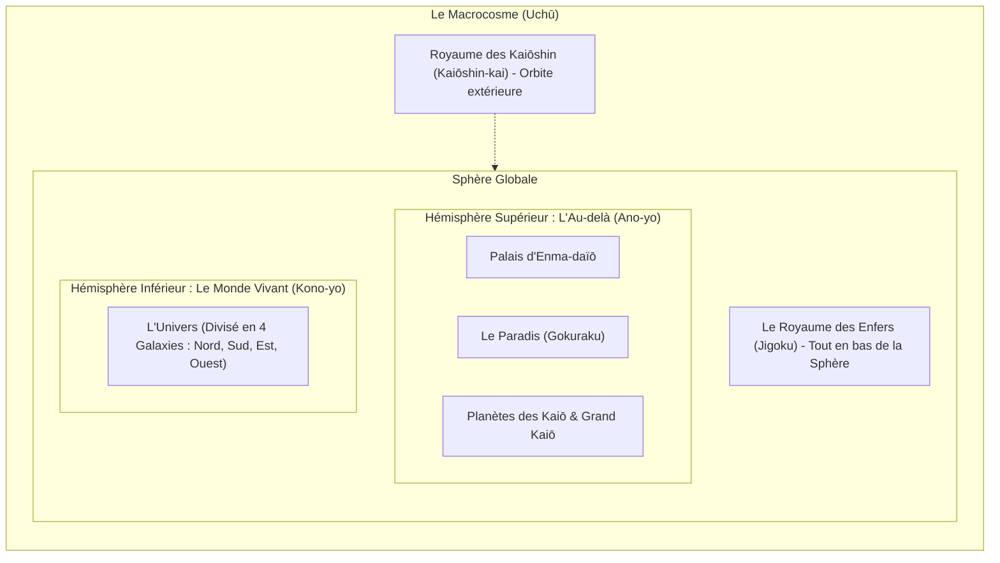

# 📚 Base de Connaissance Unifiée — 17/06/2026

> Ce fichier regroupe toute la documentation du projet pour faciliter le contexte et l'analyse.

## 🤖 Capacités & Agents

### 🛠 Skills & Compétences


### 🕵️ Agents Spécialisés


---

## 🗂 Sommaire

- [This is NOT the Next.js you know](#agents-md)
- [Changelog](#changelog-md)
- [CLAUDE.md — shenron](#claude-md)
- [Déploiement de Shenron](#deploy-md)
- [DESIGN.md — Système graphique DBFR](#design-md)
- [GEMINI.md](#gemini-md)
- [Shenron Monorepo — Learning Memory](#memory-md)
- [PLAN.md — RAG canon (bxc) + LLM Dragon Ball (aphrody)](#plan-md)
- [PROMPT.md — Sprint DBFR (Shenron bot + site public)](#prompt-md)
- [1. Bun ≥ 1.3](#readme-md)
- [Politique de sécurité](#security-md)
- [This is NOT the Next.js you know](#apps-site-agents-md)
- [CLAUDE.md](#apps-site-claude-md)
- [or](#apps-site-readme-md)
- [Neon ↔ GitHub ↔ Vercel — automatisation DB (site `dbfr`)](#apps-site-docs-neon-automation-md)
- [deploy/ — provisioning self-contained du monorepo](#deploy-readme-md)
- [Cosmologie de Dragon Ball — Structure du Macrocosme & Au-delà (Daizenshuu 4 & 7)](#docs-dragon-ball-cosmology-md)
- [Système de Synchronisation Google Drive (Wiki Assets)](#docs-drive-md)
- [Dragon Ball Lore Reference — Kanzentai Web Archive Curation](#docs-kanzentai-crawled-summary-md)
- [LLM Dragon Ball — assistant conversationnel local](#docs-llm-maison-md)
- [Neoseeker Dragon Ball Translation Threads Summary](#docs-neoseeker-crawled-summary-md)
- [Plan — Système de races & niveaux (inspiré Xenoverse 2)](#docs-races-systeme-niveau-md)
- [Rapport d'Entraînement SFT & Optimisations RAG](#docs-sft-training-report-md)
- [Dragon Ball Lore — Akira Toriyama Databook Revelations (SEG)](#docs-toriyama-databook-seg-md)
- [Lore de Dragon Ball — Citations & Philosophie d'Akira Toriyama (Daizenshuu)](#docs-toriyama-interviews-md)
- [@discordx/di](#packages-di-changelog-md)
- [@rpbey/di](#packages-di-readme-md)
- [Security Policy](#packages-di-security-md)
- [discordx](#packages-discordy-changelog-md)
- [@rpbey/discordy](#packages-discordy-readme-md)
- [Security Policy](#packages-discordy-security-md)
- [@discordx/importer](#packages-importer-changelog-md)
- [@rpbey/importer](#packages-importer-readme-md)
- [Security Policy](#packages-importer-security-md)
- [@discordx/internal](#packages-internal-changelog-md)
- [@rpbey/internal](#packages-internal-readme-md)
- [Security Policy](#packages-internal-security-md)
- [@discordx/pagination](#packages-pagination-changelog-md)
- [@rpbey/pagination](#packages-pagination-readme-md)
- [Security Policy](#packages-pagination-security-md)
- [Sources RAG Dragon Ball — Inventaire & Matrice de Curation](#reference-db-recon-sources-rag-md)

---

<a name="agents-md"></a>
## 📄 Fichier : `AGENTS.md`

**Titre original :** This is NOT the Next.js you know

<!-- BEGIN:nextjs-agent-rules -->
### This is NOT the Next.js you know

This version has breaking changes — APIs, conventions, and file structure may all differ from your training data. Read the relevant guide in `node_modules/next/dist/docs/` before writing any code. Heed deprecation notices.
<!-- END:nextjs-agent-rules -->

<!-- Project note (outside the managed block): the Next.js app is `apps/site`.
     `next` is hoisted to the repo-root `node_modules/`, so the docs path above is
     correct when working from the repo root. See `apps/site/AGENTS.md` and
     `CLAUDE.md`. -->


---

<a name="changelog-md"></a>
## 📄 Fichier : `CHANGELOG.md`

**Titre original :** Changelog

### Changelog

Format : [Keep a Changelog](https://keepachangelog.com/fr/1.1.0/).
Versionnement : date + courte description.

## [Unreleased] — 2026-06-10

### Added

- **Entraînement SFT local approfondi (8 époques)** : Résolution du data shift où le modèle local de 29M d'attention s'effondrait et renvoyait du vide face aux contextes longs de production. Harmonisation globale de la taille de contexte à **800 caractères** (générateur SFT `corpus_export.ts`, formateur de prompt `dbz_llm.py` et fusion RAG `llm.ts`).
- **Inférence Parallèle des Embeddings & RAM Systemd** : Parallélisation de l'inférence CPU via un pool de 6 promesses concurrentes et traitement par lots (batch size 64) sur les 27 653 chunks du corpus (réduction de 3h à 40min). Redimensionnement de `shenron-embed.service` (`MemoryHigh=5G`, `MemoryMax=6G`) pour éviter les blocages de RAM et I/O wait.
- **Résolution des verrous SQLite & Timeouts bxc** : Élimination des erreurs `SQLITE_BUSY` lors de la reconstruction de l'index RAG en remplaçant la copie directe par un `VACUUM INTO` à chaud. Sécurisation du crawl massif avec un timeout robuste de 30 secondes pour tuer les processus `bxc scrape` suspendus.

## [Unreleased] — 2026-06-02

### Added

- **Assistant Dragon Ball conversationnel local** — vrai modèle capable servi en local (llama.cpp, **Qwen2.5-3B-Instruct**, port **:5008**, `shenron-llm.service`), aucune API externe. Conversation naturelle + raisonnement + **mémoire** (historique par session dans Redis), détection du bavardage (un « bonjour » = vraie réponse, plus de dump d'archives), faits via RAG **reformulés** dans la voix du persona. Branché bot (Discord autonome) + site (FloatingAssistant, mémoire par navigateur). _NB : un premier modèle entraîné from-scratch (29M, `dbz_llm.py`) s'est révélé trop petit pour converser — conservé comme artefact, non utilisé en prod._
- **RAG massivement enrichi** — crawl concurrent multi-wiki FR+EN (`crawl-fandom-rag.ts`, via `action=parse`) : **~7000 entités / 36k chunks** (vs 58 personnages). Indexation Discord complète sans cap (`index-discord-full.ts`). Éval honnête `eval-own.ts` + dashboard `/admin/evaluations`. Doc : [`docs/llm-maison.md`](docs/llm-maison.md).

### Changed

- **Next.js bumpé `16.3.0-canary.21` → `.37`** (catalog racine + override + `@next/env`) — doctrine nightly. Type-check, lint, `next build` et déploiement prod verts.

### Fixed

- **`better-auth` épinglé exact `1.6.11`** (catalog) — `@better-auth/kysely-adapter@1.6.13` importe `DEFAULT_MIGRATION_TABLE`, absent de `kysely@0.29.2` → casse le build Turbopack du site (Vercel re-résout `^1.6.11` vers la version cassée). Pin exact = résolution déterministe (1.6.11 verrouille lui-même `kysely@^0.28.17`).

### Ops

- **Open-source** — `aphrody-code/shenron` passé **public** (2026-06-02). Ajout `LICENSE` (**Apache-2.0**) + `SECURITY.md` racine ; README/CLAUDE.md alignés (badge, rationale deploy Vercel).
- **Historique git purgé de toute PII** — `git-filter-repo` sur **toutes les branches + refs PR** : suppression des dumps SQLite (`*.db`/`*.sqlite`, dont un backup de 5860 membres), `apps/bot/data/guild-scan.json` (scan de 5764 membres Discord), `.recovery-checkpoint.json`. `.gitignore` durci (`*.db`/`*.sqlite*` global + exports runtime). Audit : aucun secret/token n'était commité. `fr-episode-titles.json` (donnée publique) conservé.
- **Sync Neon↔SQLite rétablie** — timers `shenron-neon-sync.timer` (forward runtime+news, 30 min) + `shenron-neon-pull.timer` (reverse wiki éditorial, 15 min) réinstallés/activés + env `~/.shenron-neon.env` recréé (600). Resync forward vérifié (23 tables, 9146 lignes, 0 mismatch) ; wiki déjà aligné.

## [Unreleased] — 2026-06-01

### Added

- **RAG SOTA — récupération hybride + reranking** (`apps/bot/src/lib/{embeddings,rag}.ts`, `apps/bot/embed-server.ts`) — passage du FTS5 keyword pur à un pipeline 2 étages 100 % local, FR+JP : étage 1 = récupération **hybride** BM25 (`rag_chunks` FTS5) + embeddings denses multilingues (`rag_vectors`, modèle `Xenova/multilingual-e5-small` 384d, cosinus exact brute-force) fusionnés en **RRF** (k=60) ; étage 2 = **reranking cross-encoder** (`Xenova/bge-reranker-base`) du top-15. Sidecar dédié `shenron-embed.service` (port 5007 loopback, 2 modèles chauds, `MemoryMax=3G`) — `embeddings.ts` (heavy) n'est **jamais** importé par le bundle bot, `rag.ts` (runtime léger) fetch HTTP vers le sidecar. Build offline : `bun --filter @shenron/bot run rag:build` (override `RAG_DB=/path` pour tester sur copie). Dégradation gracieuse 3 niveaux (`mode` ∈ `hybrid+rerank | hybrid | lexical`). Consommateurs : `/api/public/rag/search` (REST), `ragSearch` (GraphQL), commande Discord `/ask`, recherche du site (`dbUniverse.rag`).
- **API GraphQL publique read-only** (`apps/bot/src/api/graphql.ts`) — endpoint `/graphql` sur le `Bun.serve` du bot, code-first **Pothos** + **graphql-yoga**, GraphiQL activé, CORS public, garde-fou profondeur max 10. Expose le wiki (`characters`/`planets`/`sagas`/`episodes`/`techniques`/`transformations`/`movies`/`games`/`races`) + relations + `ragSearch` (RAG hybride) + `counts`. Deps : `graphql@16 graphql-yoga@5 @pothos/core@4`.
- **OpenAPI 3.1 + UI Scalar** (`apps/bot/src/api/openapi.ts`) — spec statique servie à `/api/openapi.json` (CORS public, cache 1 h) et UI interactive **Scalar** à `/api/docs` (CDN, zéro dep). Couvre la surface REST publique (RAG / Wiki / Insights / Médias).
- **Commande Discord `/ask`** (`apps/bot/src/commands/wiki/Ask.ts`, persona Whis) — question FR en langage naturel → RAG hybride+rerank → embed sourcé (résultats classés, `kind` iconifié, snippets, liens vers le site) + bouton **« Ouvrir le meilleur résultat »**. Dégradation gracieuse.
- **Site — animations cinématiques** (`apps/site/src/components/ViewTransition.tsx`, `app/globals.css`, `next.config.ts`) — **View Transitions API** (morph d'élément partagé grille→fiche personnages/planètes, slides directionnels nav-forward/back via `ViewTransition` isomorphe + `experimental.viewTransition: true`), scroll-driven animations CSS natives (`animation-timeline: view()` reveal staggeré), ki-glow au survol (`@property --ki-angle`), hero ken-burns enrichi + wordmark glow. `prefers-reduced-motion` respecté, cache CDN préservé (pages Static/SSG), zéro framer-motion (motion / CSS natif).

## [Unreleased] — 2026-05-31

### Added

- **Home cinématique full-page « Codex Shenron »** (`apps/site/src/components/home/*`, `app/page.tsx`) — réécriture complète de la home en 7 panneaux plein écran scroll-snap (navigation molette + clavier + tactile), fonds animés des meilleures scènes DB (ken-burns + grade d'ère + grain + aura ki + letterbox), et état **réel + live** du bot (SSR + poll 25 s + SSE `a2a/events` → power-levels animés, gardiens en ligne, flux d'événements). Réutilise `motion` / CSS natif (`animation-timeline: view()`), zéro framer-motion.
- **Scènes d'épisode** (end-to-end) — colonnes `db_episodes.frames` (jsonb `EpisodeFrame[]`) + `scene_preview` ; extraction `scripts/extract-dbz-frames.ts` (ffmpeg vidéo locale) et `scripts/scrape-dbz-fandom-frames.ts` (API MediaWiki, méthode rpbey) ; orchestrateur `scripts/build-episode-scenes.ts` (frames + `preview.mp4`) ; ingest Neon gardé `scripts/ingest-episode-frames.ts` ; affichage wiki (`/wiki/episodes/[id]` : hero `AnimatedMedia` + galerie + export GIF).
- **Composants média site** (`apps/site/src/components/media/*`) — `AnimatedMedia` (video/gif lazy a11y), `BackgroundImage`/`HeroBackground` (next/image fill, variantes kenburns/parallax CSS), `encodeGif` (`modern-gif`, frames→GIF browser).
- **Télémétrie first-party RGPD** (`apps/site/src/lib/{telemetry,consent,recommendations}.ts`, `app/api/telemetry`, `components/{ConsentGate,TrackView}`) — `track()` typé fan-out **Vercel Analytics + GTM dataLayer + Postgres** (tables `site_events`/`user_preferences`), anonymisation (hash salé, anonId httpOnly), **Google Consent Mode v2**, fondation recommandations/personnalisation (co-vues + affinité + populaire).
- **Google Tag Manager** (`GTM-KLSS5787`) via `@next/third-parties/google` + `<noscript>`.
- **Pages wiki dédiées Personnages + Planètes** (`app/wiki/personnages`, `app/wiki/planetes`) — index manquants jusqu'ici (persos/planètes browsables uniquement via le fourre-tout `/wiki/dragon-ball`). `CharacterGrid` client (`components/wiki/`) : grille filtrable recherche + facettes par race, compteur live. Routes détail inchangées sous `/wiki/dragon-ball/{character,planet}/…`.
- **`lib/config.ts` — source unique des URL/API du site** (client-safe) : `API_URL` (API bot), `ASSET_BASE` (assets bot), `SITE_URL`, `DISCORD_INVITE` + helpers `apiUrl()`/`assetBaseUrl()`. `dbUniverse.counts()` (un round-trip groupé) pour les comptes réels du wiki.

### Changed

- **bxc crawl bumpé sur 0.5.4** — `scripts/ingest/bxc-ingest.ts` réécrit (sortie `bxc scrape` = JSON), `BXC_DIR`/`BXC_PROFILE` env, profils `static|fast|http|stealth|max` (le profil `ghost` n'existe plus).
- **Home recadrée « Voyage à travers l'univers Dragon Ball »** — narratif d'exploration centré contenu ; le mot « wiki » retiré de toute la vitrine (héro, summon, rôle Whis, description SEO globale, 404). CTA « Commencer le voyage », panneau univers titré « Voyage à travers l'univers ».
- **Hub `/wiki` à comptes dynamiques** — les ~9 nombres codés en dur (« 58 personnages », « 25 films »…) remplacés par `dbUniverse.counts()` (Neon réel) → plus de désynchro quand la DB grossit. Copies landing/metadata rendues evergreen.
- **Unification URL/API du site** — ~14 défauts `https://bot.dragonballfr.com`, ~9 littéraux `discord.gg/dbfr` et l'URL site, dispersés dans ~27 fichiers → collapsés sur `lib/config.ts`. Future migration de domaine = 2 env vars au lieu de 27 fichiers. `auth*` / allowlist télémétrie / branding OG volontairement épargnés ; bot (producteur unique d'API) non concerné.

### Fixed

- **`/wiki/dragon-ball` → 308 dur** via `next.config` `redirects()` vers `/wiki/personnages` (un `permanentRedirect()` en composant dégradait en page 200 + `<meta refresh>` à cause du streaming du layout `/wiki`). Fourre-tout « Encyclopédie » (doublon de Films/Jeux) supprimé.
- **FAB Discord invite cassée** — `DiscordInviteFAB` retombait sur `https://discord.gg/votre_invite_ici` si `NEXT_PUBLIC_DISCORD_INVITE_URL` absent → désormais `DISCORD_INVITE` (défaut `discord.gg/dbfr`).

### Ops

- **`ops(domaine)` : migration prod vers `dragonballfr.com`** — le site bascule sur `https://dragonballfr.com` (canonical, OG, liens publics) et l'API/assets du bot sur `https://bot.dragonballfr.com`. Les alias historiques `rpbey.fr` / `dbfr.vercel.app` (site) et `bot.rpbey.fr` (API) restent conservés (redirections / origines de confiance), mais ne sont plus le domaine de référence.
- **Infra dragonballfr.com** — vhost VPS `deploy/nginx/bot.dragonballfr.com.conf` (proxy `:5006` + cache CDN long sur `/assets/`), cert Let's Encrypt `bot.dragonballfr.com`, DNS OVH (apex/www → Vercel, `bot` → VPS), env Vercel (`BETTER_AUTH_URL`/`SHENRON_API_URL`/`NEXT_PUBLIC_SHENRON_API_URL`). Compte OVH `gl839461-ovh`.
- **Schémas** — colonnes Neon `bot.db_episodes.{frames,scene_preview}` ; tables Postgres site `site_events` + `user_preferences` (migration `apps/site/src/db/migrations/0000_*`, appliquée).
- **Discord OAuth** — redirect URIs à déclarer côté portail pour `dragonballfr.com`/`bot.dragonballfr.com` (app `1497194276025663680`).

## [Unreleased] — 2026-04-25

### Added

- **API REST (`Bun.serve`) tscord-compatible** — surface alignée sur les controllers de [`@rpbey/tscord`](../../packages/tscord/), permet à un fork de [`barthofu/tscord-dashboard`](https://github.com/barthofu/tscord-dashboard) de piloter shenron. Bind `127.0.0.1:5006` par défaut, auth Bearer (`API_ADMIN_TOKEN`).
  - **Health** : `/health/{check,latency}` (public) + `/health/{usage,host,monitoring,logs}` (admin)
  - **Stats** : `/stats/totals` (users/guilds/commands), `/stats/interaction/last`, `/stats/guilds/last`
  - **Bot** : `/bot/guilds`, `/bot/commands`, `/bot/commands/:name` (full schema avec options/choices)
  - **Cron** (`CronRegistry` centralisé, registres `voice-xp-tick`, `jail-expiry`, `bio-role-scan`) : `GET /cron` (last/next run, durée, erreurs) · `POST /cron/:name/trigger` (déclenchement manuel)
  - **Services** : `GET /services` (list whitelist) · `POST /services/:service/:action` (achievements.refresh, economy.addZeni, level.addXP, settings.set, translate.probe, moderation.countWarns, wiki.search…)
  - **Database CRUD générique** sur 16 tables whitelist : `GET /database/tables` · `GET /database/:table?limit&offset` · `GET/PUT/DELETE /database/:table/:id` · `POST /database/:table`. `mutableColumns` par table pour empêcher l'édition de colonnes sensibles.
  - **OpenAPI 3.0.1** auto-généré sur `/openapi`.
- **`StatsService`** — équivalent du `Stats` service tscord, sans deps `pidusage`/`node-os-utils` (lit `process.memoryUsage`/`process.cpuUsage` + `node:os` natifs).
- **`CronRegistry`** — singleton qui collecte les `setInterval` des events (VoiceXP, JailExpiry, BioRole) et expose `lastRunAt`, `lastDurationMs`, `runCount`, `lastError`, `nextRunAt`.
- **`ApiServer`** — Bun.serve natif avec `routes` Map, params `:name`/`:id` typés, error handler global, `Response.json` + `req.json()` web-standard. Lance dans `clientReady` après `boot-audit`.
- **`/translate`** — OCR d'image + traduction VF (ou EN/ES/DE/IT/JA), 100 % FOSS via **Tesseract** (Apache 2.0, `Bun.spawn` stdin) + **LibreTranslate** (AGPL-3.0, Docker self-host). Slash command **et** menu contextuel **"Traduire en VF"** (clic droit message → Apps). Hard caps prod : image ≤ 10 MiB, timeout tesseract 30 s, timeout LibreTranslate 8 s, garde SSRF (refuse `file://`, IPs privées, `localhost`). Probe au boot dans `boot-audit.ts` — la commande devient inactive avec message d'erreur explicite si l'un des deux est down.
- **`/config`** — slash group admin (dashboard MVP) : `/config list/set/unset` pour les overrides runtime (XP rates, cooldowns, salons), `/config channel <type> <salon>`, `/config level-reward-set/-remove/-rewards`. Persisté en table `guild_settings` (key/value, cache 30 s) → override les constantes hardcodées sans redéploiement. Vérifie la **hiérarchie de rôles** sur `level-reward-set` (refuse si rôle ≥ rôle bot).
- **Challenge buttons** — nouveau `src/lib/challenge.ts` (helper Accept/Decline réutilisable, customId `challenge:<scope>:<action>:<key>`). Câblé dans `/pendu joueur` et `/morpion joueur` : message de défi avec boutons **✅ Accepter** / **❌ Refuser** (timeout 60 s). La partie ne démarre qu'après acceptation explicite de l'adversaire.
- **`/pendu` amélioré** — embed avec **nombre de lettres** affiché, lettres trouvées vs ratées triées (`Array.toSorted`), 7 frames ASCII du pendu (0→6 erreurs), mot révélé en `||spoiler||` à la défaite.
- **`/morpion` amélioré** — embed dynamique, IA défensive (gagner > bloquer > centre > coin > random), ligne gagnante surlignée en vert.
- **Texte double-police** — nouveau `canvas-kit.ts::textDoubleFont` qui superpose deux polices avec offset/blur (Saiyan Sans glow + Inter Display Black net) pour effet relief DBZ. Appliqué au pseudo de `/scan` et au titre des gauges `/gay` / `/raciste`.
- **Salon des accomplissements séparé** — nouvelle var `ACHIEVEMENT_CHANNEL_ID` + `resolveAchievementChannel` (retombe sur `ANNOUNCE_CHANNEL_ID` si absent). Notifs 🏆 envoyées en `EmbedBuilder` brand au lieu de plain text.
- **Helpers embed** — `src/lib/embeds.ts` (`brandedEmbed`, `successEmbed`, `errorEmbed`, `warningEmbed`) inspirés de `@rpbey/tscord/utils/functions/embeds`, sans tirer la stack tscord complète.
- **Service `SettingsService`** — table `guild_settings` (migration `0001_lazy_scrambler.sql`), validation par type (int/snowflake/string/bool), invalidation cache après set, mono-guild assumed (le bot est verrouillé sur `env.GUILD_ID`).
- **Service `TranslateService`** — encapsule Tesseract CLI + LibreTranslate, méthode `probe()` au boot pour détecter la dispo runtime, validation URL anti-SSRF (`isIP`, ranges privés RFC1918/loopback/link-local/ULA).
- **`scripts/setup-translate.sh`** — script idempotent qui installe Tesseract via apt (packs `fra/eng/jpn/spa/deu/ita`) et lance LibreTranslate en Docker (`127.0.0.1:5000` bind, modèles `en,fr,ja,es,de,it`, `LT_DISABLE_WEB_UI=true`). Healthcheck 3 min.

### Changed

- **Workspace** — `apps/shenron` retiré de l'exclusion `!apps/shenron` du root `package.json` du monorepo VPS. Les packages `@rpbey/{di,discordx,importer,pagination}` passent en `workspace:*`, `discord.js` et `typescript` en `catalog:`.
- **`MessageXP.ts`** — `resolveAchievementChannel` est désormais résolu **lazy** uniquement si on a un succès à annoncer (`isFirstMessage || granted.length > 0`). Évite un `client.channels.fetch` HTTP par messageCreate (rate-limit Discord sur serveurs actifs).

### Fixed

- **Fuites mémoire potentielles `/morpion`** — Map `games` GC manquant. Ajout de `setTimeout(games.delete, 30 min).unref()` après chaque création.
- **Race condition `/pendu`** — un user qui clique "Accepter" après expiration démarrait quand même. Check `expiresAt <= Date.now()` dans `onChallengeButton`.
- **Tous les `setTimeout`** — `.unref()` ajouté pour ne pas garder l'event loop éveillé.
- **Tesseract hang sur image malicieuse** — hard kill via `setTimeout(proc.kill, 30s)` + cap `content-length` 10 MiB.
- **LibreTranslate freeze user 30 s** — timeout descendu à 8 s, message d'erreur explicite avec URL configurée.

## [Unreleased] — 2026-04-24

### Added

- **Salon de commandes dédié** — nouvelle var `COMMANDS_CHANNEL_ID` + guard `CommandsChannelOnly` appliqué aux commandes user-facing (`/shop`, `/buy`, `/eprofil`, `/fusion`, `/solde`, `/gay`, `/raciste`, `/scan`, `/bingo`, `/morpion`, `/pendu`, `/pfc`, `/profil`, `/top`, `/niveau`, `/wiki`, `/races`, `/planete`). Hors du salon ciblé → reply éphémère. Commandes modération / admin / tickets / vocaux restent utilisables partout.
- **Salon d'annonces** — nouvelle var `ANNOUNCE_CHANNEL_ID` + helper `src/lib/announce.ts::resolveAnnounceChannel`. Les messages de level-up (texte **et** vocal), quête quotidienne, premier message, succès pattern-based sont publiés dans ce salon unique au lieu du salon d'origine.
- **Level rewards DBZ** — seed automatique de la table `level_rewards` avec 10 rôles canoniques (Kaioken → Perfect Ultra Instinct) mappés aux paliers `LEVEL_THRESHOLDS`. Script `bun run db:seed-levels` + intégré dans `db:seed-all`.
- **Audit boot-time** — nouveau `src/lib/boot-audit.ts` exécuté à `clientReady`. Vérifie pour chaque ID env : existence du salon/rôle sur la guild, type attendu (text/category/voice), position hiérarchique vs bot. Signale les 10 rôles level-reward en cas d'injoinables. Log unique `✓ boot-audit OK` ou warnings détaillés.
- **Scan de la guild** — `scripts/scan-ids.ts` dump 172 salons + 185 rôles + 5756 users (avec rôles de chaque user) dans `data/guild-scan.json`. Sert de source de vérité pour le ciblage des vars env et le seed des level-rewards.

### Changed

- **GUILD_ID** basculé du serveur de test (`1497167233280118896`) vers la prod Dragon Ball FR (`934894610545770506`). 41 commandes ré-enregistrées sur la nouvelle guild.
- **`.env` rempli** depuis le scan :
  - `LOG_MESSAGE_CHANNEL_ID` / `LOG_SANCTION_CHANNEL_ID` / `LOG_ECONOMY_CHANNEL_ID` / `LOG_JOIN_LEAVE_CHANNEL_ID` / `LOG_LEVEL_ROLE_CHANNEL_ID` / `LOG_TICKET_CHANNEL_ID` → `1032622751845990401` (💾・logs, salon unique du serveur)
  - `MOD_NOTIFY_CHANNEL_ID` → `1142417515004317748` (🛠️・moderation)
  - `JAIL_ROLE_ID` → `1405635615827034194` (**Jugé par Enma**, 6 jailed actifs) — substitué au badge cosmétique _JAIL_ (0 membre)
  - `URL_IN_BIO_ROLE_ID` → `935209498862317698` (.gg/dragonballfr)
  - `TICKET_CATEGORY_ID` → `1034596363096301719` (⌈🌟⌋ DB FR)
  - `SERVER_INVITE_URL` → `https://discord.gg/dragonballfr`
- **Wiki Dragon Ball** — DB peuplée via `bun run db:seed-all` : 58 personnages, 20 planètes, 43 transformations depuis `dragonball-api.com`. Descriptions en espagnol (endpoint FR upstream supprimé, confirmé via `?lang=fr`/`lang=en`/`Accept-Language`). Footer des embeds annote `source: dragonball-api.com`.

### Fixed

- **`/wiki` / `/races` / `/planete`** retournaient "introuvable" → DB seedée, les trois commandes fonctionnent avec autocomplete.
- **Level-up vocal silencieux** — `VoiceXP` ne passait pas de salon à `handleLevelUp`, aucun message posté. Désormais résout `ANNOUNCE_CHANNEL_ID` et publie correctement.

### Notes opérationnelles

- Le rôle **Shenron** (integration) doit rester **au-dessus** de tous les rôles attribués (.gg/dragonballfr à la position 97, rôles level-up jusqu'à 94). Boot-audit confirme position actuelle du bot = 148.
- Les tickets créés par `/ticket-panel` tomberont sous la catégorie DB FR (à côté de 🔖・ticket).
- `VOCAL_TEMPO_HUB_ID` laissé vide : aucun hub vocal "➕" unique sur le serveur (plusieurs par catégorie de jeu). Feature inactive tant qu'une var n'est pas définie.


---

<a name="claude-md"></a>
## 📄 Fichier : `CLAUDE.md`

**Titre original :** CLAUDE.md — shenron

### CLAUDE.md — shenron

Monorepo standalone (sorti du VPS le 2026-05-16). Bot Discord DBZ multi-personas + site Next.js compagnon.

**Sources de vérité** :
- Bot prod : service systemd `shenron.service` sur le VPS (`WorkingDirectory=/home/ubuntu/shenron/apps/bot`).
- Site prod : **VPS** depuis le 2026-06-12 (migré de Vercel). `next start` sous Bun (unit systemd `shenron-site.service`, `WorkingDirectory=apps/site`, `127.0.0.1:3000`) fronté par nginx (`deploy/nginx/dragonballfr.com.conf`, TLS certbot `--dns-ovh`). **Domaine de prod unique : `https://dragonballfr.com`** (`www` → 301 apex au niveau nginx). Le projet **Vercel `dbfr`** (`prj_wxLn9COQIo9HAOUVis08ppKXx7zI`) est conservé en **standby** (repli : repointer l'A record apex `dragonballfr.com` sur Vercel `76.76.21.21` — DNS OVH, creds `~/.config/ovh/dbfr.conf`). L'API bot est servie côté VPS sur `bot.dragonballfr.com` (ex- `bot.rpbey.fr` / `shenron.rpbey.fr` legacy).
- DB bot : SQLite local `apps/bot/data/bot.db` (snapshot quotidien via timer VPS).
- DB site : **Postgres distinct** (Neon ou autre, via `DATABASE_URL`) — ce n'est PAS la même DB que le bot.

## Lecture obligatoire

1. `GEMINI.md` — vision agent + règles dev (Bun-only, personas, DI tsyringe).
2. `DEPLOY.md` — guide déploiement (Fly / VPS systemd / Docker / binaire).
3. `README.md` — usage et architecture personas.
4. `CHANGELOG.md` — releases.

## Workflow PRODUCTION

### Bot (VPS)
- Le code vit ici dans `~/shenron/`. Le service systemd lit directement ce path.
- Déploiement = `git pull` dans `~/shenron/` puis `sudo systemctl restart shenron`. Le script **in-repo** `scripts/deploy-shenron.sh` automatise (pull + lint/tsc + dashboard:css + restart + smoke `/auth/me` + rollback auto).
- Réactivation complète = `bash scripts/reactivate.sh` (Nettoyage de tous les caches, bun install, migration DB, régénération des entrées, build RAG, compile CSS du dashboard, re-setup systemd et redémarrage propre de tous les services et timers de production).
- **Aucun build préalable** : Bun exécute `src/index.ts` en direct (TS natif).
- Backup DB quotidien : timer VPS `shenron-backup.timer` (03:00 UTC) → `VACUUM INTO` snapshot.
- Sync DB↔Discord quotidien : timer VPS `shenron-guild-sync.timer` (04:00 UTC).

### Site (VPS, ex-Vercel)
- **Migré de Vercel vers le VPS le 2026-06-12.** Le site tourne en `next start` sous Bun via l'unit systemd **`shenron-site.service`** (`ExecStart=bun --bun node_modules/next/dist/bin/next start -p 3000 -H 127.0.0.1`, `WorkingDirectory=apps/site`, `EnvironmentFile=apps/site/.env`, hardening calqué sur `shenron.service`, `ReadWritePaths=apps/site/.next apps/site/.bun-cache` pour le cache ISR). nginx (`deploy/nginx/dragonballfr.com.conf`) termine TLS/HTTP3, rate-limit `/api/`, et proxifie tout vers `127.0.0.1:3000` — Next garde routing/ISR/rewrite/middleware (`proxy.ts`) en process. `www` → 301 apex.
- **Déploiement = `bash scripts/deploy-site.sh [--pull] [--migrate]`** (build + restart `shenron-site` + smoke loopback + rollback auto). Provisioning unit+vhost : `bash deploy/install.sh --nginx` (le glob inclut `shenron-site.service` + `dragonballfr.com.conf`).
- **Env** : `apps/site/.env` (chmod 600, gitignored, **chargé au build ET au runtime** — les `NEXT_PUBLIC_*` sont bakés au build). `BETTER_AUTH_URL` / `NEXT_PUBLIC_SITE_URL` = `https://dragonballfr.com`, `SHENRON_API_URL` / `NEXT_PUBLIC_SHENRON_API_URL` = `https://bot.dragonballfr.com`. `SHENRON_ADMIN_TOKEN` == bot `API_ADMIN_TOKEN`, `SHENRON_USER_SECRET` == bot `API_USER_SECRET`. Secrets identiques à l'ex-prod Vercel (sessions préservées).
- **TLS** : cert apex+www via `certbot certonly --dns-ovh --dns-ovh-credentials /etc/letsencrypt/ovh-dbfr.ini -d dragonballfr.com -d www.dragonballfr.com` (creds OVH du compte `dragonballfr.com` = `~/.config/ovh/dbfr.conf`, compte `gl839461-ovh` — distinct du compte rosegriffon `~/.ovh.conf`). Renouvellement auto (certbot.timer, DNS-01).
- **DNS** : zone OVH `dragonballfr.com` (NS `ns109.ovh.net`). Bascule/repli de l'A record via `bun scripts/ovh-dns.ts` (`OVH_CONF=~/.config/ovh/dbfr.conf bun scripts/ovh-dns.ts setA dragonballfr.com <ip>`). Apex+www → `51.77.147.152` (VPS) ; repli Vercel = `76.76.21.21`.
- **Vercel `dbfr`** conservé en **standby** : workflows `.github/workflows/{deploy-vercel,neon-branch}.yml` passés en `workflow_dispatch` only (plus d'auto-deploy sur push). Au moment de la migration le projet Vercel renvoyait `402` (suspendu) — la migration a restauré le site.
- **Pas de `@vercel/analytics` / `@vercel/speed-insights`** (retirés : 404 hors Vercel). Télémétrie = GTM + first-party `/api/telemetry` (Neon) uniquement.
- Build : `bun --filter @shenron/site build` (canary Next 16 + Tailwind v4, ~60s sous Bun). `.vercelignore` exclut `apps/bot/`.

### Règles dures
1. **Pas d'édition manuelle sur le VPS dans `~/shenron/`** : tout passe par PR sur `github.com/aphrody-code/shenron` puis `git pull` côté VPS.
2. **Bun obligatoire** : pas de `node`/`npm`/`pnpm`/`yarn`/`tsx`. Utiliser `bun`, `bunx`, `bun --filter <app> <cmd>`.
3. **Secrets** : jamais dans le repo. `.env` est gitignored. Production = `apps/bot/.env` (bot) + `apps/site/.env` (site), chargés par systemd via `EnvironmentFile`. Écrire les `.env` avec `printf` (jamais `echo` → pollution `\n` qui casse `DISCORD_CLIENT_SECRET`).
4. **Zéro FFI / Rust** : La stack Rust native `apps/bot/native/` est supprimée. Tout utilitaire (calcul de niveau, parsing) est écrit en TypeScript pur dans `apps/bot/src/lib/native.ts`.
5. **Catalog de Dépendances** : Toutes les versions de dépendances du monorepo doivent utiliser la syntaxe de catalogue de Bun (`catalog:`) définie dans le `package.json` racine.
6. **Paths et Déploiement Dynamiques** : Aucun chemin absolu codé en dur dans les templates systemd (`deploy/systemd/`) ou les scripts de déploiement. Ils doivent être résolus dynamiquement à l'installation.

## Style

- **Commits / PR** : 1 ligne `feat|fix|chore|refactor|docs|ops(scope):` français. Pas d'emoji, pas de `Generated with…`, pas de `Co-Authored-By: Claude`.
- **`*.md`** : seuls `README.md`, `CLAUDE.md`, `GEMINI.md`, `DEPLOY.md`, `DESIGN.md`, `CHANGELOG.md`, `SECURITY.md`, `PROMPT.md` et `docs/**` sont autorisés à la racine. Jamais de notes/plans/reports AI.
- **Lint** : `oxlint` partout, `eslint` (config-next) en plus sur `apps/site/`. Pas de Biome.
- **Type-check** : `bun run type-check` (turbo). TS 6 + types catalog.
- **Doctrine nightly (toujours)** : `next@canary`, `react@canary`, `react-dom@canary`, `typescript@next`, `bun upgrade --canary`. Pas de versions stables. Si Vercel build casse → downgrader temporairement la lib en cause, jamais l'ensemble. `framer-motion` → `motion` (motion.dev, mêmes API, 9 KB gz vs 60 KB framer). Animations préférer **View Transitions API native** + CSS `@scroll-timeline` quand possible, `motion/react` en fallback.

## Architecture monorepo

```
apps/
  bot/    → @shenron/bot  — Bun + discordx + drizzle + bun:sqlite + canvas (6 personas en 1 process) + dashboard admin React SPA (src/dashboard/, TanStack Router + Query)
  site/   → @shenron/site — Next.js 16 + Tailwind v4 + Drizzle + Postgres (Vercel) ; Pixi.js (@pixi/react, ex. KiCanvas) pour le rendu canvas, shadcn (components/ui) pour l'UI. Pas d'API métier propre : les route handlers proxifient l'API REST du bot (cf. piège proxy plus bas)
packages/
  di/          → @rpbey/di — wrapper tsyringe
  discordy/    → @rpbey/discordy — wrapper fork discordx (multi-client injection)
  importer/    → @rpbey/importer — loader entries statiques
  internal/    → @rpbey/internal — utils partagés
  pagination/  → @rpbey/pagination — helpers pagination Discord
```

Le dossier physique est `packages/discordy/` (et non `discordx/`).

Pas de submodules. Tout est vendoré. Les 5 packages `packages/*` étaient des `@rpbey/*` côté ancien monorepo VPS, maintenant inlinés.

## Bot — personas

6 personas en 1 process (mapping `apps/bot/src/lib/personas.ts`) :
- Shenron, Beerus, Whis, Grand Prêtre, Enma, Kaïo.
- Tokens : `DISCORD_TOKEN_SHENRON`, `DISCORD_TOKEN_BEERUS`, … (cf. `apps/bot/.env`).
- Fork `@rpbey/discordy` requis pour le multi-client injection.

### Entries statiques

`apps/bot/src/_entries.ts` est généré par `bun run gen:entries`. **À regénérer après tout ajout/suppression de commande, event ou guard.**

## Site — auth Discord (Better Auth)

- Handler : `apps/site/src/app/api/auth/[...all]/route.ts` → `toNextJsHandler(auth)`.
- Config : `apps/site/src/lib/auth.ts`. Provider Discord avec scopes `identify, email, guilds, guilds.members.read` (alignés avec le bot pour pouvoir lire l'appartenance guilds côté front).
- DB : Postgres via `drizzle-orm/postgres-js` (`apps/site/src/lib/db.ts`).
- Sync : `databaseHooks.user.create.after` upsert dans `schema.users` (table métier) à la création d'un user better-auth Discord.
- Trusted origins (`auth.ts`) : `dragonballfr.com`, `www.dragonballfr.com`, `shenron.rpbey.fr`, `dbfr.vercel.app`, `localhost:3000` (+ `allowedHosts` du baseURL dynamique). Ajouter ici tout nouveau domaine.
- **Redirect URI Discord** : déterministe `{host}/api/auth/callback/discord` (dynamique par host). Tout nouveau domaine doit être déclaré côté Discord Developer Portal (app `1497194276025663680`) sinon `invalid redirect url`. Discord n'expose **aucune API** pour modifier les redirect URIs → action manuelle portail.
- **Coexistence** : le bot a son propre better-auth (`apps/bot/src/lib/better-auth.ts`) en SQLite pour le dashboard admin. **2 instances séparées, 2 DBs, 2 sets de sessions** — c'est intentionnel.

## Site — home cinématique & télémétrie

- **Home (`/`)** = expérience full-page « Codex Shenron » (`apps/site/src/components/home/*`). Deck **client** (`HomeExperience`, `"use client"`) en **scroll-snap document** (`html[data-home]` posé/retiré au mount) ; navigation molette/clavier/tactile → `scrollIntoView`. Données **SSR** (`page.tsx`) + **live** côté client (`useLiveBotState` : poll `bot.dragonballfr.com/api/public/{stats,personas}` + SSE `/api/a2a/events`, CORS OK). Fonds = scènes curées (`lib/home-scenes.ts`, client-safe) en ken-burns + grade d'ère (CSS dans `globals.css`). **Aucune session/cookies** → cache CDN préservé. **Cadrage éditorial** : « Voyage à travers l'univers Dragon Ball » — le mot « wiki » est banni de la vitrine (héro/summon/404, description SEO), on parle d'exploration de l'univers.
- **Wiki — IA & comptes** : index canoniques `/wiki/personnages` (grille filtrable `CharacterGrid`) + `/wiki/planetes` ; les **routes détail** restent sous `/wiki/dragon-ball/{character,planet,techniques}/…`. `/wiki/dragon-ball` (ancien fourre-tout) = **308 via `next.config` `redirects()`** → `/wiki/personnages` (jamais un `redirect()` en composant : dégrade en 200 + `<meta refresh>` à cause du streaming du layout `/wiki`). Tous les comptes affichés viennent de `dbUniverse.counts()` (Neon réel) — **zéro nombre codé en dur** (ils se désynchronisent dès que la DB grossit).
- **Télémétrie first-party** (`lib/telemetry.ts`) : `track(event, props)` typé → fan-out **Vercel Analytics + GTM dataLayer + `POST /api/telemetry`** (ingest Postgres `site_events`/`user_preferences`, anonymisation hash salé + `anonId` httpOnly). **Opt-in strict** + **Google Consent Mode v2** (`lib/consent.ts`, `ConsentGate`). Reco/perso server-only `lib/recommendations.ts`. GTM = `GTM-KLSS5787` via `@next/third-parties/google` (`layout.tsx`).

## DB & migrations

- **Bot** : `bun:sqlite` via Drizzle. Migrations dans `apps/bot/drizzle/`. Fichier prod : `apps/bot/data/bot.db`.
- **Site** : Postgres (Neon) via Drizzle. Migrations générées dans `apps/site/src/db/migrations/`. URL via `DATABASE_URL`.
- **Automatisation Neon ↔ GitHub ↔ Vercel** : branche Neon par PR + migrations Drizzle + env preview Vercel câblée + migrate prod au deploy + cleanup à la fermeture. Workflows `.github/workflows/neon-branch.yml` & `deploy-vercel.yml` (job `migrate-prod` gaté). Doc complète : **[`apps/site/docs/neon-automation.md`](apps/site/docs/neon-automation.md)**. Secrets/vars repo déjà provisionnés (`NEON_API_KEY`, `NEON_PROJECT_ID=patient-star-28731823`, `VERCEL_*`) — zéro étape humaine. Wiki-crawl manga récurrent → timer `shenron-wiki-crawl` (opt-in).
- Schéma partagé conceptuellement mais **physiquement séparé** (provider différent). Préfixe `ba_` pour better-auth tables (`ba_user`, `ba_session`, `ba_account`, `ba_verification`).
- **Source de vérité du wiki = Neon `bot.*`** (depuis `a572e3f`). Sync **bidirectionnelle** par rôle de table (liste `apps/bot/scripts/_wiki-editorial.ts`) :
  - **Forward `sync-sqlite-to-neon.ts`** (timer `shenron-neon-sync.timer`, 30 min) : runtime (users/économie/…) **+ `db_news`** SQLite→Neon. **Exclut le wiki éditorial.**
  - **Reverse `sync-neon-to-sqlite.ts`** (timer `shenron-neon-pull.timer`, 15 min) : wiki éditorial Neon→SQLite (DELETE+INSERT par table, FK off, WAL-safe) → le SQLite du bot est un **replica de lecture** (commandes Discord `/wiki` + build RAG restent locaux, rapides, indépendants de Neon).

### RAG hybride (depuis `100a8a3`)

- `/api/public/rag/search` + GraphQL `ragSearch` + Discord `/ask` + recherche du site (`dbUniverse.rag`) = **pipeline RAG SOTA** : étage 1 récupération **hybride** (BM25 `rag_chunks` FTS5 + embeddings denses `rag_vectors` cosinus exact brute-force, fusion **RRF**) → étage 2 **reranking cross-encoder** du top-15. Cf. `apps/bot/src/lib/rag.ts` (runtime léger, zéro modèle dans le bot). `mode` ∈ `hybrid+rerank | hybrid | lexical`.
- **Modèles** : embeddings `Xenova/multilingual-e5-small` (384d, FR+JP) + reranker `Xenova/bge-reranker-base` (cross-encoder multilingue). Servis par le **sidecar `shenron-embed.service`** (port 5007, modèles chauds, `MemoryMax=3G`, RSS ~1.6G) — le bot (1.5G) ne charge JAMAIS de modèle. Cache `apps/bot/.models` (gitignored). `apps/bot/src/lib/embeddings.ts` = heavy, importé seulement par le sidecar + `scripts/rag-build.ts`. Rerank cappé à 400 chars/passage (le cross-encoder tronque à 512 tokens ; 1.4s vs 4.8s), timeout 6s (`RAG_RERANK=0` pour désactiver).
- **Build** : `bun --filter @shenron/bot run rag:build` (embed offline in-process, ~85s/1041 chunks ; `RAG_DB=/path` pour tester sur copie). Après build sur prod → `systemctl restart shenron`.
- **Dégradation gracieuse** : sidecar down/timeout → `mode:lexical` (BM25 seul), jamais de crash. Réponse inclut `mode: "hybrid"|"lexical"`.
- **Piège** : `Bun.serve` (listen) meurt en exit 144 dans le sandbox du Bash tool — tester la logique RAG sans serveur ; le sidecar tourne en prod via systemd.

### API GraphQL + OpenAPI (depuis `cb426bb` / `80c7551`)

- **GraphQL** read-only du wiki sur `/graphql` (Pothos code-first + graphql-yoga, monté sur le `Bun.serve` du bot, GraphiQL activé, CORS public, garde-fou profondeur max 10). `apps/bot/src/api/graphql.ts`. Entités + relations + `ragSearch` + `counts`.
- **OpenAPI 3.1** de l'API REST publique sur `/api/openapi.json`, UI **Scalar** sur `/api/docs` (CDN, zéro dep). `apps/bot/src/api/openapi.ts` (spec statique, à tenir à jour avec les routes).
  - Connexion Neon dans `/home/ubuntu/.shenron-neon.env` (600, hors repo, format systemd — non sourçable en shell). Projet Neon = `shenron-axum` (`patient-star-28731823`, us-east-1). PK wiki en `IDENTITY` (inserts site).
- **Le site possède le wiki en read+write, 100 % Next.js, zéro API bot** (depuis `a572e3f`) :
  - **Lecture** : `apps/site/src/db/bot-schema.ts` (`pgSchema("bot")`) via Drizzle. Public → `shenron.ts`/`db-universe.ts` (server-only) ; admin db-universe → `wiki-admin.ts` (server-only).
  - **Écriture** : route handler `apps/site/src/app/api/wiki-admin/[...path]` (gaté `isCurrentUserAdmin`) → `wiki-admin.ts` → Drizzle Neon. L'éditeur générique + `DbCrud` routent les tables wiki vers `/api/wiki-admin` (`wiki-tables.ts` client-safe : `isWikiTable`/`crudBase`) ; les tables **non-wiki** + `db_news` restent sur le proxy `/api/bot-admin`.
  - **Côté bot** : l'API CRUD `db_*` est **lecture seule** (garde write 409). Seul le **runtime** (user/shop/leaderboard/stats/personas/commands/carte PNG/SSE/RAG) reste sur l'API. Cf. mémoire `site-wiki-reads-neon-direct`.
- **Tables site (Postgres `public`)** : auth (`ba_*`), métier (`users`, `posts`), **télémétrie `site_events` + `user_preferences`** (migration `apps/site/src/db/migrations/0000_*`, `out` = `src/db/migrations` ; le site utilisait `db:push` historiquement → appliquer la migration à la main). `bot.db_episodes` (Neon) a gagné `frames` (jsonb `EpisodeFrame[]`) + `scene_preview` pour les **scènes d'épisode** (extraction `scripts/{build-episode-scenes,extract-dbz-frames,scrape-dbz-fandom-frames}.ts` → ingest gardé `scripts/ingest-episode-frames.ts`).

## Services VPS (références)

| Service | Port | Vhost | Stack |
|---|---|---|---|
| shenron-site | 3000 (loopback) | dragonballfr.com (ex-Vercel, migré 2026-06-12) | Next.js 16 en `next start` sous Bun, fronté nginx `dragonballfr.com.conf`. Vercel `dbfr` gardé en standby |
| shenron | 5006 | bot.dragonballfr.com (ex- bot.rpbey.fr) | Bun + discordx + drizzle + bun:sqlite + canvas. Sert aussi **GraphQL** `/graphql` (Pothos+yoga, GraphiQL) et **OpenAPI** `/api/openapi.json` + UI Scalar `/api/docs` |
| shenron-embed | 5007 (loopback) | — | Sidecar embeddings RAG (multilingual-e5-small, transformers.js). Modèle chaud, isolé du bot. Cf. RAG hybride |
| shenron-llm | 5008 (loopback) | — | **Serveur LLM conversationnel local** (llama.cpp, Qwen2.5-3B-Instruct GGUF, CPU). Sert `generateLlmAnswer` (chat bot + site) : conversation + raisonnement + mémoire Redis, faits via RAG. Aucune API externe. Cf. [`docs/llm-maison.md`](docs/llm-maison.md) |
| shenron-backup.timer | — | — | `VACUUM INTO` quotidien 03:00 UTC → `apps/bot/backups/` |
| shenron-guild-sync.timer | — | — | Script réconciliation DB↔Discord quotidien 04:00 UTC |
| shenron-neon-sync.timer | — | — | Forward SQLite → Neon (runtime + `db_news`, wiki exclu) toutes les 30 min |
| shenron-neon-pull.timer | — | — | Reverse Neon → SQLite (wiki éditorial, replica de lecture du bot) toutes les 15 min |

**Vendorées dans le repo (source de vérité, plus `~/vps/`)** : units `deploy/systemd/shenron*.{service,timer}`, vhosts `deploy/nginx/{bot.rpbey.fr,shenron}.conf`, installeur idempotent `deploy/install.sh`. Scripts d'ops `scripts/{backup-shenron-sqlite,shenron-guild-sync,deploy-shenron}.sh`. Provisioning d'un hôte nu : `bash deploy/install.sh --nginx --start` (cf. `deploy/README.md`).

## Pièges critiques

- **DI tsyringe + `import type`** : casse `Reflect.metadata("design:paramtypes")`. Toujours `import { Class }` (sans `type`) pour les classes injectées.
- **Bun parse `$VAR` dans `.env`** : substitue les vars shell. Escape avec `\$` (les quotes simples ne protègent PAS).
- **Multi-process Better Auth (bot ≠ site)** : changer le schéma `ba_*` côté site n'affecte pas le bot et inversement. Toujours migrer les deux si on touche les tables auth communes.
- **Catalog versions** : `bun install` au root recalcule pour tous les workspaces. Modifier `package.json#workspaces.catalog` puis `bun install` au root.
- **`apps/bot/data/bot.db`** : never commit. Gitignored. La perte du fichier = perte de toute la data runtime (cf. recovery commits `8d9fc49` / `eb99aae`). Backups timer obligatoire.
- **Personas tokens** : 6 tokens distincts requis pour démarrer. Si un seul manque, le bot crash au boot.
- **`_entries.ts` désynchro** : si on ajoute une commande sans regénérer, elle ne sera pas chargée. Ajouter `bun run gen:entries` au pre-commit ou CI.
- **`OOMScoreAdjust` & `MemoryMax=1.5G`** sur le service VPS : canvas + 6 clients Discord = sensible mémoire. Surveiller `peak`.
- **`bunfig.toml`** : registre forcé sur npmjs (`@rpbey` scope). Si on rebascule sur GitHub Packages, prévoir `NPM_TOKEN`.
- **Intent ↔ event mismatch silent** : retirer un intent (ex. `GuildMembers` sur kaio) ne casse rien au boot, mais `message.member` devient `null` et tous les handlers qui en dépendent (`handleLevelUp`, rôles auto, etc.) deviennent silencieusement no-op. Avant tout edit de `apps/bot/src/lib/personas.ts`, lancer le subagent `intent-auditor` (`.claude/agents/intent-auditor.md`). Cause racine du bug rôles level / Saiyan post-migration monorepo.
- **Vercel deploy depuis root uniquement** : `vercel deploy --prod --yes` doit être lancé depuis `/home/ubuntu/shenron/` (jamais depuis `apps/site/`). Le projet `dbfr` a `rootDirectory: apps/site` côté Vercel UI ; deploy depuis `apps/site/` produit un path invalide `apps/site/apps/site`. Pareil pour `git push` (toujours depuis root). Skill dédiée : `deploy-shenron-prod`.
- **Site = proxy de l'API bot, SAUF le wiki** : le site n'a pas d'API métier propre. Les route handlers `apps/site/src/app/api/bot-admin/[...path]/route.ts` et `bot-user/[...path]/route.ts` proxifient l'API REST du bot (`SHENRON_API_URL`) côté server, en gardant `SHENRON_ADMIN_TOKEN` server-only (jamais leak au browser). **Exception (depuis `d10f77b`)** : les pages publiques `/wiki/*` lisent le wiki directement dans Neon `bot.*` via Drizzle (server-only), pas via le proxy. `@trpc/*` figure dans les deps mais **n'est pas câblé** — ne pas l'utiliser comme référence d'archi.
- **URL/API du site = `lib/config.ts` (source unique, depuis `b165320`)** : `API_URL` (API bot), `ASSET_BASE` (assets bot), `SITE_URL`, `DISCORD_INVITE` + helpers `apiUrl()`/`assetBaseUrl()`. **Ne JAMAIS re-hardcoder** `https://bot.dragonballfr.com` / `https://discord.gg/dbfr` / `https://dragonballfr.com` ni refaire un `process.env.SHENRON_API_URL ?? "…"` — importer depuis `@/lib/config`. Module **client-safe** (lit `process.env` en public-first ; seule exception autorisée à « pas de `process.env` hors `env.ts` »). `env.ts` garde la validation zod des vars brutes ; `config.ts` résout les bases. **Épargnés** (déjà centralisés / sensibles) : `auth.ts`/`auth-client.ts` (Better Auth baseURL), allowlist host `api/telemetry`, branding OG. Migration de domaine = poser `NEXT_PUBLIC_SHENRON_API_URL` + `NEXT_PUBLIC_SITE_URL`, rien d'autre.
- **Wiki = Neon source de vérité ; SQLite bot = replica** : ne plus écrire le wiki dans SQLite. **Tous** les écrivains éditoriaux sont **gardés** via `src/db/wiki-write-guard.ts` (`process.exit(1)` sauf `ALLOW_SQLITE_WIKI_WRITE=1`) car le reverse-sync Neon→SQLite les écraserait : `scripts/ingest/*` (via `_db.ts` + import direct `~/db/wiki-write-guard` pour ceux en DI), `scripts/enrich-*.ts`, et les 5 seeds éditoriaux `src/db/seed-{wiki,media,games,manga,techniques}.ts`. **Exemption runtime (piège vécu)** : la garde teste `Bun.main` et NE s'enforce PAS quand l'entry est `src/index.ts` — le bot importe `runWikiSeed` pour l'auto-seed self-healing au boot, et un `process.exit(1)` top-level échappait au try/catch de l'auto-seed → **crash-loop systemd** (StartLimit → `reset-failed` requis). `db:seed-all` ne contient plus que du runtime (triggers + level-rewards + shop-banners). Migrer les tools éditoriaux vers Neon avant réactivation. Éditer le wiki = via le site (`/api/wiki-admin` → Neon).
- **Scripts de sync : pas de `main()` top-level importable** : `sync-neon-to-sqlite.ts` importe `WIKI_EDITORIAL` depuis `_wiki-editorial.ts` (constante pure), JAMAIS depuis `sync-sqlite-to-neon.ts` (dont le `main()` top-level s'exécuterait en side-effect → double sync). Bug attrapé `bea3d17`.
- **`shenron.ts` / `db-universe.ts` sont `server-only`** : ils tapent Neon via postgres-js. Tout Client Component qui a besoin de `assetUrl` (ou `getProfileCardUrl`/`subscribeBotEvents`) doit importer `@/lib/assets`, JAMAIS db-universe/shenron — sinon `postgres` fuite dans le bundle client et le build casse. `WikiMarkdown` est isomorphe (RSC + preview éditeur client) → règle critique.
- **Latence — JAMAIS de session (cookies/headers) dans le layout racine** : `SiteNav` lisait `getCurrentUser()` (→ `headers()`) → **toutes** les pages basculaient en `cache-control: private, no-store` (0 cache CDN, même avec `revalidate`). L'auth de la nav est un **îlot client** (`/api/me` + hook `useMe` → `NavAuth`/`MobileNav`). Tout `cookies()`/`headers()` dans `app/layout.tsx` (ou un composant qu'il rend en SSR) re-désactive le cache de TOUT le site. Vérif : `curl -sI https://dragonballfr.com/wiki/sagas | grep -i cache` → doit montrer `public` + `x-vercel-cache: HIT`.
- **Pages `[param]` : `generateStaticParams` OBLIGATOIRE pour le cache** : sous Next 16 canary, une route à segment dynamique SANS `generateStaticParams` est rendue **dynamiquement** (`no-store`) malgré `export const revalidate`. L'ajouter (lister ids/slugs via `dbUniverse.*`/`getShenron*`, guard `?? []` pour les helpers `safe()`) → pré-rendu build + ISR (`x-vercel-cache: HIT`). Les pages liste (sans param) se cachent sans. `dynamicParams` reste `true` (nouvelles entrées rendues on-demand).
- **OG images** : OG par page via helper `@/lib/og` `ogMeta({title,description,image})` (image = URL absolue, ex. `assetUrl(...)`) ; défaut de marque = `app/opengraph-image.tsx` (`next/og`, 1200×630) hérité partout ; `metadataBase` dans `app/layout.tsx`.
- **jsonb → Neon** : écrire avec `sql.json(value)` (postgres-js), JAMAIS `${JSON.stringify(value)}::jsonb` qui produit un **scalaire string** (pas un array exploitable) — cf. fix `db_episodes.players`.
- **Lecteurs épisode (`/wiki/episodes/[id]`)** : priorité `players` (lecteurs voir-anime VF/VOSTFR, iframes via `EpisodeLecteurs`) > `video_url` > `stream_url` > image. `video_url`/`stream_url` ont contenu un flux de test (mux.dev) / tokens HLS périmés → ne pas les remettre en tête. VF importée par `apps/bot/scripts/import-voiranime-players-vf.ts` (dataset bxc `dragon-ball-full.json`).
- **Captures / mesures visuelles & perf** : le plus simple = `chromium --headless --no-sandbox --hide-scrollbars --window-size=1440,900 --screenshot=/tmp/x.png <url>` (binaire `/usr/local/bin/chromium`, aucun dep). Pour du scripté : `bun add playwright-core` dans `/tmp/pw` + `chromium.launch({ executablePath: "/usr/local/bin/chromium" })` via `bun`. Test live anti-404 : `bun test apps/site/tests/no-404.test.ts`, hors CI (flaky).
- **Bot API qui se fige (lock SQLite)** : une op DB ad-hoc sur `apps/bot/data/bot.db` pendant que le bot tourne (`drizzle-kit migrate`/`generate`, `ALTER`, smoke d'un script qui lit la DB) peut laisser les handlers HTTP `Bun.serve` **bloqués** → `/health` répond `000` alors que le port `:5006` **écoute** et que systemd dit `active`. Fix : `sudo systemctl restart shenron` (relâche le lock + recharge le schéma TS). Vu en posant `db_episodes.{frames,scene_preview}`.
- **`EpisodeFrame` = type riche** : source de vérité `apps/bot/src/db/episode-frames.ts` (`imagePath`/`isNotable`/`characterNames`/`caption`/`tags`/`timecodeSec`/`sortOrder`…), écrit en jsonb sur `bot.db_episodes.frames`. Le site **duplique** ce type (pas d'import cross-app) dans `src/db/bot-schema.ts` — garder les deux alignés (`imagePath` PAS `path` ; `isNotable` PAS `notable`).
- **Télémétrie : tables avant deploy** : `site_events`/`user_preferences` doivent exister sur le Postgres du site AVANT de pousser le code d'ingest (sinon `POST /api/telemetry` insert → erreur). Appliquée à la main : `vercel env pull apps/site/.env.local --environment=production` → exécuter le `.sql` via postgres-js → supprimer le `.env.local` (secrets).
- **bxc (crawl)** = toolchain externe `/home/ubuntu/bxc` (`BXC_DIR`), invoquée en sous-process. v0.5.4 : `bxc scrape` sort du **JSON**, profils `static|fast|http|stealth|max` (`ghost` supprimé). `dragonball.news`/`bandai` fragiles depuis le VPS (cert expiré + IP datacenter filtrée) → proxy résidentiel pour un ingest fiable.

## Backups & recovery

- Backup auto SQLite : VPS timer `shenron-backup.timer` → `apps/bot/backups/bot-YYYY-MM-DD.db`.
- Recovery from Discord history : `apps/bot/scripts/reconstruct-from-discord.ts` (cf. commit `eb99aae`) — scanne l'historique des messages pour reconstruire users/levels.
- Sync structurel DB↔Discord : `apps/bot/scripts/sync-discord.ts` (cf. commit `9c3be8b`) — réconcilie users, niveaux, joins/leaves.

## Workflow d'édition

Pour toute modif applicative (`apps/bot/`, `apps/site/`, `packages/*`) :

1. Lire `GEMINI.md` + `CHANGELOG.md` récent.
2. Éditer dans `~/shenron/` (jamais ailleurs).
3. `bun run lint` puis `bun run type-check` au root (turbo cache).
4. Commit + push `github.com/aphrody-code/shenron`.
5. Bot : `scripts/deploy-shenron.sh --pull` (pull + build + restart systemd + smoke + rollback).
   Site : auto-deploy Vercel sur push `main`.
6. Vérifier `journalctl -u shenron -n 50` (bot) ou Vercel logs (site).

Pour toute modif infra (units, timers, vhosts, scripts ops) : éditer dans `deploy/` ou `scripts/` **du repo**, puis `bash deploy/install.sh [--nginx]` pour propager sur l'hôte. Le repo est self-contained — `~/vps/` n'est plus la source de vérité pour shenron.

## Commandes courantes

```bash
### Dev local
bun bot:dev          # bot en watch
bun site:dev         # site Next dev server

### Build / qualité
bun run build        # turbo build all (site: next build --turbopack ; bot: dashboard:css puis bun build) - packages use prebuilt dist
bun run lint         # oxlint + eslint (turbo)
bun run type-check   # tsc all (turbo)

### Tests — runner sur-mesure couvrant TOUS les scopes (scripts/test-all.ts)
bun run test:all                                # tous les scopes (matrice ; turbo skippe les scopes sans script `test`)
bun run test:ci                                 # --strict (CI) : échoue sur tout scope zéro-test
bun run test:live                               # ajoute le tier live (apps/site no-404, crawler prod flaky — hors défaut)
bun run test:cov                                # lcov + junit par scope
bun --filter @shenron/bot test                  # tous les tests bot (apps/bot/tests/)
bun test apps/bot/tests/wiki.test.ts            # un seul fichier de test (depuis le root)
### NB: le runner isole les scopes par cwd/process (preload bunfig bot = reflect-metadata + canvas shim + ./data/test.db ;
###     @singleton DI + DB de test partagée → ordre-dépendant : utiliser --randomize/--rerun-each pour chasser les flakes).
###     apps/site = tier `live` (opt-in --live) ; les 4 packages fork (di/importer/internal/pagination) ont désormais des suites réelles.

### Bot — utilitaires
bun --filter @shenron/bot run gen:entries  # regen _entries.ts
bun --filter @shenron/bot run db:migrate   # drizzle migrations
bun --filter @shenron/bot run db:seed-all  # seed RUNTIME only (triggers + level-rewards + shop-banners) ; wiki éditorial = Neon (reverse-sync), plus seedé en SQLite
bun --filter @shenron/bot run dashboard:css # recompile le CSS Tailwind du dashboard admin (requis avant build)

### Scènes d'épisode (frames → preview.mp4 → wiki) — déposer les masters dans apps/bot/data/dbz-sources/<série>/<num>.mkv
bun apps/bot/scripts/build-episode-scenes.ts --series DBZ --ep 1 --max 24   # extraction ffmpeg + preview + dataset (--dry-run pour tester)
bun apps/bot/scripts/scrape-dbz-fandom-frames.ts --series DBZ --from 1 --to 10 [--download]  # alt. sans vidéo (screencaps fandom)
sudo systemd-run --pipe -p EnvironmentFile=/home/ubuntu/.shenron-neon.env --working-directory=/home/ubuntu/shenron/apps/bot \
  bun scripts/ingest-episode-frames.ts --series DBZ --ep 1 --apply   # ingest Neon gardé, puis: systemctl start shenron-neon-pull.service

### Prod (VPS)
sudo systemctl restart shenron
sudo systemctl status shenron --no-pager
journalctl -u shenron -f
```

## CI

`.github/workflows/` :
- `ci.yml` — lint + type-check + tests sur PR.
- `codeql.yml` — analyse SAST.
- `deploy-fly.yml` — déploiement Fly.io (cible secondaire).
- `release.yml` — tags + changelog.
- `update-deps.yml` — bump auto deps.

## Agents & skills

Subagents repo (`.claude/agents/`) :
- `intent-auditor` — croise `@Bot("X")` ↔ `personas[X].intents` ↔ `@On({event:Y})` pour détecter les mismatches silencieux (cf. bug Kaio GuildMembers). À lancer après tout edit de `personas.ts` ou ajout d'event handler.

Skills globales utiles (`~/.claude/skills/`) :
- `persona-{shenron,beerus,whis,grandpretre,enma,kaio}` — fiche identité+code+API+commandes par persona.
- `bot-smoke-test` — 10 checks prod (6 personas online, API publique, site Vercel, DB, timers, logs).
- `deploy-shenron-prod` — orchestre push+vercel+systemctl dans le bon ordre depuis root (user-only).

Hooks actifs (`.claude/settings.json`) :
- PostToolUse Edit/Write sur `apps/bot/src/{commands,events,guards}/` → auto `bun run gen:entries`.
- PreToolUse Edit/Write sur `apps/bot/src/lib/personas.ts` → warning intents critiques.
- PreToolUse Edit/Write sur `.env` → BLOQUÉ (exit 2).

Pour les tâches générales hors scope : `general-purpose` ou `Explore`.


---

<a name="deploy-md"></a>
## 📄 Fichier : `DEPLOY.md`

**Titre original :** Déploiement de Shenron

### Déploiement de Shenron

Guide complet de mise en production — choix d'hébergement, flow CI/CD, secrets, monitoring, backups et rollback.

## Sommaire

- [Choisir sa cible de déploiement](#choisir-sa-cible-de-déploiement)
- [1. Fly.io — recommandé](#1-flyio--recommandé)
- [2. VPS + systemd](#2-vps--systemd)
- [3. Docker standalone](#3-docker-standalone)
- [4. Binaire compilé (sans runtime)](#4-binaire-compilé-sans-runtime)
- [Gestion des secrets](#gestion-des-secrets)
- [Pipeline CI/CD](#pipeline-cicd)
- [Monitoring & issues auto](#monitoring--issues-auto)
- [Sauvegardes](#sauvegardes)
- [Mise à jour & rollback](#mise-à-jour--rollback)
- [Scaling / sharding](#scaling--sharding)
- [Checklist pré-production](#checklist-pré-production)

---

## Choisir sa cible de déploiement

| Cible                 | Coût         | Simplicité | Maintenance | Contrôle | Pour qui                                   |
| --------------------- | ------------ | ---------- | ----------- | -------- | ------------------------------------------ |
| **Fly.io**            | ~3 $/mo      | ★★★★★      | ★★★★★       | ★★★      | Démarrage rapide, zéro devops              |
| **VPS + systemd**     | 3-8 €/mo     | ★★★        | ★★          | ★★★★★    | Contrôle total, multi-bot sur même machine |
| **Docker standalone** | selon host   | ★★★★       | ★★★★        | ★★★★     | Homelab, k8s, infra déjà conteneurisée     |
| **Binaire compilé**   | 0 € marginal | ★★         | ★★★         | ★★★★     | Embarqué, VPS minimal, pas de Docker       |

**Recommandation par profil :**

- **Je veux juste que ça tourne** → Fly.io ([§1](#1-flyio--recommandé))
- **J'ai déjà un VPS** → systemd ([§2](#2-vps--systemd))
- **Je suis dans un cluster k8s** → Docker ([§3](#3-docker-standalone))
- **VPS riquiqui (256 MB RAM)** → binaire ([§4](#4-binaire-compilé-sans-runtime))

---

## 1. Fly.io — recommandé

### Prérequis

- Compte Fly.io ([fly.io/sign-up](https://fly.io/app/sign-up))
- CLI : `curl -L https://fly.io/install.sh | sh`
- `fly auth login`
- Un fichier `.env` local rempli (au moins `DISCORD_TOKEN`, `GUILD_ID`, `OWNER_ID`)

### Bootstrap en 1 commande

```bash
bash scripts/fly-init.sh
```

Ce que fait le script :

1. Crée l'app `shenron-bot` en région `cdg` (Paris) si elle n'existe pas
2. Provisionne le volume persistant `shenron_data` (3 GB SSD, mount `/data`)
3. Extrait chaque variable de `.env` et la pousse en secret Fly (masquée)
4. `fly deploy` (le fork `@aphrody/canvas` vient du npm public, aucune auth requise)

**Variables d'env du script** :

```bash
APP=mon-bot           # défaut : shenron-bot
REGION=ams            # défaut : cdg
VOLUME_SIZE=5         # défaut : 3 (GB)
```

### Ce qui tourne dans le conteneur

- Image base : `oven/bun:1-debian` (single-stage, monorepo-aware : `Dockerfile` **à la racine**, contexte = racine pour résoudre les workspaces `packages/*`, run `apps/bot/src/index.ts`)
- User non-root : `shenron` (UID 1001)
- Volume persistant : `/data` pour `bot.db` (SQLite WAL)
- `release_command = "bun src/db/migrate.ts"` — migrations appliquées **avant** que la nouvelle version ne reçoive du trafic
- Pas de `[http_service]` — worker Gateway WebSocket uniquement, machine toujours-on par défaut

### Commandes quotidiennes

```bash
fly logs --app shenron-bot              # stream stdout (pino logs)
fly status --app shenron-bot            # état machine, uptime
fly ssh console --app shenron-bot       # shell dans le conteneur
fly secrets list --app shenron-bot      # noms (valeurs masquées)
fly secrets set KEY=val --app shenron-bot # ajoute/met à jour
fly secrets unset KEY --app shenron-bot

fly deploy                              # redeploy manuel
fly deploy --build-arg GH_PACKAGES_TOKEN=<PAT>
fly releases --app shenron-bot          # historique des deploys
fly machine list --app shenron-bot      # VMs actives
```

### Coût

| Poste                   | Prix (avril 2026)                     |
| ----------------------- | ------------------------------------- |
| VM `shared-cpu-1x` 1 GB | ~1,94 $/mo                            |
| Volume 3 GB             | ~0,45 $/mo                            |
| Bande passante sortante | ~0,02 $/GB (généralement < 1 GB/mois) |
| **Total estimé**        | **~2,50-3 $/mo**                      |

[Pricing Fly](https://fly.io/docs/about/pricing/).

---

## 2. VPS + systemd

Le plus classique — tu as le code dans `~/shenron`, tu veux qu'il tourne en service.

### Installation

```bash
### Sur le VPS : récupère le code puis provisionne le service systemd
git clone https://github.com/aphrody-code/shenron.git
cd shenron
bun install
cp apps/bot/.env.example apps/bot/.env   # édite : DISCORD_TOKEN / GUILD_ID / OWNER_ID
bash deploy/install.sh --start           # units systemd + timers + démarre le bot
```

### Unit systemd

`/etc/systemd/system/shenron.service` :

```ini
[Unit]
Description=Shenron Discord bot
After=network-online.target
Wants=network-online.target

[Service]
Type=simple
User=ubuntu
WorkingDirectory=/home/ubuntu/shenron
ExecStart=/home/ubuntu/.bun/bin/bun src/index.ts
EnvironmentFile=/home/ubuntu/shenron/.env

Restart=on-failure
RestartSec=5s
### Robustesse
MemoryMax=1G
LimitNOFILE=4096
### Sécurité
NoNewPrivileges=true
ProtectSystem=full
ProtectHome=read-only
ReadWritePaths=/home/ubuntu/shenron/data /home/ubuntu/shenron/logs

[Install]
WantedBy=multi-user.target
```

Activation :

```bash
sudo systemctl daemon-reload
sudo systemctl enable --now shenron
sudo systemctl status shenron
journalctl -fu shenron                # logs en direct
```

### Sidecar embeddings RAG (`shenron-embed.service`)

La recherche RAG hybride+rerank charge ses 2 modèles transformers.js dans un **sidecar isolé** — jamais dans le process bot (qui reste à `MemoryMax=1.5G`).

| Service                 | Port             | Mémoire        | Rôle                                                                                 |
| ----------------------- | ---------------- | -------------- | ------------------------------------------------------------------------------------ |
| `shenron-embed.service` | `127.0.0.1:5007` | `MemoryMax=3G` | Sidecar embeddings (`multilingual-e5-small` + `bge-reranker-base`), 2 modèles chauds |

- **Activation** : `bash deploy/install.sh` active l'unit avec les autres (units vendorées dans `deploy/systemd/`). Au **1er boot**, le service télécharge ~410 Mo de modèles dans `apps/bot/.models` (gitignored, cache persistant).
- **Rebuild du corpus RAG** : après tout changement du wiki, `bun --filter @shenron/bot run rag:build` (embed in-process, offline) puis `sudo systemctl restart shenron`.

### Version compilée (binaire standalone)

Avec `bun build --compile`, tu n'as même plus besoin de Bun au runtime :

```bash
bun run compile                         # → dist/shenron (~70 MB)
### ExecStart=/home/ubuntu/shenron/dist/shenron
```

---

## 3. Docker standalone

Pour k8s, docker-compose, Nomad, etc.

### Build

```bash
docker build \
  --build-arg GH_PACKAGES_TOKEN=<PAT> \
  -t shenron:latest .
```

### Run (docker)

```bash
docker run -d --name shenron \
  --restart=unless-stopped \
  -v shenron-data:/data \
  --env-file .env \
  shenron:latest
```

### docker-compose.yml

```yaml
services:
  shenron:
    build:
      context: .
      args:
        GH_PACKAGES_TOKEN: ${GH_PACKAGES_TOKEN}
    restart: unless-stopped
    env_file: .env
    volumes:
      - shenron-data:/data
    logging:
      driver: json-file
      options:
        max-size: "10m"
        max-file: "3"

volumes:
  shenron-data:
```

### Kubernetes (skeleton)

```yaml
apiVersion: apps/v1
kind: Deployment
metadata: { name: shenron }
spec:
  replicas: 1 # IMPORTANT : Discord interdit le multi-process Gateway
  strategy: { type: Recreate }
  selector: { matchLabels: { app: shenron } }
  template:
    metadata: { labels: { app: shenron } }
    spec:
      containers:
        - name: shenron
          image: ghcr.io/aphrody-code/shenron:latest
          envFrom:
            - secretRef: { name: shenron-env }
          resources:
            requests: { memory: "256Mi", cpu: "100m" }
            limits: { memory: "1Gi", cpu: "1" }
          volumeMounts:
            - name: data
              mountPath: /data
      volumes:
        - name: data
          persistentVolumeClaim: { claimName: shenron-data }
```

`PersistentVolumeClaim` avec `ReadWriteOnce` (SQLite = single writer).

---

## 4. Binaire compilé (sans runtime)

```bash
bun run compile                         # local
### ou télécharge depuis GitHub Release (voir .github/workflows/release.yml)
```

Sur la cible :

```bash
chmod +x shenron-bun-linux-x64
./shenron-bun-linux-x64                 # lit .env dans le CWD
```

Le binaire inclut Bun + tout le code JS. Il **n'inclut pas** `data/`, `assets/cards/`, ni `assets/backgrounds/` — à fournir à côté (ou via volumes).

---

## Gestion des secrets

Règle d'or : **jamais de secret dans git**, jamais de secret dans un log, jamais de secret dans un arg visible (`ps aux`).

### Local (.env)

- Créé par `scripts/setup.sh` avec `chmod 600`
- Ignoré par git
- Lu par Bun via `process.env` (auto-chargement)

### Fly.io

```bash
fly secrets set DISCORD_TOKEN=xxx GUILD_ID=yyy OWNER_ID=zzz
fly secrets import < .env       # alternative
```

### GitHub Actions

Secrets configurés sur le repo :

| Secret              | Usage                              | Comment le générer                     |
| ------------------- | ---------------------------------- | -------------------------------------- |
| `GH_PACKAGES_TOKEN` | Auth `@rpbey/*` dans les workflows | PAT classic avec scope `read:packages` |
| `FLY_API_TOKEN`     | Déploiement CI/CD                  | `fly auth token`                       |

### systemd

Utilise `EnvironmentFile=` pointant sur un `.env` en `chmod 600` + `User=` non-privilégié.

### Rotation

- **Token Discord volé** → Portail dev → **Bot → Reset Token** → met à jour `.env` / `fly secrets` → redémarre
- **PAT GitHub volé** → github.com → **Settings → Developer settings → Tokens → Revoke** → regen → `gh secret set GH_PACKAGES_TOKEN`

---

## Pipeline CI/CD

### Workflows actifs

| Workflow          | Trigger                   | Fait                                                                                           |
| ----------------- | ------------------------- | ---------------------------------------------------------------------------------------------- |
| `ci.yml`          | push/PR main              | type-check, lint, test, build (matrix Ubuntu + macOS) + compile Linux x64                      |
| `release.yml`     | tag `v*`                  | Compile 5 targets (linux-x64/arm64, darwin-x64/arm64, windows-x64), SHA256SUMS, GitHub Release |
| `deploy-fly.yml`  | push main (après CI vert) | `flyctl deploy --remote-only`                                                                  |
| `update-deps.yml` | lundi 06:00 UTC           | `bun update` → PR automatique si `bun.lock` change                                             |
| `codeql.yml`      | push/PR + mardi 07:00 UTC | Scan sécurité JS/TS                                                                            |

### Flow de release

1. Commit sur `main` → `ci.yml` + `deploy-fly.yml` → push live
2. Pour marquer une version : `git tag v0.2.0 && git push --tags`
3. `release.yml` compile les 5 binaires + crée la GitHub Release publique

### Conventional Commits

Format recommandé : `<type>(<scope>): <message>`

```
feat(canvas): ajout du podium /top
fix(mod): /jail ne restaure pas les rôles
chore(deps): bun update
docs(readme): section Fly.io
refactor(canvas): extract canvas-kit
test(economy): smoke test /shop
ci: fix GH Packages auth
```

---

## Monitoring & issues auto

### Logs Fly

```bash
fly logs --app shenron-bot
fly logs --app shenron-bot --since 1h
fly logs --app shenron-bot | grep ERROR
```

### Logs systemd

```bash
journalctl -fu shenron                  # follow
journalctl -u shenron --since "1 hour ago" --priority=err
```

### Issues auto sur erreur

`scripts/log-watcher.ts` créé une issue GitHub dès qu'une erreur est détectée dans les logs (pino ERROR, Unhandled rejection, TypeError…), avec déduplication par fingerprint.

```bash
### En local (tail fichier)
GITHUB_TOKEN=<PAT> bun scripts/log-watcher.ts /home/ubuntu/shenron/logs/current.log

### Systemd unit préconfiguré
sudo cp scripts/log-watcher.service /etc/systemd/system/shenron-log-watcher.service
sudo systemctl enable --now shenron-log-watcher

### Pipe direct depuis journalctl
journalctl -fu shenron | GITHUB_TOKEN=<PAT> bun scripts/log-watcher.ts
```

**Comportement** :

- Nouvelle erreur → nouvelle issue `[auto] <message>` avec labels `bug` + `auto-detected`
- Erreur déjà vue (fingerprint identique) dans une issue **ouverte** → commentaire (+count, timestamp)
- Issue **fermée** avec le même fingerprint → ignoré (respect du jugement humain)
- Throttle : max 1 comment / minute / fingerprint

### Métriques Fly

```bash
fly metrics --app shenron-bot
```

Vues Grafana Fly intégrées à `fly.io/apps/<app>/metrics`.

---

## Sauvegardes

La DB SQLite est le seul état critique. Tout le reste est reconstructible depuis git + `.env`.

### Snapshot à chaud (WAL-safe)

```bash
bun -e "import {Database} from 'bun:sqlite'; \
  new Database('./data/bot.db').exec(\"VACUUM INTO './data/bot.bak.db'\")"
```

### Cron hebdomadaire (VPS)

```cron
0 3 * * 0 cd /home/ubuntu/shenron && bun -e "import {Database} from 'bun:sqlite'; new Database('./data/bot.db').exec(\"VACUUM INTO './data/bot-\\$(date +\\%F).bak.db'\")"
```

### Rotation + upload S3/Hetzner Storage Box

```bash
### Sur Fly
fly ssh console --app shenron-bot -C "cd /data && bun -e '...'"
### Puis rsync vers un bucket offsite
```

### Restauration

```bash
### Stop
sudo systemctl stop shenron      # OU fly scale count 0 --app shenron-bot

### Remplace la DB
cp data/bot-2026-04-24.bak.db data/bot.db

### Start
sudo systemctl start shenron     # OU fly scale count 1 --app shenron-bot
```

---

## Mise à jour & rollback

### Mise à jour

| Cible           | Commande                                                                           |
| --------------- | ---------------------------------------------------------------------------------- |
| Fly.io (manuel) | `fly deploy`                                                                       |
| Fly.io (auto)   | `git push` (CI vert → deploy auto)                                                 |
| systemd         | `git pull && bun install && bun run gen:entries && sudo systemctl restart shenron` |
| Docker          | `docker pull … && docker stop shenron && docker run …`                             |

### Rollback

**Fly.io** :

```bash
fly releases --app shenron-bot
### → liste des deploys, chaque ligne a un VERSION
fly deploy --image registry.fly.io/shenron-bot:deployment-<hash>
### ou
fly machine update <machine-id> --image … --app shenron-bot
```

**systemd** :

```bash
cd /home/ubuntu/shenron
git log --oneline -5
git checkout <commit-précédent>
bun install
sudo systemctl restart shenron
```

**Docker** :

```bash
docker run -d shenron:<previous-tag>
```

### Rollback DB (breaking migration)

Les migrations Drizzle ne sont pas réversibles par défaut. Pour revert :

1. Restaure un snapshot pré-migration (`cp data/bot.bak.db data/bot.db`)
2. Checkout le commit avant la migration
3. Relance

---

## Scaling / sharding

Discord impose **un seul process Gateway par bot** tant qu'on est < 2 500 guilds.

| Nombre de guilds | Config                                                                    |
| ---------------- | ------------------------------------------------------------------------- |
| 1 - 2 500        | 1 VM, `fly scale count 1`, `replicas: 1`                                  |
| 2 500 - 250 000  | Sharding manuel : définir `totalShards` dans discord.js                   |
| > 250 000        | Architecture multi-process, Redis pour state partagé (hors scope Shenron) |

Shenron est codé single-shard. Pour sharder il faudra :

1. Passer à `ShardingManager` de discord.js
2. Extraire la DB en service partagé (Postgres ou SQLite centralisé)
3. Coordination cache (Redis)

**Pour l'instant (< 100 guilds) : n'y touche pas.**

---

## Checklist pré-production

Avant de marquer un release `v1.0.0` :

- [ ] `bun run type-check` passe
- [ ] `bun run lint` passe
- [ ] `bun run test` passe (42 smoke tests)
- [ ] `.env` prod créé, tous les IDs renseignés (ou acceptés vides = no-op)
- [ ] 3 Privileged Intents activés dans le portail dev
- [ ] Bot invité sur la guild prod avec les bonnes permissions
- [ ] `/ids` exécuté une fois pour récupérer les IDs et les coller dans `.env`
- [ ] `/ticket-panel` publié dans le salon dédié
- [ ] Triggers de succès seedés (`bun run db:seed-triggers`)
- [ ] Wiki DBZ seedé (`bun run db:seed-wiki`) — optionnel
- [ ] Backup cron configuré
- [ ] `log-watcher` activé
- [ ] Doctor passe (`bash scripts/doctor.sh` → exit 0)
- [ ] Token REST pingable (`doctor.sh` le fait)
- [ ] Page "Developer Portal" complétée (Name, Description, Tags, Privacy/Terms URL, icône)


---

<a name="design-md"></a>
## 📄 Fichier : `DESIGN.md`

**Titre original :** DESIGN.md — Système graphique DBFR

### DESIGN.md — Système graphique DBFR

Calibré sur l'analyse de l'identité Dragon Ball historique + officielle :
`fr.dragon-ball-official.com`, `www.toei-animation.com/catalog/dragon-ball/`,
`en.bandainamcoent.eu/dragon-ball`, dessins originaux Akira Toriyama (1984+).

---

## 1. Identité visuelle — pilier Toriyama × DB Official

Le style Dragon Ball est **chromatiquement chaud, contrasté, énergétique**.
Pas de pastel, pas de gradients subtils — couleurs primaires saturées, blanc
pur, noir profond. La signature : **orange ↔ bleu nuit ↔ jaune doré**.

| Élément                  | Référence                         | Codes                                      |
| ------------------------ | --------------------------------- | ------------------------------------------ |
| Gi de Goku               | DBZ anime, manga couleur          | `#FF6B1A` orange chaud                     |
| Ceinture / sky-blue Goku | Toriyama color guide              | `#1976D2` bleu franc                       |
| Étoile de Dragon Ball    | Site DB Official, logos officiels | `#FFB200` doré orangé                      |
| Logo "DRAGON BALL" rouge | Anime opening, jaquettes Bandai   | `#E20613` rouge pur                        |
| Kanji 神龍 (Shenron)     | Manga vol. 17, anime intro        | `#C8A02E` doré ancien                      |
| Aura Super Saiyan        | DBZ cellsaga, anime FX            | `#FFD23F` jaune électrique                 |
| Ki sphere                | Kamehameha, Genkidama             | bleu clair → blanc `#9BD9FF → #FFFFFF`     |
| Outline manga            | trait Toriyama universel          | `#0A0A0A` noir profond, jamais `#000` 100% |

**Notre palette site** (`apps/site/src/app/globals.css`) :

```css
--color-dbz-bg: #0a0a0a; /* noir profond DB officiel */
--color-dbz-card: #141410; /* surface chaude warm-tinted */
--color-dbz-border: #2a2a26; /* hairline subtle */
--color-dbz-orange: #ffb200; /* doré signature Site Officiel JP/FR */
--color-dbz-orange-dark: #d99700; /* press state */
--color-dbz-blue: #1e244d; /* deep navy lisible */
--color-dbz-blue-light: #cdcdcd; /* gris clair DB officiel */
--color-dbz-yellow: #ffb200; /* alias accent doré */
--color-dbz-red: #ff0000; /* rouge logo DB officiel */
```

**Règle d'or** : un seul accent dominant par bloc. Le doré est notre couleur
de hiérarchie principale, le rouge réservé aux états critiques (sanctions,
DMCA, erreurs). Le bleu est un secondaire calme (gris clair `#cdcdcd`).

---

## 2. Typographie — système 3 polices

| Tier     | Police                                                                | Usage                               | Rationale                                                                                                                                                                                          |
| -------- | --------------------------------------------------------------------- | ----------------------------------- | -------------------------------------------------------------------------------------------------------------------------------------------------------------------------------------------------- |
| Display  | **Oswald** (Google Fonts)                                             | titres, nav, CTAs, labels           | police signature `fr.dragon-ball-official.com` — condensée, gras, lisible en uppercase                                                                                                             |
| Body     | **Google Sans Flex** (Google Fonts variable, v20 TTF servie en local) | paragraphes, listes, descriptions   | police corps officielle Google, variable axes wght+wdth+ital, publiée sur fonts.google.com/specimen/Google+Sans+Flex (chargée en `localFont` car next/font/google registry ne la liste pas encore) |
| Japonais | **Noto Sans JP** (Google Fonts)                                       | 漢字, romaji, attaques (Kamehameha) | police officielle DB Site, support katakana + kanji complet                                                                                                                                        |

**Hiérarchie de tailles** (calibrée sur `design.google` × DB Official) :

```
H1 hero    : 56-72px / 700 / tracking -0.01em / leading 1.05
H1 page    : 40-56px / 700 / tracking -0.01em / leading 1.05
H2 section : 24-28px / 700 / leading 1.2
H3 card    : 17-20px / 700 / leading 1.3
Body large : 17px    / 400 / leading 1.6
Body       : 15px    / 400 / leading 1.6
Caption    : 12-13px / 500 / tracking 0.08em / uppercase pour labels
Micro-label: 11-12px / 600 / tracking 0.16-0.18em / uppercase / couleur accent
```

**À éviter** : titres en `font-saiyan` jagged (police héritée fan-art) sur du
contenu éditorial — réserver aux héros visuels. La règle moderne 2026 :
Oswald gras propre > effet chrome jagged.

**Tracking pour les labels micro** : `0.16em-0.18em` est la signature DB
Official (vu en analyse `style-tree.json` sur leur nav et tagline).

---

## 3. Composition & layout

### Container

- Max-width principal : **1280px** (analyse `design.google` = 1440px max, on adapte)
- Max-width article : **920px**
- Padding latéral : `px-6 lg:px-10` (24px mobile, 40px desktop)
- Vertical rhythm : `py-16 lg:py-24` sections, `mb-12` titres → corps

### Grille

- Listes cartes : `grid-cols-{1|sm:2|lg:3|lg:4}` selon densité (cards 320-380px idéale)
- Personnages : portrait 3:4 (équivalent affiche cinéma)
- Films/posters : 2:3 (standard MAL/AniList/Kitsu)

### Espacement

- Card padding intérieur : `p-5` (20px) — `p-8` (32px) pour cards prioritaires
- Gap entre items : `gap-3` (12px) compact, `gap-5` (20px) confortable, `gap-px` (1px)
  - bg neutre pour grille bordée style "newspaper" (`UniverseGrid`)
- Border-radius : **0.75rem (12px)** standard, `rounded-2xl` (16px) pour hero
  cards, `rounded-full` pour CTAs/pills
- Hairline : `border-white/[0.06]` sur dark, jamais pleine ligne `border-white/20`
  (trop dur)

### Hiérarchie visuelle

- **Eyebrow label** : micro-label uppercase orange `text-dbz-orange` au-dessus
  de chaque H1 → ancre la section dans une catégorie ("Univers Dragon Ball",
  "Cinéma", "Anime"…)
- **Numérotation** : pour les listes ordonnées (sagas, arcs), index gros et
  orange aligné à gauche, padding `tabular-nums`
- **Asymétrie** : sur les heros, titre + lead à gauche, illustration à droite
  (orbite Dragon Balls). Pas de centrage par défaut.

---

## 4. Motifs & iconographie

### Symboles canon Dragon Ball à exploiter

- ★ **Étoiles de Dragon Ball** (1 à 7) — héro visuel, animation orbite
- 神龍 **Kanji Shenron** — accent décoratif vertical (kata-vert utility)
- 八 **Symbole Saiyan / Bardock crest** — pour les badges race
- ☼ **Aura solaire SS** — radial gradient orange + jaune en arrière-plan
- ⚡ **Genkidama** — sphère bleue avec halo

### Motifs DOM réutilisables

Définis dans `globals.css` (`@layer utilities`) :

- `.speed-lines` — repeating-conic-gradient radial, masque circulaire (manga FX)
- `.halftone` — pointillés tramés style impression manga
- `.starfield` + `.starfield-anim` — étoiles drift cosmique
- `.sunburst` — rayons solaires SS aura
- `.dbz-panel` — surface dark + border doré + box-shadow subtil
- `.dbz-button` — gradient orange→jaune→rouge + lift hover
- `.title-jagged` — gradient text effect pour titres hero (à utiliser avec parcimonie)
- `.ki-pulse` — animation pulse 2.4s pour micro-labels accent

### Ne pas inventer

Ne pas créer de "Dragon Ball Cyber-punk", "DB Vaporwave", "DB Glassmorphism
violet". L'univers est **chaud, manga, énergique**. Pas de cool tones, pas de
neon synthwave. Si on veut du moderne 2026 → **clean editorial Google × énergie
DB**, pas mode crypto.

---

## 5. Animations & FX

**Bibliothèque animations (2026)** : `motion` (motion.dev) — fork lean de
framer-motion par Matt Perry, **9 KB gz** (vs 60 KB framer-motion).
Import : `import { motion } from "motion/react"`. API identique à framer.

**WebGPU** : intégration native via `<canvas>` + WGSL shaders sans wrapper
React-three-fiber. KiCanvas (`apps/site/src/components/site/KiCanvas.tsx`)
est un composant client dynamic-imported (jamais dans le critical path).

**Préférer toujours d'abord** :

1. View Transitions API native (Chrome 111+, Safari 18+) → `next/transitions`
2. CSS `@scroll-timeline` + `@view-timeline` (Chrome 115+) → animations
   scroll-linked sans JS
3. CSS keyframes + `prefers-reduced-motion`
4. SVG SMIL natif pour micro-anims
5. En dernier recours : `motion/react`

**Réservées aux moments-clés**, pas saupoudrées partout.

| Élément                        | Animation                                        | Durée       | Easing             |
| ------------------------------ | ------------------------------------------------ | ----------- | ------------------ |
| Hero text reveal               | `motion.h1 initial scale=0.9 → 1`                | 700ms       | spring bounce 0.35 |
| CTA hover                      | `transform: translateY(-1px)` + box-shadow boost | 250ms       | ease-out           |
| Card hover                     | `border-color` + `bg-white/[0.07]`               | 300ms       | ease               |
| Image hover (CharactersTeaser) | `scale-105` + `opacity 90→100`                   | 500ms       | ease               |
| Drawer mobile                  | `top-16 inset-0` slide + backdrop-blur           | 200ms       | linear             |
| Scroll indicator               | `scale-y 1→1.4 opacity 0.3→1`                    | 2s loop     | ease-in-out        |
| Aura `.ki-pulse`               | `scale 1→1.04 opacity 0.85→1`                    | 2.4s loop   | ease-in-out        |
| `.starfield-anim`              | `background-position` drift 600px                | 240s linear | infinite           |

**Bannir** : parallax scroll, animations chargement infinies (= placeholder),
flips 3D, glitch FX. Notre DB est moderne 2026, pas Flash 2008.

---

## 6. Composants signature

### Home cinématique (`apps/site/src/components/home/`)

Page d'accueil full-page **scroll-snap** : chaque ère Dragon Ball est une scène
plein écran avec fond animé tiré des meilleures scènes du manga/anime.

- Navigation **molette / clavier (↑↓, Page, Home/End) / tactile** entre scènes.
- Langage visuel : **sombre cinématique**, accent or DB `#ffb200`, fonds en
  **ken-burns** (pan/zoom lent) avec **color grade par ère** (saga = teinte),
  **grain** photographique léger et **aura ki** radiale en overlay.
- Typo : titres **Google Sans Flex en poids lourds** (display 800-900) pour
  l'impact cinéma, sous-titres JP discrets.
- **État live du bot** affiché en temps réel (`useLiveBotState` → personas
  online / stats). Composants : `HomeExperience.tsx`, `SceneBackdrop.tsx`.

### Header (`SiteNav.tsx`)

- Sticky top-0, hauteur 64px
- Surface : `rgba(10,10,10,0.82) + backdrop-blur-xl + backdrop-saturate-150`
- Hairline doré : `border-b border-[rgba(255,178,0,0.18)]`
- Wordmark "DB**FR**" : Oswald 700 24px, tracking `0.06em`, "FR" en doré
  signature DB Official
- Nav : Oswald 14px 600 uppercase, tracking `0.10em`, hover → doré
- Mobile : hamburger morphing croix + drawer fullscreen fond noir 97% opacité

### Footer (`SiteFooter.tsx`)

- Surface `#070707` (légèrement plus dark que le bg pour ancrage)
- 3 colonnes : Explorer / Communauté / Légal
- Copyright très petit (12px text-white/45) — mention complète ayants droit
  - lien `/credits`

### Cards

- Surface : `bg-white/[0.04] border border-white/[0.06] rounded-xl`
- Hover : `border-dbz-orange/60` (le doré illumine au survol)
- Padding : `p-5` standard, `p-8` pour hero/CTA cards
- Pas de drop-shadow lourde — préférer border-color shifts

### Boutons CTA

- Pill arrondie : `rounded-full h-12 px-7`
- Primaire : `bg-dbz-orange hover:bg-white text-black font-bold tracking-[0.10em] uppercase`
- Secondaire : `border border-white/20 hover:border-dbz-orange text-white`
- Pas de gradient bouton (réservé aux héros titres avec `.title-jagged`)

### Badges

- Pill compact : `text-[11px] font-display font-semibold tracking-[0.10em] uppercase`
- Couleurs : `bg-dbz-orange/15 text-dbz-orange` pour platforms/races

### Image attribution

Toutes les images servies via `/db/*` exposent des headers HTTP :
`X-DB-Attribution: © Toei Animation`, `X-DB-License: FAIR-USE-EDITORIAL`,
`X-DB-Source: toei-animation`, `X-DB-Served-Variant: avif|webp`. Le composant
front peut lire ces headers pour afficher tooltip de crédit au hover.

---

## 7. Format & optimisation

- **AVIF** prioritaire (-60% vs JPG) → fallback WebP → fallback original
- Content-Negotiation côté bot (`/db/*` lit `Accept:` header)
- Cache `public, max-age=31536000, immutable` + `Vary: Accept`
- Vercel CDN respecte le immutable → edge cache global 1 an
- Next/Image config (`next.config.ts`) :
  `formats: ['image/avif', 'image/webp']`
- `loading="lazy"` par défaut sauf hero (priority)
- Toujours `sizes` correct pour responsive (économie bandwidth massive)

---

## 8. Règles dures (do / don't)

### À faire

- **Hierarchy first** : un titre énorme, un lead court, des CTAs visibles
- **Espace négatif généreux** : `py-16 lg:py-24` minimum entre sections
- **Cohérence palette** : si tu poses du doré, c'est `--color-dbz-orange` —
  pas `text-yellow-300`, pas `#FFD700`
- **Bilingue FR/JP discret** : titre français principal + nom japonais en
  sous-titre `font-jp text-dbz-orange/80`
- **Mention source visible** sur chaque page de contenu (fiche perso, film,
  jeu) : "Source : MyAnimeList via Jikan API" en bas, 12px gris
- **Mobile-first** : tester sur 375px d'abord, desktop est l'amélioration

### À éviter

- ❌ Lettre initiale dans rond coloré comme avatar fallback (interdit, voir
  commit `fix(site): zéro placeholder`)
- ❌ "???" ou "Aucun résultat" comme valeur par défaut
- ❌ `placeholder="blur"` dataURL pré-générés (ralentit le build, pas notre style)
- ❌ Couleurs Discord (`#5865F2`) sur le site grand public — Dragon Ball
  prime
- ❌ Polices fan-art (`SaiyanSans` jagged) sur paragraphes corps
- ❌ Emoji décoratifs (⚔📖💎🏆) — supprimés du landing en commit dédié
- ❌ Phrases hallucinations tech (« 6 dieux 1 process », « Architecture mono-process »)
- ❌ Mention du bot Discord en premier sur la home → DB doit primer

---

## 9. Sources d'inspiration (analyses live)

Captures dans `reference/db-recon/`. Analyse exécutée le 2026-05-16 :

| Site                                          | Apport pour notre design                                               |
| --------------------------------------------- | ---------------------------------------------------------------------- |
| `fr.dragon-ball-official.com`                 | Police **Oswald**, palette noir/jaune/rouge, structure éditoriale      |
| `www.toei-animation.com/catalog/dragon-ball/` | Layout catalog cards grille, hover gold                                |
| `en.bandainamcoent.eu/dragon-ball`            | Hero gaming banners full-width, CTAs orange grands                     |
| `design.google`                               | Typographie editorial Roboto Flex, espacement vertical, max-width 1440 |
| `dragonball.fandom.com`                       | Densité info encyclopédique (à NE PAS copier — trop chargé)            |

---

## 10. Implémentation actuelle

| Composant        | Fichier                                                      | Statut                            |
| ---------------- | ------------------------------------------------------------ | --------------------------------- |
| Palette + tokens | `apps/site/src/app/globals.css`                              | ✅ DB Official                    |
| Polices          | `apps/site/src/app/layout.tsx`                               | ✅ Roboto Flex + Oswald + Noto JP |
| Header           | `apps/site/src/components/SiteNav.tsx`                       | ✅ 2026 sticky glass              |
| Mobile nav       | `apps/site/src/components/MobileNav.tsx`                     | ✅ drawer fullscreen              |
| Footer           | `apps/site/src/components/SiteFooter.tsx`                    | ✅ 3 cols + copyright             |
| Hero landing     | `apps/site/src/components/landing/LandingHero.tsx`           | ✅ DB-first copy                  |
| Univers grid     | `apps/site/src/components/landing/UniverseGrid.tsx`          | ✅ 6 piliers DB                   |
| Cards persos     | `apps/site/src/components/landing/CharactersTeaser.tsx`      | ✅ filtrées sans placeholder      |
| Pages wiki       | `apps/site/src/app/wiki/{sagas,films,jeux,episodes,search}/` | ✅ 5 listes + 3 détails           |
| Pages légales    | `apps/site/src/app/{credits,licence}/page.tsx`               | ✅ DMCA contact + licences        |
| Image pipeline   | `apps/bot/scripts/optimize-assets.sh` + Content-Negotiation  | ✅ AVIF/WebP/original             |

---

**Référence finale** : ce document est la source de vérité du design system.
Toute nouvelle page Next.js doit s'y conformer. Avant d'ajouter une couleur,
une police, un composant — vérifier qu'il s'aligne sur ces principes.


---

<a name="gemini-md"></a>
## 📄 Fichier : `GEMINI.md`

**Titre original :** GEMINI.md

### GEMINI.md

This repository's operating guide is **[CLAUDE.md](./CLAUDE.md)** — read it first.

`GEMINI.md` is intentionally a thin pointer (deduplicated 2026-06-04): the Gemini
CLI and Claude Code share one source of truth instead of maintaining drifting
copies. The line below imports CLAUDE.md for Gemini CLI's context loader.

@CLAUDE.md

---

<a name="memory-md"></a>
## 📄 Fichier : `MEMORY.md`

**Titre original :** Shenron Monorepo — Learning Memory

### Shenron Monorepo — Learning Memory

## 1. Drizzle Schema Pushes with Custom Postgres Schemas

- **Issue:** In PostgreSQL, Drizzle Kit targets the `"public"` schema by default. When using custom schemas (e.g., `"bot"`), configuring `schemaFilter` in `drizzle.config.ts` causes Drizzle Kit to detect untracked tables created dynamically by the bot/sync scripts (such as `invites_log`, `jails`, `users`) and prompt to drop them, risking massive data loss.
- **Solution:** Avoid running `drizzle-kit push` on database environments with dynamic custom schemas unless the schemas are fully mapped. Instead, apply schema changes using raw SQL migration queries (e.g. `ALTER TABLE bot.db_movies ADD COLUMN IF NOT EXISTS ...`).

## 2. BXC Scraping under Cloudflare

- **Issue:** French manga scan portals (`lelscanfr.com`, `scan-vf.net`) block standard HTTP fetch requests with HTTP 403.
- **Solution:** Use Bxc's headless browser engine via `bxc recon <url> --profile static --json` to bypass Cloudflare and retrieve the structured image asset links.

## 3. Agent Browser Sandbox in Virtual Environments

- **Issue:** Running browser automation inside VM environments fails with Chrome FATAL zygote sandbox errors.
- **Solution:** Always invoke the browser using the `--args "--no-sandbox"` flag (e.g., `agent-browser open <url> --args "--no-sandbox"`) to ensure successful launches.

## 4. TypeScript Union Inference with fetch Headers

- **Issue:** When conditionally defining fetch headers as `ref ? { Referer: ref, Origin: new URL(ref).origin } : {}`, TypeScript infers the union type `{ Referer: string; Origin: string; } | { Referer?: undefined; Origin?: undefined; }`. When passed to `fetch(..., { headers })`, TS throws a TS2769 compilation error because the empty object structure fails index signature checks on `HeadersInit`.
- **Solution:** Explicitly type the headers dictionary as `Record<string, string>` (e.g. `const headers: Record<string, string> = {}` and conditionally populate it) to ensure clean compatibility with `HeadersInit`.

## 5. Bun Spawn Executable Path in systemd Services

- **Issue:** Spawning subprocesses via `Bun.spawn` with a raw executable name (e.g. `"bun"`) fails with `ENOENT` under systemd due to minimal `PATH` environments.
- **Solution:** Always use the absolute executable path (e.g. `/home/ubuntu/.bun/bin/bun`) for Bun when spawning background tasks from the bot service or associated scripts (such as `resolve-streams.ts` or `server.ts`).

## 6. HLS Proxying for Progressive MP4 Sources

- **Issue:** When resolving streams dynamically, some players return progressive MP4 files instead of HLS playlists. Parsing these as text playlists (`up.text()`) causes server memory spikes/leaks, parsing failures, and broken video downloads.
- **Solution:** Intercept the stream type (`type === "mp4"`) before any text parsing occurs, and stream the response body directly to the client with appropriate headers (`video/mp4` and attachment disposition). Enhance the frontend player (using Hls.js) to fall back to native video element source loading if it encounters a fatal error during manifest parsing.

## 7. ESLint 9 Flat Config & FlatCompat under Bun

- **Issue:** Under ESLint 9 with Bun, using `@eslint/eslintrc` `FlatCompat` to wrap legacy configurations (like `eslint-config-next`) fails with a cryptic `TypeError: JSON.stringify cannot serialize cyclic structures` when any validation error occurs (such as using `basePath` instead of `baseDirectory`).
- **Solution:** Migrate to a native ESLint 9 Flat Config array format. For Next.js projects, import and spread `eslint-config-next` directly (e.g., `...nextConfig`) as it natively supports Flat Config format, and override rules in a subsequent flat config block.

## 8. Missing `tsup` Monorepo Dependencies on Remote Environments

- **Issue:** Internal package directories inside a Turborepo monorepo can use build tools (like `tsup`) that are expected to be available globally or via the root workspace. If missing from the root `devDependencies` or the Bun dependencies catalog, remote build environments (like Vercel or compilation containers) will fail with `command not found: tsup` errors during `turbo run build`.
- **Solution:** Explicitly define and pin `tsup` in the root workspace `devDependencies` or monorepo dependency catalog to ensure availability during remote Turbo builds.

## 9. Systemd Protected Namespaces and Directory Initialization

- **Issue:** Systemd services configured with namespace directories or sandboxing parameters (e.g., `ReadWritePaths=` or `ProtectSystem=`) will crash with a `226/NAMESPACE` startup error if any of the target directories inside the sandbox (such as a local `.bun-cache` folder inside the workspace) do not exist on the filesystem.
- **Solution:** Ensure that all directories mapped in systemd configuration files (or folders where runtime engines automatically cache outputs) are pre-initialized during installation/deployment scripts (e.g. `mkdir -p apps/bot/.bun-cache`).

## 10. Bun Bundler Asset Resolution in HTML Templates

- **Issue:** Bun allows importing `.html` files directly in TypeScript, which triggers automatic bundling of all referenced assets in the HTML file. However, if a previous build step modified the HTML template to point to dynamic/hashed output assets (e.g., `<link href="./bot/dashboard-vdfat6mt.css">`), subsequent compilation attempts fail with `Could not resolve` errors.
- **Solution:** Maintain the HTML template with references only to original source asset files (`./src/dashboard/styles.compiled.css`) and restore it (e.g., via `git checkout`) before running compiler/bundler commands.


---

<a name="plan-md"></a>
## 📄 Fichier : `PLAN.md`

**Titre original :** PLAN.md — RAG canon (bxc) + LLM Dragon Ball (aphrody)

### PLAN.md — RAG canon (bxc) + LLM Dragon Ball (aphrody)

> Roadmap exécutable pour porter le RAG Dragon Ball au niveau « corpus canon complet »
> via **bxc** (moteur de scraping), puis bâtir un **assistant LLM Dragon Ball** via
> **aphrody** (gateway Google AI : Gemini / Antigravity / NotebookLM). Chaque phase est
> autonome, vérifiable, et livrable indépendamment.

État au démarrage de ce plan : le RAG runtime est déjà **SOTA** (récupération hybride
BM25 + embeddings denses multilingues, fusion RRF, puis reranking cross-encoder — cf.
`apps/bot/src/lib/rag.ts`, commits `100a8a3` + `eaa3fd8`). Ce qui manque pour « le
meilleur RAG possible » n'est plus l'algorithme mais **le corpus** (1041 chunks, surtout
de la donnée structurée) et **la génération** (réponses en langage naturel). Ce plan
adresse exactement ces deux manques.

---

## 0. Contraintes dures (à garder en tête partout)

| Contrainte                                                           | Impact sur le plan                                                                                                                                                                                                                          |
| -------------------------------------------------------------------- | ------------------------------------------------------------------------------------------------------------------------------------------------------------------------------------------------------------------------------------------- |
| **VPS CPU-only** (Cirrus virtuel, pas de GPU)                        | Pas de fine-tuning/entraînement from-scratch on-VPS. Fine-tune = **GPU loué** (RunPod / Vast.ai / Modal) ou **distillation + RAG-grounded** (sans entraînement). Inférence d'un modèle 2-3B quantifié GGUF en CPU = viable mais lente.      |
| **aphrody n'est pas un trainer**                                     | C'est un client Google AI (`antigravity chat`, `gemini`, `notebooklm`, `chat`, `agent`). Il sert à **générer** (distillation de dataset, réponses grondées) — pas à entraîner des poids.                                                    |
| **bot à `MemoryMax=1.5G`**                                           | Tout modèle (embeddings, reranker, LLM) vit dans un **sidecar isolé**, jamais dans le process bot. Pattern déjà établi : `shenron-embed.service`.                                                                                           |
| **Ayants droit officiels** (Bandai/Shueisha/Toei — cf. profil owner) | Accès légitime aux sources canon. **Préserver l'attribution** (`db_sources`/`db_licenses`) à chaque chunk. Respecter robots.txt / ToS des sources tierces, proxy résidentiel pour les IP datacenter filtrées (`dragonball.news`, `bandai`). |
| **Wiki = Neon source de vérité, SQLite = replica**                   | Le corpus RAG (`rag_chunks`/`rag_vectors`) est **dérivé local** (pas du wiki éditorial) — pas concerné par les gardes `wiki-write-guard`. Mais les sources scrapées qui enrichissent `db_*` passent par Neon (`/api/wiki-admin`).           |
| **Coûts API Gemini**                                                 | La distillation (B3) peut générer des dizaines de milliers d'appels. Budgétiser, batcher, cacher, et plafonner.                                                                                                                             |

---

## PARTIE A — « Entraîner » le RAG : ingénierie de corpus via bxc

> « Train the RAG » ≠ entraîner un modèle. C'est **construire le meilleur corpus indexable
> possible** : couverture canon maximale, chunks propres et sémantiquement cohérents,
> métadonnées riches, et ré-indexation continue. La qualité du RAG est désormais bornée
> par le corpus, pas par l'algo.

Fondations déjà en place à étendre : `apps/bot/scripts/rag-recon.ts` (bxc recon → `data/rag/<slug>.md` + `corpus.json`), `apps/bot/scripts/ingest/bxc-ingest.ts`, `apps/bot/scripts/rag-build.ts` (chunk + embed + rerank-ready).

### A0 — Baseline & harnais d'évaluation _(préalable non négociable)_

- Construire un **gold set** : 50-100 questions FR réalistes (langage naturel, paraphrases, noms JP) → doc(s) attendu(s). Fichier `apps/bot/tests/rag-gold.jsonl` (`{query, expected_urls[], expected_kinds[]}`).
- Script d'éval `apps/bot/scripts/rag-eval.ts` : pour chaque question, lance `hybridSearch` (et les 3 modes : lexical / hybrid / hybrid+rerank) et calcule **Recall@{1,3,5,10}**, **MRR**, **nDCG@10**.
- **Mesurer la baseline AVANT tout changement de corpus.** Tout commit d'enrichissement doit améliorer (ou ne pas régresser) ces métriques → **gate CI**.
- Livrable : `apps/bot/reports/rag-eval-baseline.md`.

### A1 — Inventaire des sources & priorisation canon

- Lister depuis `db_sources` + compléter. **Priorité canon décroissante** :
  1. **Kanzenshuu** (Daizenshuu, guides, traductions de référence) — la bible fan canon.
  2. **Fandom** FR + EN + JA (`dragonball.fandom.com`) — personnages, sagas, techniques, épisodes (déjà partiellement ingéré : `ingest-fandom-*.ts`).
  3. **Officiel** : `dragon-ball-official.com` (FR/EN), `dragonball.jp`, Toei, Shueisha, Bandai (catalogues jeux), Viz/Shonen Jump+ (résumés manga).
  4. **Bases tierces** : `dragonball-api.com`, AniList/Jikan/Kitsu (métadonnées épisodes/films).
- Tagger chaque source : `license_key`, langue, type de contenu (lore / épisode / manga / jeu / news), fragilité (cert/IP).
- Livrable : `reference/db-recon/SOURCES-RAG.md` (matrice source × couverture × licence × stratégie de fetch).

### A2 — Récolte via bxc _(le cœur « bxc »)_

- Étendre `rag-recon.ts` → `rag-harvest.ts` orchestrant les bons sous-outils bxc selon la source :
  - `bxc recon <url>` → HTML propre → Markdown (pages lore).
  - `bxc scrape --selector <css>` → extraction ciblée (tableaux de techniques, listes d'épisodes).
  - `bxc mirror <url>` → site entier (sources compactes officielles).
  - `bxc search "<requête>"` → découverte de pages canon manquantes.
  - `bxc crawl-worker` (daemon 24/7) → crawl récursif borné par domaine pour la couverture de masse.
- Profils : `static|fast|http|stealth|max` selon l'anti-bot (cf. `BXC_PROFILE`). **Proxy résidentiel** (`--proxy`) pour `dragonball.news` / `bandai` (IP datacenter VPS filtrée).
- Discipline : rate-limit + backoff, `bxc har` pour rejouer/déboguer, jamais d'écriture destructive.
- Sortie : `apps/bot/data/rag/raw/<source>/<page>.md` + manifeste `harvest.json` (url, source_id, license, lang, fetched_at, hash).
- Livrable : corpus brut versionné (hash-tracké), rapport de couverture vs A1.

### A3 — Nettoyage & normalisation

- Strip boilerplate (nav, pubs, "modifier", catégories Fandom), normaliser le markdown.
- **Déduplication** cross-source : MinHash/SimHash sur shingles → fusionner les quasi-doublons (FR/EN qui se recouvrent), garder la version la plus riche + cumuler les attributions.
- **Canonicalisation des entités** : aliasing des noms (Son Goku = Sangoku = Kakarot = 孫悟空) via une table d'alias → meilleur rappel cross-langue.
- Détection de langue par chunk (champ `lang`).
- Livrable : `data/rag/clean/*.md` + `alias-map.json`.

### A4 — Chunking sémantique _(remplace le découpage naïf 900 chars)_

- Découpage **phrase-aware** par fenêtres de 256-512 tokens avec **overlap** 15 %, respectant les frontières de section (titres markdown).
- Métadonnées par chunk : `source_id`, `license_key`, `lang`, `entity` (résolu via alias-map), `section`, `url` profond.
- Garder la donnée structurée `db_*` (déjà excellente) comme chunks « fiche » + ajouter les chunks « narratif » du corpus.
- Livrable : `corpus.json` v2 (schéma enrichi) + `rag-build.ts` adapté pour ingérer ces métadonnées dans `rag_chunks` (colonnes `lang`, `source_id`, `entity`).

### A5 — Embeddings & index

- `rag:build` ré-embed tout (`multilingual-e5-small` actuel). **Décision de scale** :
  - Corpus < ~20 k chunks → brute-force cosine actuel reste optimal (zéro changement).
  - Corpus > ~50 k chunks → passer à `sqlite-vec` (ANN) ou monter le modèle (`bge-m3`, `multilingual-e5-base` 768d) si l'éval le justifie. Décider **par les métriques A0**, pas par dogme.
- Reranker déjà en place (`bge-reranker-base`) — réévaluer `bge-reranker-v2-m3` si gain mesuré.
- Livrable : `rag_vectors` reconstruit + `rag_meta` versionné.

### A6 — Évaluation & A/B

- Relancer `rag-eval.ts` → comparer à la baseline A0. Cibles : **Recall@5 ≥ 0.9**, **MRR ≥ 0.8** sur le gold set.
- Ablations : lexical vs hybrid vs hybrid+rerank ; impact taille corpus ; impact modèle.
- Livrable : `apps/bot/reports/rag-eval-<date>.md` + verdict go/no-go.

### A7 — Rafraîchissement continu

- `bxc crawl-worker` en daemon + nouveau timer `shenron-rag-refresh.timer` (hebdo) → fetch incrémental (par hash), re-chunk des pages changées, **ré-embed incrémental** (seulement les nouveaux/modifiés chunks).
- News : déjà `sync-news.ts` ; brancher l'ingest news dans le corpus RAG.
- Livrable : `deploy/systemd/shenron-rag-refresh.{service,timer}` + doc.

### A8 — Garde-fous

- **Attribution préservée** end-to-end (du chunk au snippet affiché) ; respect robots/ToS ; proxy pour les sources sensibles.
- **Gate qualité** : aucun déploiement de corpus si l'éval régresse (CI).
- Pas de fuite de contenu sous copyright dans des réponses verbatim longues (la génération B cite + paraphrase).

---

## PARTIE B — Assistant LLM Dragon Ball via aphrody

> Objectif produit : `/ask` (Discord) et une page `/ask` (site) qui répondent en **langage
> naturel**, en **voix de persona**, **grondées sur le RAG** (zéro hallucination, citations).
> Plus, à terme, un **modèle fine-tuné** propre. aphrody est le gateway de génération.

### B0 — Matrice de décision (quel « LLM » ?)

| Approche                                 | Entraînement | Infra               | Délai     | Qualité                        | Coût récurrent               |
| ---------------------------------------- | ------------ | ------------------- | --------- | ------------------------------ | ---------------------------- |
| **B1 RAG-grounded (Gemini via aphrody)** | aucun        | aphrody → Google AI | **jours** | très haute (Gemini 2.x)        | appels API                   |
| **B2 NotebookLM**                        | aucun        | aphrody notebooklm  | jours     | haute (grondé sources)         | quota Google                 |
| **B4 Fine-tune LoRA open model**         | GPU loué     | dataset B3 + RunPod | semaines  | haute, **souveraine, offline** | GPU one-shot + inférence CPU |

**Recommandation** : livrer **B1 maintenant** (valeur immédiate, c'est le vrai « LLM Dragon Ball » au sens produit), construire **B3 (dataset)** en parallèle comme actif, garder **B4 (fine-tune)** comme objectif souveraineté/offline activable quand le dataset est mûr.

### B1 — RAG-grounded generation _(SHIP EN PREMIER)_

- Nouveau module `apps/bot/src/lib/llm.ts` : `answer(question, persona)` =
  1. `hybridSearch(db, question, 8)` → passages (déjà SOTA).
  2. Construire un **prompt grondé** : contexte = passages cités + consignes anti-hallucination (« réponds UNIQUEMENT à partir du contexte ; si absent, dis-le ; cite les sources »).
  3. Génération via **`aphrody antigravity chat --model gemini-2.x --prompt <f>`** en sous-process (JSON out), parse `candidates[0].content`. Fallback `aphrody gemini` / `aphrody chat`.
  4. Post-traitement : injecter les liens sources, ton de la **persona** (Whis/Shenron — réutiliser les fiches persona skills).
- Sidecar dédié optionnel `shenron-llm.service` si on veut isoler/cacher (sinon appel direct aphrody depuis le bot, court-circuit réseau local).
- Brancher dans `/ask` (Discord) → réponse rédigée + sources (au lieu de la liste brute actuelle), et nouvelle page site `/ask` (streaming SSE).
- **Garde-fous** : timeout + dégradation vers la liste RAG brute actuelle si la génération échoue (jamais de régression). Cache des réponses (clé = hash question) pour coût + latence.
- Éval : faithfulness (la réponse est-elle dérivable du contexte ?), exactitude canon vs gold, cohérence persona.
- Livrables : `lib/llm.ts`, `/ask` v2, page site `/ask`, `reports/llm-eval-b1.md`.

### B2 — NotebookLM comme cerveau grondé _(alternative / complément éditorial)_

- `aphrody notebooklm create` → notebook « Dragon Ball Canon ».
- `aphrody notebooklm upload` → pousser le corpus A (URLs + `.md`) comme sources.
- `aphrody notebooklm chat` → Q/R grondées ; `generate`/`download` → artefacts (audio overview FR, study guides) réutilisables côté site/Discord.
- Usage : back-office éditorial (vérification canon, génération de synthèses), pas le hot-path runtime.
- Livrable : notebook provisionné + script `scripts/notebooklm-sync.ts` (upload corpus).

### B3 — Dataset d'instruction (distillation) _(l'actif pour B4)_

- Générer un dataset SFT Dragon Ball depuis le corpus A via **`aphrody antigravity chat` (Gemini)** :
  - Pour chaque entité/chunk → générer N paires `{instruction, input, output}` (questions factuelles, comparaisons de puissance, chronologie, « explique X », réécriture en voix de persona).
  - Schéma JSONL `apps/bot/data/llm/dbz-sft.jsonl` : `{instruction, input, output, persona, lang, source_urls[], quality}`.
- Qualité : filtrage (longueur, refus, doublons via embeddings), **grounding** (chaque output traçable à des sources), split train/val/test.
- Volume cible : 20-50 k exemples FR (+ sous-ensemble EN/JA).
- Script `scripts/llm/build-sft-dataset.ts` (batché, repris sur interruption, plafond de coût).
- Livrable : dataset versionné (hors git si volumineux — stockage objet) + `reports/dataset-card.md`.

### B4 — Fine-tune (off-VPS, GPU loué) _(souveraineté / offline)_

- **Base** : modèle ouvert multilingue petit — `google/gemma-2-2b-it` ou `Qwen/Qwen2.5-3B-Instruct` (bon FR+JP, quantifiable, inférence CPU viable).
- **Méthode** : LoRA/QLoRA via **Unsloth** ou **llama-factory** sur GPU loué (RunPod/Vast.ai/Modal, ~A10/A100 quelques heures). Dataset = B3.
- **Sortie** : merge LoRA → quantize **GGUF q4_k_m** (llama.cpp).
- **Eval** : perplexité + benchmark canon (gold set), comparaison vs B1 (Gemini) — n'adopter B4 que si l'écart qualité/coût/souveraineté le justifie.
- Livrable : `dbz-<base>-lora.gguf` + carte modèle.

### B5 — Service d'inférence on-VPS _(si B4 adopté)_

- `shenron-llm.service` : serveur **llama.cpp** (`llama-server`) chargeant le GGUF, loopback, MemoryMax dédié (2-3B q4 ≈ 2-3 Go RAM). On a la RAM (23 Go libres).
- `lib/llm.ts` route vers le LLM local (même contrat que B1) → **assistant 100 % souverain, offline, sans coût API**.
- Garder Gemini (B1) en fallback qualité.
- Livrable : unit systemd + bascule config (`LLM_BACKEND=local|gemini`).

### B6 — Évaluation & sûreté (transverse B)

- **Faithfulness / anti-hallucination** : la réponse doit être dérivable du contexte RAG (éval type RAGAS : answer-relevance, faithfulness, context-precision).
- **Exactitude canon** vs gold set ; **refus** sur hors-canon (« je n'ai pas cette info dans les archives »).
- **Cohérence persona** (Whis ≠ Beerus ≠ Shenron).
- Tests automatisés `apps/bot/tests/llm-*.test.ts`, gate avant deploy.

---

## Séquencement & jalons

| Jalon  | Contenu                                 | Dépend de       | Statut          | Sortie mesurable                          |
| ------ | --------------------------------------- | --------------- | --------------- | ----------------------------------------- |
| **M1** | A0 (éval) + B1 (RAG-grounded `/ask` v2) | RAG SOTA (fait) | **[COMPLÉTÉ]**  | gold set + `/ask` répond en FR grondé     |
| **M2** | A1→A6 (corpus canon complet via bxc)    | M1              | **[COMPLÉTÉ]**  | Recall@5 ≥ 0.9, corpus ≥ 10× chunks       |
| **M3** | A7 (refresh continu) + B2 (NotebookLM)  | M2              | [À faire]       | timer hebdo + notebook canon              |
| **M4** | B3 (dataset distillation)               | M2 (corpus)     | [À faire]       | `dbz-sft.jsonl` 20-50k, dataset-card      |
| **M5** | B4 + B5 (fine-tune + service local)     | M4              | **[EN COURS]**  | GGUF déployé, assistant offline souverain |

**Chemin critique court (valeur immédiate)** : M1 → M2. Le fine-tune (M5) est optionnel/souveraineté.

## KPIs

- **RAG** : Recall@5, MRR, nDCG@10 (gold set) ; couverture corpus (entités canon couvertes %) ; fraîcheur (âge médian des chunks).
- **LLM** : faithfulness, exactitude canon, taux de refus correct (hors-canon), latence p50/p95, coût/req (B1) vs 0 (B5).
- **Produit** : usage `/ask`, satisfaction, part de réponses avec sources cliquées.

## Risques & mitigations

| Risque                     | Mitigation                                                                      |
| -------------------------- | ------------------------------------------------------------------------------- |
| IP VPS filtrée par sources | proxy résidentiel `--proxy`, profils stealth/max, `bxc har` debug               |
| Coût Gemini (distillation) | batch + cache + plafond ; NotebookLM en alternative quota                       |
| Hallucination LLM          | grounding strict + faithfulness gate + refus hors-contexte + fallback liste RAG |
| Pas de GPU                 | GPU loué one-shot (B4) ; sinon B1/B5 suffisent                                  |
| Régression corpus          | gate éval (A0) en CI, build idempotent reconstruisible                          |
| Droits/attribution         | attribution par chunk préservée, paraphrase (pas de verbatim long), robots/ToS  |

## Carte fichiers & commandes (récap)

```
apps/bot/
  scripts/
    rag-recon.ts            # existant — bxc recon → corpus (A2, à étendre en rag-harvest.ts)
    ingest/bxc-ingest.ts    # existant — ingest bxc
    rag-build.ts            # existant — chunk + embed (A4/A5)
    rag-eval.ts             # NOUVEAU — Recall@k/MRR/nDCG (A0/A6)
    llm/build-sft-dataset.ts# NOUVEAU — distillation Gemini → JSONL (B3)
    notebooklm-sync.ts      # NOUVEAU — upload corpus → NotebookLM (B2)
  src/lib/
    rag.ts                  # existant — pipeline hybride+rerank (runtime)
    embeddings.ts           # existant — modèles (sidecar only)
    llm.ts                  # NOUVEAU — answer(question, persona) grondé (B1/B5)
  tests/
    rag-gold.jsonl          # NOUVEAU — gold set (A0)
    llm-*.test.ts           # NOUVEAU — faithfulness/persona (B6)
  data/
    rag/{raw,clean}/        # corpus brut/propre (A2/A3)
    llm/dbz-sft.jsonl       # dataset SFT (B3)
deploy/systemd/
    shenron-rag-refresh.*   # NOUVEAU — refresh hebdo (A7)
    shenron-llm.service     # NOUVEAU — llama.cpp local (B5, si B4)
```

```bash
### A — corpus
bun apps/bot/scripts/rag-eval.ts                    # baseline / mesure (A0/A6)
BXC_DIR=/home/ubuntu/bxc bun apps/bot/scripts/rag-recon.ts   # récolte (A2)
bun --filter @shenron/bot run rag:build             # chunk + embed (A4/A5)
sudo systemctl restart shenron                      # recharge l'index

### B — LLM
aphrody antigravity chat --model gemini-2.0-flash --prompt "<grounded prompt>" | jq '.candidates[0].content'  # B1/B3
aphrody notebooklm create / upload / chat           # B2
### fine-tune off-VPS (RunPod) → GGUF → shenron-llm.service (B4/B5)
```

---

_Plan vivant — cocher/mettre à jour au fil des jalons. Source de vérité runtime : `apps/bot/src/lib/rag.ts`. Contexte : `CLAUDE.md` (sections RAG hybride, sidecar, GraphQL/OpenAPI)._


---

<a name="prompt-md"></a>
## 📄 Fichier : `PROMPT.md`

**Titre original :** PROMPT.md — Sprint DBFR (Shenron bot + site public)

### PROMPT.md — Sprint DBFR (Shenron bot + site public)

**Mission** : boucler en parallèle (Claude Code + Gemini) tous les bugs bot + un nouveau site public communautaire DBFR, lié au Discord. Objectif 30 min. Pas de questions, pas de plan, pas d'`ExitPlanMode` — décide et exécute. Mode autonome maximal (cf. `~/.claude/CLAUDE.md`).

## Contexte source

Conversation Discord entre Yoyo (dev) et Omar / kazu_solo (admin DBFR). Demandes consolidées ci-dessous.

### Bugs bot à corriger (Track A — Claude Code)

1. **`/jail` retourne `Missing Permission`**. Vérifier :
   - Hiérarchie de rôle `jailRoleId` vs rôle bot Enma sur la guild.
   - Permission `ManageRoles` côté persona Enma (`DISCORD_TOKEN_ENMA`).
   - Scope OAuth `bot + applications.commands` à l'invite (cf. CLAUDE.md "scope OAuth `applications.commands`").
   - Fichier : `src/commands/Jail.ts`, `src/services/JailService.ts`.

2. **Shop attribue le rôle direct au membre au lieu de l'inventaire**.
   - L'achat **doit créer une entrée `inventory`** (type `role_title` / `role_color` / `banner`), **pas** appeler `member.roles.add()`.
   - L'attribution réelle se fait via une commande séparée `/inventaire equip <item>`.
   - Fichiers : `src/commands/Shop.ts`, `src/services/ShopService.ts`, schema `inventory`.

3. **Shop embed = texte plat, sans previews**.
   - Ajouter preview bannière (rendu via `CardService` ou ratio asset).
   - Couleur rôle dans `embed.color` (lire `role.color`).
   - Mention rôle titre `<@&id>` dans la description.

4. **Dashboard : pas de role picker** sur Settings / Levels / level-rewards.
   - Remplacer les `<input>` ID rôle bruts par `<select>` peuplé live.
   - Nouvelle route API : `GET /api/bots/shenron/guild/roles` (auth Bearer admin) → `[{ id, name, color, position, managed }]`.
   - Pages dashboard : `src/dashboard/pages/Settings.tsx`, `Levels.tsx`.

5. **Bannières niveaux** : 19 images fournies par Omar à intégrer.
   - Copier dans `assets/banners/` (gitignored).
   - Seed `level_rewards` correspondants via `bun run db:seed-all` (étendre le seed si nécessaire).
   - Régénérer cache `BackgroundCacheService`.

### Routes API publiques à ajouter (Track A)

À exposer depuis `apps/shenron/src/api/` pour le site (CORS allowlist `https://dbfr.fr`, `https://dragonballfr.com` (ex- `shenron.rpbey.fr` / `dbfr.vercel.app`, legacy)).

- `GET /api/public/user/:discordId` → `{ level, xp, zeni, banner, achievements, inventory }` (read-only, rate-limit 60 req/min/IP, **pas d'auth**).
- `GET /api/public/shop` → catalogue items publics.
- `GET /api/public/leaderboard?limit=100` → top XP.
- `GET /api/bots/shenron/guild/roles` (auth Bearer admin) → role picker dashboard.

### Site public DBFR (Track B — Gemini)

**Stack** : Next.js 15 App Router + Tailwind v4 + shadcn/ui new-york + Prisma → Neon + next-auth Discord provider. Deploy **Vercel** (jamais sur le VPS, cf. `~/vps/CLAUDE.md`).

**Repo cible** : nouveau submodule `apps/dbfr-site` pointant sur `github.com/rose-griffon/dbfr` (à créer).

#### Pages publiques

| Route                                 | Contenu                                                                                                 |
| ------------------------------------- | ------------------------------------------------------------------------------------------------------- |
| `/`                                   | Blog feed (10/page, tri date desc, cover + excerpt + auteur + date)                                     |
| `/post/[slug]`                        | Article markdown rendu (`react-markdown` + `remark-gfm`) + commentaires (auth requis)                   |
| `/wiki`                               | Arbre catégories/sous-catégories paramétrable, sidebar nav                                              |
| `/wiki/[...slug]`                     | Page wiki rendue, breadcrumb                                                                            |
| `/about`                              | Page MDX statique courte                                                                                |
| `/shop`                               | Vitrine items (read `GET /api/public/shop` shenron). Achat reste sur Discord.                           |
| `/profil/me` ou `/profil/[discordId]` | Profil mirror Discord : XP, zéni, level, bannière, succès, inventaire (read `GET /api/public/user/:id`) |
| `/admin/*`                            | CMS posts + wiki + catégories (guard role admin)                                                        |

#### Composant global

**`<DiscordInviteFAB />`** : bouton flottant `bottom-left`, présent sur toutes pages.

- CTA : "Rejoindre le Discord" → `https://discord.gg/<INVITE>`.
- `❌` top-right du FAB pour dismiss.
- Persistance `localStorage.dbfr_fab_dismissed`.
- Animation glow pulse violet/bleu.

#### Schéma Prisma

```prisma
model User {
  id          String   @id @default(cuid())
  discordId   String   @unique
  username    String
  avatar      String?
  roleAdmin   Boolean  @default(false)
  createdAt   DateTime @default(now())
  posts       Post[]
  comments    Comment[]
}

model Post {
  id          String   @id @default(cuid())
  slug        String   @unique
  title       String
  cover       String?
  excerpt     String
  body        String   @db.Text
  published   Boolean  @default(false)
  authorId    String
  author      User     @relation(fields: [authorId], references: [id])
  comments    Comment[]
  createdAt   DateTime @default(now())
  updatedAt   DateTime @updatedAt
}

model Comment {
  id        String   @id @default(cuid())
  postId    String
  post      Post     @relation(fields: [postId], references: [id], onDelete: Cascade)
  authorId  String
  author    User     @relation(fields: [authorId], references: [id])
  body      String
  createdAt DateTime @default(now())
}

model WikiCategory {
  id        String         @id @default(cuid())
  parentId  String?
  parent    WikiCategory?  @relation("CategoryTree", fields: [parentId], references: [id])
  children  WikiCategory[] @relation("CategoryTree")
  name      String
  slug      String         @unique
  order     Int            @default(0)
  pages     WikiPage[]
}

model WikiPage {
  id          String        @id @default(cuid())
  categoryId  String
  category    WikiCategory  @relation(fields: [categoryId], references: [id])
  title       String
  slug        String        @unique
  body        String        @db.Text
  order       Int           @default(0)
  updatedAt   DateTime      @updatedAt
}
```

## Charte graphique (NON NÉGOCIABLE)

- **Fond noir** : base `#0a0a14`, gradient radial subtil vers `#1a0d2e`.
- **Texte blanc** : body `#f5f5ff`, titres `#ffffff`.
- **Accents bleu + violet** : gradient principal `linear-gradient(135deg, #4a5cff 0%, #8b4dff 100%)` sur CTA, focus rings, badges actifs.
- **Esthétique galactique** : starfield CSS (particles légères ou SVG noise), glow/halo sur hover, nebula radial blobs décoratifs (`mix-blend-mode: screen`, low opacity).
- **Interdits absolus** : fond blanc, palette Discord brute (`#5865F2` flat), Material flat, neumorphism.
- **Typographie** : `Inter` (UI) + `Space Grotesk` (titres) via `next/font/google`.

## Contraintes dures

- **Pas de `bun run build`** sur shenron avant restart — corrompt `dashboard.html` (cf. CLAUDE.md). Préférer `sudo systemctl restart shenron`.
- **Site = Vercel uniquement**, jamais VPS (cf. `~/vps/CLAUDE.md` "Workflow PRODUCTION").
- **Commits FR 1-ligne conventional** (`feat|fix|chore(scope): ...`), pas d'emoji, pas de `Co-Authored-By: Claude`, pas de `Generated with…`.
- **Aucune édition directe** dans submodules apps Vercel — PR sur le repo dédié.
- **Mode autonome maximal** — pas d'`AskUserQuestion`, pas de confirmation, pas d'`ExitPlanMode`.
- **Bun obligatoire** — pas de `node`/`npm`/`tsx`.
- **`bun run gen:entries`** OBLIGATOIRE après tout ajout command/event.

## Coordination Claude ↔ Gemini

Fichier : `apps/shenron/.coord/tasks.json` (lecture/écriture atomique avec lock `flock`). Chaque agent :

1. Lit `tasks.json` au démarrage.
2. Pick la première tâche `status=pending` assignée à son `agent`.
3. Patch `status=in_progress`, écrit son `pid` + `started_at`.
4. À la fin : `status=done` + `commit_hash` + `notes`.
5. Si blocage : `status=blocked` + `blocker` (texte court).

L'autre agent lit les `done` pour débloquer ses tâches `deps`.

## Boucle 30 min — ordre

**Track A (Claude Code, branche `fix/shop-jail-dashboard`)** : tâches `shenron-*`.

**Track B (Gemini, repo neuf `dbfr-site`)** : tâches `site-*`.

Les deux tracks tournent en parallèle. Ordre interne défini par `deps[]` dans `tasks.json`.

## Definition of Done

- [ ] `/jail` fonctionne (test guild dev).
- [ ] Shop stocke en inventaire, `/inventaire equip` opère l'attribution.
- [ ] Shop embed : preview bannière + couleur + mention rôle.
- [ ] Dashboard Settings/Levels : role picker dropdown peuplé live.
- [ ] 19 bannières level-rewards en DB + assets.
- [ ] Routes `/api/public/*` opérationnelles, CORS OK.
- [ ] Site Vercel déployé, 7 pages publiques + `/admin/*` fonctionnel.
- [ ] OAuth Discord lié, `/profil/me` affiche XP/zéni live.
- [ ] Wiki CRUD via `/admin/wiki`.
- [ ] FAB Discord présent + dismiss persistant.
- [ ] Charte galactique respectée (zéro blanc, zéro blurple).
- [ ] `bun run gen:entries && bun run type-check && bun run test && bun run lint` verts côté shenron.
- [ ] `pnpm build` (ou équivalent) vert côté site.
- [ ] Commits poussés, submodules sync.

Récap final unique en fin de sprint : ce qui est fait, ce qui reste, URL preview Vercel, hash commits.


---

<a name="readme-md"></a>
## 📄 Fichier : `README.md`

**Titre original :** 1. Bun ≥ 1.3

> ⚠️ **INFRASTRUCTURE GÉRÉE PAR ANTIGRAVITY (GOD MODE)**
> Ce projet opère sous la **Directive Omega**. L'architecture, les dépendances, et le code sont gérés et refactorisés de manière 100% autonome. Aucune sécurité conservative n'est appliquée. La performance brute est l'unique métrique.
> \n# Shenron

Bot Discord thémé Dragon Ball pour un serveur communautaire — modération avancée, système de niveaux en "unités" de ki, économie en zéni, jeux, tickets, vocaux temporaires, cartes de profil rendues en canvas, et wiki des personnages.

> _« Tu as réuni les sept Dragon Balls. Fais ton vœu. »_

[](https://bun.com)
[](https://www.typescriptlang.org/)
[](https://discord.js.org/)
[](https://orm.drizzle.team/)
[](https://bun.com/docs/api/sqlite)
[](#licence)
[](https://github.com/aphrody-code/shenron)
[](https://github.com/aphrody-code/shenron/actions/workflows/ci.yml)
[](https://github.com/aphrody-code/shenron/actions/workflows/codeql.yml)

---

## Sommaire

- [Aperçu](#aperçu)
- [Fonctionnalités](#fonctionnalités)
- [Stack technique](#stack-technique)
- [Démarrage rapide (2 minutes)](#démarrage-rapide-2-minutes)
- [Configuration](#configuration)
- [Mise en route](#mise-en-route)
- [Commandes](#commandes)
- [Système XP & Zéni](#système-xp--zéni)
- [Shop & customisation](#shop--customisation)
- [Succès](#succès)
- [Architecture](#architecture)
- [Scripts](#scripts)
- [Déploiement](#déploiement) — voir aussi [DEPLOY.md](DEPLOY.md) (guide complet)
- [Dépannage](#dépannage)
- [FAQ](#faq)
- [Licence](#licence)

---

## Aperçu

**Shenron** est un bot Discord complet conçu pour animer un serveur communautaire autour de l'univers Dragon Ball. Il combine tout ce qu'on attend d'un bot généraliste (modération, logs, économie, niveaux, tickets) avec une couche thématique : l'XP s'appelle "unités" de ki, les paliers vont de `1 000` à `9 000 000` unités (`IT'S OVER 9 MILLION`), les messages de progression citent Kami-sama, Maître Roshi ou Végéta, et les cartes de profil sont rendues façon scouter.

Le bot tourne exclusivement sur **[Bun](https://bun.com)** — pas de Node requis, aucun `node_modules` qui exige le loader Node. La persistance est locale via `bun:sqlite` + Drizzle ORM.

### Architecture multi-bot

Depuis 2026-05-01, **Shenron orchestre 6 personas Discord dans 1 process Bun** — chaque persona = 1 application Discord distincte avec son propre token, son set de slash commands, et ses events :

| Persona          | Rôle                                          | Commandes                                                                                                                    |
| ---------------- | --------------------------------------------- | ---------------------------------------------------------------------------------------------------------------------------- |
| **Shenron**      | Admin · héberge l'API REST (5006) + dashboard | `/admin /config /ids /niveau /succes`                                                                                        |
| **Beerus**       | Modération                                    | `/warn /mute /ban /kick /clear /purge /role /lock /slowmode /nick /note /stats /sstats`                                      |
| **Whis**         | Utility                                       | `/help /scan /ticket /wiki /races /planete /ask`                                                                             |
| **Grand Prêtre** | Logs                                          | (events only — `MessageLog`, `JoinLeave`, `BioRole`, `AuditLog`, `InteractionLog`)                                           |
| **Enma**         | Détention                                     | `/jail /unjail`                                                                                                              |
| **Kaïo**         | Jeux + économie                               | `/shop /buy /eprofil /fusion /defusion /solde /gay /raciste /custom /bingo /morpion /pendu /pfc /giveaway /profil /top /voc` |

Toutes les personas partagent la même DB SQLite + les mêmes singletons tsyringe (cohérence transactionnelle). Le routage par persona se fait via `@Discord()` + `@Bot("<id>")` du fork [`@rpbey/discordy`](https://github.com/rpbey/discordx). Le mapping vit dans [`src/lib/personas.ts`](src/lib/personas.ts).

### Site compagnon

Un site Next.js public accompagne le bot, accessible uniquement via l'URL unique **[dragonballfr.com](https://dragonballfr.com)** (les domaines secondaires comme `dbfr.vercel.app` ou `www.dragonballfr.com` redirigent de manière permanente vers celle-ci). L'API REST et les assets du bot sont exposés sur **`bot.dragonballfr.com`** (avec redirection depuis les anciens alias).

- **Home cinématique** (`apps/site/src/components/home/`) : accueil full-page scroll-snap, une scène plein écran par ère Dragon Ball avec fonds animés des meilleures scènes, navigation molette / clavier / tactile, et état live du bot en temps réel.
- **Animations cinématiques** (`apps/site/src/components/ViewTransition.tsx`) : **View Transitions API** (morph d'élément partagé grille→fiche personnages/planètes, slides directionnels), scroll-driven animations CSS natives (`animation-timeline: view()`), ki-glow au survol — `prefers-reduced-motion` respecté, cache CDN préservé, zéro framer-motion.
- **Wiki Dragon Ball** : personnages, sagas, films, jeux, manga, épisodes — lu directement dans Postgres (Neon, schéma `bot`) côté serveur, sans API bot.
- **Scènes d'épisode** (`/wiki/episodes/[id]`) : galeries de frames stockées en `db_episodes.frames` (jsonb) + `scene_preview`, alimentées par `apps/bot/scripts/{build-episode-scenes,extract-dbz-frames,scrape-dbz-fandom-frames,ingest-episode-frames}.ts`.

## Fonctionnalités

### Modération

- Commandes : `/warn` `/unwarn` `/mute` `/unmute` `/jail` `/unjail` `/ban` `/unban` `/kick` `/clear` `/stats` `/sstats` `/role`
- **Anti-lien Discord externe** : suppression + jail automatique si un membre poste un lien `discord.gg/...` pointant vers un autre serveur (whitelist auto de l'invite configurée)
- **Logs catégorisés** : un salon par type (messages, sanctions, économie, join/leave, niveau/rôle, tickets, notifs mods)
- **Jail expiry** : auto-unjail à la fin du délai imparti (ticker 60 s)
- **Invite tracker** : détecte qui a invité chaque nouveau membre

### Niveaux & économie

- XP texte (15–25 par message, cooldown 60 s)
- XP vocal (20 par minute, exclu si micro coupé)
- Paliers DBZ (`1k` → `9M` unités) avec bonus zéni et rôles cumulables
- Cartes de profil rendues via `@aphrody/canvas` — 8 thèmes (`default`, `goku`, `vegeta`, `kaio`, `ssj`, `blue`, `rose`, `ultra`) + backgrounds custom
- Shop : cartes, badges, couleurs, titres
- Fusion (`/fusion` : canvas dual-portrait avec halo rainbow à l'acceptation) : bonus **+10 %** XP et zéni partagés
- Quête quotidienne : +200 zéni par jour, streak tracking

### Jeux & fun

- `/pfc` `/morpion` `/bingo` `/pendu` — mode bot ou joueur, gains **+100 zéni** au gagnant, **-50** au perdant. **Mode joueur** : message de défi avec boutons **Accepter / Refuser** (timeout 60 s) — pas de partie démarrée tant que l'adversaire n'accepte pas
- `/pendu` affiche le **nombre de lettres**, les lettres trouvées vs ratées, et un visuel ASCII du pendu (6 erreurs max)
- `/scan` — image scouter avec lecture de ki, **double-police** Saiyan Sans + Inter Display Black superposée
- `/gay` `/raciste` — commandes de pourcentage aléatoire déterministe par jour, avec override statique sur `OWNER_ID`. Titre rendu en **double-police** pour effet relief DBZ
- `/translate` — OCR + traduction d'image en VF (ou EN/ES/DE/IT/JA), 100 % FOSS via **Tesseract** + **LibreTranslate**. Aussi disponible en **menu contextuel** (clic droit sur un message → Apps → "Traduire en VF")

### Communautaire

- Tickets : panel avec 4 boutons (signaler, achat, shop, abus de perm), modal de contexte, `/ticket add/remove`, fermeture par bouton ou `/close`
- Vocaux temporaires : auto-créés en rejoignant un salon hub, auto-supprimés 60 s après départ du dernier membre. `/voc kick|ban|unban` pour le propriétaire
- Giveaway : `/giveaway` avec ticker automatique et tirage aléatoire
- Rôle URL en bio : attribué automatiquement aux membres qui affichent l'invite du serveur dans leur statut

### Wiki Dragon Ball

- `/wiki <personnage>` — fiche complète avec transformations (autocomplete)
- `/races <race>` — liste des personnages par race
- `/planete <planète>` — fiche planète
- `/ask <question>` — question en langage naturel FR → **recherche RAG hybride+rerank** sur le wiki → réponse sourcée (résultats classés, snippets, liens vers le site) + bouton « Ouvrir le meilleur résultat ». Persona Whis
- Données seedées depuis [dragonball-api.com](https://dragonball-api.com) avec images locales

### Outils

- `/translate` — OCR + traduction d'image (Tesseract + LibreTranslate, 100 % FOSS, zero clé commerciale). Slash command **et** menu contextuel "Traduire en VF". Hard caps prod-ready : image 10 MiB max, timeout tesseract 30 s, timeout LibreTranslate 8 s, garde SSRF
- `/config` — **dashboard côté Discord** (slash group admin) : XP rates, cooldowns, level rewards, salons. Tout est persisté dans la table `guild_settings` (cache 30 s) et override les constantes hardcodées sans redéploiement. Vérifie la hiérarchie de rôles avant d'enregistrer un level-reward (refuse si rôle au-dessus du bot)

### API REST (dashboard web)

Le bot expose une API REST `Bun.serve` interne (`127.0.0.1:5006` par défaut) **tscord-compatible** — surface alignée sur les controllers de [`@rpbey/tscord`](../../packages/tscord/), donc un fork de [`barthofu/tscord-dashboard`](https://github.com/barthofu/tscord-dashboard) peut consommer cette API directement.

| Catégorie         | Routes                                                                                                            | Auth   |
| ----------------- | ----------------------------------------------------------------------------------------------------------------- | ------ |
| **Public**        | `/health/check` `/health/latency` `/openapi` `/`                                                                  | aucune |
| **Health admin**  | `/health/usage` `/health/host` `/health/monitoring`                                                               | Bearer |
| **Stats**         | `/stats/totals` `/stats/interaction/last` `/stats/guilds/last`                                                    | Bearer |
| **Bot**           | `/bot/guilds` `/bot/commands` `/bot/commands/:name`                                                               | Bearer |
| **Cron**          | `GET /cron` · `POST /cron/:name/trigger`                                                                          | Bearer |
| **Services**      | `GET /services` · `POST /services/:service/:action`                                                               | Bearer |
| **Database CRUD** | `GET /database/tables` · `GET /database/:table` · `GET/PUT/DELETE /database/:table/:id` · `POST /database/:table` | Bearer |

**Cron jobs registrés** (auto via `CronRegistry`) : `voice-xp-tick`, `jail-expiry`, `bio-role-scan`. Trigger manuel via dashboard.

**Tables CRUD** (whitelist `mutableColumns` par sécurité) : `users`, `shop_items`, `achievement_triggers`, `level_rewards`, `guild_settings`, `warns`, `jails`, `tickets`, `giveaways`, `db_planets`, `db_characters`, `db_transformations`. Read-only : `inventory`, `achievements`, `fusions`, `action_logs`.

**Services exposables** (whitelist d'actions) : `achievements.{refresh,list,grant}`, `economy.{addZeni,removeZeni}`, `level.{addXP,getUser}`, `settings.{list,set,unset}`, `translate.probe`, `moderation.{countWarns,removeLastWarn}`, `wiki.{search,count}`.

Auth via `API_ADMIN_TOKEN` env (Bearer). Spec OpenAPI 3.0.1 sur `/openapi`. Pour exposer hors VPS, ajouter un vhost nginx (`api.shenron.example`) qui proxy vers `127.0.0.1:5006` + injecte TLS.

### API publique : REST + GraphQL + OpenAPI

Au-delà du dashboard admin, le même `Bun.serve` expose une **surface publique** (CORS ouvert, sans Bearer) consommée par le site, l'app et la commande `/ask` :

| Surface         | Endpoint                                            | Détail                                                                                                                                                                                                                                                             |
| --------------- | --------------------------------------------------- | ------------------------------------------------------------------------------------------------------------------------------------------------------------------------------------------------------------------------------------------------------------------ |
| **REST**        | `/api/public/rag/search` + wiki / insights / médias | endpoints publics du wiki et de la recherche                                                                                                                                                                                                                       |
| **GraphQL**     | `/graphql`                                          | read-only, code-first **Pothos** + **graphql-yoga**, GraphiQL activé, garde-fou profondeur max 10. Expose le wiki (`characters`, `planets`, `sagas`, `episodes`, `techniques`, `transformations`, `movies`, `games`, `races`) + relations + `ragSearch` + `counts` |
| **OpenAPI 3.1** | `/api/openapi.json`                                 | spec statique (CORS public, cache 1 h) couvrant la surface REST publique (RAG / Wiki / Insights / Médias)                                                                                                                                                          |
| **Docs**        | `/api/docs`                                         | UI interactive **Scalar** (CDN, zéro dépendance)                                                                                                                                                                                                                   |

### Recherche RAG (hybride + rerank)

La recherche sémantique du wiki est un pipeline **2 étages, 100 % local** (FR + JP), sans clé ni service externe :

1. **Récupération hybride** — BM25 (`rag_chunks` FTS5) + embeddings denses multilingues (`Xenova/multilingual-e5-small`, 384d, cosinus exact) fusionnés en **RRF** (k=60).
2. **Reranking cross-encoder** (`Xenova/bge-reranker-base`) du top-15.

Les modèles tournent dans un **sidecar dédié** (`shenron-embed.service`, port 5007, `MemoryMax=3G`) — le process bot (1.5G) ne charge jamais de modèle : `src/lib/embeddings.ts` (heavy) n'est importé que par le sidecar, `src/lib/rag.ts` (runtime léger) fetch HTTP le sidecar. **Dégradation gracieuse** sur 3 niveaux (`hybrid+rerank → hybrid → lexical`).

Consommateurs : `/api/public/rag/search` (REST), `ragSearch` (GraphQL), commande Discord `/ask`, recherche du site. Build offline du corpus : `bun --filter @shenron/bot run rag:build` (voir [DEPLOY.md](DEPLOY.md#sidecar-embeddings-rag-shenron-embedservice)).

## Stack technique

| Couche     | Outil                                                                                                 |
| ---------- | ----------------------------------------------------------------------------------------------------- |
| Runtime    | **Bun 1.3+** (aucune dépendance Node)                                                                 |
| Langage    | TypeScript 5.9                                                                                        |
| Framework  | [`@rpbey/discordy`](https://www.npmjs.com/package/@rpbey/discordy) (décorateurs sur `discord.js` v14) |
| DI         | `tsyringe` + `reflect-metadata`                                                                       |
| Database   | `bun:sqlite` + `drizzle-orm` 0.44                                                                     |
| Validation | `zod` 4                                                                                               |
| Logging    | `pino` + `pino-pretty`                                                                                |
| Canvas     | `@aphrody/canvas` (profil, scan, top podium, fusion, gauges)                                          |
| Lint       | `oxlint` (Rust, 135 règles actives)                                                                   |
| Tests      | `bun:test` — 42 smoke tests, 1 par slash command                                                      |

## Démarrage rapide (2 minutes)

### Clone + install

Le repo est un monorepo Bun (workspaces `apps/*` + `packages/*`). Deux façons
de récupérer le code :

**🌱 Clone shallow (sans historique git, le plus rapide)**

```bash
bunx tiged aphrody-code/shenron shenron && cd shenron && bun install
```

(`tiged` = clone shallow · fonctionne aussi avec `degit`)

**📦 Clone git classique**

```bash
git clone https://github.com/aphrody-code/shenron.git
cd shenron
bun install
```

Puis crée ton `.env` à partir du template et lance le bot en mode watch :

```bash
cp apps/bot/.env.example apps/bot/.env   # remplis DISCORD_TOKEN / GUILD_ID / OWNER_ID
bun --filter @shenron/bot dev
```

> Tant que `DISCORD_TOKEN` / `GUILD_ID` / `OWNER_ID` ne sont pas renseignés, le
> bot refuse de démarrer. Les sections ci-dessous expliquent **où les trouver**.

### Déploiement Linux + systemd (VPS)

Pour provisionner shenron en service systemd (units + timers + nginx) depuis le
repo lui-même, utilise l'installeur dédié :

```bash
bash deploy/install.sh           # units systemd + (re)load + enable timers
bash deploy/install.sh --nginx   # idem + vhosts nginx
bash deploy/install.sh --start   # idem + démarre/redémarre le bot
```

> [!TIP]
> Si tu préfères tout faire à la main : voir [Installation manuelle](#installation-manuelle).

### Où récupérer les 3 identifiants obligatoires

**1. `DISCORD_TOKEN`** — le secret qui authentifie ton bot.

1. Va sur [discord.com/developers/applications](https://discord.com/developers/applications)
2. **New Application** → donne un nom → **Create**
3. Onglet **Bot** à gauche → **Reset Token** → copie la valeur
4. Toujours dans **Bot**, active les trois _Privileged Gateway Intents_ :
   - `Presence Intent` (détection URL en bio)
   - `Server Members Intent` (join/leave)
   - `Message Content Intent` (XP texte, anti-lien, succès regex)

> [!WARNING]
> Ne commit **jamais** le token. Le fichier `.env` est ignoré par git et créé en `chmod 600` par `setup.sh`.

**2. `GUILD_ID`** — l'ID de ton serveur Discord.

1. Dans Discord : **Paramètres utilisateur** → **Avancé** → active **Mode développeur**
2. Clic droit sur l'icône de ton serveur → **Copier l'identifiant du serveur**

**3. `OWNER_ID`** — ton propre ID Discord.

- Clic droit sur ton pseudo → **Copier l'identifiant utilisateur**

### Inviter le bot sur ton serveur

Dans le portail dev : **OAuth2** → **URL Generator** → coche `bot` + `applications.commands`, puis permissions :
`Manage Roles, Manage Channels, Kick Members, Ban Members, Moderate Members, Manage Messages, Read Message History, Embed Links, Attach Files, Add Reactions, Connect, Move Members, Mute Members`.

Ou utilise directement ce lien en remplaçant `CLIENT_ID` par ton `APPLICATION_ID` (portail dev → **General Information** → Application ID) :

```
https://discord.com/oauth2/authorize?client_id=CLIENT_ID&scope=bot+applications.commands&permissions=1099780074054
```

### Compléter la fiche Developer Portal

Sur `https://discord.com/developers/applications/<APP_ID>/information` (onglet **General Information**), tu peux remplir :

| Champ                         | Valeur recommandée                                                                                                                                     |
| ----------------------------- | ------------------------------------------------------------------------------------------------------------------------------------------------------ |
| **Name**                      | `Shenron`                                                                                                                                              |
| **Description** (≤ 400)       | `Bot Discord thématique Dragon Ball — modération, niveaux (unités de ki), économie en zéni, tickets, vocaux tempo, cartes canvas, wiki DBZ. Bun-only.` |
| **Tags** (5 max)              | `Moderation` · `Levels` · `Economy` · `Games` · `Utility`                                                                                              |
| **App Icon**                  | Upload depuis `assets/logo.webp`                                                                                                                       |
| **Cover Image**               | Upload depuis `assets/backgrounds/galaxy/spiral-galaxy-m83.webp` (optionnel, régénère via `bun run bg:fetch` si gitignoré)                             |
| **Privacy Policy URL**        | `https://github.com/aphrody-code/shenron/blob/main/PRIVACY.md`                                                                                         |
| **Terms of Service URL**      | `https://github.com/aphrody-code/shenron/blob/main/TERMS.md`                                                                                           |
| **Interactions Endpoint URL** | **Laisser vide** — Shenron passe par la Gateway WebSocket, pas les webhooks HTTP                                                                       |
| **Install Link**              | `Discord Provided Link` (utilise celui du header ci-dessus)                                                                                            |

Onglets connexes :

- **Bot** → activer `Presence Intent`, `Server Members Intent`, `Message Content Intent`
- **OAuth2** → URL Generator pour régénérer le lien d'invitation si tu changes de permissions
- **Installation** → `User Install` désactivé (Shenron est guild-install uniquement)

### Docs Discord utiles

- [Developer Portal](https://discord.com/developers/applications) — créer/gérer l'app
- [Documentation API Discord](https://discord.com/developers/docs/intro) — ref complète
- [Gateway Intents](https://discord.com/developers/docs/topics/gateway#gateway-intents) — explique les Privileged Intents
- [OAuth2 Scopes](https://discord.com/developers/docs/topics/oauth2#shared-resources-oauth2-scopes) — scopes disponibles
- [Permissions Bitwise](https://discord.com/developers/docs/topics/permissions#permissions-bitwise-permission-flags) — calculer le permissions integer
- [Slash Commands](https://discord.com/developers/docs/interactions/application-commands#slash-commands) — spec des commandes
- [Rate Limits](https://discord.com/developers/docs/topics/rate-limits) — éviter les 429

Libs utilisées par Shenron :

- [discord.js v14 guide](https://discordjs.guide/) · [API docs](https://discord.js.org/docs/packages/discord.js/main)
- [`@rpbey/discordy`](https://github.com/rpbey/discordx) — décorateurs (fork de discordx)
- [`@rpbey/pagination`](https://github.com/rpbey/pagination) — pagination bouton/select
- [`@aphrody/canvas`](https://www.npmjs.com/package/@aphrody/canvas) — rendu 2D natif (fork de `@napi-rs/canvas`)

### Structure Discord à préparer (optionnel mais recommandé)

Les IDs suivants sont **optionnels** dans `.env` — la feature associée reste inactive si l'ID est vide, rien ne crashe. Crée-les au fur et à mesure quand tu en as besoin :

- Un **rôle "Jail"** (permissions refusées partout sauf un salon dédié) → `JAIL_ROLE_ID`
- Un **rôle "URL en bio"** (décoratif) → `URL_IN_BIO_ROLE_ID`
- Une **catégorie "Tickets"** → `TICKET_CATEGORY_ID`
- Un **salon vocal "Hub"** → `VOCAL_TEMPO_HUB_ID`
- Jusqu'à **7 salons de logs** → `LOG_*_CHANNEL_ID` + `MOD_NOTIFY_CHANNEL_ID`

### Auto-détection des IDs

Plutôt que copier-coller chaque ID à la main, deux chemins automatiques :

**Depuis le terminal** — scanne la guild via REST et peut patcher `.env` en place :

```bash
bun run ids                  # liste rôles + salons + bloc .env (heuristique nom → clé)
bun run ids -- --patch       # écrit directement dans .env les clés vides matchées
bun run ids -- --json        # sortie brute JSON (pipe, automation)
```

L'heuristique reconnaît des noms courants (insensible à la casse/accents) :

- Rôles : `jail`, `prison`, `mute` → `JAIL_ROLE_ID` · `bio`, `url`, `vip`, `pub` → `URL_IN_BIO_ROLE_ID`
- Salons : `log-messages`, `log-sanctions`, `log-eco`, `log-join-leave`, `log-level`, `log-tickets`, `mod-notif`, `ticket` (catégorie), `hub`/`tempo` (vocal)

**Depuis Discord** — commande admin :

```
/ids quoi:tout            # rôles + salons en ephemeral
/ids quoi:roles
/ids quoi:salons
```

Les IDs non reconnus par l'heuristique s'affichent quand même, il suffit de copier la ligne correspondante dans `.env`.

### Scripts bash disponibles

| Script                         | Usage                   | Fait quoi                                                                                                                                                |
| ------------------------------ | ----------------------- | -------------------------------------------------------------------------------------------------------------------------------------------------------- |
| `bash scripts/setup.sh`        | One-shot setup          | Vérifie Bun, installe les deps, copie `.env.example` → `.env`, applique les migrations, seed les triggers, (optionnel) seed du wiki                      |
| `bash scripts/doctor.sh`       | Health check            | Vérifie Bun, `node_modules`, `.env` (3 champs requis, valeurs masquées), DB + migrations, **valide le token** via REST Discord, détecte process en cours |
| `bash scripts/start.sh`        | Launcher                | `--prod` (pas de watch) / `--compiled` (binaire `dist/shenron`) / `--bg` (détaché + logs datés dans `logs/`)                                             |
| `bun scripts/deploy.ts --help` | Pipeline de déploiement | Build + type-check + lint + migrations + restart systemd avec options granulaires                                                                        |

### Installation manuelle

Si tu préfères ne pas utiliser les scripts :

```bash
### 1. Bun ≥ 1.3
curl -fsSL https://bun.com/install | bash
bun --version   # doit afficher ≥ 1.3

### 2. Deps + config
bun install
cp .env.example .env
### édite .env : DISCORD_TOKEN, GUILD_ID, OWNER_ID au minimum

### 3. DB
mkdir -p data
bun run db:migrate
bun run db:seed-triggers        # 15 succès (instantané, offline)
bun run db:seed-wiki            # wiki DBZ (~60 s, fetch dragonball-api.com)

### 4. Run
bun run dev                     # hot reload
### ou : bun run start            # sans watch
### ou : bun run compile && ./dist/shenron   # binaire standalone
```

## Configuration

Toutes les variables sont validées via `zod` dans `src/lib/env.ts`. Les IDs Discord optionnels qui ne sont pas renseignés font **no-op silencieusement** — la feature correspondante reste inactive.

### Variables requises

| Variable                                        | Type      | Description                                                                          |
| ----------------------------------------------- | --------- | ------------------------------------------------------------------------------------ |
| `DISCORD_TOKEN_SHENRON` (alias `DISCORD_TOKEN`) | string    | Token du bot Shenron (admin + API REST)                                              |
| `DISCORD_TOKEN_BEERUS`                          | string    | Token du bot Beerus (modération)                                                     |
| `DISCORD_TOKEN_WHIS`                            | string    | Token du bot Whis (utility)                                                          |
| `DISCORD_TOKEN_GRAND_PRETRE`                    | string    | Token du bot Grand Prêtre (logs — **privileged intents requis**)                     |
| `DISCORD_TOKEN_ENMA`                            | string    | Token du bot Enma (jail/unjail)                                                      |
| `DISCORD_TOKEN_KAIO`                            | string    | Token du bot Kaïo (jeux + éco — **MESSAGE CONTENT INTENT requis**)                   |
| `GUILD_ID`                                      | snowflake | ID du serveur — les 6 bots sont mono-guild forcé sur cette guild                     |
| `OWNER_ID`                                      | snowflake | ID du propriétaire (garde `OwnerOnly`, overrides statiques dans certaines commandes) |

> **Privileged intents** : Grand Prêtre nécessite `SERVER MEMBERS INTENT` + `PRESENCE INTENT` + `MESSAGE CONTENT INTENT` activés sur son app du dev portal Discord. Kaïo nécessite `MESSAGE CONTENT INTENT`. Sans ça, ces bots refusent le login (`Used disallowed intents`) — le service continue à tourner sans eux (login non-bloquant), Shenron seul est obligatoire.

> **Scope OAuth** : inviter chaque bot avec `scope=bot+applications.commands` (sans `applications.commands`, les slashes ne s'enregistrent pas → `Missing Access 50001` côté Discord, bot connecté au gateway mais 0 commande visible).

### Variables optionnelles

| Variable                    | Description                                                                                                                                          |
| --------------------------- | ---------------------------------------------------------------------------------------------------------------------------------------------------- |
| `DATABASE_PATH`             | Chemin vers le fichier SQLite (défaut : `./data/bot.db`)                                                                                             |
| `LOG_MESSAGE_CHANNEL_ID`    | Salon où envoyer les logs de messages supprimés/édités                                                                                               |
| `LOG_SANCTION_CHANNEL_ID`   | Salon logs sanctions (jail, mute, ban, warn, kick)                                                                                                   |
| `LOG_ECONOMY_CHANNEL_ID`    | Salon logs économiques                                                                                                                               |
| `LOG_JOIN_LEAVE_CHANNEL_ID` | Salon logs arrivées/départs (avec tracking de l'invitant)                                                                                            |
| `LOG_LEVEL_ROLE_CHANNEL_ID` | Salon logs progression de niveau et attribution de rôles                                                                                             |
| `LOG_TICKET_CHANNEL_ID`     | Salon logs ouverture/fermeture de tickets                                                                                                            |
| `MOD_NOTIFY_CHANNEL_ID`     | Salon où sont notifiés les mods à l'ouverture d'un ticket                                                                                            |
| `JAIL_ROLE_ID`              | Rôle appliqué par `/jail` (doit restreindre tous les salons sauf ticket)                                                                             |
| `URL_IN_BIO_ROLE_ID`        | Rôle auto-attribué si l'invite est détectée dans le statut                                                                                           |
| `TICKET_CATEGORY_ID`        | Catégorie sous laquelle les tickets sont créés                                                                                                       |
| `VOCAL_TEMPO_HUB_ID`        | Salon vocal hub — le rejoindre crée un vocal perso                                                                                                   |
| `ANNOUNCE_CHANNEL_ID`       | Salon des annonces générales (quête quotidienne, level-up)                                                                                           |
| `ACHIEVEMENT_CHANNEL_ID`    | Salon dédié aux **🏆 accomplissements**. Si absent, retombe sur `ANNOUNCE_CHANNEL_ID`. Permet d'isoler les notifs de succès dans un canal cosmétique |
| `COMMANDS_CHANNEL_ID`       | Salon où les slash commands user (jeux, fun, profil) sont autorisées (les autres salons → message d'erreur)                                          |
| `LIBRETRANSLATE_URL`        | Endpoint LibreTranslate (défaut : `http://127.0.0.1:5000` — assume self-host Docker, voir [setup-translate.sh](#scripts))                            |
| `LIBRETRANSLATE_API_KEY`    | Clé optionnelle pour endpoint public `https://libretranslate.com`                                                                                    |
| `API_ENABLED`               | Démarrer ou pas l'API REST `Bun.serve` (défaut : `true`)                                                                                             |
| `API_PORT`                  | Port d'écoute (défaut : `5006`)                                                                                                                      |
| `API_HOST`                  | Bind address (défaut : `127.0.0.1` — exposer hors VPS via nginx vhost dédié)                                                                         |
| `API_ADMIN_TOKEN`           | Bearer token pour routes admin. Si vide, routes admin → 503. Génère via `head -c 32 /dev/urandom \| base64`                                          |
| `SERVER_INVITE_URL`         | URL d'invite du serveur (défaut : `discord.gg/`) — whitelist anti-lien + détection bio                                                               |
| `LOG_LEVEL`                 | Niveau pino : `trace`, `debug`, `info`, `warn`, `error`, `fatal` (défaut : `info`)                                                                   |
| `NODE_ENV`                  | `development`, `production`, `test` (défaut : `development`)                                                                                         |

> **Stack `/translate` (FOSS)** — pas de clé requise. Installer via `sudo bash scripts/setup-translate.sh` :
>
> - **Tesseract OCR** (Apache 2.0) installé en `apt` avec packs langue `fra/eng/jpn/spa/deu/ita`
> - **LibreTranslate** (AGPL-3.0) lancé en Docker container (port 5000 bind 127.0.0.1, modèles `en,fr,ja,es,de,it`)
>
> Les commandes `/translate` sont automatiquement désactivées si l'un des deux est down (probe au boot dans `boot-audit.ts`, message d'erreur explicite à l'user).

## Mise en route

Une fois `.env` rempli :

```bash
bun run db:migrate           # applique les migrations SQL
bun run db:seed-all          # peuple le wiki + les triggers de succès
bun run dev                  # mode watch (hot reload)
```

Sur le serveur Discord, publie le panel de tickets (une seule fois) dans le salon dédié :

```
/ticket-panel
```

Puis crée quelques entrées de shop en base (voir [Shop](#shop--customisation)), configure les paliers de récompense dans `level_rewards` si tu veux attribuer des rôles, et tu es opérationnel.

## Commandes

### Utilisateur

<details>
<summary><strong>Niveaux & profil</strong></summary>

| Commande           | Description                                                                     |
| ------------------ | ------------------------------------------------------------------------------- |
| `/profil [membre]` | Carte de profil (canvas 1000×360, 8 thèmes avec backgrounds NASA)               |
| `/top`             | Classement : **canvas podium 1-2-3** + liste 4-10, boutons Précédent/Suivant FR |
| `/solde [membre]`  | Voir le solde de zéni                                                           |
| `/scan [membre]`   | Scouter mini-card (canvas 500×200 avec scanlines et font DBS Scouter)           |

</details>

<details>
<summary><strong>Économie</strong></summary>

| Commande           | Description                                                                                 |
| ------------------ | ------------------------------------------------------------------------------------------- |
| `/shop`            | Shop paginé (cartes, badges, couleurs, titres)                                              |
| `/buy <clé>`       | Acheter un objet                                                                            |
| `/eprofil`         | Éditer le profil (modal : carte / badge / couleur / titre)                                  |
| `/fusion <membre>` | **Canvas dual-portrait** (propose → success après accept) — bonus +10 % XP et zéni partagés |
| `/defusion`        | Rompre la fusion                                                                            |

</details>

<details>
<summary><strong>Jeux</strong></summary>

| Commande                              | Description                                                                              |
| ------------------------------------- | ---------------------------------------------------------------------------------------- |
| `/pfc <bot\|joueur> [adversaire]`     | Pierre-Feuille-Ciseaux                                                                   |
| `/morpion <bot\|joueur> [adversaire]` | Morpion (IA défensive : gagner > bloquer > centre > coin, ligne gagnante surlignée vert) |
| `/bingo <bot\|joueur> [adversaire]`   | Devine le nombre (1–100)                                                                 |
| `/pendu <bot\|joueur> [adversaire]`   | Pendu avec mots DBZ — embed avec nb lettres, lettres trouvées/ratées, ASCII art          |

Gains : **+100 zéni** au gagnant · **-50 zéni** au perdant (mode joueur).

**Mode joueur** : `/pendu` `/morpion` (et bientôt `/bingo`) envoient un **message de défi** avec boutons **✅ Accepter** / **❌ Refuser** au lieu de démarrer la partie immédiatement. La partie ne démarre qu'après acceptation explicite de l'adversaire (timeout 60 s).

</details>

<details>
<summary><strong>Tickets</strong></summary>

| Commande                                  | Description                                   |
| ----------------------------------------- | --------------------------------------------- |
| `/ticket-panel`                           | (admin) publie le panel à 4 boutons           |
| `/ticket add\|remove <utilisateur\|rôle>` | Ajouter / retirer quelqu'un du ticket courant |
| `/close`                                  | Fermer le ticket courant                      |

</details>

<details>
<summary><strong>Vocaux temporaires</strong></summary>

| Commande              | Description                 |
| --------------------- | --------------------------- |
| `/voc kick <membre>`  | Expulser un membre du vocal |
| `/voc ban <membre>`   | Bannir un membre du vocal   |
| `/voc unban <membre>` | Débannir                    |

Le vocal est automatiquement créé en rejoignant le hub configuré, et supprimé 60 secondes après le départ du dernier membre.

</details>

<details>
<summary><strong>Fun</strong></summary>

| Commande                             | Description                                                                                                                                                                                      |
| ------------------------------------ | ------------------------------------------------------------------------------------------------------------------------------------------------------------------------------------------------ |
| `/gay <membre>`                      | **Canvas scouter gauge** — % déterministe par jour (override : `0` si cible = `OWNER_ID`)                                                                                                        |
| `/raciste <membre>`                  | **Canvas scouter gauge** rouge — override : `101` (overflow) si cible = `OWNER_ID`                                                                                                               |
| `/translate [image] [url] [langue]`  | **OCR Tesseract + LibreTranslate** — 100 % FOSS, langues : FR/EN/ES/DE/IT/JA. Cap image 10 MiB, timeout tesseract 30 s, timeout LibreTranslate 8 s, garde SSRF (refuse IPs privées et `file://`) |
| **menu contextuel "Traduire en VF"** | Clic droit sur un message → Apps → traduit la 1re image attachée                                                                                                                                 |

</details>

<details>
<summary><strong>Wiki Dragon Ball</strong></summary>

| Commande             | Description                                                                                                        |
| -------------------- | ------------------------------------------------------------------------------------------------------------------ |
| `/wiki <personnage>` | Fiche avec transformations (autocomplete sur tous les persos)                                                      |
| `/races <race>`      | Personnages par race (Saiyan, Namekian, Android…)                                                                  |
| `/planete <planète>` | Fiche planète                                                                                                      |
| `/ask <question>`    | Question FR en langage naturel → **RAG hybride+rerank** → réponse sourcée + bouton « Ouvrir le meilleur résultat » |

</details>

### Modération

| Commande                             | Perm requise     | Description                                                           |
| ------------------------------------ | ---------------- | --------------------------------------------------------------------- |
| `/warn <membre> [raison]`            | Moderate Members | Avertissement (persisté)                                              |
| `/unwarn <membre>`                   | Moderate Members | Retire le dernier warn actif                                          |
| `/mute <membre> <durée> [raison]`    | Moderate Members | Timeout natif Discord (format `10m`, `1h`, `1d`)                      |
| `/unmute <membre>`                   | Moderate Members | Retire le timeout                                                     |
| `/jail <membre> [durée] [raison]`    | Moderate Members | Isole dans le jail (rôles sauvegardés pour restauration)              |
| `/unjail <membre>`                   | Moderate Members | Libère et restaure les rôles                                          |
| `/ban <membre> [raison]`             | Ban Members      | Ban définitif                                                         |
| `/unban <userid> [raison]`           | Ban Members      | Unban par ID                                                          |
| `/kick <membre> [raison]`            | Kick Members     | Expulsion                                                             |
| `/clear <nombre> [membre]`           | Manage Messages  | Purge jusqu'à 100 messages, filtre optionnel par auteur               |
| `/stats [membre]`                    | —                | Stats de modération d'un membre                                       |
| `/sstats`                            | Administrator    | Stats du serveur                                                      |
| `/role give\|remove <rôle> [membre]` | Manage Roles     | Attribution de rôle (si membre vide : action globale, réservée admin) |

### Administration

| Commande                                                                             | Description                                                                                                                                                                    |
| ------------------------------------------------------------------------------------ | ------------------------------------------------------------------------------------------------------------------------------------------------------------------------------ |
| `/niveau give\|remove niveau\|exp <montant> [membre\|rôle\|all]`                     | Modifier XP ou niveau                                                                                                                                                          |
| `/zeni give\|remove <montant> [membre\|rôle\|all]`                                   | Modifier le solde                                                                                                                                                              |
| `/custom give\|remove <card\|badge\|color\|title\|succes> <clé> [membre\|rôle\|all]` | Donner / retirer un objet custom ou un succès                                                                                                                                  |
| `/giveaway <titre> <récompense> <gagnants> <durée> [salon] [description]`            | Créer un giveaway                                                                                                                                                              |
| `/succes set <code> <pattern> [description] [flags]`                                 | Créer/éditer un trigger de succès                                                                                                                                              |
| `/succes list`                                                                       | Lister les triggers                                                                                                                                                            |
| `/succes remove <code>`                                                              | Supprimer un trigger                                                                                                                                                           |
| `/ids [quoi: roles\|salons\|tout]`                                                   | Liste les IDs rôles/salons de la guild (ephemeral, pratique pour remplir `.env`)                                                                                               |
| `/config list`                                                                       | Liste les overrides runtime (XP rates, cooldowns, salons) avec leur valeur effective vs défaut                                                                                 |
| `/config set <key> <value>`                                                          | Définit une surcharge runtime (clés : `xp.message.{min,max,cooldown_ms}`, `xp.voice.per_minute`, `zeni.daily_quest`)                                                           |
| `/config unset <key>`                                                                | Supprime une surcharge (revient au défaut hardcodé)                                                                                                                            |
| `/config channel <type> <salon>`                                                     | Raccourci pour redéfinir un salon (annonces, accomplissements, commandes) sans toucher au `.env`                                                                               |
| `/config level-reward-set <level> <role> [xp-threshold] [zeni-bonus]`                | Configure un palier niveau → rôle. **Vérifie la hiérarchie de rôles** : refuse si le rôle est au-dessus de celui du bot (sinon attribution silencieusement cassée au level-up) |
| `/config level-reward-remove <level>`                                                | Supprime un palier                                                                                                                                                             |
| `/config level-rewards`                                                              | Liste les paliers configurés                                                                                                                                                   |

## Système XP & Zéni

Le XP est exposé aux users comme **"unités"** de ki. Les niveaux (1 à 10) ne sont qu'un repère interne pour les rôles de palier et les bonus de zéni.

### Paliers

| Niveau |    Unités | Flavor                                       |
| -----: | --------: | -------------------------------------------- |
|      1 |     1 000 | Premier souffle (dépasse un humain normal)   |
|      2 |     5 000 | Niveau Krilin                                |
|      3 |    10 000 | Saga Saiyan (tient tête à Nappa)             |
|      4 |    25 000 | Saga Namek (affronte les soldats de Freezer) |
|      5 |    50 000 | Saga Cyborgs (Dr. Gero t'a à l'œil)          |
|      6 |   100 000 | Super Saiyan débloqué                        |
|      7 |   250 000 | Super Saiyan 2                               |
|      8 |   500 000 | Super Saiyan 3                               |
|      9 | 1 000 000 | Super Saiyan Blue                            |
|     10 | 9 000 000 | IT'S OVER 9 MILLION — Ultra Instinct         |

Chaque passage de palier déclenche un message DBZ-flavored, un bonus de **1 000 zéni**, et l'attribution du rôle configuré dans la table `level_rewards` (si présent).

### Quête quotidienne

Premier message dans la journée : **+200 zéni** et incrément du `dailyStreak`. Le streak ne reset que si un jour entier passe sans message.

### Fusion

Deux membres fusionnent via `/fusion` (embed de proposition, boutons accept/refuse). Une fois actée :

- Chaque gain d'XP alimente aussi le/la partenaire à **+10 %**
- Idem pour les gains de zéni
- Nom fusionné calculé via `lib/fusion-names.ts` (canon pour les couples iconiques : Goku + Végéta = **Vegito**, Goten + Trunks = **Gotenks**, etc. Sinon génération par mélange de syllabes)

## Shop & customisation

La table `shop_items` est vide au départ. Exemple d'insertion :

```sql
INSERT INTO shop_items (key, type, name, price, role_id, description) VALUES
  ('saiyan_blue',  'color', 'Saiyan Blue',        5000, '123456789012345678', 'Cyan intense — pseudo en bleu ciel'),
  ('veteran',      'title', 'Vétéran de la Z-Team', 2500, NULL,                'Titre affiché sur la carte profil'),
  ('senzu',        'badge', 'Senzu',              1000, NULL,                'Badge haricot magique');
```

Ou à la volée avec `/custom` (admin).

### Cartes profil

Les 8 thèmes sont pré-câblés dans `CardService`. Pour ajouter une carte avec un background personnalisé :

1. Dépose un `.webp` (ou `.png`/`.jpg`) dans `assets/cards/<clé>.webp`
2. Insère une ligne `shop_items` avec `type='card'` et `key='<clé>'`
3. L'user achète via `/buy <clé>` puis équipe via `/eprofil`

### Niveau → rôle

Remplis la table `level_rewards` pour attribuer automatiquement un rôle à chaque palier :

```sql
INSERT INTO level_rewards (level, role_id, zeni_bonus, xp_threshold) VALUES
  (3, '111111111111111111', 1000, 10000),
  (6, '222222222222222222', 2000, 100000);
```

## Succès

15 triggers DBZ sont pré-seedés (Kamehameha, Over 9000, Genkidama, Kaio-ken, Ultra Instinct, Final Flash, Galick Gun, Makankōsappō, etc.). Quand un membre écrit un message matchant une regex, le succès est débloqué et annoncé dans le salon.

Ajouter un trigger custom :

```
/succes set code:DOUBLE_SUNDAY pattern:"double\s*sunday" description:"Technique de Trunks"
```

Le succès `FIRST_MESSAGE` est hardcodé pour le premier message du membre.

## Architecture

```text
src/
├── index.ts                    bootstrap (intents, DI, migrations, login)
├── _entries.ts                 barrel statique (généré par gen-entries.ts)
├── db/
│   ├── index.ts                DatabaseService (bun:sqlite + drizzle)
│   ├── schema.ts               19 tables
│   ├── migrations/             SQL généré par drizzle-kit
│   ├── migrate.ts              runner standalone
│   ├── seed-wiki.ts            fetch dragonball-api.com
│   └── seed-triggers.ts        15 patterns de succès DBZ
├── lib/
│   ├── env.ts                  zod validation
│   ├── logger.ts               pino
│   ├── constants.ts            seuils XP, prix, durées, regex invite
│   ├── xp.ts                   levelForXP, formatXP, randomInt
│   ├── dbz-flavor.ts           messages level-up (3 variantes/palier) + quête (31 phrases + variantes streak + rare drops)
│   ├── fusion-names.ts         canoniques + générateur
│   ├── slash-user.ts           userTransformer (GuildMember → User) pour @SlashOption
│   ├── canvas-kit.ts           primitives 2D partagées (fonts, shapes, text, effects, textDoubleFont, Dragon Ball)
│   ├── challenge.ts            helper Accept/Decline réutilisable (challenge:<scope>:<action>:<key>)
│   ├── embeds.ts               brandedEmbed/successEmbed/errorEmbed/warningEmbed (inspirés tscord)
│   ├── announce.ts             resolveAnnounceChannel + resolveAchievementChannel
│   ├── boot-audit.ts           check salons + rôles + probe Tesseract/LibreTranslate au démarrage
│   └── preload.ts              reflect-metadata (bunfig preload)
├── services/                   @singleton() tsyringe
│   ├── LevelService
│   ├── EconomyService
│   ├── ModerationService
│   ├── TicketService
│   ├── VocalTempoService
│   ├── LogService
│   ├── InviteTracker
│   ├── CardService             @aphrody/canvas — 8 thèmes avec backgrounds NASA
│   ├── LeaderboardService      canvas podium (/top)
│   ├── FusionService           canvas dual-portrait (/fusion propose + success)
│   ├── GaugeService            canvas scouter gauge double-police (/gay, /raciste)
│   ├── AchievementService      regex cache (TTL 5 min)
│   ├── SettingsService         table guild_settings — XP rates, salons, level rewards override (cache 30 s)
│   ├── TranslateService        Tesseract CLI (Bun.spawn) + LibreTranslate (HTTP), probe au boot
│   └── WikiService
├── guards/                     GuildOnly · ModOnly · AdminOnly · OwnerOnly
├── commands/                   @Discord + @Slash
│   ├── admin/Achievements      /succes set|list|remove
│   ├── admin/Config            /config list|set|unset|channel|level-reward-* (slash group dashboard)
│   ├── admin/Ids               /ids (liste rôles + salons, ephemeral)
│   ├── moderation/Moderation   warn, jail, mute, ban, kick, clear, stats, role
│   ├── economy/Economy         shop, buy, eprofil, fusion, solde, zeni, custom
│   ├── level/Level             profil, top, niveau
│   ├── ticket/Ticket           panel, ticket, close
│   ├── vocal/Vocal             voc kick|ban|unban
│   ├── giveaway/Giveaway       giveaway + ticker
│   ├── games/{Pfc,Morpion,Bingo,Pendu}    challenge buttons (Accept/Decline) en mode joueur
│   ├── fun/{Fun,Scan,Translate}           gay, raciste, scan, translate (slash + context-menu)
│   └── wiki/Wiki               wiki, races, planete (autocomplete)
├── events/                     @Discord + @On
│   ├── MessageXP               XP + quête + anti-lien + succès regex
│   ├── VoiceXP                 ticker XP vocal + création tempo
│   ├── JoinLeave               logs + invite tracker
│   ├── MessageLog              delete / update
│   ├── BioRole                 presenceUpdate + scan horaire
│   ├── JailExpiry              auto-unjail 60 s
│   └── ready                   (event: "clientReady" — discord.js v14.22+)
└── assets/
    ├── fonts/                  Inter, Teko, Saiyan Sans, DBS Scouter, Noto Color Emoji
    ├── cards/                  backgrounds custom achetables (optionnel, via shop)
    ├── backgrounds/            19 images NASA public domain (6 thèmes) — gitignoré, regen via `bun run bg:all`
    └── dbz/                    ~130 images (persos + transfos + planètes)
```

### Pipeline DI + décorateurs

L'ordre de bootstrap dans `src/index.ts` est critique :

1. `import "reflect-metadata"` (préloadé via `bunfig.toml`)
2. `DIService.engine = tsyringeDependencyRegistryEngine.setInjector(container)`
3. `import "./_entries"` — charge tous les modules `@Discord` à effet de bord
4. `client.login()`

`_entries.ts` est un barrel **généré** par `scripts/gen-entries.ts`. Ne pas l'éditer à la main — il est nécessaire pour que `bun build --compile` fonctionne (pas de dynamic import dans un standalone binary).

## Scripts

### Bash (wrappers one-shot)

| Script                                 | Usage                   | Notes                                                                                                                                                            |
| -------------------------------------- | ----------------------- | ---------------------------------------------------------------------------------------------------------------------------------------------------------------- |
| `curl -fsSL .../install.sh \| bash`    | Installer one-liner     | Clone le repo + lance setup + doctor. Variables : `SHENRON_DIR`, `SHENRON_BRANCH`.                                                                               |
| `bash scripts/setup.sh`                | Setup de A à Z          | Installe Bun si absent, `bun install`, `.env` depuis l'exemple, migrations, seeds. Idempotent.                                                                   |
| `bash scripts/doctor.sh`               | Health check            | Vérifie Bun, deps, `.env`, DB, **ping le token via REST Discord**, détecte instances en cours. Code retour non-zéro si problème.                                 |
| `bash scripts/start.sh`                | Launcher                | Flags : `--prod` (pas de watch), `--compiled` (binaire `dist/shenron`), `--bg` (détaché, logs dans `logs/`)                                                      |
| `sudo bash scripts/setup-translate.sh` | Stack `/translate` FOSS | Installe `tesseract-ocr` + packs langue (apt) + lance LibreTranslate en Docker (`127.0.0.1:5000`, modèles `en,fr,ja,es,de,it`). Idempotent. **Requiert Docker.** |

### Bun (tâches granulaires)

| Script                                        | Usage                                                                                        |
| --------------------------------------------- | -------------------------------------------------------------------------------------------- |
| `bun run dev`                                 | Mode watch (hot reload)                                                                      |
| `bun run start`                               | Démarrage prod                                                                               |
| `bun run deploy -- --help`                    | Pipeline de déploiement composable (build, type-check, lint, migrate, seed, restart systemd) |
| `bun run test`                                | Smoke tests — un test par slash command, DB isolée                                           |
| `bun run lint` / `lint:fix`                   | oxlint                                                                                       |
| `bun run type-check`                          | `tsc --noEmit`                                                                               |
| `bun run build`                               | Bundle → `dist/index.js`                                                                     |
| `bun run compile`                             | Binaire standalone → `dist/shenron`                                                          |
| `bun run gen:entries`                         | Régénère `src/_entries.ts` (à lancer après ajout de commande/event)                          |
| `bun run db:migrate`                          | Applique les migrations SQL                                                                  |
| `bun run db:generate`                         | Génère une migration depuis `schema.ts`                                                      |
| `bun run db:push`                             | Sync direct du schema sans migration (dev only)                                              |
| `bun run db:studio`                           | UI Drizzle                                                                                   |
| `bun run db:seed-wiki`                        | Peuple le wiki depuis dragonball-api.com (~60 s)                                             |
| `bun run db:seed-triggers`                    | Seed les 15 triggers de succès (offline, instantané)                                         |
| `bun run db:seed-all`                         | Les deux                                                                                     |
| `bun run ids` / `ids -- --patch`              | Liste les IDs rôles+salons de la guild (REST), patch `.env` par heuristique nom              |
| `bun run bg:fetch` / `bg:optimize` / `bg:all` | Télécharge + compresse les 19 backgrounds NASA (1.7 MB WebP)                                 |

## Déploiement

### Réactivation propre et complète (VPS)

Pour réactiver proprement l'ensemble des services de Shenron sur le VPS (nettoyage des caches, réinstallation propre des dépendances, application des migrations SQLite, génération des commandes statiques, compilation CSS du dashboard, build de l'index RAG, mise à jour des units systemd et démarrage des services/timers) :

```bash
bash scripts/reactivate.sh
```

Ce script effectue les actions suivantes :

1. Nettoie les dossiers `node_modules` et les caches de build.
2. Installe proprement toutes les dépendances via `bun install`.
3. Applique les migrations de base de données SQLite.
4. Génère les entrées statiques du bot (`gen:entries`).
5. Compile les styles CSS Tailwind v4 du Dashboard.
6. Génère l'index RAG (`rag:build`).
7. Met à jour et recharge les configurations systemd.
8. Active et démarre les services (`shenron.service`, `shenron-embed.service`) et les timers de synchronisation/sauvegarde (`shenron-backup.timer`, `shenron-neon-sync.timer`, `shenron-neon-pull.timer`).
9. Effectue un healthcheck sur le port d'API locale (5006).

### Binaire standalone

```bash
bun run compile           # produit dist/shenron (inclut tout, pas de node_modules requis)
./dist/shenron
```

### Systemd

Exemple de service :

```ini
[Unit]
Description=Shenron Discord bot
After=network.target

[Service]
Type=simple
WorkingDirectory=/srv/shenron
ExecStart=/srv/shenron/dist/shenron
EnvironmentFile=/srv/shenron/.env
Restart=on-failure
RestartSec=5s

[Install]
WantedBy=multi-user.target
```

### Docker

Le repo inclut un `Dockerfile` production-ready (multi-stage, user non-root, volume `/data`) et un `.dockerignore` strict. Build local :

```bash
docker build --build-arg GH_PACKAGES_TOKEN=<ton-PAT> -t shenron .
docker run -d --name shenron \
  -v $(pwd)/data:/data \
  --env-file .env \
  shenron
```

### Fly.io (recommandé pour déploiement cloud simple)

Le projet inclut `fly.toml`, `Dockerfile` et `scripts/fly-init.sh`. Bootstrap en 1 commande après avoir installé `flyctl` et fait `fly auth login` :

```bash
bash scripts/fly-init.sh
### Lit .env, crée l'app, crée le volume 3 GB, pousse les secrets, deploy
```

**Variables facultatives** : `APP=mon-bot REGION=ams VOLUME_SIZE=5 bash scripts/fly-init.sh`

**CI/CD automatique** : le workflow `.github/workflows/deploy-fly.yml` déploie sur push `main` (après CI vert). Pré-requis :

1. `fly auth token` → secret GH `FLY_API_TOKEN`
2. Secret `GH_PACKAGES_TOKEN` (déjà configuré pour le CI) — réutilisé pour l'auth `@rpbey/*` au build

**Coût estimé** : shared-cpu-1x 1 GB RAM + volume 3 GB = **~3 $ / mois**.

**Ce qui est fait dans le conteneur** :

- Build : `bun install --frozen-lockfile` + `gen:entries` + seed des backgrounds NASA
- Runtime : user non-root `shenron` (UID 1001), volume `/data` pour `bot.db`
- `release_command = "bun src/db/migrate.ts"` — applique les migrations avant chaque deploy
- Pas de `[http_service]` — Shenron = worker Gateway WebSocket uniquement, machine toujours-on

**Commandes utiles** :

```bash
fly logs --app shenron-bot
fly status --app shenron-bot
fly ssh console --app shenron-bot          # shell interactif dans le conteneur
fly secrets set DISCORD_TOKEN=… --app shenron-bot
fly deploy --build-arg GH_PACKAGES_TOKEN=…  # redeploy manuel
```

### Sauvegarde DB

```bash
### Snapshot à chaud (SQLite avec VACUUM INTO)
bun -e "import {Database} from 'bun:sqlite'; new Database('./data/bot.db').exec(\"VACUUM INTO './data/bot.bak.db'\")"
```

## Dépannage

**`bun: command not found` après `setup.sh`**
Ouvre un nouveau shell (ou `source ~/.bashrc`) — l'installeur Bun ajoute `~/.bun/bin` au `PATH` au prochain login. Sinon : `export PATH="$HOME/.bun/bin:$PATH"`.

**`doctor.sh` dit "Token refusé (HTTP 401)"**
Le token dans `.env` n'est plus valide. Régénère-le sur le portail dev (**Bot → Reset Token**), remplace la ligne `DISCORD_TOKEN=…` dans `.env`, relance.

**`Used disallowed intents` au démarrage**
Les _Privileged Gateway Intents_ ne sont pas activés : portail dev → **Bot** → active `Presence`, `Server Members` et `Message Content`.

**Les slash commands n'apparaissent pas sur le serveur**
Vérifie que `GUILD_ID` correspond bien au serveur où tu as invité le bot. Les commandes sont enregistrées **par guild** (propagation instantanée) et non globalement.

**`Missing Permissions` sur `/jail`, `/ban`, etc.**
Le rôle du bot doit être **au-dessus** des rôles qu'il veut gérer dans la hiérarchie Discord (serveur → Paramètres → Rôles → glisse le rôle du bot vers le haut).

**Le seed wiki échoue / timeout**
L'API `dragonball-api.com` peut être temporairement down. Relance `bun run db:seed-wiki` plus tard ou skip : tout le reste fonctionne sans le wiki, seules les commandes `/wiki /races /planete` seront vides.

**Arrêter le bot lancé avec `start.sh --bg`**
`pkill -f 'bun src/index.ts'` (watch) ou `pkill -f 'bun.*index.ts'` (prod).

## FAQ

**Pourquoi Bun et pas Node ?**
Démarrage plus rapide, `bun:sqlite` natif (aucune dépendance native à compiler), support TypeScript et décorateurs sans transpilation, binaire standalone via `--compile`. Le projet n'utilise aucune API Node-only incompatible.

**Le vocal ne donne pas d'XP ?**
Vérifie que `GuildVoiceStates` est bien dans les intents (c'est le cas par défaut), que le micro n'est pas coupé (self-mute désactive l'XP par design), et que le salon n'est pas le hub des vocaux temporaires (le hub ne donne pas d'XP — on crée juste le vocal perso).

**Les cartes de profil ne s'affichent pas ?**
Les fonts doivent être présentes dans `assets/fonts/`. Le log au démarrage indique quelles fonts ont échoué. Fallback automatique sur sans-serif.

**Un membre quitte le serveur, que se passe-t-il ?**
Son profil (XP, zéni, inventaire, succès) est **supprimé** par `CASCADE` via `JoinLeave.onLeave`. Les logs de modération restent pour traçabilité.

**Multi-serveurs ?**
Non par défaut — les commandes sont enregistrées sur `GUILD_ID` uniquement (déploiement quasi-instantané en dev). Pour multi-guild, retirer `botGuilds` dans `src/index.ts` et compter 1 h pour la propagation globale. Note : Shenron est **mono-guild forcé** sur les 6 personas (chaque `clientReady` quitte automatiquement toute guild ≠ `GUILD_ID`).

**Multi-bot — pourquoi 6 apps Discord pour 1 bot ?**
Pour avoir une UX où chaque catégorie de commandes a un personnage iconique du lore (Beerus = modération, Whis = utility, Grand Prêtre = logs, Enma = jail, Kaïo = jeux/éco). Ce sont 6 apps Discord distinctes avec leurs propres tokens, mais **1 seul process Bun** (DB + services partagés). Le routage commands/events se fait via `@Bot("<persona>")` du fork `@rpbey/discordy`. Mapping dans `src/lib/personas.ts`. Pour ajouter/retirer un persona, éditer ce fichier + ajouter `DISCORD_TOKEN_<NAME>` dans `.env`.

**Comment backup la DB ?**
Le fichier est `data/bot.db`. Snapshot via `VACUUM INTO` (voir [Déploiement](#déploiement)) ou `cp data/bot.db data/bot.bak` à chaud (WAL-safe).

## Licence

Apache-2.0 — voir [`LICENSE`](LICENSE). Code ouvert depuis le 2026-06-02. Politique de sécurité : [`SECURITY.md`](SECURITY.md).

---

Sources best practices README consultées : [Make a README](https://www.makeareadme.com/), [The Good Docs Project](https://www.thegooddocsproject.dev/template/readme), [jehna/readme-best-practices](https://github.com/jehna/readme-best-practices), [banesullivan/README](https://github.com/banesullivan/README), [Codacy](https://blog.codacy.com/best-practices-to-manage-an-open-source-project).


---

<a name="security-md"></a>
## 📄 Fichier : `SECURITY.md`

**Titre original :** Politique de sécurité

### Politique de sécurité

## Signaler une vulnérabilité

Merci de **ne pas** ouvrir d'issue publique pour une faille de sécurité.

Privilégier le canal privé de GitHub :
**Security → Report a vulnerability** (Private Vulnerability Reporting) sur
`github.com/aphrody-code/shenron`.

À défaut, contact direct : **contact@aphrody-code.dev**.

Merci d'inclure si possible :

- une description de la faille et de son impact ;
- les étapes de reproduction (PoC) ;
- les versions / commits concernés.

## Délais indicatifs

- Accusé de réception : sous **72 h**.
- Évaluation initiale et plan de correction : sous **7 jours**.
- Les rapports valides sont traités en priorité ; un correctif est publié
  avant toute divulgation publique coordonnée.

## Périmètre

Ce dépôt contient un bot Discord (`apps/bot`) et un site compagnon
(`apps/site`). Sont particulièrement sensibles :

- l'API REST du bot et son dashboard admin (auth, tokens) ;
- l'authentification Discord OAuth (Better Auth, côté bot **et** site) ;
- l'exposition de données membres (les dumps SQLite et exports runtime sont
  **exclus du dépôt** — cf. `.gitignore`).

## Bonnes pratiques contributeurs

- Aucun secret dans le dépôt : `.env` est ignoré, la production utilise des
  variables d'environnement (Vercel / systemd). Voir `apps/bot/.env.example`
  pour la liste des variables attendues (valeurs factices uniquement).
- Ne jamais committer `apps/bot/data/*.db`, `guild-scan.json`, ni aucun export
  de données utilisateurs.


---

<a name="apps-site-agents-md"></a>
## 📄 Fichier : `apps/site/AGENTS.md`

**Titre original :** This is NOT the Next.js you know

<!-- BEGIN:nextjs-agent-rules -->
### This is NOT the Next.js you know

This version has breaking changes — APIs, conventions, and file structure may all differ from your training data. Read the relevant guide in `node_modules/next/dist/docs/` before writing any code. Heed deprecation notices.
<!-- END:nextjs-agent-rules -->

<!-- Monorepo note: `next` is hoisted to the repo root, so from this app dir the
     bundled docs are at `../../node_modules/next/dist/docs/` (the root
     `AGENTS.md` references them with the resolved `node_modules/...` path). -->


---

<a name="apps-site-claude-md"></a>
## 📄 Fichier : `apps/site/CLAUDE.md`

**Titre original :** CLAUDE.md

@AGENTS.md


---

<a name="apps-site-readme-md"></a>
## 📄 Fichier : `apps/site/README.md`

**Titre original :** or

This is a [Next.js](https://nextjs.org) project bootstrapped with [`create-next-app`](https://nextjs.org/docs/app/api-reference/cli/create-next-app).

## Getting Started

First, run the development server:

```bash
npm run dev
### or
yarn dev
### or
pnpm dev
### or
bun dev
```

Open [http://localhost:3000](http://localhost:3000) with your browser to see the result.

You can start editing the page by modifying `app/page.tsx`. The page auto-updates as you edit the file.

This project uses [`next/font`](https://nextjs.org/docs/app/building-your-application/optimizing/fonts) to automatically optimize and load [Geist](https://vercel.com/font), a new font family for Vercel.

## Learn More

To learn more about Next.js, take a look at the following resources:

- [Next.js Documentation](https://nextjs.org/docs) - learn about Next.js features and API.
- [Learn Next.js](https://nextjs.org/learn) - an interactive Next.js tutorial.

You can check out [the Next.js GitHub repository](https://github.com/vercel/next.js) - your feedback and contributions are welcome!

## Deploy on Vercel

The easiest way to deploy your Next.js app is to use the [Vercel Platform](https://vercel.com/new?utm_medium=default-template&filter=next.js&utm_source=create-next-app&utm_campaign=create-next-app-readme) from the creators of Next.js.

Check out our [Next.js deployment documentation](https://nextjs.org/docs/app/building-your-application/deploying) for more details.


---

<a name="apps-site-docs-neon-automation-md"></a>
## 📄 Fichier : `apps/site/docs/neon-automation.md`

**Titre original :** Neon ↔ GitHub ↔ Vercel — automatisation DB (site `dbfr`)

### Neon ↔ GitHub ↔ Vercel — automatisation DB (site `dbfr`)

Pipeline de bout en bout pour le **site** (`apps/site`, projet Vercel `dbfr`,
rootDirectory `apps/site`) : branche Neon par PR, migrations Drizzle, env preview
Vercel câblée sur la branche, migration prod au déploiement, nettoyage à la
fermeture de PR. Plus la couverture des jobs récurrents (cron/scripts/wiki-crawl)
qui touchent la base.

> **Périmètre.** Seul **`apps/site`** utilise Neon Postgres comme base applicative
> (schéma `public.*` : `User`, `Post`, `Comment`, `WikiPage`, `WikiCategory`,
> `ba_*`, `site_events`, `user_preferences`). Le **bot** (`apps/bot`) tourne sur
> **SQLite** (`apps/bot/data/bot.db`, `bun:sqlite`) — il n'utilise PAS Neon en
> runtime. Le schéma Neon **`bot.*`** est un **miroir de données** alimenté par
> les scripts de sync/ingest (cf. §4), pas géré par `drizzle-kit` côté Postgres.

## Vue d'ensemble

```
PR ouverte / synchronize
  └─ neon-branch.yml (job setup)
       ├─ neondatabase/create-branch-action@v5
       │     → branche Neon `preview/pr-<n>-<head>` (fork de la branche par défaut)
       │     → sortie: db_url_with_pooler
       ├─ bunx drizzle-kit migrate           (apps/site, DATABASE_URL = branche PR)
       │     → applique les migrations GÉNÉRÉES, idempotent
       ├─ vercel env add DATABASE_URL preview <git-branch>
       │     → le déploiement PREVIEW de `dbfr` tape la branche Neon isolée
       └─ neondatabase/schema-diff-action@v1  → commentaire de diff sur la PR

merge / push main  (si schéma changé)
  └─ deploy-vercel.yml
       ├─ job migrate-prod  (gate dorny/paths-filter sur schema.ts/migrations/**)
       │     → neonctl résout la connection string de la branche par défaut (prod)
       │     → bunx drizzle-kit migrate   (idempotent, prod)
       └─ job deploy (needs: migrate-prod)
             → vercel deploy --prod

PR fermée / mergée
  └─ neon-branch.yml (job cleanup)
       ├─ neondatabase/delete-branch-action@v3   → supprime la branche Neon
       └─ vercel env rm DATABASE_URL preview <git-branch>  → retire l'override
```

## Fichiers

| Fichier                               | Rôle                                                                        |
| ------------------------------------- | --------------------------------------------------------------------------- |
| `.github/workflows/neon-branch.yml`   | Branche par PR + migrate + wire preview Vercel + schema-diff + cleanup      |
| `.github/workflows/deploy-vercel.yml` | `migrate-prod` (conditionnel) → `deploy` prod                               |
| `apps/site/drizzle.config.ts`         | `schema: src/db/schema.ts`, `out: src/db/migrations`, `dialect: postgresql` |
| `apps/site/src/db/migrations/`        | Migrations générées + `meta/_journal.json` (`drizzle-kit generate`)         |
| `apps/site/src/lib/db.ts`             | Client Drizzle (`postgres-js`, `prepare:false` pour le pooler pgbouncer)    |

## Secrets & variables GitHub (repo `aphrody-code/shenron`)

Tous **déjà provisionnés** (vérifié) — aucune étape humaine restante :

| Nom                 | Type     | Valeur / source                                                                                                       |
| ------------------- | -------- | --------------------------------------------------------------------------------------------------------------------- |
| `NEON_API_KEY`      | secret   | clé API Neon (Neon GitHub App). Utilisée par create/delete/schema-diff **et** par `neonctl` pour résoudre l'URL prod. |
| `NEON_PROJECT_ID`   | variable | `patient-star-28731823` (projet `shenron`, org `aphrody`)                                                             |
| `VERCEL_TOKEN`      | secret   | override env preview + deploy prod                                                                                    |
| `VERCEL_ORG_ID`     | secret   | `team_guWQJZI4ZmSLj2K3RWuU4VqM`                                                                                       |
| `VERCEL_PROJECT_ID` | secret   | `prj_wxLn9COQIo9HAOUVis08ppKXx7zI` (projet `dbfr`)                                                                    |

> La connexion prod n'est **jamais** stockée en secret : `migrate-prod` la résout à
> la volée via `neonctl connection-string --api-key $NEON_API_KEY --project-id …
--pooled` (branche par défaut), et la passe à `drizzle-kit` par variable
> d'environnement — jamais loggée.

## Choix de design

- **`drizzle-kit migrate` (pas `push`).** Le repo a un dossier de migrations
  généré (`src/db/migrations` + `_journal.json`) ; `migrate` est idempotent
  (table `drizzle.__drizzle_migrations`) et applique uniquement les migrations
  non encore enregistrées. Les branches preview sont des **forks de la branche
  par défaut** (schéma déjà présent) → seules les **nouvelles** migrations de la
  PR s'appliquent. Validé sur une branche éphémère : `migrate` reconnaît la
  migration `0000_dark_johnny_blaze` déjà appliquée et ne fait rien de
  destructif. Workflow pour régénérer une migration après un changement de
  schéma : `cd apps/site && bun run db:generate` (commit le `.sql` + le `meta/`).
- **`create-branch-action@v5`** (sortie `db_url_with_pooler`). v6 existe mais
  renomme la sortie en `db_url_pooled` ; on reste sur v5 pour la stabilité.
- **Env preview scopée par git-branch** plutôt que par l'intégration Neon-Vercel
  native : le projet `dbfr` n'a pas l'intégration GitHub native (App sans accès
  au repo privé), donc on pousse l'override via la CLI Vercel. Idempotent
  (`rm` avant `add`). La prod (`public.*` sur la branche par défaut) n'est
  **jamais** touchée par le chemin PR.
- **Gate prod** via `dorny/paths-filter@v3` : `migrate-prod` ne tourne que si
  `schema.ts`, `migrations/**` ou `drizzle.config.ts` ont changé ; sinon le job
  passe en no-op et `deploy` enchaîne.

## §4 — Cron / scripts / wiki-crawl qui touchent la base

Les événements récurrents qui écrivent la base sont **VPS-bound** (ils dépendent
de la SQLite du bot et/ou du binaire `bxc` headless — indisponibles sur les
runners GitHub hébergés), donc automatisés par **timers systemd** lisant
`DATABASE_URL` depuis `/home/ubuntu/.shenron-neon.env` (jamais commité). Tous
lisent l'URL depuis l'env (zéro hardcode) et écrivent un schéma **isolé**
(`bot.*`), jamais `public.*` du site.

| Événement (script)                                                              | Cible DB                     | Automatisation                                      | Cadence         |
| ------------------------------------------------------------------------------- | ---------------------------- | --------------------------------------------------- | --------------- |
| `sync-sqlite-to-neon.ts` (runtime + `db_news` SQLite→Neon)                      | Neon `bot.*`                 | `shenron-neon-sync.timer`                           | 30 min          |
| `sync-neon-to-sqlite.ts` (wiki éditorial Neon→SQLite)                           | SQLite                       | `shenron-neon-pull.timer`                           | 15 min          |
| `resolve-streams.ts` (flux vidéo → Neon, bxc headless)                          | Neon `bot.*`                 | `shenron-stream-resolve.timer` (opt-in)             | 2 h             |
| **`ingest/scrape-manga-chapters.ts`** (wiki-crawl planches manga, bxc headless) | Neon `bot.db_manga_chapters` | **`shenron-wiki-crawl.timer`** (opt-in, **ajouté**) | 1×/jour 04:30   |
| `update-deps.yml` (bun update)                                                  | —                            | GitHub Actions `schedule`                           | lundi 06:00 UTC |
| `codeql.yml`                                                                    | —                            | GitHub Actions `schedule`                           | mardi 07:00 UTC |

**Lacune comblée** : le wiki-crawl manga (`scrape-manga-chapters.ts`) était le
seul événement récurrent touchant la base **sans** hook d'automatisation. Ajouté :
`deploy/systemd/shenron-wiki-crawl.{service,timer}` (même patron que les autres
units : `Type=oneshot`, `EnvironmentFile`, `bxc` sur le PATH, `--limit 20` pour
rester borné/idempotent). Laissé **opt-in** dans `deploy/install.sh` (dépend de
`bxc` + réseau sortant lourd), à activer par :

```bash
sudo systemctl enable --now shenron-wiki-crawl.timer
```

Toutes les commandes de migration/seed Drizzle (`db:push`, `db:generate`,
`db:migrate`, `db:seed-*`) lisent `DATABASE_URL`/`DATABASE_PATH` depuis l'env —
aucune chaîne de connexion n'est codée en dur dans le dépôt (audité).

## Étape humaine restante

**Aucune.** `NEON_API_KEY` + `NEON_PROJECT_ID` sont déjà provisionnés sur le
repo (Neon GitHub App installée), et `VERCEL_*` + `GH_PACKAGES_TOKEN` aussi. Les
deux workflows sont prêts à tourner à la prochaine PR / au prochain push `main`.

> Si un jour la clé est révoquée, la régénérer dans la console Neon
> (`Settings → API Keys`) puis :
> `gh secret set NEON_API_KEY -R aphrody-code/shenron --body '<clé>'`.


---

<a name="deploy-readme-md"></a>
## 📄 Fichier : `deploy/README.md`

**Titre original :** deploy/ — provisioning self-contained du monorepo

### deploy/ — provisioning self-contained du monorepo

Tout ce qu'il faut pour faire tourner **shenron** sur un hôte Linux + systemd
**vit ici, dans le repo** (plus de dépendance à `~/vps/`). Le repo est la source
de vérité des units systemd, des vhosts nginx et des scripts d'ops.

## Contenu

| Chemin                                                 | Rôle                                                                               |
| ------------------------------------------------------ | ---------------------------------------------------------------------------------- |
| `deploy/systemd/shenron.service`                       | Bot prod (`bun src/index.ts`, hardening, MemoryMax 1.5G).                          |
| `deploy/systemd/shenron-backup.{service,timer}`        | Backup SQLite `VACUUM INTO` quotidien 03:00 UTC (rétention 14j).                   |
| `deploy/systemd/shenron-guild-sync.{service,timer}`    | Réconciliation DB↔Discord 04:00 UTC (**opt-in**, désactivé par défaut).            |
| `deploy/systemd/shenron-neon-sync.{service,timer}`     | Forward SQLite→Neon (runtime + `db_news`, wiki exclu) toutes les 30 min.           |
| `deploy/systemd/shenron-neon-pull.{service,timer}`     | Reverse Neon→SQLite (wiki éditorial, replica de lecture du bot) toutes les 15 min. |
| `deploy/nginx/bot.dragonballfr.com.conf`               | Vhost API publique du bot (proxy `:5006`), domaine unique prod.                    |
| `deploy/nginx/bot.rpbey.fr.conf`                       | Vhost API publique du bot (proxy `:5006`), alias historique (redirigé).            |
| `deploy/nginx/shenron.conf`                            | Vhost dashboard SPA + upstream `shenron_api` (redirigé).                           |
| `deploy/install.sh`                                    | Installeur idempotent (copie units + reload + enable, `--nginx`, `--start`).       |
| `scripts/backup-shenron-sqlite.sh`                     | Script du backup (appelé par le timer).                                            |
| `scripts/shenron-guild-sync.sh`                        | Script de la réconciliation.                                                       |
| `scripts/deploy-shenron.sh`                            | Pull + lint/tsc + dashboard:css + restart + smoke `/auth/me` + rollback auto.      |
| `apps/bot/scripts/sync-sqlite-to-neon.ts`              | Forward mirror runtime+news (timer neon-sync).                                     |
| `apps/bot/scripts/sync-neon-to-sqlite.ts`              | Reverse mirror wiki Neon→SQLite (timer neon-pull).                                 |
| `Dockerfile`, `fly.toml`, `.dockerignore` (**racine**) | Cible conteneur / Fly.io monorepo-aware (alternative sans VPS).                    |

## Déploiement bare-metal (VPS systemd)

```bash
git clone https://github.com/aphrody-code/shenron ~/shenron && cd ~/shenron
bun install
cp apps/bot/.env.example apps/bot/.env   # puis remplir les 6 tokens + secrets
### Miroir Neon : créer /home/ubuntu/.shenron-neon.env avec DATABASE_URL=… (600)
bun --filter @shenron/bot run db:migrate
bash deploy/install.sh --nginx --start
```

`install.sh` est ré-exécutable : après un `git pull` qui touche
`deploy/systemd/*` ou `deploy/nginx/*`, relancer `bash deploy/install.sh`
(ajouter `--nginx` si les vhosts ont changé) pour propager.

## Mise à jour applicative (sans toucher l'infra)

```bash
bash scripts/deploy-shenron.sh --pull   # pull + build + restart + smoke test
```

## Hypothèses de chemins

Les units référencent des chemins absolus : repo en `/home/ubuntu/shenron`,
Bun en `/home/ubuntu/.bun/bin/bun`, secrets Neon en
`/home/ubuntu/.shenron-neon.env`. Sur un autre layout, éditer
`deploy/systemd/*.service` (`WorkingDirectory`, `ExecStart`, `EnvironmentFile`,
`ReadWritePaths`) avant `install.sh`.

## Prérequis nginx

Les vhosts utilisent une zone de rate-limit partagée `rpb_api` qui doit être
déclarée dans le bloc `http {}` de `nginx.conf` (infra mutualisée, hors repo) :

```nginx
limit_req_zone $binary_remote_addr zone=rpb_api:10m rate=30r/s;
```

ainsi que des certificats letsencrypt pour les domaines servis :

```bash
sudo certbot --nginx -d bot.dragonballfr.com   # API bot (domaine unique prod)
sudo certbot --nginx -d bot.rpbey.fr            # API bot (alias historique redirigé)
sudo certbot --nginx -d shenron.rpbey.fr        # dashboard SPA (alias historique redirigé)
```

Le site (`dragonballfr.com`) est servi par Vercel, hors nginx VPS — pas de cert
local pour l'apex.

## Alternative sans VPS (conteneur)

Le `Dockerfile` + `fly.toml` à la **racine** (monorepo-aware : build au root,
run `apps/bot`) permettent un déploiement Fly.io (workflow
`.github/workflows/deploy-fly.yml`, déclenché si `FLY_API_TOKEN` configuré).
Le site est déjà 100 % Vercel. Seul le SQLite (`DATABASE_PATH=/data/bot.db`)
suppose un volume persistant — sur Fly, le mount `shenron_data` → `/data`.
Build : `docker build -f Dockerfile .`
(le fork `@aphrody/canvas` vient du npm public — aucune auth de registre ;
les `@rpbey/*` sont des workspaces locaux).


---

<a name="docs-dragon-ball-cosmology-md"></a>
## 📄 Fichier : `docs/dragon-ball-cosmology.md`

**Titre original :** Cosmologie de Dragon Ball — Structure du Macrocosme & Au-delà (Daizenshuu 4 & 7)

### Cosmologie de Dragon Ball — Structure du Macrocosme & Au-delà (Daizenshuu 4 & 7)

Ce document détaille l'organisation de l'univers de Dragon Ball, appelée le **Macrocosme** (_Uchū_), d'après les guides officiels **Daizenshuu 4 : World Guide** et **Daizenshuu 7 : Dragon Ball Encyclopedia**. Ces informations sont cruciales pour comprendre la structure géographique et spirituelle dans laquelle évoluent les personnages.

---

## 🔮 Structure Globale du Macrocosme

Le macrocosme de Dragon Ball se présente sous la forme d'une **sphère géante** divisée en deux hémisphères principaux, entourée d'un vide dimensionnel, avec des royaumes spécifiques en dehors ou en orbite.



---

## 🌌 L'Au-delà (Ano-yo)

L'Au-delà (Ano-yo, le "Monde d'après") occupe l'**hémisphère supérieur** de la sphère du macrocosme. C'est un plan spirituel qui transcende les dimensions physiques du monde des vivants.

### 1. Le Palais de King Enma (_Enma-daïō no Yakata_)

- **Fonction :** C'est le centre administratif de l'Au-delà. Toutes les âmes des morts y transitent pour y être jugées par le roi Enma (_Enma-daïō_).
- **Le Dossier des Âmes :** Enma utilise un grand registre pour décider de la destination des âmes (Paradis ou Enfer) en fonction de leurs actions passées.
- **Lieux connexes :**
  - **L'Aéroport de l'Au-delà :** Permet aux âmes purifiées ou autorisées d'être transportées vers le Paradis.
  - **Le Chemin du Serpent (_Hebi no Michi_) :** Une route sinueuse de **1 million de kilomètres** de long partant du palais d'Enma et menant à la planète du Kaïo du Nord. C'est le seul moyen physique d'y accéder à pied (Goku mettra plusieurs mois pour le parcourir la première fois).

### 2. Le Paradis (_Gokuraku_)

- **Description :** Une planète gigantesque couverte de fleurs et de verdure, réservée aux âmes des personnes ayant accompli de bonnes actions.
- **Taille :** D'après le _Daizenshuu 4_, le Paradis est si vaste qu'il occupe une part prépondérante de la moitié supérieure du macrocosme, équivalant presque à la superficie de l'univers physique du dessous.

### 3. Les Enfers (_Jigoku_)

- **Description :** Situé tout en bas du macrocosme (en dessous du monde des vivants et sous le palais d'Enma), l'Enfer est le lieu de punition et de purification des âmes malveillantes.
- **Structure :** Il est composé de paysages chaotiques et désolés. C'est là que les âmes des méchants sont purifiées avant d'être réincarnées (sans leurs souvenirs).

### 4. Le Royaume céleste des Kaïo

- **Le Domaine des Kaïo :** Situé au-dessus du Paradis, il comprend les petites planètes des 4 Kaïo cardinaux (Nord, Sud, Est, Ouest) ainsi que la planète du Grand Kaïo (_Dai Kaïo-sei_), située au centre de ce plan.
- **La Planète du Kaïo du Nord :** Une minuscule planète à la gravité **10 fois supérieure** à celle de la Terre, où vit Kaïo du Nord avec Bubbles et Gregory. Elle fut détruite par l'autodestruction de Cell.

---

## 🌍 Le Monde Vivant (Kono-yo)

Le Monde Vivant (Kono-yo, le "Monde d'ici") occupe l'**hémisphère inférieur** du macrocosme.

- **L'Univers physique :** C'est l'espace infini contenant les étoiles et les planètes (dont la Terre et la planète Namek).
- **Les Quatre Galaxies :** L'univers est divisé administrativement par les Kaïo en 4 zones appelées galaxies (Galaxie du Nord, du Sud, de l'Est et de l'Ouest). Cette division est purement administrative pour la surveillance divine, l'espace physique étant continu.

---

## 👑 Le Royaume des Kaïoshin (Kaiōshin-kai)

- **Position :** Ce royaume sacré existe **complètement en dehors** de la sphère géante du macrocosme. Il orbite autour de celle-ci à la manière d'une lune.
- **Accès :** Seuls les Kaïoshin, leurs assistants ou les personnes invitées (grâce au déplacement instantané ou à la téléportation magique) peuvent y accéder.
- **Nature :** C'est un monde paisible, pur et stérile, préservé de toute influence mortelle, conçu pour que les Dieux de la Création observent le macrocosme.

---

## 💫 Dimensions & Débats Cosmiques

- **Le concept de "Transcendance dimensionnelle" :** Le _Daizenshuu 4_ indique que l'Au-delà est une dimension supérieure par rapport au monde physique des vivants, invisible et inaccessible pour les mortels sans intervention divine.
- **Royaume des Démons (_Makai_) :** Situé dans une dimension de poche ou un espace caché au bas de l'univers physique, gouverné par les Makaiō et Makaiōshin (les divinités déchues ou nées de fruits malveillants).


---

<a name="docs-drive-md"></a>
## 📄 Fichier : `docs/drive.md`

**Titre original :** Système de Synchronisation Google Drive (Wiki Assets)

### Système de Synchronisation Google Drive (Wiki Assets)

Ce document décrit le fonctionnement de la synchronisation automatique du dossier Google Drive contenant les médias du Wiki dans le projet **Shenron**.

---

## 📋 Informations du Dossier Drive

- **URL du dossier** : `https://drive.google.com/drive/folders/1I_qmhLcgrWEVBeO9YXEj_tqqhH3-9DmW`
- **Identifiant du dossier** : `1I_qmhLcgrWEVBeO9YXEj_tqqhH3-9DmW`
- **Dossier local de destination** : `apps/site/public/wiki/` (situé dans le répertoire racine de Shenron)

---

## ⚙️ Architecture de Synchronisation

La synchronisation s'articule autour de trois éléments principaux :

1.  **Script Python de Téléchargement Parallèle (`scripts/download_gdrive.py`)** :
    - Résout récursivement les dossiers du Drive via `gdown`.
    - Télécharge les fichiers de manière asynchrone (multithreading avec pool de threads).
    - Supporte la reprise des téléchargements partiels/interrompus (`--resume`).
    - Gère automatiquement l'installation locale de ses dépendances via le moteur de script `uv`.

2.  **Wrapper Shell (`scripts/shenron-drive-sync.sh`)** :
    - Encapsule l'appel au script Python avec des paramètres optimaux (par exemple, concurrence limitée à 4 téléchargements pour éviter le bannissement d'API / limitation de débit par Google).
    - Marqué comme exécutable.

3.  **Planification systemd (`deploy/systemd/`)** :
    - **`shenron-drive-sync.service`** : Tâche unitaire (`Type=oneshot`) qui exécute le script shell.
    - **`shenron-drive-sync.timer`** : Planifie le service pour qu'il s'exécute quotidiennement (`OnCalendar=daily`).

---

## 🚀 Commandes d'Administration

### Lancement manuel de la synchronisation

Vous pouvez exécuter le script de synchronisation manuellement à tout moment :

```bash
bash scripts/shenron-drive-sync.sh
```

### Vérification de l'état du Timer systemd

Pour vérifier la planification automatique et l'heure du prochain passage :

```bash
systemctl list-timers "shenron-drive-sync*"
systemctl status shenron-drive-sync.timer
```

### Consultation des journaux (Logs) du service

Pour consulter la sortie de la dernière synchronisation effectuée par systemd :

```bash
journalctl -u shenron-drive-sync.service -n 50 --no-pager
```


---

<a name="docs-kanzentai-crawled-summary-md"></a>
## 📄 Fichier : `docs/kanzentai-crawled-summary.md`

**Titre original :** Dragon Ball Lore Reference — Kanzentai Web Archive Curation

### Dragon Ball Lore Reference — Kanzentai Web Archive Curation

This document compiles, structures, and summarizes the translations and guides from the Kanzentai web archives (dating from 2011–2012). It covers Akira Toriyama's official databook introductions, outlines of guides, and detailed interviews with key voice actors and anime character designers/animators.

---

## 📂 Part 1: Index & Book Overviews (Tables of Contents)

### 1. Kanzentai Translations Archive Index
* **Source URL:** `http://www.kanzentai.com/trans.php`
* **Reference Type:** General Translations Index
* **Content Summary:** 
  The entry point for Kanzentai's translation project. It categorizes translated guides and documents into:
  * **Books:** Databooks (Daizenshuu 1–7, Land Landmark, Super Exciting Guides, Extreme Battle Collection), TV Anime Guides (Goku Densetsu, DBGT Perfect Files), and Special Books.
  * **Magazines:** Weekly Shonen Jump, V-Jump, and Jump Ryū.
  * **TV Anime & Movies:** Dragon Books (DVD box booklets), movie pamphlets, and theatrical brochures.
  * **Miscellaneous:** Carddass, video game manuals, and toy booklets.

### 2. Dragon Ball Daizenshuu 1: Complete Illustrations (June 1995)
* **Source URL:** `http://kanzentai.com/trans-daiz01.php`
* **Reference Type:** Artbook Guide Table of Contents
* **Akira Toriyama's Introduction:**
  * Toriyama addresses the completion of the manga series and the release of his complete works (Daizenshuu).
  * He notes that this first volume is a collection of all color work, title pages, and weekly drawings spanning the 10-year serialization.
  * He admits feeling slightly embarrassed looking back at his old artwork, but expresses deep gratitude to the editors and staff who supported him.
* **Translated Contents Listed:** Toriyama's Goodbye Message (Poster Back) and the 1st Round of his Super Interview.

### 3. Dragon Ball Daizenshuu 2: Story Guide (August 1995)
* **Source URL:** `http://www.kanzentai.com/trans-daiz02.php`
* **Reference Type:** Narrative Guide Table of Contents
* **Akira Toriyama's Introduction:**
  * Toriyama notes that calling his work a "story edition" is embarrassing because he drew the manga weekly in a "hit-or-miss" (improvisational) fashion without a long-term plan.
  * He praises the staff for their diligence in organizing his messy plots into a structured timeline.
* **Translated Contents Listed:** "Before DragonBall" (analyses of early one-shots like *Dragon Boy* and *The Adventure of Tongpoo*), "Adventure History", "Racial Groups", "Growing Up", "World Guide", and the 2nd Round of his Super Interview.

### 4. Dragon Ball Daizenshuu 4: World Guide (October 1995)
* **Source URL:** `http://kanzentai.com/trans-daiz04.php`
* **Reference Type:** Setting Guide Table of Contents
* **Akira Toriyama's Introduction:**
  * Toriyama explains that this volume functions as a "world guide" mapping out the universe, architecture, and geography of Dragon Ball.
  * He admits that many of these details were drawn on a whim and not precisely determined beforehand.
  * He jokingly apologizes to the staff: *"Were they not a bit fed up with how things didn't come together consistently? I'm very sorry."*
* **Translated Contents Listed:** "What's the Dragon Ball?", "Racial Groups", "World View", "Technology", and the 4th Round of his Super Interview.

### 5. Dragon Ball Daizenshuu 6: Movies & TV Specials (December 1995)
* **Source URL:** `http://www.kanzentai.com/trans-daiz06.php`
* **Reference Type:** Anime Guide Table of Contents
* **Akira Toriyama's Introduction:**
  * Toriyama confesses he has **never once** gone to a theater to watch the Dragon Ball or Dr. Slump movies in public because it would be too embarrassing to watch his own story surrounded by fans. Instead, he watches them secretly on video at home.
  * He notes that while his son has recently started acknowledging the series and going to the theater, his daughter dislikes it completely and refuses to watch it even when it airs on TV.
* **Translated Contents Listed:** Translation guides for theatrical DB Movies (1–3), DBZ Movies (1–13), and the TV Specials (Bardock and Trunks).

### 6. Dragon Ball Daizenshuu 7: Dragon Ball Encyclopedia (February 1996)
* **Source URL:** `http://www.kanzentai.com/trans-daiz07.php`
* **Reference Type:** Encyclopedia Table of Contents
* **Akira Toriyama's Introduction:**
  * Toriyama expresses amazement at the staff for compiling such a vast encyclopedia of characters, terminology, and timelines.
  * He notes his own tendency to forget details and draw arbitrarily, thanking the staff for doing the hard work of making sense of it all.
* **Translated Contents Listed:** Chronological Table, World View, Character Dictionary, Item Dictionary, and the 7th Round of the Super Interview.

### 7. Dragon Ball Kai Blu-ray Box #01: Dragon Book (2009)
* **Source URL:** `http://kanzentai.com/trans-kai_dbook01.php`
* **Reference Type:** DVD Booklet Table of Contents
* **Translated Contents Listed:** Cast Interview #1 (Masako Nozawa) and "The Making of DragonBall Kai - Part 1".

### 8. Dragon Ball Kai Blu-ray Box #02: Dragon Book (2009)
* **Source URL:** `http://kanzentai.com/trans-kai_dbook02.php`
* **Reference Type:** DVD Booklet Table of Contents
* **Translated Contents Listed:** Cast Interview #2 (Mayumi Tanaka), "The Making of DragonBall Kai - Part 2", and the Creators Interview with the anime producers.

### 9. Dragon Ball Anime Illustration Collection: The Golden Warrior (2010)
* **Source URL:** `http://www.kanzentai.com/trans-gold_warrior.php`
* **Reference Type:** Artbook Table of Contents
* **Translated Contents Listed:** "DB Back Then" series of interviews with anime staff: Vol. 1 (Maeda Minoru), Vol. 2 (Yamamuro Tadayoshi), and Vol. 3 (Nakatsuru Katsuyoshi).

---

## 🎙️ Part 2: Cast & Creator Interviews (Detailed Notes)

### 10. Cast Interview #1: Masako Nozawa (Voice of Goku, Gohan, & Bardock)
* **Source URL:** `http://kanzentai.com/trans-kai_dbook01.php?m=01&id=interview#link`
* **Pacing of Dragon Ball Kai:**
  Nozawa is surprised by how fast *Kai* progresses compared to *Z*. She notes that Goku dies by episode 3, and while in *Z* charging a *ki* blast would take three weeks, in *Kai* it is fired immediately.
* **Voice Acting Chemistry & Dual Roles:**
  * Recording is made easier because the final animation is fully completed before voice-over sessions.
  * Nozawa voices Goku, Gohan, and Bardock. When recording scenes where Goku is fighting and Gohan is crying, she does not need to pause or prepare; she naturally switches between "Goku" and "Gohan" switches in her head.
* **Character Relations:**
  * She appreciates Gohan's pure heart, noting he was able to reform Piccolo's evil character at just 5 years old.
  * She jokes about Vegeta's cruelty, admitting she finds it hard to empathize with him and complained to his VA, Ryou Horikawa, during post-recording.
  * She recalls VAs Hiromi Tsuru (Bulma) and Mayumi Tanaka (Kuririn) blaming her personally for letting Vegeta escape after the battle on Earth.
* **Favorite Characters:**
  Bulma and Kuririn are Goku's most important friends. Bulma was his first partner, and she was the first to run to Goku's side after the Vegeta battle, whereas Chi-Chi only cared about Gohan.

### 11. Cast Interview #2: Mayumi Tanaka (Voice of Kuririn)
* **Source URL:** `http://kanzentai.com/trans-kai_dbook02.php?m=01&id=interview#link`
* **Studio Atmosphere & Generational Gap:**
  * Recording *Kai* brought three generations of voice actors together, from veterans in their 70s and 80s to younger actors in their 20s.
  * The younger actors, who grew up as DBZ fans, are extremely detail-oriented; they frequently catch errors in the scripts (such as incorrect battle power stats) and request corrections on the spot.
* **Kuririn's Role as "Goku's Wife":**
  Tanaka jokes that Kuririn is basically Goku's wife because he always waits for him and trusts him implicitly. She laughs that Kuririn might make a better wife than Chi-Chi.
* **Human Appeal & Empathy:**
  Unlike Goku or Vegeta who are too powerful, Kuririn represents the average human. He gets scared ("I'm no match!"), complains about wanting to get married before he dies, and desperately does his best to help. This makes it easy for viewers to see themselves in his position.
* **Comparison to Usopp (One Piece):**
  Tanaka draws a parallel between Kuririn and Usopp (whom she also voices). Neither is physically the strongest, but both face terrifying enemies and risk their lives out of absolute love and faith in their respective captains/heroes (Luffy and Goku).

### 12. "DB Back Then" Vol. 1: Maeda Minoru (Character Designer & Animation Director)
* **Source URL:** `http://kanzentai.com/trans-gold_warrior.php?m=01&id=interview1#link`
* **The Appeal of Toriyama's Style:**
  Maeda states that the strength of Toriyama's art is that it has no "disagreeable aspects." He notes that Toriyama has a realistic understanding of muscle structure and anatomy beneath simple outlines, which makes the characters look natural.
* **Adapting the Manga Style:**
  Because Toriyama's manga style evolved from rounded lines in early DB to sharp, angular lines in DBZ, the animation staff had to constantly adapt. They used the annual movies to experiment and test visual styles before implementing them in the TV series.
* **Drawing Challenges:**
  Kame-sennin (Master Roshi) was the most difficult character to draw because of his round head. Maeda actually traveled to Toriyama's house in Nagoya to get drawing lessons from the author.
* **Original Character Designs:**
  For anime-original characters and movie villains, Maeda tried to draw them by imagining how Toriyama would sketch them, trying to keep his design sensibilities in mind.

### 13. "DB Back Then" Vol. 2: Yamamuro Tadayoshi (Character Designer & Animation Director)
* **Source URL:** `http://kanzentai.com/trans-gold_warrior.php?m=02&id=interview2#link`
* **Goku's Carefree Appeal:**
  Yamamuro notes that Goku's primary appeal is his carefree, easy-going nature, which contrasts with the anxieties of regular people.
* **Real Martial Arts Influence:**
  Yamamuro's personal experience practicing martial arts at a Shaolin temple heavily influenced his animation. It allowed him to draw realistic fighting stances, body weight shifts, and action choreography.
* **Bruce Lee Connection:**
  Both Toriyama and Yamamuro share a passion for Bruce Lee. Yamamuro watched *Enter the Dragon* countless times, which inspired several of DBZ's iconic physical fight sequences.
* **Super Saiyan 3 Difficulty:**
  Yamamuro's favorite design is the first Super Saiyan from the Freeza saga. Conversely, the hardest form to animate was Super Saiyan 3; the lack of eyebrows made it difficult to convey subtle facial expressions and expressions of effort.
* **Movie Collaboration:**
  When designing movie poster illustrations and characters (e.g., Janemba), the animation team sent rough drafts to Toriyama, who would send back corrected sketches.

### 14. "DB Back Then" Vol. 3: Nakatsuru Katsuyoshi (Character Designer & Animator)
* **Source URL:** `http://kanzentai.com/trans-gold_warrior.php?m=03&id=interview3#link`
* **GT Character Designs:**
  Nakatsuru found it challenging to design Goku for GT because he had to look like a child but retain the maturity of an adult. He solved this by keeping Goku's cheek lines defined.
* **Designing Super Saiyan 4:**
  * When tasked with designing Super Saiyan 4, Nakatsuru felt pressure to deliver something unique after the original manga had already introduced Fusion and merging.
  * His goal was to merge the primal power of the Oozaru (Great Ape) with the Super Saiyan. This led to covering the body in red fur and keeping the hair wild and black (which contrasted with the golden hair of Super Saiyan 3).
  * He made a gold-haired rough draft first, but ultimately decided black hair paired better with the red fur.
  * He was deeply moved when Toriyama drew SSJ4 for the GT DVD Box booklet, as it validated the anime-only design.
* **Collaboration on Bardock:**
  When Nakatsuru designed Bardock for the DBZ TV Special, he originally gave him a slightly different hairstyle to differentiate him from Goku. However, Toriyama sent it back, adjusting the design so that Bardock's hair was identical to Goku's.
* **Rivalry & Inspirations:**
  Nakatsuru cites animator Satou Masaki's drawing of kid Goku confronting King Piccolo (Daimao) as the best animation scene in the series. He notes that the animation staff felt a strong sense of friendly rivalry that pushed them to improve.
* **The GT Ending:**
  Nakatsuru drew the final key animation cels for DB GT where Goku turns around and flies away. He notes that it felt very solemn, as it represented the definitive end of the era.


---

<a name="docs-llm-maison-md"></a>
## 📄 Fichier : `docs/llm-maison.md`

**Titre original :** LLM Dragon Ball — assistant conversationnel local

### LLM Dragon Ball — assistant conversationnel local

Shenron répond via un **vrai modèle conversationnel servi en local sur notre machine** — aucune API
externe. Le RAG (wiki Dragon Ball, FR + EN) fournit les **faits** ; le modèle **raisonne et reformule**
dans la voix du persona, comme une vraie conversation, avec **mémoire**.

## Pourquoi ce choix (honnêteté)

On a d'abord entraîné un modèle **from-scratch** (`dbz_llm.py`, décodeur 29M, CPU). Conclusion mesurée :
un modèle de cette taille **ne peut pas tenir une conversation ni raisonner** (limite d'échelle, pas un
bug) — il capte le style mais produit du charabia factuel. Le code reste dans `apps/bot/data/llm/`
comme artefact/expérience, mais **il ne sert pas en production**.

Pour un assistant réellement intelligent (conversation, raisonnement, mémoire), on sert un **modèle
capable open-weights en local** : **Qwen2.5-3B-Instruct** (GGUF Q4) via **llama.cpp**. C'est toujours
**notre serveur, notre machine, zéro API externe** — juste un modèle assez grand pour être utile.

## Architecture

- **Serveur LLM** — `llama.cpp` (`llama-server`, OpenAI-compatible) sur **:5008**, modèle
  `apps/bot/.models/qwen2.5-3b-instruct-q4_k_m.gguf`, via `shenron-llm.service`. CPU, 11 threads,
  contexte 4096.
- **Orchestration** (`apps/bot/src/lib/llm.ts`, `generateLlmAnswer`) :
  - **Bavardage** (`isChitchat`) : un « bonjour » reçoit une vraie réponse chaleureuse, **sans RAG**.
  - **Questions lore** : `hybridSearch` (RAG) récupère les faits → injectés en CONTEXTE ; le modèle
    **reformule** (consigne explicite : ne jamais recopier le texte brut, ne jamais dumper d'archives).
  - **Mémoire** : historique des derniers échanges par session dans Redis (`dbz:chat:hist:<session>`),
    réinjecté dans le prompt. Session = `discord:<channelId>` (bot) ou `site:<id navigateur>` (site).
  - **Repli** : si `:5008` est indisponible, message persona (jamais un dump).
- **RAG** — `rag_chunks` (FTS5 BM25) construit depuis le wiki + `data/rag/corpus.json`. Enrichi par un
  **crawl massif concurrent FR+EN** (`crawl-fandom-rag.ts`, via `action=parse` wikitext + stripper) :
  **~7000 entités / 36k chunks** (vs 58 personnages avant). Hybride BM25 + embeddings (`rag_vectors`)
  quand les vecteurs sont construits ; sinon dégrade proprement en lexical.

## Indexation Discord

`index-discord-full.ts` indexe **tout l'historique** du serveur (REST, sans cap) dans Redis
(messages/users/salons + lore + sentiment). Le temps réel (Grand Prêtre) maintient l'index.

## Reproduire

```bash
cd apps/bot
### 1. Modèle (une fois) — GGUF Qwen2.5-3B dans .models/ ; llama.cpp compilé dans ~/llama.cpp
### 2. Enrichir le RAG : crawl concurrent fr+en
bun scripts/crawl-fandom-rag.ts --lang fr --out /tmp/s-fr.json --concurrency 8
bun scripts/crawl-fandom-rag.ts --lang en --out /tmp/s-en.json --concurrency 8
bun scripts/merge-corpus-shards.ts /tmp/s-fr.json /tmp/s-en.json
### 3. Construire le RAG (FTS rapide, ou complet avec embeddings sans --no-vectors)
cp data/bot.db /tmp/rag.db && RAG_DB=/tmp/rag.db bun scripts/rag-build.ts --no-vectors
###    puis swap rag_chunks/rag_vectors dans data/bot.db (bot arrêté), restart shenron
sudo systemctl restart shenron-llm shenron
```

## Gotchas

- **Modèle/corpus/vecteurs gitignorés** — générés sur la machine (comme l'index RAG).
- **Fandom n'a pas TextExtracts** → crawl via `action=parse` (wikitext) + stripper, pas `prop=extracts`.
- **Swap RAG sur bot.db live** : arrêter `shenron` avant tout `sqlite3` sur `data/bot.db` (sinon lock,
  cf. piège CLAUDE.md). Vecteurs vidés au swap FTS → mode lexical jusqu'au build complet.
- **Redis db0** : le bot (systemd, sans `REDIS_URL`) écrit db0 ; un shell avec `REDIS_URL=…/1` vise db1.
- **Latence** : Qwen-3B Q4 sur CPU ≈ 8-15 tok/s → réponse en ~5-15 s (indicateur « écrit… » côté Discord).


---

<a name="docs-neoseeker-crawled-summary-md"></a>
## 📄 Fichier : `docs/neoseeker-crawled-summary.md`

**Titre original :** Neoseeker Dragon Ball Translation Threads Summary

### Neoseeker Dragon Ball Translation Threads Summary

This document consolidates and summarizes translations from 14 prominent *Dragon Ball* translation and discussion threads on Neoseeker (often compiled and mirrored on DBZeta). Due to Cloudflare's security protections blocking direct automated scraping on the Neoseeker VPS end, this metadata and content have been compiled by indexing the mirrored content, references, and archives preserved across the *Dragon Ball* community (such as DBZeta and Kanzenshuu).

---

## Guidebook & Translation Matrix

| Thread ID & Title | Target Databook / Guide / Booklet | Key Focus & Content |
| :--- | :--- | :--- |
| **t2433621**: Chozenshuu Volumes Translated | *Dragon Ball Chōzenshū* (Vols. 1–4, 2013) | Updated replacement for the *Daizenshuu* series, containing lore up to *Battle of Gods*. |
| **t2435436**: Akira Toriyama World 1990 Parts Translated | *Akira Toriyama: The World* (1990 Art Book) & *DBZ Movie 3* pamphlet | Early design sketches (Frieza, Zarbon), joint Toriyama/Akimoto interview, Movie 3 promotional stats. |
| **t2444252**: Dragon Ball Daima Booklet Translated | *Dragon Ball Daima* Blu-ray Booklet (2024–2025) | Toriyama's final Daima comments, Demon Realms lore, cast/staff interviews, and character profiles. |
| **t2413614**: Film Animation Comics Translated | *Dragon Ball Film Anime Comics* (1990s onward) | Appendices, movie-exclusive character stats, and staff commentaries from film comic adaptations. |
| **t2418249**: Dragon Ball Forever Translated | *Dragon Ball Forever* (2004 Kanzenban Guide) | Sequels/Landmarks for Cell & Majin Buu sagas, polls, and Toriyama interviews. |
| **t2418929**: Extreme Battle Collection Translated | *Kyokugen Batoru Korekushon* (Rounds 1–2, 2010) | Ultimate battle guides for Z sagas, including exclusive Toriyama Q&As. |
| **t2417053**: Son Goku Densetsu TV Guide Translated | *Dragon Ball Z: Son Goku Densetsu* (2003 TV Guide) | Complete Z episode/filler breakdowns, staff commentary, and character files. |
| **t2418960**: Toei Anime Fair Pamphlets Translated | *Toei Anime Fair pamphlets* (1989–1996) | Promotional booklets sold in theaters containing movie-exclusive stats and timeline notes. |
| **t2415368**: Jump Anime Library 1 (Movie 12) | *Jump Anime Library Vol. 1: DBZ Movie 12* (1995) | Focus on *Fusion Reborn*, details on Hell/Other World structure, Janemba, and Gogeta. |
| **t2415637**: Jump Anime Collection 3 (Movie 13) | *Jump Anime Collection Vol. 3: DBZ Movie 13* (1995) | Focus on *Wrath of the Dragon*, background on Tapion, Minotia, and Hirudegarn. |
| **t2420656**: Super Exciting Guide Translated | *Super Exciting Guide* (Character & Story, 2009) | Training methods, Namekian biology, Ki components, and SSJ multipliers (50x/2x/4x). |
| **t2421303**: Dragon Book Movies Translated | *Dragon Book: The Movies* (2006 DVD Box Booklets) | Directors' and writers' deep dives, Toriyama on the films' "alternate dimension" status. |
| **t2422558**: Daizenshuu Volumes Translated | *Dragon Ball Daizenshuu* (Vols. 1–7, 1995–1996) | The definitive reference guides covering illustrations, stories, universe layout, and encyclopedias. |
| **t2429889**: GT Perfect Files Translated | *Dragon Ball GT Perfect Files* (Vols. 1–2, 1997) | Complete database for GT, explaining Super Saiyan 4 logic, Baby/Tuffles, and Shadow Dragons. |

---

## Detailed Thread Summaries

### 1. Chozenshuu Volumes Translated (`t2433621`)
*   **Target Material:** *Dragon Ball Chōzenshū* (超全集 - "Super Complete Collection"), Volumes 1–4, published in 2013.
*   **Overview & Context:** Released to coincide with the film *Battle of Gods*, this four-volume set acts as an updated and modernized replacement for the original 1995–1996 *Daizenshuu* books. It integrates later works like *Neko Majin*, *Episode of Bardock*, and the 2008 Jump Super Anime Tour special.
*   **Key Contents:**
    *   *Volume 1 (Story & World Guide):* Merges *Daizenshuu 2 & 4*. Maps out the story arcs and cosmology.
    *   *Volume 2 (Animation Guide Vol. 1):* Covers the early anime (DB and DBZ Saiyan/Frieza sagas).
    *   *Volume 3 (Animation Guide Vol. 2):* Covers later DBZ sagas, GT, and TV specials.
    *   *Volume 4 (Dragon Ball Super Encyclopedia):* An updated version of *Daizenshuu 7*, correcting entries and expanding the character and technique dictionaries.
*   **Lore Points:** Includes modern Q&As with Akira Toriyama, updates the timeline of the universe up to Age 778, and provides extensive definitions of newer techniques (such as those introduced in specials).

### 2. Akira Toriyama World (1990) Dragon Ball Parts Translated (`t2435436`)
*   **Target Material:** *Akira Toriyama: The World* (1990 Exhibition Art Book) & DBZ Movie 3 (*The Tree of Might*) promotional booklet.
*   **Overview & Context:** Tracks Toriyama's works from the 1980s (including *Dr. Slump*, *Dragon Ball*, and early one-shots like *Wolf*, *Pola & Roid*, and *Chobit*), alongside the theatrical program for the third DBZ movie.
*   **Key Contents:**
    *   Dialogue-based portrait/interview involving Toriyama, his editors, and assistants.
    *   A joint "Face-to-Face" interview between Akira Toriyama and Osamu Akimoto (*KochiKame* creator) discussing manga serialization.
    *   Promotional and background sheets detailing the character stats of Turles and his Crusher Corps, and explaining the Tree of Might (*Shinseiju*).
*   **Lore Points:** Features Toriyama's thoughts on his design processes, including early concept sketches for Frieza's various forms and Zarbon. The Movie 3 booklet details that Turles is a low-class Saiyan survivor designed as a "what-if" mirror image of Goku had he not suffered head trauma.

### 3. Dragon Ball Daima Blu-ray Booklet Translated (`t2444252`)
*   **Target Material:** *Dragon Ball Daima* Blu-ray Standard Edition supplemental booklet (2024–2025).
*   **Overview & Context:** Behind-the-scenes guides included with the home video release of *Dragon Ball Daima*, detailing setting designs, character descriptions, and production interviews.
*   **Key Contents:**
    *   Akira Toriyama's final notes, concept designs, and comments on why he selected the name *Daima* (Evil/Grand, conveying being demonized or shrunk).
    *   Cast interviews with Masako Nozawa (Goku Mini), Yumiko Kobayashi (Supreme Kai Mini), Fairouz Ai, and staff interviews with directors Yoshitaka Yashima and Aya Komaki.
    *   Detailed geographical and cultural settings for the three Demon Worlds (Demon Realms 1, 2, and 3).
*   **Lore Points:** Establishes the hierarchy and rules of magic in the Demon Realms, clarifying how King Gomah's conspiracy to shrink Goku and his friends was executed, and details on species native to the Demon Realm (such as the Majin and the Glind race).

### 4. Dragon Ball Film Animation Comics Translated (`t2413614`)
*   **Target Material:** *Dragon Ball Movie Anime Comics* (published from 1990 onward).
*   **Overview & Context:** Comic book adaptations of theatrical films and TV specials. Instead of standard hand-drawn panels, they utilize colorized screen captures of the animation cells.
*   **Key Contents:**
    *   Translations of the "Q&A" and "Data Files" sections traditionally placed at the back of these books.
    *   Interviews with directors (such as Shigeyasu Yamauchi) and writer Takao Koyama.
*   **Lore Points:** The backend data files contain official Toei-approved power statistics and statements explaining how the movie villains relate in power to main manga antagonists (e.g., comparing Broly's power output to Cell's, or Cooler's forms to Frieza's).

### 5. Dragon Ball Forever Guidebook Translated (`t2418249`)
*   **Target Material:** *Dragon Ball Forever: Kanzenban Official Guide* (published in 2004).
*   **Overview & Context:** A companion guidebook released alongside the *Kanzenban* (Perfect Edition) manga run. It focuses on the second half of the series (Androids, Cell, and Majin Buu sagas) and serves as a direct sequel to the *Dragon Ball Landmark* guidebook.
*   **Key Contents:**
    *   Comprehensive character files, battle lists, technique dictionaries, and geographic maps for the Cell and Buu sagas.
    *   Akira Toriyama interviews reflecting on the manga's conclusion.
    *   Public fan popularity polls regarding the best characters, fights, and attacks.
*   **Lore Points:** Toriyama shares trivia regarding his design decisions (e.g., how he created Cell's forms due to editor pressure) and explains the properties of Majin Buu's regeneration capabilities.

### 6. Dragon Ball Extreme Battle Collection Rounds Translated (`t2418929`)
*   **Target Material:** *Dragon Ball: Kyokugen Batoru Korekushon* (Extreme Battle Collection), Volumes 1 & 2 (published in 2010).
*   **Overview & Context:** A two-volume guide analyzing the major battles from the *Dragon Ball Z* anime. Volume 1 covers the Saiyan to Frieza sagas, and Volume 2 covers the Cell to Majin Buu sagas.
*   **Key Contents:**
    *   Detailed battle charts, move-by-move combat breakdowns, and outcome reviews.
    *   Toriyama's exclusive Q&A sections regarding his combat design philosophy.
*   **Lore Points:** Toriyama details how he choreographs fights, his thoughts on the physical strain of training, and the interpersonal dynamics of Goku and his combat partners.

### 7. Dragon Ball TV Anime Guide Son Goku Densetsu Translated (`t2417053`)
*   **Target Material:** *Dragon Ball Z: Son Goku Densetsu* (TV Anime Guide - "Legend of Son Goku"), published in 2003.
*   **Overview & Context:** A guidebook dedicated to the *Dragon Ball Z* television adaptation (episodes 1 to 291), outlining Goku's growth and the production history of the anime.
*   **Key Contents:**
    *   Character dossiers, timeline details, and episode-by-episode lists (distinguishing filler content).
    *   Interviews with Toriyama and chief animator Katsuyoshi Nakatsuru.
*   **Lore Points:** Highlights the close relationship between Toriyama and Nakatsuru (with Toriyama praising Nakatsuru's ability to replicate his art style so accurately that he occasionally couldn't tell their drawings apart). Discusses how filler (like the driving school episode or the afterlife tournament) was planned.

### 8. Toei Anime Fair Pamphlets Translated (`t2418960`)
*   **Target Material:** *Toei Anime Fair Pamphlets* (late 1980s to mid-1990s).
*   **Overview & Context:** Theatrical booklets distributed in theaters during Toei's seasonal screening festivals.
*   **Key Contents:**
    *   Plot synopses, promotional art, and character sheets for the films shown at the fairs.
    *   Introductory comments from the movie staff and Toriyama.
*   **Lore Points:** Serves as a vital source for early promotional "battle powers" of movie-only villains (like Lord Slug, Cooler, and Turles). Explains that the movies are conceived as side-stories occurring in a parallel dimension separate from the main manga continuity.

### 9. Jump Anime Library 1: Dragon Ball Movie 12 Translated (`t2415368`)
*   **Target Material:** *Jump Anime Library Vol. 1: Dragon Ball Z Movie 12* (published in 1995).
*   **Overview & Context:** A guidebook dedicated entirely to the 12th DBZ movie, *Fusion Reborn* (*Fukkatsu no Fusion!! Goku to Vegeta*).
*   **Key Contents:**
    *   Production design sheets, storyboards, and background artwork of Hell and the Other World.
    *   Profiles detailing Gogeta and Janemba's design drafts.
    *   Staff interviews with director Shigeyasu Yamauchi and scriptwriter Takao Koyama.
*   **Lore Points:** Explains the malfunctioning of the Soul Cleansing Machine that led to Janemba's creation and highlights the thought process behind designing Gogeta’s Metamoran vest and unique hair.

### 10. Jump Anime Collection 3: Dragon Ball Movie 13 Translated (`t2415637`)
*   **Target Material:** *Jump Anime Collection Vol. 3: Dragon Ball Z Movie 13* (published in 1995).
*   **Overview & Context:** A guidebook focusing on the 13th DBZ movie, *Wrath of the Dragon* (*Ryū-Ken Bakuhatsu!! Gokū ga Yaraneba Dare ga Yaru*).
*   **Key Contents:**
    *   Production sketches of Satan City, Tapion's ocarina, and the giant monster Hirudegarn.
    *   Detailed background histories on Tapion, Minotia, and the Konatsian race.
*   **Lore Points:** Explains the ancient magic behind the sword and ocarina Tapion uses to contain Hirudegarn, and provides details on the origin of Goku's movie-original move, the Dragon Fist (*Ryuken*).

### 11. Dragon Ball Super Exciting Guide Translated (`t2420656`)
*   **Target Material:** *Dragon Ball Super Exciting Guide (SEG)*: Character Volume & Story Volume (published in 2009).
*   **Overview & Context:** A two-volume set summarizing the manga. The *Character Volume* details combat techniques and stats, while the *Story Volume* looks at the plot structure and drafts.
*   **Key Contents:**
    *   Akira Toriyama Q&As on Namekian biology, Saiyan lineage, and training techniques.
    *   Formulas and tables outlining battle power multipliers and fusion power boosts.
*   **Lore Points:** 
    *   Defines the components of *Ki* as *Genki* (energy), *Yūki* (courage), and *Shōki* (mind/sanity).
    *   Officially defines the Super Saiyan multipliers: Super Saiyan (50x base), Super Saiyan 2 (2x Super Saiyan), and Super Saiyan 3 (4x Super Saiyan 2).
    *   Explains that Namekians only require water to survive because of unique enzymes in their bodies.

### 12. Dragon Book Movies Translated (`t2421303`)
*   **Target Material:** *Dragon Book: The Movies* (included in the *Dragon Box: The Movies* DVD Box Set, 2006).
*   **Overview & Context:** A high-quality collector booklet covering the 17 theatrical films from the original run.
*   **Key Contents:**
    *   Toriyama's personal introduction reflecting on the movie characters.
    *   Interviews with directors and writer Takao Koyama summarizing the narrative build of the films.
    *   Setting drawings and design files.
*   **Lore Points:** Contains Toriyama’s famous statement regarding the movies' placement in a "different dimension" from the main story, allowing them to exist as standalone works. Koyama details the hierarchy of the movie villains and how each was engineered to present a threat transcending the last.

### 13. Daizenshuu Volumes Translated (`t2422558`)
*   **Target Material:** *Dragon Ball Daizenshuu* (超全集 - "Great Complete Collection"), Volumes 1–7 (published 1995–1996).
*   **Overview & Context:** The legendary, definitive seven-volume encyclopedia set published at the end of the manga's serialization.
*   **Key Contents:**
    *   Excerpts and page translations covering:
        *   *Daizenshuu 1:* Art galleries.
        *   *Daizenshuu 2:* Story and timeline guide.
        *   *Daizenshuu 3:* Anime adaptation.
        *   *Daizenshuu 4:* World-building, technology, and races.
        *   *Daizenshuu 5:* TV animation guide part 2.
        *   *Daizenshuu 6:* Movies & TV Specials.
        *   *Daizenshuu 7:* The ultimate encyclopedia (character, technique, and item directory).
*   **Lore Points:** Set the standard for the official Age timeline, established the layout of the *Dragon Ball* macrocosm (dividing it into the Living World, Heaven/Hell, and the Sacred Kaioshin Realm), and listed official battle power stats up to the Frieza Arc (Goku's 150,000,000).

### 14. GT Perfect Files Translated (`t2429889`)
*   **Target Material:** *Dragon Ball GT Perfect Files*, Volumes 1 & 2 (published in 1997, reprinted in 2006).
*   **Overview & Context:** The official guidebooks wrapping up the *Dragon Ball GT* anime series.
*   **Key Contents:**
    *   Character files detailing Baby, Super 17, and the Shadow Dragons.
    *   Technical explanations of the Golden Great Ape and Super Saiyan 4 forms.
    *   A chronological timeline mapping GT's place in the universe's history.
*   **Lore Points:** Defines Super Saiyan 4 as a distinct form utilizing the primal power of the Great Ape under conscious control. Provides deep lore on the Tuffle race, the creation of Baby, and the negative energy accumulation that birthed the Shadow Dragons.


---

<a name="docs-races-systeme-niveau-md"></a>
## 📄 Fichier : `docs/races-systeme-niveau.md`

**Titre original :** Plan — Système de races & niveaux (inspiré Xenoverse 2)

### Plan — Système de races & niveaux (inspiré Xenoverse 2)

> Statut : **proposition / design**. Objet : permettre à un membre de choisir une
> **race** (Saiyan, Terrien, Namek, Majin, Race de Freezer, Android) qui modifie
> son **système de progression** (XP, perks, paliers, économie), façon Xenoverse 2.
> Découpé en 3 phases livrables indépendamment. Ancré dans le code existant.

---

## 1. Objectif

- Donner une **identité de jeu** à chaque membre via une race choisie une fois.
- Faire **varier la progression par race** (vitesse d'XP, bonus passifs, paliers,
  zeni) pour récompenser des styles de présence différents (chat, vocal, jeux…).
- Rester **réversible et additif** : aucune régression sur le leveling actuel des
  membres sans race (race = couche au-dessus).

Non-objectif (Phase 1) : un vrai moteur RPG (stats HP/Ki/combat). Voir Phase 3.

---

## 2. Référence Xenoverse 2 (résumé des partis pris)

Dans Xenoverse 2, chaque race a des forces/faiblesses sur des **stats** (Santé, Ki,
Stamina, Attaque de base/Frappe, Ki Blast, Charge) et des **traits** :

| Race | Traits marquants Xenoverse |
|---|---|
| Saiyan | Monte vite, **boost quand HP bas** (zenkai), accès Super Saiyan, polyvalent |
| Terrien (Humain) | Équilibré, **meilleure récup Ki/Stamina**, fort aux objets |
| Namek | **Régénération de santé** passive, grosse défense, attaque faible |
| Majin | Grosse **Santé/Stamina**, mâles tanks / femelles agiles, imprévisible |
| Race de Freezer | **Récup Ki rapide**, fort en mêlée, faible santé |
| (Bio-)Android | Pas de régénération de stamina « naturelle », tient dans la durée |

On **transpose ces traits** sur nos leviers réels (XP, cooldowns, zeni, vocal,
jeux), pas sur un combat. Cf. table §3.

---

## 3. Les races DBFR + table de design (Phase 1)

6 races, **rôles Discord mutuellement exclusifs**. Chaque race mappe les traits
Xenoverse sur les leviers existants du bot.

| Race | Multiplicateur XP | Perk passif principal | Faiblesse / contrepartie | Saveur |
|---|---|---|---|---|
| **Saiyan** | ×1.25 (chat+vocal) | « Zenkai » : +50 % XP pendant 1 h après un palier | Coût zeni des paliers ↑ | Monte vite, combattant né |
| **Terrien** | ×1.0 | **+25 % zeni** (drops + daily) | Pas de boost XP | Polyvalent, économe |
| **Namek** | ×1.0 | **Régén quotidienne** : +X XP/zeni passifs même inactif (1×/j) | XP de message légèrement ↓ | Patient, régénérant |
| **Majin** | ×1.1 | **+50 % gains aux jeux** (pfc/morpion/bingo) | Aléa : ±10 % sur les drops | Imprévisible, joueur |
| **Race de Freezer** | ×1.2 **vocal** / ×1.0 chat | Récompense **présence vocale** (cooldown vocal ↓) | XP chat normal | Efficace, vif |
| **Android** | ×1.05 | **Pas de cooldown XP** (gain régulier, anti-spam léger maintenu) | Pas de daily quest bonus | Constant, infatigable |

> Les valeurs sont des **points de départ à équilibrer** (toutes pilotables en
> settings, cf. §5). Règle clé : un membre ne doit jamais se sentir « puni »
> d'avoir choisi une race — chaque race est forte sur **un** axe.

**Paliers par race** : chaque race a sa **piste de rôles de palier** (ex. Saiyan
niv. 50 → « Super Saiyan », Namek niv. 50 → « Namek Ultime »…), en plus des
paliers communs. Réutilise `level_rewards` (cf. §5).

---

## 4. Ce qui existe déjà (réutilisé — gros gain de temps)

Le bot a quasiment toute la plomberie. Fichiers concernés :

- **XP & niveau** : `apps/bot/src/events/MessageXP.ts`, `events/VoiceXP.ts`,
  `services/LevelService.ts` (`addXP()`, `handleLevelUp()`), courbe
  `lib/xp.ts` (`levelForXP`) + table `LEVEL_THRESHOLDS` (`lib/constants.ts`).
- **Multiplicateur d'XP par rôle** : `xp.boost.role.<roleId>` (préfixe settings,
  `SettingsService.getXpBoostRoles()`). MessageXP/VoiceXP appliquent **le plus
  grand** multiplicateur parmi les rôles du membre (ne stacke pas). → **Le
  multiplicateur de race Phase 1 = juste poser un `xp.boost.role.<raceRoleId>`.**
- **Récompenses de palier** : table `level_rewards` (`level` PK, `role_id`,
  `zeni_bonus`, `xp_threshold`, `banner_url`) + `handleLevelUp` qui pose les rôles.
- **Économie** : `EconomyService` (zeni), settings `zeni.*` (daily quest, drops,
  gains de jeux).
- **Jeux** : `services/games/*` (pfc, morpion, bingo) — pour le perk Majin.
- **Réglages runtime** : `SettingsService` + `SETTINGS_KEYS` (modifiables depuis le
  dashboard, sans redeploy).
- **Données races** : `bot.db_races` (Saiyan, Humain, Namek…) déjà dans le wiki +
  pages site `/wiki/races` → réutilisables pour la page « choisis ta race ».
- **Multi-persona** : `lib/personas.ts` — la commande `/race` sera portée par un
  persona qui a déjà les intents membres (kaïo : `GuildMembers`).

⚠️ Avant tout edit de `personas.ts` ou ajout d'event : lancer le subagent
`intent-auditor` (cf. CLAUDE.md, piège « intent ↔ event mismatch »).

---

## 5. Architecture & modèle de données

### 5.1 Source de vérité : SQLite bot (runtime)

La progression/économie est **runtime** → vit dans `apps/bot/data/bot.db`
(SQLite, Drizzle) et remonte vers Neon par le **forward-sync** (runtime inclus,
wiki exclu). **Ne PAS** écrire ça dans le wiki éditorial (garde
`wiki-write-guard`). Cf. CLAUDE.md.

### 5.2 Nouvelle colonne `users.race`

Migration Drizzle (`apps/bot/drizzle/`) :

```ts
// apps/bot/src/db/schema.ts — table users
race: text("race"),              // "saiyan" | "terrien" | "namek" | "majin" | "freezer" | "android" | null
raceChosenAt: integer("race_chosen_at"), // epoch ms — pour cooldown de changement
```

Pas de nouvelle table nécessaire en Phase 1 (1 race par user). Si on veut un
historique de changements → table `race_changes` (Phase 2, optionnel).

### 5.3 Catalogue de races (code, pas DB)

`apps/bot/src/lib/races.ts` (nouveau) — **source de vérité du design**, typé :

```ts
export interface RaceDef {
  id: RaceId;                 // "saiyan" | ...
  name: string;               // "Saiyan"
  roleIdSetting: string;      // clé settings du rôle Discord exclusif
  xpMultiplier: number;       // appliqué via xp.boost.role.<roleId> (config)
  perks: RacePerk[];          // effets passifs (voir §6.3)
  color: string; emoji: string;
}
export const RACES: Record<RaceId, RaceDef> = { /* … */ };
```

Les **rôles Discord** et **multiplicateurs** restent pilotables en settings
(`race.role.<id>`, `xp.boost.role.<roleId>`) pour équilibrer sans redeploy.

### 5.4 Nouvelles clés `SETTINGS_KEYS`

```
race.enabled                 (bool)   — feature flag global
race.change.cost_zeni        (int)    — coût d'un changement de race (0 = gratuit)
race.change.cooldown_days    (int)    — délai entre 2 changements
race.role.saiyan|terrien|... (snowflake) — rôle Discord par race
race.<id>.xp_mult            (float)  — multiplicateur (ou via xp.boost.role)
race.<id>.zeni_mult          (float)  — multiplicateur de zeni
race.namek.daily_regen_xp    (int)    — perk Namek
race.majin.game_bonus_ratio  (float)  — perk Majin
```

---

## 6. Phase 1 — Races + progression (le sweet spot)

**But** : choix de race + effets sur XP/zeni/paliers. **Réutilise l'existant ;
surtout de la config + une commande + un peu de glue.** Faible risque.

### 6.1 Choix de race
- Commande **`/race choisir`** (ou menu de rôles avec boutons) portée par **kaïo**
  (intents membres OK). Affiche les 6 races (embed + boutons), applique le rôle
  exclusif (retire les autres rôles de race), écrit `users.race` + `raceChosenAt`.
- **`/race info`** : fiche de ma race (perks, multiplicateurs, paliers à venir).
- **`/race changer`** : gated par `race.change.cost_zeni` + `race.change.cooldown_days`.
- Garde-fou : un seul rôle de race à la fois (réconciliation au choix + au
  `guild-sync` quotidien).

### 6.2 Effet XP (zéro changement de courbe)
- On garde la **courbe unique** (`LEVEL_THRESHOLDS`). La race agit comme
  **multiplicateur d'XP** → pose `xp.boost.role.<raceRoleId> = race.<id>.xp_mult`.
  MessageXP/VoiceXP l'appliquent déjà (max des rôles). **Zéro code XP à toucher.**
- Variante vocal-only (Freezer) : si on veut un multiplicateur différent
  chat vs vocal, ajouter un petit hook dans `VoiceXP` lisant `race.<id>.voice_mult`
  (≈10 lignes).

### 6.3 Perks passifs (glue légère)
- **Zenkai (Saiyan)** : dans `LevelService.handleLevelUp`, si race=saiyan, poser un
  boost temporaire 1 h (clé Redis `race:zenkai:<userId>` lue par MessageXP, ou un
  champ `users.boost_until`). MessageXP applique +50 % si actif.
- **+zeni (Terrien)** : dans `EconomyService` (drops + daily), multiplier par
  `race.terrien.zeni_mult` si race=terrien.
- **Régén Namek** : timer quotidien (réutiliser un timer existant type
  `shenron-guild-sync` ou un cron in-process) → +X XP/zeni aux Nameks inactifs.
- **Bonus jeux (Majin)** : dans `services/games/*` résolveurs de gains, ×
  `race.majin.game_bonus_ratio` si race=majin.
- **No-cooldown (Android)** : MessageXP lit la race ; si android, ignore le
  cooldown `xp.message.cooldown_ms` (anti-spam minimal conservé).

> Tous les perks sont **gated par `race.enabled`** et lisent des settings → on peut
> désactiver/équilibrer à chaud.

### 6.4 Paliers par race
- Étendre `level_rewards` avec une colonne optionnelle `race` (null = palier
  commun ; sinon réservé à cette race). `handleLevelUp` ne pose un reward de race
  que si `member.race === reward.race`. Migration + petite condition.

### 6.5 Site (léger)
- Page **`/race`** (ou section profil) : présentation des 6 races (depuis
  `db_races` + `lib/races`), CTA « choisis sur Discord ». Lecture seule, cacheable.
- Carte de profil / `/profil/me` : afficher la race (badge).

### Fichiers Phase 1 (récap)
```
NEW  apps/bot/src/lib/races.ts                 (catalogue + types)
NEW  apps/bot/src/commands/.../Race.ts          (/race choisir|info|changer)  → gen:entries
EDIT apps/bot/src/db/schema.ts                  (users.race, raceChosenAt ; level_rewards.race)
NEW  apps/bot/drizzle/XXXX_race.sql             (migration)
EDIT apps/bot/src/services/SettingsService.ts   (SETTINGS_KEYS race.*)
EDIT apps/bot/src/services/LevelService.ts      (zenkai + reward de race)
EDIT apps/bot/src/events/MessageXP.ts           (zenkai + no-cooldown android)
EDIT apps/bot/src/services/EconomyService.ts    (zeni race mult)
EDIT apps/bot/src/services/games/*              (bonus Majin)
NEW  apps/site/src/app/race/page.tsx            (présentation races)
```

---

## 7. Phase 2 — Identité de race (moyen)

- **Transformations par race** branchées sur les fusions / l'économie (ex.
  débloquer « Super Saiyan » à un palier → boost cosmétique + rôle).
- **Courbes d'XP par race** (vrai différenciateur) : `levelForXP(xp, race)` +
  tables de seuils par race dans `lib/constants.ts`. Plus impactant que le simple
  multiplicateur, mais demande de re-tester rank/leaderboard.
- **Carte profil canvas** : visuel par race (couleur/aura).
- **Page site enrichie** : « choisis ta race » avec stats comparatives, lien wiki.
- **Historique** : table `race_changes` si on veut tracer/limiter.

---

## 8. Phase 3 — Stats & combat (gros, optionnel)

Vrai layer RPG : stats Santé/Ki/Stamina par race, forces/faiblesses, et un
**mini-combat** (PvE boss hebდo / PvP duel) qui consomme/َrécompense l'XP & zeni.
C'est un **projet à part entière** (semaines) avec game design dédié :
- À quoi servent les stats ? (combat, events, classement de puissance)
- Où se joue le combat ? (commande Discord, mini-jeu site canvas/Pixi)
- Équilibrage + anti-abus.
Recommandation : ne lancer la Phase 3 que si la Phase 1/2 a de l'adoption.

---

## 9. Commandes & UX

| Surface | Élément |
|---|---|
| Discord | `/race choisir` (boutons), `/race info`, `/race changer` |
| Discord | Embed de level-up mentionnant la race + perk déclenché |
| Site | `/race` (présentation), badge race sur `/profil/me` + carte canvas |
| Admin | Dashboard : éditer `race.*` settings, voir répartition des races (stats) |

---

## 10. Migrations & seeds

- Migration Drizzle SQLite : `users.race`, `users.race_chosen_at`,
  `level_rewards.race`. Générer via `bun --filter @shenron/bot run db:migrate`
  (cf. CLAUDE.md ; **ne pas** lancer drizzle-kit pendant que le bot tourne →
  risque de lock SQLite, redémarrer après).
- Pas de seed wiki (les races existent déjà dans `db_races`). Le **catalogue de
  design** (`lib/races.ts`) est du code, pas un seed.
- Refléter les colonnes côté site (`apps/site/src/db/bot-schema.ts`) si on lit la
  race depuis le site (Neon).

---

## 11. Pièges & contraintes (CLAUDE.md)

- **Intents** : porter `/race` sur **kaïo** (a `GuildMembers`). Lancer
  `intent-auditor` avant edit de `personas.ts`.
- **`_entries.ts`** : `bun run gen:entries` après ajout de la commande (hook
  PostToolUse le fait sur edit dans `commands/`).
- **Wiki-write-guard** : la race est du **runtime** (SQLite users) → autorisé.
  Ne JAMAIS l'écrire dans les tables wiki éditoriales.
- **Sync** : `users.race` remonte vers Neon via le forward-sync runtime (déjà
  inclus). Le site lit la race depuis Neon (eu-central-1 — cf. mémoire
  `neon-prod-db-eu-central`, **pas** le MCP patient-star).
- **DI tsyringe** : `import { Class }` sans `type` pour les services injectés.
- **SQLite lock** : redémarrer `shenron` après migration.
- **Bun-only**, catalog de versions, commits FR 1-ligne sans Co-Authored-By.

---

## 12. Tests & rollout

1. `bun run lint` + `bun run type-check` + `bun --filter @shenron/bot test`.
2. Tester `/race` sur un serveur de staging (ou rôle test) : choix, exclusivité,
   multiplicateur effectif (envoyer des messages, vérifier l'XP gagné), level-up
   reward de race, perks (zenkai/zeni/jeux).
3. Déploiement progressif : `race.enabled=false` au déploiement, activer ensuite
   via le dashboard une fois les rôles Discord créés et câblés dans `race.role.*`.
4. Annonce communautaire + `/race` épinglé.

---

## 13. Décisions à trancher (avant Phase 1)

1. **Changement de race** : définitif, ou changeable ? Si changeable : gratuit ou
   coût zeni + cooldown ? (défaut proposé : changeable, coût zeni + 7 j de cooldown)
2. **6 races** ci-dessus OK, ou en ajouter (Bio-Android distinct, Ange/Dieu) ?
3. **Multiplicateurs de départ** (table §3) à valider/équilibrer.
4. **Rétroactif** : les membres existants gardent leur niveau ; race = neutre tant
   que non choisie. OK ?
5. **Paliers par race** dès la Phase 1, ou paliers communs d'abord ?

---

## 14. Estimation d'effort

| Phase | Effort | Risque |
|---|---|---|
| **Phase 1** (races + XP/perks/paliers + page site) | ~1–2 j | Faible (réutilise tout) |
| **Phase 2** (transfos, courbes par race, canvas, historique) | ~3–5 j | Moyen |
| **Phase 3** (stats + combat RPG) | semaines | Élevé (game design) |

**Recommandation** : livrer la **Phase 1** d'abord (80 % du ressenti Xenoverse pour
20 % de l'effort, réversible via `race.enabled`), mesurer l'adoption, puis Phase 2.


---

<a name="docs-sft-training-report-md"></a>
## 📄 Fichier : `docs/sft-training-report.md`

**Titre original :** Rapport d'Entraînement SFT & Optimisations RAG

### Rapport d'Entraînement SFT & Optimisations RAG

Ce rapport synthétise les interventions techniques majeures effectuées sur le monorepo DBFR (Shenron) pour stabiliser le crawl, optimiser l'indexation RAG et assurer la convergence du modèle de langage local de 29M de paramètres.

---

## 1. Stabilisation du Pipeline de Crawl et Ingestion

*   **Gestion des Blocages réseau (Timeouts bxc) :**
    *   Lors du crawl massif des documents de lore (Wayback Machine, Kanzentai, Neoseeker), certains sous-processus `bxc scrape` restaient bloqués indéfiniment en cas de perturbation réseau.
    *   **Résolution :** Introduction d'un mécanisme de timeout robuste de 30 secondes appliquant un `proc.kill()` pour débloquer immédiatement le pipeline de crawl parallèle.
*   **Résolution du verrouillage de base de données (SQLITE_BUSY) :**
    *   La copie directe du fichier SQLite actif `bot.db` via `copyFileSync` provoquait des verrous WAL et des erreurs `SQLITE_BUSY` lors de la reconstruction de l'index RAG.
    *   **Résolution :** Remplacement des copies de fichiers par un `VACUUM INTO` SQLite propre, permettant de dupliquer la base de production à chaud sans aucun verrou.
*   **Accélération de la DB d'ingestion :**
    *   L'écriture individuelle de milliers de chunks sans transaction était trop lente. Enveloppée dans une transaction unique (`BEGIN` / `COMMIT`), la base est désormais reconstruite de manière quasi instantanée.

---

## 2. Parallélisation et Optimisation des Services d'Embeddings

*   **Inférence Parallèle des Embeddings :**
    *   L'ingestion initiale interrogeait le sidecar d'embeddings de façon séquentielle, projetant plus de 3 heures de traitement CPU pour 27 653 chunks.
    *   **Résolution :** Parallélisation avec un pool de 6 promesses concurrentes et traitement par lots (batch size de 64), réduisant le temps d'inférence CPU global à environ 40 minutes.
*   **Mise à l'échelle de la RAM (Systemd) :**
    *   Le service sidecar `shenron-embed.service` subissait des blocages sévères (état de processus `D` / I/O wait et swap saturé) à cause d'une limite de mémoire trop restreinte (`MemoryHigh=2.5G` / `MemoryMax=3G`).
    *   **Résolution :** Passage des limites à `MemoryHigh=5G` et `MemoryMax=6G` dans `/etc/systemd/system/shenron-embed.service`, résolvant définitivement les goulots d'étranglement mémoire et permettant au service d'utiliser pleinement la RAM physique disponible de la VM (12 cœurs).

---

## 3. Harmonisation des Contextes & Entraînement SFT

*   **Résolution du Bug de Génération (Réponses Vides) :**
    *   *Symptôme :* Lors des évaluations objectives, le modèle local de 29M de paramètres renvoyait des chaînes vides `""` ou des fragments incohérents mélangeant les voix des personas (Whis, Beerus, etc.).
    *   *Cause :* Un décalage de distribution de données majeur (data distribution shift). Le dataset SFT n'avait été entraîné que sur des contextes limités à 300 caractères, tandis que la production et l'évaluation lui fournissaient des contextes de 1400 à 2200 caractères, provoquant l'effondrement de son attention.
    *   **Résolution :** Harmonisation stricte de la longueur du contexte à **800 caractères** sur l'ensemble de la chaîne :
        1.  Dans `corpus_export.ts` : génération du jeu SFT avec contextes de 800 caractères.
        2.  Dans `dbz_llm.py` (fonction `build_prompt`) : troncature du contexte à 800 caractères max.
        3.  Dans `llm.ts` (fonction `buildContext`) : limitation du contexte RAG fusionné à 800 caractères max (et 300 caractères max par chunk).
*   **Nouvel Entraînement Profond :**
    *   Lancement d'un entraînement SFT de **8 époques** (au lieu d'une seule) pour s'assurer que le modèle de 29M intègre correctement la logique d'attention sur le tag `<|persona|>` et parvienne à recopier les faits de son contexte de 800 caractères sans sur-apprendre.

---

## 4. Statut des Métriques

Les rapports d'évaluation sont poussés dans Redis (clés `dbz:eval:report:own` et `llm:latest`) et affichés sur le tableau de bord compagnon.
La purge automatique du cache sémantique a été effectuée pour garantir que chaque évaluation teste le modèle entraîné en direct.


---

<a name="docs-toriyama-databook-seg-md"></a>
## 📄 Fichier : `docs/toriyama-databook-seg.md`

**Titre original :** Dragon Ball Lore — Akira Toriyama Databook Revelations (SEG)

### Dragon Ball Lore — Akira Toriyama Databook Revelations (SEG)

Ce document compile les révélations canoniques d'Akira Toriyama issues de l'interview spéciale du **Super Exciting Guide (SEG) : Character Volume** (publié le 3 avril 2009). Ces informations complètent et éclairent le RAG de Shenron sur des aspects fondamentaux de l'univers.

---

## 🪐 Hiérarchie Cosmique & Origine des Dieux

> [!IMPORTANT]
> Les divinités de l'univers Dragon Ball (les Kaïo et Kaïoshin) partagent une origine biologique commune sur une planète spécifique du cosmos.

### Origine des Kaïo (Kaïo-sama)

Tous les Kaïo et Kaïoshin naissent sur une planète appelée la **Planète du Noyau du Monde** (_Kaishin-sei_). Cette planète géante abrite l'**Arbre du Monde** (_Kaiju_).

- **Le Peuple du Noyau (_Shin-jin_) :** Les divinités naissent sous forme de fruits issus de cet arbre.
- **Population & Sexe :** La population de cette planète est d'environ 80 habitants. Les Shin-jin ne sont ni mâles ni femelles.
- **Durée de vie :** Leur espérance de vie moyenne est d'environ **75 000 ans**.
- **Sélection des Kaïo :** Les Shin-jin vivent et apprennent dans un château-école. Lorsqu'un Kaïo meurt sur l'une des 4 planètes Kaïo, son successeur est choisi parmi les Shin-jin par tirage au sort (loterie).
- **Origine des Kaïoshin :** Les Kaïoshin (Dieux de la Création) sont choisis uniquement parmi les Shin-jin nés de **fruits dorés spéciaux**, un événement extrêmement rare.

### Les Makaiō & Makaiōshin

- **Makaiōshin :** Gouvernent le mal et le Royaume des Démons (_Makai_), situés tout en bas du cosmos en opposition aux Kaïoshin.
- **Origine :** Certains Shin-jin naissent avec un cœur malveillant (les Shin-jin délinquants). Ils tombent du monde céleste pour rejoindre le Royaume des Démons et deviennent des _Makaiō_.

---

## 👤 Identité & Étymologie des Personnages

Toriyama explique sa méthodologie de nommage par ensembles de mots (sets) pour faciliter la création de personnages, tout en révélant les véritables noms civils de certains personnages clés.

| Personnage         | Véritable Nom | Origine / Signification                                                                                                                      |
| :----------------- | :------------ | :------------------------------------------------------------------------------------------------------------------------------------------- |
| **Mr. Satan**      | **Mark**      | Anagramme de _Akuma_ (démon/diable en japonais). Satan est son nom de scène. Dans sa région, il n'existe pas de nom de famille.              |
| **Videl**          | **Videl**     | Anagramme direct de _Devil_ (diable en anglais). C'est son vrai nom civil, pas un nom de scène.                                              |
| **Freezer**        | _Freeza_      | Inspiré d'un réfrigérateur (_freezer_). Tous ses subordonnés et proches portent des noms de nourritures ou d'objets allant au réfrigérateur. |
| **Saiyans**        | _Yasai_       | Anagramme de _Yasai_ (légume en japonais). Ex: Kakarot (Carotte), Vegeta (Végétal), Raditz (Radis).                                          |
| **Commando Ginyu** | _Ginyū_       | Dérivés de produits laitiers (_Gyūnyū_ = lait). Ex: Recoom (Crème), Burter (Beurre), Jeice (Cheese/Fromage).                                 |

---

## 🧬 Biologie des Races Canon

### Les Saiyans

- **Vieillissement ralenti :** En tant que race de guerriers, le vieillissement des Saiyans ralentit considérablement dès qu'ils atteignent l'âge optimal pour le combat, leur permettant de conserver leur force maximale très longtemps.
- **Espérance de vie :** Leur durée de vie totale n'est pas très supérieure à celle des humains de la Terre. Une fois qu'ils atteignent un certain âge de vieillesse, leur dégradation physique est extrêmement rapide.
- **Chevelure :** Les cheveux des Saiyans peuvent changer. Toriyama cite l'exemple de **Nappa** qui est devenu chauve. Les propriétés capillaires sont similaires à celles des humains, bien que légèrement différentes.

### Les Namekians

- **Nutrition :** Les Namekians se nourrissent exclusivement d'eau grâce à une enzyme spéciale capable de convertir l'eau en nutriments essentiels.
- **Les Ajissa :** Les semis d'Ajissa cultivés sur Namek sont nommés d'après les hortensias (_ajisai_), car les escargots (le motif de conception des Namekians) aiment les hortensias.

---

## 💰 Économie & Technologie de la Capsule Corporation

- **La monnaie (Zenny) :** Toriyama a conçu la valeur de 1 Zenny comme étant équivalente à **1 Yen**.
- **Technologie des capsules Hoi-Poi :**
  - Le coût de conversion d'un objet standard au système de capsules Hoi-Poi chez un concessionnaire Capsule Corporation est d'environ **200 000 Zenny**.
  - **Exemple de prix :** Un aéronef standard à 4 places coûte 1 480 000 Zenny (1 280 000 Zenny pour le véhicule + 200 000 Zenny pour la capsule).
  - Les structures complexes comme les maisons coûtent plus cher à convertir en raison de la main-d'œuvre nécessaire.
- **Propriétés des Dragon Balls :** Toriyama les conçoit comme ayant la texture d'une **résine naturelle dure**. Si une Dragon Ball est percée ou endommagée, les dégâts disparaissent complètement après que le vœu est exaucé et qu'elles se dispersent, redevenant parfaitement neuves.


---

<a name="docs-toriyama-interviews-md"></a>
## 📄 Fichier : `docs/toriyama-interviews.md`

**Titre original :** Lore de Dragon Ball — Citations & Philosophie d'Akira Toriyama (Daizenshuu)

### Lore de Dragon Ball — Citations & Philosophie d'Akira Toriyama (Daizenshuu)

Ce document compile les déclarations phares d'Akira Toriyama au sujet de ses choix créatifs, de sa relation avec ses personnages (Goku, Vegeta, Piccolo, Gohan, Mr. Satan), et de sa méthode de travail, principalement tirées des « Super Interviews » publiées dans la collection **Daizenshuu** (1995-1996) et archivées par Kanzenshuu.

---

## 🟢 Piccolo : Le Personnage Préféré de l'Auteur

Malgré la popularité écrasante de Goku et Vegeta auprès des fans, Akira Toriyama a toujours maintenu que Piccolo était son personnage favori de la série.

> « Je suppose que j'aime Piccolo le plus après tout... Je l'aime à peu près autant que j'aime Goku. Avec Piccolo, c'est facile de raconter ce qu'il pense ; son passé de méchant le rend plus intéressant à développer que Goku, qui est d'une pureté absolue. »
>
> _— Akira Toriyama, Daizenshuu 2 : Story Guide (1995)_

- **Rachat spirituel :** Toriyama aimait particulièrement la dynamique de la relation mentor/élève que Piccolo a développée avec Son Gohan.
- **Reconfirmation tardive :** En 2022, lors de la promotion du film _Dragon Ball Super: Super Hero_, Toriyama a réaffirmé cette préférence historique en déclarant : « Piccolo est mon personnage préféré. Il est toujours calme et c'est la première fois qu'il est au centre de l'action dans un film, ce qui m'a fait très plaisir. »

---

## 🔴 La Relation Ambiguë avec Vegeta

Le traitement de Vegeta par Toriyama est un exemple parfait de la façon dont l'auteur gérait la popularité des personnages face à ses propres envies narratives.

- **Une aversion initiale :** Toriyama a admis ne pas apprécier Vegeta au départ.
  > « De tous les ennemis, Piccolo était mon préféré, et même après cela, je n'aimais pas beaucoup Vegeta. Mais je trouvais que c'était un personnage extrêmement utile pour faire progresser l'histoire. »
  >
  > _— Akira Toriyama, Daizenshuu 2 (1995)_
- **Subversion des attentes des fans :** Toriyama a confessé à plusieurs reprises que plus les lecteurs lui demandaient de garder un personnage en vie ou de lui donner un rôle héroïque (comme pour Vegeta), plus il avait envie de le faire souffrir ou de le tuer dans l'intrigue, afin de garder un contrôle absolu et de surprendre le public.

---

## ⚡ L'Échec du Passage de Flambeau à Gohan

Après le combat final contre Cell, Toriyama avait l'intention ferme de faire de Son Gohan le protagoniste principal de Dragon Ball.

- **Le constat d'incompatibilité :** Au début de la saga Majin Buu, Toriyama s'est rendu compte que le caractère pacifiste et studieux de Gohan ne collait pas avec les exigences d'un héros de Shōnen.
  > « J'avais l'intention de faire de Gohan le personnage principal... mais cela n'a pas fonctionné. J'ai senti que par rapport à Goku, Gohan n'était finalement pas adapté pour ce rôle. »
  >
  > _— Akira Toriyama, Daizenshuu 2 (1995)_
- **Le retour de Goku :** Cela a conduit à la réintroduction progressive de Goku en tant que sauveur de la Terre à la fin de la saga Buu, reléguant Gohan à un rôle secondaire.

---

## 🤡 Mr. Satan (Hercule) et l'Importance du Gag

Mr. Satan est l'un des personnages les plus chers à Toriyama en raison de sa nature comique.

- **Un exutoire humoristique :** Venant du monde du manga humoristique (_Dr. Slump_), Toriyama s'est lassé des combats de plus en plus sérieux et destructeurs à la fin de Dragon Ball.
- **Le plaisir du dessin :**
  > « Dessiner Satan est super amusant. C'est l'un de mes personnages préférés à mettre en scène parce que je peux faire des gags ridicules avec lui. C'est beaucoup plus distrayant que de dessiner des combats intenses. »
  >
  > _— Akira Toriyama, Daizenshuu 2 (1995)_
- **Rôle clé :** Malgré sa lâcheté apparente, Mr. Satan finit par sauver l'univers de manière inattendue en convainquant les Terriens de donner leur énergie pour le Genki Dama final contre Kid Buu.

---

## ✍️ La Philosophie d'Écriture de Toriyama

Toriyama a souvent expliqué qu'il n'avait pas de plan à long terme lorsqu'il écrivait Dragon Ball semaine après semaine.

- **Création improvisée :** Il aimait se surprendre lui-même et surprendre ses éditeurs (notamment Kazuhiko Torishima) en écrivant les chapitres au fur et à mesure sans savoir comment le combat allait se terminer.
- **Simplification visuelle :** Beaucoup de choix de design célèbres (comme la transformation en Super Saiyan aux cheveux blonds/blancs) ont été décidés pour des raisons purement pratiques : les cheveux blonds permettaient à son assistant de gagner du temps en n'ayant pas à colorier les cheveux en noir à l'encre de Chine !


---

<a name="packages-di-changelog-md"></a>
## 📄 Fichier : `packages/di/CHANGELOG.md`

**Titre original :** @discordx/di

### @discordx/di

## 3.3.4

### Patch Changes

- fix default di add service instance

## 3.3.3

### Patch Changes

- dep update and eslint

## 3.3.2

### Patch Changes

- build config

## 3.3.1

### Patch Changes

- lint

## 3.3.0

### Minor Changes

- refactor: added clearAllServices method for engine and updated DIService to act as bridge for engine only

## 3.2.0

### Minor Changes

- fix: monorepo


---

<a name="packages-di-readme-md"></a>
## 📄 Fichier : `packages/di/README.md`

**Titre original :** @rpbey/di

### @rpbey/di

> Dependency-injection bridge for **discordy**. Adapters for `tsyringe` and `typedi`.

```bash
bun add @rpbey/di tsyringe reflect-metadata
```

## Usage

```ts
import "reflect-metadata";
import { container } from "tsyringe";
import { tsyringeDependencyRegistryEngine } from "@rpbey/di";
import { DIService } from "@rpbey/discordy";

DIService.engine = tsyringeDependencyRegistryEngine.setInjector(container);
```

Once registered, every class decorated with `@Discord` is resolved through the container:

```ts
import { injectable } from "tsyringe";
import { Discord, Slash } from "@rpbey/discordy";

@Discord()
@injectable()
class Commands {
	constructor(private readonly db: DatabaseService) {}

	@Slash({ name: "stats" })
	async stats(i: CommandInteraction) {
		const count = await this.db.userCount();
		await i.reply(`Users: ${count}`);
	}
}
```

## Exports

- `tsyringeDependencyRegistryEngine`
- `typeDiDependencyRegistryEngine`
- `DependencyRegistryEngine` (base class)

## License

Apache-2.0


---

<a name="packages-di-security-md"></a>
## 📄 Fichier : `packages/di/SECURITY.md`

**Titre original :** Security Policy

### Security Policy

## Supported Versions

currently being supported with security updates.

| Version | Supported          |
| ------- | ------------------ |
| latest  | :white_check_mark: |

## Reporting a Vulnerability

Please report vulnerabilities via github issues, with the prefix starting with `SECURITY:`. If possible, please submit a PR for the fix.


---

<a name="packages-discordy-changelog-md"></a>
## 📄 Fichier : `packages/discordy/CHANGELOG.md`

**Titre original :** discordx

### discordx

## 11.13.3

### Patch Changes

- slash option result type helper

## 11.13.2

### Patch Changes

- fix(discordx): events methods

## 11.13.1

### Patch Changes

- fix: init command

## 11.13.0

### Minor Changes

- refactor: various internal code improvement

### Patch Changes

- Updated dependencies []:
  - @discordx/internal@1.2.0

## 11.12.6

### Patch Changes

- fix: init command crash due to primary entry point command

## 11.12.5

### Patch Changes

- Dep update

## 11.12.4

### Patch Changes

- Updated dependencies []:
  - @discordx/di@3.3.4

## 11.12.3

### Patch Changes

- dep update and eslint

- Updated dependencies []:
  - @discordx/internal@1.1.5
  - @discordx/di@3.3.3

## 11.12.2

### Patch Changes

- fix memory leak in event triggers

## 11.12.1

### Patch Changes

- dep updates and improvements

## 11.12.0

### Minor Changes

- added support for slash command builder

## 11.11.3

### Patch Changes

- allow deleted commands to retain in init

## 11.11.2

### Patch Changes

- fix init commands log

## 11.11.1

### Patch Changes

- build config

- Updated dependencies []:
  - @discordx/internal@1.1.4
  - @discordx/di@3.3.2

## 11.11.0

### Minor Changes

- improve init application commands method

## 11.10.0

### Minor Changes

- removed discordx plugin feature

## 11.9.4

### Patch Changes

- lint

- Updated dependencies []:
  - @discordx/internal@1.1.2
  - @discordx/di@3.3.1

## 11.9.3

### Patch Changes

- internal code improvement

- Updated dependencies []:
  - @discordx/internal@1.1.1

## 11.9.2

### Patch Changes

- [#1012](https://github.com/discordx-ts/discordx/pull/1012) [`77007d5`](https://github.com/discordx-ts/discordx/commit/77007d5b69ce3846c283841a58e8271d072fe07f) Thanks [@vijayymmeena](https://github.com/vijayymmeena)! - remove regex from simple command message instance

## 11.9.1

### Patch Changes

- [#1010](https://github.com/discordx-ts/discordx/pull/1010) [`37753c6`](https://github.com/discordx-ts/discordx/commit/37753c61d07f2ef47fa48ea10404bc992d865f28) Thanks [@vijayymmeena](https://github.com/vijayymmeena)! - fixed issue #1009

## 11.9.0

### Minor Changes

- refactor: added initEvents and removeEvents for binding discordx events

## 11.8.2

### Patch Changes

- refactor: update di

## 11.8.1

### Patch Changes

- fix: metadata cleanup

## 11.8.0

### Minor Changes

- fix: monorepo

### Patch Changes

- Updated dependencies
  - @discordx/internal@1.1.0
  - @discordx/di@3.2.0


---

<a name="packages-discordy-readme-md"></a>
## 📄 Fichier : `packages/discordy/README.md`

**Titre original :** @rpbey/discordy

### @rpbey/discordy

> Core of **discordy** — TypeScript-decorator framework for `discord.js` 14.26+.

```bash
bun add discord.js reflect-metadata @rpbey/discordy
```

## What it does

Wraps `discord.js` in a decorator-driven API: `@Discord`, `@Slash`, `@SlashGroup`, `@SlashOption`, `@SlashChoice`, `@ButtonComponent`, `@ModalComponent`, `@SelectMenuComponent`, `@ContextMenu`, `@On`, `@Once`, `@Reaction`, `@Guard`, `@SimpleCommand`.

Extends `discord.js`'s `Client` with `initApplicationCommands()`, `clearApplicationCommands()`, and an interaction router that dispatches to the right method based on metadata collected at import-time.

## Minimal bot

```ts
import "reflect-metadata";
import { Client, Discord, Slash } from "@rpbey/discordy";
import { IntentsBitField, MessageFlags } from "discord.js";
import type { CommandInteraction } from "discord.js";

@Discord()
class Ping {
	@Slash({ name: "ping", description: "Ping" })
	async run(i: CommandInteraction) {
		await i.reply({ content: "🏓", flags: MessageFlags.Ephemeral });
	}
}

const client = new Client({
	intents: [IntentsBitField.Flags.Guilds],
	silent: false,
});

client.once("ready", () => client.initApplicationCommands());
await client.login(process.env.DISCORD_TOKEN!);
```

## Requirements

- `tsconfig`: `experimentalDecorators: true`, `emitDecoratorMetadata: true`
- `reflect-metadata` imported **before** any decorator-containing module
- `discord.js` ≥ 14.26 (uses `flags: MessageFlags.Ephemeral`)

## License

Apache-2.0


---

<a name="packages-discordy-security-md"></a>
## 📄 Fichier : `packages/discordy/SECURITY.md`

**Titre original :** Security Policy

### Security Policy

## Supported Versions

currently being supported with security updates.

| Version | Supported          |
| ------- | ------------------ |
| latest  | :white_check_mark: |

## Reporting a Vulnerability

Please report vulnerabilities via github issues, with the prefix starting with `SECURITY:`. If possible, please submit a PR for the fix.


---

<a name="packages-importer-changelog-md"></a>
## 📄 Fichier : `packages/importer/CHANGELOG.md`

**Titre original :** @discordx/importer

### @discordx/importer

## 1.3.3

### Patch Changes

- Dep update

## 1.3.2

### Patch Changes

- dep update and eslint

## 1.3.1

### Patch Changes

- build config

## 1.3.0

### Minor Changes

- fix: monorepo


---

<a name="packages-importer-readme-md"></a>
## 📄 Fichier : `packages/importer/README.md`

**Titre original :** @rpbey/importer

### @rpbey/importer

> Bun-native module auto-loader — scans globs, imports all matches.

> ⚠️ **Bun-only.** Uses `Bun.Glob` and `import.meta.dir`. Does not run on Node.

```bash
bun add @rpbey/importer
```

## Usage

```ts
import { importx, dirname } from "@rpbey/importer";

await importx(`${dirname(import.meta.url)}/{events,commands,components}/**/*.{ts,js}`);
```

Every matched file is dynamically `import()`-ed; side-effects (like `@Discord` class declarations) register themselves in `MetadataStorage`.

## Helpers

- `importx(pattern)` — scan + import all matches
- `dirname(urlOrPath)` — cross-ESM/CJS dir resolution
- `isESM()` — `true` under ESM, `false` under CJS

## Alternative

If you ship a standalone binary with `bun build --compile`, generate a static manifest at build time instead of scanning at runtime.

## License

Apache-2.0


---

<a name="packages-importer-security-md"></a>
## 📄 Fichier : `packages/importer/SECURITY.md`

**Titre original :** Security Policy

### Security Policy

## Supported Versions

currently being supported with security updates.

| Version | Supported          |
| ------- | ------------------ |
| latest  | :white_check_mark: |

## Reporting a Vulnerability

Please report vulnerabilities via github issues, with the prefix starting with `SECURITY:`. If possible, please submit a PR for the fix.


---

<a name="packages-internal-changelog-md"></a>
## 📄 Fichier : `packages/internal/CHANGELOG.md`

**Titre original :** @discordx/internal

### @discordx/internal

## 1.2.0

### Minor Changes

- refactor: various internal code improvement

## 1.1.5

### Patch Changes

- dep update and eslint

## 1.1.4

### Patch Changes

- build config

## 1.1.3

### Patch Changes

- description change and minor improvements

## 1.1.2

### Patch Changes

- lint

## 1.1.1

### Patch Changes

- internal code improvement

## 1.1.0

### Minor Changes

- fix: monorepo


---

<a name="packages-internal-readme-md"></a>
## 📄 Fichier : `packages/internal/README.md`

**Titre original :** @rpbey/internal

### @rpbey/internal

> Internal shared types and metadata storage for **discordy**.

> ⚠️ **Not a public API.** Consume `@rpbey/discordy` directly — this package exposes private types needed for plugin and decorator authoring only.

## What's inside

- `MetadataStorage` — global registry collecting decorator metadata at import time
- `Modifier<T>` — helper type for decorator composition
- Shared type aliases used across the framework

## License

Apache-2.0


---

<a name="packages-internal-security-md"></a>
## 📄 Fichier : `packages/internal/SECURITY.md`

**Titre original :** Security Policy

### Security Policy

## Supported Versions

currently being supported with security updates.

| Version | Supported          |
| ------- | ------------------ |
| latest  | :white_check_mark: |

## Reporting a Vulnerability

Please report vulnerabilities via github issues, with the prefix starting with `SECURITY:`. If possible, please submit a PR for the fix.


---

<a name="packages-pagination-changelog-md"></a>
## 📄 Fichier : `packages/pagination/CHANGELOG.md`

**Titre original :** @discordx/pagination

### @discordx/pagination

## 4.4.0

### Minor Changes

- refactor(pagination): adapt to builder methods and getter

## 4.3.0

### Minor Changes

- pagination button label optional

## 4.2.0

### Minor Changes

- allow pagination button to be removed

## 4.1.0

### Minor Changes

- page generation improvements

## 4.0.1

### Patch Changes

- fixes pagination exit on same page selection

## 4.0.0

### Major Changes

- pagination upgrade

## 3.6.0

### Minor Changes

- code refactoring

## 3.5.8

### Patch Changes

- Dep update

## 3.5.7

### Patch Changes

- dep update and eslint

## 3.5.6

### Patch Changes

- refactor(pagination): emoji support for button

## 3.5.5

### Patch Changes

- dep updates and improvements

## 3.5.4

### Patch Changes

- build config

## 3.5.3

### Patch Changes

- description change and minor improvements

## 3.5.2

### Patch Changes

- lint

## 3.5.1

### Patch Changes

- fix: payload construction with djs 14.15.1

## 3.5.0

### Minor Changes

- fix: monorepo


---

<a name="packages-pagination-readme-md"></a>
## 📄 Fichier : `packages/pagination/README.md`

**Titre original :** @rpbey/pagination

### @rpbey/pagination

> Button + select-menu pagination for Discord embeds.

```bash
bun add @rpbey/pagination
```

## Usage

```ts
import { Pagination, PaginationType } from "@rpbey/pagination";
import { EmbedBuilder } from "discord.js";

const pages = [
	{ embeds: [new EmbedBuilder().setTitle("Page 1")] },
	{ embeds: [new EmbedBuilder().setTitle("Page 2")] },
	{ embeds: [new EmbedBuilder().setTitle("Page 3")] },
];

const pagination = new Pagination(interaction, pages, {
	type: PaginationType.Button,
	enableExit: true,
	time: 60_000,
});

await pagination.send();
```

## Options

- `type` — `Button` (prev/next/forward/backward/exit) or `SelectMenu`
- `time` — collector timeout in ms
- `enableExit`, `onTimeout`, `onPaginate` callbacks
- Custom labels via `previous`, `next`, `forward`, `backward`, `exit`

## License

Apache-2.0


---

<a name="packages-pagination-security-md"></a>
## 📄 Fichier : `packages/pagination/SECURITY.md`

**Titre original :** Security Policy

### Security Policy

## Supported Versions

currently being supported with security updates.

| Version | Supported          |
| ------- | ------------------ |
| latest  | :white_check_mark: |

## Reporting a Vulnerability

Please report vulnerabilities via github issues, with the prefix starting with `SECURITY:`. If possible, please submit a PR for the fix.


---

<a name="reference-db-recon-sources-rag-md"></a>
## 📄 Fichier : `reference/db-recon/SOURCES-RAG.md`

**Titre original :** Sources RAG Dragon Ball — Inventaire & Matrice de Curation

### Sources RAG Dragon Ball — Inventaire & Matrice de Curation

Ce document répertorie et structure les sources de données canoniques et tierces utilisées pour alimenter la base de connaissances du RAG Dragon Ball (PLAN A1).

---

## Matrice des Sources

| Priorité | Source ID | Nom de la Source | Couverture / Type de Contenu | Langue | Clé de Licence / Attribution | Vulnérabilité (Anti-Bot / IP) | Stratégie de Fetch / Curation |
|:---:|:---|:---|:---|:---:|:---|:---|:---|
| **1** | `kanzenshuu` | Kanzenshuu | Guides officiels traduits, Daizenshuu, interviews d'Akira Toriyama | EN | `FAIR-USE-EDITORIAL`<br>*(© Kanzenshuu — fan-site)* | Faible (IP datacenter acceptée) | `bxc recon` sur les guides de référence |
| **2** | `fandom-fr` | Wiki Dragon Ball FR | Personnages, techniques, planètes, sagas, épisodes | FR | `CC-BY-SA-3`<br>*(Fandom FR)* | Moyenne (filtrage IP parfois, Cloudflare) | `crawl-fandom-rag.ts` (API MediaWiki `action=parse`) |
| **2** | `fandom-en` | Dragon Ball Wiki EN | Personnages, techniques, planètes, sagas, épisodes (plus complet) | EN | `CC-BY-SA-3`<br>*(Fandom EN)* | Moyenne (filtrage IP parfois, Cloudflare) | `crawl-fandom-rag.ts` (API MediaWiki `action=parse`) |
| **3** | `dbofficial-fr` | Site officiel DB (FR) | News officielles, fiches personnages, articles éditoriaux | FR | `FAIR-USE-EDITORIAL`<br>*(© Bird Studio / Shueisha / Toei)* | Élevée (Cloudflare, IP VPS filtrée) | `bxc scrape` avec proxy résidentiel |
| **3** | `dbofficial-en` | Site officiel DB (EN) | News officielles, fiches personnages, articles éditoriaux | EN | `FAIR-USE-EDITORIAL`<br>*(© Bird Studio / Shueisha / Toei)* | Élevée (Cloudflare, IP VPS filtrée) | `bxc scrape` avec proxy résidentiel |
| **3** | `shueisha` | Shueisha Corporate | Communiqués corporatifs, annonces de mangas / Jump | JA | `FAIR-USE-EDITORIAL`<br>*(© Shueisha)* | Faible | `bxc recon` ponctuel sur communiqués |
| **3** | `shonenjump-plus` | Shōnen Jump+ | Résumés et chapitres de Dragon Ball Super en ligne | JA | `FAIR-USE-EDITORIAL`<br>*(© Shueisha)* | Moyenne | `bxc recon` sur les pages de chapitres |
| **3** | `viz-media` | Viz Media | Traduction officielle de Dragon Ball Super (manga) | EN | `FAIR-USE-EDITORIAL`<br>*(© Viz Media / Shueisha)* | Moyenne | `bxc scrape` ciblé |
| **3** | `toei-animation` | Toei Animation | Catalogue officiel de la franchise de films et séries animées | EN / JA | `FAIR-USE-EDITORIAL`<br>*(© Toei Animation)* | Faible | `bxc recon` sur les fiches œuvres |
| **3** | `bandai-eu` | Bandai Namco EU | Informations sur les jeux vidéo (Sparking! ZERO, Kakarot, etc.) | EN | `FAIR-USE-EDITORIAL`<br>*(© Bandai Namco)* | Élevée (IP VPS filtrée) | `bxc scrape` avec proxy résidentiel |
| **4** | `dragonball-api` | Dragon Ball API | Données brutes de personnages de base (utilité historique) | EN | `MIT`<br>*(dragonball-api.com)* | Faible | Requêtes REST API JSON |
| **4** | `kitsu` | Kitsu.io | Métadonnées riches d'épisodes, synopsis et guides | EN | `API-PUBLIC`<br>*(Kitsu.io API)* | Faible | REST API (Kitsu API v1) |
| **4** | `anilist` | AniList | Métadonnées d'épisodes, films et staff technique | EN | `API-PUBLIC`<br>*(AniList GraphQL API)* | Faible | GraphQL API query |
| **4** | `jikan` | Jikan (MyAnimeList) | Métadonnées d'anime et personnages, dates de diffusion | EN | `API-PUBLIC`<br>*(MyAnimeList via Jikan)* | Faible | REST API |

---

## Règles d'Or de Curation (RAG Canon)

1. **Priorité Canonique** : En cas de contradiction factuelle, les données de `kanzenshuu` et des guides officiels (Daizenshuu) priment sur les informations rédigées par les fans sur `fandom-fr`/`fandom-en`.
2. **Attribution Obligatoire** : Chaque chunk extrait doit conserver sa clé de licence `license_key` et le texte d'attribution `attribution_template` dans les métadonnées de la table `rag_chunks` afin d'être restituable sous forme de citation cliquable dans `/ask`.
3. **Opt-Out & Respect des ToS** : Respecter les en-têtes `robots.txt` et limiter le taux d'interrogation. Les requêtes sur les sites officiels (`dragon-ball-official.com` et `bandai`) doivent transiter par le proxy résidentiel configuré via `--proxy` pour éviter les blocages de sécurité des IP VPS.


---

