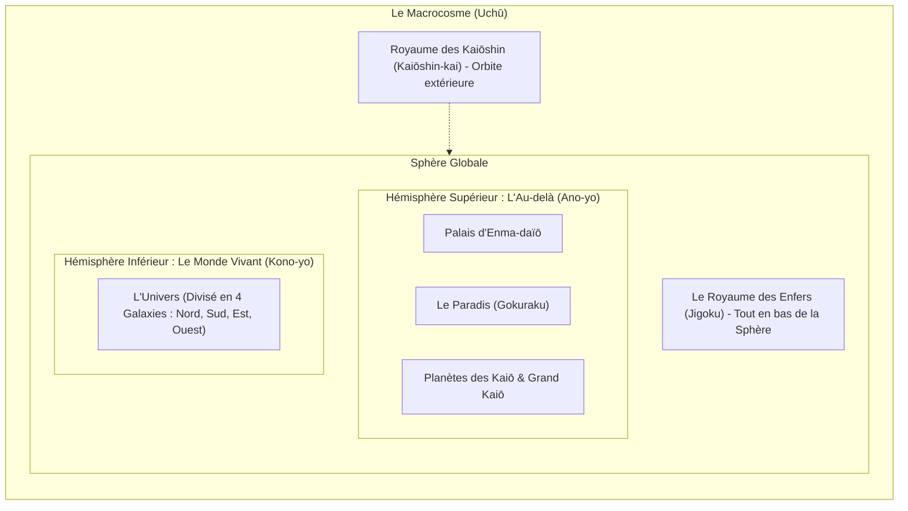

# Cosmologie de Dragon Ball — Structure du Macrocosme & Au-delà (Daizenshuu 4 & 7)

Ce document détaille l'organisation de l'univers de Dragon Ball, appelée le **Macrocosme** (_Uchū_), d'après les guides officiels **Daizenshuu 4 : World Guide** et **Daizenshuu 7 : Dragon Ball Encyclopedia**. Ces informations sont cruciales pour comprendre la structure géographique et spirituelle dans laquelle évoluent les personnages.

---

## 🔮 Structure Globale du Macrocosme

Le macrocosme de Dragon Ball se présente sous la forme d'une **sphère géante** divisée en deux hémisphères principaux, entourée d'un vide dimensionnel, avec des royaumes spécifiques en dehors ou en orbite.

---

## 🌌 L'Au-delà (Ano-yo)

L'Au-delà (Ano-yo, le "Monde d'après") occupe l'**hémisphère supérieur** de la sphère du macrocosme. C'est un plan spirituel qui transcende les dimensions physiques du monde des vivants.

### 1. Le Palais de King Enma (_Enma-daïō no Yakata_)

- **Fonction :** C'est le centre administratif de l'Au-delà. Toutes les âmes des morts y transitent pour y être jugées par le roi Enma (_Enma-daïō_).
- **Le Dossier des Âmes :** Enma utilise un grand registre pour décider de la destination des âmes (Paradis ou Enfer) en fonction de leurs actions passées.
- **Lieux connexes :**
  - **L'Aéroport de l'Au-delà :** Permet aux âmes purifiées ou autorisées d'être transportées vers le Paradis.
  - **Le Chemin du Serpent (_Hebi no Michi_) :** Une route sinueuse de **1 million de kilomètres** de long partant du palais d'Enma et menant à la planète du Kaïo du Nord. C'est le seul moyen physique d'y accéder à pied (Goku mettra plusieurs mois pour le parcourir la première fois).

### 2. Le Paradis (_Gokuraku_)

- **Description :** Une planète gigantesque couverte de fleurs et de verdure, réservée aux âmes des personnes ayant accompli de bonnes actions.
- **Taille :** D'après le _Daizenshuu 4_, le Paradis est si vaste qu'il occupe une part prépondérante de la moitié supérieure du macrocosme, équivalant presque à la superficie de l'univers physique du dessous.

### 3. Les Enfers (_Jigoku_)

- **Description :** Situé tout en bas du macrocosme (en dessous du monde des vivants et sous le palais d'Enma), l'Enfer est le lieu de punition et de purification des âmes malveillantes.
- **Structure :** Il est composé de paysages chaotiques et désolés. C'est là que les âmes des méchants sont purifiées avant d'être réincarnées (sans leurs souvenirs).

### 4. Le Royaume céleste des Kaïo

- **Le Domaine des Kaïo :** Situé au-dessus du Paradis, il comprend les petites planètes des 4 Kaïo cardinaux (Nord, Sud, Est, Ouest) ainsi que la planète du Grand Kaïo (_Dai Kaïo-sei_), située au centre de ce plan.
- **La Planète du Kaïo du Nord :** Une minuscule planète à la gravité **10 fois supérieure** à celle de la Terre, où vit Kaïo du Nord avec Bubbles et Gregory. Elle fut détruite par l'autodestruction de Cell.

---

## 🌍 Le Monde Vivant (Kono-yo)

Le Monde Vivant (Kono-yo, le "Monde d'ici") occupe l'**hémisphère inférieur** du macrocosme.

- **L'Univers physique :** C'est l'espace infini contenant les étoiles et les planètes (dont la Terre et la planète Namek).
- **Les Quatre Galaxies :** L'univers est divisé administrativement par les Kaïo en 4 zones appelées galaxies (Galaxie du Nord, du Sud, de l'Est et de l'Ouest). Cette division est purement administrative pour la surveillance divine, l'espace physique étant continu.

---

## 👑 Le Royaume des Kaïoshin (Kaiōshin-kai)

- **Position :** Ce royaume sacré existe **complètement en dehors** de la sphère géante du macrocosme. Il orbite autour de celle-ci à la manière d'une lune.
- **Accès :** Seuls les Kaïoshin, leurs assistants ou les personnes invitées (grâce au déplacement instantané ou à la téléportation magique) peuvent y accéder.
- **Nature :** C'est un monde paisible, pur et stérile, préservé de toute influence mortelle, conçu pour que les Dieux de la Création observent le macrocosme.

---

## 💫 Dimensions & Débats Cosmiques

- **Le concept de "Transcendance dimensionnelle" :** Le _Daizenshuu 4_ indique que l'Au-delà est une dimension supérieure par rapport au monde physique des vivants, invisible et inaccessible pour les mortels sans intervention divine.
- **Royaume des Démons (_Makai_) :** Situé dans une dimension de poche ou un espace caché au bas de l'univers physique, gouverné par les Makaiō et Makaiōshin (les divinités déchues ou nées de fruits malveillants).
